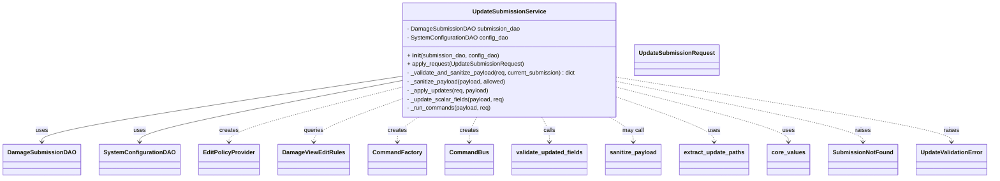

# Diagram: entity_core/entity_service/entity_service/damageview/submission/update_submission/service.py


> Auto-generated by Obscura crawlers

## Diagram 1



### SVG

<svg id="container" width="2595.578125" xmlns="http://www.w3.org/2000/svg" class="classDiagram" height="486" viewBox="0 0 2595.578125 486" role="graphics-document document" aria-roledescription="class"><style>#container{font-family:"trebuchet ms",verdana,arial,sans-serif;font-size:16px;fill:#333;}@keyframes edge-animation-frame{from{stroke-dashoffset:0;}}@keyframes dash{to{stroke-dashoffset:0;}}#container .edge-animation-slow{stroke-dasharray:9,5!important;stroke-dashoffset:900;animation:dash 50s linear infinite;stroke-linecap:round;}#container .edge-animation-fast{stroke-dasharray:9,5!important;stroke-dashoffset:900;animation:dash 20s linear infinite;stroke-linecap:round;}#container .error-icon{fill:#552222;}#container .error-text{fill:#552222;stroke:#552222;}#container .edge-thickness-normal{stroke-width:1px;}#container .edge-thickness-thick{stroke-width:3.5px;}#container .edge-pattern-solid{stroke-dasharray:0;}#container .edge-thickness-invisible{stroke-width:0;fill:none;}#container .edge-pattern-dashed{stroke-dasharray:3;}#container .edge-pattern-dotted{stroke-dasharray:2;}#container .marker{fill:#333333;stroke:#333333;}#container .marker.cross{stroke:#333333;}#container svg{font-family:"trebuchet ms",verdana,arial,sans-serif;font-size:16px;}#container p{margin:0;}#container g.classGroup text{fill:#9370DB;stroke:none;font-family:"trebuchet ms",verdana,arial,sans-serif;font-size:10px;}#container g.classGroup text .title{font-weight:bolder;}#container .nodeLabel,#container .edgeLabel{color:#131300;}#container .edgeLabel .label rect{fill:#ECECFF;}#container .label text{fill:#131300;}#container .labelBkg{background:#ECECFF;}#container .edgeLabel .label span{background:#ECECFF;}#container .classTitle{font-weight:bolder;}#container .node rect,#container .node circle,#container .node ellipse,#container .node polygon,#container .node path{fill:#ECECFF;stroke:#9370DB;stroke-width:1px;}#container .divider{stroke:#9370DB;stroke-width:1;}#container g.clickable{cursor:pointer;}#container g.classGroup rect{fill:#ECECFF;stroke:#9370DB;}#container g.classGroup line{stroke:#9370DB;stroke-width:1;}#container .classLabel .box{stroke:none;stroke-width:0;fill:#ECECFF;opacity:0.5;}#container .classLabel .label{fill:#9370DB;font-size:10px;}#container .relation{stroke:#333333;stroke-width:1;fill:none;}#container .dashed-line{stroke-dasharray:3;}#container .dotted-line{stroke-dasharray:1 2;}#container #compositionStart,#container .composition{fill:#333333!important;stroke:#333333!important;stroke-width:1;}#container #compositionEnd,#container .composition{fill:#333333!important;stroke:#333333!important;stroke-width:1;}#container #dependencyStart,#container .dependency{fill:#333333!important;stroke:#333333!important;stroke-width:1;}#container #dependencyStart,#container .dependency{fill:#333333!important;stroke:#333333!important;stroke-width:1;}#container #extensionStart,#container .extension{fill:transparent!important;stroke:#333333!important;stroke-width:1;}#container #extensionEnd,#container .extension{fill:transparent!important;stroke:#333333!important;stroke-width:1;}#container #aggregationStart,#container .aggregation{fill:transparent!important;stroke:#333333!important;stroke-width:1;}#container #aggregationEnd,#container .aggregation{fill:transparent!important;stroke:#333333!important;stroke-width:1;}#container #lollipopStart,#container .lollipop{fill:#ECECFF!important;stroke:#333333!important;stroke-width:1;}#container #lollipopEnd,#container .lollipop{fill:#ECECFF!important;stroke:#333333!important;stroke-width:1;}#container .edgeTerminals{font-size:11px;line-height:initial;}#container .classTitleText{text-anchor:middle;font-size:18px;fill:#333;}#container .label-icon{display:inline-block;height:1em;overflow:visible;vertical-align:-0.125em;}#container .node .label-icon path{fill:currentColor;stroke:revert;stroke-width:revert;}#container :root{--mermaid-font-family:"trebuchet ms",verdana,arial,sans-serif;}</style><g><defs><marker id="container_class-aggregationStart" class="marker aggregation class" refX="18" refY="7" markerWidth="190" markerHeight="240" orient="auto"><path d="M 18,7 L9,13 L1,7 L9,1 Z"></path></marker></defs><defs><marker id="container_class-aggregationEnd" class="marker aggregation class" refX="1" refY="7" markerWidth="20" markerHeight="28" orient="auto"><path d="M 18,7 L9,13 L1,7 L9,1 Z"></path></marker></defs><defs><marker id="container_class-extensionStart" class="marker extension class" refX="18" refY="7" markerWidth="190" markerHeight="240" orient="auto"><path d="M 1,7 L18,13 V 1 Z"></path></marker></defs><defs><marker id="container_class-extensionEnd" class="marker extension class" refX="1" refY="7" markerWidth="20" markerHeight="28" orient="auto"><path d="M 1,1 V 13 L18,7 Z"></path></marker></defs><defs><marker id="container_class-compositionStart" class="marker composition class" refX="18" refY="7" markerWidth="190" markerHeight="240" orient="auto"><path d="M 18,7 L9,13 L1,7 L9,1 Z"></path></marker></defs><defs><marker id="container_class-compositionEnd" class="marker composition class" refX="1" refY="7" markerWidth="20" markerHeight="28" orient="auto"><path d="M 18,7 L9,13 L1,7 L9,1 Z"></path></marker></defs><defs><marker id="container_class-dependencyStart" class="marker dependency class" refX="6" refY="7" markerWidth="190" markerHeight="240" orient="auto"><path d="M 5,7 L9,13 L1,7 L9,1 Z"></path></marker></defs><defs><marker id="container_class-dependencyEnd" class="marker dependency class" refX="13" refY="7" markerWidth="20" markerHeight="28" orient="auto"><path d="M 18,7 L9,13 L14,7 L9,1 Z"></path></marker></defs><defs><marker id="container_class-lollipopStart" class="marker lollipop class" refX="13" refY="7" markerWidth="190" markerHeight="240" orient="auto"><circle stroke="black" fill="transparent" cx="7" cy="7" r="6"></circle></marker></defs><defs><marker id="container_class-lollipopEnd" class="marker lollipop class" refX="1" refY="7" markerWidth="190" markerHeight="240" orient="auto"><circle stroke="black" fill="transparent" cx="7" cy="7" r="6"></circle></marker></defs><g class="root"><g class="clusters"></g><g class="edgePaths"><path d="M1030.016,210.527L876.128,234.939C722.24,259.352,414.464,308.176,260.576,337.755C106.688,367.333,106.688,377.667,106.688,382.833L106.688,388" id="id_UpdateSubmissionService_DamageSubmissionDAO_1" class="edge-thickness-normal edge-pattern-solid relation" style=";;;" data-edge="true" data-et="edge" data-id="id_UpdateSubmissionService_DamageSubmissionDAO_1" data-points="W3sieCI6MTAzMC4wMTU2MjUsInkiOjIxMC41MjczMTY4NjAxNjY0NX0seyJ4IjoxMDYuNjg3NSwieSI6MzU3fSx7IngiOjEwNi42ODc1LCJ5IjozOTR9XQ==" marker-end="url(#container_class-dependencyEnd)"></path><path d="M1030.016,222.676L918.112,245.064C806.208,267.451,582.401,312.225,470.497,339.779C358.594,367.333,358.594,377.667,358.594,382.833L358.594,388" id="id_UpdateSubmissionService_SystemConfigurationDAO_2" class="edge-thickness-normal edge-pattern-solid relation" style=";;;" data-edge="true" data-et="edge" data-id="id_UpdateSubmissionService_SystemConfigurationDAO_2" data-points="W3sieCI6MTAzMC4wMTU2MjUsInkiOjIyMi42NzY0NzYzMDQ2MjI0N30seyJ4IjozNTguNTkzNzUsInkiOjM1N30seyJ4IjozNTguNTkzNzUsInkiOjM5NH1d" marker-end="url(#container_class-dependencyEnd)"></path><path d="M1030.016,241.282L956.822,260.569C883.628,279.855,737.24,318.427,664.046,342.88C590.852,367.333,590.852,377.667,590.852,382.833L590.852,388" id="id_UpdateSubmissionService_EditPolicyProvider_3" class="edge-thickness-normal edge-pattern-dashed relation" style=";;;" data-edge="true" data-et="edge" data-id="id_UpdateSubmissionService_EditPolicyProvider_3" data-points="W3sieCI6MTAzMC4wMTU2MjUsInkiOjI0MS4yODIzNDIyNzUwNzg2Nn0seyJ4Ijo1OTAuODUxNTYyNSwieSI6MzU3fSx7IngiOjU5MC44NTE1NjI1LCJ5IjozOTR9XQ==" marker-end="url(#container_class-dependencyEnd)"></path><path d="M1030.016,274.852L993.79,288.543C957.565,302.235,885.115,329.617,848.889,348.475C812.664,367.333,812.664,377.667,812.664,382.833L812.664,388" id="id_UpdateSubmissionService_DamageViewEditRules_4" class="edge-thickness-normal edge-pattern-dashed relation" style=";;;" data-edge="true" data-et="edge" data-id="id_UpdateSubmissionService_DamageViewEditRules_4" data-points="W3sieCI6MTAzMC4wMTU2MjUsInkiOjI3NC44NTE3OTY4ODgxNDc3Nn0seyJ4Ijo4MTIuNjY0MDYyNSwieSI6MzU3fSx7IngiOjgxMi42NjQwNjI1LCJ5IjozOTR9XQ==" marker-end="url(#container_class-dependencyEnd)"></path><path d="M1086.616,320L1077.26,326.167C1067.903,332.333,1049.19,344.667,1039.833,356C1030.477,367.333,1030.477,377.667,1030.477,382.833L1030.477,388" id="id_UpdateSubmissionService_CommandFactory_5" class="edge-thickness-normal edge-pattern-dashed relation" style=";;;" data-edge="true" data-et="edge" data-id="id_UpdateSubmissionService_CommandFactory_5" data-points="W3sieCI6MTA4Ni42MTYwOTQ1NTk1ODU1LCJ5IjozMjB9LHsieCI6MTAzMC40NzY1NjI1LCJ5IjozNTd9LHsieCI6MTAzMC40NzY1NjI1LCJ5IjozOTR9XQ==" marker-end="url(#container_class-dependencyEnd)"></path><path d="M1237.646,320L1234.26,326.167C1230.874,332.333,1224.101,344.667,1220.714,356C1217.328,367.333,1217.328,377.667,1217.328,382.833L1217.328,388" id="id_UpdateSubmissionService_CommandBus_6" class="edge-thickness-normal edge-pattern-dashed relation" style=";;;" data-edge="true" data-et="edge" data-id="id_UpdateSubmissionService_CommandBus_6" data-points="W3sieCI6MTIzNy42NDYzNzMwNTY5OTUsInkiOjMyMH0seyJ4IjoxMjE3LjMyODEyNSwieSI6MzU3fSx7IngiOjEyMTcuMzI4MTI1LCJ5IjozOTR9XQ==" marker-end="url(#container_class-dependencyEnd)"></path><path d="M1408.979,320L1412.365,326.167C1415.751,332.333,1422.524,344.667,1425.911,356C1429.297,367.333,1429.297,377.667,1429.297,382.833L1429.297,388" id="id_UpdateSubmissionService_validate_updated_fields_7" class="edge-thickness-normal edge-pattern-dashed relation" style=";;;" data-edge="true" data-et="edge" data-id="id_UpdateSubmissionService_validate_updated_fields_7" data-points="W3sieCI6MTQwOC45Nzg2MjY5NDMwMDUsInkiOjMyMH0seyJ4IjoxNDI5LjI5Njg3NSwieSI6MzU3fSx7IngiOjE0MjkuMjk2ODc1LCJ5IjozOTR9XQ==" marker-end="url(#container_class-dependencyEnd)"></path><path d="M1589.852,320L1600.389,326.167C1610.925,332.333,1631.998,344.667,1642.534,356C1653.07,367.333,1653.07,377.667,1653.07,382.833L1653.07,388" id="id_UpdateSubmissionService_sanitize_payload_8" class="edge-thickness-normal edge-pattern-dashed relation" style=";;;" data-edge="true" data-et="edge" data-id="id_UpdateSubmissionService_sanitize_payload_8" data-points="W3sieCI6MTU4OS44NTI0OTM1MjMzMTYsInkiOjMyMH0seyJ4IjoxNjUzLjA3MDMxMjUsInkiOjM1N30seyJ4IjoxNjUzLjA3MDMxMjUsInkiOjM5NH1d" marker-end="url(#container_class-dependencyEnd)"></path><path d="M1616.609,267.741L1658.668,282.618C1700.727,297.494,1784.844,327.247,1826.902,347.29C1868.961,367.333,1868.961,377.667,1868.961,382.833L1868.961,388" id="id_UpdateSubmissionService_extract_update_paths_9" class="edge-thickness-normal edge-pattern-dashed relation" style=";;;" data-edge="true" data-et="edge" data-id="id_UpdateSubmissionService_extract_update_paths_9" data-points="W3sieCI6MTYxNi42MDkzNzUsInkiOjI2Ny43NDEzMzQxMzUxMzE2NH0seyJ4IjoxODY4Ljk2MDkzNzUsInkiOjM1N30seyJ4IjoxODY4Ljk2MDkzNzUsInkiOjM5NH1d" marker-end="url(#container_class-dependencyEnd)"></path><path d="M1616.609,240.199L1691.539,259.666C1766.469,279.133,1916.328,318.066,1991.258,342.7C2066.188,367.333,2066.188,377.667,2066.188,382.833L2066.188,388" id="id_UpdateSubmissionService_core_values_10" class="edge-thickness-normal edge-pattern-dashed relation" style=";;;" data-edge="true" data-et="edge" data-id="id_UpdateSubmissionService_core_values_10" data-points="W3sieCI6MTYxNi42MDkzNzUsInkiOjI0MC4xOTg5NTI1NDkyMTc1NX0seyJ4IjoyMDY2LjE4NzUsInkiOjM1N30seyJ4IjoyMDY2LjE4NzUsInkiOjM5NH1d" marker-end="url(#container_class-dependencyEnd)"></path><path d="M1616.609,224.391L1723.949,246.492C1831.289,268.594,2045.969,312.797,2153.309,340.065C2260.648,367.333,2260.648,377.667,2260.648,382.833L2260.648,388" id="id_UpdateSubmissionService_SubmissionNotFound_11" class="edge-thickness-normal edge-pattern-dashed relation" style=";;;" data-edge="true" data-et="edge" data-id="id_UpdateSubmissionService_SubmissionNotFound_11" data-points="W3sieCI6MTYxNi42MDkzNzUsInkiOjIyNC4zOTA2MTgzNTgyMTI3fSx7IngiOjIyNjAuNjQ4NDM3NSwieSI6MzU3fSx7IngiOjIyNjAuNjQ4NDM3NSwieSI6Mzk0fV0=" marker-end="url(#container_class-dependencyEnd)"></path><path d="M1616.609,212.359L1762.819,236.465C1909.029,260.572,2201.448,308.786,2347.658,338.06C2493.867,367.333,2493.867,377.667,2493.867,382.833L2493.867,388" id="id_UpdateSubmissionService_UpdateValidationError_12" class="edge-thickness-normal edge-pattern-dashed relation" style=";;;" data-edge="true" data-et="edge" data-id="id_UpdateSubmissionService_UpdateValidationError_12" data-points="W3sieCI6MTYxNi42MDkzNzUsInkiOjIxMi4zNTg1MjM5MzY5Njl9LHsieCI6MjQ5My44NjcxODc1LCJ5IjozNTd9LHsieCI6MjQ5My44NjcxODc1LCJ5IjozOTR9XQ==" marker-end="url(#container_class-dependencyEnd)"></path></g><g class="edgeLabels"><g class="edgeLabel" transform="translate(106.6875, 357)"><g class="label" data-id="id_UpdateSubmissionService_DamageSubmissionDAO_1" transform="translate(-16.4921875, -12)"><foreignObject width="32.984375" height="24"><div xmlns="http://www.w3.org/1999/xhtml" class="labelBkg" style="display: table-cell; white-space: nowrap; line-height: 1.5; max-width: 200px; text-align: center;"><span class="edgeLabel"><p>uses</p></span></div></foreignObject></g></g><g class="edgeLabel" transform="translate(358.59375, 357)"><g class="label" data-id="id_UpdateSubmissionService_SystemConfigurationDAO_2" transform="translate(-16.4921875, -12)"><foreignObject width="32.984375" height="24"><div xmlns="http://www.w3.org/1999/xhtml" class="labelBkg" style="display: table-cell; white-space: nowrap; line-height: 1.5; max-width: 200px; text-align: center;"><span class="edgeLabel"><p>uses</p></span></div></foreignObject></g></g><g class="edgeLabel" transform="translate(590.8515625, 357)"><g class="label" data-id="id_UpdateSubmissionService_EditPolicyProvider_3" transform="translate(-26.171875, -12)"><foreignObject width="52.34375" height="24"><div xmlns="http://www.w3.org/1999/xhtml" class="labelBkg" style="display: table-cell; white-space: nowrap; line-height: 1.5; max-width: 200px; text-align: center;"><span class="edgeLabel"><p>creates</p></span></div></foreignObject></g></g><g class="edgeLabel" transform="translate(812.6640625, 357)"><g class="label" data-id="id_UpdateSubmissionService_DamageViewEditRules_4" transform="translate(-27.2421875, -12)"><foreignObject width="54.484375" height="24"><div xmlns="http://www.w3.org/1999/xhtml" class="labelBkg" style="display: table-cell; white-space: nowrap; line-height: 1.5; max-width: 200px; text-align: center;"><span class="edgeLabel"><p>queries</p></span></div></foreignObject></g></g><g class="edgeLabel" transform="translate(1030.4765625, 357)"><g class="label" data-id="id_UpdateSubmissionService_CommandFactory_5" transform="translate(-26.171875, -12)"><foreignObject width="52.34375" height="24"><div xmlns="http://www.w3.org/1999/xhtml" class="labelBkg" style="display: table-cell; white-space: nowrap; line-height: 1.5; max-width: 200px; text-align: center;"><span class="edgeLabel"><p>creates</p></span></div></foreignObject></g></g><g class="edgeLabel" transform="translate(1217.328125, 357)"><g class="label" data-id="id_UpdateSubmissionService_CommandBus_6" transform="translate(-26.171875, -12)"><foreignObject width="52.34375" height="24"><div xmlns="http://www.w3.org/1999/xhtml" class="labelBkg" style="display: table-cell; white-space: nowrap; line-height: 1.5; max-width: 200px; text-align: center;"><span class="edgeLabel"><p>creates</p></span></div></foreignObject></g></g><g class="edgeLabel" transform="translate(1429.296875, 357)"><g class="label" data-id="id_UpdateSubmissionService_validate_updated_fields_7" transform="translate(-16.4453125, -12)"><foreignObject width="32.890625" height="24"><div xmlns="http://www.w3.org/1999/xhtml" class="labelBkg" style="display: table-cell; white-space: nowrap; line-height: 1.5; max-width: 200px; text-align: center;"><span class="edgeLabel"><p>calls</p></span></div></foreignObject></g></g><g class="edgeLabel" transform="translate(1653.0703125, 357)"><g class="label" data-id="id_UpdateSubmissionService_sanitize_payload_8" transform="translate(-29.8515625, -12)"><foreignObject width="59.703125" height="24"><div xmlns="http://www.w3.org/1999/xhtml" class="labelBkg" style="display: table-cell; white-space: nowrap; line-height: 1.5; max-width: 200px; text-align: center;"><span class="edgeLabel"><p>may call</p></span></div></foreignObject></g></g><g class="edgeLabel" transform="translate(1868.9609375, 357)"><g class="label" data-id="id_UpdateSubmissionService_extract_update_paths_9" transform="translate(-16.4921875, -12)"><foreignObject width="32.984375" height="24"><div xmlns="http://www.w3.org/1999/xhtml" class="labelBkg" style="display: table-cell; white-space: nowrap; line-height: 1.5; max-width: 200px; text-align: center;"><span class="edgeLabel"><p>uses</p></span></div></foreignObject></g></g><g class="edgeLabel" transform="translate(2066.1875, 357)"><g class="label" data-id="id_UpdateSubmissionService_core_values_10" transform="translate(-16.4921875, -12)"><foreignObject width="32.984375" height="24"><div xmlns="http://www.w3.org/1999/xhtml" class="labelBkg" style="display: table-cell; white-space: nowrap; line-height: 1.5; max-width: 200px; text-align: center;"><span class="edgeLabel"><p>uses</p></span></div></foreignObject></g></g><g class="edgeLabel" transform="translate(2260.6484375, 357)"><g class="label" data-id="id_UpdateSubmissionService_SubmissionNotFound_11" transform="translate(-21.25, -12)"><foreignObject width="42.5" height="24"><div xmlns="http://www.w3.org/1999/xhtml" class="labelBkg" style="display: table-cell; white-space: nowrap; line-height: 1.5; max-width: 200px; text-align: center;"><span class="edgeLabel"><p>raises</p></span></div></foreignObject></g></g><g class="edgeLabel" transform="translate(2493.8671875, 357)"><g class="label" data-id="id_UpdateSubmissionService_UpdateValidationError_12" transform="translate(-21.25, -12)"><foreignObject width="42.5" height="24"><div xmlns="http://www.w3.org/1999/xhtml" class="labelBkg" style="display: table-cell; white-space: nowrap; line-height: 1.5; max-width: 200px; text-align: center;"><span class="edgeLabel"><p>raises</p></span></div></foreignObject></g></g></g><g class="nodes"><g class="node default" id="classId-UpdateSubmissionService-0" transform="translate(1323.3125, 164)"><g class="basic label-container"><path d="M-293.296875 -156 L293.296875 -156 L293.296875 156 L-293.296875 156" stroke="none" stroke-width="0" fill="#ECECFF" style=""></path><path d="M-293.296875 -156 C-94.35606399935438 -156, 104.58474700129125 -156, 293.296875 -156 M-293.296875 -156 C-104.9930178858418 -156, 83.31083922831641 -156, 293.296875 -156 M293.296875 -156 C293.296875 -46.74554240796088, 293.296875 62.50891518407823, 293.296875 156 M293.296875 -156 C293.296875 -36.557269939310515, 293.296875 82.88546012137897, 293.296875 156 M293.296875 156 C81.31161874029829 156, -130.67363751940343 156, -293.296875 156 M293.296875 156 C61.73551217402078 156, -169.82585065195843 156, -293.296875 156 M-293.296875 156 C-293.296875 61.766351791535, -293.296875 -32.46729641693, -293.296875 -156 M-293.296875 156 C-293.296875 50.85900340420386, -293.296875 -54.28199319159228, -293.296875 -156" stroke="#9370DB" stroke-width="1.3" fill="none" stroke-dasharray="0 0" style=""></path></g><g class="annotation-group text" transform="translate(0, -132)"></g><g class="label-group text" transform="translate(-95.34375, -132)"><g class="label" style="font-weight: bolder" transform="translate(0,-12)"><foreignObject width="190.6875" height="24"><div xmlns="http://www.w3.org/1999/xhtml" style="display: table-cell; white-space: nowrap; line-height: 1.5; max-width: 238px; text-align: center;"><span class="nodeLabel markdown-node-label" style=""><p>UpdateSubmissionService</p></span></div></foreignObject></g></g><g class="members-group text" transform="translate(-281.296875, -84)"><g class="label" style="" transform="translate(0,-12)"><foreignObject width="304.96875" height="24"><div xmlns="http://www.w3.org/1999/xhtml" style="display: table-cell; white-space: nowrap; line-height: 1.5; max-width: 362px; text-align: center;"><span class="nodeLabel markdown-node-label" style=""><p>- DamageSubmissionDAO submission_dao</p></span></div></foreignObject></g><g class="label" style="" transform="translate(0,12)"><foreignObject width="273.53125" height="24"><div xmlns="http://www.w3.org/1999/xhtml" style="display: table-cell; white-space: nowrap; line-height: 1.5; max-width: 331px; text-align: center;"><span class="nodeLabel markdown-node-label" style=""><p>- SystemConfigurationDAO config_dao</p></span></div></foreignObject></g></g><g class="methods-group text" transform="translate(-281.296875, -12)"><g class="label" style="" transform="translate(0,-12)"><foreignObject width="252.359375" height="24"><div xmlns="http://www.w3.org/1999/xhtml" style="display: table-cell; white-space: nowrap; line-height: 1.5; max-width: 342px; text-align: center;"><span class="nodeLabel markdown-node-label" style=""><p>+ <strong>init</strong>(submission_dao, config_dao)</p></span></div></foreignObject></g><g class="label" style="" transform="translate(0,12)"><foreignObject width="321.21875" height="24"><div xmlns="http://www.w3.org/1999/xhtml" style="display: table-cell; white-space: nowrap; line-height: 1.5; max-width: 379px; text-align: center;"><span class="nodeLabel markdown-node-label" style=""><p>+ apply_request(UpdateSubmissionRequest)</p></span></div></foreignObject></g><g class="label" style="" transform="translate(0,36)"><foreignObject width="467.25" height="24"><div xmlns="http://www.w3.org/1999/xhtml" style="display: table-cell; white-space: nowrap; line-height: 1.5; max-width: 525px; text-align: center;"><span class="nodeLabel markdown-node-label" style=""><p>- _validate_and_sanitize_payload(req, current_submission) : dict</p></span></div></foreignObject></g><g class="label" style="" transform="translate(0,60)"><foreignObject width="273.6875" height="24"><div xmlns="http://www.w3.org/1999/xhtml" style="display: table-cell; white-space: nowrap; line-height: 1.5; max-width: 331px; text-align: center;"><span class="nodeLabel markdown-node-label" style=""><p>- _sanitize_payload(payload, allowed)</p></span></div></foreignObject></g><g class="label" style="" transform="translate(0,84)"><foreignObject width="225.3125" height="24"><div xmlns="http://www.w3.org/1999/xhtml" style="display: table-cell; white-space: nowrap; line-height: 1.5; max-width: 283px; text-align: center;"><span class="nodeLabel markdown-node-label" style=""><p>- _apply_updates(req, payload)</p></span></div></foreignObject></g><g class="label" style="" transform="translate(0,108)"><foreignObject width="267.5" height="24"><div xmlns="http://www.w3.org/1999/xhtml" style="display: table-cell; white-space: nowrap; line-height: 1.5; max-width: 325px; text-align: center;"><span class="nodeLabel markdown-node-label" style=""><p>- _update_scalar_fields(payload, req)</p></span></div></foreignObject></g><g class="label" style="" transform="translate(0,132)"><foreignObject width="231.265625" height="24"><div xmlns="http://www.w3.org/1999/xhtml" style="display: table-cell; white-space: nowrap; line-height: 1.5; max-width: 289px; text-align: center;"><span class="nodeLabel markdown-node-label" style=""><p>- _run_commands(payload, req)</p></span></div></foreignObject></g></g><g class="divider" style=""><path d="M-293.296875 -108 C-75.10444796162366 -108, 143.08797907675267 -108, 293.296875 -108 M-293.296875 -108 C-153.26613993143135 -108, -13.235404862862708 -108, 293.296875 -108" stroke="#9370DB" stroke-width="1.3" fill="none" stroke-dasharray="0 0" style=""></path></g><g class="divider" style=""><path d="M-293.296875 -36 C-140.52637008621247 -36, 12.244134827575067 -36, 293.296875 -36 M-293.296875 -36 C-132.52233890854208 -36, 28.252197182915836 -36, 293.296875 -36" stroke="#9370DB" stroke-width="1.3" fill="none" stroke-dasharray="0 0" style=""></path></g></g><g class="node default" id="classId-DamageSubmissionDAO-1" transform="translate(106.6875, 436)"><g class="basic label-container"><path d="M-98.6875 -42 L98.6875 -42 L98.6875 42 L-98.6875 42" stroke="none" stroke-width="0" fill="#ECECFF" style=""></path><path d="M-98.6875 -42 C-30.608291102707668 -42, 37.470917794584665 -42, 98.6875 -42 M-98.6875 -42 C-46.30658092331735 -42, 6.074338153365304 -42, 98.6875 -42 M98.6875 -42 C98.6875 -24.648375504678995, 98.6875 -7.29675100935799, 98.6875 42 M98.6875 -42 C98.6875 -17.5583836972683, 98.6875 6.883232605463398, 98.6875 42 M98.6875 42 C49.22808202794662 42, -0.2313359441067604 42, -98.6875 42 M98.6875 42 C43.418240996678016 42, -11.851018006643969 42, -98.6875 42 M-98.6875 42 C-98.6875 19.79528933535324, -98.6875 -2.4094213292935223, -98.6875 -42 M-98.6875 42 C-98.6875 17.382760701733723, -98.6875 -7.234478596532554, -98.6875 -42" stroke="#9370DB" stroke-width="1.3" fill="none" stroke-dasharray="0 0" style=""></path></g><g class="annotation-group text" transform="translate(0, -18)"></g><g class="label-group text" transform="translate(-86.6875, -18)"><g class="label" style="font-weight: bolder" transform="translate(0,-12)"><foreignObject width="173.375" height="24"><div xmlns="http://www.w3.org/1999/xhtml" style="display: table-cell; white-space: nowrap; line-height: 1.5; max-width: 222px; text-align: center;"><span class="nodeLabel markdown-node-label" style=""><p>DamageSubmissionDAO</p></span></div></foreignObject></g></g><g class="members-group text" transform="translate(-86.6875, 30)"></g><g class="methods-group text" transform="translate(-86.6875, 60)"></g><g class="divider" style=""><path d="M-98.6875 6 C-21.54469162152128 6, 55.59811675695744 6, 98.6875 6 M-98.6875 6 C-51.82647617190876 6, -4.9654523438175175 6, 98.6875 6" stroke="#9370DB" stroke-width="1.3" fill="none" stroke-dasharray="0 0" style=""></path></g><g class="divider" style=""><path d="M-98.6875 24 C-26.504263186521413 24, 45.67897362695717 24, 98.6875 24 M-98.6875 24 C-56.413971686853465 24, -14.14044337370693 24, 98.6875 24" stroke="#9370DB" stroke-width="1.3" fill="none" stroke-dasharray="0 0" style=""></path></g></g><g class="node default" id="classId-SystemConfigurationDAO-2" transform="translate(358.59375, 436)"><g class="basic label-container"><path d="M-103.21875 -42 L103.21875 -42 L103.21875 42 L-103.21875 42" stroke="none" stroke-width="0" fill="#ECECFF" style=""></path><path d="M-103.21875 -42 C-32.758251626764576 -42, 37.70224674647085 -42, 103.21875 -42 M-103.21875 -42 C-40.10726620935003 -42, 23.00421758129994 -42, 103.21875 -42 M103.21875 -42 C103.21875 -21.439765477119494, 103.21875 -0.8795309542389873, 103.21875 42 M103.21875 -42 C103.21875 -13.424503672985324, 103.21875 15.150992654029352, 103.21875 42 M103.21875 42 C58.37579555367946 42, 13.53284110735892 42, -103.21875 42 M103.21875 42 C61.029817692428736 42, 18.840885384857472 42, -103.21875 42 M-103.21875 42 C-103.21875 20.9211249009889, -103.21875 -0.15775019802219958, -103.21875 -42 M-103.21875 42 C-103.21875 23.306729846238106, -103.21875 4.613459692476212, -103.21875 -42" stroke="#9370DB" stroke-width="1.3" fill="none" stroke-dasharray="0 0" style=""></path></g><g class="annotation-group text" transform="translate(0, -18)"></g><g class="label-group text" transform="translate(-91.21875, -18)"><g class="label" style="font-weight: bolder" transform="translate(0,-12)"><foreignObject width="182.4375" height="24"><div xmlns="http://www.w3.org/1999/xhtml" style="display: table-cell; white-space: nowrap; line-height: 1.5; max-width: 229px; text-align: center;"><span class="nodeLabel markdown-node-label" style=""><p>SystemConfigurationDAO</p></span></div></foreignObject></g></g><g class="members-group text" transform="translate(-91.21875, 30)"></g><g class="methods-group text" transform="translate(-91.21875, 60)"></g><g class="divider" style=""><path d="M-103.21875 6 C-53.29453517353963 6, -3.3703203470792573 6, 103.21875 6 M-103.21875 6 C-59.672575845766595 6, -16.12640169153319 6, 103.21875 6" stroke="#9370DB" stroke-width="1.3" fill="none" stroke-dasharray="0 0" style=""></path></g><g class="divider" style=""><path d="M-103.21875 24 C-33.25650781081187 24, 36.70573437837626 24, 103.21875 24 M-103.21875 24 C-43.401412211968115 24, 16.41592557606377 24, 103.21875 24" stroke="#9370DB" stroke-width="1.3" fill="none" stroke-dasharray="0 0" style=""></path></g></g><g class="node default" id="classId-EditPolicyProvider-3" transform="translate(590.8515625, 436)"><g class="basic label-container"><path d="M-79.0390625 -42 L79.0390625 -42 L79.0390625 42 L-79.0390625 42" stroke="none" stroke-width="0" fill="#ECECFF" style=""></path><path d="M-79.0390625 -42 C-24.57547139538015 -42, 29.888119709239703 -42, 79.0390625 -42 M-79.0390625 -42 C-26.51883941988668 -42, 26.001383660226637 -42, 79.0390625 -42 M79.0390625 -42 C79.0390625 -12.604186327773768, 79.0390625 16.791627344452465, 79.0390625 42 M79.0390625 -42 C79.0390625 -9.54237815679781, 79.0390625 22.91524368640438, 79.0390625 42 M79.0390625 42 C39.21618568994839 42, -0.6066911201032212 42, -79.0390625 42 M79.0390625 42 C19.444409510387366 42, -40.15024347922527 42, -79.0390625 42 M-79.0390625 42 C-79.0390625 14.016128028036949, -79.0390625 -13.967743943926102, -79.0390625 -42 M-79.0390625 42 C-79.0390625 20.70649411719602, -79.0390625 -0.5870117656079614, -79.0390625 -42" stroke="#9370DB" stroke-width="1.3" fill="none" stroke-dasharray="0 0" style=""></path></g><g class="annotation-group text" transform="translate(0, -18)"></g><g class="label-group text" transform="translate(-67.0390625, -18)"><g class="label" style="font-weight: bolder" transform="translate(0,-12)"><foreignObject width="134.078125" height="24"><div xmlns="http://www.w3.org/1999/xhtml" style="display: table-cell; white-space: nowrap; line-height: 1.5; max-width: 183px; text-align: center;"><span class="nodeLabel markdown-node-label" style=""><p>EditPolicyProvider</p></span></div></foreignObject></g></g><g class="members-group text" transform="translate(-67.0390625, 30)"></g><g class="methods-group text" transform="translate(-67.0390625, 60)"></g><g class="divider" style=""><path d="M-79.0390625 6 C-21.51682078813976 6, 36.00542092372048 6, 79.0390625 6 M-79.0390625 6 C-38.018552811204906 6, 3.001956877590189 6, 79.0390625 6" stroke="#9370DB" stroke-width="1.3" fill="none" stroke-dasharray="0 0" style=""></path></g><g class="divider" style=""><path d="M-79.0390625 24 C-40.48384271095472 24, -1.9286229219094366 24, 79.0390625 24 M-79.0390625 24 C-31.12432054963127 24, 16.790421400737458 24, 79.0390625 24" stroke="#9370DB" stroke-width="1.3" fill="none" stroke-dasharray="0 0" style=""></path></g></g><g class="node default" id="classId-DamageViewEditRules-4" transform="translate(812.6640625, 436)"><g class="basic label-container"><path d="M-92.7734375 -42 L92.7734375 -42 L92.7734375 42 L-92.7734375 42" stroke="none" stroke-width="0" fill="#ECECFF" style=""></path><path d="M-92.7734375 -42 C-31.485287680628872 -42, 29.802862138742256 -42, 92.7734375 -42 M-92.7734375 -42 C-22.99860785245204 -42, 46.77622179509592 -42, 92.7734375 -42 M92.7734375 -42 C92.7734375 -20.850073272864147, 92.7734375 0.2998534542717053, 92.7734375 42 M92.7734375 -42 C92.7734375 -17.926491228642607, 92.7734375 6.147017542714785, 92.7734375 42 M92.7734375 42 C37.46649947946791 42, -17.840438541064174 42, -92.7734375 42 M92.7734375 42 C40.229834818871126 42, -12.313767862257748 42, -92.7734375 42 M-92.7734375 42 C-92.7734375 13.18390125121735, -92.7734375 -15.6321974975653, -92.7734375 -42 M-92.7734375 42 C-92.7734375 12.231156955737106, -92.7734375 -17.53768608852579, -92.7734375 -42" stroke="#9370DB" stroke-width="1.3" fill="none" stroke-dasharray="0 0" style=""></path></g><g class="annotation-group text" transform="translate(0, -18)"></g><g class="label-group text" transform="translate(-80.7734375, -18)"><g class="label" style="font-weight: bolder" transform="translate(0,-12)"><foreignObject width="161.546875" height="24"><div xmlns="http://www.w3.org/1999/xhtml" style="display: table-cell; white-space: nowrap; line-height: 1.5; max-width: 209px; text-align: center;"><span class="nodeLabel markdown-node-label" style=""><p>DamageViewEditRules</p></span></div></foreignObject></g></g><g class="members-group text" transform="translate(-80.7734375, 30)"></g><g class="methods-group text" transform="translate(-80.7734375, 60)"></g><g class="divider" style=""><path d="M-92.7734375 6 C-55.25095461207914 6, -17.728471724158283 6, 92.7734375 6 M-92.7734375 6 C-30.521786769525804 6, 31.729863960948393 6, 92.7734375 6" stroke="#9370DB" stroke-width="1.3" fill="none" stroke-dasharray="0 0" style=""></path></g><g class="divider" style=""><path d="M-92.7734375 24 C-26.32960635970042 24, 40.11422478059916 24, 92.7734375 24 M-92.7734375 24 C-27.56854647879652 24, 37.63634454240696 24, 92.7734375 24" stroke="#9370DB" stroke-width="1.3" fill="none" stroke-dasharray="0 0" style=""></path></g></g><g class="node default" id="classId-CommandFactory-5" transform="translate(1030.4765625, 436)"><g class="basic label-container"><path d="M-75.0390625 -42 L75.0390625 -42 L75.0390625 42 L-75.0390625 42" stroke="none" stroke-width="0" fill="#ECECFF" style=""></path><path d="M-75.0390625 -42 C-23.643162381901924 -42, 27.752737736196153 -42, 75.0390625 -42 M-75.0390625 -42 C-39.414559624872496 -42, -3.7900567497449913 -42, 75.0390625 -42 M75.0390625 -42 C75.0390625 -9.181627243750441, 75.0390625 23.636745512499118, 75.0390625 42 M75.0390625 -42 C75.0390625 -13.866467434287273, 75.0390625 14.267065131425454, 75.0390625 42 M75.0390625 42 C29.93269432849648 42, -15.173673843007037 42, -75.0390625 42 M75.0390625 42 C20.442779491365044 42, -34.15350351726991 42, -75.0390625 42 M-75.0390625 42 C-75.0390625 22.24733732455879, -75.0390625 2.4946746491175773, -75.0390625 -42 M-75.0390625 42 C-75.0390625 15.112432803161798, -75.0390625 -11.775134393676403, -75.0390625 -42" stroke="#9370DB" stroke-width="1.3" fill="none" stroke-dasharray="0 0" style=""></path></g><g class="annotation-group text" transform="translate(0, -18)"></g><g class="label-group text" transform="translate(-63.0390625, -18)"><g class="label" style="font-weight: bolder" transform="translate(0,-12)"><foreignObject width="126.078125" height="24"><div xmlns="http://www.w3.org/1999/xhtml" style="display: table-cell; white-space: nowrap; line-height: 1.5; max-width: 175px; text-align: center;"><span class="nodeLabel markdown-node-label" style=""><p>CommandFactory</p></span></div></foreignObject></g></g><g class="members-group text" transform="translate(-63.0390625, 30)"></g><g class="methods-group text" transform="translate(-63.0390625, 60)"></g><g class="divider" style=""><path d="M-75.0390625 6 C-40.69923253799927 6, -6.359402575998544 6, 75.0390625 6 M-75.0390625 6 C-39.58709746533023 6, -4.135132430660462 6, 75.0390625 6" stroke="#9370DB" stroke-width="1.3" fill="none" stroke-dasharray="0 0" style=""></path></g><g class="divider" style=""><path d="M-75.0390625 24 C-22.896584335396177 24, 29.245893829207645 24, 75.0390625 24 M-75.0390625 24 C-34.90069557919969 24, 5.237671341600617 24, 75.0390625 24" stroke="#9370DB" stroke-width="1.3" fill="none" stroke-dasharray="0 0" style=""></path></g></g><g class="node default" id="classId-CommandBus-6" transform="translate(1217.328125, 436)"><g class="basic label-container"><path d="M-61.8125 -42 L61.8125 -42 L61.8125 42 L-61.8125 42" stroke="none" stroke-width="0" fill="#ECECFF" style=""></path><path d="M-61.8125 -42 C-27.26500345848377 -42, 7.282493083032463 -42, 61.8125 -42 M-61.8125 -42 C-19.408226631717596 -42, 22.996046736564807 -42, 61.8125 -42 M61.8125 -42 C61.8125 -24.708893498920588, 61.8125 -7.417786997841176, 61.8125 42 M61.8125 -42 C61.8125 -9.37222731746921, 61.8125 23.25554536506158, 61.8125 42 M61.8125 42 C32.855297853735635 42, 3.8980957074712705 42, -61.8125 42 M61.8125 42 C29.48723433379628 42, -2.8380313324074393 42, -61.8125 42 M-61.8125 42 C-61.8125 12.45096641990322, -61.8125 -17.09806716019356, -61.8125 -42 M-61.8125 42 C-61.8125 10.448585050721434, -61.8125 -21.102829898557133, -61.8125 -42" stroke="#9370DB" stroke-width="1.3" fill="none" stroke-dasharray="0 0" style=""></path></g><g class="annotation-group text" transform="translate(0, -18)"></g><g class="label-group text" transform="translate(-49.8125, -18)"><g class="label" style="font-weight: bolder" transform="translate(0,-12)"><foreignObject width="99.625" height="24"><div xmlns="http://www.w3.org/1999/xhtml" style="display: table-cell; white-space: nowrap; line-height: 1.5; max-width: 150px; text-align: center;"><span class="nodeLabel markdown-node-label" style=""><p>CommandBus</p></span></div></foreignObject></g></g><g class="members-group text" transform="translate(-49.8125, 30)"></g><g class="methods-group text" transform="translate(-49.8125, 60)"></g><g class="divider" style=""><path d="M-61.8125 6 C-17.834726317852123 6, 26.143047364295754 6, 61.8125 6 M-61.8125 6 C-35.91939140131195 6, -10.026282802623896 6, 61.8125 6" stroke="#9370DB" stroke-width="1.3" fill="none" stroke-dasharray="0 0" style=""></path></g><g class="divider" style=""><path d="M-61.8125 24 C-19.13467924373567 24, 23.543141512528663 24, 61.8125 24 M-61.8125 24 C-21.896609298937328 24, 18.019281402125344 24, 61.8125 24" stroke="#9370DB" stroke-width="1.3" fill="none" stroke-dasharray="0 0" style=""></path></g></g><g class="node default" id="classId-UpdateSubmissionRequest-7" transform="translate(1777.28125, 164)"><g class="basic label-container"><path d="M-110.671875 -42 L110.671875 -42 L110.671875 42 L-110.671875 42" stroke="none" stroke-width="0" fill="#ECECFF" style=""></path><path d="M-110.671875 -42 C-41.7857708847621 -42, 27.100333230475798 -42, 110.671875 -42 M-110.671875 -42 C-40.86201355393692 -42, 28.947847892126163 -42, 110.671875 -42 M110.671875 -42 C110.671875 -17.730785793600724, 110.671875 6.538428412798552, 110.671875 42 M110.671875 -42 C110.671875 -9.239554289600392, 110.671875 23.520891420799217, 110.671875 42 M110.671875 42 C43.82872477653939 42, -23.014425446921223 42, -110.671875 42 M110.671875 42 C22.46290763921192 42, -65.74605972157616 42, -110.671875 42 M-110.671875 42 C-110.671875 16.80327472267229, -110.671875 -8.393450554655423, -110.671875 -42 M-110.671875 42 C-110.671875 13.131025829795945, -110.671875 -15.73794834040811, -110.671875 -42" stroke="#9370DB" stroke-width="1.3" fill="none" stroke-dasharray="0 0" style=""></path></g><g class="annotation-group text" transform="translate(0, -18)"></g><g class="label-group text" transform="translate(-98.671875, -18)"><g class="label" style="font-weight: bolder" transform="translate(0,-12)"><foreignObject width="197.34375" height="24"><div xmlns="http://www.w3.org/1999/xhtml" style="display: table-cell; white-space: nowrap; line-height: 1.5; max-width: 246px; text-align: center;"><span class="nodeLabel markdown-node-label" style=""><p>UpdateSubmissionRequest</p></span></div></foreignObject></g></g><g class="members-group text" transform="translate(-98.671875, 30)"></g><g class="methods-group text" transform="translate(-98.671875, 60)"></g><g class="divider" style=""><path d="M-110.671875 6 C-65.9469382685691 6, -21.222001537138198 6, 110.671875 6 M-110.671875 6 C-40.011968090600234 6, 30.64793881879953 6, 110.671875 6" stroke="#9370DB" stroke-width="1.3" fill="none" stroke-dasharray="0 0" style=""></path></g><g class="divider" style=""><path d="M-110.671875 24 C-49.03363717938789 24, 12.604600641224224 24, 110.671875 24 M-110.671875 24 C-56.29536038190571 24, -1.9188457638114187 24, 110.671875 24" stroke="#9370DB" stroke-width="1.3" fill="none" stroke-dasharray="0 0" style=""></path></g></g><g class="node default" id="classId-validate_updated_fields-8" transform="translate(1429.296875, 436)"><g class="basic label-container"><path d="M-100.15625 -42 L100.15625 -42 L100.15625 42 L-100.15625 42" stroke="none" stroke-width="0" fill="#ECECFF" style=""></path><path d="M-100.15625 -42 C-28.96219409012204 -42, 42.23186181975592 -42, 100.15625 -42 M-100.15625 -42 C-54.072872857693454 -42, -7.989495715386909 -42, 100.15625 -42 M100.15625 -42 C100.15625 -22.15033628034191, 100.15625 -2.3006725606838216, 100.15625 42 M100.15625 -42 C100.15625 -13.880673892374205, 100.15625 14.23865221525159, 100.15625 42 M100.15625 42 C35.3925666164908 42, -29.371116767018407 42, -100.15625 42 M100.15625 42 C24.690200492861678 42, -50.775849014276645 42, -100.15625 42 M-100.15625 42 C-100.15625 11.414221389631628, -100.15625 -19.171557220736744, -100.15625 -42 M-100.15625 42 C-100.15625 13.28162293491787, -100.15625 -15.43675413016426, -100.15625 -42" stroke="#9370DB" stroke-width="1.3" fill="none" stroke-dasharray="0 0" style=""></path></g><g class="annotation-group text" transform="translate(0, -18)"></g><g class="label-group text" transform="translate(-88.15625, -18)"><g class="label" style="font-weight: bolder" transform="translate(0,-12)"><foreignObject width="176.3125" height="24"><div xmlns="http://www.w3.org/1999/xhtml" style="display: table-cell; white-space: nowrap; line-height: 1.5; max-width: 224px; text-align: center;"><span class="nodeLabel markdown-node-label" style=""><p>validate_updated_fields</p></span></div></foreignObject></g></g><g class="members-group text" transform="translate(-88.15625, 30)"></g><g class="methods-group text" transform="translate(-88.15625, 60)"></g><g class="divider" style=""><path d="M-100.15625 6 C-52.643444786367475 6, -5.13063957273495 6, 100.15625 6 M-100.15625 6 C-46.78912239580984 6, 6.578005208380318 6, 100.15625 6" stroke="#9370DB" stroke-width="1.3" fill="none" stroke-dasharray="0 0" style=""></path></g><g class="divider" style=""><path d="M-100.15625 24 C-48.410884412000286 24, 3.3344811759994286 24, 100.15625 24 M-100.15625 24 C-33.5551846307264 24, 33.0458807385472 24, 100.15625 24" stroke="#9370DB" stroke-width="1.3" fill="none" stroke-dasharray="0 0" style=""></path></g></g><g class="node default" id="classId-sanitize_payload-9" transform="translate(1653.0703125, 436)"><g class="basic label-container"><path d="M-73.6171875 -42 L73.6171875 -42 L73.6171875 42 L-73.6171875 42" stroke="none" stroke-width="0" fill="#ECECFF" style=""></path><path d="M-73.6171875 -42 C-41.35361510129631 -42, -9.090042702592626 -42, 73.6171875 -42 M-73.6171875 -42 C-31.976732280272138 -42, 9.663722939455724 -42, 73.6171875 -42 M73.6171875 -42 C73.6171875 -14.116744333933532, 73.6171875 13.766511332132936, 73.6171875 42 M73.6171875 -42 C73.6171875 -12.71528153498198, 73.6171875 16.56943693003604, 73.6171875 42 M73.6171875 42 C21.210700289994485 42, -31.19578692001103 42, -73.6171875 42 M73.6171875 42 C33.6947116398135 42, -6.227764220373004 42, -73.6171875 42 M-73.6171875 42 C-73.6171875 12.83040983388521, -73.6171875 -16.33918033222958, -73.6171875 -42 M-73.6171875 42 C-73.6171875 19.872633799156816, -73.6171875 -2.2547324016863683, -73.6171875 -42" stroke="#9370DB" stroke-width="1.3" fill="none" stroke-dasharray="0 0" style=""></path></g><g class="annotation-group text" transform="translate(0, -18)"></g><g class="label-group text" transform="translate(-61.6171875, -18)"><g class="label" style="font-weight: bolder" transform="translate(0,-12)"><foreignObject width="123.234375" height="24"><div xmlns="http://www.w3.org/1999/xhtml" style="display: table-cell; white-space: nowrap; line-height: 1.5; max-width: 172px; text-align: center;"><span class="nodeLabel markdown-node-label" style=""><p>sanitize_payload</p></span></div></foreignObject></g></g><g class="members-group text" transform="translate(-61.6171875, 30)"></g><g class="methods-group text" transform="translate(-61.6171875, 60)"></g><g class="divider" style=""><path d="M-73.6171875 6 C-22.31876971653793 6, 28.979648066924142 6, 73.6171875 6 M-73.6171875 6 C-34.426043984902506 6, 4.765099530194988 6, 73.6171875 6" stroke="#9370DB" stroke-width="1.3" fill="none" stroke-dasharray="0 0" style=""></path></g><g class="divider" style=""><path d="M-73.6171875 24 C-21.21725551803719 24, 31.182676463925617 24, 73.6171875 24 M-73.6171875 24 C-38.49995966212833 24, -3.382731824256666 24, 73.6171875 24" stroke="#9370DB" stroke-width="1.3" fill="none" stroke-dasharray="0 0" style=""></path></g></g><g class="node default" id="classId-extract_update_paths-10" transform="translate(1868.9609375, 436)"><g class="basic label-container"><path d="M-92.2734375 -42 L92.2734375 -42 L92.2734375 42 L-92.2734375 42" stroke="none" stroke-width="0" fill="#ECECFF" style=""></path><path d="M-92.2734375 -42 C-35.94869043822802 -42, 20.37605662354396 -42, 92.2734375 -42 M-92.2734375 -42 C-33.57134696640277 -42, 25.130743567194457 -42, 92.2734375 -42 M92.2734375 -42 C92.2734375 -23.15980372209088, 92.2734375 -4.319607444181763, 92.2734375 42 M92.2734375 -42 C92.2734375 -18.53059966616022, 92.2734375 4.938800667679558, 92.2734375 42 M92.2734375 42 C43.98485126433702 42, -4.303734971325966 42, -92.2734375 42 M92.2734375 42 C34.33109758405212 42, -23.611242331895767 42, -92.2734375 42 M-92.2734375 42 C-92.2734375 19.834700200389257, -92.2734375 -2.330599599221486, -92.2734375 -42 M-92.2734375 42 C-92.2734375 23.843594963208297, -92.2734375 5.687189926416593, -92.2734375 -42" stroke="#9370DB" stroke-width="1.3" fill="none" stroke-dasharray="0 0" style=""></path></g><g class="annotation-group text" transform="translate(0, -18)"></g><g class="label-group text" transform="translate(-80.2734375, -18)"><g class="label" style="font-weight: bolder" transform="translate(0,-12)"><foreignObject width="160.546875" height="24"><div xmlns="http://www.w3.org/1999/xhtml" style="display: table-cell; white-space: nowrap; line-height: 1.5; max-width: 208px; text-align: center;"><span class="nodeLabel markdown-node-label" style=""><p>extract_update_paths</p></span></div></foreignObject></g></g><g class="members-group text" transform="translate(-80.2734375, 30)"></g><g class="methods-group text" transform="translate(-80.2734375, 60)"></g><g class="divider" style=""><path d="M-92.2734375 6 C-33.48924238470574 6, 25.29495273058852 6, 92.2734375 6 M-92.2734375 6 C-49.7863006626815 6, -7.299163825362996 6, 92.2734375 6" stroke="#9370DB" stroke-width="1.3" fill="none" stroke-dasharray="0 0" style=""></path></g><g class="divider" style=""><path d="M-92.2734375 24 C-54.938943893364424 24, -17.60445028672885 24, 92.2734375 24 M-92.2734375 24 C-45.394694507982926 24, 1.4840484840341475 24, 92.2734375 24" stroke="#9370DB" stroke-width="1.3" fill="none" stroke-dasharray="0 0" style=""></path></g></g><g class="node default" id="classId-core_values-11" transform="translate(2066.1875, 436)"><g class="basic label-container"><path d="M-54.953125 -42 L54.953125 -42 L54.953125 42 L-54.953125 42" stroke="none" stroke-width="0" fill="#ECECFF" style=""></path><path d="M-54.953125 -42 C-13.250421901267018 -42, 28.452281197465965 -42, 54.953125 -42 M-54.953125 -42 C-15.9594126507452 -42, 23.0342996985096 -42, 54.953125 -42 M54.953125 -42 C54.953125 -17.526533852105782, 54.953125 6.946932295788436, 54.953125 42 M54.953125 -42 C54.953125 -13.241360441063811, 54.953125 15.517279117872377, 54.953125 42 M54.953125 42 C20.36632368297728 42, -14.220477634045437 42, -54.953125 42 M54.953125 42 C29.390449435211387 42, 3.8277738704227744 42, -54.953125 42 M-54.953125 42 C-54.953125 20.170003821316236, -54.953125 -1.6599923573675284, -54.953125 -42 M-54.953125 42 C-54.953125 9.828643715388125, -54.953125 -22.34271256922375, -54.953125 -42" stroke="#9370DB" stroke-width="1.3" fill="none" stroke-dasharray="0 0" style=""></path></g><g class="annotation-group text" transform="translate(0, -18)"></g><g class="label-group text" transform="translate(-42.953125, -18)"><g class="label" style="font-weight: bolder" transform="translate(0,-12)"><foreignObject width="85.90625" height="24"><div xmlns="http://www.w3.org/1999/xhtml" style="display: table-cell; white-space: nowrap; line-height: 1.5; max-width: 135px; text-align: center;"><span class="nodeLabel markdown-node-label" style=""><p>core_values</p></span></div></foreignObject></g></g><g class="members-group text" transform="translate(-42.953125, 30)"></g><g class="methods-group text" transform="translate(-42.953125, 60)"></g><g class="divider" style=""><path d="M-54.953125 6 C-23.43896162152431 6, 8.07520175695138 6, 54.953125 6 M-54.953125 6 C-18.72646862730995 6, 17.500187745380103 6, 54.953125 6" stroke="#9370DB" stroke-width="1.3" fill="none" stroke-dasharray="0 0" style=""></path></g><g class="divider" style=""><path d="M-54.953125 24 C-28.45447873119015 24, -1.9558324623803003 24, 54.953125 24 M-54.953125 24 C-16.901199850875614 24, 21.150725298248773 24, 54.953125 24" stroke="#9370DB" stroke-width="1.3" fill="none" stroke-dasharray="0 0" style=""></path></g></g><g class="node default" id="classId-SubmissionNotFound-12" transform="translate(2260.6484375, 436)"><g class="basic label-container"><path d="M-89.5078125 -42 L89.5078125 -42 L89.5078125 42 L-89.5078125 42" stroke="none" stroke-width="0" fill="#ECECFF" style=""></path><path d="M-89.5078125 -42 C-35.573438400844 -42, 18.360935698312005 -42, 89.5078125 -42 M-89.5078125 -42 C-20.363518774704303 -42, 48.78077495059139 -42, 89.5078125 -42 M89.5078125 -42 C89.5078125 -20.929415258602003, 89.5078125 0.14116948279599484, 89.5078125 42 M89.5078125 -42 C89.5078125 -22.377730948180698, 89.5078125 -2.755461896361396, 89.5078125 42 M89.5078125 42 C31.528358495607435 42, -26.45109550878513 42, -89.5078125 42 M89.5078125 42 C52.12065846099294 42, 14.733504421985884 42, -89.5078125 42 M-89.5078125 42 C-89.5078125 22.436430244703537, -89.5078125 2.872860489407074, -89.5078125 -42 M-89.5078125 42 C-89.5078125 24.409174418465778, -89.5078125 6.8183488369315555, -89.5078125 -42" stroke="#9370DB" stroke-width="1.3" fill="none" stroke-dasharray="0 0" style=""></path></g><g class="annotation-group text" transform="translate(0, -18)"></g><g class="label-group text" transform="translate(-77.5078125, -18)"><g class="label" style="font-weight: bolder" transform="translate(0,-12)"><foreignObject width="155.015625" height="24"><div xmlns="http://www.w3.org/1999/xhtml" style="display: table-cell; white-space: nowrap; line-height: 1.5; max-width: 205px; text-align: center;"><span class="nodeLabel markdown-node-label" style=""><p>SubmissionNotFound</p></span></div></foreignObject></g></g><g class="members-group text" transform="translate(-77.5078125, 30)"></g><g class="methods-group text" transform="translate(-77.5078125, 60)"></g><g class="divider" style=""><path d="M-89.5078125 6 C-30.753595328478987 6, 28.000621843042026 6, 89.5078125 6 M-89.5078125 6 C-41.99300511709031 6, 5.521802265819375 6, 89.5078125 6" stroke="#9370DB" stroke-width="1.3" fill="none" stroke-dasharray="0 0" style=""></path></g><g class="divider" style=""><path d="M-89.5078125 24 C-36.985156451616625 24, 15.53749959676675 24, 89.5078125 24 M-89.5078125 24 C-43.19305383480251 24, 3.1217048303949753 24, 89.5078125 24" stroke="#9370DB" stroke-width="1.3" fill="none" stroke-dasharray="0 0" style=""></path></g></g><g class="node default" id="classId-UpdateValidationError-13" transform="translate(2493.8671875, 436)"><g class="basic label-container"><path d="M-93.7109375 -42 L93.7109375 -42 L93.7109375 42 L-93.7109375 42" stroke="none" stroke-width="0" fill="#ECECFF" style=""></path><path d="M-93.7109375 -42 C-35.34578661956039 -42, 23.019364260879215 -42, 93.7109375 -42 M-93.7109375 -42 C-27.44120209733134 -42, 38.82853330533732 -42, 93.7109375 -42 M93.7109375 -42 C93.7109375 -21.310978449752398, 93.7109375 -0.621956899504795, 93.7109375 42 M93.7109375 -42 C93.7109375 -16.366641104997626, 93.7109375 9.266717790004748, 93.7109375 42 M93.7109375 42 C23.695605048289337 42, -46.319727403421325 42, -93.7109375 42 M93.7109375 42 C38.18169382832986 42, -17.347549843340275 42, -93.7109375 42 M-93.7109375 42 C-93.7109375 18.436848856894084, -93.7109375 -5.126302286211832, -93.7109375 -42 M-93.7109375 42 C-93.7109375 15.208549008031014, -93.7109375 -11.582901983937973, -93.7109375 -42" stroke="#9370DB" stroke-width="1.3" fill="none" stroke-dasharray="0 0" style=""></path></g><g class="annotation-group text" transform="translate(0, -18)"></g><g class="label-group text" transform="translate(-81.7109375, -18)"><g class="label" style="font-weight: bolder" transform="translate(0,-12)"><foreignObject width="163.421875" height="24"><div xmlns="http://www.w3.org/1999/xhtml" style="display: table-cell; white-space: nowrap; line-height: 1.5; max-width: 213px; text-align: center;"><span class="nodeLabel markdown-node-label" style=""><p>UpdateValidationError</p></span></div></foreignObject></g></g><g class="members-group text" transform="translate(-81.7109375, 30)"></g><g class="methods-group text" transform="translate(-81.7109375, 60)"></g><g class="divider" style=""><path d="M-93.7109375 6 C-52.936900549595094 6, -12.162863599190189 6, 93.7109375 6 M-93.7109375 6 C-33.82092228154024 6, 26.069092936919517 6, 93.7109375 6" stroke="#9370DB" stroke-width="1.3" fill="none" stroke-dasharray="0 0" style=""></path></g><g class="divider" style=""><path d="M-93.7109375 24 C-45.22266776493765 24, 3.265601970124706 24, 93.7109375 24 M-93.7109375 24 C-48.47826174839699 24, -3.2455859967939773 24, 93.7109375 24" stroke="#9370DB" stroke-width="1.3" fill="none" stroke-dasharray="0 0" style=""></path></g></g></g></g></g></svg>

## Diagram 2

```mermaid
flowchart TD
Start([apply_request(req)]) --> GetSub[get current_submission = submission_dao.get_by_id(req.submission_id)]
GetSub -->|not found| RaiseNotFound{Submission missing}
RaiseNotFound --> NotFoundAction[/"raise SubmissionNotFound"/]
GetSub -->|found| ValidateCall[_validate_and_sanitize_payload(req, current_submission)_]

subgraph ValidatePayload ["_validate_and_sanitize_payload(req, current_submission)"]
  A1[status = (current_submission.status or "").lower()] --> A2[policy = EditPolicyProvider(DamageViewEditRules.for_solution(req.solution_id))]
  A2 --> A3[allowed = set(policy.allowed_paths_for(req.org_type, status))]
  A3 --> A4[payload = _sanitize_payload(req.payload, allowed)]
  A4 --> A5[touched = extract_update_paths(payload)]
  A5 --> A6[unknown = touched - allowed]
  A6 --> A7{unknown ?}
  A7 -->|yes| A8[/"raise UpdateValidationError(msg)"/]
  A7 -->|no| A9[payload returned]
end

ValidateCall -->|error in validation| RaiseValidation{Validation error}
RaiseValidation --> ValidationAction[/"raise UpdateValidationError"/]
ValidateCall -->|valid payload| ApplyUpdates[_apply_updates(req, payload)_]

ApplyUpdates --> UpdateScalars[_update_scalar_fields(payload, req)_]
UpdateScalars --> CheckScalars{core_values(payload) ?}
CheckScalars -->|no| SkipScalar[/return/]
CheckScalars -->|yes| PrepareParams[params = core_values + org_type,user_id,submission_id,solution_id]
PrepareParams --> ValidateFields[validate_updated_fields(params, config_dao)]
ValidateFields --> PersistScalars[submission_dao.update_scalar_fields(params)]

ApplyUpdates --> RunCommands[_run_commands(payload, req)_]
RunCommands --> CreateFactory[factory = CommandFactory(dao=submission_dao)]
CreateFactory --> CreateBus[bus = CommandBus(dao=submission_dao)]
CreateBus --> BuildCommands[commands = factory.build_from_payload(payload, req)]
BuildCommands --> HasCommands{commands ?}
HasCommands -->|yes| BusRun[bus.run(req, commands)]
HasCommands -->|no| EndNoCmds([End])
PersistScalars --> RunCommands
BusRun --> End([End])
SkipScalar --> RunCommands
```

> SVG rendering failed for this diagram.
