# Diagram: entity_core/entity_service/entity_service/damageview/submission/update_submission_details.py


> Auto-generated by Obscura crawlers

## Diagram 1

```mermaid
classDiagram
class LambdaHandler {
  +lambda_handler(event, context, audit_refs)
}
class Publish {
  +publish_damage_status_change(submission_id, solution_id, previous_status, current_status, status_change_ts)
}
class UpdateSubmissionRequest {
  +from_event(event, submission_id, solution_id, external_submission_id)
}
class SubmissionSnapshot
class CustomFieldsSnapshot
class CombinedSubmissionSnapshot {
  +from_snapshot_parts(core, custom)
  +to_dict()
}
class DamageSubmissionDAO {
  +get_by_id(id)
  +get_submission_snapshot(id)
  +get_custom_fields_snapshot(id)
}
class SubmissionHistoryEventDAO
class SystemConfigurationDAO
class UpdateSubmissionService {
  +apply_request(req)
}
class SubmissionHistoryEventLogger {
  +log_event(org_id, solution_id, actor_email, submission_id, event_type, before, after)
}
class EntityServiceCommon {
  +get_organization(event, org_id)
}
LambdaHandler --> DamageSubmissionDAO : uses
LambdaHandler --> UpdateSubmissionRequest : constructs
LambdaHandler --> SubmissionHistoryEventLogger : initializes
LambdaHandler --> CombinedSubmissionSnapshot : creates
LambdaHandler --> SubmissionSnapshot : reads before/after
LambdaHandler --> CustomFieldsSnapshot : reads before/after
LambdaHandler --> UpdateSubmissionService : invokes
LambdaHandler --> EntityServiceCommon : queries org
LambdaHandler --> Publish : may call
UpdateSubmissionService --> DamageSubmissionDAO : submission_dao
UpdateSubmissionService --> SystemConfigurationDAO : config_dao
SubmissionHistoryEventLogger --> SubmissionHistoryEventDAO : dao
CombinedSubmissionSnapshot o-- SubmissionSnapshot : composed_of
CombinedSubmissionSnapshot o-- CustomFieldsSnapshot : composed_of
```



### SVG

<svg id="container" width="4103.9609375" xmlns="http://www.w3.org/2000/svg" class="classDiagram" height="614" viewBox="0 0 4103.9609375 614" role="graphics-document document" aria-roledescription="class"><style>#container{font-family:"trebuchet ms",verdana,arial,sans-serif;font-size:16px;fill:#333;}@keyframes edge-animation-frame{from{stroke-dashoffset:0;}}@keyframes dash{to{stroke-dashoffset:0;}}#container .edge-animation-slow{stroke-dasharray:9,5!important;stroke-dashoffset:900;animation:dash 50s linear infinite;stroke-linecap:round;}#container .edge-animation-fast{stroke-dasharray:9,5!important;stroke-dashoffset:900;animation:dash 20s linear infinite;stroke-linecap:round;}#container .error-icon{fill:#552222;}#container .error-text{fill:#552222;stroke:#552222;}#container .edge-thickness-normal{stroke-width:1px;}#container .edge-thickness-thick{stroke-width:3.5px;}#container .edge-pattern-solid{stroke-dasharray:0;}#container .edge-thickness-invisible{stroke-width:0;fill:none;}#container .edge-pattern-dashed{stroke-dasharray:3;}#container .edge-pattern-dotted{stroke-dasharray:2;}#container .marker{fill:#333333;stroke:#333333;}#container .marker.cross{stroke:#333333;}#container svg{font-family:"trebuchet ms",verdana,arial,sans-serif;font-size:16px;}#container p{margin:0;}#container g.classGroup text{fill:#9370DB;stroke:none;font-family:"trebuchet ms",verdana,arial,sans-serif;font-size:10px;}#container g.classGroup text .title{font-weight:bolder;}#container .nodeLabel,#container .edgeLabel{color:#131300;}#container .edgeLabel .label rect{fill:#ECECFF;}#container .label text{fill:#131300;}#container .labelBkg{background:#ECECFF;}#container .edgeLabel .label span{background:#ECECFF;}#container .classTitle{font-weight:bolder;}#container .node rect,#container .node circle,#container .node ellipse,#container .node polygon,#container .node path{fill:#ECECFF;stroke:#9370DB;stroke-width:1px;}#container .divider{stroke:#9370DB;stroke-width:1;}#container g.clickable{cursor:pointer;}#container g.classGroup rect{fill:#ECECFF;stroke:#9370DB;}#container g.classGroup line{stroke:#9370DB;stroke-width:1;}#container .classLabel .box{stroke:none;stroke-width:0;fill:#ECECFF;opacity:0.5;}#container .classLabel .label{fill:#9370DB;font-size:10px;}#container .relation{stroke:#333333;stroke-width:1;fill:none;}#container .dashed-line{stroke-dasharray:3;}#container .dotted-line{stroke-dasharray:1 2;}#container #compositionStart,#container .composition{fill:#333333!important;stroke:#333333!important;stroke-width:1;}#container #compositionEnd,#container .composition{fill:#333333!important;stroke:#333333!important;stroke-width:1;}#container #dependencyStart,#container .dependency{fill:#333333!important;stroke:#333333!important;stroke-width:1;}#container #dependencyStart,#container .dependency{fill:#333333!important;stroke:#333333!important;stroke-width:1;}#container #extensionStart,#container .extension{fill:transparent!important;stroke:#333333!important;stroke-width:1;}#container #extensionEnd,#container .extension{fill:transparent!important;stroke:#333333!important;stroke-width:1;}#container #aggregationStart,#container .aggregation{fill:transparent!important;stroke:#333333!important;stroke-width:1;}#container #aggregationEnd,#container .aggregation{fill:transparent!important;stroke:#333333!important;stroke-width:1;}#container #lollipopStart,#container .lollipop{fill:#ECECFF!important;stroke:#333333!important;stroke-width:1;}#container #lollipopEnd,#container .lollipop{fill:#ECECFF!important;stroke:#333333!important;stroke-width:1;}#container .edgeTerminals{font-size:11px;line-height:initial;}#container .classTitleText{text-anchor:middle;font-size:18px;fill:#333;}#container .label-icon{display:inline-block;height:1em;overflow:visible;vertical-align:-0.125em;}#container .node .label-icon path{fill:currentColor;stroke:revert;stroke-width:revert;}#container :root{--mermaid-font-family:"trebuchet ms",verdana,arial,sans-serif;}</style><g><defs><marker id="container_class-aggregationStart" class="marker aggregation class" refX="18" refY="7" markerWidth="190" markerHeight="240" orient="auto"><path d="M 18,7 L9,13 L1,7 L9,1 Z"></path></marker></defs><defs><marker id="container_class-aggregationEnd" class="marker aggregation class" refX="1" refY="7" markerWidth="20" markerHeight="28" orient="auto"><path d="M 18,7 L9,13 L1,7 L9,1 Z"></path></marker></defs><defs><marker id="container_class-extensionStart" class="marker extension class" refX="18" refY="7" markerWidth="190" markerHeight="240" orient="auto"><path d="M 1,7 L18,13 V 1 Z"></path></marker></defs><defs><marker id="container_class-extensionEnd" class="marker extension class" refX="1" refY="7" markerWidth="20" markerHeight="28" orient="auto"><path d="M 1,1 V 13 L18,7 Z"></path></marker></defs><defs><marker id="container_class-compositionStart" class="marker composition class" refX="18" refY="7" markerWidth="190" markerHeight="240" orient="auto"><path d="M 18,7 L9,13 L1,7 L9,1 Z"></path></marker></defs><defs><marker id="container_class-compositionEnd" class="marker composition class" refX="1" refY="7" markerWidth="20" markerHeight="28" orient="auto"><path d="M 18,7 L9,13 L1,7 L9,1 Z"></path></marker></defs><defs><marker id="container_class-dependencyStart" class="marker dependency class" refX="6" refY="7" markerWidth="190" markerHeight="240" orient="auto"><path d="M 5,7 L9,13 L1,7 L9,1 Z"></path></marker></defs><defs><marker id="container_class-dependencyEnd" class="marker dependency class" refX="13" refY="7" markerWidth="20" markerHeight="28" orient="auto"><path d="M 18,7 L9,13 L14,7 L9,1 Z"></path></marker></defs><defs><marker id="container_class-lollipopStart" class="marker lollipop class" refX="13" refY="7" markerWidth="190" markerHeight="240" orient="auto"><circle stroke="black" fill="transparent" cx="7" cy="7" r="6"></circle></marker></defs><defs><marker id="container_class-lollipopEnd" class="marker lollipop class" refX="1" refY="7" markerWidth="190" markerHeight="240" orient="auto"><circle stroke="black" fill="transparent" cx="7" cy="7" r="6"></circle></marker></defs><g class="root"><g class="clusters"></g><g class="edgePaths"><path d="M2982.27,102.53L3055.364,113.941C3128.458,125.353,3274.647,148.177,3347.742,178.255C3420.836,208.333,3420.836,245.667,3420.836,283C3420.836,320.333,3420.836,357.667,3418.924,381.561C3417.011,405.455,3413.186,415.91,3411.274,421.138L3409.362,426.365" id="id_LambdaHandler_DamageSubmissionDAO_1" class="edge-thickness-normal edge-pattern-solid relation" style=";;;" data-edge="true" data-et="edge" data-id="id_LambdaHandler_DamageSubmissionDAO_1" data-points="W3sieCI6Mjk4Mi4yNjk1MzEyNSwieSI6MTAyLjUyOTU4MTA4OTU2OTYzfSx7IngiOjM0MjAuODM1OTM3NSwieSI6MTcxfSx7IngiOjM0MjAuODM1OTM3NSwieSI6MjgzfSx7IngiOjM0MjAuODM1OTM3NSwieSI6Mzk1fSx7IngiOjM0MDcuMzAwMTE5NzA3NjYxNSwieSI6NDMyfV0=" marker-end="url(#container_class-dependencyEnd)"></path><path d="M2578.363,84.174L2356.519,98.645C2134.674,113.116,1690.986,142.058,1469.141,163.696C1247.297,185.333,1247.297,199.667,1247.297,206.833L1247.297,214" id="id_LambdaHandler_UpdateSubmissionRequest_2" class="edge-thickness-normal edge-pattern-solid relation" style=";;;" data-edge="true" data-et="edge" data-id="id_LambdaHandler_UpdateSubmissionRequest_2" data-points="W3sieCI6MjU3OC4zNjMyODEyNSwieSI6ODQuMTczNTUxOTkyMjEzMDh9LHsieCI6MTI0Ny4yOTY4NzUsInkiOjE3MX0seyJ4IjoxMjQ3LjI5Njg3NSwieSI6MjIwfV0=" marker-end="url(#container_class-dependencyEnd)"></path><path d="M2578.363,96.825L2481.688,109.188C2385.013,121.55,2191.663,146.275,2094.988,165.804C1998.313,185.333,1998.313,199.667,1998.313,206.833L1998.313,214" id="id_LambdaHandler_SubmissionHistoryEventLogger_3" class="edge-thickness-normal edge-pattern-solid relation" style=";;;" data-edge="true" data-et="edge" data-id="id_LambdaHandler_SubmissionHistoryEventLogger_3" data-points="W3sieCI6MjU3OC4zNjMyODEyNSwieSI6OTYuODI1MDc4Nzk4OTU5fSx7IngiOjE5OTguMzEyNSwieSI6MTcxfSx7IngiOjE5OTguMzEyNSwieSI6MjIwfV0=" marker-end="url(#container_class-dependencyEnd)"></path><path d="M2780.316,134L2780.316,140.167C2780.316,146.333,2780.316,158.667,2780.316,170C2780.316,181.333,2780.316,191.667,2780.316,196.833L2780.316,202" id="id_LambdaHandler_CombinedSubmissionSnapshot_4" class="edge-thickness-normal edge-pattern-solid relation" style=";;;" data-edge="true" data-et="edge" data-id="id_LambdaHandler_CombinedSubmissionSnapshot_4" data-points="W3sieCI6Mjc4MC4zMTY0MDYyNSwieSI6MTM0fSx7IngiOjI3ODAuMzE2NDA2MjUsInkiOjE3MX0seyJ4IjoyNzgwLjMxNjQwNjI1LCJ5IjoyMDh9XQ==" marker-end="url(#container_class-dependencyEnd)"></path><path d="M2589.37,134L2570.679,140.167C2551.989,146.333,2514.608,158.667,2495.917,183.5C2477.227,208.333,2477.227,245.667,2477.227,283C2477.227,320.333,2477.227,357.667,2473.7,389.036C2470.173,420.406,2463.12,445.812,2459.593,458.516L2456.066,471.219" id="id_LambdaHandler_SubmissionSnapshot_5" class="edge-thickness-normal edge-pattern-solid relation" style=";;;" data-edge="true" data-et="edge" data-id="id_LambdaHandler_SubmissionSnapshot_5" data-points="W3sieCI6MjU4OS4zNjk4MDQ2ODc1LCJ5IjoxMzR9LHsieCI6MjQ3Ny4yMjY1NjI1LCJ5IjoxNzF9LHsieCI6MjQ3Ny4yMjY1NjI1LCJ5IjoyODN9LHsieCI6MjQ3Ny4yMjY1NjI1LCJ5IjozOTV9LHsieCI6MjQ1NC40NjExMjY1MTIwOTY2LCJ5Ijo0Nzd9XQ==" marker-end="url(#container_class-dependencyEnd)"></path><path d="M2982.27,90.081L3125.01,103.568C3267.75,117.054,3553.23,144.027,3695.971,176.18C3838.711,208.333,3838.711,245.667,3838.711,283C3838.711,320.333,3838.711,357.667,3828.912,389.204C3819.112,420.742,3799.514,446.484,3789.715,459.355L3779.916,472.226" id="id_LambdaHandler_CustomFieldsSnapshot_6" class="edge-thickness-normal edge-pattern-solid relation" style=";;;" data-edge="true" data-et="edge" data-id="id_LambdaHandler_CustomFieldsSnapshot_6" data-points="W3sieCI6Mjk4Mi4yNjk1MzEyNSwieSI6OTAuMDgxMDgxNjc5NTc4MDh9LHsieCI6MzgzOC43MTA5Mzc1LCJ5IjoxNzF9LHsieCI6MzgzOC43MTA5Mzc1LCJ5IjoyODN9LHsieCI6MzgzOC43MTA5Mzc1LCJ5IjozOTV9LHsieCI6Mzc3Ni4yODA5OTc5ODM4NzA3LCJ5Ijo0Nzd9XQ==" marker-end="url(#container_class-dependencyEnd)"></path><path d="M2982.27,95.499L3086.001,108.082C3189.732,120.666,3397.194,145.833,3500.925,165.583C3604.656,185.333,3604.656,199.667,3604.656,206.833L3604.656,214" id="id_LambdaHandler_UpdateSubmissionService_7" class="edge-thickness-normal edge-pattern-solid relation" style=";;;" data-edge="true" data-et="edge" data-id="id_LambdaHandler_UpdateSubmissionService_7" data-points="W3sieCI6Mjk4Mi4yNjk1MzEyNSwieSI6OTUuNDk4NzcwMzIyODQzNTd9LHsieCI6MzYwNC42NTYyNSwieSI6MTcxfSx7IngiOjM2MDQuNjU2MjUsInkiOjIyMH1d" marker-end="url(#container_class-dependencyEnd)"></path><path d="M2982.27,119.062L3018.643,127.718C3055.017,136.374,3127.764,153.687,3164.138,169.51C3200.512,185.333,3200.512,199.667,3200.512,206.833L3200.512,214" id="id_LambdaHandler_EntityServiceCommon_8" class="edge-thickness-normal edge-pattern-solid relation" style=";;;" data-edge="true" data-et="edge" data-id="id_LambdaHandler_EntityServiceCommon_8" data-points="W3sieCI6Mjk4Mi4yNjk1MzEyNSwieSI6MTE5LjA2MTcyNzI0NzM3Mzh9LHsieCI6MzIwMC41MTE3MTg3NSwieSI6MTcxfSx7IngiOjMyMDAuNTExNzE4NzUsInkiOjIyMH1d" marker-end="url(#container_class-dependencyEnd)"></path><path d="M2578.363,79.632L2222.092,94.86C1865.82,110.088,1153.277,140.544,797.006,162.939C440.734,185.333,440.734,199.667,440.734,206.833L440.734,214" id="id_LambdaHandler_Publish_9" class="edge-thickness-normal edge-pattern-solid relation" style=";;;" data-edge="true" data-et="edge" data-id="id_LambdaHandler_Publish_9" data-points="W3sieCI6MjU3OC4zNjMyODEyNSwieSI6NzkuNjMyMDE3MjcwNzEzMDh9LHsieCI6NDQwLjczNDM3NSwieSI6MTcxfSx7IngiOjQ0MC43MzQzNzUsInkiOjIyMH1d" marker-end="url(#container_class-dependencyEnd)"></path><path d="M3472.328,305.406L3384.141,320.339C3295.954,335.271,3119.581,365.135,3073.382,392.112C3027.183,419.089,3111.159,443.179,3153.147,455.224L3195.135,467.268" id="id_UpdateSubmissionService_DamageSubmissionDAO_10" class="edge-thickness-normal edge-pattern-solid relation" style=";;;" data-edge="true" data-et="edge" data-id="id_UpdateSubmissionService_DamageSubmissionDAO_10" data-points="W3sieCI6MzQ3Mi4zMjgxMjUsInkiOjMwNS40MDY0ODE5NzkwODI0fSx7IngiOjI5NDMuMjA3MDMxMjUsInkiOjM5NX0seyJ4IjozMjAwLjkwMjM0Mzc1LCJ5Ijo0NjguOTIyNjQ1OTQyNTI2NjN9XQ==" marker-end="url(#container_class-dependencyEnd)"></path><path d="M3736.984,321.189L3779.611,333.491C3822.237,345.793,3907.49,370.396,3950.116,395.365C3992.742,420.333,3992.742,445.667,3992.742,458.333L3992.742,471" id="id_UpdateSubmissionService_SystemConfigurationDAO_11" class="edge-thickness-normal edge-pattern-solid relation" style=";;;" data-edge="true" data-et="edge" data-id="id_UpdateSubmissionService_SystemConfigurationDAO_11" data-points="W3sieCI6MzczNi45ODQzNzUsInkiOjMyMS4xODkzNTA3ODAwNzA0N30seyJ4IjozOTkyLjc0MjE4NzUsInkiOjM5NX0seyJ4IjozOTkyLjc0MjE4NzUsInkiOjQ3N31d" marker-end="url(#container_class-dependencyEnd)"></path><path d="M1998.313,346L1998.313,354.167C1998.313,362.333,1998.313,378.667,1998.313,399.5C1998.313,420.333,1998.313,445.667,1998.313,458.333L1998.313,471" id="id_SubmissionHistoryEventLogger_SubmissionHistoryEventDAO_12" class="edge-thickness-normal edge-pattern-solid relation" style=";;;" data-edge="true" data-et="edge" data-id="id_SubmissionHistoryEventLogger_SubmissionHistoryEventDAO_12" data-points="W3sieCI6MTk5OC4zMTI1LCJ5IjozNDZ9LHsieCI6MTk5OC4zMTI1LCJ5IjozOTV9LHsieCI6MTk5OC4zMTI1LCJ5Ijo0Nzd9XQ==" marker-end="url(#container_class-dependencyEnd)"></path><path d="M2562.068,328.635L2509.17,339.696C2456.271,350.756,2350.473,372.878,2319.411,397.606C2288.348,422.333,2332.021,449.667,2353.858,463.333L2375.694,477" id="id_CombinedSubmissionSnapshot_SubmissionSnapshot_13" class="edge-thickness-normal edge-pattern-solid relation" style=";;;" data-edge="true" data-et="edge" data-id="id_CombinedSubmissionSnapshot_SubmissionSnapshot_13" data-points="W3sieCI6MjU3OC45NTMxMjUsInkiOjMyNS4xMDQxMzkzMTkxNTY0fSx7IngiOjIyNDQuNjc1NzgxMjUsInkiOjM5NX0seyJ4IjoyMzc1LjY5MzkyNjQxMTI5MDIsInkiOjQ3N31d" marker-start="url(#container_class-aggregationStart)"></path><path d="M2998.759,313.99L3093.931,327.491C3189.103,340.993,3379.448,367.997,3493.854,395.165C3608.261,422.333,3646.728,449.667,3665.962,463.333L3685.196,477" id="id_CombinedSubmissionSnapshot_CustomFieldsSnapshot_14" class="edge-thickness-normal edge-pattern-solid relation" style=";;;" data-edge="true" data-et="edge" data-id="id_CombinedSubmissionSnapshot_CustomFieldsSnapshot_14" data-points="W3sieCI6Mjk4MS42Nzk2ODc1LCJ5IjozMTEuNTY2NjMzMzUwODE1OX0seyJ4IjozNTY5Ljc5Mjk2ODc1LCJ5IjozOTV9LHsieCI6MzY4NS4xOTU4Nzk1MzYyOTAyLCJ5Ijo0Nzd9XQ==" marker-start="url(#container_class-aggregationStart)"></path></g><g class="edgeLabels"><g class="edgeLabel" transform="translate(3420.8359375, 283)"><g class="label" data-id="id_LambdaHandler_DamageSubmissionDAO_1" transform="translate(-16.4921875, -12)"><foreignObject width="32.984375" height="24"><div xmlns="http://www.w3.org/1999/xhtml" class="labelBkg" style="display: table-cell; white-space: nowrap; line-height: 1.5; max-width: 200px; text-align: center;"><span class="edgeLabel"><p>uses</p></span></div></foreignObject></g></g><g class="edgeLabel" transform="translate(1247.296875, 171)"><g class="label" data-id="id_LambdaHandler_UpdateSubmissionRequest_2" transform="translate(-37.84375, -12)"><foreignObject width="75.6875" height="24"><div xmlns="http://www.w3.org/1999/xhtml" class="labelBkg" style="display: table-cell; white-space: nowrap; line-height: 1.5; max-width: 200px; text-align: center;"><span class="edgeLabel"><p>constructs</p></span></div></foreignObject></g></g><g class="edgeLabel" transform="translate(1998.3125, 171)"><g class="label" data-id="id_LambdaHandler_SubmissionHistoryEventLogger_3" transform="translate(-34.7578125, -12)"><foreignObject width="69.515625" height="24"><div xmlns="http://www.w3.org/1999/xhtml" class="labelBkg" style="display: table-cell; white-space: nowrap; line-height: 1.5; max-width: 200px; text-align: center;"><span class="edgeLabel"><p>initializes</p></span></div></foreignObject></g></g><g class="edgeLabel" transform="translate(2780.31640625, 171)"><g class="label" data-id="id_LambdaHandler_CombinedSubmissionSnapshot_4" transform="translate(-26.171875, -12)"><foreignObject width="52.34375" height="24"><div xmlns="http://www.w3.org/1999/xhtml" class="labelBkg" style="display: table-cell; white-space: nowrap; line-height: 1.5; max-width: 200px; text-align: center;"><span class="edgeLabel"><p>creates</p></span></div></foreignObject></g></g><g class="edgeLabel" transform="translate(2477.2265625, 283)"><g class="label" data-id="id_LambdaHandler_SubmissionSnapshot_5" transform="translate(-66.7265625, -12)"><foreignObject width="133.453125" height="24"><div xmlns="http://www.w3.org/1999/xhtml" class="labelBkg" style="display: table-cell; white-space: nowrap; line-height: 1.5; max-width: 200px; text-align: center;"><span class="edgeLabel"><p>reads before/after</p></span></div></foreignObject></g></g><g class="edgeLabel" transform="translate(3838.7109375, 283)"><g class="label" data-id="id_LambdaHandler_CustomFieldsSnapshot_6" transform="translate(-66.7265625, -12)"><foreignObject width="133.453125" height="24"><div xmlns="http://www.w3.org/1999/xhtml" class="labelBkg" style="display: table-cell; white-space: nowrap; line-height: 1.5; max-width: 200px; text-align: center;"><span class="edgeLabel"><p>reads before/after</p></span></div></foreignObject></g></g><g class="edgeLabel" transform="translate(3604.65625, 171)"><g class="label" data-id="id_LambdaHandler_UpdateSubmissionService_7" transform="translate(-27.5859375, -12)"><foreignObject width="55.171875" height="24"><div xmlns="http://www.w3.org/1999/xhtml" class="labelBkg" style="display: table-cell; white-space: nowrap; line-height: 1.5; max-width: 200px; text-align: center;"><span class="edgeLabel"><p>invokes</p></span></div></foreignObject></g></g><g class="edgeLabel" transform="translate(3200.51171875, 171)"><g class="label" data-id="id_LambdaHandler_EntityServiceCommon_8" transform="translate(-41.1640625, -12)"><foreignObject width="82.328125" height="24"><div xmlns="http://www.w3.org/1999/xhtml" class="labelBkg" style="display: table-cell; white-space: nowrap; line-height: 1.5; max-width: 200px; text-align: center;"><span class="edgeLabel"><p>queries org</p></span></div></foreignObject></g></g><g class="edgeLabel" transform="translate(440.734375, 171)"><g class="label" data-id="id_LambdaHandler_Publish_9" transform="translate(-29.8515625, -12)"><foreignObject width="59.703125" height="24"><div xmlns="http://www.w3.org/1999/xhtml" class="labelBkg" style="display: table-cell; white-space: nowrap; line-height: 1.5; max-width: 200px; text-align: center;"><span class="edgeLabel"><p>may call</p></span></div></foreignObject></g></g><g class="edgeLabel" transform="translate(3075.60457, 372.58176)"><g class="label" data-id="id_UpdateSubmissionService_DamageSubmissionDAO_10" transform="translate(-59.078125, -12)"><foreignObject width="118.15625" height="24"><div xmlns="http://www.w3.org/1999/xhtml" class="labelBkg" style="display: table-cell; white-space: nowrap; line-height: 1.5; max-width: 200px; text-align: center;"><span class="edgeLabel"><p>submission_dao</p></span></div></foreignObject></g></g><g class="edgeLabel" transform="translate(3992.7421875, 395)"><g class="label" data-id="id_UpdateSubmissionService_SystemConfigurationDAO_11" transform="translate(-39.625, -12)"><foreignObject width="79.25" height="24"><div xmlns="http://www.w3.org/1999/xhtml" class="labelBkg" style="display: table-cell; white-space: nowrap; line-height: 1.5; max-width: 200px; text-align: center;"><span class="edgeLabel"><p>config_dao</p></span></div></foreignObject></g></g><g class="edgeLabel" transform="translate(1998.3125, 395)"><g class="label" data-id="id_SubmissionHistoryEventLogger_SubmissionHistoryEventDAO_12" transform="translate(-13.8125, -12)"><foreignObject width="27.625" height="24"><div xmlns="http://www.w3.org/1999/xhtml" class="labelBkg" style="display: table-cell; white-space: nowrap; line-height: 1.5; max-width: 200px; text-align: center;"><span class="edgeLabel"><p>dao</p></span></div></foreignObject></g></g><g class="edgeLabel" transform="translate(2336.16886, 375.86922)"><g class="label" data-id="id_CombinedSubmissionSnapshot_SubmissionSnapshot_13" transform="translate(-48.8515625, -12)"><foreignObject width="97.703125" height="24"><div xmlns="http://www.w3.org/1999/xhtml" class="labelBkg" style="display: table-cell; white-space: nowrap; line-height: 1.5; max-width: 200px; text-align: center;"><span class="edgeLabel"><p>composed_of</p></span></div></foreignObject></g></g><g class="edgeLabel" transform="translate(3569.79296875, 395)"><g class="label" data-id="id_CombinedSubmissionSnapshot_CustomFieldsSnapshot_14" transform="translate(-48.8515625, -12)"><foreignObject width="97.703125" height="24"><div xmlns="http://www.w3.org/1999/xhtml" class="labelBkg" style="display: table-cell; white-space: nowrap; line-height: 1.5; max-width: 200px; text-align: center;"><span class="edgeLabel"><p>composed_of</p></span></div></foreignObject></g></g></g><g class="nodes"><g class="node default" id="classId-LambdaHandler-0" transform="translate(2780.31640625, 71)"><g class="basic label-container"><path d="M-201.953125 -63 L201.953125 -63 L201.953125 63 L-201.953125 63" stroke="none" stroke-width="0" fill="#ECECFF" style=""></path><path d="M-201.953125 -63 C-53.166399550180614 -63, 95.62032589963877 -63, 201.953125 -63 M-201.953125 -63 C-96.81310888499604 -63, 8.326907230007919 -63, 201.953125 -63 M201.953125 -63 C201.953125 -35.6042815151723, 201.953125 -8.208563030344607, 201.953125 63 M201.953125 -63 C201.953125 -28.437117808835744, 201.953125 6.125764382328512, 201.953125 63 M201.953125 63 C45.10649338967664 63, -111.74013822064671 63, -201.953125 63 M201.953125 63 C105.03464165557223 63, 8.11615831114446 63, -201.953125 63 M-201.953125 63 C-201.953125 21.566629861067902, -201.953125 -19.866740277864196, -201.953125 -63 M-201.953125 63 C-201.953125 36.520884932111144, -201.953125 10.041769864222296, -201.953125 -63" stroke="#9370DB" stroke-width="1.3" fill="none" stroke-dasharray="0 0" style=""></path></g><g class="annotation-group text" transform="translate(0, -39)"></g><g class="label-group text" transform="translate(-58.21875, -39)"><g class="label" style="font-weight: bolder" transform="translate(0,-12)"><foreignObject width="116.4375" height="24"><div xmlns="http://www.w3.org/1999/xhtml" style="display: table-cell; white-space: nowrap; line-height: 1.5; max-width: 167px; text-align: center;"><span class="nodeLabel markdown-node-label" style=""><p>LambdaHandler</p></span></div></foreignObject></g></g><g class="members-group text" transform="translate(-189.953125, 9)"></g><g class="methods-group text" transform="translate(-189.953125, 39)"><g class="label" style="" transform="translate(0,-12)"><foreignObject width="321.6875" height="24"><div xmlns="http://www.w3.org/1999/xhtml" style="display: table-cell; white-space: nowrap; line-height: 1.5; max-width: 379px; text-align: center;"><span class="nodeLabel markdown-node-label" style=""><p>+lambda_handler(event, context, audit_refs)</p></span></div></foreignObject></g></g><g class="divider" style=""><path d="M-201.953125 -15 C-108.20421955615744 -15, -14.45531411231488 -15, 201.953125 -15 M-201.953125 -15 C-110.8331425297515 -15, -19.713160059502997 -15, 201.953125 -15" stroke="#9370DB" stroke-width="1.3" fill="none" stroke-dasharray="0 0" style=""></path></g><g class="divider" style=""><path d="M-201.953125 9 C-76.92093084222611 9, 48.111263315547774 9, 201.953125 9 M-201.953125 9 C-93.48692257034045 9, 14.979279859319092 9, 201.953125 9" stroke="#9370DB" stroke-width="1.3" fill="none" stroke-dasharray="0 0" style=""></path></g></g><g class="node default" id="classId-Publish-1" transform="translate(440.734375, 283)"><g class="basic label-container"><path d="M-432.734375 -63 L432.734375 -63 L432.734375 63 L-432.734375 63" stroke="none" stroke-width="0" fill="#ECECFF" style=""></path><path d="M-432.734375 -63 C-126.87923082089378 -63, 178.97591335821244 -63, 432.734375 -63 M-432.734375 -63 C-158.81325409440137 -63, 115.10786681119725 -63, 432.734375 -63 M432.734375 -63 C432.734375 -32.09917430280006, 432.734375 -1.198348605600117, 432.734375 63 M432.734375 -63 C432.734375 -32.24703411323022, 432.734375 -1.494068226460442, 432.734375 63 M432.734375 63 C232.82493357882157 63, 32.91549215764314 63, -432.734375 63 M432.734375 63 C159.4548674637495 63, -113.82464007250098 63, -432.734375 63 M-432.734375 63 C-432.734375 34.06764494257541, -432.734375 5.135289885150826, -432.734375 -63 M-432.734375 63 C-432.734375 18.83774150985164, -432.734375 -25.32451698029672, -432.734375 -63" stroke="#9370DB" stroke-width="1.3" fill="none" stroke-dasharray="0 0" style=""></path></g><g class="annotation-group text" transform="translate(0, -39)"></g><g class="label-group text" transform="translate(-27.0625, -39)"><g class="label" style="font-weight: bolder" transform="translate(0,-12)"><foreignObject width="54.125" height="24"><div xmlns="http://www.w3.org/1999/xhtml" style="display: table-cell; white-space: nowrap; line-height: 1.5; max-width: 104px; text-align: center;"><span class="nodeLabel markdown-node-label" style=""><p>Publish</p></span></div></foreignObject></g></g><g class="members-group text" transform="translate(-420.734375, 9)"></g><g class="methods-group text" transform="translate(-420.734375, 39)"><g class="label" style="" transform="translate(0,-12)"><foreignObject width="814.40625" height="24"><div xmlns="http://www.w3.org/1999/xhtml" style="display: table-cell; white-space: nowrap; line-height: 1.5; max-width: 872px; text-align: center;"><span class="nodeLabel markdown-node-label" style=""><p>+publish_damage_status_change(submission_id, solution_id, previous_status, current_status, status_change_ts)</p></span></div></foreignObject></g></g><g class="divider" style=""><path d="M-432.734375 -15 C-158.3628570310555 -15, 116.00866093788898 -15, 432.734375 -15 M-432.734375 -15 C-216.72161198214116 -15, -0.7088489642823106 -15, 432.734375 -15" stroke="#9370DB" stroke-width="1.3" fill="none" stroke-dasharray="0 0" style=""></path></g><g class="divider" style=""><path d="M-432.734375 9 C-217.57946221641734 9, -2.424549432834681 9, 432.734375 9 M-432.734375 9 C-195.50407362922897 9, 41.72622774154206 9, 432.734375 9" stroke="#9370DB" stroke-width="1.3" fill="none" stroke-dasharray="0 0" style=""></path></g></g><g class="node default" id="classId-UpdateSubmissionRequest-2" transform="translate(1247.296875, 283)"><g class="basic label-container"><path d="M-323.828125 -63 L323.828125 -63 L323.828125 63 L-323.828125 63" stroke="none" stroke-width="0" fill="#ECECFF" style=""></path><path d="M-323.828125 -63 C-125.49456251463289 -63, 72.83899997073422 -63, 323.828125 -63 M-323.828125 -63 C-126.661608817337 -63, 70.504907365326 -63, 323.828125 -63 M323.828125 -63 C323.828125 -34.12203615449666, 323.828125 -5.244072308993324, 323.828125 63 M323.828125 -63 C323.828125 -25.70557008846623, 323.828125 11.588859823067537, 323.828125 63 M323.828125 63 C70.43718829839938 63, -182.95374840320125 63, -323.828125 63 M323.828125 63 C95.8321197421509 63, -132.1638855156982 63, -323.828125 63 M-323.828125 63 C-323.828125 20.489136564332632, -323.828125 -22.021726871334735, -323.828125 -63 M-323.828125 63 C-323.828125 24.204832272010215, -323.828125 -14.59033545597957, -323.828125 -63" stroke="#9370DB" stroke-width="1.3" fill="none" stroke-dasharray="0 0" style=""></path></g><g class="annotation-group text" transform="translate(0, -39)"></g><g class="label-group text" transform="translate(-98.671875, -39)"><g class="label" style="font-weight: bolder" transform="translate(0,-12)"><foreignObject width="197.34375" height="24"><div xmlns="http://www.w3.org/1999/xhtml" style="display: table-cell; white-space: nowrap; line-height: 1.5; max-width: 246px; text-align: center;"><span class="nodeLabel markdown-node-label" style=""><p>UpdateSubmissionRequest</p></span></div></foreignObject></g></g><g class="members-group text" transform="translate(-311.828125, 9)"></g><g class="methods-group text" transform="translate(-311.828125, 39)"><g class="label" style="" transform="translate(0,-12)"><foreignObject width="524.984375" height="24"><div xmlns="http://www.w3.org/1999/xhtml" style="display: table-cell; white-space: nowrap; line-height: 1.5; max-width: 582px; text-align: center;"><span class="nodeLabel markdown-node-label" style=""><p>+from_event(event, submission_id, solution_id, external_submission_id)</p></span></div></foreignObject></g></g><g class="divider" style=""><path d="M-323.828125 -15 C-113.49470434703511 -15, 96.83871630592978 -15, 323.828125 -15 M-323.828125 -15 C-124.69123778002941 -15, 74.44564943994118 -15, 323.828125 -15" stroke="#9370DB" stroke-width="1.3" fill="none" stroke-dasharray="0 0" style=""></path></g><g class="divider" style=""><path d="M-323.828125 9 C-138.32486715125373 9, 47.178390697492546 9, 323.828125 9 M-323.828125 9 C-136.71380731916304 9, 50.40051036167392 9, 323.828125 9" stroke="#9370DB" stroke-width="1.3" fill="none" stroke-dasharray="0 0" style=""></path></g></g><g class="node default" id="classId-SubmissionSnapshot-3" transform="translate(2442.80078125, 519)"><g class="basic label-container"><path d="M-88.7578125 -42 L88.7578125 -42 L88.7578125 42 L-88.7578125 42" stroke="none" stroke-width="0" fill="#ECECFF" style=""></path><path d="M-88.7578125 -42 C-40.31169435415918 -42, 8.134423791681641 -42, 88.7578125 -42 M-88.7578125 -42 C-43.22955670829255 -42, 2.2986990834149026 -42, 88.7578125 -42 M88.7578125 -42 C88.7578125 -15.035705011747527, 88.7578125 11.928589976504945, 88.7578125 42 M88.7578125 -42 C88.7578125 -9.89154964386858, 88.7578125 22.21690071226284, 88.7578125 42 M88.7578125 42 C18.42126442899996 42, -51.91528364200008 42, -88.7578125 42 M88.7578125 42 C25.561834745742487 42, -37.634143008515025 42, -88.7578125 42 M-88.7578125 42 C-88.7578125 9.346868488965299, -88.7578125 -23.306263022069402, -88.7578125 -42 M-88.7578125 42 C-88.7578125 10.640707642404266, -88.7578125 -20.71858471519147, -88.7578125 -42" stroke="#9370DB" stroke-width="1.3" fill="none" stroke-dasharray="0 0" style=""></path></g><g class="annotation-group text" transform="translate(0, -18)"></g><g class="label-group text" transform="translate(-76.7578125, -18)"><g class="label" style="font-weight: bolder" transform="translate(0,-12)"><foreignObject width="153.515625" height="24"><div xmlns="http://www.w3.org/1999/xhtml" style="display: table-cell; white-space: nowrap; line-height: 1.5; max-width: 202px; text-align: center;"><span class="nodeLabel markdown-node-label" style=""><p>SubmissionSnapshot</p></span></div></foreignObject></g></g><g class="members-group text" transform="translate(-76.7578125, 30)"></g><g class="methods-group text" transform="translate(-76.7578125, 60)"></g><g class="divider" style=""><path d="M-88.7578125 6 C-48.00397768756128 6, -7.250142875122563 6, 88.7578125 6 M-88.7578125 6 C-41.67012261775148 6, 5.417567264497038 6, 88.7578125 6" stroke="#9370DB" stroke-width="1.3" fill="none" stroke-dasharray="0 0" style=""></path></g><g class="divider" style=""><path d="M-88.7578125 24 C-36.81833098288048 24, 15.121150534239035 24, 88.7578125 24 M-88.7578125 24 C-34.92754458049708 24, 18.902723339005846 24, 88.7578125 24" stroke="#9370DB" stroke-width="1.3" fill="none" stroke-dasharray="0 0" style=""></path></g></g><g class="node default" id="classId-CustomFieldsSnapshot-4" transform="translate(3744.3046875, 519)"><g class="basic label-container"><path d="M-95.21875 -42 L95.21875 -42 L95.21875 42 L-95.21875 42" stroke="none" stroke-width="0" fill="#ECECFF" style=""></path><path d="M-95.21875 -42 C-37.17430351695377 -42, 20.87014296609246 -42, 95.21875 -42 M-95.21875 -42 C-21.671487987649 -42, 51.875774024702 -42, 95.21875 -42 M95.21875 -42 C95.21875 -17.79609126888105, 95.21875 6.407817462237901, 95.21875 42 M95.21875 -42 C95.21875 -13.046082079868185, 95.21875 15.90783584026363, 95.21875 42 M95.21875 42 C29.032234808220792 42, -37.154280383558415 42, -95.21875 42 M95.21875 42 C40.0424942941359 42, -15.133761411728202 42, -95.21875 42 M-95.21875 42 C-95.21875 22.5797846891468, -95.21875 3.1595693782935967, -95.21875 -42 M-95.21875 42 C-95.21875 10.286466115232152, -95.21875 -21.427067769535697, -95.21875 -42" stroke="#9370DB" stroke-width="1.3" fill="none" stroke-dasharray="0 0" style=""></path></g><g class="annotation-group text" transform="translate(0, -18)"></g><g class="label-group text" transform="translate(-83.21875, -18)"><g class="label" style="font-weight: bolder" transform="translate(0,-12)"><foreignObject width="166.4375" height="24"><div xmlns="http://www.w3.org/1999/xhtml" style="display: table-cell; white-space: nowrap; line-height: 1.5; max-width: 215px; text-align: center;"><span class="nodeLabel markdown-node-label" style=""><p>CustomFieldsSnapshot</p></span></div></foreignObject></g></g><g class="members-group text" transform="translate(-83.21875, 30)"></g><g class="methods-group text" transform="translate(-83.21875, 60)"></g><g class="divider" style=""><path d="M-95.21875 6 C-26.08625737029253 6, 43.04623525941494 6, 95.21875 6 M-95.21875 6 C-55.399822633933965 6, -15.58089526786793 6, 95.21875 6" stroke="#9370DB" stroke-width="1.3" fill="none" stroke-dasharray="0 0" style=""></path></g><g class="divider" style=""><path d="M-95.21875 24 C-43.215449969117564 24, 8.787850061764871 24, 95.21875 24 M-95.21875 24 C-37.047952795873975 24, 21.12284440825205 24, 95.21875 24" stroke="#9370DB" stroke-width="1.3" fill="none" stroke-dasharray="0 0" style=""></path></g></g><g class="node default" id="classId-CombinedSubmissionSnapshot-5" transform="translate(2780.31640625, 283)"><g class="basic label-container"><path d="M-201.36328125 -75 L201.36328125 -75 L201.36328125 75 L-201.36328125 75" stroke="none" stroke-width="0" fill="#ECECFF" style=""></path><path d="M-201.36328125 -75 C-53.76244436525718 -75, 93.83839251948564 -75, 201.36328125 -75 M-201.36328125 -75 C-57.274836543728696 -75, 86.81360816254261 -75, 201.36328125 -75 M201.36328125 -75 C201.36328125 -21.26401494767314, 201.36328125 32.47197010465372, 201.36328125 75 M201.36328125 -75 C201.36328125 -30.186238218804448, 201.36328125 14.627523562391104, 201.36328125 75 M201.36328125 75 C61.04312969485159 75, -79.27702186029683 75, -201.36328125 75 M201.36328125 75 C81.70194850674476 75, -37.95938423651049 75, -201.36328125 75 M-201.36328125 75 C-201.36328125 23.565826285167446, -201.36328125 -27.868347429665107, -201.36328125 -75 M-201.36328125 75 C-201.36328125 22.76690560526628, -201.36328125 -29.466188789467438, -201.36328125 -75" stroke="#9370DB" stroke-width="1.3" fill="none" stroke-dasharray="0 0" style=""></path></g><g class="annotation-group text" transform="translate(0, -51)"></g><g class="label-group text" transform="translate(-113.4921875, -51)"><g class="label" style="font-weight: bolder" transform="translate(0,-12)"><foreignObject width="226.984375" height="24"><div xmlns="http://www.w3.org/1999/xhtml" style="display: table-cell; white-space: nowrap; line-height: 1.5; max-width: 276px; text-align: center;"><span class="nodeLabel markdown-node-label" style=""><p>CombinedSubmissionSnapshot</p></span></div></foreignObject></g></g><g class="members-group text" transform="translate(-189.36328125, -3)"></g><g class="methods-group text" transform="translate(-189.36328125, 27)"><g class="label" style="" transform="translate(0,-12)"><foreignObject width="265.234375" height="24"><div xmlns="http://www.w3.org/1999/xhtml" style="display: table-cell; white-space: nowrap; line-height: 1.5; max-width: 323px; text-align: center;"><span class="nodeLabel markdown-node-label" style=""><p>+from_snapshot_parts(core, custom)</p></span></div></foreignObject></g><g class="label" style="" transform="translate(0,12)"><foreignObject width="68.34375" height="24"><div xmlns="http://www.w3.org/1999/xhtml" style="display: table-cell; white-space: nowrap; line-height: 1.5; max-width: 126px; text-align: center;"><span class="nodeLabel markdown-node-label" style=""><p>+to_dict()</p></span></div></foreignObject></g></g><g class="divider" style=""><path d="M-201.36328125 -27 C-117.80767977091071 -27, -34.25207829182142 -27, 201.36328125 -27 M-201.36328125 -27 C-95.4062405100217 -27, 10.550800229956593 -27, 201.36328125 -27" stroke="#9370DB" stroke-width="1.3" fill="none" stroke-dasharray="0 0" style=""></path></g><g class="divider" style=""><path d="M-201.36328125 -3 C-72.7404520963178 -3, 55.88237705736441 -3, 201.36328125 -3 M-201.36328125 -3 C-82.51664065191198 -3, 36.32999994617603 -3, 201.36328125 -3" stroke="#9370DB" stroke-width="1.3" fill="none" stroke-dasharray="0 0" style=""></path></g></g><g class="node default" id="classId-DamageSubmissionDAO-6" transform="translate(3375.47265625, 519)"><g class="basic label-container"><path d="M-174.5703125 -87 L174.5703125 -87 L174.5703125 87 L-174.5703125 87" stroke="none" stroke-width="0" fill="#ECECFF" style=""></path><path d="M-174.5703125 -87 C-93.58383015374027 -87, -12.597347807480531 -87, 174.5703125 -87 M-174.5703125 -87 C-88.22570931016526 -87, -1.8811061203305144 -87, 174.5703125 -87 M174.5703125 -87 C174.5703125 -38.34697931393478, 174.5703125 10.306041372130437, 174.5703125 87 M174.5703125 -87 C174.5703125 -48.19258315352701, 174.5703125 -9.385166307054021, 174.5703125 87 M174.5703125 87 C62.57217785593457 87, -49.42595678813086 87, -174.5703125 87 M174.5703125 87 C86.44148305939102 87, -1.6873463812179637 87, -174.5703125 87 M-174.5703125 87 C-174.5703125 25.052528586227382, -174.5703125 -36.894942827545236, -174.5703125 -87 M-174.5703125 87 C-174.5703125 20.755603882894334, -174.5703125 -45.48879223421133, -174.5703125 -87" stroke="#9370DB" stroke-width="1.3" fill="none" stroke-dasharray="0 0" style=""></path></g><g class="annotation-group text" transform="translate(0, -63)"></g><g class="label-group text" transform="translate(-86.6875, -63)"><g class="label" style="font-weight: bolder" transform="translate(0,-12)"><foreignObject width="173.375" height="24"><div xmlns="http://www.w3.org/1999/xhtml" style="display: table-cell; white-space: nowrap; line-height: 1.5; max-width: 222px; text-align: center;"><span class="nodeLabel markdown-node-label" style=""><p>DamageSubmissionDAO</p></span></div></foreignObject></g></g><g class="members-group text" transform="translate(-162.5703125, -15)"></g><g class="methods-group text" transform="translate(-162.5703125, 15)"><g class="label" style="" transform="translate(0,-12)"><foreignObject width="102.546875" height="24"><div xmlns="http://www.w3.org/1999/xhtml" style="display: table-cell; white-space: nowrap; line-height: 1.5; max-width: 160px; text-align: center;"><span class="nodeLabel markdown-node-label" style=""><p>+get_by_id(id)</p></span></div></foreignObject></g><g class="label" style="" transform="translate(0,12)"><foreignObject width="221.1875" height="24"><div xmlns="http://www.w3.org/1999/xhtml" style="display: table-cell; white-space: nowrap; line-height: 1.5; max-width: 279px; text-align: center;"><span class="nodeLabel markdown-node-label" style=""><p>+get_submission_snapshot(id)</p></span></div></foreignObject></g><g class="label" style="" transform="translate(0,36)"><foreignObject width="238.453125" height="24"><div xmlns="http://www.w3.org/1999/xhtml" style="display: table-cell; white-space: nowrap; line-height: 1.5; max-width: 296px; text-align: center;"><span class="nodeLabel markdown-node-label" style=""><p>+get_custom_fields_snapshot(id)</p></span></div></foreignObject></g></g><g class="divider" style=""><path d="M-174.5703125 -39 C-103.67802790359855 -39, -32.785743307197095 -39, 174.5703125 -39 M-174.5703125 -39 C-85.64584292069891 -39, 3.278626658602178 -39, 174.5703125 -39" stroke="#9370DB" stroke-width="1.3" fill="none" stroke-dasharray="0 0" style=""></path></g><g class="divider" style=""><path d="M-174.5703125 -15 C-60.629768955926025 -15, 53.31077458814795 -15, 174.5703125 -15 M-174.5703125 -15 C-98.84587371601147 -15, -23.121434932022936 -15, 174.5703125 -15" stroke="#9370DB" stroke-width="1.3" fill="none" stroke-dasharray="0 0" style=""></path></g></g><g class="node default" id="classId-SubmissionHistoryEventDAO-7" transform="translate(1998.3125, 519)"><g class="basic label-container"><path d="M-116.0859375 -42 L116.0859375 -42 L116.0859375 42 L-116.0859375 42" stroke="none" stroke-width="0" fill="#ECECFF" style=""></path><path d="M-116.0859375 -42 C-66.65428148137991 -42, -17.222625462759822 -42, 116.0859375 -42 M-116.0859375 -42 C-33.10481906312775 -42, 49.8762993737445 -42, 116.0859375 -42 M116.0859375 -42 C116.0859375 -16.99811839262175, 116.0859375 8.003763214756503, 116.0859375 42 M116.0859375 -42 C116.0859375 -14.840763843785325, 116.0859375 12.31847231242935, 116.0859375 42 M116.0859375 42 C28.24966796692769 42, -59.58660156614462 42, -116.0859375 42 M116.0859375 42 C51.351553701889216 42, -13.382830096221568 42, -116.0859375 42 M-116.0859375 42 C-116.0859375 10.118223804093823, -116.0859375 -21.763552391812354, -116.0859375 -42 M-116.0859375 42 C-116.0859375 16.68301371497007, -116.0859375 -8.63397257005986, -116.0859375 -42" stroke="#9370DB" stroke-width="1.3" fill="none" stroke-dasharray="0 0" style=""></path></g><g class="annotation-group text" transform="translate(0, -18)"></g><g class="label-group text" transform="translate(-104.0859375, -18)"><g class="label" style="font-weight: bolder" transform="translate(0,-12)"><foreignObject width="208.171875" height="24"><div xmlns="http://www.w3.org/1999/xhtml" style="display: table-cell; white-space: nowrap; line-height: 1.5; max-width: 256px; text-align: center;"><span class="nodeLabel markdown-node-label" style=""><p>SubmissionHistoryEventDAO</p></span></div></foreignObject></g></g><g class="members-group text" transform="translate(-104.0859375, 30)"></g><g class="methods-group text" transform="translate(-104.0859375, 60)"></g><g class="divider" style=""><path d="M-116.0859375 6 C-63.64765483067718 6, -11.209372161354366 6, 116.0859375 6 M-116.0859375 6 C-69.5637145875547 6, -23.041491675109384 6, 116.0859375 6" stroke="#9370DB" stroke-width="1.3" fill="none" stroke-dasharray="0 0" style=""></path></g><g class="divider" style=""><path d="M-116.0859375 24 C-36.29183590370219 24, 43.502265692595614 24, 116.0859375 24 M-116.0859375 24 C-37.580386979229644 24, 40.92516354154071 24, 116.0859375 24" stroke="#9370DB" stroke-width="1.3" fill="none" stroke-dasharray="0 0" style=""></path></g></g><g class="node default" id="classId-SystemConfigurationDAO-8" transform="translate(3992.7421875, 519)"><g class="basic label-container"><path d="M-103.21875 -42 L103.21875 -42 L103.21875 42 L-103.21875 42" stroke="none" stroke-width="0" fill="#ECECFF" style=""></path><path d="M-103.21875 -42 C-47.12242830037285 -42, 8.973893399254294 -42, 103.21875 -42 M-103.21875 -42 C-43.923412616126356 -42, 15.371924767747288 -42, 103.21875 -42 M103.21875 -42 C103.21875 -12.488935126647199, 103.21875 17.022129746705602, 103.21875 42 M103.21875 -42 C103.21875 -19.140889367390205, 103.21875 3.71822126521959, 103.21875 42 M103.21875 42 C61.288783232551786 42, 19.358816465103573 42, -103.21875 42 M103.21875 42 C30.576932730498825 42, -42.06488453900235 42, -103.21875 42 M-103.21875 42 C-103.21875 22.698330995346403, -103.21875 3.396661990692806, -103.21875 -42 M-103.21875 42 C-103.21875 13.559099950865892, -103.21875 -14.881800098268215, -103.21875 -42" stroke="#9370DB" stroke-width="1.3" fill="none" stroke-dasharray="0 0" style=""></path></g><g class="annotation-group text" transform="translate(0, -18)"></g><g class="label-group text" transform="translate(-91.21875, -18)"><g class="label" style="font-weight: bolder" transform="translate(0,-12)"><foreignObject width="182.4375" height="24"><div xmlns="http://www.w3.org/1999/xhtml" style="display: table-cell; white-space: nowrap; line-height: 1.5; max-width: 229px; text-align: center;"><span class="nodeLabel markdown-node-label" style=""><p>SystemConfigurationDAO</p></span></div></foreignObject></g></g><g class="members-group text" transform="translate(-91.21875, 30)"></g><g class="methods-group text" transform="translate(-91.21875, 60)"></g><g class="divider" style=""><path d="M-103.21875 6 C-42.15754087524422 6, 18.903668249511554 6, 103.21875 6 M-103.21875 6 C-48.76257228107013 6, 5.693605437859745 6, 103.21875 6" stroke="#9370DB" stroke-width="1.3" fill="none" stroke-dasharray="0 0" style=""></path></g><g class="divider" style=""><path d="M-103.21875 24 C-33.23087225776656 24, 36.75700548446687 24, 103.21875 24 M-103.21875 24 C-38.506062806277 24, 26.206624387446 24, 103.21875 24" stroke="#9370DB" stroke-width="1.3" fill="none" stroke-dasharray="0 0" style=""></path></g></g><g class="node default" id="classId-UpdateSubmissionService-9" transform="translate(3604.65625, 283)"><g class="basic label-container"><path d="M-132.328125 -63 L132.328125 -63 L132.328125 63 L-132.328125 63" stroke="none" stroke-width="0" fill="#ECECFF" style=""></path><path d="M-132.328125 -63 C-67.70974064979652 -63, -3.0913562995930306 -63, 132.328125 -63 M-132.328125 -63 C-44.30206270656598 -63, 43.72399958686805 -63, 132.328125 -63 M132.328125 -63 C132.328125 -28.258879029524934, 132.328125 6.482241940950132, 132.328125 63 M132.328125 -63 C132.328125 -29.461076097546517, 132.328125 4.077847804906966, 132.328125 63 M132.328125 63 C36.55992972504468 63, -59.208265549910635 63, -132.328125 63 M132.328125 63 C67.37843355455108 63, 2.42874210910216 63, -132.328125 63 M-132.328125 63 C-132.328125 25.282428382291933, -132.328125 -12.435143235416135, -132.328125 -63 M-132.328125 63 C-132.328125 31.678288241689277, -132.328125 0.35657648337855363, -132.328125 -63" stroke="#9370DB" stroke-width="1.3" fill="none" stroke-dasharray="0 0" style=""></path></g><g class="annotation-group text" transform="translate(0, -39)"></g><g class="label-group text" transform="translate(-95.34375, -39)"><g class="label" style="font-weight: bolder" transform="translate(0,-12)"><foreignObject width="190.6875" height="24"><div xmlns="http://www.w3.org/1999/xhtml" style="display: table-cell; white-space: nowrap; line-height: 1.5; max-width: 238px; text-align: center;"><span class="nodeLabel markdown-node-label" style=""><p>UpdateSubmissionService</p></span></div></foreignObject></g></g><g class="members-group text" transform="translate(-120.328125, 9)"></g><g class="methods-group text" transform="translate(-120.328125, 39)"><g class="label" style="" transform="translate(0,-12)"><foreignObject width="145.3125" height="24"><div xmlns="http://www.w3.org/1999/xhtml" style="display: table-cell; white-space: nowrap; line-height: 1.5; max-width: 203px; text-align: center;"><span class="nodeLabel markdown-node-label" style=""><p>+apply_request(req)</p></span></div></foreignObject></g></g><g class="divider" style=""><path d="M-132.328125 -15 C-63.51688523013229 -15, 5.294354539735423 -15, 132.328125 -15 M-132.328125 -15 C-37.19685326107742 -15, 57.934418477845156 -15, 132.328125 -15" stroke="#9370DB" stroke-width="1.3" fill="none" stroke-dasharray="0 0" style=""></path></g><g class="divider" style=""><path d="M-132.328125 9 C-34.46212839592215 9, 63.4038682081557 9, 132.328125 9 M-132.328125 9 C-63.25433053755526 9, 5.819463924889476 9, 132.328125 9" stroke="#9370DB" stroke-width="1.3" fill="none" stroke-dasharray="0 0" style=""></path></g></g><g class="node default" id="classId-SubmissionHistoryEventLogger-10" transform="translate(1998.3125, 283)"><g class="basic label-container"><path d="M-377.1875 -63 L377.1875 -63 L377.1875 63 L-377.1875 63" stroke="none" stroke-width="0" fill="#ECECFF" style=""></path><path d="M-377.1875 -63 C-161.26997995071957 -63, 54.64754009856085 -63, 377.1875 -63 M-377.1875 -63 C-163.04807588841933 -63, 51.09134822316133 -63, 377.1875 -63 M377.1875 -63 C377.1875 -37.727164168285455, 377.1875 -12.454328336570917, 377.1875 63 M377.1875 -63 C377.1875 -18.445489998630613, 377.1875 26.109020002738774, 377.1875 63 M377.1875 63 C181.11510013091151 63, -14.957299738176971 63, -377.1875 63 M377.1875 63 C224.7836672780277 63, 72.37983455605541 63, -377.1875 63 M-377.1875 63 C-377.1875 35.77258850159964, -377.1875 8.545177003199278, -377.1875 -63 M-377.1875 63 C-377.1875 18.211098430568086, -377.1875 -26.57780313886383, -377.1875 -63" stroke="#9370DB" stroke-width="1.3" fill="none" stroke-dasharray="0 0" style=""></path></g><g class="annotation-group text" transform="translate(0, -39)"></g><g class="label-group text" transform="translate(-113.625, -39)"><g class="label" style="font-weight: bolder" transform="translate(0,-12)"><foreignObject width="227.25" height="24"><div xmlns="http://www.w3.org/1999/xhtml" style="display: table-cell; white-space: nowrap; line-height: 1.5; max-width: 275px; text-align: center;"><span class="nodeLabel markdown-node-label" style=""><p>SubmissionHistoryEventLogger</p></span></div></foreignObject></g></g><g class="members-group text" transform="translate(-365.1875, 9)"></g><g class="methods-group text" transform="translate(-365.1875, 39)"><g class="label" style="" transform="translate(0,-12)"><foreignObject width="616.75" height="24"><div xmlns="http://www.w3.org/1999/xhtml" style="display: table-cell; white-space: nowrap; line-height: 1.5; max-width: 674px; text-align: center;"><span class="nodeLabel markdown-node-label" style=""><p>+log_event(org_id, solution_id, actor_email, submission_id, event_type, before, after)</p></span></div></foreignObject></g></g><g class="divider" style=""><path d="M-377.1875 -15 C-215.6437972769113 -15, -54.1000945538226 -15, 377.1875 -15 M-377.1875 -15 C-143.9942756148251 -15, 89.19894877034977 -15, 377.1875 -15" stroke="#9370DB" stroke-width="1.3" fill="none" stroke-dasharray="0 0" style=""></path></g><g class="divider" style=""><path d="M-377.1875 9 C-106.41299845357031 9, 164.36150309285938 9, 377.1875 9 M-377.1875 9 C-223.52531092252195 9, -69.8631218450439 9, 377.1875 9" stroke="#9370DB" stroke-width="1.3" fill="none" stroke-dasharray="0 0" style=""></path></g></g><g class="node default" id="classId-EntityServiceCommon-11" transform="translate(3200.51171875, 283)"><g class="basic label-container"><path d="M-168.83203125 -63 L168.83203125 -63 L168.83203125 63 L-168.83203125 63" stroke="none" stroke-width="0" fill="#ECECFF" style=""></path><path d="M-168.83203125 -63 C-55.471004313196374 -63, 57.89002262360725 -63, 168.83203125 -63 M-168.83203125 -63 C-47.598142105522996 -63, 73.63574703895401 -63, 168.83203125 -63 M168.83203125 -63 C168.83203125 -13.377961926477944, 168.83203125 36.24407614704411, 168.83203125 63 M168.83203125 -63 C168.83203125 -28.359584693569673, 168.83203125 6.280830612860655, 168.83203125 63 M168.83203125 63 C85.35750023629635 63, 1.882969222592692 63, -168.83203125 63 M168.83203125 63 C37.91306103664084 63, -93.00590917671832 63, -168.83203125 63 M-168.83203125 63 C-168.83203125 13.480215263848521, -168.83203125 -36.03956947230296, -168.83203125 -63 M-168.83203125 63 C-168.83203125 34.375508606405305, -168.83203125 5.751017212810609, -168.83203125 -63" stroke="#9370DB" stroke-width="1.3" fill="none" stroke-dasharray="0 0" style=""></path></g><g class="annotation-group text" transform="translate(0, -39)"></g><g class="label-group text" transform="translate(-79.8515625, -39)"><g class="label" style="font-weight: bolder" transform="translate(0,-12)"><foreignObject width="159.703125" height="24"><div xmlns="http://www.w3.org/1999/xhtml" style="display: table-cell; white-space: nowrap; line-height: 1.5; max-width: 208px; text-align: center;"><span class="nodeLabel markdown-node-label" style=""><p>EntityServiceCommon</p></span></div></foreignObject></g></g><g class="members-group text" transform="translate(-156.83203125, 9)"></g><g class="methods-group text" transform="translate(-156.83203125, 39)"><g class="label" style="" transform="translate(0,-12)"><foreignObject width="233.8125" height="24"><div xmlns="http://www.w3.org/1999/xhtml" style="display: table-cell; white-space: nowrap; line-height: 1.5; max-width: 291px; text-align: center;"><span class="nodeLabel markdown-node-label" style=""><p>+get_organization(event, org_id)</p></span></div></foreignObject></g></g><g class="divider" style=""><path d="M-168.83203125 -15 C-59.61833732594809 -15, 49.59535659810382 -15, 168.83203125 -15 M-168.83203125 -15 C-51.57976807625158 -15, 65.67249509749684 -15, 168.83203125 -15" stroke="#9370DB" stroke-width="1.3" fill="none" stroke-dasharray="0 0" style=""></path></g><g class="divider" style=""><path d="M-168.83203125 9 C-39.46910341647717 9, 89.89382441704566 9, 168.83203125 9 M-168.83203125 9 C-83.65551599455661 9, 1.5209992608867822 9, 168.83203125 9" stroke="#9370DB" stroke-width="1.3" fill="none" stroke-dasharray="0 0" style=""></path></g></g></g></g></g></svg>

## Diagram 2

```mermaid
flowchart TD
Start([Start]) --> EstablishDB[Establish DB connection (DB_CONN.establish_connection())]
EstablishDB --> GetID[Get submission_id from path (get_int_path_parameter)]
GetID --> FetchCurrent[DamageSubmissionDAO.get_by_id(submission_id)]
FetchCurrent -->|not found| Return404[Return 404 {"message":"Submission not found"}]
FetchCurrent --> BuildReq[UpdateSubmissionRequest.from_event(...)]
BuildReq -->|exception| Return400_ParseErr[Return 400 with parse error]
BuildReq --> InitLogger[Init SubmissionHistoryEventLogger(SubmissionHistoryEventDAO)]
InitLogger --> BeforeCore[damage_submission_dao.get_submission_snapshot(submission_id)]
BeforeCore --> BeforeCustom[damage_submission_dao.get_custom_fields_snapshot(submission_id)]
BeforeCustom --> ApplySvc[svc.apply_request(req)]
ApplySvc -->|SubmissionNotFound| Return404_Svc[Return 404]
ApplySvc -->|UpdateValidationError| Return400_Validation[Return 400]
ApplySvc -->|ClientError| Return400_Client[Return 400]
ApplySvc -->|Exception| Return500[Return 500 Failed to apply edits]
ApplySvc --> AfterCore[damage_submission_dao.get_submission_snapshot(submission_id)]
AfterCore --> AfterCustom[damage_submission_dao.get_custom_fields_snapshot(submission_id)]
AfterCustom --> CombineBefore[CombinedSubmissionSnapshot.from_snapshot_parts(before_core, before_custom)]
CombineBefore --> CombineAfter[CombinedSubmissionSnapshot.from_snapshot_parts(after_core, after_custom)]
CombineAfter --> LogEvent[submission_history_event_logger.log_event(...)]
LogEvent --> OrgDetails[entity_service.common.entity.get_organization(event, org_id)]
OrgDetails --> AddNotification[add_notification(event, submission_id, UPDATE_SUBMISSION, {org_details})]
AddNotification --> CompareStatus[Compare before_status and after_status]
CompareStatus -->|changed| PublishCall[publish_damage_status_change(...)]
PublishCall --> Return200[Return 200 with after_combined_snapshot.to_dict()]
CompareStatus -->|unchanged| Return200
Return404 --> End([End])
Return400_ParseErr --> End
Return404_Svc --> End
Return400_Validation --> End
Return400_Client --> End
Return500 --> End
Return200 --> End
```

> SVG rendering failed for this diagram.
