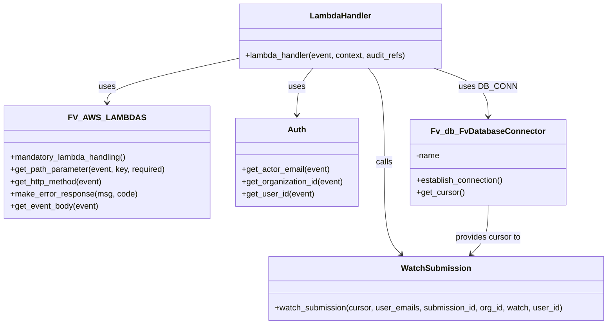

# Diagram: entity_core/entity_service/entity_service/damageview/submission/watch.py


> Auto-generated by Obscura crawlers

## Diagram 1

```mermaid
sequenceDiagram
participant API
participant Lambda as LambdaHandler
participant AWS as FV_AWS_LAMBDAS
participant Auth as Auth
participant DB as DB_CONN
participant Watch as watch_submission
participant Resp as Response

API->>Lambda: invoke lambda_handler(event, context, audit_refs)
Lambda->>AWS: decorator mandatory_lambda_handling() validation
AWS-->>Lambda: validated
Lambda->>AWS: get_path_parameter(event, "submission_id", True)
Lambda->>AWS: get_http_method(event)
alt method not POST or DELETE
    Lambda->>AWS: raise make_error_response("Invalid HTTP method", 400)
    AWS-->>API: error response
else
    Lambda->>AWS: get_http_method(event) == "POST" ? watch=True : watch=False
    opt body present
        Lambda->>AWS: get_event_body(event) -> userEmails
    else no body
        Lambda->>Auth: get_actor_email(event) -> userEmails
    end
    Lambda->>Auth: get_organization_id(event) -> org_id
    Lambda->>Auth: get_user_id(event) -> user_id
    Lambda->>DB: DB_CONN.establish_connection()
    Lambda->>DB: DB_CONN.get_cursor() -> cursor
    Lambda->>Watch: watch_submission(cursor, user_emails, int(submission_id), org_id, watch, user_id)
    Watch-->>Lambda: completion
    Lambda->>Resp: make_response("ok")
    Resp-->>API: 200 OK
end
```

> SVG rendering failed for this diagram.

## Diagram 2



### SVG

<svg id="container" width="1189.291015625" xmlns="http://www.w3.org/2000/svg" class="classDiagram" height="638" viewBox="0 0 1189.291015625 638" role="graphics-document document" aria-roledescription="class"><style>#container{font-family:"trebuchet ms",verdana,arial,sans-serif;font-size:16px;fill:#333;}@keyframes edge-animation-frame{from{stroke-dashoffset:0;}}@keyframes dash{to{stroke-dashoffset:0;}}#container .edge-animation-slow{stroke-dasharray:9,5!important;stroke-dashoffset:900;animation:dash 50s linear infinite;stroke-linecap:round;}#container .edge-animation-fast{stroke-dasharray:9,5!important;stroke-dashoffset:900;animation:dash 20s linear infinite;stroke-linecap:round;}#container .error-icon{fill:#552222;}#container .error-text{fill:#552222;stroke:#552222;}#container .edge-thickness-normal{stroke-width:1px;}#container .edge-thickness-thick{stroke-width:3.5px;}#container .edge-pattern-solid{stroke-dasharray:0;}#container .edge-thickness-invisible{stroke-width:0;fill:none;}#container .edge-pattern-dashed{stroke-dasharray:3;}#container .edge-pattern-dotted{stroke-dasharray:2;}#container .marker{fill:#333333;stroke:#333333;}#container .marker.cross{stroke:#333333;}#container svg{font-family:"trebuchet ms",verdana,arial,sans-serif;font-size:16px;}#container p{margin:0;}#container g.classGroup text{fill:#9370DB;stroke:none;font-family:"trebuchet ms",verdana,arial,sans-serif;font-size:10px;}#container g.classGroup text .title{font-weight:bolder;}#container .nodeLabel,#container .edgeLabel{color:#131300;}#container .edgeLabel .label rect{fill:#ECECFF;}#container .label text{fill:#131300;}#container .labelBkg{background:#ECECFF;}#container .edgeLabel .label span{background:#ECECFF;}#container .classTitle{font-weight:bolder;}#container .node rect,#container .node circle,#container .node ellipse,#container .node polygon,#container .node path{fill:#ECECFF;stroke:#9370DB;stroke-width:1px;}#container .divider{stroke:#9370DB;stroke-width:1;}#container g.clickable{cursor:pointer;}#container g.classGroup rect{fill:#ECECFF;stroke:#9370DB;}#container g.classGroup line{stroke:#9370DB;stroke-width:1;}#container .classLabel .box{stroke:none;stroke-width:0;fill:#ECECFF;opacity:0.5;}#container .classLabel .label{fill:#9370DB;font-size:10px;}#container .relation{stroke:#333333;stroke-width:1;fill:none;}#container .dashed-line{stroke-dasharray:3;}#container .dotted-line{stroke-dasharray:1 2;}#container #compositionStart,#container .composition{fill:#333333!important;stroke:#333333!important;stroke-width:1;}#container #compositionEnd,#container .composition{fill:#333333!important;stroke:#333333!important;stroke-width:1;}#container #dependencyStart,#container .dependency{fill:#333333!important;stroke:#333333!important;stroke-width:1;}#container #dependencyStart,#container .dependency{fill:#333333!important;stroke:#333333!important;stroke-width:1;}#container #extensionStart,#container .extension{fill:transparent!important;stroke:#333333!important;stroke-width:1;}#container #extensionEnd,#container .extension{fill:transparent!important;stroke:#333333!important;stroke-width:1;}#container #aggregationStart,#container .aggregation{fill:transparent!important;stroke:#333333!important;stroke-width:1;}#container #aggregationEnd,#container .aggregation{fill:transparent!important;stroke:#333333!important;stroke-width:1;}#container #lollipopStart,#container .lollipop{fill:#ECECFF!important;stroke:#333333!important;stroke-width:1;}#container #lollipopEnd,#container .lollipop{fill:#ECECFF!important;stroke:#333333!important;stroke-width:1;}#container .edgeTerminals{font-size:11px;line-height:initial;}#container .classTitleText{text-anchor:middle;font-size:18px;fill:#333;}#container .label-icon{display:inline-block;height:1em;overflow:visible;vertical-align:-0.125em;}#container .node .label-icon path{fill:currentColor;stroke:revert;stroke-width:revert;}#container :root{--mermaid-font-family:"trebuchet ms",verdana,arial,sans-serif;}</style><g><defs><marker id="container_class-aggregationStart" class="marker aggregation class" refX="18" refY="7" markerWidth="190" markerHeight="240" orient="auto"><path d="M 18,7 L9,13 L1,7 L9,1 Z"></path></marker></defs><defs><marker id="container_class-aggregationEnd" class="marker aggregation class" refX="1" refY="7" markerWidth="20" markerHeight="28" orient="auto"><path d="M 18,7 L9,13 L1,7 L9,1 Z"></path></marker></defs><defs><marker id="container_class-extensionStart" class="marker extension class" refX="18" refY="7" markerWidth="190" markerHeight="240" orient="auto"><path d="M 1,7 L18,13 V 1 Z"></path></marker></defs><defs><marker id="container_class-extensionEnd" class="marker extension class" refX="1" refY="7" markerWidth="20" markerHeight="28" orient="auto"><path d="M 1,1 V 13 L18,7 Z"></path></marker></defs><defs><marker id="container_class-compositionStart" class="marker composition class" refX="18" refY="7" markerWidth="190" markerHeight="240" orient="auto"><path d="M 18,7 L9,13 L1,7 L9,1 Z"></path></marker></defs><defs><marker id="container_class-compositionEnd" class="marker composition class" refX="1" refY="7" markerWidth="20" markerHeight="28" orient="auto"><path d="M 18,7 L9,13 L1,7 L9,1 Z"></path></marker></defs><defs><marker id="container_class-dependencyStart" class="marker dependency class" refX="6" refY="7" markerWidth="190" markerHeight="240" orient="auto"><path d="M 5,7 L9,13 L1,7 L9,1 Z"></path></marker></defs><defs><marker id="container_class-dependencyEnd" class="marker dependency class" refX="13" refY="7" markerWidth="20" markerHeight="28" orient="auto"><path d="M 18,7 L9,13 L14,7 L9,1 Z"></path></marker></defs><defs><marker id="container_class-lollipopStart" class="marker lollipop class" refX="13" refY="7" markerWidth="190" markerHeight="240" orient="auto"><circle stroke="black" fill="transparent" cx="7" cy="7" r="6"></circle></marker></defs><defs><marker id="container_class-lollipopEnd" class="marker lollipop class" refX="1" refY="7" markerWidth="190" markerHeight="240" orient="auto"><circle stroke="black" fill="transparent" cx="7" cy="7" r="6"></circle></marker></defs><g class="root"><g class="clusters"></g><g class="edgePaths"><path d="M462.92,115.149L420.34,124.458C377.76,133.766,292.601,152.383,250.021,166.858C207.441,181.333,207.441,191.667,207.441,196.833L207.441,202" id="id_LambdaHandler_FV_AWS_LAMBDAS_1" class="edge-thickness-normal edge-pattern-solid relation" style=";;;" data-edge="true" data-et="edge" data-id="id_LambdaHandler_FV_AWS_LAMBDAS_1" data-points="W3sieCI6NDYyLjkxOTkyMTg3NSwieSI6MTE1LjE0OTM1NjMzMzEyNjk2fSx7IngiOjIwNy40NDE0MDYyNSwieSI6MTcxfSx7IngiOjIwNy40NDE0MDYyNSwieSI6MjA4fV0=" marker-end="url(#container_class-dependencyEnd)"></path><path d="M610.392,134L605.059,140.167C599.726,146.333,589.06,158.667,583.727,174C578.395,189.333,578.395,207.667,578.395,216.833L578.395,226" id="id_LambdaHandler_Auth_2" class="edge-thickness-normal edge-pattern-solid relation" style=";;;" data-edge="true" data-et="edge" data-id="id_LambdaHandler_Auth_2" data-points="W3sieCI6NjEwLjM5MTU4MjAzMTI1LCJ5IjoxMzR9LHsieCI6NTc4LjM5NDUzMTI1LCJ5IjoxNzF9LHsieCI6NTc4LjM5NDUzMTI1LCJ5IjoyMzJ9XQ==" marker-end="url(#container_class-dependencyEnd)"></path><path d="M846.779,134L864.585,140.167C882.391,146.333,918.002,158.667,935.808,174.5C953.613,190.333,953.613,209.667,953.613,219.333L953.613,229" id="id_LambdaHandler_Fv_db_FvDatabaseConnector_3" class="edge-thickness-normal edge-pattern-solid relation" style=";;;" data-edge="true" data-et="edge" data-id="id_LambdaHandler_Fv_db_FvDatabaseConnector_3" data-points="W3sieCI6ODQ2Ljc3OTM5NDUzMTI1LCJ5IjoxMzR9LHsieCI6OTUzLjYxMzI4MTI1LCJ5IjoxNzF9LHsieCI6OTUzLjYxMzI4MTI1LCJ5IjoyMzV9XQ==" marker-end="url(#container_class-dependencyEnd)"></path><path d="M719.355,134L724.687,140.167C730.02,146.333,740.686,158.667,746.019,189.5C751.352,220.333,751.352,269.667,751.352,319C751.352,368.333,751.352,417.667,756.877,447.797C762.402,477.927,773.453,488.854,778.978,494.318L784.504,499.781" id="id_LambdaHandler_WatchSubmission_4" class="edge-thickness-normal edge-pattern-solid relation" style=";;;" data-edge="true" data-et="edge" data-id="id_LambdaHandler_WatchSubmission_4" data-points="W3sieCI6NzE5LjM1NDUxMTcxODc1LCJ5IjoxMzR9LHsieCI6NzUxLjM1MTU2MjUsInkiOjE3MX0seyJ4Ijo3NTEuMzUxNTYyNSwieSI6MzE5fSx7IngiOjc1MS4zNTE1NjI1LCJ5Ijo0Njd9LHsieCI6Nzg4Ljc2OTk4MDQ2ODc1LCJ5Ijo1MDR9XQ==" marker-end="url(#container_class-dependencyEnd)"></path><path d="M953.613,403L953.613,413.667C953.613,424.333,953.613,445.667,948.088,461.797C942.563,477.927,931.512,488.854,925.987,494.318L920.461,499.781" id="id_Fv_db_FvDatabaseConnector_WatchSubmission_5" class="edge-thickness-normal edge-pattern-solid relation" style=";;;" data-edge="true" data-et="edge" data-id="id_Fv_db_FvDatabaseConnector_WatchSubmission_5" data-points="W3sieCI6OTUzLjYxMzI4MTI1LCJ5Ijo0MDN9LHsieCI6OTUzLjYxMzI4MTI1LCJ5Ijo0Njd9LHsieCI6OTE2LjE5NDg2MzI4MTI1LCJ5Ijo1MDR9XQ==" marker-end="url(#container_class-dependencyEnd)"></path></g><g class="edgeLabels"><g class="edgeLabel" transform="translate(207.44140625, 171)"><g class="label" data-id="id_LambdaHandler_FV_AWS_LAMBDAS_1" transform="translate(-16.4921875, -12)"><foreignObject width="32.984375" height="24"><div xmlns="http://www.w3.org/1999/xhtml" class="labelBkg" style="display: table-cell; white-space: nowrap; line-height: 1.5; max-width: 200px; text-align: center;"><span class="edgeLabel"><p>uses</p></span></div></foreignObject></g></g><g class="edgeLabel" transform="translate(578.39453125, 171)"><g class="label" data-id="id_LambdaHandler_Auth_2" transform="translate(-16.4921875, -12)"><foreignObject width="32.984375" height="24"><div xmlns="http://www.w3.org/1999/xhtml" class="labelBkg" style="display: table-cell; white-space: nowrap; line-height: 1.5; max-width: 200px; text-align: center;"><span class="edgeLabel"><p>uses</p></span></div></foreignObject></g></g><g class="edgeLabel" transform="translate(953.61328125, 171)"><g class="label" data-id="id_LambdaHandler_Fv_db_FvDatabaseConnector_3" transform="translate(-53.09375, -12)"><foreignObject width="106.1875" height="24"><div xmlns="http://www.w3.org/1999/xhtml" class="labelBkg" style="display: table-cell; white-space: nowrap; line-height: 1.5; max-width: 200px; text-align: center;"><span class="edgeLabel"><p>uses DB_CONN</p></span></div></foreignObject></g></g><g class="edgeLabel" transform="translate(751.3515625, 319)"><g class="label" data-id="id_LambdaHandler_WatchSubmission_4" transform="translate(-16.4453125, -12)"><foreignObject width="32.890625" height="24"><div xmlns="http://www.w3.org/1999/xhtml" class="labelBkg" style="display: table-cell; white-space: nowrap; line-height: 1.5; max-width: 200px; text-align: center;"><span class="edgeLabel"><p>calls</p></span></div></foreignObject></g></g><g class="edgeLabel" transform="translate(953.61328125, 467)"><g class="label" data-id="id_Fv_db_FvDatabaseConnector_WatchSubmission_5" transform="translate(-65.859375, -12)"><foreignObject width="131.71875" height="24"><div xmlns="http://www.w3.org/1999/xhtml" class="labelBkg" style="display: table-cell; white-space: nowrap; line-height: 1.5; max-width: 200px; text-align: center;"><span class="edgeLabel"><p>provides cursor to</p></span></div></foreignObject></g></g></g><g class="nodes"><g class="node default" id="classId-LambdaHandler-0" transform="translate(664.873046875, 71)"><g class="basic label-container"><path d="M-201.953125 -63 L201.953125 -63 L201.953125 63 L-201.953125 63" stroke="none" stroke-width="0" fill="#ECECFF" style=""></path><path d="M-201.953125 -63 C-55.252875333943564 -63, 91.44737433211287 -63, 201.953125 -63 M-201.953125 -63 C-64.88100019390154 -63, 72.19112461219692 -63, 201.953125 -63 M201.953125 -63 C201.953125 -19.214738537863717, 201.953125 24.570522924272566, 201.953125 63 M201.953125 -63 C201.953125 -22.58067583520301, 201.953125 17.83864832959398, 201.953125 63 M201.953125 63 C48.76599101873063 63, -104.42114296253874 63, -201.953125 63 M201.953125 63 C104.33392737812231 63, 6.714729756244623 63, -201.953125 63 M-201.953125 63 C-201.953125 26.96591222717573, -201.953125 -9.068175545648543, -201.953125 -63 M-201.953125 63 C-201.953125 34.76180065464982, -201.953125 6.523601309299636, -201.953125 -63" stroke="#9370DB" stroke-width="1.3" fill="none" stroke-dasharray="0 0" style=""></path></g><g class="annotation-group text" transform="translate(0, -39)"></g><g class="label-group text" transform="translate(-58.21875, -39)"><g class="label" style="font-weight: bolder" transform="translate(0,-12)"><foreignObject width="116.4375" height="24"><div xmlns="http://www.w3.org/1999/xhtml" style="display: table-cell; white-space: nowrap; line-height: 1.5; max-width: 167px; text-align: center;"><span class="nodeLabel markdown-node-label" style=""><p>LambdaHandler</p></span></div></foreignObject></g></g><g class="members-group text" transform="translate(-189.953125, 9)"></g><g class="methods-group text" transform="translate(-189.953125, 39)"><g class="label" style="" transform="translate(0,-12)"><foreignObject width="321.6875" height="24"><div xmlns="http://www.w3.org/1999/xhtml" style="display: table-cell; white-space: nowrap; line-height: 1.5; max-width: 379px; text-align: center;"><span class="nodeLabel markdown-node-label" style=""><p>+lambda_handler(event, context, audit_refs)</p></span></div></foreignObject></g></g><g class="divider" style=""><path d="M-201.953125 -15 C-110.78699370959644 -15, -19.62086241919289 -15, 201.953125 -15 M-201.953125 -15 C-60.35413426897924 -15, 81.24485646204153 -15, 201.953125 -15" stroke="#9370DB" stroke-width="1.3" fill="none" stroke-dasharray="0 0" style=""></path></g><g class="divider" style=""><path d="M-201.953125 9 C-100.40999601864827 9, 1.1331329627034563 9, 201.953125 9 M-201.953125 9 C-55.43588782769143 9, 91.08134934461714 9, 201.953125 9" stroke="#9370DB" stroke-width="1.3" fill="none" stroke-dasharray="0 0" style=""></path></g></g><g class="node default" id="classId-FV_AWS_LAMBDAS-1" transform="translate(207.44140625, 319)"><g class="basic label-container"><path d="M-199.44140625 -111 L199.44140625 -111 L199.44140625 111 L-199.44140625 111" stroke="none" stroke-width="0" fill="#ECECFF" style=""></path><path d="M-199.44140625 -111 C-60.639823576287284 -111, 78.16175909742543 -111, 199.44140625 -111 M-199.44140625 -111 C-100.27673653853778 -111, -1.1120668270755516 -111, 199.44140625 -111 M199.44140625 -111 C199.44140625 -44.68455629358843, 199.44140625 21.630887412823142, 199.44140625 111 M199.44140625 -111 C199.44140625 -46.138150768129805, 199.44140625 18.72369846374039, 199.44140625 111 M199.44140625 111 C78.00173954413926 111, -43.43792716172149 111, -199.44140625 111 M199.44140625 111 C99.80461537116574 111, 0.16782449233147645 111, -199.44140625 111 M-199.44140625 111 C-199.44140625 31.716781877148435, -199.44140625 -47.56643624570313, -199.44140625 -111 M-199.44140625 111 C-199.44140625 62.979015363912445, -199.44140625 14.958030727824891, -199.44140625 -111" stroke="#9370DB" stroke-width="1.3" fill="none" stroke-dasharray="0 0" style=""></path></g><g class="annotation-group text" transform="translate(0, -87)"></g><g class="label-group text" transform="translate(-66.6015625, -87)"><g class="label" style="font-weight: bolder" transform="translate(0,-12)"><foreignObject width="133.203125" height="24"><div xmlns="http://www.w3.org/1999/xhtml" style="display: table-cell; white-space: nowrap; line-height: 1.5; max-width: 181px; text-align: center;"><span class="nodeLabel markdown-node-label" style=""><p>FV_AWS_LAMBDAS</p></span></div></foreignObject></g></g><g class="members-group text" transform="translate(-187.44140625, -39)"></g><g class="methods-group text" transform="translate(-187.44140625, -9)"><g class="label" style="" transform="translate(0,-12)"><foreignObject width="232.078125" height="24"><div xmlns="http://www.w3.org/1999/xhtml" style="display: table-cell; white-space: nowrap; line-height: 1.5; max-width: 289px; text-align: center;"><span class="nodeLabel markdown-node-label" style=""><p>+mandatory_lambda_handling()</p></span></div></foreignObject></g><g class="label" style="" transform="translate(0,12)"><foreignObject width="308.28125" height="24"><div xmlns="http://www.w3.org/1999/xhtml" style="display: table-cell; white-space: nowrap; line-height: 1.5; max-width: 366px; text-align: center;"><span class="nodeLabel markdown-node-label" style=""><p>+get_path_parameter(event, key, required)</p></span></div></foreignObject></g><g class="label" style="" transform="translate(0,36)"><foreignObject width="184.5" height="24"><div xmlns="http://www.w3.org/1999/xhtml" style="display: table-cell; white-space: nowrap; line-height: 1.5; max-width: 242px; text-align: center;"><span class="nodeLabel markdown-node-label" style=""><p>+get_http_method(event)</p></span></div></foreignObject></g><g class="label" style="" transform="translate(0,60)"><foreignObject width="247.21875" height="24"><div xmlns="http://www.w3.org/1999/xhtml" style="display: table-cell; white-space: nowrap; line-height: 1.5; max-width: 305px; text-align: center;"><span class="nodeLabel markdown-node-label" style=""><p>+make_error_response(msg, code)</p></span></div></foreignObject></g><g class="label" style="" transform="translate(0,84)"><foreignObject width="174.203125" height="24"><div xmlns="http://www.w3.org/1999/xhtml" style="display: table-cell; white-space: nowrap; line-height: 1.5; max-width: 232px; text-align: center;"><span class="nodeLabel markdown-node-label" style=""><p>+get_event_body(event)</p></span></div></foreignObject></g></g><g class="divider" style=""><path d="M-199.44140625 -63 C-53.55702733464241 -63, 92.32735158071517 -63, 199.44140625 -63 M-199.44140625 -63 C-43.1371952414118 -63, 113.1670157671764 -63, 199.44140625 -63" stroke="#9370DB" stroke-width="1.3" fill="none" stroke-dasharray="0 0" style=""></path></g><g class="divider" style=""><path d="M-199.44140625 -39 C-112.49360820779721 -39, -25.545810165594418 -39, 199.44140625 -39 M-199.44140625 -39 C-73.88499428185385 -39, 51.6714176862923 -39, 199.44140625 -39" stroke="#9370DB" stroke-width="1.3" fill="none" stroke-dasharray="0 0" style=""></path></g></g><g class="node default" id="classId-Auth-2" transform="translate(578.39453125, 319)"><g class="basic label-container"><path d="M-121.51171875 -87 L121.51171875 -87 L121.51171875 87 L-121.51171875 87" stroke="none" stroke-width="0" fill="#ECECFF" style=""></path><path d="M-121.51171875 -87 C-37.226304944317306 -87, 47.05910886136539 -87, 121.51171875 -87 M-121.51171875 -87 C-63.12011922313902 -87, -4.728519696278042 -87, 121.51171875 -87 M121.51171875 -87 C121.51171875 -17.90419016555215, 121.51171875 51.1916196688957, 121.51171875 87 M121.51171875 -87 C121.51171875 -30.682164662351212, 121.51171875 25.635670675297575, 121.51171875 87 M121.51171875 87 C41.03668401976266 87, -39.43835071047468 87, -121.51171875 87 M121.51171875 87 C36.080502988515775 87, -49.35071277296845 87, -121.51171875 87 M-121.51171875 87 C-121.51171875 20.183988831673048, -121.51171875 -46.632022336653904, -121.51171875 -87 M-121.51171875 87 C-121.51171875 42.730300470109036, -121.51171875 -1.5393990597819283, -121.51171875 -87" stroke="#9370DB" stroke-width="1.3" fill="none" stroke-dasharray="0 0" style=""></path></g><g class="annotation-group text" transform="translate(0, -63)"></g><g class="label-group text" transform="translate(-17.0078125, -63)"><g class="label" style="font-weight: bolder" transform="translate(0,-12)"><foreignObject width="34.015625" height="24"><div xmlns="http://www.w3.org/1999/xhtml" style="display: table-cell; white-space: nowrap; line-height: 1.5; max-width: 84px; text-align: center;"><span class="nodeLabel markdown-node-label" style=""><p>Auth</p></span></div></foreignObject></g></g><g class="members-group text" transform="translate(-109.51171875, -15)"></g><g class="methods-group text" transform="translate(-109.51171875, 15)"><g class="label" style="" transform="translate(0,-12)"><foreignObject width="173.71875" height="24"><div xmlns="http://www.w3.org/1999/xhtml" style="display: table-cell; white-space: nowrap; line-height: 1.5; max-width: 231px; text-align: center;"><span class="nodeLabel markdown-node-label" style=""><p>+get_actor_email(event)</p></span></div></foreignObject></g><g class="label" style="" transform="translate(0,12)"><foreignObject width="202.015625" height="24"><div xmlns="http://www.w3.org/1999/xhtml" style="display: table-cell; white-space: nowrap; line-height: 1.5; max-width: 259px; text-align: center;"><span class="nodeLabel markdown-node-label" style=""><p>+get_organization_id(event)</p></span></div></foreignObject></g><g class="label" style="" transform="translate(0,36)"><foreignObject width="142.0625" height="24"><div xmlns="http://www.w3.org/1999/xhtml" style="display: table-cell; white-space: nowrap; line-height: 1.5; max-width: 199px; text-align: center;"><span class="nodeLabel markdown-node-label" style=""><p>+get_user_id(event)</p></span></div></foreignObject></g></g><g class="divider" style=""><path d="M-121.51171875 -39 C-26.1341865189748 -39, 69.2433457120504 -39, 121.51171875 -39 M-121.51171875 -39 C-45.26679057083635 -39, 30.9781376083273 -39, 121.51171875 -39" stroke="#9370DB" stroke-width="1.3" fill="none" stroke-dasharray="0 0" style=""></path></g><g class="divider" style=""><path d="M-121.51171875 -15 C-44.7037068671317 -15, 32.1043050157366 -15, 121.51171875 -15 M-121.51171875 -15 C-54.220305074762834 -15, 13.071108600474332 -15, 121.51171875 -15" stroke="#9370DB" stroke-width="1.3" fill="none" stroke-dasharray="0 0" style=""></path></g></g><g class="node default" id="classId-Fv_db_FvDatabaseConnector-3" transform="translate(953.61328125, 319)"><g class="basic label-container"><path d="M-150.81640625 -84 L150.81640625 -84 L150.81640625 84 L-150.81640625 84" stroke="none" stroke-width="0" fill="#ECECFF" style=""></path><path d="M-150.81640625 -84 C-72.66368125888184 -84, 5.4890437322363255 -84, 150.81640625 -84 M-150.81640625 -84 C-66.40164897421764 -84, 18.013108301564728 -84, 150.81640625 -84 M150.81640625 -84 C150.81640625 -28.602575958616043, 150.81640625 26.794848082767913, 150.81640625 84 M150.81640625 -84 C150.81640625 -20.637250688895172, 150.81640625 42.725498622209656, 150.81640625 84 M150.81640625 84 C46.58134106613741 84, -57.653724117725176 84, -150.81640625 84 M150.81640625 84 C65.52251916330061 84, -19.77136792339877 84, -150.81640625 84 M-150.81640625 84 C-150.81640625 46.43120566075749, -150.81640625 8.862411321514983, -150.81640625 -84 M-150.81640625 84 C-150.81640625 46.74859568360673, -150.81640625 9.49719136721346, -150.81640625 -84" stroke="#9370DB" stroke-width="1.3" fill="none" stroke-dasharray="0 0" style=""></path></g><g class="annotation-group text" transform="translate(0, -60)"></g><g class="label-group text" transform="translate(-104.3671875, -60)"><g class="label" style="font-weight: bolder" transform="translate(0,-12)"><foreignObject width="208.734375" height="24"><div xmlns="http://www.w3.org/1999/xhtml" style="display: table-cell; white-space: nowrap; line-height: 1.5; max-width: 257px; text-align: center;"><span class="nodeLabel markdown-node-label" style=""><p>Fv_db_FvDatabaseConnector</p></span></div></foreignObject></g></g><g class="members-group text" transform="translate(-138.81640625, -12)"><g class="label" style="" transform="translate(0,-12)"><foreignObject width="46.96875" height="24"><div xmlns="http://www.w3.org/1999/xhtml" style="display: table-cell; white-space: nowrap; line-height: 1.5; max-width: 104px; text-align: center;"><span class="nodeLabel markdown-node-label" style=""><p>-name</p></span></div></foreignObject></g></g><g class="methods-group text" transform="translate(-138.81640625, 36)"><g class="label" style="" transform="translate(0,-12)"><foreignObject width="173.265625" height="24"><div xmlns="http://www.w3.org/1999/xhtml" style="display: table-cell; white-space: nowrap; line-height: 1.5; max-width: 231px; text-align: center;"><span class="nodeLabel markdown-node-label" style=""><p>+establish_connection()</p></span></div></foreignObject></g><g class="label" style="" transform="translate(0,12)"><foreignObject width="94.640625" height="24"><div xmlns="http://www.w3.org/1999/xhtml" style="display: table-cell; white-space: nowrap; line-height: 1.5; max-width: 152px; text-align: center;"><span class="nodeLabel markdown-node-label" style=""><p>+get_cursor()</p></span></div></foreignObject></g></g><g class="divider" style=""><path d="M-150.81640625 -36 C-79.40712788543769 -36, -7.997849520875377 -36, 150.81640625 -36 M-150.81640625 -36 C-34.317082585383915 -36, 82.18224107923217 -36, 150.81640625 -36" stroke="#9370DB" stroke-width="1.3" fill="none" stroke-dasharray="0 0" style=""></path></g><g class="divider" style=""><path d="M-150.81640625 12 C-66.75859602327044 12, 17.299214203459115 12, 150.81640625 12 M-150.81640625 12 C-37.1599124413185 12, 76.496581367363 12, 150.81640625 12" stroke="#9370DB" stroke-width="1.3" fill="none" stroke-dasharray="0 0" style=""></path></g></g><g class="node default" id="classId-WatchSubmission-4" transform="translate(852.482421875, 567)"><g class="basic label-container"><path d="M-328.80859375 -63 L328.80859375 -63 L328.80859375 63 L-328.80859375 63" stroke="none" stroke-width="0" fill="#ECECFF" style=""></path><path d="M-328.80859375 -63 C-196.32044435997153 -63, -63.832294969943064 -63, 328.80859375 -63 M-328.80859375 -63 C-84.9427906560243 -63, 158.9230124379514 -63, 328.80859375 -63 M328.80859375 -63 C328.80859375 -33.361651068319524, 328.80859375 -3.723302136639049, 328.80859375 63 M328.80859375 -63 C328.80859375 -26.535257985058294, 328.80859375 9.929484029883412, 328.80859375 63 M328.80859375 63 C173.4565920387048 63, 18.104590327409596 63, -328.80859375 63 M328.80859375 63 C176.82713276049586 63, 24.845671770991714 63, -328.80859375 63 M-328.80859375 63 C-328.80859375 27.683213745700932, -328.80859375 -7.633572508598135, -328.80859375 -63 M-328.80859375 63 C-328.80859375 20.46289652612795, -328.80859375 -22.074206947744102, -328.80859375 -63" stroke="#9370DB" stroke-width="1.3" fill="none" stroke-dasharray="0 0" style=""></path></g><g class="annotation-group text" transform="translate(0, -39)"></g><g class="label-group text" transform="translate(-64.4765625, -39)"><g class="label" style="font-weight: bolder" transform="translate(0,-12)"><foreignObject width="128.953125" height="24"><div xmlns="http://www.w3.org/1999/xhtml" style="display: table-cell; white-space: nowrap; line-height: 1.5; max-width: 178px; text-align: center;"><span class="nodeLabel markdown-node-label" style=""><p>WatchSubmission</p></span></div></foreignObject></g></g><g class="members-group text" transform="translate(-316.80859375, 9)"></g><g class="methods-group text" transform="translate(-316.80859375, 39)"><g class="label" style="" transform="translate(0,-12)"><foreignObject width="569.140625" height="24"><div xmlns="http://www.w3.org/1999/xhtml" style="display: table-cell; white-space: nowrap; line-height: 1.5; max-width: 627px; text-align: center;"><span class="nodeLabel markdown-node-label" style=""><p>+watch_submission(cursor, user_emails, submission_id, org_id, watch, user_id)</p></span></div></foreignObject></g></g><g class="divider" style=""><path d="M-328.80859375 -15 C-108.5007927400427 -15, 111.8070082699146 -15, 328.80859375 -15 M-328.80859375 -15 C-80.32765412501644 -15, 168.15328549996713 -15, 328.80859375 -15" stroke="#9370DB" stroke-width="1.3" fill="none" stroke-dasharray="0 0" style=""></path></g><g class="divider" style=""><path d="M-328.80859375 9 C-108.24777664416777 9, 112.31304046166446 9, 328.80859375 9 M-328.80859375 9 C-123.89335917114883 9, 81.02187540770234 9, 328.80859375 9" stroke="#9370DB" stroke-width="1.3" fill="none" stroke-dasharray="0 0" style=""></path></g></g></g></g></g></svg>
