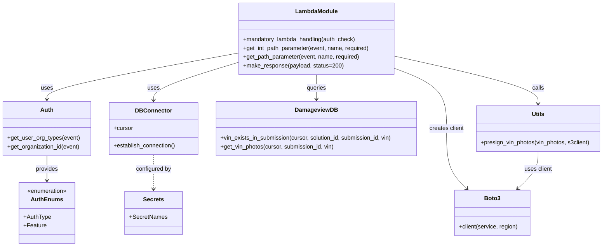

# Diagram: entity_core/entity_service/entity_service/damageview/vins/get_impacted_vin_photos.py


> Auto-generated by Obscura crawlers

## Diagram 1

```mermaid
flowchart TD
    HTTP_GET[HTTP GET /submissions/{submission_id}/vins/{vin}/photos] --> Handler[lambda_handler(event, context, audit_refs)]
    Handler --> Extract[extract path parameters]
    Extract --> SubId[get_int_path_parameter(event, "submission_id", required=True)]
    Extract --> VIN[get_path_parameter(event, "vin", required=True)]
    Handler --> DBConnect[DB_CONN.establish_connection()]
    DBConnect --> Cursor[cursor = DB_CONN.cursor]
    Handler --> OrgType[org_type = fv.aws.lambdas.auth.get_user_org_types(event)[0]]
    Handler --> OrgId[org_id = fv.aws.lambdas.auth.get_organization_id(event)]
    OrgType --> SolId[get_solution_id_list_for_org(org_type, org_id)]
    OrgId --> SolId
    SolId -->|empty| NotFound[raise fv.error.NotFoundError("No valid solution found for this organization")]
    SolId -->|present| VinExistsCheck[entity_service.db.damageview.vin_exists_in_submission(cursor, solution_id, submission_id, vin)]
    VinExistsCheck -->|false| NotFoundVin[return fv.aws.lambdas.make_response("${vin} not found for submission ${submission_id}", 404)]
    VinExistsCheck -->|true| GetPhotos[vin_photos = entity_service.db.damageview.get_vin_photos(cursor, submission_id, vin)]
    GetPhotos -->|empty| EmptyResp[return fv.aws.lambdas.make_response({})]
    GetPhotos -->|present| CreateS3[s3client = boto3.client("s3", DamageviewS3.REGION.value)]
    CreateS3 --> Presign[presign_vin_photos(vin_photos, s3client)]
    Presign --> ReturnPhotos[return fv.aws.lambdas.make_response(vin_photos)]
```

> SVG rendering failed for this diagram.

## Diagram 2



### SVG

<svg id="container" width="1677.2578125" xmlns="http://www.w3.org/2000/svg" class="classDiagram" height="680" viewBox="0 0 1677.2578125 680" role="graphics-document document" aria-roledescription="class"><style>#container{font-family:"trebuchet ms",verdana,arial,sans-serif;font-size:16px;fill:#333;}@keyframes edge-animation-frame{from{stroke-dashoffset:0;}}@keyframes dash{to{stroke-dashoffset:0;}}#container .edge-animation-slow{stroke-dasharray:9,5!important;stroke-dashoffset:900;animation:dash 50s linear infinite;stroke-linecap:round;}#container .edge-animation-fast{stroke-dasharray:9,5!important;stroke-dashoffset:900;animation:dash 20s linear infinite;stroke-linecap:round;}#container .error-icon{fill:#552222;}#container .error-text{fill:#552222;stroke:#552222;}#container .edge-thickness-normal{stroke-width:1px;}#container .edge-thickness-thick{stroke-width:3.5px;}#container .edge-pattern-solid{stroke-dasharray:0;}#container .edge-thickness-invisible{stroke-width:0;fill:none;}#container .edge-pattern-dashed{stroke-dasharray:3;}#container .edge-pattern-dotted{stroke-dasharray:2;}#container .marker{fill:#333333;stroke:#333333;}#container .marker.cross{stroke:#333333;}#container svg{font-family:"trebuchet ms",verdana,arial,sans-serif;font-size:16px;}#container p{margin:0;}#container g.classGroup text{fill:#9370DB;stroke:none;font-family:"trebuchet ms",verdana,arial,sans-serif;font-size:10px;}#container g.classGroup text .title{font-weight:bolder;}#container .nodeLabel,#container .edgeLabel{color:#131300;}#container .edgeLabel .label rect{fill:#ECECFF;}#container .label text{fill:#131300;}#container .labelBkg{background:#ECECFF;}#container .edgeLabel .label span{background:#ECECFF;}#container .classTitle{font-weight:bolder;}#container .node rect,#container .node circle,#container .node ellipse,#container .node polygon,#container .node path{fill:#ECECFF;stroke:#9370DB;stroke-width:1px;}#container .divider{stroke:#9370DB;stroke-width:1;}#container g.clickable{cursor:pointer;}#container g.classGroup rect{fill:#ECECFF;stroke:#9370DB;}#container g.classGroup line{stroke:#9370DB;stroke-width:1;}#container .classLabel .box{stroke:none;stroke-width:0;fill:#ECECFF;opacity:0.5;}#container .classLabel .label{fill:#9370DB;font-size:10px;}#container .relation{stroke:#333333;stroke-width:1;fill:none;}#container .dashed-line{stroke-dasharray:3;}#container .dotted-line{stroke-dasharray:1 2;}#container #compositionStart,#container .composition{fill:#333333!important;stroke:#333333!important;stroke-width:1;}#container #compositionEnd,#container .composition{fill:#333333!important;stroke:#333333!important;stroke-width:1;}#container #dependencyStart,#container .dependency{fill:#333333!important;stroke:#333333!important;stroke-width:1;}#container #dependencyStart,#container .dependency{fill:#333333!important;stroke:#333333!important;stroke-width:1;}#container #extensionStart,#container .extension{fill:transparent!important;stroke:#333333!important;stroke-width:1;}#container #extensionEnd,#container .extension{fill:transparent!important;stroke:#333333!important;stroke-width:1;}#container #aggregationStart,#container .aggregation{fill:transparent!important;stroke:#333333!important;stroke-width:1;}#container #aggregationEnd,#container .aggregation{fill:transparent!important;stroke:#333333!important;stroke-width:1;}#container #lollipopStart,#container .lollipop{fill:#ECECFF!important;stroke:#333333!important;stroke-width:1;}#container #lollipopEnd,#container .lollipop{fill:#ECECFF!important;stroke:#333333!important;stroke-width:1;}#container .edgeTerminals{font-size:11px;line-height:initial;}#container .classTitleText{text-anchor:middle;font-size:18px;fill:#333;}#container .label-icon{display:inline-block;height:1em;overflow:visible;vertical-align:-0.125em;}#container .node .label-icon path{fill:currentColor;stroke:revert;stroke-width:revert;}#container :root{--mermaid-font-family:"trebuchet ms",verdana,arial,sans-serif;}</style><g><defs><marker id="container_class-aggregationStart" class="marker aggregation class" refX="18" refY="7" markerWidth="190" markerHeight="240" orient="auto"><path d="M 18,7 L9,13 L1,7 L9,1 Z"></path></marker></defs><defs><marker id="container_class-aggregationEnd" class="marker aggregation class" refX="1" refY="7" markerWidth="20" markerHeight="28" orient="auto"><path d="M 18,7 L9,13 L1,7 L9,1 Z"></path></marker></defs><defs><marker id="container_class-extensionStart" class="marker extension class" refX="18" refY="7" markerWidth="190" markerHeight="240" orient="auto"><path d="M 1,7 L18,13 V 1 Z"></path></marker></defs><defs><marker id="container_class-extensionEnd" class="marker extension class" refX="1" refY="7" markerWidth="20" markerHeight="28" orient="auto"><path d="M 1,1 V 13 L18,7 Z"></path></marker></defs><defs><marker id="container_class-compositionStart" class="marker composition class" refX="18" refY="7" markerWidth="190" markerHeight="240" orient="auto"><path d="M 18,7 L9,13 L1,7 L9,1 Z"></path></marker></defs><defs><marker id="container_class-compositionEnd" class="marker composition class" refX="1" refY="7" markerWidth="20" markerHeight="28" orient="auto"><path d="M 18,7 L9,13 L1,7 L9,1 Z"></path></marker></defs><defs><marker id="container_class-dependencyStart" class="marker dependency class" refX="6" refY="7" markerWidth="190" markerHeight="240" orient="auto"><path d="M 5,7 L9,13 L1,7 L9,1 Z"></path></marker></defs><defs><marker id="container_class-dependencyEnd" class="marker dependency class" refX="13" refY="7" markerWidth="20" markerHeight="28" orient="auto"><path d="M 18,7 L9,13 L14,7 L9,1 Z"></path></marker></defs><defs><marker id="container_class-lollipopStart" class="marker lollipop class" refX="13" refY="7" markerWidth="190" markerHeight="240" orient="auto"><circle stroke="black" fill="transparent" cx="7" cy="7" r="6"></circle></marker></defs><defs><marker id="container_class-lollipopEnd" class="marker lollipop class" refX="1" refY="7" markerWidth="190" markerHeight="240" orient="auto"><circle stroke="black" fill="transparent" cx="7" cy="7" r="6"></circle></marker></defs><g class="root"><g class="clusters"></g><g class="edgePaths"><path d="M659.367,146.444L571.058,162.537C482.749,178.63,306.13,210.815,217.821,232.074C129.512,253.333,129.512,263.667,129.512,268.833L129.512,274" id="id_LambdaModule_Auth_1" class="edge-thickness-normal edge-pattern-solid relation" style=";;;" data-edge="true" data-et="edge" data-id="id_LambdaModule_Auth_1" data-points="W3sieCI6NjU5LjM2NzE4NzUsInkiOjE0Ni40NDQzMDY2MTMyNzg5fSx7IngiOjEyOS41MTE3MTg3NSwieSI6MjQzfSx7IngiOjEyOS41MTE3MTg3NSwieSI6MjgwfV0=" marker-end="url(#container_class-dependencyEnd)"></path><path d="M659.367,172.072L620.046,183.894C580.724,195.715,502.081,219.357,462.759,236.845C423.438,254.333,423.438,265.667,423.438,271.333L423.438,277" id="id_LambdaModule_DBConnector_2" class="edge-thickness-normal edge-pattern-solid relation" style=";;;" data-edge="true" data-et="edge" data-id="id_LambdaModule_DBConnector_2" data-points="W3sieCI6NjU5LjM2NzE4NzUsInkiOjE3Mi4wNzIzNzcxNjk1MDE3NX0seyJ4Ijo0MjMuNDM3NSwieSI6MjQzfSx7IngiOjQyMy40Mzc1LCJ5IjoyODN9XQ==" marker-end="url(#container_class-dependencyEnd)"></path><path d="M875.82,206L875.82,212.167C875.82,218.333,875.82,230.667,875.82,242C875.82,253.333,875.82,263.667,875.82,268.833L875.82,274" id="id_LambdaModule_DamageviewDB_3" class="edge-thickness-normal edge-pattern-solid relation" style=";;;" data-edge="true" data-et="edge" data-id="id_LambdaModule_DamageviewDB_3" data-points="W3sieCI6ODc1LjgyMDMxMjUsInkiOjIwNn0seyJ4Ijo4NzUuODIwMzEyNSwieSI6MjQzfSx7IngiOjg3NS44MjAzMTI1LCJ5IjoyODB9XQ==" marker-end="url(#container_class-dependencyEnd)"></path><path d="M1092.273,154.453L1159.59,169.211C1226.906,183.969,1361.539,213.484,1428.855,235.409C1496.172,257.333,1496.172,271.667,1496.172,278.833L1496.172,286" id="id_LambdaModule_Utils_4" class="edge-thickness-normal edge-pattern-solid relation" style=";;;" data-edge="true" data-et="edge" data-id="id_LambdaModule_Utils_4" data-points="W3sieCI6MTA5Mi4yNzM0Mzc1LCJ5IjoxNTQuNDUzMTMyNjc0MjY0ODV9LHsieCI6MTQ5Ni4xNzE4NzUsInkiOjI0M30seyJ4IjoxNDk2LjE3MTg3NSwieSI6MjkyfV0=" marker-end="url(#container_class-dependencyEnd)"></path><path d="M1092.273,187.958L1116.801,197.131C1141.328,206.305,1190.383,224.653,1214.91,252.493C1239.438,280.333,1239.438,317.667,1239.438,355C1239.438,392.333,1239.438,429.667,1248.965,457.314C1258.493,484.961,1277.548,502.923,1287.075,511.904L1296.603,520.884" id="id_LambdaModule_Boto3_5" class="edge-thickness-normal edge-pattern-solid relation" style=";;;" data-edge="true" data-et="edge" data-id="id_LambdaModule_Boto3_5" data-points="W3sieCI6MTA5Mi4yNzM0Mzc1LCJ5IjoxODcuOTU3NzM4MDA1NzE1MTZ9LHsieCI6MTIzOS40Mzc1LCJ5IjoyNDN9LHsieCI6MTIzOS40Mzc1LCJ5IjozNTV9LHsieCI6MTIzOS40Mzc1LCJ5Ijo0Njd9LHsieCI6MTMwMC45Njg4NzkxMzIyMzE1LCJ5Ijo1MjV9XQ==" marker-end="url(#container_class-dependencyEnd)"></path><path d="M423.438,427L423.438,433.667C423.438,440.333,423.438,453.667,423.438,469.5C423.438,485.333,423.438,503.667,423.438,512.833L423.438,522" id="id_DBConnector_Secrets_6" class="edge-thickness-normal edge-pattern-dashed relation" style=";;;" data-edge="true" data-et="edge" data-id="id_DBConnector_Secrets_6" data-points="W3sieCI6NDIzLjQzNzUsInkiOjQyN30seyJ4Ijo0MjMuNDM3NSwieSI6NDY3fSx7IngiOjQyMy40Mzc1LCJ5Ijo1Mjh9XQ==" marker-end="url(#container_class-dependencyEnd)"></path><path d="M129.512,430L129.512,436.167C129.512,442.333,129.512,454.667,129.512,466C129.512,477.333,129.512,487.667,129.512,492.833L129.512,498" id="id_Auth_AuthEnums_7" class="edge-thickness-normal edge-pattern-solid relation" style=";;;" data-edge="true" data-et="edge" data-id="id_Auth_AuthEnums_7" data-points="W3sieCI6MTI5LjUxMTcxODc1LCJ5Ijo0MzB9LHsieCI6MTI5LjUxMTcxODc1LCJ5Ijo0Njd9LHsieCI6MTI5LjUxMTcxODc1LCJ5Ijo1MDR9XQ==" marker-end="url(#container_class-dependencyEnd)"></path><path d="M1496.172,418L1496.172,426.167C1496.172,434.333,1496.172,450.667,1486.644,467.814C1477.117,484.961,1458.062,502.923,1448.534,511.904L1439.007,520.884" id="id_Utils_Boto3_8" class="edge-thickness-normal edge-pattern-solid relation" style=";;;" data-edge="true" data-et="edge" data-id="id_Utils_Boto3_8" data-points="W3sieCI6MTQ5Ni4xNzE4NzUsInkiOjQxOH0seyJ4IjoxNDk2LjE3MTg3NSwieSI6NDY3fSx7IngiOjE0MzQuNjQwNDk1ODY3NzY4NSwieSI6NTI1fV0=" marker-end="url(#container_class-dependencyEnd)"></path></g><g class="edgeLabels"><g class="edgeLabel" transform="translate(129.51171875, 243)"><g class="label" data-id="id_LambdaModule_Auth_1" transform="translate(-16.4921875, -12)"><foreignObject width="32.984375" height="24"><div xmlns="http://www.w3.org/1999/xhtml" class="labelBkg" style="display: table-cell; white-space: nowrap; line-height: 1.5; max-width: 200px; text-align: center;"><span class="edgeLabel"><p>uses</p></span></div></foreignObject></g></g><g class="edgeLabel" transform="translate(423.4375, 243)"><g class="label" data-id="id_LambdaModule_DBConnector_2" transform="translate(-16.4921875, -12)"><foreignObject width="32.984375" height="24"><div xmlns="http://www.w3.org/1999/xhtml" class="labelBkg" style="display: table-cell; white-space: nowrap; line-height: 1.5; max-width: 200px; text-align: center;"><span class="edgeLabel"><p>uses</p></span></div></foreignObject></g></g><g class="edgeLabel" transform="translate(875.8203125, 243)"><g class="label" data-id="id_LambdaModule_DamageviewDB_3" transform="translate(-27.2421875, -12)"><foreignObject width="54.484375" height="24"><div xmlns="http://www.w3.org/1999/xhtml" class="labelBkg" style="display: table-cell; white-space: nowrap; line-height: 1.5; max-width: 200px; text-align: center;"><span class="edgeLabel"><p>queries</p></span></div></foreignObject></g></g><g class="edgeLabel" transform="translate(1496.171875, 243)"><g class="label" data-id="id_LambdaModule_Utils_4" transform="translate(-16.4453125, -12)"><foreignObject width="32.890625" height="24"><div xmlns="http://www.w3.org/1999/xhtml" class="labelBkg" style="display: table-cell; white-space: nowrap; line-height: 1.5; max-width: 200px; text-align: center;"><span class="edgeLabel"><p>calls</p></span></div></foreignObject></g></g><g class="edgeLabel" transform="translate(1239.4375, 355)"><g class="label" data-id="id_LambdaModule_Boto3_5" transform="translate(-48.6484375, -12)"><foreignObject width="97.296875" height="24"><div xmlns="http://www.w3.org/1999/xhtml" class="labelBkg" style="display: table-cell; white-space: nowrap; line-height: 1.5; max-width: 200px; text-align: center;"><span class="edgeLabel"><p>creates client</p></span></div></foreignObject></g></g><g class="edgeLabel" transform="translate(423.4375, 467)"><g class="label" data-id="id_DBConnector_Secrets_6" transform="translate(-49.1328125, -12)"><foreignObject width="98.265625" height="24"><div xmlns="http://www.w3.org/1999/xhtml" class="labelBkg" style="display: table-cell; white-space: nowrap; line-height: 1.5; max-width: 200px; text-align: center;"><span class="edgeLabel"><p>configured by</p></span></div></foreignObject></g></g><g class="edgeLabel" transform="translate(129.51171875, 467)"><g class="label" data-id="id_Auth_AuthEnums_7" transform="translate(-31.3125, -12)"><foreignObject width="62.625" height="24"><div xmlns="http://www.w3.org/1999/xhtml" class="labelBkg" style="display: table-cell; white-space: nowrap; line-height: 1.5; max-width: 200px; text-align: center;"><span class="edgeLabel"><p>provides</p></span></div></foreignObject></g></g><g class="edgeLabel" transform="translate(1496.171875, 467)"><g class="label" data-id="id_Utils_Boto3_8" transform="translate(-38.96875, -12)"><foreignObject width="77.9375" height="24"><div xmlns="http://www.w3.org/1999/xhtml" class="labelBkg" style="display: table-cell; white-space: nowrap; line-height: 1.5; max-width: 200px; text-align: center;"><span class="edgeLabel"><p>uses client</p></span></div></foreignObject></g></g></g><g class="nodes"><g class="node default" id="classId-LambdaModule-0" transform="translate(875.8203125, 107)"><g class="basic label-container"><path d="M-216.453125 -99 L216.453125 -99 L216.453125 99 L-216.453125 99" stroke="none" stroke-width="0" fill="#ECECFF" style=""></path><path d="M-216.453125 -99 C-104.48832046156555 -99, 7.4764840768689 -99, 216.453125 -99 M-216.453125 -99 C-82.16706248023999 -99, 52.11900003952002 -99, 216.453125 -99 M216.453125 -99 C216.453125 -31.299345998403595, 216.453125 36.40130800319281, 216.453125 99 M216.453125 -99 C216.453125 -51.60242094773873, 216.453125 -4.204841895477458, 216.453125 99 M216.453125 99 C86.52050036954967 99, -43.41212426090067 99, -216.453125 99 M216.453125 99 C79.41139698404336 99, -57.63033103191327 99, -216.453125 99 M-216.453125 99 C-216.453125 29.77140436790826, -216.453125 -39.45719126418348, -216.453125 -99 M-216.453125 99 C-216.453125 49.75123227875313, -216.453125 0.5024645575062578, -216.453125 -99" stroke="#9370DB" stroke-width="1.3" fill="none" stroke-dasharray="0 0" style=""></path></g><g class="annotation-group text" transform="translate(0, -75)"></g><g class="label-group text" transform="translate(-56.21875, -75)"><g class="label" style="font-weight: bolder" transform="translate(0,-12)"><foreignObject width="112.4375" height="24"><div xmlns="http://www.w3.org/1999/xhtml" style="display: table-cell; white-space: nowrap; line-height: 1.5; max-width: 162px; text-align: center;"><span class="nodeLabel markdown-node-label" style=""><p>LambdaModule</p></span></div></foreignObject></g></g><g class="members-group text" transform="translate(-204.453125, -27)"></g><g class="methods-group text" transform="translate(-204.453125, 3)"><g class="label" style="" transform="translate(0,-12)"><foreignObject width="314.828125" height="24"><div xmlns="http://www.w3.org/1999/xhtml" style="display: table-cell; white-space: nowrap; line-height: 1.5; max-width: 372px; text-align: center;"><span class="nodeLabel markdown-node-label" style=""><p>+mandatory_lambda_handling(auth_check)</p></span></div></foreignObject></g><g class="label" style="" transform="translate(0,12)"><foreignObject width="352.6875" height="24"><div xmlns="http://www.w3.org/1999/xhtml" style="display: table-cell; white-space: nowrap; line-height: 1.5; max-width: 410px; text-align: center;"><span class="nodeLabel markdown-node-label" style=""><p>+get_int_path_parameter(event, name, required)</p></span></div></foreignObject></g><g class="label" style="" transform="translate(0,36)"><foreignObject width="324.703125" height="24"><div xmlns="http://www.w3.org/1999/xhtml" style="display: table-cell; white-space: nowrap; line-height: 1.5; max-width: 382px; text-align: center;"><span class="nodeLabel markdown-node-label" style=""><p>+get_path_parameter(event, name, required)</p></span></div></foreignObject></g><g class="label" style="" transform="translate(0,60)"><foreignObject width="275.84375" height="24"><div xmlns="http://www.w3.org/1999/xhtml" style="display: table-cell; white-space: nowrap; line-height: 1.5; max-width: 333px; text-align: center;"><span class="nodeLabel markdown-node-label" style=""><p>+make_response(payload, status=200)</p></span></div></foreignObject></g></g><g class="divider" style=""><path d="M-216.453125 -51 C-44.138073092052224 -51, 128.17697881589555 -51, 216.453125 -51 M-216.453125 -51 C-129.53121408633734 -51, -42.60930317267466 -51, 216.453125 -51" stroke="#9370DB" stroke-width="1.3" fill="none" stroke-dasharray="0 0" style=""></path></g><g class="divider" style=""><path d="M-216.453125 -27 C-64.95301974000216 -27, 86.54708551999568 -27, 216.453125 -27 M-216.453125 -27 C-100.93625587508876 -27, 14.580613249822477 -27, 216.453125 -27" stroke="#9370DB" stroke-width="1.3" fill="none" stroke-dasharray="0 0" style=""></path></g></g><g class="node default" id="classId-Auth-1" transform="translate(129.51171875, 355)"><g class="basic label-container"><path d="M-121.51171875 -75 L121.51171875 -75 L121.51171875 75 L-121.51171875 75" stroke="none" stroke-width="0" fill="#ECECFF" style=""></path><path d="M-121.51171875 -75 C-36.62972627588694 -75, 48.252266198226124 -75, 121.51171875 -75 M-121.51171875 -75 C-31.48264867794805 -75, 58.5464213941039 -75, 121.51171875 -75 M121.51171875 -75 C121.51171875 -33.99345817295513, 121.51171875 7.0130836540897405, 121.51171875 75 M121.51171875 -75 C121.51171875 -30.994231442920224, 121.51171875 13.011537114159552, 121.51171875 75 M121.51171875 75 C38.60548392615095 75, -44.300750897698094 75, -121.51171875 75 M121.51171875 75 C68.4320225759156 75, 15.352326401831178 75, -121.51171875 75 M-121.51171875 75 C-121.51171875 28.149149415205898, -121.51171875 -18.701701169588205, -121.51171875 -75 M-121.51171875 75 C-121.51171875 43.91005368562833, -121.51171875 12.820107371256661, -121.51171875 -75" stroke="#9370DB" stroke-width="1.3" fill="none" stroke-dasharray="0 0" style=""></path></g><g class="annotation-group text" transform="translate(0, -51)"></g><g class="label-group text" transform="translate(-17.0078125, -51)"><g class="label" style="font-weight: bolder" transform="translate(0,-12)"><foreignObject width="34.015625" height="24"><div xmlns="http://www.w3.org/1999/xhtml" style="display: table-cell; white-space: nowrap; line-height: 1.5; max-width: 84px; text-align: center;"><span class="nodeLabel markdown-node-label" style=""><p>Auth</p></span></div></foreignObject></g></g><g class="members-group text" transform="translate(-109.51171875, -3)"></g><g class="methods-group text" transform="translate(-109.51171875, 27)"><g class="label" style="" transform="translate(0,-12)"><foreignObject width="198.578125" height="24"><div xmlns="http://www.w3.org/1999/xhtml" style="display: table-cell; white-space: nowrap; line-height: 1.5; max-width: 256px; text-align: center;"><span class="nodeLabel markdown-node-label" style=""><p>+get_user_org_types(event)</p></span></div></foreignObject></g><g class="label" style="" transform="translate(0,12)"><foreignObject width="202.015625" height="24"><div xmlns="http://www.w3.org/1999/xhtml" style="display: table-cell; white-space: nowrap; line-height: 1.5; max-width: 259px; text-align: center;"><span class="nodeLabel markdown-node-label" style=""><p>+get_organization_id(event)</p></span></div></foreignObject></g></g><g class="divider" style=""><path d="M-121.51171875 -27 C-67.97909581902266 -27, -14.44647288804532 -27, 121.51171875 -27 M-121.51171875 -27 C-34.22294149431062 -27, 53.065835761378764 -27, 121.51171875 -27" stroke="#9370DB" stroke-width="1.3" fill="none" stroke-dasharray="0 0" style=""></path></g><g class="divider" style=""><path d="M-121.51171875 -3 C-63.14967897506233 -3, -4.787639200124659 -3, 121.51171875 -3 M-121.51171875 -3 C-65.65874296513684 -3, -9.805767180273676 -3, 121.51171875 -3" stroke="#9370DB" stroke-width="1.3" fill="none" stroke-dasharray="0 0" style=""></path></g></g><g class="node default" id="classId-AuthEnums-2" transform="translate(129.51171875, 588)"><g class="basic label-container"><path d="M-77.37109375 -84 L77.37109375 -84 L77.37109375 84 L-77.37109375 84" stroke="none" stroke-width="0" fill="#ECECFF" style=""></path><path d="M-77.37109375 -84 C-18.932175017972973 -84, 39.50674371405405 -84, 77.37109375 -84 M-77.37109375 -84 C-26.43973849547504 -84, 24.49161675904992 -84, 77.37109375 -84 M77.37109375 -84 C77.37109375 -33.70766667562587, 77.37109375 16.584666648748254, 77.37109375 84 M77.37109375 -84 C77.37109375 -17.663767982760973, 77.37109375 48.672464034478054, 77.37109375 84 M77.37109375 84 C45.35721830546699 84, 13.343342860933987 84, -77.37109375 84 M77.37109375 84 C25.15557839640246 84, -27.059936957195077 84, -77.37109375 84 M-77.37109375 84 C-77.37109375 46.36180438606272, -77.37109375 8.723608772125445, -77.37109375 -84 M-77.37109375 84 C-77.37109375 32.12814176148623, -77.37109375 -19.743716477027533, -77.37109375 -84" stroke="#9370DB" stroke-width="1.3" fill="none" stroke-dasharray="0 0" style=""></path></g><g class="annotation-group text" transform="translate(-55.5546875, -60)"><g class="label" style="" transform="translate(0,-12)"><foreignObject width="111.109375" height="24"><div xmlns="http://www.w3.org/1999/xhtml" style="display: table-cell; white-space: nowrap; line-height: 1.5; max-width: 161px; text-align: center;"><span class="nodeLabel markdown-node-label" style=""><p>«enumeration»</p></span></div></foreignObject></g></g><g class="label-group text" transform="translate(-40.9453125, -36)"><g class="label" style="font-weight: bolder" transform="translate(0,-12)"><foreignObject width="81.890625" height="24"><div xmlns="http://www.w3.org/1999/xhtml" style="display: table-cell; white-space: nowrap; line-height: 1.5; max-width: 132px; text-align: center;"><span class="nodeLabel markdown-node-label" style=""><p>AuthEnums</p></span></div></foreignObject></g></g><g class="members-group text" transform="translate(-65.37109375, 12)"><g class="label" style="" transform="translate(0,-12)"><foreignObject width="75.1875" height="24"><div xmlns="http://www.w3.org/1999/xhtml" style="display: table-cell; white-space: nowrap; line-height: 1.5; max-width: 133px; text-align: center;"><span class="nodeLabel markdown-node-label" style=""><p>+AuthType</p></span></div></foreignObject></g><g class="label" style="" transform="translate(0,12)"><foreignObject width="62.0625" height="24"><div xmlns="http://www.w3.org/1999/xhtml" style="display: table-cell; white-space: nowrap; line-height: 1.5; max-width: 119px; text-align: center;"><span class="nodeLabel markdown-node-label" style=""><p>+Feature</p></span></div></foreignObject></g></g><g class="methods-group text" transform="translate(-65.37109375, 84)"></g><g class="divider" style=""><path d="M-77.37109375 -12 C-17.93206756845919 -12, 41.50695861308162 -12, 77.37109375 -12 M-77.37109375 -12 C-41.02730920954257 -12, -4.683524669085145 -12, 77.37109375 -12" stroke="#9370DB" stroke-width="1.3" fill="none" stroke-dasharray="0 0" style=""></path></g><g class="divider" style=""><path d="M-77.37109375 60 C-39.66571206592915 60, -1.9603303818582987 60, 77.37109375 60 M-77.37109375 60 C-19.04177074683855 60, 39.2875522563229 60, 77.37109375 60" stroke="#9370DB" stroke-width="1.3" fill="none" stroke-dasharray="0 0" style=""></path></g></g><g class="node default" id="classId-DBConnector-3" transform="translate(423.4375, 355)"><g class="basic label-container"><path d="M-122.4140625 -72 L122.4140625 -72 L122.4140625 72 L-122.4140625 72" stroke="none" stroke-width="0" fill="#ECECFF" style=""></path><path d="M-122.4140625 -72 C-36.10355637232129 -72, 50.206949755357414 -72, 122.4140625 -72 M-122.4140625 -72 C-56.28146801318992 -72, 9.851126473620155 -72, 122.4140625 -72 M122.4140625 -72 C122.4140625 -29.153927355120906, 122.4140625 13.692145289758187, 122.4140625 72 M122.4140625 -72 C122.4140625 -20.462382898460042, 122.4140625 31.075234203079916, 122.4140625 72 M122.4140625 72 C54.10647051615224 72, -14.201121467695515 72, -122.4140625 72 M122.4140625 72 C47.55597571428477 72, -27.30211107143046 72, -122.4140625 72 M-122.4140625 72 C-122.4140625 19.62805574899422, -122.4140625 -32.74388850201156, -122.4140625 -72 M-122.4140625 72 C-122.4140625 28.304271996273975, -122.4140625 -15.39145600745205, -122.4140625 -72" stroke="#9370DB" stroke-width="1.3" fill="none" stroke-dasharray="0 0" style=""></path></g><g class="annotation-group text" transform="translate(0, -48)"></g><g class="label-group text" transform="translate(-47.5625, -48)"><g class="label" style="font-weight: bolder" transform="translate(0,-12)"><foreignObject width="95.125" height="24"><div xmlns="http://www.w3.org/1999/xhtml" style="display: table-cell; white-space: nowrap; line-height: 1.5; max-width: 145px; text-align: center;"><span class="nodeLabel markdown-node-label" style=""><p>DBConnector</p></span></div></foreignObject></g></g><g class="members-group text" transform="translate(-110.4140625, 0)"><g class="label" style="" transform="translate(0,-12)"><foreignObject width="53.71875" height="24"><div xmlns="http://www.w3.org/1999/xhtml" style="display: table-cell; white-space: nowrap; line-height: 1.5; max-width: 112px; text-align: center;"><span class="nodeLabel markdown-node-label" style=""><p>+cursor</p></span></div></foreignObject></g></g><g class="methods-group text" transform="translate(-110.4140625, 48)"><g class="label" style="" transform="translate(0,-12)"><foreignObject width="173.265625" height="24"><div xmlns="http://www.w3.org/1999/xhtml" style="display: table-cell; white-space: nowrap; line-height: 1.5; max-width: 231px; text-align: center;"><span class="nodeLabel markdown-node-label" style=""><p>+establish_connection()</p></span></div></foreignObject></g></g><g class="divider" style=""><path d="M-122.4140625 -24 C-56.51999783803191 -24, 9.374066823936175 -24, 122.4140625 -24 M-122.4140625 -24 C-35.159923900150744 -24, 52.09421469969851 -24, 122.4140625 -24" stroke="#9370DB" stroke-width="1.3" fill="none" stroke-dasharray="0 0" style=""></path></g><g class="divider" style=""><path d="M-122.4140625 24 C-63.836139847743226 24, -5.258217195486452 24, 122.4140625 24 M-122.4140625 24 C-43.43417586507947 24, 35.545710769841065 24, 122.4140625 24" stroke="#9370DB" stroke-width="1.3" fill="none" stroke-dasharray="0 0" style=""></path></g></g><g class="node default" id="classId-DamageviewDB-4" transform="translate(875.8203125, 355)"><g class="basic label-container"><path d="M-279.96875 -75 L279.96875 -75 L279.96875 75 L-279.96875 75" stroke="none" stroke-width="0" fill="#ECECFF" style=""></path><path d="M-279.96875 -75 C-99.24899217403393 -75, 81.47076565193214 -75, 279.96875 -75 M-279.96875 -75 C-125.01084597042467 -75, 29.947058059150663 -75, 279.96875 -75 M279.96875 -75 C279.96875 -35.81552497736536, 279.96875 3.368950045269287, 279.96875 75 M279.96875 -75 C279.96875 -41.610082838178954, 279.96875 -8.220165676357908, 279.96875 75 M279.96875 75 C93.29685375716997 75, -93.37504248566006 75, -279.96875 75 M279.96875 75 C74.77040400557291 75, -130.42794198885417 75, -279.96875 75 M-279.96875 75 C-279.96875 18.920784233996763, -279.96875 -37.158431532006475, -279.96875 -75 M-279.96875 75 C-279.96875 33.71841802519417, -279.96875 -7.563163949611663, -279.96875 -75" stroke="#9370DB" stroke-width="1.3" fill="none" stroke-dasharray="0 0" style=""></path></g><g class="annotation-group text" transform="translate(0, -51)"></g><g class="label-group text" transform="translate(-56.078125, -51)"><g class="label" style="font-weight: bolder" transform="translate(0,-12)"><foreignObject width="112.15625" height="24"><div xmlns="http://www.w3.org/1999/xhtml" style="display: table-cell; white-space: nowrap; line-height: 1.5; max-width: 161px; text-align: center;"><span class="nodeLabel markdown-node-label" style=""><p>DamageviewDB</p></span></div></foreignObject></g></g><g class="members-group text" transform="translate(-267.96875, -3)"></g><g class="methods-group text" transform="translate(-267.96875, 27)"><g class="label" style="" transform="translate(0,-12)"><foreignObject width="479.859375" height="24"><div xmlns="http://www.w3.org/1999/xhtml" style="display: table-cell; white-space: nowrap; line-height: 1.5; max-width: 537px; text-align: center;"><span class="nodeLabel markdown-node-label" style=""><p>+vin_exists_in_submission(cursor, solution_id, submission_id, vin)</p></span></div></foreignObject></g><g class="label" style="" transform="translate(0,12)"><foreignObject width="316.71875" height="24"><div xmlns="http://www.w3.org/1999/xhtml" style="display: table-cell; white-space: nowrap; line-height: 1.5; max-width: 374px; text-align: center;"><span class="nodeLabel markdown-node-label" style=""><p>+get_vin_photos(cursor, submission_id, vin)</p></span></div></foreignObject></g></g><g class="divider" style=""><path d="M-279.96875 -27 C-101.1830189763883 -27, 77.6027120472234 -27, 279.96875 -27 M-279.96875 -27 C-127.37192253641646 -27, 25.224904927167074 -27, 279.96875 -27" stroke="#9370DB" stroke-width="1.3" fill="none" stroke-dasharray="0 0" style=""></path></g><g class="divider" style=""><path d="M-279.96875 -3 C-128.2538357730623 -3, 23.461078453875416 -3, 279.96875 -3 M-279.96875 -3 C-89.51487510490668 -3, 100.93899979018664 -3, 279.96875 -3" stroke="#9370DB" stroke-width="1.3" fill="none" stroke-dasharray="0 0" style=""></path></g></g><g class="node default" id="classId-Utils-5" transform="translate(1496.171875, 355)"><g class="basic label-container"><path d="M-173.0859375 -63 L173.0859375 -63 L173.0859375 63 L-173.0859375 63" stroke="none" stroke-width="0" fill="#ECECFF" style=""></path><path d="M-173.0859375 -63 C-96.42459424237606 -63, -19.76325098475212 -63, 173.0859375 -63 M-173.0859375 -63 C-82.79719318950387 -63, 7.491551120992256 -63, 173.0859375 -63 M173.0859375 -63 C173.0859375 -29.716060840090307, 173.0859375 3.5678783198193855, 173.0859375 63 M173.0859375 -63 C173.0859375 -22.240809725806713, 173.0859375 18.518380548386574, 173.0859375 63 M173.0859375 63 C101.96769114495584 63, 30.849444789911672 63, -173.0859375 63 M173.0859375 63 C49.93829010533521 63, -73.20935728932957 63, -173.0859375 63 M-173.0859375 63 C-173.0859375 34.50804022928701, -173.0859375 6.016080458574024, -173.0859375 -63 M-173.0859375 63 C-173.0859375 35.97341480102021, -173.0859375 8.946829602040424, -173.0859375 -63" stroke="#9370DB" stroke-width="1.3" fill="none" stroke-dasharray="0 0" style=""></path></g><g class="annotation-group text" transform="translate(0, -39)"></g><g class="label-group text" transform="translate(-16.796875, -39)"><g class="label" style="font-weight: bolder" transform="translate(0,-12)"><foreignObject width="33.59375" height="24"><div xmlns="http://www.w3.org/1999/xhtml" style="display: table-cell; white-space: nowrap; line-height: 1.5; max-width: 83px; text-align: center;"><span class="nodeLabel markdown-node-label" style=""><p>Utils</p></span></div></foreignObject></g></g><g class="members-group text" transform="translate(-161.0859375, 9)"></g><g class="methods-group text" transform="translate(-161.0859375, 39)"><g class="label" style="" transform="translate(0,-12)"><foreignObject width="305.375" height="24"><div xmlns="http://www.w3.org/1999/xhtml" style="display: table-cell; white-space: nowrap; line-height: 1.5; max-width: 363px; text-align: center;"><span class="nodeLabel markdown-node-label" style=""><p>+presign_vin_photos(vin_photos, s3client)</p></span></div></foreignObject></g></g><g class="divider" style=""><path d="M-173.0859375 -15 C-95.86603995116458 -15, -18.64614240232916 -15, 173.0859375 -15 M-173.0859375 -15 C-54.484242197889486 -15, 64.11745310422103 -15, 173.0859375 -15" stroke="#9370DB" stroke-width="1.3" fill="none" stroke-dasharray="0 0" style=""></path></g><g class="divider" style=""><path d="M-173.0859375 9 C-35.92004656959932 9, 101.24584436080136 9, 173.0859375 9 M-173.0859375 9 C-101.36963491482284 9, -29.65333232964568 9, 173.0859375 9" stroke="#9370DB" stroke-width="1.3" fill="none" stroke-dasharray="0 0" style=""></path></g></g><g class="node default" id="classId-Secrets-6" transform="translate(423.4375, 588)"><g class="basic label-container"><path d="M-76.66796875 -60 L76.66796875 -60 L76.66796875 60 L-76.66796875 60" stroke="none" stroke-width="0" fill="#ECECFF" style=""></path><path d="M-76.66796875 -60 C-28.31167419310671 -60, 20.044620363786578 -60, 76.66796875 -60 M-76.66796875 -60 C-44.63959164567908 -60, -12.611214541358166 -60, 76.66796875 -60 M76.66796875 -60 C76.66796875 -25.939485885050388, 76.66796875 8.121028229899224, 76.66796875 60 M76.66796875 -60 C76.66796875 -20.464457502248337, 76.66796875 19.071084995503327, 76.66796875 60 M76.66796875 60 C40.9363630096261 60, 5.204757269252198 60, -76.66796875 60 M76.66796875 60 C24.112632078576702 60, -28.442704592846596 60, -76.66796875 60 M-76.66796875 60 C-76.66796875 12.214304484907608, -76.66796875 -35.571391030184785, -76.66796875 -60 M-76.66796875 60 C-76.66796875 26.716613138630272, -76.66796875 -6.566773722739455, -76.66796875 -60" stroke="#9370DB" stroke-width="1.3" fill="none" stroke-dasharray="0 0" style=""></path></g><g class="annotation-group text" transform="translate(0, -36)"></g><g class="label-group text" transform="translate(-27.1640625, -36)"><g class="label" style="font-weight: bolder" transform="translate(0,-12)"><foreignObject width="54.328125" height="24"><div xmlns="http://www.w3.org/1999/xhtml" style="display: table-cell; white-space: nowrap; line-height: 1.5; max-width: 103px; text-align: center;"><span class="nodeLabel markdown-node-label" style=""><p>Secrets</p></span></div></foreignObject></g></g><g class="members-group text" transform="translate(-64.66796875, 12)"><g class="label" style="" transform="translate(0,-12)"><foreignObject width="102.171875" height="24"><div xmlns="http://www.w3.org/1999/xhtml" style="display: table-cell; white-space: nowrap; line-height: 1.5; max-width: 160px; text-align: center;"><span class="nodeLabel markdown-node-label" style=""><p>+SecretNames</p></span></div></foreignObject></g></g><g class="methods-group text" transform="translate(-64.66796875, 60)"></g><g class="divider" style=""><path d="M-76.66796875 -12 C-39.72824200113872 -12, -2.788515252277435 -12, 76.66796875 -12 M-76.66796875 -12 C-34.30570303275149 -12, 8.056562684497024 -12, 76.66796875 -12" stroke="#9370DB" stroke-width="1.3" fill="none" stroke-dasharray="0 0" style=""></path></g><g class="divider" style=""><path d="M-76.66796875 36 C-42.05304058069259 36, -7.438112411385177 36, 76.66796875 36 M-76.66796875 36 C-43.13477504688916 36, -9.60158134377832 36, 76.66796875 36" stroke="#9370DB" stroke-width="1.3" fill="none" stroke-dasharray="0 0" style=""></path></g></g><g class="node default" id="classId-Boto3-7" transform="translate(1367.8046875, 588)"><g class="basic label-container"><path d="M-104.49609375 -63 L104.49609375 -63 L104.49609375 63 L-104.49609375 63" stroke="none" stroke-width="0" fill="#ECECFF" style=""></path><path d="M-104.49609375 -63 C-62.092798969572094 -63, -19.689504189144188 -63, 104.49609375 -63 M-104.49609375 -63 C-33.66073001527097 -63, 37.17463371945806 -63, 104.49609375 -63 M104.49609375 -63 C104.49609375 -37.674427624677165, 104.49609375 -12.348855249354337, 104.49609375 63 M104.49609375 -63 C104.49609375 -29.81633455808329, 104.49609375 3.367330883833418, 104.49609375 63 M104.49609375 63 C50.301794057698615 63, -3.89250563460277 63, -104.49609375 63 M104.49609375 63 C51.367754600598666 63, -1.7605845488026688 63, -104.49609375 63 M-104.49609375 63 C-104.49609375 29.49611438144848, -104.49609375 -4.007771237103043, -104.49609375 -63 M-104.49609375 63 C-104.49609375 35.96548728533115, -104.49609375 8.9309745706623, -104.49609375 -63" stroke="#9370DB" stroke-width="1.3" fill="none" stroke-dasharray="0 0" style=""></path></g><g class="annotation-group text" transform="translate(0, -39)"></g><g class="label-group text" transform="translate(-21.2265625, -39)"><g class="label" style="font-weight: bolder" transform="translate(0,-12)"><foreignObject width="42.453125" height="24"><div xmlns="http://www.w3.org/1999/xhtml" style="display: table-cell; white-space: nowrap; line-height: 1.5; max-width: 92px; text-align: center;"><span class="nodeLabel markdown-node-label" style=""><p>Boto3</p></span></div></foreignObject></g></g><g class="members-group text" transform="translate(-92.49609375, 9)"></g><g class="methods-group text" transform="translate(-92.49609375, 39)"><g class="label" style="" transform="translate(0,-12)"><foreignObject width="163.765625" height="24"><div xmlns="http://www.w3.org/1999/xhtml" style="display: table-cell; white-space: nowrap; line-height: 1.5; max-width: 221px; text-align: center;"><span class="nodeLabel markdown-node-label" style=""><p>+client(service, region)</p></span></div></foreignObject></g></g><g class="divider" style=""><path d="M-104.49609375 -15 C-23.67903472761185 -15, 57.1380242947763 -15, 104.49609375 -15 M-104.49609375 -15 C-43.90129655319341 -15, 16.693500643613177 -15, 104.49609375 -15" stroke="#9370DB" stroke-width="1.3" fill="none" stroke-dasharray="0 0" style=""></path></g><g class="divider" style=""><path d="M-104.49609375 9 C-33.94970134456878 9, 36.59669106086244 9, 104.49609375 9 M-104.49609375 9 C-22.15603704949345 9, 60.1840196510131 9, 104.49609375 9" stroke="#9370DB" stroke-width="1.3" fill="none" stroke-dasharray="0 0" style=""></path></g></g></g></g></g></svg>
