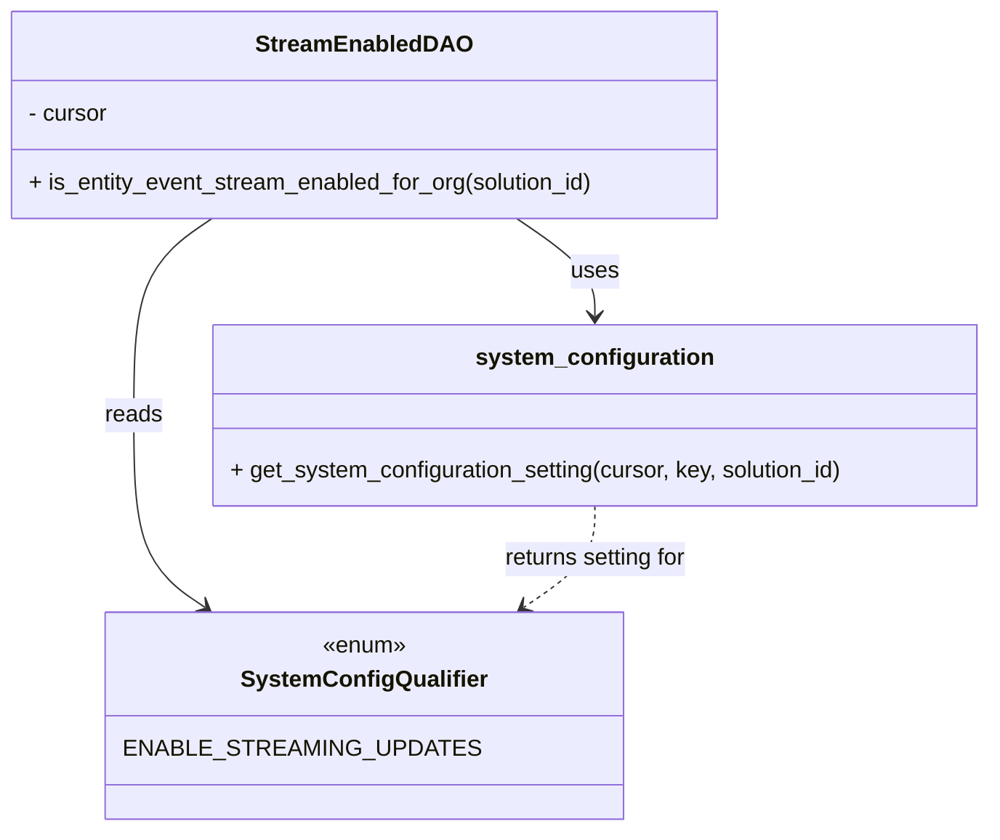

# Diagram: entity_core/entity_service/entity_service/db/check_if_org_enabled_to_stream.py


> Auto-generated by Obscura crawlers

## Diagram 1



### SVG

<svg id="container" width="691.8359375" xmlns="http://www.w3.org/2000/svg" class="classDiagram" height="578" viewBox="0 0 691.8359375 578" role="graphics-document document" aria-roledescription="class"><style>#container{font-family:"trebuchet ms",verdana,arial,sans-serif;font-size:16px;fill:#333;}@keyframes edge-animation-frame{from{stroke-dashoffset:0;}}@keyframes dash{to{stroke-dashoffset:0;}}#container .edge-animation-slow{stroke-dasharray:9,5!important;stroke-dashoffset:900;animation:dash 50s linear infinite;stroke-linecap:round;}#container .edge-animation-fast{stroke-dasharray:9,5!important;stroke-dashoffset:900;animation:dash 20s linear infinite;stroke-linecap:round;}#container .error-icon{fill:#552222;}#container .error-text{fill:#552222;stroke:#552222;}#container .edge-thickness-normal{stroke-width:1px;}#container .edge-thickness-thick{stroke-width:3.5px;}#container .edge-pattern-solid{stroke-dasharray:0;}#container .edge-thickness-invisible{stroke-width:0;fill:none;}#container .edge-pattern-dashed{stroke-dasharray:3;}#container .edge-pattern-dotted{stroke-dasharray:2;}#container .marker{fill:#333333;stroke:#333333;}#container .marker.cross{stroke:#333333;}#container svg{font-family:"trebuchet ms",verdana,arial,sans-serif;font-size:16px;}#container p{margin:0;}#container g.classGroup text{fill:#9370DB;stroke:none;font-family:"trebuchet ms",verdana,arial,sans-serif;font-size:10px;}#container g.classGroup text .title{font-weight:bolder;}#container .nodeLabel,#container .edgeLabel{color:#131300;}#container .edgeLabel .label rect{fill:#ECECFF;}#container .label text{fill:#131300;}#container .labelBkg{background:#ECECFF;}#container .edgeLabel .label span{background:#ECECFF;}#container .classTitle{font-weight:bolder;}#container .node rect,#container .node circle,#container .node ellipse,#container .node polygon,#container .node path{fill:#ECECFF;stroke:#9370DB;stroke-width:1px;}#container .divider{stroke:#9370DB;stroke-width:1;}#container g.clickable{cursor:pointer;}#container g.classGroup rect{fill:#ECECFF;stroke:#9370DB;}#container g.classGroup line{stroke:#9370DB;stroke-width:1;}#container .classLabel .box{stroke:none;stroke-width:0;fill:#ECECFF;opacity:0.5;}#container .classLabel .label{fill:#9370DB;font-size:10px;}#container .relation{stroke:#333333;stroke-width:1;fill:none;}#container .dashed-line{stroke-dasharray:3;}#container .dotted-line{stroke-dasharray:1 2;}#container #compositionStart,#container .composition{fill:#333333!important;stroke:#333333!important;stroke-width:1;}#container #compositionEnd,#container .composition{fill:#333333!important;stroke:#333333!important;stroke-width:1;}#container #dependencyStart,#container .dependency{fill:#333333!important;stroke:#333333!important;stroke-width:1;}#container #dependencyStart,#container .dependency{fill:#333333!important;stroke:#333333!important;stroke-width:1;}#container #extensionStart,#container .extension{fill:transparent!important;stroke:#333333!important;stroke-width:1;}#container #extensionEnd,#container .extension{fill:transparent!important;stroke:#333333!important;stroke-width:1;}#container #aggregationStart,#container .aggregation{fill:transparent!important;stroke:#333333!important;stroke-width:1;}#container #aggregationEnd,#container .aggregation{fill:transparent!important;stroke:#333333!important;stroke-width:1;}#container #lollipopStart,#container .lollipop{fill:#ECECFF!important;stroke:#333333!important;stroke-width:1;}#container #lollipopEnd,#container .lollipop{fill:#ECECFF!important;stroke:#333333!important;stroke-width:1;}#container .edgeTerminals{font-size:11px;line-height:initial;}#container .classTitleText{text-anchor:middle;font-size:18px;fill:#333;}#container .label-icon{display:inline-block;height:1em;overflow:visible;vertical-align:-0.125em;}#container .node .label-icon path{fill:currentColor;stroke:revert;stroke-width:revert;}#container :root{--mermaid-font-family:"trebuchet ms",verdana,arial,sans-serif;}</style><g><defs><marker id="container_class-aggregationStart" class="marker aggregation class" refX="18" refY="7" markerWidth="190" markerHeight="240" orient="auto"><path d="M 18,7 L9,13 L1,7 L9,1 Z"></path></marker></defs><defs><marker id="container_class-aggregationEnd" class="marker aggregation class" refX="1" refY="7" markerWidth="20" markerHeight="28" orient="auto"><path d="M 18,7 L9,13 L1,7 L9,1 Z"></path></marker></defs><defs><marker id="container_class-extensionStart" class="marker extension class" refX="18" refY="7" markerWidth="190" markerHeight="240" orient="auto"><path d="M 1,7 L18,13 V 1 Z"></path></marker></defs><defs><marker id="container_class-extensionEnd" class="marker extension class" refX="1" refY="7" markerWidth="20" markerHeight="28" orient="auto"><path d="M 1,1 V 13 L18,7 Z"></path></marker></defs><defs><marker id="container_class-compositionStart" class="marker composition class" refX="18" refY="7" markerWidth="190" markerHeight="240" orient="auto"><path d="M 18,7 L9,13 L1,7 L9,1 Z"></path></marker></defs><defs><marker id="container_class-compositionEnd" class="marker composition class" refX="1" refY="7" markerWidth="20" markerHeight="28" orient="auto"><path d="M 18,7 L9,13 L1,7 L9,1 Z"></path></marker></defs><defs><marker id="container_class-dependencyStart" class="marker dependency class" refX="6" refY="7" markerWidth="190" markerHeight="240" orient="auto"><path d="M 5,7 L9,13 L1,7 L9,1 Z"></path></marker></defs><defs><marker id="container_class-dependencyEnd" class="marker dependency class" refX="13" refY="7" markerWidth="20" markerHeight="28" orient="auto"><path d="M 18,7 L9,13 L14,7 L9,1 Z"></path></marker></defs><defs><marker id="container_class-lollipopStart" class="marker lollipop class" refX="13" refY="7" markerWidth="190" markerHeight="240" orient="auto"><circle stroke="black" fill="transparent" cx="7" cy="7" r="6"></circle></marker></defs><defs><marker id="container_class-lollipopEnd" class="marker lollipop class" refX="1" refY="7" markerWidth="190" markerHeight="240" orient="auto"><circle stroke="black" fill="transparent" cx="7" cy="7" r="6"></circle></marker></defs><g class="root"><g class="clusters"></g><g class="edgePaths"><path d="M361.397,152L370.525,158.167C379.653,164.333,397.908,176.667,407.036,188C416.164,199.333,416.164,209.667,416.164,214.833L416.164,220" id="id_StreamEnabledDAO_system_configuration_1" class="edge-thickness-normal edge-pattern-solid relation" style=";;;" data-edge="true" data-et="edge" data-id="id_StreamEnabledDAO_system_configuration_1" data-points="W3sieCI6MzYxLjM5NzMyNjU0ODE2NTE1LCJ5IjoxNTJ9LHsieCI6NDE2LjE2NDA2MjUsInkiOjE4OX0seyJ4Ijo0MTYuMTY0MDYyNSwieSI6MjI2fV0=" marker-end="url(#container_class-dependencyEnd)"></path><path d="M148.251,152L139.123,158.167C129.996,164.333,111.74,176.667,102.612,199.5C93.484,222.333,93.484,255.667,93.484,289C93.484,322.333,93.484,355.667,101.784,377.94C110.083,400.214,126.681,411.427,134.98,417.034L143.279,422.641" id="id_StreamEnabledDAO_SystemConfigQualifier_2" class="edge-thickness-normal edge-pattern-solid relation" style=";;;" data-edge="true" data-et="edge" data-id="id_StreamEnabledDAO_SystemConfigQualifier_2" data-points="W3sieCI6MTQ4LjI1MTExMDk1MTgzNDg1LCJ5IjoxNTJ9LHsieCI6OTMuNDg0Mzc1LCJ5IjoxODl9LHsieCI6OTMuNDg0Mzc1LCJ5IjoyODl9LHsieCI6OTMuNDg0Mzc1LCJ5IjozODl9LHsieCI6MTQ4LjI1MTExMDk1MTgzNDg1LCJ5Ijo0MjZ9XQ==" marker-end="url(#container_class-dependencyEnd)"></path><path d="M416.164,352L416.164,358.167C416.164,364.333,416.164,376.667,407.865,388.44C399.566,400.214,382.967,411.427,374.668,417.034L366.369,422.641" id="id_system_configuration_SystemConfigQualifier_3" class="edge-thickness-normal edge-pattern-dashed relation" style=";;;" data-edge="true" data-et="edge" data-id="id_system_configuration_SystemConfigQualifier_3" data-points="W3sieCI6NDE2LjE2NDA2MjUsInkiOjM1Mn0seyJ4Ijo0MTYuMTY0MDYyNSwieSI6Mzg5fSx7IngiOjM2MS4zOTczMjY1NDgxNjUxNSwieSI6NDI2fV0=" marker-end="url(#container_class-dependencyEnd)"></path></g><g class="edgeLabels"><g class="edgeLabel" transform="translate(416.1640625, 189)"><g class="label" data-id="id_StreamEnabledDAO_system_configuration_1" transform="translate(-16.4921875, -12)"><foreignObject width="32.984375" height="24"><div xmlns="http://www.w3.org/1999/xhtml" class="labelBkg" style="display: table-cell; white-space: nowrap; line-height: 1.5; max-width: 200px; text-align: center;"><span class="edgeLabel"><p>uses</p></span></div></foreignObject></g></g><g class="edgeLabel" transform="translate(93.484375, 289)"><g class="label" data-id="id_StreamEnabledDAO_SystemConfigQualifier_2" transform="translate(-20.0078125, -12)"><foreignObject width="40.015625" height="24"><div xmlns="http://www.w3.org/1999/xhtml" class="labelBkg" style="display: table-cell; white-space: nowrap; line-height: 1.5; max-width: 200px; text-align: center;"><span class="edgeLabel"><p>reads</p></span></div></foreignObject></g></g><g class="edgeLabel" transform="translate(416.1640625, 389)"><g class="label" data-id="id_system_configuration_SystemConfigQualifier_3" transform="translate(-65.84375, -12)"><foreignObject width="131.6875" height="24"><div xmlns="http://www.w3.org/1999/xhtml" class="labelBkg" style="display: table-cell; white-space: nowrap; line-height: 1.5; max-width: 200px; text-align: center;"><span class="edgeLabel"><p>returns setting for</p></span></div></foreignObject></g></g></g><g class="nodes"><g class="node default" id="classId-StreamEnabledDAO-0" transform="translate(254.82421875, 80)"><g class="basic label-container"><path d="M-246.82421875 -72 L246.82421875 -72 L246.82421875 72 L-246.82421875 72" stroke="none" stroke-width="0" fill="#ECECFF" style=""></path><path d="M-246.82421875 -72 C-127.05631155204325 -72, -7.288404354086509 -72, 246.82421875 -72 M-246.82421875 -72 C-101.4034769455688 -72, 44.017264858862404 -72, 246.82421875 -72 M246.82421875 -72 C246.82421875 -31.737760087297033, 246.82421875 8.524479825405933, 246.82421875 72 M246.82421875 -72 C246.82421875 -34.59462934627293, 246.82421875 2.810741307454137, 246.82421875 72 M246.82421875 72 C52.57839146679177 72, -141.66743581641646 72, -246.82421875 72 M246.82421875 72 C66.9079271898552 72, -113.0083643702896 72, -246.82421875 72 M-246.82421875 72 C-246.82421875 32.839612335469575, -246.82421875 -6.320775329060851, -246.82421875 -72 M-246.82421875 72 C-246.82421875 42.759167316844554, -246.82421875 13.5183346336891, -246.82421875 -72" stroke="#9370DB" stroke-width="1.3" fill="none" stroke-dasharray="0 0" style=""></path></g><g class="annotation-group text" transform="translate(0, -48)"></g><g class="label-group text" transform="translate(-70.8671875, -48)"><g class="label" style="font-weight: bolder" transform="translate(0,-12)"><foreignObject width="141.734375" height="24"><div xmlns="http://www.w3.org/1999/xhtml" style="display: table-cell; white-space: nowrap; line-height: 1.5; max-width: 190px; text-align: center;"><span class="nodeLabel markdown-node-label" style=""><p>StreamEnabledDAO</p></span></div></foreignObject></g></g><g class="members-group text" transform="translate(-234.82421875, 0)"><g class="label" style="" transform="translate(0,-12)"><foreignObject width="56.421875" height="24"><div xmlns="http://www.w3.org/1999/xhtml" style="display: table-cell; white-space: nowrap; line-height: 1.5; max-width: 115px; text-align: center;"><span class="nodeLabel markdown-node-label" style=""><p>- cursor</p></span></div></foreignObject></g></g><g class="methods-group text" transform="translate(-234.82421875, 48)"><g class="label" style="" transform="translate(0,-12)"><foreignObject width="398.78125" height="24"><div xmlns="http://www.w3.org/1999/xhtml" style="display: table-cell; white-space: nowrap; line-height: 1.5; max-width: 456px; text-align: center;"><span class="nodeLabel markdown-node-label" style=""><p>+ is_entity_event_stream_enabled_for_org(solution_id)</p></span></div></foreignObject></g></g><g class="divider" style=""><path d="M-246.82421875 -24 C-137.3881893753525 -24, -27.952160000704993 -24, 246.82421875 -24 M-246.82421875 -24 C-81.84603900733367 -24, 83.13214073533265 -24, 246.82421875 -24" stroke="#9370DB" stroke-width="1.3" fill="none" stroke-dasharray="0 0" style=""></path></g><g class="divider" style=""><path d="M-246.82421875 24 C-137.68831394394618 24, -28.55240913789237 24, 246.82421875 24 M-246.82421875 24 C-56.69834329645067 24, 133.42753215709865 24, 246.82421875 24" stroke="#9370DB" stroke-width="1.3" fill="none" stroke-dasharray="0 0" style=""></path></g></g><g class="node default" id="classId-SystemConfigQualifier-1" transform="translate(254.82421875, 498)"><g class="basic label-container"><path d="M-160.86328125 -72 L160.86328125 -72 L160.86328125 72 L-160.86328125 72" stroke="none" stroke-width="0" fill="#ECECFF" style=""></path><path d="M-160.86328125 -72 C-44.67393767971048 -72, 71.51540589057905 -72, 160.86328125 -72 M-160.86328125 -72 C-79.41228908029177 -72, 2.038703089416458 -72, 160.86328125 -72 M160.86328125 -72 C160.86328125 -17.69405029512422, 160.86328125 36.61189940975156, 160.86328125 72 M160.86328125 -72 C160.86328125 -14.535709235219983, 160.86328125 42.928581529560034, 160.86328125 72 M160.86328125 72 C77.7510255458032 72, -5.361230158393596 72, -160.86328125 72 M160.86328125 72 C73.56575582988383 72, -13.731769590232346 72, -160.86328125 72 M-160.86328125 72 C-160.86328125 27.519495414419623, -160.86328125 -16.961009171160754, -160.86328125 -72 M-160.86328125 72 C-160.86328125 24.668330194223508, -160.86328125 -22.663339611552985, -160.86328125 -72" stroke="#9370DB" stroke-width="1.3" fill="none" stroke-dasharray="0 0" style=""></path></g><g class="annotation-group text" transform="translate(-29.53125, -48)"><g class="label" style="" transform="translate(0,-12)"><foreignObject width="59.0625" height="24"><div xmlns="http://www.w3.org/1999/xhtml" style="display: table-cell; white-space: nowrap; line-height: 1.5; max-width: 109px; text-align: center;"><span class="nodeLabel markdown-node-label" style=""><p>«enum»</p></span></div></foreignObject></g></g><g class="label-group text" transform="translate(-80.9296875, -24)"><g class="label" style="font-weight: bolder" transform="translate(0,-12)"><foreignObject width="161.859375" height="24"><div xmlns="http://www.w3.org/1999/xhtml" style="display: table-cell; white-space: nowrap; line-height: 1.5; max-width: 210px; text-align: center;"><span class="nodeLabel markdown-node-label" style=""><p>SystemConfigQualifier</p></span></div></foreignObject></g></g><g class="members-group text" transform="translate(-148.86328125, 24)"><g class="label" style="" transform="translate(0,-12)"><foreignObject width="216.796875" height="24"><div xmlns="http://www.w3.org/1999/xhtml" style="display: table-cell; white-space: nowrap; line-height: 1.5; max-width: 267px; text-align: center;"><span class="nodeLabel markdown-node-label" style=""><p>ENABLE_STREAMING_UPDATES</p></span></div></foreignObject></g></g><g class="methods-group text" transform="translate(-148.86328125, 72)"></g><g class="divider" style=""><path d="M-160.86328125 0 C-42.685605699676785 0, 75.49206985064643 0, 160.86328125 0 M-160.86328125 0 C-48.18581425306583 0, 64.49165274386834 0, 160.86328125 0" stroke="#9370DB" stroke-width="1.3" fill="none" stroke-dasharray="0 0" style=""></path></g><g class="divider" style=""><path d="M-160.86328125 48 C-69.39850580051139 48, 22.066269648977226 48, 160.86328125 48 M-160.86328125 48 C-86.70694273913436 48, -12.550604228268725 48, 160.86328125 48" stroke="#9370DB" stroke-width="1.3" fill="none" stroke-dasharray="0 0" style=""></path></g></g><g class="node default" id="classId-system_configuration-2" transform="translate(416.1640625, 289)"><g class="basic label-container"><path d="M-267.671875 -63 L267.671875 -63 L267.671875 63 L-267.671875 63" stroke="none" stroke-width="0" fill="#ECECFF" style=""></path><path d="M-267.671875 -63 C-55.94439201270691 -63, 155.78309097458617 -63, 267.671875 -63 M-267.671875 -63 C-148.42128093073873 -63, -29.170686861477463 -63, 267.671875 -63 M267.671875 -63 C267.671875 -16.26131395766044, 267.671875 30.477372084679118, 267.671875 63 M267.671875 -63 C267.671875 -37.59620158673505, 267.671875 -12.192403173470097, 267.671875 63 M267.671875 63 C75.5725306935179 63, -116.52681361296419 63, -267.671875 63 M267.671875 63 C105.51397472293002 63, -56.64392555413997 63, -267.671875 63 M-267.671875 63 C-267.671875 22.784011709937296, -267.671875 -17.431976580125408, -267.671875 -63 M-267.671875 63 C-267.671875 27.720080722194822, -267.671875 -7.559838555610355, -267.671875 -63" stroke="#9370DB" stroke-width="1.3" fill="none" stroke-dasharray="0 0" style=""></path></g><g class="annotation-group text" transform="translate(0, -39)"></g><g class="label-group text" transform="translate(-78.375, -39)"><g class="label" style="font-weight: bolder" transform="translate(0,-12)"><foreignObject width="156.75" height="24"><div xmlns="http://www.w3.org/1999/xhtml" style="display: table-cell; white-space: nowrap; line-height: 1.5; max-width: 204px; text-align: center;"><span class="nodeLabel markdown-node-label" style=""><p>system_configuration</p></span></div></foreignObject></g></g><g class="members-group text" transform="translate(-255.671875, 9)"></g><g class="methods-group text" transform="translate(-255.671875, 39)"><g class="label" style="" transform="translate(0,-12)"><foreignObject width="432.96875" height="24"><div xmlns="http://www.w3.org/1999/xhtml" style="display: table-cell; white-space: nowrap; line-height: 1.5; max-width: 490px; text-align: center;"><span class="nodeLabel markdown-node-label" style=""><p>+ get_system_configuration_setting(cursor, key, solution_id)</p></span></div></foreignObject></g></g><g class="divider" style=""><path d="M-267.671875 -15 C-67.61121708667076 -15, 132.44944082665847 -15, 267.671875 -15 M-267.671875 -15 C-56.18047224338409 -15, 155.31093051323182 -15, 267.671875 -15" stroke="#9370DB" stroke-width="1.3" fill="none" stroke-dasharray="0 0" style=""></path></g><g class="divider" style=""><path d="M-267.671875 9 C-144.01581574167204 9, -20.359756483344057 9, 267.671875 9 M-267.671875 9 C-70.1767092369117 9, 127.31845652617659 9, 267.671875 9" stroke="#9370DB" stroke-width="1.3" fill="none" stroke-dasharray="0 0" style=""></path></g></g></g></g></g></svg>

## Diagram 2

```mermaid
flowchart TD
    Start([Start]) --> GetConfig[/get_system_configuration_setting(cursor, ENABLE_STREAMING_UPDATES, solution_id)/]
    GetConfig --> IsNotNull{org_allowed_to_produce_event != null}
    IsNotNull -- no --> ReturnFalse1([return False])
    IsNotNull -- yes --> HasKey{'ENABLE_STREAMING_UPDATES' in org_allowed_to_produce_event}
    HasKey -- no --> ReturnFalse2([return False])
    HasKey -- yes --> ValueCheck{org_allowed_to_produce_event.get(ENABLE_STREAMING_UPDATES) == "true"}
    ValueCheck -- yes --> ReturnTrue([return True])
    ValueCheck -- no --> ReturnFalse3([return False])
```

> SVG rendering failed for this diagram.
