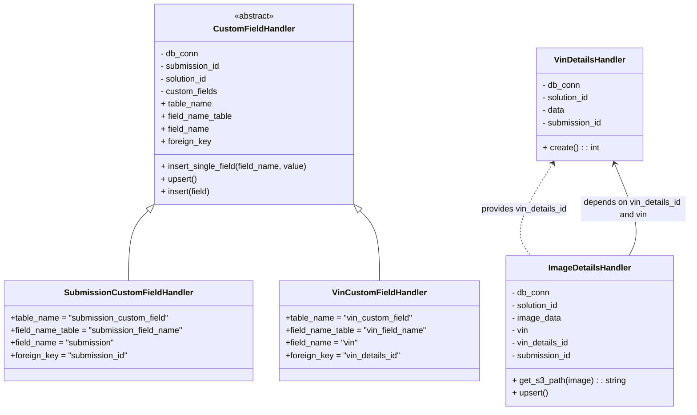

# Diagram: entity_core/entity_service/entity_service/db/daos/damage_field_handlers.py

> Auto-generated by Obscura crawlers

## Mermaid

### SVG

<svg id="container" width="1315.4232177734375" xmlns="http://www.w3.org/2000/svg" class="classDiagram" height="786" viewBox="0 0 1315.4232177734375 786" role="graphics-document document" aria-roledescription="class"><g><defs><marker id="container_class-aggregationStart" class="marker aggregation class" refX="18" refY="7" markerWidth="190" markerHeight="240" orient="auto"><path d="M 18,7 L9,13 L1,7 L9,1 Z"></path></marker></defs><defs><marker id="container_class-aggregationEnd" class="marker aggregation class" refX="1" refY="7" markerWidth="20" markerHeight="28" orient="auto"><path d="M 18,7 L9,13 L1,7 L9,1 Z"></path></marker></defs><defs><marker id="container_class-extensionStart" class="marker extension class" refX="18" refY="7" markerWidth="190" markerHeight="240" orient="auto"><path d="M 1,7 L18,13 V 1 Z"></path></marker></defs><defs><marker id="container_class-extensionEnd" class="marker extension class" refX="1" refY="7" markerWidth="20" markerHeight="28" orient="auto"><path d="M 1,1 V 13 L18,7 Z"></path></marker></defs><defs><marker id="container_class-compositionStart" class="marker composition class" refX="18" refY="7" markerWidth="190" markerHeight="240" orient="auto"><path d="M 18,7 L9,13 L1,7 L9,1 Z"></path></marker></defs><defs><marker id="container_class-compositionEnd" class="marker composition class" refX="1" refY="7" markerWidth="20" markerHeight="28" orient="auto"><path d="M 18,7 L9,13 L1,7 L9,1 Z"></path></marker></defs><defs><marker id="container_class-dependencyStart" class="marker dependency class" refX="6" refY="7" markerWidth="190" markerHeight="240" orient="auto"><path d="M 5,7 L9,13 L1,7 L9,1 Z"></path></marker></defs><defs><marker id="container_class-dependencyEnd" class="marker dependency class" refX="13" refY="7" markerWidth="20" markerHeight="28" orient="auto"><path d="M 18,7 L9,13 L14,7 L9,1 Z"></path></marker></defs><defs><marker id="container_class-lollipopStart" class="marker lollipop class" refX="13" refY="7" markerWidth="190" markerHeight="240" orient="auto"><circle stroke="black" fill="transparent" cx="7" cy="7" r="6"></circle></marker></defs><defs><marker id="container_class-lollipopEnd" class="marker lollipop class" refX="1" refY="7" markerWidth="190" markerHeight="240" orient="auto"><circle stroke="black" fill="transparent" cx="7" cy="7" r="6"></circle></marker></defs><g class="root"><g class="clusters"></g><g class="edgePaths"><path d="M281.449,404.245L275.37,410.371C269.291,416.496,257.134,428.748,251.055,451.041C244.977,473.333,244.977,505.667,244.977,521.833L244.977,538" id="id_CustomFieldHandler_SubmissionCustomFieldHandler_1" class="edge-thickness-normal edge-pattern-solid relation" style=";;;" data-edge="true" data-et="edge" data-id="id_CustomFieldHandler_SubmissionCustomFieldHandler_1" data-points="W3sieCI6MjkzLjU5OTMwOTUxNzYzNDksInkiOjM5Mn0seyJ4IjoyNDQuOTc2NTYyNSwieSI6NDQxfSx7IngiOjI0NC45NzY1NjI1LCJ5Ijo1Mzh9XQ==" marker-start="url(#container_class-extensionStart)"></path><path d="M686.793,404.245L692.872,410.371C698.951,416.496,711.108,428.748,717.187,451.041C723.266,473.333,723.266,505.667,723.266,521.833L723.266,538" id="id_CustomFieldHandler_VinCustomFieldHandler_2" class="edge-thickness-normal edge-pattern-solid relation" style=";;;" data-edge="true" data-et="edge" data-id="id_CustomFieldHandler_VinCustomFieldHandler_2" data-points="W3sieCI6Njc0LjY0Mjg3Nzk4MjM2NTEsInkiOjM5Mn0seyJ4Ijo3MjMuMjY1NjI1LCJ5Ijo0NDF9LHsieCI6NzIzLjI2NTYyNSwieSI6NTM4fV0=" marker-start="url(#container_class-extensionStart)"></path><path d="M1053.417,313.115L1040.352,334.429C1027.286,355.744,1001.155,398.372,994.34,427.853C987.526,457.333,1000.029,473.667,1006.28,481.833L1012.531,490" id="id_VinDetailsHandler_ImageDetailsHandler_3" class="edge-thickness-normal edge-pattern-dashed relation" style=";;;" data-edge="true" data-et="edge" data-id="id_VinDetailsHandler_ImageDetailsHandler_3" data-points="W3sieCI6MTA1Ni41NTMxOTYzMTc0Mjc0LCJ5IjozMDh9LHsieCI6OTc1LjAyMzQzNzUsInkiOjQ0MX0seyJ4IjoxMDEyLjUzMTEyODU2MjE3NjEsInkiOjQ5MH1d" marker-start="url(#container_class-dependencyStart)"></path><path d="M1198.87,490L1203.187,481.833C1207.503,473.667,1216.136,457.333,1211.46,427.921C1206.783,398.508,1188.797,356.017,1179.804,334.771L1170.811,313.525" id="id_ImageDetailsHandler_VinDetailsHandler_4" class="edge-thickness-normal edge-pattern-solid relation" style=";;;" data-edge="true" data-et="edge" data-id="id_ImageDetailsHandler_VinDetailsHandler_4" data-points="W3sieCI6MTE5OC44NzAxODI5NjYzMjEyLCJ5Ijo0OTB9LHsieCI6MTIyNC43Njk1MzEyNSwieSI6NDQxfSx7IngiOjExNjguNDcyNjA3NjI0NDgxMywieSI6MzA4fV0=" marker-end="url(#container_class-dependencyEnd)"></path></g><g class="edgeLabels"><g class="edgeLabel"><g class="label" data-id="id_CustomFieldHandler_SubmissionCustomFieldHandler_1" transform="translate(0, 0)"><foreignObject width="0" height="0">

</foreignObject></g></g><g class="edgeLabel"><g class="label" data-id="id_CustomFieldHandler_VinCustomFieldHandler_2" transform="translate(0, 0)"><foreignObject width="0" height="0">

</foreignObject></g></g><g class="edgeLabel" transform="translate(999.66333, 400.80478)"><g class="label" data-id="id_VinDetailsHandler_ImageDetailsHandler_3" transform="translate(-84.0234375, -12)"><foreignObject width="168.046875" height="24">

provides vin_details_id

</foreignObject></g></g><g class="edgeLabel" transform="translate(1207.4232, 400.01976)"><g class="label" data-id="id_ImageDetailsHandler_VinDetailsHandler_4" transform="translate(-100, -24)"><foreignObject width="200" height="48">

depends on vin_details_id and vin

</foreignObject></g></g></g><g class="nodes"><g class="node default" id="classId-CustomFieldHandler-0" transform="translate(484.12109375, 200)"><g class="basic label-container"><path d="M-190.66015625 -192 L190.66015625 -192 L190.66015625 192 L-190.66015625 192" stroke="none" stroke-width="0" fill="#ECECFF" style=""></path><path d="M-190.66015625 -192 C-91.78734054118709 -192, 7.085475167625816 -192, 190.66015625 -192 M-190.66015625 -192 C-108.23075529524421 -192, -25.801354340488416 -192, 190.66015625 -192 M190.66015625 -192 C190.66015625 -56.51328783027867, 190.66015625 78.97342433944266, 190.66015625 192 M190.66015625 -192 C190.66015625 -47.52576920856478, 190.66015625 96.94846158287044, 190.66015625 192 M190.66015625 192 C77.18532875503718 192, -36.28949873992565 192, -190.66015625 192 M190.66015625 192 C82.72897426836285 192, -25.202207713274305 192, -190.66015625 192 M-190.66015625 192 C-190.66015625 66.60267108955875, -190.66015625 -58.79465782088249, -190.66015625 -192 M-190.66015625 192 C-190.66015625 56.041200917947265, -190.66015625 -79.91759816410547, -190.66015625 -192" stroke="#9370DB" stroke-width="1.3" fill="none" stroke-dasharray="0 0" style=""></path></g><g class="annotation-group text" transform="translate(-38.609375, -168)"><g class="label" style="" transform="translate(0,-12)"><foreignObject width="77.21875" height="24">

«abstract»

</foreignObject></g></g><g class="label-group text" transform="translate(-73.8515625, -144)"><g class="label" style="font-weight: bolder" transform="translate(0,-12)"><foreignObject width="147.703125" height="24">

CustomFieldHandler

</foreignObject></g></g><g class="members-group text" transform="translate(-178.66015625, -96)"><g class="label" style="" transform="translate(0,-12)"><foreignObject width="72.875" height="24">

- db_conn

</foreignObject></g><g class="label" style="" transform="translate(0,12)"><foreignObject width="115.625" height="24">

- submission_id

</foreignObject></g><g class="label" style="" transform="translate(0,36)"><foreignObject width="92.921875" height="24">

- solution_id

</foreignObject></g><g class="label" style="" transform="translate(0,60)"><foreignObject width="111.125" height="24">

- custom_fields

</foreignObject></g><g class="label" style="" transform="translate(0,84)"><foreignObject width="97.9375" height="24">

+ table_name

</foreignObject></g><g class="label" style="" transform="translate(0,108)"><foreignObject width="138.046875" height="24">

+ field_name_table

</foreignObject></g><g class="label" style="" transform="translate(0,132)"><foreignObject width="93.15625" height="24">

+ field_name

</foreignObject></g><g class="label" style="" transform="translate(0,156)"><foreignObject width="96.296875" height="24">

+ foreign_key

</foreignObject></g></g><g class="methods-group text" transform="translate(-178.66015625, 120)"><g class="label" style="" transform="translate(0,-12)"><foreignObject width="283.46875" height="24">

+ insert_single_field(field_name, value)

</foreignObject></g><g class="label" style="" transform="translate(0,12)"><foreignObject width="69.5625" height="24">

+ upsert()

</foreignObject></g><g class="label" style="" transform="translate(0,36)"><foreignObject width="96.734375" height="24">

+ insert(field)

</foreignObject></g></g><g class="divider" style=""><path d="M-190.66015625 -120 C-109.99677528280203 -120, -29.333394315604068 -120, 190.66015625 -120 M-190.66015625 -120 C-82.05410152764632 -120, 26.55195319470735 -120, 190.66015625 -120" stroke="#9370DB" stroke-width="1.3" fill="none" stroke-dasharray="0 0" style=""></path></g><g class="divider" style=""><path d="M-190.66015625 96 C-109.82920250371924 96, -28.99824875743849 96, 190.66015625 96 M-190.66015625 96 C-66.15113726267755 96, 58.3578817246449 96, 190.66015625 96" stroke="#9370DB" stroke-width="1.3" fill="none" stroke-dasharray="0 0" style=""></path></g></g><g class="node default" id="classId-SubmissionCustomFieldHandler-1" transform="translate(244.9765625, 634)"><g class="basic label-container"><path d="M-236.9765625 -96 L236.9765625 -96 L236.9765625 96 L-236.9765625 96" stroke="none" stroke-width="0" fill="#ECECFF" style=""></path><path d="M-236.9765625 -96 C-71.06033802063283 -96, 94.85588645873435 -96, 236.9765625 -96 M-236.9765625 -96 C-134.98113297048843 -96, -32.98570344097689 -96, 236.9765625 -96 M236.9765625 -96 C236.9765625 -57.02916642794543, 236.9765625 -18.058332855890853, 236.9765625 96 M236.9765625 -96 C236.9765625 -22.085186924259602, 236.9765625 51.829626151480795, 236.9765625 96 M236.9765625 96 C71.51612989252456 96, -93.94430271495088 96, -236.9765625 96 M236.9765625 96 C57.04721208042429 96, -122.88213833915142 96, -236.9765625 96 M-236.9765625 96 C-236.9765625 20.067733424281585, -236.9765625 -55.86453315143683, -236.9765625 -96 M-236.9765625 96 C-236.9765625 43.52235970574782, -236.9765625 -8.955280588504365, -236.9765625 -96" stroke="#9370DB" stroke-width="1.3" fill="none" stroke-dasharray="0 0" style=""></path></g><g class="annotation-group text" transform="translate(0, -72)"></g><g class="label-group text" transform="translate(-116.015625, -72)"><g class="label" style="font-weight: bolder" transform="translate(0,-12)"><foreignObject width="232.03125" height="24">

SubmissionCustomFieldHandler

</foreignObject></g></g><g class="members-group text" transform="translate(-224.9765625, -24)"><g class="label" style="" transform="translate(0,-12)"><foreignObject width="306.203125" height="24">

+table_name = "submission_custom_field"

</foreignObject></g><g class="label" style="" transform="translate(0,12)"><foreignObject width="333.9375" height="24">

+field_name_table = "submission_field_name"

</foreignObject></g><g class="label" style="" transform="translate(0,36)"><foreignObject width="200.140625" height="24">

+field_name = "submission"

</foreignObject></g><g class="label" style="" transform="translate(0,60)"><foreignObject width="225.828125" height="24">

+foreign_key = "submission_id"

</foreignObject></g></g><g class="methods-group text" transform="translate(-224.9765625, 96)"></g><g class="divider" style=""><path d="M-236.9765625 -48 C-130.17676768457142 -48, -23.376972869142833 -48, 236.9765625 -48 M-236.9765625 -48 C-130.56045545437155 -48, -24.14434840874307 -48, 236.9765625 -48" stroke="#9370DB" stroke-width="1.3" fill="none" stroke-dasharray="0 0" style=""></path></g><g class="divider" style=""><path d="M-236.9765625 72 C-71.23240632249704 72, 94.51174985500592 72, 236.9765625 72 M-236.9765625 72 C-112.0079127766448 72, 12.960736946710398 72, 236.9765625 72" stroke="#9370DB" stroke-width="1.3" fill="none" stroke-dasharray="0 0" style=""></path></g></g><g class="node default" id="classId-VinCustomFieldHandler-2" transform="translate(723.265625, 634)"><g class="basic label-container"><path d="M-191.3125 -96 L191.3125 -96 L191.3125 96 L-191.3125 96" stroke="none" stroke-width="0" fill="#ECECFF" style=""></path><path d="M-191.3125 -96 C-91.30795782409584 -96, 8.696584351808326 -96, 191.3125 -96 M-191.3125 -96 C-86.6552347905627 -96, 18.002030418874597 -96, 191.3125 -96 M191.3125 -96 C191.3125 -56.027714597373084, 191.3125 -16.055429194746168, 191.3125 96 M191.3125 -96 C191.3125 -27.078898974158577, 191.3125 41.84220205168285, 191.3125 96 M191.3125 96 C93.42585230380173 96, -4.460795392396534 96, -191.3125 96 M191.3125 96 C106.87303224403246 96, 22.433564488064917 96, -191.3125 96 M-191.3125 96 C-191.3125 22.56251980201891, -191.3125 -50.87496039596218, -191.3125 -96 M-191.3125 96 C-191.3125 30.6362541457392, -191.3125 -34.7274917085216, -191.3125 -96" stroke="#9370DB" stroke-width="1.3" fill="none" stroke-dasharray="0 0" style=""></path></g><g class="annotation-group text" transform="translate(0, -72)"></g><g class="label-group text" transform="translate(-85.28125, -72)"><g class="label" style="font-weight: bolder" transform="translate(0,-12)"><foreignObject width="170.5625" height="24">

VinCustomFieldHandler

</foreignObject></g></g><g class="members-group text" transform="translate(-179.3125, -24)"><g class="label" style="" transform="translate(0,-12)"><foreignObject width="245.59375" height="24">

+table_name = "vin_custom_field"

</foreignObject></g><g class="label" style="" transform="translate(0,12)"><foreignObject width="273.34375" height="24">

+field_name_table = "vin_field_name"

</foreignObject></g><g class="label" style="" transform="translate(0,36)"><foreignObject width="139.53125" height="24">

+field_name = "vin"

</foreignObject></g><g class="label" style="" transform="translate(0,60)"><foreignObject width="222.234375" height="24">

+foreign_key = "vin_details_id"

</foreignObject></g></g><g class="methods-group text" transform="translate(-179.3125, 96)"></g><g class="divider" style=""><path d="M-191.3125 -48 C-44.55431569370381 -48, 102.20386861259237 -48, 191.3125 -48 M-191.3125 -48 C-105.58061000415277 -48, -19.84872000830555 -48, 191.3125 -48" stroke="#9370DB" stroke-width="1.3" fill="none" stroke-dasharray="0 0" style=""></path></g><g class="divider" style=""><path d="M-191.3125 72 C-43.793142611702734 72, 103.72621477659453 72, 191.3125 72 M-191.3125 72 C-99.56384486722574 72, -7.815189734451479 72, 191.3125 72" stroke="#9370DB" stroke-width="1.3" fill="none" stroke-dasharray="0 0" style=""></path></g></g><g class="node default" id="classId-VinDetailsHandler-3" transform="translate(1122.7578125, 200)"><g class="basic label-container"><path d="M-102.82421875 -108 L102.82421875 -108 L102.82421875 108 L-102.82421875 108" stroke="none" stroke-width="0" fill="#ECECFF" style=""></path><path d="M-102.82421875 -108 C-42.707554818231685 -108, 17.40910911353663 -108, 102.82421875 -108 M-102.82421875 -108 C-37.348091083165855 -108, 28.12803658366829 -108, 102.82421875 -108 M102.82421875 -108 C102.82421875 -35.50192778246752, 102.82421875 36.99614443506496, 102.82421875 108 M102.82421875 -108 C102.82421875 -55.598987286895934, 102.82421875 -3.1979745737918677, 102.82421875 108 M102.82421875 108 C42.76384282737326 108, -17.29653309525348 108, -102.82421875 108 M102.82421875 108 C42.28749167723919 108, -18.249235395521623 108, -102.82421875 108 M-102.82421875 108 C-102.82421875 35.43493160786312, -102.82421875 -37.13013678427376, -102.82421875 -108 M-102.82421875 108 C-102.82421875 30.220766837972988, -102.82421875 -47.558466324054024, -102.82421875 -108" stroke="#9370DB" stroke-width="1.3" fill="none" stroke-dasharray="0 0" style=""></path></g><g class="annotation-group text" transform="translate(0, -84)"></g><g class="label-group text" transform="translate(-66.0234375, -84)"><g class="label" style="font-weight: bolder" transform="translate(0,-12)"><foreignObject width="132.046875" height="24">

VinDetailsHandler

</foreignObject></g></g><g class="members-group text" transform="translate(-90.82421875, -36)"><g class="label" style="" transform="translate(0,-12)"><foreignObject width="72.875" height="24">

- db_conn

</foreignObject></g><g class="label" style="" transform="translate(0,12)"><foreignObject width="92.921875" height="24">

- solution_id

</foreignObject></g><g class="label" style="" transform="translate(0,36)"><foreignObject width="43.328125" height="24">

- data

</foreignObject></g><g class="label" style="" transform="translate(0,60)"><foreignObject width="115.625" height="24">

- submission_id

</foreignObject></g></g><g class="methods-group text" transform="translate(-90.82421875, 84)"><g class="label" style="" transform="translate(0,-12)"><foreignObject width="107.53125" height="24">

+ create() : : int

</foreignObject></g></g><g class="divider" style=""><path d="M-102.82421875 -60 C-39.191200725549955 -60, 24.44181729890009 -60, 102.82421875 -60 M-102.82421875 -60 C-41.696775907439566 -60, 19.43066693512087 -60, 102.82421875 -60" stroke="#9370DB" stroke-width="1.3" fill="none" stroke-dasharray="0 0" style=""></path></g><g class="divider" style=""><path d="M-102.82421875 60 C-41.33452650869559 60, 20.155165732608822 60, 102.82421875 60 M-102.82421875 60 C-55.32644265024654 60, -7.828666550493082 60, 102.82421875 60" stroke="#9370DB" stroke-width="1.3" fill="none" stroke-dasharray="0 0" style=""></path></g></g><g class="node default" id="classId-ImageDetailsHandler-4" transform="translate(1122.7578125, 634)"><g class="basic label-container"><path d="M-158.1796875 -144 L158.1796875 -144 L158.1796875 144 L-158.1796875 144" stroke="none" stroke-width="0" fill="#ECECFF" style=""></path><path d="M-158.1796875 -144 C-80.07063950464814 -144, -1.9615915092962837 -144, 158.1796875 -144 M-158.1796875 -144 C-76.19038257890324 -144, 5.798922342193521 -144, 158.1796875 -144 M158.1796875 -144 C158.1796875 -36.36427087922905, 158.1796875 71.2714582415419, 158.1796875 144 M158.1796875 -144 C158.1796875 -38.97167713124206, 158.1796875 66.05664573751588, 158.1796875 144 M158.1796875 144 C61.39290849025926 144, -35.39387051948148 144, -158.1796875 144 M158.1796875 144 C68.60634071724476 144, -20.967006065510475 144, -158.1796875 144 M-158.1796875 144 C-158.1796875 83.56652696881618, -158.1796875 23.133053937632354, -158.1796875 -144 M-158.1796875 144 C-158.1796875 59.26246086176086, -158.1796875 -25.475078276478285, -158.1796875 -144" stroke="#9370DB" stroke-width="1.3" fill="none" stroke-dasharray="0 0" style=""></path></g><g class="annotation-group text" transform="translate(0, -120)"></g><g class="label-group text" transform="translate(-76.640625, -120)"><g class="label" style="font-weight: bolder" transform="translate(0,-12)"><foreignObject width="153.28125" height="24">

ImageDetailsHandler

</foreignObject></g></g><g class="members-group text" transform="translate(-146.1796875, -72)"><g class="label" style="" transform="translate(0,-12)"><foreignObject width="72.875" height="24">

- db_conn

</foreignObject></g><g class="label" style="" transform="translate(0,12)"><foreignObject width="92.921875" height="24">

- solution_id

</foreignObject></g><g class="label" style="" transform="translate(0,36)"><foreignObject width="94.5625" height="24">

- image_data

</foreignObject></g><g class="label" style="" transform="translate(0,60)"><foreignObject width="32.453125" height="24">

- vin

</foreignObject></g><g class="label" style="" transform="translate(0,84)"><foreignObject width="111.859375" height="24">

- vin_details_id

</foreignObject></g><g class="label" style="" transform="translate(0,108)"><foreignObject width="115.625" height="24">

- submission_id

</foreignObject></g></g><g class="methods-group text" transform="translate(-146.1796875, 96)"><g class="label" style="" transform="translate(0,-12)"><foreignObject width="215.71875" height="24">

+ get_s3_path(image) : : string

</foreignObject></g><g class="label" style="" transform="translate(0,12)"><foreignObject width="69.5625" height="24">

+ upsert()

</foreignObject></g></g><g class="divider" style=""><path d="M-158.1796875 -96 C-72.266654319012 -96, 13.64637886197599 -96, 158.1796875 -96 M-158.1796875 -96 C-71.97516736463209 -96, 14.22935277073583 -96, 158.1796875 -96" stroke="#9370DB" stroke-width="1.3" fill="none" stroke-dasharray="0 0" style=""></path></g><g class="divider" style=""><path d="M-158.1796875 72 C-83.84117391072853 72, -9.502660321457057 72, 158.1796875 72 M-158.1796875 72 C-49.33691932724017 72, 59.505848845519665 72, 158.1796875 72" stroke="#9370DB" stroke-width="1.3" fill="none" stroke-dasharray="0 0" style=""></path></g></g></g></g></g></svg>
