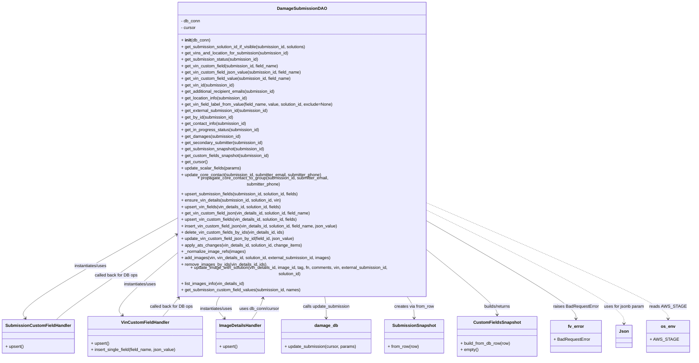

# Diagram: entity_core/entity_service/entity_service/db/daos/damage_submission_dao.py


> Auto-generated by Obscura crawlers

## Diagram 1



### SVG

<svg id="container" width="2559.484375" xmlns="http://www.w3.org/2000/svg" class="classDiagram" height="1296" viewBox="17.3515625 0 2559.484375 1296" role="graphics-document document" aria-roledescription="class"><style>#container{font-family:"trebuchet ms",verdana,arial,sans-serif;font-size:16px;fill:#333;}@keyframes edge-animation-frame{from{stroke-dashoffset:0;}}@keyframes dash{to{stroke-dashoffset:0;}}#container .edge-animation-slow{stroke-dasharray:9,5!important;stroke-dashoffset:900;animation:dash 50s linear infinite;stroke-linecap:round;}#container .edge-animation-fast{stroke-dasharray:9,5!important;stroke-dashoffset:900;animation:dash 20s linear infinite;stroke-linecap:round;}#container .error-icon{fill:#552222;}#container .error-text{fill:#552222;stroke:#552222;}#container .edge-thickness-normal{stroke-width:1px;}#container .edge-thickness-thick{stroke-width:3.5px;}#container .edge-pattern-solid{stroke-dasharray:0;}#container .edge-thickness-invisible{stroke-width:0;fill:none;}#container .edge-pattern-dashed{stroke-dasharray:3;}#container .edge-pattern-dotted{stroke-dasharray:2;}#container .marker{fill:#333333;stroke:#333333;}#container .marker.cross{stroke:#333333;}#container svg{font-family:"trebuchet ms",verdana,arial,sans-serif;font-size:16px;}#container p{margin:0;}#container g.classGroup text{fill:#9370DB;stroke:none;font-family:"trebuchet ms",verdana,arial,sans-serif;font-size:10px;}#container g.classGroup text .title{font-weight:bolder;}#container .nodeLabel,#container .edgeLabel{color:#131300;}#container .edgeLabel .label rect{fill:#ECECFF;}#container .label text{fill:#131300;}#container .labelBkg{background:#ECECFF;}#container .edgeLabel .label span{background:#ECECFF;}#container .classTitle{font-weight:bolder;}#container .node rect,#container .node circle,#container .node ellipse,#container .node polygon,#container .node path{fill:#ECECFF;stroke:#9370DB;stroke-width:1px;}#container .divider{stroke:#9370DB;stroke-width:1;}#container g.clickable{cursor:pointer;}#container g.classGroup rect{fill:#ECECFF;stroke:#9370DB;}#container g.classGroup line{stroke:#9370DB;stroke-width:1;}#container .classLabel .box{stroke:none;stroke-width:0;fill:#ECECFF;opacity:0.5;}#container .classLabel .label{fill:#9370DB;font-size:10px;}#container .relation{stroke:#333333;stroke-width:1;fill:none;}#container .dashed-line{stroke-dasharray:3;}#container .dotted-line{stroke-dasharray:1 2;}#container #compositionStart,#container .composition{fill:#333333!important;stroke:#333333!important;stroke-width:1;}#container #compositionEnd,#container .composition{fill:#333333!important;stroke:#333333!important;stroke-width:1;}#container #dependencyStart,#container .dependency{fill:#333333!important;stroke:#333333!important;stroke-width:1;}#container #dependencyStart,#container .dependency{fill:#333333!important;stroke:#333333!important;stroke-width:1;}#container #extensionStart,#container .extension{fill:transparent!important;stroke:#333333!important;stroke-width:1;}#container #extensionEnd,#container .extension{fill:transparent!important;stroke:#333333!important;stroke-width:1;}#container #aggregationStart,#container .aggregation{fill:transparent!important;stroke:#333333!important;stroke-width:1;}#container #aggregationEnd,#container .aggregation{fill:transparent!important;stroke:#333333!important;stroke-width:1;}#container #lollipopStart,#container .lollipop{fill:#ECECFF!important;stroke:#333333!important;stroke-width:1;}#container #lollipopEnd,#container .lollipop{fill:#ECECFF!important;stroke:#333333!important;stroke-width:1;}#container .edgeTerminals{font-size:11px;line-height:initial;}#container .classTitleText{text-anchor:middle;font-size:18px;fill:#333;}#container .label-icon{display:inline-block;height:1em;overflow:visible;vertical-align:-0.125em;}#container .node .label-icon path{fill:currentColor;stroke:revert;stroke-width:revert;}#container :root{--mermaid-font-family:"trebuchet ms",verdana,arial,sans-serif;}</style><g><defs><marker id="container_class-aggregationStart" class="marker aggregation class" refX="18" refY="7" markerWidth="190" markerHeight="240" orient="auto"><path d="M 18,7 L9,13 L1,7 L9,1 Z"></path></marker></defs><defs><marker id="container_class-aggregationEnd" class="marker aggregation class" refX="1" refY="7" markerWidth="20" markerHeight="28" orient="auto"><path d="M 18,7 L9,13 L1,7 L9,1 Z"></path></marker></defs><defs><marker id="container_class-extensionStart" class="marker extension class" refX="18" refY="7" markerWidth="190" markerHeight="240" orient="auto"><path d="M 1,7 L18,13 V 1 Z"></path></marker></defs><defs><marker id="container_class-extensionEnd" class="marker extension class" refX="1" refY="7" markerWidth="20" markerHeight="28" orient="auto"><path d="M 1,1 V 13 L18,7 Z"></path></marker></defs><defs><marker id="container_class-compositionStart" class="marker composition class" refX="18" refY="7" markerWidth="190" markerHeight="240" orient="auto"><path d="M 18,7 L9,13 L1,7 L9,1 Z"></path></marker></defs><defs><marker id="container_class-compositionEnd" class="marker composition class" refX="1" refY="7" markerWidth="20" markerHeight="28" orient="auto"><path d="M 18,7 L9,13 L1,7 L9,1 Z"></path></marker></defs><defs><marker id="container_class-dependencyStart" class="marker dependency class" refX="6" refY="7" markerWidth="190" markerHeight="240" orient="auto"><path d="M 5,7 L9,13 L1,7 L9,1 Z"></path></marker></defs><defs><marker id="container_class-dependencyEnd" class="marker dependency class" refX="13" refY="7" markerWidth="20" markerHeight="28" orient="auto"><path d="M 18,7 L9,13 L14,7 L9,1 Z"></path></marker></defs><defs><marker id="container_class-lollipopStart" class="marker lollipop class" refX="13" refY="7" markerWidth="190" markerHeight="240" orient="auto"><circle stroke="black" fill="transparent" cx="7" cy="7" r="6"></circle></marker></defs><defs><marker id="container_class-lollipopEnd" class="marker lollipop class" refX="1" refY="7" markerWidth="190" markerHeight="240" orient="auto"><circle stroke="black" fill="transparent" cx="7" cy="7" r="6"></circle></marker></defs><g class="root"><g class="clusters"></g><g class="edgePaths"><path d="M656.723,789.94L559.156,841.784C461.589,893.627,266.454,997.313,174.279,1056.517C82.104,1115.72,92.887,1130.44,98.278,1137.8L103.67,1145.16" id="id_DamageSubmissionDAO_SubmissionCustomFieldHandler_1" class="edge-thickness-normal edge-pattern-solid relation" style=";;;" data-edge="true" data-et="edge" data-id="id_DamageSubmissionDAO_SubmissionCustomFieldHandler_1" data-points="W3sieCI6NjU2LjcyMjY1NjI1LCJ5Ijo3ODkuOTQwNDIwMzQxODcyMX0seyJ4Ijo3MS4zMjAzMTI1LCJ5IjoxMTAxfSx7IngiOjEwNy4yMTU4MjAzMTI1LCJ5IjoxMTUwfV0=" marker-end="url(#container_class-dependencyEnd)"></path><path d="M656.723,920.424L619.308,950.52C581.893,980.616,507.064,1040.808,475.253,1076.372C443.442,1111.937,454.649,1122.873,460.253,1128.341L465.856,1133.81" id="id_DamageSubmissionDAO_VinCustomFieldHandler_2" class="edge-thickness-normal edge-pattern-solid relation" style=";;;" data-edge="true" data-et="edge" data-id="id_DamageSubmissionDAO_VinCustomFieldHandler_2" data-points="W3sieCI6NjU2LjcyMjY1NjI1LCJ5Ijo5MjAuNDIzNTk1NjI0MzQzMX0seyJ4Ijo0MzIuMjM0Mzc1LCJ5IjoxMTAxfSx7IngiOjQ3MC4xNTA1OTk4ODgzOTI5LCJ5IjoxMTM4fV0=" marker-end="url(#container_class-dependencyEnd)"></path><path d="M827.696,1064L824.111,1070.167C820.527,1076.333,813.357,1088.667,816.058,1102.238C818.76,1115.809,831.332,1130.617,837.618,1138.022L843.904,1145.426" id="id_DamageSubmissionDAO_ImageDetailsHandler_3" class="edge-thickness-normal edge-pattern-solid relation" style=";;;" data-edge="true" data-et="edge" data-id="id_DamageSubmissionDAO_ImageDetailsHandler_3" data-points="W3sieCI6ODI3LjY5NjA1MjI2NzY5OTEsInkiOjEwNjR9LHsieCI6ODA2LjE4NzUsInkiOjExMDF9LHsieCI6ODQ3Ljc4NzU5NzY1NjI1LCJ5IjoxMTUwfV0=" marker-end="url(#container_class-dependencyEnd)"></path><path d="M1221.455,1064L1222.469,1070.167C1223.483,1076.333,1225.511,1088.667,1226.525,1102C1227.539,1115.333,1227.539,1129.667,1227.539,1136.833L1227.539,1144" id="id_DamageSubmissionDAO_damage_db_4" class="edge-thickness-normal edge-pattern-solid relation" style=";;;" data-edge="true" data-et="edge" data-id="id_DamageSubmissionDAO_damage_db_4" data-points="W3sieCI6MTIyMS40NTQ2ODA1ODYyODMzLCJ5IjoxMDY0fSx7IngiOjEyMjcuNTM5MDYyNSwieSI6MTEwMX0seyJ4IjoxMjI3LjUzOTA2MjUsInkiOjExNTB9XQ==" marker-end="url(#container_class-dependencyEnd)"></path><path d="M1527.825,1064L1532.418,1070.167C1537.01,1076.333,1546.194,1088.667,1550.787,1102C1555.379,1115.333,1555.379,1129.667,1555.379,1136.833L1555.379,1144" id="id_DamageSubmissionDAO_SubmissionSnapshot_5" class="edge-thickness-normal edge-pattern-solid relation" style=";;;" data-edge="true" data-et="edge" data-id="id_DamageSubmissionDAO_SubmissionSnapshot_5" data-points="W3sieCI6MTUyNy44MjUzNjY0MjY5OTEyLCJ5IjoxMDY0fSx7IngiOjE1NTUuMzc4OTA2MjUsInkiOjExMDF9LHsieCI6MTU1NS4zNzg5MDYyNSwieSI6MTE1MH1d" marker-end="url(#container_class-dependencyEnd)"></path><path d="M1612.535,906.431L1654.372,938.86C1696.208,971.288,1779.882,1036.144,1821.718,1073.739C1863.555,1111.333,1863.555,1121.667,1863.555,1126.833L1863.555,1132" id="id_DamageSubmissionDAO_CustomFieldsSnapshot_6" class="edge-thickness-normal edge-pattern-solid relation" style=";;;" data-edge="true" data-et="edge" data-id="id_DamageSubmissionDAO_CustomFieldsSnapshot_6" data-points="W3sieCI6MTYxMi41MzUxNTYyNSwieSI6OTA2LjQzMTQ0NjEwMjczMDR9LHsieCI6MTg2My41NTQ2ODc1LCJ5IjoxMTAxfSx7IngiOjE4NjMuNTU0Njg3NSwieSI6MTEzOH1d" marker-end="url(#container_class-dependencyEnd)"></path><path d="M1612.535,800.256L1703.184,850.38C1793.833,900.504,1975.132,1000.752,2065.781,1058.543C2156.43,1116.333,2156.43,1131.667,2156.43,1139.333L2156.43,1147" id="id_DamageSubmissionDAO_fv_error_7" class="edge-thickness-normal edge-pattern-solid relation" style=";;;" data-edge="true" data-et="edge" data-id="id_DamageSubmissionDAO_fv_error_7" data-points="W3sieCI6MTYxMi41MzUxNTYyNSwieSI6ODAwLjI1NjA0MzA2MTIzMTZ9LHsieCI6MjE1Ni40Mjk2ODc1LCJ5IjoxMTAxfSx7IngiOjIxNTYuNDI5Njg3NSwieSI6MTE1M31d" marker-end="url(#container_class-dependencyEnd)"></path><path d="M1612.535,760.468L1733.37,817.224C1854.206,873.979,2095.876,987.489,2216.712,1054.911C2337.547,1122.333,2337.547,1143.667,2337.547,1154.333L2337.547,1165" id="id_DamageSubmissionDAO_Json_8" class="edge-thickness-normal edge-pattern-dashed relation" style=";;;" data-edge="true" data-et="edge" data-id="id_DamageSubmissionDAO_Json_8" data-points="W3sieCI6MTYxMi41MzUxNTYyNSwieSI6NzYwLjQ2ODM2NjMwOTc4NzF9LHsieCI6MjMzNy41NDY4NzUsInkiOjExMDF9LHsieCI6MjMzNy41NDY4NzUsInkiOjExNzF9XQ==" marker-end="url(#container_class-dependencyEnd)"></path><path d="M1612.535,734.196L1759.946,795.33C1907.357,856.464,2202.178,978.732,2349.589,1047.533C2497,1116.333,2497,1131.667,2497,1139.333L2497,1147" id="id_DamageSubmissionDAO_os_env_9" class="edge-thickness-normal edge-pattern-dashed relation" style=";;;" data-edge="true" data-et="edge" data-id="id_DamageSubmissionDAO_os_env_9" data-points="W3sieCI6MTYxMi41MzUxNTYyNSwieSI6NzM0LjE5NjM4ODk5MzIyNDd9LHsieCI6MjQ5NywieSI6MTEwMX0seyJ4IjoyNDk3LCJ5IjoxMTUzfV0=" marker-end="url(#container_class-dependencyEnd)"></path><path d="M610.681,1138L615.917,1131.833C621.152,1125.667,631.623,1113.333,641.577,1101.754C651.531,1090.174,660.968,1079.349,665.687,1073.936L670.406,1068.523" id="id_VinCustomFieldHandler_DamageSubmissionDAO_10" class="edge-thickness-normal edge-pattern-solid relation" style=";;;" data-edge="true" data-et="edge" data-id="id_VinCustomFieldHandler_DamageSubmissionDAO_10" data-points="W3sieCI6NjEwLjY4MTQzMTM2MTYwNzEsInkiOjExMzh9LHsieCI6NjQyLjA5Mzc1LCJ5IjoxMTAxfSx7IngiOjY3NC4zNDgyNjQ2NTcwNzk3LCJ5IjoxMDY0fV0=" marker-end="url(#container_class-dependencyEnd)"></path><path d="M217.927,1150L226.296,1141.833C234.665,1133.667,251.403,1117.333,323.698,1067.483C395.993,1017.633,523.845,934.266,587.771,892.583L651.697,850.899" id="id_SubmissionCustomFieldHandler_DamageSubmissionDAO_11" class="edge-thickness-normal edge-pattern-solid relation" style=";;;" data-edge="true" data-et="edge" data-id="id_SubmissionCustomFieldHandler_DamageSubmissionDAO_11" data-points="W3sieCI6MjE3LjkyNzI0NjA5Mzc1LCJ5IjoxMTUwfSx7IngiOjI2OC4xNDA2MjUsInkiOjExMDF9LHsieCI6NjU2LjcyMjY1NjI1LCJ5Ijo4NDcuNjIyMjUzOTc5NTYwMX1d" marker-end="url(#container_class-dependencyEnd)"></path><path d="M946.172,1150L951.993,1141.833C957.813,1133.667,969.453,1117.333,976.687,1103.965C983.921,1090.597,986.748,1080.193,988.161,1074.992L989.575,1069.79" id="id_ImageDetailsHandler_DamageSubmissionDAO_12" class="edge-thickness-normal edge-pattern-solid relation" style=";;;" data-edge="true" data-et="edge" data-id="id_ImageDetailsHandler_DamageSubmissionDAO_12" data-points="W3sieCI6OTQ2LjE3MjM2MzI4MTI1LCJ5IjoxMTUwfSx7IngiOjk4MS4wOTM3NSwieSI6MTEwMX0seyJ4Ijo5OTEuMTQ4MjY0NjU3MDc5NiwieSI6MTA2NH1d" marker-end="url(#container_class-dependencyEnd)"></path></g><g class="edgeLabels"><g class="edgeLabel" transform="translate(337.20198, 959.72103)"><g class="label" data-id="id_DamageSubmissionDAO_SubmissionCustomFieldHandler_1" transform="translate(-63.3203125, -12)"><foreignObject width="126.640625" height="24"><div xmlns="http://www.w3.org/1999/xhtml" class="labelBkg" style="display: table-cell; white-space: nowrap; line-height: 1.5; max-width: 200px; text-align: center;"><span class="edgeLabel"><p>instantiates/uses</p></span></div></foreignObject></g></g><g class="edgeLabel" transform="translate(523.83847, 1027.31447)"><g class="label" data-id="id_DamageSubmissionDAO_VinCustomFieldHandler_2" transform="translate(-63.3203125, -12)"><foreignObject width="126.640625" height="24"><div xmlns="http://www.w3.org/1999/xhtml" class="labelBkg" style="display: table-cell; white-space: nowrap; line-height: 1.5; max-width: 200px; text-align: center;"><span class="edgeLabel"><p>instantiates/uses</p></span></div></foreignObject></g></g><g class="edgeLabel" transform="translate(813.13836, 1109.18729)"><g class="label" data-id="id_DamageSubmissionDAO_ImageDetailsHandler_3" transform="translate(-63.3203125, -12)"><foreignObject width="126.640625" height="24"><div xmlns="http://www.w3.org/1999/xhtml" class="labelBkg" style="display: table-cell; white-space: nowrap; line-height: 1.5; max-width: 200px; text-align: center;"><span class="edgeLabel"><p>instantiates/uses</p></span></div></foreignObject></g></g><g class="edgeLabel" transform="translate(1227.5390625, 1101)"><g class="label" data-id="id_DamageSubmissionDAO_damage_db_4" transform="translate(-89.5, -12)"><foreignObject width="179" height="24"><div xmlns="http://www.w3.org/1999/xhtml" class="labelBkg" style="display: table-cell; white-space: nowrap; line-height: 1.5; max-width: 200px; text-align: center;"><span class="edgeLabel"><p>calls update_submission</p></span></div></foreignObject></g></g><g class="edgeLabel" transform="translate(1555.37890625, 1101)"><g class="label" data-id="id_DamageSubmissionDAO_SubmissionSnapshot_5" transform="translate(-75.4296875, -12)"><foreignObject width="150.859375" height="24"><div xmlns="http://www.w3.org/1999/xhtml" class="labelBkg" style="display: table-cell; white-space: nowrap; line-height: 1.5; max-width: 200px; text-align: center;"><span class="edgeLabel"><p>creates via from_row</p></span></div></foreignObject></g></g><g class="edgeLabel" transform="translate(1863.5546875, 1101)"><g class="label" data-id="id_DamageSubmissionDAO_CustomFieldsSnapshot_6" transform="translate(-52.6796875, -12)"><foreignObject width="105.359375" height="24"><div xmlns="http://www.w3.org/1999/xhtml" class="labelBkg" style="display: table-cell; white-space: nowrap; line-height: 1.5; max-width: 200px; text-align: center;"><span class="edgeLabel"><p>builds/returns</p></span></div></foreignObject></g></g><g class="edgeLabel" transform="translate(2156.4296875, 1101)"><g class="label" data-id="id_DamageSubmissionDAO_fv_error_7" transform="translate(-84.7734375, -12)"><foreignObject width="169.546875" height="24"><div xmlns="http://www.w3.org/1999/xhtml" class="labelBkg" style="display: table-cell; white-space: nowrap; line-height: 1.5; max-width: 200px; text-align: center;"><span class="edgeLabel"><p>raises BadRequestError</p></span></div></foreignObject></g></g><g class="edgeLabel" transform="translate(2337.546875, 1101)"><g class="label" data-id="id_DamageSubmissionDAO_Json_8" transform="translate(-76.34375, -12)"><foreignObject width="152.6875" height="24"><div xmlns="http://www.w3.org/1999/xhtml" class="labelBkg" style="display: table-cell; white-space: nowrap; line-height: 1.5; max-width: 200px; text-align: center;"><span class="edgeLabel"><p>uses for jsonb param</p></span></div></foreignObject></g></g><g class="edgeLabel" transform="translate(2497, 1101)"><g class="label" data-id="id_DamageSubmissionDAO_os_env_9" transform="translate(-63.109375, -12)"><foreignObject width="126.21875" height="24"><div xmlns="http://www.w3.org/1999/xhtml" class="labelBkg" style="display: table-cell; white-space: nowrap; line-height: 1.5; max-width: 200px; text-align: center;"><span class="edgeLabel"><p>reads AWS_STAGE</p></span></div></foreignObject></g></g><g class="edgeLabel" transform="translate(642.09375, 1101)"><g class="label" data-id="id_VinCustomFieldHandler_DamageSubmissionDAO_10" transform="translate(-80.7734375, -12)"><foreignObject width="161.546875" height="24"><div xmlns="http://www.w3.org/1999/xhtml" class="labelBkg" style="display: table-cell; white-space: nowrap; line-height: 1.5; max-width: 200px; text-align: center;"><span class="edgeLabel"><p>called back for DB ops</p></span></div></foreignObject></g></g><g class="edgeLabel" transform="translate(433.04682, 993.47171)"><g class="label" data-id="id_SubmissionCustomFieldHandler_DamageSubmissionDAO_11" transform="translate(-80.7734375, -12)"><foreignObject width="161.546875" height="24"><div xmlns="http://www.w3.org/1999/xhtml" class="labelBkg" style="display: table-cell; white-space: nowrap; line-height: 1.5; max-width: 200px; text-align: center;"><span class="edgeLabel"><p>called back for DB ops</p></span></div></foreignObject></g></g><g class="edgeLabel" transform="translate(974.75932, 1109.88816)"><g class="label" data-id="id_ImageDetailsHandler_DamageSubmissionDAO_12" transform="translate(-76.3203125, -12)"><foreignObject width="152.640625" height="24"><div xmlns="http://www.w3.org/1999/xhtml" class="labelBkg" style="display: table-cell; white-space: nowrap; line-height: 1.5; max-width: 200px; text-align: center;"><span class="edgeLabel"><p>uses db_conn/cursor</p></span></div></foreignObject></g></g></g><g class="nodes"><g class="node default" id="classId-DamageSubmissionDAO-0" transform="translate(1134.62890625, 536)"><g class="basic label-container"><path d="M-477.90625 -528 L477.90625 -528 L477.90625 528 L-477.90625 528" stroke="none" stroke-width="0" fill="#ECECFF" style=""></path><path d="M-477.90625 -528 C-250.27443204265663 -528, -22.642614085313255 -528, 477.90625 -528 M-477.90625 -528 C-183.1730263158138 -528, 111.56019736837243 -528, 477.90625 -528 M477.90625 -528 C477.90625 -222.07054426666508, 477.90625 83.85891146666984, 477.90625 528 M477.90625 -528 C477.90625 -297.1377786384046, 477.90625 -66.27555727680925, 477.90625 528 M477.90625 528 C106.03608171923622 528, -265.83408656152756 528, -477.90625 528 M477.90625 528 C272.7346663868216 528, 67.56308277364309 528, -477.90625 528 M-477.90625 528 C-477.90625 230.35639649946648, -477.90625 -67.28720700106703, -477.90625 -528 M-477.90625 528 C-477.90625 273.388980147609, -477.90625 18.777960295218065, -477.90625 -528" stroke="#9370DB" stroke-width="1.3" fill="none" stroke-dasharray="0 0" style=""></path></g><g class="annotation-group text" transform="translate(0, -504)"></g><g class="label-group text" transform="translate(-86.6875, -504)"><g class="label" style="font-weight: bolder" transform="translate(0,-12)"><foreignObject width="173.375" height="24"><div xmlns="http://www.w3.org/1999/xhtml" style="display: table-cell; white-space: nowrap; line-height: 1.5; max-width: 222px; text-align: center;"><span class="nodeLabel markdown-node-label" style=""><p>DamageSubmissionDAO</p></span></div></foreignObject></g></g><g class="members-group text" transform="translate(-465.90625, -456)"><g class="label" style="" transform="translate(0,-12)"><foreignObject width="72.875" height="24"><div xmlns="http://www.w3.org/1999/xhtml" style="display: table-cell; white-space: nowrap; line-height: 1.5; max-width: 130px; text-align: center;"><span class="nodeLabel markdown-node-label" style=""><p>- db_conn</p></span></div></foreignObject></g><g class="label" style="" transform="translate(0,12)"><foreignObject width="56.421875" height="24"><div xmlns="http://www.w3.org/1999/xhtml" style="display: table-cell; white-space: nowrap; line-height: 1.5; max-width: 115px; text-align: center;"><span class="nodeLabel markdown-node-label" style=""><p>- cursor</p></span></div></foreignObject></g></g><g class="methods-group text" transform="translate(-465.90625, -384)"><g class="label" style="" transform="translate(0,-12)"><foreignObject width="109.21875" height="24"><div xmlns="http://www.w3.org/1999/xhtml" style="display: table-cell; white-space: nowrap; line-height: 1.5; max-width: 199px; text-align: center;"><span class="nodeLabel markdown-node-label" style=""><p>+ <strong>init</strong>(db_conn)</p></span></div></foreignObject></g><g class="label" style="" transform="translate(0,12)"><foreignObject width="479.609375" height="24"><div xmlns="http://www.w3.org/1999/xhtml" style="display: table-cell; white-space: nowrap; line-height: 1.5; max-width: 537px; text-align: center;"><span class="nodeLabel markdown-node-label" style=""><p>+ get_submission_solution_id_if_visible(submission_id, solutions)</p></span></div></foreignObject></g><g class="label" style="" transform="translate(0,36)"><foreignObject width="408.09375" height="24"><div xmlns="http://www.w3.org/1999/xhtml" style="display: table-cell; white-space: nowrap; line-height: 1.5; max-width: 465px; text-align: center;"><span class="nodeLabel markdown-node-label" style=""><p>+ get_vins_and_location_for_submission(submission_id)</p></span></div></foreignObject></g><g class="label" style="" transform="translate(0,60)"><foreignObject width="293.65625" height="24"><div xmlns="http://www.w3.org/1999/xhtml" style="display: table-cell; white-space: nowrap; line-height: 1.5; max-width: 351px; text-align: center;"><span class="nodeLabel markdown-node-label" style=""><p>+ get_submission_status(submission_id)</p></span></div></foreignObject></g><g class="label" style="" transform="translate(0,84)"><foreignObject width="369.65625" height="24"><div xmlns="http://www.w3.org/1999/xhtml" style="display: table-cell; white-space: nowrap; line-height: 1.5; max-width: 427px; text-align: center;"><span class="nodeLabel markdown-node-label" style=""><p>+ get_vin_custom_field(submission_id, field_name)</p></span></div></foreignObject></g><g class="label" style="" transform="translate(0,108)"><foreignObject width="455.9375" height="24"><div xmlns="http://www.w3.org/1999/xhtml" style="display: table-cell; white-space: nowrap; line-height: 1.5; max-width: 513px; text-align: center;"><span class="nodeLabel markdown-node-label" style=""><p>+ get_vin_custom_field_json_value(submission_id, field_name)</p></span></div></foreignObject></g><g class="label" style="" transform="translate(0,132)"><foreignObject width="416.375" height="24"><div xmlns="http://www.w3.org/1999/xhtml" style="display: table-cell; white-space: nowrap; line-height: 1.5; max-width: 474px; text-align: center;"><span class="nodeLabel markdown-node-label" style=""><p>+ get_vin_custom_field_value(submission_id, field_name)</p></span></div></foreignObject></g><g class="label" style="" transform="translate(0,156)"><foreignObject width="202.09375" height="24"><div xmlns="http://www.w3.org/1999/xhtml" style="display: table-cell; white-space: nowrap; line-height: 1.5; max-width: 259px; text-align: center;"><span class="nodeLabel markdown-node-label" style=""><p>+ get_vin_id(submission_id)</p></span></div></foreignObject></g><g class="label" style="" transform="translate(0,180)"><foreignObject width="361.265625" height="24"><div xmlns="http://www.w3.org/1999/xhtml" style="display: table-cell; white-space: nowrap; line-height: 1.5; max-width: 419px; text-align: center;"><span class="nodeLabel markdown-node-label" style=""><p>+ get_additional_recipient_emails(submission_id)</p></span></div></foreignObject></g><g class="label" style="" transform="translate(0,204)"><foreignObject width="254.15625" height="24"><div xmlns="http://www.w3.org/1999/xhtml" style="display: table-cell; white-space: nowrap; line-height: 1.5; max-width: 312px; text-align: center;"><span class="nodeLabel markdown-node-label" style=""><p>+ get_location_info(submission_id)</p></span></div></foreignObject></g><g class="label" style="" transform="translate(0,228)"><foreignObject width="576.515625" height="24"><div xmlns="http://www.w3.org/1999/xhtml" style="display: table-cell; white-space: nowrap; line-height: 1.5; max-width: 634px; text-align: center;"><span class="nodeLabel markdown-node-label" style=""><p>+ get_vin_field_label_from_value(field_name, value, solution_id, exclude=None)</p></span></div></foreignObject></g><g class="label" style="" transform="translate(0,252)"><foreignObject width="330.71875" height="24"><div xmlns="http://www.w3.org/1999/xhtml" style="display: table-cell; white-space: nowrap; line-height: 1.5; max-width: 388px; text-align: center;"><span class="nodeLabel markdown-node-label" style=""><p>+ get_external_submission_id(submission_id)</p></span></div></foreignObject></g><g class="label" style="" transform="translate(0,276)"><foreignObject width="197.640625" height="24"><div xmlns="http://www.w3.org/1999/xhtml" style="display: table-cell; white-space: nowrap; line-height: 1.5; max-width: 255px; text-align: center;"><span class="nodeLabel markdown-node-label" style=""><p>+ get_by_id(submission_id)</p></span></div></foreignObject></g><g class="label" style="" transform="translate(0,300)"><foreignObject width="248.6875" height="24"><div xmlns="http://www.w3.org/1999/xhtml" style="display: table-cell; white-space: nowrap; line-height: 1.5; max-width: 306px; text-align: center;"><span class="nodeLabel markdown-node-label" style=""><p>+ get_contact_info(submission_id)</p></span></div></foreignObject></g><g class="label" style="" transform="translate(0,324)"><foreignObject width="295.078125" height="24"><div xmlns="http://www.w3.org/1999/xhtml" style="display: table-cell; white-space: nowrap; line-height: 1.5; max-width: 352px; text-align: center;"><span class="nodeLabel markdown-node-label" style=""><p>+ get_in_progress_status(submission_id)</p></span></div></foreignObject></g><g class="label" style="" transform="translate(0,348)"><foreignObject width="222.875" height="24"><div xmlns="http://www.w3.org/1999/xhtml" style="display: table-cell; white-space: nowrap; line-height: 1.5; max-width: 280px; text-align: center;"><span class="nodeLabel markdown-node-label" style=""><p>+ get_damages(submission_id)</p></span></div></foreignObject></g><g class="label" style="" transform="translate(0,372)"><foreignObject width="311.53125" height="24"><div xmlns="http://www.w3.org/1999/xhtml" style="display: table-cell; white-space: nowrap; line-height: 1.5; max-width: 369px; text-align: center;"><span class="nodeLabel markdown-node-label" style=""><p>+ get_secondary_submitter(submission_id)</p></span></div></foreignObject></g><g class="label" style="" transform="translate(0,396)"><foreignObject width="316.28125" height="24"><div xmlns="http://www.w3.org/1999/xhtml" style="display: table-cell; white-space: nowrap; line-height: 1.5; max-width: 374px; text-align: center;"><span class="nodeLabel markdown-node-label" style=""><p>+ get_submission_snapshot(submission_id)</p></span></div></foreignObject></g><g class="label" style="" transform="translate(0,420)"><foreignObject width="333.546875" height="24"><div xmlns="http://www.w3.org/1999/xhtml" style="display: table-cell; white-space: nowrap; line-height: 1.5; max-width: 391px; text-align: center;"><span class="nodeLabel markdown-node-label" style=""><p>+ get_custom_fields_snapshot(submission_id)</p></span></div></foreignObject></g><g class="label" style="" transform="translate(0,444)"><foreignObject width="98.890625" height="24"><div xmlns="http://www.w3.org/1999/xhtml" style="display: table-cell; white-space: nowrap; line-height: 1.5; max-width: 156px; text-align: center;"><span class="nodeLabel markdown-node-label" style=""><p>+ get_cursor()</p></span></div></foreignObject></g><g class="label" style="" transform="translate(0,468)"><foreignObject width="224.78125" height="24"><div xmlns="http://www.w3.org/1999/xhtml" style="display: table-cell; white-space: nowrap; line-height: 1.5; max-width: 282px; text-align: center;"><span class="nodeLabel markdown-node-label" style=""><p>+ update_scalar_fields(params)</p></span></div></foreignObject></g><g class="label" style="" transform="translate(0,492)"><foreignObject width="537.234375" height="24"><div xmlns="http://www.w3.org/1999/xhtml" style="display: table-cell; white-space: nowrap; line-height: 1.5; max-width: 595px; text-align: center;"><span class="nodeLabel markdown-node-label" style=""><p>+ update_core_contact(submission_id, submitter_email, submitter_phone)</p></span></div></foreignObject></g><g class="label" style="" transform="translate(0,516)"><foreignObject width="632.5" height="24"><div xmlns="http://www.w3.org/1999/xhtml" style="display: table-cell; white-space: nowrap; line-height: 1.5; max-width: 690px; text-align: center;"><span class="nodeLabel markdown-node-label" style=""><p>+ propagate_core_contact_to_group(submission_id, submitter_email, submitter_phone)</p></span></div></foreignObject></g><g class="label" style="" transform="translate(0,540)"><foreignObject width="450.859375" height="24"><div xmlns="http://www.w3.org/1999/xhtml" style="display: table-cell; white-space: nowrap; line-height: 1.5; max-width: 508px; text-align: center;"><span class="nodeLabel markdown-node-label" style=""><p>+ upsert_submission_fields(submission_id, solution_id, fields)</p></span></div></foreignObject></g><g class="label" style="" transform="translate(0,564)"><foreignObject width="383.578125" height="24"><div xmlns="http://www.w3.org/1999/xhtml" style="display: table-cell; white-space: nowrap; line-height: 1.5; max-width: 441px; text-align: center;"><span class="nodeLabel markdown-node-label" style=""><p>+ ensure_vin_details(submission_id, solution_id, vin)</p></span></div></foreignObject></g><g class="label" style="" transform="translate(0,588)"><foreignObject width="385.84375" height="24"><div xmlns="http://www.w3.org/1999/xhtml" style="display: table-cell; white-space: nowrap; line-height: 1.5; max-width: 443px; text-align: center;"><span class="nodeLabel markdown-node-label" style=""><p>+ upsert_vin_fields(vin_details_id, solution_id, fields)</p></span></div></foreignObject></g><g class="label" style="" transform="translate(0,612)"><foreignObject width="495.765625" height="24"><div xmlns="http://www.w3.org/1999/xhtml" style="display: table-cell; white-space: nowrap; line-height: 1.5; max-width: 553px; text-align: center;"><span class="nodeLabel markdown-node-label" style=""><p>+ get_vin_custom_field_json(vin_details_id, solution_id, field_name)</p></span></div></foreignObject></g><g class="label" style="" transform="translate(0,636)"><foreignObject width="446.71875" height="24"><div xmlns="http://www.w3.org/1999/xhtml" style="display: table-cell; white-space: nowrap; line-height: 1.5; max-width: 504px; text-align: center;"><span class="nodeLabel markdown-node-label" style=""><p>+ upsert_vin_custom_fields(vin_details_id, solution_id, fields)</p></span></div></foreignObject></g><g class="label" style="" transform="translate(0,660)"><foreignObject width="600.546875" height="24"><div xmlns="http://www.w3.org/1999/xhtml" style="display: table-cell; white-space: nowrap; line-height: 1.5; max-width: 658px; text-align: center;"><span class="nodeLabel markdown-node-label" style=""><p>+ insert_vin_custom_field_json(vin_details_id, solution_id, field_name, json_value)</p></span></div></foreignObject></g><g class="label" style="" transform="translate(0,684)"><foreignObject width="391.6875" height="24"><div xmlns="http://www.w3.org/1999/xhtml" style="display: table-cell; white-space: nowrap; line-height: 1.5; max-width: 449px; text-align: center;"><span class="nodeLabel markdown-node-label" style=""><p>+ delete_vin_custom_fields_by_ids(vin_details_id, ids)</p></span></div></foreignObject></g><g class="label" style="" transform="translate(0,708)"><foreignObject width="431.265625" height="24"><div xmlns="http://www.w3.org/1999/xhtml" style="display: table-cell; white-space: nowrap; line-height: 1.5; max-width: 489px; text-align: center;"><span class="nodeLabel markdown-node-label" style=""><p>+ update_vin_custom_field_json_by_id(field_id, json_value)</p></span></div></foreignObject></g><g class="label" style="" transform="translate(0,732)"><foreignObject width="458.609375" height="24"><div xmlns="http://www.w3.org/1999/xhtml" style="display: table-cell; white-space: nowrap; line-height: 1.5; max-width: 516px; text-align: center;"><span class="nodeLabel markdown-node-label" style=""><p>+ apply_ats_changes(vin_details_id, solution_id, change_items)</p></span></div></foreignObject></g><g class="label" style="" transform="translate(0,756)"><foreignObject width="240.609375" height="24"><div xmlns="http://www.w3.org/1999/xhtml" style="display: table-cell; white-space: nowrap; line-height: 1.5; max-width: 298px; text-align: center;"><span class="nodeLabel markdown-node-label" style=""><p>+ _normalize_image_refs(images)</p></span></div></foreignObject></g><g class="label" style="" transform="translate(0,780)"><foreignObject width="570.90625" height="24"><div xmlns="http://www.w3.org/1999/xhtml" style="display: table-cell; white-space: nowrap; line-height: 1.5; max-width: 628px; text-align: center;"><span class="nodeLabel markdown-node-label" style=""><p>+ add_images(vin, vin_details_id, solution_id, external_submission_id, images)</p></span></div></foreignObject></g><g class="label" style="" transform="translate(0,804)"><foreignObject width="321.0625" height="24"><div xmlns="http://www.w3.org/1999/xhtml" style="display: table-cell; white-space: nowrap; line-height: 1.5; max-width: 378px; text-align: center;"><span class="nodeLabel markdown-node-label" style=""><p>+ remove_images_by_ids(vin_details_id, ids)</p></span></div></foreignObject></g><g class="label" style="" transform="translate(0,828)"><foreignObject width="845.125" height="24"><div xmlns="http://www.w3.org/1999/xhtml" style="display: table-cell; white-space: nowrap; line-height: 1.5; max-width: 902px; text-align: center;"><span class="nodeLabel markdown-node-label" style=""><p>+ update_image_with_solution(vin_details_id, image_id, tag, fn, comments, vin, external_submission_id, solution_id)</p></span></div></foreignObject></g><g class="label" style="" transform="translate(0,852)"><foreignObject width="242" height="24"><div xmlns="http://www.w3.org/1999/xhtml" style="display: table-cell; white-space: nowrap; line-height: 1.5; max-width: 299px; text-align: center;"><span class="nodeLabel markdown-node-label" style=""><p>+ list_images_info(vin_details_id)</p></span></div></foreignObject></g><g class="label" style="" transform="translate(0,876)"><foreignObject width="452.15625" height="24"><div xmlns="http://www.w3.org/1999/xhtml" style="display: table-cell; white-space: nowrap; line-height: 1.5; max-width: 510px; text-align: center;"><span class="nodeLabel markdown-node-label" style=""><p>+ get_submission_custom_field_values(submission_id, names)</p></span></div></foreignObject></g></g><g class="divider" style=""><path d="M-477.90625 -480 C-259.75785437195964 -480, -41.60945874391928 -480, 477.90625 -480 M-477.90625 -480 C-218.33255120643975 -480, 41.24114758712051 -480, 477.90625 -480" stroke="#9370DB" stroke-width="1.3" fill="none" stroke-dasharray="0 0" style=""></path></g><g class="divider" style=""><path d="M-477.90625 -408 C-269.4017060482973 -408, -60.89716209659457 -408, 477.90625 -408 M-477.90625 -408 C-179.31883904877566 -408, 119.26857190244868 -408, 477.90625 -408" stroke="#9370DB" stroke-width="1.3" fill="none" stroke-dasharray="0 0" style=""></path></g></g><g class="node default" id="classId-SubmissionSnapshot-1" transform="translate(1555.37890625, 1213)"><g class="basic label-container"><path d="M-109.41015625 -63 L109.41015625 -63 L109.41015625 63 L-109.41015625 63" stroke="none" stroke-width="0" fill="#ECECFF" style=""></path><path d="M-109.41015625 -63 C-44.089825484504885 -63, 21.23050528099023 -63, 109.41015625 -63 M-109.41015625 -63 C-39.81525406417205 -63, 29.779648121655896 -63, 109.41015625 -63 M109.41015625 -63 C109.41015625 -18.739265569536755, 109.41015625 25.52146886092649, 109.41015625 63 M109.41015625 -63 C109.41015625 -13.072671257523027, 109.41015625 36.85465748495395, 109.41015625 63 M109.41015625 63 C45.26515669552022 63, -18.879842858959563 63, -109.41015625 63 M109.41015625 63 C50.023294669579826 63, -9.363566910840348 63, -109.41015625 63 M-109.41015625 63 C-109.41015625 22.816872351059942, -109.41015625 -17.366255297880116, -109.41015625 -63 M-109.41015625 63 C-109.41015625 35.40469482007856, -109.41015625 7.809389640157114, -109.41015625 -63" stroke="#9370DB" stroke-width="1.3" fill="none" stroke-dasharray="0 0" style=""></path></g><g class="annotation-group text" transform="translate(0, -39)"></g><g class="label-group text" transform="translate(-76.7578125, -39)"><g class="label" style="font-weight: bolder" transform="translate(0,-12)"><foreignObject width="153.515625" height="24"><div xmlns="http://www.w3.org/1999/xhtml" style="display: table-cell; white-space: nowrap; line-height: 1.5; max-width: 202px; text-align: center;"><span class="nodeLabel markdown-node-label" style=""><p>SubmissionSnapshot</p></span></div></foreignObject></g></g><g class="members-group text" transform="translate(-97.41015625, 9)"></g><g class="methods-group text" transform="translate(-97.41015625, 39)"><g class="label" style="" transform="translate(0,-12)"><foreignObject width="118.0625" height="24"><div xmlns="http://www.w3.org/1999/xhtml" style="display: table-cell; white-space: nowrap; line-height: 1.5; max-width: 175px; text-align: center;"><span class="nodeLabel markdown-node-label" style=""><p>+ from_row(row)</p></span></div></foreignObject></g></g><g class="divider" style=""><path d="M-109.41015625 -15 C-28.96949670199183 -15, 51.47116284601634 -15, 109.41015625 -15 M-109.41015625 -15 C-25.73124489934719 -15, 57.94766645130562 -15, 109.41015625 -15" stroke="#9370DB" stroke-width="1.3" fill="none" stroke-dasharray="0 0" style=""></path></g><g class="divider" style=""><path d="M-109.41015625 9 C-63.2499436885855 9, -17.089731127171007 9, 109.41015625 9 M-109.41015625 9 C-29.253689287005386 9, 50.90277767598923 9, 109.41015625 9" stroke="#9370DB" stroke-width="1.3" fill="none" stroke-dasharray="0 0" style=""></path></g></g><g class="node default" id="classId-CustomFieldsSnapshot-2" transform="translate(1863.5546875, 1213)"><g class="basic label-container"><path d="M-148.765625 -75 L148.765625 -75 L148.765625 75 L-148.765625 75" stroke="none" stroke-width="0" fill="#ECECFF" style=""></path><path d="M-148.765625 -75 C-85.00660808335631 -75, -21.247591166712624 -75, 148.765625 -75 M-148.765625 -75 C-52.666990511991045 -75, 43.43164397601791 -75, 148.765625 -75 M148.765625 -75 C148.765625 -22.299090317364268, 148.765625 30.401819365271464, 148.765625 75 M148.765625 -75 C148.765625 -34.489416199552686, 148.765625 6.021167600894628, 148.765625 75 M148.765625 75 C44.29090382473538 75, -60.18381735052924 75, -148.765625 75 M148.765625 75 C46.97443733963429 75, -54.816750320731416 75, -148.765625 75 M-148.765625 75 C-148.765625 20.115523302634244, -148.765625 -34.76895339473151, -148.765625 -75 M-148.765625 75 C-148.765625 24.544308914796133, -148.765625 -25.911382170407734, -148.765625 -75" stroke="#9370DB" stroke-width="1.3" fill="none" stroke-dasharray="0 0" style=""></path></g><g class="annotation-group text" transform="translate(0, -51)"></g><g class="label-group text" transform="translate(-83.21875, -51)"><g class="label" style="font-weight: bolder" transform="translate(0,-12)"><foreignObject width="166.4375" height="24"><div xmlns="http://www.w3.org/1999/xhtml" style="display: table-cell; white-space: nowrap; line-height: 1.5; max-width: 215px; text-align: center;"><span class="nodeLabel markdown-node-label" style=""><p>CustomFieldsSnapshot</p></span></div></foreignObject></g></g><g class="members-group text" transform="translate(-136.765625, -3)"></g><g class="methods-group text" transform="translate(-136.765625, 27)"><g class="label" style="" transform="translate(0,-12)"><foreignObject width="190.3125" height="24"><div xmlns="http://www.w3.org/1999/xhtml" style="display: table-cell; white-space: nowrap; line-height: 1.5; max-width: 248px; text-align: center;"><span class="nodeLabel markdown-node-label" style=""><p>+ build_from_db_row(row)</p></span></div></foreignObject></g><g class="label" style="" transform="translate(0,12)"><foreignObject width="68.109375" height="24"><div xmlns="http://www.w3.org/1999/xhtml" style="display: table-cell; white-space: nowrap; line-height: 1.5; max-width: 125px; text-align: center;"><span class="nodeLabel markdown-node-label" style=""><p>+ empty()</p></span></div></foreignObject></g></g><g class="divider" style=""><path d="M-148.765625 -27 C-70.47039024156517 -27, 7.8248445168696605 -27, 148.765625 -27 M-148.765625 -27 C-67.47485713456537 -27, 13.815910730869263 -27, 148.765625 -27" stroke="#9370DB" stroke-width="1.3" fill="none" stroke-dasharray="0 0" style=""></path></g><g class="divider" style=""><path d="M-148.765625 -3 C-64.89897501363544 -3, 18.967674972729128 -3, 148.765625 -3 M-148.765625 -3 C-62.12101512251381 -3, 24.52359475497238 -3, 148.765625 -3" stroke="#9370DB" stroke-width="1.3" fill="none" stroke-dasharray="0 0" style=""></path></g></g><g class="node default" id="classId-SubmissionCustomFieldHandler-3" transform="translate(153.3671875, 1213)"><g class="basic label-container"><path d="M-128.015625 -63 L128.015625 -63 L128.015625 63 L-128.015625 63" stroke="none" stroke-width="0" fill="#ECECFF" style=""></path><path d="M-128.015625 -63 C-44.07291833244378 -63, 39.869788335112446 -63, 128.015625 -63 M-128.015625 -63 C-35.60824239010108 -63, 56.799140219797835 -63, 128.015625 -63 M128.015625 -63 C128.015625 -19.350773532654294, 128.015625 24.29845293469141, 128.015625 63 M128.015625 -63 C128.015625 -34.648766021450285, 128.015625 -6.297532042900571, 128.015625 63 M128.015625 63 C66.86077571352084 63, 5.7059264270416605 63, -128.015625 63 M128.015625 63 C64.3703936695957 63, 0.7251623391913853 63, -128.015625 63 M-128.015625 63 C-128.015625 13.353199921658941, -128.015625 -36.29360015668212, -128.015625 -63 M-128.015625 63 C-128.015625 35.22754907485586, -128.015625 7.455098149711716, -128.015625 -63" stroke="#9370DB" stroke-width="1.3" fill="none" stroke-dasharray="0 0" style=""></path></g><g class="annotation-group text" transform="translate(0, -39)"></g><g class="label-group text" transform="translate(-116.015625, -39)"><g class="label" style="font-weight: bolder" transform="translate(0,-12)"><foreignObject width="232.03125" height="24"><div xmlns="http://www.w3.org/1999/xhtml" style="display: table-cell; white-space: nowrap; line-height: 1.5; max-width: 281px; text-align: center;"><span class="nodeLabel markdown-node-label" style=""><p>SubmissionCustomFieldHandler</p></span></div></foreignObject></g></g><g class="members-group text" transform="translate(-116.015625, 9)"></g><g class="methods-group text" transform="translate(-116.015625, 39)"><g class="label" style="" transform="translate(0,-12)"><foreignObject width="69.5625" height="24"><div xmlns="http://www.w3.org/1999/xhtml" style="display: table-cell; white-space: nowrap; line-height: 1.5; max-width: 127px; text-align: center;"><span class="nodeLabel markdown-node-label" style=""><p>+ upsert()</p></span></div></foreignObject></g></g><g class="divider" style=""><path d="M-128.015625 -15 C-49.12397322248836 -15, 29.76767855502328 -15, 128.015625 -15 M-128.015625 -15 C-53.2153182905336 -15, 21.584988418932795 -15, 128.015625 -15" stroke="#9370DB" stroke-width="1.3" fill="none" stroke-dasharray="0 0" style=""></path></g><g class="divider" style=""><path d="M-128.015625 9 C-40.14747670045506 9, 47.72067159908988 9, 128.015625 9 M-128.015625 9 C-61.459414498228185 9, 5.096796003543631 9, 128.015625 9" stroke="#9370DB" stroke-width="1.3" fill="none" stroke-dasharray="0 0" style=""></path></g></g><g class="node default" id="classId-VinCustomFieldHandler-4" transform="translate(547.0078125, 1213)"><g class="basic label-container"><path d="M-215.625 -75 L215.625 -75 L215.625 75 L-215.625 75" stroke="none" stroke-width="0" fill="#ECECFF" style=""></path><path d="M-215.625 -75 C-53.98345449525405 -75, 107.6580910094919 -75, 215.625 -75 M-215.625 -75 C-46.81353732509979 -75, 121.99792534980043 -75, 215.625 -75 M215.625 -75 C215.625 -33.78946753145645, 215.625 7.421064937087095, 215.625 75 M215.625 -75 C215.625 -19.88685036185452, 215.625 35.22629927629096, 215.625 75 M215.625 75 C73.65418676598605 75, -68.31662646802789 75, -215.625 75 M215.625 75 C120.14647177892047 75, 24.667943557840943 75, -215.625 75 M-215.625 75 C-215.625 31.20125015770197, -215.625 -12.597499684596059, -215.625 -75 M-215.625 75 C-215.625 16.226510926870382, -215.625 -42.546978146259235, -215.625 -75" stroke="#9370DB" stroke-width="1.3" fill="none" stroke-dasharray="0 0" style=""></path></g><g class="annotation-group text" transform="translate(0, -51)"></g><g class="label-group text" transform="translate(-85.28125, -51)"><g class="label" style="font-weight: bolder" transform="translate(0,-12)"><foreignObject width="170.5625" height="24"><div xmlns="http://www.w3.org/1999/xhtml" style="display: table-cell; white-space: nowrap; line-height: 1.5; max-width: 220px; text-align: center;"><span class="nodeLabel markdown-node-label" style=""><p>VinCustomFieldHandler</p></span></div></foreignObject></g></g><g class="members-group text" transform="translate(-203.625, -3)"></g><g class="methods-group text" transform="translate(-203.625, 27)"><g class="label" style="" transform="translate(0,-12)"><foreignObject width="69.5625" height="24"><div xmlns="http://www.w3.org/1999/xhtml" style="display: table-cell; white-space: nowrap; line-height: 1.5; max-width: 127px; text-align: center;"><span class="nodeLabel markdown-node-label" style=""><p>+ upsert()</p></span></div></foreignObject></g><g class="label" style="" transform="translate(0,12)"><foreignObject width="321.96875" height="24"><div xmlns="http://www.w3.org/1999/xhtml" style="display: table-cell; white-space: nowrap; line-height: 1.5; max-width: 379px; text-align: center;"><span class="nodeLabel markdown-node-label" style=""><p>+ insert_single_field(field_name, json_value)</p></span></div></foreignObject></g></g><g class="divider" style=""><path d="M-215.625 -27 C-52.795997584507035 -27, 110.03300483098593 -27, 215.625 -27 M-215.625 -27 C-107.13754948904408 -27, 1.3499010219118475 -27, 215.625 -27" stroke="#9370DB" stroke-width="1.3" fill="none" stroke-dasharray="0 0" style=""></path></g><g class="divider" style=""><path d="M-215.625 -3 C-101.30776410199432 -3, 13.009471796011354 -3, 215.625 -3 M-215.625 -3 C-127.65196187699325 -3, -39.67892375398651 -3, 215.625 -3" stroke="#9370DB" stroke-width="1.3" fill="none" stroke-dasharray="0 0" style=""></path></g></g><g class="node default" id="classId-ImageDetailsHandler-5" transform="translate(901.2734375, 1213)"><g class="basic label-container"><path d="M-88.640625 -63 L88.640625 -63 L88.640625 63 L-88.640625 63" stroke="none" stroke-width="0" fill="#ECECFF" style=""></path><path d="M-88.640625 -63 C-19.403197809767533 -63, 49.83422938046493 -63, 88.640625 -63 M-88.640625 -63 C-44.086862943143544 -63, 0.4668991137129126 -63, 88.640625 -63 M88.640625 -63 C88.640625 -29.949800770325155, 88.640625 3.100398459349691, 88.640625 63 M88.640625 -63 C88.640625 -34.79893349940728, 88.640625 -6.59786699881456, 88.640625 63 M88.640625 63 C52.3029567626614 63, 15.965288525322805 63, -88.640625 63 M88.640625 63 C20.30789441782605 63, -48.0248361643479 63, -88.640625 63 M-88.640625 63 C-88.640625 20.775286221013623, -88.640625 -21.449427557972754, -88.640625 -63 M-88.640625 63 C-88.640625 36.7086889714685, -88.640625 10.417377942936994, -88.640625 -63" stroke="#9370DB" stroke-width="1.3" fill="none" stroke-dasharray="0 0" style=""></path></g><g class="annotation-group text" transform="translate(0, -39)"></g><g class="label-group text" transform="translate(-76.640625, -39)"><g class="label" style="font-weight: bolder" transform="translate(0,-12)"><foreignObject width="153.28125" height="24"><div xmlns="http://www.w3.org/1999/xhtml" style="display: table-cell; white-space: nowrap; line-height: 1.5; max-width: 203px; text-align: center;"><span class="nodeLabel markdown-node-label" style=""><p>ImageDetailsHandler</p></span></div></foreignObject></g></g><g class="members-group text" transform="translate(-76.640625, 9)"></g><g class="methods-group text" transform="translate(-76.640625, 39)"><g class="label" style="" transform="translate(0,-12)"><foreignObject width="69.5625" height="24"><div xmlns="http://www.w3.org/1999/xhtml" style="display: table-cell; white-space: nowrap; line-height: 1.5; max-width: 127px; text-align: center;"><span class="nodeLabel markdown-node-label" style=""><p>+ upsert()</p></span></div></foreignObject></g></g><g class="divider" style=""><path d="M-88.640625 -15 C-48.646843131694496 -15, -8.653061263388992 -15, 88.640625 -15 M-88.640625 -15 C-28.96111022636721 -15, 30.71840454726558 -15, 88.640625 -15" stroke="#9370DB" stroke-width="1.3" fill="none" stroke-dasharray="0 0" style=""></path></g><g class="divider" style=""><path d="M-88.640625 9 C-39.92866684969059 9, 8.783291300618814 9, 88.640625 9 M-88.640625 9 C-23.76123609122226 9, 41.11815281755548 9, 88.640625 9" stroke="#9370DB" stroke-width="1.3" fill="none" stroke-dasharray="0 0" style=""></path></g></g><g class="node default" id="classId-damage_db-6" transform="translate(1227.5390625, 1213)"><g class="basic label-container"><path d="M-168.4296875 -63 L168.4296875 -63 L168.4296875 63 L-168.4296875 63" stroke="none" stroke-width="0" fill="#ECECFF" style=""></path><path d="M-168.4296875 -63 C-92.75215894533314 -63, -17.07463039066627 -63, 168.4296875 -63 M-168.4296875 -63 C-70.09370284335508 -63, 28.24228181328985 -63, 168.4296875 -63 M168.4296875 -63 C168.4296875 -17.029518243351966, 168.4296875 28.94096351329607, 168.4296875 63 M168.4296875 -63 C168.4296875 -25.949406625767338, 168.4296875 11.101186748465324, 168.4296875 63 M168.4296875 63 C90.00097325718859 63, 11.572259014377181 63, -168.4296875 63 M168.4296875 63 C60.04644715820153 63, -48.33679318359694 63, -168.4296875 63 M-168.4296875 63 C-168.4296875 20.172840299099306, -168.4296875 -22.654319401801388, -168.4296875 -63 M-168.4296875 63 C-168.4296875 30.27528529442575, -168.4296875 -2.4494294111485004, -168.4296875 -63" stroke="#9370DB" stroke-width="1.3" fill="none" stroke-dasharray="0 0" style=""></path></g><g class="annotation-group text" transform="translate(0, -39)"></g><g class="label-group text" transform="translate(-42.3125, -39)"><g class="label" style="font-weight: bolder" transform="translate(0,-12)"><foreignObject width="84.625" height="24"><div xmlns="http://www.w3.org/1999/xhtml" style="display: table-cell; white-space: nowrap; line-height: 1.5; max-width: 134px; text-align: center;"><span class="nodeLabel markdown-node-label" style=""><p>damage_db</p></span></div></foreignObject></g></g><g class="members-group text" transform="translate(-156.4296875, 9)"></g><g class="methods-group text" transform="translate(-156.4296875, 39)"><g class="label" style="" transform="translate(0,-12)"><foreignObject width="270.546875" height="24"><div xmlns="http://www.w3.org/1999/xhtml" style="display: table-cell; white-space: nowrap; line-height: 1.5; max-width: 328px; text-align: center;"><span class="nodeLabel markdown-node-label" style=""><p>+ update_submission(cursor, params)</p></span></div></foreignObject></g></g><g class="divider" style=""><path d="M-168.4296875 -15 C-94.46259736852598 -15, -20.495507237051953 -15, 168.4296875 -15 M-168.4296875 -15 C-48.494999537568546 -15, 71.43968842486291 -15, 168.4296875 -15" stroke="#9370DB" stroke-width="1.3" fill="none" stroke-dasharray="0 0" style=""></path></g><g class="divider" style=""><path d="M-168.4296875 9 C-89.18176835348996 9, -9.933849206979914 9, 168.4296875 9 M-168.4296875 9 C-35.540919738451834 9, 97.34784802309633 9, 168.4296875 9" stroke="#9370DB" stroke-width="1.3" fill="none" stroke-dasharray="0 0" style=""></path></g></g><g class="node default" id="classId-fv_error-7" transform="translate(2156.4296875, 1213)"><g class="basic label-container"><path d="M-94.109375 -60 L94.109375 -60 L94.109375 60 L-94.109375 60" stroke="none" stroke-width="0" fill="#ECECFF" style=""></path><path d="M-94.109375 -60 C-24.421501929966766 -60, 45.26637114006647 -60, 94.109375 -60 M-94.109375 -60 C-35.82773360223751 -60, 22.453907795524984 -60, 94.109375 -60 M94.109375 -60 C94.109375 -30.752055828335187, 94.109375 -1.504111656670375, 94.109375 60 M94.109375 -60 C94.109375 -20.52976623280457, 94.109375 18.940467534390862, 94.109375 60 M94.109375 60 C31.726956285083396 60, -30.655462429833207 60, -94.109375 60 M94.109375 60 C48.37238995408355 60, 2.6354049081671036 60, -94.109375 60 M-94.109375 60 C-94.109375 20.296865221377146, -94.109375 -19.406269557245707, -94.109375 -60 M-94.109375 60 C-94.109375 31.009189051983032, -94.109375 2.0183781039660644, -94.109375 -60" stroke="#9370DB" stroke-width="1.3" fill="none" stroke-dasharray="0 0" style=""></path></g><g class="annotation-group text" transform="translate(0, -36)"></g><g class="label-group text" transform="translate(-29.1875, -36)"><g class="label" style="font-weight: bolder" transform="translate(0,-12)"><foreignObject width="58.375" height="24"><div xmlns="http://www.w3.org/1999/xhtml" style="display: table-cell; white-space: nowrap; line-height: 1.5; max-width: 108px; text-align: center;"><span class="nodeLabel markdown-node-label" style=""><p>fv_error</p></span></div></foreignObject></g></g><g class="members-group text" transform="translate(-82.109375, 12)"><g class="label" style="" transform="translate(0,-12)"><foreignObject width="135.03125" height="24"><div xmlns="http://www.w3.org/1999/xhtml" style="display: table-cell; white-space: nowrap; line-height: 1.5; max-width: 193px; text-align: center;"><span class="nodeLabel markdown-node-label" style=""><p>+ BadRequestError</p></span></div></foreignObject></g></g><g class="methods-group text" transform="translate(-82.109375, 60)"></g><g class="divider" style=""><path d="M-94.109375 -12 C-53.15973734758767 -12, -12.210099695175344 -12, 94.109375 -12 M-94.109375 -12 C-26.024197869836655 -12, 42.06097926032669 -12, 94.109375 -12" stroke="#9370DB" stroke-width="1.3" fill="none" stroke-dasharray="0 0" style=""></path></g><g class="divider" style=""><path d="M-94.109375 36 C-38.9314880686861 36, 16.2463988626278 36, 94.109375 36 M-94.109375 36 C-36.30693209383178 36, 21.495510812336434 36, 94.109375 36" stroke="#9370DB" stroke-width="1.3" fill="none" stroke-dasharray="0 0" style=""></path></g></g><g class="node default" id="classId-Json-8" transform="translate(2337.546875, 1213)"><g class="basic label-container"><path d="M-27.6953125 -42 L27.6953125 -42 L27.6953125 42 L-27.6953125 42" stroke="none" stroke-width="0" fill="#ECECFF" style=""></path><path d="M-27.6953125 -42 C-12.637582415862497 -42, 2.420147668275007 -42, 27.6953125 -42 M-27.6953125 -42 C-5.665008810169173 -42, 16.365294879661654 -42, 27.6953125 -42 M27.6953125 -42 C27.6953125 -9.600659422653642, 27.6953125 22.798681154692716, 27.6953125 42 M27.6953125 -42 C27.6953125 -8.878611109999312, 27.6953125 24.242777780001376, 27.6953125 42 M27.6953125 42 C12.101593473022472 42, -3.4921255539550558 42, -27.6953125 42 M27.6953125 42 C13.082502241734884 42, -1.5303080165302312 42, -27.6953125 42 M-27.6953125 42 C-27.6953125 16.684033595486508, -27.6953125 -8.631932809026985, -27.6953125 -42 M-27.6953125 42 C-27.6953125 22.440667541960494, -27.6953125 2.8813350839209875, -27.6953125 -42" stroke="#9370DB" stroke-width="1.3" fill="none" stroke-dasharray="0 0" style=""></path></g><g class="annotation-group text" transform="translate(0, -18)"></g><g class="label-group text" transform="translate(-15.6953125, -18)"><g class="label" style="font-weight: bolder" transform="translate(0,-12)"><foreignObject width="31.390625" height="24"><div xmlns="http://www.w3.org/1999/xhtml" style="display: table-cell; white-space: nowrap; line-height: 1.5; max-width: 81px; text-align: center;"><span class="nodeLabel markdown-node-label" style=""><p>Json</p></span></div></foreignObject></g></g><g class="members-group text" transform="translate(-15.6953125, 30)"></g><g class="methods-group text" transform="translate(-15.6953125, 60)"></g><g class="divider" style=""><path d="M-27.6953125 6 C-13.25794489653932 6, 1.1794227069213612 6, 27.6953125 6 M-27.6953125 6 C-6.775834591007211 6, 14.143643317985578 6, 27.6953125 6" stroke="#9370DB" stroke-width="1.3" fill="none" stroke-dasharray="0 0" style=""></path></g><g class="divider" style=""><path d="M-27.6953125 24 C-9.028118583699587 24, 9.639075332600825 24, 27.6953125 24 M-27.6953125 24 C-10.735597134434851 24, 6.224118231130298 24, 27.6953125 24" stroke="#9370DB" stroke-width="1.3" fill="none" stroke-dasharray="0 0" style=""></path></g></g><g class="node default" id="classId-os_env-9" transform="translate(2497, 1213)"><g class="basic label-container"><path d="M-71.8359375 -60 L71.8359375 -60 L71.8359375 60 L-71.8359375 60" stroke="none" stroke-width="0" fill="#ECECFF" style=""></path><path d="M-71.8359375 -60 C-21.67058222329615 -60, 28.494773053407698 -60, 71.8359375 -60 M-71.8359375 -60 C-32.48028347122491 -60, 6.875370557550184 -60, 71.8359375 -60 M71.8359375 -60 C71.8359375 -33.98465874032617, 71.8359375 -7.969317480652336, 71.8359375 60 M71.8359375 -60 C71.8359375 -33.85516337819101, 71.8359375 -7.710326756382024, 71.8359375 60 M71.8359375 60 C19.172369887399434 60, -33.49119772520113 60, -71.8359375 60 M71.8359375 60 C19.697052849892422 60, -32.441831800215155 60, -71.8359375 60 M-71.8359375 60 C-71.8359375 34.580960688918346, -71.8359375 9.161921377836691, -71.8359375 -60 M-71.8359375 60 C-71.8359375 23.36050416638534, -71.8359375 -13.27899166722932, -71.8359375 -60" stroke="#9370DB" stroke-width="1.3" fill="none" stroke-dasharray="0 0" style=""></path></g><g class="annotation-group text" transform="translate(0, -36)"></g><g class="label-group text" transform="translate(-25.46875, -36)"><g class="label" style="font-weight: bolder" transform="translate(0,-12)"><foreignObject width="50.9375" height="24"><div xmlns="http://www.w3.org/1999/xhtml" style="display: table-cell; white-space: nowrap; line-height: 1.5; max-width: 100px; text-align: center;"><span class="nodeLabel markdown-node-label" style=""><p>os_env</p></span></div></foreignObject></g></g><g class="members-group text" transform="translate(-59.8359375, 12)"><g class="label" style="" transform="translate(0,-12)"><foreignObject width="94.203125" height="24"><div xmlns="http://www.w3.org/1999/xhtml" style="display: table-cell; white-space: nowrap; line-height: 1.5; max-width: 152px; text-align: center;"><span class="nodeLabel markdown-node-label" style=""><p>+ AWS_STAGE</p></span></div></foreignObject></g></g><g class="methods-group text" transform="translate(-59.8359375, 60)"></g><g class="divider" style=""><path d="M-71.8359375 -12 C-38.31043807002867 -12, -4.784938640057334 -12, 71.8359375 -12 M-71.8359375 -12 C-29.972287454207397 -12, 11.891362591585207 -12, 71.8359375 -12" stroke="#9370DB" stroke-width="1.3" fill="none" stroke-dasharray="0 0" style=""></path></g><g class="divider" style=""><path d="M-71.8359375 36 C-24.18179211456478 36, 23.472353270870443 36, 71.8359375 36 M-71.8359375 36 C-30.542203964832787 36, 10.751529570334426 36, 71.8359375 36" stroke="#9370DB" stroke-width="1.3" fill="none" stroke-dasharray="0 0" style=""></path></g></g></g></g></g></svg>

## Diagram 2

```mermaid
flowchart TD
    A[Call get_submission_snapshot(submission_id)] --> B[Establish DB cursor/connection]
    B --> C[Execute complex WITH query selecting submission, vin_ats, vin_images]
    C --> D{row returned from cursor?}
    D -- No --> E[return None]
    D -- Yes --> F[Create SubmissionSnapshot via SubmissionSnapshot.from_row(row)]
    F --> G[Return SubmissionSnapshot]
    C --> H[Subqueries: aggregate vin area/type/severity -> vin_ats]
    C --> I[Subqueries: aggregate images -> vin_images]
    H --> F
    I --> F
```

> SVG rendering failed for this diagram.
