# Diagram: entity_core/entity_service/entity_service/db/daos/entity_dao.py


> Auto-generated by Obscura crawlers

## Diagram 1

```mermaid
classDiagram
    class EntityDAOProtocol {
        <<interface>>
        +is_valid_entity(entity_external_id, solution_id) bool
        +get_entity_created_ts(entity) datetime?
        +get_description(external_id, solution_id) str?
        +get_entity_current_state(entity_id, solution_id) str?
        +get_entity_current_trip_plan_complete_ts(entity_external_id, solution_id) datetime?
        +get_entity_id(external_id, solution_id) int?
        +update_current_planned_trip_leg(entity_id, trip_leg_id, event_ts) void
        +get_basic_entity(solution_id, entity_external_id) Entity?
        +get_references(solution_id, entity_external_id, qualifiers=set) list~Reference~
        +get_milestones(solution_id, entity_external_id, codes=set) list~Milestone~
        +get_state_change_ts(solution_id, external_id, lifecycle_state) datetime
        +update_state(entity, state, trip_plan_complete_ts=None, state_change_source=None, update_entity_invoker=UpdateEntityInvoker) void
        +delete_visibility_grants(entity_id) void
    }

    class EntityDAO {
        -cursor : DBCursor
        +EntityDAO(db_conn)
        +is_valid_entity(entity_external_id, solution_id) bool
        +get_entity_created_ts(entity) datetime?
        +get_description(external_id, solution_id) str?
        +get_entity_current_state(entity_id, solution_id) str?
        +get_entity_current_trip_plan_complete_ts(entity_external_id, solution_id) datetime?
        +get_entity_id(external_id, solution_id) int?
        +update_current_planned_trip_leg(entity_id, trip_leg_id, event_ts) void
        +get_basic_entity(solution_id, entity_external_id) Entity?
        +get_references(solution_id, entity_external_id, qualifiers=set) list~Reference~
        +get_milestones(solution_id, entity_external_id, codes=set) list~Milestone~
        +get_state_change_ts(solution_id, external_id, lifecycle_state) datetime
        +update_state(entity, state, trip_plan_complete_ts=None, state_change_source=None, update_entity_invoker=UpdateEntityInvoker) void
        +delete_visibility_grants(entity_id) void
        +get_current_location(entity_external_id, solution_id) dict
        +get_ultimate_destination(entity_external_id, solution_id) dict
    }

    class Entity {
        +id: int
        +solution_id: str
        +external_id: str
        +lifecycle_state: str
        +ultimate_destination_code: str
    }

    class Reference {
        +qualifier: str
        +value: str
    }

    class Milestone {
        +code: str
        +event_ts: datetime
        +location_code: str
    }

    class UpdateEntityInvoker {
        +__init__(solution_id, external_id)
        +patch(request) -> dict
    }

    class DBCursor {
        +execute(query, params)
        +fetchone() -> record
        +fetchall() -> list
        +mogrify(query, params) -> str
    }

    class ExternalDBFunctions {
        +get_entity_description(cursor, external_id, solution_id)
        +get_state_from_external_entity_id(entity_ids, cursor, solution_id)
    }

    class UnhandledException {
        +with_traceback(tb)
    }

    EntityDAO --|> EntityDAOProtocol
    EntityDAO o-- DBCursor : "cursor"
    EntityDAO ..> UpdateEntityInvoker : "invokes"
    EntityDAO --> Entity : "returns/accepts"
    EntityDAO --> Reference : "returns"
    EntityDAO --> Milestone : "returns"
    EntityDAO ..> ExternalDBFunctions : "calls"
    EntityDAO ..> UnhandledException : "raises"
```



### SVG

<svg id="container" width="3506.1015625" xmlns="http://www.w3.org/2000/svg" class="classDiagram" height="1032" viewBox="0 0 3506.1015625 1032" role="graphics-document document" aria-roledescription="class"><style>#container{font-family:"trebuchet ms",verdana,arial,sans-serif;font-size:16px;fill:#333;}@keyframes edge-animation-frame{from{stroke-dashoffset:0;}}@keyframes dash{to{stroke-dashoffset:0;}}#container .edge-animation-slow{stroke-dasharray:9,5!important;stroke-dashoffset:900;animation:dash 50s linear infinite;stroke-linecap:round;}#container .edge-animation-fast{stroke-dasharray:9,5!important;stroke-dashoffset:900;animation:dash 20s linear infinite;stroke-linecap:round;}#container .error-icon{fill:#552222;}#container .error-text{fill:#552222;stroke:#552222;}#container .edge-thickness-normal{stroke-width:1px;}#container .edge-thickness-thick{stroke-width:3.5px;}#container .edge-pattern-solid{stroke-dasharray:0;}#container .edge-thickness-invisible{stroke-width:0;fill:none;}#container .edge-pattern-dashed{stroke-dasharray:3;}#container .edge-pattern-dotted{stroke-dasharray:2;}#container .marker{fill:#333333;stroke:#333333;}#container .marker.cross{stroke:#333333;}#container svg{font-family:"trebuchet ms",verdana,arial,sans-serif;font-size:16px;}#container p{margin:0;}#container g.classGroup text{fill:#9370DB;stroke:none;font-family:"trebuchet ms",verdana,arial,sans-serif;font-size:10px;}#container g.classGroup text .title{font-weight:bolder;}#container .nodeLabel,#container .edgeLabel{color:#131300;}#container .edgeLabel .label rect{fill:#ECECFF;}#container .label text{fill:#131300;}#container .labelBkg{background:#ECECFF;}#container .edgeLabel .label span{background:#ECECFF;}#container .classTitle{font-weight:bolder;}#container .node rect,#container .node circle,#container .node ellipse,#container .node polygon,#container .node path{fill:#ECECFF;stroke:#9370DB;stroke-width:1px;}#container .divider{stroke:#9370DB;stroke-width:1;}#container g.clickable{cursor:pointer;}#container g.classGroup rect{fill:#ECECFF;stroke:#9370DB;}#container g.classGroup line{stroke:#9370DB;stroke-width:1;}#container .classLabel .box{stroke:none;stroke-width:0;fill:#ECECFF;opacity:0.5;}#container .classLabel .label{fill:#9370DB;font-size:10px;}#container .relation{stroke:#333333;stroke-width:1;fill:none;}#container .dashed-line{stroke-dasharray:3;}#container .dotted-line{stroke-dasharray:1 2;}#container #compositionStart,#container .composition{fill:#333333!important;stroke:#333333!important;stroke-width:1;}#container #compositionEnd,#container .composition{fill:#333333!important;stroke:#333333!important;stroke-width:1;}#container #dependencyStart,#container .dependency{fill:#333333!important;stroke:#333333!important;stroke-width:1;}#container #dependencyStart,#container .dependency{fill:#333333!important;stroke:#333333!important;stroke-width:1;}#container #extensionStart,#container .extension{fill:transparent!important;stroke:#333333!important;stroke-width:1;}#container #extensionEnd,#container .extension{fill:transparent!important;stroke:#333333!important;stroke-width:1;}#container #aggregationStart,#container .aggregation{fill:transparent!important;stroke:#333333!important;stroke-width:1;}#container #aggregationEnd,#container .aggregation{fill:transparent!important;stroke:#333333!important;stroke-width:1;}#container #lollipopStart,#container .lollipop{fill:#ECECFF!important;stroke:#333333!important;stroke-width:1;}#container #lollipopEnd,#container .lollipop{fill:#ECECFF!important;stroke:#333333!important;stroke-width:1;}#container .edgeTerminals{font-size:11px;line-height:initial;}#container .classTitleText{text-anchor:middle;font-size:18px;fill:#333;}#container .label-icon{display:inline-block;height:1em;overflow:visible;vertical-align:-0.125em;}#container .node .label-icon path{fill:currentColor;stroke:revert;stroke-width:revert;}#container :root{--mermaid-font-family:"trebuchet ms",verdana,arial,sans-serif;}</style><g><defs><marker id="container_class-aggregationStart" class="marker aggregation class" refX="18" refY="7" markerWidth="190" markerHeight="240" orient="auto"><path d="M 18,7 L9,13 L1,7 L9,1 Z"></path></marker></defs><defs><marker id="container_class-aggregationEnd" class="marker aggregation class" refX="1" refY="7" markerWidth="20" markerHeight="28" orient="auto"><path d="M 18,7 L9,13 L1,7 L9,1 Z"></path></marker></defs><defs><marker id="container_class-extensionStart" class="marker extension class" refX="18" refY="7" markerWidth="190" markerHeight="240" orient="auto"><path d="M 1,7 L18,13 V 1 Z"></path></marker></defs><defs><marker id="container_class-extensionEnd" class="marker extension class" refX="1" refY="7" markerWidth="20" markerHeight="28" orient="auto"><path d="M 1,1 V 13 L18,7 Z"></path></marker></defs><defs><marker id="container_class-compositionStart" class="marker composition class" refX="18" refY="7" markerWidth="190" markerHeight="240" orient="auto"><path d="M 18,7 L9,13 L1,7 L9,1 Z"></path></marker></defs><defs><marker id="container_class-compositionEnd" class="marker composition class" refX="1" refY="7" markerWidth="20" markerHeight="28" orient="auto"><path d="M 18,7 L9,13 L1,7 L9,1 Z"></path></marker></defs><defs><marker id="container_class-dependencyStart" class="marker dependency class" refX="6" refY="7" markerWidth="190" markerHeight="240" orient="auto"><path d="M 5,7 L9,13 L1,7 L9,1 Z"></path></marker></defs><defs><marker id="container_class-dependencyEnd" class="marker dependency class" refX="13" refY="7" markerWidth="20" markerHeight="28" orient="auto"><path d="M 18,7 L9,13 L14,7 L9,1 Z"></path></marker></defs><defs><marker id="container_class-lollipopStart" class="marker lollipop class" refX="13" refY="7" markerWidth="190" markerHeight="240" orient="auto"><circle stroke="black" fill="transparent" cx="7" cy="7" r="6"></circle></marker></defs><defs><marker id="container_class-lollipopEnd" class="marker lollipop class" refX="1" refY="7" markerWidth="190" markerHeight="240" orient="auto"><circle stroke="black" fill="transparent" cx="7" cy="7" r="6"></circle></marker></defs><g class="root"><g class="clusters"></g><g class="edgePaths"><path d="M1585.029,357.433L1412.495,389.361C1239.961,421.289,894.893,485.144,722.358,520.364C549.824,555.583,549.824,562.167,549.824,565.458L549.824,568.75" id="id_EntityDAO_EntityDAOProtocol_1" class="edge-thickness-normal edge-pattern-solid relation" style=";;;" data-edge="true" data-et="edge" data-id="id_EntityDAO_EntityDAOProtocol_1" data-points="W3sieCI6MTU4NS4wMjkyOTY4NzUsInkiOjM1Ny40MzI5MjQ2NzExNzk3Nn0seyJ4Ijo1NDkuODI0MjE4NzUsInkiOjU0OX0seyJ4Ijo1NDkuODI0MjE4NzUsInkiOjU4Nn1d" marker-end="url(#container_class-extensionEnd)"></path><path d="M1568.744,449.57L1521.294,466.142C1473.844,482.713,1378.943,515.857,1331.493,558.595C1284.043,601.333,1284.043,653.667,1284.043,679.833L1284.043,706" id="id_EntityDAO_DBCursor_2" class="edge-thickness-normal edge-pattern-solid relation" style=";;;" data-edge="true" data-et="edge" data-id="id_EntityDAO_DBCursor_2" data-points="W3sieCI6MTU4NS4wMjkyOTY4NzUsInkiOjQ0My44ODIzNjQzMjU5OTA2fSx7IngiOjEyODQuMDQyOTY4NzUsInkiOjU0OX0seyJ4IjoxMjg0LjA0Mjk2ODc1LCJ5Ijo3MDZ9XQ==" marker-start="url(#container_class-aggregationStart)"></path><path d="M1694.757,512L1684.558,518.167C1674.359,524.333,1653.961,536.667,1643.762,572C1633.563,607.333,1633.563,665.667,1633.563,694.833L1633.563,724" id="id_EntityDAO_UpdateEntityInvoker_3" class="edge-thickness-normal edge-pattern-dashed relation" style=";;;" data-edge="true" data-et="edge" data-id="id_EntityDAO_UpdateEntityInvoker_3" data-points="W3sieCI6MTY5NC43NTc0ODEzNDczMTg0LCJ5Ijo1MTJ9LHsieCI6MTYzMy41NjI1LCJ5Ijo1NDl9LHsieCI6MTYzMy41NjI1LCJ5Ijo3MzB9XQ==" marker-end="url(#container_class-dependencyEnd)"></path><path d="M1995.486,512L1992.646,518.167C1989.806,524.333,1984.125,536.667,1981.285,566.5C1978.445,596.333,1978.445,643.667,1978.445,667.333L1978.445,691" id="id_EntityDAO_Entity_4" class="edge-thickness-normal edge-pattern-solid relation" style=";;;" data-edge="true" data-et="edge" data-id="id_EntityDAO_Entity_4" data-points="W3sieCI6MTk5NS40ODU3NDY5MTgyNTI1LCJ5Ijo1MTJ9LHsieCI6MTk3OC40NDUzMTI1LCJ5Ijo1NDl9LHsieCI6MTk3OC40NDUzMTI1LCJ5Ijo2OTd9XQ==" marker-end="url(#container_class-dependencyEnd)"></path><path d="M2227.604,512L2230.444,518.167C2233.284,524.333,2238.964,536.667,2241.804,572.5C2244.645,608.333,2244.645,667.667,2244.645,697.333L2244.645,727" id="id_EntityDAO_Reference_5" class="edge-thickness-normal edge-pattern-solid relation" style=";;;" data-edge="true" data-et="edge" data-id="id_EntityDAO_Reference_5" data-points="W3sieCI6MjIyNy42MDQwOTY4MzE3NDc1LCJ5Ijo1MTJ9LHsieCI6MjI0NC42NDQ1MzEyNSwieSI6NTQ5fSx7IngiOjIyNDQuNjQ0NTMxMjUsInkiOjczM31d" marker-end="url(#container_class-dependencyEnd)"></path><path d="M2427.984,512L2435.728,518.167C2443.471,524.333,2458.958,536.667,2466.702,570.5C2474.445,604.333,2474.445,659.667,2474.445,687.333L2474.445,715" id="id_EntityDAO_Milestone_6" class="edge-thickness-normal edge-pattern-solid relation" style=";;;" data-edge="true" data-et="edge" data-id="id_EntityDAO_Milestone_6" data-points="W3sieCI6MjQyNy45ODQwMTY4MTQ0NDY1LCJ5Ijo1MTJ9LHsieCI6MjQ3NC40NDUzMTI1LCJ5Ijo1NDl9LHsieCI6MjQ3NC40NDUzMTI1LCJ5Ijo3MjF9XQ==" marker-end="url(#container_class-dependencyEnd)"></path><path d="M2638.061,449.197L2684.351,465.831C2730.641,482.465,2823.221,515.732,2869.511,561.533C2915.801,607.333,2915.801,665.667,2915.801,694.833L2915.801,724" id="id_EntityDAO_ExternalDBFunctions_7" class="edge-thickness-normal edge-pattern-dashed relation" style=";;;" data-edge="true" data-et="edge" data-id="id_EntityDAO_ExternalDBFunctions_7" data-points="W3sieCI6MjYzOC4wNjA1NDY4NzUsInkiOjQ0OS4xOTcyNzMyOTQ2NTU2fSx7IngiOjI5MTUuODAwNzgxMjUsInkiOjU0OX0seyJ4IjoyOTE1LjgwMDc4MTI1LCJ5Ijo3MzB9XQ==" marker-end="url(#container_class-dependencyEnd)"></path><path d="M2638.061,380.249L2761.209,408.374C2884.357,436.499,3130.653,492.75,3253.801,552.041C3376.949,611.333,3376.949,673.667,3376.949,704.833L3376.949,736" id="id_EntityDAO_UnhandledException_8" class="edge-thickness-normal edge-pattern-dashed relation" style=";;;" data-edge="true" data-et="edge" data-id="id_EntityDAO_UnhandledException_8" data-points="W3sieCI6MjYzOC4wNjA1NDY4NzUsInkiOjM4MC4yNDg1MzcxNjc3NDY4Nn0seyJ4IjozMzc2Ljk0OTIxODc1LCJ5Ijo1NDl9LHsieCI6MzM3Ni45NDkyMTg3NSwieSI6NzQyfV0=" marker-end="url(#container_class-dependencyEnd)"></path></g><g class="edgeLabels"><g class="edgeLabel"><g class="label" data-id="id_EntityDAO_EntityDAOProtocol_1" transform="translate(0, 0)"><foreignObject width="0" height="0"><div xmlns="http://www.w3.org/1999/xhtml" class="labelBkg" style="display: table-cell; white-space: nowrap; line-height: 1.5; max-width: 200px; text-align: center;"><span class="edgeLabel"></span></div></foreignObject></g></g><g class="edgeLabel" transform="translate(1284.04296875, 549)"><g class="label" data-id="id_EntityDAO_DBCursor_2" transform="translate(-29.203125, -12)"><foreignObject width="58.40625" height="24"><div xmlns="http://www.w3.org/1999/xhtml" class="labelBkg" style="display: table-cell; white-space: nowrap; line-height: 1.5; max-width: 200px; text-align: center;"><span class="edgeLabel"><p>"cursor"</p></span></div></foreignObject></g></g><g class="edgeLabel" transform="translate(1633.5625, 549)"><g class="label" data-id="id_EntityDAO_UpdateEntityInvoker_3" transform="translate(-33.8515625, -12)"><foreignObject width="67.703125" height="24"><div xmlns="http://www.w3.org/1999/xhtml" class="labelBkg" style="display: table-cell; white-space: nowrap; line-height: 1.5; max-width: 200px; text-align: center;"><span class="edgeLabel"><p>"invokes"</p></span></div></foreignObject></g></g><g class="edgeLabel" transform="translate(1978.4453125, 549)"><g class="label" data-id="id_EntityDAO_Entity_4" transform="translate(-63.7109375, -12)"><foreignObject width="127.421875" height="24"><div xmlns="http://www.w3.org/1999/xhtml" class="labelBkg" style="display: table-cell; white-space: nowrap; line-height: 1.5; max-width: 200px; text-align: center;"><span class="edgeLabel"><p>"returns/accepts"</p></span></div></foreignObject></g></g><g class="edgeLabel" transform="translate(2244.64453125, 549)"><g class="label" data-id="id_EntityDAO_Reference_5" transform="translate(-32.53125, -12)"><foreignObject width="65.0625" height="24"><div xmlns="http://www.w3.org/1999/xhtml" class="labelBkg" style="display: table-cell; white-space: nowrap; line-height: 1.5; max-width: 200px; text-align: center;"><span class="edgeLabel"><p>"returns"</p></span></div></foreignObject></g></g><g class="edgeLabel" transform="translate(2474.4453125, 549)"><g class="label" data-id="id_EntityDAO_Milestone_6" transform="translate(-32.53125, -12)"><foreignObject width="65.0625" height="24"><div xmlns="http://www.w3.org/1999/xhtml" class="labelBkg" style="display: table-cell; white-space: nowrap; line-height: 1.5; max-width: 200px; text-align: center;"><span class="edgeLabel"><p>"returns"</p></span></div></foreignObject></g></g><g class="edgeLabel" transform="translate(2915.80078125, 549)"><g class="label" data-id="id_EntityDAO_ExternalDBFunctions_7" transform="translate(-22.625, -12)"><foreignObject width="45.25" height="24"><div xmlns="http://www.w3.org/1999/xhtml" class="labelBkg" style="display: table-cell; white-space: nowrap; line-height: 1.5; max-width: 200px; text-align: center;"><span class="edgeLabel"><p>"calls"</p></span></div></foreignObject></g></g><g class="edgeLabel" transform="translate(3376.94921875, 549)"><g class="label" data-id="id_EntityDAO_UnhandledException_8" transform="translate(-27.515625, -12)"><foreignObject width="55.03125" height="24"><div xmlns="http://www.w3.org/1999/xhtml" class="labelBkg" style="display: table-cell; white-space: nowrap; line-height: 1.5; max-width: 200px; text-align: center;"><span class="edgeLabel"><p>"raises"</p></span></div></foreignObject></g></g></g><g class="nodes"><g class="node default" id="classId-EntityDAOProtocol-0" transform="translate(549.82421875, 805)"><g class="basic label-container"><path d="M-541.82421875 -219 L541.82421875 -219 L541.82421875 219 L-541.82421875 219" stroke="none" stroke-width="0" fill="#ECECFF" style=""></path><path d="M-541.82421875 -219 C-313.3100428376663 -219, -84.79586692533252 -219, 541.82421875 -219 M-541.82421875 -219 C-201.81307625958215 -219, 138.1980662308357 -219, 541.82421875 -219 M541.82421875 -219 C541.82421875 -86.5728359983481, 541.82421875 45.854328003303806, 541.82421875 219 M541.82421875 -219 C541.82421875 -54.40621304518845, 541.82421875 110.1875739096231, 541.82421875 219 M541.82421875 219 C290.2766784767032 219, 38.72913820340642 219, -541.82421875 219 M541.82421875 219 C155.5650333718101 219, -230.6941520063798 219, -541.82421875 219 M-541.82421875 219 C-541.82421875 106.25064753130243, -541.82421875 -6.498704937395132, -541.82421875 -219 M-541.82421875 219 C-541.82421875 57.67731993826084, -541.82421875 -103.64536012347833, -541.82421875 -219" stroke="#9370DB" stroke-width="1.3" fill="none" stroke-dasharray="0 0" style=""></path></g><g class="annotation-group text" transform="translate(-41.015625, -195)"><g class="label" style="" transform="translate(0,-12)"><foreignObject width="82.03125" height="24"><div xmlns="http://www.w3.org/1999/xhtml" style="display: table-cell; white-space: nowrap; line-height: 1.5; max-width: 132px; text-align: center;"><span class="nodeLabel markdown-node-label" style=""><p>«interface»</p></span></div></foreignObject></g></g><g class="label-group text" transform="translate(-67.1953125, -171)"><g class="label" style="font-weight: bolder" transform="translate(0,-12)"><foreignObject width="134.390625" height="24"><div xmlns="http://www.w3.org/1999/xhtml" style="display: table-cell; white-space: nowrap; line-height: 1.5; max-width: 182px; text-align: center;"><span class="nodeLabel markdown-node-label" style=""><p>EntityDAOProtocol</p></span></div></foreignObject></g></g><g class="members-group text" transform="translate(-529.82421875, -123)"></g><g class="methods-group text" transform="translate(-529.82421875, -93)"><g class="label" style="" transform="translate(0,-12)"><foreignObject width="389.5" height="24"><div xmlns="http://www.w3.org/1999/xhtml" style="display: table-cell; white-space: nowrap; line-height: 1.5; max-width: 447px; text-align: center;"><span class="nodeLabel markdown-node-label" style=""><p>+is_valid_entity(entity_external_id, solution_id) : bool</p></span></div></foreignObject></g><g class="label" style="" transform="translate(0,12)"><foreignObject width="300.296875" height="24"><div xmlns="http://www.w3.org/1999/xhtml" style="display: table-cell; white-space: nowrap; line-height: 1.5; max-width: 358px; text-align: center;"><span class="nodeLabel markdown-node-label" style=""><p>+get_entity_created_ts(entity) : datetime?</p></span></div></foreignObject></g><g class="label" style="" transform="translate(0,36)"><foreignObject width="342.21875" height="24"><div xmlns="http://www.w3.org/1999/xhtml" style="display: table-cell; white-space: nowrap; line-height: 1.5; max-width: 400px; text-align: center;"><span class="nodeLabel markdown-node-label" style=""><p>+get_description(external_id, solution_id) : str?</p></span></div></foreignObject></g><g class="label" style="" transform="translate(0,60)"><foreignObject width="388.140625" height="24"><div xmlns="http://www.w3.org/1999/xhtml" style="display: table-cell; white-space: nowrap; line-height: 1.5; max-width: 446px; text-align: center;"><span class="nodeLabel markdown-node-label" style=""><p>+get_entity_current_state(entity_id, solution_id) : str?</p></span></div></foreignObject></g><g class="label" style="" transform="translate(0,84)"><foreignObject width="627.328125" height="24"><div xmlns="http://www.w3.org/1999/xhtml" style="display: table-cell; white-space: nowrap; line-height: 1.5; max-width: 685px; text-align: center;"><span class="nodeLabel markdown-node-label" style=""><p>+get_entity_current_trip_plan_complete_ts(entity_external_id, solution_id) : datetime?</p></span></div></foreignObject></g><g class="label" style="" transform="translate(0,108)"><foreignObject width="323.71875" height="24"><div xmlns="http://www.w3.org/1999/xhtml" style="display: table-cell; white-space: nowrap; line-height: 1.5; max-width: 381px; text-align: center;"><span class="nodeLabel markdown-node-label" style=""><p>+get_entity_id(external_id, solution_id) : int?</p></span></div></foreignObject></g><g class="label" style="" transform="translate(0,132)"><foreignObject width="524.65625" height="24"><div xmlns="http://www.w3.org/1999/xhtml" style="display: table-cell; white-space: nowrap; line-height: 1.5; max-width: 582px; text-align: center;"><span class="nodeLabel markdown-node-label" style=""><p>+update_current_planned_trip_leg(entity_id, trip_leg_id, event_ts) : void</p></span></div></foreignObject></g><g class="label" style="" transform="translate(0,156)"><foreignObject width="419.078125" height="24"><div xmlns="http://www.w3.org/1999/xhtml" style="display: table-cell; white-space: nowrap; line-height: 1.5; max-width: 476px; text-align: center;"><span class="nodeLabel markdown-node-label" style=""><p>+get_basic_entity(solution_id, entity_external_id) : Entity?</p></span></div></foreignObject></g><g class="label" style="" transform="translate(0,180)"><foreignObject width="575.125" height="24"><div xmlns="http://www.w3.org/1999/xhtml" style="display: table-cell; white-space: nowrap; line-height: 1.5; max-width: 672px; text-align: center;"><span class="nodeLabel markdown-node-label" style=""><p>+get_references(solution_id, entity_external_id, qualifiers=set) : list&lt;Reference&gt;</p></span></div></foreignObject></g><g class="label" style="" transform="translate(0,204)"><foreignObject width="552.25" height="24"><div xmlns="http://www.w3.org/1999/xhtml" style="display: table-cell; white-space: nowrap; line-height: 1.5; max-width: 649px; text-align: center;"><span class="nodeLabel markdown-node-label" style=""><p>+get_milestones(solution_id, entity_external_id, codes=set) : list&lt;Milestone&gt;</p></span></div></foreignObject></g><g class="label" style="" transform="translate(0,228)"><foreignObject width="527.203125" height="24"><div xmlns="http://www.w3.org/1999/xhtml" style="display: table-cell; white-space: nowrap; line-height: 1.5; max-width: 585px; text-align: center;"><span class="nodeLabel markdown-node-label" style=""><p>+get_state_change_ts(solution_id, external_id, lifecycle_state) : datetime</p></span></div></foreignObject></g><g class="label" style="" transform="translate(0,252)"><foreignObject width="992.453125" height="24"><div xmlns="http://www.w3.org/1999/xhtml" style="display: table-cell; white-space: nowrap; line-height: 1.5; max-width: 1050px; text-align: center;"><span class="nodeLabel markdown-node-label" style=""><p>+update_state(entity, state, trip_plan_complete_ts=None, state_change_source=None, update_entity_invoker=UpdateEntityInvoker) : void</p></span></div></foreignObject></g><g class="label" style="" transform="translate(0,276)"><foreignObject width="293.578125" height="24"><div xmlns="http://www.w3.org/1999/xhtml" style="display: table-cell; white-space: nowrap; line-height: 1.5; max-width: 351px; text-align: center;"><span class="nodeLabel markdown-node-label" style=""><p>+delete_visibility_grants(entity_id) : void</p></span></div></foreignObject></g></g><g class="divider" style=""><path d="M-541.82421875 -147 C-295.8755861117706 -147, -49.926953473541175 -147, 541.82421875 -147 M-541.82421875 -147 C-208.89849549276113 -147, 124.02722776447774 -147, 541.82421875 -147" stroke="#9370DB" stroke-width="1.3" fill="none" stroke-dasharray="0 0" style=""></path></g><g class="divider" style=""><path d="M-541.82421875 -123 C-168.2626957364364 -123, 205.2988272771272 -123, 541.82421875 -123 M-541.82421875 -123 C-210.2884766013645 -123, 121.24726554727101 -123, 541.82421875 -123" stroke="#9370DB" stroke-width="1.3" fill="none" stroke-dasharray="0 0" style=""></path></g></g><g class="node default" id="classId-EntityDAO-1" transform="translate(2111.544921875, 260)"><g class="basic label-container"><path d="M-526.515625 -252 L526.515625 -252 L526.515625 252 L-526.515625 252" stroke="none" stroke-width="0" fill="#ECECFF" style=""></path><path d="M-526.515625 -252 C-265.79463264801734 -252, -5.073640296034682 -252, 526.515625 -252 M-526.515625 -252 C-177.1803205827731 -252, 172.1549838344538 -252, 526.515625 -252 M526.515625 -252 C526.515625 -99.4779997368523, 526.515625 53.044000526295406, 526.515625 252 M526.515625 -252 C526.515625 -69.34166388388502, 526.515625 113.31667223222996, 526.515625 252 M526.515625 252 C201.6694394319785 252, -123.176746136043 252, -526.515625 252 M526.515625 252 C302.8751921487035 252, 79.23475929740698 252, -526.515625 252 M-526.515625 252 C-526.515625 116.97408128997296, -526.515625 -18.051837420054085, -526.515625 -252 M-526.515625 252 C-526.515625 86.46694129927712, -526.515625 -79.06611740144575, -526.515625 -252" stroke="#9370DB" stroke-width="1.3" fill="none" stroke-dasharray="0 0" style=""></path></g><g class="annotation-group text" transform="translate(0, -228)"></g><g class="label-group text" transform="translate(-36.578125, -228)"><g class="label" style="font-weight: bolder" transform="translate(0,-12)"><foreignObject width="73.15625" height="24"><div xmlns="http://www.w3.org/1999/xhtml" style="display: table-cell; white-space: nowrap; line-height: 1.5; max-width: 122px; text-align: center;"><span class="nodeLabel markdown-node-label" style=""><p>EntityDAO</p></span></div></foreignObject></g></g><g class="members-group text" transform="translate(-514.515625, -180)"><g class="label" style="" transform="translate(0,-12)"><foreignObject width="131.46875" height="24"><div xmlns="http://www.w3.org/1999/xhtml" style="display: table-cell; white-space: nowrap; line-height: 1.5; max-width: 190px; text-align: center;"><span class="nodeLabel markdown-node-label" style=""><p>-cursor : DBCursor</p></span></div></foreignObject></g></g><g class="methods-group text" transform="translate(-514.515625, -132)"><g class="label" style="" transform="translate(0,-12)"><foreignObject width="152.390625" height="24"><div xmlns="http://www.w3.org/1999/xhtml" style="display: table-cell; white-space: nowrap; line-height: 1.5; max-width: 210px; text-align: center;"><span class="nodeLabel markdown-node-label" style=""><p>+EntityDAO(db_conn)</p></span></div></foreignObject></g><g class="label" style="" transform="translate(0,12)"><foreignObject width="389.5" height="24"><div xmlns="http://www.w3.org/1999/xhtml" style="display: table-cell; white-space: nowrap; line-height: 1.5; max-width: 447px; text-align: center;"><span class="nodeLabel markdown-node-label" style=""><p>+is_valid_entity(entity_external_id, solution_id) : bool</p></span></div></foreignObject></g><g class="label" style="" transform="translate(0,36)"><foreignObject width="300.296875" height="24"><div xmlns="http://www.w3.org/1999/xhtml" style="display: table-cell; white-space: nowrap; line-height: 1.5; max-width: 358px; text-align: center;"><span class="nodeLabel markdown-node-label" style=""><p>+get_entity_created_ts(entity) : datetime?</p></span></div></foreignObject></g><g class="label" style="" transform="translate(0,60)"><foreignObject width="342.21875" height="24"><div xmlns="http://www.w3.org/1999/xhtml" style="display: table-cell; white-space: nowrap; line-height: 1.5; max-width: 400px; text-align: center;"><span class="nodeLabel markdown-node-label" style=""><p>+get_description(external_id, solution_id) : str?</p></span></div></foreignObject></g><g class="label" style="" transform="translate(0,84)"><foreignObject width="388.140625" height="24"><div xmlns="http://www.w3.org/1999/xhtml" style="display: table-cell; white-space: nowrap; line-height: 1.5; max-width: 446px; text-align: center;"><span class="nodeLabel markdown-node-label" style=""><p>+get_entity_current_state(entity_id, solution_id) : str?</p></span></div></foreignObject></g><g class="label" style="" transform="translate(0,108)"><foreignObject width="627.328125" height="24"><div xmlns="http://www.w3.org/1999/xhtml" style="display: table-cell; white-space: nowrap; line-height: 1.5; max-width: 685px; text-align: center;"><span class="nodeLabel markdown-node-label" style=""><p>+get_entity_current_trip_plan_complete_ts(entity_external_id, solution_id) : datetime?</p></span></div></foreignObject></g><g class="label" style="" transform="translate(0,132)"><foreignObject width="323.71875" height="24"><div xmlns="http://www.w3.org/1999/xhtml" style="display: table-cell; white-space: nowrap; line-height: 1.5; max-width: 381px; text-align: center;"><span class="nodeLabel markdown-node-label" style=""><p>+get_entity_id(external_id, solution_id) : int?</p></span></div></foreignObject></g><g class="label" style="" transform="translate(0,156)"><foreignObject width="524.65625" height="24"><div xmlns="http://www.w3.org/1999/xhtml" style="display: table-cell; white-space: nowrap; line-height: 1.5; max-width: 582px; text-align: center;"><span class="nodeLabel markdown-node-label" style=""><p>+update_current_planned_trip_leg(entity_id, trip_leg_id, event_ts) : void</p></span></div></foreignObject></g><g class="label" style="" transform="translate(0,180)"><foreignObject width="419.078125" height="24"><div xmlns="http://www.w3.org/1999/xhtml" style="display: table-cell; white-space: nowrap; line-height: 1.5; max-width: 476px; text-align: center;"><span class="nodeLabel markdown-node-label" style=""><p>+get_basic_entity(solution_id, entity_external_id) : Entity?</p></span></div></foreignObject></g><g class="label" style="" transform="translate(0,204)"><foreignObject width="575.125" height="24"><div xmlns="http://www.w3.org/1999/xhtml" style="display: table-cell; white-space: nowrap; line-height: 1.5; max-width: 672px; text-align: center;"><span class="nodeLabel markdown-node-label" style=""><p>+get_references(solution_id, entity_external_id, qualifiers=set) : list&lt;Reference&gt;</p></span></div></foreignObject></g><g class="label" style="" transform="translate(0,228)"><foreignObject width="552.25" height="24"><div xmlns="http://www.w3.org/1999/xhtml" style="display: table-cell; white-space: nowrap; line-height: 1.5; max-width: 649px; text-align: center;"><span class="nodeLabel markdown-node-label" style=""><p>+get_milestones(solution_id, entity_external_id, codes=set) : list&lt;Milestone&gt;</p></span></div></foreignObject></g><g class="label" style="" transform="translate(0,252)"><foreignObject width="527.203125" height="24"><div xmlns="http://www.w3.org/1999/xhtml" style="display: table-cell; white-space: nowrap; line-height: 1.5; max-width: 585px; text-align: center;"><span class="nodeLabel markdown-node-label" style=""><p>+get_state_change_ts(solution_id, external_id, lifecycle_state) : datetime</p></span></div></foreignObject></g><g class="label" style="" transform="translate(0,276)"><foreignObject width="992.453125" height="24"><div xmlns="http://www.w3.org/1999/xhtml" style="display: table-cell; white-space: nowrap; line-height: 1.5; max-width: 1050px; text-align: center;"><span class="nodeLabel markdown-node-label" style=""><p>+update_state(entity, state, trip_plan_complete_ts=None, state_change_source=None, update_entity_invoker=UpdateEntityInvoker) : void</p></span></div></foreignObject></g><g class="label" style="" transform="translate(0,300)"><foreignObject width="293.578125" height="24"><div xmlns="http://www.w3.org/1999/xhtml" style="display: table-cell; white-space: nowrap; line-height: 1.5; max-width: 351px; text-align: center;"><span class="nodeLabel markdown-node-label" style=""><p>+delete_visibility_grants(entity_id) : void</p></span></div></foreignObject></g><g class="label" style="" transform="translate(0,324)"><foreignObject width="430.15625" height="24"><div xmlns="http://www.w3.org/1999/xhtml" style="display: table-cell; white-space: nowrap; line-height: 1.5; max-width: 488px; text-align: center;"><span class="nodeLabel markdown-node-label" style=""><p>+get_current_location(entity_external_id, solution_id) : dict</p></span></div></foreignObject></g><g class="label" style="" transform="translate(0,348)"><foreignObject width="462.078125" height="24"><div xmlns="http://www.w3.org/1999/xhtml" style="display: table-cell; white-space: nowrap; line-height: 1.5; max-width: 520px; text-align: center;"><span class="nodeLabel markdown-node-label" style=""><p>+get_ultimate_destination(entity_external_id, solution_id) : dict</p></span></div></foreignObject></g></g><g class="divider" style=""><path d="M-526.515625 -204 C-142.31034291246414 -204, 241.89493917507173 -204, 526.515625 -204 M-526.515625 -204 C-267.63772361236903 -204, -8.759822224738059 -204, 526.515625 -204" stroke="#9370DB" stroke-width="1.3" fill="none" stroke-dasharray="0 0" style=""></path></g><g class="divider" style=""><path d="M-526.515625 -156 C-186.6793335718076 -156, 153.1569578563848 -156, 526.515625 -156 M-526.515625 -156 C-291.61747785348564 -156, -56.719330706971334 -156, 526.515625 -156" stroke="#9370DB" stroke-width="1.3" fill="none" stroke-dasharray="0 0" style=""></path></g></g><g class="node default" id="classId-Entity-2" transform="translate(1978.4453125, 805)"><g class="basic label-container"><path d="M-137.7578125 -108 L137.7578125 -108 L137.7578125 108 L-137.7578125 108" stroke="none" stroke-width="0" fill="#ECECFF" style=""></path><path d="M-137.7578125 -108 C-80.6248815753879 -108, -23.491950650775806 -108, 137.7578125 -108 M-137.7578125 -108 C-76.5033625342254 -108, -15.24891256845082 -108, 137.7578125 -108 M137.7578125 -108 C137.7578125 -54.03012552781334, 137.7578125 -0.06025105562667932, 137.7578125 108 M137.7578125 -108 C137.7578125 -23.90592735418477, 137.7578125 60.18814529163046, 137.7578125 108 M137.7578125 108 C68.04821053228292 108, -1.6613914354341546 108, -137.7578125 108 M137.7578125 108 C81.45711690431376 108, 25.15642130862753 108, -137.7578125 108 M-137.7578125 108 C-137.7578125 38.09392114529891, -137.7578125 -31.812157709402186, -137.7578125 -108 M-137.7578125 108 C-137.7578125 51.46604932303501, -137.7578125 -5.067901353929983, -137.7578125 -108" stroke="#9370DB" stroke-width="1.3" fill="none" stroke-dasharray="0 0" style=""></path></g><g class="annotation-group text" transform="translate(0, -84)"></g><g class="label-group text" transform="translate(-21.28125, -84)"><g class="label" style="font-weight: bolder" transform="translate(0,-12)"><foreignObject width="42.5625" height="24"><div xmlns="http://www.w3.org/1999/xhtml" style="display: table-cell; white-space: nowrap; line-height: 1.5; max-width: 92px; text-align: center;"><span class="nodeLabel markdown-node-label" style=""><p>Entity</p></span></div></foreignObject></g></g><g class="members-group text" transform="translate(-125.7578125, -36)"><g class="label" style="" transform="translate(0,-12)"><foreignObject width="49.8125" height="24"><div xmlns="http://www.w3.org/1999/xhtml" style="display: table-cell; white-space: nowrap; line-height: 1.5; max-width: 107px; text-align: center;"><span class="nodeLabel markdown-node-label" style=""><p>+id: int</p></span></div></foreignObject></g><g class="label" style="" transform="translate(0,12)"><foreignObject width="117.71875" height="24"><div xmlns="http://www.w3.org/1999/xhtml" style="display: table-cell; white-space: nowrap; line-height: 1.5; max-width: 176px; text-align: center;"><span class="nodeLabel markdown-node-label" style=""><p>+solution_id: str</p></span></div></foreignObject></g><g class="label" style="" transform="translate(0,36)"><foreignObject width="117.265625" height="24"><div xmlns="http://www.w3.org/1999/xhtml" style="display: table-cell; white-space: nowrap; line-height: 1.5; max-width: 175px; text-align: center;"><span class="nodeLabel markdown-node-label" style=""><p>+external_id: str</p></span></div></foreignObject></g><g class="label" style="" transform="translate(0,60)"><foreignObject width="139.140625" height="24"><div xmlns="http://www.w3.org/1999/xhtml" style="display: table-cell; white-space: nowrap; line-height: 1.5; max-width: 197px; text-align: center;"><span class="nodeLabel markdown-node-label" style=""><p>+lifecycle_state: str</p></span></div></foreignObject></g><g class="label" style="" transform="translate(0,84)"><foreignObject width="230.234375" height="24"><div xmlns="http://www.w3.org/1999/xhtml" style="display: table-cell; white-space: nowrap; line-height: 1.5; max-width: 288px; text-align: center;"><span class="nodeLabel markdown-node-label" style=""><p>+ultimate_destination_code: str</p></span></div></foreignObject></g></g><g class="methods-group text" transform="translate(-125.7578125, 108)"></g><g class="divider" style=""><path d="M-137.7578125 -60 C-64.89939901894454 -60, 7.959014462110929 -60, 137.7578125 -60 M-137.7578125 -60 C-78.01718800821078 -60, -18.276563516421547 -60, 137.7578125 -60" stroke="#9370DB" stroke-width="1.3" fill="none" stroke-dasharray="0 0" style=""></path></g><g class="divider" style=""><path d="M-137.7578125 84 C-40.94878030794942 84, 55.86025188410116 84, 137.7578125 84 M-137.7578125 84 C-37.15497199824752 84, 63.447868503504964 84, 137.7578125 84" stroke="#9370DB" stroke-width="1.3" fill="none" stroke-dasharray="0 0" style=""></path></g></g><g class="node default" id="classId-Reference-3" transform="translate(2244.64453125, 805)"><g class="basic label-container"><path d="M-78.44140625 -72 L78.44140625 -72 L78.44140625 72 L-78.44140625 72" stroke="none" stroke-width="0" fill="#ECECFF" style=""></path><path d="M-78.44140625 -72 C-42.097315449346524 -72, -5.753224648693049 -72, 78.44140625 -72 M-78.44140625 -72 C-34.92269034377741 -72, 8.596025562445178 -72, 78.44140625 -72 M78.44140625 -72 C78.44140625 -39.83100813445218, 78.44140625 -7.662016268904367, 78.44140625 72 M78.44140625 -72 C78.44140625 -20.19163650393419, 78.44140625 31.616726992131618, 78.44140625 72 M78.44140625 72 C16.514122932591533 72, -45.41316038481693 72, -78.44140625 72 M78.44140625 72 C28.69398895368124 72, -21.053428342637517 72, -78.44140625 72 M-78.44140625 72 C-78.44140625 30.723897329255152, -78.44140625 -10.552205341489696, -78.44140625 -72 M-78.44140625 72 C-78.44140625 31.204951519013377, -78.44140625 -9.590096961973245, -78.44140625 -72" stroke="#9370DB" stroke-width="1.3" fill="none" stroke-dasharray="0 0" style=""></path></g><g class="annotation-group text" transform="translate(0, -48)"></g><g class="label-group text" transform="translate(-36.5078125, -48)"><g class="label" style="font-weight: bolder" transform="translate(0,-12)"><foreignObject width="73.015625" height="24"><div xmlns="http://www.w3.org/1999/xhtml" style="display: table-cell; white-space: nowrap; line-height: 1.5; max-width: 122px; text-align: center;"><span class="nodeLabel markdown-node-label" style=""><p>Reference</p></span></div></foreignObject></g></g><g class="members-group text" transform="translate(-66.44140625, 0)"><g class="label" style="" transform="translate(0,-12)"><foreignObject width="96.375" height="24"><div xmlns="http://www.w3.org/1999/xhtml" style="display: table-cell; white-space: nowrap; line-height: 1.5; max-width: 155px; text-align: center;"><span class="nodeLabel markdown-node-label" style=""><p>+qualifier: str</p></span></div></foreignObject></g><g class="label" style="" transform="translate(0,12)"><foreignObject width="74.21875" height="24"><div xmlns="http://www.w3.org/1999/xhtml" style="display: table-cell; white-space: nowrap; line-height: 1.5; max-width: 132px; text-align: center;"><span class="nodeLabel markdown-node-label" style=""><p>+value: str</p></span></div></foreignObject></g></g><g class="methods-group text" transform="translate(-66.44140625, 72)"></g><g class="divider" style=""><path d="M-78.44140625 -24 C-16.831669947234374 -24, 44.77806635553125 -24, 78.44140625 -24 M-78.44140625 -24 C-24.89870695220889 -24, 28.64399234558222 -24, 78.44140625 -24" stroke="#9370DB" stroke-width="1.3" fill="none" stroke-dasharray="0 0" style=""></path></g><g class="divider" style=""><path d="M-78.44140625 48 C-32.39394138382944 48, 13.653523482341114 48, 78.44140625 48 M-78.44140625 48 C-22.487675690926963 48, 33.466054868146074 48, 78.44140625 48" stroke="#9370DB" stroke-width="1.3" fill="none" stroke-dasharray="0 0" style=""></path></g></g><g class="node default" id="classId-Milestone-4" transform="translate(2474.4453125, 805)"><g class="basic label-container"><path d="M-101.359375 -84 L101.359375 -84 L101.359375 84 L-101.359375 84" stroke="none" stroke-width="0" fill="#ECECFF" style=""></path><path d="M-101.359375 -84 C-25.71707963831072 -84, 49.92521572337856 -84, 101.359375 -84 M-101.359375 -84 C-27.2458276364855 -84, 46.867719727029 -84, 101.359375 -84 M101.359375 -84 C101.359375 -17.47286182375437, 101.359375 49.05427635249126, 101.359375 84 M101.359375 -84 C101.359375 -44.39196500630335, 101.359375 -4.783930012606703, 101.359375 84 M101.359375 84 C56.95171185879565 84, 12.544048717591295 84, -101.359375 84 M101.359375 84 C42.392929149267715 84, -16.57351670146457 84, -101.359375 84 M-101.359375 84 C-101.359375 41.21957474786404, -101.359375 -1.5608505042719258, -101.359375 -84 M-101.359375 84 C-101.359375 27.173585731389018, -101.359375 -29.652828537221964, -101.359375 -84" stroke="#9370DB" stroke-width="1.3" fill="none" stroke-dasharray="0 0" style=""></path></g><g class="annotation-group text" transform="translate(0, -60)"></g><g class="label-group text" transform="translate(-35.8125, -60)"><g class="label" style="font-weight: bolder" transform="translate(0,-12)"><foreignObject width="71.625" height="24"><div xmlns="http://www.w3.org/1999/xhtml" style="display: table-cell; white-space: nowrap; line-height: 1.5; max-width: 121px; text-align: center;"><span class="nodeLabel markdown-node-label" style=""><p>Milestone</p></span></div></foreignObject></g></g><g class="members-group text" transform="translate(-89.359375, -12)"><g class="label" style="" transform="translate(0,-12)"><foreignObject width="70.453125" height="24"><div xmlns="http://www.w3.org/1999/xhtml" style="display: table-cell; white-space: nowrap; line-height: 1.5; max-width: 129px; text-align: center;"><span class="nodeLabel markdown-node-label" style=""><p>+code: str</p></span></div></foreignObject></g><g class="label" style="" transform="translate(0,12)"><foreignObject width="142.90625" height="24"><div xmlns="http://www.w3.org/1999/xhtml" style="display: table-cell; white-space: nowrap; line-height: 1.5; max-width: 200px; text-align: center;"><span class="nodeLabel markdown-node-label" style=""><p>+event_ts: datetime</p></span></div></foreignObject></g><g class="label" style="" transform="translate(0,36)"><foreignObject width="137.609375" height="24"><div xmlns="http://www.w3.org/1999/xhtml" style="display: table-cell; white-space: nowrap; line-height: 1.5; max-width: 196px; text-align: center;"><span class="nodeLabel markdown-node-label" style=""><p>+location_code: str</p></span></div></foreignObject></g></g><g class="methods-group text" transform="translate(-89.359375, 84)"></g><g class="divider" style=""><path d="M-101.359375 -36 C-54.00885816398139 -36, -6.6583413279627734 -36, 101.359375 -36 M-101.359375 -36 C-34.396425647830725 -36, 32.56652370433855 -36, 101.359375 -36" stroke="#9370DB" stroke-width="1.3" fill="none" stroke-dasharray="0 0" style=""></path></g><g class="divider" style=""><path d="M-101.359375 60 C-47.12571819670618 60, 7.107938606587638 60, 101.359375 60 M-101.359375 60 C-32.44178480793602 60, 36.475805384127966 60, 101.359375 60" stroke="#9370DB" stroke-width="1.3" fill="none" stroke-dasharray="0 0" style=""></path></g></g><g class="node default" id="classId-UpdateEntityInvoker-5" transform="translate(1633.5625, 805)"><g class="basic label-container"><path d="M-157.125 -75 L157.125 -75 L157.125 75 L-157.125 75" stroke="none" stroke-width="0" fill="#ECECFF" style=""></path><path d="M-157.125 -75 C-66.57403276149991 -75, 23.976934477000185 -75, 157.125 -75 M-157.125 -75 C-32.062853244543646 -75, 92.99929351091271 -75, 157.125 -75 M157.125 -75 C157.125 -31.936506657395206, 157.125 11.126986685209587, 157.125 75 M157.125 -75 C157.125 -39.736814977920716, 157.125 -4.473629955841432, 157.125 75 M157.125 75 C73.8356154083899 75, -9.453769183220203 75, -157.125 75 M157.125 75 C37.96247652817972 75, -81.20004694364056 75, -157.125 75 M-157.125 75 C-157.125 36.09855464416796, -157.125 -2.8028907116640767, -157.125 -75 M-157.125 75 C-157.125 25.226910963796705, -157.125 -24.54617807240659, -157.125 -75" stroke="#9370DB" stroke-width="1.3" fill="none" stroke-dasharray="0 0" style=""></path></g><g class="annotation-group text" transform="translate(0, -51)"></g><g class="label-group text" transform="translate(-75.375, -51)"><g class="label" style="font-weight: bolder" transform="translate(0,-12)"><foreignObject width="150.75" height="24"><div xmlns="http://www.w3.org/1999/xhtml" style="display: table-cell; white-space: nowrap; line-height: 1.5; max-width: 199px; text-align: center;"><span class="nodeLabel markdown-node-label" style=""><p>UpdateEntityInvoker</p></span></div></foreignObject></g></g><g class="members-group text" transform="translate(-145.125, -3)"></g><g class="methods-group text" transform="translate(-145.125, 27)"><g class="label" style="" transform="translate(0,-12)"><foreignObject width="214.875" height="24"><div xmlns="http://www.w3.org/1999/xhtml" style="display: table-cell; white-space: nowrap; line-height: 1.5; max-width: 304px; text-align: center;"><span class="nodeLabel markdown-node-label" style=""><p>+<strong>init</strong>(solution_id, external_id)</p></span></div></foreignObject></g><g class="label" style="" transform="translate(0,12)"><foreignObject width="172.75" height="24"><div xmlns="http://www.w3.org/1999/xhtml" style="display: table-cell; white-space: nowrap; line-height: 1.5; max-width: 252px; text-align: center;"><span class="nodeLabel markdown-node-label" style=""><p>+patch(request) : -&gt; dict</p></span></div></foreignObject></g></g><g class="divider" style=""><path d="M-157.125 -27 C-70.76930978135448 -27, 15.58638043729104 -27, 157.125 -27 M-157.125 -27 C-39.68888738153258 -27, 77.74722523693484 -27, 157.125 -27" stroke="#9370DB" stroke-width="1.3" fill="none" stroke-dasharray="0 0" style=""></path></g><g class="divider" style=""><path d="M-157.125 -3 C-68.62355264572024 -3, 19.877894708559523 -3, 157.125 -3 M-157.125 -3 C-57.13250852122127 -3, 42.85998295755746 -3, 157.125 -3" stroke="#9370DB" stroke-width="1.3" fill="none" stroke-dasharray="0 0" style=""></path></g></g><g class="node default" id="classId-DBCursor-6" transform="translate(1284.04296875, 805)"><g class="basic label-container"><path d="M-142.39453125 -99 L142.39453125 -99 L142.39453125 99 L-142.39453125 99" stroke="none" stroke-width="0" fill="#ECECFF" style=""></path><path d="M-142.39453125 -99 C-68.90441470559131 -99, 4.585701838817386 -99, 142.39453125 -99 M-142.39453125 -99 C-42.56541280677318 -99, 57.263705636453636 -99, 142.39453125 -99 M142.39453125 -99 C142.39453125 -32.81551701401034, 142.39453125 33.36896597197932, 142.39453125 99 M142.39453125 -99 C142.39453125 -56.852036495710124, 142.39453125 -14.704072991420247, 142.39453125 99 M142.39453125 99 C50.27500547640901 99, -41.84452029718199 99, -142.39453125 99 M142.39453125 99 C73.4811623395243 99, 4.567793429048606 99, -142.39453125 99 M-142.39453125 99 C-142.39453125 43.12057028531569, -142.39453125 -12.758859429368627, -142.39453125 -99 M-142.39453125 99 C-142.39453125 44.91698213331879, -142.39453125 -9.16603573336242, -142.39453125 -99" stroke="#9370DB" stroke-width="1.3" fill="none" stroke-dasharray="0 0" style=""></path></g><g class="annotation-group text" transform="translate(0, -75)"></g><g class="label-group text" transform="translate(-34.0546875, -75)"><g class="label" style="font-weight: bolder" transform="translate(0,-12)"><foreignObject width="68.109375" height="24"><div xmlns="http://www.w3.org/1999/xhtml" style="display: table-cell; white-space: nowrap; line-height: 1.5; max-width: 118px; text-align: center;"><span class="nodeLabel markdown-node-label" style=""><p>DBCursor</p></span></div></foreignObject></g></g><g class="members-group text" transform="translate(-130.39453125, -27)"></g><g class="methods-group text" transform="translate(-130.39453125, 3)"><g class="label" style="" transform="translate(0,-12)"><foreignObject width="176.96875" height="24"><div xmlns="http://www.w3.org/1999/xhtml" style="display: table-cell; white-space: nowrap; line-height: 1.5; max-width: 234px; text-align: center;"><span class="nodeLabel markdown-node-label" style=""><p>+execute(query, params)</p></span></div></foreignObject></g><g class="label" style="" transform="translate(0,12)"><foreignObject width="159.40625" height="24"><div xmlns="http://www.w3.org/1999/xhtml" style="display: table-cell; white-space: nowrap; line-height: 1.5; max-width: 238px; text-align: center;"><span class="nodeLabel markdown-node-label" style=""><p>+fetchone() : -&gt; record</p></span></div></foreignObject></g><g class="label" style="" transform="translate(0,36)"><foreignObject width="125.96875" height="24"><div xmlns="http://www.w3.org/1999/xhtml" style="display: table-cell; white-space: nowrap; line-height: 1.5; max-width: 205px; text-align: center;"><span class="nodeLabel markdown-node-label" style=""><p>+fetchall() : -&gt; list</p></span></div></foreignObject></g><g class="label" style="" transform="translate(0,60)"><foreignObject width="226.734375" height="24"><div xmlns="http://www.w3.org/1999/xhtml" style="display: table-cell; white-space: nowrap; line-height: 1.5; max-width: 306px; text-align: center;"><span class="nodeLabel markdown-node-label" style=""><p>+mogrify(query, params) : -&gt; str</p></span></div></foreignObject></g></g><g class="divider" style=""><path d="M-142.39453125 -51 C-42.091768718790775 -51, 58.21099381241845 -51, 142.39453125 -51 M-142.39453125 -51 C-72.79387706747609 -51, -3.1932228849521778 -51, 142.39453125 -51" stroke="#9370DB" stroke-width="1.3" fill="none" stroke-dasharray="0 0" style=""></path></g><g class="divider" style=""><path d="M-142.39453125 -27 C-62.332899529269596 -27, 17.728732191460807 -27, 142.39453125 -27 M-142.39453125 -27 C-75.71746496073659 -27, -9.040398671473184 -27, 142.39453125 -27" stroke="#9370DB" stroke-width="1.3" fill="none" stroke-dasharray="0 0" style=""></path></g></g><g class="node default" id="classId-ExternalDBFunctions-7" transform="translate(2915.80078125, 805)"><g class="basic label-container"><path d="M-289.99609375 -75 L289.99609375 -75 L289.99609375 75 L-289.99609375 75" stroke="none" stroke-width="0" fill="#ECECFF" style=""></path><path d="M-289.99609375 -75 C-110.60063445400314 -75, 68.79482484199372 -75, 289.99609375 -75 M-289.99609375 -75 C-77.73094500923011 -75, 134.53420373153978 -75, 289.99609375 -75 M289.99609375 -75 C289.99609375 -32.052199322517254, 289.99609375 10.895601354965493, 289.99609375 75 M289.99609375 -75 C289.99609375 -33.85664257633908, 289.99609375 7.286714847321846, 289.99609375 75 M289.99609375 75 C170.12162999101346 75, 50.24716623202693 75, -289.99609375 75 M289.99609375 75 C155.92270622701315 75, 21.849318704026302 75, -289.99609375 75 M-289.99609375 75 C-289.99609375 35.18572239718507, -289.99609375 -4.6285552056298656, -289.99609375 -75 M-289.99609375 75 C-289.99609375 15.801864705571766, -289.99609375 -43.39627058885647, -289.99609375 -75" stroke="#9370DB" stroke-width="1.3" fill="none" stroke-dasharray="0 0" style=""></path></g><g class="annotation-group text" transform="translate(0, -51)"></g><g class="label-group text" transform="translate(-75.4453125, -51)"><g class="label" style="font-weight: bolder" transform="translate(0,-12)"><foreignObject width="150.890625" height="24"><div xmlns="http://www.w3.org/1999/xhtml" style="display: table-cell; white-space: nowrap; line-height: 1.5; max-width: 199px; text-align: center;"><span class="nodeLabel markdown-node-label" style=""><p>ExternalDBFunctions</p></span></div></foreignObject></g></g><g class="members-group text" transform="translate(-277.99609375, -3)"></g><g class="methods-group text" transform="translate(-277.99609375, 27)"><g class="label" style="" transform="translate(0,-12)"><foreignObject width="405.609375" height="24"><div xmlns="http://www.w3.org/1999/xhtml" style="display: table-cell; white-space: nowrap; line-height: 1.5; max-width: 463px; text-align: center;"><span class="nodeLabel markdown-node-label" style=""><p>+get_entity_description(cursor, external_id, solution_id)</p></span></div></foreignObject></g><g class="label" style="" transform="translate(0,12)"><foreignObject width="480.546875" height="24"><div xmlns="http://www.w3.org/1999/xhtml" style="display: table-cell; white-space: nowrap; line-height: 1.5; max-width: 538px; text-align: center;"><span class="nodeLabel markdown-node-label" style=""><p>+get_state_from_external_entity_id(entity_ids, cursor, solution_id)</p></span></div></foreignObject></g></g><g class="divider" style=""><path d="M-289.99609375 -27 C-140.94760126738973 -27, 8.100891215220543 -27, 289.99609375 -27 M-289.99609375 -27 C-86.42877517032787 -27, 117.13854340934427 -27, 289.99609375 -27" stroke="#9370DB" stroke-width="1.3" fill="none" stroke-dasharray="0 0" style=""></path></g><g class="divider" style=""><path d="M-289.99609375 -3 C-84.67612605174662 -3, 120.64384164650676 -3, 289.99609375 -3 M-289.99609375 -3 C-156.76291597992335 -3, -23.5297382098467 -3, 289.99609375 -3" stroke="#9370DB" stroke-width="1.3" fill="none" stroke-dasharray="0 0" style=""></path></g></g><g class="node default" id="classId-UnhandledException-8" transform="translate(3376.94921875, 805)"><g class="basic label-container"><path d="M-121.15234375 -63 L121.15234375 -63 L121.15234375 63 L-121.15234375 63" stroke="none" stroke-width="0" fill="#ECECFF" style=""></path><path d="M-121.15234375 -63 C-53.8176950060781 -63, 13.516953737843806 -63, 121.15234375 -63 M-121.15234375 -63 C-65.37661216650474 -63, -9.600880583009499 -63, 121.15234375 -63 M121.15234375 -63 C121.15234375 -30.583938283740643, 121.15234375 1.8321234325187135, 121.15234375 63 M121.15234375 -63 C121.15234375 -19.273332407556424, 121.15234375 24.453335184887152, 121.15234375 63 M121.15234375 63 C62.05618068161896 63, 2.9600176132379232 63, -121.15234375 63 M121.15234375 63 C58.684797955678 63, -3.782747838643999 63, -121.15234375 63 M-121.15234375 63 C-121.15234375 20.68241120143996, -121.15234375 -21.635177597120077, -121.15234375 -63 M-121.15234375 63 C-121.15234375 28.659038382463628, -121.15234375 -5.681923235072745, -121.15234375 -63" stroke="#9370DB" stroke-width="1.3" fill="none" stroke-dasharray="0 0" style=""></path></g><g class="annotation-group text" transform="translate(0, -39)"></g><g class="label-group text" transform="translate(-75.4921875, -39)"><g class="label" style="font-weight: bolder" transform="translate(0,-12)"><foreignObject width="150.984375" height="24"><div xmlns="http://www.w3.org/1999/xhtml" style="display: table-cell; white-space: nowrap; line-height: 1.5; max-width: 201px; text-align: center;"><span class="nodeLabel markdown-node-label" style=""><p>UnhandledException</p></span></div></foreignObject></g></g><g class="members-group text" transform="translate(-109.15234375, 9)"></g><g class="methods-group text" transform="translate(-109.15234375, 39)"><g class="label" style="" transform="translate(0,-12)"><foreignObject width="142.8125" height="24"><div xmlns="http://www.w3.org/1999/xhtml" style="display: table-cell; white-space: nowrap; line-height: 1.5; max-width: 200px; text-align: center;"><span class="nodeLabel markdown-node-label" style=""><p>+with_traceback(tb)</p></span></div></foreignObject></g></g><g class="divider" style=""><path d="M-121.15234375 -15 C-26.057669441325004 -15, 69.03700486734999 -15, 121.15234375 -15 M-121.15234375 -15 C-60.416941963386364 -15, 0.31845982322727195 -15, 121.15234375 -15" stroke="#9370DB" stroke-width="1.3" fill="none" stroke-dasharray="0 0" style=""></path></g><g class="divider" style=""><path d="M-121.15234375 9 C-27.637619566371043 9, 65.87710461725791 9, 121.15234375 9 M-121.15234375 9 C-46.64357107380316 9, 27.865201602393682 9, 121.15234375 9" stroke="#9370DB" stroke-width="1.3" fill="none" stroke-dasharray="0 0" style=""></path></g></g></g></g></g></svg>

## Diagram 2

```mermaid
flowchart TD
    Start([start]) --> CreateInvoker[Create UpdateEntityInvoker(entity.solution_id, entity.external_id)]
    CreateInvoker --> BuildRequest[Build request = {"lifeCycleState": state}]
    BuildRequest --> TripPlanCheck{trip_plan_complete_ts provided?}
    TripPlanCheck -- Yes --> AddTripPlan[Add tripPlanCompleteTs and tripPlanCompleteSource=CLIENT\nIf state in (DELIVERED, COMPLETE) set lifeCycleChangeTs]
    TripPlanCheck -- No --> SkipTripPlan[Skip trip plan fields]
    AddTripPlan --> SourceCheck
    SkipTripPlan --> SourceCheck
    SourceCheck{state_change_source provided?} -- Yes --> AddSource[Add stateChangeSource to request]
    SourceCheck -- No --> SkipSource[Skip state change source]
    AddSource --> CallPatch[response = invoker.patch(request)]
    SkipSource --> CallPatch
    CallPatch --> ParseResponse[status_code = int(response.statusCode)\nsuccess = status_code < 300\nbody = json.loads(response.body or "{}")]
    ParseResponse --> SuccessCheck{success?}
    SuccessCheck -- Yes --> EndSuccess([end — success])
    SuccessCheck -- No --> RaiseErr[Raise fv.error.UnhandledException with message and traceback]
    RaiseErr --> EndFail([end — error])
```

> SVG rendering failed for this diagram.
