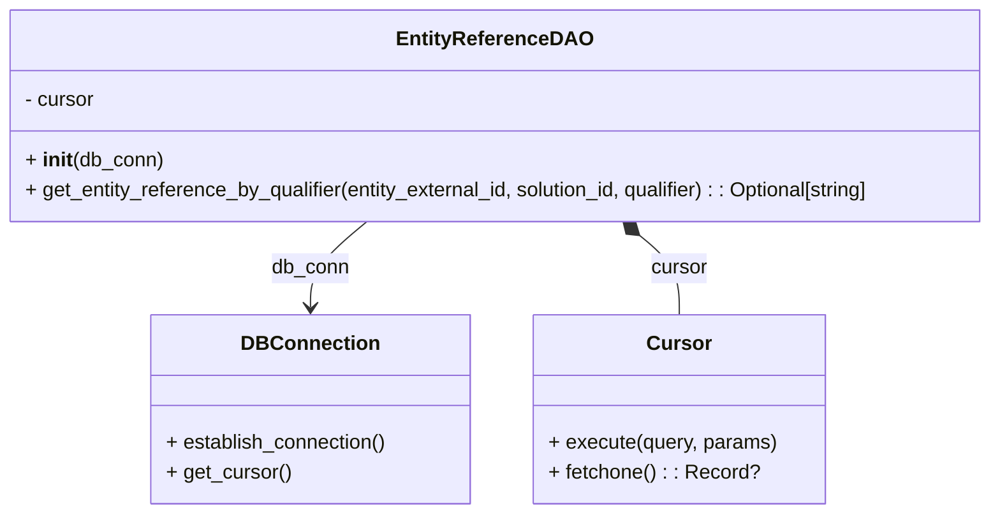

# Diagram: entity_core/entity_service/entity_service/db/daos/entity_reference_dao.py


> Auto-generated by Obscura crawlers

## Diagram 1



### SVG

<svg id="container" width="803.2734375" xmlns="http://www.w3.org/2000/svg" class="classDiagram" height="408" viewBox="0 0 803.2734375 408" role="graphics-document document" aria-roledescription="class"><style>#container{font-family:"trebuchet ms",verdana,arial,sans-serif;font-size:16px;fill:#333;}@keyframes edge-animation-frame{from{stroke-dashoffset:0;}}@keyframes dash{to{stroke-dashoffset:0;}}#container .edge-animation-slow{stroke-dasharray:9,5!important;stroke-dashoffset:900;animation:dash 50s linear infinite;stroke-linecap:round;}#container .edge-animation-fast{stroke-dasharray:9,5!important;stroke-dashoffset:900;animation:dash 20s linear infinite;stroke-linecap:round;}#container .error-icon{fill:#552222;}#container .error-text{fill:#552222;stroke:#552222;}#container .edge-thickness-normal{stroke-width:1px;}#container .edge-thickness-thick{stroke-width:3.5px;}#container .edge-pattern-solid{stroke-dasharray:0;}#container .edge-thickness-invisible{stroke-width:0;fill:none;}#container .edge-pattern-dashed{stroke-dasharray:3;}#container .edge-pattern-dotted{stroke-dasharray:2;}#container .marker{fill:#333333;stroke:#333333;}#container .marker.cross{stroke:#333333;}#container svg{font-family:"trebuchet ms",verdana,arial,sans-serif;font-size:16px;}#container p{margin:0;}#container g.classGroup text{fill:#9370DB;stroke:none;font-family:"trebuchet ms",verdana,arial,sans-serif;font-size:10px;}#container g.classGroup text .title{font-weight:bolder;}#container .nodeLabel,#container .edgeLabel{color:#131300;}#container .edgeLabel .label rect{fill:#ECECFF;}#container .label text{fill:#131300;}#container .labelBkg{background:#ECECFF;}#container .edgeLabel .label span{background:#ECECFF;}#container .classTitle{font-weight:bolder;}#container .node rect,#container .node circle,#container .node ellipse,#container .node polygon,#container .node path{fill:#ECECFF;stroke:#9370DB;stroke-width:1px;}#container .divider{stroke:#9370DB;stroke-width:1;}#container g.clickable{cursor:pointer;}#container g.classGroup rect{fill:#ECECFF;stroke:#9370DB;}#container g.classGroup line{stroke:#9370DB;stroke-width:1;}#container .classLabel .box{stroke:none;stroke-width:0;fill:#ECECFF;opacity:0.5;}#container .classLabel .label{fill:#9370DB;font-size:10px;}#container .relation{stroke:#333333;stroke-width:1;fill:none;}#container .dashed-line{stroke-dasharray:3;}#container .dotted-line{stroke-dasharray:1 2;}#container #compositionStart,#container .composition{fill:#333333!important;stroke:#333333!important;stroke-width:1;}#container #compositionEnd,#container .composition{fill:#333333!important;stroke:#333333!important;stroke-width:1;}#container #dependencyStart,#container .dependency{fill:#333333!important;stroke:#333333!important;stroke-width:1;}#container #dependencyStart,#container .dependency{fill:#333333!important;stroke:#333333!important;stroke-width:1;}#container #extensionStart,#container .extension{fill:transparent!important;stroke:#333333!important;stroke-width:1;}#container #extensionEnd,#container .extension{fill:transparent!important;stroke:#333333!important;stroke-width:1;}#container #aggregationStart,#container .aggregation{fill:transparent!important;stroke:#333333!important;stroke-width:1;}#container #aggregationEnd,#container .aggregation{fill:transparent!important;stroke:#333333!important;stroke-width:1;}#container #lollipopStart,#container .lollipop{fill:#ECECFF!important;stroke:#333333!important;stroke-width:1;}#container #lollipopEnd,#container .lollipop{fill:#ECECFF!important;stroke:#333333!important;stroke-width:1;}#container .edgeTerminals{font-size:11px;line-height:initial;}#container .classTitleText{text-anchor:middle;font-size:18px;fill:#333;}#container .label-icon{display:inline-block;height:1em;overflow:visible;vertical-align:-0.125em;}#container .node .label-icon path{fill:currentColor;stroke:revert;stroke-width:revert;}#container :root{--mermaid-font-family:"trebuchet ms",verdana,arial,sans-serif;}</style><g><defs><marker id="container_class-aggregationStart" class="marker aggregation class" refX="18" refY="7" markerWidth="190" markerHeight="240" orient="auto"><path d="M 18,7 L9,13 L1,7 L9,1 Z"></path></marker></defs><defs><marker id="container_class-aggregationEnd" class="marker aggregation class" refX="1" refY="7" markerWidth="20" markerHeight="28" orient="auto"><path d="M 18,7 L9,13 L1,7 L9,1 Z"></path></marker></defs><defs><marker id="container_class-extensionStart" class="marker extension class" refX="18" refY="7" markerWidth="190" markerHeight="240" orient="auto"><path d="M 1,7 L18,13 V 1 Z"></path></marker></defs><defs><marker id="container_class-extensionEnd" class="marker extension class" refX="1" refY="7" markerWidth="20" markerHeight="28" orient="auto"><path d="M 1,1 V 13 L18,7 Z"></path></marker></defs><defs><marker id="container_class-compositionStart" class="marker composition class" refX="18" refY="7" markerWidth="190" markerHeight="240" orient="auto"><path d="M 18,7 L9,13 L1,7 L9,1 Z"></path></marker></defs><defs><marker id="container_class-compositionEnd" class="marker composition class" refX="1" refY="7" markerWidth="20" markerHeight="28" orient="auto"><path d="M 18,7 L9,13 L1,7 L9,1 Z"></path></marker></defs><defs><marker id="container_class-dependencyStart" class="marker dependency class" refX="6" refY="7" markerWidth="190" markerHeight="240" orient="auto"><path d="M 5,7 L9,13 L1,7 L9,1 Z"></path></marker></defs><defs><marker id="container_class-dependencyEnd" class="marker dependency class" refX="13" refY="7" markerWidth="20" markerHeight="28" orient="auto"><path d="M 18,7 L9,13 L14,7 L9,1 Z"></path></marker></defs><defs><marker id="container_class-lollipopStart" class="marker lollipop class" refX="13" refY="7" markerWidth="190" markerHeight="240" orient="auto"><circle stroke="black" fill="transparent" cx="7" cy="7" r="6"></circle></marker></defs><defs><marker id="container_class-lollipopEnd" class="marker lollipop class" refX="1" refY="7" markerWidth="190" markerHeight="240" orient="auto"><circle stroke="black" fill="transparent" cx="7" cy="7" r="6"></circle></marker></defs><g class="root"><g class="clusters"></g><g class="edgePaths"><path d="M300.628,176L293.213,182.167C285.798,188.333,270.967,200.667,263.552,212C256.137,223.333,256.137,233.667,256.137,238.833L256.137,244" id="id_EntityReferenceDAO_DBConnection_1" class="edge-thickness-normal edge-pattern-solid relation" style=";;;" data-edge="true" data-et="edge" data-id="id_EntityReferenceDAO_DBConnection_1" data-points="W3sieCI6MzAwLjYyODQ1NDI4NzE5MDEsInkiOjE3Nn0seyJ4IjoyNTYuMTM2NzE4NzUsInkiOjIxM30seyJ4IjoyNTYuMTM2NzE4NzUsInkiOjI1MH1d" marker-end="url(#container_class-dependencyEnd)"></path><path d="M515.908,187.03L521.113,191.358C526.318,195.686,536.727,204.343,541.932,214.838C547.137,225.333,547.137,237.667,547.137,243.833L547.137,250" id="id_EntityReferenceDAO_Cursor_2" class="edge-thickness-normal edge-pattern-solid relation" style=";;;" data-edge="true" data-et="edge" data-id="id_EntityReferenceDAO_Cursor_2" data-points="W3sieCI6NTAyLjY0NDk4MzIxMjgwOTksInkiOjE3Nn0seyJ4Ijo1NDcuMTM2NzE4NzUsInkiOjIxM30seyJ4Ijo1NDcuMTM2NzE4NzUsInkiOjI1MH1d" marker-start="url(#container_class-compositionStart)"></path></g><g class="edgeLabels"><g class="edgeLabel" transform="translate(256.13671875, 213)"><g class="label" data-id="id_EntityReferenceDAO_DBConnection_1" transform="translate(-31.09375, -12)"><foreignObject width="62.1875" height="24"><div xmlns="http://www.w3.org/1999/xhtml" class="labelBkg" style="display: table-cell; white-space: nowrap; line-height: 1.5; max-width: 200px; text-align: center;"><span class="edgeLabel"><p>db_conn</p></span></div></foreignObject></g></g><g class="edgeLabel" transform="translate(547.13671875, 213)"><g class="label" data-id="id_EntityReferenceDAO_Cursor_2" transform="translate(-22.8671875, -12)"><foreignObject width="45.734375" height="24"><div xmlns="http://www.w3.org/1999/xhtml" class="labelBkg" style="display: table-cell; white-space: nowrap; line-height: 1.5; max-width: 200px; text-align: center;"><span class="edgeLabel"><p>cursor</p></span></div></foreignObject></g></g></g><g class="nodes"><g class="node default" id="classId-EntityReferenceDAO-0" transform="translate(401.63671875, 92)"><g class="basic label-container"><path d="M-393.63671875 -84 L393.63671875 -84 L393.63671875 84 L-393.63671875 84" stroke="none" stroke-width="0" fill="#ECECFF" style=""></path><path d="M-393.63671875 -84 C-210.61565788491225 -84, -27.594597019824505 -84, 393.63671875 -84 M-393.63671875 -84 C-204.8360574287706 -84, -16.035396107541203 -84, 393.63671875 -84 M393.63671875 -84 C393.63671875 -31.556640267206546, 393.63671875 20.886719465586907, 393.63671875 84 M393.63671875 -84 C393.63671875 -24.151544122090165, 393.63671875 35.69691175581967, 393.63671875 84 M393.63671875 84 C91.5064752163749 84, -210.6237683172502 84, -393.63671875 84 M393.63671875 84 C124.2152786560797 84, -145.2061614378406 84, -393.63671875 84 M-393.63671875 84 C-393.63671875 28.913413260327573, -393.63671875 -26.173173479344854, -393.63671875 -84 M-393.63671875 84 C-393.63671875 34.53784793517374, -393.63671875 -14.924304129652526, -393.63671875 -84" stroke="#9370DB" stroke-width="1.3" fill="none" stroke-dasharray="0 0" style=""></path></g><g class="annotation-group text" transform="translate(0, -60)"></g><g class="label-group text" transform="translate(-73.0859375, -60)"><g class="label" style="font-weight: bolder" transform="translate(0,-12)"><foreignObject width="146.171875" height="24"><div xmlns="http://www.w3.org/1999/xhtml" style="display: table-cell; white-space: nowrap; line-height: 1.5; max-width: 194px; text-align: center;"><span class="nodeLabel markdown-node-label" style=""><p>EntityReferenceDAO</p></span></div></foreignObject></g></g><g class="members-group text" transform="translate(-381.63671875, -12)"><g class="label" style="" transform="translate(0,-12)"><foreignObject width="56.421875" height="24"><div xmlns="http://www.w3.org/1999/xhtml" style="display: table-cell; white-space: nowrap; line-height: 1.5; max-width: 115px; text-align: center;"><span class="nodeLabel markdown-node-label" style=""><p>- cursor</p></span></div></foreignObject></g></g><g class="methods-group text" transform="translate(-381.63671875, 36)"><g class="label" style="" transform="translate(0,-12)"><foreignObject width="109.21875" height="24"><div xmlns="http://www.w3.org/1999/xhtml" style="display: table-cell; white-space: nowrap; line-height: 1.5; max-width: 199px; text-align: center;"><span class="nodeLabel markdown-node-label" style=""><p>+ <strong>init</strong>(db_conn)</p></span></div></foreignObject></g><g class="label" style="" transform="translate(0,12)"><foreignObject width="690.1875" height="24"><div xmlns="http://www.w3.org/1999/xhtml" style="display: table-cell; white-space: nowrap; line-height: 1.5; max-width: 748px; text-align: center;"><span class="nodeLabel markdown-node-label" style=""><p>+ get_entity_reference_by_qualifier(entity_external_id, solution_id, qualifier) : : Optional[string]</p></span></div></foreignObject></g></g><g class="divider" style=""><path d="M-393.63671875 -36 C-87.35612795671597 -36, 218.92446283656807 -36, 393.63671875 -36 M-393.63671875 -36 C-200.6502480492913 -36, -7.663777348582585 -36, 393.63671875 -36" stroke="#9370DB" stroke-width="1.3" fill="none" stroke-dasharray="0 0" style=""></path></g><g class="divider" style=""><path d="M-393.63671875 12 C-187.4309024392016 12, 18.774913871596823 12, 393.63671875 12 M-393.63671875 12 C-221.00423565712347 12, -48.37175256424695 12, 393.63671875 12" stroke="#9370DB" stroke-width="1.3" fill="none" stroke-dasharray="0 0" style=""></path></g></g><g class="node default" id="classId-DBConnection-1" transform="translate(256.13671875, 325)"><g class="basic label-container"><path d="M-126.4453125 -75 L126.4453125 -75 L126.4453125 75 L-126.4453125 75" stroke="none" stroke-width="0" fill="#ECECFF" style=""></path><path d="M-126.4453125 -75 C-44.09067101815151 -75, 38.26397046369698 -75, 126.4453125 -75 M-126.4453125 -75 C-48.225334363857414 -75, 29.994643772285173 -75, 126.4453125 -75 M126.4453125 -75 C126.4453125 -35.05267209715081, 126.4453125 4.8946558056983775, 126.4453125 75 M126.4453125 -75 C126.4453125 -38.73806955186654, 126.4453125 -2.4761391037330753, 126.4453125 75 M126.4453125 75 C29.300089249368526 75, -67.84513400126295 75, -126.4453125 75 M126.4453125 75 C73.94128897134264 75, 21.437265442685288 75, -126.4453125 75 M-126.4453125 75 C-126.4453125 16.760464200253573, -126.4453125 -41.479071599492855, -126.4453125 -75 M-126.4453125 75 C-126.4453125 32.10700905704528, -126.4453125 -10.785981885909436, -126.4453125 -75" stroke="#9370DB" stroke-width="1.3" fill="none" stroke-dasharray="0 0" style=""></path></g><g class="annotation-group text" transform="translate(0, -51)"></g><g class="label-group text" transform="translate(-51.375, -51)"><g class="label" style="font-weight: bolder" transform="translate(0,-12)"><foreignObject width="102.75" height="24"><div xmlns="http://www.w3.org/1999/xhtml" style="display: table-cell; white-space: nowrap; line-height: 1.5; max-width: 152px; text-align: center;"><span class="nodeLabel markdown-node-label" style=""><p>DBConnection</p></span></div></foreignObject></g></g><g class="members-group text" transform="translate(-114.4453125, -3)"></g><g class="methods-group text" transform="translate(-114.4453125, 27)"><g class="label" style="" transform="translate(0,-12)"><foreignObject width="177.515625" height="24"><div xmlns="http://www.w3.org/1999/xhtml" style="display: table-cell; white-space: nowrap; line-height: 1.5; max-width: 235px; text-align: center;"><span class="nodeLabel markdown-node-label" style=""><p>+ establish_connection()</p></span></div></foreignObject></g><g class="label" style="" transform="translate(0,12)"><foreignObject width="98.890625" height="24"><div xmlns="http://www.w3.org/1999/xhtml" style="display: table-cell; white-space: nowrap; line-height: 1.5; max-width: 156px; text-align: center;"><span class="nodeLabel markdown-node-label" style=""><p>+ get_cursor()</p></span></div></foreignObject></g></g><g class="divider" style=""><path d="M-126.4453125 -27 C-49.17599327856253 -27, 28.09332594287494 -27, 126.4453125 -27 M-126.4453125 -27 C-54.489342675868045 -27, 17.46662714826391 -27, 126.4453125 -27" stroke="#9370DB" stroke-width="1.3" fill="none" stroke-dasharray="0 0" style=""></path></g><g class="divider" style=""><path d="M-126.4453125 -3 C-59.18786138518233 -3, 8.06958972963534 -3, 126.4453125 -3 M-126.4453125 -3 C-37.267303522231956 -3, 51.91070545553609 -3, 126.4453125 -3" stroke="#9370DB" stroke-width="1.3" fill="none" stroke-dasharray="0 0" style=""></path></g></g><g class="node default" id="classId-Cursor-2" transform="translate(547.13671875, 325)"><g class="basic label-container"><path d="M-114.5546875 -75 L114.5546875 -75 L114.5546875 75 L-114.5546875 75" stroke="none" stroke-width="0" fill="#ECECFF" style=""></path><path d="M-114.5546875 -75 C-59.62387547607239 -75, -4.693063452144784 -75, 114.5546875 -75 M-114.5546875 -75 C-53.01299276169836 -75, 8.528701976603287 -75, 114.5546875 -75 M114.5546875 -75 C114.5546875 -36.15634457677608, 114.5546875 2.6873108464478435, 114.5546875 75 M114.5546875 -75 C114.5546875 -26.1802477561489, 114.5546875 22.639504487702197, 114.5546875 75 M114.5546875 75 C40.17869227931341 75, -34.19730294137318 75, -114.5546875 75 M114.5546875 75 C37.94065243091313 75, -38.673382638173734 75, -114.5546875 75 M-114.5546875 75 C-114.5546875 41.933803015050366, -114.5546875 8.867606030100731, -114.5546875 -75 M-114.5546875 75 C-114.5546875 17.194184488471656, -114.5546875 -40.61163102305669, -114.5546875 -75" stroke="#9370DB" stroke-width="1.3" fill="none" stroke-dasharray="0 0" style=""></path></g><g class="annotation-group text" transform="translate(0, -51)"></g><g class="label-group text" transform="translate(-23.90625, -51)"><g class="label" style="font-weight: bolder" transform="translate(0,-12)"><foreignObject width="47.8125" height="24"><div xmlns="http://www.w3.org/1999/xhtml" style="display: table-cell; white-space: nowrap; line-height: 1.5; max-width: 98px; text-align: center;"><span class="nodeLabel markdown-node-label" style=""><p>Cursor</p></span></div></foreignObject></g></g><g class="members-group text" transform="translate(-102.5546875, -3)"></g><g class="methods-group text" transform="translate(-102.5546875, 27)"><g class="label" style="" transform="translate(0,-12)"><foreignObject width="181.203125" height="24"><div xmlns="http://www.w3.org/1999/xhtml" style="display: table-cell; white-space: nowrap; line-height: 1.5; max-width: 239px; text-align: center;"><span class="nodeLabel markdown-node-label" style=""><p>+ execute(query, params)</p></span></div></foreignObject></g><g class="label" style="" transform="translate(0,12)"><foreignObject width="164.359375" height="24"><div xmlns="http://www.w3.org/1999/xhtml" style="display: table-cell; white-space: nowrap; line-height: 1.5; max-width: 222px; text-align: center;"><span class="nodeLabel markdown-node-label" style=""><p>+ fetchone() : : Record?</p></span></div></foreignObject></g></g><g class="divider" style=""><path d="M-114.5546875 -27 C-39.478009827286755 -27, 35.59866784542649 -27, 114.5546875 -27 M-114.5546875 -27 C-37.2219304251863 -27, 40.1108266496274 -27, 114.5546875 -27" stroke="#9370DB" stroke-width="1.3" fill="none" stroke-dasharray="0 0" style=""></path></g><g class="divider" style=""><path d="M-114.5546875 -3 C-58.16742870675818 -3, -1.7801699135163602 -3, 114.5546875 -3 M-114.5546875 -3 C-54.114014110046476 -3, 6.326659279907048 -3, 114.5546875 -3" stroke="#9370DB" stroke-width="1.3" fill="none" stroke-dasharray="0 0" style=""></path></g></g></g></g></g></svg>

## Diagram 2

```mermaid
flowchart TD
    A[Create EntityReferenceDAO] --> B[db_conn.establish_connection()]
    B --> C[db_conn.get_cursor() → cursor]
    C --> D[cursor.execute(query, params)]
    D --> E[cursor.fetchone() → result]
    E --> |result found| F[return result.value]
    E --> |no result| G[return None]
```

> SVG rendering failed for this diagram.
