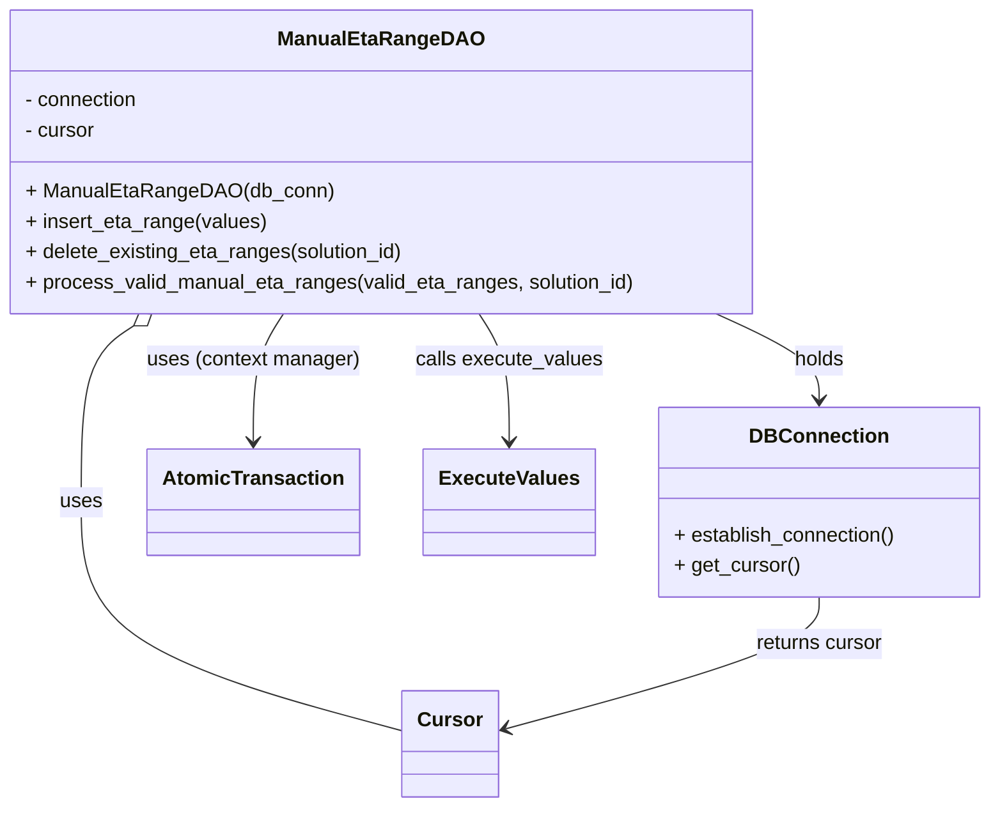
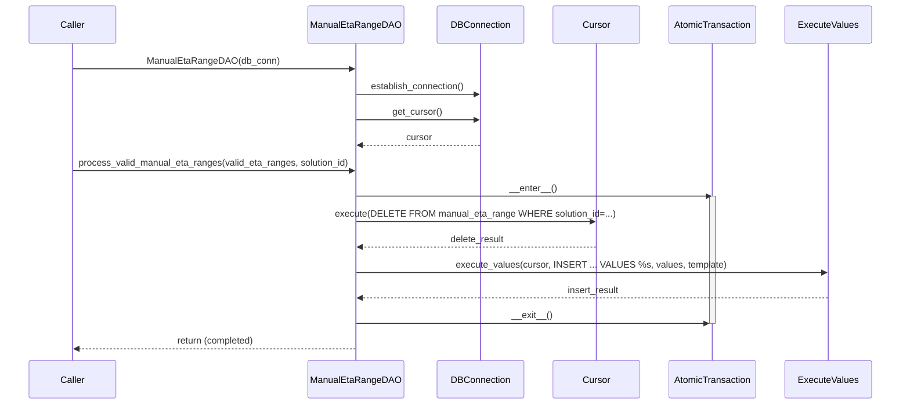

# Diagram: entity_core/entity_service/entity_service/db/daos/manual_eta_range_dao.py

> Auto-generated by Obscura crawlers

## Diagram 1

### SVG

<svg id="container" width="771.34375" xmlns="http://www.w3.org/2000/svg" class="classDiagram" height="638" viewBox="0 0 771.34375 638" role="graphics-document document" aria-roledescription="class"><g><defs><marker id="container_class-aggregationStart" class="marker aggregation class" refX="18" refY="7" markerWidth="190" markerHeight="240" orient="auto"><path d="M 18,7 L9,13 L1,7 L9,1 Z"></path></marker></defs><defs><marker id="container_class-aggregationEnd" class="marker aggregation class" refX="1" refY="7" markerWidth="20" markerHeight="28" orient="auto"><path d="M 18,7 L9,13 L1,7 L9,1 Z"></path></marker></defs><defs><marker id="container_class-extensionStart" class="marker extension class" refX="18" refY="7" markerWidth="190" markerHeight="240" orient="auto"><path d="M 1,7 L18,13 V 1 Z"></path></marker></defs><defs><marker id="container_class-extensionEnd" class="marker extension class" refX="1" refY="7" markerWidth="20" markerHeight="28" orient="auto"><path d="M 1,1 V 13 L18,7 Z"></path></marker></defs><defs><marker id="container_class-compositionStart" class="marker composition class" refX="18" refY="7" markerWidth="190" markerHeight="240" orient="auto"><path d="M 18,7 L9,13 L1,7 L9,1 Z"></path></marker></defs><defs><marker id="container_class-compositionEnd" class="marker composition class" refX="1" refY="7" markerWidth="20" markerHeight="28" orient="auto"><path d="M 18,7 L9,13 L1,7 L9,1 Z"></path></marker></defs><defs><marker id="container_class-dependencyStart" class="marker dependency class" refX="6" refY="7" markerWidth="190" markerHeight="240" orient="auto"><path d="M 5,7 L9,13 L1,7 L9,1 Z"></path></marker></defs><defs><marker id="container_class-dependencyEnd" class="marker dependency class" refX="13" refY="7" markerWidth="20" markerHeight="28" orient="auto"><path d="M 18,7 L9,13 L14,7 L9,1 Z"></path></marker></defs><defs><marker id="container_class-lollipopStart" class="marker lollipop class" refX="13" refY="7" markerWidth="190" markerHeight="240" orient="auto"><circle stroke="black" fill="transparent" cx="7" cy="7" r="6"></circle></marker></defs><defs><marker id="container_class-lollipopEnd" class="marker lollipop class" refX="1" refY="7" markerWidth="190" markerHeight="240" orient="auto"><circle stroke="black" fill="transparent" cx="7" cy="7" r="6"></circle></marker></defs><g class="root"><g class="clusters"></g><g class="edgePaths"><path d="M557.363,248L570.619,254.167C583.875,260.333,610.387,272.667,623.643,284C636.898,295.333,636.898,305.667,636.898,310.833L636.898,316" id="id_ManualEtaRangeDAO_DBConnection_1" class="edge-thickness-normal edge-pattern-solid relation" style=";;;" data-edge="true" data-et="edge" data-id="id_ManualEtaRangeDAO_DBConnection_1" data-points="W3sieCI6NTU3LjM2Mjk4MjY4MzEyMSwieSI6MjQ4fSx7IngiOjYzNi44OTg0Mzc1LCJ5IjoyODV9LHsieCI6NjM2Ljg5ODQzNzUsInkiOjMyMn1d" marker-end="url(#container_class-dependencyEnd)"></path><path d="M110.718,257.775L104.12,262.313C97.523,266.85,84.328,275.925,77.73,299.129C71.133,322.333,71.133,359.667,71.133,397C71.133,434.333,71.133,471.667,112.296,501.829C153.458,531.991,235.784,554.982,276.947,566.477L318.109,577.973" id="id_ManualEtaRangeDAO_Cursor_2" class="edge-thickness-normal edge-pattern-solid relation" style=";;;" data-edge="true" data-et="edge" data-id="id_ManualEtaRangeDAO_Cursor_2" data-points="W3sieCI6MTI0LjkzMDY1Nzg0MjM1NjY4LCJ5IjoyNDh9LHsieCI6NzEuMTMyODEyNSwieSI6Mjg1fSx7IngiOjcxLjEzMjgxMjUsInkiOjM5N30seyJ4Ijo3MS4xMzI4MTI1LCJ5Ijo1MDl9LHsieCI6MzE4LjEwOTM3NSwieSI6NTc3Ljk3MjU0ODI2MTQ4Mn1d" marker-start="url(#container_class-aggregationStart)"></path><path d="M225.303,248L221.495,254.167C217.686,260.333,210.07,272.667,206.261,289.5C202.453,306.333,202.453,327.667,202.453,338.333L202.453,349" id="id_ManualEtaRangeDAO_AtomicTransaction_3" class="edge-thickness-normal edge-pattern-solid relation" style=";;;" data-edge="true" data-et="edge" data-id="id_ManualEtaRangeDAO_AtomicTransaction_3" data-points="W3sieCI6MjI1LjMwMjg3MTIxODE1Mjg2LCJ5IjoyNDh9LHsieCI6MjAyLjQ1MzEyNSwieSI6Mjg1fSx7IngiOjIwMi40NTMxMjUsInkiOjM1NX1d" marker-end="url(#container_class-dependencyEnd)"></path><path d="M373.517,248L377.326,254.167C381.134,260.333,388.751,272.667,392.559,289.5C396.367,306.333,396.367,327.667,396.367,338.333L396.367,349" id="id_ManualEtaRangeDAO_ExecuteValues_4" class="edge-thickness-normal edge-pattern-solid relation" style=";;;" data-edge="true" data-et="edge" data-id="id_ManualEtaRangeDAO_ExecuteValues_4" data-points="W3sieCI6MzczLjUxNzQ0MTI4MTg0NzE0LCJ5IjoyNDh9LHsieCI6Mzk2LjM2NzE4NzUsInkiOjI4NX0seyJ4IjozOTYuMzY3MTg3NSwieSI6MzU1fV0=" marker-end="url(#container_class-dependencyEnd)"></path><path d="M636.898,472L636.898,478.167C636.898,484.333,636.898,496.667,596.699,514.06C556.499,531.453,476.1,553.906,435.9,565.132L395.701,576.359" id="id_DBConnection_Cursor_5" class="edge-thickness-normal edge-pattern-solid relation" style=";;;" data-edge="true" data-et="edge" data-id="id_DBConnection_Cursor_5" data-points="W3sieCI6NjM2Ljg5ODQzNzUsInkiOjQ3Mn0seyJ4Ijo2MzYuODk4NDM3NSwieSI6NTA5fSx7IngiOjM4OS45MjE4NzUsInkiOjU3Ny45NzI1NDgyNjE0ODJ9XQ==" marker-end="url(#container_class-dependencyEnd)"></path></g><g class="edgeLabels"><g class="edgeLabel" transform="translate(636.8984375, 285)"><g class="label" data-id="id_ManualEtaRangeDAO_DBConnection_1" transform="translate(-20.1875, -12)"><foreignObject width="40.375" height="24">

holds

</foreignObject></g></g><g class="edgeLabel" transform="translate(71.1328125, 397)"><g class="label" data-id="id_ManualEtaRangeDAO_Cursor_2" transform="translate(-16.4921875, -12)"><foreignObject width="32.984375" height="24">

uses

</foreignObject></g></g><g class="edgeLabel" transform="translate(202.453125, 285)"><g class="label" data-id="id_ManualEtaRangeDAO_AtomicTransaction_3" transform="translate(-84.4140625, -12)"><foreignObject width="168.828125" height="24">

uses (context manager)

</foreignObject></g></g><g class="edgeLabel" transform="translate(396.3671875, 285)"><g class="label" data-id="id_ManualEtaRangeDAO_ExecuteValues_4" transform="translate(-73.484375, -12)"><foreignObject width="146.96875" height="24">

calls execute_values

</foreignObject></g></g><g class="edgeLabel" transform="translate(636.8984375, 509)"><g class="label" data-id="id_DBConnection_Cursor_5" transform="translate(-51.25, -12)"><foreignObject width="102.5" height="24">

returns cursor

</foreignObject></g></g></g><g class="nodes"><g class="node default" id="classId-ManualEtaRangeDAO-0" transform="translate(299.41015625, 128)"><g class="basic label-container"><path d="M-291.41015625 -120 L291.41015625 -120 L291.41015625 120 L-291.41015625 120" stroke="none" stroke-width="0" fill="#ECECFF" style=""></path><path d="M-291.41015625 -120 C-167.8061232671887 -120, -44.20209028437739 -120, 291.41015625 -120 M-291.41015625 -120 C-147.66085576924158 -120, -3.9115552884831573 -120, 291.41015625 -120 M291.41015625 -120 C291.41015625 -30.529808222312084, 291.41015625 58.94038355537583, 291.41015625 120 M291.41015625 -120 C291.41015625 -42.37111798037317, 291.41015625 35.25776403925366, 291.41015625 120 M291.41015625 120 C127.7709448778441 120, -35.8682664943118 120, -291.41015625 120 M291.41015625 120 C64.15658016662931 120, -163.09699591674138 120, -291.41015625 120 M-291.41015625 120 C-291.41015625 48.58058674056126, -291.41015625 -22.838826518877482, -291.41015625 -120 M-291.41015625 120 C-291.41015625 32.12506426843004, -291.41015625 -55.749871463139925, -291.41015625 -120" stroke="#9370DB" stroke-width="1.3" fill="none" stroke-dasharray="0 0" style=""></path></g><g class="annotation-group text" transform="translate(0, -96)"></g><g class="label-group text" transform="translate(-75.7890625, -96)"><g class="label" style="font-weight: bolder" transform="translate(0,-12)"><foreignObject width="151.578125" height="24">

ManualEtaRangeDAO

</foreignObject></g></g><g class="members-group text" transform="translate(-279.41015625, -48)"><g class="label" style="" transform="translate(0,-12)"><foreignObject width="91.5" height="24">

- connection

</foreignObject></g><g class="label" style="" transform="translate(0,12)"><foreignObject width="56.421875" height="24">

- cursor

</foreignObject></g></g><g class="methods-group text" transform="translate(-279.41015625, 24)"><g class="label" style="" transform="translate(0,-12)"><foreignObject width="235.15625" height="24">

+ ManualEtaRangeDAO(db_conn)

</foreignObject></g><g class="label" style="" transform="translate(0,12)"><foreignObject width="190.875" height="24">

+ insert_eta_range(values)

</foreignObject></g><g class="label" style="" transform="translate(0,36)"><foreignObject width="302.109375" height="24">

+ delete_existing_eta_ranges(solution_id)

</foreignObject></g><g class="label" style="" transform="translate(0,60)"><foreignObject width="483.03125" height="24">

+ process_valid_manual_eta_ranges(valid_eta_ranges, solution_id)

</foreignObject></g></g><g class="divider" style=""><path d="M-291.41015625 -72 C-150.12104806696382 -72, -8.831939883927646 -72, 291.41015625 -72 M-291.41015625 -72 C-132.67758100115674 -72, 26.054994247686523 -72, 291.41015625 -72" stroke="#9370DB" stroke-width="1.3" fill="none" stroke-dasharray="0 0" style=""></path></g><g class="divider" style=""><path d="M-291.41015625 0 C-125.28740456714903 0, 40.83534711570195 0, 291.41015625 0 M-291.41015625 0 C-59.236412626548 0, 172.937330996904 0, 291.41015625 0" stroke="#9370DB" stroke-width="1.3" fill="none" stroke-dasharray="0 0" style=""></path></g></g><g class="node default" id="classId-DBConnection-1" transform="translate(636.8984375, 397)"><g class="basic label-container"><path d="M-126.4453125 -75 L126.4453125 -75 L126.4453125 75 L-126.4453125 75" stroke="none" stroke-width="0" fill="#ECECFF" style=""></path><path d="M-126.4453125 -75 C-29.712469077503798 -75, 67.0203743449924 -75, 126.4453125 -75 M-126.4453125 -75 C-43.45806484747203 -75, 39.52918280505594 -75, 126.4453125 -75 M126.4453125 -75 C126.4453125 -30.918794085310054, 126.4453125 13.162411829379892, 126.4453125 75 M126.4453125 -75 C126.4453125 -30.251559329361626, 126.4453125 14.496881341276747, 126.4453125 75 M126.4453125 75 C54.818608417708376 75, -16.80809566458325 75, -126.4453125 75 M126.4453125 75 C28.296890231117985 75, -69.85153203776403 75, -126.4453125 75 M-126.4453125 75 C-126.4453125 23.13721397807665, -126.4453125 -28.725572043846697, -126.4453125 -75 M-126.4453125 75 C-126.4453125 44.762959002651584, -126.4453125 14.525918005303176, -126.4453125 -75" stroke="#9370DB" stroke-width="1.3" fill="none" stroke-dasharray="0 0" style=""></path></g><g class="annotation-group text" transform="translate(0, -51)"></g><g class="label-group text" transform="translate(-51.375, -51)"><g class="label" style="font-weight: bolder" transform="translate(0,-12)"><foreignObject width="102.75" height="24">

DBConnection

</foreignObject></g></g><g class="members-group text" transform="translate(-114.4453125, -3)"></g><g class="methods-group text" transform="translate(-114.4453125, 27)"><g class="label" style="" transform="translate(0,-12)"><foreignObject width="177.515625" height="24">

+ establish_connection()

</foreignObject></g><g class="label" style="" transform="translate(0,12)"><foreignObject width="98.890625" height="24">

+ get_cursor()

</foreignObject></g></g><g class="divider" style=""><path d="M-126.4453125 -27 C-67.11812156233199 -27, -7.790930624663986 -27, 126.4453125 -27 M-126.4453125 -27 C-35.58295815716315 -27, 55.279396185673704 -27, 126.4453125 -27" stroke="#9370DB" stroke-width="1.3" fill="none" stroke-dasharray="0 0" style=""></path></g><g class="divider" style=""><path d="M-126.4453125 -3 C-70.85468251424894 -3, -15.264052528497885 -3, 126.4453125 -3 M-126.4453125 -3 C-74.9799378717287 -3, -23.51456324345739 -3, 126.4453125 -3" stroke="#9370DB" stroke-width="1.3" fill="none" stroke-dasharray="0 0" style=""></path></g></g><g class="node default" id="classId-AtomicTransaction-2" transform="translate(202.453125, 397)"><g class="basic label-container"><path d="M-79.828125 -42 L79.828125 -42 L79.828125 42 L-79.828125 42" stroke="none" stroke-width="0" fill="#ECECFF" style=""></path><path d="M-79.828125 -42 C-20.468938173790463 -42, 38.890248652419075 -42, 79.828125 -42 M-79.828125 -42 C-40.59910502368815 -42, -1.3700850473763069 -42, 79.828125 -42 M79.828125 -42 C79.828125 -14.234279430022198, 79.828125 13.531441139955604, 79.828125 42 M79.828125 -42 C79.828125 -24.72331038043886, 79.828125 -7.446620760877721, 79.828125 42 M79.828125 42 C23.278730710874143 42, -33.270663578251714 42, -79.828125 42 M79.828125 42 C21.353418507367948 42, -37.121287985264104 42, -79.828125 42 M-79.828125 42 C-79.828125 22.233303332376778, -79.828125 2.466606664753556, -79.828125 -42 M-79.828125 42 C-79.828125 9.899806796685112, -79.828125 -22.200386406629775, -79.828125 -42" stroke="#9370DB" stroke-width="1.3" fill="none" stroke-dasharray="0 0" style=""></path></g><g class="annotation-group text" transform="translate(0, -18)"></g><g class="label-group text" transform="translate(-67.828125, -18)"><g class="label" style="font-weight: bolder" transform="translate(0,-12)"><foreignObject width="135.65625" height="24">

AtomicTransaction

</foreignObject></g></g><g class="members-group text" transform="translate(-67.828125, 30)"></g><g class="methods-group text" transform="translate(-67.828125, 60)"></g><g class="divider" style=""><path d="M-79.828125 6 C-19.702641805389845 6, 40.42284138922031 6, 79.828125 6 M-79.828125 6 C-24.543021235447753 6, 30.742082529104493 6, 79.828125 6" stroke="#9370DB" stroke-width="1.3" fill="none" stroke-dasharray="0 0" style=""></path></g><g class="divider" style=""><path d="M-79.828125 24 C-37.98331849057564 24, 3.8614880188487177 24, 79.828125 24 M-79.828125 24 C-29.117440024899906 24, 21.593244950200187 24, 79.828125 24" stroke="#9370DB" stroke-width="1.3" fill="none" stroke-dasharray="0 0" style=""></path></g></g><g class="node default" id="classId-ExecuteValues-3" transform="translate(396.3671875, 397)"><g class="basic label-container"><path d="M-64.0859375 -42 L64.0859375 -42 L64.0859375 42 L-64.0859375 42" stroke="none" stroke-width="0" fill="#ECECFF" style=""></path><path d="M-64.0859375 -42 C-20.81816458055181 -42, 22.449608338896383 -42, 64.0859375 -42 M-64.0859375 -42 C-25.618431618778814 -42, 12.849074262442372 -42, 64.0859375 -42 M64.0859375 -42 C64.0859375 -19.783964056239768, 64.0859375 2.4320718875204648, 64.0859375 42 M64.0859375 -42 C64.0859375 -14.15394073219542, 64.0859375 13.692118535609161, 64.0859375 42 M64.0859375 42 C18.192431037891907 42, -27.701075424216185 42, -64.0859375 42 M64.0859375 42 C13.091522993211278 42, -37.902891513577444 42, -64.0859375 42 M-64.0859375 42 C-64.0859375 17.49265657691884, -64.0859375 -7.01468684616232, -64.0859375 -42 M-64.0859375 42 C-64.0859375 10.226673661416381, -64.0859375 -21.546652677167238, -64.0859375 -42" stroke="#9370DB" stroke-width="1.3" fill="none" stroke-dasharray="0 0" style=""></path></g><g class="annotation-group text" transform="translate(0, -18)"></g><g class="label-group text" transform="translate(-52.0859375, -18)"><g class="label" style="font-weight: bolder" transform="translate(0,-12)"><foreignObject width="104.171875" height="24">

ExecuteValues

</foreignObject></g></g><g class="members-group text" transform="translate(-52.0859375, 30)"></g><g class="methods-group text" transform="translate(-52.0859375, 60)"></g><g class="divider" style=""><path d="M-64.0859375 6 C-19.1553553172932 6, 25.7752268654136 6, 64.0859375 6 M-64.0859375 6 C-37.00427245915502 6, -9.922607418310037 6, 64.0859375 6" stroke="#9370DB" stroke-width="1.3" fill="none" stroke-dasharray="0 0" style=""></path></g><g class="divider" style=""><path d="M-64.0859375 24 C-23.337987563900896 24, 17.40996237219821 24, 64.0859375 24 M-64.0859375 24 C-34.5166061723538 24, -4.947274844707593 24, 64.0859375 24" stroke="#9370DB" stroke-width="1.3" fill="none" stroke-dasharray="0 0" style=""></path></g></g><g class="node default" id="classId-Cursor-4" transform="translate(354.015625, 588)"><g class="basic label-container"><path d="M-35.90625 -42 L35.90625 -42 L35.90625 42 L-35.90625 42" stroke="none" stroke-width="0" fill="#ECECFF" style=""></path><path d="M-35.90625 -42 C-17.850318628549346 -42, 0.20561274290130882 -42, 35.90625 -42 M-35.90625 -42 C-15.828220428298259 -42, 4.249809143403482 -42, 35.90625 -42 M35.90625 -42 C35.90625 -21.916522910873987, 35.90625 -1.833045821747973, 35.90625 42 M35.90625 -42 C35.90625 -22.71102976653301, 35.90625 -3.422059533066019, 35.90625 42 M35.90625 42 C19.87049679210956 42, 3.834743584219119 42, -35.90625 42 M35.90625 42 C13.32586838216059 42, -9.254513235678822 42, -35.90625 42 M-35.90625 42 C-35.90625 21.57189996858297, -35.90625 1.1437999371659373, -35.90625 -42 M-35.90625 42 C-35.90625 14.938624365732938, -35.90625 -12.122751268534124, -35.90625 -42" stroke="#9370DB" stroke-width="1.3" fill="none" stroke-dasharray="0 0" style=""></path></g><g class="annotation-group text" transform="translate(0, -18)"></g><g class="label-group text" transform="translate(-23.90625, -18)"><g class="label" style="font-weight: bolder" transform="translate(0,-12)"><foreignObject width="47.8125" height="24">

Cursor

</foreignObject></g></g><g class="members-group text" transform="translate(-23.90625, 30)"></g><g class="methods-group text" transform="translate(-23.90625, 60)"></g><g class="divider" style=""><path d="M-35.90625 6 C-11.336381643500157 6, 13.233486712999685 6, 35.90625 6 M-35.90625 6 C-13.973298101237862 6, 7.959653797524275 6, 35.90625 6" stroke="#9370DB" stroke-width="1.3" fill="none" stroke-dasharray="0 0" style=""></path></g><g class="divider" style=""><path d="M-35.90625 24 C-13.600926569051591 24, 8.704396861896818 24, 35.90625 24 M-35.90625 24 C-19.51222390252486 24, -3.118197805049718 24, 35.90625 24" stroke="#9370DB" stroke-width="1.3" fill="none" stroke-dasharray="0 0" style=""></path></g></g></g></g></g></svg>

## Diagram 2

### SVG

<svg id="container" width="1630" xmlns="http://www.w3.org/2000/svg" height="747" viewBox="-50 -10 1630 747" role="graphics-document document" aria-roledescription="sequence"><g><rect x="1380" y="661" fill="#eaeaea" stroke="#666" width="150" height="65" name="ExecuteValues" rx="3" ry="3" class="actor actor-bottom"></rect><text x="1455" y="693.5" dominant-baseline="central" alignment-baseline="central" class="actor actor-box" style="text-anchor: middle; font-size: 16px; font-weight: 400;"><tspan x="1455" dy="0">ExecuteValues</tspan></text></g><g><rect x="1176" y="661" fill="#eaeaea" stroke="#666" width="154" height="65" name="AtomicTransaction" rx="3" ry="3" class="actor actor-bottom"></rect><text x="1253" y="693.5" dominant-baseline="central" alignment-baseline="central" class="actor actor-box" style="text-anchor: middle; font-size: 16px; font-weight: 400;"><tspan x="1253" dy="0">AtomicTransaction</tspan></text></g><g><rect x="976" y="661" fill="#eaeaea" stroke="#666" width="150" height="65" name="Cursor" rx="3" ry="3" class="actor actor-bottom"></rect><text x="1051" y="693.5" dominant-baseline="central" alignment-baseline="central" class="actor actor-box" style="text-anchor: middle; font-size: 16px; font-weight: 400;"><tspan x="1051" dy="0">Cursor</tspan></text></g><g><rect x="776" y="661" fill="#eaeaea" stroke="#666" width="150" height="65" name="DBConnection" rx="3" ry="3" class="actor actor-bottom"></rect><text x="851" y="693.5" dominant-baseline="central" alignment-baseline="central" class="actor actor-box" style="text-anchor: middle; font-size: 16px; font-weight: 400;"><tspan x="851" dy="0">DBConnection</tspan></text></g><g><rect x="531" y="661" fill="#eaeaea" stroke="#666" width="170" height="65" name="ManualEtaRangeDAO" rx="3" ry="3" class="actor actor-bottom"></rect><text x="616" y="693.5" dominant-baseline="central" alignment-baseline="central" class="actor actor-box" style="text-anchor: middle; font-size: 16px; font-weight: 400;"><tspan x="616" dy="0">ManualEtaRangeDAO</tspan></text></g><g><rect x="0" y="661" fill="#eaeaea" stroke="#666" width="150" height="65" name="Caller" rx="3" ry="3" class="actor actor-bottom"></rect><text x="75" y="693.5" dominant-baseline="central" alignment-baseline="central" class="actor actor-box" style="text-anchor: middle; font-size: 16px; font-weight: 400;"><tspan x="75" dy="0">Caller</tspan></text></g><g><line id="actor5" x1="1455" y1="65" x2="1455" y2="661" class="actor-line 200" stroke-width="0.5px" stroke="#999" name="ExecuteValues"></line><g id="root-5"><rect x="1380" y="0" fill="#eaeaea" stroke="#666" width="150" height="65" name="ExecuteValues" rx="3" ry="3" class="actor actor-top"></rect><text x="1455" y="32.5" dominant-baseline="central" alignment-baseline="central" class="actor actor-box" style="text-anchor: middle; font-size: 16px; font-weight: 400;"><tspan x="1455" dy="0">ExecuteValues</tspan></text></g></g><g><line id="actor4" x1="1253" y1="65" x2="1253" y2="661" class="actor-line 200" stroke-width="0.5px" stroke="#999" name="AtomicTransaction"></line><g id="root-4"><rect x="1176" y="0" fill="#eaeaea" stroke="#666" width="154" height="65" name="AtomicTransaction" rx="3" ry="3" class="actor actor-top"></rect><text x="1253" y="32.5" dominant-baseline="central" alignment-baseline="central" class="actor actor-box" style="text-anchor: middle; font-size: 16px; font-weight: 400;"><tspan x="1253" dy="0">AtomicTransaction</tspan></text></g></g><g><line id="actor3" x1="1051" y1="65" x2="1051" y2="661" class="actor-line 200" stroke-width="0.5px" stroke="#999" name="Cursor"></line><g id="root-3"><rect x="976" y="0" fill="#eaeaea" stroke="#666" width="150" height="65" name="Cursor" rx="3" ry="3" class="actor actor-top"></rect><text x="1051" y="32.5" dominant-baseline="central" alignment-baseline="central" class="actor actor-box" style="text-anchor: middle; font-size: 16px; font-weight: 400;"><tspan x="1051" dy="0">Cursor</tspan></text></g></g><g><line id="actor2" x1="851" y1="65" x2="851" y2="661" class="actor-line 200" stroke-width="0.5px" stroke="#999" name="DBConnection"></line><g id="root-2"><rect x="776" y="0" fill="#eaeaea" stroke="#666" width="150" height="65" name="DBConnection" rx="3" ry="3" class="actor actor-top"></rect><text x="851" y="32.5" dominant-baseline="central" alignment-baseline="central" class="actor actor-box" style="text-anchor: middle; font-size: 16px; font-weight: 400;"><tspan x="851" dy="0">DBConnection</tspan></text></g></g><g><line id="actor1" x1="616" y1="65" x2="616" y2="661" class="actor-line 200" stroke-width="0.5px" stroke="#999" name="ManualEtaRangeDAO"></line><g id="root-1"><rect x="531" y="0" fill="#eaeaea" stroke="#666" width="170" height="65" name="ManualEtaRangeDAO" rx="3" ry="3" class="actor actor-top"></rect><text x="616" y="32.5" dominant-baseline="central" alignment-baseline="central" class="actor actor-box" style="text-anchor: middle; font-size: 16px; font-weight: 400;"><tspan x="616" dy="0">ManualEtaRangeDAO</tspan></text></g></g><g><line id="actor0" x1="75" y1="65" x2="75" y2="661" class="actor-line 200" stroke-width="0.5px" stroke="#999" name="Caller"></line><g id="root-0"><rect x="0" y="0" fill="#eaeaea" stroke="#666" width="150" height="65" name="Caller" rx="3" ry="3" class="actor actor-top"></rect><text x="75" y="32.5" dominant-baseline="central" alignment-baseline="central" class="actor actor-box" style="text-anchor: middle; font-size: 16px; font-weight: 400;"><tspan x="75" dy="0">Caller</tspan></text></g></g><g></g><defs><symbol id="computer" width="24" height="24"><path transform="scale(.5)" d="M2 2v13h20v-13h-20zm18 11h-16v-9h16v9zm-10.228 6l.466-1h3.524l.467 1h-4.457zm14.228 3h-24l2-6h2.104l-1.33 4h18.45l-1.297-4h2.073l2 6zm-5-10h-14v-7h14v7z"></path></symbol></defs><defs><symbol id="database" fill-rule="evenodd" clip-rule="evenodd"><path transform="scale(.5)" d="M12.258.001l.256.004.255.005.253.008.251.01.249.012.247.015.246.016.242.019.241.02.239.023.236.024.233.027.231.028.229.031.225.032.223.034.22.036.217.038.214.04.211.041.208.043.205.045.201.046.198.048.194.05.191.051.187.053.183.054.18.056.175.057.172.059.168.06.163.061.16.063.155.064.15.066.074.033.073.033.071.034.07.034.069.035.068.035.067.035.066.035.064.036.064.036.062.036.06.036.06.037.058.037.058.037.055.038.055.038.053.038.052.038.051.039.05.039.048.039.047.039.045.04.044.04.043.04.041.04.04.041.039.041.037.041.036.041.034.041.033.042.032.042.03.042.029.042.027.042.026.043.024.043.023.043.021.043.02.043.018.044.017.043.015.044.013.044.012.044.011.045.009.044.007.045.006.045.004.045.002.045.001.045v17l-.001.045-.002.045-.004.045-.006.045-.007.045-.009.044-.011.045-.012.044-.013.044-.015.044-.017.043-.018.044-.02.043-.021.043-.023.043-.024.043-.026.043-.027.042-.029.042-.03.042-.032.042-.033.042-.034.041-.036.041-.037.041-.039.041-.04.041-.041.04-.043.04-.044.04-.045.04-.047.039-.048.039-.05.039-.051.039-.052.038-.053.038-.055.038-.055.038-.058.037-.058.037-.06.037-.06.036-.062.036-.064.036-.064.036-.066.035-.067.035-.068.035-.069.035-.07.034-.071.034-.073.033-.074.033-.15.066-.155.064-.16.063-.163.061-.168.06-.172.059-.175.057-.18.056-.183.054-.187.053-.191.051-.194.05-.198.048-.201.046-.205.045-.208.043-.211.041-.214.04-.217.038-.22.036-.223.034-.225.032-.229.031-.231.028-.233.027-.236.024-.239.023-.241.02-.242.019-.246.016-.247.015-.249.012-.251.01-.253.008-.255.005-.256.004-.258.001-.258-.001-.256-.004-.255-.005-.253-.008-.251-.01-.249-.012-.247-.015-.245-.016-.243-.019-.241-.02-.238-.023-.236-.024-.234-.027-.231-.028-.228-.031-.226-.032-.223-.034-.22-.036-.217-.038-.214-.04-.211-.041-.208-.043-.204-.045-.201-.046-.198-.048-.195-.05-.19-.051-.187-.053-.184-.054-.179-.056-.176-.057-.172-.059-.167-.06-.164-.061-.159-.063-.155-.064-.151-.066-.074-.033-.072-.033-.072-.034-.07-.034-.069-.035-.068-.035-.067-.035-.066-.035-.064-.036-.063-.036-.062-.036-.061-.036-.06-.037-.058-.037-.057-.037-.056-.038-.055-.038-.053-.038-.052-.038-.051-.039-.049-.039-.049-.039-.046-.039-.046-.04-.044-.04-.043-.04-.041-.04-.04-.041-.039-.041-.037-.041-.036-.041-.034-.041-.033-.042-.032-.042-.03-.042-.029-.042-.027-.042-.026-.043-.024-.043-.023-.043-.021-.043-.02-.043-.018-.044-.017-.043-.015-.044-.013-.044-.012-.044-.011-.045-.009-.044-.007-.045-.006-.045-.004-.045-.002-.045-.001-.045v-17l.001-.045.002-.045.004-.045.006-.045.007-.045.009-.044.011-.045.012-.044.013-.044.015-.044.017-.043.018-.044.02-.043.021-.043.023-.043.024-.043.026-.043.027-.042.029-.042.03-.042.032-.042.033-.042.034-.041.036-.041.037-.041.039-.041.04-.041.041-.04.043-.04.044-.04.046-.04.046-.039.049-.039.049-.039.051-.039.052-.038.053-.038.055-.038.056-.038.057-.037.058-.037.06-.037.061-.036.062-.036.063-.036.064-.036.066-.035.067-.035.068-.035.069-.035.07-.034.072-.034.072-.033.074-.033.151-.066.155-.064.159-.063.164-.061.167-.06.172-.059.176-.057.179-.056.184-.054.187-.053.19-.051.195-.05.198-.048.201-.046.204-.045.208-.043.211-.041.214-.04.217-.038.22-.036.223-.034.226-.032.228-.031.231-.028.234-.027.236-.024.238-.023.241-.02.243-.019.245-.016.247-.015.249-.012.251-.01.253-.008.255-.005.256-.004.258-.001.258.001zm-9.258 20.499v.01l.001.021.003.021.004.022.005.021.006.022.007.022.009.023.01.022.011.023.012.023.013.023.015.023.016.024.017.023.018.024.019.024.021.024.022.025.023.024.024.025.052.049.056.05.061.051.066.051.07.051.075.051.079.052.084.052.088.052.092.052.097.052.102.051.105.052.11.052.114.051.119.051.123.051.127.05.131.05.135.05.139.048.144.049.147.047.152.047.155.047.16.045.163.045.167.043.171.043.176.041.178.041.183.039.187.039.19.037.194.035.197.035.202.033.204.031.209.03.212.029.216.027.219.025.222.024.226.021.23.02.233.018.236.016.24.015.243.012.246.01.249.008.253.005.256.004.259.001.26-.001.257-.004.254-.005.25-.008.247-.011.244-.012.241-.014.237-.016.233-.018.231-.021.226-.021.224-.024.22-.026.216-.027.212-.028.21-.031.205-.031.202-.034.198-.034.194-.036.191-.037.187-.039.183-.04.179-.04.175-.042.172-.043.168-.044.163-.045.16-.046.155-.046.152-.047.148-.048.143-.049.139-.049.136-.05.131-.05.126-.05.123-.051.118-.052.114-.051.11-.052.106-.052.101-.052.096-.052.092-.052.088-.053.083-.051.079-.052.074-.052.07-.051.065-.051.06-.051.056-.05.051-.05.023-.024.023-.025.021-.024.02-.024.019-.024.018-.024.017-.024.015-.023.014-.024.013-.023.012-.023.01-.023.01-.022.008-.022.006-.022.006-.022.004-.022.004-.021.001-.021.001-.021v-4.127l-.077.055-.08.053-.083.054-.085.053-.087.052-.09.052-.093.051-.095.05-.097.05-.1.049-.102.049-.105.048-.106.047-.109.047-.111.046-.114.045-.115.045-.118.044-.12.043-.122.042-.124.042-.126.041-.128.04-.13.04-.132.038-.134.038-.135.037-.138.037-.139.035-.142.035-.143.034-.144.033-.147.032-.148.031-.15.03-.151.03-.153.029-.154.027-.156.027-.158.026-.159.025-.161.024-.162.023-.163.022-.165.021-.166.02-.167.019-.169.018-.169.017-.171.016-.173.015-.173.014-.175.013-.175.012-.177.011-.178.01-.179.008-.179.008-.181.006-.182.005-.182.004-.184.003-.184.002h-.37l-.184-.002-.184-.003-.182-.004-.182-.005-.181-.006-.179-.008-.179-.008-.178-.01-.176-.011-.176-.012-.175-.013-.173-.014-.172-.015-.171-.016-.17-.017-.169-.018-.167-.019-.166-.02-.165-.021-.163-.022-.162-.023-.161-.024-.159-.025-.157-.026-.156-.027-.155-.027-.153-.029-.151-.03-.15-.03-.148-.031-.146-.032-.145-.033-.143-.034-.141-.035-.14-.035-.137-.037-.136-.037-.134-.038-.132-.038-.13-.04-.128-.04-.126-.041-.124-.042-.122-.042-.12-.044-.117-.043-.116-.045-.113-.045-.112-.046-.109-.047-.106-.047-.105-.048-.102-.049-.1-.049-.097-.05-.095-.05-.093-.052-.09-.051-.087-.052-.085-.053-.083-.054-.08-.054-.077-.054v4.127zm0-5.654v.011l.001.021.003.021.004.021.005.022.006.022.007.022.009.022.01.022.011.023.012.023.013.023.015.024.016.023.017.024.018.024.019.024.021.024.022.024.023.025.024.024.052.05.056.05.061.05.066.051.07.051.075.052.079.051.084.052.088.052.092.052.097.052.102.052.105.052.11.051.114.051.119.052.123.05.127.051.131.05.135.049.139.049.144.048.147.048.152.047.155.046.16.045.163.045.167.044.171.042.176.042.178.04.183.04.187.038.19.037.194.036.197.034.202.033.204.032.209.03.212.028.216.027.219.025.222.024.226.022.23.02.233.018.236.016.24.014.243.012.246.01.249.008.253.006.256.003.259.001.26-.001.257-.003.254-.006.25-.008.247-.01.244-.012.241-.015.237-.016.233-.018.231-.02.226-.022.224-.024.22-.025.216-.027.212-.029.21-.03.205-.032.202-.033.198-.035.194-.036.191-.037.187-.039.183-.039.179-.041.175-.042.172-.043.168-.044.163-.045.16-.045.155-.047.152-.047.148-.048.143-.048.139-.05.136-.049.131-.05.126-.051.123-.051.118-.051.114-.052.11-.052.106-.052.101-.052.096-.052.092-.052.088-.052.083-.052.079-.052.074-.051.07-.052.065-.051.06-.05.056-.051.051-.049.023-.025.023-.024.021-.025.02-.024.019-.024.018-.024.017-.024.015-.023.014-.023.013-.024.012-.022.01-.023.01-.023.008-.022.006-.022.006-.022.004-.021.004-.022.001-.021.001-.021v-4.139l-.077.054-.08.054-.083.054-.085.052-.087.053-.09.051-.093.051-.095.051-.097.05-.1.049-.102.049-.105.048-.106.047-.109.047-.111.046-.114.045-.115.044-.118.044-.12.044-.122.042-.124.042-.126.041-.128.04-.13.039-.132.039-.134.038-.135.037-.138.036-.139.036-.142.035-.143.033-.144.033-.147.033-.148.031-.15.03-.151.03-.153.028-.154.028-.156.027-.158.026-.159.025-.161.024-.162.023-.163.022-.165.021-.166.02-.167.019-.169.018-.169.017-.171.016-.173.015-.173.014-.175.013-.175.012-.177.011-.178.009-.179.009-.179.007-.181.007-.182.005-.182.004-.184.003-.184.002h-.37l-.184-.002-.184-.003-.182-.004-.182-.005-.181-.007-.179-.007-.179-.009-.178-.009-.176-.011-.176-.012-.175-.013-.173-.014-.172-.015-.171-.016-.17-.017-.169-.018-.167-.019-.166-.02-.165-.021-.163-.022-.162-.023-.161-.024-.159-.025-.157-.026-.156-.027-.155-.028-.153-.028-.151-.03-.15-.03-.148-.031-.146-.033-.145-.033-.143-.033-.141-.035-.14-.036-.137-.036-.136-.037-.134-.038-.132-.039-.13-.039-.128-.04-.126-.041-.124-.042-.122-.043-.12-.043-.117-.044-.116-.044-.113-.046-.112-.046-.109-.046-.106-.047-.105-.048-.102-.049-.1-.049-.097-.05-.095-.051-.093-.051-.09-.051-.087-.053-.085-.052-.083-.054-.08-.054-.077-.054v4.139zm0-5.666v.011l.001.02.003.022.004.021.005.022.006.021.007.022.009.023.01.022.011.023.012.023.013.023.015.023.016.024.017.024.018.023.019.024.021.025.022.024.023.024.024.025.052.05.056.05.061.05.066.051.07.051.075.052.079.051.084.052.088.052.092.052.097.052.102.052.105.051.11.052.114.051.119.051.123.051.127.05.131.05.135.05.139.049.144.048.147.048.152.047.155.046.16.045.163.045.167.043.171.043.176.042.178.04.183.04.187.038.19.037.194.036.197.034.202.033.204.032.209.03.212.028.216.027.219.025.222.024.226.021.23.02.233.018.236.017.24.014.243.012.246.01.249.008.253.006.256.003.259.001.26-.001.257-.003.254-.006.25-.008.247-.01.244-.013.241-.014.237-.016.233-.018.231-.02.226-.022.224-.024.22-.025.216-.027.212-.029.21-.03.205-.032.202-.033.198-.035.194-.036.191-.037.187-.039.183-.039.179-.041.175-.042.172-.043.168-.044.163-.045.16-.045.155-.047.152-.047.148-.048.143-.049.139-.049.136-.049.131-.051.126-.05.123-.051.118-.052.114-.051.11-.052.106-.052.101-.052.096-.052.092-.052.088-.052.083-.052.079-.052.074-.052.07-.051.065-.051.06-.051.056-.05.051-.049.023-.025.023-.025.021-.024.02-.024.019-.024.018-.024.017-.024.015-.023.014-.024.013-.023.012-.023.01-.022.01-.023.008-.022.006-.022.006-.022.004-.022.004-.021.001-.021.001-.021v-4.153l-.077.054-.08.054-.083.053-.085.053-.087.053-.09.051-.093.051-.095.051-.097.05-.1.049-.102.048-.105.048-.106.048-.109.046-.111.046-.114.046-.115.044-.118.044-.12.043-.122.043-.124.042-.126.041-.128.04-.13.039-.132.039-.134.038-.135.037-.138.036-.139.036-.142.034-.143.034-.144.033-.147.032-.148.032-.15.03-.151.03-.153.028-.154.028-.156.027-.158.026-.159.024-.161.024-.162.023-.163.023-.165.021-.166.02-.167.019-.169.018-.169.017-.171.016-.173.015-.173.014-.175.013-.175.012-.177.01-.178.01-.179.009-.179.007-.181.006-.182.006-.182.004-.184.003-.184.001-.185.001-.185-.001-.184-.001-.184-.003-.182-.004-.182-.006-.181-.006-.179-.007-.179-.009-.178-.01-.176-.01-.176-.012-.175-.013-.173-.014-.172-.015-.171-.016-.17-.017-.169-.018-.167-.019-.166-.02-.165-.021-.163-.023-.162-.023-.161-.024-.159-.024-.157-.026-.156-.027-.155-.028-.153-.028-.151-.03-.15-.03-.148-.032-.146-.032-.145-.033-.143-.034-.141-.034-.14-.036-.137-.036-.136-.037-.134-.038-.132-.039-.13-.039-.128-.041-.126-.041-.124-.041-.122-.043-.12-.043-.117-.044-.116-.044-.113-.046-.112-.046-.109-.046-.106-.048-.105-.048-.102-.048-.1-.05-.097-.049-.095-.051-.093-.051-.09-.052-.087-.052-.085-.053-.083-.053-.08-.054-.077-.054v4.153zm8.74-8.179l-.257.004-.254.005-.25.008-.247.011-.244.012-.241.014-.237.016-.233.018-.231.021-.226.022-.224.023-.22.026-.216.027-.212.028-.21.031-.205.032-.202.033-.198.034-.194.036-.191.038-.187.038-.183.04-.179.041-.175.042-.172.043-.168.043-.163.045-.16.046-.155.046-.152.048-.148.048-.143.048-.139.049-.136.05-.131.05-.126.051-.123.051-.118.051-.114.052-.11.052-.106.052-.101.052-.096.052-.092.052-.088.052-.083.052-.079.052-.074.051-.07.052-.065.051-.06.05-.056.05-.051.05-.023.025-.023.024-.021.024-.02.025-.019.024-.018.024-.017.023-.015.024-.014.023-.013.023-.012.023-.01.023-.01.022-.008.022-.006.023-.006.021-.004.022-.004.021-.001.021-.001.021.001.021.001.021.004.021.004.022.006.021.006.023.008.022.01.022.01.023.012.023.013.023.014.023.015.024.017.023.018.024.019.024.02.025.021.024.023.024.023.025.051.05.056.05.06.05.065.051.07.052.074.051.079.052.083.052.088.052.092.052.096.052.101.052.106.052.11.052.114.052.118.051.123.051.126.051.131.05.136.05.139.049.143.048.148.048.152.048.155.046.16.046.163.045.168.043.172.043.175.042.179.041.183.04.187.038.191.038.194.036.198.034.202.033.205.032.21.031.212.028.216.027.22.026.224.023.226.022.231.021.233.018.237.016.241.014.244.012.247.011.25.008.254.005.257.004.26.001.26-.001.257-.004.254-.005.25-.008.247-.011.244-.012.241-.014.237-.016.233-.018.231-.021.226-.022.224-.023.22-.026.216-.027.212-.028.21-.031.205-.032.202-.033.198-.034.194-.036.191-.038.187-.038.183-.04.179-.041.175-.042.172-.043.168-.043.163-.045.16-.046.155-.046.152-.048.148-.048.143-.048.139-.049.136-.05.131-.05.126-.051.123-.051.118-.051.114-.052.11-.052.106-.052.101-.052.096-.052.092-.052.088-.052.083-.052.079-.052.074-.051.07-.052.065-.051.06-.05.056-.05.051-.05.023-.025.023-.024.021-.024.02-.025.019-.024.018-.024.017-.023.015-.024.014-.023.013-.023.012-.023.01-.023.01-.022.008-.022.006-.023.006-.021.004-.022.004-.021.001-.021.001-.021-.001-.021-.001-.021-.004-.021-.004-.022-.006-.021-.006-.023-.008-.022-.01-.022-.01-.023-.012-.023-.013-.023-.014-.023-.015-.024-.017-.023-.018-.024-.019-.024-.02-.025-.021-.024-.023-.024-.023-.025-.051-.05-.056-.05-.06-.05-.065-.051-.07-.052-.074-.051-.079-.052-.083-.052-.088-.052-.092-.052-.096-.052-.101-.052-.106-.052-.11-.052-.114-.052-.118-.051-.123-.051-.126-.051-.131-.05-.136-.05-.139-.049-.143-.048-.148-.048-.152-.048-.155-.046-.16-.046-.163-.045-.168-.043-.172-.043-.175-.042-.179-.041-.183-.04-.187-.038-.191-.038-.194-.036-.198-.034-.202-.033-.205-.032-.21-.031-.212-.028-.216-.027-.22-.026-.224-.023-.226-.022-.231-.021-.233-.018-.237-.016-.241-.014-.244-.012-.247-.011-.25-.008-.254-.005-.257-.004-.26-.001-.26.001z"></path></symbol></defs><defs><symbol id="clock" width="24" height="24"><path transform="scale(.5)" d="M12 2c5.514 0 10 4.486 10 10s-4.486 10-10 10-10-4.486-10-10 4.486-10 10-10zm0-2c-6.627 0-12 5.373-12 12s5.373 12 12 12 12-5.373 12-12-5.373-12-12-12zm5.848 12.459c.202.038.202.333.001.372-1.907.361-6.045 1.111-6.547 1.111-.719 0-1.301-.582-1.301-1.301 0-.512.77-5.447 1.125-7.445.034-.192.312-.181.343.014l.985 6.238 5.394 1.011z"></path></symbol></defs><defs><marker id="arrowhead" refX="7.9" refY="5" markerUnits="userSpaceOnUse" markerWidth="12" markerHeight="12" orient="auto-start-reverse"><path d="M -1 0 L 10 5 L 0 10 z"></path></marker></defs><defs><marker id="crosshead" markerWidth="15" markerHeight="8" orient="auto" refX="4" refY="4.5"><path fill="none" stroke="#000000" stroke-width="1pt" d="M 1,2 L 6,7 M 6,2 L 1,7" style="stroke-dasharray: 0, 0;"></path></marker></defs><defs><marker id="filled-head" refX="15.5" refY="7" markerWidth="20" markerHeight="28" orient="auto"><path d="M 18,7 L9,13 L14,7 L9,1 Z"></path></marker></defs><defs><marker id="sequencenumber" refX="15" refY="15" markerWidth="60" markerHeight="40" orient="auto"><circle cx="15" cy="15" r="6"></circle></marker></defs><g><rect x="1248" y="353" fill="#EDF2AE" stroke="#666" width="10" height="240" class="activation0"></rect></g><text x="344" y="80" text-anchor="middle" dominant-baseline="middle" alignment-baseline="middle" class="messageText" dy="1em" style="font-size: 16px; font-weight: 400;">ManualEtaRangeDAO(db_conn)</text><line x1="76" y1="113" x2="612" y2="113" class="messageLine0" stroke-width="2" stroke="none" marker-end="url(#arrowhead)" style="fill: none;"></line><text x="732" y="128" text-anchor="middle" dominant-baseline="middle" alignment-baseline="middle" class="messageText" dy="1em" style="font-size: 16px; font-weight: 400;">establish_connection()</text><line x1="617" y1="161" x2="847" y2="161" class="messageLine0" stroke-width="2" stroke="none" marker-end="url(#arrowhead)" style="fill: none;"></line><text x="732" y="176" text-anchor="middle" dominant-baseline="middle" alignment-baseline="middle" class="messageText" dy="1em" style="font-size: 16px; font-weight: 400;">get_cursor()</text><line x1="617" y1="209" x2="847" y2="209" class="messageLine0" stroke-width="2" stroke="none" marker-end="url(#arrowhead)" style="fill: none;"></line><text x="735" y="224" text-anchor="middle" dominant-baseline="middle" alignment-baseline="middle" class="messageText" dy="1em" style="font-size: 16px; font-weight: 400;">cursor</text><line x1="850" y1="257" x2="620" y2="257" class="messageLine1" stroke-width="2" stroke="none" marker-end="url(#arrowhead)" style="stroke-dasharray: 3, 3; fill: none;"></line><text x="344" y="272" text-anchor="middle" dominant-baseline="middle" alignment-baseline="middle" class="messageText" dy="1em" style="font-size: 16px; font-weight: 400;">process_valid_manual_eta_ranges(valid_eta_ranges, solution_id)</text><line x1="76" y1="305" x2="612" y2="305" class="messageLine0" stroke-width="2" stroke="none" marker-end="url(#arrowhead)" style="fill: none;"></line><text x="933" y="320" text-anchor="middle" dominant-baseline="middle" alignment-baseline="middle" class="messageText" dy="1em" style="font-size: 16px; font-weight: 400;">__enter__()</text><line x1="617" y1="353" x2="1249" y2="353" class="messageLine0" stroke-width="2" stroke="none" marker-end="url(#arrowhead)" style="fill: none;"></line><text x="832" y="368" text-anchor="middle" dominant-baseline="middle" alignment-baseline="middle" class="messageText" dy="1em" style="font-size: 16px; font-weight: 400;">execute(DELETE FROM manual_eta_range WHERE solution_id=...)</text><line x1="617" y1="401" x2="1047" y2="401" class="messageLine0" stroke-width="2" stroke="none" marker-end="url(#arrowhead)" style="fill: none;"></line><text x="835" y="416" text-anchor="middle" dominant-baseline="middle" alignment-baseline="middle" class="messageText" dy="1em" style="font-size: 16px; font-weight: 400;">delete_result</text><line x1="1050" y1="449" x2="620" y2="449" class="messageLine1" stroke-width="2" stroke="none" marker-end="url(#arrowhead)" style="stroke-dasharray: 3, 3; fill: none;"></line><text x="1034" y="464" text-anchor="middle" dominant-baseline="middle" alignment-baseline="middle" class="messageText" dy="1em" style="font-size: 16px; font-weight: 400;">execute_values(cursor, INSERT ... VALUES %s, values, template)</text><line x1="617" y1="497" x2="1451" y2="497" class="messageLine0" stroke-width="2" stroke="none" marker-end="url(#arrowhead)" style="fill: none;"></line><text x="1037" y="512" text-anchor="middle" dominant-baseline="middle" alignment-baseline="middle" class="messageText" dy="1em" style="font-size: 16px; font-weight: 400;">insert_result</text><line x1="1454" y1="545" x2="620" y2="545" class="messageLine1" stroke-width="2" stroke="none" marker-end="url(#arrowhead)" style="stroke-dasharray: 3, 3; fill: none;"></line><text x="931" y="560" text-anchor="middle" dominant-baseline="middle" alignment-baseline="middle" class="messageText" dy="1em" style="font-size: 16px; font-weight: 400;">__exit__()</text><line x1="617" y1="593" x2="1245" y2="593" class="messageLine0" stroke-width="2" stroke="none" marker-end="url(#arrowhead)" style="fill: none;"></line><text x="347" y="608" text-anchor="middle" dominant-baseline="middle" alignment-baseline="middle" class="messageText" dy="1em" style="font-size: 16px; font-weight: 400;">return (completed)</text><line x1="615" y1="641" x2="79" y2="641" class="messageLine1" stroke-width="2" stroke="none" marker-end="url(#arrowhead)" style="stroke-dasharray: 3, 3; fill: none;"></line></svg>
