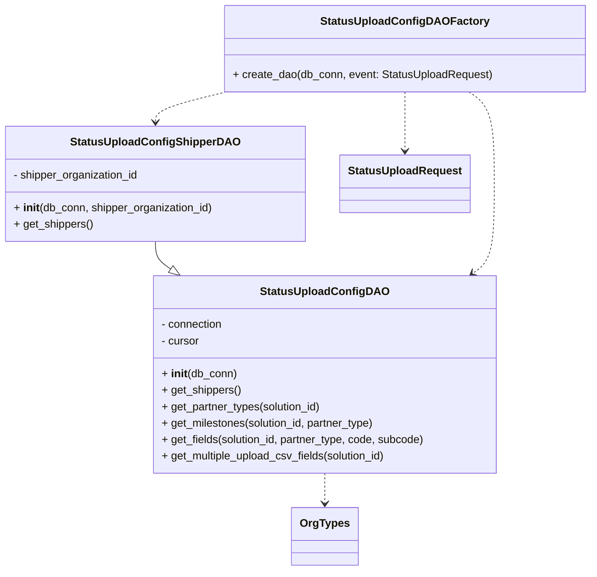
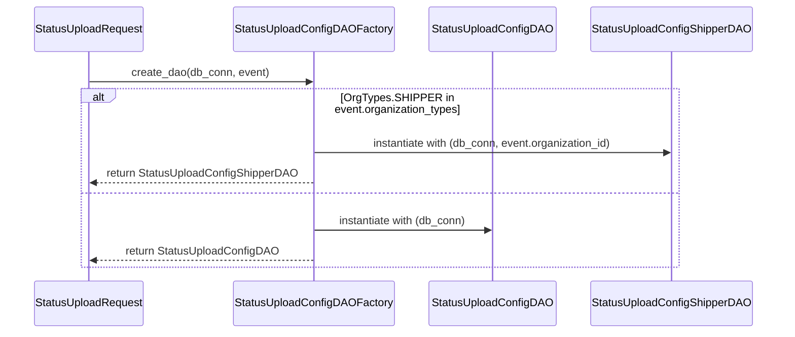

# Diagram: entity_core/entity_service/entity_service/db/daos/status_upload_config_dao.py

> Auto-generated by Obscura crawlers

## Diagram 1

### SVG

<svg id="container" width="848.390625" xmlns="http://www.w3.org/2000/svg" class="classDiagram" height="832" viewBox="0 0 848.390625 832" role="graphics-document document" aria-roledescription="class"><g><defs><marker id="container_class-aggregationStart" class="marker aggregation class" refX="18" refY="7" markerWidth="190" markerHeight="240" orient="auto"><path d="M 18,7 L9,13 L1,7 L9,1 Z"></path></marker></defs><defs><marker id="container_class-aggregationEnd" class="marker aggregation class" refX="1" refY="7" markerWidth="20" markerHeight="28" orient="auto"><path d="M 18,7 L9,13 L1,7 L9,1 Z"></path></marker></defs><defs><marker id="container_class-extensionStart" class="marker extension class" refX="18" refY="7" markerWidth="190" markerHeight="240" orient="auto"><path d="M 1,7 L18,13 V 1 Z"></path></marker></defs><defs><marker id="container_class-extensionEnd" class="marker extension class" refX="1" refY="7" markerWidth="20" markerHeight="28" orient="auto"><path d="M 1,1 V 13 L18,7 Z"></path></marker></defs><defs><marker id="container_class-compositionStart" class="marker composition class" refX="18" refY="7" markerWidth="190" markerHeight="240" orient="auto"><path d="M 18,7 L9,13 L1,7 L9,1 Z"></path></marker></defs><defs><marker id="container_class-compositionEnd" class="marker composition class" refX="1" refY="7" markerWidth="20" markerHeight="28" orient="auto"><path d="M 18,7 L9,13 L1,7 L9,1 Z"></path></marker></defs><defs><marker id="container_class-dependencyStart" class="marker dependency class" refX="6" refY="7" markerWidth="190" markerHeight="240" orient="auto"><path d="M 5,7 L9,13 L1,7 L9,1 Z"></path></marker></defs><defs><marker id="container_class-dependencyEnd" class="marker dependency class" refX="13" refY="7" markerWidth="20" markerHeight="28" orient="auto"><path d="M 18,7 L9,13 L14,7 L9,1 Z"></path></marker></defs><defs><marker id="container_class-lollipopStart" class="marker lollipop class" refX="13" refY="7" markerWidth="190" markerHeight="240" orient="auto"><circle stroke="black" fill="transparent" cx="7" cy="7" r="6"></circle></marker></defs><defs><marker id="container_class-lollipopEnd" class="marker lollipop class" refX="1" refY="7" markerWidth="190" markerHeight="240" orient="auto"><circle stroke="black" fill="transparent" cx="7" cy="7" r="6"></circle></marker></defs><g class="root"><g class="clusters"></g><g class="edgePaths"><path d="M224.238,352L224.238,356.167C224.238,360.333,224.238,368.667,227.851,375.355C231.464,382.043,238.691,387.085,242.304,389.607L245.917,392.128" id="id_StatusUploadConfigShipperDAO_StatusUploadConfigDAO_1" class="edge-thickness-normal edge-pattern-solid relation" style=";;;" data-edge="true" data-et="edge" data-id="id_StatusUploadConfigShipperDAO_StatusUploadConfigDAO_1" data-points="W3sieCI6MjI0LjIzODI4MTI1LCJ5IjozNTJ9LHsieCI6MjI0LjIzODI4MTI1LCJ5IjozNzd9LHsieCI6MjYwLjA2MjgxMjAzNzcyMTg3LCJ5Ijo0MDJ9XQ==" marker-end="url(#container_class-extensionEnd)"></path><path d="M672.633,134L678.625,138.167C684.617,142.333,696.602,150.667,702.594,173C708.586,195.333,708.586,231.667,708.586,268C708.586,304.333,708.586,340.667,703.435,362.428C698.285,384.189,687.983,391.378,682.832,394.972L677.682,398.566" id="id_StatusUploadConfigDAOFactory_StatusUploadConfigDAO_2" class="edge-thickness-normal edge-pattern-dashed relation" style=";;;" data-edge="true" data-et="edge" data-id="id_StatusUploadConfigDAOFactory_StatusUploadConfigDAO_2" data-points="W3sieCI6NjcyLjYzMjkwMTI3ODQwOTEsInkiOjEzNH0seyJ4Ijo3MDguNTg1OTM3NSwieSI6MTU5fSx7IngiOjcwOC41ODU5Mzc1LCJ5IjoyNjh9LHsieCI6NzA4LjU4NTkzNzUsInkiOjM3N30seyJ4Ijo2NzIuNzYxNDA2NzEyMjc4MSwieSI6NDAyfV0=" marker-end="url(#container_class-dependencyEnd)"></path><path d="M325.884,134L308.943,138.167C292.002,142.333,258.12,150.667,241.179,158C224.238,165.333,224.238,171.667,224.238,174.833L224.238,178" id="id_StatusUploadConfigDAOFactory_StatusUploadConfigShipperDAO_3" class="edge-thickness-normal edge-pattern-dashed relation" style=";;;" data-edge="true" data-et="edge" data-id="id_StatusUploadConfigDAOFactory_StatusUploadConfigShipperDAO_3" data-points="W3sieCI6MzI1Ljg4NDAxMTAwODUyMjc1LCJ5IjoxMzR9LHsieCI6MjI0LjIzODI4MTI1LCJ5IjoxNTl9LHsieCI6MjI0LjIzODI4MTI1LCJ5IjoxODR9XQ==" marker-end="url(#container_class-dependencyEnd)"></path><path d="M582.031,134L582.031,138.167C582.031,142.333,582.031,150.667,582.031,165C582.031,179.333,582.031,199.667,582.031,209.833L582.031,220" id="id_StatusUploadConfigDAOFactory_StatusUploadRequest_4" class="edge-thickness-normal edge-pattern-dashed relation" style=";;;" data-edge="true" data-et="edge" data-id="id_StatusUploadConfigDAOFactory_StatusUploadRequest_4" data-points="W3sieCI6NTgyLjAzMTI1LCJ5IjoxMzR9LHsieCI6NTgyLjAzMTI1LCJ5IjoxNTl9LHsieCI6NTgyLjAzMTI1LCJ5IjoyMjZ9XQ==" marker-end="url(#container_class-dependencyEnd)"></path><path d="M466.412,690L466.412,694.167C466.412,698.333,466.412,706.667,466.412,714C466.412,721.333,466.412,727.667,466.412,730.833L466.412,734" id="id_StatusUploadConfigDAO_OrgTypes_5" class="edge-thickness-normal edge-pattern-dashed relation" style=";;;" data-edge="true" data-et="edge" data-id="id_StatusUploadConfigDAO_OrgTypes_5" data-points="W3sieCI6NDY2LjQxMjEwOTM3NSwieSI6NjkwfSx7IngiOjQ2Ni40MTIxMDkzNzUsInkiOjcxNX0seyJ4Ijo0NjYuNDEyMTA5Mzc1LCJ5Ijo3NDB9XQ==" marker-end="url(#container_class-dependencyEnd)"></path></g><g class="edgeLabels"><g class="edgeLabel"><g class="label" data-id="id_StatusUploadConfigShipperDAO_StatusUploadConfigDAO_1" transform="translate(0, 0)"><foreignObject width="0" height="0">

</foreignObject></g></g><g class="edgeLabel"><g class="label" data-id="id_StatusUploadConfigDAOFactory_StatusUploadConfigDAO_2" transform="translate(0, 0)"><foreignObject width="0" height="0">

</foreignObject></g></g><g class="edgeLabel"><g class="label" data-id="id_StatusUploadConfigDAOFactory_StatusUploadConfigShipperDAO_3" transform="translate(0, 0)"><foreignObject width="0" height="0">

</foreignObject></g></g><g class="edgeLabel"><g class="label" data-id="id_StatusUploadConfigDAOFactory_StatusUploadRequest_4" transform="translate(0, 0)"><foreignObject width="0" height="0">

</foreignObject></g></g><g class="edgeLabel"><g class="label" data-id="id_StatusUploadConfigDAO_OrgTypes_5" transform="translate(0, 0)"><foreignObject width="0" height="0">

</foreignObject></g></g></g><g class="nodes"><g class="node default" id="classId-StatusUploadConfigDAO-0" transform="translate(466.412109375, 546)"><g class="basic label-container"><path d="M-249.83203125 -144 L249.83203125 -144 L249.83203125 144 L-249.83203125 144" stroke="none" stroke-width="0" fill="#ECECFF" style=""></path><path d="M-249.83203125 -144 C-103.16714187833344 -144, 43.49774749333312 -144, 249.83203125 -144 M-249.83203125 -144 C-142.64385504355295 -144, -35.45567883710589 -144, 249.83203125 -144 M249.83203125 -144 C249.83203125 -44.26823827443964, 249.83203125 55.46352345112072, 249.83203125 144 M249.83203125 -144 C249.83203125 -61.31704265029511, 249.83203125 21.365914699409785, 249.83203125 144 M249.83203125 144 C126.77407615793545 144, 3.716121065870908 144, -249.83203125 144 M249.83203125 144 C94.17840656939904 144, -61.47521811120191 144, -249.83203125 144 M-249.83203125 144 C-249.83203125 60.79909850367264, -249.83203125 -22.401802992654723, -249.83203125 -144 M-249.83203125 144 C-249.83203125 78.55298600633243, -249.83203125 13.105972012664864, -249.83203125 -144" stroke="#9370DB" stroke-width="1.3" fill="none" stroke-dasharray="0 0" style=""></path></g><g class="annotation-group text" transform="translate(0, -120)"></g><g class="label-group text" transform="translate(-87.8046875, -120)"><g class="label" style="font-weight: bolder" transform="translate(0,-12)"><foreignObject width="175.609375" height="24">

StatusUploadConfigDAO

</foreignObject></g></g><g class="members-group text" transform="translate(-237.83203125, -72)"><g class="label" style="" transform="translate(0,-12)"><foreignObject width="91.5" height="24">

- connection

</foreignObject></g><g class="label" style="" transform="translate(0,12)"><foreignObject width="56.421875" height="24">

- cursor

</foreignObject></g></g><g class="methods-group text" transform="translate(-237.83203125, 0)"><g class="label" style="" transform="translate(0,-12)"><foreignObject width="109.21875" height="24">

+ <strong>init</strong>(db_conn)

</foreignObject></g><g class="label" style="" transform="translate(0,12)"><foreignObject width="115.96875" height="24">

+ get_shippers()

</foreignObject></g><g class="label" style="" transform="translate(0,36)"><foreignObject width="235.953125" height="24">

+ get_partner_types(solution_id)

</foreignObject></g><g class="label" style="" transform="translate(0,60)"><foreignObject width="316.046875" height="24">

+ get_milestones(solution_id, partner_type)

</foreignObject></g><g class="label" style="" transform="translate(0,84)"><foreignObject width="387.859375" height="24">

+ get_fields(solution_id, partner_type, code, subcode)

</foreignObject></g><g class="label" style="" transform="translate(0,108)"><foreignObject width="332.90625" height="24">

+ get_multiple_upload_csv_fields(solution_id)

</foreignObject></g></g><g class="divider" style=""><path d="M-249.83203125 -96 C-69.26315651743803 -96, 111.30571821512393 -96, 249.83203125 -96 M-249.83203125 -96 C-96.5139715672226 -96, 56.804088115554805 -96, 249.83203125 -96" stroke="#9370DB" stroke-width="1.3" fill="none" stroke-dasharray="0 0" style=""></path></g><g class="divider" style=""><path d="M-249.83203125 -24 C-84.2474373409581 -24, 81.3371565680838 -24, 249.83203125 -24 M-249.83203125 -24 C-111.13893772604055 -24, 27.554155797918895 -24, 249.83203125 -24" stroke="#9370DB" stroke-width="1.3" fill="none" stroke-dasharray="0 0" style=""></path></g></g><g class="node default" id="classId-StatusUploadConfigShipperDAO-1" transform="translate(224.23828125, 268)"><g class="basic label-container"><path d="M-216.23828125 -84 L216.23828125 -84 L216.23828125 84 L-216.23828125 84" stroke="none" stroke-width="0" fill="#ECECFF" style=""></path><path d="M-216.23828125 -84 C-50.50186427421414 -84, 115.23455270157172 -84, 216.23828125 -84 M-216.23828125 -84 C-129.06596822140932 -84, -41.89365519281864 -84, 216.23828125 -84 M216.23828125 -84 C216.23828125 -48.8681316429486, 216.23828125 -13.736263285897195, 216.23828125 84 M216.23828125 -84 C216.23828125 -38.183054466468406, 216.23828125 7.633891067063189, 216.23828125 84 M216.23828125 84 C91.38408327529149 84, -33.470114699417024 84, -216.23828125 84 M216.23828125 84 C111.54657278777796 84, 6.854864325555923 84, -216.23828125 84 M-216.23828125 84 C-216.23828125 46.56322187205548, -216.23828125 9.126443744110958, -216.23828125 -84 M-216.23828125 84 C-216.23828125 42.20115870461022, -216.23828125 0.40231740922044423, -216.23828125 -84" stroke="#9370DB" stroke-width="1.3" fill="none" stroke-dasharray="0 0" style=""></path></g><g class="annotation-group text" transform="translate(0, -60)"></g><g class="label-group text" transform="translate(-116.4296875, -60)"><g class="label" style="font-weight: bolder" transform="translate(0,-12)"><foreignObject width="232.859375" height="24">

StatusUploadConfigShipperDAO

</foreignObject></g></g><g class="members-group text" transform="translate(-204.23828125, -12)"><g class="label" style="" transform="translate(0,-12)"><foreignObject width="185.4375" height="24">

- shipper_organization_id

</foreignObject></g></g><g class="methods-group text" transform="translate(-204.23828125, 36)"><g class="label" style="" transform="translate(0,-12)"><foreignObject width="292.046875" height="24">

+ <strong>init</strong>(db_conn, shipper_organization_id)

</foreignObject></g><g class="label" style="" transform="translate(0,12)"><foreignObject width="115.96875" height="24">

+ get_shippers()

</foreignObject></g></g><g class="divider" style=""><path d="M-216.23828125 -36 C-117.64409875944611 -36, -19.04991626889222 -36, 216.23828125 -36 M-216.23828125 -36 C-46.509307564500716 -36, 123.21966612099857 -36, 216.23828125 -36" stroke="#9370DB" stroke-width="1.3" fill="none" stroke-dasharray="0 0" style=""></path></g><g class="divider" style=""><path d="M-216.23828125 12 C-81.85420485810585 12, 52.52987153378831 12, 216.23828125 12 M-216.23828125 12 C-118.18779816610972 12, -20.13731508221943 12, 216.23828125 12" stroke="#9370DB" stroke-width="1.3" fill="none" stroke-dasharray="0 0" style=""></path></g></g><g class="node default" id="classId-StatusUploadConfigDAOFactory-2" transform="translate(582.03125, 71)"><g class="basic label-container"><path d="M-258.359375 -63 L258.359375 -63 L258.359375 63 L-258.359375 63" stroke="none" stroke-width="0" fill="#ECECFF" style=""></path><path d="M-258.359375 -63 C-74.57740180119697 -63, 109.20457139760606 -63, 258.359375 -63 M-258.359375 -63 C-62.79569489725955 -63, 132.7679852054809 -63, 258.359375 -63 M258.359375 -63 C258.359375 -16.436037016486942, 258.359375 30.127925967026115, 258.359375 63 M258.359375 -63 C258.359375 -32.335395830763034, 258.359375 -1.67079166152606, 258.359375 63 M258.359375 63 C133.25116580656945 63, 8.142956613138892 63, -258.359375 63 M258.359375 63 C132.20452011774833 63, 6.049665235496661 63, -258.359375 63 M-258.359375 63 C-258.359375 16.758285538734235, -258.359375 -29.48342892253153, -258.359375 -63 M-258.359375 63 C-258.359375 24.073405733992857, -258.359375 -14.853188532014286, -258.359375 -63" stroke="#9370DB" stroke-width="1.3" fill="none" stroke-dasharray="0 0" style=""></path></g><g class="annotation-group text" transform="translate(0, -39)"></g><g class="label-group text" transform="translate(-114.40625, -39)"><g class="label" style="font-weight: bolder" transform="translate(0,-12)"><foreignObject width="228.8125" height="24">

StatusUploadConfigDAOFactory

</foreignObject></g></g><g class="members-group text" transform="translate(-246.359375, 9)"></g><g class="methods-group text" transform="translate(-246.359375, 39)"><g class="label" style="" transform="translate(0,-12)"><foreignObject width="378.3125" height="24">

+ create_dao(db_conn, event: StatusUploadRequest)

</foreignObject></g></g><g class="divider" style=""><path d="M-258.359375 -15 C-105.94642605136298 -15, 46.46652289727405 -15, 258.359375 -15 M-258.359375 -15 C-95.9009482840853 -15, 66.5574784318294 -15, 258.359375 -15" stroke="#9370DB" stroke-width="1.3" fill="none" stroke-dasharray="0 0" style=""></path></g><g class="divider" style=""><path d="M-258.359375 9 C-57.80639876582427 9, 142.74657746835146 9, 258.359375 9 M-258.359375 9 C-87.0992317857467 9, 84.16091142850661 9, 258.359375 9" stroke="#9370DB" stroke-width="1.3" fill="none" stroke-dasharray="0 0" style=""></path></g></g><g class="node default" id="classId-StatusUploadRequest-3" transform="translate(582.03125, 268)"><g class="basic label-container"><path d="M-91.5546875 -42 L91.5546875 -42 L91.5546875 42 L-91.5546875 42" stroke="none" stroke-width="0" fill="#ECECFF" style=""></path><path d="M-91.5546875 -42 C-37.057071203856644 -42, 17.440545092286712 -42, 91.5546875 -42 M-91.5546875 -42 C-47.96437176104406 -42, -4.374056022088126 -42, 91.5546875 -42 M91.5546875 -42 C91.5546875 -24.163221430610573, 91.5546875 -6.326442861221146, 91.5546875 42 M91.5546875 -42 C91.5546875 -17.195674948524932, 91.5546875 7.608650102950136, 91.5546875 42 M91.5546875 42 C45.470032227422465 42, -0.6146230451550707 42, -91.5546875 42 M91.5546875 42 C21.92549887123002 42, -47.70368975753996 42, -91.5546875 42 M-91.5546875 42 C-91.5546875 24.380971299029607, -91.5546875 6.761942598059214, -91.5546875 -42 M-91.5546875 42 C-91.5546875 14.070421624281927, -91.5546875 -13.859156751436146, -91.5546875 -42" stroke="#9370DB" stroke-width="1.3" fill="none" stroke-dasharray="0 0" style=""></path></g><g class="annotation-group text" transform="translate(0, -18)"></g><g class="label-group text" transform="translate(-79.5546875, -18)"><g class="label" style="font-weight: bolder" transform="translate(0,-12)"><foreignObject width="159.109375" height="24">

StatusUploadRequest

</foreignObject></g></g><g class="members-group text" transform="translate(-79.5546875, 30)"></g><g class="methods-group text" transform="translate(-79.5546875, 60)"></g><g class="divider" style=""><path d="M-91.5546875 6 C-49.71251473125013 6, -7.870341962500262 6, 91.5546875 6 M-91.5546875 6 C-30.752700108526305 6, 30.04928728294739 6, 91.5546875 6" stroke="#9370DB" stroke-width="1.3" fill="none" stroke-dasharray="0 0" style=""></path></g><g class="divider" style=""><path d="M-91.5546875 24 C-32.736089289031916 24, 26.082508921936167 24, 91.5546875 24 M-91.5546875 24 C-33.026469200691935 24, 25.50174909861613 24, 91.5546875 24" stroke="#9370DB" stroke-width="1.3" fill="none" stroke-dasharray="0 0" style=""></path></g></g><g class="node default" id="classId-OrgTypes-4" transform="translate(466.412109375, 782)"><g class="basic label-container"><path d="M-46.25 -42 L46.25 -42 L46.25 42 L-46.25 42" stroke="none" stroke-width="0" fill="#ECECFF" style=""></path><path d="M-46.25 -42 C-25.641902166837298 -42, -5.0338043336745955 -42, 46.25 -42 M-46.25 -42 C-16.210617346544417 -42, 13.828765306911166 -42, 46.25 -42 M46.25 -42 C46.25 -16.21412043145342, 46.25 9.57175913709316, 46.25 42 M46.25 -42 C46.25 -14.507418609642155, 46.25 12.98516278071569, 46.25 42 M46.25 42 C25.625101002419804 42, 5.000202004839608 42, -46.25 42 M46.25 42 C10.558165527834781 42, -25.133668944330438 42, -46.25 42 M-46.25 42 C-46.25 18.266849969910872, -46.25 -5.466300060178256, -46.25 -42 M-46.25 42 C-46.25 18.1631442398368, -46.25 -5.6737115203264, -46.25 -42" stroke="#9370DB" stroke-width="1.3" fill="none" stroke-dasharray="0 0" style=""></path></g><g class="annotation-group text" transform="translate(0, -18)"></g><g class="label-group text" transform="translate(-34.25, -18)"><g class="label" style="font-weight: bolder" transform="translate(0,-12)"><foreignObject width="68.5" height="24">

OrgTypes

</foreignObject></g></g><g class="members-group text" transform="translate(-34.25, 30)"></g><g class="methods-group text" transform="translate(-34.25, 60)"></g><g class="divider" style=""><path d="M-46.25 6 C-12.202786466870009 6, 21.844427066259982 6, 46.25 6 M-46.25 6 C-24.747156184184355 6, -3.2443123683687105 6, 46.25 6" stroke="#9370DB" stroke-width="1.3" fill="none" stroke-dasharray="0 0" style=""></path></g><g class="divider" style=""><path d="M-46.25 24 C-27.12272493244797 24, -7.995449864895939 24, 46.25 24 M-46.25 24 C-20.700213133322663 24, 4.849573733354674 24, 46.25 24" stroke="#9370DB" stroke-width="1.3" fill="none" stroke-dasharray="0 0" style=""></path></g></g></g></g></g></svg>

## Diagram 2

### SVG

<svg id="container" width="1202" xmlns="http://www.w3.org/2000/svg" height="509" viewBox="-50 -10 1202 509" role="graphics-document document" aria-roledescription="sequence"><g><rect x="853" y="423" fill="#eaeaea" stroke="#666" width="249" height="65" name="ShipperDAO" rx="3" ry="3" class="actor actor-bottom"></rect><text x="977.5" y="455.5" dominant-baseline="central" alignment-baseline="central" class="actor actor-box" style="text-anchor: middle; font-size: 16px; font-weight: 400;"><tspan x="977.5" dy="0">StatusUploadConfigShipperDAO</tspan></text></g><g><rect x="610" y="423" fill="#eaeaea" stroke="#666" width="193" height="65" name="DAO" rx="3" ry="3" class="actor actor-bottom"></rect><text x="706.5" y="455.5" dominant-baseline="central" alignment-baseline="central" class="actor actor-box" style="text-anchor: middle; font-size: 16px; font-weight: 400;"><tspan x="706.5" dy="0">StatusUploadConfigDAO</tspan></text></g><g><rect x="315" y="423" fill="#eaeaea" stroke="#666" width="245" height="65" name="Factory" rx="3" ry="3" class="actor actor-bottom"></rect><text x="437.5" y="455.5" dominant-baseline="central" alignment-baseline="central" class="actor actor-box" style="text-anchor: middle; font-size: 16px; font-weight: 400;"><tspan x="437.5" dy="0">StatusUploadConfigDAOFactory</tspan></text></g><g><rect x="0" y="423" fill="#eaeaea" stroke="#666" width="177" height="65" name="Req" rx="3" ry="3" class="actor actor-bottom"></rect><text x="88.5" y="455.5" dominant-baseline="central" alignment-baseline="central" class="actor actor-box" style="text-anchor: middle; font-size: 16px; font-weight: 400;"><tspan x="88.5" dy="0">StatusUploadRequest</tspan></text></g><g><line id="actor3" x1="977.5" y1="65" x2="977.5" y2="423" class="actor-line 200" stroke-width="0.5px" stroke="#999" name="ShipperDAO"></line><g id="root-3"><rect x="853" y="0" fill="#eaeaea" stroke="#666" width="249" height="65" name="ShipperDAO" rx="3" ry="3" class="actor actor-top"></rect><text x="977.5" y="32.5" dominant-baseline="central" alignment-baseline="central" class="actor actor-box" style="text-anchor: middle; font-size: 16px; font-weight: 400;"><tspan x="977.5" dy="0">StatusUploadConfigShipperDAO</tspan></text></g></g><g><line id="actor2" x1="706.5" y1="65" x2="706.5" y2="423" class="actor-line 200" stroke-width="0.5px" stroke="#999" name="DAO"></line><g id="root-2"><rect x="610" y="0" fill="#eaeaea" stroke="#666" width="193" height="65" name="DAO" rx="3" ry="3" class="actor actor-top"></rect><text x="706.5" y="32.5" dominant-baseline="central" alignment-baseline="central" class="actor actor-box" style="text-anchor: middle; font-size: 16px; font-weight: 400;"><tspan x="706.5" dy="0">StatusUploadConfigDAO</tspan></text></g></g><g><line id="actor1" x1="437.5" y1="65" x2="437.5" y2="423" class="actor-line 200" stroke-width="0.5px" stroke="#999" name="Factory"></line><g id="root-1"><rect x="315" y="0" fill="#eaeaea" stroke="#666" width="245" height="65" name="Factory" rx="3" ry="3" class="actor actor-top"></rect><text x="437.5" y="32.5" dominant-baseline="central" alignment-baseline="central" class="actor actor-box" style="text-anchor: middle; font-size: 16px; font-weight: 400;"><tspan x="437.5" dy="0">StatusUploadConfigDAOFactory</tspan></text></g></g><g><line id="actor0" x1="88.5" y1="65" x2="88.5" y2="423" class="actor-line 200" stroke-width="0.5px" stroke="#999" name="Req"></line><g id="root-0"><rect x="0" y="0" fill="#eaeaea" stroke="#666" width="177" height="65" name="Req" rx="3" ry="3" class="actor actor-top"></rect><text x="88.5" y="32.5" dominant-baseline="central" alignment-baseline="central" class="actor actor-box" style="text-anchor: middle; font-size: 16px; font-weight: 400;"><tspan x="88.5" dy="0">StatusUploadRequest</tspan></text></g></g><g></g><defs><symbol id="computer" width="24" height="24"><path transform="scale(.5)" d="M2 2v13h20v-13h-20zm18 11h-16v-9h16v9zm-10.228 6l.466-1h3.524l.467 1h-4.457zm14.228 3h-24l2-6h2.104l-1.33 4h18.45l-1.297-4h2.073l2 6zm-5-10h-14v-7h14v7z"></path></symbol></defs><defs><symbol id="database" fill-rule="evenodd" clip-rule="evenodd"><path transform="scale(.5)" d="M12.258.001l.256.004.255.005.253.008.251.01.249.012.247.015.246.016.242.019.241.02.239.023.236.024.233.027.231.028.229.031.225.032.223.034.22.036.217.038.214.04.211.041.208.043.205.045.201.046.198.048.194.05.191.051.187.053.183.054.18.056.175.057.172.059.168.06.163.061.16.063.155.064.15.066.074.033.073.033.071.034.07.034.069.035.068.035.067.035.066.035.064.036.064.036.062.036.06.036.06.037.058.037.058.037.055.038.055.038.053.038.052.038.051.039.05.039.048.039.047.039.045.04.044.04.043.04.041.04.04.041.039.041.037.041.036.041.034.041.033.042.032.042.03.042.029.042.027.042.026.043.024.043.023.043.021.043.02.043.018.044.017.043.015.044.013.044.012.044.011.045.009.044.007.045.006.045.004.045.002.045.001.045v17l-.001.045-.002.045-.004.045-.006.045-.007.045-.009.044-.011.045-.012.044-.013.044-.015.044-.017.043-.018.044-.02.043-.021.043-.023.043-.024.043-.026.043-.027.042-.029.042-.03.042-.032.042-.033.042-.034.041-.036.041-.037.041-.039.041-.04.041-.041.04-.043.04-.044.04-.045.04-.047.039-.048.039-.05.039-.051.039-.052.038-.053.038-.055.038-.055.038-.058.037-.058.037-.06.037-.06.036-.062.036-.064.036-.064.036-.066.035-.067.035-.068.035-.069.035-.07.034-.071.034-.073.033-.074.033-.15.066-.155.064-.16.063-.163.061-.168.06-.172.059-.175.057-.18.056-.183.054-.187.053-.191.051-.194.05-.198.048-.201.046-.205.045-.208.043-.211.041-.214.04-.217.038-.22.036-.223.034-.225.032-.229.031-.231.028-.233.027-.236.024-.239.023-.241.02-.242.019-.246.016-.247.015-.249.012-.251.01-.253.008-.255.005-.256.004-.258.001-.258-.001-.256-.004-.255-.005-.253-.008-.251-.01-.249-.012-.247-.015-.245-.016-.243-.019-.241-.02-.238-.023-.236-.024-.234-.027-.231-.028-.228-.031-.226-.032-.223-.034-.22-.036-.217-.038-.214-.04-.211-.041-.208-.043-.204-.045-.201-.046-.198-.048-.195-.05-.19-.051-.187-.053-.184-.054-.179-.056-.176-.057-.172-.059-.167-.06-.164-.061-.159-.063-.155-.064-.151-.066-.074-.033-.072-.033-.072-.034-.07-.034-.069-.035-.068-.035-.067-.035-.066-.035-.064-.036-.063-.036-.062-.036-.061-.036-.06-.037-.058-.037-.057-.037-.056-.038-.055-.038-.053-.038-.052-.038-.051-.039-.049-.039-.049-.039-.046-.039-.046-.04-.044-.04-.043-.04-.041-.04-.04-.041-.039-.041-.037-.041-.036-.041-.034-.041-.033-.042-.032-.042-.03-.042-.029-.042-.027-.042-.026-.043-.024-.043-.023-.043-.021-.043-.02-.043-.018-.044-.017-.043-.015-.044-.013-.044-.012-.044-.011-.045-.009-.044-.007-.045-.006-.045-.004-.045-.002-.045-.001-.045v-17l.001-.045.002-.045.004-.045.006-.045.007-.045.009-.044.011-.045.012-.044.013-.044.015-.044.017-.043.018-.044.02-.043.021-.043.023-.043.024-.043.026-.043.027-.042.029-.042.03-.042.032-.042.033-.042.034-.041.036-.041.037-.041.039-.041.04-.041.041-.04.043-.04.044-.04.046-.04.046-.039.049-.039.049-.039.051-.039.052-.038.053-.038.055-.038.056-.038.057-.037.058-.037.06-.037.061-.036.062-.036.063-.036.064-.036.066-.035.067-.035.068-.035.069-.035.07-.034.072-.034.072-.033.074-.033.151-.066.155-.064.159-.063.164-.061.167-.06.172-.059.176-.057.179-.056.184-.054.187-.053.19-.051.195-.05.198-.048.201-.046.204-.045.208-.043.211-.041.214-.04.217-.038.22-.036.223-.034.226-.032.228-.031.231-.028.234-.027.236-.024.238-.023.241-.02.243-.019.245-.016.247-.015.249-.012.251-.01.253-.008.255-.005.256-.004.258-.001.258.001zm-9.258 20.499v.01l.001.021.003.021.004.022.005.021.006.022.007.022.009.023.01.022.011.023.012.023.013.023.015.023.016.024.017.023.018.024.019.024.021.024.022.025.023.024.024.025.052.049.056.05.061.051.066.051.07.051.075.051.079.052.084.052.088.052.092.052.097.052.102.051.105.052.11.052.114.051.119.051.123.051.127.05.131.05.135.05.139.048.144.049.147.047.152.047.155.047.16.045.163.045.167.043.171.043.176.041.178.041.183.039.187.039.19.037.194.035.197.035.202.033.204.031.209.03.212.029.216.027.219.025.222.024.226.021.23.02.233.018.236.016.24.015.243.012.246.01.249.008.253.005.256.004.259.001.26-.001.257-.004.254-.005.25-.008.247-.011.244-.012.241-.014.237-.016.233-.018.231-.021.226-.021.224-.024.22-.026.216-.027.212-.028.21-.031.205-.031.202-.034.198-.034.194-.036.191-.037.187-.039.183-.04.179-.04.175-.042.172-.043.168-.044.163-.045.16-.046.155-.046.152-.047.148-.048.143-.049.139-.049.136-.05.131-.05.126-.05.123-.051.118-.052.114-.051.11-.052.106-.052.101-.052.096-.052.092-.052.088-.053.083-.051.079-.052.074-.052.07-.051.065-.051.06-.051.056-.05.051-.05.023-.024.023-.025.021-.024.02-.024.019-.024.018-.024.017-.024.015-.023.014-.024.013-.023.012-.023.01-.023.01-.022.008-.022.006-.022.006-.022.004-.022.004-.021.001-.021.001-.021v-4.127l-.077.055-.08.053-.083.054-.085.053-.087.052-.09.052-.093.051-.095.05-.097.05-.1.049-.102.049-.105.048-.106.047-.109.047-.111.046-.114.045-.115.045-.118.044-.12.043-.122.042-.124.042-.126.041-.128.04-.13.04-.132.038-.134.038-.135.037-.138.037-.139.035-.142.035-.143.034-.144.033-.147.032-.148.031-.15.03-.151.03-.153.029-.154.027-.156.027-.158.026-.159.025-.161.024-.162.023-.163.022-.165.021-.166.02-.167.019-.169.018-.169.017-.171.016-.173.015-.173.014-.175.013-.175.012-.177.011-.178.01-.179.008-.179.008-.181.006-.182.005-.182.004-.184.003-.184.002h-.37l-.184-.002-.184-.003-.182-.004-.182-.005-.181-.006-.179-.008-.179-.008-.178-.01-.176-.011-.176-.012-.175-.013-.173-.014-.172-.015-.171-.016-.17-.017-.169-.018-.167-.019-.166-.02-.165-.021-.163-.022-.162-.023-.161-.024-.159-.025-.157-.026-.156-.027-.155-.027-.153-.029-.151-.03-.15-.03-.148-.031-.146-.032-.145-.033-.143-.034-.141-.035-.14-.035-.137-.037-.136-.037-.134-.038-.132-.038-.13-.04-.128-.04-.126-.041-.124-.042-.122-.042-.12-.044-.117-.043-.116-.045-.113-.045-.112-.046-.109-.047-.106-.047-.105-.048-.102-.049-.1-.049-.097-.05-.095-.05-.093-.052-.09-.051-.087-.052-.085-.053-.083-.054-.08-.054-.077-.054v4.127zm0-5.654v.011l.001.021.003.021.004.021.005.022.006.022.007.022.009.022.01.022.011.023.012.023.013.023.015.024.016.023.017.024.018.024.019.024.021.024.022.024.023.025.024.024.052.05.056.05.061.05.066.051.07.051.075.052.079.051.084.052.088.052.092.052.097.052.102.052.105.052.11.051.114.051.119.052.123.05.127.051.131.05.135.049.139.049.144.048.147.048.152.047.155.046.16.045.163.045.167.044.171.042.176.042.178.04.183.04.187.038.19.037.194.036.197.034.202.033.204.032.209.03.212.028.216.027.219.025.222.024.226.022.23.02.233.018.236.016.24.014.243.012.246.01.249.008.253.006.256.003.259.001.26-.001.257-.003.254-.006.25-.008.247-.01.244-.012.241-.015.237-.016.233-.018.231-.02.226-.022.224-.024.22-.025.216-.027.212-.029.21-.03.205-.032.202-.033.198-.035.194-.036.191-.037.187-.039.183-.039.179-.041.175-.042.172-.043.168-.044.163-.045.16-.045.155-.047.152-.047.148-.048.143-.048.139-.05.136-.049.131-.05.126-.051.123-.051.118-.051.114-.052.11-.052.106-.052.101-.052.096-.052.092-.052.088-.052.083-.052.079-.052.074-.051.07-.052.065-.051.06-.05.056-.051.051-.049.023-.025.023-.024.021-.025.02-.024.019-.024.018-.024.017-.024.015-.023.014-.023.013-.024.012-.022.01-.023.01-.023.008-.022.006-.022.006-.022.004-.021.004-.022.001-.021.001-.021v-4.139l-.077.054-.08.054-.083.054-.085.052-.087.053-.09.051-.093.051-.095.051-.097.05-.1.049-.102.049-.105.048-.106.047-.109.047-.111.046-.114.045-.115.044-.118.044-.12.044-.122.042-.124.042-.126.041-.128.04-.13.039-.132.039-.134.038-.135.037-.138.036-.139.036-.142.035-.143.033-.144.033-.147.033-.148.031-.15.03-.151.03-.153.028-.154.028-.156.027-.158.026-.159.025-.161.024-.162.023-.163.022-.165.021-.166.02-.167.019-.169.018-.169.017-.171.016-.173.015-.173.014-.175.013-.175.012-.177.011-.178.009-.179.009-.179.007-.181.007-.182.005-.182.004-.184.003-.184.002h-.37l-.184-.002-.184-.003-.182-.004-.182-.005-.181-.007-.179-.007-.179-.009-.178-.009-.176-.011-.176-.012-.175-.013-.173-.014-.172-.015-.171-.016-.17-.017-.169-.018-.167-.019-.166-.02-.165-.021-.163-.022-.162-.023-.161-.024-.159-.025-.157-.026-.156-.027-.155-.028-.153-.028-.151-.03-.15-.03-.148-.031-.146-.033-.145-.033-.143-.033-.141-.035-.14-.036-.137-.036-.136-.037-.134-.038-.132-.039-.13-.039-.128-.04-.126-.041-.124-.042-.122-.043-.12-.043-.117-.044-.116-.044-.113-.046-.112-.046-.109-.046-.106-.047-.105-.048-.102-.049-.1-.049-.097-.05-.095-.051-.093-.051-.09-.051-.087-.053-.085-.052-.083-.054-.08-.054-.077-.054v4.139zm0-5.666v.011l.001.02.003.022.004.021.005.022.006.021.007.022.009.023.01.022.011.023.012.023.013.023.015.023.016.024.017.024.018.023.019.024.021.025.022.024.023.024.024.025.052.05.056.05.061.05.066.051.07.051.075.052.079.051.084.052.088.052.092.052.097.052.102.052.105.051.11.052.114.051.119.051.123.051.127.05.131.05.135.05.139.049.144.048.147.048.152.047.155.046.16.045.163.045.167.043.171.043.176.042.178.04.183.04.187.038.19.037.194.036.197.034.202.033.204.032.209.03.212.028.216.027.219.025.222.024.226.021.23.02.233.018.236.017.24.014.243.012.246.01.249.008.253.006.256.003.259.001.26-.001.257-.003.254-.006.25-.008.247-.01.244-.013.241-.014.237-.016.233-.018.231-.02.226-.022.224-.024.22-.025.216-.027.212-.029.21-.03.205-.032.202-.033.198-.035.194-.036.191-.037.187-.039.183-.039.179-.041.175-.042.172-.043.168-.044.163-.045.16-.045.155-.047.152-.047.148-.048.143-.049.139-.049.136-.049.131-.051.126-.05.123-.051.118-.052.114-.051.11-.052.106-.052.101-.052.096-.052.092-.052.088-.052.083-.052.079-.052.074-.052.07-.051.065-.051.06-.051.056-.05.051-.049.023-.025.023-.025.021-.024.02-.024.019-.024.018-.024.017-.024.015-.023.014-.024.013-.023.012-.023.01-.022.01-.023.008-.022.006-.022.006-.022.004-.022.004-.021.001-.021.001-.021v-4.153l-.077.054-.08.054-.083.053-.085.053-.087.053-.09.051-.093.051-.095.051-.097.05-.1.049-.102.048-.105.048-.106.048-.109.046-.111.046-.114.046-.115.044-.118.044-.12.043-.122.043-.124.042-.126.041-.128.04-.13.039-.132.039-.134.038-.135.037-.138.036-.139.036-.142.034-.143.034-.144.033-.147.032-.148.032-.15.03-.151.03-.153.028-.154.028-.156.027-.158.026-.159.024-.161.024-.162.023-.163.023-.165.021-.166.02-.167.019-.169.018-.169.017-.171.016-.173.015-.173.014-.175.013-.175.012-.177.01-.178.01-.179.009-.179.007-.181.006-.182.006-.182.004-.184.003-.184.001-.185.001-.185-.001-.184-.001-.184-.003-.182-.004-.182-.006-.181-.006-.179-.007-.179-.009-.178-.01-.176-.01-.176-.012-.175-.013-.173-.014-.172-.015-.171-.016-.17-.017-.169-.018-.167-.019-.166-.02-.165-.021-.163-.023-.162-.023-.161-.024-.159-.024-.157-.026-.156-.027-.155-.028-.153-.028-.151-.03-.15-.03-.148-.032-.146-.032-.145-.033-.143-.034-.141-.034-.14-.036-.137-.036-.136-.037-.134-.038-.132-.039-.13-.039-.128-.041-.126-.041-.124-.041-.122-.043-.12-.043-.117-.044-.116-.044-.113-.046-.112-.046-.109-.046-.106-.048-.105-.048-.102-.048-.1-.05-.097-.049-.095-.051-.093-.051-.09-.052-.087-.052-.085-.053-.083-.053-.08-.054-.077-.054v4.153zm8.74-8.179l-.257.004-.254.005-.25.008-.247.011-.244.012-.241.014-.237.016-.233.018-.231.021-.226.022-.224.023-.22.026-.216.027-.212.028-.21.031-.205.032-.202.033-.198.034-.194.036-.191.038-.187.038-.183.04-.179.041-.175.042-.172.043-.168.043-.163.045-.16.046-.155.046-.152.048-.148.048-.143.048-.139.049-.136.05-.131.05-.126.051-.123.051-.118.051-.114.052-.11.052-.106.052-.101.052-.096.052-.092.052-.088.052-.083.052-.079.052-.074.051-.07.052-.065.051-.06.05-.056.05-.051.05-.023.025-.023.024-.021.024-.02.025-.019.024-.018.024-.017.023-.015.024-.014.023-.013.023-.012.023-.01.023-.01.022-.008.022-.006.023-.006.021-.004.022-.004.021-.001.021-.001.021.001.021.001.021.004.021.004.022.006.021.006.023.008.022.01.022.01.023.012.023.013.023.014.023.015.024.017.023.018.024.019.024.02.025.021.024.023.024.023.025.051.05.056.05.06.05.065.051.07.052.074.051.079.052.083.052.088.052.092.052.096.052.101.052.106.052.11.052.114.052.118.051.123.051.126.051.131.05.136.05.139.049.143.048.148.048.152.048.155.046.16.046.163.045.168.043.172.043.175.042.179.041.183.04.187.038.191.038.194.036.198.034.202.033.205.032.21.031.212.028.216.027.22.026.224.023.226.022.231.021.233.018.237.016.241.014.244.012.247.011.25.008.254.005.257.004.26.001.26-.001.257-.004.254-.005.25-.008.247-.011.244-.012.241-.014.237-.016.233-.018.231-.021.226-.022.224-.023.22-.026.216-.027.212-.028.21-.031.205-.032.202-.033.198-.034.194-.036.191-.038.187-.038.183-.04.179-.041.175-.042.172-.043.168-.043.163-.045.16-.046.155-.046.152-.048.148-.048.143-.048.139-.049.136-.05.131-.05.126-.051.123-.051.118-.051.114-.052.11-.052.106-.052.101-.052.096-.052.092-.052.088-.052.083-.052.079-.052.074-.051.07-.052.065-.051.06-.05.056-.05.051-.05.023-.025.023-.024.021-.024.02-.025.019-.024.018-.024.017-.023.015-.024.014-.023.013-.023.012-.023.01-.023.01-.022.008-.022.006-.023.006-.021.004-.022.004-.021.001-.021.001-.021-.001-.021-.001-.021-.004-.021-.004-.022-.006-.021-.006-.023-.008-.022-.01-.022-.01-.023-.012-.023-.013-.023-.014-.023-.015-.024-.017-.023-.018-.024-.019-.024-.02-.025-.021-.024-.023-.024-.023-.025-.051-.05-.056-.05-.06-.05-.065-.051-.07-.052-.074-.051-.079-.052-.083-.052-.088-.052-.092-.052-.096-.052-.101-.052-.106-.052-.11-.052-.114-.052-.118-.051-.123-.051-.126-.051-.131-.05-.136-.05-.139-.049-.143-.048-.148-.048-.152-.048-.155-.046-.16-.046-.163-.045-.168-.043-.172-.043-.175-.042-.179-.041-.183-.04-.187-.038-.191-.038-.194-.036-.198-.034-.202-.033-.205-.032-.21-.031-.212-.028-.216-.027-.22-.026-.224-.023-.226-.022-.231-.021-.233-.018-.237-.016-.241-.014-.244-.012-.247-.011-.25-.008-.254-.005-.257-.004-.26-.001-.26.001z"></path></symbol></defs><defs><symbol id="clock" width="24" height="24"><path transform="scale(.5)" d="M12 2c5.514 0 10 4.486 10 10s-4.486 10-10 10-10-4.486-10-10 4.486-10 10-10zm0-2c-6.627 0-12 5.373-12 12s5.373 12 12 12 12-5.373 12-12-5.373-12-12-12zm5.848 12.459c.202.038.202.333.001.372-1.907.361-6.045 1.111-6.547 1.111-.719 0-1.301-.582-1.301-1.301 0-.512.77-5.447 1.125-7.445.034-.192.312-.181.343.014l.985 6.238 5.394 1.011z"></path></symbol></defs><defs><marker id="arrowhead" refX="7.9" refY="5" markerUnits="userSpaceOnUse" markerWidth="12" markerHeight="12" orient="auto-start-reverse"><path d="M -1 0 L 10 5 L 0 10 z"></path></marker></defs><defs><marker id="crosshead" markerWidth="15" markerHeight="8" orient="auto" refX="4" refY="4.5"><path fill="none" stroke="#000000" stroke-width="1pt" d="M 1,2 L 6,7 M 6,2 L 1,7" style="stroke-dasharray: 0, 0;"></path></marker></defs><defs><marker id="filled-head" refX="15.5" refY="7" markerWidth="20" markerHeight="28" orient="auto"><path d="M 18,7 L9,13 L14,7 L9,1 Z"></path></marker></defs><defs><marker id="sequencenumber" refX="15" refY="15" markerWidth="60" markerHeight="40" orient="auto"><circle cx="15" cy="15" r="6"></circle></marker></defs><g><line x1="77.5" y1="123" x2="988.5" y2="123" class="loopLine"></line><line x1="988.5" y1="123" x2="988.5" y2="403" class="loopLine"></line><line x1="77.5" y1="403" x2="988.5" y2="403" class="loopLine"></line><line x1="77.5" y1="123" x2="77.5" y2="403" class="loopLine"></line><line x1="77.5" y1="287" x2="988.5" y2="287" class="loopLine" style="stroke-dasharray: 3, 3;"></line><polygon points="77.5,123 127.5,123 127.5,136 119.1,143 77.5,143" class="labelBox"></polygon><text x="103" y="136" text-anchor="middle" dominant-baseline="middle" alignment-baseline="middle" class="labelText" style="font-size: 16px; font-weight: 400;">alt</text><text x="558" y="141" text-anchor="middle" class="loopText" style="font-size: 16px; font-weight: 400;"><tspan x="558">[OrgTypes.SHIPPER in</tspan></text><text x="558" y="160" text-anchor="middle" class="loopText" style="font-size: 16px; font-weight: 400;"><tspan x="558">event.organization_types]</tspan></text></g><text x="262" y="80" text-anchor="middle" dominant-baseline="middle" alignment-baseline="middle" class="messageText" dy="1em" style="font-size: 16px; font-weight: 400;">create_dao(db_conn, event)</text><line x1="89.5" y1="113" x2="433.5" y2="113" class="messageLine0" stroke-width="2" stroke="none" marker-end="url(#arrowhead)" style="fill: none;"></line><text x="706" y="191" text-anchor="middle" dominant-baseline="middle" alignment-baseline="middle" class="messageText" dy="1em" style="font-size: 16px; font-weight: 400;">instantiate with (db_conn, event.organization_id)</text><line x1="438.5" y1="224" x2="973.5" y2="224" class="messageLine0" stroke-width="2" stroke="none" marker-end="url(#arrowhead)" style="fill: none;"></line><text x="265" y="239" text-anchor="middle" dominant-baseline="middle" alignment-baseline="middle" class="messageText" dy="1em" style="font-size: 16px; font-weight: 400;">return StatusUploadConfigShipperDAO</text><line x1="436.5" y1="272" x2="92.5" y2="272" class="messageLine1" stroke-width="2" stroke="none" marker-end="url(#arrowhead)" style="stroke-dasharray: 3, 3; fill: none;"></line><text x="571" y="312" text-anchor="middle" dominant-baseline="middle" alignment-baseline="middle" class="messageText" dy="1em" style="font-size: 16px; font-weight: 400;">instantiate with (db_conn)</text><line x1="438.5" y1="345" x2="702.5" y2="345" class="messageLine0" stroke-width="2" stroke="none" marker-end="url(#arrowhead)" style="fill: none;"></line><text x="265" y="360" text-anchor="middle" dominant-baseline="middle" alignment-baseline="middle" class="messageText" dy="1em" style="font-size: 16px; font-weight: 400;">return StatusUploadConfigDAO</text><line x1="436.5" y1="393" x2="92.5" y2="393" class="messageLine1" stroke-width="2" stroke="none" marker-end="url(#arrowhead)" style="stroke-dasharray: 3, 3; fill: none;"></line></svg>
