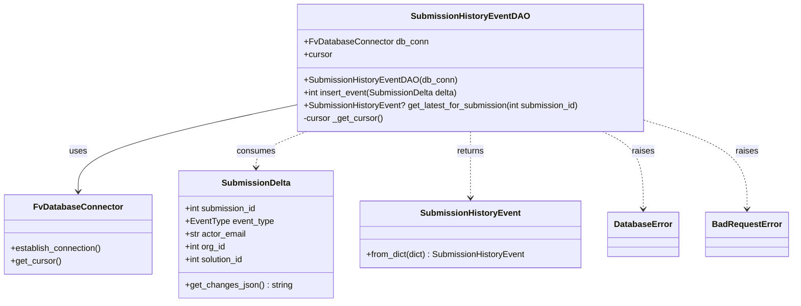

# Diagram: entity_core/entity_service/entity_service/db/daos/submission_history_event_dao.py

> Auto-generated by Obscura crawlers

## Mermaid

### SVG

<svg id="container" width="1472.7109375" xmlns="http://www.w3.org/2000/svg" class="classDiagram" height="570" viewBox="0 0 1472.7109375 570" role="graphics-document document" aria-roledescription="class"><g><defs><marker id="container_class-aggregationStart" class="marker aggregation class" refX="18" refY="7" markerWidth="190" markerHeight="240" orient="auto"><path d="M 18,7 L9,13 L1,7 L9,1 Z"></path></marker></defs><defs><marker id="container_class-aggregationEnd" class="marker aggregation class" refX="1" refY="7" markerWidth="20" markerHeight="28" orient="auto"><path d="M 18,7 L9,13 L1,7 L9,1 Z"></path></marker></defs><defs><marker id="container_class-extensionStart" class="marker extension class" refX="18" refY="7" markerWidth="190" markerHeight="240" orient="auto"><path d="M 1,7 L18,13 V 1 Z"></path></marker></defs><defs><marker id="container_class-extensionEnd" class="marker extension class" refX="1" refY="7" markerWidth="20" markerHeight="28" orient="auto"><path d="M 1,1 V 13 L18,7 Z"></path></marker></defs><defs><marker id="container_class-compositionStart" class="marker composition class" refX="18" refY="7" markerWidth="190" markerHeight="240" orient="auto"><path d="M 18,7 L9,13 L1,7 L9,1 Z"></path></marker></defs><defs><marker id="container_class-compositionEnd" class="marker composition class" refX="1" refY="7" markerWidth="20" markerHeight="28" orient="auto"><path d="M 18,7 L9,13 L1,7 L9,1 Z"></path></marker></defs><defs><marker id="container_class-dependencyStart" class="marker dependency class" refX="6" refY="7" markerWidth="190" markerHeight="240" orient="auto"><path d="M 5,7 L9,13 L1,7 L9,1 Z"></path></marker></defs><defs><marker id="container_class-dependencyEnd" class="marker dependency class" refX="13" refY="7" markerWidth="20" markerHeight="28" orient="auto"><path d="M 18,7 L9,13 L14,7 L9,1 Z"></path></marker></defs><defs><marker id="container_class-lollipopStart" class="marker lollipop class" refX="13" refY="7" markerWidth="190" markerHeight="240" orient="auto"><circle stroke="black" fill="transparent" cx="7" cy="7" r="6"></circle></marker></defs><defs><marker id="container_class-lollipopEnd" class="marker lollipop class" refX="1" refY="7" markerWidth="190" markerHeight="240" orient="auto"><circle stroke="black" fill="transparent" cx="7" cy="7" r="6"></circle></marker></defs><g class="root"><g class="clusters"></g><g class="edgePaths"><path d="M553.984,197.703L486.035,212.252C418.085,226.802,282.185,255.901,214.235,283.117C146.285,310.333,146.285,335.667,146.285,348.333L146.285,361" id="id_SubmissionHistoryEventDAO_FvDatabaseConnector_1" class="edge-thickness-normal edge-pattern-solid relation" style=";;;" data-edge="true" data-et="edge" data-id="id_SubmissionHistoryEventDAO_FvDatabaseConnector_1" data-points="W3sieCI6NTUzLjk4NDM3NSwieSI6MTk3LjcwMjU5MzQxNzM2NTQ1fSx7IngiOjE0Ni4yODUxNTYyNSwieSI6Mjg1fSx7IngiOjE0Ni4yODUxNTYyNSwieSI6MzY3fV0=" marker-end="url(#container_class-dependencyEnd)"></path><path d="M572.686,248L556.919,254.167C541.152,260.333,509.617,272.667,493.849,284C478.082,295.333,478.082,305.667,478.082,310.833L478.082,316" id="id_SubmissionHistoryEventDAO_SubmissionDelta_2" class="edge-thickness-normal edge-pattern-dashed relation" style=";;;" data-edge="true" data-et="edge" data-id="id_SubmissionHistoryEventDAO_SubmissionDelta_2" data-points="W3sieCI6NTcyLjY4NjQ3OTg5NjQ5NjgsInkiOjI0OH0seyJ4Ijo0NzguMDgyMDMxMjUsInkiOjI4NX0seyJ4Ijo0NzguMDgyMDMxMjUsInkiOjMyMn1d" marker-end="url(#container_class-dependencyEnd)"></path><path d="M879.512,248L879.512,254.167C879.512,260.333,879.512,272.667,879.512,293.5C879.512,314.333,879.512,343.667,879.512,358.333L879.512,373" id="id_SubmissionHistoryEventDAO_SubmissionHistoryEvent_3" class="edge-thickness-normal edge-pattern-dashed relation" style=";;;" data-edge="true" data-et="edge" data-id="id_SubmissionHistoryEventDAO_SubmissionHistoryEvent_3" data-points="W3sieCI6ODc5LjUxMTcxODc1LCJ5IjoyNDh9LHsieCI6ODc5LjUxMTcxODc1LCJ5IjoyODV9LHsieCI6ODc5LjUxMTcxODc1LCJ5IjozNzl9XQ==" marker-end="url(#container_class-dependencyEnd)"></path><path d="M1125.838,248L1138.497,254.167C1151.155,260.333,1176.472,272.667,1189.131,297C1201.789,321.333,1201.789,357.667,1201.789,375.833L1201.789,394" id="id_SubmissionHistoryEventDAO_DatabaseError_4" class="edge-thickness-normal edge-pattern-dashed relation" style=";;;" data-edge="true" data-et="edge" data-id="id_SubmissionHistoryEventDAO_DatabaseError_4" data-points="W3sieCI6MTEyNS44MzgzNTA5MTU2MDUxLCJ5IjoyNDh9LHsieCI6MTIwMS43ODkwNjI1LCJ5IjoyODV9LHsieCI6MTIwMS43ODkwNjI1LCJ5Ijo0MDB9XQ==" marker-end="url(#container_class-dependencyEnd)"></path><path d="M1205.039,228.031L1235.938,237.526C1266.836,247.021,1328.633,266.01,1359.531,293.672C1390.43,321.333,1390.43,357.667,1390.43,375.833L1390.43,394" id="id_SubmissionHistoryEventDAO_BadRequestError_5" class="edge-thickness-normal edge-pattern-dashed relation" style=";;;" data-edge="true" data-et="edge" data-id="id_SubmissionHistoryEventDAO_BadRequestError_5" data-points="W3sieCI6MTIwNS4wMzkwNjI1LCJ5IjoyMjguMDMxMzA4NTM2MjU5MDJ9LHsieCI6MTM5MC40Mjk2ODc1LCJ5IjoyODV9LHsieCI6MTM5MC40Mjk2ODc1LCJ5Ijo0MDB9XQ==" marker-end="url(#container_class-dependencyEnd)"></path></g><g class="edgeLabels"><g class="edgeLabel" transform="translate(146.28515625, 285)"><g class="label" data-id="id_SubmissionHistoryEventDAO_FvDatabaseConnector_1" transform="translate(-16.4921875, -12)"><foreignObject width="32.984375" height="24">

uses

</foreignObject></g></g><g class="edgeLabel" transform="translate(478.08203125, 285)"><g class="label" data-id="id_SubmissionHistoryEventDAO_SubmissionDelta_2" transform="translate(-36.375, -12)"><foreignObject width="72.75" height="24">

consumes

</foreignObject></g></g><g class="edgeLabel" transform="translate(879.51171875, 285)"><g class="label" data-id="id_SubmissionHistoryEventDAO_SubmissionHistoryEvent_3" transform="translate(-26.265625, -12)"><foreignObject width="52.53125" height="24">

returns

</foreignObject></g></g><g class="edgeLabel" transform="translate(1201.7890625, 285)"><g class="label" data-id="id_SubmissionHistoryEventDAO_DatabaseError_4" transform="translate(-21.25, -12)"><foreignObject width="42.5" height="24">

raises

</foreignObject></g></g><g class="edgeLabel" transform="translate(1390.4296875, 285)"><g class="label" data-id="id_SubmissionHistoryEventDAO_BadRequestError_5" transform="translate(-21.25, -12)"><foreignObject width="42.5" height="24">

raises

</foreignObject></g></g></g><g class="nodes"><g class="node default" id="classId-SubmissionHistoryEventDAO-0" transform="translate(879.51171875, 128)"><g class="basic label-container"><path d="M-325.52734375 -120 L325.52734375 -120 L325.52734375 120 L-325.52734375 120" stroke="none" stroke-width="0" fill="#ECECFF" style=""></path><path d="M-325.52734375 -120 C-73.41458951947155 -120, 178.6981647110569 -120, 325.52734375 -120 M-325.52734375 -120 C-155.09645165407733 -120, 15.334440441845345 -120, 325.52734375 -120 M325.52734375 -120 C325.52734375 -44.317465326219406, 325.52734375 31.36506934756119, 325.52734375 120 M325.52734375 -120 C325.52734375 -59.825451589306326, 325.52734375 0.34909682138734865, 325.52734375 120 M325.52734375 120 C172.73099565045692 120, 19.934647550913837 120, -325.52734375 120 M325.52734375 120 C107.32620917259047 120, -110.87492540481907 120, -325.52734375 120 M-325.52734375 120 C-325.52734375 45.2631119477617, -325.52734375 -29.4737761044766, -325.52734375 -120 M-325.52734375 120 C-325.52734375 65.89798880066569, -325.52734375 11.795977601331373, -325.52734375 -120" stroke="#9370DB" stroke-width="1.3" fill="none" stroke-dasharray="0 0" style=""></path></g><g class="annotation-group text" transform="translate(0, -96)"></g><g class="label-group text" transform="translate(-104.0859375, -96)"><g class="label" style="font-weight: bolder" transform="translate(0,-12)"><foreignObject width="208.171875" height="24">

SubmissionHistoryEventDAO

</foreignObject></g></g><g class="members-group text" transform="translate(-313.52734375, -48)"><g class="label" style="" transform="translate(0,-12)"><foreignObject width="231.03125" height="24">

+FvDatabaseConnector db_conn

</foreignObject></g><g class="label" style="" transform="translate(0,12)"><foreignObject width="53.71875" height="24">

+cursor

</foreignObject></g></g><g class="methods-group text" transform="translate(-313.52734375, 24)"><g class="label" style="" transform="translate(0,-12)"><foreignObject width="285.609375" height="24">

+SubmissionHistoryEventDAO(db_conn)

</foreignObject></g><g class="label" style="" transform="translate(0,12)"><foreignObject width="296.078125" height="24">

+int insert_event(SubmissionDelta delta)

</foreignObject></g><g class="label" style="" transform="translate(0,36)"><foreignObject width="522.96875" height="24">

+SubmissionHistoryEvent? get_latest_for_submission(int submission_id)

</foreignObject></g><g class="label" style="" transform="translate(0,60)"><foreignObject width="151.546875" height="24">

-cursor _get_cursor()

</foreignObject></g></g><g class="divider" style=""><path d="M-325.52734375 -72 C-158.85944822752865 -72, 7.8084472949427095 -72, 325.52734375 -72 M-325.52734375 -72 C-79.65384799250279 -72, 166.21964776499442 -72, 325.52734375 -72" stroke="#9370DB" stroke-width="1.3" fill="none" stroke-dasharray="0 0" style=""></path></g><g class="divider" style=""><path d="M-325.52734375 0 C-121.69018933043782 0, 82.14696508912436 0, 325.52734375 0 M-325.52734375 0 C-82.26555064538866 0, 160.99624245922269 0, 325.52734375 0" stroke="#9370DB" stroke-width="1.3" fill="none" stroke-dasharray="0 0" style=""></path></g></g><g class="node default" id="classId-FvDatabaseConnector-1" transform="translate(146.28515625, 442)"><g class="basic label-container"><path d="M-138.28515625 -75 L138.28515625 -75 L138.28515625 75 L-138.28515625 75" stroke="none" stroke-width="0" fill="#ECECFF" style=""></path><path d="M-138.28515625 -75 C-59.47252054743734 -75, 19.340115155125318 -75, 138.28515625 -75 M-138.28515625 -75 C-68.68698895076827 -75, 0.9111783484634657 -75, 138.28515625 -75 M138.28515625 -75 C138.28515625 -29.63216690403624, 138.28515625 15.735666191927521, 138.28515625 75 M138.28515625 -75 C138.28515625 -25.26472279872531, 138.28515625 24.470554402549382, 138.28515625 75 M138.28515625 75 C44.11572080205032 75, -50.05371464589936 75, -138.28515625 75 M138.28515625 75 C62.23650279840139 75, -13.812150653197222 75, -138.28515625 75 M-138.28515625 75 C-138.28515625 41.77328351349752, -138.28515625 8.546567026995035, -138.28515625 -75 M-138.28515625 75 C-138.28515625 30.929809130298423, -138.28515625 -13.140381739403153, -138.28515625 -75" stroke="#9370DB" stroke-width="1.3" fill="none" stroke-dasharray="0 0" style=""></path></g><g class="annotation-group text" transform="translate(0, -51)"></g><g class="label-group text" transform="translate(-79.3046875, -51)"><g class="label" style="font-weight: bolder" transform="translate(0,-12)"><foreignObject width="158.609375" height="24">

FvDatabaseConnector

</foreignObject></g></g><g class="members-group text" transform="translate(-126.28515625, -3)"></g><g class="methods-group text" transform="translate(-126.28515625, 27)"><g class="label" style="" transform="translate(0,-12)"><foreignObject width="173.265625" height="24">

+establish_connection()

</foreignObject></g><g class="label" style="" transform="translate(0,12)"><foreignObject width="94.640625" height="24">

+get_cursor()

</foreignObject></g></g><g class="divider" style=""><path d="M-138.28515625 -27 C-54.278946938182855 -27, 29.72726237363429 -27, 138.28515625 -27 M-138.28515625 -27 C-60.24546977458806 -27, 17.79421670082388 -27, 138.28515625 -27" stroke="#9370DB" stroke-width="1.3" fill="none" stroke-dasharray="0 0" style=""></path></g><g class="divider" style=""><path d="M-138.28515625 -3 C-42.67203352408387 -3, 52.941089201832256 -3, 138.28515625 -3 M-138.28515625 -3 C-62.07499542693046 -3, 14.135165396139087 -3, 138.28515625 -3" stroke="#9370DB" stroke-width="1.3" fill="none" stroke-dasharray="0 0" style=""></path></g></g><g class="node default" id="classId-SubmissionDelta-2" transform="translate(478.08203125, 442)"><g class="basic label-container"><path d="M-143.51171875 -120 L143.51171875 -120 L143.51171875 120 L-143.51171875 120" stroke="none" stroke-width="0" fill="#ECECFF" style=""></path><path d="M-143.51171875 -120 C-81.35621847359499 -120, -19.200718197189985 -120, 143.51171875 -120 M-143.51171875 -120 C-57.06381782138399 -120, 29.384083107232016 -120, 143.51171875 -120 M143.51171875 -120 C143.51171875 -71.89644907547844, 143.51171875 -23.792898150956873, 143.51171875 120 M143.51171875 -120 C143.51171875 -68.98073873160304, 143.51171875 -17.96147746320608, 143.51171875 120 M143.51171875 120 C72.02558872546747 120, 0.5394587009349436 120, -143.51171875 120 M143.51171875 120 C76.61874768260739 120, 9.725776615214784 120, -143.51171875 120 M-143.51171875 120 C-143.51171875 60.4320201962104, -143.51171875 0.8640403924208044, -143.51171875 -120 M-143.51171875 120 C-143.51171875 57.423714369310474, -143.51171875 -5.152571261379052, -143.51171875 -120" stroke="#9370DB" stroke-width="1.3" fill="none" stroke-dasharray="0 0" style=""></path></g><g class="annotation-group text" transform="translate(0, -96)"></g><g class="label-group text" transform="translate(-61.5390625, -96)"><g class="label" style="font-weight: bolder" transform="translate(0,-12)"><foreignObject width="123.078125" height="24">

SubmissionDelta

</foreignObject></g></g><g class="members-group text" transform="translate(-131.51171875, -48)"><g class="label" style="" transform="translate(0,-12)"><foreignObject width="136.828125" height="24">

+int submission_id

</foreignObject></g><g class="label" style="" transform="translate(0,12)"><foreignObject width="166.015625" height="24">

+EventType event_type

</foreignObject></g><g class="label" style="" transform="translate(0,36)"><foreignObject width="116.125" height="24">

+str actor_email

</foreignObject></g><g class="label" style="" transform="translate(0,60)"><foreignObject width="77.953125" height="24">

+int org_id

</foreignObject></g><g class="label" style="" transform="translate(0,84)"><foreignObject width="114.125" height="24">

+int solution_id

</foreignObject></g></g><g class="methods-group text" transform="translate(-131.51171875, 96)"><g class="label" style="" transform="translate(0,-12)"><foreignObject width="201.484375" height="24">

+get_changes_json() : string

</foreignObject></g></g><g class="divider" style=""><path d="M-143.51171875 -72 C-68.38552629578288 -72, 6.740666158434237 -72, 143.51171875 -72 M-143.51171875 -72 C-77.16782818864338 -72, -10.823937627286767 -72, 143.51171875 -72" stroke="#9370DB" stroke-width="1.3" fill="none" stroke-dasharray="0 0" style=""></path></g><g class="divider" style=""><path d="M-143.51171875 72 C-78.3174970343097 72, -13.123275318619392 72, 143.51171875 72 M-143.51171875 72 C-65.62385359032179 72, 12.264011569356427 72, 143.51171875 72" stroke="#9370DB" stroke-width="1.3" fill="none" stroke-dasharray="0 0" style=""></path></g></g><g class="node default" id="classId-SubmissionHistoryEvent-3" transform="translate(879.51171875, 442)"><g class="basic label-container"><path d="M-207.91796875 -63 L207.91796875 -63 L207.91796875 63 L-207.91796875 63" stroke="none" stroke-width="0" fill="#ECECFF" style=""></path><path d="M-207.91796875 -63 C-96.9774197279681 -63, 13.963129294063805 -63, 207.91796875 -63 M-207.91796875 -63 C-94.36164999814824 -63, 19.194668753703525 -63, 207.91796875 -63 M207.91796875 -63 C207.91796875 -29.602273274851946, 207.91796875 3.795453450296108, 207.91796875 63 M207.91796875 -63 C207.91796875 -18.798990841739695, 207.91796875 25.40201831652061, 207.91796875 63 M207.91796875 63 C105.34226540722669 63, 2.7665620644533817 63, -207.91796875 63 M207.91796875 63 C84.52925668242985 63, -38.85945538514031 63, -207.91796875 63 M-207.91796875 63 C-207.91796875 31.84961114318797, -207.91796875 0.6992222863759423, -207.91796875 -63 M-207.91796875 63 C-207.91796875 34.067969941082026, -207.91796875 5.13593988216406, -207.91796875 -63" stroke="#9370DB" stroke-width="1.3" fill="none" stroke-dasharray="0 0" style=""></path></g><g class="annotation-group text" transform="translate(0, -39)"></g><g class="label-group text" transform="translate(-88.7890625, -39)"><g class="label" style="font-weight: bolder" transform="translate(0,-12)"><foreignObject width="177.578125" height="24">

SubmissionHistoryEvent

</foreignObject></g></g><g class="members-group text" transform="translate(-195.91796875, 9)"></g><g class="methods-group text" transform="translate(-195.91796875, 39)"><g class="label" style="" transform="translate(0,-12)"><foreignObject width="303.046875" height="24">

+from_dict(dict) : SubmissionHistoryEvent

</foreignObject></g></g><g class="divider" style=""><path d="M-207.91796875 -15 C-76.85024486637747 -15, 54.21747901724507 -15, 207.91796875 -15 M-207.91796875 -15 C-51.99340376367036 -15, 103.93116122265928 -15, 207.91796875 -15" stroke="#9370DB" stroke-width="1.3" fill="none" stroke-dasharray="0 0" style=""></path></g><g class="divider" style=""><path d="M-207.91796875 9 C-116.54840713378215 9, -25.178845517564298 9, 207.91796875 9 M-207.91796875 9 C-115.5789310322325 9, -23.239893314465007 9, 207.91796875 9" stroke="#9370DB" stroke-width="1.3" fill="none" stroke-dasharray="0 0" style=""></path></g></g><g class="node default" id="classId-DatabaseError-4" transform="translate(1201.7890625, 442)"><g class="basic label-container"><path d="M-64.359375 -42 L64.359375 -42 L64.359375 42 L-64.359375 42" stroke="none" stroke-width="0" fill="#ECECFF" style=""></path><path d="M-64.359375 -42 C-16.56051596244219 -42, 31.238343075115623 -42, 64.359375 -42 M-64.359375 -42 C-28.061054779332636 -42, 8.237265441334728 -42, 64.359375 -42 M64.359375 -42 C64.359375 -16.692260030506688, 64.359375 8.615479938986624, 64.359375 42 M64.359375 -42 C64.359375 -17.76507285669211, 64.359375 6.469854286615778, 64.359375 42 M64.359375 42 C23.9778687918108 42, -16.403637416378402 42, -64.359375 42 M64.359375 42 C30.3904924821383 42, -3.5783900357234018 42, -64.359375 42 M-64.359375 42 C-64.359375 23.374272846207774, -64.359375 4.748545692415547, -64.359375 -42 M-64.359375 42 C-64.359375 20.13010214992354, -64.359375 -1.7397957001529178, -64.359375 -42" stroke="#9370DB" stroke-width="1.3" fill="none" stroke-dasharray="0 0" style=""></path></g><g class="annotation-group text" transform="translate(0, -18)"></g><g class="label-group text" transform="translate(-52.359375, -18)"><g class="label" style="font-weight: bolder" transform="translate(0,-12)"><foreignObject width="104.71875" height="24">

DatabaseError

</foreignObject></g></g><g class="members-group text" transform="translate(-52.359375, 30)"></g><g class="methods-group text" transform="translate(-52.359375, 60)"></g><g class="divider" style=""><path d="M-64.359375 6 C-22.040326382681926 6, 20.27872223463615 6, 64.359375 6 M-64.359375 6 C-37.0665610461001 6, -9.773747092200196 6, 64.359375 6" stroke="#9370DB" stroke-width="1.3" fill="none" stroke-dasharray="0 0" style=""></path></g><g class="divider" style=""><path d="M-64.359375 24 C-20.580846639638906 24, 23.197681720722187 24, 64.359375 24 M-64.359375 24 C-34.13207997002762 24, -3.9047849400552295 24, 64.359375 24" stroke="#9370DB" stroke-width="1.3" fill="none" stroke-dasharray="0 0" style=""></path></g></g><g class="node default" id="classId-BadRequestError-5" transform="translate(1390.4296875, 442)"><g class="basic label-container"><path d="M-74.28125 -42 L74.28125 -42 L74.28125 42 L-74.28125 42" stroke="none" stroke-width="0" fill="#ECECFF" style=""></path><path d="M-74.28125 -42 C-24.409295203631707 -42, 25.462659592736586 -42, 74.28125 -42 M-74.28125 -42 C-39.23168578074268 -42, -4.18212156148536 -42, 74.28125 -42 M74.28125 -42 C74.28125 -24.79738511620708, 74.28125 -7.594770232414163, 74.28125 42 M74.28125 -42 C74.28125 -12.946658764305607, 74.28125 16.106682471388787, 74.28125 42 M74.28125 42 C19.574244083191026 42, -35.13276183361795 42, -74.28125 42 M74.28125 42 C24.72837383032119 42, -24.824502339357622 42, -74.28125 42 M-74.28125 42 C-74.28125 16.427388200114713, -74.28125 -9.145223599770574, -74.28125 -42 M-74.28125 42 C-74.28125 16.006985646752433, -74.28125 -9.986028706495134, -74.28125 -42" stroke="#9370DB" stroke-width="1.3" fill="none" stroke-dasharray="0 0" style=""></path></g><g class="annotation-group text" transform="translate(0, -18)"></g><g class="label-group text" transform="translate(-62.28125, -18)"><g class="label" style="font-weight: bolder" transform="translate(0,-12)"><foreignObject width="124.5625" height="24">

BadRequestError

</foreignObject></g></g><g class="members-group text" transform="translate(-62.28125, 30)"></g><g class="methods-group text" transform="translate(-62.28125, 60)"></g><g class="divider" style=""><path d="M-74.28125 6 C-42.04897955326157 6, -9.816709106523135 6, 74.28125 6 M-74.28125 6 C-39.17499761627521 6, -4.068745232550427 6, 74.28125 6" stroke="#9370DB" stroke-width="1.3" fill="none" stroke-dasharray="0 0" style=""></path></g><g class="divider" style=""><path d="M-74.28125 24 C-41.849855084642414 24, -9.418460169284828 24, 74.28125 24 M-74.28125 24 C-21.755035360735533 24, 30.771179278528933 24, 74.28125 24" stroke="#9370DB" stroke-width="1.3" fill="none" stroke-dasharray="0 0" style=""></path></g></g></g></g></g></svg>
