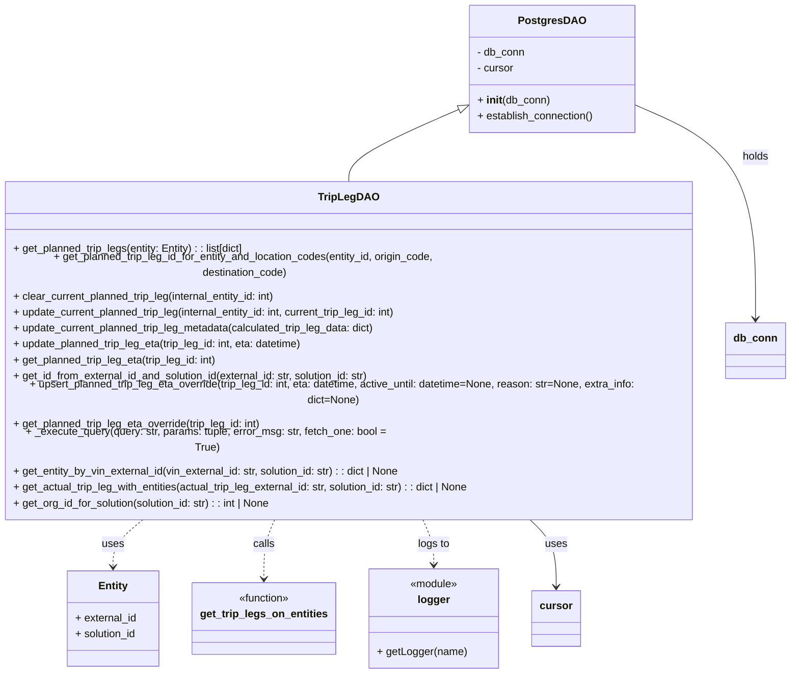

# Diagram: entity_core/entity_service/entity_service/db/daos/trip_leg_dao.py

> Auto-generated by Obscura crawlers

## Mermaid

### SVG

<svg id="container" width="1235.9921875" xmlns="http://www.w3.org/2000/svg" class="classDiagram" height="944" viewBox="0 0 1235.9921875 944" role="graphics-document document" aria-roledescription="class"><g><defs><marker id="container_class-aggregationStart" class="marker aggregation class" refX="18" refY="7" markerWidth="190" markerHeight="240" orient="auto"><path d="M 18,7 L9,13 L1,7 L9,1 Z"></path></marker></defs><defs><marker id="container_class-aggregationEnd" class="marker aggregation class" refX="1" refY="7" markerWidth="20" markerHeight="28" orient="auto"><path d="M 18,7 L9,13 L1,7 L9,1 Z"></path></marker></defs><defs><marker id="container_class-extensionStart" class="marker extension class" refX="18" refY="7" markerWidth="190" markerHeight="240" orient="auto"><path d="M 1,7 L18,13 V 1 Z"></path></marker></defs><defs><marker id="container_class-extensionEnd" class="marker extension class" refX="1" refY="7" markerWidth="20" markerHeight="28" orient="auto"><path d="M 1,1 V 13 L18,7 Z"></path></marker></defs><defs><marker id="container_class-compositionStart" class="marker composition class" refX="18" refY="7" markerWidth="190" markerHeight="240" orient="auto"><path d="M 18,7 L9,13 L1,7 L9,1 Z"></path></marker></defs><defs><marker id="container_class-compositionEnd" class="marker composition class" refX="1" refY="7" markerWidth="20" markerHeight="28" orient="auto"><path d="M 18,7 L9,13 L1,7 L9,1 Z"></path></marker></defs><defs><marker id="container_class-dependencyStart" class="marker dependency class" refX="6" refY="7" markerWidth="190" markerHeight="240" orient="auto"><path d="M 5,7 L9,13 L1,7 L9,1 Z"></path></marker></defs><defs><marker id="container_class-dependencyEnd" class="marker dependency class" refX="13" refY="7" markerWidth="20" markerHeight="28" orient="auto"><path d="M 18,7 L9,13 L14,7 L9,1 Z"></path></marker></defs><defs><marker id="container_class-lollipopStart" class="marker lollipop class" refX="13" refY="7" markerWidth="190" markerHeight="240" orient="auto"><circle stroke="black" fill="transparent" cx="7" cy="7" r="6"></circle></marker></defs><defs><marker id="container_class-lollipopEnd" class="marker lollipop class" refX="1" refY="7" markerWidth="190" markerHeight="240" orient="auto"><circle stroke="black" fill="transparent" cx="7" cy="7" r="6"></circle></marker></defs><g class="root"><g class="clusters"></g><g class="edgePaths"><path d="M727.322,162.721L697.769,175.101C668.216,187.481,609.11,212.24,579.557,230.787C550.004,249.333,550.004,261.667,550.004,267.833L550.004,274" id="id_PostgresDAO_TripLegDAO_1" class="edge-thickness-normal edge-pattern-solid relation" style=";;;" data-edge="true" data-et="edge" data-id="id_PostgresDAO_TripLegDAO_1" data-points="W3sieCI6NzQzLjIzMjQyMTg3NSwieSI6MTU2LjA1NjUzMzMyMDIwOTl9LHsieCI6NTUwLjAwMzkwNjI1LCJ5IjoyMzd9LHsieCI6NTUwLjAwMzkwNjI1LCJ5IjoyNzR9XQ==" marker-start="url(#container_class-extensionStart)"></path><path d="M249.659,712L241.202,718.167C232.745,724.333,215.83,736.667,207.373,748.5C198.916,760.333,198.916,771.667,198.916,777.333L198.916,783" id="id_TripLegDAO_Entity_2" class="edge-thickness-normal edge-pattern-dashed relation" style=";;;" data-edge="true" data-et="edge" data-id="id_TripLegDAO_Entity_2" data-points="W3sieCI6MjQ5LjY1OTE4NzMxNjg5NDUzLCJ5Ijo3MTJ9LHsieCI6MTk4LjkxNjAxNTYyNSwieSI6NzQ5fSx7IngiOjE5OC45MTYwMTU2MjUsInkiOjc4OX1d" marker-end="url(#container_class-dependencyEnd)"></path><path d="M442.086,712L439.047,718.167C436.009,724.333,429.931,736.667,426.892,751.5C423.854,766.333,423.854,783.667,423.854,792.333L423.854,801" id="id_TripLegDAO_get_trip_legs_on_entities_3" class="edge-thickness-normal edge-pattern-dashed relation" style=";;;" data-edge="true" data-et="edge" data-id="id_TripLegDAO_get_trip_legs_on_entities_3" data-points="W3sieCI6NDQyLjA4NjE4OTI3MDAxOTUzLCJ5Ijo3MTJ9LHsieCI6NDIzLjg1MzUxNTYyNSwieSI6NzQ5fSx7IngiOjQyMy44NTM1MTU2MjUsInkiOjgwN31d" marker-end="url(#container_class-dependencyEnd)"></path><path d="M657.922,712L660.96,718.167C663.999,724.333,670.077,736.667,673.116,748C676.154,759.333,676.154,769.667,676.154,774.833L676.154,780" id="id_TripLegDAO_logger_4" class="edge-thickness-normal edge-pattern-dashed relation" style=";;;" data-edge="true" data-et="edge" data-id="id_TripLegDAO_logger_4" data-points="W3sieCI6NjU3LjkyMTYyMzIyOTk4MDUsInkiOjcxMn0seyJ4Ijo2NzYuMTU0Mjk2ODc1LCJ5Ijo3NDl9LHsieCI6Njc2LjE1NDI5Njg3NSwieSI6Nzg2fV0=" marker-end="url(#container_class-dependencyEnd)"></path><path d="M991.771,156.057L1023.976,169.547C1056.181,183.038,1120.59,210.019,1152.795,258.176C1185,306.333,1185,375.667,1185,410.333L1185,445" id="id_PostgresDAO_db_conn_5" class="edge-thickness-normal edge-pattern-solid relation" style=";;;" data-edge="true" data-et="edge" data-id="id_PostgresDAO_db_conn_5" data-points="W3sieCI6OTkxLjc3MTQ4NDM3NSwieSI6MTU2LjA1NjUzMzMyMDIwOTl9LHsieCI6MTE4NSwieSI6MjM3fSx7IngiOjExODUsInkiOjQ1MX1d" marker-end="url(#container_class-dependencyEnd)"></path><path d="M813.974,712L821.407,718.167C828.84,724.333,843.706,736.667,851.139,753.5C858.572,770.333,858.572,791.667,858.572,802.333L858.572,813" id="id_TripLegDAO_cursor_6" class="edge-thickness-normal edge-pattern-solid relation" style=";;;" data-edge="true" data-et="edge" data-id="id_TripLegDAO_cursor_6" data-points="W3sieCI6ODEzLjk3NDQ5NDkzNDA4MiwieSI6NzEyfSx7IngiOjg1OC41NzIyNjU2MjUsInkiOjc0OX0seyJ4Ijo4NTguNTcyMjY1NjI1LCJ5Ijo4MTl9XQ==" marker-end="url(#container_class-dependencyEnd)"></path></g><g class="edgeLabels"><g class="edgeLabel"><g class="label" data-id="id_PostgresDAO_TripLegDAO_1" transform="translate(0, 0)"><foreignObject width="0" height="0">

</foreignObject></g></g><g class="edgeLabel" transform="translate(198.916015625, 749)"><g class="label" data-id="id_TripLegDAO_Entity_2" transform="translate(-16.4921875, -12)"><foreignObject width="32.984375" height="24">

uses

</foreignObject></g></g><g class="edgeLabel" transform="translate(423.853515625, 749)"><g class="label" data-id="id_TripLegDAO_get_trip_legs_on_entities_3" transform="translate(-16.4453125, -12)"><foreignObject width="32.890625" height="24">

calls

</foreignObject></g></g><g class="edgeLabel" transform="translate(676.154296875, 749)"><g class="label" data-id="id_TripLegDAO_logger_4" transform="translate(-24.3828125, -12)"><foreignObject width="48.765625" height="24">

logs to

</foreignObject></g></g><g class="edgeLabel" transform="translate(1185, 237)"><g class="label" data-id="id_PostgresDAO_db_conn_5" transform="translate(-20.1875, -12)"><foreignObject width="40.375" height="24">

holds

</foreignObject></g></g><g class="edgeLabel" transform="translate(858.572265625, 749)"><g class="label" data-id="id_TripLegDAO_cursor_6" transform="translate(-16.4921875, -12)"><foreignObject width="32.984375" height="24">

uses

</foreignObject></g></g></g><g class="nodes"><g class="node default" id="classId-PostgresDAO-0" transform="translate(867.501953125, 104)"><g class="basic label-container"><path d="M-124.26953125 -96 L124.26953125 -96 L124.26953125 96 L-124.26953125 96" stroke="none" stroke-width="0" fill="#ECECFF" style=""></path><path d="M-124.26953125 -96 C-42.23309253612396 -96, 39.803346177752076 -96, 124.26953125 -96 M-124.26953125 -96 C-62.596585141384445 -96, -0.9236390327688895 -96, 124.26953125 -96 M124.26953125 -96 C124.26953125 -44.55046108737653, 124.26953125 6.899077825246934, 124.26953125 96 M124.26953125 -96 C124.26953125 -31.097490281067223, 124.26953125 33.80501943786555, 124.26953125 96 M124.26953125 96 C61.32940578085629 96, -1.6107196882874177 96, -124.26953125 96 M124.26953125 96 C69.3338700057723 96, 14.398208761544609 96, -124.26953125 96 M-124.26953125 96 C-124.26953125 46.91891015540107, -124.26953125 -2.162179689197856, -124.26953125 -96 M-124.26953125 96 C-124.26953125 19.782082502102213, -124.26953125 -56.435834995795574, -124.26953125 -96" stroke="#9370DB" stroke-width="1.3" fill="none" stroke-dasharray="0 0" style=""></path></g><g class="annotation-group text" transform="translate(0, -72)"></g><g class="label-group text" transform="translate(-47.0234375, -72)"><g class="label" style="font-weight: bolder" transform="translate(0,-12)"><foreignObject width="94.046875" height="24">

PostgresDAO

</foreignObject></g></g><g class="members-group text" transform="translate(-112.26953125, -24)"><g class="label" style="" transform="translate(0,-12)"><foreignObject width="72.875" height="24">

- db_conn

</foreignObject></g><g class="label" style="" transform="translate(0,12)"><foreignObject width="56.421875" height="24">

- cursor

</foreignObject></g></g><g class="methods-group text" transform="translate(-112.26953125, 48)"><g class="label" style="" transform="translate(0,-12)"><foreignObject width="109.21875" height="24">

+ <strong>init</strong>(db_conn)

</foreignObject></g><g class="label" style="" transform="translate(0,12)"><foreignObject width="177.515625" height="24">

+ establish_connection()

</foreignObject></g></g><g class="divider" style=""><path d="M-124.26953125 -48 C-35.399850210888715 -48, 53.46983082822257 -48, 124.26953125 -48 M-124.26953125 -48 C-61.42099937943434 -48, 1.4275324911313163 -48, 124.26953125 -48" stroke="#9370DB" stroke-width="1.3" fill="none" stroke-dasharray="0 0" style=""></path></g><g class="divider" style=""><path d="M-124.26953125 24 C-50.124490657310744 24, 24.02054993537851 24, 124.26953125 24 M-124.26953125 24 C-56.21750740820639 24, 11.834516433587225 24, 124.26953125 24" stroke="#9370DB" stroke-width="1.3" fill="none" stroke-dasharray="0 0" style=""></path></g></g><g class="node default" id="classId-TripLegDAO-1" transform="translate(550.00390625, 493)"><g class="basic label-container"><path d="M-542.00390625 -219 L542.00390625 -219 L542.00390625 219 L-542.00390625 219" stroke="none" stroke-width="0" fill="#ECECFF" style=""></path><path d="M-542.00390625 -219 C-308.87683743912373 -219, -75.74976862824747 -219, 542.00390625 -219 M-542.00390625 -219 C-187.24912615179852 -219, 167.50565394640296 -219, 542.00390625 -219 M542.00390625 -219 C542.00390625 -112.94695479554052, 542.00390625 -6.893909591081041, 542.00390625 219 M542.00390625 -219 C542.00390625 -84.36749659563375, 542.00390625 50.265006808732494, 542.00390625 219 M542.00390625 219 C301.34605826972324 219, 60.688210289446545 219, -542.00390625 219 M542.00390625 219 C229.41959153481514 219, -83.16472318036972 219, -542.00390625 219 M-542.00390625 219 C-542.00390625 54.72527722720275, -542.00390625 -109.5494455455945, -542.00390625 -219 M-542.00390625 219 C-542.00390625 127.0317091606911, -542.00390625 35.06341832138219, -542.00390625 -219" stroke="#9370DB" stroke-width="1.3" fill="none" stroke-dasharray="0 0" style=""></path></g><g class="annotation-group text" transform="translate(0, -195)"></g><g class="label-group text" transform="translate(-42.3515625, -195)"><g class="label" style="font-weight: bolder" transform="translate(0,-12)"><foreignObject width="84.703125" height="24">

TripLegDAO

</foreignObject></g></g><g class="members-group text" transform="translate(-530.00390625, -147)"></g><g class="methods-group text" transform="translate(-530.00390625, -117)"><g class="label" style="" transform="translate(0,-12)"><foreignObject width="356.703125" height="24">

+ get_planned_trip_legs(entity: Entity) : : list[dict]

</foreignObject></g><g class="label" style="" transform="translate(0,12)"><foreignObject width="720.734375" height="24">

+ get_planned_trip_leg_id_for_entity_and_location_codes(entity_id, origin_code, destination_code)

</foreignObject></g><g class="label" style="" transform="translate(0,36)"><foreignObject width="405.734375" height="24">

+ clear_current_planned_trip_leg(internal_entity_id: int)

</foreignObject></g><g class="label" style="" transform="translate(0,60)"><foreignObject width="596.703125" height="24">

+ update_current_planned_trip_leg(internal_entity_id: int, current_trip_leg_id: int)

</foreignObject></g><g class="label" style="" transform="translate(0,84)"><foreignObject width="557.9375" height="24">

+ update_current_planned_trip_leg_metadata(calculated_trip_leg_data: dict)

</foreignObject></g><g class="label" style="" transform="translate(0,108)"><foreignObject width="446.625" height="24">

+ update_planned_trip_leg_eta(trip_leg_id: int, eta: datetime)

</foreignObject></g><g class="label" style="" transform="translate(0,132)"><foreignObject width="313.609375" height="24">

+ get_planned_trip_leg_eta(trip_leg_id: int)

</foreignObject></g><g class="label" style="" transform="translate(0,156)"><foreignObject width="551.453125" height="24">

+ get_id_from_external_id_and_solution_id(external_id: str, solution_id: str)

</foreignObject></g><g class="label" style="" transform="translate(0,180)"><foreignObject width="1017.65625" height="24">

+ upsert_planned_trip_leg_eta_override(trip_leg_id: int, eta: datetime, active_until: datetime=None, reason: str=None, extra_info: dict=None)

</foreignObject></g><g class="label" style="" transform="translate(0,204)"><foreignObject width="382.5625" height="24">

+ get_planned_trip_leg_eta_override(trip_leg_id: int)

</foreignObject></g><g class="label" style="" transform="translate(0,228)"><foreignObject width="587.703125" height="24">

+ _execute_query(query: str, params: tuple, error_msg: str, fetch_one: bool = True)

</foreignObject></g><g class="label" style="" transform="translate(0,252)"><foreignObject width="595.921875" height="24">

+ get_entity_by_vin_external_id(vin_external_id: str, solution_id: str) : : dict | None

</foreignObject></g><g class="label" style="" transform="translate(0,276)"><foreignObject width="706.546875" height="24">

+ get_actual_trip_leg_with_entities(actual_trip_leg_external_id: str, solution_id: str) : : dict | None

</foreignObject></g><g class="label" style="" transform="translate(0,300)"><foreignObject width="397.890625" height="24">

+ get_org_id_for_solution(solution_id: str) : : int | None

</foreignObject></g></g><g class="divider" style=""><path d="M-542.00390625 -171 C-294.8716911992268 -171, -47.73947614845355 -171, 542.00390625 -171 M-542.00390625 -171 C-208.71298816362054 -171, 124.57792992275893 -171, 542.00390625 -171" stroke="#9370DB" stroke-width="1.3" fill="none" stroke-dasharray="0 0" style=""></path></g><g class="divider" style=""><path d="M-542.00390625 -147 C-131.8311323006257 -147, 278.3416416487486 -147, 542.00390625 -147 M-542.00390625 -147 C-307.10004328667924 -147, -72.19618032335848 -147, 542.00390625 -147" stroke="#9370DB" stroke-width="1.3" fill="none" stroke-dasharray="0 0" style=""></path></g></g><g class="node default" id="classId-Entity-2" transform="translate(198.916015625, 861)"><g class="basic label-container"><path d="M-69.8671875 -72 L69.8671875 -72 L69.8671875 72 L-69.8671875 72" stroke="none" stroke-width="0" fill="#ECECFF" style=""></path><path d="M-69.8671875 -72 C-14.325507153780329 -72, 41.21617319243934 -72, 69.8671875 -72 M-69.8671875 -72 C-38.28544317813633 -72, -6.703698856272673 -72, 69.8671875 -72 M69.8671875 -72 C69.8671875 -42.327958770586356, 69.8671875 -12.655917541172713, 69.8671875 72 M69.8671875 -72 C69.8671875 -25.010552632204423, 69.8671875 21.978894735591155, 69.8671875 72 M69.8671875 72 C21.683141460628043 72, -26.500904578743913 72, -69.8671875 72 M69.8671875 72 C27.112962437586745 72, -15.64126262482651 72, -69.8671875 72 M-69.8671875 72 C-69.8671875 42.45499038122894, -69.8671875 12.90998076245787, -69.8671875 -72 M-69.8671875 72 C-69.8671875 22.60481586353192, -69.8671875 -26.790368272936163, -69.8671875 -72" stroke="#9370DB" stroke-width="1.3" fill="none" stroke-dasharray="0 0" style=""></path></g><g class="annotation-group text" transform="translate(0, -48)"></g><g class="label-group text" transform="translate(-21.28125, -48)"><g class="label" style="font-weight: bolder" transform="translate(0,-12)"><foreignObject width="42.5625" height="24">

Entity

</foreignObject></g></g><g class="members-group text" transform="translate(-57.8671875, 0)"><g class="label" style="" transform="translate(0,-12)"><foreignObject width="94.015625" height="24">

+ external_id

</foreignObject></g><g class="label" style="" transform="translate(0,12)"><foreignObject width="94.453125" height="24">

+ solution_id

</foreignObject></g></g><g class="methods-group text" transform="translate(-57.8671875, 72)"></g><g class="divider" style=""><path d="M-69.8671875 -24 C-23.094883429781405 -24, 23.67742064043719 -24, 69.8671875 -24 M-69.8671875 -24 C-34.39564630768831 -24, 1.0758948846233807 -24, 69.8671875 -24" stroke="#9370DB" stroke-width="1.3" fill="none" stroke-dasharray="0 0" style=""></path></g><g class="divider" style=""><path d="M-69.8671875 48 C-35.833616029874726 48, -1.8000445597494519 48, 69.8671875 48 M-69.8671875 48 C-38.264910155373485 48, -6.66263281074697 48, 69.8671875 48" stroke="#9370DB" stroke-width="1.3" fill="none" stroke-dasharray="0 0" style=""></path></g></g><g class="node default" id="classId-get_trip_legs_on_entities-3" transform="translate(423.853515625, 861)"><g class="basic label-container"><path d="M-105.0703125 -54 L105.0703125 -54 L105.0703125 54 L-105.0703125 54" stroke="none" stroke-width="0" fill="#ECECFF" style=""></path><path d="M-105.0703125 -54 C-44.637940073845485 -54, 15.79443235230903 -54, 105.0703125 -54 M-105.0703125 -54 C-39.71432989833575 -54, 25.641652703328504 -54, 105.0703125 -54 M105.0703125 -54 C105.0703125 -24.3130909183905, 105.0703125 5.373818163218999, 105.0703125 54 M105.0703125 -54 C105.0703125 -12.079804750492606, 105.0703125 29.840390499014788, 105.0703125 54 M105.0703125 54 C21.61616411619407 54, -61.83798426761186 54, -105.0703125 54 M105.0703125 54 C30.35781456098256 54, -44.35468337803488 54, -105.0703125 54 M-105.0703125 54 C-105.0703125 22.757223607940926, -105.0703125 -8.485552784118148, -105.0703125 -54 M-105.0703125 54 C-105.0703125 19.137575653867422, -105.0703125 -15.724848692265155, -105.0703125 -54" stroke="#9370DB" stroke-width="1.3" fill="none" stroke-dasharray="0 0" style=""></path></g><g class="annotation-group text" transform="translate(-39.484375, -30)"><g class="label" style="" transform="translate(0,-12)"><foreignObject width="78.96875" height="24">

«function»

</foreignObject></g></g><g class="label-group text" transform="translate(-93.0703125, -6)"><g class="label" style="font-weight: bolder" transform="translate(0,-12)"><foreignObject width="186.140625" height="24">

get_trip_legs_on_entities

</foreignObject></g></g><g class="members-group text" transform="translate(-93.0703125, 42)"></g><g class="methods-group text" transform="translate(-93.0703125, 72)"></g><g class="divider" style=""><path d="M-105.0703125 18 C-30.094354075082265 18, 44.88160434983547 18, 105.0703125 18 M-105.0703125 18 C-46.25169649715005 18, 12.5669195056999 18, 105.0703125 18" stroke="#9370DB" stroke-width="1.3" fill="none" stroke-dasharray="0 0" style=""></path></g><g class="divider" style=""><path d="M-105.0703125 36 C-58.64602542263937 36, -12.221738345278737 36, 105.0703125 36 M-105.0703125 36 C-34.22648513678432 36, 36.61734222643136 36, 105.0703125 36" stroke="#9370DB" stroke-width="1.3" fill="none" stroke-dasharray="0 0" style=""></path></g></g><g class="node default" id="classId-logger-4" transform="translate(676.154296875, 861)"><g class="basic label-container"><path d="M-97.23046875 -75 L97.23046875 -75 L97.23046875 75 L-97.23046875 75" stroke="none" stroke-width="0" fill="#ECECFF" style=""></path><path d="M-97.23046875 -75 C-27.01785111791257 -75, 43.19476651417486 -75, 97.23046875 -75 M-97.23046875 -75 C-27.940166567743802 -75, 41.350135614512396 -75, 97.23046875 -75 M97.23046875 -75 C97.23046875 -27.119391002041276, 97.23046875 20.76121799591745, 97.23046875 75 M97.23046875 -75 C97.23046875 -43.562677029551324, 97.23046875 -12.125354059102648, 97.23046875 75 M97.23046875 75 C35.64845761253857 75, -25.933553524922857 75, -97.23046875 75 M97.23046875 75 C21.36893423962654 75, -54.49260027074692 75, -97.23046875 75 M-97.23046875 75 C-97.23046875 32.96697977509777, -97.23046875 -9.066040449804461, -97.23046875 -75 M-97.23046875 75 C-97.23046875 37.96535108901744, -97.23046875 0.9307021780348776, -97.23046875 -75" stroke="#9370DB" stroke-width="1.3" fill="none" stroke-dasharray="0 0" style=""></path></g><g class="annotation-group text" transform="translate(-36.6015625, -51)"><g class="label" style="" transform="translate(0,-12)"><foreignObject width="73.203125" height="24">

«module»

</foreignObject></g></g><g class="label-group text" transform="translate(-23.2734375, -27)"><g class="label" style="font-weight: bolder" transform="translate(0,-12)"><foreignObject width="46.546875" height="24">

logger

</foreignObject></g></g><g class="members-group text" transform="translate(-85.23046875, 21)"></g><g class="methods-group text" transform="translate(-85.23046875, 51)"><g class="label" style="" transform="translate(0,-12)"><foreignObject width="133.859375" height="24">

+ getLogger(name)

</foreignObject></g></g><g class="divider" style=""><path d="M-97.23046875 -3 C-57.10250732038911 -3, -16.974545890778217 -3, 97.23046875 -3 M-97.23046875 -3 C-45.388688032826 -3, 6.453092684347993 -3, 97.23046875 -3" stroke="#9370DB" stroke-width="1.3" fill="none" stroke-dasharray="0 0" style=""></path></g><g class="divider" style=""><path d="M-97.23046875 21 C-28.912331111058492 21, 39.405806527883016 21, 97.23046875 21 M-97.23046875 21 C-57.75045218629668 21, -18.270435622593354 21, 97.23046875 21" stroke="#9370DB" stroke-width="1.3" fill="none" stroke-dasharray="0 0" style=""></path></g></g><g class="node default" id="classId-db_conn-5" transform="translate(1185, 493)"><g class="basic label-container"><path d="M-42.9921875 -42 L42.9921875 -42 L42.9921875 42 L-42.9921875 42" stroke="none" stroke-width="0" fill="#ECECFF" style=""></path><path d="M-42.9921875 -42 C-18.842411242732577 -42, 5.307365014534845 -42, 42.9921875 -42 M-42.9921875 -42 C-21.405431521681386 -42, 0.18132445663722763 -42, 42.9921875 -42 M42.9921875 -42 C42.9921875 -17.235479693113522, 42.9921875 7.529040613772956, 42.9921875 42 M42.9921875 -42 C42.9921875 -10.98362751549086, 42.9921875 20.03274496901828, 42.9921875 42 M42.9921875 42 C21.25930412413105 42, -0.4735792517379025 42, -42.9921875 42 M42.9921875 42 C9.989331021377481 42, -23.013525457245038 42, -42.9921875 42 M-42.9921875 42 C-42.9921875 12.474662469049662, -42.9921875 -17.050675061900677, -42.9921875 -42 M-42.9921875 42 C-42.9921875 13.686857723317498, -42.9921875 -14.626284553365004, -42.9921875 -42" stroke="#9370DB" stroke-width="1.3" fill="none" stroke-dasharray="0 0" style=""></path></g><g class="annotation-group text" transform="translate(0, -18)"></g><g class="label-group text" transform="translate(-30.9921875, -18)"><g class="label" style="font-weight: bolder" transform="translate(0,-12)"><foreignObject width="61.984375" height="24">

db_conn

</foreignObject></g></g><g class="members-group text" transform="translate(-30.9921875, 30)"></g><g class="methods-group text" transform="translate(-30.9921875, 60)"></g><g class="divider" style=""><path d="M-42.9921875 6 C-15.737237711770906 6, 11.517712076458189 6, 42.9921875 6 M-42.9921875 6 C-11.115699512981106 6, 20.76078847403779 6, 42.9921875 6" stroke="#9370DB" stroke-width="1.3" fill="none" stroke-dasharray="0 0" style=""></path></g><g class="divider" style=""><path d="M-42.9921875 24 C-18.34829100769927 24, 6.2956054846014595 24, 42.9921875 24 M-42.9921875 24 C-14.942305722590355 24, 13.10757605481929 24, 42.9921875 24" stroke="#9370DB" stroke-width="1.3" fill="none" stroke-dasharray="0 0" style=""></path></g></g><g class="node default" id="classId-cursor-6" transform="translate(858.572265625, 861)"><g class="basic label-container"><path d="M-35.1875 -42 L35.1875 -42 L35.1875 42 L-35.1875 42" stroke="none" stroke-width="0" fill="#ECECFF" style=""></path><path d="M-35.1875 -42 C-7.456090474916248 -42, 20.275319050167504 -42, 35.1875 -42 M-35.1875 -42 C-8.063285608480694 -42, 19.060928783038612 -42, 35.1875 -42 M35.1875 -42 C35.1875 -17.376749946038007, 35.1875 7.2465001079239855, 35.1875 42 M35.1875 -42 C35.1875 -11.388452956469624, 35.1875 19.22309408706075, 35.1875 42 M35.1875 42 C13.740097889024398 42, -7.707304221951205 42, -35.1875 42 M35.1875 42 C16.05903009039292 42, -3.0694398192141605 42, -35.1875 42 M-35.1875 42 C-35.1875 14.797790537398999, -35.1875 -12.404418925202002, -35.1875 -42 M-35.1875 42 C-35.1875 9.684310485174557, -35.1875 -22.631379029650887, -35.1875 -42" stroke="#9370DB" stroke-width="1.3" fill="none" stroke-dasharray="0 0" style=""></path></g><g class="annotation-group text" transform="translate(0, -18)"></g><g class="label-group text" transform="translate(-23.1875, -18)"><g class="label" style="font-weight: bolder" transform="translate(0,-12)"><foreignObject width="46.375" height="24">

cursor

</foreignObject></g></g><g class="members-group text" transform="translate(-23.1875, 30)"></g><g class="methods-group text" transform="translate(-23.1875, 60)"></g><g class="divider" style=""><path d="M-35.1875 6 C-12.900417447047342 6, 9.386665105905315 6, 35.1875 6 M-35.1875 6 C-19.20695187666825 6, -3.226403753336502 6, 35.1875 6" stroke="#9370DB" stroke-width="1.3" fill="none" stroke-dasharray="0 0" style=""></path></g><g class="divider" style=""><path d="M-35.1875 24 C-18.89846579240523 24, -2.6094315848104586 24, 35.1875 24 M-35.1875 24 C-10.242280783623467 24, 14.702938432753065 24, 35.1875 24" stroke="#9370DB" stroke-width="1.3" fill="none" stroke-dasharray="0 0" style=""></path></g></g></g></g></g></svg>
