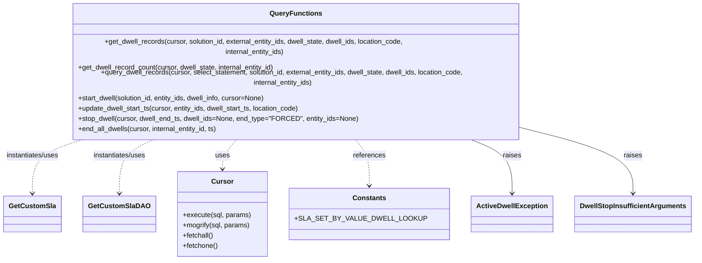

# Diagram: entity_core/entity_service/entity_service/db/dwell.py


> Auto-generated by Obscura crawlers

## Diagram 1



### SVG

<svg id="container" width="1523.3125" xmlns="http://www.w3.org/2000/svg" class="classDiagram" height="558" viewBox="0 0 1523.3125 558" role="graphics-document document" aria-roledescription="class"><style>#container{font-family:"trebuchet ms",verdana,arial,sans-serif;font-size:16px;fill:#333;}@keyframes edge-animation-frame{from{stroke-dashoffset:0;}}@keyframes dash{to{stroke-dashoffset:0;}}#container .edge-animation-slow{stroke-dasharray:9,5!important;stroke-dashoffset:900;animation:dash 50s linear infinite;stroke-linecap:round;}#container .edge-animation-fast{stroke-dasharray:9,5!important;stroke-dashoffset:900;animation:dash 20s linear infinite;stroke-linecap:round;}#container .error-icon{fill:#552222;}#container .error-text{fill:#552222;stroke:#552222;}#container .edge-thickness-normal{stroke-width:1px;}#container .edge-thickness-thick{stroke-width:3.5px;}#container .edge-pattern-solid{stroke-dasharray:0;}#container .edge-thickness-invisible{stroke-width:0;fill:none;}#container .edge-pattern-dashed{stroke-dasharray:3;}#container .edge-pattern-dotted{stroke-dasharray:2;}#container .marker{fill:#333333;stroke:#333333;}#container .marker.cross{stroke:#333333;}#container svg{font-family:"trebuchet ms",verdana,arial,sans-serif;font-size:16px;}#container p{margin:0;}#container g.classGroup text{fill:#9370DB;stroke:none;font-family:"trebuchet ms",verdana,arial,sans-serif;font-size:10px;}#container g.classGroup text .title{font-weight:bolder;}#container .nodeLabel,#container .edgeLabel{color:#131300;}#container .edgeLabel .label rect{fill:#ECECFF;}#container .label text{fill:#131300;}#container .labelBkg{background:#ECECFF;}#container .edgeLabel .label span{background:#ECECFF;}#container .classTitle{font-weight:bolder;}#container .node rect,#container .node circle,#container .node ellipse,#container .node polygon,#container .node path{fill:#ECECFF;stroke:#9370DB;stroke-width:1px;}#container .divider{stroke:#9370DB;stroke-width:1;}#container g.clickable{cursor:pointer;}#container g.classGroup rect{fill:#ECECFF;stroke:#9370DB;}#container g.classGroup line{stroke:#9370DB;stroke-width:1;}#container .classLabel .box{stroke:none;stroke-width:0;fill:#ECECFF;opacity:0.5;}#container .classLabel .label{fill:#9370DB;font-size:10px;}#container .relation{stroke:#333333;stroke-width:1;fill:none;}#container .dashed-line{stroke-dasharray:3;}#container .dotted-line{stroke-dasharray:1 2;}#container #compositionStart,#container .composition{fill:#333333!important;stroke:#333333!important;stroke-width:1;}#container #compositionEnd,#container .composition{fill:#333333!important;stroke:#333333!important;stroke-width:1;}#container #dependencyStart,#container .dependency{fill:#333333!important;stroke:#333333!important;stroke-width:1;}#container #dependencyStart,#container .dependency{fill:#333333!important;stroke:#333333!important;stroke-width:1;}#container #extensionStart,#container .extension{fill:transparent!important;stroke:#333333!important;stroke-width:1;}#container #extensionEnd,#container .extension{fill:transparent!important;stroke:#333333!important;stroke-width:1;}#container #aggregationStart,#container .aggregation{fill:transparent!important;stroke:#333333!important;stroke-width:1;}#container #aggregationEnd,#container .aggregation{fill:transparent!important;stroke:#333333!important;stroke-width:1;}#container #lollipopStart,#container .lollipop{fill:#ECECFF!important;stroke:#333333!important;stroke-width:1;}#container #lollipopEnd,#container .lollipop{fill:#ECECFF!important;stroke:#333333!important;stroke-width:1;}#container .edgeTerminals{font-size:11px;line-height:initial;}#container .classTitleText{text-anchor:middle;font-size:18px;fill:#333;}#container .label-icon{display:inline-block;height:1em;overflow:visible;vertical-align:-0.125em;}#container .node .label-icon path{fill:currentColor;stroke:revert;stroke-width:revert;}#container :root{--mermaid-font-family:"trebuchet ms",verdana,arial,sans-serif;}</style><g><defs><marker id="container_class-aggregationStart" class="marker aggregation class" refX="18" refY="7" markerWidth="190" markerHeight="240" orient="auto"><path d="M 18,7 L9,13 L1,7 L9,1 Z"></path></marker></defs><defs><marker id="container_class-aggregationEnd" class="marker aggregation class" refX="1" refY="7" markerWidth="20" markerHeight="28" orient="auto"><path d="M 18,7 L9,13 L1,7 L9,1 Z"></path></marker></defs><defs><marker id="container_class-extensionStart" class="marker extension class" refX="18" refY="7" markerWidth="190" markerHeight="240" orient="auto"><path d="M 1,7 L18,13 V 1 Z"></path></marker></defs><defs><marker id="container_class-extensionEnd" class="marker extension class" refX="1" refY="7" markerWidth="20" markerHeight="28" orient="auto"><path d="M 1,1 V 13 L18,7 Z"></path></marker></defs><defs><marker id="container_class-compositionStart" class="marker composition class" refX="18" refY="7" markerWidth="190" markerHeight="240" orient="auto"><path d="M 18,7 L9,13 L1,7 L9,1 Z"></path></marker></defs><defs><marker id="container_class-compositionEnd" class="marker composition class" refX="1" refY="7" markerWidth="20" markerHeight="28" orient="auto"><path d="M 18,7 L9,13 L1,7 L9,1 Z"></path></marker></defs><defs><marker id="container_class-dependencyStart" class="marker dependency class" refX="6" refY="7" markerWidth="190" markerHeight="240" orient="auto"><path d="M 5,7 L9,13 L1,7 L9,1 Z"></path></marker></defs><defs><marker id="container_class-dependencyEnd" class="marker dependency class" refX="13" refY="7" markerWidth="20" markerHeight="28" orient="auto"><path d="M 18,7 L9,13 L14,7 L9,1 Z"></path></marker></defs><defs><marker id="container_class-lollipopStart" class="marker lollipop class" refX="13" refY="7" markerWidth="190" markerHeight="240" orient="auto"><circle stroke="black" fill="transparent" cx="7" cy="7" r="6"></circle></marker></defs><defs><marker id="container_class-lollipopEnd" class="marker lollipop class" refX="1" refY="7" markerWidth="190" markerHeight="240" orient="auto"><circle stroke="black" fill="transparent" cx="7" cy="7" r="6"></circle></marker></defs><g class="root"><g class="clusters"></g><g class="edgePaths"><path d="M196.376,278L175.533,284.167C154.69,290.333,113.005,302.667,92.163,323.5C71.32,344.333,71.32,373.667,71.32,388.333L71.32,403" id="id_QueryFunctions_GetCustomSla_1" class="edge-thickness-normal edge-pattern-dashed relation" style=";;;" data-edge="true" data-et="edge" data-id="id_QueryFunctions_GetCustomSla_1" data-points="W3sieCI6MTk2LjM3NTU1NjQxMzUxNzQyLCJ5IjoyNzh9LHsieCI6NzEuMzIwMzEyNSwieSI6MzE1fSx7IngiOjcxLjMyMDMxMjUsInkiOjQwOX1d" marker-end="url(#container_class-dependencyEnd)"></path><path d="M346.914,278L332.948,284.167C318.982,290.333,291.049,302.667,277.083,323.5C263.117,344.333,263.117,373.667,263.117,388.333L263.117,403" id="id_QueryFunctions_GetCustomSlaDAO_2" class="edge-thickness-normal edge-pattern-dashed relation" style=";;;" data-edge="true" data-et="edge" data-id="id_QueryFunctions_GetCustomSlaDAO_2" data-points="W3sieCI6MzQ2LjkxMzgwMTMyNjMwODE1LCJ5IjoyNzh9LHsieCI6MjYzLjExNzE4NzUsInkiOjMxNX0seyJ4IjoyNjMuMTE3MTg3NSwieSI6NDA5fV0=" marker-end="url(#container_class-dependencyEnd)"></path><path d="M528.516,278L522.846,284.167C517.175,290.333,505.834,302.667,500.163,314C494.492,325.333,494.492,335.667,494.492,340.833L494.492,346" id="id_QueryFunctions_Cursor_3" class="edge-thickness-normal edge-pattern-dashed relation" style=";;;" data-edge="true" data-et="edge" data-id="id_QueryFunctions_Cursor_3" data-points="W3sieCI6NTI4LjUxNjI3MjI1NjU0MDcsInkiOjI3OH0seyJ4Ijo0OTQuNDkyMTg3NSwieSI6MzE1fSx7IngiOjQ5NC40OTIxODc1LCJ5IjozNTJ9XQ==" marker-end="url(#container_class-dependencyEnd)"></path><path d="M776.8,278L782.471,284.167C788.141,290.333,799.483,302.667,805.154,320.5C810.824,338.333,810.824,361.667,810.824,373.333L810.824,385" id="id_QueryFunctions_Constants_4" class="edge-thickness-normal edge-pattern-dashed relation" style=";;;" data-edge="true" data-et="edge" data-id="id_QueryFunctions_Constants_4" data-points="W3sieCI6Nzc2LjgwMDEzMzk5MzQ1OTMsInkiOjI3OH0seyJ4Ijo4MTAuODI0MjE4NzUsInkiOjMxNX0seyJ4Ijo4MTAuODI0MjE4NzUsInkiOjM5MX1d" marker-end="url(#container_class-dependencyEnd)"></path><path d="M1015.347,278L1031.914,284.167C1048.481,290.333,1081.616,302.667,1098.183,323.5C1114.75,344.333,1114.75,373.667,1114.75,388.333L1114.75,403" id="id_QueryFunctions_ActiveDwellException_5" class="edge-thickness-normal edge-pattern-solid relation" style=";;;" data-edge="true" data-et="edge" data-id="id_QueryFunctions_ActiveDwellException_5" data-points="W3sieCI6MTAxNS4zNDY1MzIwNjc1ODcyLCJ5IjoyNzh9LHsieCI6MTExNC43NSwieSI6MzE1fSx7IngiOjExMTQuNzUsInkiOjQwOX1d" marker-end="url(#container_class-dependencyEnd)"></path><path d="M1196.35,270.651L1227.832,278.042C1259.314,285.434,1322.278,300.217,1353.76,322.275C1385.242,344.333,1385.242,373.667,1385.242,388.333L1385.242,403" id="id_QueryFunctions_DwellStopInsufficientArguments_6" class="edge-thickness-normal edge-pattern-solid relation" style=";;;" data-edge="true" data-et="edge" data-id="id_QueryFunctions_DwellStopInsufficientArguments_6" data-points="W3sieCI6MTE5Ni4zNDk2MDkzNzUsInkiOjI3MC42NTA3ODY2MjU4OTM1fSx7IngiOjEzODUuMjQyMTg3NSwieSI6MzE1fSx7IngiOjEzODUuMjQyMTg3NSwieSI6NDA5fV0=" marker-end="url(#container_class-dependencyEnd)"></path></g><g class="edgeLabels"><g class="edgeLabel" transform="translate(71.3203125, 315)"><g class="label" data-id="id_QueryFunctions_GetCustomSla_1" transform="translate(-63.3203125, -12)"><foreignObject width="126.640625" height="24"><div xmlns="http://www.w3.org/1999/xhtml" class="labelBkg" style="display: table-cell; white-space: nowrap; line-height: 1.5; max-width: 200px; text-align: center;"><span class="edgeLabel"><p>instantiates/uses</p></span></div></foreignObject></g></g><g class="edgeLabel" transform="translate(263.1171875, 315)"><g class="label" data-id="id_QueryFunctions_GetCustomSlaDAO_2" transform="translate(-63.3203125, -12)"><foreignObject width="126.640625" height="24"><div xmlns="http://www.w3.org/1999/xhtml" class="labelBkg" style="display: table-cell; white-space: nowrap; line-height: 1.5; max-width: 200px; text-align: center;"><span class="edgeLabel"><p>instantiates/uses</p></span></div></foreignObject></g></g><g class="edgeLabel" transform="translate(494.4921875, 315)"><g class="label" data-id="id_QueryFunctions_Cursor_3" transform="translate(-16.4921875, -12)"><foreignObject width="32.984375" height="24"><div xmlns="http://www.w3.org/1999/xhtml" class="labelBkg" style="display: table-cell; white-space: nowrap; line-height: 1.5; max-width: 200px; text-align: center;"><span class="edgeLabel"><p>uses</p></span></div></foreignObject></g></g><g class="edgeLabel" transform="translate(810.82421875, 315)"><g class="label" data-id="id_QueryFunctions_Constants_4" transform="translate(-37.828125, -12)"><foreignObject width="75.65625" height="24"><div xmlns="http://www.w3.org/1999/xhtml" class="labelBkg" style="display: table-cell; white-space: nowrap; line-height: 1.5; max-width: 200px; text-align: center;"><span class="edgeLabel"><p>references</p></span></div></foreignObject></g></g><g class="edgeLabel" transform="translate(1114.75, 315)"><g class="label" data-id="id_QueryFunctions_ActiveDwellException_5" transform="translate(-21.25, -12)"><foreignObject width="42.5" height="24"><div xmlns="http://www.w3.org/1999/xhtml" class="labelBkg" style="display: table-cell; white-space: nowrap; line-height: 1.5; max-width: 200px; text-align: center;"><span class="edgeLabel"><p>raises</p></span></div></foreignObject></g></g><g class="edgeLabel" transform="translate(1385.2421875, 315)"><g class="label" data-id="id_QueryFunctions_DwellStopInsufficientArguments_6" transform="translate(-21.25, -12)"><foreignObject width="42.5" height="24"><div xmlns="http://www.w3.org/1999/xhtml" class="labelBkg" style="display: table-cell; white-space: nowrap; line-height: 1.5; max-width: 200px; text-align: center;"><span class="edgeLabel"><p>raises</p></span></div></foreignObject></g></g></g><g class="nodes"><g class="node default" id="classId-ActiveDwellException-0" transform="translate(1114.75, 451)"><g class="basic label-container"><path d="M-90.421875 -42 L90.421875 -42 L90.421875 42 L-90.421875 42" stroke="none" stroke-width="0" fill="#ECECFF" style=""></path><path d="M-90.421875 -42 C-52.499984103623795 -42, -14.57809320724759 -42, 90.421875 -42 M-90.421875 -42 C-20.77877648256053 -42, 48.86432203487894 -42, 90.421875 -42 M90.421875 -42 C90.421875 -15.815065494709842, 90.421875 10.369869010580317, 90.421875 42 M90.421875 -42 C90.421875 -10.818397229074545, 90.421875 20.36320554185091, 90.421875 42 M90.421875 42 C46.355340706552305 42, 2.2888064131046093 42, -90.421875 42 M90.421875 42 C50.216310226538894 42, 10.010745453077789 42, -90.421875 42 M-90.421875 42 C-90.421875 17.19594201479653, -90.421875 -7.608115970406942, -90.421875 -42 M-90.421875 42 C-90.421875 22.69234333107052, -90.421875 3.3846866621410427, -90.421875 -42" stroke="#9370DB" stroke-width="1.3" fill="none" stroke-dasharray="0 0" style=""></path></g><g class="annotation-group text" transform="translate(0, -18)"></g><g class="label-group text" transform="translate(-78.421875, -18)"><g class="label" style="font-weight: bolder" transform="translate(0,-12)"><foreignObject width="156.84375" height="24"><div xmlns="http://www.w3.org/1999/xhtml" style="display: table-cell; white-space: nowrap; line-height: 1.5; max-width: 204px; text-align: center;"><span class="nodeLabel markdown-node-label" style=""><p>ActiveDwellException</p></span></div></foreignObject></g></g><g class="members-group text" transform="translate(-78.421875, 30)"></g><g class="methods-group text" transform="translate(-78.421875, 60)"></g><g class="divider" style=""><path d="M-90.421875 6 C-24.12059808386411 6, 42.18067883227178 6, 90.421875 6 M-90.421875 6 C-22.554569335739288 6, 45.312736328521424 6, 90.421875 6" stroke="#9370DB" stroke-width="1.3" fill="none" stroke-dasharray="0 0" style=""></path></g><g class="divider" style=""><path d="M-90.421875 24 C-29.98675638679491 24, 30.448362226410183 24, 90.421875 24 M-90.421875 24 C-40.83517443365609 24, 8.751526132687815 24, 90.421875 24" stroke="#9370DB" stroke-width="1.3" fill="none" stroke-dasharray="0 0" style=""></path></g></g><g class="node default" id="classId-DwellStopInsufficientArguments-1" transform="translate(1385.2421875, 451)"><g class="basic label-container"><path d="M-130.0703125 -42 L130.0703125 -42 L130.0703125 42 L-130.0703125 42" stroke="none" stroke-width="0" fill="#ECECFF" style=""></path><path d="M-130.0703125 -42 C-30.31229211560553 -42, 69.44572826878894 -42, 130.0703125 -42 M-130.0703125 -42 C-61.90288277125529 -42, 6.264546957489415 -42, 130.0703125 -42 M130.0703125 -42 C130.0703125 -22.067272303528835, 130.0703125 -2.13454460705767, 130.0703125 42 M130.0703125 -42 C130.0703125 -9.67133954033708, 130.0703125 22.65732091932584, 130.0703125 42 M130.0703125 42 C44.32361772225188 42, -41.423077055496236 42, -130.0703125 42 M130.0703125 42 C62.513488759200456 42, -5.043334981599088 42, -130.0703125 42 M-130.0703125 42 C-130.0703125 24.40295415552982, -130.0703125 6.805908311059639, -130.0703125 -42 M-130.0703125 42 C-130.0703125 11.002594819130348, -130.0703125 -19.994810361739304, -130.0703125 -42" stroke="#9370DB" stroke-width="1.3" fill="none" stroke-dasharray="0 0" style=""></path></g><g class="annotation-group text" transform="translate(0, -18)"></g><g class="label-group text" transform="translate(-118.0703125, -18)"><g class="label" style="font-weight: bolder" transform="translate(0,-12)"><foreignObject width="236.140625" height="24"><div xmlns="http://www.w3.org/1999/xhtml" style="display: table-cell; white-space: nowrap; line-height: 1.5; max-width: 282px; text-align: center;"><span class="nodeLabel markdown-node-label" style=""><p>DwellStopInsufficientArguments</p></span></div></foreignObject></g></g><g class="members-group text" transform="translate(-118.0703125, 30)"></g><g class="methods-group text" transform="translate(-118.0703125, 60)"></g><g class="divider" style=""><path d="M-130.0703125 6 C-32.59117143065369 6, 64.88796963869262 6, 130.0703125 6 M-130.0703125 6 C-47.42011550407115 6, 35.2300814918577 6, 130.0703125 6" stroke="#9370DB" stroke-width="1.3" fill="none" stroke-dasharray="0 0" style=""></path></g><g class="divider" style=""><path d="M-130.0703125 24 C-70.31249086417733 24, -10.554669228354655 24, 130.0703125 24 M-130.0703125 24 C-53.2707784622085 24, 23.528755575583006 24, 130.0703125 24" stroke="#9370DB" stroke-width="1.3" fill="none" stroke-dasharray="0 0" style=""></path></g></g><g class="node default" id="classId-QueryFunctions-2" transform="translate(652.658203125, 143)"><g class="basic label-container"><path d="M-543.69140625 -135 L543.69140625 -135 L543.69140625 135 L-543.69140625 135" stroke="none" stroke-width="0" fill="#ECECFF" style=""></path><path d="M-543.69140625 -135 C-144.67862523464436 -135, 254.33415578071128 -135, 543.69140625 -135 M-543.69140625 -135 C-299.5510141882506 -135, -55.41062212650115 -135, 543.69140625 -135 M543.69140625 -135 C543.69140625 -59.1825630347703, 543.69140625 16.634873930459406, 543.69140625 135 M543.69140625 -135 C543.69140625 -73.28940461784183, 543.69140625 -11.578809235683636, 543.69140625 135 M543.69140625 135 C190.14198594712946 135, -163.4074343557411 135, -543.69140625 135 M543.69140625 135 C199.86802703311469 135, -143.95535218377063 135, -543.69140625 135 M-543.69140625 135 C-543.69140625 33.208600815095835, -543.69140625 -68.58279836980833, -543.69140625 -135 M-543.69140625 135 C-543.69140625 54.66330745288957, -543.69140625 -25.673385094220862, -543.69140625 -135" stroke="#9370DB" stroke-width="1.3" fill="none" stroke-dasharray="0 0" style=""></path></g><g class="annotation-group text" transform="translate(0, -111)"></g><g class="label-group text" transform="translate(-56.9921875, -111)"><g class="label" style="font-weight: bolder" transform="translate(0,-12)"><foreignObject width="113.984375" height="24"><div xmlns="http://www.w3.org/1999/xhtml" style="display: table-cell; white-space: nowrap; line-height: 1.5; max-width: 163px; text-align: center;"><span class="nodeLabel markdown-node-label" style=""><p>QueryFunctions</p></span></div></foreignObject></g></g><g class="members-group text" transform="translate(-531.69140625, -63)"></g><g class="methods-group text" transform="translate(-531.69140625, -33)"><g class="label" style="" transform="translate(0,-12)"><foreignObject width="854.703125" height="24"><div xmlns="http://www.w3.org/1999/xhtml" style="display: table-cell; white-space: nowrap; line-height: 1.5; max-width: 912px; text-align: center;"><span class="nodeLabel markdown-node-label" style=""><p>+get_dwell_records(cursor, solution_id, external_entity_ids, dwell_state, dwell_ids, location_code, internal_entity_ids)</p></span></div></foreignObject></g><g class="label" style="" transform="translate(0,12)"><foreignObject width="464.671875" height="24"><div xmlns="http://www.w3.org/1999/xhtml" style="display: table-cell; white-space: nowrap; line-height: 1.5; max-width: 522px; text-align: center;"><span class="nodeLabel markdown-node-label" style=""><p>+get_dwell_record_count(cursor, dwell_state, internal_entity_id)</p></span></div></foreignObject></g><g class="label" style="" transform="translate(0,36)"><foreignObject width="1006.390625" height="24"><div xmlns="http://www.w3.org/1999/xhtml" style="display: table-cell; white-space: nowrap; line-height: 1.5; max-width: 1064px; text-align: center;"><span class="nodeLabel markdown-node-label" style=""><p>+query_dwell_records(cursor, select_statement, solution_id, external_entity_ids, dwell_state, dwell_ids, location_code, internal_entity_ids)</p></span></div></foreignObject></g><g class="label" style="" transform="translate(0,60)"><foreignObject width="444.921875" height="24"><div xmlns="http://www.w3.org/1999/xhtml" style="display: table-cell; white-space: nowrap; line-height: 1.5; max-width: 502px; text-align: center;"><span class="nodeLabel markdown-node-label" style=""><p>+start_dwell(solution_id, entity_ids, dwell_info, cursor=None)</p></span></div></foreignObject></g><g class="label" style="" transform="translate(0,84)"><foreignObject width="524.515625" height="24"><div xmlns="http://www.w3.org/1999/xhtml" style="display: table-cell; white-space: nowrap; line-height: 1.5; max-width: 582px; text-align: center;"><span class="nodeLabel markdown-node-label" style=""><p>+update_dwell_start_ts(cursor, entity_ids, dwell_start_ts, location_code)</p></span></div></foreignObject></g><g class="label" style="" transform="translate(0,108)"><foreignObject width="645.421875" height="24"><div xmlns="http://www.w3.org/1999/xhtml" style="display: table-cell; white-space: nowrap; line-height: 1.5; max-width: 703px; text-align: center;"><span class="nodeLabel markdown-node-label" style=""><p>+stop_dwell(cursor, dwell_end_ts, dwell_ids=None, end_type="FORCED", entity_ids=None)</p></span></div></foreignObject></g><g class="label" style="" transform="translate(0,132)"><foreignObject width="329.203125" height="24"><div xmlns="http://www.w3.org/1999/xhtml" style="display: table-cell; white-space: nowrap; line-height: 1.5; max-width: 387px; text-align: center;"><span class="nodeLabel markdown-node-label" style=""><p>+end_all_dwells(cursor, internal_entity_id, ts)</p></span></div></foreignObject></g></g><g class="divider" style=""><path d="M-543.69140625 -87 C-236.995554898183 -87, 69.700296453634 -87, 543.69140625 -87 M-543.69140625 -87 C-159.0059382238265 -87, 225.67952980234702 -87, 543.69140625 -87" stroke="#9370DB" stroke-width="1.3" fill="none" stroke-dasharray="0 0" style=""></path></g><g class="divider" style=""><path d="M-543.69140625 -63 C-213.73118218046244 -63, 116.22904188907512 -63, 543.69140625 -63 M-543.69140625 -63 C-122.56909782387311 -63, 298.5532106022538 -63, 543.69140625 -63" stroke="#9370DB" stroke-width="1.3" fill="none" stroke-dasharray="0 0" style=""></path></g></g><g class="node default" id="classId-GetCustomSla-3" transform="translate(71.3203125, 451)"><g class="basic label-container"><path d="M-63.25 -42 L63.25 -42 L63.25 42 L-63.25 42" stroke="none" stroke-width="0" fill="#ECECFF" style=""></path><path d="M-63.25 -42 C-14.501736710798916 -42, 34.24652657840217 -42, 63.25 -42 M-63.25 -42 C-34.34615009885299 -42, -5.4423001977059755 -42, 63.25 -42 M63.25 -42 C63.25 -21.929483964440216, 63.25 -1.858967928880432, 63.25 42 M63.25 -42 C63.25 -23.98766567049059, 63.25 -5.975331340981178, 63.25 42 M63.25 42 C21.878600399843172 42, -19.492799200313655 42, -63.25 42 M63.25 42 C27.191848961689367 42, -8.866302076621267 42, -63.25 42 M-63.25 42 C-63.25 12.966475080848838, -63.25 -16.067049838302324, -63.25 -42 M-63.25 42 C-63.25 16.847216734038955, -63.25 -8.30556653192209, -63.25 -42" stroke="#9370DB" stroke-width="1.3" fill="none" stroke-dasharray="0 0" style=""></path></g><g class="annotation-group text" transform="translate(0, -18)"></g><g class="label-group text" transform="translate(-51.25, -18)"><g class="label" style="font-weight: bolder" transform="translate(0,-12)"><foreignObject width="102.5" height="24"><div xmlns="http://www.w3.org/1999/xhtml" style="display: table-cell; white-space: nowrap; line-height: 1.5; max-width: 151px; text-align: center;"><span class="nodeLabel markdown-node-label" style=""><p>GetCustomSla</p></span></div></foreignObject></g></g><g class="members-group text" transform="translate(-51.25, 30)"></g><g class="methods-group text" transform="translate(-51.25, 60)"></g><g class="divider" style=""><path d="M-63.25 6 C-17.604649152691785 6, 28.04070169461643 6, 63.25 6 M-63.25 6 C-30.784065457975792 6, 1.6818690840484152 6, 63.25 6" stroke="#9370DB" stroke-width="1.3" fill="none" stroke-dasharray="0 0" style=""></path></g><g class="divider" style=""><path d="M-63.25 24 C-34.61382218792768 24, -5.977644375855363 24, 63.25 24 M-63.25 24 C-37.816238161955795 24, -12.382476323911597 24, 63.25 24" stroke="#9370DB" stroke-width="1.3" fill="none" stroke-dasharray="0 0" style=""></path></g></g><g class="node default" id="classId-GetCustomSlaDAO-4" transform="translate(263.1171875, 451)"><g class="basic label-container"><path d="M-78.546875 -42 L78.546875 -42 L78.546875 42 L-78.546875 42" stroke="none" stroke-width="0" fill="#ECECFF" style=""></path><path d="M-78.546875 -42 C-28.300782456169983 -42, 21.945310087660033 -42, 78.546875 -42 M-78.546875 -42 C-35.21044030099714 -42, 8.125994398005716 -42, 78.546875 -42 M78.546875 -42 C78.546875 -23.858346574348086, 78.546875 -5.716693148696173, 78.546875 42 M78.546875 -42 C78.546875 -12.255153356801387, 78.546875 17.489693286397227, 78.546875 42 M78.546875 42 C26.693045379769515 42, -25.16078424046097 42, -78.546875 42 M78.546875 42 C36.61777784161302 42, -5.311319316773961 42, -78.546875 42 M-78.546875 42 C-78.546875 24.036554894604304, -78.546875 6.073109789208608, -78.546875 -42 M-78.546875 42 C-78.546875 24.494686735909585, -78.546875 6.989373471819171, -78.546875 -42" stroke="#9370DB" stroke-width="1.3" fill="none" stroke-dasharray="0 0" style=""></path></g><g class="annotation-group text" transform="translate(0, -18)"></g><g class="label-group text" transform="translate(-66.546875, -18)"><g class="label" style="font-weight: bolder" transform="translate(0,-12)"><foreignObject width="133.09375" height="24"><div xmlns="http://www.w3.org/1999/xhtml" style="display: table-cell; white-space: nowrap; line-height: 1.5; max-width: 181px; text-align: center;"><span class="nodeLabel markdown-node-label" style=""><p>GetCustomSlaDAO</p></span></div></foreignObject></g></g><g class="members-group text" transform="translate(-66.546875, 30)"></g><g class="methods-group text" transform="translate(-66.546875, 60)"></g><g class="divider" style=""><path d="M-78.546875 6 C-27.781196251704166 6, 22.984482496591667 6, 78.546875 6 M-78.546875 6 C-43.84279369685597 6, -9.138712393711941 6, 78.546875 6" stroke="#9370DB" stroke-width="1.3" fill="none" stroke-dasharray="0 0" style=""></path></g><g class="divider" style=""><path d="M-78.546875 24 C-23.84140251043364 24, 30.864069979132722 24, 78.546875 24 M-78.546875 24 C-34.61132194131104 24, 9.32423111737792 24, 78.546875 24" stroke="#9370DB" stroke-width="1.3" fill="none" stroke-dasharray="0 0" style=""></path></g></g><g class="node default" id="classId-Cursor-5" transform="translate(494.4921875, 451)"><g class="basic label-container"><path d="M-102.828125 -99 L102.828125 -99 L102.828125 99 L-102.828125 99" stroke="none" stroke-width="0" fill="#ECECFF" style=""></path><path d="M-102.828125 -99 C-39.18717663254131 -99, 24.45377173491738 -99, 102.828125 -99 M-102.828125 -99 C-41.36874860790896 -99, 20.090627784182075 -99, 102.828125 -99 M102.828125 -99 C102.828125 -36.74897318567887, 102.828125 25.50205362864226, 102.828125 99 M102.828125 -99 C102.828125 -44.82893539934558, 102.828125 9.342129201308836, 102.828125 99 M102.828125 99 C48.10071409488621 99, -6.626696810227585 99, -102.828125 99 M102.828125 99 C37.827495500731004 99, -27.173133998537992 99, -102.828125 99 M-102.828125 99 C-102.828125 54.481569670614476, -102.828125 9.963139341228953, -102.828125 -99 M-102.828125 99 C-102.828125 31.334422793169608, -102.828125 -36.331154413660784, -102.828125 -99" stroke="#9370DB" stroke-width="1.3" fill="none" stroke-dasharray="0 0" style=""></path></g><g class="annotation-group text" transform="translate(0, -75)"></g><g class="label-group text" transform="translate(-23.90625, -75)"><g class="label" style="font-weight: bolder" transform="translate(0,-12)"><foreignObject width="47.8125" height="24"><div xmlns="http://www.w3.org/1999/xhtml" style="display: table-cell; white-space: nowrap; line-height: 1.5; max-width: 98px; text-align: center;"><span class="nodeLabel markdown-node-label" style=""><p>Cursor</p></span></div></foreignObject></g></g><g class="members-group text" transform="translate(-90.828125, -27)"></g><g class="methods-group text" transform="translate(-90.828125, 3)"><g class="label" style="" transform="translate(0,-12)"><foreignObject width="157.75" height="24"><div xmlns="http://www.w3.org/1999/xhtml" style="display: table-cell; white-space: nowrap; line-height: 1.5; max-width: 215px; text-align: center;"><span class="nodeLabel markdown-node-label" style=""><p>+execute(sql, params)</p></span></div></foreignObject></g><g class="label" style="" transform="translate(0,12)"><foreignObject width="157.078125" height="24"><div xmlns="http://www.w3.org/1999/xhtml" style="display: table-cell; white-space: nowrap; line-height: 1.5; max-width: 214px; text-align: center;"><span class="nodeLabel markdown-node-label" style=""><p>+mogrify(sql, params)</p></span></div></foreignObject></g><g class="label" style="" transform="translate(0,36)"><foreignObject width="72.515625" height="24"><div xmlns="http://www.w3.org/1999/xhtml" style="display: table-cell; white-space: nowrap; line-height: 1.5; max-width: 130px; text-align: center;"><span class="nodeLabel markdown-node-label" style=""><p>+fetchall()</p></span></div></foreignObject></g><g class="label" style="" transform="translate(0,60)"><foreignObject width="82.046875" height="24"><div xmlns="http://www.w3.org/1999/xhtml" style="display: table-cell; white-space: nowrap; line-height: 1.5; max-width: 139px; text-align: center;"><span class="nodeLabel markdown-node-label" style=""><p>+fetchone()</p></span></div></foreignObject></g></g><g class="divider" style=""><path d="M-102.828125 -51 C-39.17494021731076 -51, 24.478244565378475 -51, 102.828125 -51 M-102.828125 -51 C-55.955455952506306 -51, -9.082786905012611 -51, 102.828125 -51" stroke="#9370DB" stroke-width="1.3" fill="none" stroke-dasharray="0 0" style=""></path></g><g class="divider" style=""><path d="M-102.828125 -27 C-60.51983661086012 -27, -18.211548221720236 -27, 102.828125 -27 M-102.828125 -27 C-56.21711470072107 -27, -9.606104401442138 -27, 102.828125 -27" stroke="#9370DB" stroke-width="1.3" fill="none" stroke-dasharray="0 0" style=""></path></g></g><g class="node default" id="classId-Constants-6" transform="translate(810.82421875, 451)"><g class="basic label-container"><path d="M-163.50390625 -60 L163.50390625 -60 L163.50390625 60 L-163.50390625 60" stroke="none" stroke-width="0" fill="#ECECFF" style=""></path><path d="M-163.50390625 -60 C-62.5722812937025 -60, 38.359343662594995 -60, 163.50390625 -60 M-163.50390625 -60 C-43.19896530355305 -60, 77.1059756428939 -60, 163.50390625 -60 M163.50390625 -60 C163.50390625 -31.99690602142962, 163.50390625 -3.99381204285924, 163.50390625 60 M163.50390625 -60 C163.50390625 -18.468963295842954, 163.50390625 23.06207340831409, 163.50390625 60 M163.50390625 60 C87.79793351586503 60, 12.091960781730052 60, -163.50390625 60 M163.50390625 60 C34.80617993291369 60, -93.89154638417261 60, -163.50390625 60 M-163.50390625 60 C-163.50390625 32.80419166482476, -163.50390625 5.608383329649513, -163.50390625 -60 M-163.50390625 60 C-163.50390625 12.474962316957502, -163.50390625 -35.050075366085, -163.50390625 -60" stroke="#9370DB" stroke-width="1.3" fill="none" stroke-dasharray="0 0" style=""></path></g><g class="annotation-group text" transform="translate(0, -36)"></g><g class="label-group text" transform="translate(-36.5390625, -36)"><g class="label" style="font-weight: bolder" transform="translate(0,-12)"><foreignObject width="73.078125" height="24"><div xmlns="http://www.w3.org/1999/xhtml" style="display: table-cell; white-space: nowrap; line-height: 1.5; max-width: 122px; text-align: center;"><span class="nodeLabel markdown-node-label" style=""><p>Constants</p></span></div></foreignObject></g></g><g class="members-group text" transform="translate(-151.50390625, 12)"><g class="label" style="" transform="translate(0,-12)"><foreignObject width="266.46875" height="24"><div xmlns="http://www.w3.org/1999/xhtml" style="display: table-cell; white-space: nowrap; line-height: 1.5; max-width: 324px; text-align: center;"><span class="nodeLabel markdown-node-label" style=""><p>+SLA_SET_BY_VALUE_DWELL_LOOKUP</p></span></div></foreignObject></g></g><g class="methods-group text" transform="translate(-151.50390625, 60)"></g><g class="divider" style=""><path d="M-163.50390625 -12 C-73.57542586874817 -12, 16.35305451250366 -12, 163.50390625 -12 M-163.50390625 -12 C-33.974524099907256 -12, 95.55485805018549 -12, 163.50390625 -12" stroke="#9370DB" stroke-width="1.3" fill="none" stroke-dasharray="0 0" style=""></path></g><g class="divider" style=""><path d="M-163.50390625 36 C-96.40143750250532 36, -29.298968755010634 36, 163.50390625 36 M-163.50390625 36 C-81.7816257152476 36, -0.059345180495199656 36, 163.50390625 36" stroke="#9370DB" stroke-width="1.3" fill="none" stroke-dasharray="0 0" style=""></path></g></g></g></g></g></svg>

## Diagram 2

```mermaid
flowchart LR
    Start([Start: start_dwell]) --> A[Prepare dwell_info and normalize fields]
    A --> B[Instantiate GetCustomSla(GetCustomSlaDAO(cursor), solution_id, dwell_info)]
    B --> C[Invoke get_custom_sla()]
    C --> D{custom_sla_getter.dwell_info has<br/>sla_interval AND sla_set_by?}
    D -- Yes --> E[Build replaces with sla_interval="72" and sla_set_by]
    E --> F[For each entity_id build VALUES with cursor.mogrify]
    F --> G[INSERT INTO entity_dwell_watch ... ON CONFLICT DO NOTHING RETURNING id]
    G --> H[cursor.execute(sql, replaces) and cursor.fetchall()]
    H --> I[Return dwell_watch_ids]
    D -- No --> J[Run allowable_dwell_lookup SQL via cursor.mogrify and execute]
    J --> K[sla_result_row = cursor.fetchone()]
    K --> L[Set dwell_info.sla_set_by = Constants.SLA_SET_BY_VALUE_DWELL_LOOKUP]
    L --> M[Set dwell_info.sla = sla_result_row[0] if present]
    M --> N[For each entity_id build VALUES with cursor.mogrify using dwell_info]
    N --> O[INSERT INTO entity_dwell_watch ... ON CONFLICT DO NOTHING RETURNING id]
    O --> P[cursor.execute(query) and cursor.fetchall()]
    P --> I
    I --> End([End])
```

> SVG rendering failed for this diagram.
