# Diagram: entity_core/entity_service/entity_service/db/entity_location.py


> Auto-generated by Obscura crawlers

## Diagram 1

```mermaid
classDiagram
    class build_location_id_search {
        +build_location_id_search(latest_position_column, entity_alias, location_ids)
    }
    class get_bucket_clause {
        +get_bucket_clause(cursor, bucket)
    }
    class build_visibility_grant_join {
        +build_visibility_grant_join(entity_alias="e", manager_locations=None)
    }
    class get_manager_locations {
        +get_manager_locations(cursor, non_shipper_org_id, location_ids=None)
    }
    class get_is_manager {
        +get_is_manager(cursor, non_shipper_org_id, location_ids, org_type)
    }
    class get_count_dwelling_by_loc {
        +get_count_dwelling_by_loc(cursor, bucket=None, location_ids=None, non_shipper_org_id=None)
    }
    class get_location_capacity_details {
        +get_location_capacity_details(cursor, location_ids)
    }
    class get_location_shippability {
        +get_location_shippability(cursor, location_ids, solution_id, organization_id)
    }
    class get_days_to_arrival {
        +get_days_to_arrival(cursor, solution_id, window=(0,13), location_ids=[], tz="America/Detroit", life_cycle_state=None)
    }
    class get_entity_locations_by_capacity {
        +get_entity_locations_by_capacity(cursor, solution_id, location_ids, entity_ids=None, entity_search=None, description=None, description_search=None)
    }
    class entity_loc_everything_search {
        +entity_loc_everything_search(cursor, solution_id, everything_param, life_cycle_state)
    }
    class get_filtered_entity_locations {
        +get_filtered_entity_locations(cursor, solution_id, child_location_ids, life_cycle_state=None, entity_ids=None, entity_search=None)
    }

    class FV_AWS_LAMBDAS <<external>>
    class FV_ERROR <<external>>
    class MVW <<external>>
    class ORGTYPES <<external>>

    get_is_manager --> get_manager_locations : calls
    get_count_dwelling_by_loc --> build_visibility_grant_join : uses
    get_count_dwelling_by_loc --> get_bucket_clause : uses
    get_location_shippability --> build_visibility_grant_join : uses
    get_entity_locations_by_capacity --> FV_AWS_LAMBDAS : calls prepare_for_query
    get_days_to_arrival --> FV_ERROR : raises BadRequestError
    get_count_dwelling_by_loc --> MVW : references MVW.Entity.ENTITY_LOCATION
    get_entity_locations_by_capacity --> MVW : references MVW.Entity.ENTITY_LOCATION
    get_is_manager --> ORGTYPES : checks OrgTypes.SHIPPER
```



> SVG rendering failed for this diagram.

## Diagram 2

```mermaid
graph LR
    A[Input: cursor, bucket, location_ids, non_shipper_org_id] --> B[build_visibility_grant_join (if non_shipper_org_id)]
    A --> C[compute active_dwell_clause and location_id_clause]
    B --> D[Compose SQL with MVW.Entity.ENTITY_LOCATION and JOINs]
    C --> D
    D --> E[cursor.mogrify(sql, replaces)]
    E --> F[cursor.execute(query)]
    F --> G[cursor.fetchall()]
    G --> H[map rows -> {location_id: row._asdict()} -> RETURN]
```

> SVG rendering failed for this diagram.

## Diagram 3

```mermaid
graph LR
    I[Input: non_shipper_org_id, location_ids, org_type] --> J{OrgTypes.SHIPPER in org_type?}
    J -- Yes --> K[return True]
    J -- No --> L[get_manager_locations(cursor, non_shipper_org_id, location_ids)]
    L --> M{len(manager_locs) > 0}
    M -- True --> K
    M -- False --> N[return False]
```

> SVG rendering failed for this diagram.
