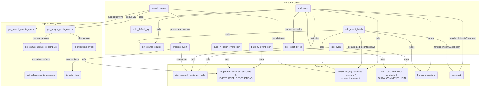

# Diagram: entity_core/entity_service/entity_service/db/event.py


> Auto-generated by Obscura crawlers

## Diagram 1



### SVG

<svg id="container" width="3472.48974609375" xmlns="http://www.w3.org/2000/svg" class="flowchart" height="627" viewBox="0 0 3472.48974609375 627" role="graphics-document document" aria-roledescription="flowchart-v2"><style>#container{font-family:"trebuchet ms",verdana,arial,sans-serif;font-size:16px;fill:#333;}@keyframes edge-animation-frame{from{stroke-dashoffset:0;}}@keyframes dash{to{stroke-dashoffset:0;}}#container .edge-animation-slow{stroke-dasharray:9,5!important;stroke-dashoffset:900;animation:dash 50s linear infinite;stroke-linecap:round;}#container .edge-animation-fast{stroke-dasharray:9,5!important;stroke-dashoffset:900;animation:dash 20s linear infinite;stroke-linecap:round;}#container .error-icon{fill:#552222;}#container .error-text{fill:#552222;stroke:#552222;}#container .edge-thickness-normal{stroke-width:1px;}#container .edge-thickness-thick{stroke-width:3.5px;}#container .edge-pattern-solid{stroke-dasharray:0;}#container .edge-thickness-invisible{stroke-width:0;fill:none;}#container .edge-pattern-dashed{stroke-dasharray:3;}#container .edge-pattern-dotted{stroke-dasharray:2;}#container .marker{fill:#333333;stroke:#333333;}#container .marker.cross{stroke:#333333;}#container svg{font-family:"trebuchet ms",verdana,arial,sans-serif;font-size:16px;}#container p{margin:0;}#container .label{font-family:"trebuchet ms",verdana,arial,sans-serif;color:#333;}#container .cluster-label text{fill:#333;}#container .cluster-label span{color:#333;}#container .cluster-label span p{background-color:transparent;}#container .label text,#container span{fill:#333;color:#333;}#container .node rect,#container .node circle,#container .node ellipse,#container .node polygon,#container .node path{fill:#ECECFF;stroke:#9370DB;stroke-width:1px;}#container .rough-node .label text,#container .node .label text,#container .image-shape .label,#container .icon-shape .label{text-anchor:middle;}#container .node .katex path{fill:#000;stroke:#000;stroke-width:1px;}#container .rough-node .label,#container .node .label,#container .image-shape .label,#container .icon-shape .label{text-align:center;}#container .node.clickable{cursor:pointer;}#container .root .anchor path{fill:#333333!important;stroke-width:0;stroke:#333333;}#container .arrowheadPath{fill:#333333;}#container .edgePath .path{stroke:#333333;stroke-width:2.0px;}#container .flowchart-link{stroke:#333333;fill:none;}#container .edgeLabel{background-color:rgba(232,232,232, 0.8);text-align:center;}#container .edgeLabel p{background-color:rgba(232,232,232, 0.8);}#container .edgeLabel rect{opacity:0.5;background-color:rgba(232,232,232, 0.8);fill:rgba(232,232,232, 0.8);}#container .labelBkg{background-color:rgba(232, 232, 232, 0.5);}#container .cluster rect{fill:#ffffde;stroke:#aaaa33;stroke-width:1px;}#container .cluster text{fill:#333;}#container .cluster span{color:#333;}#container div.mermaidTooltip{position:absolute;text-align:center;max-width:200px;padding:2px;font-family:"trebuchet ms",verdana,arial,sans-serif;font-size:12px;background:hsl(80, 100%, 96.2745098039%);border:1px solid #aaaa33;border-radius:2px;pointer-events:none;z-index:100;}#container .flowchartTitleText{text-anchor:middle;font-size:18px;fill:#333;}#container rect.text{fill:none;stroke-width:0;}#container .icon-shape,#container .image-shape{background-color:rgba(232,232,232, 0.8);text-align:center;}#container .icon-shape p,#container .image-shape p{background-color:rgba(232,232,232, 0.8);padding:2px;}#container .icon-shape rect,#container .image-shape rect{opacity:0.5;background-color:rgba(232,232,232, 0.8);fill:rgba(232,232,232, 0.8);}#container .label-icon{display:inline-block;height:1em;overflow:visible;vertical-align:-0.125em;}#container .node .label-icon path{fill:currentColor;stroke:revert;stroke-width:revert;}#container :root{--mermaid-font-family:"trebuchet ms",verdana,arial,sans-serif;}</style><g><marker id="container_flowchart-v2-pointEnd" class="marker flowchart-v2" viewBox="0 0 10 10" refX="5" refY="5" markerUnits="userSpaceOnUse" markerWidth="8" markerHeight="8" orient="auto"><path d="M 0 0 L 10 5 L 0 10 z" class="arrowMarkerPath" style="stroke-width: 1; stroke-dasharray: 1, 0;"></path></marker><marker id="container_flowchart-v2-pointStart" class="marker flowchart-v2" viewBox="0 0 10 10" refX="4.5" refY="5" markerUnits="userSpaceOnUse" markerWidth="8" markerHeight="8" orient="auto"><path d="M 0 5 L 10 10 L 10 0 z" class="arrowMarkerPath" style="stroke-width: 1; stroke-dasharray: 1, 0;"></path></marker><marker id="container_flowchart-v2-circleEnd" class="marker flowchart-v2" viewBox="0 0 10 10" refX="11" refY="5" markerUnits="userSpaceOnUse" markerWidth="11" markerHeight="11" orient="auto"><circle cx="5" cy="5" r="5" class="arrowMarkerPath" style="stroke-width: 1; stroke-dasharray: 1, 0;"></circle></marker><marker id="container_flowchart-v2-circleStart" class="marker flowchart-v2" viewBox="0 0 10 10" refX="-1" refY="5" markerUnits="userSpaceOnUse" markerWidth="11" markerHeight="11" orient="auto"><circle cx="5" cy="5" r="5" class="arrowMarkerPath" style="stroke-width: 1; stroke-dasharray: 1, 0;"></circle></marker><marker id="container_flowchart-v2-crossEnd" class="marker cross flowchart-v2" viewBox="0 0 11 11" refX="12" refY="5.2" markerUnits="userSpaceOnUse" markerWidth="11" markerHeight="11" orient="auto"><path d="M 1,1 l 9,9 M 10,1 l -9,9" class="arrowMarkerPath" style="stroke-width: 2; stroke-dasharray: 1, 0;"></path></marker><marker id="container_flowchart-v2-crossStart" class="marker cross flowchart-v2" viewBox="0 0 11 11" refX="-1" refY="5.2" markerUnits="userSpaceOnUse" markerWidth="11" markerHeight="11" orient="auto"><path d="M 1,1 l 9,9 M 10,1 l -9,9" class="arrowMarkerPath" style="stroke-width: 2; stroke-dasharray: 1, 0;"></path></marker><g class="root"><g class="clusters"><g class="cluster" id="External" data-look="classic"><rect style="" x="1210.078125" y="467" width="2187.5757812503725" height="152"></rect><g class="cluster-label" transform="translate(2274.1785156251863, 467)"><foreignObject width="59.375" height="24"><div xmlns="http://www.w3.org/1999/xhtml" style="display: table-cell; white-space: nowrap; line-height: 1.5; max-width: 200px; text-align: center;"><span class="nodeLabel"><p>External</p></span></div></foreignObject></g></g><g class="cluster" id="Helpers_and_Queries" data-look="classic"><rect style="" x="8" y="161" width="725.99609375" height="458"></rect><g class="cluster-label" transform="translate(293.544921875, 161)"><foreignObject width="154.90625" height="24"><div xmlns="http://www.w3.org/1999/xhtml" style="display: table-cell; white-space: nowrap; line-height: 1.5; max-width: 200px; text-align: center;"><span class="nodeLabel"><p>Helpers_and_Queries</p></span></div></foreignObject></g></g><g class="cluster" id="Core_Functions" data-look="classic"><rect style="" x="753.99609375" y="8" width="2710.4937500003725" height="385"></rect><g class="cluster-label" transform="translate(2054.0007812501863, 8)"><foreignObject width="110.484375" height="24"><div xmlns="http://www.w3.org/1999/xhtml" style="display: table-cell; white-space: nowrap; line-height: 1.5; max-width: 200px; text-align: center;"><span class="nodeLabel"><p>Core_Functions</p></span></div></foreignObject></g></g></g><g class="edgePaths"><path d="M1888.988,368.5L1888.905,372.583C1888.822,376.667,1888.655,384.833,1888.572,395.083C1888.488,405.333,1888.488,417.667,1888.488,430C1888.488,442.333,1888.488,454.667,1874.218,466.825C1859.948,478.984,1831.408,490.968,1817.137,496.96L1802.867,502.951" id="L_BF_CONST_0" class="edge-thickness-normal edge-pattern-solid edge-thickness-normal edge-pattern-solid flowchart-link" style=";" data-edge="true" data-et="edge" data-id="L_BF_CONST_0" data-points="W3sieCI6MTg4OC45ODgyODEyNSwieSI6MzY4LjV9LHsieCI6MTg4OC40ODgyODEyNSwieSI6MzkzfSx7IngiOjE4ODguNDg4MjgxMjUsInkiOjQzMH0seyJ4IjoxODg4LjQ4ODI4MTI1LCJ5Ijo0Njd9LHsieCI6MTc5OS4xNzkyMjQ5MTc3NjMxLCJ5Ijo1MDQuNX1d" marker-end="url(#container_flowchart-v2-pointEnd)"></path><path d="M1638.355,368.5L1638.272,372.583C1638.189,376.667,1638.022,384.833,1637.939,395.083C1637.855,405.333,1637.855,417.667,1637.855,430C1637.855,442.333,1637.855,454.667,1642.869,466.581C1647.882,478.495,1657.909,489.99,1662.922,495.738L1667.936,501.486" id="L_BB_CONST_0" class="edge-thickness-normal edge-pattern-solid edge-thickness-normal edge-pattern-solid flowchart-link" style=";" data-edge="true" data-et="edge" data-id="L_BB_CONST_0" data-points="W3sieCI6MTYzOC4zNTU0Njg3NSwieSI6MzY4LjV9LHsieCI6MTYzNy44NTU0Njg3NSwieSI6MzkzfSx7IngiOjE2MzcuODU1NDY4NzUsInkiOjQzMH0seyJ4IjoxNjM3Ljg1NTQ2ODc1LCJ5Ijo0Njd9LHsieCI6MTY3MC41NjUwMTg1MDMyODk0LCJ5Ijo1MDQuNX1d" marker-end="url(#container_flowchart-v2-pointEnd)"></path><path d="M2225.455,87.5L2233.61,93.583C2241.765,99.667,2258.074,111.833,2266.229,124.083C2274.384,136.333,2274.384,148.667,2274.384,163.492C2274.384,178.317,2274.384,195.633,2274.384,204.292L2274.384,212.95" id="AE-cyclic-special-1" class="edge-thickness-normal edge-pattern-solid edge-thickness-normal edge-pattern-solid flowchart-link" style=";" data-edge="true" data-et="edge" data-id="AE-cyclic-special-1" data-points="W3sieCI6MjIyNS40NTQ2ODc1MDAzNzI1LCJ5Ijo4Ny41fSx7IngiOjIyNzQuMzg0Mzc1MDAwMzcyNSwieSI6MTI0fSx7IngiOjIyNzQuMzg0Mzc1MDAwMzcyNSwieSI6MTYxfSx7IngiOjIyNzQuMzg0Mzc1MDAwMzcyNSwieSI6MjEyLjk0OTk5OTk5OTI1NDk0fV0="></path><path d="M2274.384,213.05L2274.384,223.708C2274.384,234.367,2274.384,255.683,2269.997,277C2265.61,298.317,2256.836,319.633,2252.448,330.292L2248.061,340.95" id="AE-cyclic-special-mid" class="edge-thickness-normal edge-pattern-solid edge-thickness-normal edge-pattern-solid flowchart-link" style=";" data-edge="true" data-et="edge" data-id="AE-cyclic-special-mid" data-points="W3sieCI6MjI3NC4zODQzNzUwMDAzNzI1LCJ5IjoyMTMuMDUwMDAwMDAwNzQ1MDZ9LHsieCI6MjI3NC4zODQzNzUwMDAzNzI1LCJ5IjoyNzd9LHsieCI6MjI0OC4wNjEyMDYwNTUzNjY3LCJ5IjozNDAuOTQ5OTk5OTk5MjU0OTR9XQ=="></path><path d="M2248.02,340.95L2243.633,330.292C2239.246,319.633,2230.471,298.317,2226.084,276.992C2221.697,255.667,2221.697,234.333,2221.697,215C2221.697,195.667,2221.697,178.333,2221.697,163.5C2221.697,148.667,2221.697,136.333,2218.92,124.678C2216.142,113.023,2210.588,102.046,2207.81,96.558L2205.033,91.069" id="AE-cyclic-special-2" class="edge-thickness-normal edge-pattern-solid edge-thickness-normal edge-pattern-solid flowchart-link" style=";" data-edge="true" data-et="edge" data-id="AE-cyclic-special-2" data-points="W3sieCI6MjI0OC4wMjAwNDM5NDUzNzgzLCJ5IjozNDAuOTQ5OTk5OTk5MjU0OTR9LHsieCI6MjIyMS42OTY4NzUwMDAzNzI1LCJ5IjoyNzd9LHsieCI6MjIyMS42OTY4NzUwMDAzNzI1LCJ5IjoyMTN9LHsieCI6MjIyMS42OTY4NzUwMDAzNzI1LCJ5IjoxNjF9LHsieCI6MjIyMS42OTY4NzUwMDAzNzI1LCJ5IjoxMjR9LHsieCI6MjIwMy4yMjcxNDg0Mzc4NzI1LCJ5Ijo4Ny41fV0=" marker-end="url(#container_flowchart-v2-pointEnd)"></path><path d="M2136.291,63.767L1971.713,73.806C1807.135,83.845,1477.98,103.922,1313.402,120.128C1148.824,136.333,1148.824,148.667,1148.824,163.5C1148.824,178.333,1148.824,195.667,1148.824,215C1148.824,234.333,1148.824,255.667,1144.593,272.048C1140.361,288.428,1131.898,299.857,1127.667,305.571L1123.435,311.285" id="L_AE_GSC_0" class="edge-thickness-normal edge-pattern-solid edge-thickness-normal edge-pattern-solid flowchart-link" style=";" data-edge="true" data-et="edge" data-id="L_AE_GSC_0" data-points="W3sieCI6MjEzNi4yOTA2MjUwMDAzNzI1LCJ5Ijo2My43NjcxMTg3MTM4MzUyNDV9LHsieCI6MTE0OC44MjQyMTg3NSwieSI6MTI0fSx7IngiOjExNDguODI0MjE4NzUsInkiOjE2MX0seyJ4IjoxMTQ4LjgyNDIxODc1LCJ5IjoyMTN9LHsieCI6MTE0OC44MjQyMTg3NSwieSI6Mjc3fSx7IngiOjExMjEuMDU0ODA5NTcwMzEyNSwieSI6MzE0LjV9XQ==" marker-end="url(#container_flowchart-v2-pointEnd)"></path><path d="M2136.291,63.404L1950.027,73.503C1763.763,83.603,1391.235,103.801,1204.971,120.067C1018.707,136.333,1018.707,148.667,1018.777,158.417C1018.848,168.167,1018.988,175.334,1019.058,178.917L1019.129,182.501" id="L_AE_BD_0" class="edge-thickness-normal edge-pattern-solid edge-thickness-normal edge-pattern-solid flowchart-link" style=";" data-edge="true" data-et="edge" data-id="L_AE_BD_0" data-points="W3sieCI6MjEzNi4yOTA2MjUwMDAzNzI1LCJ5Ijo2My40MDM4MzMzNTMyNTAxNX0seyJ4IjoxMDE4LjcwNzAzMTI1LCJ5IjoxMjR9LHsieCI6MTAxOC43MDcwMzEyNSwieSI6MTYxfSx7IngiOjEwMTkuMjA3MDMxMjUsInkiOjE4Ni41fV0=" marker-end="url(#container_flowchart-v2-pointEnd)"></path><path d="M2242.478,66.767L2323.914,76.306C2405.351,85.845,2568.223,104.922,2649.659,120.628C2731.095,136.333,2731.095,148.667,2731.095,163.5C2731.095,178.333,2731.095,195.667,2731.095,215C2731.095,234.333,2731.095,255.667,2731.095,277C2731.095,298.333,2731.095,319.667,2731.095,339C2731.095,358.333,2731.095,375.667,2731.095,390.5C2731.095,405.333,2731.095,417.667,2731.095,430C2731.095,442.333,2731.095,454.667,2719.088,465.716C2707.08,476.765,2683.065,486.53,2671.057,491.412L2659.049,496.294" id="L_AE_CUR_0" class="edge-thickness-normal edge-pattern-solid edge-thickness-normal edge-pattern-solid flowchart-link" style=";" data-edge="true" data-et="edge" data-id="L_AE_CUR_0" data-points="W3sieCI6MjI0Mi40NzgxMjUwMDAzNzI1LCJ5Ijo2Ni43NjY5MzM3MDYwMzU3Nn0seyJ4IjoyNzMxLjA5NTMxMjUwMDM3MjUsInkiOjEyNH0seyJ4IjoyNzMxLjA5NTMxMjUwMDM3MjUsInkiOjE2MX0seyJ4IjoyNzMxLjA5NTMxMjUwMDM3MjUsInkiOjIxM30seyJ4IjoyNzMxLjA5NTMxMjUwMDM3MjUsInkiOjI3N30seyJ4IjoyNzMxLjA5NTMxMjUwMDM3MjUsInkiOjM0MX0seyJ4IjoyNzMxLjA5NTMxMjUwMDM3MjUsInkiOjM5M30seyJ4IjoyNzMxLjA5NTMxMjUwMDM3MjUsInkiOjQzMH0seyJ4IjoyNzMxLjA5NTMxMjUwMDM3MjUsInkiOjQ2N30seyJ4IjoyNjU1LjM0Mzc1LCJ5Ijo0OTcuODAxMDI2OTUyNDgzMn1d" marker-end="url(#container_flowchart-v2-pointEnd)"></path><path d="M2160.662,87.5L2154.018,93.583C2147.375,99.667,2134.088,111.833,2127.444,124.083C2120.801,136.333,2120.801,148.667,2120.801,163.5C2120.801,178.333,2120.801,195.667,2120.801,215C2120.801,234.333,2120.801,255.667,2120.875,271.917C2120.95,288.167,2121.099,299.334,2121.173,304.917L2121.247,310.5" id="L_AE_GEB_0" class="edge-thickness-normal edge-pattern-solid edge-thickness-normal edge-pattern-solid flowchart-link" style=";" data-edge="true" data-et="edge" data-id="L_AE_GEB_0" data-points="W3sieCI6MjE2MC42NjE2MDg4ODY5MzQsInkiOjg3LjV9LHsieCI6MjEyMC44MDA3ODEyNSwieSI6MTI0fSx7IngiOjIxMjAuODAwNzgxMjUsInkiOjE2MX0seyJ4IjoyMTIwLjgwMDc4MTI1LCJ5IjoyMTN9LHsieCI6MjEyMC44MDA3ODEyNSwieSI6Mjc3fSx7IngiOjIxMjEuMzAwNzgxMjUsInkiOjMxNC41fV0=" marker-end="url(#container_flowchart-v2-pointEnd)"></path><path d="M2580.051,240.5L2585.506,246.583C2590.961,252.667,2601.872,264.833,2607.327,281.583C2612.783,298.333,2612.783,319.667,2612.783,339C2612.783,358.333,2612.783,375.667,2612.783,390.5C2612.783,405.333,2612.783,417.667,2612.783,430C2612.783,442.333,2612.783,454.667,2609.319,464.593C2605.855,474.519,2598.928,482.039,2595.464,485.798L2592,489.558" id="L_ABB_CUR_0" class="edge-thickness-normal edge-pattern-solid edge-thickness-normal edge-pattern-solid flowchart-link" style=";" data-edge="true" data-et="edge" data-id="L_ABB_CUR_0" data-points="W3sieCI6MjU4MC4wNTA1NjE1MjQwMjUsInkiOjI0MC41fSx7IngiOjI2MTIuNzgyODEyNTAwMzcyNSwieSI6Mjc3fSx7IngiOjI2MTIuNzgyODEyNTAwMzcyNSwieSI6MzQxfSx7IngiOjI2MTIuNzgyODEyNTAwMzcyNSwieSI6MzkzfSx7IngiOjI2MTIuNzgyODEyNTAwMzcyNSwieSI6NDMwfSx7IngiOjI2MTIuNzgyODEyNTAwMzcyNSwieSI6NDY3fSx7IngiOjI1ODkuMjg5Njk5ODM1Nzc2NCwieSI6NDkyLjV9XQ==" marker-end="url(#container_flowchart-v2-pointEnd)"></path><path d="M2478.245,216.537L2218.66,226.614C1959.075,236.691,1439.905,256.846,1197.041,272.947C954.178,289.048,987.622,301.096,1004.344,307.12L1021.066,313.144" id="L_ABB_GSC_0" class="edge-thickness-normal edge-pattern-solid edge-thickness-normal edge-pattern-solid flowchart-link" style=";" data-edge="true" data-et="edge" data-id="L_ABB_GSC_0" data-points="W3sieCI6MjQ3OC4yNDUzMTI1MDA3NDUsInkiOjIxNi41MzY1ODY1NTQ5MTI4N30seyJ4Ijo5MjAuNzM0Mzc1LCJ5IjoyNzd9LHsieCI6MTAyNC44Mjk0MDY3MzgyODEyLCJ5IjozMTQuNX1d" marker-end="url(#container_flowchart-v2-pointEnd)"></path><path d="M2478.245,235.248L2453.05,242.207C2427.854,249.165,2377.463,263.083,2352.267,280.708C2327.072,298.333,2327.072,319.667,2327.072,339C2327.072,358.333,2327.072,375.667,2327.072,390.5C2327.072,405.333,2327.072,417.667,2327.072,430C2327.072,442.333,2327.072,454.667,2342.823,466.511C2358.575,478.356,2390.078,489.711,2405.829,495.389L2421.581,501.067" id="L_ABB_CUR_2" class="edge-thickness-normal edge-pattern-solid edge-thickness-normal edge-pattern-solid flowchart-link" style=";" data-edge="true" data-et="edge" data-id="L_ABB_CUR_2" data-points="W3sieCI6MjQ3OC4yNDUzMTI1MDA3NDUsInkiOjIzNS4yNDc5NzY5NDE4OTQ4NX0seyJ4IjoyMzI3LjA3MTg3NTAwMDM3MjUsInkiOjI3N30seyJ4IjoyMzI3LjA3MTg3NTAwMDM3MjUsInkiOjM0MX0seyJ4IjoyMzI3LjA3MTg3NTAwMDM3MjUsInkiOjM5M30seyJ4IjoyMzI3LjA3MTg3NTAwMDM3MjUsInkiOjQzMH0seyJ4IjoyMzI3LjA3MTg3NTAwMDM3MjUsInkiOjQ2N30seyJ4IjoyNDI1LjM0Mzc1LCJ5Ijo1MDIuNDIzMTQyNDUwMDI4N31d" marker-end="url(#container_flowchart-v2-pointEnd)"></path><path d="M2479.97,346.678L2555.918,354.399C2631.865,362.119,2783.759,377.559,2859.707,391.446C2935.654,405.333,2935.654,417.667,2935.654,430C2935.654,442.333,2935.654,454.667,2930.489,464.685C2925.325,474.703,2914.996,482.406,2909.831,486.257L2904.667,490.109" id="L_GE_SQLC_0" class="edge-thickness-normal edge-pattern-solid edge-thickness-normal edge-pattern-solid flowchart-link" style=";" data-edge="true" data-et="edge" data-id="L_GE_SQLC_0" data-points="W3sieCI6MjQ3OS45NzAzMTI1MDAzNzI1LCJ5IjozNDYuNjc4Mzg5OTY0NDU2Mn0seyJ4IjoyOTM1LjY1MzkwNjI1MDM3MjUsInkiOjM5M30seyJ4IjoyOTM1LjY1MzkwNjI1MDM3MjUsInkiOjQzMH0seyJ4IjoyOTM1LjY1MzkwNjI1MDM3MjUsInkiOjQ2N30seyJ4IjoyOTAxLjQ2MDIzODQ4NzIxNDYsInkiOjQ5Mi41fV0=" marker-end="url(#container_flowchart-v2-pointEnd)"></path><path d="M2195.527,347.468L2290.871,355.056C2386.214,362.645,2576.901,377.823,2672.244,391.578C2767.588,405.333,2767.588,417.667,2767.588,430C2767.588,442.333,2767.588,454.667,2770.678,464.57C2773.768,474.473,2779.949,481.945,2783.039,485.681L2786.129,489.418" id="L_GEB_SQLC_0" class="edge-thickness-normal edge-pattern-solid edge-thickness-normal edge-pattern-solid flowchart-link" style=";" data-edge="true" data-et="edge" data-id="L_GEB_SQLC_0" data-points="W3sieCI6MjE5NS41MjczNDM3NSwieSI6MzQ3LjQ2NzYyNjAxNjU5MDZ9LHsieCI6Mjc2Ny41ODc1MDAwMDAzNzI1LCJ5IjozOTN9LHsieCI6Mjc2Ny41ODc1MDAwMDAzNzI1LCJ5Ijo0MzB9LHsieCI6Mjc2Ny41ODc1MDAwMDAzNzI1LCJ5Ijo0Njd9LHsieCI6Mjc4OC42Nzg4MzQyOTMxMzYsInkiOjQ5Mi41fV0=" marker-end="url(#container_flowchart-v2-pointEnd)"></path><path d="M2379.064,344.325L2232.587,352.437C2086.109,360.55,1793.154,376.775,1646.677,391.054C1500.199,405.333,1500.199,417.667,1500.199,430C1500.199,442.333,1500.199,454.667,1487.325,468.735C1474.45,482.803,1448.701,498.605,1435.827,506.506L1422.952,514.408" id="L_GE_DT_0" class="edge-thickness-normal edge-pattern-solid edge-thickness-normal edge-pattern-solid flowchart-link" style=";" data-edge="true" data-et="edge" data-id="L_GE_DT_0" data-points="W3sieCI6MjM3OS4wNjQwNjI1MDAzNzI1LCJ5IjozNDQuMzI0NjI1MDQ4NDY4Nn0seyJ4IjoxNTAwLjE5OTIxODc1LCJ5IjozOTN9LHsieCI6MTUwMC4xOTkyMTg3NSwieSI6NDMwfSx7IngiOjE1MDAuMTk5MjE4NzUsInkiOjQ2N30seyJ4IjoxNDE5LjU0Mjk2ODc1LCJ5Ijo1MTYuNX1d" marker-end="url(#container_flowchart-v2-pointEnd)"></path><path d="M2047.074,346.824L1938.527,354.52C1829.98,362.216,1612.887,377.608,1504.34,391.471C1395.793,405.333,1395.793,417.667,1395.793,430C1395.793,442.333,1395.793,454.667,1393.743,468.44C1391.693,482.213,1387.592,497.425,1385.542,505.032L1383.492,512.638" id="L_GEB_DT_0" class="edge-thickness-normal edge-pattern-solid edge-thickness-normal edge-pattern-solid flowchart-link" style=";" data-edge="true" data-et="edge" data-id="L_GEB_DT_0" data-points="W3sieCI6MjA0Ny4wNzQyMTg3NSwieSI6MzQ2LjgyMzc3ODgzODU5MDF9LHsieCI6MTM5NS43OTI5Njg3NSwieSI6MzkzfSx7IngiOjEzOTUuNzkyOTY4NzUsInkiOjQzMH0seyJ4IjoxMzk1Ljc5Mjk2ODc1LCJ5Ijo0Njd9LHsieCI6MTM4Mi40NTEyNzQ2NzEwNTI3LCJ5Ijo1MTYuNX1d" marker-end="url(#container_flowchart-v2-pointEnd)"></path><path d="M1082.285,73.982L1040.587,82.318C998.889,90.654,915.493,107.327,873.796,121.83C832.098,136.333,832.098,148.667,736.91,162.176C641.723,175.686,451.348,190.372,356.16,197.715L260.973,205.058" id="L_SE_GSQ_0" class="edge-thickness-normal edge-pattern-solid edge-thickness-normal edge-pattern-solid flowchart-link" style=";" data-edge="true" data-et="edge" data-id="L_SE_GSQ_0" data-points="W3sieCI6MTA4Mi4yODUxNTYyNSwieSI6NzMuOTgxNTg3NTkxNjkxNTZ9LHsieCI6ODMyLjA5NzY1NjI1LCJ5IjoxMjR9LHsieCI6ODMyLjA5NzY1NjI1LCJ5IjoxNjF9LHsieCI6MjU2Ljk4NDM3NSwieSI6MjA1LjM2NTUzOTI5MTE3MzE1fV0=" marker-end="url(#container_flowchart-v2-pointEnd)"></path><path d="M1215.551,65.441L1348.221,75.2C1480.892,84.96,1746.233,104.48,1878.904,120.407C2011.574,136.333,2011.574,148.667,2011.574,163.5C2011.574,178.333,2011.574,195.667,2011.574,215C2011.574,234.333,2011.574,255.667,2011.574,277C2011.574,298.333,2011.574,319.667,2011.574,339C2011.574,358.333,2011.574,375.667,2011.574,390.5C2011.574,405.333,2011.574,417.667,2011.574,430C2011.574,442.333,2011.574,454.667,2079.876,470.73C2148.178,486.794,2284.781,506.588,2353.083,516.485L2421.385,526.382" id="L_SE_CUR_0" class="edge-thickness-normal edge-pattern-solid edge-thickness-normal edge-pattern-solid flowchart-link" style=";" data-edge="true" data-et="edge" data-id="L_SE_CUR_0" data-points="W3sieCI6MTIxNS41NTA3ODEyNSwieSI6NjUuNDQwNTg4NjgyNTI0MTd9LHsieCI6MjAxMS41NzQyMTg3NSwieSI6MTI0fSx7IngiOjIwMTEuNTc0MjE4NzUsInkiOjE2MX0seyJ4IjoyMDExLjU3NDIxODc1LCJ5IjoyMTN9LHsieCI6MjAxMS41NzQyMTg3NSwieSI6Mjc3fSx7IngiOjIwMTEuNTc0MjE4NzUsInkiOjM0MX0seyJ4IjoyMDExLjU3NDIxODc1LCJ5IjozOTN9LHsieCI6MjAxMS41NzQyMTg3NSwieSI6NDMwfSx7IngiOjIwMTEuNTc0MjE4NzUsInkiOjQ2N30seyJ4IjoyNDI1LjM0Mzc1LCJ5Ijo1MjYuOTU1NDE1MzA3OTQwOH1d" marker-end="url(#container_flowchart-v2-pointEnd)"></path><path d="M1212.572,87.072L1227.432,93.227C1242.292,99.382,1272.011,111.691,1286.871,124.012C1301.73,136.333,1301.73,148.667,1301.73,163.5C1301.73,178.333,1301.73,195.667,1301.73,215C1301.73,234.333,1301.73,255.667,1301.805,271.917C1301.879,288.167,1302.028,299.334,1302.103,304.917L1302.177,310.5" id="L_SE_PEV_0" class="edge-thickness-normal edge-pattern-solid edge-thickness-normal edge-pattern-solid flowchart-link" style=";" data-edge="true" data-et="edge" data-id="L_SE_PEV_0" data-points="W3sieCI6MTIxMi41NzI0MjgyNjEzOTA4LCJ5Ijo4Ny4wNzI0MjgyNjcyOTA3M30seyJ4IjoxMzAxLjczMDQ2ODc1LCJ5IjoxMjR9LHsieCI6MTMwMS43MzA0Njg3NSwieSI6MTYxfSx7IngiOjEzMDEuNzMwNDY4NzUsInkiOjIxM30seyJ4IjoxMzAxLjczMDQ2ODc1LCJ5IjoyNzd9LHsieCI6MTMwMi4yMzA0Njg3NSwieSI6MzE0LjV9XQ==" marker-end="url(#container_flowchart-v2-pointEnd)"></path><path d="M1082.285,81.589L1059.605,88.658C1036.926,95.726,991.566,109.863,968.887,123.098C946.207,136.333,946.207,148.667,879.46,161.688C812.713,174.71,679.219,188.42,612.472,195.275L545.725,202.13" id="L_SE_GUC_0" class="edge-thickness-normal edge-pattern-solid edge-thickness-normal edge-pattern-solid flowchart-link" style=";" data-edge="true" data-et="edge" data-id="L_SE_GUC_0" data-points="W3sieCI6MTA4Mi4yODUxNTYyNSwieSI6ODEuNTg5MzYzNjc0OTk5MDN9LHsieCI6OTQ2LjIwNzAzMTI1LCJ5IjoxMjR9LHsieCI6OTQ2LjIwNzAzMTI1LCJ5IjoxNjF9LHsieCI6NTQxLjc0NjA5Mzc1LCJ5IjoyMDIuNTM4NjcyMzUwNzkxNzN9XQ==" marker-end="url(#container_flowchart-v2-pointEnd)"></path><path d="M1235.527,353.963L1200.175,360.469C1164.823,366.975,1094.118,379.988,974.745,392.66C855.371,405.333,687.328,417.667,603.307,430C519.285,442.333,519.285,454.667,519.362,468.417C519.438,482.167,519.592,497.333,519.668,504.917L519.745,512.5" id="L_PEV_IDT_0" class="edge-thickness-normal edge-pattern-solid edge-thickness-normal edge-pattern-solid flowchart-link" style=";" data-edge="true" data-et="edge" data-id="L_PEV_IDT_0" data-points="W3sieCI6MTIzNS41MjczNDM3NSwieSI6MzUzLjk2MjY1OTEyNTA0MDR9LHsieCI6MTAyMy40MTQwNjI1LCJ5IjozOTN9LHsieCI6NTE5LjI4NTE1NjI1LCJ5Ijo0MzB9LHsieCI6NTE5LjI4NTE1NjI1LCJ5Ijo0Njd9LHsieCI6NTE5Ljc4NTE1NjI1LCJ5Ijo1MTYuNX1d" marker-end="url(#container_flowchart-v2-pointEnd)"></path><path d="M1307.423,368.5L1308.141,372.583C1308.859,376.667,1310.295,384.833,1311.013,395.083C1311.73,405.333,1311.73,417.667,1311.73,430C1311.73,442.333,1311.73,454.667,1318.116,468.569C1324.501,482.472,1337.271,497.943,1343.656,505.679L1350.041,513.415" id="L_PEV_DT_0" class="edge-thickness-normal edge-pattern-solid edge-thickness-normal edge-pattern-solid flowchart-link" style=";" data-edge="true" data-et="edge" data-id="L_PEV_DT_0" data-points="W3sieCI6MTMwNy40MjI3NzY0NDIzMDc2LCJ5IjozNjguNX0seyJ4IjoxMzExLjczMDQ2ODc1LCJ5IjozOTN9LHsieCI6MTMxMS43MzA0Njg3NSwieSI6NDMwfSx7IngiOjEzMTEuNzMwNDY4NzUsInkiOjQ2N30seyJ4IjoxMzUyLjU4Njk2NTQ2MDUyNjIsInkiOjUxNi41fV0=" marker-end="url(#container_flowchart-v2-pointEnd)"></path><path d="M505.017,240.5L521.249,246.583C537.482,252.667,569.946,264.833,586.252,276.5C602.559,288.167,602.708,299.334,602.782,304.917L602.857,310.5" id="L_GUC_ISM_0" class="edge-thickness-normal edge-pattern-solid edge-thickness-normal edge-pattern-solid flowchart-link" style=";" data-edge="true" data-et="edge" data-id="L_GUC_ISM_0" data-points="W3sieCI6NTA1LjAxNzMzMzk4NDM3NSwieSI6MjQwLjV9LHsieCI6NjAyLjQxMDE1NjI1LCJ5IjoyNzd9LHsieCI6NjAyLjkxMDE1NjI1LCJ5IjozMTQuNX1d" marker-end="url(#container_flowchart-v2-pointEnd)"></path><path d="M374.559,240.5L360.995,246.583C347.431,252.667,320.304,264.833,306.814,276.5C293.325,288.167,293.474,299.334,293.548,304.917L293.622,310.5" id="L_GUC_GSU_0" class="edge-thickness-normal edge-pattern-solid edge-thickness-normal edge-pattern-solid flowchart-link" style=";" data-edge="true" data-et="edge" data-id="L_GUC_GSU_0" data-points="W3sieCI6Mzc0LjU1OTA4MjAzMTI1LCJ5IjoyNDAuNX0seyJ4IjoyOTMuMTc1NzgxMjUsInkiOjI3N30seyJ4IjoyOTMuNjc1NzgxMjUsInkiOjMxNC41fV0=" marker-end="url(#container_flowchart-v2-pointEnd)"></path><path d="M293.676,368.5L293.592,372.583C293.509,376.667,293.342,384.833,293.259,395.083C293.176,405.333,293.176,417.667,293.176,430C293.176,442.333,293.176,454.667,293.252,468.417C293.329,482.167,293.482,497.333,293.559,504.917L293.635,512.5" id="L_GSU_GRC_0" class="edge-thickness-normal edge-pattern-solid edge-thickness-normal edge-pattern-solid flowchart-link" style=";" data-edge="true" data-et="edge" data-id="L_GSU_GRC_0" data-points="W3sieCI6MjkzLjY3NTc4MTI1LCJ5IjozNjguNX0seyJ4IjoyOTMuMTc1NzgxMjUsInkiOjM5M30seyJ4IjoyOTMuMTc1NzgxMjUsInkiOjQzMH0seyJ4IjoyOTMuMTc1NzgxMjUsInkiOjQ2N30seyJ4IjoyOTMuNjc1NzgxMjUsInkiOjUxNi41fV0=" marker-end="url(#container_flowchart-v2-pointEnd)"></path><path d="M602.91,368.5L602.827,372.583C602.743,376.667,602.577,384.833,602.493,395.083C602.41,405.333,602.41,417.667,602.41,430C602.41,442.333,602.41,454.667,764.366,472.084C926.321,489.501,1250.232,512.002,1412.187,523.253L1574.142,534.504" id="L_ISM_CONST_0" class="edge-thickness-normal edge-pattern-solid edge-thickness-normal edge-pattern-solid flowchart-link" style=";" data-edge="true" data-et="edge" data-id="L_ISM_CONST_0" data-points="W3sieCI6NjAyLjkxMDE1NjI1LCJ5IjozNjguNX0seyJ4Ijo2MDIuNDEwMTU2MjUsInkiOjM5M30seyJ4Ijo2MDIuNDEwMTU2MjUsInkiOjQzMH0seyJ4Ijo2MDIuNDEwMTU2MjUsInkiOjQ2N30seyJ4IjoxNTc4LjEzMjgxMjUsInkiOjUzNC43ODA4MjIzNzkyNjg5fV0=" marker-end="url(#container_flowchart-v2-pointEnd)"></path><path d="M2242.478,63.437L2426.385,73.531C2610.292,83.625,2978.106,103.812,3162.013,120.073C3345.92,136.333,3345.92,148.667,3345.92,163.5C3345.92,178.333,3345.92,195.667,3345.92,215C3345.92,234.333,3345.92,255.667,3345.92,277C3345.92,298.333,3345.92,319.667,3345.92,339C3345.92,358.333,3345.92,375.667,3345.92,390.5C3345.92,405.333,3345.92,417.667,3345.92,430C3345.92,442.333,3345.92,454.667,3341.855,468.494C3337.791,482.322,3329.663,497.644,3325.598,505.305L3321.534,512.966" id="L_AE_DB_0" class="edge-thickness-normal edge-pattern-solid edge-thickness-normal edge-pattern-solid flowchart-link" style=";" data-edge="true" data-et="edge" data-id="L_AE_DB_0" data-points="W3sieCI6MjI0Mi40NzgxMjUwMDAzNzI1LCJ5Ijo2My40MzY4MTY1NTM2MjQwNn0seyJ4IjozMzQ1LjkxOTUzMTI1MDM3MjUsInkiOjEyNH0seyJ4IjozMzQ1LjkxOTUzMTI1MDM3MjUsInkiOjE2MX0seyJ4IjozMzQ1LjkxOTUzMTI1MDM3MjUsInkiOjIxM30seyJ4IjozMzQ1LjkxOTUzMTI1MDM3MjUsInkiOjI3N30seyJ4IjozMzQ1LjkxOTUzMTI1MDM3MjUsInkiOjM0MX0seyJ4IjozMzQ1LjkxOTUzMTI1MDM3MjUsInkiOjM5M30seyJ4IjozMzQ1LjkxOTUzMTI1MDM3MjUsInkiOjQzMH0seyJ4IjozMzQ1LjkxOTUzMTI1MDM3MjUsInkiOjQ2N30seyJ4IjozMzE5LjY1OTQyNjM5ODE1ODgsInkiOjUxNi41fV0=" marker-end="url(#container_flowchart-v2-pointEnd)"></path><path d="M2242.478,64.194L2386.862,74.162C2531.245,84.129,2820.012,104.065,2964.395,120.199C3108.779,136.333,3108.779,148.667,3108.779,163.5C3108.779,178.333,3108.779,195.667,3108.779,215C3108.779,234.333,3108.779,255.667,3108.779,277C3108.779,298.333,3108.779,319.667,3108.779,339C3108.779,358.333,3108.779,375.667,3108.779,390.5C3108.779,405.333,3108.779,417.667,3108.779,430C3108.779,442.333,3108.779,454.667,3105.759,468.463C3102.739,482.26,3096.699,497.52,3093.678,505.151L3090.658,512.781" id="L_AE_ERR_0" class="edge-thickness-normal edge-pattern-solid edge-thickness-normal edge-pattern-solid flowchart-link" style=";" data-edge="true" data-et="edge" data-id="L_AE_ERR_0" data-points="W3sieCI6MjI0Mi40NzgxMjUwMDAzNzI1LCJ5Ijo2NC4xOTM5MDE3Mjk1NjMwOH0seyJ4IjozMTA4Ljc3ODkwNjI1MDM3MjUsInkiOjEyNH0seyJ4IjozMTA4Ljc3ODkwNjI1MDM3MjUsInkiOjE2MX0seyJ4IjozMTA4Ljc3ODkwNjI1MDM3MjUsInkiOjIxM30seyJ4IjozMTA4Ljc3ODkwNjI1MDM3MjUsInkiOjI3N30seyJ4IjozMTA4Ljc3ODkwNjI1MDM3MjUsInkiOjM0MX0seyJ4IjozMTA4Ljc3ODkwNjI1MDM3MjUsInkiOjM5M30seyJ4IjozMTA4Ljc3ODkwNjI1MDM3MjUsInkiOjQzMH0seyJ4IjozMTA4Ljc3ODkwNjI1MDM3MjUsInkiOjQ2N30seyJ4IjozMDg5LjE4NjI4NzAwNjk1MTMsInkiOjUxNi41fV0=" marker-end="url(#container_flowchart-v2-pointEnd)"></path><path d="M2633.355,220.886L2732.354,230.238C2831.353,239.59,3029.351,258.295,3128.35,278.314C3227.349,298.333,3227.349,319.667,3227.349,339C3227.349,358.333,3227.349,375.667,3227.349,390.5C3227.349,405.333,3227.349,417.667,3227.349,430C3227.349,442.333,3227.349,454.667,3235.239,468.615C3243.129,482.564,3258.908,498.127,3266.798,505.909L3274.688,513.691" id="L_ABB_DB_0" class="edge-thickness-normal edge-pattern-solid edge-thickness-normal edge-pattern-solid flowchart-link" style=";" data-edge="true" data-et="edge" data-id="L_ABB_DB_0" data-points="W3sieCI6MjYzMy4zNTQ2ODc1MDA3NDQ2LCJ5IjoyMjAuODg1NjE5Nzc1MzQxNH0seyJ4IjozMjI3LjM0OTIxODc1MDM3MjUsInkiOjI3N30seyJ4IjozMjI3LjM0OTIxODc1MDM3MjUsInkiOjM0MX0seyJ4IjozMjI3LjM0OTIxODc1MDM3MjUsInkiOjM5M30seyJ4IjozMjI3LjM0OTIxODc1MDM3MjUsInkiOjQzMH0seyJ4IjozMjI3LjM0OTIxODc1MDM3MjUsInkiOjQ2N30seyJ4IjozMjc3LjUzNTc2Mjc0Njg0MywieSI6NTE2LjV9XQ==" marker-end="url(#container_flowchart-v2-pointEnd)"></path><path d="M2633.355,225.407L2689.82,234.006C2746.285,242.605,2859.216,259.802,2915.681,279.068C2972.146,298.333,2972.146,319.667,2972.146,339C2972.146,358.333,2972.146,375.667,2972.146,390.5C2972.146,405.333,2972.146,417.667,2972.146,430C2972.146,442.333,2972.146,454.667,2983.022,468.693C2993.899,482.719,3015.651,498.438,3026.527,506.298L3037.404,514.157" id="L_ABB_ERR_0" class="edge-thickness-normal edge-pattern-solid edge-thickness-normal edge-pattern-solid flowchart-link" style=";" data-edge="true" data-et="edge" data-id="L_ABB_ERR_0" data-points="W3sieCI6MjYzMy4zNTQ2ODc1MDA3NDU1LCJ5IjoyMjUuNDA3MjcyNDMwODIwMTF9LHsieCI6Mjk3Mi4xNDYwOTM3NTAzNzI1LCJ5IjoyNzd9LHsieCI6Mjk3Mi4xNDYwOTM3NTAzNzI1LCJ5IjozNDF9LHsieCI6Mjk3Mi4xNDYwOTM3NTAzNzI1LCJ5IjozOTN9LHsieCI6Mjk3Mi4xNDYwOTM3NTAzNzI1LCJ5Ijo0MzB9LHsieCI6Mjk3Mi4xNDYwOTM3NTAzNzI1LCJ5Ijo0Njd9LHsieCI6MzA0MC42NDU2ODI1NjYxNjI2LCJ5Ijo1MTYuNX1d" marker-end="url(#container_flowchart-v2-pointEnd)"></path></g><g class="edgeLabels"><g class="edgeLabel" transform="translate(1888.48828125, 430)"><g class="label" data-id="L_BF_CONST_0" transform="translate(-16.4921875, -12)"><foreignObject width="32.984375" height="24"><div xmlns="http://www.w3.org/1999/xhtml" class="labelBkg" style="display: table-cell; white-space: nowrap; line-height: 1.5; max-width: 200px; text-align: center;"><span class="edgeLabel"><p>uses</p></span></div></foreignObject></g></g><g class="edgeLabel" transform="translate(1637.85546875, 430)"><g class="label" data-id="L_BB_CONST_0" transform="translate(-16.4921875, -12)"><foreignObject width="32.984375" height="24"><div xmlns="http://www.w3.org/1999/xhtml" class="labelBkg" style="display: table-cell; white-space: nowrap; line-height: 1.5; max-width: 200px; text-align: center;"><span class="edgeLabel"><p>uses</p></span></div></foreignObject></g></g><g class="edgeLabel"><g class="label" data-id="AE-cyclic-special-1" transform="translate(0, 0)"><foreignObject width="0" height="0"><div xmlns="http://www.w3.org/1999/xhtml" class="labelBkg" style="display: table-cell; white-space: nowrap; line-height: 1.5; max-width: 200px; text-align: center;"><span class="edgeLabel"></span></div></foreignObject></g></g><g class="edgeLabel" transform="translate(2274.3843750003725, 277)"><g class="label" data-id="AE-cyclic-special-mid" transform="translate(-32.6875, -12)"><foreignObject width="65.375" height="24"><div xmlns="http://www.w3.org/1999/xhtml" class="labelBkg" style="display: table-cell; white-space: nowrap; line-height: 1.5; max-width: 200px; text-align: center;"><span class="edgeLabel"><p>validates</p></span></div></foreignObject></g></g><g class="edgeLabel"><g class="label" data-id="AE-cyclic-special-2" transform="translate(0, 0)"><foreignObject width="0" height="0"><div xmlns="http://www.w3.org/1999/xhtml" class="labelBkg" style="display: table-cell; white-space: nowrap; line-height: 1.5; max-width: 200px; text-align: center;"><span class="edgeLabel"></span></div></foreignObject></g></g><g class="edgeLabel" transform="translate(1148.82421875, 213)"><g class="label" data-id="L_AE_GSC_0" transform="translate(-16.4453125, -12)"><foreignObject width="32.890625" height="24"><div xmlns="http://www.w3.org/1999/xhtml" class="labelBkg" style="display: table-cell; white-space: nowrap; line-height: 1.5; max-width: 200px; text-align: center;"><span class="edgeLabel"><p>calls</p></span></div></foreignObject></g></g><g class="edgeLabel" transform="translate(1018.70703125, 124)"><g class="label" data-id="L_AE_BD_0" transform="translate(-16.4921875, -12)"><foreignObject width="32.984375" height="24"><div xmlns="http://www.w3.org/1999/xhtml" class="labelBkg" style="display: table-cell; white-space: nowrap; line-height: 1.5; max-width: 200px; text-align: center;"><span class="edgeLabel"><p>uses</p></span></div></foreignObject></g></g><g class="edgeLabel" transform="translate(2731.0953125003725, 277)"><g class="label" data-id="L_AE_CUR_0" transform="translate(-16.4453125, -12)"><foreignObject width="32.890625" height="24"><div xmlns="http://www.w3.org/1999/xhtml" class="labelBkg" style="display: table-cell; white-space: nowrap; line-height: 1.5; max-width: 200px; text-align: center;"><span class="edgeLabel"><p>calls</p></span></div></foreignObject></g></g><g class="edgeLabel" transform="translate(2120.80078125, 213)"><g class="label" data-id="L_AE_GEB_0" transform="translate(-57.515625, -12)"><foreignObject width="115.03125" height="24"><div xmlns="http://www.w3.org/1999/xhtml" class="labelBkg" style="display: table-cell; white-space: nowrap; line-height: 1.5; max-width: 200px; text-align: center;"><span class="edgeLabel"><p>on success calls</p></span></div></foreignObject></g></g><g class="edgeLabel" transform="translate(2612.7828125003725, 341)"><g class="label" data-id="L_ABB_CUR_0" transform="translate(-98.3125, -12)"><foreignObject width="196.625" height="24"><div xmlns="http://www.w3.org/1999/xhtml" class="labelBkg" style="display: table-cell; white-space: nowrap; line-height: 1.5; max-width: 200px; text-align: center;"><span class="edgeLabel"><p>iterates and mogrifies rows</p></span></div></foreignObject></g></g><g class="edgeLabel" transform="translate(1644.20964, 248.9143)"><g class="label" data-id="L_ABB_GSC_0" transform="translate(-16.4453125, -12)"><foreignObject width="32.890625" height="24"><div xmlns="http://www.w3.org/1999/xhtml" class="labelBkg" style="display: table-cell; white-space: nowrap; line-height: 1.5; max-width: 200px; text-align: center;"><span class="edgeLabel"><p>calls</p></span></div></foreignObject></g></g><g class="edgeLabel" transform="translate(2327.0718750003725, 341)"><g class="label" data-id="L_ABB_CUR_2" transform="translate(-16.4921875, -12)"><foreignObject width="32.984375" height="24"><div xmlns="http://www.w3.org/1999/xhtml" class="labelBkg" style="display: table-cell; white-space: nowrap; line-height: 1.5; max-width: 200px; text-align: center;"><span class="edgeLabel"><p>uses</p></span></div></foreignObject></g></g><g class="edgeLabel" transform="translate(2935.6539062503725, 430)"><g class="label" data-id="L_GE_SQLC_0" transform="translate(-16.4921875, -12)"><foreignObject width="32.984375" height="24"><div xmlns="http://www.w3.org/1999/xhtml" class="labelBkg" style="display: table-cell; white-space: nowrap; line-height: 1.5; max-width: 200px; text-align: center;"><span class="edgeLabel"><p>uses</p></span></div></foreignObject></g></g><g class="edgeLabel" transform="translate(2767.5875000003725, 430)"><g class="label" data-id="L_GEB_SQLC_0" transform="translate(-16.4921875, -12)"><foreignObject width="32.984375" height="24"><div xmlns="http://www.w3.org/1999/xhtml" class="labelBkg" style="display: table-cell; white-space: nowrap; line-height: 1.5; max-width: 200px; text-align: center;"><span class="edgeLabel"><p>uses</p></span></div></foreignObject></g></g><g class="edgeLabel" transform="translate(1500.19921875, 430)"><g class="label" data-id="L_GE_DT_0" transform="translate(-16.4453125, -12)"><foreignObject width="32.890625" height="24"><div xmlns="http://www.w3.org/1999/xhtml" class="labelBkg" style="display: table-cell; white-space: nowrap; line-height: 1.5; max-width: 200px; text-align: center;"><span class="edgeLabel"><p>calls</p></span></div></foreignObject></g></g><g class="edgeLabel" transform="translate(1395.79296875, 430)"><g class="label" data-id="L_GEB_DT_0" transform="translate(-16.4453125, -12)"><foreignObject width="32.890625" height="24"><div xmlns="http://www.w3.org/1999/xhtml" class="labelBkg" style="display: table-cell; white-space: nowrap; line-height: 1.5; max-width: 200px; text-align: center;"><span class="edgeLabel"><p>calls</p></span></div></foreignObject></g></g><g class="edgeLabel" transform="translate(832.09765625, 124)"><g class="label" data-id="L_SE_GSQ_0" transform="translate(-58.1015625, -12)"><foreignObject width="116.203125" height="24"><div xmlns="http://www.w3.org/1999/xhtml" class="labelBkg" style="display: table-cell; white-space: nowrap; line-height: 1.5; max-width: 200px; text-align: center;"><span class="edgeLabel"><p>builds query via</p></span></div></foreignObject></g></g><g class="edgeLabel" transform="translate(2011.57421875, 277)"><g class="label" data-id="L_SE_CUR_0" transform="translate(-47.6953125, -12)"><foreignObject width="95.390625" height="24"><div xmlns="http://www.w3.org/1999/xhtml" class="labelBkg" style="display: table-cell; white-space: nowrap; line-height: 1.5; max-width: 200px; text-align: center;"><span class="edgeLabel"><p>mogrify/exec</p></span></div></foreignObject></g></g><g class="edgeLabel" transform="translate(1301.73046875, 213)"><g class="label" data-id="L_SE_PEV_0" transform="translate(-67.5625, -12)"><foreignObject width="135.125" height="24"><div xmlns="http://www.w3.org/1999/xhtml" class="labelBkg" style="display: table-cell; white-space: nowrap; line-height: 1.5; max-width: 200px; text-align: center;"><span class="edgeLabel"><p>processes rows via</p></span></div></foreignObject></g></g><g class="edgeLabel" transform="translate(946.20703125, 124)"><g class="label" data-id="L_SE_GUC_0" transform="translate(-36.0078125, -12)"><foreignObject width="72.015625" height="24"><div xmlns="http://www.w3.org/1999/xhtml" class="labelBkg" style="display: table-cell; white-space: nowrap; line-height: 1.5; max-width: 200px; text-align: center;"><span class="edgeLabel"><p>dedup via</p></span></div></foreignObject></g></g><g class="edgeLabel" transform="translate(519.28515625, 430)"><g class="label" data-id="L_PEV_IDT_0" transform="translate(-49.5390625, -12)"><foreignObject width="99.078125" height="24"><div xmlns="http://www.w3.org/1999/xhtml" class="labelBkg" style="display: table-cell; white-space: nowrap; line-height: 1.5; max-width: 200px; text-align: center;"><span class="edgeLabel"><p>may set ts via</p></span></div></foreignObject></g></g><g class="edgeLabel" transform="translate(1311.73046875, 430)"><g class="label" data-id="L_PEV_DT_0" transform="translate(-35.8515625, -12)"><foreignObject width="71.703125" height="24"><div xmlns="http://www.w3.org/1999/xhtml" class="labelBkg" style="display: table-cell; white-space: nowrap; line-height: 1.5; max-width: 200px; text-align: center;"><span class="edgeLabel"><p>cleans via</p></span></div></foreignObject></g></g><g class="edgeLabel" transform="translate(602.41015625, 277)"><g class="label" data-id="L_GUC_ISM_0" transform="translate(-42.3984375, -12)"><foreignObject width="84.796875" height="24"><div xmlns="http://www.w3.org/1999/xhtml" class="labelBkg" style="display: table-cell; white-space: nowrap; line-height: 1.5; max-width: 200px; text-align: center;"><span class="edgeLabel"><p>filters using</p></span></div></foreignObject></g></g><g class="edgeLabel" transform="translate(293.17578125, 277)"><g class="label" data-id="L_GUC_GSU_0" transform="translate(-56.78125, -12)"><foreignObject width="113.5625" height="24"><div xmlns="http://www.w3.org/1999/xhtml" class="labelBkg" style="display: table-cell; white-space: nowrap; line-height: 1.5; max-width: 200px; text-align: center;"><span class="edgeLabel"><p>compares using</p></span></div></foreignObject></g></g><g class="edgeLabel" transform="translate(293.17578125, 430)"><g class="label" data-id="L_GSU_GRC_0" transform="translate(-68.0859375, -12)"><foreignObject width="136.171875" height="24"><div xmlns="http://www.w3.org/1999/xhtml" class="labelBkg" style="display: table-cell; white-space: nowrap; line-height: 1.5; max-width: 200px; text-align: center;"><span class="edgeLabel"><p>normalizes refs via</p></span></div></foreignObject></g></g><g class="edgeLabel" transform="translate(602.41015625, 430)"><g class="label" data-id="L_ISM_CONST_0" transform="translate(-13.5859375, -12)"><foreignObject width="27.171875" height="24"><div xmlns="http://www.w3.org/1999/xhtml" class="labelBkg" style="display: table-cell; white-space: nowrap; line-height: 1.5; max-width: 200px; text-align: center;"><span class="edgeLabel"><p>refs</p></span></div></foreignObject></g></g><g class="edgeLabel" transform="translate(3345.9195312503725, 277)"><g class="label" data-id="L_AE_DB_0" transform="translate(-98.5703125, -12)"><foreignObject width="197.140625" height="24"><div xmlns="http://www.w3.org/1999/xhtml" class="labelBkg" style="display: table-cell; white-space: nowrap; line-height: 1.5; max-width: 200px; text-align: center;"><span class="edgeLabel"><p>handles IntegrityError from</p></span></div></foreignObject></g></g><g class="edgeLabel" transform="translate(3108.7789062503725, 277)"><g class="label" data-id="L_AE_ERR_0" transform="translate(-21.25, -12)"><foreignObject width="42.5" height="24"><div xmlns="http://www.w3.org/1999/xhtml" class="labelBkg" style="display: table-cell; white-space: nowrap; line-height: 1.5; max-width: 200px; text-align: center;"><span class="edgeLabel"><p>raises</p></span></div></foreignObject></g></g><g class="edgeLabel" transform="translate(3227.3492187503725, 341)"><g class="label" data-id="L_ABB_DB_0" transform="translate(-98.5703125, -12)"><foreignObject width="197.140625" height="24"><div xmlns="http://www.w3.org/1999/xhtml" class="labelBkg" style="display: table-cell; white-space: nowrap; line-height: 1.5; max-width: 200px; text-align: center;"><span class="edgeLabel"><p>handles IntegrityError from</p></span></div></foreignObject></g></g><g class="edgeLabel" transform="translate(2972.1460937503725, 341)"><g class="label" data-id="L_ABB_ERR_0" transform="translate(-21.25, -12)"><foreignObject width="42.5" height="24"><div xmlns="http://www.w3.org/1999/xhtml" class="labelBkg" style="display: table-cell; white-space: nowrap; line-height: 1.5; max-width: 200px; text-align: center;"><span class="edgeLabel"><p>raises</p></span></div></foreignObject></g></g></g><g class="nodes"><g class="node default" id="flowchart-BD-0" transform="translate(1018.70703125, 213)"><g class="basic label-container outer-path"><path d="M-73.671875 -27 C-26.102306781976694 -27, 21.467261436046613 -27, 73.671875 -27 C73.671875 -27, 73.671875 -27, 73.671875 -27 C73.78937624271536 -26.995140112652578, 73.90687748543073 -26.990280225305156, 74.08477172736166 -26.982922465033347 C74.21094704809364 -26.967194727706033, 74.33712236882563 -26.95146699037872, 74.49484795140367 -26.931806517013612 C74.63744430957946 -26.901907204890186, 74.78004066775526 -26.872007892766764, 74.899302435704 -26.847001329696653 C75.04890676695962 -26.80246219054102, 75.19851109821522 -26.757923051385387, 75.29537234602341 -26.729086208503173 C75.43272852210991 -26.6754896622781, 75.5700846981964 -26.621893116053023, 75.68035212326485 -26.578866633275286 C75.80330868204766 -26.5187568344435, 75.92626524083045 -26.45864703561172, 76.05161196518537 -26.397368756032446 C76.18046853112479 -26.320586908692256, 76.30932509706419 -26.24380506135207, 76.40661579061214 -26.185832391312644 C76.53796081258496 -26.09205384811746, 76.66930583455779 -25.998275304922277, 76.74293856344833 -25.94570254698197 C76.84839478618223 -25.85638568240452, 76.95385100891612 -25.767068817827074, 77.0582828581287 -25.678619553365657 C77.14226337475188 -25.594639036742493, 77.22624389137503 -25.51065852011933, 77.35049455336566 -25.386407858128706 C77.42602789749962 -25.297225807230358, 77.50156124163358 -25.208043756332007, 77.61757754698196 -25.07106356344834 C77.703113367995 -24.951263192194563, 77.78864918900804 -24.83146282094079, 77.85770739131264 -24.734740790612136 C77.93540185070218 -24.604352664039737, 78.01309631009173 -24.473964537467342, 78.06924375603245 -24.37973696518537 C78.11695362291348 -24.28214487261998, 78.16466348979453 -24.18455278005459, 78.25074163327528 -24.008477123264846 C78.30260878274063 -23.875553011230668, 78.35447593220599 -23.74262889919649, 78.40096120850318 -23.623497346023417 C78.44206828180039 -23.48542112077316, 78.4831753550976 -23.3473448955229, 78.51887632969665 -23.227427435703994 C78.54500386907998 -23.102819486571992, 78.57113140846332 -22.978211537439993, 78.60368151701361 -22.82297295140367 C78.62156620190387 -22.67949358083332, 78.63945088679414 -22.53601421026297, 78.65479746503335 -22.412896727361662 C78.65974980550136 -22.293160174281116, 78.66470214596936 -22.17342362120057, 78.671875 -22 C78.671875 -22, 78.671875 -22, 78.671875 -22 C78.671875 -4.650178040886374, 78.671875 12.699643918227252, 78.671875 22 C78.671875 22, 78.671875 22, 78.671875 22 C78.66700255063333 22.11780496433842, 78.66213010126665 22.235609928676837, 78.65479746503335 22.412896727361662 C78.64270792129362 22.509884744589936, 78.6306183775539 22.60687276181821, 78.60368151701361 22.82297295140367 C78.57026534640916 22.98234197677475, 78.5368491758047 23.141711002145833, 78.51887632969665 23.227427435703994 C78.47683981860278 23.368625587481063, 78.43480330750893 23.509823739258128, 78.40096120850318 23.623497346023417 C78.35487297268386 23.741611371657257, 78.30878473686454 23.859725397291093, 78.25074163327528 24.008477123264846 C78.20128384029536 24.109644655813433, 78.15182604731544 24.21081218836202, 78.06924375603245 24.379736965185366 C78.0112091307135 24.47713163310795, 77.95317450539456 24.57452630103053, 77.85770739131264 24.734740790612133 C77.79188824849939 24.826926235858878, 77.72606910568614 24.919111681105623, 77.61757754698196 25.07106356344834 C77.51296563950517 25.194578609209092, 77.40835373202839 25.318093654969843, 77.35049455336566 25.386407858128706 C77.2870461161725 25.449856295321865, 77.22359767897935 25.513304732515024, 77.0582828581287 25.678619553365657 C76.97515230790468 25.749027537874483, 76.89202175768067 25.819435522383312, 76.74293856344833 25.94570254698197 C76.61077840092794 26.04006308934166, 76.47861823840753 26.134423631701356, 76.40661579061214 26.185832391312644 C76.28592381822341 26.257749196883072, 76.16523184583468 26.329666002453497, 76.05161196518537 26.397368756032446 C75.93061754307139 26.456519324697, 75.80962312095743 26.51566989336155, 75.68035212326485 26.578866633275286 C75.53088591670421 26.637188528054665, 75.38141971014356 26.695510422834044, 75.29537234602341 26.729086208503173 C75.18940050306021 26.76063539308027, 75.08342866009701 26.79218457765737, 74.899302435704 26.847001329696653 C74.81479111743735 26.86472148970033, 74.7302797991707 26.882441649704006, 74.49484795140367 26.931806517013612 C74.3388202938127 26.951255344249798, 74.18279263622172 26.970704171485988, 74.08477172736166 26.982922465033347 C73.92989843799533 26.98932807166398, 73.775025148629 26.99573367829461, 73.671875 27 C73.671875 27, 73.671875 27, 73.671875 27 C24.982757106348288 27, -23.706360787303424 27, -73.671875 27 C-73.671875 27, -73.671875 27, -73.671875 27 C-73.79125287673712 26.995062494495293, -73.91063075347424 26.99012498899059, -74.08477172736166 26.982922465033347 C-74.20475269113737 26.96796685349541, -74.32473365491309 26.95301124195747, -74.49484795140367 26.931806517013612 C-74.5832021199153 26.913280596046693, -74.67155628842694 26.894754675079778, -74.899302435704 26.847001329696653 C-75.04447099565722 26.803782776874595, -75.18963955561046 26.760564224052533, -75.29537234602341 26.729086208503173 C-75.44747176245977 26.6697368320419, -75.59957117889614 26.610387455580625, -75.68035212326485 26.578866633275286 C-75.80406592254465 26.518386642121985, -75.92777972182444 26.457906650968685, -76.05161196518537 26.397368756032446 C-76.15895338265409 26.333407154469686, -76.26629480012281 26.269445552906923, -76.40661579061214 26.185832391312644 C-76.52362015135677 26.10229288343251, -76.6406245121014 26.018753375552375, -76.74293856344833 25.94570254698197 C-76.80989863369336 25.888990260393975, -76.87685870393841 25.83227797380598, -77.0582828581287 25.67861955336566 C-77.12095682417812 25.615945587316247, -77.18363079022754 25.553271621266834, -77.35049455336566 25.386407858128706 C-77.42097413963397 25.30319276786702, -77.49145372590228 25.219977677605332, -77.61757754698196 25.07106356344834 C-77.7041433411144 24.94982062508497, -77.79070913524684 24.828577686721598, -77.85770739131264 24.734740790612133 C-77.93503065682745 24.604975607738712, -78.01235392234224 24.47521042486529, -78.06924375603245 24.37973696518537 C-78.13897053202251 24.23710856520104, -78.20869730801257 24.094480165216712, -78.25074163327528 24.00847712326485 C-78.2985433570179 23.885971804432263, -78.34634508076051 23.763466485599675, -78.40096120850318 23.623497346023417 C-78.43673451803127 23.5033369174608, -78.47250782755937 23.38317648889818, -78.51887632969665 23.227427435703994 C-78.54830702678899 23.087066005092517, -78.57773772388134 22.94670457448104, -78.60368151701361 22.82297295140367 C-78.61770911995453 22.71043690992888, -78.63173672289545 22.59790086845409, -78.65479746503335 22.412896727361662 C-78.6613834753791 22.25366167830798, -78.66796948572485 22.094426629254304, -78.671875 22 C-78.671875 22, -78.671875 22, -78.671875 22 C-78.671875 10.438110575467569, -78.671875 -1.1237788490648626, -78.671875 -22 C-78.671875 -22, -78.671875 -22, -78.671875 -22 C-78.66736082874415 -22.10914259826914, -78.66284665748829 -22.21828519653828, -78.65479746503335 -22.41289672736166 C-78.63975707570614 -22.5335578185155, -78.62471668637893 -22.654218909669346, -78.60368151701361 -22.82297295140367 C-78.57503883975285 -22.959576143106815, -78.5463961624921 -23.09617933480996, -78.51887632969665 -23.227427435703994 C-78.48534777724632 -23.340047858154787, -78.45181922479597 -23.45266828060558, -78.40096120850318 -23.623497346023417 C-78.35005174591413 -23.75396711693895, -78.29914228332508 -23.884436887854477, -78.25074163327528 -24.008477123264846 C-78.20038494796273 -24.111483369468846, -78.15002826265018 -24.21448961567285, -78.06924375603245 -24.379736965185366 C-77.99289076073354 -24.507873824537228, -77.91653776543463 -24.636010683889086, -77.85770739131264 -24.734740790612133 C-77.7926859673154 -24.825808961140716, -77.72766454331817 -24.9168771316693, -77.61757754698196 -25.07106356344834 C-77.55342613484721 -25.146806992629173, -77.48927472271247 -25.222550421810006, -77.35049455336566 -25.386407858128706 C-77.2420467196506 -25.49485569184376, -77.13359888593556 -25.603303525558815, -77.0582828581287 -25.678619553365657 C-76.9375099062352 -25.78090902580495, -76.81673695434169 -25.88319849824424, -76.74293856344833 -25.945702546981966 C-76.65177094258897 -26.01079497715059, -76.5606033217296 -26.075887407319208, -76.40661579061214 -26.185832391312644 C-76.31032469412095 -26.243209430791424, -76.21403359762976 -26.3005864702702, -76.05161196518537 -26.397368756032446 C-75.94673829652565 -26.448638368554885, -75.84186462786593 -26.499907981077328, -75.68035212326485 -26.578866633275286 C-75.57269083576283 -26.62087619801899, -75.4650295482608 -26.662885762762695, -75.29537234602341 -26.729086208503173 C-75.16602239019781 -26.76759535883284, -75.0366724343722 -26.806104509162505, -74.899302435704 -26.847001329696653 C-74.76498484938979 -26.87516476590393, -74.63066726307558 -26.903328202111204, -74.49484795140367 -26.931806517013612 C-74.34404626029325 -26.95060392820734, -74.19324456918284 -26.969401339401063, -74.08477172736167 -26.982922465033347 C-73.96348979286037 -26.987938722949714, -73.84220785835907 -26.992954980866077, -73.671875 -27 C-73.671875 -27, -73.671875 -27, -73.671875 -27" stroke="none" stroke-width="0" fill="#ECECFF" style=""></path><path d="M-73.671875 -27 C-22.18516107318809 -27, 29.301552853623818 -27, 73.671875 -27 M-73.671875 -27 C-41.627897044776454 -27, -9.583919089552907 -27, 73.671875 -27 M73.671875 -27 C73.671875 -27, 73.671875 -27, 73.671875 -27 M73.671875 -27 C73.671875 -27, 73.671875 -27, 73.671875 -27 M73.671875 -27 C73.76846990619823 -26.99600480512708, 73.86506481239648 -26.992009610254158, 74.08477172736166 -26.982922465033347 M73.671875 -27 C73.77726551060903 -26.995641016237695, 73.88265602121805 -26.991282032475386, 74.08477172736166 -26.982922465033347 M74.08477172736166 -26.982922465033347 C74.20586663075437 -26.967828001066955, 74.32696153414707 -26.95273353710056, 74.49484795140367 -26.931806517013612 M74.08477172736166 -26.982922465033347 C74.16997149244054 -26.97230232539165, 74.25517125751944 -26.961682185749954, 74.49484795140367 -26.931806517013612 M74.49484795140367 -26.931806517013612 C74.60573430094804 -26.90855609450866, 74.71662065049243 -26.88530567200371, 74.899302435704 -26.847001329696653 M74.49484795140367 -26.931806517013612 C74.62888076504505 -26.903702791356718, 74.76291357868644 -26.875599065699827, 74.899302435704 -26.847001329696653 M74.899302435704 -26.847001329696653 C75.02600301741171 -26.809280932216062, 75.15270359911943 -26.771560534735475, 75.29537234602341 -26.729086208503173 M74.899302435704 -26.847001329696653 C75.0022780347271 -26.816344165588962, 75.10525363375021 -26.78568700148127, 75.29537234602341 -26.729086208503173 M75.29537234602341 -26.729086208503173 C75.444983168731 -26.67070788432815, 75.5945939914386 -26.61232956015313, 75.68035212326485 -26.578866633275286 M75.29537234602341 -26.729086208503173 C75.3750238315696 -26.698006102397976, 75.4546753171158 -26.66692599629278, 75.68035212326485 -26.578866633275286 M75.68035212326485 -26.578866633275286 C75.78618582131763 -26.52712769098093, 75.8920195193704 -26.475388748686573, 76.05161196518537 -26.397368756032446 M75.68035212326485 -26.578866633275286 C75.7591496626395 -26.54034486357761, 75.83794720201415 -26.501823093879935, 76.05161196518537 -26.397368756032446 M76.05161196518537 -26.397368756032446 C76.16857974433263 -26.32767108795685, 76.2855475234799 -26.257973419881257, 76.40661579061214 -26.185832391312644 M76.05161196518537 -26.397368756032446 C76.16880639148329 -26.32753603556899, 76.28600081778121 -26.257703315105534, 76.40661579061214 -26.185832391312644 M76.40661579061214 -26.185832391312644 C76.51985756431021 -26.104979318948462, 76.63309933800828 -26.02412624658428, 76.74293856344833 -25.94570254698197 M76.40661579061214 -26.185832391312644 C76.50051154347244 -26.11879211233446, 76.59440729633273 -26.051751833356278, 76.74293856344833 -25.94570254698197 M76.74293856344833 -25.94570254698197 C76.84045366563795 -25.8631114684213, 76.93796876782758 -25.78052038986063, 77.0582828581287 -25.678619553365657 M76.74293856344833 -25.94570254698197 C76.84130625148057 -25.862389365047303, 76.9396739395128 -25.77907618311264, 77.0582828581287 -25.678619553365657 M77.0582828581287 -25.678619553365657 C77.14353968382024 -25.593362727674126, 77.22879650951177 -25.5081059019826, 77.35049455336566 -25.386407858128706 M77.0582828581287 -25.678619553365657 C77.14900666742581 -25.587895744068557, 77.23973047672291 -25.49717193477146, 77.35049455336566 -25.386407858128706 M77.35049455336566 -25.386407858128706 C77.4185907693735 -25.306006807816075, 77.48668698538134 -25.22560575750344, 77.61757754698196 -25.07106356344834 M77.35049455336566 -25.386407858128706 C77.40878435376803 -25.317585220842606, 77.46707415417038 -25.248762583556502, 77.61757754698196 -25.07106356344834 M77.61757754698196 -25.07106356344834 C77.69503431084726 -24.96257861577053, 77.77249107471255 -24.854093668092716, 77.85770739131264 -24.734740790612136 M77.61757754698196 -25.07106356344834 C77.68947972912746 -24.97035829151703, 77.76138191127293 -24.869653019585716, 77.85770739131264 -24.734740790612136 M77.85770739131264 -24.734740790612136 C77.90120953261065 -24.661734777695614, 77.94471167390866 -24.58872876477909, 78.06924375603245 -24.37973696518537 M77.85770739131264 -24.734740790612136 C77.90474277771736 -24.655805227328646, 77.95177816412208 -24.57686966404516, 78.06924375603245 -24.37973696518537 M78.06924375603245 -24.37973696518537 C78.11095175433046 -24.29442189103593, 78.15265975262845 -24.209106816886496, 78.25074163327528 -24.008477123264846 M78.06924375603245 -24.37973696518537 C78.13430554039068 -24.24665095810447, 78.19936732474893 -24.11356495102357, 78.25074163327528 -24.008477123264846 M78.25074163327528 -24.008477123264846 C78.2895792374084 -23.90894487412171, 78.32841684154153 -23.80941262497857, 78.40096120850318 -23.623497346023417 M78.25074163327528 -24.008477123264846 C78.29387457076187 -23.89793687815921, 78.33700750824846 -23.78739663305358, 78.40096120850318 -23.623497346023417 M78.40096120850318 -23.623497346023417 C78.43771542500231 -23.500042109024715, 78.47446964150144 -23.376586872026014, 78.51887632969665 -23.227427435703994 M78.40096120850318 -23.623497346023417 C78.43079392308925 -23.523291024127637, 78.46062663767533 -23.42308470223186, 78.51887632969665 -23.227427435703994 M78.51887632969665 -23.227427435703994 C78.54037146908311 -23.12491241521333, 78.56186660846957 -23.022397394722667, 78.60368151701361 -22.82297295140367 M78.51887632969665 -23.227427435703994 C78.54002218243183 -23.126578239638548, 78.561168035167 -23.025729043573097, 78.60368151701361 -22.82297295140367 M78.60368151701361 -22.82297295140367 C78.62063451128984 -22.68696804200997, 78.63758750556606 -22.550963132616264, 78.65479746503335 -22.412896727361662 M78.60368151701361 -22.82297295140367 C78.61819339901608 -22.706551795074628, 78.63270528101854 -22.59013063874559, 78.65479746503335 -22.412896727361662 M78.65479746503335 -22.412896727361662 C78.6600039735582 -22.287014957241343, 78.66521048208307 -22.161133187121024, 78.671875 -22 M78.65479746503335 -22.412896727361662 C78.6610806142104 -22.26098418624876, 78.66736376338744 -22.109071645135856, 78.671875 -22 M78.671875 -22 C78.671875 -22, 78.671875 -22, 78.671875 -22 M78.671875 -22 C78.671875 -22, 78.671875 -22, 78.671875 -22 M78.671875 -22 C78.671875 -9.469989809726723, 78.671875 3.060020380546554, 78.671875 22 M78.671875 -22 C78.671875 -11.359267244104439, 78.671875 -0.7185344882088778, 78.671875 22 M78.671875 22 C78.671875 22, 78.671875 22, 78.671875 22 M78.671875 22 C78.671875 22, 78.671875 22, 78.671875 22 M78.671875 22 C78.66539825177455 22.15659333454506, 78.65892150354908 22.313186669090125, 78.65479746503335 22.412896727361662 M78.671875 22 C78.66686772843809 22.121064664482393, 78.66186045687618 22.242129328964786, 78.65479746503335 22.412896727361662 M78.65479746503335 22.412896727361662 C78.64421324219198 22.497808350942066, 78.63362901935062 22.582719974522472, 78.60368151701361 22.82297295140367 M78.65479746503335 22.412896727361662 C78.64334728011207 22.504755506842546, 78.6318970951908 22.59661428632343, 78.60368151701361 22.82297295140367 M78.60368151701361 22.82297295140367 C78.57528558475775 22.95839936221797, 78.54688965250189 23.093825773032272, 78.51887632969665 23.227427435703994 M78.60368151701361 22.82297295140367 C78.5764235307604 22.95297224887481, 78.54916554450716 23.082971546345952, 78.51887632969665 23.227427435703994 M78.51887632969665 23.227427435703994 C78.49483135779923 23.30819307260158, 78.4707863859018 23.388958709499168, 78.40096120850318 23.623497346023417 M78.51887632969665 23.227427435703994 C78.47240620974561 23.383517817117777, 78.42593608979456 23.53960819853156, 78.40096120850318 23.623497346023417 M78.40096120850318 23.623497346023417 C78.36660400148392 23.711547321433383, 78.33224679446467 23.799597296843352, 78.25074163327528 24.008477123264846 M78.40096120850318 23.623497346023417 C78.36324818036516 23.720147553891795, 78.32553515222713 23.816797761760174, 78.25074163327528 24.008477123264846 M78.25074163327528 24.008477123264846 C78.21008466211276 24.091642287045623, 78.16942769095024 24.174807450826396, 78.06924375603245 24.379736965185366 M78.25074163327528 24.008477123264846 C78.19974504877932 24.112792304169826, 78.14874846428336 24.21710748507481, 78.06924375603245 24.379736965185366 M78.06924375603245 24.379736965185366 C77.99385349508292 24.506258147831453, 77.9184632341334 24.632779330477543, 77.85770739131264 24.734740790612133 M78.06924375603245 24.379736965185366 C77.98660054405718 24.51843017018411, 77.90395733208193 24.65712337518286, 77.85770739131264 24.734740790612133 M77.85770739131264 24.734740790612133 C77.79575414940018 24.821511704757643, 77.73380090748772 24.90828261890315, 77.61757754698196 25.07106356344834 M77.85770739131264 24.734740790612133 C77.80288022533 24.811531014423874, 77.74805305934737 24.88832123823562, 77.61757754698196 25.07106356344834 M77.61757754698196 25.07106356344834 C77.55955239945172 25.139573725678797, 77.50152725192147 25.208083887909257, 77.35049455336566 25.386407858128706 M77.61757754698196 25.07106356344834 C77.53898079226337 25.163862576389263, 77.46038403754478 25.256661589330186, 77.35049455336566 25.386407858128706 M77.35049455336566 25.386407858128706 C77.26925521828987 25.467647193204492, 77.18801588321409 25.548886528280274, 77.0582828581287 25.678619553365657 M77.35049455336566 25.386407858128706 C77.2578268345926 25.47907557690176, 77.16515911581955 25.57174329567481, 77.0582828581287 25.678619553365657 M77.0582828581287 25.678619553365657 C76.98425366221974 25.741319083980017, 76.91022446631077 25.804018614594376, 76.74293856344833 25.94570254698197 M77.0582828581287 25.678619553365657 C76.9700339347087 25.753362578839837, 76.88178501128868 25.828105604314022, 76.74293856344833 25.94570254698197 M76.74293856344833 25.94570254698197 C76.6176123020355 26.035183777734865, 76.49228604062266 26.124665008487764, 76.40661579061214 26.185832391312644 M76.74293856344833 25.94570254698197 C76.67402476621538 25.994906052478292, 76.60511096898243 26.044109557974615, 76.40661579061214 26.185832391312644 M76.40661579061214 26.185832391312644 C76.29665119730676 26.25135706639959, 76.18668660400138 26.316881741486537, 76.05161196518537 26.397368756032446 M76.40661579061214 26.185832391312644 C76.30156357205124 26.248429926405144, 76.19651135349032 26.311027461497645, 76.05161196518537 26.397368756032446 M76.05161196518537 26.397368756032446 C75.92767628318569 26.45795721903783, 75.803740601186 26.518545682043218, 75.68035212326485 26.578866633275286 M76.05161196518537 26.397368756032446 C75.94008703393875 26.451889972698932, 75.82856210269213 26.506411189365423, 75.68035212326485 26.578866633275286 M75.68035212326485 26.578866633275286 C75.53799163114294 26.634415869676797, 75.39563113902103 26.68996510607831, 75.29537234602341 26.729086208503173 M75.68035212326485 26.578866633275286 C75.59749554335278 26.611197371082902, 75.5146389634407 26.643528108890518, 75.29537234602341 26.729086208503173 M75.29537234602341 26.729086208503173 C75.20324396795915 26.756514015013504, 75.1111155898949 26.78394182152384, 74.899302435704 26.847001329696653 M75.29537234602341 26.729086208503173 C75.17216577078293 26.765766395189406, 75.04895919554242 26.802446581875643, 74.899302435704 26.847001329696653 M74.899302435704 26.847001329696653 C74.803154780665 26.86716137294546, 74.70700712562599 26.887321416194272, 74.49484795140367 26.931806517013612 M74.899302435704 26.847001329696653 C74.74197171621184 26.879990112502032, 74.58464099671966 26.91297889530741, 74.49484795140367 26.931806517013612 M74.49484795140367 26.931806517013612 C74.39755515741778 26.943934051136555, 74.30026236343191 26.956061585259498, 74.08477172736166 26.982922465033347 M74.49484795140367 26.931806517013612 C74.39100709119124 26.944750266740492, 74.28716623097881 26.957694016467368, 74.08477172736166 26.982922465033347 M74.08477172736166 26.982922465033347 C73.94430493167917 26.988732214677647, 73.80383813599668 26.994541964321943, 73.671875 27 M74.08477172736166 26.982922465033347 C73.93457885732107 26.989134488088723, 73.78438598728049 26.9953465111441, 73.671875 27 M73.671875 27 C73.671875 27, 73.671875 27, 73.671875 27 M73.671875 27 C73.671875 27, 73.671875 27, 73.671875 27 M73.671875 27 C25.871287446538545 27, -21.92930010692291 27, -73.671875 27 M73.671875 27 C26.91275216351874 27, -19.84637067296252 27, -73.671875 27 M-73.671875 27 C-73.671875 27, -73.671875 27, -73.671875 27 M-73.671875 27 C-73.671875 27, -73.671875 27, -73.671875 27 M-73.671875 27 C-73.83438715087237 26.99327844772042, -73.99689930174475 26.986556895440838, -74.08477172736166 26.982922465033347 M-73.671875 27 C-73.77369567345599 26.99578866579451, -73.87551634691198 26.99157733158902, -74.08477172736166 26.982922465033347 M-74.08477172736166 26.982922465033347 C-74.21028028326413 26.96727783985536, -74.3357888391666 26.95163321467737, -74.49484795140367 26.931806517013612 M-74.08477172736166 26.982922465033347 C-74.21072243974078 26.96722272510802, -74.33667315211989 26.951522985182695, -74.49484795140367 26.931806517013612 M-74.49484795140367 26.931806517013612 C-74.61174721694637 26.90729531860593, -74.72864648248905 26.882784120198245, -74.899302435704 26.847001329696653 M-74.49484795140367 26.931806517013612 C-74.57664803902439 26.91465484229496, -74.65844812664511 26.89750316757631, -74.899302435704 26.847001329696653 M-74.899302435704 26.847001329696653 C-75.0200779008975 26.811044915830205, -75.14085336609102 26.775088501963758, -75.29537234602341 26.729086208503173 M-74.899302435704 26.847001329696653 C-74.99713837916165 26.817874307347026, -75.09497432261932 26.7887472849974, -75.29537234602341 26.729086208503173 M-75.29537234602341 26.729086208503173 C-75.42258138630048 26.679449086957476, -75.54979042657756 26.62981196541178, -75.68035212326485 26.578866633275286 M-75.29537234602341 26.729086208503173 C-75.41254766741936 26.6833642562141, -75.52972298881531 26.63764230392503, -75.68035212326485 26.578866633275286 M-75.68035212326485 26.578866633275286 C-75.78265310516406 26.528854730672208, -75.88495408706325 26.47884282806913, -76.05161196518537 26.397368756032446 M-75.68035212326485 26.578866633275286 C-75.78928017370647 26.525614954275788, -75.8982082241481 26.47236327527629, -76.05161196518537 26.397368756032446 M-76.05161196518537 26.397368756032446 C-76.14373721823708 26.34247402044467, -76.2358624712888 26.287579284856896, -76.40661579061214 26.185832391312644 M-76.05161196518537 26.397368756032446 C-76.13341088035769 26.34862718224018, -76.21520979553001 26.299885608447912, -76.40661579061214 26.185832391312644 M-76.40661579061214 26.185832391312644 C-76.50603784917097 26.11484640590513, -76.60545990772978 26.043860420497612, -76.74293856344833 25.94570254698197 M-76.40661579061214 26.185832391312644 C-76.49005501813421 26.126257927927416, -76.57349424565629 26.066683464542187, -76.74293856344833 25.94570254698197 M-76.74293856344833 25.94570254698197 C-76.8145852520417 25.885020897131273, -76.88623194063504 25.824339247280577, -77.0582828581287 25.67861955336566 M-76.74293856344833 25.94570254698197 C-76.8523591238766 25.85302805965067, -76.96177968430486 25.760353572319364, -77.0582828581287 25.67861955336566 M-77.0582828581287 25.67861955336566 C-77.15466897080444 25.582233440689937, -77.25105508348015 25.485847328014213, -77.35049455336566 25.386407858128706 M-77.0582828581287 25.67861955336566 C-77.13571229030839 25.601190121185983, -77.21314172248806 25.523760689006302, -77.35049455336566 25.386407858128706 M-77.35049455336566 25.386407858128706 C-77.42421413218874 25.29936731588627, -77.49793371101181 25.21232677364383, -77.61757754698196 25.07106356344834 M-77.35049455336566 25.386407858128706 C-77.43766764647884 25.283482781579746, -77.52484073959204 25.180557705030786, -77.61757754698196 25.07106356344834 M-77.61757754698196 25.07106356344834 C-77.69203965138657 24.96677289731154, -77.76650175579115 24.862482231174738, -77.85770739131264 24.734740790612133 M-77.61757754698196 25.07106356344834 C-77.70685625735467 24.946020949476377, -77.79613496772737 24.820978335504414, -77.85770739131264 24.734740790612133 M-77.85770739131264 24.734740790612133 C-77.90337726088941 24.658096860250705, -77.94904713046618 24.581452929889274, -78.06924375603245 24.37973696518537 M-77.85770739131264 24.734740790612133 C-77.91307818178572 24.64181661437945, -77.96844897225878 24.54889243814677, -78.06924375603245 24.37973696518537 M-78.06924375603245 24.37973696518537 C-78.12050741903631 24.27487546646042, -78.17177108204018 24.170013967735468, -78.25074163327528 24.00847712326485 M-78.06924375603245 24.37973696518537 C-78.12551655285955 24.264629119452824, -78.18178934968664 24.149521273720275, -78.25074163327528 24.00847712326485 M-78.25074163327528 24.00847712326485 C-78.29174365085065 23.90339795785869, -78.33274566842601 23.79831879245253, -78.40096120850318 23.623497346023417 M-78.25074163327528 24.00847712326485 C-78.28833021219346 23.912145851413058, -78.32591879111162 23.815814579561266, -78.40096120850318 23.623497346023417 M-78.40096120850318 23.623497346023417 C-78.4352678137659 23.508263490244428, -78.46957441902863 23.39302963446544, -78.51887632969665 23.227427435703994 M-78.40096120850318 23.623497346023417 C-78.44693682971541 23.469067956593975, -78.49291245092763 23.314638567164533, -78.51887632969665 23.227427435703994 M-78.51887632969665 23.227427435703994 C-78.54059670724577 23.123838205158425, -78.56231708479488 23.02024897461285, -78.60368151701361 22.82297295140367 M-78.51887632969665 23.227427435703994 C-78.54944097111054 23.08165797664158, -78.58000561252443 22.935888517579166, -78.60368151701361 22.82297295140367 M-78.60368151701361 22.82297295140367 C-78.61541611024494 22.72883251442867, -78.62715070347626 22.634692077453668, -78.65479746503335 22.412896727361662 M-78.60368151701361 22.82297295140367 C-78.62173752454815 22.678119149842935, -78.6397935320827 22.533265348282203, -78.65479746503335 22.412896727361662 M-78.65479746503335 22.412896727361662 C-78.65842234816776 22.32525513352576, -78.66204723130217 22.23761353968986, -78.671875 22 M-78.65479746503335 22.412896727361662 C-78.66095482982017 22.26402537241419, -78.66711219460699 22.115154017466715, -78.671875 22 M-78.671875 22 C-78.671875 22, -78.671875 22, -78.671875 22 M-78.671875 22 C-78.671875 22, -78.671875 22, -78.671875 22 M-78.671875 22 C-78.671875 6.965347917130668, -78.671875 -8.069304165738664, -78.671875 -22 M-78.671875 22 C-78.671875 8.277167380602304, -78.671875 -5.445665238795392, -78.671875 -22 M-78.671875 -22 C-78.671875 -22, -78.671875 -22, -78.671875 -22 M-78.671875 -22 C-78.671875 -22, -78.671875 -22, -78.671875 -22 M-78.671875 -22 C-78.66683587435577 -22.12183482518598, -78.66179674871152 -22.243669650371967, -78.65479746503335 -22.41289672736166 M-78.671875 -22 C-78.66508415428656 -22.16418751163881, -78.65829330857312 -22.328375023277626, -78.65479746503335 -22.41289672736166 M-78.65479746503335 -22.41289672736166 C-78.64024540242544 -22.529640231443228, -78.62569333981753 -22.646383735524797, -78.60368151701361 -22.82297295140367 M-78.65479746503335 -22.41289672736166 C-78.63492269790271 -22.57234147551547, -78.61504793077205 -22.731786223669282, -78.60368151701361 -22.82297295140367 M-78.60368151701361 -22.82297295140367 C-78.57756459441178 -22.947530266782895, -78.55144767180997 -23.072087582162123, -78.51887632969665 -23.227427435703994 M-78.60368151701361 -22.82297295140367 C-78.57474393726501 -22.960982597563376, -78.5458063575164 -23.098992243723085, -78.51887632969665 -23.227427435703994 M-78.51887632969665 -23.227427435703994 C-78.49238908463643 -23.316396523548125, -78.46590183957619 -23.405365611392256, -78.40096120850318 -23.623497346023417 M-78.51887632969665 -23.227427435703994 C-78.49009370084181 -23.324106581804237, -78.46131107198698 -23.420785727904477, -78.40096120850318 -23.623497346023417 M-78.40096120850318 -23.623497346023417 C-78.34171733410545 -23.77532638384325, -78.28247345970773 -23.92715542166308, -78.25074163327528 -24.008477123264846 M-78.40096120850318 -23.623497346023417 C-78.35451832513553 -23.742520255429206, -78.30807544176788 -23.861543164834995, -78.25074163327528 -24.008477123264846 M-78.25074163327528 -24.008477123264846 C-78.19408545788065 -24.124369182391746, -78.13742928248601 -24.24026124151865, -78.06924375603245 -24.379736965185366 M-78.25074163327528 -24.008477123264846 C-78.18975354883946 -24.133230243966, -78.12876546440364 -24.25798336466715, -78.06924375603245 -24.379736965185366 M-78.06924375603245 -24.379736965185366 C-78.00662339330418 -24.484827493462117, -77.94400303057591 -24.58991802173887, -77.85770739131264 -24.734740790612133 M-78.06924375603245 -24.379736965185366 C-78.0235760337292 -24.456377291956876, -77.97790831142594 -24.533017618728387, -77.85770739131264 -24.734740790612133 M-77.85770739131264 -24.734740790612133 C-77.80014987341781 -24.815355110210415, -77.74259235552299 -24.895969429808694, -77.61757754698196 -25.07106356344834 M-77.85770739131264 -24.734740790612133 C-77.78777871752344 -24.832681992111265, -77.71785004373422 -24.930623193610394, -77.61757754698196 -25.07106356344834 M-77.61757754698196 -25.07106356344834 C-77.52988022916972 -25.174607590929895, -77.44218291135748 -25.27815161841145, -77.35049455336566 -25.386407858128706 M-77.61757754698196 -25.07106356344834 C-77.54545016330012 -25.156224204439834, -77.47332277961827 -25.241384845431327, -77.35049455336566 -25.386407858128706 M-77.35049455336566 -25.386407858128706 C-77.26192199931596 -25.474980412178404, -77.17334944526625 -25.563552966228105, -77.0582828581287 -25.678619553365657 M-77.35049455336566 -25.386407858128706 C-77.26384692481174 -25.47305548668263, -77.17719929625781 -25.55970311523655, -77.0582828581287 -25.678619553365657 M-77.0582828581287 -25.678619553365657 C-76.93799708541694 -25.780496406085867, -76.81771131270517 -25.882373258806073, -76.74293856344833 -25.945702546981966 M-77.0582828581287 -25.678619553365657 C-76.93594655629325 -25.782233115663594, -76.81361025445779 -25.88584667796153, -76.74293856344833 -25.945702546981966 M-76.74293856344833 -25.945702546981966 C-76.63426491320239 -26.02329404189128, -76.52559126295644 -26.100885536800597, -76.40661579061214 -26.185832391312644 M-76.74293856344833 -25.945702546981966 C-76.64686658937403 -26.014296618041914, -76.55079461529971 -26.082890689101863, -76.40661579061214 -26.185832391312644 M-76.40661579061214 -26.185832391312644 C-76.32024889593687 -26.237295890078556, -76.23388200126159 -26.28875938884447, -76.05161196518537 -26.397368756032446 M-76.40661579061214 -26.185832391312644 C-76.29531884247092 -26.25215097755858, -76.1840218943297 -26.31846956380451, -76.05161196518537 -26.397368756032446 M-76.05161196518537 -26.397368756032446 C-75.95058656132467 -26.446757066530743, -75.84956115746395 -26.49614537702904, -75.68035212326485 -26.578866633275286 M-76.05161196518537 -26.397368756032446 C-75.91812308558559 -26.46262749276399, -75.7846342059858 -26.527886229495536, -75.68035212326485 -26.578866633275286 M-75.68035212326485 -26.578866633275286 C-75.52766654421755 -26.638444731097096, -75.37498096517025 -26.69802282891891, -75.29537234602341 -26.729086208503173 M-75.68035212326485 -26.578866633275286 C-75.58635095576358 -26.615546002654504, -75.4923497882623 -26.65222537203372, -75.29537234602341 -26.729086208503173 M-75.29537234602341 -26.729086208503173 C-75.19255939975523 -26.759694948787672, -75.08974645348704 -26.790303689072175, -74.899302435704 -26.847001329696653 M-75.29537234602341 -26.729086208503173 C-75.14519042863483 -26.77379730250085, -74.99500851124627 -26.818508396498526, -74.899302435704 -26.847001329696653 M-74.899302435704 -26.847001329696653 C-74.7707016929163 -26.873966069870267, -74.64210095012861 -26.900930810043878, -74.49484795140367 -26.931806517013612 M-74.899302435704 -26.847001329696653 C-74.79750993969772 -26.868344971630076, -74.69571744369145 -26.889688613563496, -74.49484795140367 -26.931806517013612 M-74.49484795140367 -26.931806517013612 C-74.3963802613011 -26.94408050178477, -74.29791257119855 -26.95635448655593, -74.08477172736167 -26.982922465033347 M-74.49484795140367 -26.931806517013612 C-74.37048853017974 -26.9473079027033, -74.24612910895581 -26.962809288392993, -74.08477172736167 -26.982922465033347 M-74.08477172736167 -26.982922465033347 C-73.965478803927 -26.98785645684347, -73.84618588049234 -26.992790448653597, -73.671875 -27 M-74.08477172736167 -26.982922465033347 C-73.93079939541708 -26.989290807789374, -73.77682706347248 -26.9956591505454, -73.671875 -27 M-73.671875 -27 C-73.671875 -27, -73.671875 -27, -73.671875 -27 M-73.671875 -27 C-73.671875 -27, -73.671875 -27, -73.671875 -27" stroke="#9370DB" stroke-width="1.3" fill="none" stroke-dasharray="0 0" style=""></path></g><g class="label" style="" transform="translate(-63.671875, -12)"><rect></rect><foreignObject width="127.34375" height="24"><div xmlns="http://www.w3.org/1999/xhtml" style="display: table-cell; white-space: nowrap; line-height: 1.5; max-width: 200px; text-align: center;"><span class="nodeLabel"><p>build_default_sql</p></span></div></foreignObject></g></g><g class="node default" id="flowchart-GSC-1" transform="translate(1099.92578125, 341)"><g class="basic label-container outer-path"><path d="M-80.1015625 -27 C-46.89132732256354 -27, -13.681092145127081 -27, 80.1015625 -27 C80.1015625 -27, 80.1015625 -27, 80.1015625 -27 C80.18428458517131 -26.99657858924905, 80.26700667034262 -26.993157178498098, 80.51445922736166 -26.982922465033347 C80.62161183209506 -26.969565906782435, 80.72876443682846 -26.95620934853152, 80.92453545140367 -26.931806517013612 C81.06780384035294 -26.90176629485497, 81.21107222930219 -26.871726072696326, 81.328989935704 -26.847001329696653 C81.45755143283017 -26.80872691369211, 81.58611292995634 -26.770452497687565, 81.72505984602341 -26.729086208503173 C81.87620310473393 -26.670109925944274, 82.02734636344447 -26.611133643385372, 82.11003962326485 -26.578866633275286 C82.24041570094397 -26.515129652675395, 82.37079177862307 -26.451392672075503, 82.48129946518537 -26.397368756032446 C82.59748739899746 -26.328135774913534, 82.71367533280954 -26.25890279379462, 82.83630329061214 -26.185832391312644 C82.90784716799058 -26.13475104468595, 82.97939104536901 -26.08366969805925, 83.17262606344833 -25.94570254698197 C83.28676833317196 -25.84902897587187, 83.40091060289559 -25.752355404761772, 83.4879703581287 -25.678619553365657 C83.58946013869203 -25.57712977280233, 83.69094991925537 -25.475639992239, 83.78018205336566 -25.386407858128706 C83.87938265298413 -25.269281931483235, 83.9785832526026 -25.152156004837764, 84.04726504698196 -25.07106356344834 C84.113992825018 -24.977605495390062, 84.18072060305406 -24.884147427331783, 84.28739489131264 -24.734740790612136 C84.37066630612568 -24.59499332522252, 84.45393772093871 -24.455245859832903, 84.49893125603245 -24.37973696518537 C84.56269299005008 -24.24931025358095, 84.62645472406771 -24.118883541976533, 84.68042913327528 -24.008477123264846 C84.72887790000846 -23.88431357536328, 84.77732666674164 -23.760150027461712, 84.83064870850318 -23.623497346023417 C84.85451576415953 -23.543329319245146, 84.87838281981588 -23.463161292466875, 84.94856382969665 -23.227427435703994 C84.97310777754673 -23.1103719809086, 84.99765172539679 -22.993316526113205, 85.03336901701361 -22.82297295140367 C85.04371069471884 -22.74000713920782, 85.05405237242407 -22.65704132701197, 85.08448496503335 -22.412896727361662 C85.08957817776965 -22.289754196857164, 85.09467139050594 -22.166611666352665, 85.1015625 -22 C85.1015625 -22, 85.1015625 -22, 85.1015625 -22 C85.1015625 -5.70147926513501, 85.1015625 10.59704146972998, 85.1015625 22 C85.1015625 22, 85.1015625 22, 85.1015625 22 C85.09535627406764 22.15005270852863, 85.08915004813528 22.30010541705726, 85.08448496503335 22.412896727361662 C85.06471696246234 22.57148495990395, 85.04494895989133 22.73007319244624, 85.03336901701361 22.82297295140367 C85.00750749961202 22.946312183528637, 84.98164598221041 23.069651415653603, 84.94856382969665 23.227427435703994 C84.91153864452909 23.351792840415886, 84.87451345936152 23.476158245127774, 84.83064870850318 23.623497346023417 C84.79762225398322 23.708136895062744, 84.76459579946327 23.792776444102067, 84.68042913327528 24.008477123264846 C84.60882979427411 24.15493591211131, 84.53723045527293 24.301394700957772, 84.49893125603245 24.379736965185366 C84.4515169602839 24.459308420395658, 84.40410266453536 24.53887987560595, 84.28739489131264 24.734740790612133 C84.21453359311161 24.836789388160355, 84.14167229491056 24.938837985708577, 84.04726504698196 25.07106356344834 C83.94782701275591 25.18846982860525, 83.84838897852985 25.305876093762162, 83.78018205336566 25.386407858128706 C83.69877098224069 25.46781892925368, 83.61735991111571 25.549230000378653, 83.4879703581287 25.678619553365657 C83.41840967717503 25.737534444868373, 83.34884899622136 25.796449336371094, 83.17262606344833 25.94570254698197 C83.0922823079496 26.003066885822765, 83.01193855245089 26.060431224663557, 82.83630329061214 26.185832391312644 C82.75790648950375 26.232546745143033, 82.67950968839538 26.27926109897342, 82.48129946518537 26.397368756032446 C82.40698391351424 26.43369941545596, 82.3326683618431 26.47003007487947, 82.11003962326485 26.578866633275286 C82.01136274299806 26.617370471437138, 81.91268586273128 26.65587430959899, 81.72505984602341 26.729086208503173 C81.58985763315958 26.76933765124117, 81.45465542029574 26.80958909397917, 81.328989935704 26.847001329696653 C81.23920964694932 26.865826276633225, 81.14942935819462 26.884651223569797, 80.92453545140367 26.931806517013612 C80.80717109058128 26.94643596933356, 80.68980672975889 26.961065421653508, 80.51445922736166 26.982922465033347 C80.41178161583652 26.98716924245955, 80.3091040043114 26.991416019885754, 80.1015625 27 C80.1015625 27, 80.1015625 27, 80.1015625 27 C38.165659540801215 27, -3.7702434183975697 27, -80.1015625 27 C-80.1015625 27, -80.1015625 27, -80.1015625 27 C-80.22788051774717 26.99477544813983, -80.35419853549433 26.98955089627966, -80.51445922736166 26.982922465033347 C-80.65644134353356 26.965224412709222, -80.79842345970545 26.947526360385098, -80.92453545140367 26.931806517013612 C-81.01661697051442 26.912499052812475, -81.10869848962518 26.893191588611337, -81.328989935704 26.847001329696653 C-81.42607883968107 26.818096710636432, -81.52316774365814 26.789192091576215, -81.72505984602341 26.729086208503173 C-81.85184455686523 26.67961466081691, -81.97862926770703 26.630143113130643, -82.11003962326485 26.578866633275286 C-82.19132864169889 26.539126853684234, -82.27261766013291 26.499387074093182, -82.48129946518537 26.397368756032446 C-82.59957569516531 26.326891420492068, -82.71785192514525 26.256414084951686, -82.83630329061214 26.185832391312644 C-82.91010237808261 26.133140855629264, -82.98390146555309 26.080449319945885, -83.17262606344833 25.94570254698197 C-83.26226345050327 25.8697835527955, -83.3519008375582 25.79386455860903, -83.4879703581287 25.67861955336566 C-83.5550504792689 25.611539432225474, -83.62213060040908 25.544459311085284, -83.78018205336566 25.386407858128706 C-83.84152567813615 25.313979577224462, -83.90286930290665 25.241551296320218, -84.04726504698196 25.07106356344834 C-84.12878742380288 24.956884370532816, -84.21030980062379 24.842705177617294, -84.28739489131264 24.734740790612133 C-84.34456213524372 24.638801776478466, -84.4017293791748 24.542862762344797, -84.49893125603245 24.37973696518537 C-84.53718784161478 24.301481868588766, -84.57544442719711 24.223226771992163, -84.68042913327528 24.00847712326485 C-84.73057328874522 23.879968666404334, -84.78071744421517 23.75146020954382, -84.83064870850318 23.623497346023417 C-84.87304868441532 23.481078337442543, -84.91544866032747 23.33865932886167, -84.94856382969665 23.227427435703994 C-84.96881971465876 23.13082269057471, -84.98907559962088 23.034217945445427, -85.03336901701361 22.82297295140367 C-85.05322514416777 22.663677741925582, -85.07308127132193 22.504382532447497, -85.08448496503335 22.412896727361662 C-85.08942071388778 22.293561322512694, -85.09435646274218 22.174225917663726, -85.1015625 22 C-85.1015625 22, -85.1015625 22, -85.1015625 22 C-85.1015625 9.20524757466779, -85.1015625 -3.5895048506644187, -85.1015625 -22 C-85.1015625 -22, -85.1015625 -22, -85.1015625 -22 C-85.09808204840178 -22.084149561248246, -85.09460159680357 -22.168299122496496, -85.08448496503335 -22.41289672736166 C-85.06788541007886 -22.546066179953815, -85.05128585512436 -22.67923563254597, -85.03336901701361 -22.82297295140367 C-85.01044457990162 -22.932304605319526, -84.98752014278962 -23.041636259235382, -84.94856382969665 -23.227427435703994 C-84.91487133919154 -23.340598516373994, -84.88117884868642 -23.453769597043994, -84.83064870850318 -23.623497346023417 C-84.78468023395583 -23.741304449821445, -84.73871175940847 -23.859111553619474, -84.68042913327528 -24.008477123264846 C-84.63364632565853 -24.104172885795204, -84.58686351804178 -24.19986864832556, -84.49893125603245 -24.379736965185366 C-84.4203828226457 -24.51155824504195, -84.34183438925896 -24.643379524898535, -84.28739489131264 -24.734740790612133 C-84.23130310470793 -24.813302225809068, -84.17521131810321 -24.891863661006003, -84.04726504698196 -25.07106356344834 C-83.94737096074643 -25.189008288195357, -83.8474768745109 -25.306953012942373, -83.78018205336566 -25.386407858128706 C-83.71768296460041 -25.448906946893956, -83.65518387583516 -25.511406035659206, -83.4879703581287 -25.678619553365657 C-83.38400200180078 -25.76667625937829, -83.28003364547284 -25.854732965390923, -83.17262606344833 -25.945702546981966 C-83.06171419488619 -26.024892099053197, -82.95080232632404 -26.104081651124428, -82.83630329061214 -26.185832391312644 C-82.70132156541295 -26.266264041360127, -82.56633984021377 -26.346695691407607, -82.48129946518537 -26.397368756032446 C-82.34714359091416 -26.46295356658973, -82.21298771664293 -26.52853837714701, -82.11003962326485 -26.578866633275286 C-81.98576308616495 -26.627359488530466, -81.86148654906503 -26.675852343785646, -81.72505984602341 -26.729086208503173 C-81.57646586805265 -26.773324552453396, -81.42787189008189 -26.817562896403615, -81.328989935704 -26.847001329696653 C-81.21318250445513 -26.87128359452738, -81.09737507320628 -26.895565859358108, -80.92453545140367 -26.931806517013612 C-80.7805323429946 -26.949756485757383, -80.63652923458552 -26.967706454501158, -80.51445922736167 -26.982922465033347 C-80.42548407193303 -26.986602504683226, -80.33650891650439 -26.990282544333105, -80.1015625 -27 C-80.1015625 -27, -80.1015625 -27, -80.1015625 -27" stroke="none" stroke-width="0" fill="#ECECFF" style=""></path><path d="M-80.1015625 -27 C-45.83273658554421 -27, -11.563910671088422 -27, 80.1015625 -27 M-80.1015625 -27 C-29.005692047463967 -27, 22.090178405072066 -27, 80.1015625 -27 M80.1015625 -27 C80.1015625 -27, 80.1015625 -27, 80.1015625 -27 M80.1015625 -27 C80.1015625 -27, 80.1015625 -27, 80.1015625 -27 M80.1015625 -27 C80.22785072446352 -26.994776680399156, 80.35413894892703 -26.989553360798315, 80.51445922736166 -26.982922465033347 M80.1015625 -27 C80.23727252149486 -26.994386991991405, 80.37298254298972 -26.98877398398281, 80.51445922736166 -26.982922465033347 M80.51445922736166 -26.982922465033347 C80.65268796091163 -26.965692271365132, 80.79091669446163 -26.948462077696917, 80.92453545140367 -26.931806517013612 M80.51445922736166 -26.982922465033347 C80.63682478718098 -26.96766961390855, 80.75919034700031 -26.95241676278376, 80.92453545140367 -26.931806517013612 M80.92453545140367 -26.931806517013612 C81.03400477503273 -26.908853213598313, 81.14347409866178 -26.885899910183017, 81.328989935704 -26.847001329696653 M80.92453545140367 -26.931806517013612 C81.02676864083526 -26.910370471385995, 81.12900183026684 -26.88893442575838, 81.328989935704 -26.847001329696653 M81.328989935704 -26.847001329696653 C81.41120625809353 -26.82252447001593, 81.49342258048306 -26.798047610335214, 81.72505984602341 -26.729086208503173 M81.328989935704 -26.847001329696653 C81.41878965421878 -26.820266795171495, 81.50858937273357 -26.793532260646337, 81.72505984602341 -26.729086208503173 M81.72505984602341 -26.729086208503173 C81.81123284663522 -26.69546139932287, 81.89740584724703 -26.66183659014257, 82.11003962326485 -26.578866633275286 M81.72505984602341 -26.729086208503173 C81.85152756315544 -26.67973835214629, 81.97799528028749 -26.63039049578941, 82.11003962326485 -26.578866633275286 M82.11003962326485 -26.578866633275286 C82.20886246650026 -26.530555089054545, 82.30768530973567 -26.482243544833803, 82.48129946518537 -26.397368756032446 M82.11003962326485 -26.578866633275286 C82.1924494630562 -26.538578917510826, 82.27485930284755 -26.498291201746365, 82.48129946518537 -26.397368756032446 M82.48129946518537 -26.397368756032446 C82.61029362814264 -26.32050491866604, 82.73928779109991 -26.243641081299632, 82.83630329061214 -26.185832391312644 M82.48129946518537 -26.397368756032446 C82.60647683012081 -26.32277923663272, 82.73165419505625 -26.24818971723299, 82.83630329061214 -26.185832391312644 M82.83630329061214 -26.185832391312644 C82.91287643359776 -26.13116021806078, 82.98944957658338 -26.07648804480892, 83.17262606344833 -25.94570254698197 M82.83630329061214 -26.185832391312644 C82.93777657351549 -26.1133818598728, 83.03924985641885 -26.040931328432954, 83.17262606344833 -25.94570254698197 M83.17262606344833 -25.94570254698197 C83.24858986397263 -25.88136448984012, 83.32455366449693 -25.81702643269827, 83.4879703581287 -25.678619553365657 M83.17262606344833 -25.94570254698197 C83.28146202403674 -25.853523190458258, 83.39029798462516 -25.761343833934543, 83.4879703581287 -25.678619553365657 M83.4879703581287 -25.678619553365657 C83.5689215619232 -25.59766834957116, 83.6498727657177 -25.516717145776664, 83.78018205336566 -25.386407858128706 M83.4879703581287 -25.678619553365657 C83.54925504839713 -25.617334863097234, 83.61053973866555 -25.556050172828808, 83.78018205336566 -25.386407858128706 M83.78018205336566 -25.386407858128706 C83.85589998026641 -25.297007870769416, 83.93161790716718 -25.207607883410127, 84.04726504698196 -25.07106356344834 M83.78018205336566 -25.386407858128706 C83.86153448827471 -25.29035521973503, 83.94288692318378 -25.194302581341354, 84.04726504698196 -25.07106356344834 M84.04726504698196 -25.07106356344834 C84.10184272195461 -24.994622773537703, 84.15642039692727 -24.918181983627065, 84.28739489131264 -24.734740790612136 M84.04726504698196 -25.07106356344834 C84.13072716777042 -24.95416759006942, 84.21418928855887 -24.8372716166905, 84.28739489131264 -24.734740790612136 M84.28739489131264 -24.734740790612136 C84.35193204069917 -24.62643347926781, 84.41646919008569 -24.518126167923484, 84.49893125603245 -24.37973696518537 M84.28739489131264 -24.734740790612136 C84.36190333553857 -24.609699487374105, 84.4364117797645 -24.484658184136073, 84.49893125603245 -24.37973696518537 M84.49893125603245 -24.37973696518537 C84.54780794976831 -24.27975809013938, 84.59668464350416 -24.179779215093394, 84.68042913327528 -24.008477123264846 M84.49893125603245 -24.37973696518537 C84.56277441612005 -24.24914369389262, 84.62661757620766 -24.118550422599874, 84.68042913327528 -24.008477123264846 M84.68042913327528 -24.008477123264846 C84.71540043773314 -23.918853350999473, 84.75037174219099 -23.829229578734097, 84.83064870850318 -23.623497346023417 M84.68042913327528 -24.008477123264846 C84.73031161721669 -23.880639273058744, 84.78019410115807 -23.75280142285264, 84.83064870850318 -23.623497346023417 M84.83064870850318 -23.623497346023417 C84.85976335785963 -23.525702962717215, 84.88887800721608 -23.42790857941101, 84.94856382969665 -23.227427435703994 M84.83064870850318 -23.623497346023417 C84.87022110339572 -23.490576014665937, 84.90979349828827 -23.357654683308457, 84.94856382969665 -23.227427435703994 M84.94856382969665 -23.227427435703994 C84.97059957771293 -23.12233413443238, 84.99263532572921 -23.01724083316076, 85.03336901701361 -22.82297295140367 M84.94856382969665 -23.227427435703994 C84.9761875914295 -23.09568367497936, 85.00381135316235 -22.963939914254727, 85.03336901701361 -22.82297295140367 M85.03336901701361 -22.82297295140367 C85.04360895544157 -22.740823339635963, 85.05384889386953 -22.65867372786825, 85.08448496503335 -22.412896727361662 M85.03336901701361 -22.82297295140367 C85.04465475942382 -22.732433407242233, 85.05594050183402 -22.641893863080796, 85.08448496503335 -22.412896727361662 M85.08448496503335 -22.412896727361662 C85.09061455688918 -22.264696859975988, 85.096744148745 -22.11649699259031, 85.1015625 -22 M85.08448496503335 -22.412896727361662 C85.08906900862496 -22.3020647717689, 85.09365305221657 -22.19123281617614, 85.1015625 -22 M85.1015625 -22 C85.1015625 -22, 85.1015625 -22, 85.1015625 -22 M85.1015625 -22 C85.1015625 -22, 85.1015625 -22, 85.1015625 -22 M85.1015625 -22 C85.1015625 -10.122998877571463, 85.1015625 1.7540022448570731, 85.1015625 22 M85.1015625 -22 C85.1015625 -7.294403528733522, 85.1015625 7.411192942532956, 85.1015625 22 M85.1015625 22 C85.1015625 22, 85.1015625 22, 85.1015625 22 M85.1015625 22 C85.1015625 22, 85.1015625 22, 85.1015625 22 M85.1015625 22 C85.09690701681897 22.112559205616417, 85.09225153363795 22.225118411232835, 85.08448496503335 22.412896727361662 M85.1015625 22 C85.09486545282431 22.16191967208577, 85.0881684056486 22.323839344171542, 85.08448496503335 22.412896727361662 M85.08448496503335 22.412896727361662 C85.07175854773978 22.514994044373495, 85.05903213044621 22.617091361385324, 85.03336901701361 22.82297295140367 M85.08448496503335 22.412896727361662 C85.07002836670432 22.52887437200927, 85.0555717683753 22.644852016656873, 85.03336901701361 22.82297295140367 M85.03336901701361 22.82297295140367 C85.00409088078312 22.962606785901546, 84.97481274455264 23.102240620399417, 84.94856382969665 23.227427435703994 M85.03336901701361 22.82297295140367 C85.01095974457905 22.92984767231181, 84.98855047214451 23.036722393219947, 84.94856382969665 23.227427435703994 M84.94856382969665 23.227427435703994 C84.90641883901095 23.368989964006946, 84.86427384832525 23.5105524923099, 84.83064870850318 23.623497346023417 M84.94856382969665 23.227427435703994 C84.91389257021035 23.343886143428776, 84.87922131072403 23.460344851153557, 84.83064870850318 23.623497346023417 M84.83064870850318 23.623497346023417 C84.77284052136766 23.771647032723035, 84.71503233423215 23.919796719422653, 84.68042913327528 24.008477123264846 M84.83064870850318 23.623497346023417 C84.7912420005347 23.724488083299235, 84.75183529256621 23.82547882057505, 84.68042913327528 24.008477123264846 M84.68042913327528 24.008477123264846 C84.61055858832933 24.15139960734896, 84.54068804338335 24.29432209143307, 84.49893125603245 24.379736965185366 M84.68042913327528 24.008477123264846 C84.63483848428999 24.10173428633727, 84.5892478353047 24.19499144940969, 84.49893125603245 24.379736965185366 M84.49893125603245 24.379736965185366 C84.44308740303228 24.473455042774017, 84.3872435500321 24.567173120362668, 84.28739489131264 24.734740790612133 M84.49893125603245 24.379736965185366 C84.42907177818124 24.4969762961739, 84.35921230033003 24.61421562716244, 84.28739489131264 24.734740790612133 M84.28739489131264 24.734740790612133 C84.20477916381137 24.850451316434352, 84.12216343631009 24.966161842256568, 84.04726504698196 25.07106356344834 M84.28739489131264 24.734740790612133 C84.21319371487 24.83866600439994, 84.13899253842736 24.942591218187744, 84.04726504698196 25.07106356344834 M84.04726504698196 25.07106356344834 C83.96745240646692 25.16529817003641, 83.88763976595186 25.259532776624482, 83.78018205336566 25.386407858128706 M84.04726504698196 25.07106356344834 C83.95327167092651 25.182041332850662, 83.85927829487107 25.293019102252984, 83.78018205336566 25.386407858128706 M83.78018205336566 25.386407858128706 C83.70286193973945 25.463727971754913, 83.62554182611325 25.541048085381117, 83.4879703581287 25.678619553365657 M83.78018205336566 25.386407858128706 C83.71152672113001 25.45506319036435, 83.64287138889438 25.523718522599992, 83.4879703581287 25.678619553365657 M83.4879703581287 25.678619553365657 C83.37949961327199 25.770489587943224, 83.27102886841527 25.86235962252079, 83.17262606344833 25.94570254698197 M83.4879703581287 25.678619553365657 C83.39890695190182 25.754052410588756, 83.30984354567492 25.829485267811858, 83.17262606344833 25.94570254698197 M83.17262606344833 25.94570254698197 C83.06738454357018 26.020843547908996, 82.96214302369202 26.095984548836025, 82.83630329061214 26.185832391312644 M83.17262606344833 25.94570254698197 C83.0718429177361 26.017660329938344, 82.97105977202388 26.08961811289472, 82.83630329061214 26.185832391312644 M82.83630329061214 26.185832391312644 C82.75992947112528 26.231341309743577, 82.68355565163841 26.276850228174514, 82.48129946518537 26.397368756032446 M82.83630329061214 26.185832391312644 C82.75658150080397 26.23333626703765, 82.67685971099581 26.280840142762656, 82.48129946518537 26.397368756032446 M82.48129946518537 26.397368756032446 C82.3524110786284 26.4603784487596, 82.22352269207144 26.523388141486752, 82.11003962326485 26.578866633275286 M82.48129946518537 26.397368756032446 C82.39765248839261 26.43826127122378, 82.31400551159985 26.479153786415115, 82.11003962326485 26.578866633275286 M82.11003962326485 26.578866633275286 C81.99591426832293 26.62339848496098, 81.881788913381 26.667930336646677, 81.72505984602341 26.729086208503173 M82.11003962326485 26.578866633275286 C82.00238721633653 26.620872732808383, 81.89473480940819 26.662878832341477, 81.72505984602341 26.729086208503173 M81.72505984602341 26.729086208503173 C81.57697452278214 26.773173119379308, 81.42888919954086 26.817260030255444, 81.328989935704 26.847001329696653 M81.72505984602341 26.729086208503173 C81.58049295849311 26.772125635683977, 81.4359260709628 26.815165062864786, 81.328989935704 26.847001329696653 M81.328989935704 26.847001329696653 C81.23041198417434 26.8676709525326, 81.13183403264469 26.888340575368545, 80.92453545140367 26.931806517013612 M81.328989935704 26.847001329696653 C81.177404849593 26.878785379870653, 81.025819763482 26.91056943004465, 80.92453545140367 26.931806517013612 M80.92453545140367 26.931806517013612 C80.79610818177882 26.947814959477682, 80.66768091215397 26.963823401941756, 80.51445922736166 26.982922465033347 M80.92453545140367 26.931806517013612 C80.79476049340711 26.947982948658026, 80.66498553541055 26.96415938030244, 80.51445922736166 26.982922465033347 M80.51445922736166 26.982922465033347 C80.41580059750896 26.987003016147998, 80.31714196765628 26.99108356726265, 80.1015625 27 M80.51445922736166 26.982922465033347 C80.35169830145853 26.98965430672431, 80.18893737555541 26.996386148415272, 80.1015625 27 M80.1015625 27 C80.1015625 27, 80.1015625 27, 80.1015625 27 M80.1015625 27 C80.1015625 27, 80.1015625 27, 80.1015625 27 M80.1015625 27 C33.82947614286118 27, -12.442610214277636 27, -80.1015625 27 M80.1015625 27 C46.91949444697314 27, 13.73742639394628 27, -80.1015625 27 M-80.1015625 27 C-80.1015625 27, -80.1015625 27, -80.1015625 27 M-80.1015625 27 C-80.1015625 27, -80.1015625 27, -80.1015625 27 M-80.1015625 27 C-80.23227689138402 26.99459361278117, -80.36299128276805 26.989187225562336, -80.51445922736166 26.982922465033347 M-80.1015625 27 C-80.26125006560592 26.993395273431204, -80.42093763121184 26.986790546862405, -80.51445922736166 26.982922465033347 M-80.51445922736166 26.982922465033347 C-80.64493918997542 26.966658154655043, -80.77541915258917 26.950393844276743, -80.92453545140367 26.931806517013612 M-80.51445922736166 26.982922465033347 C-80.60560178113285 26.971561557553677, -80.69674433490404 26.960200650074004, -80.92453545140367 26.931806517013612 M-80.92453545140367 26.931806517013612 C-81.03348347191222 26.908962519368185, -81.14243149242077 26.886118521722757, -81.328989935704 26.847001329696653 M-80.92453545140367 26.931806517013612 C-81.01776978315841 26.912257333420033, -81.11100411491317 26.892708149826458, -81.328989935704 26.847001329696653 M-81.328989935704 26.847001329696653 C-81.41359584520774 26.821813059108834, -81.49820175471149 26.796624788521015, -81.72505984602341 26.729086208503173 M-81.328989935704 26.847001329696653 C-81.48431328258957 26.800759565818606, -81.63963662947515 26.754517801940562, -81.72505984602341 26.729086208503173 M-81.72505984602341 26.729086208503173 C-81.81300915815872 26.694768280415577, -81.90095847029403 26.660450352327977, -82.11003962326485 26.578866633275286 M-81.72505984602341 26.729086208503173 C-81.84481689483144 26.682356863051854, -81.96457394363946 26.635627517600533, -82.11003962326485 26.578866633275286 M-82.11003962326485 26.578866633275286 C-82.21338606309082 26.528343637434993, -82.31673250291679 26.4778206415947, -82.48129946518537 26.397368756032446 M-82.11003962326485 26.578866633275286 C-82.20995931792957 26.5300188710649, -82.3098790125943 26.48117110885451, -82.48129946518537 26.397368756032446 M-82.48129946518537 26.397368756032446 C-82.57766908693446 26.339944925656198, -82.67403870868355 26.282521095279954, -82.83630329061214 26.185832391312644 M-82.48129946518537 26.397368756032446 C-82.58882511654411 26.333297374899544, -82.69635076790284 26.269225993766643, -82.83630329061214 26.185832391312644 M-82.83630329061214 26.185832391312644 C-82.95532546142182 26.10085219473717, -83.07434763223151 26.01587199816169, -83.17262606344833 25.94570254698197 M-82.83630329061214 26.185832391312644 C-82.9423827313431 26.11009312639579, -83.04846217207407 26.034353861478934, -83.17262606344833 25.94570254698197 M-83.17262606344833 25.94570254698197 C-83.29249164259458 25.844181580057928, -83.41235722174082 25.742660613133886, -83.4879703581287 25.67861955336566 M-83.17262606344833 25.94570254698197 C-83.2985565312002 25.839044881433388, -83.42448699895208 25.732387215884806, -83.4879703581287 25.67861955336566 M-83.4879703581287 25.67861955336566 C-83.56100407397085 25.605585837523517, -83.634037789813 25.532552121681373, -83.78018205336566 25.386407858128706 M-83.4879703581287 25.67861955336566 C-83.54644878842512 25.62014112306924, -83.60492721872154 25.56166269277282, -83.78018205336566 25.386407858128706 M-83.78018205336566 25.386407858128706 C-83.85537348295662 25.29762950496844, -83.93056491254758 25.208851151808176, -84.04726504698196 25.07106356344834 M-83.78018205336566 25.386407858128706 C-83.86346573733218 25.288074998281658, -83.94674942129868 25.18974213843461, -84.04726504698196 25.07106356344834 M-84.04726504698196 25.07106356344834 C-84.11904096342654 24.970535137634442, -84.19081687987111 24.870006711820547, -84.28739489131264 24.734740790612133 M-84.04726504698196 25.07106356344834 C-84.14219130827097 24.9381110622685, -84.23711756955996 24.80515856108866, -84.28739489131264 24.734740790612133 M-84.28739489131264 24.734740790612133 C-84.33597418348323 24.653214219140963, -84.3845534756538 24.571687647669794, -84.49893125603245 24.37973696518537 M-84.28739489131264 24.734740790612133 C-84.33628566721595 24.652691481989738, -84.38517644311925 24.570642173367343, -84.49893125603245 24.37973696518537 M-84.49893125603245 24.37973696518537 C-84.5667309421805 24.24105049047852, -84.63453062832855 24.102364015771677, -84.68042913327528 24.00847712326485 M-84.49893125603245 24.37973696518537 C-84.56857286256422 24.23728278211256, -84.638214469096 24.094828599039744, -84.68042913327528 24.00847712326485 M-84.68042913327528 24.00847712326485 C-84.73048315539974 23.880199658372035, -84.78053717752418 23.75192219347922, -84.83064870850318 23.623497346023417 M-84.68042913327528 24.00847712326485 C-84.71626701442423 23.916632505274162, -84.7521048955732 23.824787887283474, -84.83064870850318 23.623497346023417 M-84.83064870850318 23.623497346023417 C-84.86929631683373 23.493682317970958, -84.90794392516428 23.363867289918502, -84.94856382969665 23.227427435703994 M-84.83064870850318 23.623497346023417 C-84.87291158415424 23.481538849101778, -84.91517445980531 23.33958035218014, -84.94856382969665 23.227427435703994 M-84.94856382969665 23.227427435703994 C-84.96891239707897 23.1303806678441, -84.98926096446128 23.033333899984207, -85.03336901701361 22.82297295140367 M-84.94856382969665 23.227427435703994 C-84.98188314205572 23.068520348487013, -85.01520245441479 22.90961326127003, -85.03336901701361 22.82297295140367 M-85.03336901701361 22.82297295140367 C-85.05052842182425 22.685312119429323, -85.0676878266349 22.54765128745498, -85.08448496503335 22.412896727361662 M-85.03336901701361 22.82297295140367 C-85.05222395408715 22.671709760575663, -85.07107889116068 22.520446569747655, -85.08448496503335 22.412896727361662 M-85.08448496503335 22.412896727361662 C-85.09084556308927 22.259111645001642, -85.0972061611452 22.105326562641626, -85.1015625 22 M-85.08448496503335 22.412896727361662 C-85.08978672362959 22.284712022840832, -85.0950884822258 22.156527318320006, -85.1015625 22 M-85.1015625 22 C-85.1015625 22, -85.1015625 22, -85.1015625 22 M-85.1015625 22 C-85.1015625 22, -85.1015625 22, -85.1015625 22 M-85.1015625 22 C-85.1015625 6.301532005637595, -85.1015625 -9.39693598872481, -85.1015625 -22 M-85.1015625 22 C-85.1015625 4.800831155989496, -85.1015625 -12.398337688021009, -85.1015625 -22 M-85.1015625 -22 C-85.1015625 -22, -85.1015625 -22, -85.1015625 -22 M-85.1015625 -22 C-85.1015625 -22, -85.1015625 -22, -85.1015625 -22 M-85.1015625 -22 C-85.09666513771239 -22.118407303232246, -85.0917677754248 -22.23681460646449, -85.08448496503335 -22.41289672736166 M-85.1015625 -22 C-85.09591048384907 -22.136653151422056, -85.09025846769815 -22.273306302844112, -85.08448496503335 -22.41289672736166 M-85.08448496503335 -22.41289672736166 C-85.07123461387509 -22.519197288746415, -85.05798426271681 -22.625497850131172, -85.03336901701361 -22.82297295140367 M-85.08448496503335 -22.41289672736166 C-85.0701854162833 -22.52761444627524, -85.05588586753323 -22.642332165188826, -85.03336901701361 -22.82297295140367 M-85.03336901701361 -22.82297295140367 C-85.0106483067558 -22.931332987399053, -84.98792759649798 -23.039693023394438, -84.94856382969665 -23.227427435703994 M-85.03336901701361 -22.82297295140367 C-85.0088364994223 -22.93997389279536, -84.98430398183099 -23.056974834187052, -84.94856382969665 -23.227427435703994 M-84.94856382969665 -23.227427435703994 C-84.90974381580023 -23.357821563844077, -84.8709238019038 -23.488215691984156, -84.83064870850318 -23.623497346023417 M-84.94856382969665 -23.227427435703994 C-84.91265449660926 -23.34804475934833, -84.87674516352186 -23.46866208299266, -84.83064870850318 -23.623497346023417 M-84.83064870850318 -23.623497346023417 C-84.78301127062713 -23.745581636263562, -84.73537383275108 -23.867665926503708, -84.68042913327528 -24.008477123264846 M-84.83064870850318 -23.623497346023417 C-84.77993108957521 -23.753475463771917, -84.72921347064727 -23.88345358152042, -84.68042913327528 -24.008477123264846 M-84.68042913327528 -24.008477123264846 C-84.63862065561857 -24.093997731227688, -84.59681217796184 -24.17951833919053, -84.49893125603245 -24.379736965185366 M-84.68042913327528 -24.008477123264846 C-84.62961350551745 -24.112422151245653, -84.57879787775963 -24.216367179226463, -84.49893125603245 -24.379736965185366 M-84.49893125603245 -24.379736965185366 C-84.43420008540166 -24.488369886190338, -84.36946891477086 -24.597002807195306, -84.28739489131264 -24.734740790612133 M-84.49893125603245 -24.379736965185366 C-84.41628650380942 -24.518432755053396, -84.33364175158638 -24.657128544921424, -84.28739489131264 -24.734740790612133 M-84.28739489131264 -24.734740790612133 C-84.22997858840081 -24.8151573263207, -84.17256228548898 -24.89557386202927, -84.04726504698196 -25.07106356344834 M-84.28739489131264 -24.734740790612133 C-84.21012593223385 -24.84296270132041, -84.13285697315506 -24.951184612028687, -84.04726504698196 -25.07106356344834 M-84.04726504698196 -25.07106356344834 C-83.98415440855128 -25.14557815343884, -83.92104377012058 -25.220092743429344, -83.78018205336566 -25.386407858128706 M-84.04726504698196 -25.07106356344834 C-83.98078958196548 -25.1495509966815, -83.914314116949 -25.228038429914662, -83.78018205336566 -25.386407858128706 M-83.78018205336566 -25.386407858128706 C-83.66844732209168 -25.49814258940268, -83.55671259081771 -25.609877320676656, -83.4879703581287 -25.678619553365657 M-83.78018205336566 -25.386407858128706 C-83.6951449040663 -25.471445007428077, -83.61010775476691 -25.556482156727448, -83.4879703581287 -25.678619553365657 M-83.4879703581287 -25.678619553365657 C-83.39661544639317 -25.75599321675351, -83.30526053465765 -25.833366880141362, -83.17262606344833 -25.945702546981966 M-83.4879703581287 -25.678619553365657 C-83.40824097154525 -25.7461468992131, -83.3285115849618 -25.81367424506055, -83.17262606344833 -25.945702546981966 M-83.17262606344833 -25.945702546981966 C-83.04846624707287 -26.034350951985715, -82.9243064306974 -26.122999356989464, -82.83630329061214 -26.185832391312644 M-83.17262606344833 -25.945702546981966 C-83.10163427310522 -25.99638971104192, -83.03064248276212 -26.047076875101872, -82.83630329061214 -26.185832391312644 M-82.83630329061214 -26.185832391312644 C-82.72339338246964 -26.253112093103454, -82.61048347432715 -26.320391794894267, -82.48129946518537 -26.397368756032446 M-82.83630329061214 -26.185832391312644 C-82.75767791387159 -26.232682946656453, -82.67905253713104 -26.279533502000263, -82.48129946518537 -26.397368756032446 M-82.48129946518537 -26.397368756032446 C-82.38756133342244 -26.443194536282935, -82.29382320165952 -26.489020316533427, -82.11003962326485 -26.578866633275286 M-82.48129946518537 -26.397368756032446 C-82.36896620706172 -26.45228513962984, -82.25663294893806 -26.507201523227238, -82.11003962326485 -26.578866633275286 M-82.11003962326485 -26.578866633275286 C-81.98546570674975 -26.627475526338355, -81.86089179023465 -26.676084419401423, -81.72505984602341 -26.729086208503173 M-82.11003962326485 -26.578866633275286 C-81.99858386573908 -26.62235680481675, -81.8871281082133 -26.665846976358214, -81.72505984602341 -26.729086208503173 M-81.72505984602341 -26.729086208503173 C-81.56764349463693 -26.775951086818733, -81.41022714325044 -26.82281596513429, -81.328989935704 -26.847001329696653 M-81.72505984602341 -26.729086208503173 C-81.62751355337143 -26.758126998071752, -81.52996726071946 -26.787167787640335, -81.328989935704 -26.847001329696653 M-81.328989935704 -26.847001329696653 C-81.22266398165395 -26.869295537821127, -81.11633802760392 -26.891589745945602, -80.92453545140367 -26.931806517013612 M-81.328989935704 -26.847001329696653 C-81.19685355554518 -26.874707415067764, -81.06471717538636 -26.902413500438875, -80.92453545140367 -26.931806517013612 M-80.92453545140367 -26.931806517013612 C-80.76668619539751 -26.951482406255458, -80.60883693939137 -26.9711582954973, -80.51445922736167 -26.982922465033347 M-80.92453545140367 -26.931806517013612 C-80.82751049716519 -26.94390066494686, -80.73048554292671 -26.955994812880107, -80.51445922736167 -26.982922465033347 M-80.51445922736167 -26.982922465033347 C-80.3546714647594 -26.989531335780566, -80.19488370215714 -26.996140206527787, -80.1015625 -27 M-80.51445922736167 -26.982922465033347 C-80.35941014839402 -26.98933534237567, -80.20436106942637 -26.995748219717996, -80.1015625 -27 M-80.1015625 -27 C-80.1015625 -27, -80.1015625 -27, -80.1015625 -27 M-80.1015625 -27 C-80.1015625 -27, -80.1015625 -27, -80.1015625 -27" stroke="#9370DB" stroke-width="1.3" fill="none" stroke-dasharray="0 0" style=""></path></g><g class="label" style="" transform="translate(-70.1015625, -12)"><rect></rect><foreignObject width="140.203125" height="24"><div xmlns="http://www.w3.org/1999/xhtml" style="display: table-cell; white-space: nowrap; line-height: 1.5; max-width: 200px; text-align: center;"><span class="nodeLabel"><p>get_source_column</p></span></div></foreignObject></g></g><g class="node default" id="flowchart-BF-2" transform="translate(1888.48828125, 341)"><g class="basic label-container outer-path"><path d="M-83.0859375 -27 C-33.25521522901936 -27, 16.575507041961274 -27, 83.0859375 -27 C83.0859375 -27, 83.0859375 -27, 83.0859375 -27 C83.17979146878729 -26.996118171136967, 83.27364543757457 -26.992236342273934, 83.49883422736166 -26.982922465033347 C83.62418769265201 -26.967297171879995, 83.74954115794239 -26.951671878726643, 83.90891045140367 -26.931806517013612 C84.06940448679518 -26.89815445661384, 84.2298985221867 -26.864502396214075, 84.313364935704 -26.847001329696653 C84.4317888482698 -26.811745003380064, 84.5502127608356 -26.776488677063476, 84.70943484602341 -26.729086208503173 C84.78773457352678 -26.698533560023044, 84.86603430103015 -26.66798091154292, 85.09441462326485 -26.578866633275286 C85.16970645836709 -26.542058697964848, 85.24499829346932 -26.50525076265441, 85.46567446518537 -26.397368756032446 C85.56235819634482 -26.33975775707369, 85.65904192750425 -26.28214675811494, 85.82067829061214 -26.185832391312644 C85.89830051940196 -26.130411185193548, 85.97592274819179 -26.074989979074452, 86.15700106344833 -25.94570254698197 C86.26334607104555 -25.855632920023908, 86.36969107864276 -25.765563293065846, 86.4723453581287 -25.678619553365657 C86.53295323620078 -25.618011675293584, 86.59356111427286 -25.55740379722151, 86.76455705336566 -25.386407858128706 C86.82109477996337 -25.319653890474747, 86.87763250656108 -25.252899922820784, 87.03164004698196 -25.07106356344834 C87.11354748872336 -24.95634505355562, 87.19545493046476 -24.8416265436629, 87.27176989131264 -24.734740790612136 C87.3484142912028 -24.60611489125633, 87.42505869109294 -24.477488991900522, 87.48330625603245 -24.37973696518537 C87.53747408639036 -24.26893489718681, 87.59164191674826 -24.15813282918825, 87.66480413327528 -24.008477123264846 C87.69611261104484 -23.928240371302216, 87.7274210888144 -23.848003619339586, 87.81502370850318 -23.623497346023417 C87.84350959689849 -23.52781493355667, 87.87199548529381 -23.43213252108992, 87.93293882969665 -23.227427435703994 C87.96332066535616 -23.08252981726191, 87.99370250101566 -22.937632198819827, 88.01774401701361 -22.82297295140367 C88.03397248872542 -22.692780503461915, 88.05020096043724 -22.562588055520155, 88.06885996503335 -22.412896727361662 C88.07446916186281 -22.277278851682613, 88.08007835869228 -22.141660976003568, 88.0859375 -22 C88.0859375 -22, 88.0859375 -22, 88.0859375 -22 C88.0859375 -9.783785767135113, 88.0859375 2.4324284657297746, 88.0859375 22 C88.0859375 22, 88.0859375 22, 88.0859375 22 C88.08012440842366 22.14054759614967, 88.07431131684733 22.28109519229934, 88.06885996503335 22.412896727361662 C88.05335256297482 22.537304414731707, 88.03784516091629 22.66171210210175, 88.01774401701361 22.82297295140367 C87.99299457275092 22.941008463530704, 87.96824512848823 23.059043975657733, 87.93293882969665 23.227427435703994 C87.89982036461966 23.338670398949063, 87.86670189954266 23.449913362194128, 87.81502370850318 23.623497346023417 C87.77432884880753 23.727789333247667, 87.7336339891119 23.83208132047192, 87.66480413327528 24.008477123264846 C87.59827395740692 24.14456677318834, 87.53174378153855 24.28065642311184, 87.48330625603245 24.379736965185366 C87.41358647344474 24.496741857272564, 87.34386669085703 24.61374674935976, 87.27176989131264 24.734740790612133 C87.19681186798552 24.839726034416245, 87.12185384465839 24.944711278220357, 87.03164004698196 25.07106356344834 C86.96891120492992 25.145127367306376, 86.9061823628779 25.219191171164407, 86.76455705336566 25.386407858128706 C86.67809916845508 25.472865743039286, 86.5916412835445 25.559323627949865, 86.4723453581287 25.678619553365657 C86.38990158623032 25.7484458663039, 86.30745781433194 25.81827217924214, 86.15700106344833 25.94570254698197 C86.03464705189695 26.033061632123005, 85.91229304034557 26.12042071726404, 85.82067829061214 26.185832391312644 C85.74071816632888 26.233478283559275, 85.6607580420456 26.28112417580591, 85.46567446518537 26.397368756032446 C85.3243366886544 26.466464584662592, 85.18299891212342 26.535560413292735, 85.09441462326485 26.578866633275286 C84.94132994388801 26.638600460528934, 84.78824526451115 26.698334287782583, 84.70943484602341 26.729086208503173 C84.58301989489244 26.766721570076726, 84.45660494376146 26.804356931650283, 84.313364935704 26.847001329696653 C84.17634135379552 26.87573215351405, 84.03931777188704 26.90446297733145, 83.90891045140367 26.931806517013612 C83.80160621211064 26.945181976492673, 83.69430197281761 26.95855743597173, 83.49883422736166 26.982922465033347 C83.4002440487826 26.987000184982378, 83.30165387020355 26.99107790493141, 83.0859375 27 C83.0859375 27, 83.0859375 27, 83.0859375 27 C24.205843628254527 27, -34.674250243490945 27, -83.0859375 27 C-83.0859375 27, -83.0859375 27, -83.0859375 27 C-83.18733394615793 26.99580621196535, -83.28873039231586 26.991612423930697, -83.49883422736166 26.982922465033347 C-83.62743966753314 26.966891813633797, -83.75604510770462 26.95086116223425, -83.90891045140367 26.931806517013612 C-84.04318245159263 26.90365263921165, -84.1774544517816 26.875498761409684, -84.313364935704 26.847001329696653 C-84.44181471361314 26.80876017394408, -84.57026449152228 26.770519018191507, -84.70943484602341 26.729086208503173 C-84.82829298002815 26.68270762069654, -84.94715111403288 26.636329032889904, -85.09441462326485 26.578866633275286 C-85.17111159578978 26.541371768136585, -85.2478085683147 26.50387690299788, -85.46567446518537 26.397368756032446 C-85.58900733421277 26.323878317631802, -85.71234020324016 26.250387879231155, -85.82067829061214 26.185832391312644 C-85.90747322181338 26.12386200155198, -85.99426815301462 26.061891611791317, -86.15700106344833 25.94570254698197 C-86.2452536881465 25.8709563866851, -86.33350631284466 25.79621022638823, -86.4723453581287 25.67861955336566 C-86.54216565076028 25.608799260734077, -86.61198594339187 25.538978968102498, -86.76455705336566 25.386407858128706 C-86.84772566002749 25.28821086979854, -86.93089426668934 25.190013881468378, -87.03164004698196 25.07106356344834 C-87.12379525397267 24.941992165293726, -87.21595046096338 24.81292076713911, -87.27176989131264 24.734740790612133 C-87.35246903078315 24.59931016023978, -87.43316817025367 24.46387952986743, -87.48330625603245 24.37973696518537 C-87.52783853148553 24.28864473977629, -87.57237080693862 24.197552514367214, -87.66480413327528 24.00847712326485 C-87.72320984994305 23.85879609961485, -87.7816155666108 23.709115075964846, -87.81502370850318 23.623497346023417 C-87.84630711850264 23.518418224129956, -87.8775905285021 23.413339102236495, -87.93293882969665 23.227427435703994 C-87.95091105702083 23.141713953261437, -87.96888328434501 23.05600047081888, -88.01774401701361 22.82297295140367 C-88.03147344206822 22.712829033452966, -88.04520286712281 22.60268511550226, -88.06885996503335 22.412896727361662 C-88.07353054463847 22.299972523862603, -88.07820112424359 22.187048320363548, -88.0859375 22 C-88.0859375 22, -88.0859375 22, -88.0859375 22 C-88.0859375 8.67937579581584, -88.0859375 -4.64124840836832, -88.0859375 -22 C-88.0859375 -22, -88.0859375 -22, -88.0859375 -22 C-88.08092616154966 -22.121162992779098, -88.07591482309931 -22.2423259855582, -88.06885996503335 -22.41289672736166 C-88.04848460640724 -22.576357456402093, -88.02810924778112 -22.739818185442527, -88.01774401701361 -22.82297295140367 C-87.98450889043335 -22.98147853823099, -87.9512737638531 -23.139984125058316, -87.93293882969665 -23.227427435703994 C-87.89704989644511 -23.347976237507584, -87.86116096319357 -23.468525039311174, -87.81502370850318 -23.623497346023417 C-87.76637936832732 -23.74816210570302, -87.71773502815147 -23.872826865382624, -87.66480413327528 -24.008477123264846 C-87.6268114373858 -24.086192424866933, -87.58881874149631 -24.163907726469024, -87.48330625603245 -24.379736965185366 C-87.43335923175381 -24.463558887298316, -87.38341220747517 -24.547380809411262, -87.27176989131264 -24.734740790612133 C-87.18937196094421 -24.850146272570115, -87.10697403057577 -24.965551754528096, -87.03164004698196 -25.07106356344834 C-86.97581575158196 -25.136975184478892, -86.91999145618196 -25.20288680550944, -86.76455705336566 -25.386407858128706 C-86.68404598727767 -25.466918924216703, -86.60353492118966 -25.547429990304696, -86.4723453581287 -25.678619553365657 C-86.40498111776357 -25.735674154583815, -86.33761687739843 -25.792728755801974, -86.15700106344833 -25.945702546981966 C-86.0734809203164 -26.0053347830022, -85.98996077718445 -26.06496701902244, -85.82067829061214 -26.185832391312644 C-85.72306500853853 -26.243997282390644, -85.6254517264649 -26.302162173468645, -85.46567446518537 -26.397368756032446 C-85.3207900386674 -26.468198436189954, -85.17590561214944 -26.539028116347467, -85.09441462326485 -26.578866633275286 C-84.95249467248463 -26.63424396991185, -84.8105747217044 -26.68962130654841, -84.70943484602341 -26.729086208503173 C-84.62846397703116 -26.753192280642466, -84.5474931080389 -26.77729835278176, -84.313364935704 -26.847001329696653 C-84.23052645936312 -26.864370731633915, -84.14768798302224 -26.881740133571174, -83.90891045140367 -26.931806517013612 C-83.79087627587008 -26.94651946165024, -83.67284210033648 -26.961232406286868, -83.49883422736167 -26.982922465033347 C-83.3431119633113 -26.98936318551665, -83.18738969926095 -26.99580390599995, -83.0859375 -27 C-83.0859375 -27, -83.0859375 -27, -83.0859375 -27" stroke="none" stroke-width="0" fill="#ECECFF" style=""></path><path d="M-83.0859375 -27 C-37.51585208288734 -27, 8.054233334225316 -27, 83.0859375 -27 M-83.0859375 -27 C-44.56709756633672 -27, -6.04825763267344 -27, 83.0859375 -27 M83.0859375 -27 C83.0859375 -27, 83.0859375 -27, 83.0859375 -27 M83.0859375 -27 C83.0859375 -27, 83.0859375 -27, 83.0859375 -27 M83.0859375 -27 C83.24520199463834 -26.99341277177586, 83.40446648927669 -26.986825543551717, 83.49883422736166 -26.982922465033347 M83.0859375 -27 C83.24001447401822 -26.993627329215794, 83.39409144803645 -26.987254658431585, 83.49883422736166 -26.982922465033347 M83.49883422736166 -26.982922465033347 C83.61932401356584 -26.967903428845844, 83.73981379977002 -26.95288439265834, 83.90891045140367 -26.931806517013612 M83.49883422736166 -26.982922465033347 C83.6599624722948 -26.962837850248, 83.82109071722795 -26.942753235462654, 83.90891045140367 -26.931806517013612 M83.90891045140367 -26.931806517013612 C83.998400401696 -26.913042447650763, 84.08789035198834 -26.894278378287915, 84.313364935704 -26.847001329696653 M83.90891045140367 -26.931806517013612 C83.98984957817096 -26.914835366802123, 84.07078870493824 -26.897864216590637, 84.313364935704 -26.847001329696653 M84.313364935704 -26.847001329696653 C84.43321635897716 -26.811320015029075, 84.55306778225034 -26.775638700361494, 84.70943484602341 -26.729086208503173 M84.313364935704 -26.847001329696653 C84.44263658516907 -26.80851549218059, 84.57190823463414 -26.770029654664526, 84.70943484602341 -26.729086208503173 M84.70943484602341 -26.729086208503173 C84.79366993061782 -26.69621757649936, 84.87790501521225 -26.66334894449555, 85.09441462326485 -26.578866633275286 M84.70943484602341 -26.729086208503173 C84.84662301311339 -26.67555521959197, 84.98381118020336 -26.62202423068077, 85.09441462326485 -26.578866633275286 M85.09441462326485 -26.578866633275286 C85.21079033563512 -26.521974014217527, 85.32716604800541 -26.465081395159768, 85.46567446518537 -26.397368756032446 M85.09441462326485 -26.578866633275286 C85.2412284702881 -26.50709371690832, 85.38804231731136 -26.435320800541348, 85.46567446518537 -26.397368756032446 M85.46567446518537 -26.397368756032446 C85.55376697813608 -26.34487701196117, 85.64185949108679 -26.292385267889898, 85.82067829061214 -26.185832391312644 M85.46567446518537 -26.397368756032446 C85.59618436112785 -26.319601737847663, 85.72669425707032 -26.241834719662876, 85.82067829061214 -26.185832391312644 M85.82067829061214 -26.185832391312644 C85.9276116947225 -26.109483408262136, 86.03454509883287 -26.03313442521163, 86.15700106344833 -25.94570254698197 M85.82067829061214 -26.185832391312644 C85.95219119358934 -26.091933983384227, 86.08370409656654 -25.99803557545581, 86.15700106344833 -25.94570254698197 M86.15700106344833 -25.94570254698197 C86.27358267986494 -25.84696295461124, 86.39016429628154 -25.74822336224051, 86.4723453581287 -25.678619553365657 M86.15700106344833 -25.94570254698197 C86.23669241396125 -25.878207416042972, 86.31638376447418 -25.81071228510397, 86.4723453581287 -25.678619553365657 M86.4723453581287 -25.678619553365657 C86.57570325263855 -25.575261658855823, 86.67906114714837 -25.47190376434599, 86.76455705336566 -25.386407858128706 M86.4723453581287 -25.678619553365657 C86.55906847043948 -25.591896441054878, 86.64579158275026 -25.505173328744103, 86.76455705336566 -25.386407858128706 M86.76455705336566 -25.386407858128706 C86.85425778112305 -25.280498408994674, 86.94395850888046 -25.17458895986064, 87.03164004698196 -25.07106356344834 M86.76455705336566 -25.386407858128706 C86.83304329215605 -25.305546308786887, 86.90152953094643 -25.224684759445065, 87.03164004698196 -25.07106356344834 M87.03164004698196 -25.07106356344834 C87.09861640931103 -24.97725733142507, 87.1655927716401 -24.883451099401793, 87.27176989131264 -24.734740790612136 M87.03164004698196 -25.07106356344834 C87.11884288477602 -24.94892838992241, 87.20604572257007 -24.82679321639648, 87.27176989131264 -24.734740790612136 M87.27176989131264 -24.734740790612136 C87.3168624591937 -24.659065697503227, 87.36195502707476 -24.583390604394317, 87.48330625603245 -24.37973696518537 M87.27176989131264 -24.734740790612136 C87.33458088149254 -24.629330348193676, 87.39739187167244 -24.523919905775212, 87.48330625603245 -24.37973696518537 M87.48330625603245 -24.37973696518537 C87.54006337551012 -24.26363842163628, 87.5968204949878 -24.14753987808719, 87.66480413327528 -24.008477123264846 M87.48330625603245 -24.37973696518537 C87.53804728741734 -24.267762395745475, 87.59278831880223 -24.15578782630558, 87.66480413327528 -24.008477123264846 M87.66480413327528 -24.008477123264846 C87.72066682788088 -23.865313306613498, 87.77652952248648 -23.722149489962145, 87.81502370850318 -23.623497346023417 M87.66480413327528 -24.008477123264846 C87.71907888834963 -23.86938284685875, 87.77335364342397 -23.73028857045265, 87.81502370850318 -23.623497346023417 M87.81502370850318 -23.623497346023417 C87.84027621301425 -23.53867567857474, 87.86552871752534 -23.453854011126065, 87.93293882969665 -23.227427435703994 M87.81502370850318 -23.623497346023417 C87.85752926710799 -23.480723691429432, 87.90003482571281 -23.337950036835448, 87.93293882969665 -23.227427435703994 M87.93293882969665 -23.227427435703994 C87.9512802131613 -23.139953366897107, 87.96962159662593 -23.05247929809022, 88.01774401701361 -22.82297295140367 M87.93293882969665 -23.227427435703994 C87.94995977421738 -23.146250828986464, 87.96698071873811 -23.065074222268933, 88.01774401701361 -22.82297295140367 M88.01774401701361 -22.82297295140367 C88.03326374145117 -22.698466408102085, 88.0487834658887 -22.5739598648005, 88.06885996503335 -22.412896727361662 M88.01774401701361 -22.82297295140367 C88.03802006978867 -22.660308900699516, 88.05829612256373 -22.497644849995364, 88.06885996503335 -22.412896727361662 M88.06885996503335 -22.412896727361662 C88.07548242600937 -22.252780383321344, 88.0821048869854 -22.09266403928103, 88.0859375 -22 M88.06885996503335 -22.412896727361662 C88.07325037148675 -22.306746486127523, 88.07764077794015 -22.200596244893383, 88.0859375 -22 M88.0859375 -22 C88.0859375 -22, 88.0859375 -22, 88.0859375 -22 M88.0859375 -22 C88.0859375 -22, 88.0859375 -22, 88.0859375 -22 M88.0859375 -22 C88.0859375 -12.581796647126312, 88.0859375 -3.1635932942526246, 88.0859375 22 M88.0859375 -22 C88.0859375 -4.496813173663767, 88.0859375 13.006373652672465, 88.0859375 22 M88.0859375 22 C88.0859375 22, 88.0859375 22, 88.0859375 22 M88.0859375 22 C88.0859375 22, 88.0859375 22, 88.0859375 22 M88.0859375 22 C88.0807868388385 22.12453150536563, 88.07563617767701 22.249063010731266, 88.06885996503335 22.412896727361662 M88.0859375 22 C88.07974678478688 22.149677693913052, 88.07355606957375 22.299355387826104, 88.06885996503335 22.412896727361662 M88.06885996503335 22.412896727361662 C88.05310554047485 22.539286145639007, 88.03735111591632 22.665675563916352, 88.01774401701361 22.82297295140367 M88.06885996503335 22.412896727361662 C88.05465815119479 22.526830370756485, 88.0404563373562 22.64076401415131, 88.01774401701361 22.82297295140367 M88.01774401701361 22.82297295140367 C87.98629595858728 22.972955619392255, 87.95484790016094 23.12293828738084, 87.93293882969665 23.227427435703994 M88.01774401701361 22.82297295140367 C87.9909868992259 22.95058349762822, 87.96422978143819 23.07819404385277, 87.93293882969665 23.227427435703994 M87.93293882969665 23.227427435703994 C87.89384079939406 23.358755404491006, 87.85474276909147 23.490083373278022, 87.81502370850318 23.623497346023417 M87.93293882969665 23.227427435703994 C87.89360635661613 23.359542883900673, 87.85427388353561 23.49165833209735, 87.81502370850318 23.623497346023417 M87.81502370850318 23.623497346023417 C87.76923063257972 23.740854941672755, 87.72343755665628 23.858212537322093, 87.66480413327528 24.008477123264846 M87.81502370850318 23.623497346023417 C87.78409899478447 23.702750595013228, 87.75317428106578 23.78200384400304, 87.66480413327528 24.008477123264846 M87.66480413327528 24.008477123264846 C87.60590008865024 24.128967272395965, 87.5469960440252 24.249457421527083, 87.48330625603245 24.379736965185366 M87.66480413327528 24.008477123264846 C87.60581106046526 24.129149382459122, 87.54681798765522 24.249821641653398, 87.48330625603245 24.379736965185366 M87.48330625603245 24.379736965185366 C87.40574042078467 24.50990923259603, 87.32817458553687 24.640081500006698, 87.27176989131264 24.734740790612133 M87.48330625603245 24.379736965185366 C87.40796228069182 24.506180470557194, 87.33261830535118 24.632623975929025, 87.27176989131264 24.734740790612133 M87.27176989131264 24.734740790612133 C87.21855865688484 24.809267761462756, 87.16534742245703 24.88379473231338, 87.03164004698196 25.07106356344834 M87.27176989131264 24.734740790612133 C87.17961787526048 24.863807719579242, 87.08746585920831 24.992874648546355, 87.03164004698196 25.07106356344834 M87.03164004698196 25.07106356344834 C86.9693991997432 25.14455119291911, 86.90715835250442 25.21803882238988, 86.76455705336566 25.386407858128706 M87.03164004698196 25.07106356344834 C86.97686166228205 25.135740280048804, 86.92208327758213 25.20041699664927, 86.76455705336566 25.386407858128706 M86.76455705336566 25.386407858128706 C86.70574488261582 25.445220028878552, 86.64693271186597 25.5040321996284, 86.4723453581287 25.678619553365657 M86.76455705336566 25.386407858128706 C86.6661094328065 25.48485547868787, 86.56766181224734 25.583303099247033, 86.4723453581287 25.678619553365657 M86.4723453581287 25.678619553365657 C86.37162380867527 25.763926354229024, 86.27090225922183 25.849233155092392, 86.15700106344833 25.94570254698197 M86.4723453581287 25.678619553365657 C86.3987666374278 25.740937550940902, 86.32518791672688 25.803255548516148, 86.15700106344833 25.94570254698197 M86.15700106344833 25.94570254698197 C86.05070143679379 26.021599021626574, 85.94440181013924 26.09749549627118, 85.82067829061214 26.185832391312644 M86.15700106344833 25.94570254698197 C86.0418445461471 26.027922720002113, 85.92668802884587 26.110142893022257, 85.82067829061214 26.185832391312644 M85.82067829061214 26.185832391312644 C85.68390706275159 26.26733035349687, 85.54713583489102 26.348828315681093, 85.46567446518537 26.397368756032446 M85.82067829061214 26.185832391312644 C85.68054811383509 26.269331852613735, 85.54041793705802 26.352831313914827, 85.46567446518537 26.397368756032446 M85.46567446518537 26.397368756032446 C85.37971398956039 26.439392271885957, 85.29375351393541 26.48141578773947, 85.09441462326485 26.578866633275286 M85.46567446518537 26.397368756032446 C85.36426465238135 26.446944992611954, 85.26285483957734 26.496521229191462, 85.09441462326485 26.578866633275286 M85.09441462326485 26.578866633275286 C84.96687709207202 26.62863193237406, 84.8393395608792 26.678397231472836, 84.70943484602341 26.729086208503173 M85.09441462326485 26.578866633275286 C85.00027527373375 26.61559992144986, 84.90613592420263 26.65233320962443, 84.70943484602341 26.729086208503173 M84.70943484602341 26.729086208503173 C84.56952919036915 26.770737926829415, 84.4296235347149 26.81238964515566, 84.313364935704 26.847001329696653 M84.70943484602341 26.729086208503173 C84.55753596125312 26.774308465837485, 84.40563707648283 26.819530723171802, 84.313364935704 26.847001329696653 M84.313364935704 26.847001329696653 C84.22972219918255 26.864539367260203, 84.14607946266108 26.882077404823754, 83.90891045140367 26.931806517013612 M84.313364935704 26.847001329696653 C84.2000610923603 26.870758647346662, 84.0867572490166 26.89451596499667, 83.90891045140367 26.931806517013612 M83.90891045140367 26.931806517013612 C83.77100405733718 26.948996531107113, 83.63309766327069 26.966186545200614, 83.49883422736166 26.982922465033347 M83.90891045140367 26.931806517013612 C83.80732508140134 26.944469120179, 83.70573971139902 26.957131723344386, 83.49883422736166 26.982922465033347 M83.49883422736166 26.982922465033347 C83.36168109764301 26.988595160439587, 83.22452796792439 26.994267855845827, 83.0859375 27 M83.49883422736166 26.982922465033347 C83.38297082400959 26.987714610843618, 83.26710742065752 26.99250675665389, 83.0859375 27 M83.0859375 27 C83.0859375 27, 83.0859375 27, 83.0859375 27 M83.0859375 27 C83.0859375 27, 83.0859375 27, 83.0859375 27 M83.0859375 27 C35.13880352603307 27, -12.808330447933855 27, -83.0859375 27 M83.0859375 27 C34.4806851400084 27, -14.124567219983206 27, -83.0859375 27 M-83.0859375 27 C-83.0859375 27, -83.0859375 27, -83.0859375 27 M-83.0859375 27 C-83.0859375 27, -83.0859375 27, -83.0859375 27 M-83.0859375 27 C-83.23286219303085 26.993923149745623, -83.37978688606171 26.987846299491245, -83.49883422736166 26.982922465033347 M-83.0859375 27 C-83.17708386224228 26.996230158572043, -83.26823022448458 26.992460317144086, -83.49883422736166 26.982922465033347 M-83.49883422736166 26.982922465033347 C-83.66129088377151 26.962672263930113, -83.82374754018136 26.94242206282688, -83.90891045140367 26.931806517013612 M-83.49883422736166 26.982922465033347 C-83.614745268917 26.968474168771117, -83.73065631047234 26.954025872508883, -83.90891045140367 26.931806517013612 M-83.90891045140367 26.931806517013612 C-84.03855238445458 26.904623462199588, -84.16819431750547 26.87744040738556, -84.313364935704 26.847001329696653 M-83.90891045140367 26.931806517013612 C-84.05931853769033 26.900269257750455, -84.20972662397699 26.8687319984873, -84.313364935704 26.847001329696653 M-84.313364935704 26.847001329696653 C-84.45231305022402 26.805634683717358, -84.59126116474404 26.764268037738063, -84.70943484602341 26.729086208503173 M-84.313364935704 26.847001329696653 C-84.44710649523708 26.807184742296133, -84.58084805477016 26.767368154895617, -84.70943484602341 26.729086208503173 M-84.70943484602341 26.729086208503173 C-84.79573111721389 26.695413298993817, -84.88202738840437 26.661740389484457, -85.09441462326485 26.578866633275286 M-84.70943484602341 26.729086208503173 C-84.80640298805281 26.691249122070555, -84.9033711300822 26.653412035637942, -85.09441462326485 26.578866633275286 M-85.09441462326485 26.578866633275286 C-85.19381659151115 26.530271972088293, -85.29321855975745 26.481677310901304, -85.46567446518537 26.397368756032446 M-85.09441462326485 26.578866633275286 C-85.20270684299071 26.525925792971947, -85.31099906271656 26.472984952668607, -85.46567446518537 26.397368756032446 M-85.46567446518537 26.397368756032446 C-85.59444838727872 26.320636153735585, -85.72322230937206 26.24390355143872, -85.82067829061214 26.185832391312644 M-85.46567446518537 26.397368756032446 C-85.54828552545769 26.348143248801236, -85.63089658572999 26.298917741570023, -85.82067829061214 26.185832391312644 M-85.82067829061214 26.185832391312644 C-85.90813179009629 26.123391792835744, -85.99558528958045 26.06095119435884, -86.15700106344833 25.94570254698197 M-85.82067829061214 26.185832391312644 C-85.93025256974607 26.107597859736952, -86.03982684888001 26.02936332816126, -86.15700106344833 25.94570254698197 M-86.15700106344833 25.94570254698197 C-86.2758330238242 25.84505701050048, -86.39466498420008 25.744411474018992, -86.4723453581287 25.67861955336566 M-86.15700106344833 25.94570254698197 C-86.25263655413156 25.864703418161426, -86.34827204481478 25.783704289340882, -86.4723453581287 25.67861955336566 M-86.4723453581287 25.67861955336566 C-86.55366838475068 25.59729652674368, -86.63499141137267 25.515973500121703, -86.76455705336566 25.386407858128706 M-86.4723453581287 25.67861955336566 C-86.58208966354641 25.568875247947958, -86.69183396896412 25.45913094253026, -86.76455705336566 25.386407858128706 M-86.76455705336566 25.386407858128706 C-86.82348140427884 25.31683600847022, -86.88240575519201 25.24726415881173, -87.03164004698196 25.07106356344834 M-86.76455705336566 25.386407858128706 C-86.86950123194336 25.26250050062043, -86.97444541052107 25.138593143112153, -87.03164004698196 25.07106356344834 M-87.03164004698196 25.07106356344834 C-87.11034437661728 24.960831291191877, -87.18904870625258 24.850599018935416, -87.27176989131264 24.734740790612133 M-87.03164004698196 25.07106356344834 C-87.08157133701124 25.001130440555006, -87.13150262704052 24.93119731766167, -87.27176989131264 24.734740790612133 M-87.27176989131264 24.734740790612133 C-87.33655916851576 24.6260103541966, -87.40134844571887 24.517279917781064, -87.48330625603245 24.37973696518537 M-87.27176989131264 24.734740790612133 C-87.34823996135941 24.606407454482365, -87.42471003140618 24.478074118352595, -87.48330625603245 24.37973696518537 M-87.48330625603245 24.37973696518537 C-87.53909121008776 24.265627017792383, -87.59487616414307 24.151517070399397, -87.66480413327528 24.00847712326485 M-87.48330625603245 24.37973696518537 C-87.53010137568641 24.284016017980356, -87.57689649534038 24.188295070775343, -87.66480413327528 24.00847712326485 M-87.66480413327528 24.00847712326485 C-87.72293081403502 23.859511207359944, -87.78105749479477 23.710545291455034, -87.81502370850318 23.623497346023417 M-87.66480413327528 24.00847712326485 C-87.72049632710433 23.86575026265519, -87.77618852093337 23.72302340204553, -87.81502370850318 23.623497346023417 M-87.81502370850318 23.623497346023417 C-87.84617772445262 23.51885285108252, -87.87733174040206 23.414208356141625, -87.93293882969665 23.227427435703994 M-87.81502370850318 23.623497346023417 C-87.86168632461235 23.46676038141221, -87.90834894072151 23.310023416801005, -87.93293882969665 23.227427435703994 M-87.93293882969665 23.227427435703994 C-87.9516720221475 23.138084744157453, -87.97040521459834 23.04874205261091, -88.01774401701361 22.82297295140367 M-87.93293882969665 23.227427435703994 C-87.95345699533858 23.129571816654625, -87.97397516098053 23.031716197605256, -88.01774401701361 22.82297295140367 M-88.01774401701361 22.82297295140367 C-88.03168182795386 22.711157263673876, -88.04561963889411 22.599341575944084, -88.06885996503335 22.412896727361662 M-88.01774401701361 22.82297295140367 C-88.03646711102283 22.672767467770274, -88.05519020503205 22.522561984136875, -88.06885996503335 22.412896727361662 M-88.06885996503335 22.412896727361662 C-88.07246484411361 22.325738786963342, -88.07606972319387 22.238580846565018, -88.0859375 22 M-88.06885996503335 22.412896727361662 C-88.07547238924347 22.253023049947494, -88.0820848134536 22.093149372533322, -88.0859375 22 M-88.0859375 22 C-88.0859375 22, -88.0859375 22, -88.0859375 22 M-88.0859375 22 C-88.0859375 22, -88.0859375 22, -88.0859375 22 M-88.0859375 22 C-88.0859375 7.436527711454918, -88.0859375 -7.126944577090164, -88.0859375 -22 M-88.0859375 22 C-88.0859375 10.92789425789815, -88.0859375 -0.14421148420370145, -88.0859375 -22 M-88.0859375 -22 C-88.0859375 -22, -88.0859375 -22, -88.0859375 -22 M-88.0859375 -22 C-88.0859375 -22, -88.0859375 -22, -88.0859375 -22 M-88.0859375 -22 C-88.08180495442986 -22.09991573988373, -88.07767240885973 -22.19983147976746, -88.06885996503335 -22.41289672736166 M-88.0859375 -22 C-88.08203069480156 -22.094457840901967, -88.0781238896031 -22.188915681803934, -88.06885996503335 -22.41289672736166 M-88.06885996503335 -22.41289672736166 C-88.05054046926426 -22.55986435571209, -88.03222097349516 -22.706831984062518, -88.01774401701361 -22.82297295140367 M-88.06885996503335 -22.41289672736166 C-88.05746310735397 -22.504327690576986, -88.04606624967457 -22.595758653792313, -88.01774401701361 -22.82297295140367 M-88.01774401701361 -22.82297295140367 C-87.99003141237311 -22.95514042338392, -87.9623188077326 -23.08730789536417, -87.93293882969665 -23.227427435703994 M-88.01774401701361 -22.82297295140367 C-87.99227982232958 -22.944417264598336, -87.96681562764554 -23.065861577793, -87.93293882969665 -23.227427435703994 M-87.93293882969665 -23.227427435703994 C-87.89902536401617 -23.34134075890408, -87.86511189833568 -23.455254082104172, -87.81502370850318 -23.623497346023417 M-87.93293882969665 -23.227427435703994 C-87.89085802146714 -23.368774378936873, -87.84877721323763 -23.510121322169756, -87.81502370850318 -23.623497346023417 M-87.81502370850318 -23.623497346023417 C-87.78417754865566 -23.702549278694853, -87.75333138880816 -23.781601211366294, -87.66480413327528 -24.008477123264846 M-87.81502370850318 -23.623497346023417 C-87.75646633935247 -23.77356702167841, -87.69790897020178 -23.923636697333404, -87.66480413327528 -24.008477123264846 M-87.66480413327528 -24.008477123264846 C-87.61315715518792 -24.114122705525475, -87.56151017710056 -24.219768287786103, -87.48330625603245 -24.379736965185366 M-87.66480413327528 -24.008477123264846 C-87.60715517563287 -24.126399950938296, -87.54950621799047 -24.24432277861175, -87.48330625603245 -24.379736965185366 M-87.48330625603245 -24.379736965185366 C-87.4390729482756 -24.453970033744355, -87.39483964051873 -24.528203102303344, -87.27176989131264 -24.734740790612133 M-87.48330625603245 -24.379736965185366 C-87.41978393208704 -24.48634117969236, -87.35626160814162 -24.592945394199354, -87.27176989131264 -24.734740790612133 M-87.27176989131264 -24.734740790612133 C-87.21237208298763 -24.81793259732798, -87.1529742746626 -24.90112440404383, -87.03164004698196 -25.07106356344834 M-87.27176989131264 -24.734740790612133 C-87.19802402905502 -24.838028297205955, -87.12427816679741 -24.941315803799778, -87.03164004698196 -25.07106356344834 M-87.03164004698196 -25.07106356344834 C-86.94240985915823 -25.1764174471325, -86.85317967133452 -25.281771330816664, -86.76455705336566 -25.386407858128706 M-87.03164004698196 -25.07106356344834 C-86.97483115721728 -25.13813769284857, -86.91802226745259 -25.2052118222488, -86.76455705336566 -25.386407858128706 M-86.76455705336566 -25.386407858128706 C-86.67479924104448 -25.476165670449884, -86.5850414287233 -25.565923482771062, -86.4723453581287 -25.678619553365657 M-86.76455705336566 -25.386407858128706 C-86.65242409538082 -25.498540816113547, -86.54029113739598 -25.610673774098387, -86.4723453581287 -25.678619553365657 M-86.4723453581287 -25.678619553365657 C-86.36200918190737 -25.772069527715885, -86.25167300568603 -25.865519502066114, -86.15700106344833 -25.945702546981966 M-86.4723453581287 -25.678619553365657 C-86.3911270632906 -25.747407940178746, -86.30990876845249 -25.816196326991836, -86.15700106344833 -25.945702546981966 M-86.15700106344833 -25.945702546981966 C-86.0387031488803 -26.03016563454012, -85.92040523431228 -26.114628722098267, -85.82067829061214 -26.185832391312644 M-86.15700106344833 -25.945702546981966 C-86.03141243815205 -26.035371101947135, -85.90582381285577 -26.1250396569123, -85.82067829061214 -26.185832391312644 M-85.82067829061214 -26.185832391312644 C-85.69789304110961 -26.25899651930409, -85.5751077916071 -26.332160647295538, -85.46567446518537 -26.397368756032446 M-85.82067829061214 -26.185832391312644 C-85.71662185208118 -26.24783657029879, -85.61256541355023 -26.30984074928494, -85.46567446518537 -26.397368756032446 M-85.46567446518537 -26.397368756032446 C-85.35832459593503 -26.44984890926002, -85.25097472668467 -26.502329062487597, -85.09441462326485 -26.578866633275286 M-85.46567446518537 -26.397368756032446 C-85.3693291671403 -26.44446910221331, -85.27298386909521 -26.49156944839418, -85.09441462326485 -26.578866633275286 M-85.09441462326485 -26.578866633275286 C-84.94333628543775 -26.637817583626866, -84.79225794761065 -26.696768533978446, -84.70943484602341 -26.729086208503173 M-85.09441462326485 -26.578866633275286 C-84.95370182531033 -26.63377293741759, -84.81298902735581 -26.688679241559896, -84.70943484602341 -26.729086208503173 M-84.70943484602341 -26.729086208503173 C-84.58221253133037 -26.76696193262331, -84.45499021663733 -26.804837656743445, -84.313364935704 -26.847001329696653 M-84.70943484602341 -26.729086208503173 C-84.6138278197195 -26.757549653465407, -84.5182207934156 -26.78601309842764, -84.313364935704 -26.847001329696653 M-84.313364935704 -26.847001329696653 C-84.20784423452719 -26.869126694049076, -84.10232353335037 -26.8912520584015, -83.90891045140367 -26.931806517013612 M-84.313364935704 -26.847001329696653 C-84.16085383774347 -26.878979544137348, -84.00834273978296 -26.910957758578046, -83.90891045140367 -26.931806517013612 M-83.90891045140367 -26.931806517013612 C-83.82234773125282 -26.942596548827854, -83.73578501110195 -26.9533865806421, -83.49883422736167 -26.982922465033347 M-83.90891045140367 -26.931806517013612 C-83.77630193510431 -26.94833615133213, -83.64369341880497 -26.964865785650645, -83.49883422736167 -26.982922465033347 M-83.49883422736167 -26.982922465033347 C-83.38392745812193 -26.987675044164057, -83.2690206888822 -26.992427623294763, -83.0859375 -27 M-83.49883422736167 -26.982922465033347 C-83.36115085847925 -26.988617091293623, -83.22346748959683 -26.994311717553902, -83.0859375 -27 M-83.0859375 -27 C-83.0859375 -27, -83.0859375 -27, -83.0859375 -27 M-83.0859375 -27 C-83.0859375 -27, -83.0859375 -27, -83.0859375 -27" stroke="#9370DB" stroke-width="1.3" fill="none" stroke-dasharray="0 0" style=""></path></g><g class="label" style="" transform="translate(-73.0859375, -12)"><rect></rect><foreignObject width="146.171875" height="24"><div xmlns="http://www.w3.org/1999/xhtml" style="display: table-cell; white-space: nowrap; line-height: 1.5; max-width: 200px; text-align: center;"><span class="nodeLabel"><p>build_fv_event_json</p></span></div></foreignObject></g></g><g class="node default" id="flowchart-BB-3" transform="translate(1637.85546875, 341)"><g class="basic label-container outer-path"><path d="M-107.546875 -27 C-57.95889889814044 -27, -8.37092279628088 -27, 107.546875 -27 C107.546875 -27, 107.546875 -27, 107.546875 -27 C107.67893770732717 -26.994537846021252, 107.81100041465433 -26.989075692042505, 107.95977172736166 -26.982922465033347 C108.07097838170887 -26.96906057002507, 108.18218503605607 -26.955198675016796, 108.36984795140367 -26.931806517013612 C108.51723066925271 -26.9009036108038, 108.66461338710175 -26.87000070459399, 108.774302435704 -26.847001329696653 C108.93147406518898 -26.800209308247833, 109.08864569467396 -26.753417286799014, 109.17037234602341 -26.729086208503173 C109.30787915046855 -26.675430886910167, 109.4453859549137 -26.621775565317158, 109.55535212326485 -26.578866633275286 C109.67399953744093 -26.520863446876472, 109.79264695161702 -26.462860260477655, 109.92661196518537 -26.397368756032446 C110.00877325410318 -26.34841125435631, 110.09093454302098 -26.299453752680176, 110.28161579061214 -26.185832391312644 C110.37727326040194 -26.117534270623455, 110.47293073019172 -26.049236149934263, 110.61793856344833 -25.94570254698197 C110.73660638847704 -25.845196026048303, 110.85527421350575 -25.744689505114636, 110.9332828581287 -25.678619553365657 C111.01254011067888 -25.599362300815486, 111.09179736322905 -25.520105048265314, 111.22549455336566 -25.386407858128706 C111.31199689456109 -25.28427473687255, 111.3984992357565 -25.182141615616395, 111.49257754698196 -25.07106356344834 C111.58320505354773 -24.94413184286863, 111.67383256011351 -24.817200122288913, 111.73270739131264 -24.734740790612136 C111.81353379409492 -24.599096584845423, 111.89436019687722 -24.463452379078714, 111.94424375603245 -24.37973696518537 C111.99427787929994 -24.277390530190605, 112.04431200256744 -24.17504409519584, 112.12574163327528 -24.008477123264846 C112.16820532268723 -23.899652013981584, 112.21066901209917 -23.790826904698317, 112.27596120850318 -23.623497346023417 C112.31429764592166 -23.494727522640147, 112.35263408334012 -23.36595769925688, 112.39387632969665 -23.227427435703994 C112.42086271726386 -23.09872345176219, 112.44784910483106 -22.970019467820386, 112.47868151701361 -22.82297295140367 C112.49226890332474 -22.713968535190624, 112.50585628963587 -22.604964118977573, 112.52979746503335 -22.412896727361662 C112.53399305323055 -22.311456757286223, 112.53818864142774 -22.210016787210783, 112.546875 -22 C112.546875 -22, 112.546875 -22, 112.546875 -22 C112.546875 -7.320974264013891, 112.546875 7.358051471972217, 112.546875 22 C112.546875 22, 112.546875 22, 112.546875 22 C112.54107351635776 22.1402669421788, 112.53527203271553 22.280533884357602, 112.52979746503335 22.412896727361662 C112.51032648043994 22.56910214171414, 112.49085549584655 22.725307556066618, 112.47868151701361 22.82297295140367 C112.44923758711155 22.963397492178537, 112.4197936572095 23.1038220329534, 112.39387632969665 23.227427435703994 C112.3679037383404 23.314667832229173, 112.34193114698415 23.401908228754348, 112.27596120850318 23.623497346023417 C112.23520147242176 23.727955597175015, 112.19444173634035 23.832413848326617, 112.12574163327528 24.008477123264846 C112.05412853114962 24.154964065032445, 111.98251542902395 24.301451006800043, 111.94424375603245 24.379736965185366 C111.88139478187804 24.485211152937982, 111.81854580772364 24.590685340690598, 111.73270739131264 24.734740790612133 C111.66918976074892 24.823702767390667, 111.60567213018518 24.912664744169202, 111.49257754698196 25.07106356344834 C111.43808549897946 25.135402202949006, 111.38359345097696 25.199740842449668, 111.22549455336566 25.386407858128706 C111.16573176135192 25.44617065014244, 111.10596896933819 25.50593344215618, 110.9332828581287 25.678619553365657 C110.84228362822195 25.755691969611235, 110.7512843983152 25.832764385856812, 110.61793856344833 25.94570254698197 C110.50801907452805 26.02418355360768, 110.39809958560777 26.10266456023339, 110.28161579061214 26.185832391312644 C110.15670207362595 26.26026481063413, 110.03178835663975 26.33469722995562, 109.92661196518537 26.397368756032446 C109.83633222659654 26.441503830882315, 109.74605248800769 26.485638905732184, 109.55535212326485 26.578866633275286 C109.44669803367343 26.621263590596396, 109.33804394408202 26.663660547917505, 109.17037234602341 26.729086208503173 C109.08873928025972 26.753389425162975, 109.00710621449602 26.777692641822778, 108.774302435704 26.847001329696653 C108.65531415435045 26.87195054865801, 108.5363258729969 26.896899767619367, 108.36984795140367 26.931806517013612 C108.20931135167638 26.951817383300963, 108.04877475194907 26.97182824958831, 107.95977172736166 26.982922465033347 C107.79849582075065 26.989592885872057, 107.63721991413962 26.996263306710766, 107.546875 27 C107.546875 27, 107.546875 27, 107.546875 27 C52.77911998582922 27, -1.9886350283415624 27, -107.546875 27 C-107.546875 27, -107.546875 27, -107.546875 27 C-107.63190600760778 26.99648309151068, -107.71693701521555 26.992966183021355, -107.95977172736166 26.982922465033347 C-108.06649898118357 26.969618926718258, -108.17322623500547 26.95631538840317, -108.36984795140367 26.931806517013612 C-108.47864694918451 26.908993766148303, -108.58744594696535 26.88618101528299, -108.774302435704 26.847001329696653 C-108.86962800971993 26.818621676710993, -108.96495358373586 26.790242023725334, -109.17037234602341 26.729086208503173 C-109.25322518729358 26.69675692951816, -109.33607802856373 26.664427650533145, -109.55535212326485 26.578866633275286 C-109.63220112441537 26.541297445870313, -109.7090501255659 26.503728258465344, -109.92661196518537 26.397368756032446 C-110.00261125134138 26.352083011025574, -110.07861053749737 26.306797266018705, -110.28161579061214 26.185832391312644 C-110.40809507127011 26.095527920642006, -110.53457435192807 26.005223449971368, -110.61793856344833 25.94570254698197 C-110.693755287332 25.88148905740051, -110.76957201121566 25.817275567819056, -110.9332828581287 25.67861955336566 C-111.02943566396843 25.582466747525938, -111.12558846980815 25.486313941686216, -111.22549455336566 25.386407858128706 C-111.29879286401503 25.299864706279095, -111.37209117466438 25.213321554429488, -111.49257754698196 25.07106356344834 C-111.56781064123295 24.965693058844604, -111.64304373548394 24.860322554240867, -111.73270739131264 24.734740790612133 C-111.79400268842465 24.631874009365056, -111.85529798553667 24.52900722811798, -111.94424375603245 24.37973696518537 C-112.01170728906703 24.241738102662524, -112.07917082210163 24.10373924013968, -112.12574163327528 24.00847712326485 C-112.17363205119271 23.885744500742913, -112.22152246911014 23.763011878220972, -112.27596120850318 23.623497346023417 C-112.31617794247236 23.488411717858895, -112.35639467644155 23.35332608969437, -112.39387632969665 23.227427435703994 C-112.42309560168869 23.08807433763231, -112.45231487368072 22.948721239560626, -112.47868151701361 22.82297295140367 C-112.49649804305824 22.68004038321368, -112.51431456910286 22.537107815023685, -112.52979746503335 22.412896727361662 C-112.53645343838332 22.25197012882296, -112.54310941173328 22.091043530284256, -112.546875 22 C-112.546875 22, -112.546875 22, -112.546875 22 C-112.546875 12.75723701841221, -112.546875 3.5144740368244207, -112.546875 -22 C-112.546875 -22, -112.546875 -22, -112.546875 -22 C-112.54279199243216 -22.09871802141498, -112.53870898486433 -22.19743604282996, -112.52979746503335 -22.41289672736166 C-112.51351992001409 -22.543482864502227, -112.49724237499481 -22.674069001642795, -112.47868151701361 -22.82297295140367 C-112.45446126552297 -22.93848462747205, -112.43024101403232 -23.05399630354043, -112.39387632969665 -23.227427435703994 C-112.35874268665395 -23.34543926241688, -112.32360904361127 -23.463451089129766, -112.27596120850318 -23.623497346023417 C-112.2393499968812 -23.717323840162983, -112.20273878525921 -23.81115033430255, -112.12574163327528 -24.008477123264846 C-112.06204239881748 -24.138775989976214, -111.99834316435968 -24.269074856687578, -111.94424375603245 -24.379736965185366 C-111.88895238223816 -24.472527863034404, -111.83366100844388 -24.565318760883446, -111.73270739131264 -24.734740790612133 C-111.66316954926124 -24.83213459820387, -111.59363170720982 -24.929528405795605, -111.49257754698196 -25.07106356344834 C-111.39826656548456 -25.182416328887374, -111.30395558398716 -25.293769094326404, -111.22549455336566 -25.386407858128706 C-111.12177597621695 -25.490126435277414, -111.01805739906824 -25.593845012426122, -110.9332828581287 -25.678619553365657 C-110.819249425542 -25.775200944122933, -110.70521599295529 -25.87178233488021, -110.61793856344833 -25.945702546981966 C-110.5403941272846 -26.00106821023361, -110.46284969112087 -26.056433873485254, -110.28161579061214 -26.185832391312644 C-110.17264233132957 -26.25076647871259, -110.06366887204699 -26.315700566112536, -109.92661196518537 -26.397368756032446 C-109.80227074683219 -26.45815547368052, -109.67792952847901 -26.51894219132859, -109.55535212326485 -26.578866633275286 C-109.40913847376483 -26.635919376351293, -109.26292482426479 -26.692972119427296, -109.17037234602341 -26.729086208503173 C-109.02204226864265 -26.773245985843708, -108.87371219126187 -26.817405763184247, -108.774302435704 -26.847001329696653 C-108.62758589536199 -26.877764553172156, -108.48086935501998 -26.90852777664766, -108.36984795140367 -26.931806517013612 C-108.25860763009517 -26.945672608604237, -108.14736730878667 -26.959538700194862, -107.95977172736167 -26.982922465033347 C-107.82112240117493 -26.98865704358326, -107.68247307498818 -26.994391622133172, -107.546875 -27 C-107.546875 -27, -107.546875 -27, -107.546875 -27" stroke="none" stroke-width="0" fill="#ECECFF" style=""></path><path d="M-107.546875 -27 C-45.09105547804453 -27, 17.364764043910938 -27, 107.546875 -27 M-107.546875 -27 C-42.80237094228963 -27, 21.942133115420745 -27, 107.546875 -27 M107.546875 -27 C107.546875 -27, 107.546875 -27, 107.546875 -27 M107.546875 -27 C107.546875 -27, 107.546875 -27, 107.546875 -27 M107.546875 -27 C107.63678032460135 -26.996281488268558, 107.7266856492027 -26.99256297653712, 107.95977172736166 -26.982922465033347 M107.546875 -27 C107.64605185895574 -26.995898014771097, 107.74522871791149 -26.991796029542197, 107.95977172736166 -26.982922465033347 M107.95977172736166 -26.982922465033347 C108.06053790708512 -26.970361973829732, 108.16130408680858 -26.957801482626117, 108.36984795140367 -26.931806517013612 M107.95977172736166 -26.982922465033347 C108.0775768114414 -26.96823807661666, 108.19538189552114 -26.953553688199978, 108.36984795140367 -26.931806517013612 M108.36984795140367 -26.931806517013612 C108.53064376766243 -26.898091179820117, 108.69143958392117 -26.86437584262662, 108.774302435704 -26.847001329696653 M108.36984795140367 -26.931806517013612 C108.4621185035194 -26.912459416759425, 108.55438905563513 -26.89311231650524, 108.774302435704 -26.847001329696653 M108.774302435704 -26.847001329696653 C108.89831180581423 -26.810082140622477, 109.02232117592446 -26.773162951548297, 109.17037234602341 -26.729086208503173 M108.774302435704 -26.847001329696653 C108.91061021972698 -26.80642074416386, 109.04691800374994 -26.765840158631065, 109.17037234602341 -26.729086208503173 M109.17037234602341 -26.729086208503173 C109.2560156923485 -26.695668071066876, 109.34165903867358 -26.66224993363058, 109.55535212326485 -26.578866633275286 M109.17037234602341 -26.729086208503173 C109.27627832763294 -26.68776156624411, 109.38218430924248 -26.64643692398505, 109.55535212326485 -26.578866633275286 M109.55535212326485 -26.578866633275286 C109.65226985151672 -26.53148644301846, 109.7491875797686 -26.484106252761634, 109.92661196518537 -26.397368756032446 M109.55535212326485 -26.578866633275286 C109.66044553149459 -26.527489596622893, 109.76553893972434 -26.476112559970495, 109.92661196518537 -26.397368756032446 M109.92661196518537 -26.397368756032446 C110.01235024424548 -26.346279830869722, 110.09808852330559 -26.295190905707003, 110.28161579061214 -26.185832391312644 M109.92661196518537 -26.397368756032446 C110.0429866657256 -26.328024486099455, 110.15936136626586 -26.258680216166464, 110.28161579061214 -26.185832391312644 M110.28161579061214 -26.185832391312644 C110.40731830834584 -26.096082518710148, 110.53302082607954 -26.00633264610765, 110.61793856344833 -25.94570254698197 M110.28161579061214 -26.185832391312644 C110.40744064093694 -26.09599517491891, 110.53326549126174 -26.006157958525176, 110.61793856344833 -25.94570254698197 M110.61793856344833 -25.94570254698197 C110.68444449122141 -25.88937489944718, 110.75095041899448 -25.83304725191239, 110.9332828581287 -25.678619553365657 M110.61793856344833 -25.94570254698197 C110.71115208504948 -25.866754721336395, 110.80436560665062 -25.787806895690817, 110.9332828581287 -25.678619553365657 M110.9332828581287 -25.678619553365657 C111.03718529809096 -25.574717113403402, 111.14108773805322 -25.470814673441144, 111.22549455336566 -25.386407858128706 M110.9332828581287 -25.678619553365657 C111.03311589648303 -25.578786515011345, 111.13294893483734 -25.47895347665703, 111.22549455336566 -25.386407858128706 M111.22549455336566 -25.386407858128706 C111.32974502794615 -25.263319555382235, 111.43399550252663 -25.14023125263577, 111.49257754698196 -25.07106356344834 M111.22549455336566 -25.386407858128706 C111.28925312061817 -25.31112826002386, 111.35301168787069 -25.235848661919015, 111.49257754698196 -25.07106356344834 M111.49257754698196 -25.07106356344834 C111.57914823653915 -24.949813768616007, 111.66571892609633 -24.828563973783677, 111.73270739131264 -24.734740790612136 M111.49257754698196 -25.07106356344834 C111.58191972325878 -24.945932059947005, 111.6712618995356 -24.82080055644567, 111.73270739131264 -24.734740790612136 M111.73270739131264 -24.734740790612136 C111.8117663420758 -24.60206275205209, 111.89082529283895 -24.46938471349204, 111.94424375603245 -24.37973696518537 M111.73270739131264 -24.734740790612136 C111.79732298392872 -24.626301834542772, 111.86193857654479 -24.51786287847341, 111.94424375603245 -24.37973696518537 M111.94424375603245 -24.37973696518537 C111.98290960665689 -24.30064470356434, 112.02157545728133 -24.221552441943317, 112.12574163327528 -24.008477123264846 M111.94424375603245 -24.37973696518537 C111.99061546700575 -24.28488211427988, 112.03698717797904 -24.190027263374393, 112.12574163327528 -24.008477123264846 M112.12574163327528 -24.008477123264846 C112.17416320858922 -23.8843832609985, 112.22258478390316 -23.76028939873215, 112.27596120850318 -23.623497346023417 M112.12574163327528 -24.008477123264846 C112.1618549443724 -23.915926638812177, 112.1979682554695 -23.823376154359508, 112.27596120850318 -23.623497346023417 M112.27596120850318 -23.623497346023417 C112.32000822009782 -23.47554604210624, 112.36405523169245 -23.32759473818907, 112.39387632969665 -23.227427435703994 M112.27596120850318 -23.623497346023417 C112.31905331357562 -23.478753516574123, 112.36214541864808 -23.33400968712483, 112.39387632969665 -23.227427435703994 M112.39387632969665 -23.227427435703994 C112.42279133052601 -23.089525473347965, 112.45170633135535 -22.95162351099194, 112.47868151701361 -22.82297295140367 M112.39387632969665 -23.227427435703994 C112.41122090578678 -23.144707359257232, 112.42856548187692 -23.061987282810474, 112.47868151701361 -22.82297295140367 M112.47868151701361 -22.82297295140367 C112.49737817113237 -22.672979581031754, 112.51607482525111 -22.522986210659838, 112.52979746503335 -22.412896727361662 M112.47868151701361 -22.82297295140367 C112.49048232720801 -22.72830129074526, 112.50228313740242 -22.633629630086855, 112.52979746503335 -22.412896727361662 M112.52979746503335 -22.412896727361662 C112.5354533336348 -22.276150432273692, 112.54110920223624 -22.13940413718572, 112.546875 -22 M112.52979746503335 -22.412896727361662 C112.53461868549861 -22.296330363663294, 112.53943990596387 -22.179763999964926, 112.546875 -22 M112.546875 -22 C112.546875 -22, 112.546875 -22, 112.546875 -22 M112.546875 -22 C112.546875 -22, 112.546875 -22, 112.546875 -22 M112.546875 -22 C112.546875 -5.395611525546244, 112.546875 11.208776948907513, 112.546875 22 M112.546875 -22 C112.546875 -5.22691523837538, 112.546875 11.54616952324924, 112.546875 22 M112.546875 22 C112.546875 22, 112.546875 22, 112.546875 22 M112.546875 22 C112.546875 22, 112.546875 22, 112.546875 22 M112.546875 22 C112.54124699490248 22.136072617674706, 112.53561898980495 22.27214523534941, 112.52979746503335 22.412896727361662 M112.546875 22 C112.54243715791101 22.107297129162266, 112.53799931582203 22.21459425832453, 112.52979746503335 22.412896727361662 M112.52979746503335 22.412896727361662 C112.51594353456446 22.524039486420566, 112.50208960409556 22.635182245479466, 112.47868151701361 22.82297295140367 M112.52979746503335 22.412896727361662 C112.5102842520171 22.569440918022856, 112.49077103900086 22.72598510868405, 112.47868151701361 22.82297295140367 M112.47868151701361 22.82297295140367 C112.45257142629382 22.947497684043448, 112.42646133557402 23.072022416683225, 112.39387632969665 23.227427435703994 M112.47868151701361 22.82297295140367 C112.45937993697454 22.915026407658704, 112.44007835693549 23.00707986391374, 112.39387632969665 23.227427435703994 M112.39387632969665 23.227427435703994 C112.36165456971256 23.335658419636047, 112.32943280972844 23.4438894035681, 112.27596120850318 23.623497346023417 M112.39387632969665 23.227427435703994 C112.34761125275581 23.382829089787137, 112.30134617581497 23.538230743870276, 112.27596120850318 23.623497346023417 M112.27596120850318 23.623497346023417 C112.22908184948652 23.743638846650573, 112.18220249046986 23.86378034727773, 112.12574163327528 24.008477123264846 M112.27596120850318 23.623497346023417 C112.22306085174733 23.759069341410576, 112.17016049499149 23.894641336797733, 112.12574163327528 24.008477123264846 M112.12574163327528 24.008477123264846 C112.08416283578558 24.093527912936736, 112.04258403829587 24.178578702608625, 111.94424375603245 24.379736965185366 M112.12574163327528 24.008477123264846 C112.0792507608356 24.103575722845747, 112.03275988839594 24.198674322426644, 111.94424375603245 24.379736965185366 M111.94424375603245 24.379736965185366 C111.90146168673303 24.451534541366104, 111.85867961743361 24.523332117546847, 111.73270739131264 24.734740790612133 M111.94424375603245 24.379736965185366 C111.86979823589738 24.504672668173562, 111.7953527157623 24.629608371161762, 111.73270739131264 24.734740790612133 M111.73270739131264 24.734740790612133 C111.64204965680254 24.861714848062054, 111.55139192229245 24.988688905511978, 111.49257754698196 25.07106356344834 M111.73270739131264 24.734740790612133 C111.66217315343718 24.833530137385285, 111.5916389155617 24.932319484158434, 111.49257754698196 25.07106356344834 M111.49257754698196 25.07106356344834 C111.4010085605056 25.179178861483628, 111.30943957402924 25.287294159518915, 111.22549455336566 25.386407858128706 M111.49257754698196 25.07106356344834 C111.43263111723552 25.141842179304945, 111.37268468748907 25.21262079516155, 111.22549455336566 25.386407858128706 M111.22549455336566 25.386407858128706 C111.16601569344867 25.445886718045696, 111.10653683353168 25.505365577962685, 110.9332828581287 25.678619553365657 M111.22549455336566 25.386407858128706 C111.15792259151452 25.453979819979846, 111.09035062966338 25.521551781830986, 110.9332828581287 25.678619553365657 M110.9332828581287 25.678619553365657 C110.82952910645348 25.766494498509125, 110.72577535477825 25.854369443652594, 110.61793856344833 25.94570254698197 M110.9332828581287 25.678619553365657 C110.8641281393211 25.737190612469654, 110.79497342051347 25.795761671573647, 110.61793856344833 25.94570254698197 M110.61793856344833 25.94570254698197 C110.52034101391367 26.015385857984608, 110.422743464379 26.085069168987246, 110.28161579061214 26.185832391312644 M110.61793856344833 25.94570254698197 C110.52306168118524 26.013443338889367, 110.42818479892215 26.081184130796768, 110.28161579061214 26.185832391312644 M110.28161579061214 26.185832391312644 C110.16436304859357 26.255699860403205, 110.04711030657501 26.325567329493765, 109.92661196518537 26.397368756032446 M110.28161579061214 26.185832391312644 C110.18292225845337 26.24464097172477, 110.0842287262946 26.303449552136897, 109.92661196518537 26.397368756032446 M109.92661196518537 26.397368756032446 C109.78295725544145 26.4675972642912, 109.63930254569752 26.537825772549958, 109.55535212326485 26.578866633275286 M109.92661196518537 26.397368756032446 C109.84158431766284 26.43893624001472, 109.7565566701403 26.480503723996996, 109.55535212326485 26.578866633275286 M109.55535212326485 26.578866633275286 C109.40229609983756 26.638589278942717, 109.24924007641027 26.69831192461015, 109.17037234602341 26.729086208503173 M109.55535212326485 26.578866633275286 C109.43080721002747 26.627464209224275, 109.30626229679007 26.67606178517326, 109.17037234602341 26.729086208503173 M109.17037234602341 26.729086208503173 C109.04315709094126 26.766959830886083, 108.91594183585912 26.804833453268998, 108.774302435704 26.847001329696653 M109.17037234602341 26.729086208503173 C109.03559479858907 26.769211222865064, 108.90081725115473 26.809336237226958, 108.774302435704 26.847001329696653 M108.774302435704 26.847001329696653 C108.66045663332523 26.870872284206364, 108.54661083094643 26.894743238716075, 108.36984795140367 26.931806517013612 M108.774302435704 26.847001329696653 C108.6380228372504 26.875576156588064, 108.50174323879682 26.904150983479475, 108.36984795140367 26.931806517013612 M108.36984795140367 26.931806517013612 C108.23043578695325 26.94918422518973, 108.09102362250282 26.96656193336585, 107.95977172736166 26.982922465033347 M108.36984795140367 26.931806517013612 C108.23764372179991 26.948285757048076, 108.10543949219614 26.96476499708254, 107.95977172736166 26.982922465033347 M107.95977172736166 26.982922465033347 C107.84532705097381 26.987655931862328, 107.73088237458595 26.99238939869131, 107.546875 27 M107.95977172736166 26.982922465033347 C107.83261202751275 26.98818182912275, 107.70545232766383 26.993441193212156, 107.546875 27 M107.546875 27 C107.546875 27, 107.546875 27, 107.546875 27 M107.546875 27 C107.546875 27, 107.546875 27, 107.546875 27 M107.546875 27 C22.384139745341145 27, -62.77859550931771 27, -107.546875 27 M107.546875 27 C35.55967977310924 27, -36.427515453781524 27, -107.546875 27 M-107.546875 27 C-107.546875 27, -107.546875 27, -107.546875 27 M-107.546875 27 C-107.546875 27, -107.546875 27, -107.546875 27 M-107.546875 27 C-107.65729344622277 26.995433059282448, -107.76771189244553 26.99086611856489, -107.95977172736166 26.982922465033347 M-107.546875 27 C-107.69904935366638 26.99370602217564, -107.85122370733276 26.987412044351277, -107.95977172736166 26.982922465033347 M-107.95977172736166 26.982922465033347 C-108.0681504146079 26.96941307575659, -108.17652910185416 26.955903686479832, -108.36984795140367 26.931806517013612 M-107.95977172736166 26.982922465033347 C-108.06401446234992 26.969928621667904, -108.16825719733818 26.956934778302458, -108.36984795140367 26.931806517013612 M-108.36984795140367 26.931806517013612 C-108.50543708802583 26.90337646474388, -108.64102622464799 26.874946412474145, -108.774302435704 26.847001329696653 M-108.36984795140367 26.931806517013612 C-108.47530072038364 26.909695396544993, -108.5807534893636 26.88758427607637, -108.774302435704 26.847001329696653 M-108.774302435704 26.847001329696653 C-108.92803229706684 26.801233967013037, -109.08176215842967 26.75546660432942, -109.17037234602341 26.729086208503173 M-108.774302435704 26.847001329696653 C-108.90213219753008 26.808944760729574, -109.02996195935616 26.77088819176249, -109.17037234602341 26.729086208503173 M-109.17037234602341 26.729086208503173 C-109.27271607953604 26.68915155976483, -109.37505981304867 26.649216911026485, -109.55535212326485 26.578866633275286 M-109.17037234602341 26.729086208503173 C-109.32422156250898 26.66905405794397, -109.47807077899456 26.60902190738477, -109.55535212326485 26.578866633275286 M-109.55535212326485 26.578866633275286 C-109.68534367272908 26.51531763706493, -109.81533522219331 26.45176864085457, -109.92661196518537 26.397368756032446 M-109.55535212326485 26.578866633275286 C-109.63678143008103 26.539058270873255, -109.71821073689722 26.499249908471224, -109.92661196518537 26.397368756032446 M-109.92661196518537 26.397368756032446 C-110.00965326859834 26.347886879535885, -110.09269457201131 26.298405003039324, -110.28161579061214 26.185832391312644 M-109.92661196518537 26.397368756032446 C-110.02686726254503 26.337629565555083, -110.12712255990466 26.277890375077718, -110.28161579061214 26.185832391312644 M-110.28161579061214 26.185832391312644 C-110.35662709107169 26.132275352190685, -110.43163839153125 26.078718313068723, -110.61793856344833 25.94570254698197 M-110.28161579061214 26.185832391312644 C-110.37887979917626 26.116387223985676, -110.47614380774039 26.046942056658708, -110.61793856344833 25.94570254698197 M-110.61793856344833 25.94570254698197 C-110.69337750075837 25.88180902630667, -110.76881643806841 25.817915505631365, -110.9332828581287 25.67861955336566 M-110.61793856344833 25.94570254698197 C-110.70531427825827 25.871699091474852, -110.79268999306821 25.79769563596773, -110.9332828581287 25.67861955336566 M-110.9332828581287 25.67861955336566 C-110.99419501330313 25.617707398191243, -111.05510716847755 25.556795243016822, -111.22549455336566 25.386407858128706 M-110.9332828581287 25.67861955336566 C-111.04112984268403 25.570772568810334, -111.14897682723935 25.46292558425501, -111.22549455336566 25.386407858128706 M-111.22549455336566 25.386407858128706 C-111.31761755311895 25.277638437853394, -111.40974055287224 25.16886901757808, -111.49257754698196 25.07106356344834 M-111.22549455336566 25.386407858128706 C-111.30375513444088 25.29400576465849, -111.38201571551609 25.201603671188277, -111.49257754698196 25.07106356344834 M-111.49257754698196 25.07106356344834 C-111.58342177448914 24.94382830630429, -111.6742660019963 24.81659304916024, -111.73270739131264 24.734740790612133 M-111.49257754698196 25.07106356344834 C-111.55700045284661 24.980833669721655, -111.62142335871125 24.89060377599497, -111.73270739131264 24.734740790612133 M-111.73270739131264 24.734740790612133 C-111.7945569396285 24.630943855829155, -111.85640648794437 24.527146921046178, -111.94424375603245 24.37973696518537 M-111.73270739131264 24.734740790612133 C-111.79186202239596 24.635466510494364, -111.85101665347929 24.536192230376596, -111.94424375603245 24.37973696518537 M-111.94424375603245 24.37973696518537 C-111.99706931167505 24.271680564002267, -112.04989486731763 24.16362416281917, -112.12574163327528 24.00847712326485 M-111.94424375603245 24.37973696518537 C-111.99026098041331 24.285607228194554, -112.03627820479417 24.191477491203738, -112.12574163327528 24.00847712326485 M-112.12574163327528 24.00847712326485 C-112.1778281471792 23.874990828355614, -112.2299146610831 23.741504533446378, -112.27596120850318 23.623497346023417 M-112.12574163327528 24.00847712326485 C-112.17025153806355 23.894408013400636, -112.21476144285182 23.780338903536425, -112.27596120850318 23.623497346023417 M-112.27596120850318 23.623497346023417 C-112.31537627728228 23.49110446376567, -112.35479134606139 23.358711581507922, -112.39387632969665 23.227427435703994 M-112.27596120850318 23.623497346023417 C-112.31211465557607 23.50206005795581, -112.34826810264896 23.380622769888202, -112.39387632969665 23.227427435703994 M-112.39387632969665 23.227427435703994 C-112.41132889474639 23.144192336292825, -112.42878145979613 23.060957236881656, -112.47868151701361 22.82297295140367 M-112.39387632969665 23.227427435703994 C-112.42069251207154 23.09953519754639, -112.44750869444644 22.97164295938879, -112.47868151701361 22.82297295140367 M-112.47868151701361 22.82297295140367 C-112.4986741188335 22.66258287784169, -112.5186667206534 22.50219280427971, -112.52979746503335 22.412896727361662 M-112.47868151701361 22.82297295140367 C-112.49446308090722 22.69636580859046, -112.51024464480082 22.569758665777247, -112.52979746503335 22.412896727361662 M-112.52979746503335 22.412896727361662 C-112.53569350895164 22.270343528495626, -112.54158955286994 22.127790329629587, -112.546875 22 M-112.52979746503335 22.412896727361662 C-112.53423491793697 22.305609007834136, -112.53867237084057 22.19832128830661, -112.546875 22 M-112.546875 22 C-112.546875 22, -112.546875 22, -112.546875 22 M-112.546875 22 C-112.546875 22, -112.546875 22, -112.546875 22 M-112.546875 22 C-112.546875 4.891457516039683, -112.546875 -12.217084967920634, -112.546875 -22 M-112.546875 22 C-112.546875 9.325725346310211, -112.546875 -3.348549307379578, -112.546875 -22 M-112.546875 -22 C-112.546875 -22, -112.546875 -22, -112.546875 -22 M-112.546875 -22 C-112.546875 -22, -112.546875 -22, -112.546875 -22 M-112.546875 -22 C-112.54206742983725 -22.1162363298123, -112.53725985967449 -22.232472659624598, -112.52979746503335 -22.41289672736166 M-112.546875 -22 C-112.54035302162036 -22.157686898848954, -112.53383104324072 -22.31537379769791, -112.52979746503335 -22.41289672736166 M-112.52979746503335 -22.41289672736166 C-112.51046905571108 -22.56795833569869, -112.49114064638883 -22.723019944035727, -112.47868151701361 -22.82297295140367 M-112.52979746503335 -22.41289672736166 C-112.5133725542695 -22.544665101953264, -112.49694764350564 -22.676433476544865, -112.47868151701361 -22.82297295140367 M-112.47868151701361 -22.82297295140367 C-112.45298776496443 -22.945512073874465, -112.42729401291525 -23.068051196345262, -112.39387632969665 -23.227427435703994 M-112.47868151701361 -22.82297295140367 C-112.45068553163661 -22.9564919280886, -112.4226895462596 -23.09001090477353, -112.39387632969665 -23.227427435703994 M-112.39387632969665 -23.227427435703994 C-112.35569212197709 -23.355685928542158, -112.31750791425753 -23.483944421380325, -112.27596120850318 -23.623497346023417 M-112.39387632969665 -23.227427435703994 C-112.35748527025278 -23.349662849656657, -112.32109421080891 -23.47189826360932, -112.27596120850318 -23.623497346023417 M-112.27596120850318 -23.623497346023417 C-112.23293052390945 -23.733775539423362, -112.18989983931573 -23.84405373282331, -112.12574163327528 -24.008477123264846 M-112.27596120850318 -23.623497346023417 C-112.22701544551794 -23.748934586159294, -112.1780696825327 -23.874371826295167, -112.12574163327528 -24.008477123264846 M-112.12574163327528 -24.008477123264846 C-112.05486822736889 -24.153450992231786, -111.98399482146247 -24.298424861198722, -111.94424375603245 -24.379736965185366 M-112.12574163327528 -24.008477123264846 C-112.08443206977442 -24.092977186010007, -112.04312250627358 -24.177477248755167, -111.94424375603245 -24.379736965185366 M-111.94424375603245 -24.379736965185366 C-111.86078461617721 -24.51979947384519, -111.77732547632198 -24.659861982505017, -111.73270739131264 -24.734740790612133 M-111.94424375603245 -24.379736965185366 C-111.88576760094826 -24.477872615661518, -111.82729144586406 -24.57600826613767, -111.73270739131264 -24.734740790612133 M-111.73270739131264 -24.734740790612133 C-111.67734993417261 -24.812273733401447, -111.62199247703258 -24.889806676190762, -111.49257754698196 -25.07106356344834 M-111.73270739131264 -24.734740790612133 C-111.65136346748233 -24.848670044563242, -111.570019543652 -24.962599298514355, -111.49257754698196 -25.07106356344834 M-111.49257754698196 -25.07106356344834 C-111.42857340402443 -25.1466331122402, -111.36456926106692 -25.222202661032053, -111.22549455336566 -25.386407858128706 M-111.49257754698196 -25.07106356344834 C-111.40715774949774 -25.171918527759917, -111.32173795201352 -25.27277349207149, -111.22549455336566 -25.386407858128706 M-111.22549455336566 -25.386407858128706 C-111.13957947774499 -25.47232293374938, -111.05366440212431 -25.55823800937005, -110.9332828581287 -25.678619553365657 M-111.22549455336566 -25.386407858128706 C-111.11483988405683 -25.497062527437528, -111.00418521474802 -25.607717196746346, -110.9332828581287 -25.678619553365657 M-110.9332828581287 -25.678619553365657 C-110.82643080548901 -25.76911862556857, -110.71957875284933 -25.859617697771483, -110.61793856344833 -25.945702546981966 M-110.9332828581287 -25.678619553365657 C-110.81735962087242 -25.77680152703188, -110.70143638361614 -25.874983500698104, -110.61793856344833 -25.945702546981966 M-110.61793856344833 -25.945702546981966 C-110.54566346145118 -25.997305977951573, -110.47338835945403 -26.04890940892118, -110.28161579061214 -26.185832391312644 M-110.61793856344833 -25.945702546981966 C-110.5426537623004 -25.999454861842082, -110.46736896115247 -26.053207176702198, -110.28161579061214 -26.185832391312644 M-110.28161579061214 -26.185832391312644 C-110.17068873656267 -26.251930568520994, -110.05976168251321 -26.318028745729347, -109.92661196518537 -26.397368756032446 M-110.28161579061214 -26.185832391312644 C-110.20633988964924 -26.230687092305104, -110.13106398868636 -26.275541793297563, -109.92661196518537 -26.397368756032446 M-109.92661196518537 -26.397368756032446 C-109.8208916822298 -26.44905225306431, -109.71517139927423 -26.500735750096172, -109.55535212326485 -26.578866633275286 M-109.92661196518537 -26.397368756032446 C-109.82931453211764 -26.44493457266271, -109.73201709904988 -26.492500389292978, -109.55535212326485 -26.578866633275286 M-109.55535212326485 -26.578866633275286 C-109.43838405298993 -26.624507715925986, -109.321415982715 -26.67014879857669, -109.17037234602341 -26.729086208503173 M-109.55535212326485 -26.578866633275286 C-109.4361117556163 -26.625394369112566, -109.31687138796772 -26.671922104949846, -109.17037234602341 -26.729086208503173 M-109.17037234602341 -26.729086208503173 C-109.0651182903681 -26.76042169854, -108.95986423471278 -26.79175718857683, -108.774302435704 -26.847001329696653 M-109.17037234602341 -26.729086208503173 C-109.07192157323497 -26.758396273475235, -108.97347080044653 -26.787706338447297, -108.774302435704 -26.847001329696653 M-108.774302435704 -26.847001329696653 C-108.66642630065657 -26.86962057659548, -108.55855016560913 -26.892239823494307, -108.36984795140367 -26.931806517013612 M-108.774302435704 -26.847001329696653 C-108.63686185910899 -26.87581958810527, -108.49942128251398 -26.904637846513886, -108.36984795140367 -26.931806517013612 M-108.36984795140367 -26.931806517013612 C-108.2432331599156 -26.947589034313545, -108.11661836842754 -26.963371551613477, -107.95977172736167 -26.982922465033347 M-108.36984795140367 -26.931806517013612 C-108.24346099377878 -26.947560634852113, -108.11707403615391 -26.963314752690618, -107.95977172736167 -26.982922465033347 M-107.95977172736167 -26.982922465033347 C-107.81760715235767 -26.988802435349807, -107.67544257735368 -26.994682405666268, -107.546875 -27 M-107.95977172736167 -26.982922465033347 C-107.82128474543879 -26.98865032897484, -107.68279776351592 -26.994378192916326, -107.546875 -27 M-107.546875 -27 C-107.546875 -27, -107.546875 -27, -107.546875 -27 M-107.546875 -27 C-107.546875 -27, -107.546875 -27, -107.546875 -27" stroke="#9370DB" stroke-width="1.3" fill="none" stroke-dasharray="0 0" style=""></path></g><g class="label" style="" transform="translate(-97.546875, -12)"><rect></rect><foreignObject width="195.09375" height="24"><div xmlns="http://www.w3.org/1999/xhtml" style="display: table-cell; white-space: nowrap; line-height: 1.5; max-width: 200px; text-align: center;"><span class="nodeLabel"><p>build_fv_batch_event_json</p></span></div></foreignObject></g></g><g class="node default" id="flowchart-GE-4" transform="translate(2429.0171875003725, 341)"><g class="basic label-container outer-path"><path d="M-45.453125 -27 C-19.939356994456677 -27, 5.574411011086646 -27, 45.453125 -27 C45.453125 -27, 45.453125 -27, 45.453125 -27 C45.582666646812825 -26.994642117855427, 45.71220829362564 -26.989284235710855, 45.86602172736166 -26.982922465033347 C46.00610727792468 -26.96546081936583, 46.146192828487685 -26.947999173698314, 46.27609795140367 -26.931806517013612 C46.41508448509361 -26.90266410548985, 46.55407101878354 -26.873521693966094, 46.680552435703994 -26.847001329696653 C46.792508983503545 -26.81367042129328, 46.9044655313031 -26.78033951288991, 47.07662234602342 -26.729086208503173 C47.21932426781333 -26.67340374583179, 47.36202618960323 -26.61772128316041, 47.461602123264846 -26.578866633275286 C47.589557447563436 -26.516313086891227, 47.717512771862026 -26.45375954050717, 47.832861965185366 -26.397368756032446 C47.90544849878078 -26.354116570155497, 47.9780350323762 -26.310864384278553, 48.187865790612136 -26.185832391312644 C48.27332428750219 -26.12481619730982, 48.35878278439225 -26.06380000330699, 48.52418856344834 -25.94570254698197 C48.64788508551287 -25.84093693691629, 48.771581607577396 -25.736171326850606, 48.839532858128706 -25.678619553365657 C48.905039566376104 -25.61311284511826, 48.9705462746235 -25.547606136870858, 49.13174455336566 -25.386407858128706 C49.18896494872243 -25.318847864994005, 49.24618534407921 -25.251287871859304, 49.39882754698197 -25.07106356344834 C49.47003112596383 -24.9713367461267, 49.54123470494568 -24.871609928805057, 49.638957391312644 -24.734740790612136 C49.71009065504806 -24.61536377108827, 49.781223918783475 -24.495986751564402, 49.85049375603245 -24.37973696518537 C49.89762707978045 -24.283324210448534, 49.94476040352844 -24.186911455711698, 50.03199163327529 -24.008477123264846 C50.0669040689662 -23.91900421871926, 50.101816504657116 -23.829531314173675, 50.182211208503176 -23.623497346023417 C50.223742889656975 -23.483994888123988, 50.26527457081077 -23.34449243022456, 50.30012632969665 -23.227427435703994 C50.32581765763922 -23.104899874327774, 50.35150898558178 -22.982372312951558, 50.38493151701361 -22.82297295140367 C50.40250536802177 -22.681987236719845, 50.42007921902994 -22.541001522036016, 50.43604746503335 -22.412896727361662 C50.44199785026088 -22.269029676772234, 50.44794823548842 -22.125162626182806, 50.453125 -22 C50.453125 -22, 50.453125 -22, 50.453125 -22 C50.453125 -9.787573687759815, 50.453125 2.424852624480369, 50.453125 22 C50.453125 22, 50.453125 22, 50.453125 22 C50.44935121025899 22.091241823650666, 50.44557742051797 22.182483647301332, 50.43604746503335 22.412896727361662 C50.4237767574136 22.511338126611196, 50.41150604979386 22.609779525860727, 50.38493151701361 22.82297295140367 C50.35113631196658 22.984149674922204, 50.31734110691954 23.145326398440734, 50.30012632969665 23.227427435703994 C50.25383661890712 23.382911833426295, 50.2075469081176 23.5383962311486, 50.182211208503176 23.623497346023417 C50.14879950832354 23.709124195073542, 50.11538780814391 23.79475104412367, 50.03199163327529 24.008477123264846 C49.9706580469295 24.133936979418912, 49.90932446058372 24.25939683557298, 49.85049375603245 24.379736965185366 C49.78707149818335 24.48617324711474, 49.72364924033426 24.592609529044108, 49.638957391312644 24.734740790612133 C49.582250518139716 24.81416370814889, 49.525543644966795 24.893586625685646, 49.39882754698197 25.07106356344834 C49.29771064969159 25.19045205847963, 49.196593752401206 25.309840553510913, 49.13174455336566 25.386407858128706 C49.04078841164718 25.477363999847185, 48.9498322699287 25.568320141565664, 48.839532858128706 25.678619553365657 C48.74141580026754 25.761720462373532, 48.64329874240637 25.844821371381407, 48.52418856344834 25.94570254698197 C48.40219004416294 26.032807815523636, 48.280191524877544 26.1199130840653, 48.187865790612136 26.185832391312644 C48.108142280164245 26.233337292316385, 48.02841876971635 26.280842193320126, 47.832861965185366 26.397368756032446 C47.71350392839592 26.455719344658174, 47.59414589160648 26.5140699332839, 47.461602123264846 26.578866633275286 C47.323684982382 26.63268206864314, 47.18576784149915 26.68649750401099, 47.07662234602342 26.729086208503173 C46.96016276295572 26.76375772859036, 46.843703179888024 26.798429248677543, 46.680552435703994 26.847001329696653 C46.54084951592384 26.876293951587538, 46.401146596143676 26.905586573478423, 46.27609795140367 26.931806517013612 C46.14733594429555 26.94785668446146, 46.01857393718743 26.963906851909307, 45.86602172736166 26.982922465033347 C45.76702901201306 26.98701683402632, 45.66803629666447 26.991111203019294, 45.453125 27 C45.453125 27, 45.453125 27, 45.453125 27 C18.89804972742767 27, -7.657025545144663 27, -45.453125 27 C-45.453125 27, -45.453125 27, -45.453125 27 C-45.58190615404341 26.994673572069036, -45.710687308086825 26.989347144138076, -45.86602172736166 26.982922465033347 C-46.01812812964569 26.963962421761433, -46.170234531929715 26.945002378489523, -46.27609795140367 26.931806517013612 C-46.39676713568018 26.90650484977247, -46.517436319956694 26.88120318253133, -46.680552435703994 26.847001329696653 C-46.8167692631035 26.80644782312391, -46.95298609050301 26.76589431655117, -47.07662234602342 26.729086208503173 C-47.18866772177846 26.685365967214718, -47.300713097533496 26.641645725926264, -47.461602123264846 26.578866633275286 C-47.57986346048171 26.521052188400972, -47.698124797698576 26.463237743526655, -47.832861965185366 26.397368756032446 C-47.96480546483084 26.318747495459103, -48.096748964476305 26.24012623488576, -48.187865790612136 26.185832391312644 C-48.31513291475345 26.094965411206754, -48.44240003889475 26.004098431100864, -48.52418856344834 25.94570254698197 C-48.6081272917894 25.874610070524135, -48.692066020130454 25.803517594066303, -48.839532858128706 25.67861955336566 C-48.908119294332266 25.610033117162097, -48.97670573053583 25.541446680958533, -49.13174455336566 25.386407858128706 C-49.22442252237964 25.276983186885474, -49.317100491393624 25.167558515642245, -49.39882754698197 25.07106356344834 C-49.48250227342146 24.953869817327856, -49.56617699986095 24.83667607120737, -49.638957391312644 24.734740790612133 C-49.720029469140826 24.598684288920687, -49.801101546969015 24.462627787229238, -49.85049375603244 24.37973696518537 C-49.89911692896732 24.280276675226588, -49.94774010190219 24.180816385267807, -50.03199163327528 24.00847712326485 C-50.07166085643124 23.9068136172221, -50.11133007958719 23.805150111179348, -50.182211208503176 23.623497346023417 C-50.2268715695198 23.47348583771427, -50.27153193053643 23.32347432940513, -50.30012632969665 23.227427435703994 C-50.322693079028916 23.11980167303218, -50.34525982836117 23.012175910360366, -50.38493151701361 22.82297295140367 C-50.396559205859525 22.72969015178842, -50.408186894705445 22.63640735217317, -50.43604746503335 22.412896727361662 C-50.439720946008585 22.324080146065665, -50.44339442698382 22.235263564769664, -50.453125 22 C-50.453125 22, -50.453125 22, -50.453125 22 C-50.453125 9.277715847701304, -50.453125 -3.444568304597393, -50.453125 -22 C-50.453125 -22, -50.453125 -22, -50.453125 -22 C-50.44753432327443 -22.135170100850726, -50.441943646548864 -22.270340201701455, -50.43604746503335 -22.41289672736166 C-50.42426789897297 -22.507397957565328, -50.412488332912595 -22.601899187769, -50.38493151701361 -22.82297295140367 C-50.35257656841535 -22.977280776949353, -50.32022161981708 -23.131588602495036, -50.30012632969665 -23.227427435703994 C-50.264483224224854 -23.347150516550922, -50.228840118753055 -23.466873597397846, -50.182211208503176 -23.623497346023417 C-50.13855831271099 -23.73537013006321, -50.094905416918806 -23.847242914103003, -50.03199163327529 -24.008477123264846 C-49.9799567621009 -24.11491615351704, -49.927921890926505 -24.221355183769234, -49.85049375603245 -24.379736965185366 C-49.78153766961287 -24.495460209734052, -49.712581583193284 -24.611183454282738, -49.638957391312644 -24.734740790612133 C-49.58729743043649 -24.807095067669632, -49.53563746956035 -24.879449344727135, -49.39882754698197 -25.07106356344834 C-49.306977375001686 -25.179510856580762, -49.215127203021396 -25.287958149713187, -49.13174455336566 -25.386407858128706 C-49.040873777579684 -25.477278633914683, -48.950003001793704 -25.568149409700656, -48.839532858128706 -25.678619553365657 C-48.719410602520995 -25.780357914163243, -48.599288346913276 -25.88209627496083, -48.52418856344834 -25.945702546981966 C-48.43544367171141 -26.009065181805124, -48.346698779974474 -26.072427816628284, -48.187865790612136 -26.185832391312644 C-48.09581238778534 -26.240684313459283, -48.00375898495854 -26.295536235605923, -47.832861965185366 -26.397368756032446 C-47.68957242660137 -26.467418742989203, -47.54628288801739 -26.53746872994596, -47.461602123264846 -26.578866633275286 C-47.321973609332474 -26.63334984847926, -47.1823450954001 -26.687833063683232, -47.07662234602342 -26.729086208503173 C-46.972483696251146 -26.76008962782104, -46.86834504647888 -26.791093047138904, -46.680552435703994 -26.847001329696653 C-46.58414792538558 -26.86721522983401, -46.487743415067165 -26.887429129971366, -46.27609795140367 -26.931806517013612 C-46.1843748524303 -26.94323978937727, -46.09265175345693 -26.954673061740923, -45.86602172736166 -26.982922465033347 C-45.73851157905233 -26.988196323778293, -45.611001430742995 -26.99347018252324, -45.453125 -27 C-45.453125 -27, -45.453125 -27, -45.453125 -27" stroke="none" stroke-width="0" fill="#ECECFF" style=""></path><path d="M-45.453125 -27 C-12.19456846130236 -27, 21.06398807739528 -27, 45.453125 -27 M-45.453125 -27 C-10.465997997867952 -27, 24.521129004264097 -27, 45.453125 -27 M45.453125 -27 C45.453125 -27, 45.453125 -27, 45.453125 -27 M45.453125 -27 C45.453125 -27, 45.453125 -27, 45.453125 -27 M45.453125 -27 C45.579493706903065 -26.994773351620832, 45.70586241380613 -26.98954670324167, 45.86602172736166 -26.982922465033347 M45.453125 -27 C45.6139816300688 -26.99334692056735, 45.77483826013759 -26.986693841134702, 45.86602172736166 -26.982922465033347 M45.86602172736166 -26.982922465033347 C45.961314932551936 -26.971044179393843, 46.05660813774221 -26.959165893754342, 46.27609795140367 -26.931806517013612 M45.86602172736166 -26.982922465033347 C45.95914495849058 -26.97131466637851, 46.05226818961951 -26.95970686772367, 46.27609795140367 -26.931806517013612 M46.27609795140367 -26.931806517013612 C46.43714366190194 -26.898038782508145, 46.59818937240022 -26.864271048002678, 46.680552435703994 -26.847001329696653 M46.27609795140367 -26.931806517013612 C46.423049216364824 -26.900994076961048, 46.570000481325984 -26.87018163690848, 46.680552435703994 -26.847001329696653 M46.680552435703994 -26.847001329696653 C46.812225335873656 -26.80780060887219, 46.94389823604332 -26.768599888047724, 47.07662234602342 -26.729086208503173 M46.680552435703994 -26.847001329696653 C46.81984514900622 -26.805532092214932, 46.95913786230844 -26.76406285473321, 47.07662234602342 -26.729086208503173 M47.07662234602342 -26.729086208503173 C47.163563094256695 -26.695161823271356, 47.25050384248997 -26.66123743803954, 47.461602123264846 -26.578866633275286 M47.07662234602342 -26.729086208503173 C47.19060371467833 -26.684610540441014, 47.304585083333244 -26.64013487237885, 47.461602123264846 -26.578866633275286 M47.461602123264846 -26.578866633275286 C47.55431266080046 -26.533543213231493, 47.64702319833607 -26.488219793187696, 47.832861965185366 -26.397368756032446 M47.461602123264846 -26.578866633275286 C47.54431467692589 -26.538430929717485, 47.62702723058694 -26.49799522615968, 47.832861965185366 -26.397368756032446 M47.832861965185366 -26.397368756032446 C47.96353063482215 -26.319507129261215, 48.09419930445894 -26.241645502489984, 48.187865790612136 -26.185832391312644 M47.832861965185366 -26.397368756032446 C47.90666025825666 -26.35339451823357, 47.98045855132795 -26.309420280434693, 48.187865790612136 -26.185832391312644 M48.187865790612136 -26.185832391312644 C48.295279795827916 -26.109140265668326, 48.4026938010437 -26.032448140024012, 48.52418856344834 -25.94570254698197 M48.187865790612136 -26.185832391312644 C48.26129075050276 -26.133407977586998, 48.33471571039338 -26.080983563861352, 48.52418856344834 -25.94570254698197 M48.52418856344834 -25.94570254698197 C48.5887388747846 -25.89103122207968, 48.653289186120865 -25.83635989717739, 48.839532858128706 -25.678619553365657 M48.52418856344834 -25.94570254698197 C48.60876763168776 -25.87406773029515, 48.69334669992718 -25.802432913608325, 48.839532858128706 -25.678619553365657 M48.839532858128706 -25.678619553365657 C48.94979437216183 -25.56835803933253, 49.06005588619496 -25.458096525299403, 49.13174455336566 -25.386407858128706 M48.839532858128706 -25.678619553365657 C48.9404880011783 -25.57766441031606, 49.0414431442279 -25.476709267266465, 49.13174455336566 -25.386407858128706 M49.13174455336566 -25.386407858128706 C49.19042813270511 -25.317120286930134, 49.24911171204456 -25.24783271573156, 49.39882754698197 -25.07106356344834 M49.13174455336566 -25.386407858128706 C49.23736149233471 -25.261706173927344, 49.34297843130377 -25.137004489725978, 49.39882754698197 -25.07106356344834 M49.39882754698197 -25.07106356344834 C49.49152083142661 -24.941238540929326, 49.584214115871255 -24.81141351841031, 49.638957391312644 -24.734740790612136 M49.39882754698197 -25.07106356344834 C49.469311947974255 -24.972344017573068, 49.53979634896654 -24.873624471697795, 49.638957391312644 -24.734740790612136 M49.638957391312644 -24.734740790612136 C49.72078987351728 -24.597408165721397, 49.80262235572193 -24.46007554083066, 49.85049375603245 -24.37973696518537 M49.638957391312644 -24.734740790612136 C49.71532650707676 -24.60657687762898, 49.791695622840884 -24.478412964645827, 49.85049375603245 -24.37973696518537 M49.85049375603245 -24.37973696518537 C49.9171695528432 -24.243349442863206, 49.98384534965395 -24.106961920541043, 50.03199163327529 -24.008477123264846 M49.85049375603245 -24.37973696518537 C49.89483744393899 -24.28903050176857, 49.93918113184553 -24.198324038351764, 50.03199163327529 -24.008477123264846 M50.03199163327529 -24.008477123264846 C50.084070957788356 -23.875009253185276, 50.13615028230142 -23.7415413831057, 50.182211208503176 -23.623497346023417 M50.03199163327529 -24.008477123264846 C50.06880787433821 -23.914125183700577, 50.10562411540114 -23.819773244136307, 50.182211208503176 -23.623497346023417 M50.182211208503176 -23.623497346023417 C50.2128554415453 -23.52056518168389, 50.243499674587426 -23.417633017344357, 50.30012632969665 -23.227427435703994 M50.182211208503176 -23.623497346023417 C50.213432397509266 -23.51862722076258, 50.24465358651535 -23.413757095501744, 50.30012632969665 -23.227427435703994 M50.30012632969665 -23.227427435703994 C50.33258707684229 -23.072615033748892, 50.36504782398792 -22.91780263179379, 50.38493151701361 -22.82297295140367 M50.30012632969665 -23.227427435703994 C50.323322836404614 -23.116798222386276, 50.346519343112575 -23.006169009068557, 50.38493151701361 -22.82297295140367 M50.38493151701361 -22.82297295140367 C50.39819043168223 -22.716603689503216, 50.41144934635084 -22.610234427602766, 50.43604746503335 -22.412896727361662 M50.38493151701361 -22.82297295140367 C50.3996951394902 -22.70453221435539, 50.41445876196678 -22.58609147730711, 50.43604746503335 -22.412896727361662 M50.43604746503335 -22.412896727361662 C50.441647735284036 -22.27749467645882, 50.447248005534725 -22.142092625555975, 50.453125 -22 M50.43604746503335 -22.412896727361662 C50.439797448931344 -22.322230475928663, 50.44354743282934 -22.231564224495667, 50.453125 -22 M50.453125 -22 C50.453125 -22, 50.453125 -22, 50.453125 -22 M50.453125 -22 C50.453125 -22, 50.453125 -22, 50.453125 -22 M50.453125 -22 C50.453125 -8.506201801470445, 50.453125 4.987596397059111, 50.453125 22 M50.453125 -22 C50.453125 -9.623709480055034, 50.453125 2.7525810398899324, 50.453125 22 M50.453125 22 C50.453125 22, 50.453125 22, 50.453125 22 M50.453125 22 C50.453125 22, 50.453125 22, 50.453125 22 M50.453125 22 C50.44811671550985 22.121089154829367, 50.44310843101969 22.242178309658737, 50.43604746503335 22.412896727361662 M50.453125 22 C50.44642030427472 22.162104596964934, 50.43971560854944 22.324209193929867, 50.43604746503335 22.412896727361662 M50.43604746503335 22.412896727361662 C50.4176015845587 22.560878273380368, 50.39915570408406 22.708859819399073, 50.38493151701361 22.82297295140367 M50.43604746503335 22.412896727361662 C50.41577585006931 22.5755251758544, 50.39550423510528 22.738153624347138, 50.38493151701361 22.82297295140367 M50.38493151701361 22.82297295140367 C50.35716670363684 22.95538941826467, 50.329401890260065 23.08780588512567, 50.30012632969665 23.227427435703994 M50.38493151701361 22.82297295140367 C50.3574938891042 22.95382899921889, 50.330056261194784 23.084685047034107, 50.30012632969665 23.227427435703994 M50.30012632969665 23.227427435703994 C50.255832172870456 23.376208885820468, 50.211538016044265 23.52499033593694, 50.182211208503176 23.623497346023417 M50.30012632969665 23.227427435703994 C50.25357397201208 23.383794048795398, 50.20702161432751 23.540160661886798, 50.182211208503176 23.623497346023417 M50.182211208503176 23.623497346023417 C50.12977249673434 23.757886246704103, 50.0773337849655 23.892275147384787, 50.03199163327529 24.008477123264846 M50.182211208503176 23.623497346023417 C50.142499946403916 23.72526858864447, 50.102788684304656 23.827039831265523, 50.03199163327529 24.008477123264846 M50.03199163327529 24.008477123264846 C49.9953375519162 24.083454245079384, 49.95868347055712 24.15843136689392, 49.85049375603245 24.379736965185366 M50.03199163327529 24.008477123264846 C49.992436391580895 24.089388663397852, 49.9528811498865 24.170300203530854, 49.85049375603245 24.379736965185366 M49.85049375603245 24.379736965185366 C49.76750020946289 24.519018107493704, 49.684506662893334 24.65829924980204, 49.638957391312644 24.734740790612133 M49.85049375603245 24.379736965185366 C49.807733410150135 24.451498084768282, 49.76497306426782 24.5232592043512, 49.638957391312644 24.734740790612133 M49.638957391312644 24.734740790612133 C49.586932840423415 24.807605707754746, 49.53490828953419 24.88047062489736, 49.39882754698197 25.07106356344834 M49.638957391312644 24.734740790612133 C49.55991678710849 24.84544404470654, 49.48087618290434 24.95614729880095, 49.39882754698197 25.07106356344834 M49.39882754698197 25.07106356344834 C49.32532093472382 25.157852656542712, 49.25181432246567 25.24464174963708, 49.13174455336566 25.386407858128706 M49.39882754698197 25.07106356344834 C49.29405138411087 25.194772545186677, 49.189275221239775 25.318481526925016, 49.13174455336566 25.386407858128706 M49.13174455336566 25.386407858128706 C49.04772242123571 25.47042999025865, 48.963700289105766 25.554452122388597, 48.839532858128706 25.678619553365657 M49.13174455336566 25.386407858128706 C49.05533274701015 25.46281966448421, 48.978920940654646 25.53923147083972, 48.839532858128706 25.678619553365657 M48.839532858128706 25.678619553365657 C48.77519329516425 25.733112383502096, 48.71085373219979 25.78760521363854, 48.52418856344834 25.94570254698197 M48.839532858128706 25.678619553365657 C48.77552014050733 25.732835559617367, 48.71150742288596 25.787051565869078, 48.52418856344834 25.94570254698197 M48.52418856344834 25.94570254698197 C48.40959353229501 26.02752182659798, 48.29499850114169 26.109341106213986, 48.187865790612136 26.185832391312644 M48.52418856344834 25.94570254698197 C48.404722519931866 26.030999662578672, 48.28525647641539 26.11629677817537, 48.187865790612136 26.185832391312644 M48.187865790612136 26.185832391312644 C48.074383433116914 26.25345319887863, 47.96090107562169 26.321074006444615, 47.832861965185366 26.397368756032446 M48.187865790612136 26.185832391312644 C48.096033838458425 26.240552357499954, 48.00420188630472 26.29527232368726, 47.832861965185366 26.397368756032446 M47.832861965185366 26.397368756032446 C47.70838409869487 26.458222276884236, 47.58390623220437 26.519075797736026, 47.461602123264846 26.578866633275286 M47.832861965185366 26.397368756032446 C47.69650774644764 26.464028271712845, 47.560153527709915 26.530687787393244, 47.461602123264846 26.578866633275286 M47.461602123264846 26.578866633275286 C47.35037991541086 26.622265673452027, 47.23915770755687 26.665664713628768, 47.07662234602342 26.729086208503173 M47.461602123264846 26.578866633275286 C47.31902391737957 26.63450082185088, 47.17644571149429 26.690135010426477, 47.07662234602342 26.729086208503173 M47.07662234602342 26.729086208503173 C46.98919011147856 26.755115912512398, 46.901757876933694 26.78114561652162, 46.680552435703994 26.847001329696653 M47.07662234602342 26.729086208503173 C46.974901207334526 26.75936990358813, 46.87318006864564 26.789653598673084, 46.680552435703994 26.847001329696653 M46.680552435703994 26.847001329696653 C46.56457574076923 26.871319085390127, 46.44859904583446 26.895636841083597, 46.27609795140367 26.931806517013612 M46.680552435703994 26.847001329696653 C46.57146927709196 26.86987366282265, 46.46238611847993 26.89274599594864, 46.27609795140367 26.931806517013612 M46.27609795140367 26.931806517013612 C46.12972612867946 26.95005174568885, 45.983354305955245 26.96829697436409, 45.86602172736166 26.982922465033347 M46.27609795140367 26.931806517013612 C46.12775860192425 26.95029699764312, 45.97941925244482 26.968787478272635, 45.86602172736166 26.982922465033347 M45.86602172736166 26.982922465033347 C45.70223173074907 26.98969686940369, 45.53844173413647 26.996471273774034, 45.453125 27 M45.86602172736166 26.982922465033347 C45.729998431690476 26.98854843015772, 45.59397513601929 26.99417439528209, 45.453125 27 M45.453125 27 C45.453125 27, 45.453125 27, 45.453125 27 M45.453125 27 C45.453125 27, 45.453125 27, 45.453125 27 M45.453125 27 C11.391268750185304 27, -22.67058749962939 27, -45.453125 27 M45.453125 27 C23.088066137757792 27, 0.7230072755155845 27, -45.453125 27 M-45.453125 27 C-45.453125 27, -45.453125 27, -45.453125 27 M-45.453125 27 C-45.453125 27, -45.453125 27, -45.453125 27 M-45.453125 27 C-45.59662134284551 26.99406494735817, -45.74011768569102 26.988129894716337, -45.86602172736166 26.982922465033347 M-45.453125 27 C-45.595459183711405 26.99411301461551, -45.7377933674228 26.988226029231022, -45.86602172736166 26.982922465033347 M-45.86602172736166 26.982922465033347 C-45.981571401668965 26.96851921315161, -46.09712107597627 26.95411596126987, -46.27609795140367 26.931806517013612 M-45.86602172736166 26.982922465033347 C-46.0227917172108 26.96338110617768, -46.17956170705994 26.943839747322006, -46.27609795140367 26.931806517013612 M-46.27609795140367 26.931806517013612 C-46.424323944646474 26.900726794547573, -46.572549937889285 26.869647072081538, -46.680552435703994 26.847001329696653 M-46.27609795140367 26.931806517013612 C-46.42239421335648 26.901131416649374, -46.568690475309296 26.870456316285132, -46.680552435703994 26.847001329696653 M-46.680552435703994 26.847001329696653 C-46.76526801550897 26.821780408845523, -46.84998359531396 26.796559487994394, -47.07662234602342 26.729086208503173 M-46.680552435703994 26.847001329696653 C-46.79805245433534 26.81202005852163, -46.91555247296668 26.777038787346605, -47.07662234602342 26.729086208503173 M-47.07662234602342 26.729086208503173 C-47.210347137624744 26.67690663290123, -47.34407192922607 26.624727057299285, -47.461602123264846 26.578866633275286 M-47.07662234602342 26.729086208503173 C-47.22286059738315 26.672023865751722, -47.36909884874289 26.614961523000268, -47.461602123264846 26.578866633275286 M-47.461602123264846 26.578866633275286 C-47.55260881021471 26.534376175026804, -47.64361549716457 26.489885716778318, -47.832861965185366 26.397368756032446 M-47.461602123264846 26.578866633275286 C-47.58705975938515 26.517534132237873, -47.71251739550545 26.45620163120046, -47.832861965185366 26.397368756032446 M-47.832861965185366 26.397368756032446 C-47.95240685736166 26.32613546190838, -48.07195174953795 26.254902167784312, -48.187865790612136 26.185832391312644 M-47.832861965185366 26.397368756032446 C-47.90586490822145 26.353868443986126, -47.97886785125755 26.31036813193981, -48.187865790612136 26.185832391312644 M-48.187865790612136 26.185832391312644 C-48.27312683347145 26.124957176778036, -48.35838787633076 26.06408196224343, -48.52418856344834 25.94570254698197 M-48.187865790612136 26.185832391312644 C-48.27571147466579 26.12311177843521, -48.363557158719445 26.06039116555777, -48.52418856344834 25.94570254698197 M-48.52418856344834 25.94570254698197 C-48.63223605346701 25.854190990966142, -48.740283543485674 25.762679434950314, -48.839532858128706 25.67861955336566 M-48.52418856344834 25.94570254698197 C-48.60378643770317 25.87828658639507, -48.68338431195801 25.81087062580817, -48.839532858128706 25.67861955336566 M-48.839532858128706 25.67861955336566 C-48.944764713711606 25.57338769778276, -49.04999656929451 25.46815584219986, -49.13174455336566 25.386407858128706 M-48.839532858128706 25.67861955336566 C-48.91968938421723 25.598463027277138, -48.99984591030575 25.518306501188615, -49.13174455336566 25.386407858128706 M-49.13174455336566 25.386407858128706 C-49.22929713763834 25.271227739525163, -49.326849721911024 25.156047620921616, -49.39882754698197 25.07106356344834 M-49.13174455336566 25.386407858128706 C-49.20646798415608 25.298182070108098, -49.2811914149465 25.20995628208749, -49.39882754698197 25.07106356344834 M-49.39882754698197 25.07106356344834 C-49.47774143292788 24.96053778931732, -49.556655318873794 24.850012015186298, -49.638957391312644 24.734740790612133 M-49.39882754698197 25.07106356344834 C-49.47174172942603 24.968940896909228, -49.54465591187009 24.86681823037011, -49.638957391312644 24.734740790612133 M-49.638957391312644 24.734740790612133 C-49.691015767094754 24.647375563490858, -49.74307414287687 24.560010336369587, -49.85049375603244 24.37973696518537 M-49.638957391312644 24.734740790612133 C-49.716952245241536 24.6038485369562, -49.79494709917043 24.472956283300263, -49.85049375603244 24.37973696518537 M-49.85049375603244 24.37973696518537 C-49.90743995065699 24.26325166224159, -49.96438614528154 24.14676635929781, -50.03199163327528 24.00847712326485 M-49.85049375603244 24.37973696518537 C-49.910608186491935 24.256770932256657, -49.970722616951434 24.133804899327945, -50.03199163327528 24.00847712326485 M-50.03199163327528 24.00847712326485 C-50.070144632680936 23.910699365672347, -50.10829763208659 23.812921608079847, -50.182211208503176 23.623497346023417 M-50.03199163327528 24.00847712326485 C-50.06362658687425 23.92740368545824, -50.09526154047322 23.846330247651633, -50.182211208503176 23.623497346023417 M-50.182211208503176 23.623497346023417 C-50.20970325766488 23.531153180697018, -50.237195306826585 23.438809015370616, -50.30012632969665 23.227427435703994 M-50.182211208503176 23.623497346023417 C-50.217863540424986 23.503743274077202, -50.253515872346796 23.383989202130987, -50.30012632969665 23.227427435703994 M-50.30012632969665 23.227427435703994 C-50.320491043953865 23.130303659866563, -50.34085575821108 23.033179884029135, -50.38493151701361 22.82297295140367 M-50.30012632969665 23.227427435703994 C-50.331964845098305 23.075582593011355, -50.36380336049996 22.92373775031872, -50.38493151701361 22.82297295140367 M-50.38493151701361 22.82297295140367 C-50.40298860866132 22.678110452576277, -50.421045700309016 22.533247953748884, -50.43604746503335 22.412896727361662 M-50.38493151701361 22.82297295140367 C-50.4041307773765 22.668947436881826, -50.42333003773938 22.51492192235998, -50.43604746503335 22.412896727361662 M-50.43604746503335 22.412896727361662 C-50.44075464431493 22.299087625271444, -50.44546182359651 22.18527852318122, -50.453125 22 M-50.43604746503335 22.412896727361662 C-50.44106775331683 22.29151734756774, -50.44608804160031 22.17013796777382, -50.453125 22 M-50.453125 22 C-50.453125 22, -50.453125 22, -50.453125 22 M-50.453125 22 C-50.453125 22, -50.453125 22, -50.453125 22 M-50.453125 22 C-50.453125 12.07439058940857, -50.453125 2.1487811788171385, -50.453125 -22 M-50.453125 22 C-50.453125 7.218436011108013, -50.453125 -7.563127977783974, -50.453125 -22 M-50.453125 -22 C-50.453125 -22, -50.453125 -22, -50.453125 -22 M-50.453125 -22 C-50.453125 -22, -50.453125 -22, -50.453125 -22 M-50.453125 -22 C-50.44962526704992 -22.08461574135549, -50.44612553409984 -22.169231482710977, -50.43604746503335 -22.41289672736166 M-50.453125 -22 C-50.44902940629565 -22.099022326139604, -50.4449338125913 -22.198044652279204, -50.43604746503335 -22.41289672736166 M-50.43604746503335 -22.41289672736166 C-50.42245560362716 -22.521937044896234, -50.408863742220966 -22.63097736243081, -50.38493151701361 -22.82297295140367 M-50.43604746503335 -22.41289672736166 C-50.42104443979373 -22.533258066196503, -50.40604141455412 -22.65361940503135, -50.38493151701361 -22.82297295140367 M-50.38493151701361 -22.82297295140367 C-50.36240353091812 -22.93041384372223, -50.33987554482263 -23.037854736040792, -50.30012632969665 -23.227427435703994 M-50.38493151701361 -22.82297295140367 C-50.355365842721085 -22.963978117800895, -50.32580016842856 -23.104983284198116, -50.30012632969665 -23.227427435703994 M-50.30012632969665 -23.227427435703994 C-50.261150730078775 -23.35834416707019, -50.2221751304609 -23.489260898436385, -50.182211208503176 -23.623497346023417 M-50.30012632969665 -23.227427435703994 C-50.26330235971046 -23.351116970535628, -50.226478389724264 -23.474806505367262, -50.182211208503176 -23.623497346023417 M-50.182211208503176 -23.623497346023417 C-50.13014627014506 -23.75692834754761, -50.07808133178695 -23.890359349071804, -50.03199163327529 -24.008477123264846 M-50.182211208503176 -23.623497346023417 C-50.139999800185805 -23.731675914272042, -50.09778839186843 -23.839854482520668, -50.03199163327529 -24.008477123264846 M-50.03199163327529 -24.008477123264846 C-49.96001457930451 -24.15570854043091, -49.888037525333736 -24.302939957596973, -49.85049375603245 -24.379736965185366 M-50.03199163327529 -24.008477123264846 C-49.99190036533872 -24.09048512260143, -49.95180909740216 -24.17249312193801, -49.85049375603245 -24.379736965185366 M-49.85049375603245 -24.379736965185366 C-49.77738683779566 -24.50242620433155, -49.70427991955887 -24.625115443477732, -49.638957391312644 -24.734740790612133 M-49.85049375603245 -24.379736965185366 C-49.77725071100547 -24.50265465456195, -49.7040076659785 -24.625572343938533, -49.638957391312644 -24.734740790612133 M-49.638957391312644 -24.734740790612133 C-49.54636221952374 -24.86442839780686, -49.45376704773484 -24.99411600500159, -49.39882754698197 -25.07106356344834 M-49.638957391312644 -24.734740790612133 C-49.552148169887296 -24.856324670112432, -49.46533894846195 -24.977908549612728, -49.39882754698197 -25.07106356344834 M-49.39882754698197 -25.07106356344834 C-49.293664899999484 -25.19522886611472, -49.188502253017 -25.3193941687811, -49.13174455336566 -25.386407858128706 M-49.39882754698197 -25.07106356344834 C-49.34296615501423 -25.137018984313645, -49.2871047630465 -25.202974405178946, -49.13174455336566 -25.386407858128706 M-49.13174455336566 -25.386407858128706 C-49.048499478875186 -25.469652932619173, -48.96525440438472 -25.55289800710964, -48.839532858128706 -25.678619553365657 M-49.13174455336566 -25.386407858128706 C-49.0469043134138 -25.471248098080565, -48.96206407346194 -25.55608833803242, -48.839532858128706 -25.678619553365657 M-48.839532858128706 -25.678619553365657 C-48.75918594331897 -25.746669918941386, -48.67883902850923 -25.814720284517115, -48.52418856344834 -25.945702546981966 M-48.839532858128706 -25.678619553365657 C-48.77584589038623 -25.73255966354348, -48.712158922643745 -25.786499773721303, -48.52418856344834 -25.945702546981966 M-48.52418856344834 -25.945702546981966 C-48.45084677249416 -25.998067579228348, -48.37750498153998 -26.05043261147473, -48.187865790612136 -26.185832391312644 M-48.52418856344834 -25.945702546981966 C-48.43745587523901 -26.007628496100587, -48.35072318702968 -26.069554445219207, -48.187865790612136 -26.185832391312644 M-48.187865790612136 -26.185832391312644 C-48.107402974745504 -26.233777822726193, -48.026940158878865 -26.28172325413974, -47.832861965185366 -26.397368756032446 M-48.187865790612136 -26.185832391312644 C-48.07029060261302 -26.255891996503323, -47.952715414613905 -26.325951601694, -47.832861965185366 -26.397368756032446 M-47.832861965185366 -26.397368756032446 C-47.73901858434496 -26.443245989421648, -47.64517520350455 -26.489123222810846, -47.461602123264846 -26.578866633275286 M-47.832861965185366 -26.397368756032446 C-47.715136463295416 -26.45492124697745, -47.597410961405465 -26.512473737922452, -47.461602123264846 -26.578866633275286 M-47.461602123264846 -26.578866633275286 C-47.375383768144786 -26.612509139839624, -47.289165413024726 -26.646151646403965, -47.07662234602342 -26.729086208503173 M-47.461602123264846 -26.578866633275286 C-47.34571215066462 -26.62408704090792, -47.22982217806439 -26.669307448540554, -47.07662234602342 -26.729086208503173 M-47.07662234602342 -26.729086208503173 C-46.986892389968105 -26.755799973844283, -46.89716243391279 -26.782513739185397, -46.680552435703994 -26.847001329696653 M-47.07662234602342 -26.729086208503173 C-46.99685688434185 -26.75283341533757, -46.917091422660285 -26.776580622171963, -46.680552435703994 -26.847001329696653 M-46.680552435703994 -26.847001329696653 C-46.592612187665786 -26.865440460667056, -46.50467193962758 -26.883879591637456, -46.27609795140367 -26.931806517013612 M-46.680552435703994 -26.847001329696653 C-46.573477300667854 -26.869452624554803, -46.46640216563172 -26.891903919412957, -46.27609795140367 -26.931806517013612 M-46.27609795140367 -26.931806517013612 C-46.17186685009115 -26.944798910242888, -46.06763574877862 -26.957791303472167, -45.86602172736166 -26.982922465033347 M-46.27609795140367 -26.931806517013612 C-46.11694553269669 -26.951644845316714, -45.9577931139897 -26.971483173619813, -45.86602172736166 -26.982922465033347 M-45.86602172736166 -26.982922465033347 C-45.7093264745507 -26.989403428629466, -45.552631221739745 -26.995884392225584, -45.453125 -27 M-45.86602172736166 -26.982922465033347 C-45.716811502600535 -26.98909384557933, -45.56760127783941 -26.995265226125316, -45.453125 -27 M-45.453125 -27 C-45.453125 -27, -45.453125 -27, -45.453125 -27 M-45.453125 -27 C-45.453125 -27, -45.453125 -27, -45.453125 -27" stroke="#9370DB" stroke-width="1.3" fill="none" stroke-dasharray="0 0" style=""></path></g><g class="label" style="" transform="translate(-35.453125, -12)"><rect></rect><foreignObject width="70.90625" height="24"><div xmlns="http://www.w3.org/1999/xhtml" style="display: table-cell; white-space: nowrap; line-height: 1.5; max-width: 200px; text-align: center;"><span class="nodeLabel"><p>get_event</p></span></div></foreignObject></g></g><g class="node default" id="flowchart-GEB-5" transform="translate(2120.80078125, 341)"><g class="basic label-container outer-path"><path d="M-69.2265625 -27 C-24.775314873570977 -27, 19.675932752858046 -27, 69.2265625 -27 C69.2265625 -27, 69.2265625 -27, 69.2265625 -27 C69.37371171828319 -26.993913863312496, 69.52086093656636 -26.98782772662499, 69.63945922736166 -26.982922465033347 C69.80123190363295 -26.96275752196547, 69.96300457990426 -26.942592578897592, 70.04953545140367 -26.931806517013612 C70.15378863434917 -26.909946923286082, 70.25804181729467 -26.888087329558555, 70.453989935704 -26.847001329696653 C70.55979635087535 -26.815501395107038, 70.66560276604667 -26.784001460517423, 70.85005984602341 -26.729086208503173 C70.97653180854401 -26.67973669559053, 71.1030037710646 -26.630387182677893, 71.23503962326485 -26.578866633275286 C71.3231100026045 -26.535811648347675, 71.41118038194412 -26.49275666342006, 71.60629946518537 -26.397368756032446 C71.70085486855567 -26.341025965163862, 71.79541027192597 -26.284683174295278, 71.96130329061214 -26.185832391312644 C72.06942823059968 -26.108632667997693, 72.17755317058722 -26.031432944682738, 72.29762606344833 -25.94570254698197 C72.40681627685657 -25.853223153624825, 72.51600649026481 -25.760743760267683, 72.6129703581287 -25.678619553365657 C72.67590826385685 -25.615681647637505, 72.73884616958502 -25.552743741909353, 72.90518205336566 -25.386407858128706 C72.996484341195 -25.27860745059094, 73.08778662902432 -25.170807043053173, 73.17226504698196 -25.07106356344834 C73.23429728645958 -24.984182006328677, 73.2963295259372 -24.89730044920901, 73.41239489131264 -24.734740790612136 C73.47796237659627 -24.624704352526738, 73.5435298618799 -24.514667914441343, 73.62393125603245 -24.37973696518537 C73.6864284314475 -24.251896949546918, 73.74892560686254 -24.124056933908463, 73.80542913327528 -24.008477123264846 C73.8516145225264 -23.890114114723985, 73.89779991177751 -23.771751106183128, 73.95564870850318 -23.623497346023417 C73.99503333329234 -23.49120672332528, 74.03441795808152 -23.358916100627145, 74.07356382969665 -23.227427435703994 C74.10102958584329 -23.096437238174083, 74.12849534198995 -22.965447040644168, 74.15836901701361 -22.82297295140367 C74.17830423701224 -22.663043221853705, 74.19823945701089 -22.503113492303736, 74.20948496503335 -22.412896727361662 C74.2155334086977 -22.26665884235559, 74.22158185236205 -22.120420957349516, 74.2265625 -22 C74.2265625 -22, 74.2265625 -22, 74.2265625 -22 C74.2265625 -11.105453565163035, 74.2265625 -0.21090713032607056, 74.2265625 22 C74.2265625 22, 74.2265625 22, 74.2265625 22 C74.22065409465021 22.14285207072446, 74.21474568930041 22.285704141448917, 74.20948496503335 22.412896727361662 C74.19055806324228 22.564737253068103, 74.17163116145119 22.716577778774543, 74.15836901701361 22.82297295140367 C74.13718498899823 22.92400421372894, 74.11600096098286 23.025035476054203, 74.07356382969665 23.227427435703994 C74.04983019373326 23.307147313633422, 74.02609655776985 23.386867191562846, 73.95564870850318 23.623497346023417 C73.91827083200353 23.719288633854994, 73.88089295550388 23.81507992168657, 73.80542913327528 24.008477123264846 C73.73737359168628 24.147686958641287, 73.66931805009727 24.28689679401773, 73.62393125603245 24.379736965185366 C73.5646295175247 24.479258123415526, 73.50532777901692 24.57877928164569, 73.41239489131264 24.734740790612133 C73.33312438420475 24.84576604375787, 73.25385387709686 24.956791296903603, 73.17226504698196 25.07106356344834 C73.09349104483152 25.164071852036596, 73.01471704268108 25.25708014062485, 72.90518205336566 25.386407858128706 C72.80061691793613 25.490972993558238, 72.6960517825066 25.59553812898777, 72.6129703581287 25.678619553365657 C72.50655245377202 25.7687509207296, 72.40013454941531 25.858882288093547, 72.29762606344833 25.94570254698197 C72.19195529888707 26.021150022722065, 72.0862845343258 26.096597498462163, 71.96130329061214 26.185832391312644 C71.85250980955641 26.25065923496729, 71.74371632850068 26.315486078621934, 71.60629946518537 26.397368756032446 C71.51692621761126 26.441060674428712, 71.42755297003714 26.484752592824975, 71.23503962326485 26.578866633275286 C71.08717949518933 26.636561834285065, 70.93931936711382 26.694257035294847, 70.85005984602341 26.729086208503173 C70.7543363617075 26.75758432451777, 70.65861287739158 26.786082440532365, 70.453989935704 26.847001329696653 C70.36649404942092 26.865347287804983, 70.27899816313786 26.88369324591331, 70.04953545140367 26.931806517013612 C69.89339936274902 26.95126886016779, 69.73726327409437 26.97073120332197, 69.63945922736166 26.982922465033347 C69.51757855335589 26.987963486998797, 69.39569787935012 26.993004508964248, 69.2265625 27 C69.2265625 27, 69.2265625 27, 69.2265625 27 C17.121264468036195 27, -34.98403356392761 27, -69.2265625 27 C-69.2265625 27, -69.2265625 27, -69.2265625 27 C-69.34910177847674 26.994931737952136, -69.47164105695347 26.98986347590427, -69.63945922736166 26.982922465033347 C-69.78332538152169 26.964989567618915, -69.92719153568174 26.94705667020448, -70.04953545140367 26.931806517013612 C-70.14832244375653 26.911093062926298, -70.2471094361094 26.890379608838984, -70.453989935704 26.847001329696653 C-70.5823660226263 26.8087821127014, -70.7107421095486 26.77056289570615, -70.85005984602341 26.729086208503173 C-71.00307469811723 26.669379627939914, -71.15608955021105 26.609673047376656, -71.23503962326485 26.578866633275286 C-71.3812005976541 26.507412886890634, -71.52736157204336 26.435959140505982, -71.60629946518537 26.397368756032446 C-71.70172158209326 26.34050951599384, -71.79714369900115 26.28365027595524, -71.96130329061214 26.185832391312644 C-72.04497681543992 26.126090642866487, -72.12865034026771 26.066348894420326, -72.29762606344833 25.94570254698197 C-72.36817093019924 25.885954092629262, -72.43871579695015 25.826205638276555, -72.6129703581287 25.67861955336566 C-72.68120876049217 25.610381151002205, -72.74944716285562 25.54214274863875, -72.90518205336566 25.386407858128706 C-72.97320002586963 25.306099189746533, -73.04121799837358 25.225790521364356, -73.17226504698196 25.07106356344834 C-73.26188183721035 24.945547439176895, -73.35149862743874 24.820031314905453, -73.41239489131264 24.734740790612133 C-73.47315019584049 24.63278023384961, -73.53390550036832 24.530819677087084, -73.62393125603245 24.37973696518537 C-73.68693553384973 24.25085965500357, -73.74993981166702 24.121982344821774, -73.80542913327528 24.00847712326485 C-73.85632789624619 23.878034773120575, -73.90722665921707 23.747592422976304, -73.95564870850318 23.623497346023417 C-73.98093652891303 23.538557054561814, -74.00622434932288 23.453616763100214, -74.07356382969665 23.227427435703994 C-74.09912299439253 23.105530189753893, -74.12468215908842 22.983632943803794, -74.15836901701361 22.82297295140367 C-74.17129558861899 22.719269902177306, -74.18422216022438 22.615566852950945, -74.20948496503335 22.412896727361662 C-74.21569517889617 22.262747599564364, -74.22190539275897 22.112598471767065, -74.2265625 22 C-74.2265625 22, -74.2265625 22, -74.2265625 22 C-74.2265625 9.006189904524891, -74.2265625 -3.987620190950217, -74.2265625 -22 C-74.2265625 -22, -74.2265625 -22, -74.2265625 -22 C-74.22126751527972 -22.128020927300177, -74.21597253055945 -22.25604185460035, -74.20948496503335 -22.41289672736166 C-74.19142976890164 -22.557744019466522, -74.17337457276992 -22.702591311571386, -74.15836901701361 -22.82297295140367 C-74.13329717969786 -22.94254602650466, -74.10822534238211 -23.062119101605653, -74.07356382969665 -23.227427435703994 C-74.03834824685688 -23.34571449334361, -74.0031326640171 -23.464001550983227, -73.95564870850318 -23.623497346023417 C-73.90516130189371 -23.752885480163215, -73.85467389528424 -23.88227361430301, -73.80542913327528 -24.008477123264846 C-73.76124847141052 -24.09885011158311, -73.71706780954575 -24.189223099901373, -73.62393125603245 -24.379736965185366 C-73.57099203462046 -24.46858044200914, -73.51805281320847 -24.557423918832917, -73.41239489131264 -24.734740790612133 C-73.32253837818554 -24.860592667693613, -73.23268186505844 -24.98644454477509, -73.17226504698196 -25.07106356344834 C-73.07781661522303 -25.182578616104507, -72.9833681834641 -25.294093668760677, -72.90518205336566 -25.386407858128706 C-72.8028470958723 -25.48874281562208, -72.70051213837891 -25.59107777311545, -72.6129703581287 -25.678619553365657 C-72.50265670160505 -25.77205045450488, -72.39234304508139 -25.865481355644103, -72.29762606344833 -25.945702546981966 C-72.22899946151574 -25.994700998975116, -72.16037285958315 -26.043699450968266, -71.96130329061214 -26.185832391312644 C-71.8790750609431 -26.234829781018586, -71.79684683127404 -26.28382717072453, -71.60629946518537 -26.397368756032446 C-71.51368475561439 -26.442645328638953, -71.42107004604341 -26.48792190124546, -71.23503962326485 -26.578866633275286 C-71.09898200399982 -26.631956481056285, -70.96292438473478 -26.685046328837284, -70.85005984602341 -26.729086208503173 C-70.73342367857585 -26.763810300038003, -70.61678751112828 -26.798534391572833, -70.453989935704 -26.847001329696653 C-70.30034347215405 -26.879217605267147, -70.14669700860411 -26.91143388083764, -70.04953545140367 -26.931806517013612 C-69.91423620296747 -26.94867155074321, -69.77893695453128 -26.965536584472805, -69.63945922736167 -26.982922465033347 C-69.48828127482886 -26.98917523140198, -69.33710332229606 -26.995427997770616, -69.2265625 -27 C-69.2265625 -27, -69.2265625 -27, -69.2265625 -27" stroke="none" stroke-width="0" fill="#ECECFF" style=""></path><path d="M-69.2265625 -27 C-25.861503921177913 -27, 17.503554657644173 -27, 69.2265625 -27 M-69.2265625 -27 C-29.59231171389446 -27, 10.041939072211079 -27, 69.2265625 -27 M69.2265625 -27 C69.2265625 -27, 69.2265625 -27, 69.2265625 -27 M69.2265625 -27 C69.2265625 -27, 69.2265625 -27, 69.2265625 -27 M69.2265625 -27 C69.33573379591856 -26.995484641800584, 69.44490509183713 -26.99096928360117, 69.63945922736166 -26.982922465033347 M69.2265625 -27 C69.38043140320644 -26.993635935088225, 69.5343003064129 -26.987271870176453, 69.63945922736166 -26.982922465033347 M69.63945922736166 -26.982922465033347 C69.75006346845315 -26.969135660759086, 69.86066770954466 -26.955348856484825, 70.04953545140367 -26.931806517013612 M69.63945922736166 -26.982922465033347 C69.74517198698769 -26.969745383287897, 69.85088474661372 -26.956568301542447, 70.04953545140367 -26.931806517013612 M70.04953545140367 -26.931806517013612 C70.17431867310651 -26.90564222683686, 70.29910189480934 -26.879477936660106, 70.453989935704 -26.847001329696653 M70.04953545140367 -26.931806517013612 C70.14278958663671 -26.912253181067292, 70.23604372186976 -26.892699845120976, 70.453989935704 -26.847001329696653 M70.453989935704 -26.847001329696653 C70.54139414019217 -26.820979970596866, 70.62879834468033 -26.79495861149708, 70.85005984602341 -26.729086208503173 M70.453989935704 -26.847001329696653 C70.57453503043507 -26.81111350008841, 70.69508012516616 -26.77522567048017, 70.85005984602341 -26.729086208503173 M70.85005984602341 -26.729086208503173 C70.94739561857087 -26.69110567219727, 71.04473139111832 -26.65312513589137, 71.23503962326485 -26.578866633275286 M70.85005984602341 -26.729086208503173 C70.96347224206639 -26.684832554243126, 71.07688463810936 -26.64057889998308, 71.23503962326485 -26.578866633275286 M71.23503962326485 -26.578866633275286 C71.3721854371082 -26.511820130328605, 71.50933125095153 -26.444773627381924, 71.60629946518537 -26.397368756032446 M71.23503962326485 -26.578866633275286 C71.32469731091798 -26.535035660597586, 71.41435499857111 -26.49120468791989, 71.60629946518537 -26.397368756032446 M71.60629946518537 -26.397368756032446 C71.67962653656247 -26.35367530541677, 71.75295360793957 -26.30998185480109, 71.96130329061214 -26.185832391312644 M71.60629946518537 -26.397368756032446 C71.72704571129393 -26.32541961034462, 71.84779195740246 -26.2534704646568, 71.96130329061214 -26.185832391312644 M71.96130329061214 -26.185832391312644 C72.0682466167078 -26.109476324100797, 72.17518994280346 -26.03312025688895, 72.29762606344833 -25.94570254698197 M71.96130329061214 -26.185832391312644 C72.06757452758409 -26.109956186511813, 72.17384576455603 -26.03407998171098, 72.29762606344833 -25.94570254698197 M72.29762606344833 -25.94570254698197 C72.41562884666196 -25.84575928773355, 72.53363162987557 -25.74581602848513, 72.6129703581287 -25.678619553365657 M72.29762606344833 -25.94570254698197 C72.36107503445558 -25.8919640097566, 72.42452400546281 -25.83822547253123, 72.6129703581287 -25.678619553365657 M72.6129703581287 -25.678619553365657 C72.70707508530528 -25.584514826189093, 72.80117981248183 -25.49041009901253, 72.90518205336566 -25.386407858128706 M72.6129703581287 -25.678619553365657 C72.72644235145283 -25.565147560041527, 72.83991434477697 -25.4516755667174, 72.90518205336566 -25.386407858128706 M72.90518205336566 -25.386407858128706 C72.98426728642025 -25.293032099906306, 73.06335251947483 -25.1996563416839, 73.17226504698196 -25.07106356344834 M72.90518205336566 -25.386407858128706 C72.95905744943991 -25.322797298183936, 73.01293284551416 -25.259186738239165, 73.17226504698196 -25.07106356344834 M73.17226504698196 -25.07106356344834 C73.25474305843329 -24.955545920955192, 73.33722106988462 -24.840028278462043, 73.41239489131264 -24.734740790612136 M73.17226504698196 -25.07106356344834 C73.22980801884438 -24.990469616836048, 73.28735099070681 -24.909875670223755, 73.41239489131264 -24.734740790612136 M73.41239489131264 -24.734740790612136 C73.48313630527277 -24.616021379861156, 73.55387771923287 -24.497301969110175, 73.62393125603245 -24.37973696518537 M73.41239489131264 -24.734740790612136 C73.46474534494794 -24.64688539360758, 73.51709579858326 -24.55902999660302, 73.62393125603245 -24.37973696518537 M73.62393125603245 -24.37973696518537 C73.69177703984904 -24.24095619619035, 73.75962282366564 -24.102175427195334, 73.80542913327528 -24.008477123264846 M73.62393125603245 -24.37973696518537 C73.67365028406076 -24.27803506780431, 73.72336931208906 -24.176333170423256, 73.80542913327528 -24.008477123264846 M73.80542913327528 -24.008477123264846 C73.83897335055183 -23.92251066200124, 73.87251756782838 -23.836544200737634, 73.95564870850318 -23.623497346023417 M73.80542913327528 -24.008477123264846 C73.85543535175815 -23.880322168605897, 73.905441570241 -23.752167213946947, 73.95564870850318 -23.623497346023417 M73.95564870850318 -23.623497346023417 C73.98615882766467 -23.52101566226803, 74.01666894682616 -23.418533978512645, 74.07356382969665 -23.227427435703994 M73.95564870850318 -23.623497346023417 C74.00086445170326 -23.471620341844286, 74.04608019490335 -23.319743337665155, 74.07356382969665 -23.227427435703994 M74.07356382969665 -23.227427435703994 C74.09861121465471 -23.107970979244293, 74.12365859961278 -22.98851452278459, 74.15836901701361 -22.82297295140367 M74.07356382969665 -23.227427435703994 C74.09937614043085 -23.104322880936866, 74.12518845116503 -22.98121832616974, 74.15836901701361 -22.82297295140367 M74.15836901701361 -22.82297295140367 C74.17032833012271 -22.727029705667128, 74.1822876432318 -22.63108645993059, 74.20948496503335 -22.412896727361662 M74.15836901701361 -22.82297295140367 C74.17183399217724 -22.714950575103614, 74.18529896734088 -22.60692819880356, 74.20948496503335 -22.412896727361662 M74.20948496503335 -22.412896727361662 C74.21501590422896 -22.279170946822155, 74.22054684342459 -22.14544516628265, 74.2265625 -22 M74.20948496503335 -22.412896727361662 C74.21566882219713 -22.26338484579431, 74.22185267936091 -22.113872964226957, 74.2265625 -22 M74.2265625 -22 C74.2265625 -22, 74.2265625 -22, 74.2265625 -22 M74.2265625 -22 C74.2265625 -22, 74.2265625 -22, 74.2265625 -22 M74.2265625 -22 C74.2265625 -12.855664706014052, 74.2265625 -3.7113294120281033, 74.2265625 22 M74.2265625 -22 C74.2265625 -11.049867294689067, 74.2265625 -0.09973458937813362, 74.2265625 22 M74.2265625 22 C74.2265625 22, 74.2265625 22, 74.2265625 22 M74.2265625 22 C74.2265625 22, 74.2265625 22, 74.2265625 22 M74.2265625 22 C74.22075939262889 22.140306200323195, 74.2149562852578 22.28061240064639, 74.20948496503335 22.412896727361662 M74.2265625 22 C74.22230005302029 22.10305646639938, 74.21803760604058 22.206112932798764, 74.20948496503335 22.412896727361662 M74.20948496503335 22.412896727361662 C74.19775536899634 22.50699707448891, 74.18602577295933 22.60109742161616, 74.15836901701361 22.82297295140367 M74.20948496503335 22.412896727361662 C74.19210172155103 22.552353298647017, 74.17471847806871 22.69180986993237, 74.15836901701361 22.82297295140367 M74.15836901701361 22.82297295140367 C74.12623242353354 22.976239393638767, 74.09409583005348 23.129505835873864, 74.07356382969665 23.227427435703994 M74.15836901701361 22.82297295140367 C74.12485540458067 22.98280669816429, 74.09134179214773 23.142640444924908, 74.07356382969665 23.227427435703994 M74.07356382969665 23.227427435703994 C74.0368069673792 23.350891559849774, 74.00005010506175 23.47435568399555, 73.95564870850318 23.623497346023417 M74.07356382969665 23.227427435703994 C74.02808226281346 23.38019732589524, 73.98260069593026 23.532967216086483, 73.95564870850318 23.623497346023417 M73.95564870850318 23.623497346023417 C73.91215371404796 23.73496546361784, 73.86865871959274 23.846433581212267, 73.80542913327528 24.008477123264846 M73.95564870850318 23.623497346023417 C73.90782468764216 23.746059807473152, 73.86000066678113 23.86862226892289, 73.80542913327528 24.008477123264846 M73.80542913327528 24.008477123264846 C73.73418036871129 24.154218800638127, 73.6629316041473 24.299960478011403, 73.62393125603245 24.379736965185366 M73.80542913327528 24.008477123264846 C73.76118488187151 24.098980186064193, 73.71694063046773 24.18948324886354, 73.62393125603245 24.379736965185366 M73.62393125603245 24.379736965185366 C73.54243909662219 24.516498454734684, 73.46094693721194 24.653259944284006, 73.41239489131264 24.734740790612133 M73.62393125603245 24.379736965185366 C73.55321251388973 24.498418327717477, 73.482493771747 24.617099690249585, 73.41239489131264 24.734740790612133 M73.41239489131264 24.734740790612133 C73.33558321682342 24.842322234403156, 73.2587715423342 24.94990367819418, 73.17226504698196 25.07106356344834 M73.41239489131264 24.734740790612133 C73.31947673659833 24.864880763539887, 73.22655858188402 24.995020736467637, 73.17226504698196 25.07106356344834 M73.17226504698196 25.07106356344834 C73.10063185844778 25.155640709331575, 73.0289986699136 25.24021785521481, 72.90518205336566 25.386407858128706 M73.17226504698196 25.07106356344834 C73.0959167586046 25.161207817196672, 73.01956847022724 25.251352070945007, 72.90518205336566 25.386407858128706 M72.90518205336566 25.386407858128706 C72.8038568405456 25.48773307094876, 72.70253162772555 25.589058283768814, 72.6129703581287 25.678619553365657 M72.90518205336566 25.386407858128706 C72.84631037900854 25.445279532485827, 72.78743870465142 25.504151206842952, 72.6129703581287 25.678619553365657 M72.6129703581287 25.678619553365657 C72.52878278423267 25.749922791257557, 72.44459521033663 25.821226029149454, 72.29762606344833 25.94570254698197 M72.6129703581287 25.678619553365657 C72.51184515732926 25.764268229479942, 72.4107199565298 25.84991690559423, 72.29762606344833 25.94570254698197 M72.29762606344833 25.94570254698197 C72.1958030529128 26.018402779151756, 72.09398004237727 26.091103011321547, 71.96130329061214 26.185832391312644 M72.29762606344833 25.94570254698197 C72.16658537177742 26.039263802518022, 72.0355446801065 26.132825058054078, 71.96130329061214 26.185832391312644 M71.96130329061214 26.185832391312644 C71.82968035529608 26.264262637006585, 71.69805741998 26.342692882700526, 71.60629946518537 26.397368756032446 M71.96130329061214 26.185832391312644 C71.85308117731824 26.250318773680394, 71.74485906402435 26.31480515604815, 71.60629946518537 26.397368756032446 M71.60629946518537 26.397368756032446 C71.49599254991162 26.45129452097332, 71.38568563463787 26.505220285914195, 71.23503962326485 26.578866633275286 M71.60629946518537 26.397368756032446 C71.50164243894086 26.448532458531663, 71.39698541269634 26.499696161030883, 71.23503962326485 26.578866633275286 M71.23503962326485 26.578866633275286 C71.13846828129978 26.61654888784234, 71.0418969393347 26.654231142409397, 70.85005984602341 26.729086208503173 M71.23503962326485 26.578866633275286 C71.14577895020832 26.61369625598219, 71.0565182771518 26.648525878689092, 70.85005984602341 26.729086208503173 M70.85005984602341 26.729086208503173 C70.76648831166798 26.75396653226697, 70.68291677731256 26.778846856030768, 70.453989935704 26.847001329696653 M70.85005984602341 26.729086208503173 C70.73227449790063 26.764152425948254, 70.61448914977785 26.799218643393335, 70.453989935704 26.847001329696653 M70.453989935704 26.847001329696653 C70.29948034223224 26.879398584580123, 70.14497074876049 26.91179583946359, 70.04953545140367 26.931806517013612 M70.453989935704 26.847001329696653 C70.32013708490601 26.875067321113388, 70.18628423410802 26.903133312530123, 70.04953545140367 26.931806517013612 M70.04953545140367 26.931806517013612 C69.92350045554247 26.947516762864023, 69.79746545968126 26.963227008714437, 69.63945922736166 26.982922465033347 M70.04953545140367 26.931806517013612 C69.91179613166497 26.948975705313874, 69.77405681192627 26.966144893614132, 69.63945922736166 26.982922465033347 M69.63945922736166 26.982922465033347 C69.51209859575928 26.98819013972155, 69.3847379641569 26.99345781440975, 69.2265625 27 M69.63945922736166 26.982922465033347 C69.52926459030915 26.987480148935145, 69.41906995325664 26.992037832836946, 69.2265625 27 M69.2265625 27 C69.2265625 27, 69.2265625 27, 69.2265625 27 M69.2265625 27 C69.2265625 27, 69.2265625 27, 69.2265625 27 M69.2265625 27 C20.365350093222155 27, -28.49586231355569 27, -69.2265625 27 M69.2265625 27 C24.897429943597402 27, -19.431702612805196 27, -69.2265625 27 M-69.2265625 27 C-69.2265625 27, -69.2265625 27, -69.2265625 27 M-69.2265625 27 C-69.2265625 27, -69.2265625 27, -69.2265625 27 M-69.2265625 27 C-69.33555990894507 26.99549183381901, -69.44455731789014 26.990983667638016, -69.63945922736166 26.982922465033347 M-69.2265625 27 C-69.33287318351945 26.995602957604596, -69.43918386703892 26.991205915209193, -69.63945922736166 26.982922465033347 M-69.63945922736166 26.982922465033347 C-69.772472950178 26.966342321775162, -69.90548667299434 26.94976217851698, -70.04953545140367 26.931806517013612 M-69.63945922736166 26.982922465033347 C-69.74205088227413 26.97013442858472, -69.8446425371866 26.957346392136095, -70.04953545140367 26.931806517013612 M-70.04953545140367 26.931806517013612 C-70.166298747746 26.907323828349185, -70.28306204408833 26.882841139684757, -70.453989935704 26.847001329696653 M-70.04953545140367 26.931806517013612 C-70.19587374909055 26.901122602682808, -70.34221204677743 26.870438688352007, -70.453989935704 26.847001329696653 M-70.453989935704 26.847001329696653 C-70.5510685158432 26.81809978417613, -70.64814709598241 26.78919823865561, -70.85005984602341 26.729086208503173 M-70.453989935704 26.847001329696653 C-70.59353989200598 26.805455507655736, -70.73308984830794 26.76390968561482, -70.85005984602341 26.729086208503173 M-70.85005984602341 26.729086208503173 C-70.97488055164506 26.68038101803191, -71.09970125726672 26.631675827560642, -71.23503962326485 26.578866633275286 M-70.85005984602341 26.729086208503173 C-70.95641260133033 26.68758723460642, -71.06276535663724 26.646088260709664, -71.23503962326485 26.578866633275286 M-71.23503962326485 26.578866633275286 C-71.31993178342633 26.5373653850278, -71.40482394358779 26.495864136780316, -71.60629946518537 26.397368756032446 M-71.23503962326485 26.578866633275286 C-71.338416593676 26.528328711941374, -71.44179356408715 26.477790790607465, -71.60629946518537 26.397368756032446 M-71.60629946518537 26.397368756032446 C-71.72544376079803 26.326374165648225, -71.8445880564107 26.25537957526401, -71.96130329061214 26.185832391312644 M-71.60629946518537 26.397368756032446 C-71.70561840680152 26.338187512472487, -71.80493734841767 26.27900626891253, -71.96130329061214 26.185832391312644 M-71.96130329061214 26.185832391312644 C-72.07979096422515 26.101233818400495, -72.19827863783819 26.01663524548835, -72.29762606344833 25.94570254698197 M-71.96130329061214 26.185832391312644 C-72.06859105459475 26.109230400176358, -72.17587881857736 26.03262840904007, -72.29762606344833 25.94570254698197 M-72.29762606344833 25.94570254698197 C-72.41921099944828 25.842725359085076, -72.54079593544824 25.73974817118818, -72.6129703581287 25.67861955336566 M-72.29762606344833 25.94570254698197 C-72.36089746512346 25.89211440330929, -72.42416886679858 25.838526259636613, -72.6129703581287 25.67861955336566 M-72.6129703581287 25.67861955336566 C-72.71448065550136 25.577109255993005, -72.81599095287402 25.47559895862035, -72.90518205336566 25.386407858128706 M-72.6129703581287 25.67861955336566 C-72.69210181682996 25.5994880946644, -72.77123327553123 25.520356635963143, -72.90518205336566 25.386407858128706 M-72.90518205336566 25.386407858128706 C-72.97513634721138 25.303812979458414, -73.04509064105707 25.22121810078812, -73.17226504698196 25.07106356344834 M-72.90518205336566 25.386407858128706 C-72.98774750608389 25.28892301231407, -73.07031295880213 25.19143816649943, -73.17226504698196 25.07106356344834 M-73.17226504698196 25.07106356344834 C-73.2500200139371 24.962160956356623, -73.32777498089224 24.8532583492649, -73.41239489131264 24.734740790612133 M-73.17226504698196 25.07106356344834 C-73.22547152162201 24.996543259095265, -73.27867799626205 24.92202295474219, -73.41239489131264 24.734740790612133 M-73.41239489131264 24.734740790612133 C-73.45524156709253 24.662834790767484, -73.49808824287241 24.59092879092284, -73.62393125603245 24.37973696518537 M-73.41239489131264 24.734740790612133 C-73.47474988165463 24.630095614662473, -73.53710487199662 24.525450438712813, -73.62393125603245 24.37973696518537 M-73.62393125603245 24.37973696518537 C-73.67136668015554 24.282706254254176, -73.71880210427865 24.185675543322986, -73.80542913327528 24.00847712326485 M-73.62393125603245 24.37973696518537 C-73.67663349227962 24.271932817857497, -73.72933572852679 24.164128670529628, -73.80542913327528 24.00847712326485 M-73.80542913327528 24.00847712326485 C-73.86324694835494 23.860302762259053, -73.92106476343461 23.712128401253256, -73.95564870850318 23.623497346023417 M-73.80542913327528 24.00847712326485 C-73.8391586447316 23.92203579371631, -73.87288815618791 23.835594464167773, -73.95564870850318 23.623497346023417 M-73.95564870850318 23.623497346023417 C-73.99303000232251 23.49793579343546, -74.03041129614185 23.372374240847506, -74.07356382969665 23.227427435703994 M-73.95564870850318 23.623497346023417 C-73.99860843091717 23.479198182085483, -74.04156815333117 23.334899018147546, -74.07356382969665 23.227427435703994 M-74.07356382969665 23.227427435703994 C-74.09708730425855 23.115238841186507, -74.12061077882043 23.00305024666902, -74.15836901701361 22.82297295140367 M-74.07356382969665 23.227427435703994 C-74.10217202770565 23.09098868309275, -74.13078022571464 22.954549930481505, -74.15836901701361 22.82297295140367 M-74.15836901701361 22.82297295140367 C-74.17674773249072 22.675530234647496, -74.19512644796785 22.528087517891322, -74.20948496503335 22.412896727361662 M-74.15836901701361 22.82297295140367 C-74.16916574841147 22.736356484035767, -74.17996247980933 22.649740016667863, -74.20948496503335 22.412896727361662 M-74.20948496503335 22.412896727361662 C-74.21348346016646 22.316222028228864, -74.21748195529956 22.21954732909607, -74.2265625 22 M-74.20948496503335 22.412896727361662 C-74.21590236461006 22.25773831084723, -74.22231976418676 22.1025798943328, -74.2265625 22 M-74.2265625 22 C-74.2265625 22, -74.2265625 22, -74.2265625 22 M-74.2265625 22 C-74.2265625 22, -74.2265625 22, -74.2265625 22 M-74.2265625 22 C-74.2265625 12.20650087184109, -74.2265625 2.4130017436821802, -74.2265625 -22 M-74.2265625 22 C-74.2265625 9.248592303687325, -74.2265625 -3.502815392625351, -74.2265625 -22 M-74.2265625 -22 C-74.2265625 -22, -74.2265625 -22, -74.2265625 -22 M-74.2265625 -22 C-74.2265625 -22, -74.2265625 -22, -74.2265625 -22 M-74.2265625 -22 C-74.22056777011238 -22.144939205620165, -74.21457304022475 -22.28987841124033, -74.20948496503335 -22.41289672736166 M-74.2265625 -22 C-74.22003517102044 -22.15781626442798, -74.21350784204087 -22.315632528855957, -74.20948496503335 -22.41289672736166 M-74.20948496503335 -22.41289672736166 C-74.18962808172951 -22.572198003028856, -74.16977119842566 -22.731499278696052, -74.15836901701361 -22.82297295140367 M-74.20948496503335 -22.41289672736166 C-74.19694413255068 -22.51350519556125, -74.18440330006801 -22.614113663760843, -74.15836901701361 -22.82297295140367 M-74.15836901701361 -22.82297295140367 C-74.13213115636616 -22.94810704677037, -74.1058932957187 -23.073241142137075, -74.07356382969665 -23.227427435703994 M-74.15836901701361 -22.82297295140367 C-74.1295675910378 -22.960333250445537, -74.100766165062 -23.097693549487403, -74.07356382969665 -23.227427435703994 M-74.07356382969665 -23.227427435703994 C-74.03943161946523 -23.342075508898795, -74.0052994092338 -23.456723582093595, -73.95564870850318 -23.623497346023417 M-74.07356382969665 -23.227427435703994 C-74.0405878965895 -23.338191642501666, -74.00761196348236 -23.448955849299338, -73.95564870850318 -23.623497346023417 M-73.95564870850318 -23.623497346023417 C-73.90527481590355 -23.752594568688068, -73.85490092330394 -23.88169179135272, -73.80542913327528 -24.008477123264846 M-73.95564870850318 -23.623497346023417 C-73.9215883500528 -23.71078656375083, -73.88752799160244 -23.798075781478246, -73.80542913327528 -24.008477123264846 M-73.80542913327528 -24.008477123264846 C-73.76560936481422 -24.089929761547694, -73.72578959635317 -24.17138239983054, -73.62393125603245 -24.379736965185366 M-73.80542913327528 -24.008477123264846 C-73.76616855721595 -24.088785915207325, -73.72690798115661 -24.1690947071498, -73.62393125603245 -24.379736965185366 M-73.62393125603245 -24.379736965185366 C-73.58076835812446 -24.452173654234738, -73.53760546021647 -24.524610343284106, -73.41239489131264 -24.734740790612133 M-73.62393125603245 -24.379736965185366 C-73.55315748541973 -24.49851067740583, -73.482383714807 -24.61728438962629, -73.41239489131264 -24.734740790612133 M-73.41239489131264 -24.734740790612133 C-73.33527044337258 -24.84276030087735, -73.25814599543251 -24.950779811142574, -73.17226504698196 -25.07106356344834 M-73.41239489131264 -24.734740790612133 C-73.3400074323136 -24.83612573506576, -73.26761997331457 -24.937510679519384, -73.17226504698196 -25.07106356344834 M-73.17226504698196 -25.07106356344834 C-73.10595002322594 -25.149361564043232, -73.03963499946992 -25.22765956463812, -72.90518205336566 -25.386407858128706 M-73.17226504698196 -25.07106356344834 C-73.07589431375462 -25.184848273159457, -72.97952358052727 -25.298632982870572, -72.90518205336566 -25.386407858128706 M-72.90518205336566 -25.386407858128706 C-72.80771061720087 -25.483879294293494, -72.71023918103609 -25.581350730458283, -72.6129703581287 -25.678619553365657 M-72.90518205336566 -25.386407858128706 C-72.83311055676228 -25.458479354732095, -72.76103906015888 -25.530550851335487, -72.6129703581287 -25.678619553365657 M-72.6129703581287 -25.678619553365657 C-72.50653660883651 -25.76876434070541, -72.40010285954432 -25.858909128045163, -72.29762606344833 -25.945702546981966 M-72.6129703581287 -25.678619553365657 C-72.52562151744328 -25.752600247650363, -72.43827267675788 -25.826580941935074, -72.29762606344833 -25.945702546981966 M-72.29762606344833 -25.945702546981966 C-72.16897498921348 -26.037557648462222, -72.04032391497863 -26.129412749942478, -71.96130329061214 -26.185832391312644 M-72.29762606344833 -25.945702546981966 C-72.21811880564324 -26.00246963794905, -72.13861154783817 -26.059236728916133, -71.96130329061214 -26.185832391312644 M-71.96130329061214 -26.185832391312644 C-71.88980378557535 -26.22843684876198, -71.81830428053857 -26.271041306211316, -71.60629946518537 -26.397368756032446 M-71.96130329061214 -26.185832391312644 C-71.83946527812685 -26.25843208855489, -71.71762726564157 -26.331031785797137, -71.60629946518537 -26.397368756032446 M-71.60629946518537 -26.397368756032446 C-71.4726356695612 -26.462713003997735, -71.33897187393701 -26.528057251963027, -71.23503962326485 -26.578866633275286 M-71.60629946518537 -26.397368756032446 C-71.45996891135304 -26.468905404755205, -71.31363835752073 -26.540442053477967, -71.23503962326485 -26.578866633275286 M-71.23503962326485 -26.578866633275286 C-71.15590533117475 -26.60974492986768, -71.07677103908465 -26.640623226460075, -70.85005984602341 -26.729086208503173 M-71.23503962326485 -26.578866633275286 C-71.0975041732707 -26.632533132396198, -70.95996872327656 -26.68619963151711, -70.85005984602341 -26.729086208503173 M-70.85005984602341 -26.729086208503173 C-70.69881081457251 -26.774114996121874, -70.5475617831216 -26.81914378374057, -70.453989935704 -26.847001329696653 M-70.85005984602341 -26.729086208503173 C-70.69322547970216 -26.775777822357806, -70.5363911133809 -26.82246943621244, -70.453989935704 -26.847001329696653 M-70.453989935704 -26.847001329696653 C-70.35496605354645 -26.8677644543527, -70.2559421713889 -26.88852757900874, -70.04953545140367 -26.931806517013612 M-70.453989935704 -26.847001329696653 C-70.32695058054533 -26.873638681312357, -70.19991122538667 -26.900276032928062, -70.04953545140367 -26.931806517013612 M-70.04953545140367 -26.931806517013612 C-69.94488260089001 -26.944851481225985, -69.84022975037637 -26.957896445438358, -69.63945922736167 -26.982922465033347 M-70.04953545140367 -26.931806517013612 C-69.90165533677059 -26.950239754079224, -69.75377522213749 -26.968672991144835, -69.63945922736167 -26.982922465033347 M-69.63945922736167 -26.982922465033347 C-69.51177000131189 -26.988203730488426, -69.38408077526209 -26.993484995943504, -69.2265625 -27 M-69.63945922736167 -26.982922465033347 C-69.49991895293964 -26.98869389347485, -69.36037867851759 -26.994465321916355, -69.2265625 -27 M-69.2265625 -27 C-69.2265625 -27, -69.2265625 -27, -69.2265625 -27 M-69.2265625 -27 C-69.2265625 -27, -69.2265625 -27, -69.2265625 -27" stroke="#9370DB" stroke-width="1.3" fill="none" stroke-dasharray="0 0" style=""></path></g><g class="label" style="" transform="translate(-59.2265625, -12)"><rect></rect><foreignObject width="118.453125" height="24"><div xmlns="http://www.w3.org/1999/xhtml" style="display: table-cell; white-space: nowrap; line-height: 1.5; max-width: 200px; text-align: center;"><span class="nodeLabel"><p>get_event_by_id</p></span></div></foreignObject></g></g><g class="node default" id="flowchart-AE-6" transform="translate(2188.8843750003725, 60)"><g class="basic label-container outer-path"><path d="M-48.09375 -27 C-23.729114867792095 -27, 0.6355202644158098 -27, 48.09375 -27 C48.09375 -27, 48.09375 -27, 48.09375 -27 C48.252734303255295 -26.993424360577183, 48.41171860651059 -26.986848721154367, 48.50664672736166 -26.982922465033347 C48.61604114049933 -26.96928646565626, 48.72543555363699 -26.955650466279177, 48.91672295140367 -26.931806517013612 C49.07766832906791 -26.89805982009115, 49.238613706732146 -26.864313123168685, 49.321177435703994 -26.847001329696653 C49.46969666218652 -26.802785240228697, 49.61821588866905 -26.758569150760742, 49.71724734602342 -26.729086208503173 C49.83572952223746 -26.68285431988169, 49.9542116984515 -26.636622431260207, 50.102227123264846 -26.578866633275286 C50.21724182432808 -26.52263937210233, 50.3322565253913 -26.466412110929372, 50.473486965185366 -26.397368756032446 C50.545532829453926 -26.354438739145596, 50.61757869372249 -26.311508722258743, 50.828490790612136 -26.185832391312644 C50.961554241756154 -26.090826913271833, 51.09461769290017 -25.99582143523102, 51.16481356344834 -25.94570254698197 C51.245024627541305 -25.87776724109412, 51.32523569163427 -25.80983193520627, 51.480157858128706 -25.678619553365657 C51.570704884896074 -25.588072526598292, 51.661251911663435 -25.497525499830925, 51.77236955336566 -25.386407858128706 C51.86849068016008 -25.272917858176054, 51.9646118069545 -25.159427858223403, 52.03945254698197 -25.07106356344834 C52.12588624894246 -24.950005631682814, 52.212319950902945 -24.828947699917286, 52.279582391312644 -24.734740790612136 C52.36267406869066 -24.595294963558274, 52.445765746068666 -24.455849136504412, 52.49111875603245 -24.37973696518537 C52.54188175795212 -24.275899585077106, 52.59264475987179 -24.172062204968842, 52.67261663327529 -24.008477123264846 C52.71820048113559 -23.891655733186735, 52.76378432899589 -23.774834343108623, 52.822836208503176 -23.623497346023417 C52.84844773843932 -23.537469733429887, 52.87405926837546 -23.45144212083636, 52.94075132969665 -23.227427435703994 C52.96004489324978 -23.13541221182351, 52.979338456802914 -23.04339698794303, 53.02555651701361 -22.82297295140367 C53.03831082724571 -22.72065186409409, 53.051065137477806 -22.618330776784514, 53.07667246503335 -22.412896727361662 C53.082069904063985 -22.28239868322148, 53.08746734309462 -22.151900639081294, 53.09375 -22 C53.09375 -22, 53.09375 -22, 53.09375 -22 C53.09375 -7.256816935836143, 53.09375 7.486366128327713, 53.09375 22 C53.09375 22, 53.09375 22, 53.09375 22 C53.08746146942698 22.152042651271678, 53.08117293885395 22.304085302543356, 53.07667246503335 22.412896727361662 C53.056580389426955 22.574084826517222, 53.03648831382056 22.735272925672778, 53.02555651701361 22.82297295140367 C53.00018204171795 22.94398937321452, 52.97480756642229 23.065005795025375, 52.94075132969665 23.227427435703994 C52.898876896238946 23.36808117829786, 52.85700246278123 23.50873492089173, 52.822836208503176 23.623497346023417 C52.779857099749485 23.73364336187342, 52.736877990995794 23.84378937772342, 52.67261663327529 24.008477123264846 C52.61099554803793 24.13452506780133, 52.54937446280056 24.26057301233781, 52.49111875603245 24.379736965185366 C52.419770603636394 24.49947461441311, 52.34842245124034 24.619212263640854, 52.279582391312644 24.734740790612133 C52.2246882228849 24.8116248571871, 52.169794054457164 24.88850892376206, 52.03945254698197 25.07106356344834 C51.97614207934698 25.145814091334525, 51.91283161171198 25.22056461922071, 51.77236955336566 25.386407858128706 C51.66188578698822 25.496891624506137, 51.551402020610794 25.60737539088357, 51.480157858128706 25.678619553365657 C51.410430889072984 25.737675283706583, 51.34070392001727 25.79673101404751, 51.16481356344834 25.94570254698197 C51.058800006008255 26.021394772133274, 50.95278644856817 26.09708699728458, 50.828490790612136 26.185832391312644 C50.69620332304923 26.264658612276897, 50.56391585548632 26.343484833241153, 50.473486965185366 26.397368756032446 C50.375884300774906 26.445083791173616, 50.27828163636445 26.49279882631479, 50.102227123264846 26.578866633275286 C49.98065569156337 26.626303953128556, 49.859084259861895 26.67374127298182, 49.71724734602342 26.729086208503173 C49.62346903977997 26.757005219914813, 49.52969073353652 26.784924231326457, 49.321177435703994 26.847001329696653 C49.16144412356585 26.880493883203798, 49.001710811427714 26.913986436710942, 48.91672295140367 26.931806517013612 C48.81700198692605 26.944236722272706, 48.71728102244843 26.9566669275318, 48.50664672736166 26.982922465033347 C48.3652193628856 26.98877194409683, 48.22379199840953 26.994621423160307, 48.09375 27 C48.09375 27, 48.09375 27, 48.09375 27 C22.89489155970036 27, -2.3039668805992832 27, -48.09375 27 C-48.09375 27, -48.09375 27, -48.09375 27 C-48.19759459319427 26.99570495585493, -48.30143918638853 26.991409911709862, -48.50664672736166 26.982922465033347 C-48.63775600177314 26.966579711021264, -48.76886527618461 26.95023695700918, -48.91672295140367 26.931806517013612 C-49.03509441907158 26.90698663028167, -49.15346588673948 26.88216674354973, -49.321177435703994 26.847001329696653 C-49.463164211945 26.804730034927438, -49.605150988186004 26.76245874015822, -49.71724734602342 26.729086208503173 C-49.870879487889866 26.669138760723193, -50.02451162975632 26.609191312943214, -50.102227123264846 26.578866633275286 C-50.18597418535936 26.537925189361367, -50.26972124745388 26.496983745447448, -50.473486965185366 26.397368756032446 C-50.61022938312217 26.31588796083658, -50.746971801058976 26.234407165640715, -50.828490790612136 26.185832391312644 C-50.93542660776166 26.109481685385294, -51.04236242491118 26.03313097945794, -51.16481356344834 25.94570254698197 C-51.27967077757018 25.84842344885469, -51.394527991692016 25.751144350727404, -51.480157858128706 25.67861955336566 C-51.57112090803863 25.587656503455733, -51.66208395794856 25.496693453545802, -51.77236955336566 25.386407858128706 C-51.86217233601055 25.2803779130167, -51.95197511865545 25.17434796790469, -52.03945254698197 25.07106356344834 C-52.12788392012377 24.94720771910853, -52.216315293265566 24.823351874768715, -52.279582391312644 24.734740790612133 C-52.33303766305315 24.645031269593176, -52.386492934793644 24.555321748574215, -52.49111875603244 24.37973696518537 C-52.538713174292646 24.282381026548464, -52.58630759255285 24.18502508791156, -52.67261663327528 24.00847712326485 C-52.72108257973048 23.884269547509096, -52.76954852618567 23.76006197175334, -52.822836208503176 23.623497346023417 C-52.85268792901278 23.52322718435585, -52.88253964952239 23.422957022688284, -52.94075132969665 23.227427435703994 C-52.97171818518257 23.079739729772186, -53.00268504066849 22.932052023840374, -53.02555651701361 22.82297295140367 C-53.04041468658867 22.703773712974936, -53.055272856163725 22.584574474546198, -53.07667246503335 22.412896727361662 C-53.08045140471057 22.321530389733276, -53.0842303443878 22.23016405210489, -53.09375 22 C-53.09375 22, -53.09375 22, -53.09375 22 C-53.09375 12.864139739805006, -53.09375 3.7282794796100127, -53.09375 -22 C-53.09375 -22, -53.09375 -22, -53.09375 -22 C-53.08734799184946 -22.1547862861391, -53.08094598369893 -22.309572572278203, -53.07667246503335 -22.41289672736166 C-53.05653643268496 -22.574437468216708, -53.03640040033656 -22.73597820907176, -53.02555651701361 -22.82297295140367 C-52.99442470202275 -22.97144738528944, -52.96329288703189 -23.119921819175214, -52.94075132969665 -23.227427435703994 C-52.90946317172972 -23.332522505739075, -52.878175013762785 -23.43761757577416, -52.822836208503176 -23.623497346023417 C-52.78744533524107 -23.714196380980468, -52.75205446197895 -23.804895415937523, -52.67261663327529 -24.008477123264846 C-52.63283263419726 -24.089856594105232, -52.59304863511923 -24.171236064945617, -52.49111875603245 -24.379736965185366 C-52.44698880196889 -24.453796583867103, -52.40285884790534 -24.527856202548836, -52.279582391312644 -24.734740790612133 C-52.22423571206393 -24.81225863802543, -52.168889032815216 -24.889776485438727, -52.03945254698197 -25.07106356344834 C-51.96399700355768 -25.16015375522236, -51.88854146013339 -25.249243946996383, -51.77236955336566 -25.386407858128706 C-51.6584850860716 -25.500292325422762, -51.544600618777544 -25.614176792716815, -51.480157858128706 -25.678619553365657 C-51.36618850077375 -25.775146675169907, -51.252219143418806 -25.871673796974157, -51.16481356344834 -25.945702546981966 C-51.09175932648979 -25.99786226962167, -51.018705089531245 -26.05002199226137, -50.828490790612136 -26.185832391312644 C-50.71258378630304 -26.254897974782438, -50.59667678199394 -26.32396355825223, -50.473486965185366 -26.397368756032446 C-50.366379192673094 -26.449730555376604, -50.25927142016082 -26.502092354720766, -50.102227123264846 -26.578866633275286 C-49.96846879391415 -26.631059295347644, -49.83471046456346 -26.68325195742, -49.71724734602342 -26.729086208503173 C-49.573357134321654 -26.771924180561403, -49.42946692261989 -26.814762152619632, -49.321177435703994 -26.847001329696653 C-49.23147832295869 -26.865809255813954, -49.14177921021337 -26.88461718193125, -48.91672295140367 -26.931806517013612 C-48.77126846877523 -26.94993739936516, -48.62581398614679 -26.968068281716707, -48.50664672736166 -26.982922465033347 C-48.4179704291019 -26.98659014385929, -48.32929413084213 -26.99025782268523, -48.09375 -27 C-48.09375 -27, -48.09375 -27, -48.09375 -27" stroke="none" stroke-width="0" fill="#ECECFF" style=""></path><path d="M-48.09375 -27 C-23.165803360706242 -27, 1.7621432785875157 -27, 48.09375 -27 M-48.09375 -27 C-23.470875941163587 -27, 1.1519981176728251 -27, 48.09375 -27 M48.09375 -27 C48.09375 -27, 48.09375 -27, 48.09375 -27 M48.09375 -27 C48.09375 -27, 48.09375 -27, 48.09375 -27 M48.09375 -27 C48.1806305059826 -26.996406595692054, 48.267511011965205 -26.99281319138411, 48.50664672736166 -26.982922465033347 M48.09375 -27 C48.24294791248513 -26.99382912869352, 48.39214582497026 -26.987658257387036, 48.50664672736166 -26.982922465033347 M48.50664672736166 -26.982922465033347 C48.622617855828196 -26.968466678945447, 48.73858898429473 -26.954010892857546, 48.91672295140367 -26.931806517013612 M48.50664672736166 -26.982922465033347 C48.64427960467229 -26.96576654476791, 48.78191248198292 -26.94861062450247, 48.91672295140367 -26.931806517013612 M48.91672295140367 -26.931806517013612 C49.06602649662467 -26.900500855657285, 49.21533004184568 -26.86919519430096, 49.321177435703994 -26.847001329696653 M48.91672295140367 -26.931806517013612 C49.018265588474954 -26.91051526498958, 49.11980822554623 -26.88922401296555, 49.321177435703994 -26.847001329696653 M49.321177435703994 -26.847001329696653 C49.438135024182756 -26.812181546974838, 49.555092612661525 -26.777361764253026, 49.71724734602342 -26.729086208503173 M49.321177435703994 -26.847001329696653 C49.44170892246957 -26.81111755135527, 49.56224040923515 -26.775233773013888, 49.71724734602342 -26.729086208503173 M49.71724734602342 -26.729086208503173 C49.846833374197985 -26.678521583401725, 49.97641940237255 -26.627956958300274, 50.102227123264846 -26.578866633275286 M49.71724734602342 -26.729086208503173 C49.8408625032522 -26.68085142447453, 49.96447766048098 -26.632616640445885, 50.102227123264846 -26.578866633275286 M50.102227123264846 -26.578866633275286 C50.1923390154103 -26.534813613551606, 50.28245090755575 -26.490760593827925, 50.473486965185366 -26.397368756032446 M50.102227123264846 -26.578866633275286 C50.19184599728344 -26.535054635427294, 50.28146487130203 -26.4912426375793, 50.473486965185366 -26.397368756032446 M50.473486965185366 -26.397368756032446 C50.59414709161995 -26.325470926531818, 50.714807218054546 -26.25357309703119, 50.828490790612136 -26.185832391312644 M50.473486965185366 -26.397368756032446 C50.58488837226738 -26.330987925768238, 50.696289779349385 -26.264607095504026, 50.828490790612136 -26.185832391312644 M50.828490790612136 -26.185832391312644 C50.958563825538384 -26.092962029412796, 51.08863686046464 -26.000091667512947, 51.16481356344834 -25.94570254698197 M50.828490790612136 -26.185832391312644 C50.93870749605389 -26.10713917616941, 51.048924201495645 -26.02844596102618, 51.16481356344834 -25.94570254698197 M51.16481356344834 -25.94570254698197 C51.2447543177845 -25.877996181779807, 51.324695072120655 -25.810289816577644, 51.480157858128706 -25.678619553365657 M51.16481356344834 -25.94570254698197 C51.24277240361493 -25.8796747774558, 51.32073124378151 -25.813647007929635, 51.480157858128706 -25.678619553365657 M51.480157858128706 -25.678619553365657 C51.58092337636146 -25.577854035132898, 51.681688894594224 -25.47708851690014, 51.77236955336566 -25.386407858128706 M51.480157858128706 -25.678619553365657 C51.5588501814219 -25.59992723007246, 51.6375425047151 -25.52123490677926, 51.77236955336566 -25.386407858128706 M51.77236955336566 -25.386407858128706 C51.856101901116894 -25.287545261952037, 51.93983424886814 -25.188682665775367, 52.03945254698197 -25.07106356344834 M51.77236955336566 -25.386407858128706 C51.84996170628755 -25.294794976287804, 51.927553859209446 -25.203182094446902, 52.03945254698197 -25.07106356344834 M52.03945254698197 -25.07106356344834 C52.117563442057005 -24.961662448007736, 52.19567433713205 -24.852261332567128, 52.279582391312644 -24.734740790612136 M52.03945254698197 -25.07106356344834 C52.13138763500166 -24.942300461094668, 52.22332272302135 -24.813537358740994, 52.279582391312644 -24.734740790612136 M52.279582391312644 -24.734740790612136 C52.32800389774792 -24.65347901777124, 52.376425404183195 -24.572217244930343, 52.49111875603245 -24.37973696518537 M52.279582391312644 -24.734740790612136 C52.35789215780463 -24.60332004548515, 52.43620192429661 -24.471899300358164, 52.49111875603245 -24.37973696518537 M52.49111875603245 -24.37973696518537 C52.55157871758967 -24.25606413709922, 52.61203867914689 -24.132391309013066, 52.67261663327529 -24.008477123264846 M52.49111875603245 -24.37973696518537 C52.549734470102024 -24.25983660563234, 52.60835018417159 -24.139936246079316, 52.67261663327529 -24.008477123264846 M52.67261663327529 -24.008477123264846 C52.70521944031053 -23.92492328967937, 52.73782224734577 -23.841369456093894, 52.822836208503176 -23.623497346023417 M52.67261663327529 -24.008477123264846 C52.72420937105374 -23.876256268112694, 52.775802108832195 -23.744035412960542, 52.822836208503176 -23.623497346023417 M52.822836208503176 -23.623497346023417 C52.85732338282192 -23.507656969476795, 52.89181055714065 -23.39181659293017, 52.94075132969665 -23.227427435703994 M52.822836208503176 -23.623497346023417 C52.85880253982798 -23.502688568674508, 52.89476887115278 -23.3818797913256, 52.94075132969665 -23.227427435703994 M52.94075132969665 -23.227427435703994 C52.96773215520354 -23.098749978444197, 52.99471298071044 -22.970072521184402, 53.02555651701361 -22.82297295140367 M52.94075132969665 -23.227427435703994 C52.967536624585094 -23.099682506724037, 52.994321919473535 -22.97193757774408, 53.02555651701361 -22.82297295140367 M53.02555651701361 -22.82297295140367 C53.038700481738005 -22.717525872127393, 53.05184444646239 -22.612078792851115, 53.07667246503335 -22.412896727361662 M53.02555651701361 -22.82297295140367 C53.03977830880088 -22.7088790354896, 53.054000100588134 -22.594785119575523, 53.07667246503335 -22.412896727361662 M53.07667246503335 -22.412896727361662 C53.08051644525517 -22.319957854349063, 53.084360425476994 -22.227018981336464, 53.09375 -22 M53.07667246503335 -22.412896727361662 C53.08020496008121 -22.327488871512973, 53.08373745512907 -22.24208101566428, 53.09375 -22 M53.09375 -22 C53.09375 -22, 53.09375 -22, 53.09375 -22 M53.09375 -22 C53.09375 -22, 53.09375 -22, 53.09375 -22 M53.09375 -22 C53.09375 -5.478712286606978, 53.09375 11.042575426786044, 53.09375 22 M53.09375 -22 C53.09375 -4.874777303454486, 53.09375 12.250445393091027, 53.09375 22 M53.09375 22 C53.09375 22, 53.09375 22, 53.09375 22 M53.09375 22 C53.09375 22, 53.09375 22, 53.09375 22 M53.09375 22 C53.08749292674449 22.15128208345683, 53.081235853488984 22.302564166913665, 53.07667246503335 22.412896727361662 M53.09375 22 C53.08809521306356 22.136720142839252, 53.08244042612712 22.273440285678504, 53.07667246503335 22.412896727361662 M53.07667246503335 22.412896727361662 C53.06275145066456 22.524577665079658, 53.048830436295766 22.636258602797657, 53.02555651701361 22.82297295140367 M53.07667246503335 22.412896727361662 C53.056759734998096 22.572646031826675, 53.03684700496285 22.73239533629169, 53.02555651701361 22.82297295140367 M53.02555651701361 22.82297295140367 C53.00692525218559 22.911829527826505, 52.98829398735756 23.000686104249343, 52.94075132969665 23.227427435703994 M53.02555651701361 22.82297295140367 C52.99921756563102 22.94858917059368, 52.97287861424843 23.074205389783693, 52.94075132969665 23.227427435703994 M52.94075132969665 23.227427435703994 C52.913439336510876 23.319166803668395, 52.8861273433251 23.410906171632796, 52.822836208503176 23.623497346023417 M52.94075132969665 23.227427435703994 C52.90603519464252 23.34403687780401, 52.87131905958839 23.46064631990403, 52.822836208503176 23.623497346023417 M52.822836208503176 23.623497346023417 C52.77105014606067 23.756213649827927, 52.71926408361815 23.88892995363244, 52.67261663327529 24.008477123264846 M52.822836208503176 23.623497346023417 C52.7746171469763 23.747072209933442, 52.726398085449425 23.870647073843468, 52.67261663327529 24.008477123264846 M52.67261663327529 24.008477123264846 C52.6300563114491 24.095535653057645, 52.58749598962292 24.182594182850444, 52.49111875603245 24.379736965185366 M52.67261663327529 24.008477123264846 C52.60553769730656 24.145689279915185, 52.53845876133782 24.28290143656552, 52.49111875603245 24.379736965185366 M52.49111875603245 24.379736965185366 C52.413036166273365 24.510776458562407, 52.33495357651428 24.64181595193945, 52.279582391312644 24.734740790612133 M52.49111875603245 24.379736965185366 C52.43801743697307 24.46885247696159, 52.38491611791368 24.55796798873782, 52.279582391312644 24.734740790612133 M52.279582391312644 24.734740790612133 C52.2042587091507 24.84023817147935, 52.128935026988756 24.945735552346562, 52.03945254698197 25.07106356344834 M52.279582391312644 24.734740790612133 C52.18982125550572 24.86045908344516, 52.10006011969879 24.986177376278185, 52.03945254698197 25.07106356344834 M52.03945254698197 25.07106356344834 C51.938615527352475 25.190121607549845, 51.83777850772299 25.30917965165135, 51.77236955336566 25.386407858128706 M52.03945254698197 25.07106356344834 C51.98095366349942 25.14013306466074, 51.92245478001687 25.209202565873138, 51.77236955336566 25.386407858128706 M51.77236955336566 25.386407858128706 C51.673977936301696 25.484799475192663, 51.57558631923774 25.583191092256623, 51.480157858128706 25.678619553365657 M51.77236955336566 25.386407858128706 C51.68939031714764 25.46938709434672, 51.606411080929625 25.552366330564734, 51.480157858128706 25.678619553365657 M51.480157858128706 25.678619553365657 C51.36865166977175 25.773060477446133, 51.2571454814148 25.86750140152661, 51.16481356344834 25.94570254698197 M51.480157858128706 25.678619553365657 C51.392257263417655 25.75306755947237, 51.3043566687066 25.827515565579088, 51.16481356344834 25.94570254698197 M51.16481356344834 25.94570254698197 C51.05432004334458 26.024593403995052, 50.943826523240816 26.103484261008134, 50.828490790612136 26.185832391312644 M51.16481356344834 25.94570254698197 C51.032870999083876 26.0399077272445, 50.90092843471941 26.13411290750703, 50.828490790612136 26.185832391312644 M50.828490790612136 26.185832391312644 C50.697125991932 26.264108820958263, 50.565761193251866 26.342385250603883, 50.473486965185366 26.397368756032446 M50.828490790612136 26.185832391312644 C50.699424461683215 26.2627392302644, 50.5703581327543 26.339646069216155, 50.473486965185366 26.397368756032446 M50.473486965185366 26.397368756032446 C50.328437006001764 26.468279360179125, 50.18338704681817 26.5391899643258, 50.102227123264846 26.578866633275286 M50.473486965185366 26.397368756032446 C50.34577488609047 26.45980338708246, 50.21806280699556 26.522238018132477, 50.102227123264846 26.578866633275286 M50.102227123264846 26.578866633275286 C49.96096436676265 26.633987531908804, 49.81970161026046 26.689108430542326, 49.71724734602342 26.729086208503173 M50.102227123264846 26.578866633275286 C49.97261189960741 26.629442650489505, 49.84299667594997 26.68001866770372, 49.71724734602342 26.729086208503173 M49.71724734602342 26.729086208503173 C49.58778227523857 26.767629630041068, 49.45831720445372 26.806173051578963, 49.321177435703994 26.847001329696653 M49.71724734602342 26.729086208503173 C49.585279632611254 26.768374699032716, 49.45331191919908 26.807663189562263, 49.321177435703994 26.847001329696653 M49.321177435703994 26.847001329696653 C49.179026641885926 26.87680721679876, 49.03687584806786 26.906613103900863, 48.91672295140367 26.931806517013612 M49.321177435703994 26.847001329696653 C49.163088522725786 26.880149088958227, 49.004999609747586 26.9132968482198, 48.91672295140367 26.931806517013612 M48.91672295140367 26.931806517013612 C48.78870753950188 26.947763621466045, 48.66069212760008 26.963720725918474, 48.50664672736166 26.982922465033347 M48.91672295140367 26.931806517013612 C48.770710074954906 26.950007003082277, 48.62469719850614 26.96820748915094, 48.50664672736166 26.982922465033347 M48.50664672736166 26.982922465033347 C48.371593634749395 26.988508302262375, 48.23654054213713 26.994094139491402, 48.09375 27 M48.50664672736166 26.982922465033347 C48.35493158960828 26.989197449547053, 48.20321645185489 26.99547243406076, 48.09375 27 M48.09375 27 C48.09375 27, 48.09375 27, 48.09375 27 M48.09375 27 C48.09375 27, 48.09375 27, 48.09375 27 M48.09375 27 C13.006338772999023 27, -22.081072454001955 27, -48.09375 27 M48.09375 27 C28.526945809325053 27, 8.960141618650105 27, -48.09375 27 M-48.09375 27 C-48.09375 27, -48.09375 27, -48.09375 27 M-48.09375 27 C-48.09375 27, -48.09375 27, -48.09375 27 M-48.09375 27 C-48.257531576649654 26.9932259438819, -48.421313153299316 26.9864518877638, -48.50664672736166 26.982922465033347 M-48.09375 27 C-48.239252883211265 26.993981956234755, -48.38475576642252 26.98796391246951, -48.50664672736166 26.982922465033347 M-48.50664672736166 26.982922465033347 C-48.64785917343253 26.965320351987266, -48.78907161950339 26.94771823894118, -48.91672295140367 26.931806517013612 M-48.50664672736166 26.982922465033347 C-48.63597377145872 26.966801865798278, -48.76530081555578 26.950681266563212, -48.91672295140367 26.931806517013612 M-48.91672295140367 26.931806517013612 C-49.03577583418693 26.90684375255688, -49.15482871697019 26.881880988100146, -49.321177435703994 26.847001329696653 M-48.91672295140367 26.931806517013612 C-49.00188851515819 26.91394917615695, -49.08705407891271 26.89609183530029, -49.321177435703994 26.847001329696653 M-49.321177435703994 26.847001329696653 C-49.41301827342058 26.819659127656795, -49.50485911113717 26.792316925616937, -49.71724734602342 26.729086208503173 M-49.321177435703994 26.847001329696653 C-49.425212313589036 26.816028804608166, -49.52924719147408 26.785056279519676, -49.71724734602342 26.729086208503173 M-49.71724734602342 26.729086208503173 C-49.82772746050745 26.685976734057945, -49.93820757499148 26.642867259612714, -50.102227123264846 26.578866633275286 M-49.71724734602342 26.729086208503173 C-49.80067218204884 26.696533736472063, -49.884097018074264 26.66398126444095, -50.102227123264846 26.578866633275286 M-50.102227123264846 26.578866633275286 C-50.20781101784417 26.527249812457693, -50.31339491242349 26.4756329916401, -50.473486965185366 26.397368756032446 M-50.102227123264846 26.578866633275286 C-50.19815145864714 26.53197208320018, -50.29407579402944 26.48507753312508, -50.473486965185366 26.397368756032446 M-50.473486965185366 26.397368756032446 C-50.57441185782048 26.337230573374544, -50.6753367504556 26.277092390716643, -50.828490790612136 26.185832391312644 M-50.473486965185366 26.397368756032446 C-50.5527790955956 26.350120901737622, -50.63207122600583 26.3028730474428, -50.828490790612136 26.185832391312644 M-50.828490790612136 26.185832391312644 C-50.941306340670394 26.105283636778076, -51.05412189072865 26.024734882243507, -51.16481356344834 25.94570254698197 M-50.828490790612136 26.185832391312644 C-50.89601811163788 26.137618810801175, -50.96354543266362 26.089405230289707, -51.16481356344834 25.94570254698197 M-51.16481356344834 25.94570254698197 C-51.23052634628381 25.89004665894269, -51.29623912911928 25.83439077090341, -51.480157858128706 25.67861955336566 M-51.16481356344834 25.94570254698197 C-51.24576362451191 25.87714134258728, -51.32671368557547 25.80858013819259, -51.480157858128706 25.67861955336566 M-51.480157858128706 25.67861955336566 C-51.59613880169729 25.562638609797073, -51.71211974526587 25.446657666228486, -51.77236955336566 25.386407858128706 M-51.480157858128706 25.67861955336566 C-51.55540079489058 25.60337661660379, -51.63064373165245 25.528133679841915, -51.77236955336566 25.386407858128706 M-51.77236955336566 25.386407858128706 C-51.85177488138603 25.29265416449436, -51.931180209406406 25.198900470860014, -52.03945254698197 25.07106356344834 M-51.77236955336566 25.386407858128706 C-51.86029990900548 25.28258868340406, -51.948230264645304 25.178769508679416, -52.03945254698197 25.07106356344834 M-52.03945254698197 25.07106356344834 C-52.096631462320715 24.990979509722756, -52.15381037765947 24.910895455997167, -52.279582391312644 24.734740790612133 M-52.03945254698197 25.07106356344834 C-52.113070483013644 24.967955228681937, -52.18668841904532 24.864846893915537, -52.279582391312644 24.734740790612133 M-52.279582391312644 24.734740790612133 C-52.32967186934936 24.650679800246625, -52.379761347386086 24.566618809881117, -52.49111875603244 24.37973696518537 M-52.279582391312644 24.734740790612133 C-52.325519265713766 24.65764876833904, -52.371456140114894 24.580556746065948, -52.49111875603244 24.37973696518537 M-52.49111875603244 24.37973696518537 C-52.54076655981287 24.278180759332002, -52.590414363593304 24.176624553478632, -52.67261663327528 24.00847712326485 M-52.49111875603244 24.37973696518537 C-52.5303454065158 24.29949756911774, -52.56957205699916 24.21925817305011, -52.67261663327528 24.00847712326485 M-52.67261663327528 24.00847712326485 C-52.71530994837853 23.899063533769517, -52.75800326348178 23.78964994427419, -52.822836208503176 23.623497346023417 M-52.67261663327528 24.00847712326485 C-52.72292368110791 23.879551209056284, -52.77323072894053 23.75062529484772, -52.822836208503176 23.623497346023417 M-52.822836208503176 23.623497346023417 C-52.84699370692083 23.5423537392071, -52.871151205338485 23.46121013239079, -52.94075132969665 23.227427435703994 M-52.822836208503176 23.623497346023417 C-52.85545305145036 23.513939301811284, -52.888069894397546 23.40438125759915, -52.94075132969665 23.227427435703994 M-52.94075132969665 23.227427435703994 C-52.957820273307526 23.14602191082867, -52.9748892169184 23.064616385953347, -53.02555651701361 22.82297295140367 M-52.94075132969665 23.227427435703994 C-52.96090817669328 23.13129502429062, -52.98106502368991 23.035162612877247, -53.02555651701361 22.82297295140367 M-53.02555651701361 22.82297295140367 C-53.04227545198047 22.688845776092982, -53.05899438694734 22.554718600782298, -53.07667246503335 22.412896727361662 M-53.02555651701361 22.82297295140367 C-53.03677608924465 22.732964255603036, -53.04799566147568 22.642955559802402, -53.07667246503335 22.412896727361662 M-53.07667246503335 22.412896727361662 C-53.08038321781496 22.323178996871416, -53.08409397059657 22.23346126638117, -53.09375 22 M-53.07667246503335 22.412896727361662 C-53.08297515393083 22.260511759365272, -53.08927784282832 22.108126791368882, -53.09375 22 M-53.09375 22 C-53.09375 22, -53.09375 22, -53.09375 22 M-53.09375 22 C-53.09375 22, -53.09375 22, -53.09375 22 M-53.09375 22 C-53.09375 10.464583443708616, -53.09375 -1.0708331125827684, -53.09375 -22 M-53.09375 22 C-53.09375 11.825911492453402, -53.09375 1.6518229849068042, -53.09375 -22 M-53.09375 -22 C-53.09375 -22, -53.09375 -22, -53.09375 -22 M-53.09375 -22 C-53.09375 -22, -53.09375 -22, -53.09375 -22 M-53.09375 -22 C-53.086987317089005 -22.163506597854347, -53.080224634178 -22.327013195708695, -53.07667246503335 -22.41289672736166 M-53.09375 -22 C-53.08841672454271 -22.12894671196585, -53.08308344908543 -22.2578934239317, -53.07667246503335 -22.41289672736166 M-53.07667246503335 -22.41289672736166 C-53.05939067290262 -22.55153940809427, -53.042108880771906 -22.690182088826884, -53.02555651701361 -22.82297295140367 M-53.07667246503335 -22.41289672736166 C-53.060126276250756 -22.545638051373334, -53.043580087468165 -22.67837937538501, -53.02555651701361 -22.82297295140367 M-53.02555651701361 -22.82297295140367 C-53.00618880181362 -22.915341820704196, -52.98682108661364 -23.007710690004718, -52.94075132969665 -23.227427435703994 M-53.02555651701361 -22.82297295140367 C-53.007902999276055 -22.907166438129256, -52.99024948153849 -22.991359924854837, -52.94075132969665 -23.227427435703994 M-52.94075132969665 -23.227427435703994 C-52.91190626582817 -23.324316297318287, -52.88306120195969 -23.42120515893258, -52.822836208503176 -23.623497346023417 M-52.94075132969665 -23.227427435703994 C-52.904107177463366 -23.350512973350643, -52.86746302523008 -23.473598510997295, -52.822836208503176 -23.623497346023417 M-52.822836208503176 -23.623497346023417 C-52.79221235106362 -23.70197956644955, -52.76158849362406 -23.78046178687568, -52.67261663327529 -24.008477123264846 M-52.822836208503176 -23.623497346023417 C-52.79200892364748 -23.70250090623652, -52.76118163879179 -23.78150446644962, -52.67261663327529 -24.008477123264846 M-52.67261663327529 -24.008477123264846 C-52.62377932927985 -24.10837542530896, -52.574942025284415 -24.208273727353077, -52.49111875603245 -24.379736965185366 M-52.67261663327529 -24.008477123264846 C-52.60333600469219 -24.150192914141577, -52.53405537610909 -24.291908705018308, -52.49111875603245 -24.379736965185366 M-52.49111875603245 -24.379736965185366 C-52.42253504801631 -24.49483527813942, -52.353951340000165 -24.609933591093473, -52.279582391312644 -24.734740790612133 M-52.49111875603245 -24.379736965185366 C-52.431270605129725 -24.480175121732724, -52.371422454226995 -24.58061327828008, -52.279582391312644 -24.734740790612133 M-52.279582391312644 -24.734740790612133 C-52.21567470614024 -24.824249072861, -52.15176702096784 -24.913757355109865, -52.03945254698197 -25.07106356344834 M-52.279582391312644 -24.734740790612133 C-52.187130634533176 -24.864227532588405, -52.094678877753715 -24.993714274564677, -52.03945254698197 -25.07106356344834 M-52.03945254698197 -25.07106356344834 C-51.97921250549472 -25.142188846032237, -51.91897246400747 -25.21331412861613, -51.77236955336566 -25.386407858128706 M-52.03945254698197 -25.07106356344834 C-51.942887752537466 -25.185077400805586, -51.84632295809296 -25.299091238162834, -51.77236955336566 -25.386407858128706 M-51.77236955336566 -25.386407858128706 C-51.69553981418097 -25.463237597313398, -51.61871007499627 -25.540067336498087, -51.480157858128706 -25.678619553365657 M-51.77236955336566 -25.386407858128706 C-51.68327516194884 -25.475502249545524, -51.59418077053202 -25.56459664096234, -51.480157858128706 -25.678619553365657 M-51.480157858128706 -25.678619553365657 C-51.39295384272238 -25.75247758689594, -51.30574982731604 -25.82633562042622, -51.16481356344834 -25.945702546981966 M-51.480157858128706 -25.678619553365657 C-51.37991889895243 -25.763517621113856, -51.27967993977616 -25.848415688862058, -51.16481356344834 -25.945702546981966 M-51.16481356344834 -25.945702546981966 C-51.0387556974859 -26.03570613334322, -50.91269783152345 -26.12570971970447, -50.828490790612136 -26.185832391312644 M-51.16481356344834 -25.945702546981966 C-51.04756585712953 -26.02941580026255, -50.93031815081071 -26.113129053543133, -50.828490790612136 -26.185832391312644 M-50.828490790612136 -26.185832391312644 C-50.75410371530927 -26.230157467170038, -50.679716640006404 -26.274482543027432, -50.473486965185366 -26.397368756032446 M-50.828490790612136 -26.185832391312644 C-50.72548157239964 -26.247212562433635, -50.62247235418713 -26.308592733554626, -50.473486965185366 -26.397368756032446 M-50.473486965185366 -26.397368756032446 C-50.3840434310936 -26.44109503541342, -50.29459989700184 -26.484821314794395, -50.102227123264846 -26.578866633275286 M-50.473486965185366 -26.397368756032446 C-50.393522300235404 -26.43646109865635, -50.31355763528544 -26.475553441280255, -50.102227123264846 -26.578866633275286 M-50.102227123264846 -26.578866633275286 C-49.97492277342291 -26.6285409447286, -49.847618423580975 -26.678215256181915, -49.71724734602342 -26.729086208503173 M-50.102227123264846 -26.578866633275286 C-49.994089020227385 -26.621062252018266, -49.88595091718992 -26.663257870761246, -49.71724734602342 -26.729086208503173 M-49.71724734602342 -26.729086208503173 C-49.62125939626138 -26.757663059292412, -49.52527144649933 -26.786239910081648, -49.321177435703994 -26.847001329696653 M-49.71724734602342 -26.729086208503173 C-49.58484119496769 -26.768505227574597, -49.45243504391196 -26.80792424664602, -49.321177435703994 -26.847001329696653 M-49.321177435703994 -26.847001329696653 C-49.16564514234993 -26.879613022195365, -49.01011284899586 -26.91222471469408, -48.91672295140367 -26.931806517013612 M-49.321177435703994 -26.847001329696653 C-49.16351204066317 -26.880060286585138, -49.00584664562235 -26.913119243473623, -48.91672295140367 -26.931806517013612 M-48.91672295140367 -26.931806517013612 C-48.770442898729314 -26.950040306564066, -48.62416284605496 -26.96827409611452, -48.50664672736166 -26.982922465033347 M-48.91672295140367 -26.931806517013612 C-48.8148543864148 -26.94450442039726, -48.71298582142593 -26.957202323780905, -48.50664672736166 -26.982922465033347 M-48.50664672736166 -26.982922465033347 C-48.41712061561448 -26.986625292405122, -48.327594503867296 -26.990328119776898, -48.09375 -27 M-48.50664672736166 -26.982922465033347 C-48.35701920193866 -26.989111105262378, -48.20739167651566 -26.995299745491405, -48.09375 -27 M-48.09375 -27 C-48.09375 -27, -48.09375 -27, -48.09375 -27 M-48.09375 -27 C-48.09375 -27, -48.09375 -27, -48.09375 -27" stroke="#9370DB" stroke-width="1.3" fill="none" stroke-dasharray="0 0" style=""></path></g><g class="label" style="" transform="translate(-38.09375, -12)"><rect></rect><foreignObject width="76.1875" height="24"><div xmlns="http://www.w3.org/1999/xhtml" style="display: table-cell; white-space: nowrap; line-height: 1.5; max-width: 200px; text-align: center;"><span class="nodeLabel"><p>add_event</p></span></div></foreignObject></g></g><g class="node default" id="flowchart-ABB-7" transform="translate(2555.300000000745, 213)"><g class="basic label-container outer-path"><path d="M-72.5546875 -27 C-15.319217736706776 -27, 41.91625202658645 -27, 72.5546875 -27 C72.5546875 -27, 72.5546875 -27, 72.5546875 -27 C72.64875998141065 -26.996109133388014, 72.7428324628213 -26.992218266776025, 72.96758422736166 -26.982922465033347 C73.0735774432499 -26.969710424451268, 73.17957065913815 -26.956498383869192, 73.37766045140367 -26.931806517013612 C73.47489683125374 -26.91141819217782, 73.57213321110382 -26.891029867342024, 73.782114935704 -26.847001329696653 C73.86270167127401 -26.82300961903209, 73.943288406844 -26.79901790836752, 74.17818484602341 -26.729086208503173 C74.26696686138737 -26.694443358607487, 74.35574887675133 -26.659800508711797, 74.56316462326485 -26.578866633275286 C74.65787784415684 -26.532564160996557, 74.75259106504885 -26.486261688717832, 74.93442446518537 -26.397368756032446 C75.01748194861885 -26.347877238336345, 75.10053943205233 -26.29838572064024, 75.28942829061214 -26.185832391312644 C75.4021011850093 -26.105385490962384, 75.51477407940646 -26.02493859061212, 75.62575106344833 -25.94570254698197 C75.71863269767502 -25.86703581560386, 75.81151433190172 -25.78836908422575, 75.9410953581287 -25.678619553365657 C76.01556082847515 -25.60415408301922, 76.09002629882158 -25.529688612672782, 76.23330705336566 -25.386407858128706 C76.33444298274013 -25.266996891958197, 76.4355789121146 -25.147585925787688, 76.50039004698196 -25.07106356344834 C76.58959033428457 -24.94613078782016, 76.67879062158715 -24.821198012191974, 76.74051989131264 -24.734740790612136 C76.80037818223153 -24.634285616921982, 76.86023647315041 -24.53383044323183, 76.95205625603245 -24.37973696518537 C76.99560331937336 -24.290660023362978, 77.03915038271425 -24.201583081540583, 77.13355413327528 -24.008477123264846 C77.19050027716389 -23.86253666406878, 77.24744642105252 -23.71659620487271, 77.28377370850318 -23.623497346023417 C77.32250577609194 -23.493398624323444, 77.36123784368071 -23.363299902623474, 77.40168882969665 -23.227427435703994 C77.42002735467534 -23.13996699964169, 77.43836587965404 -23.052506563579385, 77.48649401701361 -22.82297295140367 C77.50487656112986 -22.675499519500033, 77.52325910524613 -22.528026087596395, 77.53760996503335 -22.412896727361662 C77.54414911170112 -22.25479473757625, 77.55068825836888 -22.096692747790836, 77.5546875 -22 C77.5546875 -22, 77.5546875 -22, 77.5546875 -22 C77.5546875 -6.5814750369330515, 77.5546875 8.837049926133897, 77.5546875 22 C77.5546875 22, 77.5546875 22, 77.5546875 22 C77.5489343630058 22.139098028000532, 77.54318122601158 22.278196056001065, 77.53760996503335 22.412896727361662 C77.52437387400168 22.519082887290615, 77.51113778297001 22.625269047219568, 77.48649401701361 22.82297295140367 C77.4665959791643 22.91787104539475, 77.44669794131497 23.01276913938583, 77.40168882969665 23.227427435703994 C77.36166097376802 23.361878633713765, 77.3216331178394 23.496329831723532, 77.28377370850318 23.623497346023417 C77.24976912785941 23.710643617483488, 77.21576454721564 23.79778988894356, 77.13355413327528 24.008477123264846 C77.08817497252589 24.101301680236183, 77.0427958117765 24.19412623720752, 76.95205625603245 24.379736965185366 C76.89282698920637 24.47913650024087, 76.83359772238029 24.578536035296374, 76.74051989131264 24.734740790612133 C76.68513574018914 24.81231112065151, 76.62975158906563 24.889881450690893, 76.50039004698196 25.07106356344834 C76.42766685305413 25.156927676267966, 76.35494365912632 25.242791789087587, 76.23330705336566 25.386407858128706 C76.12569161644478 25.49402329504959, 76.01807617952389 25.601638731970475, 75.9410953581287 25.678619553365657 C75.84716133564847 25.75817761212766, 75.75322731316824 25.83773567088966, 75.62575106344833 25.94570254698197 C75.51730053809578 26.023134733779415, 75.40885001274324 26.10056692057686, 75.28942829061214 26.185832391312644 C75.18129750267519 26.250264355579432, 75.07316671473824 26.314696319846217, 74.93442446518537 26.397368756032446 C74.8454300018631 26.440875498091604, 74.75643553854081 26.48438224015076, 74.56316462326485 26.578866633275286 C74.42458635514768 26.632940041290485, 74.28600808703052 26.687013449305685, 74.17818484602341 26.729086208503173 C74.03243703132715 26.77247721293402, 73.88668921663088 26.815868217364866, 73.782114935704 26.847001329696653 C73.64627428226413 26.87548411949723, 73.51043362882426 26.903966909297804, 73.37766045140367 26.931806517013612 C73.27116873604858 26.94508069548943, 73.16467702069347 26.95835487396525, 72.96758422736166 26.982922465033347 C72.8660020168666 26.987123936337817, 72.76441980637154 26.991325407642286, 72.5546875 27 C72.5546875 27, 72.5546875 27, 72.5546875 27 C39.89113845559893 27, 7.2275894111978545 27, -72.5546875 27 C-72.5546875 27, -72.5546875 27, -72.5546875 27 C-72.650626977835 26.996031913844707, -72.74656645567 26.992063827689414, -72.96758422736166 26.982922465033347 C-73.06596846454713 26.970658882657457, -73.16435270173258 26.958395300281566, -73.37766045140367 26.931806517013612 C-73.52064528205493 26.90182575077773, -73.66363011270617 26.871844984541845, -73.782114935704 26.847001329696653 C-73.93846466332407 26.800453999034698, -74.09481439094414 26.753906668372746, -74.17818484602341 26.729086208503173 C-74.30434432385383 26.679858627495012, -74.43050380168424 26.630631046486847, -74.56316462326485 26.578866633275286 C-74.70819598567802 26.507965120535694, -74.85322734809118 26.4370636077961, -74.93442446518537 26.397368756032446 C-75.05614545886313 26.32483878686459, -75.17786645254088 26.252308817696733, -75.28942829061214 26.185832391312644 C-75.35814213500325 26.136771649401368, -75.42685597939438 26.08771090749009, -75.62575106344833 25.94570254698197 C-75.7453517484157 25.844405933983076, -75.86495243338307 25.743109320984185, -75.9410953581287 25.67861955336566 C-76.00911100023332 25.610603911261045, -76.07712664233793 25.542588269156433, -76.23330705336566 25.386407858128706 C-76.33770588733805 25.26314438777922, -76.44210472131043 25.139880917429736, -76.50039004698196 25.07106356344834 C-76.55880210604441 24.98925238447676, -76.61721416510686 24.90744120550518, -76.74051989131264 24.734740790612133 C-76.80256520485933 24.630615319381434, -76.86461051840602 24.52648984815074, -76.95205625603245 24.37973696518537 C-77.00790065704555 24.265505417096627, -77.06374505805864 24.15127386900788, -77.13355413327528 24.00847712326485 C-77.17773972674036 23.895239152090603, -77.22192532020543 23.782001180916357, -77.28377370850318 23.623497346023417 C-77.31790205474651 23.508862251735838, -77.35203040098983 23.394227157448256, -77.40168882969665 23.227427435703994 C-77.42042431549683 23.13807380667299, -77.439159801297 23.04872017764198, -77.48649401701361 22.82297295140367 C-77.50121943708083 22.70483869208665, -77.51594485714806 22.58670443276963, -77.53760996503335 22.412896727361662 C-77.54174820009486 22.31284342825929, -77.54588643515636 22.212790129156915, -77.5546875 22 C-77.5546875 22, -77.5546875 22, -77.5546875 22 C-77.5546875 12.333457984398983, -77.5546875 2.6669159687979658, -77.5546875 -22 C-77.5546875 -22, -77.5546875 -22, -77.5546875 -22 C-77.54971750995614 -22.120163280481627, -77.54474751991226 -22.240326560963254, -77.53760996503335 -22.41289672736166 C-77.52146380088433 -22.542428865246215, -77.50531763673531 -22.67196100313077, -77.48649401701361 -22.82297295140367 C-77.46027934939417 -22.947996434147687, -77.43406468177473 -23.0730199168917, -77.40168882969665 -23.227427435703994 C-77.37668799370893 -23.31140376348407, -77.35168715772119 -23.39538009126414, -77.28377370850318 -23.623497346023417 C-77.23284614876785 -23.75401349595002, -77.18191858903253 -23.884529645876622, -77.13355413327528 -24.008477123264846 C-77.06748985579718 -24.143613762798637, -77.00142557831909 -24.27875040233243, -76.95205625603245 -24.379736965185366 C-76.90944844850415 -24.451242092380056, -76.86684064097585 -24.52274721957475, -76.74051989131264 -24.734740790612133 C-76.64697527935814 -24.865758171496704, -76.55343066740363 -24.996775552381276, -76.50039004698196 -25.07106356344834 C-76.44104630959801 -25.141130581777198, -76.38170257221405 -25.211197600106054, -76.23330705336566 -25.386407858128706 C-76.12922126387913 -25.490493647615235, -76.0251354743926 -25.59457943710176, -75.9410953581287 -25.678619553365657 C-75.87663077547215 -25.733218269780014, -75.8121661928156 -25.787816986194372, -75.62575106344833 -25.945702546981966 C-75.4978375441665 -26.037031044347486, -75.36992402488468 -26.128359541713003, -75.28942829061214 -26.185832391312644 C-75.19039380984769 -26.244844132996384, -75.09135932908325 -26.30385587468012, -74.93442446518537 -26.397368756032446 C-74.82961754624696 -26.44860573660455, -74.72481062730856 -26.49984271717665, -74.56316462326485 -26.578866633275286 C-74.4485736988368 -26.6235801507382, -74.33398277440874 -26.668293668201112, -74.17818484602341 -26.729086208503173 C-74.03060479244645 -26.773022694082787, -73.88302473886948 -26.8169591796624, -73.782114935704 -26.847001329696653 C-73.62761335272782 -26.879396904955826, -73.47311176975164 -26.911792480215002, -73.37766045140367 -26.931806517013612 C-73.24006786686122 -26.948957414790737, -73.10247528231876 -26.966108312567858, -72.96758422736167 -26.982922465033347 C-72.82919170058662 -26.988646422281025, -72.69079917381158 -26.994370379528704, -72.5546875 -27 C-72.5546875 -27, -72.5546875 -27, -72.5546875 -27" stroke="none" stroke-width="0" fill="#ECECFF" style=""></path><path d="M-72.5546875 -27 C-43.450113960138424 -27, -14.345540420276848 -27, 72.5546875 -27 M-72.5546875 -27 C-24.389711728498156 -27, 23.775264043003688 -27, 72.5546875 -27 M72.5546875 -27 C72.5546875 -27, 72.5546875 -27, 72.5546875 -27 M72.5546875 -27 C72.5546875 -27, 72.5546875 -27, 72.5546875 -27 M72.5546875 -27 C72.63824928035663 -26.996543859199285, 72.72181106071325 -26.99308771839857, 72.96758422736166 -26.982922465033347 M72.5546875 -27 C72.69070090507574 -26.99437444395368, 72.82671431015147 -26.988748887907363, 72.96758422736166 -26.982922465033347 M72.96758422736166 -26.982922465033347 C73.08032673549542 -26.96886912605023, 73.19306924362917 -26.954815787067112, 73.37766045140367 -26.931806517013612 M72.96758422736166 -26.982922465033347 C73.05449380657116 -26.972089197282532, 73.14140338578066 -26.96125592953172, 73.37766045140367 -26.931806517013612 M73.37766045140367 -26.931806517013612 C73.48442491125 -26.90942036389251, 73.59118937109635 -26.887034210771414, 73.782114935704 -26.847001329696653 M73.37766045140367 -26.931806517013612 C73.47870103413624 -26.910620534714337, 73.57974161686879 -26.88943455241506, 73.782114935704 -26.847001329696653 M73.782114935704 -26.847001329696653 C73.87414842738747 -26.819601772085814, 73.96618191907095 -26.79220221447498, 74.17818484602341 -26.729086208503173 M73.782114935704 -26.847001329696653 C73.8939754330638 -26.813699016748146, 74.0058359304236 -26.780396703799642, 74.17818484602341 -26.729086208503173 M74.17818484602341 -26.729086208503173 C74.27499423927377 -26.691311066036356, 74.37180363252413 -26.653535923569542, 74.56316462326485 -26.578866633275286 M74.17818484602341 -26.729086208503173 C74.28300835793003 -26.688183947232883, 74.38783186983665 -26.647281685962593, 74.56316462326485 -26.578866633275286 M74.56316462326485 -26.578866633275286 C74.68999212720965 -26.51686444466552, 74.81681963115444 -26.454862256055748, 74.93442446518537 -26.397368756032446 M74.56316462326485 -26.578866633275286 C74.65204624449076 -26.53541505635559, 74.74092786571667 -26.49196347943589, 74.93442446518537 -26.397368756032446 M74.93442446518537 -26.397368756032446 C75.01403222974213 -26.34993282460956, 75.09363999429888 -26.302496893186674, 75.28942829061214 -26.185832391312644 M74.93442446518537 -26.397368756032446 C75.02367971099717 -26.344184173560684, 75.11293495680897 -26.290999591088926, 75.28942829061214 -26.185832391312644 M75.28942829061214 -26.185832391312644 C75.37925451674649 -26.12169769856926, 75.46908074288082 -26.057563005825877, 75.62575106344833 -25.94570254698197 M75.28942829061214 -26.185832391312644 C75.40065787048762 -26.106415997723754, 75.5118874503631 -26.02699960413486, 75.62575106344833 -25.94570254698197 M75.62575106344833 -25.94570254698197 C75.71264885199477 -25.872103874371945, 75.79954664054121 -25.798505201761916, 75.9410953581287 -25.678619553365657 M75.62575106344833 -25.94570254698197 C75.72279057621381 -25.86351427211643, 75.81983008897927 -25.78132599725089, 75.9410953581287 -25.678619553365657 M75.9410953581287 -25.678619553365657 C76.03095872657343 -25.58875618492094, 76.12082209501814 -25.49889281647622, 76.23330705336566 -25.386407858128706 M75.9410953581287 -25.678619553365657 C76.00306381848138 -25.61665109301299, 76.06503227883404 -25.55468263266032, 76.23330705336566 -25.386407858128706 M76.23330705336566 -25.386407858128706 C76.3388570678535 -25.261785191513006, 76.44440708234133 -25.13716252489731, 76.50039004698196 -25.07106356344834 M76.23330705336566 -25.386407858128706 C76.33450012956884 -25.266929418825047, 76.435693205772 -25.147450979521388, 76.50039004698196 -25.07106356344834 M76.50039004698196 -25.07106356344834 C76.58283921197987 -24.95558632292699, 76.66528837697778 -24.840109082405643, 76.74051989131264 -24.734740790612136 M76.50039004698196 -25.07106356344834 C76.5963210479519 -24.936703836788396, 76.69225204892186 -24.802344110128452, 76.74051989131264 -24.734740790612136 M76.74051989131264 -24.734740790612136 C76.81320139868507 -24.61276548301352, 76.88588290605747 -24.4907901754149, 76.95205625603245 -24.37973696518537 M76.74051989131264 -24.734740790612136 C76.8232861114984 -24.595841151200368, 76.90605233168415 -24.456941511788603, 76.95205625603245 -24.37973696518537 M76.95205625603245 -24.37973696518537 C77.00411086079386 -24.273257569235756, 77.05616546555525 -24.16677817328614, 77.13355413327528 -24.008477123264846 M76.95205625603245 -24.37973696518537 C77.0136229761928 -24.253800226191355, 77.07518969635316 -24.127863487197345, 77.13355413327528 -24.008477123264846 M77.13355413327528 -24.008477123264846 C77.1915065787337 -23.85995773416839, 77.2494590241921 -23.711438345071933, 77.28377370850318 -23.623497346023417 M77.13355413327528 -24.008477123264846 C77.1709930923164 -23.912529294295602, 77.2084320513575 -23.816581465326358, 77.28377370850318 -23.623497346023417 M77.28377370850318 -23.623497346023417 C77.33022085376116 -23.46748413524326, 77.37666799901916 -23.3114709244631, 77.40168882969665 -23.227427435703994 M77.28377370850318 -23.623497346023417 C77.31892617789167 -23.505422282729704, 77.35407864728016 -23.38734721943599, 77.40168882969665 -23.227427435703994 M77.40168882969665 -23.227427435703994 C77.43035983746174 -23.090689129630107, 77.45903084522683 -22.95395082355622, 77.48649401701361 -22.82297295140367 M77.40168882969665 -23.227427435703994 C77.43306538911128 -23.077785762138284, 77.46444194852592 -22.928144088572576, 77.48649401701361 -22.82297295140367 M77.48649401701361 -22.82297295140367 C77.50542450999293 -22.671103615492736, 77.52435500297227 -22.519234279581806, 77.53760996503335 -22.412896727361662 M77.48649401701361 -22.82297295140367 C77.49845998100685 -22.726976349140294, 77.51042594500008 -22.63097974687692, 77.53760996503335 -22.412896727361662 M77.53760996503335 -22.412896727361662 C77.54414398635464 -22.254918657028902, 77.55067800767593 -22.096940586696146, 77.5546875 -22 M77.53760996503335 -22.412896727361662 C77.54264456843497 -22.29117123992148, 77.54767917183659 -22.1694457524813, 77.5546875 -22 M77.5546875 -22 C77.5546875 -22, 77.5546875 -22, 77.5546875 -22 M77.5546875 -22 C77.5546875 -22, 77.5546875 -22, 77.5546875 -22 M77.5546875 -22 C77.5546875 -8.358661231098957, 77.5546875 5.282677537802087, 77.5546875 22 M77.5546875 -22 C77.5546875 -11.678957570191233, 77.5546875 -1.3579151403824667, 77.5546875 22 M77.5546875 22 C77.5546875 22, 77.5546875 22, 77.5546875 22 M77.5546875 22 C77.5546875 22, 77.5546875 22, 77.5546875 22 M77.5546875 22 C77.54875802538763 22.143361478527304, 77.54282855077527 22.28672295705461, 77.53760996503335 22.412896727361662 M77.5546875 22 C77.55045509614322 22.102330090656896, 77.54622269228646 22.20466018131379, 77.53760996503335 22.412896727361662 M77.53760996503335 22.412896727361662 C77.52062229937019 22.54917978696072, 77.50363463370704 22.68546284655978, 77.48649401701361 22.82297295140367 M77.53760996503335 22.412896727361662 C77.51833948565242 22.567493594409118, 77.49906900627148 22.72209046145657, 77.48649401701361 22.82297295140367 M77.48649401701361 22.82297295140367 C77.45956150637188 22.95141998450558, 77.43262899573014 23.07986701760749, 77.40168882969665 23.227427435703994 M77.48649401701361 22.82297295140367 C77.46015907755407 22.948570036855344, 77.43382413809451 23.074167122307013, 77.40168882969665 23.227427435703994 M77.40168882969665 23.227427435703994 C77.3769949590669 23.31037268502205, 77.35230108843717 23.3933179343401, 77.28377370850318 23.623497346023417 M77.40168882969665 23.227427435703994 C77.37462639750787 23.318328543056047, 77.34756396531908 23.409229650408104, 77.28377370850318 23.623497346023417 M77.28377370850318 23.623497346023417 C77.25288420070692 23.70266036996662, 77.22199469291064 23.781823393909818, 77.13355413327528 24.008477123264846 M77.28377370850318 23.623497346023417 C77.249417789047 23.711544021692013, 77.21506186959081 23.79959069736061, 77.13355413327528 24.008477123264846 M77.13355413327528 24.008477123264846 C77.09199611731654 24.093485403635686, 77.05043810135781 24.178493684006526, 76.95205625603245 24.379736965185366 M77.13355413327528 24.008477123264846 C77.06411005346892 24.15052725896274, 76.99466597366256 24.292577394660633, 76.95205625603245 24.379736965185366 M76.95205625603245 24.379736965185366 C76.90444270064567 24.45964282121566, 76.85682914525891 24.539548677245953, 76.74051989131264 24.734740790612133 M76.95205625603245 24.379736965185366 C76.90164242219348 24.464342294822057, 76.8512285883545 24.548947624458744, 76.74051989131264 24.734740790612133 M76.74051989131264 24.734740790612133 C76.66785217539616 24.83651825930133, 76.59518445947967 24.93829572799052, 76.50039004698196 25.07106356344834 M76.74051989131264 24.734740790612133 C76.66645570057165 24.838474143987316, 76.59239150983065 24.9422074973625, 76.50039004698196 25.07106356344834 M76.50039004698196 25.07106356344834 C76.41047203057155 25.177229564810208, 76.32055401416113 25.28339556617207, 76.23330705336566 25.386407858128706 M76.50039004698196 25.07106356344834 C76.44615627544489 25.13509725650251, 76.39192250390781 25.199130949556682, 76.23330705336566 25.386407858128706 M76.23330705336566 25.386407858128706 C76.15988580250567 25.4598291089887, 76.08646455164568 25.53325035984869, 75.9410953581287 25.678619553365657 M76.23330705336566 25.386407858128706 C76.13137750258254 25.48833740891183, 76.02944795179941 25.590266959694947, 75.9410953581287 25.678619553365657 M75.9410953581287 25.678619553365657 C75.85345810509394 25.752844520449845, 75.76582085205916 25.82706948753403, 75.62575106344833 25.94570254698197 M75.9410953581287 25.678619553365657 C75.83958351100796 25.764595702209608, 75.73807166388721 25.85057185105356, 75.62575106344833 25.94570254698197 M75.62575106344833 25.94570254698197 C75.50364776443035 26.032882626814768, 75.38154446541239 26.120062706647566, 75.28942829061214 26.185832391312644 M75.62575106344833 25.94570254698197 C75.49294400872856 26.040524961494498, 75.36013695400877 26.135347376007026, 75.28942829061214 26.185832391312644 M75.28942829061214 26.185832391312644 C75.2067389989215 26.235104514350937, 75.12404970723087 26.28437663738923, 74.93442446518537 26.397368756032446 M75.28942829061214 26.185832391312644 C75.1685097467496 26.257884204177316, 75.04759120288708 26.32993601704199, 74.93442446518537 26.397368756032446 M74.93442446518537 26.397368756032446 C74.85141955771128 26.437947382660507, 74.76841465023719 26.47852600928857, 74.56316462326485 26.578866633275286 M74.93442446518537 26.397368756032446 C74.85033293818846 26.438478598575873, 74.76624141119153 26.479588441119297, 74.56316462326485 26.578866633275286 M74.56316462326485 26.578866633275286 C74.44158015205672 26.626309041159843, 74.31999568084858 26.6737514490444, 74.17818484602341 26.729086208503173 M74.56316462326485 26.578866633275286 C74.42777983475504 26.63169394168091, 74.29239504624522 26.684521250086533, 74.17818484602341 26.729086208503173 M74.17818484602341 26.729086208503173 C74.04699737772734 26.768142409997306, 73.91580990943125 26.80719861149144, 73.782114935704 26.847001329696653 M74.17818484602341 26.729086208503173 C74.03560305298834 26.771534647447083, 73.89302125995327 26.813983086390994, 73.782114935704 26.847001329696653 M73.782114935704 26.847001329696653 C73.68075966285612 26.868253295574334, 73.57940439000824 26.889505261452015, 73.37766045140367 26.931806517013612 M73.782114935704 26.847001329696653 C73.68588717619073 26.867178169087445, 73.58965941667748 26.887355008478238, 73.37766045140367 26.931806517013612 M73.37766045140367 26.931806517013612 C73.26097576380297 26.946351248154826, 73.14429107620228 26.960895979296044, 72.96758422736166 26.982922465033347 M73.37766045140367 26.931806517013612 C73.27000560326783 26.94522567983935, 73.162350755132 26.95864484266509, 72.96758422736166 26.982922465033347 M72.96758422736166 26.982922465033347 C72.82311345951868 26.98889782019119, 72.67864269167572 26.994873175349035, 72.5546875 27 M72.96758422736166 26.982922465033347 C72.85231718734137 26.98768994507376, 72.7370501473211 26.992457425114175, 72.5546875 27 M72.5546875 27 C72.5546875 27, 72.5546875 27, 72.5546875 27 M72.5546875 27 C72.5546875 27, 72.5546875 27, 72.5546875 27 M72.5546875 27 C20.16081551834072 27, -32.23305646331856 27, -72.5546875 27 M72.5546875 27 C15.155370161811632 27, -42.243947176376736 27, -72.5546875 27 M-72.5546875 27 C-72.5546875 27, -72.5546875 27, -72.5546875 27 M-72.5546875 27 C-72.5546875 27, -72.5546875 27, -72.5546875 27 M-72.5546875 27 C-72.66534770052378 26.995423060250594, -72.77600790104755 26.990846120501185, -72.96758422736166 26.982922465033347 M-72.5546875 27 C-72.69196556190516 26.994322137360303, -72.82924362381034 26.988644274720606, -72.96758422736166 26.982922465033347 M-72.96758422736166 26.982922465033347 C-73.11083480220469 26.96506629950076, -73.25408537704773 26.947210133968166, -73.37766045140367 26.931806517013612 M-72.96758422736166 26.982922465033347 C-73.11666001382834 26.96434018762911, -73.26573580029502 26.945757910224867, -73.37766045140367 26.931806517013612 M-73.37766045140367 26.931806517013612 C-73.48974300639432 26.908305276602373, -73.60182556138498 26.884804036191134, -73.782114935704 26.847001329696653 M-73.37766045140367 26.931806517013612 C-73.53751069392375 26.898289445783636, -73.69736093644383 26.864772374553663, -73.782114935704 26.847001329696653 M-73.782114935704 26.847001329696653 C-73.89466831723965 26.81349273619151, -74.0072216987753 26.779984142686363, -74.17818484602341 26.729086208503173 M-73.782114935704 26.847001329696653 C-73.91230878312935 26.808240941952416, -74.04250263055471 26.76948055420818, -74.17818484602341 26.729086208503173 M-74.17818484602341 26.729086208503173 C-74.26707992132285 26.69439924248377, -74.35597499662228 26.65971227646436, -74.56316462326485 26.578866633275286 M-74.17818484602341 26.729086208503173 C-74.26474465093686 26.69531046781601, -74.35130445585033 26.661534727128853, -74.56316462326485 26.578866633275286 M-74.56316462326485 26.578866633275286 C-74.65632719577626 26.533322226797512, -74.74948976828766 26.487777820319742, -74.93442446518537 26.397368756032446 M-74.56316462326485 26.578866633275286 C-74.68102239029487 26.521249481843352, -74.7988801573249 26.463632330411418, -74.93442446518537 26.397368756032446 M-74.93442446518537 26.397368756032446 C-75.06815040903385 26.31768538925062, -75.20187635288234 26.238002022468795, -75.28942829061214 26.185832391312644 M-74.93442446518537 26.397368756032446 C-75.06053900132397 26.322220803806825, -75.18665353746256 26.247072851581205, -75.28942829061214 26.185832391312644 M-75.28942829061214 26.185832391312644 C-75.39823384213442 26.10814672070216, -75.50703939365668 26.030461050091677, -75.62575106344833 25.94570254698197 M-75.28942829061214 26.185832391312644 C-75.4054692778001 26.102980718931267, -75.52151026498804 26.020129046549894, -75.62575106344833 25.94570254698197 M-75.62575106344833 25.94570254698197 C-75.69822417331504 25.884320954017042, -75.77069728318175 25.82293936105211, -75.9410953581287 25.67861955336566 M-75.62575106344833 25.94570254698197 C-75.70908119003262 25.875125529918403, -75.79241131661689 25.804548512854833, -75.9410953581287 25.67861955336566 M-75.9410953581287 25.67861955336566 C-76.03940422487635 25.580310686618017, -76.137713091624 25.482001819870373, -76.23330705336566 25.386407858128706 M-75.9410953581287 25.67861955336566 C-76.0349479318814 25.584766979612958, -76.12880050563412 25.490914405860252, -76.23330705336566 25.386407858128706 M-76.23330705336566 25.386407858128706 C-76.30701994715415 25.2993752088917, -76.38073284094263 25.212342559654694, -76.50039004698196 25.07106356344834 M-76.23330705336566 25.386407858128706 C-76.2997884561122 25.30791341423092, -76.36626985885873 25.229418970333136, -76.50039004698196 25.07106356344834 M-76.50039004698196 25.07106356344834 C-76.55585884206891 24.993374682161953, -76.61132763715585 24.91568580087556, -76.74051989131264 24.734740790612133 M-76.50039004698196 25.07106356344834 C-76.55637632479899 24.992649902503004, -76.61236260261603 24.914236241557667, -76.74051989131264 24.734740790612133 M-76.74051989131264 24.734740790612133 C-76.81214324354596 24.61454129646654, -76.88376659577929 24.49434180232095, -76.95205625603245 24.37973696518537 M-76.74051989131264 24.734740790612133 C-76.79253192346793 24.647453338131776, -76.84454395562322 24.560165885651415, -76.95205625603245 24.37973696518537 M-76.95205625603245 24.37973696518537 C-76.99137440369799 24.299310408640117, -77.03069255136352 24.218883852094862, -77.13355413327528 24.00847712326485 M-76.95205625603245 24.37973696518537 C-77.00560903817743 24.27019299841518, -77.0591618203224 24.160649031644986, -77.13355413327528 24.00847712326485 M-77.13355413327528 24.00847712326485 C-77.16736833089703 23.921818761674682, -77.20118252851879 23.835160400084515, -77.28377370850318 23.623497346023417 M-77.13355413327528 24.00847712326485 C-77.1645956671257 23.92892448993572, -77.1956372009761 23.84937185660659, -77.28377370850318 23.623497346023417 M-77.28377370850318 23.623497346023417 C-77.30982454394304 23.535994132254242, -77.3358753793829 23.448490918485064, -77.40168882969665 23.227427435703994 M-77.28377370850318 23.623497346023417 C-77.32866909828444 23.47269639000995, -77.3735644880657 23.321895433996485, -77.40168882969665 23.227427435703994 M-77.40168882969665 23.227427435703994 C-77.42156213011226 23.132647319944073, -77.44143543052789 23.03786720418415, -77.48649401701361 22.82297295140367 M-77.40168882969665 23.227427435703994 C-77.4311997067481 23.086683609333015, -77.46071058379957 22.945939782962036, -77.48649401701361 22.82297295140367 M-77.48649401701361 22.82297295140367 C-77.50291828860556 22.691209704550353, -77.51934256019752 22.559446457697035, -77.53760996503335 22.412896727361662 M-77.48649401701361 22.82297295140367 C-77.50431776715709 22.67998242808824, -77.52214151730058 22.536991904772812, -77.53760996503335 22.412896727361662 M-77.53760996503335 22.412896727361662 C-77.54301679476936 22.28217163689882, -77.54842362450536 22.151446546435977, -77.5546875 22 M-77.53760996503335 22.412896727361662 C-77.54329757684533 22.27538295220293, -77.54898518865731 22.137869177044195, -77.5546875 22 M-77.5546875 22 C-77.5546875 22, -77.5546875 22, -77.5546875 22 M-77.5546875 22 C-77.5546875 22, -77.5546875 22, -77.5546875 22 M-77.5546875 22 C-77.5546875 12.103878997027541, -77.5546875 2.2077579940550827, -77.5546875 -22 M-77.5546875 22 C-77.5546875 13.180644503593111, -77.5546875 4.3612890071862225, -77.5546875 -22 M-77.5546875 -22 C-77.5546875 -22, -77.5546875 -22, -77.5546875 -22 M-77.5546875 -22 C-77.5546875 -22, -77.5546875 -22, -77.5546875 -22 M-77.5546875 -22 C-77.55037334528632 -22.104306644143435, -77.54605919057262 -22.20861328828687, -77.53760996503335 -22.41289672736166 M-77.5546875 -22 C-77.54976933743707 -22.11891020752317, -77.54485117487413 -22.237820415046343, -77.53760996503335 -22.41289672736166 M-77.53760996503335 -22.41289672736166 C-77.52479177124135 -22.515730318694658, -77.51197357744935 -22.618563910027653, -77.48649401701361 -22.82297295140367 M-77.53760996503335 -22.41289672736166 C-77.52412351927737 -22.52109135087182, -77.5106370735214 -22.629285974381983, -77.48649401701361 -22.82297295140367 M-77.48649401701361 -22.82297295140367 C-77.46389806495526 -22.93073798826256, -77.4413021128969 -23.03850302512145, -77.40168882969665 -23.227427435703994 M-77.48649401701361 -22.82297295140367 C-77.46867003354085 -22.907979426499473, -77.45084605006808 -22.992985901595276, -77.40168882969665 -23.227427435703994 M-77.40168882969665 -23.227427435703994 C-77.35595086963117 -23.38105853541345, -77.31021290956569 -23.534689635122906, -77.28377370850318 -23.623497346023417 M-77.40168882969665 -23.227427435703994 C-77.37562964440994 -23.31495869611434, -77.34957045912324 -23.402489956524683, -77.28377370850318 -23.623497346023417 M-77.28377370850318 -23.623497346023417 C-77.22623330711545 -23.77096075666762, -77.16869290572772 -23.91842416731182, -77.13355413327528 -24.008477123264846 M-77.28377370850318 -23.623497346023417 C-77.24400967777063 -23.725403823061505, -77.2042456470381 -23.827310300099597, -77.13355413327528 -24.008477123264846 M-77.13355413327528 -24.008477123264846 C-77.06115271845172 -24.156576584429644, -76.98875130362816 -24.304676045594437, -76.95205625603245 -24.379736965185366 M-77.13355413327528 -24.008477123264846 C-77.07492191280299 -24.128411247204316, -77.0162896923307 -24.248345371143785, -76.95205625603245 -24.379736965185366 M-76.95205625603245 -24.379736965185366 C-76.89189183997124 -24.48070588315173, -76.83172742391002 -24.581674801118098, -76.74051989131264 -24.734740790612133 M-76.95205625603245 -24.379736965185366 C-76.90843156012669 -24.4529486512713, -76.86480686422092 -24.526160337357236, -76.74051989131264 -24.734740790612133 M-76.74051989131264 -24.734740790612133 C-76.66111073405783 -24.845960235371134, -76.58170157680303 -24.957179680130135, -76.50039004698196 -25.07106356344834 M-76.74051989131264 -24.734740790612133 C-76.657216014539 -24.851415129458303, -76.57391213776536 -24.968089468304473, -76.50039004698196 -25.07106356344834 M-76.50039004698196 -25.07106356344834 C-76.40878645330167 -25.1792197221321, -76.31718285962138 -25.287375880815862, -76.23330705336566 -25.386407858128706 M-76.50039004698196 -25.07106356344834 C-76.41853250484985 -25.167712580813355, -76.33667496271772 -25.264361598178365, -76.23330705336566 -25.386407858128706 M-76.23330705336566 -25.386407858128706 C-76.17298181222725 -25.446733099267114, -76.11265657108885 -25.50705834040552, -75.9410953581287 -25.678619553365657 M-76.23330705336566 -25.386407858128706 C-76.13098720470252 -25.488727706791853, -76.02866735603936 -25.591047555455, -75.9410953581287 -25.678619553365657 M-75.9410953581287 -25.678619553365657 C-75.83260921111611 -25.770502632903828, -75.7241230641035 -25.862385712442, -75.62575106344833 -25.945702546981966 M-75.9410953581287 -25.678619553365657 C-75.83145044820567 -25.771484055026352, -75.72180553828262 -25.864348556687045, -75.62575106344833 -25.945702546981966 M-75.62575106344833 -25.945702546981966 C-75.53604422145222 -26.009752001089005, -75.44633737945611 -26.07380145519604, -75.28942829061214 -26.185832391312644 M-75.62575106344833 -25.945702546981966 C-75.55627393066523 -25.995308266330248, -75.48679679788212 -26.044913985678534, -75.28942829061214 -26.185832391312644 M-75.28942829061214 -26.185832391312644 C-75.21339277543547 -26.231139724130074, -75.1373572602588 -26.2764470569475, -74.93442446518537 -26.397368756032446 M-75.28942829061214 -26.185832391312644 C-75.18999320338632 -26.24508284263401, -75.0905581161605 -26.30433329395537, -74.93442446518537 -26.397368756032446 M-74.93442446518537 -26.397368756032446 C-74.81384654226454 -26.45631571064858, -74.69326861934371 -26.515262665264714, -74.56316462326485 -26.578866633275286 M-74.93442446518537 -26.397368756032446 C-74.79940500840836 -26.463375746351527, -74.66438555163133 -26.529382736670605, -74.56316462326485 -26.578866633275286 M-74.56316462326485 -26.578866633275286 C-74.46250491044654 -26.618144175099633, -74.36184519762821 -26.657421716923984, -74.17818484602341 -26.729086208503173 M-74.56316462326485 -26.578866633275286 C-74.47880156031825 -26.611785202587086, -74.39443849737162 -26.644703771898886, -74.17818484602341 -26.729086208503173 M-74.17818484602341 -26.729086208503173 C-74.05083307414624 -26.76700047369689, -73.92348130226905 -26.804914738890606, -73.782114935704 -26.847001329696653 M-74.17818484602341 -26.729086208503173 C-74.03416305241534 -26.77196335419218, -73.89014125880728 -26.81484049988119, -73.782114935704 -26.847001329696653 M-73.782114935704 -26.847001329696653 C-73.62898989275413 -26.8791082748644, -73.47586484980428 -26.911215220032147, -73.37766045140367 -26.931806517013612 M-73.782114935704 -26.847001329696653 C-73.65301688271215 -26.874070344854605, -73.52391882972032 -26.90113936001256, -73.37766045140367 -26.931806517013612 M-73.37766045140367 -26.931806517013612 C-73.25282371163088 -26.94736740039837, -73.12798697185808 -26.96292828378313, -72.96758422736167 -26.982922465033347 M-73.37766045140367 -26.931806517013612 C-73.26269185260169 -26.94613733790915, -73.14772325379971 -26.960468158804687, -72.96758422736167 -26.982922465033347 M-72.96758422736167 -26.982922465033347 C-72.87040369144911 -26.98694188173042, -72.77322315553657 -26.990961298427496, -72.5546875 -27 M-72.96758422736167 -26.982922465033347 C-72.83495453019174 -26.98840806988546, -72.70232483302182 -26.99389367473757, -72.5546875 -27 M-72.5546875 -27 C-72.5546875 -27, -72.5546875 -27, -72.5546875 -27 M-72.5546875 -27 C-72.5546875 -27, -72.5546875 -27, -72.5546875 -27" stroke="#9370DB" stroke-width="1.3" fill="none" stroke-dasharray="0 0" style=""></path></g><g class="label" style="" transform="translate(-62.5546875, -12)"><rect></rect><foreignObject width="125.109375" height="24"><div xmlns="http://www.w3.org/1999/xhtml" style="display: table-cell; white-space: nowrap; line-height: 1.5; max-width: 200px; text-align: center;"><span class="nodeLabel"><p>add_event_batch</p></span></div></foreignObject></g></g><g class="node default" id="flowchart-SE-8" transform="translate(1148.41796875, 60)"><g class="basic label-container outer-path"><path d="M-61.6328125 -27 C-32.73531585923379 -27, -3.837819218467587 -27, 61.6328125 -27 C61.6328125 -27, 61.6328125 -27, 61.6328125 -27 C61.72576138827 -26.996155605544065, 61.81871027654 -26.992311211088133, 62.04570922736166 -26.982922465033347 C62.18311863443072 -26.96579440030447, 62.32052804149977 -26.948666335575595, 62.45578545140367 -26.931806517013612 C62.57707903385412 -26.9063739272431, 62.69837261630457 -26.88094133747258, 62.860239935703994 -26.847001329696653 C62.97449652963619 -26.812985667891382, 63.088753123568395 -26.778970006086112, 63.25630984602342 -26.729086208503173 C63.38213111944922 -26.6799905952632, 63.507952392875026 -26.63089498202323, 63.641289623264846 -26.578866633275286 C63.74713609848395 -26.527121444604933, 63.852982573703045 -26.475376255934577, 64.01254946518537 -26.397368756032446 C64.12175942562665 -26.33229374453033, 64.23096938606793 -26.267218733028216, 64.36755329061214 -26.185832391312644 C64.5016102520178 -26.090117560579298, 64.63566721342347 -25.99440272984595, 64.70387606344833 -25.94570254698197 C64.77223958706941 -25.887801596018576, 64.84060311069047 -25.82990064505518, 65.0192203581287 -25.678619553365657 C65.080385553479 -25.617454358015355, 65.14155074882932 -25.55628916266505, 65.31143205336566 -25.386407858128706 C65.36904482211763 -25.318384590601706, 65.42665759086961 -25.250361323074703, 65.57851504698196 -25.07106356344834 C65.6359744300504 -24.990586690226277, 65.69343381311883 -24.910109817004212, 65.81864489131264 -24.734740790612136 C65.88356607734151 -24.625788982623853, 65.94848726337038 -24.516837174635565, 66.03018125603245 -24.37973696518537 C66.07747196352177 -24.283002276860035, 66.1247626710111 -24.1862675885347, 66.21167913327528 -24.008477123264846 C66.26655549856925 -23.86784105200288, 66.32143186386322 -23.727204980740915, 66.36189870850318 -23.623497346023417 C66.3928929705984 -23.51938945481979, 66.42388723269363 -23.415281563616162, 66.47981382969665 -23.227427435703994 C66.50594895359403 -23.10278331436589, 66.53208407749139 -22.978139193027783, 66.56461901701361 -22.82297295140367 C66.57844327278285 -22.71206825677005, 66.59226752855207 -22.601163562136428, 66.61573496503335 -22.412896727361662 C66.62010042932852 -22.307349531914213, 66.62446589362366 -22.201802336466763, 66.6328125 -22 C66.6328125 -22, 66.6328125 -22, 66.6328125 -22 C66.6328125 -8.643855562748616, 66.6328125 4.712288874502768, 66.6328125 22 C66.6328125 22, 66.6328125 22, 66.6328125 22 C66.62628857998915 22.157733843163683, 66.61976465997829 22.315467686327366, 66.61573496503335 22.412896727361662 C66.60494910132027 22.49942600904067, 66.5941632376072 22.585955290719678, 66.56461901701361 22.82297295140367 C66.54661952449845 22.90881646750461, 66.5286200319833 22.994659983605548, 66.47981382969665 23.227427435703994 C66.45221307750991 23.320136728055186, 66.42461232532317 23.412846020406374, 66.36189870850318 23.623497346023417 C66.32549402396972 23.716794556596483, 66.28908933943627 23.810091767169553, 66.21167913327528 24.008477123264846 C66.16102267976953 24.112096555108888, 66.11036622626376 24.215715986952926, 66.03018125603245 24.379736965185366 C65.97217951849758 24.47707644028483, 65.91417778096273 24.574415915384293, 65.81864489131264 24.734740790612133 C65.74403718646093 24.839235382863308, 65.66942948160923 24.94372997511448, 65.57851504698196 25.07106356344834 C65.48502061771596 25.18145222748955, 65.39152618844996 25.291840891530764, 65.31143205336566 25.386407858128706 C65.20922701642827 25.4886128950661, 65.10702197949087 25.590817932003493, 65.0192203581287 25.678619553365657 C64.9385313239226 25.746959679289358, 64.85784228971649 25.815299805213055, 64.70387606344833 25.94570254698197 C64.6239903873124 26.002739823444113, 64.54410471117646 26.059777099906253, 64.36755329061214 26.185832391312644 C64.24719182297878 26.257552258795464, 64.12683035534542 26.329272126278283, 64.01254946518537 26.397368756032446 C63.886471332520266 26.459004599346617, 63.76039319985516 26.520640442660792, 63.641289623264846 26.578866633275286 C63.50291263748242 26.632861500679752, 63.364535651699995 26.686856368084218, 63.25630984602342 26.729086208503173 C63.14958878566697 26.76085844476237, 63.04286772531052 26.792630681021564, 62.860239935703994 26.847001329696653 C62.70160604988685 26.880263357746145, 62.54297216406971 26.913525385795637, 62.45578545140367 26.931806517013612 C62.32453610289914 26.948166731243184, 62.193286754394606 26.96452694547276, 62.04570922736166 26.982922465033347 C61.888643601034744 26.9894187473914, 61.731577974707825 26.99591502974945, 61.6328125 27 C61.6328125 27, 61.6328125 27, 61.6328125 27 C18.93333223536638 27, -23.766148029267242 27, -61.6328125 27 C-61.6328125 27, -61.6328125 27, -61.6328125 27 C-61.74971626594241 26.995164824474703, -61.86662003188482 26.990329648949402, -62.04570922736166 26.982922465033347 C-62.16030327783012 26.968638331538894, -62.27489732829858 26.954354198044445, -62.45578545140367 26.931806517013612 C-62.569867613021366 26.907886003183116, -62.68394977463906 26.88396548935262, -62.860239935703994 26.847001329696653 C-63.01661951577071 26.80044511157627, -63.172999095837426 26.753888893455883, -63.25630984602342 26.729086208503173 C-63.3931686297006 26.675683745398473, -63.530027413377766 26.622281282293777, -63.641289623264846 26.578866633275286 C-63.74253505738938 26.529370756535492, -63.843780491513925 26.479874879795698, -64.01254946518537 26.397368756032446 C-64.11676752903401 26.335268269261142, -64.22098559288264 26.27316778248984, -64.36755329061214 26.185832391312644 C-64.45277680106321 26.12498397440245, -64.53800031151428 26.064135557492257, -64.70387606344833 25.94570254698197 C-64.77804516244589 25.88288452449587, -64.85221426144346 25.820066502009777, -65.0192203581287 25.67861955336566 C-65.12113396464389 25.57670594685048, -65.22304757115907 25.474792340335306, -65.31143205336566 25.386407858128706 C-65.39494706985045 25.28780186449345, -65.47846208633524 25.189195870858196, -65.57851504698196 25.07106356344834 C-65.65933337742446 24.957870448839135, -65.74015170786696 24.844677334229928, -65.81864489131264 24.734740790612133 C-65.89367407359208 24.60882557616131, -65.96870325587152 24.482910361710484, -66.03018125603245 24.37973696518537 C-66.10107911026915 24.234713086359463, -66.17197696450586 24.089689207533556, -66.21167913327528 24.00847712326485 C-66.25815388699611 23.889372537143817, -66.30462864071694 23.77026795102278, -66.36189870850318 23.623497346023417 C-66.39227356430867 23.521470003871887, -66.42264842011416 23.419442661720357, -66.47981382969665 23.227427435703994 C-66.50345561271413 23.114674602289004, -66.52709739573162 23.001921768874016, -66.56461901701361 22.82297295140367 C-66.57503096577311 22.73944339169434, -66.5854429145326 22.655913831985014, -66.61573496503335 22.412896727361662 C-66.62020423670239 22.30483970101434, -66.62467350837144 22.19678267466702, -66.6328125 22 C-66.6328125 22, -66.6328125 22, -66.6328125 22 C-66.6328125 11.982564001498082, -66.6328125 1.9651280029961633, -66.6328125 -22 C-66.6328125 -22, -66.6328125 -22, -66.6328125 -22 C-66.62628332351 -22.157860933112044, -66.61975414702 -22.315721866224088, -66.61573496503335 -22.41289672736166 C-66.60047237974997 -22.535340379188483, -66.58520979446659 -22.657784031015307, -66.56461901701361 -22.82297295140367 C-66.54120730047329 -22.934628547476027, -66.51779558393297 -23.046284143548384, -66.47981382969665 -23.227427435703994 C-66.45195789767277 -23.320993862018913, -66.42410196564889 -23.41456028833383, -66.36189870850318 -23.623497346023417 C-66.32259952752652 -23.7242125152363, -66.28330034654986 -23.824927684449182, -66.21167913327528 -24.008477123264846 C-66.1681164964944 -24.097585921067857, -66.12455385971354 -24.186694718870868, -66.03018125603245 -24.379736965185366 C-65.96934147062193 -24.481839299162253, -65.9085016852114 -24.58394163313914, -65.81864489131264 -24.734740790612133 C-65.7308195128743 -24.85774788656101, -65.64299413443595 -24.980754982509893, -65.57851504698196 -25.07106356344834 C-65.4733492441176 -25.195232592257423, -65.36818344125324 -25.3194016210665, -65.31143205336566 -25.386407858128706 C-65.20490377008545 -25.492936141408915, -65.09837548680524 -25.599464424689124, -65.0192203581287 -25.678619553365657 C-64.92872619680843 -25.75526419833923, -64.83823203548813 -25.831908843312803, -64.70387606344833 -25.945702546981966 C-64.62519612111568 -26.00187894605527, -64.54651617878302 -26.058055345128576, -64.36755329061214 -26.185832391312644 C-64.26824347544598 -26.24500819668879, -64.16893366027985 -26.30418400206494, -64.01254946518537 -26.397368756032446 C-63.92555654480429 -26.439897003371684, -63.838563624423195 -26.482425250710925, -63.641289623264846 -26.578866633275286 C-63.55464126744132 -26.61267692663478, -63.467992911617785 -26.646487219994274, -63.25630984602342 -26.729086208503173 C-63.11281090821668 -26.771807693275825, -62.96931197040993 -26.81452917804848, -62.860239935703994 -26.847001329696653 C-62.74639851396336 -26.870871365683136, -62.63255709222274 -26.894741401669616, -62.45578545140367 -26.931806517013612 C-62.321584976359084 -26.948534588782778, -62.18738450131449 -26.965262660551943, -62.04570922736166 -26.982922465033347 C-61.95311356085606 -26.98675225012904, -61.86051789435046 -26.990582035224733, -61.6328125 -27 C-61.6328125 -27, -61.6328125 -27, -61.6328125 -27" stroke="none" stroke-width="0" fill="#ECECFF" style=""></path><path d="M-61.6328125 -27 C-16.25722960874336 -27, 29.118353282513283 -27, 61.6328125 -27 M-61.6328125 -27 C-33.49930935663002 -27, -5.365806213260036 -27, 61.6328125 -27 M61.6328125 -27 C61.6328125 -27, 61.6328125 -27, 61.6328125 -27 M61.6328125 -27 C61.6328125 -27, 61.6328125 -27, 61.6328125 -27 M61.6328125 -27 C61.73530535658895 -26.995760864094482, 61.83779821317791 -26.991521728188964, 62.04570922736166 -26.982922465033347 M61.6328125 -27 C61.73729923363912 -26.995678396729673, 61.84178596727825 -26.991356793459346, 62.04570922736166 -26.982922465033347 M62.04570922736166 -26.982922465033347 C62.19039098908476 -26.9648879022422, 62.33507275080786 -26.946853339451057, 62.45578545140367 -26.931806517013612 M62.04570922736166 -26.982922465033347 C62.178599200274604 -26.966357747184535, 62.31148917318754 -26.949793029335726, 62.45578545140367 -26.931806517013612 M62.45578545140367 -26.931806517013612 C62.556408719544265 -26.910708036382673, 62.65703198768485 -26.88960955575173, 62.860239935703994 -26.847001329696653 M62.45578545140367 -26.931806517013612 C62.5886181627186 -26.903954426352854, 62.721450874033536 -26.876102335692096, 62.860239935703994 -26.847001329696653 M62.860239935703994 -26.847001329696653 C63.00557417497838 -26.803733452003595, 63.150908414252754 -26.76046557431054, 63.25630984602342 -26.729086208503173 M62.860239935703994 -26.847001329696653 C62.98178495714144 -26.81081580900991, 63.103329978578884 -26.774630288323163, 63.25630984602342 -26.729086208503173 M63.25630984602342 -26.729086208503173 C63.35770157220179 -26.68952303417938, 63.45909329838017 -26.64995985985559, 63.641289623264846 -26.578866633275286 M63.25630984602342 -26.729086208503173 C63.346017186289394 -26.694082295710302, 63.43572452655536 -26.659078382917432, 63.641289623264846 -26.578866633275286 M63.641289623264846 -26.578866633275286 C63.74679270594863 -26.527289318986117, 63.852295788632404 -26.475712004696952, 64.01254946518537 -26.397368756032446 M63.641289623264846 -26.578866633275286 C63.716269817878555 -26.542211049716222, 63.791250012492256 -26.50555546615716, 64.01254946518537 -26.397368756032446 M64.01254946518537 -26.397368756032446 C64.14893340567373 -26.31610156703135, 64.28531734616209 -26.23483437803025, 64.36755329061214 -26.185832391312644 M64.01254946518537 -26.397368756032446 C64.09027679095719 -26.35105332291452, 64.168004116729 -26.30473788979659, 64.36755329061214 -26.185832391312644 M64.36755329061214 -26.185832391312644 C64.5010720466286 -26.09050183184122, 64.63459080264504 -25.995171272369795, 64.70387606344833 -25.94570254698197 M64.36755329061214 -26.185832391312644 C64.47133623533479 -26.11173279303011, 64.57511918005744 -26.037633194747574, 64.70387606344833 -25.94570254698197 M64.70387606344833 -25.94570254698197 C64.80385993245459 -25.86102052958699, 64.90384380146084 -25.776338512192012, 65.0192203581287 -25.678619553365657 M64.70387606344833 -25.94570254698197 C64.81501000429664 -25.851576900458923, 64.92614394514496 -25.757451253935873, 65.0192203581287 -25.678619553365657 M65.0192203581287 -25.678619553365657 C65.13592311628226 -25.561916795212113, 65.2526258744358 -25.44521403705857, 65.31143205336566 -25.386407858128706 M65.0192203581287 -25.678619553365657 C65.10530447510247 -25.592535436391888, 65.19138859207625 -25.50645131941812, 65.31143205336566 -25.386407858128706 M65.31143205336566 -25.386407858128706 C65.38361716730087 -25.301179055155867, 65.45580228123607 -25.215950252183028, 65.57851504698196 -25.07106356344834 M65.31143205336566 -25.386407858128706 C65.40130269626917 -25.280297790560756, 65.49117333917266 -25.17418772299281, 65.57851504698196 -25.07106356344834 M65.57851504698196 -25.07106356344834 C65.64163822695896 -24.982654049090495, 65.70476140693594 -24.894244534732646, 65.81864489131264 -24.734740790612136 M65.57851504698196 -25.07106356344834 C65.652996094412 -24.966746365953647, 65.72747714184203 -24.862429168458952, 65.81864489131264 -24.734740790612136 M65.81864489131264 -24.734740790612136 C65.8740674974211 -24.641729656523296, 65.92949010352955 -24.548718522434452, 66.03018125603245 -24.37973696518537 M65.81864489131264 -24.734740790612136 C65.90256135512107 -24.593910793331357, 65.98647781892949 -24.45308079605058, 66.03018125603245 -24.37973696518537 M66.03018125603245 -24.37973696518537 C66.09569471925789 -24.245727034214088, 66.16120818248335 -24.111717103242807, 66.21167913327528 -24.008477123264846 M66.03018125603245 -24.37973696518537 C66.09002385755142 -24.257326967241884, 66.14986645907037 -24.1349169692984, 66.21167913327528 -24.008477123264846 M66.21167913327528 -24.008477123264846 C66.2644326031667 -23.87328156664916, 66.3171860730581 -23.738086010033467, 66.36189870850318 -23.623497346023417 M66.21167913327528 -24.008477123264846 C66.26690154148 -23.86695422002713, 66.32212394968472 -23.72543131678941, 66.36189870850318 -23.623497346023417 M66.36189870850318 -23.623497346023417 C66.39747165277709 -23.50400993248595, 66.433044597051 -23.384522518948486, 66.47981382969665 -23.227427435703994 M66.36189870850318 -23.623497346023417 C66.40012712368691 -23.495090362930632, 66.43835553887064 -23.366683379837845, 66.47981382969665 -23.227427435703994 M66.47981382969665 -23.227427435703994 C66.5007704412011 -23.127480772452913, 66.52172705270554 -23.027534109201834, 66.56461901701361 -22.82297295140367 M66.47981382969665 -23.227427435703994 C66.49765074465036 -23.14235928754763, 66.51548765960405 -23.057291139391268, 66.56461901701361 -22.82297295140367 M66.56461901701361 -22.82297295140367 C66.57615550456151 -22.73042181158082, 66.58769199210943 -22.637870671757966, 66.61573496503335 -22.412896727361662 M66.56461901701361 -22.82297295140367 C66.5762966544868 -22.72928944036153, 66.58797429196 -22.63560592931939, 66.61573496503335 -22.412896727361662 M66.61573496503335 -22.412896727361662 C66.62015433662698 -22.306046173603928, 66.62457370822061 -22.199195619846197, 66.6328125 -22 M66.61573496503335 -22.412896727361662 C66.61956167361471 -22.32037544411484, 66.62338838219605 -22.227854160868024, 66.6328125 -22 M66.6328125 -22 C66.6328125 -22, 66.6328125 -22, 66.6328125 -22 M66.6328125 -22 C66.6328125 -22, 66.6328125 -22, 66.6328125 -22 M66.6328125 -22 C66.6328125 -8.756594333803857, 66.6328125 4.486811332392286, 66.6328125 22 M66.6328125 -22 C66.6328125 -5.166953868227871, 66.6328125 11.666092263544257, 66.6328125 22 M66.6328125 22 C66.6328125 22, 66.6328125 22, 66.6328125 22 M66.6328125 22 C66.6328125 22, 66.6328125 22, 66.6328125 22 M66.6328125 22 C66.6262065853662 22.159716290369364, 66.61960067073241 22.31943258073873, 66.61573496503335 22.412896727361662 M66.6328125 22 C66.6276913719722 22.12381746002616, 66.62257024394441 22.247634920052324, 66.61573496503335 22.412896727361662 M66.61573496503335 22.412896727361662 C66.5967795615335 22.56496590720766, 66.57782415803365 22.71703508705366, 66.56461901701361 22.82297295140367 M66.61573496503335 22.412896727361662 C66.60401098516827 22.506952018911026, 66.59228700530318 22.601007310460385, 66.56461901701361 22.82297295140367 M66.56461901701361 22.82297295140367 C66.53924168289191 22.94400300758113, 66.5138643487702 23.06503306375859, 66.47981382969665 23.227427435703994 M66.56461901701361 22.82297295140367 C66.53412798241631 22.96839136346075, 66.503636947819 23.113809775517833, 66.47981382969665 23.227427435703994 M66.47981382969665 23.227427435703994 C66.44685041043557 23.33814960923367, 66.4138869911745 23.448871782763348, 66.36189870850318 23.623497346023417 M66.47981382969665 23.227427435703994 C66.43592332970245 23.374853026422375, 66.39203282970826 23.522278617140756, 66.36189870850318 23.623497346023417 M66.36189870850318 23.623497346023417 C66.32291658873804 23.723399956990157, 66.2839344689729 23.823302567956897, 66.21167913327528 24.008477123264846 M66.36189870850318 23.623497346023417 C66.32313315624502 23.72284494203643, 66.28436760398685 23.822192538049446, 66.21167913327528 24.008477123264846 M66.21167913327528 24.008477123264846 C66.15299983537005 24.12850754563256, 66.09432053746484 24.248537968000274, 66.03018125603245 24.379736965185366 M66.21167913327528 24.008477123264846 C66.17016087861268 24.093404070604464, 66.12864262395007 24.178331017944082, 66.03018125603245 24.379736965185366 M66.03018125603245 24.379736965185366 C65.95880177930941 24.499527183416653, 65.88742230258637 24.61931740164794, 65.81864489131264 24.734740790612133 M66.03018125603245 24.379736965185366 C65.98225309851495 24.460170791714003, 65.93432494099744 24.54060461824264, 65.81864489131264 24.734740790612133 M65.81864489131264 24.734740790612133 C65.74449810429063 24.838589827276653, 65.6703513172686 24.942438863941174, 65.57851504698196 25.07106356344834 M65.81864489131264 24.734740790612133 C65.75570211033875 24.822897640445483, 65.69275932936483 24.911054490278833, 65.57851504698196 25.07106356344834 M65.57851504698196 25.07106356344834 C65.51404221176794 25.147186496141746, 65.44956937655394 25.22330942883515, 65.31143205336566 25.386407858128706 M65.57851504698196 25.07106356344834 C65.51053516959846 25.151327253006787, 65.44255529221495 25.231590942565237, 65.31143205336566 25.386407858128706 M65.31143205336566 25.386407858128706 C65.19460964024668 25.503230271247684, 65.0777872271277 25.62005268436666, 65.0192203581287 25.678619553365657 M65.31143205336566 25.386407858128706 C65.22850005965036 25.469339851844015, 65.14556806593504 25.55227184555933, 65.0192203581287 25.678619553365657 M65.0192203581287 25.678619553365657 C64.9392956142865 25.74631235837116, 64.85937087044427 25.814005163376663, 64.70387606344833 25.94570254698197 M65.0192203581287 25.678619553365657 C64.918139857128 25.7642303706816, 64.81705935612729 25.84984118799754, 64.70387606344833 25.94570254698197 M64.70387606344833 25.94570254698197 C64.59009318717004 26.02694195916269, 64.47631031089175 26.108181371343413, 64.36755329061214 26.185832391312644 M64.70387606344833 25.94570254698197 C64.6087010090684 26.013656229688873, 64.51352595468846 26.08160991239578, 64.36755329061214 26.185832391312644 M64.36755329061214 26.185832391312644 C64.23136612296189 26.266982329152295, 64.09517895531164 26.348132266991943, 64.01254946518537 26.397368756032446 M64.36755329061214 26.185832391312644 C64.28969314981904 26.232226965005314, 64.21183300902595 26.278621538697983, 64.01254946518537 26.397368756032446 M64.01254946518537 26.397368756032446 C63.912710964440365 26.446176824954172, 63.812872463695356 26.494984893875902, 63.641289623264846 26.578866633275286 M64.01254946518537 26.397368756032446 C63.888330067974216 26.458095918953116, 63.76411067076305 26.51882308187379, 63.641289623264846 26.578866633275286 M63.641289623264846 26.578866633275286 C63.54286917165438 26.617270412664947, 63.444448720043916 26.655674192054608, 63.25630984602342 26.729086208503173 M63.641289623264846 26.578866633275286 C63.51074639375378 26.629804759497254, 63.38020316424271 26.680742885719223, 63.25630984602342 26.729086208503173 M63.25630984602342 26.729086208503173 C63.17445780537038 26.753454616812082, 63.09260576471734 26.77782302512099, 62.860239935703994 26.847001329696653 M63.25630984602342 26.729086208503173 C63.1412467655176 26.763341971764252, 63.02618368501179 26.797597735025327, 62.860239935703994 26.847001329696653 M62.860239935703994 26.847001329696653 C62.731204797974634 26.87405715291132, 62.602169660245266 26.901112976125983, 62.45578545140367 26.931806517013612 M62.860239935703994 26.847001329696653 C62.70295959776739 26.879979548600723, 62.54567925983078 26.912957767504793, 62.45578545140367 26.931806517013612 M62.45578545140367 26.931806517013612 C62.316472752902456 26.94917182677209, 62.17716005440125 26.96653713653057, 62.04570922736166 26.982922465033347 M62.45578545140367 26.931806517013612 C62.3470181195494 26.94536435079024, 62.23825078769513 26.958922184566866, 62.04570922736166 26.982922465033347 M62.04570922736166 26.982922465033347 C61.88842808559272 26.989427661176016, 61.73114694382379 26.99593285731869, 61.6328125 27 M62.04570922736166 26.982922465033347 C61.921097921477774 26.988076426768696, 61.796486615593885 26.993230388504042, 61.6328125 27 M61.6328125 27 C61.6328125 27, 61.6328125 27, 61.6328125 27 M61.6328125 27 C61.6328125 27, 61.6328125 27, 61.6328125 27 M61.6328125 27 C26.792001129643538 27, -8.048810240712925 27, -61.6328125 27 M61.6328125 27 C30.60177834552786 27, -0.4292558089442835 27, -61.6328125 27 M-61.6328125 27 C-61.6328125 27, -61.6328125 27, -61.6328125 27 M-61.6328125 27 C-61.6328125 27, -61.6328125 27, -61.6328125 27 M-61.6328125 27 C-61.79220645162034 26.993407417395478, -61.951600403240676 26.986814834790952, -62.04570922736166 26.982922465033347 M-61.6328125 27 C-61.75682282506878 26.99487089501503, -61.88083315013756 26.989741790030063, -62.04570922736166 26.982922465033347 M-62.04570922736166 26.982922465033347 C-62.164142569169975 26.968159764372466, -62.282575910978295 26.95339706371158, -62.45578545140367 26.931806517013612 M-62.04570922736166 26.982922465033347 C-62.197481894606796 26.96400402179065, -62.34925456185192 26.94508557854795, -62.45578545140367 26.931806517013612 M-62.45578545140367 26.931806517013612 C-62.579999119239915 26.905761649724276, -62.70421278707616 26.879716782434937, -62.860239935703994 26.847001329696653 M-62.45578545140367 26.931806517013612 C-62.61334533471829 26.898769683607625, -62.7709052180329 26.86573285020164, -62.860239935703994 26.847001329696653 M-62.860239935703994 26.847001329696653 C-62.96903899636792 26.81461044594187, -63.07783805703184 26.782219562187088, -63.25630984602342 26.729086208503173 M-62.860239935703994 26.847001329696653 C-62.944727573954516 26.821848269986496, -63.02921521220504 26.796695210276336, -63.25630984602342 26.729086208503173 M-63.25630984602342 26.729086208503173 C-63.352475477124635 26.691562262806443, -63.44864110822585 26.654038317109716, -63.641289623264846 26.578866633275286 M-63.25630984602342 26.729086208503173 C-63.336685947768835 26.697723356279646, -63.41706204951425 26.666360504056115, -63.641289623264846 26.578866633275286 M-63.641289623264846 26.578866633275286 C-63.78698421876996 26.507640885634117, -63.932678814275064 26.43641513799295, -64.01254946518537 26.397368756032446 M-63.641289623264846 26.578866633275286 C-63.75949274099913 26.521080650171704, -63.87769585873342 26.463294667068123, -64.01254946518537 26.397368756032446 M-64.01254946518537 26.397368756032446 C-64.11978189732663 26.333472095628984, -64.22701432946788 26.269575435225523, -64.36755329061214 26.185832391312644 M-64.01254946518537 26.397368756032446 C-64.13141936991333 26.326537667126534, -64.25028927464129 26.25570657822062, -64.36755329061214 26.185832391312644 M-64.36755329061214 26.185832391312644 C-64.49666104279311 26.093651228046014, -64.62576879497408 26.001470064779383, -64.70387606344833 25.94570254698197 M-64.36755329061214 26.185832391312644 C-64.43523859317601 26.137506014150983, -64.50292389573988 26.08917963698932, -64.70387606344833 25.94570254698197 M-64.70387606344833 25.94570254698197 C-64.79351796488353 25.86977972931045, -64.88315986631873 25.793856911638933, -65.0192203581287 25.67861955336566 M-64.70387606344833 25.94570254698197 C-64.78008978191818 25.88115282013758, -64.85630350038801 25.816603093293185, -65.0192203581287 25.67861955336566 M-65.0192203581287 25.67861955336566 C-65.09439575507426 25.603444156420107, -65.16957115201981 25.528268759474553, -65.31143205336566 25.386407858128706 M-65.0192203581287 25.67861955336566 C-65.12633127878395 25.571508632710422, -65.23344219943918 25.46439771205518, -65.31143205336566 25.386407858128706 M-65.31143205336566 25.386407858128706 C-65.40605432607404 25.274687551851386, -65.50067659878242 25.162967245574066, -65.57851504698196 25.07106356344834 M-65.31143205336566 25.386407858128706 C-65.40504862500045 25.275874980865176, -65.49866519663524 25.165342103601645, -65.57851504698196 25.07106356344834 M-65.57851504698196 25.07106356344834 C-65.66992755578951 24.94303237882086, -65.76134006459706 24.815001194193375, -65.81864489131264 24.734740790612133 M-65.57851504698196 25.07106356344834 C-65.66148592789449 24.95485561432421, -65.74445680880703 24.838647665200074, -65.81864489131264 24.734740790612133 M-65.81864489131264 24.734740790612133 C-65.87331810486512 24.642987299503346, -65.9279913184176 24.55123380839456, -66.03018125603245 24.37973696518537 M-65.81864489131264 24.734740790612133 C-65.88008795917268 24.631626018052053, -65.94153102703271 24.528511245491973, -66.03018125603245 24.37973696518537 M-66.03018125603245 24.37973696518537 C-66.0911038278945 24.25511785259578, -66.15202639975655 24.130498740006193, -66.21167913327528 24.00847712326485 M-66.03018125603245 24.37973696518537 C-66.08718890231751 24.263125960860858, -66.14419654860258 24.146514956536347, -66.21167913327528 24.00847712326485 M-66.21167913327528 24.00847712326485 C-66.2573777857779 23.891361514104023, -66.30307643828054 23.7742459049432, -66.36189870850318 23.623497346023417 M-66.21167913327528 24.00847712326485 C-66.267061893614 23.866543272727252, -66.32244465395273 23.724609422189655, -66.36189870850318 23.623497346023417 M-66.36189870850318 23.623497346023417 C-66.39050174462089 23.527421441293477, -66.41910478073859 23.431345536563533, -66.47981382969665 23.227427435703994 M-66.36189870850318 23.623497346023417 C-66.40079869194027 23.49283460493124, -66.43969867537736 23.362171863839063, -66.47981382969665 23.227427435703994 M-66.47981382969665 23.227427435703994 C-66.4982823554634 23.139346997453657, -66.51675088123017 23.05126655920332, -66.56461901701361 22.82297295140367 M-66.47981382969665 23.227427435703994 C-66.51054923698365 23.080843556848063, -66.54128464427065 22.93425967799213, -66.56461901701361 22.82297295140367 M-66.56461901701361 22.82297295140367 C-66.57738787806238 22.720535130585468, -66.59015673911117 22.61809730976726, -66.61573496503335 22.412896727361662 M-66.56461901701361 22.82297295140367 C-66.57543940074578 22.736166733863556, -66.58625978447793 22.649360516323444, -66.61573496503335 22.412896727361662 M-66.61573496503335 22.412896727361662 C-66.62110907983013 22.28296261120331, -66.6264831946269 22.153028495044957, -66.6328125 22 M-66.61573496503335 22.412896727361662 C-66.62094127458217 22.287019768038633, -66.62614758413096 22.1611428087156, -66.6328125 22 M-66.6328125 22 C-66.6328125 22, -66.6328125 22, -66.6328125 22 M-66.6328125 22 C-66.6328125 22, -66.6328125 22, -66.6328125 22 M-66.6328125 22 C-66.6328125 11.535050598897168, -66.6328125 1.0701011977943367, -66.6328125 -22 M-66.6328125 22 C-66.6328125 6.078987985362604, -66.6328125 -9.842024029274793, -66.6328125 -22 M-66.6328125 -22 C-66.6328125 -22, -66.6328125 -22, -66.6328125 -22 M-66.6328125 -22 C-66.6328125 -22, -66.6328125 -22, -66.6328125 -22 M-66.6328125 -22 C-66.62600508826527 -22.164588041105493, -66.61919767653055 -22.329176082210985, -66.61573496503335 -22.41289672736166 M-66.6328125 -22 C-66.6266510786636 -22.148969433273923, -66.6204896573272 -22.29793886654785, -66.61573496503335 -22.41289672736166 M-66.61573496503335 -22.41289672736166 C-66.60124384869245 -22.529151291767622, -66.58675273235154 -22.645405856173586, -66.56461901701361 -22.82297295140367 M-66.61573496503335 -22.41289672736166 C-66.5985186180336 -22.551014376411906, -66.58130227103382 -22.689132025462154, -66.56461901701361 -22.82297295140367 M-66.56461901701361 -22.82297295140367 C-66.53476303164175 -22.965362674826203, -66.50490704626988 -23.10775239824873, -66.47981382969665 -23.227427435703994 M-66.56461901701361 -22.82297295140367 C-66.53293528627763 -22.974079592175965, -66.50125155554166 -23.125186232948256, -66.47981382969665 -23.227427435703994 M-66.47981382969665 -23.227427435703994 C-66.44202979241106 -23.35434177974858, -66.40424575512549 -23.481256123793163, -66.36189870850318 -23.623497346023417 M-66.47981382969665 -23.227427435703994 C-66.43326868520771 -23.383769820098358, -66.38672354071878 -23.540112204492722, -66.36189870850318 -23.623497346023417 M-66.36189870850318 -23.623497346023417 C-66.30983563814449 -23.75692356027535, -66.2577725677858 -23.890349774527287, -66.21167913327528 -24.008477123264846 M-66.36189870850318 -23.623497346023417 C-66.32917100761996 -23.707371255109692, -66.29644330673675 -23.791245164195967, -66.21167913327528 -24.008477123264846 M-66.21167913327528 -24.008477123264846 C-66.15387343412303 -24.12672057082131, -66.09606773497077 -24.24496401837777, -66.03018125603245 -24.379736965185366 M-66.21167913327528 -24.008477123264846 C-66.1544507241745 -24.125539705146704, -66.09722231507371 -24.24260228702856, -66.03018125603245 -24.379736965185366 M-66.03018125603245 -24.379736965185366 C-65.97307356731015 -24.475576032782797, -65.91596587858785 -24.57141510038023, -65.81864489131264 -24.734740790612133 M-66.03018125603245 -24.379736965185366 C-65.96133010637755 -24.495284103120245, -65.89247895672264 -24.610831241055127, -65.81864489131264 -24.734740790612133 M-65.81864489131264 -24.734740790612133 C-65.76859968401546 -24.804833464566364, -65.71855447671828 -24.874926138520596, -65.57851504698196 -25.07106356344834 M-65.81864489131264 -24.734740790612133 C-65.74404795564939 -24.8392202996764, -65.66945101998614 -24.94369980874066, -65.57851504698196 -25.07106356344834 M-65.57851504698196 -25.07106356344834 C-65.50885948955832 -25.153305724691606, -65.43920393213467 -25.23554788593487, -65.31143205336566 -25.386407858128706 M-65.57851504698196 -25.07106356344834 C-65.52210364298966 -25.137668382283938, -65.46569223899735 -25.204273201119534, -65.31143205336566 -25.386407858128706 M-65.31143205336566 -25.386407858128706 C-65.21826430166017 -25.4795756098342, -65.12509654995468 -25.57274336153969, -65.0192203581287 -25.678619553365657 M-65.31143205336566 -25.386407858128706 C-65.1952028938279 -25.502637017666476, -65.07897373429012 -25.618866177204247, -65.0192203581287 -25.678619553365657 M-65.0192203581287 -25.678619553365657 C-64.94667471604089 -25.740062577988226, -64.87412907395306 -25.8015056026108, -64.70387606344833 -25.945702546981966 M-65.0192203581287 -25.678619553365657 C-64.93968510306112 -25.74598247820632, -64.86014984799355 -25.81334540304698, -64.70387606344833 -25.945702546981966 M-64.70387606344833 -25.945702546981966 C-64.57031475531791 -26.04106348807881, -64.4367534471875 -26.13642442917565, -64.36755329061214 -26.185832391312644 M-64.70387606344833 -25.945702546981966 C-64.5983645409529 -26.02103632607239, -64.49285301845747 -26.09637010516282, -64.36755329061214 -26.185832391312644 M-64.36755329061214 -26.185832391312644 C-64.28176697942418 -26.236949937411218, -64.19598066823622 -26.288067483509796, -64.01254946518537 -26.397368756032446 M-64.36755329061214 -26.185832391312644 C-64.28590249259422 -26.234485706437958, -64.2042516945763 -26.283139021563276, -64.01254946518537 -26.397368756032446 M-64.01254946518537 -26.397368756032446 C-63.89024205294171 -26.457161206458697, -63.76793464069804 -26.516953656884944, -63.641289623264846 -26.578866633275286 M-64.01254946518537 -26.397368756032446 C-63.91549290278157 -26.444816818170413, -63.81843634037777 -26.49226488030838, -63.641289623264846 -26.578866633275286 M-63.641289623264846 -26.578866633275286 C-63.52512250242695 -26.62419518448584, -63.40895538158906 -26.66952373569639, -63.25630984602342 -26.729086208503173 M-63.641289623264846 -26.578866633275286 C-63.51448382561809 -26.628346409058373, -63.38767802797134 -26.67782618484146, -63.25630984602342 -26.729086208503173 M-63.25630984602342 -26.729086208503173 C-63.14834316722334 -26.761229281440226, -63.04037648842325 -26.79337235437728, -62.860239935703994 -26.847001329696653 M-63.25630984602342 -26.729086208503173 C-63.16664884437242 -26.75577944522868, -63.07698784272141 -26.78247268195419, -62.860239935703994 -26.847001329696653 M-62.860239935703994 -26.847001329696653 C-62.741332317723625 -26.87193363532724, -62.622424699743256 -26.896865940957834, -62.45578545140367 -26.931806517013612 M-62.860239935703994 -26.847001329696653 C-62.7268341394487 -26.87497358363314, -62.593428343193395 -26.90294583756962, -62.45578545140367 -26.931806517013612 M-62.45578545140367 -26.931806517013612 C-62.355211993618106 -26.94434298545272, -62.25463853583254 -26.956879453891833, -62.04570922736166 -26.982922465033347 M-62.45578545140367 -26.931806517013612 C-62.36339709909918 -26.943322713118516, -62.271008746794685 -26.954838909223415, -62.04570922736166 -26.982922465033347 M-62.04570922736166 -26.982922465033347 C-61.887453688556256 -26.989467962535556, -61.72919814975085 -26.996013460037766, -61.6328125 -27 M-62.04570922736166 -26.982922465033347 C-61.89045160670341 -26.989343967723798, -61.735193986045154 -26.995765470414245, -61.6328125 -27 M-61.6328125 -27 C-61.6328125 -27, -61.6328125 -27, -61.6328125 -27 M-61.6328125 -27 C-61.6328125 -27, -61.6328125 -27, -61.6328125 -27" stroke="#9370DB" stroke-width="1.3" fill="none" stroke-dasharray="0 0" style=""></path></g><g class="label" style="" transform="translate(-51.6328125, -12)"><rect></rect><foreignObject width="103.265625" height="24"><div xmlns="http://www.w3.org/1999/xhtml" style="display: table-cell; white-space: nowrap; line-height: 1.5; max-width: 200px; text-align: center;"><span class="nodeLabel"><p>search_events</p></span></div></foreignObject></g></g><g class="node default" id="flowchart-PEV-9" transform="translate(1301.73046875, 341)"><g class="basic label-container outer-path"><path d="M-61.703125 -27 C-13.495188753038349 -27, 34.7127474939233 -27, 61.703125 -27 C61.703125 -27, 61.703125 -27, 61.703125 -27 C61.80290208495804 -26.995873189240008, 61.902679169916084 -26.991746378480016, 62.11602172736166 -26.982922465033347 C62.268533779343414 -26.963911857579344, 62.42104583132516 -26.94490125012534, 62.52609795140367 -26.931806517013612 C62.67964075789097 -26.899611976043563, 62.833183564378274 -26.867417435073513, 62.930552435703994 -26.847001329696653 C63.03786015788828 -26.81505443664398, 63.14516788007256 -26.783107543591306, 63.32662234602342 -26.729086208503173 C63.444321314633385 -26.68315992843714, 63.56202028324334 -26.637233648371105, 63.711602123264846 -26.578866633275286 C63.83972336867955 -26.516231973000192, 63.967844614094254 -26.453597312725094, 64.08286196518537 -26.397368756032446 C64.21718458845199 -26.317329845490313, 64.35150721171861 -26.23729093494818, 64.43786579061214 -26.185832391312644 C64.53039062651969 -26.119770928225154, 64.62291546242723 -26.053709465137665, 64.77418856344833 -25.94570254698197 C64.84597209325557 -25.88490499853513, 64.91775562306282 -25.824107450088295, 65.0895328581287 -25.678619553365657 C65.1880751456543 -25.580077265840064, 65.2866174331799 -25.48153497831447, 65.38174455336566 -25.386407858128706 C65.43814554044458 -25.31981533851951, 65.49454652752348 -25.253222818910313, 65.64882754698196 -25.07106356344834 C65.73977911287065 -24.943677969547092, 65.83073067875934 -24.816292375645848, 65.88895739131264 -24.734740790612136 C65.97195811941182 -24.595447596142023, 66.054958847511 -24.456154401671913, 66.10049375603245 -24.37973696518537 C66.1586530162631 -24.260770296883486, 66.21681227649374 -24.141803628581602, 66.28199163327528 -24.008477123264846 C66.33899737104586 -23.86238393803845, 66.39600310881643 -23.716290752812053, 66.43221120850318 -23.623497346023417 C66.45763897035832 -23.538086999533057, 66.48306673221344 -23.4526766530427, 66.55012632969665 -23.227427435703994 C66.57270565338537 -23.119741703176363, 66.59528497707409 -23.012055970648728, 66.63493151701361 -22.82297295140367 C66.64545398493712 -22.738556754877173, 66.65597645286061 -22.654140558350672, 66.68604746503335 -22.412896727361662 C66.6903666399786 -22.30846870520965, 66.69468581492387 -22.20404068305763, 66.703125 -22 C66.703125 -22, 66.703125 -22, 66.703125 -22 C66.703125 -6.619435285673584, 66.703125 8.761129428652833, 66.703125 22 C66.703125 22, 66.703125 22, 66.703125 22 C66.69795429863588 22.12501603279284, 66.69278359727176 22.250032065585682, 66.68604746503335 22.412896727361662 C66.67260152247508 22.52076641513223, 66.65915557991678 22.628636102902796, 66.63493151701361 22.82297295140367 C66.60659225082284 22.958129109361316, 66.57825298463207 23.09328526731896, 66.55012632969665 23.227427435703994 C66.50966611772753 23.363330892053913, 66.46920590575841 23.499234348403835, 66.43221120850318 23.623497346023417 C66.39890839249007 23.708845148869937, 66.36560557647697 23.79419295171646, 66.28199163327528 24.008477123264846 C66.23749594568676 24.09949450700074, 66.19300025809824 24.190511890736627, 66.10049375603245 24.379736965185366 C66.02981516825274 24.498350940001444, 65.95913658047303 24.616964914817522, 65.88895739131264 24.734740790612133 C65.80931245277837 24.84629046759992, 65.7296675142441 24.95784014458771, 65.64882754698196 25.07106356344834 C65.54449699396345 25.19424641462793, 65.44016644094494 25.317429265807515, 65.38174455336566 25.386407858128706 C65.26572613473589 25.50242627675848, 65.14970771610611 25.61844469538826, 65.0895328581287 25.678619553365657 C65.0079300838844 25.747733577624935, 64.9263273096401 25.816847601884213, 64.77418856344833 25.94570254698197 C64.67385672518259 26.017338102615, 64.57352488691686 26.088973658248033, 64.43786579061214 26.185832391312644 C64.29962650509309 26.26820512598673, 64.16138721957402 26.35057786066081, 64.08286196518537 26.397368756032446 C63.99937194586922 26.438184539389077, 63.91588192655307 26.47900032274571, 63.711602123264846 26.578866633275286 C63.61051099883988 26.61831251243092, 63.50941987441491 26.657758391586555, 63.32662234602342 26.729086208503173 C63.18136064875356 26.772332489505768, 63.0360989514837 26.81557877050836, 62.930552435703994 26.847001329696653 C62.83528253816189 26.866977326552522, 62.74001264061979 26.88695332340839, 62.52609795140367 26.931806517013612 C62.405538838247246 26.9468341947967, 62.28497972509082 26.96186187257979, 62.11602172736166 26.982922465033347 C61.95697037012956 26.98950087782916, 61.79791901289746 26.99607929062497, 61.703125 27 C61.703125 27, 61.703125 27, 61.703125 27 C20.242834210268 27, -21.217456579464 27, -61.703125 27 C-61.703125 27, -61.703125 27, -61.703125 27 C-61.838892668116586 26.994384607709495, -61.97466033623317 26.988769215418987, -62.11602172736166 26.982922465033347 C-62.2416995609197 26.967256739417596, -62.367377394477735 26.951591013801846, -62.52609795140367 26.931806517013612 C-62.67448941248676 26.90069209958996, -62.822880873569844 26.86957768216631, -62.930552435703994 26.847001329696653 C-63.05580383849498 26.809712371472482, -63.18105524128597 26.77242341324831, -63.32662234602342 26.729086208503173 C-63.47341016516322 26.6718094237385, -63.62019798430302 26.614532638973827, -63.711602123264846 26.578866633275286 C-63.81827736420603 26.526716285731535, -63.92495260514722 26.47456593818778, -64.08286196518537 26.397368756032446 C-64.21366626776891 26.31942630956734, -64.34447057035247 26.24148386310224, -64.43786579061214 26.185832391312644 C-64.5124016201676 26.13261483189116, -64.58693744972304 26.079397272469674, -64.77418856344833 25.94570254698197 C-64.88547049344146 25.851451560046907, -64.9967524234346 25.75720057311185, -65.0895328581287 25.67861955336566 C-65.16141530493782 25.606737106556544, -65.23329775174693 25.53485465974743, -65.38174455336566 25.386407858128706 C-65.44243280775169 25.314753371575225, -65.50312106213771 25.243098885021745, -65.64882754698196 25.07106356344834 C-65.70358600686286 24.994369568519392, -65.75834446674378 24.91767557359044, -65.88895739131264 24.734740790612133 C-65.93607097526684 24.655673994907954, -65.98318455922104 24.576607199203774, -66.10049375603245 24.37973696518537 C-66.14643779569484 24.28575692992895, -66.19238183535721 24.191776894672536, -66.28199163327528 24.00847712326485 C-66.34007048150491 23.859633791628752, -66.39814932973452 23.71079045999265, -66.43221120850318 23.623497346023417 C-66.46325404599249 23.519226292947213, -66.4942968834818 23.414955239871013, -66.55012632969665 23.227427435703994 C-66.58090057169602 23.080658345612054, -66.61167481369539 22.933889255520118, -66.63493151701361 22.82297295140367 C-66.64745247713272 22.72252390866972, -66.65997343725181 22.622074865935772, -66.68604746503335 22.412896727361662 C-66.69217372623959 22.264777387658626, -66.69829998744581 22.116658047955593, -66.703125 22 C-66.703125 22, -66.703125 22, -66.703125 22 C-66.703125 11.240212072029218, -66.703125 0.4804241440584356, -66.703125 -22 C-66.703125 -22, -66.703125 -22, -66.703125 -22 C-66.69702627858051 -22.147453489049443, -66.69092755716103 -22.294906978098886, -66.68604746503335 -22.41289672736166 C-66.67284339965192 -22.51882596243186, -66.6596393342705 -22.62475519750206, -66.63493151701361 -22.82297295140367 C-66.61200973483467 -22.932291943363175, -66.58908795265573 -23.04161093532268, -66.55012632969665 -23.227427435703994 C-66.51379015350668 -23.349478500056485, -66.47745397731669 -23.471529564408975, -66.43221120850318 -23.623497346023417 C-66.37389700037033 -23.772943853397265, -66.31558279223749 -23.922390360771114, -66.28199163327528 -24.008477123264846 C-66.24173868209652 -24.090815850959533, -66.20148573091777 -24.173154578654216, -66.10049375603245 -24.379736965185366 C-66.04157624493516 -24.47861330662135, -65.98265873383787 -24.577489648057337, -65.88895739131264 -24.734740790612133 C-65.8235405739573 -24.82636274399486, -65.75812375660196 -24.91798469737759, -65.64882754698196 -25.07106356344834 C-65.55517808796175 -25.18163527077447, -65.46152862894152 -25.2922069781006, -65.38174455336566 -25.386407858128706 C-65.30464389856621 -25.463508512928158, -65.22754324376676 -25.540609167727606, -65.0895328581287 -25.678619553365657 C-64.9700093642869 -25.77985078881613, -64.85048587044507 -25.881082024266608, -64.77418856344833 -25.945702546981966 C-64.64511441807687 -26.037859715447812, -64.5160402727054 -26.130016883913658, -64.43786579061214 -26.185832391312644 C-64.3559405650974 -26.23464922973235, -64.27401533958268 -26.28346606815206, -64.08286196518537 -26.397368756032446 C-63.99158569755585 -26.441991004244667, -63.900309429926324 -26.486613252456888, -63.711602123264846 -26.578866633275286 C-63.60380695543669 -26.62092843828436, -63.49601178760853 -26.66299024329343, -63.32662234602342 -26.729086208503173 C-63.208721666989156 -26.76418676144825, -63.09082098795489 -26.799287314393325, -62.930552435703994 -26.847001329696653 C-62.781554325924056 -26.878242947975703, -62.632556216144124 -26.90948456625475, -62.52609795140367 -26.931806517013612 C-62.43546270235597 -26.943104189025448, -62.34482745330827 -26.95440186103728, -62.11602172736166 -26.982922465033347 C-61.97680437948096 -26.988680537134304, -61.83758703160026 -26.99443860923526, -61.703125 -27 C-61.703125 -27, -61.703125 -27, -61.703125 -27" stroke="none" stroke-width="0" fill="#ECECFF" style=""></path><path d="M-61.703125 -27 C-34.24687081303267 -27, -6.7906166260653436 -27, 61.703125 -27 M-61.703125 -27 C-34.06937554002412 -27, -6.435626080048237 -27, 61.703125 -27 M61.703125 -27 C61.703125 -27, 61.703125 -27, 61.703125 -27 M61.703125 -27 C61.703125 -27, 61.703125 -27, 61.703125 -27 M61.703125 -27 C61.85982222028412 -26.993518955028588, 62.016519440568246 -26.98703791005718, 62.11602172736166 -26.982922465033347 M61.703125 -27 C61.81131574422384 -26.99552519771867, 61.919506488447674 -26.991050395437345, 62.11602172736166 -26.982922465033347 M62.11602172736166 -26.982922465033347 C62.22539179026834 -26.96928950090939, 62.33476185317502 -26.95565653678543, 62.52609795140367 -26.931806517013612 M62.11602172736166 -26.982922465033347 C62.23894712042938 -26.967599830766915, 62.3618725134971 -26.952277196500482, 62.52609795140367 -26.931806517013612 M62.52609795140367 -26.931806517013612 C62.64823271892132 -26.90619754928226, 62.77036748643897 -26.88058858155091, 62.930552435703994 -26.847001329696653 M62.52609795140367 -26.931806517013612 C62.60947954362965 -26.91432323565071, 62.69286113585562 -26.896839954287806, 62.930552435703994 -26.847001329696653 M62.930552435703994 -26.847001329696653 C63.05751260996429 -26.809203648164686, 63.18447278422458 -26.77140596663272, 63.32662234602342 -26.729086208503173 M62.930552435703994 -26.847001329696653 C63.05979062216218 -26.808525454549375, 63.18902880862037 -26.7700495794021, 63.32662234602342 -26.729086208503173 M63.32662234602342 -26.729086208503173 C63.423205819898214 -26.691399220050254, 63.51978929377301 -26.653712231597332, 63.711602123264846 -26.578866633275286 M63.32662234602342 -26.729086208503173 C63.40964223888175 -26.696691745786183, 63.49266213174008 -26.66429728306919, 63.711602123264846 -26.578866633275286 M63.711602123264846 -26.578866633275286 C63.799083694779476 -26.536099498953305, 63.886565266294106 -26.49333236463132, 64.08286196518537 -26.397368756032446 M63.711602123264846 -26.578866633275286 C63.79539798612539 -26.537901332120587, 63.879193848985935 -26.496936030965887, 64.08286196518537 -26.397368756032446 M64.08286196518537 -26.397368756032446 C64.20047536233969 -26.327286383127134, 64.318088759494 -26.257204010221823, 64.43786579061214 -26.185832391312644 M64.08286196518537 -26.397368756032446 C64.21692846299344 -26.31748246313704, 64.35099496080149 -26.237596170241634, 64.43786579061214 -26.185832391312644 M64.43786579061214 -26.185832391312644 C64.53690754923754 -26.115117934838604, 64.63594930786293 -26.04440347836457, 64.77418856344833 -25.94570254698197 M64.43786579061214 -26.185832391312644 C64.55184076149082 -26.104455826223422, 64.66581573236951 -26.0230792611342, 64.77418856344833 -25.94570254698197 M64.77418856344833 -25.94570254698197 C64.86748396920444 -25.866685368994826, 64.96077937496055 -25.787668191007683, 65.0895328581287 -25.678619553365657 M64.77418856344833 -25.94570254698197 C64.85650303162043 -25.87598574871351, 64.93881749979255 -25.80626895044505, 65.0895328581287 -25.678619553365657 M65.0895328581287 -25.678619553365657 C65.15415479497558 -25.613997616518777, 65.21877673182247 -25.549375679671897, 65.38174455336566 -25.386407858128706 M65.0895328581287 -25.678619553365657 C65.16379473881356 -25.604357672680806, 65.23805661949841 -25.530095791995958, 65.38174455336566 -25.386407858128706 M65.38174455336566 -25.386407858128706 C65.44042662894032 -25.317122062421877, 65.49910870451495 -25.24783626671505, 65.64882754698196 -25.07106356344834 M65.38174455336566 -25.386407858128706 C65.45305573800317 -25.302210901527854, 65.52436692264068 -25.218013944927, 65.64882754698196 -25.07106356344834 M65.64882754698196 -25.07106356344834 C65.71987864509869 -24.97155030886609, 65.79092974321541 -24.872037054283837, 65.88895739131264 -24.734740790612136 M65.64882754698196 -25.07106356344834 C65.7083425106921 -24.987707670406248, 65.76785747440226 -24.904351777364155, 65.88895739131264 -24.734740790612136 M65.88895739131264 -24.734740790612136 C65.94992534103734 -24.632423369163757, 66.01089329076204 -24.530105947715377, 66.10049375603245 -24.37973696518537 M65.88895739131264 -24.734740790612136 C65.96551805598376 -24.606255417085627, 66.04207872065489 -24.477770043559115, 66.10049375603245 -24.37973696518537 M66.10049375603245 -24.37973696518537 C66.14468692208409 -24.28933839914401, 66.18888008813575 -24.198939833102656, 66.28199163327528 -24.008477123264846 M66.10049375603245 -24.37973696518537 C66.1557330419336 -24.26674319984218, 66.21097232783475 -24.153749434498987, 66.28199163327528 -24.008477123264846 M66.28199163327528 -24.008477123264846 C66.31669641709675 -23.919536384852204, 66.35140120091823 -23.830595646439562, 66.43221120850318 -23.623497346023417 M66.28199163327528 -24.008477123264846 C66.34153100608087 -23.855890787928615, 66.40107037888646 -23.703304452592388, 66.43221120850318 -23.623497346023417 M66.43221120850318 -23.623497346023417 C66.47057331136928 -23.494641313921214, 66.50893541423538 -23.36578528181901, 66.55012632969665 -23.227427435703994 M66.43221120850318 -23.623497346023417 C66.46460528742287 -23.514687552989727, 66.49699936634256 -23.40587775995604, 66.55012632969665 -23.227427435703994 M66.55012632969665 -23.227427435703994 C66.5834115554667 -23.068682914884462, 66.61669678123673 -22.90993839406493, 66.63493151701361 -22.82297295140367 M66.55012632969665 -23.227427435703994 C66.57590382880657 -23.104488905185917, 66.60168132791651 -22.98155037466784, 66.63493151701361 -22.82297295140367 M66.63493151701361 -22.82297295140367 C66.64835872601232 -22.715253553076415, 66.66178593501103 -22.60753415474916, 66.68604746503335 -22.412896727361662 M66.63493151701361 -22.82297295140367 C66.6523443002874 -22.68327939799024, 66.66975708356118 -22.543585844576807, 66.68604746503335 -22.412896727361662 M66.68604746503335 -22.412896727361662 C66.68949437852415 -22.32955804278992, 66.69294129201495 -22.246219358218177, 66.703125 -22 M66.68604746503335 -22.412896727361662 C66.69130566639635 -22.28576513964549, 66.69656386775934 -22.158633551929316, 66.703125 -22 M66.703125 -22 C66.703125 -22, 66.703125 -22, 66.703125 -22 M66.703125 -22 C66.703125 -22, 66.703125 -22, 66.703125 -22 M66.703125 -22 C66.703125 -12.469845313119446, 66.703125 -2.9396906262388924, 66.703125 22 M66.703125 -22 C66.703125 -12.484604209402203, 66.703125 -2.9692084188044063, 66.703125 22 M66.703125 22 C66.703125 22, 66.703125 22, 66.703125 22 M66.703125 22 C66.703125 22, 66.703125 22, 66.703125 22 M66.703125 22 C66.6963023429254 22.164956639439534, 66.68947968585083 22.329913278879072, 66.68604746503335 22.412896727361662 M66.703125 22 C66.69766183833613 22.132087070907183, 66.69219867667226 22.26417414181437, 66.68604746503335 22.412896727361662 M66.68604746503335 22.412896727361662 C66.67395179907517 22.50993385991154, 66.661856133117 22.606970992461417, 66.63493151701361 22.82297295140367 M66.68604746503335 22.412896727361662 C66.67429403651529 22.50718826988323, 66.66254060799723 22.601479812404797, 66.63493151701361 22.82297295140367 M66.63493151701361 22.82297295140367 C66.61670326577675 22.909907467875477, 66.59847501453989 22.996841984347284, 66.55012632969665 23.227427435703994 M66.63493151701361 22.82297295140367 C66.60384184313905 22.971246405089975, 66.57275216926449 23.11951985877628, 66.55012632969665 23.227427435703994 M66.55012632969665 23.227427435703994 C66.5100601269257 23.362007438486618, 66.46999392415475 23.496587441269245, 66.43221120850318 23.623497346023417 M66.55012632969665 23.227427435703994 C66.51139345635781 23.357528863870762, 66.47266058301896 23.48763029203753, 66.43221120850318 23.623497346023417 M66.43221120850318 23.623497346023417 C66.39252342295829 23.725208423391987, 66.35283563741339 23.826919500760557, 66.28199163327528 24.008477123264846 M66.43221120850318 23.623497346023417 C66.37923497325389 23.759263801323396, 66.32625873800461 23.89503025662337, 66.28199163327528 24.008477123264846 M66.28199163327528 24.008477123264846 C66.23755538115714 24.099372929802843, 66.193119129039 24.19026873634084, 66.10049375603245 24.379736965185366 M66.28199163327528 24.008477123264846 C66.22242952076392 24.130313371772786, 66.16286740825255 24.252149620280722, 66.10049375603245 24.379736965185366 M66.10049375603245 24.379736965185366 C66.05093852445845 24.462901374302366, 66.00138329288444 24.54606578341937, 65.88895739131264 24.734740790612133 M66.10049375603245 24.379736965185366 C66.05631768917021 24.453873971128413, 66.01214162230798 24.528010977071457, 65.88895739131264 24.734740790612133 M65.88895739131264 24.734740790612133 C65.83656390945731 24.808122427722864, 65.78417042760196 24.881504064833596, 65.64882754698196 25.07106356344834 M65.88895739131264 24.734740790612133 C65.82042333048832 24.83072871512192, 65.751889269664 24.926716639631714, 65.64882754698196 25.07106356344834 M65.64882754698196 25.07106356344834 C65.5452232916992 25.193388876511758, 65.44161903641643 25.315714189575175, 65.38174455336566 25.386407858128706 M65.64882754698196 25.07106356344834 C65.56919663124333 25.16508360799833, 65.48956571550471 25.259103652548323, 65.38174455336566 25.386407858128706 M65.38174455336566 25.386407858128706 C65.30819006037378 25.45996235112059, 65.23463556738189 25.533516844112476, 65.0895328581287 25.678619553365657 M65.38174455336566 25.386407858128706 C65.30877297143734 25.459379440057027, 65.23580138950902 25.532351021985345, 65.0895328581287 25.678619553365657 M65.0895328581287 25.678619553365657 C65.00366261924873 25.751347935801935, 64.91779238036875 25.824076318238212, 64.77418856344833 25.94570254698197 M65.0895328581287 25.678619553365657 C65.02056101535489 25.737035724369914, 64.95158917258107 25.79545189537417, 64.77418856344833 25.94570254698197 M64.77418856344833 25.94570254698197 C64.6962469510593 26.001351788607895, 64.61830533867024 26.05700103023382, 64.43786579061214 26.185832391312644 M64.77418856344833 25.94570254698197 C64.69109055344134 26.005033385744078, 64.60799254343434 26.064364224506186, 64.43786579061214 26.185832391312644 M64.43786579061214 26.185832391312644 C64.33047063302415 26.24982601503589, 64.22307547543616 26.313819638759135, 64.08286196518537 26.397368756032446 M64.43786579061214 26.185832391312644 C64.35924002727158 26.232683177020053, 64.28061426393103 26.279533962727466, 64.08286196518537 26.397368756032446 M64.08286196518537 26.397368756032446 C63.940004969787125 26.467207285510735, 63.79714797438888 26.53704581498903, 63.711602123264846 26.578866633275286 M64.08286196518537 26.397368756032446 C63.94224142614234 26.46611394862055, 63.8016208870993 26.534859141208653, 63.711602123264846 26.578866633275286 M63.711602123264846 26.578866633275286 C63.56618314205121 26.63560929582373, 63.420764160837564 26.69235195837217, 63.32662234602342 26.729086208503173 M63.711602123264846 26.578866633275286 C63.55795951469719 26.63881816517475, 63.40431690612952 26.69876969707422, 63.32662234602342 26.729086208503173 M63.32662234602342 26.729086208503173 C63.23669821348352 26.75585778268842, 63.14677408094363 26.782629356873667, 62.930552435703994 26.847001329696653 M63.32662234602342 26.729086208503173 C63.2029740254682 26.765897908467657, 63.07932570491299 26.80270960843214, 62.930552435703994 26.847001329696653 M62.930552435703994 26.847001329696653 C62.839059251980885 26.866185432939535, 62.747566068257775 26.885369536182413, 62.52609795140367 26.931806517013612 M62.930552435703994 26.847001329696653 C62.798531524078676 26.87468320386232, 62.66651061245335 26.902365078027987, 62.52609795140367 26.931806517013612 M62.52609795140367 26.931806517013612 C62.386165904535 26.949249028465584, 62.246233857666326 26.966691539917555, 62.11602172736166 26.982922465033347 M62.52609795140367 26.931806517013612 C62.41384655074075 26.945798639514333, 62.30159515007782 26.959790762015054, 62.11602172736166 26.982922465033347 M62.11602172736166 26.982922465033347 C61.995922411600674 26.987889809476798, 61.87582309583969 26.99285715392025, 61.703125 27 M62.11602172736166 26.982922465033347 C61.97664135481299 26.98868727988445, 61.83726098226431 26.994452094735546, 61.703125 27 M61.703125 27 C61.703125 27, 61.703125 27, 61.703125 27 M61.703125 27 C61.703125 27, 61.703125 27, 61.703125 27 M61.703125 27 C26.571779610522192 27, -8.559565778955616 27, -61.703125 27 M61.703125 27 C26.577846375599805 27, -8.54743224880039 27, -61.703125 27 M-61.703125 27 C-61.703125 27, -61.703125 27, -61.703125 27 M-61.703125 27 C-61.703125 27, -61.703125 27, -61.703125 27 M-61.703125 27 C-61.82864249361596 26.99480855806281, -61.95415998723192 26.989617116125622, -62.11602172736166 26.982922465033347 M-61.703125 27 C-61.79988322125475 26.995998050366378, -61.8966414425095 26.991996100732756, -62.11602172736166 26.982922465033347 M-62.11602172736166 26.982922465033347 C-62.217606702494024 26.97025991108845, -62.31919167762638 26.957597357143552, -62.52609795140367 26.931806517013612 M-62.11602172736166 26.982922465033347 C-62.275352724990995 26.96306187689079, -62.43468372262033 26.94320128874823, -62.52609795140367 26.931806517013612 M-62.52609795140367 26.931806517013612 C-62.68507172027314 26.898473222982318, -62.84404548914261 26.865139928951024, -62.930552435703994 26.847001329696653 M-62.52609795140367 26.931806517013612 C-62.6157708771679 26.913004081728833, -62.70544380293213 26.894201646444056, -62.930552435703994 26.847001329696653 M-62.930552435703994 26.847001329696653 C-63.05362632340799 26.810360645801566, -63.176700211111985 26.77371996190648, -63.32662234602342 26.729086208503173 M-62.930552435703994 26.847001329696653 C-63.078987867615 26.8028101869535, -63.227423299526 26.758619044210352, -63.32662234602342 26.729086208503173 M-63.32662234602342 26.729086208503173 C-63.46974682404487 26.673238863878595, -63.61287130206631 26.61739151925402, -63.711602123264846 26.578866633275286 M-63.32662234602342 26.729086208503173 C-63.46699976799562 26.674310768475255, -63.607377189967806 26.619535328447338, -63.711602123264846 26.578866633275286 M-63.711602123264846 26.578866633275286 C-63.80100490761629 26.53516027522846, -63.89040769196773 26.491453917181634, -64.08286196518537 26.397368756032446 M-63.711602123264846 26.578866633275286 C-63.82815324650001 26.521888261071002, -63.94470436973517 26.46490988886672, -64.08286196518537 26.397368756032446 M-64.08286196518537 26.397368756032446 C-64.17062332221099 26.34507433806172, -64.25838467923658 26.292779920090997, -64.43786579061214 26.185832391312644 M-64.08286196518537 26.397368756032446 C-64.18070851918274 26.339064865058646, -64.27855507318012 26.280760974084846, -64.43786579061214 26.185832391312644 M-64.43786579061214 26.185832391312644 C-64.51241800509808 26.132603133275637, -64.58697021958405 26.079373875238634, -64.77418856344833 25.94570254698197 M-64.43786579061214 26.185832391312644 C-64.55096504343157 26.10508107689994, -64.66406429625103 26.024329762487234, -64.77418856344833 25.94570254698197 M-64.77418856344833 25.94570254698197 C-64.86318936277608 25.8703227150976, -64.95219016210385 25.79494288321323, -65.0895328581287 25.67861955336566 M-64.77418856344833 25.94570254698197 C-64.86796537911569 25.866277635598593, -64.96174219478304 25.786852724215215, -65.0895328581287 25.67861955336566 M-65.0895328581287 25.67861955336566 C-65.18285877587851 25.585293635615848, -65.27618469362834 25.491967717866032, -65.38174455336566 25.386407858128706 M-65.0895328581287 25.67861955336566 C-65.16575166035135 25.60240075114302, -65.24197046257399 25.526181948920378, -65.38174455336566 25.386407858128706 M-65.38174455336566 25.386407858128706 C-65.44849256367101 25.307598631281053, -65.51524057397636 25.2287894044334, -65.64882754698196 25.07106356344834 M-65.38174455336566 25.386407858128706 C-65.44543375837205 25.31121015587311, -65.50912296337843 25.236012453617516, -65.64882754698196 25.07106356344834 M-65.64882754698196 25.07106356344834 C-65.71654391059609 24.976220895138745, -65.78426027421023 24.881378226829153, -65.88895739131264 24.734740790612133 M-65.64882754698196 25.07106356344834 C-65.73789195799006 24.94632109441139, -65.82695636899817 24.821578625374432, -65.88895739131264 24.734740790612133 M-65.88895739131264 24.734740790612133 C-65.93270070523194 24.66133003781433, -65.97644401915122 24.58791928501653, -66.10049375603245 24.37973696518537 M-65.88895739131264 24.734740790612133 C-65.95287055230462 24.627480666910373, -66.01678371329659 24.520220543208612, -66.10049375603245 24.37973696518537 M-66.10049375603245 24.37973696518537 C-66.14105061061375 24.296776593144774, -66.18160746519503 24.213816221104175, -66.28199163327528 24.00847712326485 M-66.10049375603245 24.37973696518537 C-66.1708944900258 24.235729962070447, -66.24129522401915 24.091722958955522, -66.28199163327528 24.00847712326485 M-66.28199163327528 24.00847712326485 C-66.33356458375252 23.876306978619674, -66.38513753422974 23.744136833974494, -66.43221120850318 23.623497346023417 M-66.28199163327528 24.00847712326485 C-66.32883108652702 23.88843789234832, -66.37567053977875 23.768398661431792, -66.43221120850318 23.623497346023417 M-66.43221120850318 23.623497346023417 C-66.4683874242588 23.501983579298685, -66.50456364001441 23.380469812573953, -66.55012632969665 23.227427435703994 M-66.43221120850318 23.623497346023417 C-66.47633757382583 23.47527949763239, -66.52046393914847 23.32706164924136, -66.55012632969665 23.227427435703994 M-66.55012632969665 23.227427435703994 C-66.56812740822562 23.141576355556392, -66.58612848675457 23.055725275408793, -66.63493151701361 22.82297295140367 M-66.55012632969665 23.227427435703994 C-66.57589343964412 23.104538453373657, -66.6016605495916 22.98164947104332, -66.63493151701361 22.82297295140367 M-66.63493151701361 22.82297295140367 C-66.64595547100298 22.73453359732525, -66.65697942499234 22.646094243246832, -66.68604746503335 22.412896727361662 M-66.63493151701361 22.82297295140367 C-66.64970008390567 22.70449254792436, -66.66446865079773 22.586012144445053, -66.68604746503335 22.412896727361662 M-66.68604746503335 22.412896727361662 C-66.68950138720707 22.329388588460066, -66.69295530938079 22.245880449558474, -66.703125 22 M-66.68604746503335 22.412896727361662 C-66.69176986555017 22.274541838868778, -66.69749226606697 22.136186950375894, -66.703125 22 M-66.703125 22 C-66.703125 22, -66.703125 22, -66.703125 22 M-66.703125 22 C-66.703125 22, -66.703125 22, -66.703125 22 M-66.703125 22 C-66.703125 12.55590815277942, -66.703125 3.1118163055588397, -66.703125 -22 M-66.703125 22 C-66.703125 8.743286179097861, -66.703125 -4.513427641804277, -66.703125 -22 M-66.703125 -22 C-66.703125 -22, -66.703125 -22, -66.703125 -22 M-66.703125 -22 C-66.703125 -22, -66.703125 -22, -66.703125 -22 M-66.703125 -22 C-66.69671155614101 -22.15506277607794, -66.69029811228201 -22.310125552155878, -66.68604746503335 -22.41289672736166 M-66.703125 -22 C-66.69822393437089 -22.11849684177473, -66.69332286874177 -22.236993683549457, -66.68604746503335 -22.41289672736166 M-66.68604746503335 -22.41289672736166 C-66.67339006366896 -22.51444036606498, -66.66073266230457 -22.615984004768304, -66.63493151701361 -22.82297295140367 M-66.68604746503335 -22.41289672736166 C-66.67155877996738 -22.529131786934272, -66.65707009490143 -22.64536684650689, -66.63493151701361 -22.82297295140367 M-66.63493151701361 -22.82297295140367 C-66.60600250771677 -22.96094172320465, -66.57707349841994 -23.098910495005633, -66.55012632969665 -23.227427435703994 M-66.63493151701361 -22.82297295140367 C-66.61703272627285 -22.90833619872012, -66.59913393553208 -22.993699446036576, -66.55012632969665 -23.227427435703994 M-66.55012632969665 -23.227427435703994 C-66.50841167070486 -23.367544505327132, -66.46669701171305 -23.50766157495027, -66.43221120850318 -23.623497346023417 M-66.55012632969665 -23.227427435703994 C-66.50903872572124 -23.365438264655086, -66.46795112174584 -23.503449093606175, -66.43221120850318 -23.623497346023417 M-66.43221120850318 -23.623497346023417 C-66.3802652920625 -23.756623320515043, -66.32831937562183 -23.889749295006673, -66.28199163327528 -24.008477123264846 M-66.43221120850318 -23.623497346023417 C-66.38947091920667 -23.73303132005869, -66.34673062991017 -23.842565294093962, -66.28199163327528 -24.008477123264846 M-66.28199163327528 -24.008477123264846 C-66.22891350330204 -24.117050173499145, -66.17583537332878 -24.225623223733447, -66.10049375603245 -24.379736965185366 M-66.28199163327528 -24.008477123264846 C-66.23247829474607 -24.10975827605055, -66.18296495621686 -24.211039428836255, -66.10049375603245 -24.379736965185366 M-66.10049375603245 -24.379736965185366 C-66.02198505840944 -24.511491559826133, -65.94347636078643 -24.643246154466905, -65.88895739131264 -24.734740790612133 M-66.10049375603245 -24.379736965185366 C-66.04649749226846 -24.470354387964466, -65.99250122850447 -24.560971810743567, -65.88895739131264 -24.734740790612133 M-65.88895739131264 -24.734740790612133 C-65.80085676292249 -24.85813339810488, -65.71275613453233 -24.981526005597622, -65.64882754698196 -25.07106356344834 M-65.88895739131264 -24.734740790612133 C-65.83484068044186 -24.81053596012789, -65.78072396957108 -24.88633112964365, -65.64882754698196 -25.07106356344834 M-65.64882754698196 -25.07106356344834 C-65.54264859627072 -25.196428813659825, -65.43646964555947 -25.321794063871305, -65.38174455336566 -25.386407858128706 M-65.64882754698196 -25.07106356344834 C-65.55903006312879 -25.177087252288793, -65.46923257927561 -25.28311094112924, -65.38174455336566 -25.386407858128706 M-65.38174455336566 -25.386407858128706 C-65.303346397039 -25.46480601445537, -65.22494824071234 -25.54320417078203, -65.0895328581287 -25.678619553365657 M-65.38174455336566 -25.386407858128706 C-65.29466303347678 -25.47348937801759, -65.2075815135879 -25.56057089790647, -65.0895328581287 -25.678619553365657 M-65.0895328581287 -25.678619553365657 C-65.01605530747364 -25.740851864282973, -64.94257775681857 -25.80308417520029, -64.77418856344833 -25.945702546981966 M-65.0895328581287 -25.678619553365657 C-64.97069320004805 -25.779271609470527, -64.8518535419674 -25.879923665575397, -64.77418856344833 -25.945702546981966 M-64.77418856344833 -25.945702546981966 C-64.69312101388071 -26.003583664855075, -64.61205346431308 -26.061464782728187, -64.43786579061214 -26.185832391312644 M-64.77418856344833 -25.945702546981966 C-64.65111061228656 -26.033578515069955, -64.52803266112477 -26.121454483157944, -64.43786579061214 -26.185832391312644 M-64.43786579061214 -26.185832391312644 C-64.30621496068487 -26.264279258587045, -64.1745641307576 -26.34272612586145, -64.08286196518537 -26.397368756032446 M-64.43786579061214 -26.185832391312644 C-64.31725754933449 -26.257699303970423, -64.19664930805685 -26.329566216628198, -64.08286196518537 -26.397368756032446 M-64.08286196518537 -26.397368756032446 C-63.95806823378216 -26.458376693830754, -63.83327450237894 -26.519384631629062, -63.711602123264846 -26.578866633275286 M-64.08286196518537 -26.397368756032446 C-63.99532626685044 -26.440162351344487, -63.907790568515516 -26.482955946656528, -63.711602123264846 -26.578866633275286 M-63.711602123264846 -26.578866633275286 C-63.60814432792376 -26.619235990288043, -63.50468653258268 -26.659605347300804, -63.32662234602342 -26.729086208503173 M-63.711602123264846 -26.578866633275286 C-63.587748287864976 -26.62719454981529, -63.463894452465105 -26.675522466355293, -63.32662234602342 -26.729086208503173 M-63.32662234602342 -26.729086208503173 C-63.23713469984939 -26.75572783506708, -63.14764705367536 -26.782369461630985, -62.930552435703994 -26.847001329696653 M-63.32662234602342 -26.729086208503173 C-63.2445678058078 -26.7535149035439, -63.16251326559217 -26.777943598584624, -62.930552435703994 -26.847001329696653 M-62.930552435703994 -26.847001329696653 C-62.81236988585702 -26.8717816045271, -62.69418733601004 -26.89656187935755, -62.52609795140367 -26.931806517013612 M-62.930552435703994 -26.847001329696653 C-62.80067836861897 -26.874233057899183, -62.67080430153394 -26.901464786101712, -62.52609795140367 -26.931806517013612 M-62.52609795140367 -26.931806517013612 C-62.42162623641742 -26.94482890270604, -62.31715452143117 -26.95785128839847, -62.11602172736166 -26.982922465033347 M-62.52609795140367 -26.931806517013612 C-62.37909354650399 -26.95013059697479, -62.232089141604305 -26.96845467693597, -62.11602172736166 -26.982922465033347 M-62.11602172736166 -26.982922465033347 C-62.00640071576904 -26.987456423610627, -61.89677970417641 -26.99199038218791, -61.703125 -27 M-62.11602172736166 -26.982922465033347 C-61.95305229182686 -26.98966293074647, -61.79008285629206 -26.99640339645959, -61.703125 -27 M-61.703125 -27 C-61.703125 -27, -61.703125 -27, -61.703125 -27 M-61.703125 -27 C-61.703125 -27, -61.703125 -27, -61.703125 -27" stroke="#9370DB" stroke-width="1.3" fill="none" stroke-dasharray="0 0" style=""></path></g><g class="label" style="" transform="translate(-51.703125, -12)"><rect></rect><foreignObject width="103.40625" height="24"><div xmlns="http://www.w3.org/1999/xhtml" style="display: table-cell; white-space: nowrap; line-height: 1.5; max-width: 200px; text-align: center;"><span class="nodeLabel"><p>process_event</p></span></div></foreignObject></g></g><g class="node default" id="flowchart-GSQ-10" transform="translate(149.7421875, 213)"><g class="basic label-container outer-path"><path d="M-101.7421875 -27 C-50.94108584704631 -27, -0.13998419409261942 -27, 101.7421875 -27 C101.7421875 -27, 101.7421875 -27, 101.7421875 -27 C101.88041139573782 -26.994283017383612, 102.01863529147566 -26.988566034767224, 102.15508422736166 -26.982922465033347 C102.28763209072861 -26.96640039109497, 102.42017995409556 -26.949878317156596, 102.56516045140367 -26.931806517013612 C102.66227282368385 -26.911444193830913, 102.75938519596403 -26.891081870648215, 102.969614935704 -26.847001329696653 C103.1062628273147 -26.806319489747956, 103.2429107189254 -26.76563764979926, 103.36568484602341 -26.729086208503173 C103.47734603417555 -26.68551587768256, 103.5890072223277 -26.641945546861944, 103.75066462326485 -26.578866633275286 C103.82731768252495 -26.541393236023623, 103.90397074178505 -26.503919838771957, 104.12192446518537 -26.397368756032446 C104.19362411441449 -26.35464503853059, 104.2653237636436 -26.311921321028734, 104.47692829061214 -26.185832391312644 C104.56702156446003 -26.121507030166573, 104.65711483830793 -26.0571816690205, 104.81325106344833 -25.94570254698197 C104.9032101770252 -25.869511064331135, 104.99316929060207 -25.7933195816803, 105.1285953581287 -25.678619553365657 C105.18969443618194 -25.617520475312432, 105.25079351423516 -25.556421397259204, 105.42080705336566 -25.386407858128706 C105.51236960322535 -25.278300159792366, 105.60393215308503 -25.170192461456026, 105.68789004698196 -25.07106356344834 C105.77973574242444 -24.942425663189088, 105.8715814378669 -24.813787762929834, 105.92801989131264 -24.734740790612136 C106.00546355583133 -24.60477355213938, 106.08290722035001 -24.474806313666626, 106.13955625603245 -24.37973696518537 C106.18059981192853 -24.295781029692805, 106.22164336782461 -24.211825094200243, 106.32105413327528 -24.008477123264846 C106.37025912862205 -23.88237552752388, 106.41946412396884 -23.756273931782914, 106.47127370850318 -23.623497346023417 C106.50134637166035 -23.522485051084715, 106.53141903481753 -23.42147275614601, 106.58918882969665 -23.227427435703994 C106.61927134490419 -23.0839573419555, 106.64935386011173 -22.940487248207006, 106.67399401701361 -22.82297295140367 C106.6884210128424 -22.707232791963598, 106.70284800867117 -22.591492632523526, 106.72510996503335 -22.412896727361662 C106.72890798756552 -22.32106900883897, 106.73270601009769 -22.229241290316278, 106.7421875 -22 C106.7421875 -22, 106.7421875 -22, 106.7421875 -22 C106.7421875 -8.258610643727918, 106.7421875 5.482778712544164, 106.7421875 22 C106.7421875 22, 106.7421875 22, 106.7421875 22 C106.73660483013194 22.134976512884684, 106.73102216026388 22.26995302576937, 106.72510996503335 22.412896727361662 C106.70710096371819 22.557373422878232, 106.68909196240303 22.701850118394805, 106.67399401701361 22.82297295140367 C106.6532998276348 22.92166806614869, 106.632605638256 23.020363180893707, 106.58918882969665 23.227427435703994 C106.55355448871181 23.347121077158178, 106.51792014772697 23.466814718612362, 106.47127370850318 23.623497346023417 C106.41939030066057 23.75646312470752, 106.36750689281797 23.889428903391625, 106.32105413327528 24.008477123264846 C106.26380329451837 24.125585585741636, 106.20655245576145 24.242694048218425, 106.13955625603245 24.379736965185366 C106.06097632717793 24.511611101256804, 105.98239639832342 24.64348523732824, 105.92801989131264 24.734740790612133 C105.87971830786128 24.802391367424107, 105.83141672440993 24.870041944236082, 105.68789004698196 25.07106356344834 C105.60822076644598 25.165128905228965, 105.52855148591001 25.25919424700959, 105.42080705336566 25.386407858128706 C105.33160119792132 25.47561371357305, 105.24239534247697 25.5648195690174, 105.1285953581287 25.678619553365657 C105.06321041244797 25.73399777749858, 104.99782546676725 25.789376001631506, 104.81325106344833 25.94570254698197 C104.68145156293382 26.03980558161896, 104.54965206241928 26.133908616255948, 104.47692829061214 26.185832391312644 C104.393841851231 26.235341163008467, 104.31075541184987 26.28484993470429, 104.12192446518537 26.397368756032446 C103.98870317316057 26.462496677169757, 103.85548188113576 26.52762459830707, 103.75066462326485 26.578866633275286 C103.67137290305364 26.609806358511157, 103.59208118284243 26.640746083747025, 103.36568484602341 26.729086208503173 C103.28143630474528 26.754168085960544, 103.19718776346717 26.779249963417918, 102.969614935704 26.847001329696653 C102.828792376789 26.87652871522657, 102.687969817874 26.90605610075649, 102.56516045140367 26.931806517013612 C102.43231704599415 26.948365430229178, 102.29947364058462 26.96492434344474, 102.15508422736166 26.982922465033347 C102.03211925778417 26.988008333795378, 101.9091542882067 26.993094202557405, 101.7421875 27 C101.7421875 27, 101.7421875 27, 101.7421875 27 C49.29061251945039 27, -3.160962461099217 27, -101.7421875 27 C-101.7421875 27, -101.7421875 27, -101.7421875 27 C-101.86302949067144 26.995001938295037, -101.98387148134287 26.990003876590073, -102.15508422736166 26.982922465033347 C-102.29716631766605 26.965211950946603, -102.43924840797047 26.94750143685986, -102.56516045140367 26.931806517013612 C-102.64676811409373 26.914695189560035, -102.72837577678379 26.897583862106462, -102.969614935704 26.847001329696653 C-103.07665083525367 26.81513536174853, -103.18368673480336 26.783269393800413, -103.36568484602341 26.729086208503173 C-103.50446323460474 26.674934713240543, -103.64324162318609 26.620783217977912, -103.75066462326485 26.578866633275286 C-103.85220793191309 26.529225134554256, -103.9537512405613 26.479583635833226, -104.12192446518537 26.397368756032446 C-104.20136989343632 26.35002955605168, -104.28081532168729 26.30269035607091, -104.47692829061214 26.185832391312644 C-104.56197973814311 26.125106824966124, -104.64703118567407 26.064381258619605, -104.81325106344833 25.94570254698197 C-104.89010824128597 25.880607837852754, -104.96696541912361 25.815513128723534, -105.1285953581287 25.67861955336566 C-105.21680750343376 25.590407408060607, -105.30501964873882 25.50219526275555, -105.42080705336566 25.386407858128706 C-105.50466927489519 25.287391920271755, -105.58853149642474 25.188375982414804, -105.68789004698196 25.07106356344834 C-105.76295067880481 24.965934607504266, -105.83801131062765 24.86080565156019, -105.92801989131264 24.734740790612133 C-106.00398094897068 24.60726168749063, -106.0799420066287 24.479782584369133, -106.13955625603245 24.37973696518537 C-106.18950227673305 24.277570746871657, -106.23944829743367 24.175404528557948, -106.32105413327528 24.00847712326485 C-106.37506222498097 23.87006624650297, -106.42907031668666 23.731655369741087, -106.47127370850318 23.623497346023417 C-106.50878432843545 23.497501394679496, -106.54629494836774 23.371505443335575, -106.58918882969665 23.227427435703994 C-106.61124364708756 23.122243188414508, -106.63329846447847 23.01705894112502, -106.67399401701361 22.82297295140367 C-106.6888093975279 22.704116986985333, -106.70362477804218 22.585261022567, -106.72510996503335 22.412896727361662 C-106.73168105065487 22.25402252487055, -106.7382521362764 22.095148322379437, -106.7421875 22 C-106.7421875 22, -106.7421875 22, -106.7421875 22 C-106.7421875 10.902890553616325, -106.7421875 -0.19421889276734916, -106.7421875 -22 C-106.7421875 -22, -106.7421875 -22, -106.7421875 -22 C-106.73832194333733 -22.093460543255613, -106.73445638667465 -22.18692108651123, -106.72510996503335 -22.41289672736166 C-106.70655085263346 -22.561786673246754, -106.68799174023354 -22.71067661913185, -106.67399401701361 -22.82297295140367 C-106.64387658318289 -22.966609579702432, -106.61375914935218 -23.11024620800119, -106.58918882969665 -23.227427435703994 C-106.54262700646383 -23.383825843011493, -106.49606518323102 -23.540224250318992, -106.47127370850318 -23.623497346023417 C-106.43876570680925 -23.70680821434206, -106.40625770511531 -23.790119082660706, -106.32105413327528 -24.008477123264846 C-106.26707658806552 -24.11888995677155, -106.21309904285576 -24.229302790278254, -106.13955625603245 -24.379736965185366 C-106.0957633664132 -24.453230916742687, -106.05197047679393 -24.526724868300008, -105.92801989131264 -24.734740790612133 C-105.83862207474516 -24.859950223189255, -105.74922425817768 -24.98515965576638, -105.68789004698196 -25.07106356344834 C-105.61340352585482 -25.15900963275808, -105.53891700472768 -25.246955702067826, -105.42080705336566 -25.386407858128706 C-105.318226628639 -25.488988282855374, -105.21564620391231 -25.591568707582045, -105.1285953581287 -25.678619553365657 C-105.06439779918566 -25.732992112231027, -105.00020024024262 -25.787364671096398, -104.81325106344833 -25.945702546981966 C-104.73294595469586 -26.003039292576293, -104.65264084594341 -26.06037603817062, -104.47692829061214 -26.185832391312644 C-104.3559230355009 -26.25793587286655, -104.23491778038965 -26.330039354420453, -104.12192446518537 -26.397368756032446 C-103.98658555955244 -26.463531915381107, -103.8512466539195 -26.52969507472977, -103.75066462326485 -26.578866633275286 C-103.61451607366044 -26.631991962184813, -103.47836752405601 -26.685117291094343, -103.36568484602341 -26.729086208503173 C-103.25055971149037 -26.763360446048587, -103.13543457695734 -26.797634683594005, -102.969614935704 -26.847001329696653 C-102.84925307975307 -26.872238556964373, -102.72889122380214 -26.897475784232093, -102.56516045140367 -26.931806517013612 C-102.48111275700577 -26.942283051194686, -102.3970650626079 -26.952759585375755, -102.15508422736167 -26.982922465033347 C-102.01551331289687 -26.988695160756393, -101.87594239843209 -26.99446785647944, -101.7421875 -27 C-101.7421875 -27, -101.7421875 -27, -101.7421875 -27" stroke="none" stroke-width="0" fill="#ECECFF" style=""></path><path d="M-101.7421875 -27 C-24.351303939831737 -27, 53.039579620336525 -27, 101.7421875 -27 M-101.7421875 -27 C-34.416155394924644 -27, 32.90987671015071 -27, 101.7421875 -27 M101.7421875 -27 C101.7421875 -27, 101.7421875 -27, 101.7421875 -27 M101.7421875 -27 C101.7421875 -27, 101.7421875 -27, 101.7421875 -27 M101.7421875 -27 C101.82846272209898 -26.996431630418662, 101.91473794419797 -26.992863260837325, 102.15508422736166 -26.982922465033347 M101.7421875 -27 C101.882785629422 -26.994184818352053, 102.02338375884402 -26.98836963670411, 102.15508422736166 -26.982922465033347 M102.15508422736166 -26.982922465033347 C102.29894499488974 -26.964990239061887, 102.44280576241782 -26.947058013090427, 102.56516045140367 -26.931806517013612 M102.15508422736166 -26.982922465033347 C102.2894843438952 -26.966169507978535, 102.42388446042874 -26.949416550923726, 102.56516045140367 -26.931806517013612 M102.56516045140367 -26.931806517013612 C102.66133279127986 -26.911641297898736, 102.75750513115605 -26.89147607878386, 102.969614935704 -26.847001329696653 M102.56516045140367 -26.931806517013612 C102.6551715740164 -26.912933169306793, 102.74518269662914 -26.89405982159997, 102.969614935704 -26.847001329696653 M102.969614935704 -26.847001329696653 C103.08069799986403 -26.8139304686398, 103.19178106402407 -26.780859607582947, 103.36568484602341 -26.729086208503173 M102.969614935704 -26.847001329696653 C103.10378098143859 -26.807058367278515, 103.23794702717316 -26.76711540486038, 103.36568484602341 -26.729086208503173 M103.36568484602341 -26.729086208503173 C103.46341427561427 -26.69095206674228, 103.56114370520511 -26.65281792498139, 103.75066462326485 -26.578866633275286 M103.36568484602341 -26.729086208503173 C103.45345602558046 -26.694837787963305, 103.5412272051375 -26.660589367423434, 103.75066462326485 -26.578866633275286 M103.75066462326485 -26.578866633275286 C103.85819543342181 -26.526298023428524, 103.96572624357876 -26.473729413581765, 104.12192446518537 -26.397368756032446 M103.75066462326485 -26.578866633275286 C103.84745530667472 -26.531548551457174, 103.94424599008458 -26.484230469639062, 104.12192446518537 -26.397368756032446 M104.12192446518537 -26.397368756032446 C104.25985254970468 -26.31518145690432, 104.39778063422398 -26.232994157776194, 104.47692829061214 -26.185832391312644 M104.12192446518537 -26.397368756032446 C104.22802215724681 -26.334148253952343, 104.33411984930825 -26.27092775187224, 104.47692829061214 -26.185832391312644 M104.47692829061214 -26.185832391312644 C104.58101050579711 -26.111519118027005, 104.6850927209821 -26.03720584474136, 104.81325106344833 -25.94570254698197 M104.47692829061214 -26.185832391312644 C104.58041834132696 -26.11194191533221, 104.6839083920418 -26.038051439351776, 104.81325106344833 -25.94570254698197 M104.81325106344833 -25.94570254698197 C104.89983247740017 -25.872371829985084, 104.986413891352 -25.7990411129882, 105.1285953581287 -25.678619553365657 M104.81325106344833 -25.94570254698197 C104.90956308209817 -25.86413042820207, 105.00587510074803 -25.78255830942217, 105.1285953581287 -25.678619553365657 M105.1285953581287 -25.678619553365657 C105.2267757794703 -25.58043913202406, 105.3249562008119 -25.482258710682466, 105.42080705336566 -25.386407858128706 M105.1285953581287 -25.678619553365657 C105.19090301305323 -25.616311898441136, 105.25321066797775 -25.55400424351662, 105.42080705336566 -25.386407858128706 M105.42080705336566 -25.386407858128706 C105.51665594692237 -25.273239283352442, 105.61250484047909 -25.16007070857618, 105.68789004698196 -25.07106356344834 M105.42080705336566 -25.386407858128706 C105.51223653698732 -25.278457270802722, 105.60366602060898 -25.170506683476738, 105.68789004698196 -25.07106356344834 M105.68789004698196 -25.07106356344834 C105.74078800643072 -24.996975361505882, 105.79368596587948 -24.92288715956342, 105.92801989131264 -24.734740790612136 M105.68789004698196 -25.07106356344834 C105.768163783214 -24.958633200488944, 105.84843751944605 -24.846202837529546, 105.92801989131264 -24.734740790612136 M105.92801989131264 -24.734740790612136 C106.00000482136062 -24.613934490598623, 106.0719897514086 -24.493128190585114, 106.13955625603245 -24.37973696518537 M105.92801989131264 -24.734740790612136 C106.00645523047726 -24.603109307349353, 106.08489056964189 -24.47147782408657, 106.13955625603245 -24.37973696518537 M106.13955625603245 -24.37973696518537 C106.18900474430677 -24.2785884657163, 106.2384532325811 -24.177439966247228, 106.32105413327528 -24.008477123264846 M106.13955625603245 -24.37973696518537 C106.19666599971129 -24.262917117303857, 106.25377574339012 -24.146097269422345, 106.32105413327528 -24.008477123264846 M106.32105413327528 -24.008477123264846 C106.37702303230128 -23.865041128010645, 106.43299193132728 -23.721605132756444, 106.47127370850318 -23.623497346023417 M106.32105413327528 -24.008477123264846 C106.36353085533419 -23.89961861416991, 106.4060075773931 -23.790760105074973, 106.47127370850318 -23.623497346023417 M106.47127370850318 -23.623497346023417 C106.5118151553304 -23.48732102659507, 106.5523566021576 -23.35114470716672, 106.58918882969665 -23.227427435703994 M106.47127370850318 -23.623497346023417 C106.51256104977537 -23.484815611318904, 106.55384839104755 -23.34613387661439, 106.58918882969665 -23.227427435703994 M106.58918882969665 -23.227427435703994 C106.62310434617275 -23.065676920669457, 106.65701986264885 -22.90392640563492, 106.67399401701361 -22.82297295140367 M106.58918882969665 -23.227427435703994 C106.6129638497469 -23.11403916574219, 106.63673886979717 -23.00065089578039, 106.67399401701361 -22.82297295140367 M106.67399401701361 -22.82297295140367 C106.69004571021394 -22.69419870399018, 106.70609740341426 -22.565424456576686, 106.72510996503335 -22.412896727361662 M106.67399401701361 -22.82297295140367 C106.68719261625401 -22.717087568292833, 106.70039121549439 -22.61120218518199, 106.72510996503335 -22.412896727361662 M106.72510996503335 -22.412896727361662 C106.73172745831181 -22.25290049117485, 106.73834495159026 -22.09290425498803, 106.7421875 -22 M106.72510996503335 -22.412896727361662 C106.72880787805416 -22.32348943366634, 106.73250579107494 -22.23408213997102, 106.7421875 -22 M106.7421875 -22 C106.7421875 -22, 106.7421875 -22, 106.7421875 -22 M106.7421875 -22 C106.7421875 -22, 106.7421875 -22, 106.7421875 -22 M106.7421875 -22 C106.7421875 -12.789850560225709, 106.7421875 -3.5797011204514178, 106.7421875 22 M106.7421875 -22 C106.7421875 -8.046331032885183, 106.7421875 5.907337934229634, 106.7421875 22 M106.7421875 22 C106.7421875 22, 106.7421875 22, 106.7421875 22 M106.7421875 22 C106.7421875 22, 106.7421875 22, 106.7421875 22 M106.7421875 22 C106.7385364997867 22.088273046584945, 106.73488549957341 22.176546093169893, 106.72510996503335 22.412896727361662 M106.7421875 22 C106.73629640372941 22.142433575773687, 106.73040530745882 22.284867151547378, 106.72510996503335 22.412896727361662 M106.72510996503335 22.412896727361662 C106.71079324184586 22.527752227705943, 106.69647651865837 22.642607728050223, 106.67399401701361 22.82297295140367 M106.72510996503335 22.412896727361662 C106.70869164953476 22.54461219162726, 106.69227333403616 22.676327655892855, 106.67399401701361 22.82297295140367 M106.67399401701361 22.82297295140367 C106.65656964334349 22.906073599960298, 106.63914526967336 22.98917424851692, 106.58918882969665 23.227427435703994 M106.67399401701361 22.82297295140367 C106.64276353130205 22.971917967534665, 106.61153304559049 23.120862983665663, 106.58918882969665 23.227427435703994 M106.58918882969665 23.227427435703994 C106.55012047180206 23.358655736629437, 106.51105211390747 23.489884037554884, 106.47127370850318 23.623497346023417 M106.58918882969665 23.227427435703994 C106.55384454751233 23.346146786821652, 106.518500265328 23.464866137939307, 106.47127370850318 23.623497346023417 M106.47127370850318 23.623497346023417 C106.42699535414843 23.736973042983987, 106.38271699979369 23.85044873994456, 106.32105413327528 24.008477123264846 M106.47127370850318 23.623497346023417 C106.42929260913237 23.731085683026787, 106.38731150976157 23.83867402003016, 106.32105413327528 24.008477123264846 M106.32105413327528 24.008477123264846 C106.27510721856402 24.102463039527755, 106.22916030385275 24.196448955790668, 106.13955625603245 24.379736965185366 M106.32105413327528 24.008477123264846 C106.27054838936371 24.111788273706566, 106.22004264545214 24.215099424148285, 106.13955625603245 24.379736965185366 M106.13955625603245 24.379736965185366 C106.05619853912978 24.51962926416898, 105.9728408222271 24.659521563152595, 105.92801989131264 24.734740790612133 M106.13955625603245 24.379736965185366 C106.07214863420839 24.49286155084305, 106.00474101238433 24.605986136500736, 105.92801989131264 24.734740790612133 M105.92801989131264 24.734740790612133 C105.85407486497411 24.838307243857223, 105.78012983863556 24.94187369710231, 105.68789004698196 25.07106356344834 M105.92801989131264 24.734740790612133 C105.86545100074346 24.822373974351393, 105.8028821101743 24.910007158090657, 105.68789004698196 25.07106356344834 M105.68789004698196 25.07106356344834 C105.60924717195714 25.163917030531934, 105.53060429693232 25.256770497615527, 105.42080705336566 25.386407858128706 M105.68789004698196 25.07106356344834 C105.5815373173817 25.19663399400637, 105.47518458778144 25.322204424564397, 105.42080705336566 25.386407858128706 M105.42080705336566 25.386407858128706 C105.34825591653816 25.45895899495621, 105.27570477971065 25.531510131783712, 105.1285953581287 25.678619553365657 M105.42080705336566 25.386407858128706 C105.35147167949876 25.455743231995605, 105.28213630563187 25.525078605862504, 105.1285953581287 25.678619553365657 M105.1285953581287 25.678619553365657 C105.0420961532551 25.751880642825004, 104.95559694838148 25.825141732284354, 104.81325106344833 25.94570254698197 M105.1285953581287 25.678619553365657 C105.0329936775027 25.759590046528455, 104.9373919968767 25.840560539691253, 104.81325106344833 25.94570254698197 M104.81325106344833 25.94570254698197 C104.69220266487227 26.03212944237601, 104.5711542662962 26.118556337770052, 104.47692829061214 26.185832391312644 M104.81325106344833 25.94570254698197 C104.68448980212109 26.037636320534055, 104.55572854079385 26.12957009408614, 104.47692829061214 26.185832391312644 M104.47692829061214 26.185832391312644 C104.3541139358254 26.259013862289088, 104.23129958103866 26.33219533326553, 104.12192446518537 26.397368756032446 M104.47692829061214 26.185832391312644 C104.36071621999639 26.255079754844747, 104.24450414938066 26.32432711837685, 104.12192446518537 26.397368756032446 M104.12192446518537 26.397368756032446 C104.00306147893328 26.45547732919754, 103.88419849268118 26.513585902362635, 103.75066462326485 26.578866633275286 M104.12192446518537 26.397368756032446 C103.97370493914194 26.46982886699856, 103.82548541309849 26.54228897796468, 103.75066462326485 26.578866633275286 M103.75066462326485 26.578866633275286 C103.62033973586853 26.629719562139705, 103.49001484847219 26.680572491004124, 103.36568484602341 26.729086208503173 M103.75066462326485 26.578866633275286 C103.65241754916326 26.61720276055105, 103.55417047506168 26.655538887826815, 103.36568484602341 26.729086208503173 M103.36568484602341 26.729086208503173 C103.24458454652574 26.765139329731994, 103.12348424702807 26.80119245096082, 102.969614935704 26.847001329696653 M103.36568484602341 26.729086208503173 C103.24576282231133 26.76478854183209, 103.12584079859924 26.800490875161007, 102.969614935704 26.847001329696653 M102.969614935704 26.847001329696653 C102.83129427187619 26.87600412299246, 102.69297360804838 26.90500691628826, 102.56516045140367 26.931806517013612 M102.969614935704 26.847001329696653 C102.84445410295194 26.87324479658427, 102.71929327019988 26.89948826347189, 102.56516045140367 26.931806517013612 M102.56516045140367 26.931806517013612 C102.40864627794005 26.951315988390082, 102.25213210447643 26.970825459766548, 102.15508422736166 26.982922465033347 M102.56516045140367 26.931806517013612 C102.47779229827275 26.94269694594412, 102.39042414514182 26.95358737487463, 102.15508422736166 26.982922465033347 M102.15508422736166 26.982922465033347 C102.03159372906214 26.988030069824102, 101.9081032307626 26.993137674614857, 101.7421875 27 M102.15508422736166 26.982922465033347 C102.0240181647845 26.988343397480318, 101.89295210220732 26.99376432992729, 101.7421875 27 M101.7421875 27 C101.7421875 27, 101.7421875 27, 101.7421875 27 M101.7421875 27 C101.7421875 27, 101.7421875 27, 101.7421875 27 M101.7421875 27 C28.587852114681496 27, -44.56648327063701 27, -101.7421875 27 M101.7421875 27 C43.41602191623811 27, -14.910143667523784 27, -101.7421875 27 M-101.7421875 27 C-101.7421875 27, -101.7421875 27, -101.7421875 27 M-101.7421875 27 C-101.7421875 27, -101.7421875 27, -101.7421875 27 M-101.7421875 27 C-101.86042911889429 26.995109490467303, -101.97867073778858 26.99021898093461, -102.15508422736166 26.982922465033347 M-101.7421875 27 C-101.88083560299796 26.99426547204155, -102.01948370599591 26.988530944083102, -102.15508422736166 26.982922465033347 M-102.15508422736166 26.982922465033347 C-102.26300203833267 26.969470523924386, -102.37091984930369 26.956018582815425, -102.56516045140367 26.931806517013612 M-102.15508422736166 26.982922465033347 C-102.31005151366134 26.963605812940777, -102.46501879996102 26.94428916084821, -102.56516045140367 26.931806517013612 M-102.56516045140367 26.931806517013612 C-102.71158144794232 26.901105262557067, -102.85800244448096 26.870404008100518, -102.969614935704 26.847001329696653 M-102.56516045140367 26.931806517013612 C-102.70137821955828 26.903244654572568, -102.8375959877129 26.87468279213152, -102.969614935704 26.847001329696653 M-102.969614935704 26.847001329696653 C-103.05874703790933 26.820465553158378, -103.14787914011464 26.793929776620104, -103.36568484602341 26.729086208503173 M-102.969614935704 26.847001329696653 C-103.08192643904289 26.813564746450663, -103.19423794238178 26.780128163204672, -103.36568484602341 26.729086208503173 M-103.36568484602341 26.729086208503173 C-103.48243980113871 26.68352828364581, -103.599194756254 26.637970358788444, -103.75066462326485 26.578866633275286 M-103.36568484602341 26.729086208503173 C-103.49469478579255 26.67874637379508, -103.62370472556167 26.62840653908698, -103.75066462326485 26.578866633275286 M-103.75066462326485 26.578866633275286 C-103.84058606762473 26.534906717800716, -103.9305075119846 26.49094680232615, -104.12192446518537 26.397368756032446 M-103.75066462326485 26.578866633275286 C-103.83986770529515 26.53525790374433, -103.92907078732544 26.491649174213375, -104.12192446518537 26.397368756032446 M-104.12192446518537 26.397368756032446 C-104.26191184491502 26.313954383302626, -104.40189922464467 26.230540010572806, -104.47692829061214 26.185832391312644 M-104.12192446518537 26.397368756032446 C-104.21275445793108 26.343245828061583, -104.3035844506768 26.28912290009072, -104.47692829061214 26.185832391312644 M-104.47692829061214 26.185832391312644 C-104.5734325268264 26.11692969101686, -104.66993676304064 26.04802699072108, -104.81325106344833 25.94570254698197 M-104.47692829061214 26.185832391312644 C-104.56113809882855 26.12570774388661, -104.64534790704495 26.06558309646058, -104.81325106344833 25.94570254698197 M-104.81325106344833 25.94570254698197 C-104.90647838531346 25.86674303310902, -104.99970570717859 25.78778351923607, -105.1285953581287 25.67861955336566 M-104.81325106344833 25.94570254698197 C-104.92224502493036 25.85338937052755, -105.0312389864124 25.761076194073137, -105.1285953581287 25.67861955336566 M-105.1285953581287 25.67861955336566 C-105.22447678345796 25.582738128036407, -105.32035820878721 25.486856702707158, -105.42080705336566 25.386407858128706 M-105.1285953581287 25.67861955336566 C-105.22522930606178 25.581985605432585, -105.32186325399486 25.48535165749951, -105.42080705336566 25.386407858128706 M-105.42080705336566 25.386407858128706 C-105.49476153822759 25.299089962850278, -105.56871602308954 25.211772067571854, -105.68789004698196 25.07106356344834 M-105.42080705336566 25.386407858128706 C-105.49926177179483 25.293776547117808, -105.577716490224 25.20114523610691, -105.68789004698196 25.07106356344834 M-105.68789004698196 25.07106356344834 C-105.75810249059393 24.972724917583637, -105.82831493420589 24.874386271718937, -105.92801989131264 24.734740790612133 M-105.68789004698196 25.07106356344834 C-105.76078690286008 24.96896516427475, -105.83368375873818 24.866866765101157, -105.92801989131264 24.734740790612133 M-105.92801989131264 24.734740790612133 C-106.00961208898903 24.59781141519027, -106.09120428666542 24.460882039768414, -106.13955625603245 24.37973696518537 M-105.92801989131264 24.734740790612133 C-105.99651048008816 24.619798751907588, -106.0650010688637 24.504856713203043, -106.13955625603245 24.37973696518537 M-106.13955625603245 24.37973696518537 C-106.17894612783596 24.299163694570886, -106.21833599963946 24.218590423956407, -106.32105413327528 24.00847712326485 M-106.13955625603245 24.37973696518537 C-106.20829779921624 24.23912389111816, -106.27703934240003 24.098510817050954, -106.32105413327528 24.00847712326485 M-106.32105413327528 24.00847712326485 C-106.37650775117481 23.866361680361994, -106.43196136907433 23.724246237459138, -106.47127370850318 23.623497346023417 M-106.32105413327528 24.00847712326485 C-106.3519152794582 23.92938678390734, -106.38277642564111 23.85029644454983, -106.47127370850318 23.623497346023417 M-106.47127370850318 23.623497346023417 C-106.4953237691799 23.542714616217474, -106.51937382985663 23.461931886411534, -106.58918882969665 23.227427435703994 M-106.47127370850318 23.623497346023417 C-106.50443529508226 23.512109540206062, -106.53759688166136 23.400721734388704, -106.58918882969665 23.227427435703994 M-106.58918882969665 23.227427435703994 C-106.62101462660253 23.07564325029914, -106.6528404235084 22.923859064894284, -106.67399401701361 22.82297295140367 M-106.58918882969665 23.227427435703994 C-106.62064787159431 23.07739238513865, -106.65210691349199 22.927357334573312, -106.67399401701361 22.82297295140367 M-106.67399401701361 22.82297295140367 C-106.69350222589809 22.666468906245807, -106.71301043478256 22.509964861087944, -106.72510996503335 22.412896727361662 M-106.67399401701361 22.82297295140367 C-106.68722769190957 22.716806174854042, -106.70046136680553 22.610639398304414, -106.72510996503335 22.412896727361662 M-106.72510996503335 22.412896727361662 C-106.73117359889332 22.26629157728638, -106.73723723275329 22.119686427211104, -106.7421875 22 M-106.72510996503335 22.412896727361662 C-106.73009789293641 22.292299749430622, -106.73508582083947 22.17170277149958, -106.7421875 22 M-106.7421875 22 C-106.7421875 22, -106.7421875 22, -106.7421875 22 M-106.7421875 22 C-106.7421875 22, -106.7421875 22, -106.7421875 22 M-106.7421875 22 C-106.7421875 12.652006320266604, -106.7421875 3.304012640533209, -106.7421875 -22 M-106.7421875 22 C-106.7421875 12.83191551686686, -106.7421875 3.6638310337337217, -106.7421875 -22 M-106.7421875 -22 C-106.7421875 -22, -106.7421875 -22, -106.7421875 -22 M-106.7421875 -22 C-106.7421875 -22, -106.7421875 -22, -106.7421875 -22 M-106.7421875 -22 C-106.73605906166374 -22.148171977854034, -106.72993062332748 -22.296343955708068, -106.72510996503335 -22.41289672736166 M-106.7421875 -22 C-106.73713773803556 -22.122091987698674, -106.73208797607113 -22.244183975397345, -106.72510996503335 -22.41289672736166 M-106.72510996503335 -22.41289672736166 C-106.7091267322792 -22.54112175281318, -106.69314349952504 -22.669346778264696, -106.67399401701361 -22.82297295140367 M-106.72510996503335 -22.41289672736166 C-106.70979116454107 -22.53579136408636, -106.6944723640488 -22.658686000811063, -106.67399401701361 -22.82297295140367 M-106.67399401701361 -22.82297295140367 C-106.65114039029568 -22.931966895064747, -106.62828676357776 -23.04096083872582, -106.58918882969665 -23.227427435703994 M-106.67399401701361 -22.82297295140367 C-106.65614155573928 -22.90811524336294, -106.63828909446495 -22.99325753532221, -106.58918882969665 -23.227427435703994 M-106.58918882969665 -23.227427435703994 C-106.55913841546405 -23.32836499782244, -106.52908800123144 -23.429302559940886, -106.47127370850318 -23.623497346023417 M-106.58918882969665 -23.227427435703994 C-106.54634875106743 -23.371324723253007, -106.5035086724382 -23.51522201080202, -106.47127370850318 -23.623497346023417 M-106.47127370850318 -23.623497346023417 C-106.41353363273392 -23.771472478251244, -106.35579355696464 -23.91944761047907, -106.32105413327528 -24.008477123264846 M-106.47127370850318 -23.623497346023417 C-106.43598004530389 -23.713947252940564, -106.4006863821046 -23.804397159857714, -106.32105413327528 -24.008477123264846 M-106.32105413327528 -24.008477123264846 C-106.26654807944347 -24.11997103843739, -106.21204202561167 -24.231464953609933, -106.13955625603245 -24.379736965185366 M-106.32105413327528 -24.008477123264846 C-106.27348814523381 -24.105774906959805, -106.22592215719236 -24.20307269065476, -106.13955625603245 -24.379736965185366 M-106.13955625603245 -24.379736965185366 C-106.08586602306819 -24.46984080201556, -106.03217579010393 -24.559944638845757, -105.92801989131264 -24.734740790612133 M-106.13955625603245 -24.379736965185366 C-106.05792029936454 -24.51673977767045, -105.97628434269662 -24.653742590155527, -105.92801989131264 -24.734740790612133 M-105.92801989131264 -24.734740790612133 C-105.87523122975873 -24.808675911328226, -105.8224425682048 -24.88261103204432, -105.68789004698196 -25.07106356344834 M-105.92801989131264 -24.734740790612133 C-105.87500963886049 -24.808986268691502, -105.82199938640834 -24.88323174677087, -105.68789004698196 -25.07106356344834 M-105.68789004698196 -25.07106356344834 C-105.60259740387498 -25.171768396870405, -105.517304760768 -25.27247323029247, -105.42080705336566 -25.386407858128706 M-105.68789004698196 -25.07106356344834 C-105.61105108288827 -25.161787156920212, -105.53421211879457 -25.252510750392087, -105.42080705336566 -25.386407858128706 M-105.42080705336566 -25.386407858128706 C-105.32422303359697 -25.48299187789741, -105.22763901382825 -25.579575897666114, -105.1285953581287 -25.678619553365657 M-105.42080705336566 -25.386407858128706 C-105.3382382740403 -25.468976637454077, -105.25566949471492 -25.551545416779447, -105.1285953581287 -25.678619553365657 M-105.1285953581287 -25.678619553365657 C-105.01281572569542 -25.77667989995103, -104.89703609326213 -25.874740246536405, -104.81325106344833 -25.945702546981966 M-105.1285953581287 -25.678619553365657 C-105.02360580727031 -25.767541167026412, -104.91861625641192 -25.85646278068717, -104.81325106344833 -25.945702546981966 M-104.81325106344833 -25.945702546981966 C-104.70391758697531 -26.023765148762383, -104.5945841105023 -26.101827750542803, -104.47692829061214 -26.185832391312644 M-104.81325106344833 -25.945702546981966 C-104.7292998564089 -26.005642556716513, -104.64534864936947 -26.065582566451063, -104.47692829061214 -26.185832391312644 M-104.47692829061214 -26.185832391312644 C-104.3413814711843 -26.26660076443264, -104.20583465175648 -26.347369137552633, -104.12192446518537 -26.397368756032446 M-104.47692829061214 -26.185832391312644 C-104.39820096582777 -26.232743694504883, -104.31947364104342 -26.27965499769712, -104.12192446518537 -26.397368756032446 M-104.12192446518537 -26.397368756032446 C-104.03086599743828 -26.441884528370196, -103.9398075296912 -26.486400300707945, -103.75066462326485 -26.578866633275286 M-104.12192446518537 -26.397368756032446 C-103.981035081606 -26.46624537870575, -103.8401456980266 -26.535122001379055, -103.75066462326485 -26.578866633275286 M-103.75066462326485 -26.578866633275286 C-103.63764632069532 -26.62296651178481, -103.5246280181258 -26.667066390294334, -103.36568484602341 -26.729086208503173 M-103.75066462326485 -26.578866633275286 C-103.66036556719858 -26.614101434289903, -103.57006651113232 -26.64933623530452, -103.36568484602341 -26.729086208503173 M-103.36568484602341 -26.729086208503173 C-103.21964900322915 -26.772562962614057, -103.07361316043489 -26.816039716724944, -102.969614935704 -26.847001329696653 M-103.36568484602341 -26.729086208503173 C-103.26933967137106 -26.757769409750086, -103.17299449671872 -26.786452610997003, -102.969614935704 -26.847001329696653 M-102.969614935704 -26.847001329696653 C-102.8810614234745 -26.865569048645764, -102.79250791124502 -26.884136767594878, -102.56516045140367 -26.931806517013612 M-102.969614935704 -26.847001329696653 C-102.8395737453619 -26.8742680999612, -102.7095325550198 -26.901534870225742, -102.56516045140367 -26.931806517013612 M-102.56516045140367 -26.931806517013612 C-102.40397525029829 -26.951898231378426, -102.2427900491929 -26.97198994574324, -102.15508422736167 -26.982922465033347 M-102.56516045140367 -26.931806517013612 C-102.46217100533133 -26.94464413807861, -102.359181559259 -26.9574817591436, -102.15508422736167 -26.982922465033347 M-102.15508422736167 -26.982922465033347 C-102.06340911587029 -26.986714175692015, -101.97173400437889 -26.990505886350682, -101.7421875 -27 M-102.15508422736167 -26.982922465033347 C-102.0660794670619 -26.986603729149753, -101.97707470676214 -26.990284993266158, -101.7421875 -27 M-101.7421875 -27 C-101.7421875 -27, -101.7421875 -27, -101.7421875 -27 M-101.7421875 -27 C-101.7421875 -27, -101.7421875 -27, -101.7421875 -27" stroke="#9370DB" stroke-width="1.3" fill="none" stroke-dasharray="0 0" style=""></path></g><g class="label" style="" transform="translate(-91.7421875, -12)"><rect></rect><foreignObject width="183.484375" height="24"><div xmlns="http://www.w3.org/1999/xhtml" style="display: table-cell; white-space: nowrap; line-height: 1.5; max-width: 200px; text-align: center;"><span class="nodeLabel"><p>get_search_events_query</p></span></div></foreignObject></g></g><g class="node default" id="flowchart-GUC-11" transform="translate(433.08203125, 213)"><g class="basic label-container outer-path"><path d="M-103.1640625 -27 C-52.42792212905409 -27, -1.6917817581081778 -27, 103.1640625 -27 C103.1640625 -27, 103.1640625 -27, 103.1640625 -27 C103.29447362814126 -26.99460615584167, 103.42488475628254 -26.98921231168334, 103.57695922736166 -26.982922465033347 C103.72214955416165 -26.964824509671477, 103.86733988096164 -26.946726554309606, 103.98703545140367 -26.931806517013612 C104.0781169768191 -26.912708729440972, 104.16919850223454 -26.893610941868328, 104.391489935704 -26.847001329696653 C104.49581197694641 -26.815943312372564, 104.60013401818883 -26.78488529504848, 104.78755984602341 -26.729086208503173 C104.90662714250035 -26.682626005246618, 105.02569443897731 -26.636165801990064, 105.17253962326485 -26.578866633275286 C105.2727208576991 -26.529891012062592, 105.37290209213336 -26.480915390849898, 105.54379946518537 -26.397368756032446 C105.64423227331015 -26.337523792097823, 105.74466508143493 -26.2776788281632, 105.89880329061214 -26.185832391312644 C106.00443686168204 -26.110411471214963, 106.11007043275194 -26.034990551117282, 106.23512606344833 -25.94570254698197 C106.34721021955457 -25.850772109188085, 106.4592943756608 -25.7558416713942, 106.5504703581287 -25.678619553365657 C106.6533063830616 -25.57578352843276, 106.7561424079945 -25.472947503499864, 106.84268205336566 -25.386407858128706 C106.94468238895772 -25.265976289465645, 107.04668272454977 -25.145544720802587, 107.10976504698196 -25.07106356344834 C107.16447455172407 -24.994438134457425, 107.21918405646618 -24.917812705466513, 107.34989489131264 -24.734740790612136 C107.43082053380843 -24.59893003911711, 107.51174617630421 -24.46311928762209, 107.56143125603245 -24.37973696518537 C107.62267531063213 -24.254460249145158, 107.68391936523182 -24.129183533104946, 107.74292913327528 -24.008477123264846 C107.7904141841618 -23.886783367408736, 107.83789923504833 -23.765089611552625, 107.89314870850318 -23.623497346023417 C107.92571814101815 -23.5140985506459, 107.95828757353313 -23.404699755268382, 108.01106382969665 -23.227427435703994 C108.03512254199966 -23.11268617534842, 108.05918125430264 -22.997944914992843, 108.09586901701361 -22.82297295140367 C108.11482777641827 -22.670876848907803, 108.13378653582294 -22.51878074641193, 108.14698496503335 -22.412896727361662 C108.15291482316371 -22.26952597622427, 108.15884468129407 -22.126155225086872, 108.1640625 -22 C108.1640625 -22, 108.1640625 -22, 108.1640625 -22 C108.1640625 -12.836129145531652, 108.1640625 -3.6722582910633044, 108.1640625 22 C108.1640625 22, 108.1640625 22, 108.1640625 22 C108.15888811042467 22.125105205518345, 108.15371372084934 22.250210411036687, 108.14698496503335 22.412896727361662 C108.13154030037477 22.53680110574361, 108.11609563571618 22.660705484125554, 108.09586901701361 22.82297295140367 C108.07780336369521 22.909132002843947, 108.05973771037681 22.99529105428422, 108.01106382969665 23.227427435703994 C107.98579773688458 23.312294745451155, 107.9605316440725 23.397162055198315, 107.89314870850318 23.623497346023417 C107.83583294535144 23.77038505820807, 107.77851718219972 23.91727277039272, 107.74292913327528 24.008477123264846 C107.68607148500149 24.12478130175317, 107.62921383672769 24.24108548024149, 107.56143125603245 24.379736965185366 C107.49767582519401 24.486732383535095, 107.43392039435558 24.593727801884828, 107.34989489131264 24.734740790612133 C107.26927745924041 24.84765252954672, 107.18866002716817 24.960564268481313, 107.10976504698196 25.07106356344834 C107.03988651022777 25.1535689958897, 106.97000797347359 25.236074428331058, 106.84268205336566 25.386407858128706 C106.72784615570588 25.501243755788483, 106.6130102580461 25.61607965344826, 106.5504703581287 25.678619553365657 C106.48308671930651 25.735690584238856, 106.41570308048432 25.792761615112056, 106.23512606344833 25.94570254698197 C106.1269156239679 26.022963315761505, 106.01870518448747 26.100224084541036, 105.89880329061214 26.185832391312644 C105.76956786623073 26.262839989283737, 105.64033244184931 26.33984758725483, 105.54379946518537 26.397368756032446 C105.45072693430248 26.442869143840294, 105.35765440341959 26.48836953164814, 105.17253962326485 26.578866633275286 C105.05484181352021 26.624792461150665, 104.93714400377557 26.670718289026045, 104.78755984602341 26.729086208503173 C104.66079049931244 26.76682707821223, 104.53402115260145 26.80456794792129, 104.391489935704 26.847001329696653 C104.26948619854221 26.87258282325154, 104.14748246138042 26.89816431680643, 103.98703545140367 26.931806517013612 C103.83434568529792 26.95083927651007, 103.68165591919218 26.969872036006524, 103.57695922736166 26.982922465033347 C103.47867068171799 26.98698770935189, 103.38038213607432 26.99105295367043, 103.1640625 27 C103.1640625 27, 103.1640625 27, 103.1640625 27 C60.45118996888402 27, 17.738317437768046 27, -103.1640625 27 C-103.1640625 27, -103.1640625 27, -103.1640625 27 C-103.3191353431586 26.99358613976347, -103.4742081863172 26.987172279526934, -103.57695922736166 26.982922465033347 C-103.66951847330661 26.971384967058377, -103.76207771925156 26.959847469083407, -103.98703545140367 26.931806517013612 C-104.07520737638761 26.91331880849606, -104.16337930137156 26.894831099978514, -104.391489935704 26.847001329696653 C-104.47133623769462 26.823230055659497, -104.55118253968523 26.79945878162234, -104.78755984602341 26.729086208503173 C-104.88245916953295 26.69205637756201, -104.9773584930425 26.655026546620846, -105.17253962326485 26.578866633275286 C-105.29280174210517 26.52007406586662, -105.41306386094548 26.461281498457954, -105.54379946518537 26.397368756032446 C-105.64376071506555 26.337804779821536, -105.74372196494573 26.27824080361063, -105.89880329061214 26.185832391312644 C-106.01767039469985 26.100962910248626, -106.13653749878756 26.016093429184604, -106.23512606344833 25.94570254698197 C-106.34426747608538 25.853264485769664, -106.45340888872242 25.760826424557358, -106.5504703581287 25.67861955336566 C-106.61947503486175 25.60961487663262, -106.6884797115948 25.540610199899575, -106.84268205336566 25.386407858128706 C-106.94065666748213 25.270729449830174, -107.03863128159861 25.155051041531646, -107.10976504698196 25.07106356344834 C-107.15946131399669 25.00145961076771, -107.20915758101141 24.93185565808708, -107.34989489131264 24.734740790612133 C-107.40237434587337 24.646668902121263, -107.4548538004341 24.55859701363039, -107.56143125603245 24.37973696518537 C-107.62409925763295 24.251547518999452, -107.68676725923346 24.123358072813534, -107.74292913327528 24.00847712326485 C-107.79527370007943 23.87432949545076, -107.84761826688359 23.74018186763667, -107.89314870850318 23.623497346023417 C-107.93656037908806 23.477680114939375, -107.97997204967295 23.331862883855337, -108.01106382969665 23.227427435703994 C-108.03245895464558 23.125389405938016, -108.0538540795945 23.023351376172037, -108.09586901701361 22.82297295140367 C-108.11424395535735 22.6755605365914, -108.1326188937011 22.528148121779136, -108.14698496503335 22.412896727361662 C-108.15314955086231 22.263850783711902, -108.15931413669126 22.114804840062142, -108.1640625 22 C-108.1640625 22, -108.1640625 22, -108.1640625 22 C-108.1640625 11.241304440695629, -108.1640625 0.4826088813912577, -108.1640625 -22 C-108.1640625 -22, -108.1640625 -22, -108.1640625 -22 C-108.1577785117165 -22.151932828836316, -108.15149452343302 -22.303865657672635, -108.14698496503335 -22.41289672736166 C-108.12687936872311 -22.574193295975295, -108.10677377241286 -22.735489864588935, -108.09586901701361 -22.82297295140367 C-108.06820436449884 -22.954911729209666, -108.04053971198408 -23.086850507015665, -108.01106382969665 -23.227427435703994 C-107.97301377393383 -23.355235320062633, -107.934963718171 -23.483043204421275, -107.89314870850318 -23.623497346023417 C-107.83380883557406 -23.775572406994186, -107.77446896264495 -23.92764746796496, -107.74292913327528 -24.008477123264846 C-107.70399432736362 -24.088119541719323, -107.66505952145194 -24.167761960173802, -107.56143125603245 -24.379736965185366 C-107.48868781340705 -24.50181621354975, -107.41594437078166 -24.623895461914127, -107.34989489131264 -24.734740790612133 C-107.25887384499444 -24.86222369790972, -107.16785279867624 -24.989706605207303, -107.10976504698196 -25.07106356344834 C-107.03017383272437 -25.16503673254824, -106.9505826184668 -25.25900990164814, -106.84268205336566 -25.386407858128706 C-106.74461979440316 -25.484470117091202, -106.64655753544066 -25.5825323760537, -106.5504703581287 -25.678619553365657 C-106.45138038228973 -25.762544481867266, -106.35229040645076 -25.846469410368876, -106.23512606344833 -25.945702546981966 C-106.10337285445435 -26.039772530108564, -105.97161964546036 -26.133842513235162, -105.89880329061214 -26.185832391312644 C-105.7769878961378 -26.258418611145725, -105.65517250166344 -26.331004830978806, -105.54379946518537 -26.397368756032446 C-105.46252992176446 -26.437099014869727, -105.38126037834355 -26.476829273707008, -105.17253962326485 -26.578866633275286 C-105.04691606606296 -26.627885097405283, -104.92129250886107 -26.67690356153528, -104.78755984602341 -26.729086208503173 C-104.70062602525964 -26.754967528300742, -104.61369220449588 -26.780848848098316, -104.391489935704 -26.847001329696653 C-104.26038109887511 -26.87449196188835, -104.12927226204623 -26.901982594080042, -103.98703545140367 -26.931806517013612 C-103.8577319312042 -26.947924183997905, -103.72842841100473 -26.964041850982195, -103.57695922736167 -26.982922465033347 C-103.42347256147876 -26.989270720492478, -103.26998589559585 -26.995618975951604, -103.1640625 -27 C-103.1640625 -27, -103.1640625 -27, -103.1640625 -27" stroke="none" stroke-width="0" fill="#ECECFF" style=""></path><path d="M-103.1640625 -27 C-43.770100014611906 -27, 15.623862470776189 -27, 103.1640625 -27 M-103.1640625 -27 C-53.404480806297 -27, -3.644899112594004 -27, 103.1640625 -27 M103.1640625 -27 C103.1640625 -27, 103.1640625 -27, 103.1640625 -27 M103.1640625 -27 C103.1640625 -27, 103.1640625 -27, 103.1640625 -27 M103.1640625 -27 C103.260243054396 -26.996021942844386, 103.35642360879201 -26.992043885688776, 103.57695922736166 -26.982922465033347 M103.1640625 -27 C103.31786701448495 -26.99363859822545, 103.47167152896988 -26.987277196450894, 103.57695922736166 -26.982922465033347 M103.57695922736166 -26.982922465033347 C103.69803125078839 -26.96783085305174, 103.81910327421512 -26.95273924107013, 103.98703545140367 -26.931806517013612 M103.57695922736166 -26.982922465033347 C103.7202724211005 -26.965058494063534, 103.86358561483934 -26.94719452309372, 103.98703545140367 -26.931806517013612 M103.98703545140367 -26.931806517013612 C104.12619618075668 -26.902627580500244, 104.26535691010969 -26.873448643986876, 104.391489935704 -26.847001329696653 M103.98703545140367 -26.931806517013612 C104.11431066827929 -26.90511971039651, 104.24158588515489 -26.878432903779405, 104.391489935704 -26.847001329696653 M104.391489935704 -26.847001329696653 C104.48767092474064 -26.818367008625362, 104.58385191377728 -26.789732687554068, 104.78755984602341 -26.729086208503173 M104.391489935704 -26.847001329696653 C104.54057636508881 -26.802616376608356, 104.68966279447362 -26.75823142352006, 104.78755984602341 -26.729086208503173 M104.78755984602341 -26.729086208503173 C104.8870760154824 -26.69025487868228, 104.9865921849414 -26.651423548861388, 105.17253962326485 -26.578866633275286 M104.78755984602341 -26.729086208503173 C104.92183243899086 -26.676692880144873, 105.0561050319583 -26.62429955178657, 105.17253962326485 -26.578866633275286 M105.17253962326485 -26.578866633275286 C105.31359543387377 -26.50990864938494, 105.45465124448269 -26.440950665494597, 105.54379946518537 -26.397368756032446 M105.17253962326485 -26.578866633275286 C105.25265720935776 -26.539699532059966, 105.33277479545069 -26.500532430844647, 105.54379946518537 -26.397368756032446 M105.54379946518537 -26.397368756032446 C105.66064641655497 -26.3277430856848, 105.77749336792456 -26.25811741533716, 105.89880329061214 -26.185832391312644 M105.54379946518537 -26.397368756032446 C105.64714087258155 -26.335790643122433, 105.75048227997773 -26.27421253021242, 105.89880329061214 -26.185832391312644 M105.89880329061214 -26.185832391312644 C106.01213546337321 -26.104914775258056, 106.12546763613429 -26.02399715920347, 106.23512606344833 -25.94570254698197 M105.89880329061214 -26.185832391312644 C106.01783326369345 -26.100846624022303, 106.13686323677476 -26.015860856731965, 106.23512606344833 -25.94570254698197 M106.23512606344833 -25.94570254698197 C106.34359096376542 -25.85383746247696, 106.45205586408252 -25.761972377971954, 106.5504703581287 -25.678619553365657 M106.23512606344833 -25.94570254698197 C106.33799556504076 -25.858576523455934, 106.44086506663318 -25.771450499929898, 106.5504703581287 -25.678619553365657 M106.5504703581287 -25.678619553365657 C106.66661757456065 -25.562472336933727, 106.78276479099257 -25.446325120501793, 106.84268205336566 -25.386407858128706 M106.5504703581287 -25.678619553365657 C106.64640412254236 -25.582685788952, 106.74233788695604 -25.486752024538337, 106.84268205336566 -25.386407858128706 M106.84268205336566 -25.386407858128706 C106.91644455085029 -25.299316641918335, 106.99020704833491 -25.21222542570796, 107.10976504698196 -25.07106356344834 M106.84268205336566 -25.386407858128706 C106.91105996869672 -25.30567420605363, 106.97943788402779 -25.22494055397856, 107.10976504698196 -25.07106356344834 M107.10976504698196 -25.07106356344834 C107.1861887174348 -24.96402555312245, 107.26261238788766 -24.856987542796563, 107.34989489131264 -24.734740790612136 M107.10976504698196 -25.07106356344834 C107.18447701863475 -24.966422936456038, 107.25918899028754 -24.861782309463734, 107.34989489131264 -24.734740790612136 M107.34989489131264 -24.734740790612136 C107.42006801332919 -24.616975096798644, 107.49024113534573 -24.49920940298515, 107.56143125603245 -24.37973696518537 M107.34989489131264 -24.734740790612136 C107.42840262787567 -24.60298780883811, 107.5069103644387 -24.471234827064084, 107.56143125603245 -24.37973696518537 M107.56143125603245 -24.37973696518537 C107.5989126781177 -24.303067490865807, 107.63639410020293 -24.226398016546245, 107.74292913327528 -24.008477123264846 M107.56143125603245 -24.37973696518537 C107.6064834744126 -24.28758117951961, 107.65153569279273 -24.19542539385385, 107.74292913327528 -24.008477123264846 M107.74292913327528 -24.008477123264846 C107.79034396134884 -23.886963333054712, 107.8377587894224 -23.76544954284458, 107.89314870850318 -23.623497346023417 M107.74292913327528 -24.008477123264846 C107.78774544929868 -23.89362274870485, 107.83256176532207 -23.77876837414485, 107.89314870850318 -23.623497346023417 M107.89314870850318 -23.623497346023417 C107.92823182912787 -23.505655221121167, 107.96331494975256 -23.387813096218917, 108.01106382969665 -23.227427435703994 M107.89314870850318 -23.623497346023417 C107.93425552177737 -23.48542199417506, 107.97536233505159 -23.347346642326702, 108.01106382969665 -23.227427435703994 M108.01106382969665 -23.227427435703994 C108.04336377876022 -23.073381914967104, 108.07566372782378 -22.919336394230218, 108.09586901701361 -22.82297295140367 M108.01106382969665 -23.227427435703994 C108.04220265594273 -23.078919563608785, 108.07334148218882 -22.930411691513576, 108.09586901701361 -22.82297295140367 M108.09586901701361 -22.82297295140367 C108.11507438592386 -22.668898431236197, 108.1342797548341 -22.514823911068728, 108.14698496503335 -22.412896727361662 M108.09586901701361 -22.82297295140367 C108.10858005673555 -22.720999000518372, 108.1212910964575 -22.61902504963307, 108.14698496503335 -22.412896727361662 M108.14698496503335 -22.412896727361662 C108.15312592521377 -22.264421999228865, 108.15926688539417 -22.115947271096072, 108.1640625 -22 M108.14698496503335 -22.412896727361662 C108.15073356915538 -22.322263835836043, 108.1544821732774 -22.231630944310425, 108.1640625 -22 M108.1640625 -22 C108.1640625 -22, 108.1640625 -22, 108.1640625 -22 M108.1640625 -22 C108.1640625 -22, 108.1640625 -22, 108.1640625 -22 M108.1640625 -22 C108.1640625 -5.969278631893523, 108.1640625 10.061442736212953, 108.1640625 22 M108.1640625 -22 C108.1640625 -12.769058615234476, 108.1640625 -3.538117230468952, 108.1640625 22 M108.1640625 22 C108.1640625 22, 108.1640625 22, 108.1640625 22 M108.1640625 22 C108.1640625 22, 108.1640625 22, 108.1640625 22 M108.1640625 22 C108.1577174026591 22.153410309624004, 108.1513723053182 22.30682061924801, 108.14698496503335 22.412896727361662 M108.1640625 22 C108.15970562005901 22.105339644899082, 108.15534874011804 22.210679289798165, 108.14698496503335 22.412896727361662 M108.14698496503335 22.412896727361662 C108.13400383634036 22.517037459255565, 108.12102270764737 22.62117819114947, 108.09586901701361 22.82297295140367 M108.14698496503335 22.412896727361662 C108.13546038035332 22.505352376769086, 108.12393579567328 22.597808026176512, 108.09586901701361 22.82297295140367 M108.09586901701361 22.82297295140367 C108.07389701337964 22.927762241775874, 108.05192500974566 23.032551532148073, 108.01106382969665 23.227427435703994 M108.09586901701361 22.82297295140367 C108.07485435485296 22.923196470929266, 108.0538396926923 23.02341999045486, 108.01106382969665 23.227427435703994 M108.01106382969665 23.227427435703994 C107.96540000485868 23.380809519573802, 107.91973618002072 23.53419160344361, 107.89314870850318 23.623497346023417 M108.01106382969665 23.227427435703994 C107.97715853456171 23.341313314525394, 107.94325323942677 23.455199193346797, 107.89314870850318 23.623497346023417 M107.89314870850318 23.623497346023417 C107.84378909608432 23.74999519136018, 107.79442948366547 23.87649303669695, 107.74292913327528 24.008477123264846 M107.89314870850318 23.623497346023417 C107.85340871055911 23.725342232303213, 107.81366871261503 23.82718711858301, 107.74292913327528 24.008477123264846 M107.74292913327528 24.008477123264846 C107.68692237909956 24.123040770055837, 107.63091562492383 24.23760441684683, 107.56143125603245 24.379736965185366 M107.74292913327528 24.008477123264846 C107.67076698096292 24.156087165140367, 107.59860482865055 24.303697207015887, 107.56143125603245 24.379736965185366 M107.56143125603245 24.379736965185366 C107.51538682824324 24.45700948533294, 107.46934240045404 24.53428200548051, 107.34989489131264 24.734740790612133 M107.56143125603245 24.379736965185366 C107.51477410806795 24.4580377624636, 107.46811696010344 24.536338559741836, 107.34989489131264 24.734740790612133 M107.34989489131264 24.734740790612133 C107.2842026376406 24.826748516559, 107.21851038396855 24.918756242505868, 107.10976504698196 25.07106356344834 M107.34989489131264 24.734740790612133 C107.28999694117302 24.81863308952364, 107.2300989910334 24.90252538843515, 107.10976504698196 25.07106356344834 M107.10976504698196 25.07106356344834 C107.04168163766008 25.151449492935452, 106.97359822833818 25.231835422422563, 106.84268205336566 25.386407858128706 M107.10976504698196 25.07106356344834 C107.0032575212499 25.196816761453817, 106.89674999551785 25.322569959459294, 106.84268205336566 25.386407858128706 M106.84268205336566 25.386407858128706 C106.763674853496 25.465415057998364, 106.68466765362635 25.544422257868025, 106.5504703581287 25.678619553365657 M106.84268205336566 25.386407858128706 C106.75650679979297 25.47258311170139, 106.67033154622028 25.558758365274077, 106.5504703581287 25.678619553365657 M106.5504703581287 25.678619553365657 C106.47165957996279 25.745368877570556, 106.39284880179686 25.812118201775455, 106.23512606344833 25.94570254698197 M106.5504703581287 25.678619553365657 C106.47475968900717 25.742743219145524, 106.39904901988565 25.80686688492539, 106.23512606344833 25.94570254698197 M106.23512606344833 25.94570254698197 C106.11118302816199 26.034196173263048, 105.98723999287563 26.122689799544126, 105.89880329061214 26.185832391312644 M106.23512606344833 25.94570254698197 C106.14832646039488 26.007676272380994, 106.06152685734143 26.06964999778002, 105.89880329061214 26.185832391312644 M105.89880329061214 26.185832391312644 C105.76899810795636 26.26317949152426, 105.6391929253006 26.340526591735877, 105.54379946518537 26.397368756032446 M105.89880329061214 26.185832391312644 C105.77180069376801 26.26150951285939, 105.64479809692388 26.337186634406137, 105.54379946518537 26.397368756032446 M105.54379946518537 26.397368756032446 C105.4565077157971 26.440043091971468, 105.36921596640883 26.48271742791049, 105.17253962326485 26.578866633275286 M105.54379946518537 26.397368756032446 C105.44456229806846 26.445882850856545, 105.34532513095155 26.494396945680645, 105.17253962326485 26.578866633275286 M105.17253962326485 26.578866633275286 C105.03872953273786 26.631079492621307, 104.90491944221087 26.683292351967328, 104.78755984602341 26.729086208503173 M105.17253962326485 26.578866633275286 C105.07999168137374 26.614978952261794, 104.98744373948263 26.6510912712483, 104.78755984602341 26.729086208503173 M104.78755984602341 26.729086208503173 C104.66825281224098 26.7646054513973, 104.54894577845853 26.80012469429143, 104.391489935704 26.847001329696653 M104.78755984602341 26.729086208503173 C104.69543527550042 26.75651288145936, 104.6033107049774 26.78393955441555, 104.391489935704 26.847001329696653 M104.391489935704 26.847001329696653 C104.26775616859013 26.872945572386104, 104.14402240147625 26.898889815075556, 103.98703545140367 26.931806517013612 M104.391489935704 26.847001329696653 C104.24272772142439 26.878193485890677, 104.09396550714476 26.909385642084697, 103.98703545140367 26.931806517013612 M103.98703545140367 26.931806517013612 C103.88712644318592 26.944260161900466, 103.78721743496818 26.95671380678732, 103.57695922736166 26.982922465033347 M103.98703545140367 26.931806517013612 C103.84146642254896 26.949951677537374, 103.69589739369427 26.968096838061136, 103.57695922736166 26.982922465033347 M103.57695922736166 26.982922465033347 C103.49136679373014 26.986462594274776, 103.40577436009862 26.990002723516206, 103.1640625 27 M103.57695922736166 26.982922465033347 C103.48344611642939 26.98679019591121, 103.38993300549713 26.990657926789076, 103.1640625 27 M103.1640625 27 C103.1640625 27, 103.1640625 27, 103.1640625 27 M103.1640625 27 C103.1640625 27, 103.1640625 27, 103.1640625 27 M103.1640625 27 C59.977756264370655 27, 16.79145002874131 27, -103.1640625 27 M103.1640625 27 C26.039217887412676 27, -51.08562672517465 27, -103.1640625 27 M-103.1640625 27 C-103.1640625 27, -103.1640625 27, -103.1640625 27 M-103.1640625 27 C-103.1640625 27, -103.1640625 27, -103.1640625 27 M-103.1640625 27 C-103.31667420473705 26.993687933201553, -103.4692859094741 26.987375866403102, -103.57695922736166 26.982922465033347 M-103.1640625 27 C-103.31567894365317 26.993729097504474, -103.46729538730635 26.987458195008948, -103.57695922736166 26.982922465033347 M-103.57695922736166 26.982922465033347 C-103.72280317576461 26.964743035823634, -103.86864712416757 26.94656360661392, -103.98703545140367 26.931806517013612 M-103.57695922736166 26.982922465033347 C-103.7347321838571 26.963256086515592, -103.89250514035255 26.94358970799784, -103.98703545140367 26.931806517013612 M-103.98703545140367 26.931806517013612 C-104.07628615228134 26.913092612977675, -104.16553685315903 26.894378708941737, -104.391489935704 26.847001329696653 M-103.98703545140367 26.931806517013612 C-104.07726115318565 26.912888176786375, -104.16748685496763 26.89396983655914, -104.391489935704 26.847001329696653 M-104.391489935704 26.847001329696653 C-104.48779519249344 26.818330012512426, -104.58410044928287 26.7896586953282, -104.78755984602341 26.729086208503173 M-104.391489935704 26.847001329696653 C-104.51391843057188 26.810552787573776, -104.63634692543974 26.774104245450904, -104.78755984602341 26.729086208503173 M-104.78755984602341 26.729086208503173 C-104.92037753964159 26.677260583632606, -105.05319523325976 26.625434958762035, -105.17253962326485 26.578866633275286 M-104.78755984602341 26.729086208503173 C-104.87399110629754 26.695360626089926, -104.96042236657166 26.66163504367668, -105.17253962326485 26.578866633275286 M-105.17253962326485 26.578866633275286 C-105.3060620946192 26.513591474535602, -105.43958456597355 26.44831631579592, -105.54379946518537 26.397368756032446 M-105.17253962326485 26.578866633275286 C-105.26584926361853 26.533250329710434, -105.35915890397222 26.48763402614558, -105.54379946518537 26.397368756032446 M-105.54379946518537 26.397368756032446 C-105.663231970388 26.32620243000886, -105.78266447559062 26.255036103985272, -105.89880329061214 26.185832391312644 M-105.54379946518537 26.397368756032446 C-105.6693104330008 26.322580452463534, -105.79482140081625 26.247792148894625, -105.89880329061214 26.185832391312644 M-105.89880329061214 26.185832391312644 C-105.99327728509584 26.11837925575076, -106.08775127957955 26.050926120188873, -106.23512606344833 25.94570254698197 M-105.89880329061214 26.185832391312644 C-105.98482902398011 26.124411198248964, -106.07085475734809 26.062990005185284, -106.23512606344833 25.94570254698197 M-106.23512606344833 25.94570254698197 C-106.33979312865888 25.857054064732427, -106.44446019386945 25.76840558248288, -106.5504703581287 25.67861955336566 M-106.23512606344833 25.94570254698197 C-106.31823482253866 25.875313018621934, -106.40134358162896 25.804923490261903, -106.5504703581287 25.67861955336566 M-106.5504703581287 25.67861955336566 C-106.66670615834451 25.562383753149863, -106.7829419585603 25.446147952934062, -106.84268205336566 25.386407858128706 M-106.5504703581287 25.67861955336566 C-106.66557978434727 25.5635101271471, -106.78068921056582 25.44840070092854, -106.84268205336566 25.386407858128706 M-106.84268205336566 25.386407858128706 C-106.94126213851374 25.27001457153402, -107.03984222366181 25.153621284939334, -107.10976504698196 25.07106356344834 M-106.84268205336566 25.386407858128706 C-106.9213111827874 25.293570620448, -106.99994031220915 25.2007333827673, -107.10976504698196 25.07106356344834 M-107.10976504698196 25.07106356344834 C-107.18175245274024 24.970238928420592, -107.25373985849853 24.869414293392843, -107.34989489131264 24.734740790612133 M-107.10976504698196 25.07106356344834 C-107.16867658602398 24.988552819238752, -107.22758812506598 24.906042075029163, -107.34989489131264 24.734740790612133 M-107.34989489131264 24.734740790612133 C-107.40152023507353 24.64810228498988, -107.45314557883442 24.561463779367624, -107.56143125603245 24.37973696518537 M-107.34989489131264 24.734740790612133 C-107.41969900611308 24.617594370810952, -107.48950312091351 24.500447951009768, -107.56143125603245 24.37973696518537 M-107.56143125603245 24.37973696518537 C-107.63245080333594 24.234464159212628, -107.70347035063944 24.08919135323989, -107.74292913327528 24.00847712326485 M-107.56143125603245 24.37973696518537 C-107.631945264765 24.235498254887943, -107.70245927349754 24.09125954459052, -107.74292913327528 24.00847712326485 M-107.74292913327528 24.00847712326485 C-107.7818961706209 23.90861316522666, -107.82086320796651 23.808749207188477, -107.89314870850318 23.623497346023417 M-107.74292913327528 24.00847712326485 C-107.78625865913375 23.89743306534054, -107.82958818499223 23.786389007416226, -107.89314870850318 23.623497346023417 M-107.89314870850318 23.623497346023417 C-107.92401677200164 23.519813348434102, -107.9548848355001 23.416129350844788, -108.01106382969665 23.227427435703994 M-107.89314870850318 23.623497346023417 C-107.9240452600011 23.5197176589307, -107.95494181149901 23.41593797183798, -108.01106382969665 23.227427435703994 M-108.01106382969665 23.227427435703994 C-108.03844327849727 23.096848856781754, -108.0658227272979 22.966270277859515, -108.09586901701361 22.82297295140367 M-108.01106382969665 23.227427435703994 C-108.04119427813555 23.083728737892667, -108.07132472657445 22.940030040081343, -108.09586901701361 22.82297295140367 M-108.09586901701361 22.82297295140367 C-108.10651715252378 22.737548590274532, -108.11716528803395 22.652124229145393, -108.14698496503335 22.412896727361662 M-108.09586901701361 22.82297295140367 C-108.108618299785 22.720692196753287, -108.12136758255636 22.618411442102907, -108.14698496503335 22.412896727361662 M-108.14698496503335 22.412896727361662 C-108.15100934301458 22.31559623865778, -108.15503372099579 22.218295749953892, -108.1640625 22 M-108.14698496503335 22.412896727361662 C-108.15320776228252 22.262443361332465, -108.15943055953167 22.111989995303265, -108.1640625 22 M-108.1640625 22 C-108.1640625 22, -108.1640625 22, -108.1640625 22 M-108.1640625 22 C-108.1640625 22, -108.1640625 22, -108.1640625 22 M-108.1640625 22 C-108.1640625 8.467082015006186, -108.1640625 -5.065835969987628, -108.1640625 -22 M-108.1640625 22 C-108.1640625 6.784955789754598, -108.1640625 -8.430088420490804, -108.1640625 -22 M-108.1640625 -22 C-108.1640625 -22, -108.1640625 -22, -108.1640625 -22 M-108.1640625 -22 C-108.1640625 -22, -108.1640625 -22, -108.1640625 -22 M-108.1640625 -22 C-108.15848474848747 -22.13485759801163, -108.15290699697493 -22.269715196023263, -108.14698496503335 -22.41289672736166 M-108.1640625 -22 C-108.16042819543699 -22.087869382977907, -108.15679389087398 -22.175738765955813, -108.14698496503335 -22.41289672736166 M-108.14698496503335 -22.41289672736166 C-108.12942358021584 -22.553782432389212, -108.11186219539833 -22.69466813741677, -108.09586901701361 -22.82297295140367 M-108.14698496503335 -22.41289672736166 C-108.1342004507093 -22.515460126130915, -108.12141593638525 -22.618023524900174, -108.09586901701361 -22.82297295140367 M-108.09586901701361 -22.82297295140367 C-108.06898442691191 -22.951191440970494, -108.0420998368102 -23.079409930537313, -108.01106382969665 -23.227427435703994 M-108.09586901701361 -22.82297295140367 C-108.06734331240763 -22.959018274935538, -108.03881760780165 -23.095063598467405, -108.01106382969665 -23.227427435703994 M-108.01106382969665 -23.227427435703994 C-107.9646449730422 -23.38334562673986, -107.91822611638773 -23.539263817775726, -107.89314870850318 -23.623497346023417 M-108.01106382969665 -23.227427435703994 C-107.98054954513897 -23.329923110778523, -107.9500352605813 -23.432418785853052, -107.89314870850318 -23.623497346023417 M-107.89314870850318 -23.623497346023417 C-107.85541408564538 -23.720202896415554, -107.81767946278757 -23.816908446807695, -107.74292913327528 -24.008477123264846 M-107.89314870850318 -23.623497346023417 C-107.85547382058313 -23.720049808890217, -107.81779893266307 -23.816602271757013, -107.74292913327528 -24.008477123264846 M-107.74292913327528 -24.008477123264846 C-107.69598674649487 -24.10449931019187, -107.64904435971445 -24.200521497118896, -107.56143125603245 -24.379736965185366 M-107.74292913327528 -24.008477123264846 C-107.69505715888292 -24.106400812044694, -107.64718518449057 -24.20432450082454, -107.56143125603245 -24.379736965185366 M-107.56143125603245 -24.379736965185366 C-107.51313593474796 -24.460786972019488, -107.4648406134635 -24.541836978853606, -107.34989489131264 -24.734740790612133 M-107.56143125603245 -24.379736965185366 C-107.50744552337011 -24.47033671449552, -107.45345979070778 -24.56093646380567, -107.34989489131264 -24.734740790612133 M-107.34989489131264 -24.734740790612133 C-107.2714620178264 -24.844592864876095, -107.19302914434014 -24.954444939140053, -107.10976504698196 -25.07106356344834 M-107.34989489131264 -24.734740790612133 C-107.26689559270399 -24.85098854119611, -107.18389629409533 -24.967236291780086, -107.10976504698196 -25.07106356344834 M-107.10976504698196 -25.07106356344834 C-107.0362518234816 -25.157860462421645, -106.96273859998124 -25.24465736139495, -106.84268205336566 -25.386407858128706 M-107.10976504698196 -25.07106356344834 C-107.00345742641413 -25.19658073387242, -106.8971498058463 -25.3220979042965, -106.84268205336566 -25.386407858128706 M-106.84268205336566 -25.386407858128706 C-106.74874067148626 -25.48034924000811, -106.65479928960684 -25.574290621887517, -106.5504703581287 -25.678619553365657 M-106.84268205336566 -25.386407858128706 C-106.72749015467798 -25.501599756816386, -106.6122982559903 -25.616791655504063, -106.5504703581287 -25.678619553365657 M-106.5504703581287 -25.678619553365657 C-106.4268346897579 -25.783333622981846, -106.30319902138709 -25.88804769259804, -106.23512606344833 -25.945702546981966 M-106.5504703581287 -25.678619553365657 C-106.48584995491386 -25.733350243060894, -106.42122955169901 -25.78808093275613, -106.23512606344833 -25.945702546981966 M-106.23512606344833 -25.945702546981966 C-106.13364515372969 -26.018158523863267, -106.03216424401104 -26.090614500744564, -105.89880329061214 -26.185832391312644 M-106.23512606344833 -25.945702546981966 C-106.10418833143741 -26.03919029073373, -105.9732505994265 -26.132678034485494, -105.89880329061214 -26.185832391312644 M-105.89880329061214 -26.185832391312644 C-105.75721243171253 -26.2702022302381, -105.61562157281293 -26.35457206916356, -105.54379946518537 -26.397368756032446 M-105.89880329061214 -26.185832391312644 C-105.79181326666755 -26.24958460778332, -105.68482324272294 -26.31333682425399, -105.54379946518537 -26.397368756032446 M-105.54379946518537 -26.397368756032446 C-105.43155203392759 -26.452243181431815, -105.31930460266982 -26.50711760683118, -105.17253962326485 -26.578866633275286 M-105.54379946518537 -26.397368756032446 C-105.43304468016333 -26.45151347115165, -105.3222898951413 -26.50565818627085, -105.17253962326485 -26.578866633275286 M-105.17253962326485 -26.578866633275286 C-105.02492339263854 -26.636466665205063, -104.87730716201224 -26.69406669713484, -104.78755984602341 -26.729086208503173 M-105.17253962326485 -26.578866633275286 C-105.09195773232545 -26.61030978469148, -105.01137584138607 -26.64175293610768, -104.78755984602341 -26.729086208503173 M-104.78755984602341 -26.729086208503173 C-104.69351823822697 -26.75708360818346, -104.59947663043052 -26.785081007863745, -104.391489935704 -26.847001329696653 M-104.78755984602341 -26.729086208503173 C-104.65768259305258 -26.76775234199456, -104.52780534008176 -26.806418475485945, -104.391489935704 -26.847001329696653 M-104.391489935704 -26.847001329696653 C-104.27751768000986 -26.870898798678358, -104.16354542431571 -26.89479626766006, -103.98703545140367 -26.931806517013612 M-104.391489935704 -26.847001329696653 C-104.30039848121152 -26.86610119917782, -104.20930702671905 -26.885201068658986, -103.98703545140367 -26.931806517013612 M-103.98703545140367 -26.931806517013612 C-103.84180017418522 -26.949910075439302, -103.69656489696676 -26.96801363386499, -103.57695922736167 -26.982922465033347 M-103.98703545140367 -26.931806517013612 C-103.89957964037647 -26.942707872489496, -103.81212382934929 -26.95360922796538, -103.57695922736167 -26.982922465033347 M-103.57695922736167 -26.982922465033347 C-103.41255377257453 -26.989722324942086, -103.24814831778737 -26.996522184850825, -103.1640625 -27 M-103.57695922736167 -26.982922465033347 C-103.44009514744606 -26.988583205251302, -103.30323106753043 -26.994243945469254, -103.1640625 -27 M-103.1640625 -27 C-103.1640625 -27, -103.1640625 -27, -103.1640625 -27 M-103.1640625 -27 C-103.1640625 -27, -103.1640625 -27, -103.1640625 -27" stroke="#9370DB" stroke-width="1.3" fill="none" stroke-dasharray="0 0" style=""></path></g><g class="label" style="" transform="translate(-93.1640625, -12)"><rect></rect><foreignObject width="186.328125" height="24"><div xmlns="http://www.w3.org/1999/xhtml" style="display: table-cell; white-space: nowrap; line-height: 1.5; max-width: 200px; text-align: center;"><span class="nodeLabel"><p>get_unique_entity_events</p></span></div></foreignObject></g></g><g class="node default" id="flowchart-ISM-12" transform="translate(602.41015625, 341)"><g class="basic label-container outer-path"><path d="M-80.0078125 -27 C-23.057024635262067 -27, 33.893763229475866 -27, 80.0078125 -27 C80.0078125 -27, 80.0078125 -27, 80.0078125 -27 C80.09765846778205 -26.996283943284766, 80.1875044355641 -26.99256788656953, 80.42070922736166 -26.982922465033347 C80.56027035325246 -26.96552618883305, 80.69983147914327 -26.94812991263275, 80.83078545140367 -26.931806517013612 C80.96058845030382 -26.904589690242428, 81.09039144920396 -26.877372863471248, 81.235239935704 -26.847001329696653 C81.33982834837035 -26.815864010163743, 81.44441676103669 -26.784726690630833, 81.63130984602341 -26.729086208503173 C81.71869445470452 -26.69498862838717, 81.80607906338564 -26.660891048271164, 82.01628962326485 -26.578866633275286 C82.15397815977816 -26.511554809382446, 82.29166669629146 -26.444242985489606, 82.38754946518537 -26.397368756032446 C82.48959395942086 -26.336563435626964, 82.59163845365634 -26.275758115221485, 82.74255329061214 -26.185832391312644 C82.87426356788008 -26.09179306084927, 83.00597384514802 -25.997753730385895, 83.07887606344833 -25.94570254698197 C83.19002038778368 -25.851568106094003, 83.30116471211903 -25.757433665206037, 83.3942203581287 -25.678619553365657 C83.48153377905979 -25.591306132434582, 83.56884719999086 -25.503992711503507, 83.68643205336566 -25.386407858128706 C83.7833320992341 -25.271998190163192, 83.88023214510254 -25.157588522197678, 83.95351504698196 -25.07106356344834 C84.03628376483579 -24.955138761305207, 84.11905248268961 -24.83921395916207, 84.19364489131264 -24.734740790612136 C84.24063956950775 -24.65587354451919, 84.28763424770287 -24.57700629842624, 84.40518125603245 -24.37973696518537 C84.44611227374838 -24.296011230219715, 84.4870432914643 -24.21228549525406, 84.58667913327528 -24.008477123264846 C84.64024344922517 -23.871203546294648, 84.69380776517505 -23.73392996932445, 84.73689870850318 -23.623497346023417 C84.7675795884148 -23.520442087019084, 84.79826046832645 -23.41738682801475, 84.85481382969665 -23.227427435703994 C84.87739506302007 -23.11973259571082, 84.89997629634351 -23.012037755717643, 84.93961901701361 -22.82297295140367 C84.95996166002055 -22.659774682477938, 84.9803043030275 -22.4965764135522, 84.99073496503335 -22.412896727361662 C84.9941676567765 -22.329901892945934, 84.99760034851964 -22.24690705853021, 85.0078125 -22 C85.0078125 -22, 85.0078125 -22, 85.0078125 -22 C85.0078125 -8.395460354486485, 85.0078125 5.209079291027031, 85.0078125 22 C85.0078125 22, 85.0078125 22, 85.0078125 22 C85.00165967688454 22.14876154745819, 84.99550685376907 22.297523094916382, 84.99073496503335 22.412896727361662 C84.97654748758225 22.526715357500024, 84.96236001013114 22.64053398763838, 84.93961901701361 22.82297295140367 C84.91217073457017 22.953879813021686, 84.88472245212674 23.084786674639705, 84.85481382969665 23.227427435703994 C84.82832801910585 23.316391705250222, 84.80184220851507 23.40535597479645, 84.73689870850318 23.623497346023417 C84.70145406646316 23.714334178548512, 84.66600942442315 23.805171011073604, 84.58667913327528 24.008477123264846 C84.54219021814596 24.099480653714007, 84.49770130301664 24.190484184163168, 84.40518125603245 24.379736965185366 C84.35602546234567 24.462231031034566, 84.30686966865889 24.544725096883766, 84.19364489131264 24.734740790612133 C84.13390787353136 24.818407689731522, 84.07417085575005 24.902074588850912, 83.95351504698196 25.07106356344834 C83.89510958187243 25.14002276579615, 83.83670411676289 25.20898196814396, 83.68643205336566 25.386407858128706 C83.5762527460044 25.496587165489967, 83.46607343864314 25.606766472851227, 83.3942203581287 25.678619553365657 C83.32603185096697 25.73637227294932, 83.25784334380523 25.794124992532986, 83.07887606344833 25.94570254698197 C82.96850103940382 26.02450879943492, 82.85812601535929 26.10331505188787, 82.74255329061214 26.185832391312644 C82.61957170470262 26.25911351040904, 82.4965901187931 26.33239462950544, 82.38754946518537 26.397368756032446 C82.24394045392918 26.46757492366186, 82.10033144267298 26.537781091291276, 82.01628962326485 26.578866633275286 C81.92768246560954 26.613441253481334, 81.83907530795423 26.64801587368738, 81.63130984602341 26.729086208503173 C81.55091829194063 26.75301981112135, 81.47052673785787 26.77695341373953, 81.235239935704 26.847001329696653 C81.10119245814093 26.87510813005459, 80.96714498057787 26.903214930412528, 80.83078545140367 26.931806517013612 C80.67165722084626 26.951641830267015, 80.51252899028884 26.971477143520413, 80.42070922736166 26.982922465033347 C80.26813919903863 26.989232808082562, 80.1155691707156 26.995543151131773, 80.0078125 27 C80.0078125 27, 80.0078125 27, 80.0078125 27 C46.714811984710146 27, 13.421811469420291 27, -80.0078125 27 C-80.0078125 27, -80.0078125 27, -80.0078125 27 C-80.09747488528882 26.99629153631285, -80.18713727057765 26.992583072625703, -80.42070922736166 26.982922465033347 C-80.50884804473566 26.971935972905122, -80.59698686210966 26.960949480776893, -80.83078545140367 26.931806517013612 C-80.97296657212897 26.901994271027757, -81.11514769285426 26.8721820250419, -81.235239935704 26.847001329696653 C-81.36315559005816 26.808919189416038, -81.49107124441232 26.770837049135423, -81.63130984602341 26.729086208503173 C-81.75835607187442 26.679512617343672, -81.8854022977254 26.62993902618417, -82.01628962326485 26.578866633275286 C-82.11562868423519 26.530302725581564, -82.21496774520553 26.481738817887845, -82.38754946518537 26.397368756032446 C-82.46307213969499 26.352367009923164, -82.53859481420459 26.30736526381388, -82.74255329061214 26.185832391312644 C-82.85056590852777 26.108712864415605, -82.95857852644339 26.031593337518565, -83.07887606344833 25.94570254698197 C-83.20010428156091 25.843027483724214, -83.3213324996735 25.74035242046646, -83.3942203581287 25.67861955336566 C-83.48346998187887 25.589369929615497, -83.57271960562903 25.500120305865334, -83.68643205336566 25.386407858128706 C-83.79068050459206 25.263321944351894, -83.89492895581846 25.140236030575082, -83.95351504698196 25.07106356344834 C-84.02223639112505 24.97481333233002, -84.09095773526815 24.878563101211693, -84.19364489131264 24.734740790612133 C-84.2673266379279 24.611086864975338, -84.34100838454316 24.487432939338543, -84.40518125603245 24.37973696518537 C-84.4650952576724 24.257180915959985, -84.52500925931236 24.134624866734598, -84.58667913327528 24.00847712326485 C-84.61764626753045 23.929115159757274, -84.64861340178561 23.849753196249697, -84.73689870850318 23.623497346023417 C-84.76491034278442 23.529407925045202, -84.79292197706565 23.435318504066984, -84.85481382969665 23.227427435703994 C-84.88822869441265 23.068064638400585, -84.92164355912863 22.908701841097177, -84.93961901701361 22.82297295140367 C-84.95621168299216 22.68985876542314, -84.9728043489707 22.556744579442608, -84.99073496503335 22.412896727361662 C-84.99447263976288 22.32252808418362, -84.9982103144924 22.232159441005578, -85.0078125 22 C-85.0078125 22, -85.0078125 22, -85.0078125 22 C-85.0078125 7.5451595649877365, -85.0078125 -6.909680870024527, -85.0078125 -22 C-85.0078125 -22, -85.0078125 -22, -85.0078125 -22 C-85.00172429594107 -22.147199202715697, -84.99563609188215 -22.294398405431394, -84.99073496503335 -22.41289672736166 C-84.97308285085703 -22.554510306063033, -84.95543073668068 -22.696123884764408, -84.93961901701361 -22.82297295140367 C-84.91361685744465 -22.946982936781737, -84.88761469787568 -23.070992922159803, -84.85481382969665 -23.227427435703994 C-84.82813261087612 -23.31704806992375, -84.8014513920556 -23.406668704143506, -84.73689870850318 -23.623497346023417 C-84.69835203235678 -23.722284010635686, -84.6598053562104 -23.821070675247956, -84.58667913327528 -24.008477123264846 C-84.54389703666409 -24.09598930063125, -84.50111494005289 -24.183501477997652, -84.40518125603245 -24.379736965185366 C-84.36169343808895 -24.452718940411494, -84.31820562014545 -24.525700915637625, -84.19364489131264 -24.734740790612133 C-84.11955630263131 -24.838508315428882, -84.04546771394998 -24.942275840245635, -83.95351504698196 -25.07106356344834 C-83.86516525672216 -25.17537796369301, -83.77681546646237 -25.27969236393768, -83.68643205336566 -25.386407858128706 C-83.57720599303653 -25.495633918457838, -83.4679799327074 -25.604859978786966, -83.3942203581287 -25.678619553365657 C-83.3123529376622 -25.747957721541496, -83.23048551719569 -25.81729588971734, -83.07887606344833 -25.945702546981966 C-82.95581388184183 -26.033567255823893, -82.83275170023533 -26.121431964665817, -82.74255329061214 -26.185832391312644 C-82.60665972877344 -26.266807378062794, -82.47076616693474 -26.347782364812943, -82.38754946518537 -26.397368756032446 C-82.25299150258463 -26.46315013559621, -82.11843353998388 -26.52893151515997, -82.01628962326485 -26.578866633275286 C-81.88790148110863 -26.628963841801934, -81.75951333895239 -26.67906105032858, -81.63130984602341 -26.729086208503173 C-81.51781928336835 -26.76287381291623, -81.4043287207133 -26.796661417329286, -81.235239935704 -26.847001329696653 C-81.11076074480432 -26.873101871317726, -80.98628155390465 -26.899202412938802, -80.83078545140367 -26.931806517013612 C-80.73369098322523 -26.943909329850438, -80.63659651504678 -26.956012142687268, -80.42070922736167 -26.982922465033347 C-80.3278239913298 -26.98676422681324, -80.23493875529792 -26.990605988593128, -80.0078125 -27 C-80.0078125 -27, -80.0078125 -27, -80.0078125 -27" stroke="none" stroke-width="0" fill="#ECECFF" style=""></path><path d="M-80.0078125 -27 C-28.710518065408785 -27, 22.58677636918243 -27, 80.0078125 -27 M-80.0078125 -27 C-34.158543456003216 -27, 11.690725587993569 -27, 80.0078125 -27 M80.0078125 -27 C80.0078125 -27, 80.0078125 -27, 80.0078125 -27 M80.0078125 -27 C80.0078125 -27, 80.0078125 -27, 80.0078125 -27 M80.0078125 -27 C80.16918487757927 -26.993325589092528, 80.33055725515855 -26.986651178185056, 80.42070922736166 -26.982922465033347 M80.0078125 -27 C80.15121039552186 -26.994069019169594, 80.29460829104372 -26.98813803833919, 80.42070922736166 -26.982922465033347 M80.42070922736166 -26.982922465033347 C80.5377521755371 -26.96833307675806, 80.65479512371255 -26.953743688482774, 80.83078545140367 -26.931806517013612 M80.42070922736166 -26.982922465033347 C80.515541779612 -26.971101599722925, 80.61037433186233 -26.959280734412502, 80.83078545140367 -26.931806517013612 M80.83078545140367 -26.931806517013612 C80.95297100374569 -26.906186900824373, 81.0751565560877 -26.880567284635134, 81.235239935704 -26.847001329696653 M80.83078545140367 -26.931806517013612 C80.93348021101897 -26.910273690295888, 81.03617497063428 -26.888740863578164, 81.235239935704 -26.847001329696653 M81.235239935704 -26.847001329696653 C81.38096603575455 -26.80361678999593, 81.52669213580509 -26.76023225029521, 81.63130984602341 -26.729086208503173 M81.235239935704 -26.847001329696653 C81.33525014508668 -26.817227000335368, 81.43526035446936 -26.787452670974087, 81.63130984602341 -26.729086208503173 M81.63130984602341 -26.729086208503173 C81.73424447504942 -26.688920991620027, 81.83717910407545 -26.64875577473688, 82.01628962326485 -26.578866633275286 M81.63130984602341 -26.729086208503173 C81.77093004700845 -26.67460623702132, 81.91055024799348 -26.620126265539465, 82.01628962326485 -26.578866633275286 M82.01628962326485 -26.578866633275286 C82.0947818303302 -26.54049413144807, 82.17327403739556 -26.502121629620856, 82.38754946518537 -26.397368756032446 M82.01628962326485 -26.578866633275286 C82.15809798098337 -26.509540751520706, 82.2999063387019 -26.44021486976613, 82.38754946518537 -26.397368756032446 M82.38754946518537 -26.397368756032446 C82.5139225804275 -26.322066724105042, 82.64029569566964 -26.24676469217764, 82.74255329061214 -26.185832391312644 M82.38754946518537 -26.397368756032446 C82.48006742066832 -26.342240020586722, 82.57258537615128 -26.287111285140995, 82.74255329061214 -26.185832391312644 M82.74255329061214 -26.185832391312644 C82.85706160378295 -26.104075027146088, 82.97156991695375 -26.022317662979535, 83.07887606344833 -25.94570254698197 M82.74255329061214 -26.185832391312644 C82.81683595825147 -26.132795586025036, 82.89111862589083 -26.079758780737425, 83.07887606344833 -25.94570254698197 M83.07887606344833 -25.94570254698197 C83.19456006844747 -25.847723192701874, 83.31024407344661 -25.749743838421782, 83.3942203581287 -25.678619553365657 M83.07887606344833 -25.94570254698197 C83.14706356555078 -25.887950678640106, 83.21525106765323 -25.83019881029824, 83.3942203581287 -25.678619553365657 M83.3942203581287 -25.678619553365657 C83.4755970893627 -25.597242822131665, 83.5569738205967 -25.51586609089767, 83.68643205336566 -25.386407858128706 M83.3942203581287 -25.678619553365657 C83.47316495645866 -25.59967495503571, 83.5521095547886 -25.52073035670576, 83.68643205336566 -25.386407858128706 M83.68643205336566 -25.386407858128706 C83.74939642622395 -25.312065963573218, 83.81236079908223 -25.237724069017734, 83.95351504698196 -25.07106356344834 M83.68643205336566 -25.386407858128706 C83.76154751217611 -25.29771920349949, 83.83666297098657 -25.209030548870274, 83.95351504698196 -25.07106356344834 M83.95351504698196 -25.07106356344834 C84.04404510917928 -24.944268322198326, 84.13457517137661 -24.81747308094831, 84.19364489131264 -24.734740790612136 M83.95351504698196 -25.07106356344834 C84.02642847801651 -24.968941949323735, 84.09934190905105 -24.866820335199133, 84.19364489131264 -24.734740790612136 M84.19364489131264 -24.734740790612136 C84.27634902968856 -24.595945337920284, 84.35905316806448 -24.457149885228436, 84.40518125603245 -24.37973696518537 M84.19364489131264 -24.734740790612136 C84.26020017589782 -24.623046611403744, 84.326755460483 -24.511352432195352, 84.40518125603245 -24.37973696518537 M84.40518125603245 -24.37973696518537 C84.46504017578835 -24.257293587754706, 84.52489909554424 -24.134850210324046, 84.58667913327528 -24.008477123264846 M84.40518125603245 -24.37973696518537 C84.44594298252039 -24.29635752096149, 84.48670470900834 -24.21297807673761, 84.58667913327528 -24.008477123264846 M84.58667913327528 -24.008477123264846 C84.64144565279065 -23.868122562607045, 84.696212172306 -23.727768001949247, 84.73689870850318 -23.623497346023417 M84.58667913327528 -24.008477123264846 C84.63305707529128 -23.889620644279702, 84.67943501730726 -23.77076416529456, 84.73689870850318 -23.623497346023417 M84.73689870850318 -23.623497346023417 C84.76638042646614 -23.524470001002133, 84.7958621444291 -23.42544265598085, 84.85481382969665 -23.227427435703994 M84.73689870850318 -23.623497346023417 C84.76781748631844 -23.51964300204675, 84.79873626413371 -23.415788658070078, 84.85481382969665 -23.227427435703994 M84.85481382969665 -23.227427435703994 C84.87512080350525 -23.130579036693227, 84.89542777731384 -23.033730637682456, 84.93961901701361 -22.82297295140367 M84.85481382969665 -23.227427435703994 C84.882492831779 -23.09542022167211, 84.91017183386136 -22.963413007640224, 84.93961901701361 -22.82297295140367 M84.93961901701361 -22.82297295140367 C84.95967097845222 -22.662106667006352, 84.97972293989083 -22.501240382609033, 84.99073496503335 -22.412896727361662 M84.93961901701361 -22.82297295140367 C84.95928832126468 -22.66517652329681, 84.97895762551575 -22.50738009518995, 84.99073496503335 -22.412896727361662 M84.99073496503335 -22.412896727361662 C84.9960666174061 -22.283989257961853, 85.00139826977885 -22.155081788562047, 85.0078125 -22 M84.99073496503335 -22.412896727361662 C84.99506494617006 -22.308207435588745, 84.99939492730678 -22.20351814381583, 85.0078125 -22 M85.0078125 -22 C85.0078125 -22, 85.0078125 -22, 85.0078125 -22 M85.0078125 -22 C85.0078125 -22, 85.0078125 -22, 85.0078125 -22 M85.0078125 -22 C85.0078125 -5.849985791196634, 85.0078125 10.300028417606732, 85.0078125 22 M85.0078125 -22 C85.0078125 -13.14701409990127, 85.0078125 -4.29402819980254, 85.0078125 22 M85.0078125 22 C85.0078125 22, 85.0078125 22, 85.0078125 22 M85.0078125 22 C85.0078125 22, 85.0078125 22, 85.0078125 22 M85.0078125 22 C85.002107485989 22.137934521539137, 84.99640247197802 22.275869043078274, 84.99073496503335 22.412896727361662 M85.0078125 22 C85.00180842581032 22.145165130014078, 84.99580435162065 22.290330260028156, 84.99073496503335 22.412896727361662 M84.99073496503335 22.412896727361662 C84.97589026594152 22.53198789922582, 84.96104556684969 22.651079071089974, 84.93961901701361 22.82297295140367 M84.99073496503335 22.412896727361662 C84.97717292653729 22.521697791456745, 84.96361088804123 22.630498855551828, 84.93961901701361 22.82297295140367 M84.93961901701361 22.82297295140367 C84.90771891093844 22.975111533487524, 84.87581880486327 23.127250115571382, 84.85481382969665 23.227427435703994 M84.93961901701361 22.82297295140367 C84.91795681270992 22.92628474101992, 84.89629460840624 23.029596530636173, 84.85481382969665 23.227427435703994 M84.85481382969665 23.227427435703994 C84.8179916617849 23.351110917474283, 84.78116949387315 23.474794399244573, 84.73689870850318 23.623497346023417 M84.85481382969665 23.227427435703994 C84.81457593427085 23.362584143948318, 84.77433803884504 23.497740852192642, 84.73689870850318 23.623497346023417 M84.73689870850318 23.623497346023417 C84.69948962791406 23.71936860308268, 84.66208054732493 23.81523986014194, 84.58667913327528 24.008477123264846 M84.73689870850318 23.623497346023417 C84.68932636700352 23.74541480854858, 84.64175402550386 23.86733227107375, 84.58667913327528 24.008477123264846 M84.58667913327528 24.008477123264846 C84.5404190455275 24.10310364521304, 84.49415895777973 24.197730167161232, 84.40518125603245 24.379736965185366 M84.58667913327528 24.008477123264846 C84.54579777047434 24.092101287478442, 84.50491640767339 24.17572545169204, 84.40518125603245 24.379736965185366 M84.40518125603245 24.379736965185366 C84.34570378716397 24.47955303701292, 84.28622631829549 24.57936910884047, 84.19364489131264 24.734740790612133 M84.40518125603245 24.379736965185366 C84.3455668316272 24.47978287805955, 84.28595240722194 24.579828790933732, 84.19364489131264 24.734740790612133 M84.19364489131264 24.734740790612133 C84.12866443599707 24.82575158093188, 84.06368398068149 24.91676237125163, 83.95351504698196 25.07106356344834 M84.19364489131264 24.734740790612133 C84.10593220627463 24.857590049633306, 84.01821952123662 24.980439308654475, 83.95351504698196 25.07106356344834 M83.95351504698196 25.07106356344834 C83.88684093743689 25.149785535833225, 83.82016682789181 25.228507508218108, 83.68643205336566 25.386407858128706 M83.95351504698196 25.07106356344834 C83.86418194183271 25.17653896138914, 83.77484883668345 25.282014359329942, 83.68643205336566 25.386407858128706 M83.68643205336566 25.386407858128706 C83.57741246195556 25.49542744953881, 83.46839287054546 25.60444704094891, 83.3942203581287 25.678619553365657 M83.68643205336566 25.386407858128706 C83.58322639818674 25.489613513307628, 83.48002074300781 25.59281916848655, 83.3942203581287 25.678619553365657 M83.3942203581287 25.678619553365657 C83.32195169751954 25.739827986642382, 83.24968303691035 25.801036419919107, 83.07887606344833 25.94570254698197 M83.3942203581287 25.678619553365657 C83.31342724711575 25.74704782784827, 83.2326341361028 25.815476102330884, 83.07887606344833 25.94570254698197 M83.07887606344833 25.94570254698197 C82.99000515709216 26.009155154513923, 82.90113425073599 26.072607762045877, 82.74255329061214 26.185832391312644 M83.07887606344833 25.94570254698197 C82.99959244346395 26.00230996361413, 82.92030882347956 26.058917380246292, 82.74255329061214 26.185832391312644 M82.74255329061214 26.185832391312644 C82.66800205420057 26.230255285958673, 82.59345081778899 26.274678180604703, 82.38754946518537 26.397368756032446 M82.74255329061214 26.185832391312644 C82.64709810491182 26.242711336074507, 82.5516429192115 26.299590280836366, 82.38754946518537 26.397368756032446 M82.38754946518537 26.397368756032446 C82.25975018928354 26.459846015003862, 82.1319509133817 26.52232327397528, 82.01628962326485 26.578866633275286 M82.38754946518537 26.397368756032446 C82.24463260499225 26.467236551625636, 82.10171574479914 26.537104347218825, 82.01628962326485 26.578866633275286 M82.01628962326485 26.578866633275286 C81.90971115919453 26.620453679004818, 81.80313269512419 26.662040724734354, 81.63130984602341 26.729086208503173 M82.01628962326485 26.578866633275286 C81.8639520515865 26.638308938200353, 81.71161447990814 26.697751243125424, 81.63130984602341 26.729086208503173 M81.63130984602341 26.729086208503173 C81.49868984583549 26.768568893219687, 81.36606984564756 26.8080515779362, 81.235239935704 26.847001329696653 M81.63130984602341 26.729086208503173 C81.48024325777122 26.774060680428285, 81.32917666951904 26.819035152353397, 81.235239935704 26.847001329696653 M81.235239935704 26.847001329696653 C81.08231137190073 26.87906707751964, 80.92938280809744 26.911132825342627, 80.83078545140367 26.931806517013612 M81.235239935704 26.847001329696653 C81.11373004372675 26.87247927480541, 80.99222015174949 26.897957219914165, 80.83078545140367 26.931806517013612 M80.83078545140367 26.931806517013612 C80.74571201210225 26.94241091016357, 80.66063857280083 26.953015303313528, 80.42070922736166 26.982922465033347 M80.83078545140367 26.931806517013612 C80.67909963118422 26.950714134785848, 80.52741381096475 26.969621752558087, 80.42070922736166 26.982922465033347 M80.42070922736166 26.982922465033347 C80.26644238771992 26.98930298871783, 80.11217554807818 26.995683512402316, 80.0078125 27 M80.42070922736166 26.982922465033347 C80.32262094337607 26.98697942646844, 80.22453265939048 26.991036387903534, 80.0078125 27 M80.0078125 27 C80.0078125 27, 80.0078125 27, 80.0078125 27 M80.0078125 27 C80.0078125 27, 80.0078125 27, 80.0078125 27 M80.0078125 27 C33.70742914836373 27, -12.59295420327254 27, -80.0078125 27 M80.0078125 27 C33.73479706383989 27, -12.538218372320216 27, -80.0078125 27 M-80.0078125 27 C-80.0078125 27, -80.0078125 27, -80.0078125 27 M-80.0078125 27 C-80.0078125 27, -80.0078125 27, -80.0078125 27 M-80.0078125 27 C-80.16150869011518 26.99364307855452, -80.31520488023037 26.987286157109043, -80.42070922736166 26.982922465033347 M-80.0078125 27 C-80.13448711825943 26.99476069903354, -80.26116173651887 26.989521398067087, -80.42070922736166 26.982922465033347 M-80.42070922736166 26.982922465033347 C-80.51466493252487 26.97121089859835, -80.60862063768808 26.959499332163357, -80.83078545140367 26.931806517013612 M-80.42070922736166 26.982922465033347 C-80.52399290821297 26.9700481676414, -80.6272765890643 26.957173870249456, -80.83078545140367 26.931806517013612 M-80.83078545140367 26.931806517013612 C-80.95411961910808 26.905946061509336, -81.0774537868125 26.880085606005057, -81.235239935704 26.847001329696653 M-80.83078545140367 26.931806517013612 C-80.96506671993082 26.903650695845496, -81.09934798845796 26.875494874677376, -81.235239935704 26.847001329696653 M-81.235239935704 26.847001329696653 C-81.35190742431033 26.812267913448853, -81.46857491291665 26.77753449720105, -81.63130984602341 26.729086208503173 M-81.235239935704 26.847001329696653 C-81.38667127592886 26.801918266404353, -81.53810261615372 26.75683520311205, -81.63130984602341 26.729086208503173 M-81.63130984602341 26.729086208503173 C-81.7347340594469 26.688729955195324, -81.83815827287039 26.648373701887476, -82.01628962326485 26.578866633275286 M-81.63130984602341 26.729086208503173 C-81.73883715764998 26.687128921308297, -81.84636446927654 26.645171634113417, -82.01628962326485 26.578866633275286 M-82.01628962326485 26.578866633275286 C-82.13223399800931 26.522184882333654, -82.24817837275378 26.465503131392023, -82.38754946518537 26.397368756032446 M-82.01628962326485 26.578866633275286 C-82.13469499973985 26.520981771898466, -82.25310037621483 26.463096910521642, -82.38754946518537 26.397368756032446 M-82.38754946518537 26.397368756032446 C-82.52031680965025 26.318256590500592, -82.65308415411515 26.239144424968735, -82.74255329061214 26.185832391312644 M-82.38754946518537 26.397368756032446 C-82.4690809465858 26.34878653817906, -82.55061242798624 26.300204320325676, -82.74255329061214 26.185832391312644 M-82.74255329061214 26.185832391312644 C-82.85048595691424 26.108769948770455, -82.95841862321635 26.031707506228265, -83.07887606344833 25.94570254698197 M-82.74255329061214 26.185832391312644 C-82.84282543892829 26.114239453484476, -82.94309758724442 26.04264651565631, -83.07887606344833 25.94570254698197 M-83.07887606344833 25.94570254698197 C-83.16205857492177 25.87525055353979, -83.24524108639523 25.80479856009761, -83.3942203581287 25.67861955336566 M-83.07887606344833 25.94570254698197 C-83.18254792147775 25.85789696221842, -83.28621977950715 25.770091377454868, -83.3942203581287 25.67861955336566 M-83.3942203581287 25.67861955336566 C-83.46233613819824 25.61050377329613, -83.53045191826777 25.5423879932266, -83.68643205336566 25.386407858128706 M-83.3942203581287 25.67861955336566 C-83.47077727414046 25.602062637353903, -83.54733419015223 25.525505721342146, -83.68643205336566 25.386407858128706 M-83.68643205336566 25.386407858128706 C-83.76495487592616 25.293696136721895, -83.84347769848665 25.200984415315084, -83.95351504698196 25.07106356344834 M-83.68643205336566 25.386407858128706 C-83.78897734478416 25.26533286133721, -83.89152263620264 25.144257864545718, -83.95351504698196 25.07106356344834 M-83.95351504698196 25.07106356344834 C-84.01652192433858 24.982816941045396, -84.07952880169519 24.894570318642455, -84.19364489131264 24.734740790612133 M-83.95351504698196 25.07106356344834 C-84.04144380606704 24.947911673894723, -84.12937256515211 24.824759784341108, -84.19364489131264 24.734740790612133 M-84.19364489131264 24.734740790612133 C-84.26319997700101 24.618012295584993, -84.33275506268937 24.50128380055785, -84.40518125603245 24.37973696518537 M-84.19364489131264 24.734740790612133 C-84.26981313850071 24.606913978595056, -84.34598138568877 24.47908716657798, -84.40518125603245 24.37973696518537 M-84.40518125603245 24.37973696518537 C-84.47777049290062 24.231253307887552, -84.55035972976879 24.082769650589736, -84.58667913327528 24.00847712326485 M-84.40518125603245 24.37973696518537 C-84.44898446235803 24.290136074513306, -84.4927876686836 24.200535183841247, -84.58667913327528 24.00847712326485 M-84.58667913327528 24.00847712326485 C-84.63026101201507 23.896786340332252, -84.67384289075486 23.785095557399657, -84.73689870850318 23.623497346023417 M-84.58667913327528 24.00847712326485 C-84.64190251730882 23.86695171919221, -84.69712590134235 23.725426315119563, -84.73689870850318 23.623497346023417 M-84.73689870850318 23.623497346023417 C-84.77756661281764 23.486896263382967, -84.8182345171321 23.35029518074252, -84.85481382969665 23.227427435703994 M-84.73689870850318 23.623497346023417 C-84.7746594943732 23.49666110210701, -84.81242028024322 23.3698248581906, -84.85481382969665 23.227427435703994 M-84.85481382969665 23.227427435703994 C-84.88677390237605 23.07500285977051, -84.91873397505545 22.922578283837023, -84.93961901701361 22.82297295140367 M-84.85481382969665 23.227427435703994 C-84.88566784391648 23.080277894447363, -84.91652185813629 22.933128353190735, -84.93961901701361 22.82297295140367 M-84.93961901701361 22.82297295140367 C-84.95278835496985 22.71732231610409, -84.96595769292608 22.611671680804513, -84.99073496503335 22.412896727361662 M-84.93961901701361 22.82297295140367 C-84.9563959891162 22.688380174839413, -84.97317296121881 22.553787398275155, -84.99073496503335 22.412896727361662 M-84.99073496503335 22.412896727361662 C-84.994953460108 22.310902920052232, -84.99917195518262 22.208909112742802, -85.0078125 22 M-84.99073496503335 22.412896727361662 C-84.994783751075 22.315006106165608, -84.99883253711664 22.217115484969554, -85.0078125 22 M-85.0078125 22 C-85.0078125 22, -85.0078125 22, -85.0078125 22 M-85.0078125 22 C-85.0078125 22, -85.0078125 22, -85.0078125 22 M-85.0078125 22 C-85.0078125 12.999388139421256, -85.0078125 3.998776278842513, -85.0078125 -22 M-85.0078125 22 C-85.0078125 10.933935183496766, -85.0078125 -0.13212963300646763, -85.0078125 -22 M-85.0078125 -22 C-85.0078125 -22, -85.0078125 -22, -85.0078125 -22 M-85.0078125 -22 C-85.0078125 -22, -85.0078125 -22, -85.0078125 -22 M-85.0078125 -22 C-85.00343656373786 -22.105800384265564, -84.99906062747573 -22.211600768531127, -84.99073496503335 -22.41289672736166 M-85.0078125 -22 C-85.00135017591325 -22.1562445910247, -84.99488785182648 -22.312489182049397, -84.99073496503335 -22.41289672736166 M-84.99073496503335 -22.41289672736166 C-84.97565185066715 -22.533900578912966, -84.96056873630096 -22.65490443046427, -84.93961901701361 -22.82297295140367 M-84.99073496503335 -22.41289672736166 C-84.97067059676978 -22.57386254515571, -84.9506062285062 -22.73482836294976, -84.93961901701361 -22.82297295140367 M-84.93961901701361 -22.82297295140367 C-84.91717466668686 -22.930014966450827, -84.89473031636012 -23.037056981497983, -84.85481382969665 -23.227427435703994 M-84.93961901701361 -22.82297295140367 C-84.91204760085796 -22.95446706462322, -84.88447618470232 -23.085961177842766, -84.85481382969665 -23.227427435703994 M-84.85481382969665 -23.227427435703994 C-84.82728783531815 -23.319885621003724, -84.79976184093965 -23.412343806303454, -84.73689870850318 -23.623497346023417 M-84.85481382969665 -23.227427435703994 C-84.81370957657579 -23.365494188148862, -84.77260532345493 -23.50356094059373, -84.73689870850318 -23.623497346023417 M-84.73689870850318 -23.623497346023417 C-84.68146143471846 -23.76557090254981, -84.62602416093375 -23.907644459076206, -84.58667913327528 -24.008477123264846 M-84.73689870850318 -23.623497346023417 C-84.69147296150744 -23.739913558310732, -84.64604721451173 -23.856329770598048, -84.58667913327528 -24.008477123264846 M-84.58667913327528 -24.008477123264846 C-84.5402722697362 -24.103403879892944, -84.49386540619712 -24.198330636521042, -84.40518125603245 -24.379736965185366 M-84.58667913327528 -24.008477123264846 C-84.52528629983968 -24.134058171278195, -84.46389346640409 -24.259639219291543, -84.40518125603245 -24.379736965185366 M-84.40518125603245 -24.379736965185366 C-84.32996699616432 -24.505962779906152, -84.25475273629618 -24.632188594626935, -84.19364489131264 -24.734740790612133 M-84.40518125603245 -24.379736965185366 C-84.36085628981144 -24.454123856494636, -84.31653132359044 -24.528510747803903, -84.19364489131264 -24.734740790612133 M-84.19364489131264 -24.734740790612133 C-84.1265698875362 -24.828685178578432, -84.05949488375978 -24.922629566544735, -83.95351504698196 -25.07106356344834 M-84.19364489131264 -24.734740790612133 C-84.12831365329875 -24.826242882669458, -84.06298241528485 -24.917744974726784, -83.95351504698196 -25.07106356344834 M-83.95351504698196 -25.07106356344834 C-83.88654021275885 -25.15014060078964, -83.81956537853574 -25.22921763813094, -83.68643205336566 -25.386407858128706 M-83.95351504698196 -25.07106356344834 C-83.87709722188008 -25.161289919052173, -83.80067939677821 -25.251516274656005, -83.68643205336566 -25.386407858128706 M-83.68643205336566 -25.386407858128706 C-83.57328175480825 -25.499558156686117, -83.46013145625083 -25.612708455243528, -83.3942203581287 -25.678619553365657 M-83.68643205336566 -25.386407858128706 C-83.61131639173688 -25.461523519757492, -83.53620073010809 -25.536639181386274, -83.3942203581287 -25.678619553365657 M-83.3942203581287 -25.678619553365657 C-83.3024273886158 -25.756364232765318, -83.21063441910289 -25.83410891216498, -83.07887606344833 -25.945702546981966 M-83.3942203581287 -25.678619553365657 C-83.28328589817025 -25.77257624819328, -83.17235143821178 -25.8665329430209, -83.07887606344833 -25.945702546981966 M-83.07887606344833 -25.945702546981966 C-83.00595255633264 -25.997768930307924, -82.93302904921696 -26.049835313633878, -82.74255329061214 -26.185832391312644 M-83.07887606344833 -25.945702546981966 C-82.985093756019 -26.012661827479295, -82.89131144858966 -26.079621107976624, -82.74255329061214 -26.185832391312644 M-82.74255329061214 -26.185832391312644 C-82.6634210203268 -26.232984989648912, -82.58428875004145 -26.280137587985177, -82.38754946518537 -26.397368756032446 M-82.74255329061214 -26.185832391312644 C-82.6499320369272 -26.241022679126445, -82.55731078324224 -26.296212966940246, -82.38754946518537 -26.397368756032446 M-82.38754946518537 -26.397368756032446 C-82.25729304061095 -26.461047241793807, -82.12703661603652 -26.524725727555165, -82.01628962326485 -26.578866633275286 M-82.38754946518537 -26.397368756032446 C-82.25774152764042 -26.46082798984509, -82.12793359009548 -26.524287223657733, -82.01628962326485 -26.578866633275286 M-82.01628962326485 -26.578866633275286 C-81.88638484115337 -26.62955563654888, -81.75648005904188 -26.680244639822472, -81.63130984602341 -26.729086208503173 M-82.01628962326485 -26.578866633275286 C-81.91147315646226 -26.619766145537454, -81.80665668965966 -26.660665657799626, -81.63130984602341 -26.729086208503173 M-81.63130984602341 -26.729086208503173 C-81.52086465107186 -26.761967167668807, -81.41041945612032 -26.79484812683444, -81.235239935704 -26.847001329696653 M-81.63130984602341 -26.729086208503173 C-81.53964164922498 -26.756377013114808, -81.44797345242654 -26.783667817726446, -81.235239935704 -26.847001329696653 M-81.235239935704 -26.847001329696653 C-81.08631757530061 -26.878227065001678, -80.93739521489724 -26.909452800306706, -80.83078545140367 -26.931806517013612 M-81.235239935704 -26.847001329696653 C-81.09616157434138 -26.876162995458614, -80.95708321297874 -26.90532466122058, -80.83078545140367 -26.931806517013612 M-80.83078545140367 -26.931806517013612 C-80.70670993395196 -26.947272514135, -80.58263441650026 -26.96273851125639, -80.42070922736167 -26.982922465033347 M-80.83078545140367 -26.931806517013612 C-80.71619372843946 -26.94609036038496, -80.60160200547526 -26.96037420375631, -80.42070922736167 -26.982922465033347 M-80.42070922736167 -26.982922465033347 C-80.33222082864492 -26.9865823722767, -80.24373242992817 -26.990242279520057, -80.0078125 -27 M-80.42070922736167 -26.982922465033347 C-80.27898227829908 -26.988784335006983, -80.13725532923648 -26.994646204980615, -80.0078125 -27 M-80.0078125 -27 C-80.0078125 -27, -80.0078125 -27, -80.0078125 -27 M-80.0078125 -27 C-80.0078125 -27, -80.0078125 -27, -80.0078125 -27" stroke="#9370DB" stroke-width="1.3" fill="none" stroke-dasharray="0 0" style=""></path></g><g class="label" style="" transform="translate(-70.0078125, -12)"><rect></rect><foreignObject width="140.015625" height="24"><div xmlns="http://www.w3.org/1999/xhtml" style="display: table-cell; white-space: nowrap; line-height: 1.5; max-width: 200px; text-align: center;"><span class="nodeLabel"><p>is_milestone_event</p></span></div></foreignObject></g></g><g class="node default" id="flowchart-GSU-13" transform="translate(293.17578125, 341)"><g class="basic label-container outer-path"><path d="M-123.703125 -27 C-42.289200757559485 -27, 39.12472348488103 -27, 123.703125 -27 C123.703125 -27, 123.703125 -27, 123.703125 -27 C123.85840330415917 -26.993577641833625, 124.01368160831834 -26.98715528366725, 124.11602172736166 -26.982922465033347 C124.24197580551652 -26.967222305564512, 124.36792988367138 -26.951522146095677, 124.52609795140367 -26.931806517013612 C124.61394390868526 -26.913387156735805, 124.70178986596686 -26.894967796457994, 124.930552435704 -26.847001329696653 C125.06898065939227 -26.805789461924025, 125.20740888308055 -26.764577594151394, 125.32662234602341 -26.729086208503173 C125.46823709951984 -26.673827960216293, 125.60985185301627 -26.618569711929414, 125.71160212326485 -26.578866633275286 C125.83569846686983 -26.518199627597028, 125.9597948104748 -26.45753262191877, 126.08286196518537 -26.397368756032446 C126.16333288155283 -26.3494184977681, 126.24380379792031 -26.30146823950375, 126.43786579061214 -26.185832391312644 C126.51089565781717 -26.13369006834251, 126.58392552502222 -26.081547745372376, 126.77418856344833 -25.94570254698197 C126.89190356825867 -25.8460030236081, 127.00961857306899 -25.74630350023423, 127.0895328581287 -25.678619553365657 C127.19229801458006 -25.575854396914306, 127.29506317103142 -25.473089240462954, 127.38174455336566 -25.386407858128706 C127.4458899212265 -25.310671565408608, 127.51003528908731 -25.234935272688507, 127.64882754698196 -25.07106356344834 C127.72952610585382 -24.95803819936118, 127.81022466472568 -24.845012835274023, 127.88895739131264 -24.734740790612136 C127.94292915678842 -24.64416448126544, 127.99690092226419 -24.553588171918747, 128.10049375603245 -24.37973696518537 C128.1643882295821 -24.249038730528344, 128.22828270313173 -24.11834049587132, 128.28199163327528 -24.008477123264846 C128.31465043876165 -23.92477977794856, 128.347309244248 -23.841082432632277, 128.43221120850316 -23.623497346023417 C128.46254137141256 -23.52162012466362, 128.49287153432195 -23.419742903303824, 128.55012632969664 -23.227427435703994 C128.57493839460292 -23.109093272033245, 128.59975045950918 -22.9907591083625, 128.6349315170136 -22.82297295140367 C128.64713607049157 -22.725062271855403, 128.65934062396954 -22.627151592307136, 128.68604746503334 -22.412896727361662 C128.68948277602328 -22.329838565396727, 128.69291808701325 -22.246780403431792, 128.703125 -22 C128.703125 -22, 128.703125 -22, 128.703125 -22 C128.703125 -4.6231688344051385, 128.703125 12.753662331189723, 128.703125 22 C128.703125 22, 128.703125 22, 128.703125 22 C128.69943389437861 22.08924270595183, 128.69574278875726 22.178485411903658, 128.68604746503334 22.412896727361662 C128.6723215860139 22.523012197347224, 128.65859570699445 22.633127667332786, 128.6349315170136 22.82297295140367 C128.6107368181897 22.93836276121613, 128.58654211936584 23.05375257102859, 128.55012632969664 23.227427435703994 C128.5135964787211 23.35012904219366, 128.47706662774556 23.472830648683328, 128.43221120850316 23.623497346023417 C128.37963861423617 23.758229358141083, 128.32706601996915 23.892961370258746, 128.28199163327528 24.008477123264846 C128.2253900497097 24.124257513020595, 128.16878846614406 24.240037902776347, 128.10049375603245 24.379736965185366 C128.03645031085807 24.487215733956518, 127.97240686568371 24.594694502727666, 127.88895739131264 24.734740790612133 C127.79450753278364 24.86702604821101, 127.70005767425464 24.99931130580989, 127.64882754698196 25.07106356344834 C127.58867682894369 25.14208338203532, 127.52852611090542 25.2131032006223, 127.38174455336566 25.386407858128706 C127.29349677449422 25.474655637000147, 127.20524899562278 25.56290341587159, 127.0895328581287 25.678619553365657 C126.97748219981776 25.773521619974158, 126.86543154150681 25.86842368658266, 126.77418856344833 25.94570254698197 C126.67122525569594 26.019216935715903, 126.56826194794354 26.092731324449833, 126.43786579061214 26.185832391312644 C126.315643754866 26.25866091674983, 126.19342171911987 26.331489442187014, 126.08286196518537 26.397368756032446 C125.95889104218614 26.457974447312715, 125.83492011918692 26.51858013859298, 125.71160212326485 26.578866633275286 C125.60724231055168 26.619587958558828, 125.50288249783853 26.660309283842366, 125.32662234602341 26.729086208503173 C125.23173401196031 26.757335689514935, 125.1368456778972 26.785585170526698, 124.930552435704 26.847001329696653 C124.82117125884054 26.8699361506788, 124.71179008197707 26.89287097166095, 124.52609795140367 26.931806517013612 C124.43458423763373 26.94321368953888, 124.3430705238638 26.954620862064147, 124.11602172736166 26.982922465033347 C123.95265914915655 26.989679191247593, 123.78929657095144 26.996435917461838, 123.703125 27 C123.703125 27, 123.703125 27, 123.703125 27 C56.309254905731194 27, -11.084615188537612 27, -123.703125 27 C-123.703125 27, -123.703125 27, -123.703125 27 C-123.80403086249143 26.995826502655884, -123.90493672498285 26.991653005311772, -124.11602172736166 26.982922465033347 C-124.25984183291047 26.964995307572316, -124.40366193845928 26.947068150111285, -124.52609795140367 26.931806517013612 C-124.66230602930796 26.903246686404394, -124.79851410721224 26.874686855795176, -124.930552435704 26.847001329696653 C-125.036200387281 26.815548571763088, -125.141848338858 26.784095813829527, -125.32662234602341 26.729086208503173 C-125.4254644355778 26.69051790547726, -125.52430652513218 26.651949602451346, -125.71160212326485 26.578866633275286 C-125.83459968712097 26.518736788284656, -125.9575972509771 26.458606943294026, -126.08286196518537 26.397368756032446 C-126.217472409301 26.317158341490277, -126.35208285341662 26.23694792694811, -126.43786579061214 26.185832391312644 C-126.53528295715954 26.11627787128745, -126.63270012370695 26.04672335126226, -126.77418856344833 25.94570254698197 C-126.84544794416439 25.885348930170288, -126.91670732488045 25.824995313358606, -127.0895328581287 25.67861955336566 C-127.16837547013819 25.599776941356183, -127.24721808214765 25.52093432934671, -127.38174455336566 25.386407858128706 C-127.46419966876455 25.289053287340845, -127.54665478416345 25.191698716552985, -127.64882754698196 25.07106356344834 C-127.73871602538426 24.945166916213367, -127.82860450378656 24.819270268978396, -127.88895739131264 24.734740790612133 C-127.939033133314 24.650702852288322, -127.98910887531537 24.566664913964516, -128.10049375603245 24.37973696518537 C-128.14402528630757 24.290691796756892, -128.18755681658268 24.201646628328415, -128.28199163327528 24.00847712326485 C-128.33302836439702 23.877681191053107, -128.3840650955188 23.74688525884136, -128.43221120850316 23.623497346023417 C-128.4791628155973 23.46578967780484, -128.52611442269148 23.30808200958626, -128.55012632969664 23.227427435703994 C-128.56978388127433 23.133676273334043, -128.58944143285206 23.03992511096409, -128.6349315170136 22.82297295140367 C-128.64541665066514 22.738856268001005, -128.6559017843167 22.654739584598342, -128.68604746503334 22.412896727361662 C-128.69097507796764 22.293758030925108, -128.69590269090193 22.174619334488554, -128.703125 22 C-128.703125 22, -128.703125 22, -128.703125 22 C-128.703125 9.915325807952149, -128.703125 -2.169348384095702, -128.703125 -22 C-128.703125 -22, -128.703125 -22, -128.703125 -22 C-128.69959810480464 -22.085272463898427, -128.69607120960924 -22.17054492779685, -128.68604746503334 -22.41289672736166 C-128.6688833553394 -22.550595304127135, -128.65171924564547 -22.68829388089261, -128.63493151701363 -22.82297295140367 C-128.60322555455716 -22.974185620112827, -128.57151959210066 -23.125398288821984, -128.55012632969664 -23.227427435703994 C-128.51893860382873 -23.332185160265002, -128.48775087796085 -23.436942884826014, -128.43221120850316 -23.623497346023417 C-128.39276711626613 -23.724583890968507, -128.3533230240291 -23.8256704359136, -128.28199163327528 -24.008477123264846 C-128.21754278624536 -24.140309347000866, -128.15309393921544 -24.272141570736885, -128.10049375603245 -24.379736965185366 C-128.03311202119966 -24.492818106866242, -127.96573028636683 -24.605899248547118, -127.88895739131264 -24.734740790612133 C-127.79582502660564 -24.86518078330174, -127.70269266189865 -24.995620775991345, -127.64882754698196 -25.07106356344834 C-127.546917207511 -25.191388873892016, -127.44500686804004 -25.311714184335692, -127.38174455336566 -25.386407858128706 C-127.30229420717868 -25.465858204315694, -127.22284386099169 -25.545308550502682, -127.0895328581287 -25.678619553365657 C-127.00321396466897 -25.751727926847536, -126.91689507120924 -25.824836300329416, -126.77418856344833 -25.945702546981966 C-126.70190148748627 -25.9973145271982, -126.6296144115242 -26.048926507414432, -126.43786579061214 -26.185832391312644 C-126.36046400126824 -26.231953846823533, -126.28306221192435 -26.27807530233442, -126.08286196518537 -26.397368756032446 C-125.96230669788525 -26.456304634990502, -125.84175143058513 -26.51524051394856, -125.71160212326485 -26.578866633275286 C-125.62616745169919 -26.612203345567785, -125.54073278013352 -26.645540057860284, -125.32662234602341 -26.729086208503173 C-125.17540854160791 -26.774104508579043, -125.02419473719239 -26.819122808654914, -124.930552435704 -26.847001329696653 C-124.82360856154882 -26.86942510204231, -124.71666468739365 -26.89184887438797, -124.52609795140367 -26.931806517013612 C-124.435428341641 -26.9431084720841, -124.34475873187834 -26.95441042715459, -124.11602172736167 -26.982922465033347 C-123.95353763141938 -26.989642856952436, -123.7910535354771 -26.996363248871525, -123.703125 -27 C-123.703125 -27, -123.703125 -27, -123.703125 -27" stroke="none" stroke-width="0" fill="#ECECFF" style=""></path><path d="M-123.703125 -27 C-61.48737969339732 -27, 0.7283656132053551 -27, 123.703125 -27 M-123.703125 -27 C-35.96901868532909 -27, 51.76508762934182 -27, 123.703125 -27 M123.703125 -27 C123.703125 -27, 123.703125 -27, 123.703125 -27 M123.703125 -27 C123.703125 -27, 123.703125 -27, 123.703125 -27 M123.703125 -27 C123.83440493852673 -26.99457022157832, 123.96568487705345 -26.989140443156643, 124.11602172736166 -26.982922465033347 M123.703125 -27 C123.82221356472726 -26.995074460528535, 123.94130212945454 -26.99014892105707, 124.11602172736166 -26.982922465033347 M124.11602172736166 -26.982922465033347 C124.19954265015386 -26.972511592864446, 124.28306357294606 -26.962100720695545, 124.52609795140367 -26.931806517013612 M124.11602172736166 -26.982922465033347 C124.21874672116226 -26.97011780790965, 124.32147171496287 -26.957313150785946, 124.52609795140367 -26.931806517013612 M124.52609795140367 -26.931806517013612 C124.63083243384806 -26.909846005393607, 124.73556691629243 -26.887885493773602, 124.930552435704 -26.847001329696653 M124.52609795140367 -26.931806517013612 C124.65044833360692 -26.905732983736005, 124.77479871581016 -26.8796594504584, 124.930552435704 -26.847001329696653 M124.930552435704 -26.847001329696653 C125.04929733307686 -26.81164944206263, 125.16804223044973 -26.77629755442861, 125.32662234602341 -26.729086208503173 M124.930552435704 -26.847001329696653 C125.03417463648505 -26.81615166390513, 125.1377968372661 -26.785301998113606, 125.32662234602341 -26.729086208503173 M125.32662234602341 -26.729086208503173 C125.46281386140377 -26.675944114295845, 125.59900537678413 -26.62280202008852, 125.71160212326485 -26.578866633275286 M125.32662234602341 -26.729086208503173 C125.40775632899833 -26.69742763010622, 125.48889031197325 -26.66576905170927, 125.71160212326485 -26.578866633275286 M125.71160212326485 -26.578866633275286 C125.80075672622074 -26.53528160371966, 125.88991132917664 -26.491696574164035, 126.08286196518537 -26.397368756032446 M125.71160212326485 -26.578866633275286 C125.82099710212717 -26.52538668688026, 125.93039208098948 -26.471906740485235, 126.08286196518537 -26.397368756032446 M126.08286196518537 -26.397368756032446 C126.16006641973574 -26.35136488653575, 126.23727087428611 -26.305361017039054, 126.43786579061214 -26.185832391312644 M126.08286196518537 -26.397368756032446 C126.17151460058491 -26.34454325142639, 126.26016723598445 -26.291717746820336, 126.43786579061214 -26.185832391312644 M126.43786579061214 -26.185832391312644 C126.51656137995828 -26.129644820486444, 126.59525696930442 -26.07345724966024, 126.77418856344833 -25.94570254698197 M126.43786579061214 -26.185832391312644 C126.54121679823895 -26.11204119018892, 126.64456780586576 -26.03824998906519, 126.77418856344833 -25.94570254698197 M126.77418856344833 -25.94570254698197 C126.8835027152866 -25.85311818312917, 126.99281686712486 -25.76053381927637, 127.0895328581287 -25.678619553365657 M126.77418856344833 -25.94570254698197 C126.89142167288017 -25.846411168174114, 127.00865478231202 -25.74711978936626, 127.0895328581287 -25.678619553365657 M127.0895328581287 -25.678619553365657 C127.1670644830403 -25.601087928454056, 127.2445961079519 -25.523556303542456, 127.38174455336566 -25.386407858128706 M127.0895328581287 -25.678619553365657 C127.19454977721696 -25.5736026342774, 127.29956669630522 -25.468585715189143, 127.38174455336566 -25.386407858128706 M127.38174455336566 -25.386407858128706 C127.44659092131167 -25.30984389617202, 127.51143728925767 -25.233279934215332, 127.64882754698196 -25.07106356344834 M127.38174455336566 -25.386407858128706 C127.44688948696836 -25.30949138036729, 127.51203442057106 -25.232574902605872, 127.64882754698196 -25.07106356344834 M127.64882754698196 -25.07106356344834 C127.7134453683786 -24.9805606735334, 127.77806318977524 -24.89005778361846, 127.88895739131264 -24.734740790612136 M127.64882754698196 -25.07106356344834 C127.73906955142319 -24.944671772188226, 127.8293115558644 -24.818279980928114, 127.88895739131264 -24.734740790612136 M127.88895739131264 -24.734740790612136 C127.93680378821388 -24.65444417610178, 127.98465018511513 -24.574147561591424, 128.10049375603245 -24.37973696518537 M127.88895739131264 -24.734740790612136 C127.97257795158154 -24.59440738354471, 128.05619851185043 -24.454073976477282, 128.10049375603245 -24.37973696518537 M128.10049375603245 -24.37973696518537 C128.1672360967659 -24.243213325093706, 128.23397843749933 -24.106689685002042, 128.28199163327528 -24.008477123264846 M128.10049375603245 -24.37973696518537 C128.1665995268017 -24.244515449767924, 128.23270529757096 -24.10929393435048, 128.28199163327528 -24.008477123264846 M128.28199163327528 -24.008477123264846 C128.3193288895592 -23.91278993612441, 128.35666614584312 -23.817102748983974, 128.43221120850316 -23.623497346023417 M128.28199163327528 -24.008477123264846 C128.33104663511156 -23.882759927946864, 128.38010163694784 -23.757042732628882, 128.43221120850316 -23.623497346023417 M128.43221120850316 -23.623497346023417 C128.464817636479 -23.51397428508333, 128.49742406445486 -23.404451224143237, 128.55012632969664 -23.227427435703994 M128.43221120850316 -23.623497346023417 C128.46915960849108 -23.49938985818351, 128.506108008479 -23.375282370343598, 128.55012632969664 -23.227427435703994 M128.55012632969664 -23.227427435703994 C128.56981454010148 -23.133530054682627, 128.58950275050634 -23.039632673661256, 128.6349315170136 -22.82297295140367 M128.55012632969664 -23.227427435703994 C128.5739549404017 -23.113783580189676, 128.59778355110677 -23.000139724675357, 128.6349315170136 -22.82297295140367 M128.6349315170136 -22.82297295140367 C128.6519666267296 -22.686309273254114, 128.6690017364456 -22.549645595104558, 128.68604746503334 -22.412896727361662 M128.6349315170136 -22.82297295140367 C128.64579039033282 -22.735857952257504, 128.65664926365204 -22.64874295311134, 128.68604746503334 -22.412896727361662 M128.68604746503334 -22.412896727361662 C128.69196209381278 -22.269894187981645, 128.69787672259218 -22.126891648601628, 128.703125 -22 M128.68604746503334 -22.412896727361662 C128.69248783305983 -22.25718298493116, 128.69892820108635 -22.10146924250066, 128.703125 -22 M128.703125 -22 C128.703125 -22, 128.703125 -22, 128.703125 -22 M128.703125 -22 C128.703125 -22, 128.703125 -22, 128.703125 -22 M128.703125 -22 C128.703125 -11.278575658827608, 128.703125 -0.5571513176552152, 128.703125 22 M128.703125 -22 C128.703125 -6.5992527453560115, 128.703125 8.801494509287977, 128.703125 22 M128.703125 22 C128.703125 22, 128.703125 22, 128.703125 22 M128.703125 22 C128.703125 22, 128.703125 22, 128.703125 22 M128.703125 22 C128.69891481336322 22.101792927802613, 128.69470462672643 22.203585855605226, 128.68604746503334 22.412896727361662 M128.703125 22 C128.69760982202374 22.133344709389686, 128.69209464404744 22.26668941877937, 128.68604746503334 22.412896727361662 M128.68604746503334 22.412896727361662 C128.67090709843282 22.534359883317475, 128.6557667318323 22.655823039273287, 128.6349315170136 22.82297295140367 M128.68604746503334 22.412896727361662 C128.67464651695346 22.504360505697413, 128.66324556887358 22.59582428403316, 128.6349315170136 22.82297295140367 M128.6349315170136 22.82297295140367 C128.60476233023022 22.96685640085156, 128.5745931434468 23.11073985029945, 128.55012632969664 23.227427435703994 M128.6349315170136 22.82297295140367 C128.61644252894857 22.91115097882938, 128.59795354088354 22.99932900625509, 128.55012632969664 23.227427435703994 M128.55012632969664 23.227427435703994 C128.51284542384693 23.352651791045965, 128.4755645179972 23.47787614638793, 128.43221120850316 23.623497346023417 M128.55012632969664 23.227427435703994 C128.51038280421758 23.36092358456892, 128.4706392787385 23.494419733433844, 128.43221120850316 23.623497346023417 M128.43221120850316 23.623497346023417 C128.38280034164904 23.750126545220283, 128.33338947479496 23.87675574441715, 128.28199163327528 24.008477123264846 M128.43221120850316 23.623497346023417 C128.39918941033946 23.708124961844362, 128.3661676121758 23.792752577665304, 128.28199163327528 24.008477123264846 M128.28199163327528 24.008477123264846 C128.24142849166606 24.091450355626616, 128.20086535005686 24.174423587988386, 128.10049375603245 24.379736965185366 M128.28199163327528 24.008477123264846 C128.2162603450728 24.142932622348365, 128.1505290568703 24.277388121431887, 128.10049375603245 24.379736965185366 M128.10049375603245 24.379736965185366 C128.01588983006306 24.521720672833155, 127.93128590409368 24.663704380480944, 127.88895739131264 24.734740790612133 M128.10049375603245 24.379736965185366 C128.01699071204624 24.519873154483825, 127.93348766806004 24.66000934378229, 127.88895739131264 24.734740790612133 M127.88895739131264 24.734740790612133 C127.79993303125549 24.859427164802092, 127.71090867119833 24.98411353899205, 127.64882754698196 25.07106356344834 M127.88895739131264 24.734740790612133 C127.81231099170351 24.842090752530897, 127.73566459209437 24.949440714449658, 127.64882754698196 25.07106356344834 M127.64882754698196 25.07106356344834 C127.5478100598988 25.190334685069775, 127.44679257281561 25.309605806691206, 127.38174455336566 25.386407858128706 M127.64882754698196 25.07106356344834 C127.59344901184372 25.136448876332352, 127.53807047670549 25.201834189216363, 127.38174455336566 25.386407858128706 M127.38174455336566 25.386407858128706 C127.32061559473351 25.44753681676086, 127.25948663610136 25.508665775393013, 127.0895328581287 25.678619553365657 M127.38174455336566 25.386407858128706 C127.29442377208083 25.473728639413533, 127.207102990796 25.561049420698364, 127.0895328581287 25.678619553365657 M127.0895328581287 25.678619553365657 C127.01939394876966 25.73802417934624, 126.9492550394106 25.797428805326827, 126.77418856344833 25.94570254698197 M127.0895328581287 25.678619553365657 C127.02610183218772 25.732342891895197, 126.96267080624673 25.78606623042474, 126.77418856344833 25.94570254698197 M126.77418856344833 25.94570254698197 C126.6853588808322 26.009125721329266, 126.59652919821606 26.07254889567656, 126.43786579061214 26.185832391312644 M126.77418856344833 25.94570254698197 C126.6771159150872 26.015011085750107, 126.58004326672607 26.084319624518244, 126.43786579061214 26.185832391312644 M126.43786579061214 26.185832391312644 C126.34354369258499 26.242036162371793, 126.24922159455784 26.298239933430942, 126.08286196518537 26.397368756032446 M126.43786579061214 26.185832391312644 C126.33266372358715 26.248519216708747, 126.22746165656216 26.311206042104846, 126.08286196518537 26.397368756032446 M126.08286196518537 26.397368756032446 C125.94684754579352 26.46386215393494, 125.81083312640168 26.530355551837435, 125.71160212326485 26.578866633275286 M126.08286196518537 26.397368756032446 C125.99876985268313 26.438478884811985, 125.91467774018088 26.479589013591525, 125.71160212326485 26.578866633275286 M125.71160212326485 26.578866633275286 C125.59229347495206 26.625421012310422, 125.47298482663928 26.671975391345562, 125.32662234602341 26.729086208503173 M125.71160212326485 26.578866633275286 C125.6103040249733 26.61839327388427, 125.50900592668177 26.657919914493252, 125.32662234602341 26.729086208503173 M125.32662234602341 26.729086208503173 C125.17485633187268 26.774268908540154, 125.02309031772194 26.819451608577136, 124.930552435704 26.847001329696653 M125.32662234602341 26.729086208503173 C125.1796637778924 26.77283766984901, 125.03270520976137 26.81658913119485, 124.930552435704 26.847001329696653 M124.930552435704 26.847001329696653 C124.81448292594894 26.87133854661142, 124.69841341619386 26.89567576352618, 124.52609795140367 26.931806517013612 M124.930552435704 26.847001329696653 C124.80428733146304 26.8734763379668, 124.6780222272221 26.899951346236946, 124.52609795140367 26.931806517013612 M124.52609795140367 26.931806517013612 C124.38933459624559 26.94885405145577, 124.25257124108751 26.96590158589792, 124.11602172736166 26.982922465033347 M124.52609795140367 26.931806517013612 C124.44267600069463 26.94220505232521, 124.35925404998558 26.952603587636812, 124.11602172736166 26.982922465033347 M124.11602172736166 26.982922465033347 C123.99375833919878 26.987979316173426, 123.87149495103588 26.9930361673135, 123.703125 27 M124.11602172736166 26.982922465033347 C123.95493258025289 26.989585161441905, 123.79384343314412 26.996247857850467, 123.703125 27 M123.703125 27 C123.703125 27, 123.703125 27, 123.703125 27 M123.703125 27 C123.703125 27, 123.703125 27, 123.703125 27 M123.703125 27 C33.71968875129318 27, -56.26374749741365 27, -123.703125 27 M123.703125 27 C54.557107934593304 27, -14.588909130813391 27, -123.703125 27 M-123.703125 27 C-123.703125 27, -123.703125 27, -123.703125 27 M-123.703125 27 C-123.703125 27, -123.703125 27, -123.703125 27 M-123.703125 27 C-123.79085765152607 26.996371350691668, -123.87859030305214 26.992742701383335, -124.11602172736166 26.982922465033347 M-123.703125 27 C-123.8478327864964 26.994014841678137, -123.99254057299281 26.98802968335627, -124.11602172736166 26.982922465033347 M-124.11602172736166 26.982922465033347 C-124.22792511215222 26.96897372266588, -124.33982849694277 26.955024980298408, -124.52609795140367 26.931806517013612 M-124.11602172736166 26.982922465033347 C-124.27150535769925 26.96354145072357, -124.42698898803687 26.9441604364138, -124.52609795140367 26.931806517013612 M-124.52609795140367 26.931806517013612 C-124.66364715180222 26.9029654825885, -124.80119635220076 26.87412444816339, -124.930552435704 26.847001329696653 M-124.52609795140367 26.931806517013612 C-124.6418437535514 26.9075371744465, -124.75758955569913 26.883267831879387, -124.930552435704 26.847001329696653 M-124.930552435704 26.847001329696653 C-125.08491633200161 26.801045206634562, -125.23928022829921 26.75508908357247, -125.32662234602341 26.729086208503173 M-124.930552435704 26.847001329696653 C-125.04578548548503 26.812694964389916, -125.16101853526607 26.77838859908318, -125.32662234602341 26.729086208503173 M-125.32662234602341 26.729086208503173 C-125.43525514411921 26.686697559149437, -125.543887942215 26.6443089097957, -125.71160212326485 26.578866633275286 M-125.32662234602341 26.729086208503173 C-125.45571505893399 26.678714075615055, -125.58480777184458 26.62834194272694, -125.71160212326485 26.578866633275286 M-125.71160212326485 26.578866633275286 C-125.79594974992942 26.53763159123331, -125.88029737659397 26.496396549191335, -126.08286196518537 26.397368756032446 M-125.71160212326485 26.578866633275286 C-125.85295816011269 26.509761877720184, -125.99431419696053 26.440657122165078, -126.08286196518537 26.397368756032446 M-126.08286196518537 26.397368756032446 C-126.15410513115113 26.354917043515243, -126.22534829711687 26.312465330998045, -126.43786579061214 26.185832391312644 M-126.08286196518537 26.397368756032446 C-126.19961681597097 26.327797965720826, -126.31637166675657 26.25822717540921, -126.43786579061214 26.185832391312644 M-126.43786579061214 26.185832391312644 C-126.52025643177984 26.12700660419432, -126.60264707294755 26.068180817076, -126.77418856344833 25.94570254698197 M-126.43786579061214 26.185832391312644 C-126.55661600325143 26.10104636913865, -126.67536621589073 26.016260346964657, -126.77418856344833 25.94570254698197 M-126.77418856344833 25.94570254698197 C-126.88845010517143 25.848927957641287, -127.00271164689453 25.752153368300604, -127.0895328581287 25.67861955336566 M-126.77418856344833 25.94570254698197 C-126.85168045496366 25.880070262789605, -126.92917234647898 25.81443797859724, -127.0895328581287 25.67861955336566 M-127.0895328581287 25.67861955336566 C-127.1851577686539 25.582994642840468, -127.2807826791791 25.487369732315273, -127.38174455336566 25.386407858128706 M-127.0895328581287 25.67861955336566 C-127.18544058452143 25.58271182697294, -127.28134831091415 25.48680410058022, -127.38174455336566 25.386407858128706 M-127.38174455336566 25.386407858128706 C-127.46022773338224 25.293742942585048, -127.53871091339883 25.201078027041394, -127.64882754698196 25.07106356344834 M-127.38174455336566 25.386407858128706 C-127.4501957238425 25.305587713866462, -127.51864689431932 25.224767569604218, -127.64882754698196 25.07106356344834 M-127.64882754698196 25.07106356344834 C-127.7273969824811 24.9610202221848, -127.80596641798022 24.85097688092126, -127.88895739131264 24.734740790612133 M-127.64882754698196 25.07106356344834 C-127.7247833698603 24.964680814420607, -127.80073919273865 24.858298065392873, -127.88895739131264 24.734740790612133 M-127.88895739131264 24.734740790612133 C-127.95293575877655 24.62737123633086, -128.01691412624047 24.520001682049582, -128.10049375603245 24.37973696518537 M-127.88895739131264 24.734740790612133 C-127.96695910562697 24.603837023743917, -128.0449608199413 24.4729332568757, -128.10049375603245 24.37973696518537 M-128.10049375603245 24.37973696518537 C-128.17282651460317 24.231777942630476, -128.24515927317387 24.08381892007558, -128.28199163327528 24.00847712326485 M-128.10049375603245 24.37973696518537 C-128.1719016095106 24.233669866236806, -128.24330946298875 24.087602767288242, -128.28199163327528 24.00847712326485 M-128.28199163327528 24.00847712326485 C-128.32356930821032 23.90192267448259, -128.3651469831454 23.795368225700333, -128.43221120850316 23.623497346023417 M-128.28199163327528 24.00847712326485 C-128.33121836790556 23.882319814515036, -128.38044510253584 23.756162505765225, -128.43221120850316 23.623497346023417 M-128.43221120850316 23.623497346023417 C-128.47900311473637 23.466326103540872, -128.52579502096955 23.309154861058325, -128.55012632969664 23.227427435703994 M-128.43221120850316 23.623497346023417 C-128.4777845395871 23.470419225315275, -128.52335787067102 23.317341104607134, -128.55012632969664 23.227427435703994 M-128.55012632969664 23.227427435703994 C-128.5723236073942 23.12156376405756, -128.59452088509175 23.01570009241112, -128.6349315170136 22.82297295140367 M-128.55012632969664 23.227427435703994 C-128.5736469418772 23.11525249250911, -128.59716755405773 23.00307754931423, -128.6349315170136 22.82297295140367 M-128.6349315170136 22.82297295140367 C-128.64789623436786 22.71896387900307, -128.66086095172213 22.61495480660247, -128.68604746503334 22.412896727361662 M-128.6349315170136 22.82297295140367 C-128.64653173602613 22.729910527737257, -128.65813195503867 22.636848104070843, -128.68604746503334 22.412896727361662 M-128.68604746503334 22.412896727361662 C-128.68969470666244 22.324714554964213, -128.69334194829153 22.236532382566764, -128.703125 22 M-128.68604746503334 22.412896727361662 C-128.69072276970613 22.29985828225961, -128.6953980743789 22.186819837157557, -128.703125 22 M-128.703125 22 C-128.703125 22, -128.703125 22, -128.703125 22 M-128.703125 22 C-128.703125 22, -128.703125 22, -128.703125 22 M-128.703125 22 C-128.703125 12.113654843682738, -128.703125 2.2273096873654765, -128.703125 -22 M-128.703125 22 C-128.703125 10.004331998386679, -128.703125 -1.9913360032266425, -128.703125 -22 M-128.703125 -22 C-128.703125 -22, -128.703125 -22, -128.703125 -22 M-128.703125 -22 C-128.703125 -22, -128.703125 -22, -128.703125 -22 M-128.703125 -22 C-128.69666055341733 -22.156295908244136, -128.6901961068347 -22.312591816488272, -128.68604746503334 -22.41289672736166 M-128.703125 -22 C-128.69929747819154 -22.09254094526562, -128.69546995638308 -22.185081890531233, -128.68604746503334 -22.41289672736166 M-128.68604746503334 -22.41289672736166 C-128.67431547617116 -22.5070162708601, -128.66258348730898 -22.60113581435854, -128.63493151701363 -22.82297295140367 M-128.68604746503334 -22.41289672736166 C-128.67098928257312 -22.53370056341381, -128.6559311001129 -22.654504399465957, -128.63493151701363 -22.82297295140367 M-128.63493151701363 -22.82297295140367 C-128.60877120267293 -22.947737211474852, -128.58261088833223 -23.072501471546033, -128.55012632969664 -23.227427435703994 M-128.63493151701363 -22.82297295140367 C-128.60772330623428 -22.95273485875447, -128.58051509545493 -23.082496766105272, -128.55012632969664 -23.227427435703994 M-128.55012632969664 -23.227427435703994 C-128.51088278541638 -23.359244177326026, -128.47163924113616 -23.491060918948058, -128.43221120850316 -23.623497346023417 M-128.55012632969664 -23.227427435703994 C-128.51255245853298 -23.353635844188982, -128.47497858736932 -23.47984425267397, -128.43221120850316 -23.623497346023417 M-128.43221120850316 -23.623497346023417 C-128.39607461840166 -23.716107489451403, -128.35993802830015 -23.808717632879386, -128.28199163327528 -24.008477123264846 M-128.43221120850316 -23.623497346023417 C-128.37975966556252 -23.75791913017921, -128.32730812262187 -23.892340914335005, -128.28199163327528 -24.008477123264846 M-128.28199163327528 -24.008477123264846 C-128.22634547178868 -24.12230316592075, -128.17069931030207 -24.236129208576656, -128.10049375603245 -24.379736965185366 M-128.28199163327528 -24.008477123264846 C-128.24095124451236 -24.092426580282964, -128.19991085574944 -24.176376037301083, -128.10049375603245 -24.379736965185366 M-128.10049375603245 -24.379736965185366 C-128.03357418902982 -24.492042489170824, -127.96665462202719 -24.60434801315628, -127.88895739131264 -24.734740790612133 M-128.10049375603245 -24.379736965185366 C-128.03645474663378 -24.487208289764368, -127.97241573723512 -24.594679614343374, -127.88895739131264 -24.734740790612133 M-127.88895739131264 -24.734740790612133 C-127.82473220945326 -24.824693754639018, -127.76050702759387 -24.9146467186659, -127.64882754698196 -25.07106356344834 M-127.88895739131264 -24.734740790612133 C-127.82465460548244 -24.824802445762867, -127.76035181965223 -24.9148641009136, -127.64882754698196 -25.07106356344834 M-127.64882754698196 -25.07106356344834 C-127.57980914344078 -25.152553438524123, -127.5107907398996 -25.234043313599905, -127.38174455336566 -25.386407858128706 M-127.64882754698196 -25.07106356344834 C-127.54717915531491 -25.19107959270437, -127.44553076364785 -25.311095621960398, -127.38174455336566 -25.386407858128706 M-127.38174455336566 -25.386407858128706 C-127.26729501627084 -25.500857395223534, -127.152845479176 -25.615306932318365, -127.0895328581287 -25.678619553365657 M-127.38174455336566 -25.386407858128706 C-127.26665500365637 -25.501497407837995, -127.15156545394709 -25.61658695754728, -127.0895328581287 -25.678619553365657 M-127.0895328581287 -25.678619553365657 C-127.00998597604485 -25.745992325786784, -126.93043909396098 -25.81336509820791, -126.77418856344833 -25.945702546981966 M-127.0895328581287 -25.678619553365657 C-127.02400250250896 -25.734120933434713, -126.9584721468892 -25.78962231350377, -126.77418856344833 -25.945702546981966 M-126.77418856344833 -25.945702546981966 C-126.69217017524235 -26.004262550594174, -126.61015178703637 -26.06282255420638, -126.43786579061214 -26.185832391312644 M-126.77418856344833 -25.945702546981966 C-126.68454581863845 -26.009706236577653, -126.59490307382859 -26.073709926173343, -126.43786579061214 -26.185832391312644 M-126.43786579061214 -26.185832391312644 C-126.34783316736224 -26.239480190193618, -126.25780054411234 -26.29312798907459, -126.08286196518537 -26.397368756032446 M-126.43786579061214 -26.185832391312644 C-126.33812387819994 -26.245265670761153, -126.23838196578772 -26.304698950209662, -126.08286196518537 -26.397368756032446 M-126.08286196518537 -26.397368756032446 C-125.99586798911136 -26.439897519468506, -125.90887401303735 -26.48242628290457, -125.71160212326485 -26.578866633275286 M-126.08286196518537 -26.397368756032446 C-125.98562319459842 -26.44490589432335, -125.88838442401148 -26.492443032614254, -125.71160212326485 -26.578866633275286 M-125.71160212326485 -26.578866633275286 C-125.58183929885001 -26.62950024448376, -125.45207647443517 -26.680133855692233, -125.32662234602341 -26.729086208503173 M-125.71160212326485 -26.578866633275286 C-125.61154581946006 -26.617908724171922, -125.51148951565528 -26.656950815068562, -125.32662234602341 -26.729086208503173 M-125.32662234602341 -26.729086208503173 C-125.21026967251605 -26.763725900235226, -125.09391699900867 -26.798365591967283, -124.930552435704 -26.847001329696653 M-125.32662234602341 -26.729086208503173 C-125.20329360621079 -26.765802765158327, -125.07996486639817 -26.802519321813477, -124.930552435704 -26.847001329696653 M-124.930552435704 -26.847001329696653 C-124.82334480794825 -26.8694804053567, -124.7161371801925 -26.89195948101675, -124.52609795140367 -26.931806517013612 M-124.930552435704 -26.847001329696653 C-124.7954918933661 -26.875320547400246, -124.6604313510282 -26.90363976510384, -124.52609795140367 -26.931806517013612 M-124.52609795140367 -26.931806517013612 C-124.41267388821471 -26.945944811745765, -124.29924982502577 -26.960083106477914, -124.11602172736167 -26.982922465033347 M-124.52609795140367 -26.931806517013612 C-124.42586753580589 -26.944300225288607, -124.32563712020811 -26.956793933563603, -124.11602172736167 -26.982922465033347 M-124.11602172736167 -26.982922465033347 C-123.988686038722 -26.98818910807298, -123.86135035008233 -26.993455751112613, -123.703125 -27 M-124.11602172736167 -26.982922465033347 C-123.95145044715032 -26.989729183532365, -123.78687916693899 -26.99653590203138, -123.703125 -27 M-123.703125 -27 C-123.703125 -27, -123.703125 -27, -123.703125 -27 M-123.703125 -27 C-123.703125 -27, -123.703125 -27, -123.703125 -27" stroke="#9370DB" stroke-width="1.3" fill="none" stroke-dasharray="0 0" style=""></path></g><g class="label" style="" transform="translate(-113.703125, -12)"><rect></rect><foreignObject width="227.40625" height="24"><div xmlns="http://www.w3.org/1999/xhtml" style="display: table; white-space: break-spaces; line-height: 1.5; max-width: 200px; text-align: center; width: 200px;"><span class="nodeLabel"><p>get_status_update_to_compare</p></span></div></foreignObject></g></g><g class="node default" id="flowchart-GRC-14" transform="translate(293.17578125, 543)"><g class="basic label-container outer-path"><path d="M-109.8125 -27 C-59.06634174142474 -27, -8.320183482849487 -27, 109.8125 -27 C109.8125 -27, 109.8125 -27, 109.8125 -27 C109.92650475233357 -26.995284728564496, 110.04050950466714 -26.990569457128995, 110.22539672736166 -26.982922465033347 C110.36824543463685 -26.965116392240848, 110.51109414191203 -26.947310319448352, 110.63547295140367 -26.931806517013612 C110.7528112959828 -26.907203253413485, 110.87014964056193 -26.882599989813354, 111.039927435704 -26.847001329696653 C111.17334711117304 -26.80728057133397, 111.30676678664209 -26.767559812971285, 111.43599734602341 -26.729086208503173 C111.53992044205197 -26.68853529059876, 111.64384353808052 -26.64798437269435, 111.82097712326485 -26.578866633275286 C111.9659734797595 -26.507982233886466, 112.11096983625416 -26.437097834497642, 112.19223696518537 -26.397368756032446 C112.31541874780702 -26.323968345588522, 112.43860053042866 -26.2505679351446, 112.54724079061214 -26.185832391312644 C112.63596521659792 -26.12248436875494, 112.72468964258373 -26.05913634619724, 112.88356356344833 -25.94570254698197 C113.00475423505004 -25.84305928399678, 113.12594490665175 -25.740416021011587, 113.1989078581287 -25.678619553365657 C113.27190686196704 -25.605620549527323, 113.34490586580537 -25.53262154568899, 113.49111955336566 -25.386407858128706 C113.56219762291028 -25.302486139997942, 113.63327569245489 -25.21856442186718, 113.75820254698196 -25.07106356344834 C113.84061556765437 -24.95563694620463, 113.92302858832676 -24.84021032896092, 113.99833239131264 -24.734740790612136 C114.04751498610042 -24.652201746712027, 114.09669758088822 -24.569662702811915, 114.20986875603245 -24.37973696518537 C114.26865033374604 -24.25949732612563, 114.32743191145963 -24.13925768706589, 114.39136663327528 -24.008477123264846 C114.44088809270514 -23.88156449958677, 114.490409552135 -23.754651875908696, 114.54158620850318 -23.623497346023417 C114.58671967768323 -23.471896695406123, 114.63185314686328 -23.320296044788826, 114.65950132969665 -23.227427435703994 C114.69250844783083 -23.070009271019064, 114.725515565965 -22.912591106334133, 114.74430651701361 -22.82297295140367 C114.76322419888565 -22.67120639223281, 114.78214188075769 -22.519439833061952, 114.79542246503335 -22.412896727361662 C114.79942442496763 -22.31613825706021, 114.8034263849019 -22.219379786758758, 114.8125 -22 C114.8125 -22, 114.8125 -22, 114.8125 -22 C114.8125 -8.083016318396734, 114.8125 5.833967363206533, 114.8125 22 C114.8125 22, 114.8125 22, 114.8125 22 C114.80768713019889 22.116364463254268, 114.80287426039776 22.232728926508535, 114.79542246503335 22.412896727361662 C114.78061639873862 22.531677968721333, 114.76581033244388 22.650459210081003, 114.74430651701361 22.82297295140367 C114.71277909090144 22.97333414124288, 114.68125166478927 23.12369533108209, 114.65950132969665 23.227427435703994 C114.63328643224763 23.3154817240478, 114.60707153479862 23.403536012391605, 114.54158620850318 23.623497346023417 C114.48270852008174 23.77438792961473, 114.4238308316603 23.925278513206038, 114.39136663327528 24.008477123264846 C114.32788509451127 24.138330686317065, 114.26440355574726 24.268184249369288, 114.20986875603245 24.379736965185366 C114.15857974546539 24.465811030879827, 114.10729073489833 24.551885096574285, 113.99833239131264 24.734740790612133 C113.94920369318942 24.803549813600064, 113.90007499506618 24.872358836588, 113.75820254698196 25.07106356344834 C113.67079993461554 25.174259632867525, 113.58339732224911 25.277455702286712, 113.49111955336566 25.386407858128706 C113.38337044721082 25.49415696428354, 113.275621341056 25.601906070438375, 113.1989078581287 25.678619553365657 C113.07622645147349 25.782525404536187, 112.95354504481828 25.886431255706714, 112.88356356344833 25.94570254698197 C112.78091662762627 26.018991050499327, 112.6782696918042 26.092279554016688, 112.54724079061214 26.185832391312644 C112.4427952232432 26.248068440757358, 112.33834965587427 26.310304490202068, 112.19223696518537 26.397368756032446 C112.09673737187869 26.444055662359442, 112.00123777857199 26.49074256868644, 111.82097712326485 26.578866633275286 C111.67223932968885 26.636904300426067, 111.52350153611285 26.694941967576845, 111.43599734602341 26.729086208503173 C111.32796435896753 26.761249022263286, 111.21993137191166 26.793411836023395, 111.039927435704 26.847001329696653 C110.95230067417957 26.865374729457354, 110.86467391265515 26.883748129218052, 110.63547295140367 26.931806517013612 C110.52191543346594 26.94596144686285, 110.4083579155282 26.96011637671209, 110.22539672736166 26.982922465033347 C110.13127557258771 26.986815344790532, 110.03715441781377 26.990708224547717, 109.8125 27 C109.8125 27, 109.8125 27, 109.8125 27 C65.13059328265497 27, 20.44868656530994 27, -109.8125 27 C-109.8125 27, -109.8125 27, -109.8125 27 C-109.9404508476241 26.994707913796567, -110.06840169524821 26.98941582759313, -110.22539672736166 26.982922465033347 C-110.35168708681145 26.96718038814481, -110.47797744626125 26.95143831125628, -110.63547295140367 26.931806517013612 C-110.73972493593233 26.90994717456767, -110.843976920461 26.888087832121727, -111.039927435704 26.847001329696653 C-111.13707133103574 26.81808033900082, -111.23421522636747 26.78915934830498, -111.43599734602341 26.729086208503173 C-111.53000873895067 26.69240284915036, -111.62402013187791 26.655719489797544, -111.82097712326485 26.578866633275286 C-111.91005695663296 26.535318156343816, -111.99913679000106 26.491769679412347, -112.19223696518537 26.397368756032446 C-112.2776244929983 26.346488833247825, -112.36301202081123 26.29560891046321, -112.54724079061214 26.185832391312644 C-112.67652076197813 26.09352826591134, -112.8058007333441 26.00122414051003, -112.88356356344833 25.94570254698197 C-112.96907221482104 25.873280413542506, -113.05458086619375 25.80085828010304, -113.1989078581287 25.67861955336566 C-113.2733662851328 25.604161126361568, -113.3478247121369 25.529702699357475, -113.49111955336566 25.386407858128706 C-113.55313773121816 25.31318313390552, -113.61515590907065 25.239958409682338, -113.75820254698196 25.07106356344834 C-113.85010064070975 24.942352274824295, -113.94199873443755 24.813640986200248, -113.99833239131264 24.734740790612133 C-114.06180682567856 24.628216945189408, -114.12528126004446 24.521693099766683, -114.20986875603245 24.37973696518537 C-114.28121174988091 24.233802538729915, -114.35255474372937 24.087868112274464, -114.39136663327528 24.00847712326485 C-114.42509979469932 23.922026439650725, -114.45883295612336 23.835575756036597, -114.54158620850318 23.623497346023417 C-114.58821458697909 23.466875383595074, -114.63484296545502 23.31025342116673, -114.65950132969665 23.227427435703994 C-114.68061441412264 23.12673451887109, -114.70172749854865 23.02604160203818, -114.74430651701361 22.82297295140367 C-114.75855070633064 22.708699351950777, -114.77279489564765 22.59442575249788, -114.79542246503335 22.412896727361662 C-114.80032564571975 22.294348748216674, -114.80522882640614 22.175800769071685, -114.8125 22 C-114.8125 22, -114.8125 22, -114.8125 22 C-114.8125 5.219778153097966, -114.8125 -11.560443693804068, -114.8125 -22 C-114.8125 -22, -114.8125 -22, -114.8125 -22 C-114.8071026301249 -22.130496372113456, -114.8017052602498 -22.26099274422691, -114.79542246503335 -22.41289672736166 C-114.78211860354672 -22.51962657381799, -114.76881474206009 -22.626356420274323, -114.74430651701361 -22.82297295140367 C-114.71607734352358 -22.95760405319538, -114.68784817003355 -23.092235154987083, -114.65950132969665 -23.227427435703994 C-114.61730431147458 -23.36916472142108, -114.5751072932525 -23.51090200713816, -114.54158620850318 -23.623497346023417 C-114.49653161056897 -23.73896238478484, -114.45147701263477 -23.854427423546262, -114.39136663327528 -24.008477123264846 C-114.33001173945942 -24.133980564545602, -114.26865684564355 -24.259484005826362, -114.20986875603245 -24.379736965185366 C-114.13275457587312 -24.509151257557598, -114.05564039571381 -24.638565549929826, -113.99833239131264 -24.734740790612133 C-113.92305468250234 -24.84017378179407, -113.84777697369204 -24.945606772976014, -113.75820254698196 -25.07106356344834 C-113.6771370532121 -25.166777411079153, -113.59607155944225 -25.26249125870996, -113.49111955336566 -25.386407858128706 C-113.4052573627242 -25.472270048770174, -113.31939517208272 -25.558132239411645, -113.1989078581287 -25.678619553365657 C-113.12152418006374 -25.74416018544076, -113.0441405019988 -25.809700817515864, -112.88356356344833 -25.945702546981966 C-112.77949894934021 -26.020003253340285, -112.67543433523207 -26.0943039596986, -112.54724079061214 -26.185832391312644 C-112.47200186670057 -26.230665058765034, -112.396762942789 -26.27549772621742, -112.19223696518537 -26.397368756032446 C-112.05382448386565 -26.465034494975527, -111.91541200254593 -26.53270023391861, -111.82097712326485 -26.578866633275286 C-111.72618888771929 -26.615853117558398, -111.63140065217372 -26.652839601841507, -111.43599734602341 -26.729086208503173 C-111.29436901409196 -26.771250789777877, -111.1527406821605 -26.81341537105258, -111.039927435704 -26.847001329696653 C-110.92127359095306 -26.87188042467662, -110.80261974620213 -26.896759519656584, -110.63547295140367 -26.931806517013612 C-110.47596744092448 -26.95168885816022, -110.31646193044527 -26.97157119930683, -110.22539672736167 -26.982922465033347 C-110.11438918717862 -26.98751377085733, -110.00338164699555 -26.99210507668131, -109.8125 -27 C-109.8125 -27, -109.8125 -27, -109.8125 -27" stroke="none" stroke-width="0" fill="#ECECFF" style=""></path><path d="M-109.8125 -27 C-36.577307481795145 -27, 36.65788503640971 -27, 109.8125 -27 M-109.8125 -27 C-62.36724082192493 -27, -14.921981643849861 -27, 109.8125 -27 M109.8125 -27 C109.8125 -27, 109.8125 -27, 109.8125 -27 M109.8125 -27 C109.8125 -27, 109.8125 -27, 109.8125 -27 M109.8125 -27 C109.90323361733132 -26.996247229827837, 109.99396723466265 -26.992494459655674, 110.22539672736166 -26.982922465033347 M109.8125 -27 C109.93956954012046 -26.994744364944548, 110.06663908024092 -26.989488729889093, 110.22539672736166 -26.982922465033347 M110.22539672736166 -26.982922465033347 C110.38741993611866 -26.962726293123694, 110.54944314487565 -26.942530121214045, 110.63547295140367 -26.931806517013612 M110.22539672736166 -26.982922465033347 C110.34942202465896 -26.96746272784768, 110.47344732195626 -26.95200299066201, 110.63547295140367 -26.931806517013612 M110.63547295140367 -26.931806517013612 C110.72245768937245 -26.9135677354362, 110.80944242734122 -26.895328953858787, 111.039927435704 -26.847001329696653 M110.63547295140367 -26.931806517013612 C110.79001470754285 -26.899402518327957, 110.94455646368202 -26.866998519642305, 111.039927435704 -26.847001329696653 M111.039927435704 -26.847001329696653 C111.1433493350703 -26.816211296219983, 111.2467712344366 -26.785421262743313, 111.43599734602341 -26.729086208503173 M111.039927435704 -26.847001329696653 C111.16432788320516 -26.8099657118387, 111.28872833070633 -26.772930093980747, 111.43599734602341 -26.729086208503173 M111.43599734602341 -26.729086208503173 C111.53910160383462 -26.688854802262647, 111.64220586164585 -26.648623396022124, 111.82097712326485 -26.578866633275286 M111.43599734602341 -26.729086208503173 C111.52967303448877 -26.692533841437875, 111.62334872295413 -26.655981474372577, 111.82097712326485 -26.578866633275286 M111.82097712326485 -26.578866633275286 C111.92157470284242 -26.529687473324543, 112.02217228242 -26.480508313373797, 112.19223696518537 -26.397368756032446 M111.82097712326485 -26.578866633275286 C111.93384611857316 -26.523688343727407, 112.04671511388148 -26.46851005417953, 112.19223696518537 -26.397368756032446 M112.19223696518537 -26.397368756032446 C112.26800657543536 -26.352219868159892, 112.34377618568537 -26.30707098028734, 112.54724079061214 -26.185832391312644 M112.19223696518537 -26.397368756032446 C112.32488683101815 -26.318326592570962, 112.45753669685092 -26.239284429109475, 112.54724079061214 -26.185832391312644 M112.54724079061214 -26.185832391312644 C112.63938638069206 -26.120041704541553, 112.73153197077198 -26.054251017770465, 112.88356356344833 -25.94570254698197 M112.54724079061214 -26.185832391312644 C112.67402579422117 -26.095309638650498, 112.80081079783018 -26.00478688598835, 112.88356356344833 -25.94570254698197 M112.88356356344833 -25.94570254698197 C112.98346177725774 -25.861093075838113, 113.08335999106716 -25.776483604694256, 113.1989078581287 -25.678619553365657 M112.88356356344833 -25.94570254698197 C112.95722033994784 -25.883318439517602, 113.03087711644734 -25.82093433205323, 113.1989078581287 -25.678619553365657 M113.1989078581287 -25.678619553365657 C113.2732901202605 -25.60423729123386, 113.3476723823923 -25.529855029102066, 113.49111955336566 -25.386407858128706 M113.1989078581287 -25.678619553365657 C113.30311261630149 -25.57441479519288, 113.40731737447427 -25.4702100370201, 113.49111955336566 -25.386407858128706 M113.49111955336566 -25.386407858128706 C113.54892336876478 -25.318159022251667, 113.60672718416389 -25.249910186374628, 113.75820254698196 -25.07106356344834 M113.49111955336566 -25.386407858128706 C113.55884707996442 -25.306442118578797, 113.62657460656318 -25.226476379028888, 113.75820254698196 -25.07106356344834 M113.75820254698196 -25.07106356344834 C113.8157128328664 -24.990515396396603, 113.87322311875083 -24.90996722934487, 113.99833239131264 -24.734740790612136 M113.75820254698196 -25.07106356344834 C113.83206633188907 -24.967610895907665, 113.90593011679618 -24.864158228366986, 113.99833239131264 -24.734740790612136 M113.99833239131264 -24.734740790612136 C114.06848629166839 -24.617007354907653, 114.13864019202414 -24.499273919203173, 114.20986875603245 -24.37973696518537 M113.99833239131264 -24.734740790612136 C114.0610694864272 -24.629454360114334, 114.12380658154176 -24.52416792961653, 114.20986875603245 -24.37973696518537 M114.20986875603245 -24.37973696518537 C114.24946677167104 -24.298737929551038, 114.28906478730963 -24.217738893916707, 114.39136663327528 -24.008477123264846 M114.20986875603245 -24.37973696518537 C114.27722239120543 -24.241962902331537, 114.34457602637839 -24.104188839477708, 114.39136663327528 -24.008477123264846 M114.39136663327528 -24.008477123264846 C114.4301013574009 -23.909208532984476, 114.46883608152652 -23.8099399427041, 114.54158620850318 -23.623497346023417 M114.39136663327528 -24.008477123264846 C114.44126339455195 -23.880602683384282, 114.49116015582864 -23.752728243503718, 114.54158620850318 -23.623497346023417 M114.54158620850318 -23.623497346023417 C114.58405399326004 -23.480850571548086, 114.62652177801691 -23.338203797072758, 114.65950132969665 -23.227427435703994 M114.54158620850318 -23.623497346023417 C114.58085014959582 -23.491612092716235, 114.62011409068846 -23.359726839409053, 114.65950132969665 -23.227427435703994 M114.65950132969665 -23.227427435703994 C114.69000239562 -23.08196118205929, 114.72050346154334 -22.936494928414582, 114.74430651701361 -22.82297295140367 M114.65950132969665 -23.227427435703994 C114.68267704923811 -23.11689736092928, 114.70585276877956 -23.006367286154564, 114.74430651701361 -22.82297295140367 M114.74430651701361 -22.82297295140367 C114.76006159802726 -22.696578266733905, 114.7758166790409 -22.57018358206414, 114.79542246503335 -22.412896727361662 M114.74430651701361 -22.82297295140367 C114.7597004253317 -22.69947576430481, 114.77509433364979 -22.575978577205955, 114.79542246503335 -22.412896727361662 M114.79542246503335 -22.412896727361662 C114.80029046218475 -22.295199407664228, 114.80515845933613 -22.177502087966797, 114.8125 -22 M114.79542246503335 -22.412896727361662 C114.80122705940099 -22.272554574777267, 114.8070316537686 -22.13221242219287, 114.8125 -22 M114.8125 -22 C114.8125 -22, 114.8125 -22, 114.8125 -22 M114.8125 -22 C114.8125 -22, 114.8125 -22, 114.8125 -22 M114.8125 -22 C114.8125 -6.798584338710416, 114.8125 8.402831322579168, 114.8125 22 M114.8125 -22 C114.8125 -9.051454124139857, 114.8125 3.8970917517202857, 114.8125 22 M114.8125 22 C114.8125 22, 114.8125 22, 114.8125 22 M114.8125 22 C114.8125 22, 114.8125 22, 114.8125 22 M114.8125 22 C114.80815142303243 22.105138897510724, 114.80380284606484 22.210277795021447, 114.79542246503335 22.412896727361662 M114.8125 22 C114.8063250038718 22.149297641479265, 114.80015000774362 22.298595282958534, 114.79542246503335 22.412896727361662 M114.79542246503335 22.412896727361662 C114.77868237565617 22.547193613321173, 114.761942286279 22.68149049928068, 114.74430651701361 22.82297295140367 M114.79542246503335 22.412896727361662 C114.7774344532585 22.557205034894405, 114.75944644148362 22.701513342427152, 114.74430651701361 22.82297295140367 M114.74430651701361 22.82297295140367 C114.72716855836086 22.904707624106585, 114.7100305997081 22.9864422968095, 114.65950132969665 23.227427435703994 M114.74430651701361 22.82297295140367 C114.71212269619984 22.97646463112132, 114.67993887538606 23.129956310838974, 114.65950132969665 23.227427435703994 M114.65950132969665 23.227427435703994 C114.61247788114434 23.385376415126792, 114.56545443259202 23.543325394549587, 114.54158620850318 23.623497346023417 M114.65950132969665 23.227427435703994 C114.62720111801434 23.335921934245217, 114.59490090633201 23.444416432786443, 114.54158620850318 23.623497346023417 M114.54158620850318 23.623497346023417 C114.49663648242904 23.73869362124144, 114.45168675635489 23.853889896459464, 114.39136663327528 24.008477123264846 M114.54158620850318 23.623497346023417 C114.50191899331993 23.725155706073128, 114.46225177813669 23.82681406612284, 114.39136663327528 24.008477123264846 M114.39136663327528 24.008477123264846 C114.32860845135457 24.13685103624417, 114.26585026943386 24.265224949223498, 114.20986875603245 24.379736965185366 M114.39136663327528 24.008477123264846 C114.3226161170561 24.14910855196932, 114.25386560083692 24.289739980673794, 114.20986875603245 24.379736965185366 M114.20986875603245 24.379736965185366 C114.13580504299635 24.504031913186147, 114.06174132996027 24.628326861186927, 113.99833239131264 24.734740790612133 M114.20986875603245 24.379736965185366 C114.14337334413578 24.491330665057788, 114.07687793223911 24.60292436493021, 113.99833239131264 24.734740790612133 M113.99833239131264 24.734740790612133 C113.90393805935629 24.866948278407204, 113.80954372739994 24.99915576620227, 113.75820254698196 25.07106356344834 M113.99833239131264 24.734740790612133 C113.92571077428725 24.83645369378711, 113.85308915726186 24.938166596962084, 113.75820254698196 25.07106356344834 M113.75820254698196 25.07106356344834 C113.66711560259392 25.178609715465424, 113.57602865820589 25.286155867482503, 113.49111955336566 25.386407858128706 M113.75820254698196 25.07106356344834 C113.704640989471 25.134303574901633, 113.65107943196006 25.19754358635492, 113.49111955336566 25.386407858128706 M113.49111955336566 25.386407858128706 C113.42934270496093 25.448184706533443, 113.36756585655618 25.50996155493818, 113.1989078581287 25.678619553365657 M113.49111955336566 25.386407858128706 C113.38930235684705 25.488225054647312, 113.28748516032844 25.590042251165922, 113.1989078581287 25.678619553365657 M113.1989078581287 25.678619553365657 C113.12959499666 25.737324552471275, 113.06028213519131 25.79602955157689, 112.88356356344833 25.94570254698197 M113.1989078581287 25.678619553365657 C113.1123323704668 25.751945251051, 113.02575688280491 25.82527094873635, 112.88356356344833 25.94570254698197 M112.88356356344833 25.94570254698197 C112.75805296287835 26.035315393363323, 112.63254236230836 26.124928239744673, 112.54724079061214 26.185832391312644 M112.88356356344833 25.94570254698197 C112.79249929960419 26.010721181660124, 112.70143503576006 26.075739816338277, 112.54724079061214 26.185832391312644 M112.54724079061214 26.185832391312644 C112.45007818479259 26.24372873763247, 112.35291557897303 26.3016250839523, 112.19223696518537 26.397368756032446 M112.54724079061214 26.185832391312644 C112.42248431842152 26.26017111307358, 112.29772784623093 26.334509834834517, 112.19223696518537 26.397368756032446 M112.19223696518537 26.397368756032446 C112.11051675287587 26.43731933346437, 112.02879654056636 26.477269910896293, 111.82097712326485 26.578866633275286 M112.19223696518537 26.397368756032446 C112.11058979919625 26.437283623294316, 112.02894263320712 26.477198490556187, 111.82097712326485 26.578866633275286 M111.82097712326485 26.578866633275286 C111.68862340841537 26.63051121306851, 111.55626969356588 26.68215579286173, 111.43599734602341 26.729086208503173 M111.82097712326485 26.578866633275286 C111.71342056722465 26.620835331675778, 111.60586401118444 26.66280403007627, 111.43599734602341 26.729086208503173 M111.43599734602341 26.729086208503173 C111.3240617068473 26.762410892139645, 111.21212606767119 26.795735575776117, 111.039927435704 26.847001329696653 M111.43599734602341 26.729086208503173 C111.31342483256755 26.765577626817386, 111.19085231911167 26.8020690451316, 111.039927435704 26.847001329696653 M111.039927435704 26.847001329696653 C110.93491553994613 26.869020008771656, 110.82990364418828 26.89103868784666, 110.63547295140367 26.931806517013612 M111.039927435704 26.847001329696653 C110.87820907068318 26.880910105023766, 110.71649070566237 26.91481888035088, 110.63547295140367 26.931806517013612 M110.63547295140367 26.931806517013612 C110.47386815874326 26.951950533411214, 110.31226336608286 26.97209454980882, 110.22539672736166 26.982922465033347 M110.63547295140367 26.931806517013612 C110.48231084694987 26.95089815342375, 110.32914874249609 26.969989789833893, 110.22539672736166 26.982922465033347 M110.22539672736166 26.982922465033347 C110.13536021445738 26.986646402753134, 110.04532370155309 26.990370340472918, 109.8125 27 M110.22539672736166 26.982922465033347 C110.11040828884167 26.987678422030474, 109.99541985032167 26.9924343790276, 109.8125 27 M109.8125 27 C109.8125 27, 109.8125 27, 109.8125 27 M109.8125 27 C109.8125 27, 109.8125 27, 109.8125 27 M109.8125 27 C57.49430602296365 27, 5.176112045927297 27, -109.8125 27 M109.8125 27 C39.4311147279913 27, -30.9502705440174 27, -109.8125 27 M-109.8125 27 C-109.8125 27, -109.8125 27, -109.8125 27 M-109.8125 27 C-109.8125 27, -109.8125 27, -109.8125 27 M-109.8125 27 C-109.93821559823029 26.994800364395353, -110.06393119646057 26.98960072879071, -110.22539672736166 26.982922465033347 M-109.8125 27 C-109.94539191698584 26.994503549656077, -110.07828383397167 26.989007099312158, -110.22539672736166 26.982922465033347 M-110.22539672736166 26.982922465033347 C-110.31231451604806 26.972088173972303, -110.39923230473448 26.96125388291126, -110.63547295140367 26.931806517013612 M-110.22539672736166 26.982922465033347 C-110.33287694685419 26.969525069645297, -110.44035716634671 26.956127674257246, -110.63547295140367 26.931806517013612 M-110.63547295140367 26.931806517013612 C-110.78708505626192 26.900016801604067, -110.93869716112016 26.868227086194523, -111.039927435704 26.847001329696653 M-110.63547295140367 26.931806517013612 C-110.78341500469931 26.900786330493748, -110.93135705799493 26.869766143973884, -111.039927435704 26.847001329696653 M-111.039927435704 26.847001329696653 C-111.18078294773599 26.805066826874594, -111.321638459768 26.763132324052535, -111.43599734602341 26.729086208503173 M-111.039927435704 26.847001329696653 C-111.13182864722124 26.81964115359758, -111.22372985873848 26.792280977498507, -111.43599734602341 26.729086208503173 M-111.43599734602341 26.729086208503173 C-111.58563424004862 26.67069771126845, -111.73527113407383 26.612309214033722, -111.82097712326485 26.578866633275286 M-111.43599734602341 26.729086208503173 C-111.54469531825141 26.686672128124133, -111.65339329047943 26.644258047745094, -111.82097712326485 26.578866633275286 M-111.82097712326485 26.578866633275286 C-111.91848353119963 26.53119865505769, -112.0159899391344 26.483530676840093, -112.19223696518537 26.397368756032446 M-111.82097712326485 26.578866633275286 C-111.96243371602465 26.509712718930288, -112.10389030878446 26.440558804585294, -112.19223696518537 26.397368756032446 M-112.19223696518537 26.397368756032446 C-112.28618923871535 26.341385352541508, -112.38014151224533 26.285401949050573, -112.54724079061214 26.185832391312644 M-112.19223696518537 26.397368756032446 C-112.29605489913293 26.33550669493047, -112.39987283308048 26.273644633828493, -112.54724079061214 26.185832391312644 M-112.54724079061214 26.185832391312644 C-112.6575875876561 26.107046292550724, -112.76793438470007 26.028260193788803, -112.88356356344833 25.94570254698197 M-112.54724079061214 26.185832391312644 C-112.67936790998827 26.09149544130449, -112.81149502936441 25.997158491296336, -112.88356356344833 25.94570254698197 M-112.88356356344833 25.94570254698197 C-112.99018265877773 25.85540077955631, -113.0968017541071 25.765099012130648, -113.1989078581287 25.67861955336566 M-112.88356356344833 25.94570254698197 C-112.98290829503674 25.861561851366933, -113.08225302662514 25.77742115575189, -113.1989078581287 25.67861955336566 M-113.1989078581287 25.67861955336566 C-113.26592486120772 25.611602550286637, -113.33294186428675 25.544585547207618, -113.49111955336566 25.386407858128706 M-113.1989078581287 25.67861955336566 C-113.298535558476 25.578991853018362, -113.3981632588233 25.479364152671064, -113.49111955336566 25.386407858128706 M-113.49111955336566 25.386407858128706 C-113.54702130464301 25.32040478511658, -113.60292305592037 25.254401712104453, -113.75820254698196 25.07106356344834 M-113.49111955336566 25.386407858128706 C-113.5725011854649 25.290320746677722, -113.65388281756415 25.194233635226734, -113.75820254698196 25.07106356344834 M-113.75820254698196 25.07106356344834 C-113.80671167339831 25.0031223046278, -113.85522079981465 24.93518104580726, -113.99833239131264 24.734740790612133 M-113.75820254698196 25.07106356344834 C-113.82918137117848 24.971651534789586, -113.90016019537498 24.87223950613083, -113.99833239131264 24.734740790612133 M-113.99833239131264 24.734740790612133 C-114.0761211461151 24.604194415918435, -114.15390990091754 24.47364804122474, -114.20986875603245 24.37973696518537 M-113.99833239131264 24.734740790612133 C-114.05927665940897 24.632463112064123, -114.12022092750527 24.53018543351611, -114.20986875603245 24.37973696518537 M-114.20986875603245 24.37973696518537 C-114.2684436114026 24.259920183437853, -114.32701846677277 24.140103401690336, -114.39136663327528 24.00847712326485 M-114.20986875603245 24.37973696518537 C-114.27090630365149 24.25488266592577, -114.33194385127052 24.130028366666174, -114.39136663327528 24.00847712326485 M-114.39136663327528 24.00847712326485 C-114.43033612963416 23.90860686331578, -114.46930562599302 23.80873660336671, -114.54158620850318 23.623497346023417 M-114.39136663327528 24.00847712326485 C-114.43006010045521 23.909314265474666, -114.46875356763513 23.810151407684486, -114.54158620850318 23.623497346023417 M-114.54158620850318 23.623497346023417 C-114.5850926635367 23.477361739588623, -114.62859911857021 23.33122613315383, -114.65950132969665 23.227427435703994 M-114.54158620850318 23.623497346023417 C-114.57037742031405 23.526789370282035, -114.59916863212493 23.430081394540654, -114.65950132969665 23.227427435703994 M-114.65950132969665 23.227427435703994 C-114.68740977438445 23.09432595971008, -114.71531821907224 22.961224483716165, -114.74430651701361 22.82297295140367 M-114.65950132969665 23.227427435703994 C-114.69131418947852 23.075704950272733, -114.72312704926038 22.923982464841473, -114.74430651701361 22.82297295140367 M-114.74430651701361 22.82297295140367 C-114.76142872345821 22.68561054225187, -114.77855092990282 22.54824813310007, -114.79542246503335 22.412896727361662 M-114.74430651701361 22.82297295140367 C-114.759163978259 22.703779395529427, -114.77402143950437 22.584585839655183, -114.79542246503335 22.412896727361662 M-114.79542246503335 22.412896727361662 C-114.80108051212193 22.27609776131099, -114.8067385592105 22.139298795260313, -114.8125 22 M-114.79542246503335 22.412896727361662 C-114.802101166185 22.2514206212418, -114.80877986733664 22.089944515121932, -114.8125 22 M-114.8125 22 C-114.8125 22, -114.8125 22, -114.8125 22 M-114.8125 22 C-114.8125 22, -114.8125 22, -114.8125 22 M-114.8125 22 C-114.8125 10.963652984263756, -114.8125 -0.0726940314724871, -114.8125 -22 M-114.8125 22 C-114.8125 9.75687095443935, -114.8125 -2.4862580911213, -114.8125 -22 M-114.8125 -22 C-114.8125 -22, -114.8125 -22, -114.8125 -22 M-114.8125 -22 C-114.8125 -22, -114.8125 -22, -114.8125 -22 M-114.8125 -22 C-114.80838109615479 -22.099585913384402, -114.80426219230957 -22.199171826768804, -114.79542246503335 -22.41289672736166 M-114.8125 -22 C-114.80799776719562 -22.108853953125006, -114.80349553439123 -22.217707906250013, -114.79542246503335 -22.41289672736166 M-114.79542246503335 -22.41289672736166 C-114.78191211639123 -22.521283111089033, -114.7684017677491 -22.629669494816405, -114.74430651701361 -22.82297295140367 M-114.79542246503335 -22.41289672736166 C-114.78434899786339 -22.501733299508523, -114.77327553069343 -22.590569871655383, -114.74430651701361 -22.82297295140367 M-114.74430651701361 -22.82297295140367 C-114.71188102088162 -22.977617233565727, -114.67945552474961 -23.13226151572778, -114.65950132969665 -23.227427435703994 M-114.74430651701361 -22.82297295140367 C-114.72332328421473 -22.923046577429687, -114.70234005141586 -23.023120203455704, -114.65950132969665 -23.227427435703994 M-114.65950132969665 -23.227427435703994 C-114.63198236039176 -23.31986202419741, -114.60446339108688 -23.412296612690824, -114.54158620850318 -23.623497346023417 M-114.65950132969665 -23.227427435703994 C-114.6216049041363 -23.354719285308985, -114.58370847857596 -23.482011134913975, -114.54158620850318 -23.623497346023417 M-114.54158620850318 -23.623497346023417 C-114.48866095083953 -23.759133156968044, -114.4357356931759 -23.894768967912672, -114.39136663327528 -24.008477123264846 M-114.54158620850318 -23.623497346023417 C-114.48519235830003 -23.768022397808853, -114.42879850809686 -23.912547449594292, -114.39136663327528 -24.008477123264846 M-114.39136663327528 -24.008477123264846 C-114.32233882131224 -24.14967576947947, -114.25331100934922 -24.29087441569409, -114.20986875603245 -24.379736965185366 M-114.39136663327528 -24.008477123264846 C-114.334026378282 -24.125768489576565, -114.27668612328871 -24.24305985588828, -114.20986875603245 -24.379736965185366 M-114.20986875603245 -24.379736965185366 C-114.14075620903557 -24.495722784462245, -114.0716436620387 -24.611708603739128, -113.99833239131264 -24.734740790612133 M-114.20986875603245 -24.379736965185366 C-114.15294790928847 -24.47526247148501, -114.09602706254448 -24.57078797778465, -113.99833239131264 -24.734740790612133 M-113.99833239131264 -24.734740790612133 C-113.93371496788103 -24.825243123142375, -113.86909754444942 -24.91574545567262, -113.75820254698196 -25.07106356344834 M-113.99833239131264 -24.734740790612133 C-113.93270982130859 -24.826650918509465, -113.86708725130455 -24.9185610464068, -113.75820254698196 -25.07106356344834 M-113.75820254698196 -25.07106356344834 C-113.65932808424412 -25.187804421006486, -113.56045362150628 -25.304545278564632, -113.49111955336566 -25.386407858128706 M-113.75820254698196 -25.07106356344834 C-113.67008579080044 -25.1751028208767, -113.58196903461892 -25.27914207830506, -113.49111955336566 -25.386407858128706 M-113.49111955336566 -25.386407858128706 C-113.3947751899508 -25.48275222154356, -113.29843082653595 -25.579096584958414, -113.1989078581287 -25.678619553365657 M-113.49111955336566 -25.386407858128706 C-113.3942062448459 -25.483321166648462, -113.29729293632614 -25.58023447516822, -113.1989078581287 -25.678619553365657 M-113.1989078581287 -25.678619553365657 C-113.13156030341756 -25.735660022555763, -113.06421274870641 -25.792700491745872, -112.88356356344833 -25.945702546981966 M-113.1989078581287 -25.678619553365657 C-113.07711217989956 -25.78177523082588, -112.95531650167041 -25.884930908286105, -112.88356356344833 -25.945702546981966 M-112.88356356344833 -25.945702546981966 C-112.77318742931571 -26.024509592022586, -112.66281129518309 -26.1033166370632, -112.54724079061214 -26.185832391312644 M-112.88356356344833 -25.945702546981966 C-112.75918426593785 -26.034507658504097, -112.63480496842737 -26.123312770026228, -112.54724079061214 -26.185832391312644 M-112.54724079061214 -26.185832391312644 C-112.45231850272063 -26.242393797904015, -112.35739621482912 -26.298955204495385, -112.19223696518537 -26.397368756032446 M-112.54724079061214 -26.185832391312644 C-112.41042829786643 -26.26735494203133, -112.27361580512073 -26.348877492750013, -112.19223696518537 -26.397368756032446 M-112.19223696518537 -26.397368756032446 C-112.04880256037808 -26.467489563770354, -111.90536815557078 -26.53761037150826, -111.82097712326485 -26.578866633275286 M-112.19223696518537 -26.397368756032446 C-112.07735290869891 -26.453532148963596, -111.96246885221245 -26.509695541894747, -111.82097712326485 -26.578866633275286 M-111.82097712326485 -26.578866633275286 C-111.69975309697767 -26.626168395115243, -111.57852907069048 -26.673470156955204, -111.43599734602341 -26.729086208503173 M-111.82097712326485 -26.578866633275286 C-111.67498409912756 -26.635833288067612, -111.52899107499024 -26.69279994285994, -111.43599734602341 -26.729086208503173 M-111.43599734602341 -26.729086208503173 C-111.33116391156666 -26.760296474183612, -111.22633047710991 -26.79150673986405, -111.039927435704 -26.847001329696653 M-111.43599734602341 -26.729086208503173 C-111.33058055781486 -26.760470146120184, -111.2251637696063 -26.791854083737196, -111.039927435704 -26.847001329696653 M-111.039927435704 -26.847001329696653 C-110.91332298554755 -26.873547491322853, -110.7867185353911 -26.900093652949057, -110.63547295140367 -26.931806517013612 M-111.039927435704 -26.847001329696653 C-110.88759007213577 -26.87894311586605, -110.73525270856754 -26.91088490203545, -110.63547295140367 -26.931806517013612 M-110.63547295140367 -26.931806517013612 C-110.51159478573862 -26.947247914260448, -110.38771662007358 -26.962689311507283, -110.22539672736167 -26.982922465033347 M-110.63547295140367 -26.931806517013612 C-110.509083308245 -26.947560969603554, -110.38269366508631 -26.963315422193496, -110.22539672736167 -26.982922465033347 M-110.22539672736167 -26.982922465033347 C-110.14042068758299 -26.98643710003644, -110.05544464780432 -26.989951735039533, -109.8125 -27 M-110.22539672736167 -26.982922465033347 C-110.12103379600175 -26.98723894780353, -110.01667086464184 -26.99155543057371, -109.8125 -27 M-109.8125 -27 C-109.8125 -27, -109.8125 -27, -109.8125 -27 M-109.8125 -27 C-109.8125 -27, -109.8125 -27, -109.8125 -27" stroke="#9370DB" stroke-width="1.3" fill="none" stroke-dasharray="0 0" style=""></path></g><g class="label" style="" transform="translate(-99.8125, -12)"><rect></rect><foreignObject width="199.625" height="24"><div xmlns="http://www.w3.org/1999/xhtml" style="display: table-cell; white-space: nowrap; line-height: 1.5; max-width: 200px; text-align: center;"><span class="nodeLabel"><p>get_references_to_compare</p></span></div></foreignObject></g></g><g class="node default" id="flowchart-IDT-15" transform="translate(519.28515625, 543)"><g class="basic label-container outer-path"><path d="M-56.296875 -27 C-13.866847554784862 -27, 28.563179890430277 -27, 56.296875 -27 C56.296875 -27, 56.296875 -27, 56.296875 -27 C56.40433094746007 -26.995555589137627, 56.511786894920135 -26.991111178275254, 56.70977172736166 -26.982922465033347 C56.8494791687712 -26.96550795062266, 56.98918661018073 -26.948093436211973, 57.11984795140367 -26.931806517013612 C57.20450904789384 -26.914054951819004, 57.289170144384016 -26.8963033866244, 57.524302435703994 -26.847001329696653 C57.617250385392005 -26.819329526142305, 57.71019833508002 -26.791657722587956, 57.92037234602342 -26.729086208503173 C58.02262688226977 -26.689186364646133, 58.12488141851612 -26.64928652078909, 58.305352123264846 -26.578866633275286 C58.41200472643192 -26.52672735266494, 58.518657329598994 -26.474588072054594, 58.676611965185366 -26.397368756032446 C58.77053648133254 -26.341401892351595, 58.86446099747972 -26.285435028670747, 59.031615790612136 -26.185832391312644 C59.157185430405896 -26.096177391735736, 59.282755070199656 -26.00652239215883, 59.36793856344834 -25.94570254698197 C59.49306195258038 -25.83972844215576, 59.61818534171242 -25.73375433732955, 59.683282858128706 -25.678619553365657 C59.74584537254027 -25.61605703895409, 59.80840788695184 -25.553494524542526, 59.97549455336566 -25.386407858128706 C60.04688074161335 -25.302122344932656, 60.11826692986104 -25.217836831736605, 60.24257754698197 -25.07106356344834 C60.314250915746996 -24.970678764596055, 60.38592428451202 -24.870293965743766, 60.482707391312644 -24.734740790612136 C60.52549998357014 -24.662925554629133, 60.56829257582764 -24.591110318646127, 60.69424375603245 -24.37973696518537 C60.7657363299457 -24.2334965678169, 60.837228903858964 -24.08725617044843, 60.87574163327529 -24.008477123264846 C60.918461279812696 -23.898996052087185, 60.961180926350096 -23.789514980909523, 61.025961208503176 -23.623497346023417 C61.06476517679523 -23.49315711411836, 61.10356914508728 -23.362816882213302, 61.14387632969665 -23.227427435703994 C61.16151991516496 -23.143281318142567, 61.17916350063326 -23.05913520058114, 61.22868151701361 -22.82297295140367 C61.24192126881733 -22.71675742303617, 61.255161020621046 -22.610541894668668, 61.27979746503335 -22.412896727361662 C61.283623055645236 -22.320402474124432, 61.28744864625712 -22.227908220887205, 61.296875 -22 C61.296875 -22, 61.296875 -22, 61.296875 -22 C61.296875 -8.460314508898204, 61.296875 5.079370982203592, 61.296875 22 C61.296875 22, 61.296875 22, 61.296875 22 C61.29308333208468 22.091674078052556, 61.28929166416936 22.183348156105108, 61.27979746503335 22.412896727361662 C61.2695299552651 22.495267529414537, 61.259262445496844 22.577638331467412, 61.22868151701361 22.82297295140367 C61.20197379930961 22.95034789782572, 61.17526608160561 23.07772284424777, 61.14387632969665 23.227427435703994 C61.10743261593276 23.349839712399945, 61.070988902168864 23.472251989095895, 61.025961208503176 23.623497346023417 C60.98909300695661 23.717982448894713, 60.95222480541004 23.812467551766012, 60.87574163327529 24.008477123264846 C60.81803028734628 24.126527568218293, 60.760318941417275 24.24457801317174, 60.69424375603245 24.379736965185366 C60.630557566720086 24.486616181261, 60.56687137740772 24.593495397336632, 60.482707391312644 24.734740790612133 C60.41741233268611 24.826192210284635, 60.35211727405958 24.91764362995714, 60.24257754698197 25.07106356344834 C60.154777618680974 25.174728742905025, 60.066977690379986 25.278393922361705, 59.97549455336566 25.386407858128706 C59.882977241055215 25.478925170439148, 59.790459928744774 25.57144248274959, 59.683282858128706 25.678619553365657 C59.5997904735292 25.74933399595801, 59.51629808892969 25.82004843855037, 59.36793856344834 25.94570254698197 C59.292323153104824 25.999690912270665, 59.216707742761315 26.05367927755936, 59.031615790612136 26.185832391312644 C58.93727799893867 26.242045513755226, 58.8429402072652 26.298258636197804, 58.676611965185366 26.397368756032446 C58.541938618622545 26.463206543378092, 58.40726527205972 26.52904433072374, 58.305352123264846 26.578866633275286 C58.19630261817391 26.621417882203094, 58.087253113082966 26.6639691311309, 57.92037234602342 26.729086208503173 C57.7698131547687 26.77390962179724, 57.619253963513984 26.818733035091313, 57.524302435703994 26.847001329696653 C57.38990760456795 26.875180962439853, 57.25551277343191 26.903360595183052, 57.11984795140367 26.931806517013612 C56.98172886616491 26.94902304303409, 56.843609780926144 26.966239569054565, 56.70977172736166 26.982922465033347 C56.61869244598317 26.986689531976253, 56.52761316460468 26.990456598919163, 56.296875 27 C56.296875 27, 56.296875 27, 56.296875 27 C33.14095261212352 27, 9.98503022424704 27, -56.296875 27 C-56.296875 27, -56.296875 27, -56.296875 27 C-56.39953597917927 26.99575391049271, -56.502196958358546 26.99150782098542, -56.70977172736166 26.982922465033347 C-56.85624628392199 26.96466443059879, -57.00272084048232 26.946406396164235, -57.11984795140367 26.931806517013612 C-57.242317650360874 26.906127321544474, -57.36478734931808 26.880448126075336, -57.524302435703994 26.847001329696653 C-57.6385719921311 26.812981808789445, -57.75284154855821 26.778962287882237, -57.92037234602342 26.729086208503173 C-58.05878809334802 26.675076216298017, -58.197203840672614 26.621066224092864, -58.305352123264846 26.578866633275286 C-58.39033058288236 26.537323195794514, -58.47530904249989 26.495779758313745, -58.676611965185366 26.397368756032446 C-58.75951238276441 26.347970829271112, -58.84241280034345 26.29857290250978, -59.031615790612136 26.185832391312644 C-59.14084501194532 26.10784422627134, -59.25007423327852 26.02985606123003, -59.36793856344834 25.94570254698197 C-59.44892957730407 25.87710665734162, -59.529920591159794 25.808510767701275, -59.683282858128706 25.67861955336566 C-59.78559945335065 25.576302958143714, -59.88791604857259 25.47398636292177, -59.97549455336566 25.386407858128706 C-60.04959422287125 25.29891854366544, -60.123693892376835 25.21142922920217, -60.24257754698197 25.07106356344834 C-60.31265840884453 24.972909209290226, -60.382739270707084 24.874754855132107, -60.482707391312644 24.734740790612133 C-60.54587634095578 24.628729614702934, -60.609045290598914 24.522718438793735, -60.69424375603244 24.37973696518537 C-60.735419876278364 24.295509864981067, -60.776595996524286 24.211282764776765, -60.87574163327528 24.00847712326485 C-60.92908663974342 23.871765588327474, -60.98243164621156 23.735054053390094, -61.025961208503176 23.623497346023417 C-61.07089108067842 23.472580565690258, -61.115820952853674 23.3216637853571, -61.14387632969665 23.227427435703994 C-61.16156086713629 23.143086009235525, -61.17924540457592 23.05874458276706, -61.22868151701361 22.82297295140367 C-61.241603525054785 22.719306513240024, -61.25452553309596 22.615640075076378, -61.27979746503335 22.412896727361662 C-61.285016319076014 22.286716470140565, -61.290235173118674 22.160536212919467, -61.296875 22 C-61.296875 22, -61.296875 22, -61.296875 22 C-61.296875 10.914883328234453, -61.296875 -0.17023334353109476, -61.296875 -22 C-61.296875 -22, -61.296875 -22, -61.296875 -22 C-61.29136573158621 -22.13320182934198, -61.28585646317242 -22.266403658683963, -61.27979746503335 -22.41289672736166 C-61.26130979847019 -22.561213501074675, -61.242822131907026 -22.709530274787692, -61.22868151701361 -22.82297295140367 C-61.194825345457694 -22.984440437535774, -61.160969173901776 -23.145907923667878, -61.14387632969665 -23.227427435703994 C-61.11778365863525 -23.315071172848853, -61.09169098757384 -23.40271490999371, -61.025961208503176 -23.623497346023417 C-60.97587244287571 -23.751863850883428, -60.92578367724825 -23.880230355743443, -60.87574163327529 -24.008477123264846 C-60.830576278685584 -24.10086433274622, -60.78541092409587 -24.193251542227596, -60.69424375603245 -24.379736965185366 C-60.61834572148901 -24.507110301873766, -60.54244768694556 -24.634483638562166, -60.482707391312644 -24.734740790612133 C-60.39414809575487 -24.858775801443173, -60.3055888001971 -24.982810812274217, -60.24257754698197 -25.07106356344834 C-60.18660602935305 -25.137149009436104, -60.13063451172413 -25.203234455423868, -59.97549455336566 -25.386407858128706 C-59.897834635552 -25.464067775942357, -59.820174717738354 -25.541727693756012, -59.683282858128706 -25.678619553365657 C-59.59097096279398 -25.756803740516983, -59.498659067459265 -25.834987927668312, -59.36793856344834 -25.945702546981966 C-59.24114395705105 -26.036232155903154, -59.114349350653754 -26.126761764824344, -59.031615790612136 -26.185832391312644 C-58.95064026943372 -26.2340833287801, -58.8696647482553 -26.28233426624755, -58.676611965185366 -26.397368756032446 C-58.5883034062117 -26.440540179887993, -58.49999484723803 -26.483711603743544, -58.305352123264846 -26.578866633275286 C-58.220278898784244 -26.61206230847754, -58.13520567430364 -26.645257983679798, -57.92037234602342 -26.729086208503173 C-57.76258658804566 -26.776061063925916, -57.60480083006789 -26.823035919348655, -57.524302435703994 -26.847001329696653 C-57.43749449439988 -26.865203040911773, -57.350686553095755 -26.883404752126896, -57.11984795140367 -26.931806517013612 C-57.020826247153735 -26.944149559576225, -56.9218045429038 -26.956492602138834, -56.70977172736166 -26.982922465033347 C-56.57442191051723 -26.988520574867398, -56.439072093672806 -26.994118684701448, -56.296875 -27 C-56.296875 -27, -56.296875 -27, -56.296875 -27" stroke="none" stroke-width="0" fill="#ECECFF" style=""></path><path d="M-56.296875 -27 C-19.008278509887845 -27, 18.28031798022431 -27, 56.296875 -27 M-56.296875 -27 C-16.68172382628724 -27, 22.93342734742552 -27, 56.296875 -27 M56.296875 -27 C56.296875 -27, 56.296875 -27, 56.296875 -27 M56.296875 -27 C56.296875 -27, 56.296875 -27, 56.296875 -27 M56.296875 -27 C56.458996973129835 -26.993294585591222, 56.62111894625968 -26.986589171182448, 56.70977172736166 -26.982922465033347 M56.296875 -27 C56.387706382728275 -26.996243186221108, 56.478537765456544 -26.992486372442215, 56.70977172736166 -26.982922465033347 M56.70977172736166 -26.982922465033347 C56.80059567748615 -26.971601271456823, 56.89141962761064 -26.960280077880295, 57.11984795140367 -26.931806517013612 M56.70977172736166 -26.982922465033347 C56.84306950511136 -26.966306914364647, 56.97636728286106 -26.949691363695944, 57.11984795140367 -26.931806517013612 M57.11984795140367 -26.931806517013612 C57.261932858988104 -26.90201444480194, 57.404017766572544 -26.87222237259026, 57.524302435703994 -26.847001329696653 M57.11984795140367 -26.931806517013612 C57.23242986756507 -26.90820057157556, 57.34501178372646 -26.884594626137506, 57.524302435703994 -26.847001329696653 M57.524302435703994 -26.847001329696653 C57.67786789519818 -26.80128291156995, 57.83143335469237 -26.755564493443245, 57.92037234602342 -26.729086208503173 M57.524302435703994 -26.847001329696653 C57.60669965148823 -26.82247061571899, 57.68909686727246 -26.797939901741334, 57.92037234602342 -26.729086208503173 M57.92037234602342 -26.729086208503173 C58.06244084638434 -26.67365090764035, 58.20450934674526 -26.61821560677753, 58.305352123264846 -26.578866633275286 M57.92037234602342 -26.729086208503173 C58.01553161799298 -26.691954945358155, 58.110690889962534 -26.654823682213134, 58.305352123264846 -26.578866633275286 M58.305352123264846 -26.578866633275286 C58.45083726752762 -26.507743280107142, 58.596322411790396 -26.436619926939002, 58.676611965185366 -26.397368756032446 M58.305352123264846 -26.578866633275286 C58.40766067499238 -26.528851030008635, 58.5099692267199 -26.478835426741984, 58.676611965185366 -26.397368756032446 M58.676611965185366 -26.397368756032446 C58.79821970531337 -26.324906271332335, 58.91982744544138 -26.252443786632224, 59.031615790612136 -26.185832391312644 M58.676611965185366 -26.397368756032446 C58.790915883452065 -26.329258404505108, 58.905219801718765 -26.261148052977774, 59.031615790612136 -26.185832391312644 M59.031615790612136 -26.185832391312644 C59.150602447755986 -26.100877551007212, 59.269589104899836 -26.01592271070178, 59.36793856344834 -25.94570254698197 M59.031615790612136 -26.185832391312644 C59.101106018071505 -26.136217322545214, 59.170596245530874 -26.086602253777784, 59.36793856344834 -25.94570254698197 M59.36793856344834 -25.94570254698197 C59.443301257657446 -25.881873600919192, 59.51866395186655 -25.81804465485641, 59.683282858128706 -25.678619553365657 M59.36793856344834 -25.94570254698197 C59.48313728992051 -25.84813420264848, 59.598336016392686 -25.750565858314996, 59.683282858128706 -25.678619553365657 M59.683282858128706 -25.678619553365657 C59.79939737584876 -25.562505035645604, 59.91551189356881 -25.446390517925547, 59.97549455336566 -25.386407858128706 M59.683282858128706 -25.678619553365657 C59.75455083424862 -25.60735157724574, 59.82581881036854 -25.536083601125824, 59.97549455336566 -25.386407858128706 M59.97549455336566 -25.386407858128706 C60.04069269150623 -25.30942856188812, 60.10589082964681 -25.23244926564753, 60.24257754698197 -25.07106356344834 M59.97549455336566 -25.386407858128706 C60.07256047435747 -25.2718023417751, 60.16962639534929 -25.157196825421497, 60.24257754698197 -25.07106356344834 M60.24257754698197 -25.07106356344834 C60.31891762513297 -24.964142631425748, 60.39525770328396 -24.85722169940316, 60.482707391312644 -24.734740790612136 M60.24257754698197 -25.07106356344834 C60.32240898320179 -24.9592526801998, 60.40224041942161 -24.847441796951262, 60.482707391312644 -24.734740790612136 M60.482707391312644 -24.734740790612136 C60.56408882530592 -24.598165122288634, 60.64547025929921 -24.461589453965136, 60.69424375603245 -24.37973696518537 M60.482707391312644 -24.734740790612136 C60.53837651070499 -24.641315953853688, 60.59404563009734 -24.547891117095237, 60.69424375603245 -24.37973696518537 M60.69424375603245 -24.37973696518537 C60.74943771846363 -24.266835910481845, 60.80463168089481 -24.15393485577832, 60.87574163327529 -24.008477123264846 M60.69424375603245 -24.37973696518537 C60.75688481472472 -24.25160263159914, 60.81952587341699 -24.123468298012913, 60.87574163327529 -24.008477123264846 M60.87574163327529 -24.008477123264846 C60.9269658658817 -23.877200665930566, 60.9781900984881 -23.745924208596286, 61.025961208503176 -23.623497346023417 M60.87574163327529 -24.008477123264846 C60.92985379833588 -23.869799529352907, 60.983965963396464 -23.731121935440967, 61.025961208503176 -23.623497346023417 M61.025961208503176 -23.623497346023417 C61.05803134110526 -23.515775669489678, 61.09010147370735 -23.40805399295594, 61.14387632969665 -23.227427435703994 M61.025961208503176 -23.623497346023417 C61.052643015507975 -23.53387473612751, 61.07932482251278 -23.444252126231596, 61.14387632969665 -23.227427435703994 M61.14387632969665 -23.227427435703994 C61.16972430917404 -23.104152768900192, 61.19557228865143 -22.98087810209639, 61.22868151701361 -22.82297295140367 M61.14387632969665 -23.227427435703994 C61.16698568442975 -23.117213869213604, 61.19009503916285 -23.007000302723213, 61.22868151701361 -22.82297295140367 M61.22868151701361 -22.82297295140367 C61.247766571818296 -22.66986364769051, 61.26685162662298 -22.51675434397735, 61.27979746503335 -22.412896727361662 M61.22868151701361 -22.82297295140367 C61.24849399231612 -22.664027937650996, 61.26830646761863 -22.505082923898325, 61.27979746503335 -22.412896727361662 M61.27979746503335 -22.412896727361662 C61.28332006100414 -22.32772820913005, 61.28684265697493 -22.242559690898442, 61.296875 -22 M61.27979746503335 -22.412896727361662 C61.28381433979284 -22.315777649833546, 61.28783121455233 -22.21865857230543, 61.296875 -22 M61.296875 -22 C61.296875 -22, 61.296875 -22, 61.296875 -22 M61.296875 -22 C61.296875 -22, 61.296875 -22, 61.296875 -22 M61.296875 -22 C61.296875 -12.524075714550868, 61.296875 -3.048151429101736, 61.296875 22 M61.296875 -22 C61.296875 -12.644175019357082, 61.296875 -3.2883500387141638, 61.296875 22 M61.296875 22 C61.296875 22, 61.296875 22, 61.296875 22 M61.296875 22 C61.296875 22, 61.296875 22, 61.296875 22 M61.296875 22 C61.29197385194894 22.118498834553677, 61.28707270389788 22.236997669107357, 61.27979746503335 22.412896727361662 M61.296875 22 C61.291313645004514 22.134461166779403, 61.28575229000903 22.268922333558802, 61.27979746503335 22.412896727361662 M61.27979746503335 22.412896727361662 C61.262712273531434 22.54996218519947, 61.24562708202952 22.687027643037275, 61.22868151701361 22.82297295140367 M61.27979746503335 22.412896727361662 C61.26742937544934 22.51211937062094, 61.25506128586534 22.611342013880222, 61.22868151701361 22.82297295140367 M61.22868151701361 22.82297295140367 C61.20039289265672 22.957887587380704, 61.17210426829983 23.092802223357737, 61.14387632969665 23.227427435703994 M61.22868151701361 22.82297295140367 C61.203840506135386 22.941445164744845, 61.17899949525715 23.05991737808602, 61.14387632969665 23.227427435703994 M61.14387632969665 23.227427435703994 C61.10821481361219 23.347212356708738, 61.07255329752774 23.46699727771348, 61.025961208503176 23.623497346023417 M61.14387632969665 23.227427435703994 C61.11980790083977 23.30827186313951, 61.09573947198288 23.38911629057502, 61.025961208503176 23.623497346023417 M61.025961208503176 23.623497346023417 C60.981722814974766 23.73687063216305, 60.93748442144636 23.850243918302684, 60.87574163327529 24.008477123264846 M61.025961208503176 23.623497346023417 C60.97033386490514 23.766058009734618, 60.91470652130712 23.90861867344582, 60.87574163327529 24.008477123264846 M60.87574163327529 24.008477123264846 C60.811717186407435 24.139441222593703, 60.74769273953958 24.27040532192256, 60.69424375603245 24.379736965185366 M60.87574163327529 24.008477123264846 C60.812277446239015 24.138295192790675, 60.74881325920274 24.2681132623165, 60.69424375603245 24.379736965185366 M60.69424375603245 24.379736965185366 C60.63190516778872 24.48435461486248, 60.569566579545 24.588972264539596, 60.482707391312644 24.734740790612133 M60.69424375603245 24.379736965185366 C60.641132898203075 24.468868485083128, 60.58802204037371 24.558000004980894, 60.482707391312644 24.734740790612133 M60.482707391312644 24.734740790612133 C60.420901262159674 24.821305660517996, 60.3590951330067 24.907870530423864, 60.24257754698197 25.07106356344834 M60.482707391312644 24.734740790612133 C60.387339143142206 24.868312332935897, 60.29197089497177 25.001883875259658, 60.24257754698197 25.07106356344834 M60.24257754698197 25.07106356344834 C60.16254739072579 25.165554990386664, 60.08251723446961 25.260046417324986, 59.97549455336566 25.386407858128706 M60.24257754698197 25.07106356344834 C60.14643763929177 25.18457573796274, 60.05029773160156 25.29808791247714, 59.97549455336566 25.386407858128706 M59.97549455336566 25.386407858128706 C59.8814811916392 25.48042121985516, 59.78746782991275 25.57443458158161, 59.683282858128706 25.678619553365657 M59.97549455336566 25.386407858128706 C59.882579802382025 25.479322609112337, 59.789665051398394 25.572237360095965, 59.683282858128706 25.678619553365657 M59.683282858128706 25.678619553365657 C59.60552467519296 25.744477374886397, 59.527766492257214 25.81033519640714, 59.36793856344834 25.94570254698197 M59.683282858128706 25.678619553365657 C59.55927002756728 25.783653063062577, 59.43525719700585 25.888686572759497, 59.36793856344834 25.94570254698197 M59.36793856344834 25.94570254698197 C59.264500234379376 26.019556094417048, 59.16106190531041 26.093409641852126, 59.031615790612136 26.185832391312644 M59.36793856344834 25.94570254698197 C59.2906124765175 26.000912311877805, 59.21328638958666 26.05612207677364, 59.031615790612136 26.185832391312644 M59.031615790612136 26.185832391312644 C58.943128618308215 26.23855930131426, 58.854641446004294 26.291286211315875, 58.676611965185366 26.397368756032446 M59.031615790612136 26.185832391312644 C58.93716248342891 26.242114346058578, 58.84270917624567 26.298396300804516, 58.676611965185366 26.397368756032446 M58.676611965185366 26.397368756032446 C58.5519106457555 26.45833151636985, 58.42720932632563 26.51929427670725, 58.305352123264846 26.578866633275286 M58.676611965185366 26.397368756032446 C58.534538755372864 26.466824116086084, 58.392465545560356 26.536279476139722, 58.305352123264846 26.578866633275286 M58.305352123264846 26.578866633275286 C58.21026275865813 26.615970618482674, 58.115173394051425 26.653074603690065, 57.92037234602342 26.729086208503173 M58.305352123264846 26.578866633275286 C58.21810011156978 26.612912473886784, 58.13084809987472 26.646958314498278, 57.92037234602342 26.729086208503173 M57.92037234602342 26.729086208503173 C57.80910798866754 26.76221104288292, 57.69784363131167 26.79533587726267, 57.524302435703994 26.847001329696653 M57.92037234602342 26.729086208503173 C57.8291876844972 26.756233058427167, 57.73800302297098 26.783379908351158, 57.524302435703994 26.847001329696653 M57.524302435703994 26.847001329696653 C57.417174835874 26.86946362526525, 57.310047236044014 26.89192592083385, 57.11984795140367 26.931806517013612 M57.524302435703994 26.847001329696653 C57.39501173489142 26.874110738854817, 57.26572103407885 26.90122014801298, 57.11984795140367 26.931806517013612 M57.11984795140367 26.931806517013612 C56.960290747697286 26.95169530171427, 56.800733543990894 26.971584086414925, 56.70977172736166 26.982922465033347 M57.11984795140367 26.931806517013612 C57.00029115202172 26.946709256515007, 56.880734352639756 26.961611996016405, 56.70977172736166 26.982922465033347 M56.70977172736166 26.982922465033347 C56.61523981447157 26.986832333871885, 56.52070790158148 26.990742202710422, 56.296875 27 M56.70977172736166 26.982922465033347 C56.62545968341656 26.986409636965618, 56.541147639471454 26.98989680889789, 56.296875 27 M56.296875 27 C56.296875 27, 56.296875 27, 56.296875 27 M56.296875 27 C56.296875 27, 56.296875 27, 56.296875 27 M56.296875 27 C11.898308989705889 27, -32.50025702058822 27, -56.296875 27 M56.296875 27 C16.351714458372243 27, -23.593446083255515 27, -56.296875 27 M-56.296875 27 C-56.296875 27, -56.296875 27, -56.296875 27 M-56.296875 27 C-56.296875 27, -56.296875 27, -56.296875 27 M-56.296875 27 C-56.418741678346706 26.99495955689929, -56.54060835669341 26.98991911379858, -56.70977172736166 26.982922465033347 M-56.296875 27 C-56.46032192760197 26.993239785068894, -56.62376885520394 26.98647957013779, -56.70977172736166 26.982922465033347 M-56.70977172736166 26.982922465033347 C-56.839001497275596 26.96681399101256, -56.96823126718953 26.950705516991775, -57.11984795140367 26.931806517013612 M-56.70977172736166 26.982922465033347 C-56.84478441398621 26.966093151196322, -56.97979710061077 26.949263837359297, -57.11984795140367 26.931806517013612 M-57.11984795140367 26.931806517013612 C-57.26961241435767 26.900404211371708, -57.41937687731166 26.869001905729803, -57.524302435703994 26.847001329696653 M-57.11984795140367 26.931806517013612 C-57.22101154677202 26.910594741676984, -57.322175142140374 26.889382966340357, -57.524302435703994 26.847001329696653 M-57.524302435703994 26.847001329696653 C-57.64666063452583 26.81057371561343, -57.76901883334767 26.774146101530206, -57.92037234602342 26.729086208503173 M-57.524302435703994 26.847001329696653 C-57.68046420342472 26.80050995712122, -57.836625971145445 26.754018584545793, -57.92037234602342 26.729086208503173 M-57.92037234602342 26.729086208503173 C-57.999233236654604 26.698314593491094, -58.07809412728579 26.667542978479016, -58.305352123264846 26.578866633275286 M-57.92037234602342 26.729086208503173 C-58.02594994754 26.687889700553992, -58.13152754905658 26.646693192604815, -58.305352123264846 26.578866633275286 M-58.305352123264846 26.578866633275286 C-58.407713103875075 26.52882539908969, -58.51007408448531 26.47878416490409, -58.676611965185366 26.397368756032446 M-58.305352123264846 26.578866633275286 C-58.410931590115325 26.52725197704243, -58.516511056965804 26.47563732080957, -58.676611965185366 26.397368756032446 M-58.676611965185366 26.397368756032446 C-58.7851615552282 26.332687239877284, -58.893711145271034 26.268005723722123, -59.031615790612136 26.185832391312644 M-58.676611965185366 26.397368756032446 C-58.806787092174915 26.319801216845494, -58.93696221916447 26.242233677658543, -59.031615790612136 26.185832391312644 M-59.031615790612136 26.185832391312644 C-59.12895840375311 26.116331101396522, -59.226301016894084 26.0468298114804, -59.36793856344834 25.94570254698197 M-59.031615790612136 26.185832391312644 C-59.12086096885164 26.12211255879226, -59.21010614709114 26.058392726271872, -59.36793856344834 25.94570254698197 M-59.36793856344834 25.94570254698197 C-59.440862523016484 25.88393910379821, -59.51378648258462 25.822175660614448, -59.683282858128706 25.67861955336566 M-59.36793856344834 25.94570254698197 C-59.4486482866235 25.877344898395318, -59.52935800979866 25.80898724980867, -59.683282858128706 25.67861955336566 M-59.683282858128706 25.67861955336566 C-59.78736985302315 25.574532558471216, -59.891456847917595 25.47044556357677, -59.97549455336566 25.386407858128706 M-59.683282858128706 25.67861955336566 C-59.76151120459596 25.6003912068984, -59.83973955106322 25.522162860431145, -59.97549455336566 25.386407858128706 M-59.97549455336566 25.386407858128706 C-60.073189473988066 25.2710596833146, -60.17088439461048 25.155711508500495, -60.24257754698197 25.07106356344834 M-59.97549455336566 25.386407858128706 C-60.064898219221 25.280849149319664, -60.154301885076336 25.175290440510622, -60.24257754698197 25.07106356344834 M-60.24257754698197 25.07106356344834 C-60.2943063215483 24.99861290682105, -60.346035096114626 24.92616225019376, -60.482707391312644 24.734740790612133 M-60.24257754698197 25.07106356344834 C-60.30440629132062 24.98446701900416, -60.366235035659265 24.89787047455998, -60.482707391312644 24.734740790612133 M-60.482707391312644 24.734740790612133 C-60.54111328216594 24.636723058730226, -60.59951917301924 24.538705326848323, -60.69424375603244 24.37973696518537 M-60.482707391312644 24.734740790612133 C-60.55554631019105 24.612501312421063, -60.62838522906946 24.49026183422999, -60.69424375603244 24.37973696518537 M-60.69424375603244 24.37973696518537 C-60.765733904745595 24.233501528643004, -60.83722405345875 24.087266092100634, -60.87574163327528 24.00847712326485 M-60.69424375603244 24.37973696518537 C-60.742642133060315 24.280736502604007, -60.79104051008818 24.181736040022646, -60.87574163327528 24.00847712326485 M-60.87574163327528 24.00847712326485 C-60.923152817393195 23.88697267171267, -60.97056400151111 23.76546822016049, -61.025961208503176 23.623497346023417 M-60.87574163327528 24.00847712326485 C-60.917202363252905 23.90222237872282, -60.95866309323053 23.795967634180784, -61.025961208503176 23.623497346023417 M-61.025961208503176 23.623497346023417 C-61.05895187546587 23.51268364907734, -61.091942542428576 23.40186995213126, -61.14387632969665 23.227427435703994 M-61.025961208503176 23.623497346023417 C-61.072938881443214 23.465702124171884, -61.119916554383245 23.30790690232035, -61.14387632969665 23.227427435703994 M-61.14387632969665 23.227427435703994 C-61.173974071771504 23.083884721695338, -61.20407181384636 22.94034200768668, -61.22868151701361 22.82297295140367 M-61.14387632969665 23.227427435703994 C-61.17086974166795 23.09868995084292, -61.19786315363925 22.969952465981844, -61.22868151701361 22.82297295140367 M-61.22868151701361 22.82297295140367 C-61.24055058899169 22.727753662547432, -61.252419660969764 22.63253437369119, -61.27979746503335 22.412896727361662 M-61.22868151701361 22.82297295140367 C-61.244917816218006 22.692717707627654, -61.26115411542239 22.562462463851638, -61.27979746503335 22.412896727361662 M-61.27979746503335 22.412896727361662 C-61.28349104320007 22.32359424077489, -61.2871846213668 22.234291754188117, -61.296875 22 M-61.27979746503335 22.412896727361662 C-61.285447644721515 22.276287977515423, -61.29109782440968 22.13967922766918, -61.296875 22 M-61.296875 22 C-61.296875 22, -61.296875 22, -61.296875 22 M-61.296875 22 C-61.296875 22, -61.296875 22, -61.296875 22 M-61.296875 22 C-61.296875 5.149195198260273, -61.296875 -11.701609603479454, -61.296875 -22 M-61.296875 22 C-61.296875 12.400565133053181, -61.296875 2.8011302661063624, -61.296875 -22 M-61.296875 -22 C-61.296875 -22, -61.296875 -22, -61.296875 -22 M-61.296875 -22 C-61.296875 -22, -61.296875 -22, -61.296875 -22 M-61.296875 -22 C-61.29205775509273 -22.116470243568248, -61.28724051018546 -22.232940487136496, -61.27979746503335 -22.41289672736166 M-61.296875 -22 C-61.29311210525948 -22.09097840682513, -61.289349210518964 -22.181956813650263, -61.27979746503335 -22.41289672736166 M-61.27979746503335 -22.41289672736166 C-61.26127488756391 -22.56149357281705, -61.24275231009447 -22.710090418272436, -61.22868151701361 -22.82297295140367 M-61.27979746503335 -22.41289672736166 C-61.25950351963371 -22.57570432113231, -61.23920957423407 -22.738511914902965, -61.22868151701361 -22.82297295140367 M-61.22868151701361 -22.82297295140367 C-61.20615580157313 -22.930403014471914, -61.18363008613265 -23.03783307754016, -61.14387632969665 -23.227427435703994 M-61.22868151701361 -22.82297295140367 C-61.196658862146286 -22.97569599547743, -61.16463620727896 -23.12841903955119, -61.14387632969665 -23.227427435703994 M-61.14387632969665 -23.227427435703994 C-61.108080440731456 -23.3476637072589, -61.072284551766266 -23.467899978813808, -61.025961208503176 -23.623497346023417 M-61.14387632969665 -23.227427435703994 C-61.099297701806655 -23.377164407280212, -61.05471907391666 -23.526901378856426, -61.025961208503176 -23.623497346023417 M-61.025961208503176 -23.623497346023417 C-60.97221823585895 -23.76122878086124, -60.91847526321473 -23.89896021569907, -60.87574163327529 -24.008477123264846 M-61.025961208503176 -23.623497346023417 C-60.97124230095194 -23.763729887674597, -60.916523393400716 -23.903962429325773, -60.87574163327529 -24.008477123264846 M-60.87574163327529 -24.008477123264846 C-60.82747569794145 -24.107206672030923, -60.779209762607614 -24.205936220797, -60.69424375603245 -24.379736965185366 M-60.87574163327529 -24.008477123264846 C-60.82086636646477 -24.12072627565664, -60.76599109965426 -24.232975428048434, -60.69424375603245 -24.379736965185366 M-60.69424375603245 -24.379736965185366 C-60.64409157174104 -24.463903190224457, -60.59393938744963 -24.548069415263548, -60.482707391312644 -24.734740790612133 M-60.69424375603245 -24.379736965185366 C-60.62223225598589 -24.50058785540989, -60.550220755939336 -24.621438745634414, -60.482707391312644 -24.734740790612133 M-60.482707391312644 -24.734740790612133 C-60.399064294080986 -24.85189023727075, -60.315421196849336 -24.96903968392937, -60.24257754698197 -25.07106356344834 M-60.482707391312644 -24.734740790612133 C-60.405838079882884 -24.84240295996109, -60.32896876845312 -24.95006512931004, -60.24257754698197 -25.07106356344834 M-60.24257754698197 -25.07106356344834 C-60.16912562369025 -25.15778808540206, -60.09567370039853 -25.244512607355784, -59.97549455336566 -25.386407858128706 M-60.24257754698197 -25.07106356344834 C-60.18603674464757 -25.137821162617744, -60.12949594231318 -25.20457876178715, -59.97549455336566 -25.386407858128706 M-59.97549455336566 -25.386407858128706 C-59.89101259905849 -25.47088981243587, -59.80653064475133 -25.555371766743036, -59.683282858128706 -25.678619553365657 M-59.97549455336566 -25.386407858128706 C-59.86586171459081 -25.49604069690356, -59.75622887581595 -25.60567353567841, -59.683282858128706 -25.678619553365657 M-59.683282858128706 -25.678619553365657 C-59.61473565158823 -25.73667607582605, -59.54618844504775 -25.79473259828644, -59.36793856344834 -25.945702546981966 M-59.683282858128706 -25.678619553365657 C-59.596042895125585 -25.75250803295736, -59.508802932122464 -25.826396512549056, -59.36793856344834 -25.945702546981966 M-59.36793856344834 -25.945702546981966 C-59.27170348318214 -26.014413073624564, -59.175468402915925 -26.08312360026716, -59.031615790612136 -26.185832391312644 M-59.36793856344834 -25.945702546981966 C-59.27413452992405 -26.01267733961294, -59.180330496399755 -26.07965213224391, -59.031615790612136 -26.185832391312644 M-59.031615790612136 -26.185832391312644 C-58.92988151057989 -26.246452864175257, -58.82814723054765 -26.30707333703787, -58.676611965185366 -26.397368756032446 M-59.031615790612136 -26.185832391312644 C-58.956513587630646 -26.23058359077382, -58.881411384649155 -26.275334790234993, -58.676611965185366 -26.397368756032446 M-58.676611965185366 -26.397368756032446 C-58.535481323729705 -26.466363322494622, -58.39435068227404 -26.535357888956803, -58.305352123264846 -26.578866633275286 M-58.676611965185366 -26.397368756032446 C-58.5907697904874 -26.43933443808681, -58.50492761578944 -26.48130012014117, -58.305352123264846 -26.578866633275286 M-58.305352123264846 -26.578866633275286 C-58.201464245687816 -26.61940380889727, -58.09757636811079 -26.659940984519253, -57.92037234602342 -26.729086208503173 M-58.305352123264846 -26.578866633275286 C-58.22473510012964 -26.610323493316827, -58.14411807699444 -26.641780353358367, -57.92037234602342 -26.729086208503173 M-57.92037234602342 -26.729086208503173 C-57.816860928078384 -26.75990289281543, -57.71334951013335 -26.79071957712769, -57.524302435703994 -26.847001329696653 M-57.92037234602342 -26.729086208503173 C-57.81086785265916 -26.761687108672195, -57.701363359294895 -26.79428800884122, -57.524302435703994 -26.847001329696653 M-57.524302435703994 -26.847001329696653 C-57.431937436080744 -26.86636823351064, -57.339572436457495 -26.88573513732463, -57.11984795140367 -26.931806517013612 M-57.524302435703994 -26.847001329696653 C-57.41553890497702 -26.869806643902802, -57.306775374250044 -26.89261195810895, -57.11984795140367 -26.931806517013612 M-57.11984795140367 -26.931806517013612 C-57.01563854827274 -26.944796205567375, -56.91142914514181 -26.957785894121134, -56.70977172736166 -26.982922465033347 M-57.11984795140367 -26.931806517013612 C-56.989929339948134 -26.948000855043016, -56.8600107284926 -26.964195193072417, -56.70977172736166 -26.982922465033347 M-56.70977172736166 -26.982922465033347 C-56.60798952789844 -26.987132207942725, -56.50620732843521 -26.991341950852103, -56.296875 -27 M-56.70977172736166 -26.982922465033347 C-56.568196490034815 -26.988778060163177, -56.42662125270796 -26.994633655293008, -56.296875 -27 M-56.296875 -27 C-56.296875 -27, -56.296875 -27, -56.296875 -27 M-56.296875 -27 C-56.296875 -27, -56.296875 -27, -56.296875 -27" stroke="#9370DB" stroke-width="1.3" fill="none" stroke-dasharray="0 0" style=""></path></g><g class="label" style="" transform="translate(-46.296875, -12)"><rect></rect><foreignObject width="92.59375" height="24"><div xmlns="http://www.w3.org/1999/xhtml" style="display: table-cell; white-space: nowrap; line-height: 1.5; max-width: 200px; text-align: center;"><span class="nodeLabel"><p>is_date_time</p></span></div></foreignObject></g></g><g class="node default" id="flowchart-DT-16" transform="translate(1374.32421875, 543)"><g class="basic label-container outer-path"><path d="M-123.3046875 -27 C-48.82586394068383 -27, 25.652959618632337 -27, 123.3046875 -27 C123.3046875 -27, 123.3046875 -27, 123.3046875 -27 C123.42285886372572 -26.995112396242572, 123.54103022745146 -26.99022479248514, 123.71758422736166 -26.982922465033347 C123.8771811077432 -26.96302873464029, 124.03677798812473 -26.943135004247235, 124.12766045140367 -26.931806517013612 C124.28412507571694 -26.898999335270236, 124.4405897000302 -26.86619215352686, 124.532114935704 -26.847001329696653 C124.61834281210146 -26.821330178642885, 124.7045706884989 -26.795659027589114, 124.92818484602341 -26.729086208503173 C125.00598239946672 -26.69872950894933, 125.08377995291004 -26.668372809395493, 125.31316462326485 -26.578866633275286 C125.45754210425144 -26.508284783686648, 125.60191958523804 -26.437702934098013, 125.68442446518537 -26.397368756032446 C125.76544026020431 -26.34909382056495, 125.84645605522326 -26.300818885097453, 126.03942829061214 -26.185832391312644 C126.15714464081569 -26.10178453272972, 126.27486099101924 -26.017736674146796, 126.37575106344833 -25.94570254698197 C126.46911088851415 -25.86663080862264, 126.56247071357997 -25.787559070263313, 126.6910953581287 -25.678619553365657 C126.76730583214402 -25.60240907935035, 126.84351630615933 -25.526198605335036, 126.98330705336566 -25.386407858128706 C127.0699186192225 -25.284145775558507, 127.15653018507933 -25.18188369298831, 127.25039004698196 -25.07106356344834 C127.3133125178394 -24.982935159703, 127.37623498869685 -24.894806755957664, 127.49051989131264 -24.734740790612136 C127.57098062373885 -24.599710258884038, 127.65144135616507 -24.46467972715594, 127.70205625603245 -24.37973696518537 C127.77409047336246 -24.232388618499048, 127.84612469069248 -24.085040271812726, 127.88355413327528 -24.008477123264846 C127.92943009590273 -23.890907107198295, 127.97530605853018 -23.773337091131744, 128.03377370850316 -23.623497346023417 C128.0698056253109 -23.502468270920673, 128.10583754211862 -23.381439195817933, 128.15168882969664 -23.227427435703994 C128.17253420829792 -23.1280112664935, 128.19337958689923 -23.028595097283002, 128.2364940170136 -22.82297295140367 C128.2501086594707 -22.713749873542945, 128.26372330192777 -22.604526795682222, 128.28760996503334 -22.412896727361662 C128.2914505483626 -22.32003998363886, 128.2952911316919 -22.22718323991606, 128.3046875 -22 C128.3046875 -22, 128.3046875 -22, 128.3046875 -22 C128.3046875 -7.96985883238456, 128.3046875 6.06028233523088, 128.3046875 22 C128.3046875 22, 128.3046875 22, 128.3046875 22 C128.29906255080135 22.135998732851984, 128.29343760160268 22.271997465703965, 128.28760996503334 22.412896727361662 C128.26763341705797 22.573158009417305, 128.2476568690826 22.733419291472945, 128.2364940170136 22.82297295140367 C128.21684382835033 22.91668899842447, 128.19719363968707 23.010405045445268, 128.15168882969664 23.227427435703994 C128.1180171214864 23.340528709876033, 128.08434541327614 23.453629984048074, 128.03377370850316 23.623497346023417 C127.98259621975276 23.754654009121506, 127.93141873100238 23.885810672219595, 127.88355413327528 24.008477123264846 C127.81400683553551 24.150738394620213, 127.74445953779575 24.29299966597558, 127.70205625603245 24.379736965185366 C127.63885885070395 24.485795895896317, 127.57566144537545 24.591854826607264, 127.49051989131264 24.734740790612133 C127.39514662502094 24.868319361252027, 127.29977335872923 25.00189793189192, 127.25039004698196 25.07106356344834 C127.16321907375156 25.173986137056428, 127.07604810052116 25.276908710664515, 126.98330705336566 25.386407858128706 C126.87620723959365 25.493507671900716, 126.76910742582163 25.60060748567273, 126.6910953581287 25.678619553365657 C126.57367401054242 25.778070361757777, 126.45625266295613 25.8775211701499, 126.37575106344833 25.94570254698197 C126.25541711912025 26.031619331847654, 126.13508317479217 26.11753611671334, 126.03942829061214 26.185832391312644 C125.92031969887323 26.256805706805952, 125.8012111071343 26.327779022299257, 125.68442446518537 26.397368756032446 C125.57547645446827 26.450630193016025, 125.46652844375117 26.503891629999604, 125.31316462326485 26.578866633275286 C125.17728658346412 26.631886408931873, 125.0414085436634 26.684906184588456, 124.92818484602341 26.729086208503173 C124.84457526689405 26.753977858686905, 124.76096568776471 26.77886950887064, 124.532114935704 26.847001329696653 C124.42394307690375 26.869682583345867, 124.31577121810352 26.892363836995084, 124.12766045140367 26.931806517013612 C123.98053212218709 26.950146044124782, 123.8334037929705 26.968485571235956, 123.71758422736166 26.982922465033347 C123.60136388887783 26.98772937378987, 123.48514355039401 26.99253628254639, 123.3046875 27 C123.3046875 27, 123.3046875 27, 123.3046875 27 C52.896870767873736 27, -17.510945964252528 27, -123.3046875 27 C-123.3046875 27, -123.3046875 27, -123.3046875 27 C-123.39141027348562 26.996413119556387, -123.47813304697122 26.992826239112773, -123.71758422736166 26.982922465033347 C-123.80824809279915 26.971621225992244, -123.89891195823664 26.960319986951145, -124.12766045140367 26.931806517013612 C-124.21791009371515 26.912883156985217, -124.30815973602662 26.893959796956825, -124.532114935704 26.847001329696653 C-124.64853885466603 26.812340427273753, -124.76496277362806 26.777679524850857, -124.92818484602341 26.729086208503173 C-125.01822313944585 26.69395315738792, -125.10826143286828 26.65882010627267, -125.31316462326485 26.578866633275286 C-125.44905143919495 26.51243561690406, -125.58493825512504 26.446004600532834, -125.68442446518537 26.397368756032446 C-125.81542237491038 26.31931094475165, -125.94642028463541 26.241253133470856, -126.03942829061214 26.185832391312644 C-126.13176528404296 26.11990504517571, -126.22410227747378 26.05397769903878, -126.37575106344833 25.94570254698197 C-126.48881006260628 25.84994645923993, -126.6018690617642 25.754190371497888, -126.6910953581287 25.67861955336566 C-126.75260796656055 25.617106944933816, -126.8141205749924 25.55559433650197, -126.98330705336566 25.386407858128706 C-127.08766044113665 25.263198046007822, -127.19201382890763 25.139988233886942, -127.25039004698196 25.07106356344834 C-127.32246824232641 24.97011176969342, -127.39454643767084 24.869159975938498, -127.49051989131264 24.734740790612133 C-127.55910349194666 24.61964265786854, -127.62768709258067 24.504544525124945, -127.70205625603245 24.37973696518537 C-127.74016659848066 24.301781013701007, -127.77827694092886 24.22382506221664, -127.88355413327528 24.00847712326485 C-127.9349304792609 23.876810832749673, -127.98630682524652 23.745144542234492, -128.03377370850316 23.623497346023417 C-128.07562427671192 23.48292376538767, -128.1174748449207 23.342350184751925, -128.15168882969664 23.227427435703994 C-128.17748193482612 23.104414476665763, -128.2032750399556 22.98140151762753, -128.2364940170136 22.82297295140367 C-128.25168321198703 22.701118071229352, -128.26687240696046 22.579263191055034, -128.28760996503334 22.412896727361662 C-128.29303682388147 22.281687377615594, -128.29846368272956 22.15047802786953, -128.3046875 22 C-128.3046875 22, -128.3046875 22, -128.3046875 22 C-128.3046875 10.749604653703688, -128.3046875 -0.5007906925926235, -128.3046875 -22 C-128.3046875 -22, -128.3046875 -22, -128.3046875 -22 C-128.30123695350457 -22.083426522525055, -128.29778640700917 -22.16685304505011, -128.28760996503334 -22.41289672736166 C-128.27435817448435 -22.519208836217114, -128.26110638393538 -22.625520945072573, -128.23649401701363 -22.82297295140367 C-128.2086549932015 -22.955743344059893, -128.18081596938936 -23.088513736716116, -128.15168882969664 -23.227427435703994 C-128.11499447404483 -23.35068160366091, -128.07830011839303 -23.473935771617825, -128.03377370850316 -23.623497346023417 C-127.99304879571146 -23.727866352732033, -127.95232388291977 -23.83223535944065, -127.88355413327528 -24.008477123264846 C-127.81116480777763 -24.156551855318245, -127.73877548227996 -24.304626587371647, -127.70205625603245 -24.379736965185366 C-127.63188396678662 -24.497501261429278, -127.56171167754079 -24.615265557673194, -127.49051989131264 -24.734740790612133 C-127.43344457180851 -24.814679749343593, -127.37636925230439 -24.894618708075054, -127.25039004698196 -25.07106356344834 C-127.17201225280608 -25.163604050165, -127.0936344586302 -25.25614453688166, -126.98330705336566 -25.386407858128706 C-126.89574421250491 -25.473970698989454, -126.80818137164417 -25.561533539850206, -126.6910953581287 -25.678619553365657 C-126.60701475228964 -25.7498321939347, -126.52293414645057 -25.82104483450374, -126.37575106344833 -25.945702546981966 C-126.2478987421672 -26.036987349814833, -126.12004642088606 -26.1282721526477, -126.03942829061214 -26.185832391312644 C-125.90833451392952 -26.263947326900997, -125.7772407372469 -26.34206226248935, -125.68442446518537 -26.397368756032446 C-125.60314489022076 -26.437103918992612, -125.52186531525614 -26.476839081952782, -125.31316462326485 -26.578866633275286 C-125.2328950639617 -26.610187912508835, -125.15262550465856 -26.641509191742387, -124.92818484602341 -26.729086208503173 C-124.82901194745749 -26.758611259633867, -124.72983904889158 -26.788136310764557, -124.532114935704 -26.847001329696653 C-124.42238606728593 -26.87000905393136, -124.31265719886785 -26.893016778166068, -124.12766045140367 -26.931806517013612 C-123.98666033570503 -26.9493821631064, -123.84566022000638 -26.966957809199187, -123.71758422736167 -26.982922465033347 C-123.57959528371146 -26.98862972995951, -123.44160634006123 -26.99433699488567, -123.3046875 -27 C-123.3046875 -27, -123.3046875 -27, -123.3046875 -27" stroke="none" stroke-width="0" fill="#ECECFF" style=""></path><path d="M-123.3046875 -27 C-51.002876662075096 -27, 21.29893417584981 -27, 123.3046875 -27 M-123.3046875 -27 C-31.37371156899782 -27, 60.55726436200436 -27, 123.3046875 -27 M123.3046875 -27 C123.3046875 -27, 123.3046875 -27, 123.3046875 -27 M123.3046875 -27 C123.3046875 -27, 123.3046875 -27, 123.3046875 -27 M123.3046875 -27 C123.41027990250063 -26.99563266592729, 123.51587230500128 -26.991265331854578, 123.71758422736166 -26.982922465033347 M123.3046875 -27 C123.43700907625903 -26.99452713912303, 123.56933065251806 -26.989054278246062, 123.71758422736166 -26.982922465033347 M123.71758422736166 -26.982922465033347 C123.86145203296029 -26.96498936176731, 124.00531983855892 -26.947056258501267, 124.12766045140367 -26.931806517013612 M123.71758422736166 -26.982922465033347 C123.88129542624857 -26.962515885373428, 124.0450066251355 -26.942109305713508, 124.12766045140367 -26.931806517013612 M124.12766045140367 -26.931806517013612 C124.2628946617594 -26.903450884955983, 124.39812887211512 -26.87509525289835, 124.532114935704 -26.847001329696653 M124.12766045140367 -26.931806517013612 C124.27043675034041 -26.90186947528023, 124.41321304927716 -26.871932433546846, 124.532114935704 -26.847001329696653 M124.532114935704 -26.847001329696653 C124.63182793697548 -26.81731548302375, 124.73154093824697 -26.78762963635085, 124.92818484602341 -26.729086208503173 M124.532114935704 -26.847001329696653 C124.61566904300568 -26.822126194191547, 124.69922315030735 -26.79725105868644, 124.92818484602341 -26.729086208503173 M124.92818484602341 -26.729086208503173 C125.04242428581898 -26.684509840769447, 125.15666372561455 -26.639933473035722, 125.31316462326485 -26.578866633275286 M124.92818484602341 -26.729086208503173 C125.08025223633696 -26.6697493286738, 125.23231962665052 -26.61041244884442, 125.31316462326485 -26.578866633275286 M125.31316462326485 -26.578866633275286 C125.41535874314138 -26.528906972331775, 125.51755286301791 -26.478947311388264, 125.68442446518537 -26.397368756032446 M125.31316462326485 -26.578866633275286 C125.41405308361261 -26.529545270381053, 125.51494154396038 -26.48022390748682, 125.68442446518537 -26.397368756032446 M125.68442446518537 -26.397368756032446 C125.76587913465646 -26.348832308154304, 125.84733380412754 -26.300295860276165, 126.03942829061214 -26.185832391312644 M125.68442446518537 -26.397368756032446 C125.81713896057114 -26.318288081716386, 125.94985345595693 -26.239207407400322, 126.03942829061214 -26.185832391312644 M126.03942829061214 -26.185832391312644 C126.11524284662252 -26.131701838750743, 126.19105740263292 -26.077571286188842, 126.37575106344833 -25.94570254698197 M126.03942829061214 -26.185832391312644 C126.11652853969531 -26.13078387154079, 126.19362878877848 -26.075735351768934, 126.37575106344833 -25.94570254698197 M126.37575106344833 -25.94570254698197 C126.44748004880874 -25.884951195325087, 126.51920903416915 -25.8241998436682, 126.6910953581287 -25.678619553365657 M126.37575106344833 -25.94570254698197 C126.48869337944937 -25.850045284832696, 126.60163569545043 -25.75438802268342, 126.6910953581287 -25.678619553365657 M126.6910953581287 -25.678619553365657 C126.77489397870346 -25.59482093279091, 126.85869259927821 -25.51102231221616, 126.98330705336566 -25.386407858128706 M126.6910953581287 -25.678619553365657 C126.76288462166502 -25.60683028982934, 126.83467388520134 -25.535041026293023, 126.98330705336566 -25.386407858128706 M126.98330705336566 -25.386407858128706 C127.04662080510685 -25.31165345270566, 127.10993455684805 -25.236899047282616, 127.25039004698196 -25.07106356344834 M126.98330705336566 -25.386407858128706 C127.04424966091153 -25.314453057366883, 127.10519226845739 -25.242498256605057, 127.25039004698196 -25.07106356344834 M127.25039004698196 -25.07106356344834 C127.32789062666575 -24.96251724789845, 127.40539120634953 -24.85397093234856, 127.49051989131264 -24.734740790612136 M127.25039004698196 -25.07106356344834 C127.32202511213903 -24.970732412136925, 127.39366017729611 -24.870401260825506, 127.49051989131264 -24.734740790612136 M127.49051989131264 -24.734740790612136 C127.54448647020972 -24.644173185467576, 127.59845304910681 -24.553605580323016, 127.70205625603245 -24.37973696518537 M127.49051989131264 -24.734740790612136 C127.55905296688002 -24.619727449870908, 127.62758604244739 -24.504714109129676, 127.70205625603245 -24.37973696518537 M127.70205625603245 -24.37973696518537 C127.74964188730918 -24.28239900061044, 127.79722751858591 -24.18506103603551, 127.88355413327528 -24.008477123264846 M127.70205625603245 -24.37973696518537 C127.7483630021529 -24.285015002010383, 127.79466974827336 -24.1902930388354, 127.88355413327528 -24.008477123264846 M127.88355413327528 -24.008477123264846 C127.93234750876728 -23.88343041880394, 127.98114088425926 -23.75838371434303, 128.03377370850316 -23.623497346023417 M127.88355413327528 -24.008477123264846 C127.9348806869179 -23.876938439588457, 127.9862072405605 -23.745399755912064, 128.03377370850316 -23.623497346023417 M128.03377370850316 -23.623497346023417 C128.07673690311563 -23.479186519176384, 128.1197000977281 -23.334875692329348, 128.15168882969664 -23.227427435703994 M128.03377370850316 -23.623497346023417 C128.05855187652884 -23.540268946743687, 128.08333004455451 -23.45704054746396, 128.15168882969664 -23.227427435703994 M128.15168882969664 -23.227427435703994 C128.18551355857696 -23.066109906568038, 128.21933828745725 -22.90479237743208, 128.2364940170136 -22.82297295140367 M128.15168882969664 -23.227427435703994 C128.18414028678671 -23.072659340055456, 128.2165917438768 -22.917891244406913, 128.2364940170136 -22.82297295140367 M128.2364940170136 -22.82297295140367 C128.25550809255046 -22.6704330768269, 128.27452216808732 -22.51789320225013, 128.28760996503334 -22.412896727361662 M128.2364940170136 -22.82297295140367 C128.2496514542507 -22.71741778928132, 128.2628088914878 -22.61186262715897, 128.28760996503334 -22.412896727361662 M128.28760996503334 -22.412896727361662 C128.29190034611653 -22.30916487660919, 128.2961907271997 -22.205433025856724, 128.3046875 -22 M128.28760996503334 -22.412896727361662 C128.29255012811046 -22.293454596447347, 128.29749029118761 -22.17401246553303, 128.3046875 -22 M128.3046875 -22 C128.3046875 -22, 128.3046875 -22, 128.3046875 -22 M128.3046875 -22 C128.3046875 -22, 128.3046875 -22, 128.3046875 -22 M128.3046875 -22 C128.3046875 -6.996678886812969, 128.3046875 8.006642226374062, 128.3046875 22 M128.3046875 -22 C128.3046875 -12.989799522749191, 128.3046875 -3.9795990454983823, 128.3046875 22 M128.3046875 22 C128.3046875 22, 128.3046875 22, 128.3046875 22 M128.3046875 22 C128.3046875 22, 128.3046875 22, 128.3046875 22 M128.3046875 22 C128.3003701880245 22.104382979696386, 128.29605287604898 22.20876595939277, 128.28760996503334 22.412896727361662 M128.3046875 22 C128.30111460275134 22.08638469100192, 128.29754170550268 22.172769382003843, 128.28760996503334 22.412896727361662 M128.28760996503334 22.412896727361662 C128.27375841540004 22.52402038623553, 128.2599068657667 22.635144045109396, 128.2364940170136 22.82297295140367 M128.28760996503334 22.412896727361662 C128.27114155220193 22.545014096039985, 128.25467313937054 22.677131464718308, 128.2364940170136 22.82297295140367 M128.2364940170136 22.82297295140367 C128.20897226211443 22.95423021923075, 128.18145050721523 23.085487487057833, 128.15168882969664 23.227427435703994 M128.2364940170136 22.82297295140367 C128.20809161094834 22.95843023723074, 128.1796892048831 23.093887523057813, 128.15168882969664 23.227427435703994 M128.15168882969664 23.227427435703994 C128.1260930296209 23.3134022126278, 128.10049722954517 23.399376989551605, 128.03377370850316 23.623497346023417 M128.15168882969664 23.227427435703994 C128.1147728452953 23.351426041507892, 128.07785686089397 23.475424647311794, 128.03377370850316 23.623497346023417 M128.03377370850316 23.623497346023417 C127.98413146492854 23.750719512935635, 127.93448922135391 23.877941679847858, 127.88355413327528 24.008477123264846 M128.03377370850316 23.623497346023417 C127.98872245910786 23.738953803215118, 127.94367120971255 23.85441026040682, 127.88355413327528 24.008477123264846 M127.88355413327528 24.008477123264846 C127.83923240340707 24.09913867079635, 127.79491067353885 24.189800218327854, 127.70205625603245 24.379736965185366 M127.88355413327528 24.008477123264846 C127.84679603246622 24.083667020265207, 127.81003793165715 24.158856917265567, 127.70205625603245 24.379736965185366 M127.70205625603245 24.379736965185366 C127.62726528673747 24.505252406666386, 127.55247431744247 24.630767848147407, 127.49051989131264 24.734740790612133 M127.70205625603245 24.379736965185366 C127.65671224322925 24.455834037320724, 127.61136823042605 24.531931109456085, 127.49051989131264 24.734740790612133 M127.49051989131264 24.734740790612133 C127.40483607797617 24.85474843801151, 127.3191522646397 24.97475608541088, 127.25039004698196 25.07106356344834 M127.49051989131264 24.734740790612133 C127.43330289158565 24.81487818484227, 127.37608589185866 24.895015579072407, 127.25039004698196 25.07106356344834 M127.25039004698196 25.07106356344834 C127.18037117757197 25.15373468634332, 127.11035230816196 25.2364058092383, 126.98330705336566 25.386407858128706 M127.25039004698196 25.07106356344834 C127.1460608591984 25.194244802698062, 127.04173167141485 25.317426041947783, 126.98330705336566 25.386407858128706 M126.98330705336566 25.386407858128706 C126.8919326678351 25.47778224365926, 126.80055828230455 25.569156629189816, 126.6910953581287 25.678619553365657 M126.98330705336566 25.386407858128706 C126.89020817667883 25.479506734815537, 126.797109299992 25.572605611502368, 126.6910953581287 25.678619553365657 M126.6910953581287 25.678619553365657 C126.58559655174139 25.76797248445779, 126.48009774535407 25.85732541554992, 126.37575106344833 25.94570254698197 M126.6910953581287 25.678619553365657 C126.60441497571786 25.752034092371545, 126.51773459330701 25.825448631377434, 126.37575106344833 25.94570254698197 M126.37575106344833 25.94570254698197 C126.2686828450069 26.02214778561476, 126.16161462656547 26.098593024247553, 126.03942829061214 26.185832391312644 M126.37575106344833 25.94570254698197 C126.28512042697236 26.010411577670077, 126.19448979049638 26.075120608358183, 126.03942829061214 26.185832391312644 M126.03942829061214 26.185832391312644 C125.92051246864195 26.256690840956114, 125.80159664667175 26.327549290599585, 125.68442446518537 26.397368756032446 M126.03942829061214 26.185832391312644 C125.95771369224292 26.23452372319557, 125.8759990938737 26.283215055078493, 125.68442446518537 26.397368756032446 M125.68442446518537 26.397368756032446 C125.61003102842159 26.433737491157633, 125.5356375916578 26.47010622628282, 125.31316462326485 26.578866633275286 M125.68442446518537 26.397368756032446 C125.5836293283508 26.446644495841102, 125.4828341915162 26.49592023564976, 125.31316462326485 26.578866633275286 M125.31316462326485 26.578866633275286 C125.22493227736078 26.613295001482165, 125.1366999314567 26.64772336968904, 124.92818484602341 26.729086208503173 M125.31316462326485 26.578866633275286 C125.20796394227965 26.619916066376735, 125.10276326129443 26.660965499478184, 124.92818484602341 26.729086208503173 M124.92818484602341 26.729086208503173 C124.8236919156452 26.760195101727284, 124.71919898526697 26.79130399495139, 124.532114935704 26.847001329696653 M124.92818484602341 26.729086208503173 C124.78315258563462 26.772264183186774, 124.63812032524585 26.815442157870375, 124.532114935704 26.847001329696653 M124.532114935704 26.847001329696653 C124.40107177661434 26.874478190714598, 124.27002861752469 26.901955051732543, 124.12766045140367 26.931806517013612 M124.532114935704 26.847001329696653 C124.4058413537758 26.873478115550885, 124.27956777184761 26.89995490140512, 124.12766045140367 26.931806517013612 M124.12766045140367 26.931806517013612 C124.03135091976034 26.943811487613374, 123.93504138811701 26.955816458213135, 123.71758422736166 26.982922465033347 M124.12766045140367 26.931806517013612 C123.9657464938626 26.9519890707734, 123.80383253632154 26.97217162453319, 123.71758422736166 26.982922465033347 M123.71758422736166 26.982922465033347 C123.61049785772302 26.987351590043957, 123.50341148808437 26.991780715054563, 123.3046875 27 M123.71758422736166 26.982922465033347 C123.56571556342811 26.989203799436833, 123.41384689949457 26.995485133840322, 123.3046875 27 M123.3046875 27 C123.3046875 27, 123.3046875 27, 123.3046875 27 M123.3046875 27 C123.3046875 27, 123.3046875 27, 123.3046875 27 M123.3046875 27 C43.29809646347098 27, -36.70849457305803 27, -123.3046875 27 M123.3046875 27 C53.99944288624131 27, -15.305801727517377 27, -123.3046875 27 M-123.3046875 27 C-123.3046875 27, -123.3046875 27, -123.3046875 27 M-123.3046875 27 C-123.3046875 27, -123.3046875 27, -123.3046875 27 M-123.3046875 27 C-123.39948141868814 26.996079294521497, -123.49427533737628 26.992158589042994, -123.71758422736166 26.982922465033347 M-123.3046875 27 C-123.44299836301683 26.994279420390345, -123.58130922603365 26.988558840780694, -123.71758422736166 26.982922465033347 M-123.71758422736166 26.982922465033347 C-123.86391633191863 26.964682187222493, -124.0102484364756 26.94644190941164, -124.12766045140367 26.931806517013612 M-123.71758422736166 26.982922465033347 C-123.80696257579736 26.97178146551941, -123.89634092423306 26.960640466005472, -124.12766045140367 26.931806517013612 M-124.12766045140367 26.931806517013612 C-124.27366428441091 26.901192732551333, -124.41966811741815 26.87057894808905, -124.532114935704 26.847001329696653 M-124.12766045140367 26.931806517013612 C-124.28152427786712 26.89954466523291, -124.43538810433058 26.86728281345221, -124.532114935704 26.847001329696653 M-124.532114935704 26.847001329696653 C-124.66589537677733 26.80717316676007, -124.79967581785067 26.767345003823486, -124.92818484602341 26.729086208503173 M-124.532114935704 26.847001329696653 C-124.66084581229762 26.80867648723983, -124.78957668889124 26.770351644783005, -124.92818484602341 26.729086208503173 M-124.92818484602341 26.729086208503173 C-125.0428412654317 26.684347134819667, -125.15749768484 26.639608061136165, -125.31316462326485 26.578866633275286 M-124.92818484602341 26.729086208503173 C-125.01158145758481 26.696544749692098, -125.09497806914621 26.664003290881027, -125.31316462326485 26.578866633275286 M-125.31316462326485 26.578866633275286 C-125.39184722413955 26.54040105358633, -125.47052982501424 26.501935473897372, -125.68442446518537 26.397368756032446 M-125.31316462326485 26.578866633275286 C-125.44885884985567 26.512529768094986, -125.58455307644648 26.446192902914685, -125.68442446518537 26.397368756032446 M-125.68442446518537 26.397368756032446 C-125.76848353728678 26.347280421033027, -125.85254260938818 26.297192086033604, -126.03942829061214 26.185832391312644 M-125.68442446518537 26.397368756032446 C-125.79655087375195 26.33055591865316, -125.90867728231854 26.263743081273876, -126.03942829061214 26.185832391312644 M-126.03942829061214 26.185832391312644 C-126.11212852177886 26.13392542395016, -126.18482875294558 26.082018456587672, -126.37575106344833 25.94570254698197 M-126.03942829061214 26.185832391312644 C-126.13906754459941 26.114691331349867, -126.23870679858668 26.043550271387087, -126.37575106344833 25.94570254698197 M-126.37575106344833 25.94570254698197 C-126.49729031736763 25.842764049833765, -126.61882957128692 25.73982555268556, -126.6910953581287 25.67861955336566 M-126.37575106344833 25.94570254698197 C-126.47754925138126 25.859483879841033, -126.57934743931418 25.773265212700093, -126.6910953581287 25.67861955336566 M-126.6910953581287 25.67861955336566 C-126.78852730715086 25.58118760434351, -126.88595925617301 25.483755655321357, -126.98330705336566 25.386407858128706 M-126.6910953581287 25.67861955336566 C-126.7602472083222 25.609467703172175, -126.82939905851568 25.540315852978686, -126.98330705336566 25.386407858128706 M-126.98330705336566 25.386407858128706 C-127.06970843666419 25.284393937636175, -127.15610981996271 25.182380017143643, -127.25039004698196 25.07106356344834 M-126.98330705336566 25.386407858128706 C-127.07032889471823 25.283661364196053, -127.1573507360708 25.180914870263404, -127.25039004698196 25.07106356344834 M-127.25039004698196 25.07106356344834 C-127.32136157562412 24.97166175284921, -127.39233310426629 24.872259942250086, -127.49051989131264 24.734740790612133 M-127.25039004698196 25.07106356344834 C-127.3384695993164 24.947700474808286, -127.42654915165083 24.82433738616823, -127.49051989131264 24.734740790612133 M-127.49051989131264 24.734740790612133 C-127.54353668366718 24.64576713294977, -127.59655347602174 24.556793475287414, -127.70205625603245 24.37973696518537 M-127.49051989131264 24.734740790612133 C-127.5508683966223 24.633462931024752, -127.61121690193197 24.532185071437375, -127.70205625603245 24.37973696518537 M-127.70205625603245 24.37973696518537 C-127.76069638809 24.25978665783958, -127.81933652014756 24.139836350493795, -127.88355413327528 24.00847712326485 M-127.70205625603245 24.37973696518537 C-127.7717688156676 24.237137645219825, -127.84148137530273 24.09453832525428, -127.88355413327528 24.00847712326485 M-127.88355413327528 24.00847712326485 C-127.92551018250799 23.900952984263427, -127.96746623174069 23.793428845262003, -128.03377370850316 23.623497346023417 M-127.88355413327528 24.00847712326485 C-127.91985644832982 23.91544226318189, -127.95615876338437 23.822407403098936, -128.03377370850316 23.623497346023417 M-128.03377370850316 23.623497346023417 C-128.08049954546684 23.466548026305272, -128.12722538243048 23.30959870658713, -128.15168882969664 23.227427435703994 M-128.03377370850316 23.623497346023417 C-128.06294155446741 23.52552427846143, -128.09210940043164 23.42755121089944, -128.15168882969664 23.227427435703994 M-128.15168882969664 23.227427435703994 C-128.18113465704766 23.08699384558006, -128.2105804843987 22.94656025545613, -128.2364940170136 22.82297295140367 M-128.15168882969664 23.227427435703994 C-128.17955899361988 23.094508529047886, -128.20742915754312 22.961589622391777, -128.2364940170136 22.82297295140367 M-128.2364940170136 22.82297295140367 C-128.25521747823467 22.672764521823733, -128.27394093945574 22.522556092243796, -128.28760996503334 22.412896727361662 M-128.2364940170136 22.82297295140367 C-128.25621902790922 22.664729618341596, -128.27594403880488 22.50648628527952, -128.28760996503334 22.412896727361662 M-128.28760996503334 22.412896727361662 C-128.29119193382655 22.32629270663412, -128.29477390261977 22.23968868590658, -128.3046875 22 M-128.28760996503334 22.412896727361662 C-128.29293886875195 22.284055714292183, -128.29826777247052 22.155214701222704, -128.3046875 22 M-128.3046875 22 C-128.3046875 22, -128.3046875 22, -128.3046875 22 M-128.3046875 22 C-128.3046875 22, -128.3046875 22, -128.3046875 22 M-128.3046875 22 C-128.3046875 8.582930919264331, -128.3046875 -4.834138161471337, -128.3046875 -22 M-128.3046875 22 C-128.3046875 11.681057023900888, -128.3046875 1.362114047801775, -128.3046875 -22 M-128.3046875 -22 C-128.3046875 -22, -128.3046875 -22, -128.3046875 -22 M-128.3046875 -22 C-128.3046875 -22, -128.3046875 -22, -128.3046875 -22 M-128.3046875 -22 C-128.29916210420416 -22.13359175348962, -128.29363670840834 -22.267183506979237, -128.28760996503334 -22.41289672736166 M-128.3046875 -22 C-128.29911083428075 -22.13483134594989, -128.29353416856154 -22.26966269189978, -128.28760996503334 -22.41289672736166 M-128.28760996503334 -22.41289672736166 C-128.26862737142804 -22.5651840390473, -128.24964477782274 -22.71747135073294, -128.23649401701363 -22.82297295140367 M-128.28760996503334 -22.41289672736166 C-128.2693703769891 -22.559223298285964, -128.25113078894483 -22.70554986921027, -128.23649401701363 -22.82297295140367 M-128.23649401701363 -22.82297295140367 C-128.204627174324 -22.974952893127494, -128.17276033163438 -23.126932834851317, -128.15168882969664 -23.227427435703994 M-128.23649401701363 -22.82297295140367 C-128.21393190788666 -22.9305765839216, -128.19136979875972 -23.038180216439528, -128.15168882969664 -23.227427435703994 M-128.15168882969664 -23.227427435703994 C-128.1253333441279 -23.315953951217715, -128.09897785855915 -23.40448046673144, -128.03377370850316 -23.623497346023417 M-128.15168882969664 -23.227427435703994 C-128.1048759425513 -23.38466915182812, -128.05806305540597 -23.541910867952247, -128.03377370850316 -23.623497346023417 M-128.03377370850316 -23.623497346023417 C-127.9819264557716 -23.756370467099014, -127.93007920304002 -23.88924358817461, -127.88355413327528 -24.008477123264846 M-128.03377370850316 -23.623497346023417 C-127.99458899477935 -23.723919160808734, -127.95540428105554 -23.824340975594048, -127.88355413327528 -24.008477123264846 M-127.88355413327528 -24.008477123264846 C-127.84659652094092 -24.08407512761316, -127.80963890860656 -24.15967313196148, -127.70205625603245 -24.379736965185366 M-127.88355413327528 -24.008477123264846 C-127.825692491559 -24.126835003165066, -127.7678308498427 -24.24519288306529, -127.70205625603245 -24.379736965185366 M-127.70205625603245 -24.379736965185366 C-127.62279621858093 -24.512752470751167, -127.54353618112941 -24.64576797631697, -127.49051989131264 -24.734740790612133 M-127.70205625603245 -24.379736965185366 C-127.62301869488795 -24.51237910733368, -127.54398113374343 -24.645021249481992, -127.49051989131264 -24.734740790612133 M-127.49051989131264 -24.734740790612133 C-127.42571124986888 -24.82551094063187, -127.36090260842514 -24.916281090651605, -127.25039004698196 -25.07106356344834 M-127.49051989131264 -24.734740790612133 C-127.43805272698884 -24.808225626440915, -127.38558556266506 -24.8817104622697, -127.25039004698196 -25.07106356344834 M-127.25039004698196 -25.07106356344834 C-127.16694623113115 -25.169585490653915, -127.08350241528035 -25.26810741785949, -126.98330705336566 -25.386407858128706 M-127.25039004698196 -25.07106356344834 C-127.17074291032375 -25.165102760001897, -127.09109577366554 -25.25914195655545, -126.98330705336566 -25.386407858128706 M-126.98330705336566 -25.386407858128706 C-126.91361481991538 -25.456100091578993, -126.84392258646508 -25.52579232502928, -126.6910953581287 -25.678619553365657 M-126.98330705336566 -25.386407858128706 C-126.91637964954982 -25.45333526194454, -126.84945224573399 -25.520262665760377, -126.6910953581287 -25.678619553365657 M-126.6910953581287 -25.678619553365657 C-126.617893901209 -25.740618024817337, -126.5446924442893 -25.802616496269014, -126.37575106344833 -25.945702546981966 M-126.6910953581287 -25.678619553365657 C-126.56702395994837 -25.783702667305462, -126.44295256176804 -25.888785781245268, -126.37575106344833 -25.945702546981966 M-126.37575106344833 -25.945702546981966 C-126.26067519850949 -26.027865135322187, -126.14559933357064 -26.11002772366241, -126.03942829061214 -26.185832391312644 M-126.37575106344833 -25.945702546981966 C-126.26792432002199 -26.022689362044474, -126.16009757659566 -26.099676177106986, -126.03942829061214 -26.185832391312644 M-126.03942829061214 -26.185832391312644 C-125.90810236614087 -26.264085656957665, -125.7767764416696 -26.34233892260269, -125.68442446518537 -26.397368756032446 M-126.03942829061214 -26.185832391312644 C-125.93681788352824 -26.24697492258214, -125.83420747644433 -26.30811745385164, -125.68442446518537 -26.397368756032446 M-125.68442446518537 -26.397368756032446 C-125.55785298816782 -26.45924578070428, -125.43128151115026 -26.521122805376113, -125.31316462326485 -26.578866633275286 M-125.68442446518537 -26.397368756032446 C-125.53828184426672 -26.46881352995205, -125.39213922334808 -26.540258303871656, -125.31316462326485 -26.578866633275286 M-125.31316462326485 -26.578866633275286 C-125.20094980505255 -26.62265299121573, -125.08873498684025 -26.666439349156178, -124.92818484602341 -26.729086208503173 M-125.31316462326485 -26.578866633275286 C-125.21726561027742 -26.616286544261186, -125.12136659728999 -26.653706455247086, -124.92818484602341 -26.729086208503173 M-124.92818484602341 -26.729086208503173 C-124.82778435086817 -26.758976730973227, -124.72738385571293 -26.788867253443286, -124.532114935704 -26.847001329696653 M-124.92818484602341 -26.729086208503173 C-124.79565189907804 -26.76854297634648, -124.66311895213268 -26.807999744189786, -124.532114935704 -26.847001329696653 M-124.532114935704 -26.847001329696653 C-124.40971962362255 -26.87266492787814, -124.2873243115411 -26.89832852605963, -124.12766045140367 -26.931806517013612 M-124.532114935704 -26.847001329696653 C-124.3778337951382 -26.87935068304303, -124.2235526545724 -26.9117000363894, -124.12766045140367 -26.931806517013612 M-124.12766045140367 -26.931806517013612 C-124.00386706194176 -26.947237346917746, -123.88007367247985 -26.96266817682188, -123.71758422736167 -26.982922465033347 M-124.12766045140367 -26.931806517013612 C-124.03876284935957 -26.94288759155233, -123.94986524731546 -26.953968666091047, -123.71758422736167 -26.982922465033347 M-123.71758422736167 -26.982922465033347 C-123.63400443784478 -26.98637935069844, -123.55042464832789 -26.989836236363534, -123.3046875 -27 M-123.71758422736167 -26.982922465033347 C-123.55491155365357 -26.989650656586523, -123.39223887994547 -26.9963788481397, -123.3046875 -27 M-123.3046875 -27 C-123.3046875 -27, -123.3046875 -27, -123.3046875 -27 M-123.3046875 -27 C-123.3046875 -27, -123.3046875 -27, -123.3046875 -27" stroke="#9370DB" stroke-width="1.3" fill="none" stroke-dasharray="0 0" style=""></path></g><g class="label" style="" transform="translate(-113.3046875, -12)"><rect></rect><foreignObject width="226.609375" height="24"><div xmlns="http://www.w3.org/1999/xhtml" style="display: table; white-space: break-spaces; line-height: 1.5; max-width: 200px; text-align: center; width: 200px;"><span class="nodeLabel"><p>dict_tools.cull_dictionary_nulls</p></span></div></foreignObject></g></g><g class="node default" id="flowchart-CONST-17" transform="translate(1704.015625, 543)"><g class="basic label-container outer-path"><path d="M-121.3828125 -39 C-64.27438268992998 -39, -7.165952879859972 -39, 121.3828125 -39 C121.3828125 -39, 121.3828125 -39, 121.3828125 -39 C121.53537739604481 -38.99368986922338, 121.68794229208963 -38.98737973844677, 121.79570922736166 -38.98292246503335 C121.88868735973216 -38.971332752919885, 121.98166549210265 -38.95974304080642, 122.20578545140367 -38.93180651701361 C122.34464931060393 -38.90268982762542, 122.48351316980417 -38.873573138237234, 122.610239935704 -38.84700132969665 C122.7166519480684 -38.81532110101109, 122.8230639604328 -38.78364087232552, 123.00630984602341 -38.729086208503176 C123.09723651027124 -38.69360651401618, 123.18816317451906 -38.65812681952919, 123.39128962326485 -38.57886663327529 C123.51375973271179 -38.51899464503295, 123.63622984215873 -38.45912265679061, 123.76254946518537 -38.39736875603244 C123.85677134061523 -38.341224704678766, 123.95099321604506 -38.28508065332509, 124.11755329061214 -38.185832391312644 C124.21109586482278 -38.11904427704353, 124.30463843903341 -38.052256162774405, 124.45387606344833 -37.94570254698197 C124.5186135789755 -37.89087266821785, 124.58335109450269 -37.836042789453735, 124.7692203581287 -37.67861955336566 C124.86484234154953 -37.58299756994483, 124.96046432497036 -37.487375586524, 125.06143205336566 -37.386407858128706 C125.1590564234761 -37.271142982146685, 125.25668079358653 -37.155878106164664, 125.32851504698196 -37.07106356344834 C125.4101511575803 -36.95672507646633, 125.49178726817864 -36.842386589484306, 125.56864489131264 -36.734740790612136 C125.62110107301665 -36.64670795901428, 125.67355725472063 -36.55867512741643, 125.78018125603245 -36.379736965185366 C125.8439150067932 -36.24936749424781, 125.90764875755394 -36.118998023310255, 125.96167913327528 -36.008477123264846 C126.00066777810304 -35.90855778999577, 126.0396564229308 -35.80863845672668, 126.11189870850318 -35.62349734602342 C126.1361909357059 -35.54190119319535, 126.16048316290863 -35.460305040367274, 126.22981382969665 -35.227427435703994 C126.25918215431328 -35.087363473069395, 126.2885504789299 -34.94729951043479, 126.31461901701361 -34.82297295140367 C126.32931835673227 -34.70504792093353, 126.34401769645093 -34.58712289046339, 126.36573496503335 -34.41289672736166 C126.3718618980675 -34.26476114435735, 126.37798883110163 -34.11662556135303, 126.3828125 -34 C126.3828125 -34, 126.3828125 -34, 126.3828125 -34 C126.3828125 -9.802351967360266, 126.3828125 14.395296065279467, 126.3828125 34 C126.3828125 34, 126.3828125 34, 126.3828125 34 C126.37773596480551 34.122739304720184, 126.37265942961102 34.245478609440376, 126.36573496503335 34.41289672736166 C126.34908935082949 34.5464356889582, 126.33244373662563 34.67997465055473, 126.31461901701361 34.82297295140367 C126.28977606375454 34.94145442838381, 126.26493311049549 35.05993590536394, 126.22981382969665 35.227427435703994 C126.18501517172069 35.37790347531096, 126.14021651374473 35.52837951491792, 126.11189870850318 35.62349734602342 C126.07569297464487 35.71628468971339, 126.03948724078657 35.80907203340336, 125.96167913327528 36.008477123264846 C125.91129557224534 36.111538344627476, 125.86091201121539 36.2145995659901, 125.78018125603245 36.379736965185366 C125.73611129525665 36.45369590213949, 125.69204133448085 36.52765483909362, 125.56864489131264 36.734740790612136 C125.48196998664268 36.85613654779162, 125.39529508197272 36.977532304971106, 125.32851504698196 37.07106356344834 C125.22718702654683 37.19070133110561, 125.1258590061117 37.31033909876288, 125.06143205336566 37.386407858128706 C124.97918114881772 37.46865876267665, 124.89693024426978 37.55090966722459, 124.7692203581287 37.67861955336566 C124.67610709444789 37.75748246488421, 124.58299383076707 37.83634537640276, 124.45387606344833 37.94570254698197 C124.37488639959126 38.0021000829733, 124.29589673573417 38.05849761896462, 124.11755329061214 38.185832391312644 C124.026112911323 38.24031903071764, 123.93467253203386 38.29480567012265, 123.76254946518537 38.39736875603244 C123.64169661236046 38.45645011568879, 123.52084375953555 38.51553147534513, 123.39128962326485 38.57886663327529 C123.24621524039304 38.6354748331335, 123.10114085752122 38.692083032991704, 123.00630984602341 38.729086208503176 C122.89168908289598 38.76321028817527, 122.77706831976856 38.79733436784737, 122.610239935704 38.84700132969665 C122.50256621870567 38.86957813399381, 122.39489250170735 38.89215493829097, 122.20578545140367 38.93180651701361 C122.08800284611326 38.94648810345213, 121.97022024082285 38.961169689890646, 121.79570922736166 38.98292246503335 C121.66804257490001 38.98820279683791, 121.54037592243837 38.99348312864248, 121.3828125 39 C121.3828125 39, 121.3828125 39, 121.3828125 39 C53.77332063358561 39, -13.836171232828775 39, -121.3828125 39 C-121.3828125 39, -121.3828125 39, -121.3828125 39 C-121.5152082753681 38.99452407022518, -121.6476040507362 38.98904814045036, -121.79570922736166 38.98292246503335 C-121.93293989840024 38.96581667972744, -122.07017056943882 38.948710894421524, -122.20578545140367 38.93180651701361 C-122.30979140615369 38.9099987615874, -122.41379736090373 38.88819100616119, -122.610239935704 38.84700132969665 C-122.74464789434367 38.806986346686244, -122.87905585298336 38.766971363675836, -123.00630984602341 38.729086208503176 C-123.11996407352932 38.68473819131348, -123.23361830103522 38.64039017412377, -123.39128962326485 38.57886663327529 C-123.47901711505888 38.53597927585444, -123.5667446068529 38.49309191843359, -123.76254946518537 38.39736875603245 C-123.88375733717903 38.32514454102254, -124.0049652091727 38.25292032601263, -124.11755329061214 38.185832391312644 C-124.21396973644765 38.1169923721425, -124.31038618228317 38.04815235297236, -124.45387606344833 37.94570254698197 C-124.52801402817265 37.88291089388021, -124.60215199289696 37.820119240778446, -124.7692203581287 37.67861955336566 C-124.86366115575578 37.584178755738584, -124.95810195338285 37.48973795811152, -125.06143205336566 37.386407858128706 C-125.12519611888254 37.31112176823539, -125.18896018439942 37.23583567834207, -125.32851504698196 37.07106356344834 C-125.39049694237282 36.98425251760936, -125.45247883776368 36.897441471770385, -125.56864489131264 36.734740790612136 C-125.64163475584269 36.61224799293231, -125.71462462037275 36.48975519525248, -125.78018125603245 36.379736965185366 C-125.83388624325657 36.26988165794949, -125.8875912304807 36.16002635071361, -125.96167913327528 36.008477123264846 C-126.00969685551196 35.88541824773367, -126.05771457774863 35.76235937220249, -126.11189870850318 35.62349734602342 C-126.1424026652583 35.52103636142613, -126.17290662201344 35.418575376828834, -126.22981382969665 35.227427435703994 C-126.26217880583891 35.07307178660809, -126.29454378198116 34.918716137512185, -126.31461901701361 34.82297295140367 C-126.33240235963191 34.68030659629774, -126.35018570225023 34.537640241191816, -126.36573496503335 34.41289672736166 C-126.37113483007003 34.28234002780334, -126.3765346951067 34.15178332824502, -126.3828125 34 C-126.3828125 34, -126.3828125 34, -126.3828125 34 C-126.3828125 14.779118180881184, -126.3828125 -4.4417636382376315, -126.3828125 -34 C-126.3828125 -34, -126.3828125 -34, -126.3828125 -34 C-126.37654101484469 -34.15163053106806, -126.37026952968938 -34.30326106213611, -126.36573496503335 -34.41289672736166 C-126.35045235650941 -34.535501015060504, -126.33516974798546 -34.65810530275935, -126.31461901701361 -34.82297295140367 C-126.28919664899462 -34.94421778408572, -126.26377428097562 -35.06546261676778, -126.22981382969665 -35.227427435703994 C-126.18982190146623 -35.361757954702796, -126.1498299732358 -35.4960884737016, -126.11189870850318 -35.62349734602342 C-126.06516914719316 -35.74325494802986, -126.01843958588316 -35.86301255003629, -125.96167913327528 -36.008477123264846 C-125.91922750579677 -36.095313315215755, -125.87677587831826 -36.18214950716667, -125.78018125603245 -36.379736965185366 C-125.7250637889221 -36.47223600996154, -125.66994632181176 -36.56473505473772, -125.56864489131264 -36.734740790612136 C-125.50036147538734 -36.83037766509869, -125.43207805946201 -36.926014539585246, -125.32851504698196 -37.07106356344834 C-125.23967429869451 -37.17595763674089, -125.15083355040706 -37.280851710033446, -125.06143205336566 -37.386407858128706 C-124.98496689554476 -37.46287301594961, -124.90850173772385 -37.53933817377051, -124.7692203581287 -37.67861955336566 C-124.6664120332179 -37.76569376288541, -124.56360370830707 -37.852767972405175, -124.45387606344833 -37.94570254698197 C-124.36294056514916 -38.01062924482811, -124.27200506684999 -38.07555594267425, -124.11755329061214 -38.185832391312644 C-124.04528677111999 -38.22889389017381, -123.97302025162783 -38.27195538903497, -123.76254946518537 -38.39736875603245 C-123.61627763076054 -38.46887669858609, -123.47000579633568 -38.54038464113972, -123.39128962326485 -38.57886663327528 C-123.2613508560448 -38.62956889757939, -123.13141208882475 -38.6802711618835, -123.00630984602341 -38.729086208503176 C-122.8695945506871 -38.76978811541043, -122.73287925535078 -38.81049002231768, -122.610239935704 -38.84700132969665 C-122.52438712939922 -38.86500277016272, -122.43853432309443 -38.883004210628776, -122.20578545140367 -38.93180651701361 C-122.08472722259987 -38.94689640949726, -121.96366899379606 -38.96198630198092, -121.79570922736167 -38.98292246503335 C-121.6773105572984 -38.98781947025044, -121.55891188723513 -38.99271647546753, -121.3828125 -39 C-121.3828125 -39, -121.3828125 -39, -121.3828125 -39" stroke="none" stroke-width="0" fill="#ECECFF" style=""></path><path d="M-121.3828125 -39 C-49.98614050541572 -39, 21.410531489168562 -39, 121.3828125 -39 M-121.3828125 -39 C-62.902265789244375 -39, -4.421719078488749 -39, 121.3828125 -39 M121.3828125 -39 C121.3828125 -39, 121.3828125 -39, 121.3828125 -39 M121.3828125 -39 C121.3828125 -39, 121.3828125 -39, 121.3828125 -39 M121.3828125 -39 C121.49242649515737 -38.99546633162463, 121.60204049031475 -38.990932663249254, 121.79570922736166 -38.98292246503335 M121.3828125 -39 C121.49730503412393 -38.995264553760414, 121.61179756824784 -38.99052910752083, 121.79570922736166 -38.98292246503335 M121.79570922736166 -38.98292246503335 C121.93293481858231 -38.96581731292608, 122.07016040980297 -38.948712160818815, 122.20578545140367 -38.93180651701361 M121.79570922736166 -38.98292246503335 C121.95071652175002 -38.963600825937725, 122.10572381613838 -38.9442791868421, 122.20578545140367 -38.93180651701361 M122.20578545140367 -38.93180651701361 C122.2910480472762 -38.91392883066132, 122.37631064314873 -38.89605114430903, 122.610239935704 -38.84700132969665 M122.20578545140367 -38.93180651701361 C122.35350068477646 -38.90083388963029, 122.50121591814924 -38.86986126224697, 122.610239935704 -38.84700132969665 M122.610239935704 -38.84700132969665 C122.76441338086397 -38.80110190639486, 122.91858682602394 -38.755202483093065, 123.00630984602341 -38.729086208503176 M122.610239935704 -38.84700132969665 C122.7351995813855 -38.80979923132734, 122.86015922706699 -38.772597132958026, 123.00630984602341 -38.729086208503176 M123.00630984602341 -38.729086208503176 C123.15849930038254 -38.669701699135416, 123.31068875474166 -38.61031718976766, 123.39128962326485 -38.57886663327529 M123.00630984602341 -38.729086208503176 C123.11266873081713 -38.68758484287325, 123.21902761561084 -38.64608347724333, 123.39128962326485 -38.57886663327529 M123.39128962326485 -38.57886663327529 C123.50212948656235 -38.524680325921615, 123.61296934985985 -38.47049401856793, 123.76254946518537 -38.39736875603244 M123.39128962326485 -38.57886663327529 C123.47855985345026 -38.536202817433505, 123.56583008363567 -38.49353900159172, 123.76254946518537 -38.39736875603244 M123.76254946518537 -38.39736875603244 C123.88057249750074 -38.327042293552246, 123.99859552981611 -38.25671583107206, 124.11755329061214 -38.185832391312644 M123.76254946518537 -38.39736875603244 C123.84678680256489 -38.34717419798362, 123.9310241399444 -38.2969796399348, 124.11755329061214 -38.185832391312644 M124.11755329061214 -38.185832391312644 C124.19445555538621 -38.13092522962047, 124.27135782016029 -38.0760180679283, 124.45387606344833 -37.94570254698197 M124.11755329061214 -38.185832391312644 C124.23146147815325 -38.10450350860996, 124.34536966569436 -38.023174625907274, 124.45387606344833 -37.94570254698197 M124.45387606344833 -37.94570254698197 C124.53108500596711 -37.880309908365284, 124.60829394848591 -37.814917269748605, 124.7692203581287 -37.67861955336566 M124.45387606344833 -37.94570254698197 C124.54920664016825 -37.86496166711499, 124.64453721688818 -37.784220787248, 124.7692203581287 -37.67861955336566 M124.7692203581287 -37.67861955336566 C124.84354347213797 -37.604296439356396, 124.91786658614723 -37.529973325347136, 125.06143205336566 -37.386407858128706 M124.7692203581287 -37.67861955336566 C124.86335362044849 -37.58448629104587, 124.95748688276828 -37.49035302872609, 125.06143205336566 -37.386407858128706 M125.06143205336566 -37.386407858128706 C125.15825862694034 -37.27208493873651, 125.25508520051501 -37.157762019344325, 125.32851504698196 -37.07106356344834 M125.06143205336566 -37.386407858128706 C125.15063288192079 -37.28108863886749, 125.23983371047589 -37.17576941960627, 125.32851504698196 -37.07106356344834 M125.32851504698196 -37.07106356344834 C125.39699670690464 -36.97514903096771, 125.46547836682734 -36.87923449848707, 125.56864489131264 -36.734740790612136 M125.32851504698196 -37.07106356344834 C125.38949769667352 -36.98565204828941, 125.45048034636507 -36.90024053313048, 125.56864489131264 -36.734740790612136 M125.56864489131264 -36.734740790612136 C125.64729727792135 -36.602745054739394, 125.72594966453006 -36.470749318866645, 125.78018125603245 -36.379736965185366 M125.56864489131264 -36.734740790612136 C125.640452720972 -36.6142317033995, 125.71226055063134 -36.49372261618686, 125.78018125603245 -36.379736965185366 M125.78018125603245 -36.379736965185366 C125.8170101834812 -36.30440218997787, 125.85383911092995 -36.229067414770384, 125.96167913327528 -36.008477123264846 M125.78018125603245 -36.379736965185366 C125.82685648240758 -36.2842612636021, 125.8735317087827 -36.18878556201882, 125.96167913327528 -36.008477123264846 M125.96167913327528 -36.008477123264846 C126.00841621485613 -35.888700248456004, 126.05515329643697 -35.76892337364716, 126.11189870850318 -35.62349734602342 M125.96167913327528 -36.008477123264846 C126.006996652333 -35.89233827541159, 126.0523141713907 -35.77619942755834, 126.11189870850318 -35.62349734602342 M126.11189870850318 -35.62349734602342 C126.138939727288 -35.53266816502738, 126.16598074607283 -35.44183898403135, 126.22981382969665 -35.227427435703994 M126.11189870850318 -35.62349734602342 C126.14783885401933 -35.5027765252553, 126.18377899953548 -35.382055704487186, 126.22981382969665 -35.227427435703994 M126.22981382969665 -35.227427435703994 C126.25567919378 -35.10406985791259, 126.28154455786333 -34.98071228012118, 126.31461901701361 -34.82297295140367 M126.22981382969665 -35.227427435703994 C126.2602899730008 -35.08208004348056, 126.29076611630494 -34.936732651257124, 126.31461901701361 -34.82297295140367 M126.31461901701361 -34.82297295140367 C126.32667283420938 -34.72627154934769, 126.33872665140512 -34.62957014729172, 126.36573496503335 -34.41289672736166 M126.31461901701361 -34.82297295140367 C126.33217469228627 -34.68213305103563, 126.34973036755892 -34.541293150667585, 126.36573496503335 -34.41289672736166 M126.36573496503335 -34.41289672736166 C126.37041480070376 -34.29974873283711, 126.37509463637416 -34.18660073831255, 126.3828125 -34 M126.36573496503335 -34.41289672736166 C126.37045864689568 -34.2986886296554, 126.37518232875802 -34.184480531949134, 126.3828125 -34 M126.3828125 -34 C126.3828125 -34, 126.3828125 -34, 126.3828125 -34 M126.3828125 -34 C126.3828125 -34, 126.3828125 -34, 126.3828125 -34 M126.3828125 -34 C126.3828125 -6.935497703864019, 126.3828125 20.12900459227196, 126.3828125 34 M126.3828125 -34 C126.3828125 -18.229148280441066, 126.3828125 -2.458296560882129, 126.3828125 34 M126.3828125 34 C126.3828125 34, 126.3828125 34, 126.3828125 34 M126.3828125 34 C126.3828125 34, 126.3828125 34, 126.3828125 34 M126.3828125 34 C126.37745663086189 34.12949297680387, 126.37210076172379 34.258985953607734, 126.36573496503335 34.41289672736166 M126.3828125 34 C126.37862020596688 34.10136032453119, 126.37442791193376 34.202720649062385, 126.36573496503335 34.41289672736166 M126.36573496503335 34.41289672736166 C126.34671175525435 34.565509881133565, 126.32768854547534 34.71812303490546, 126.31461901701361 34.82297295140367 M126.36573496503335 34.41289672736166 C126.3494886513987 34.54323231161662, 126.33324233776406 34.67356789587157, 126.31461901701361 34.82297295140367 M126.31461901701361 34.82297295140367 C126.2914872354471 34.93329347636714, 126.26835545388059 35.04361400133061, 126.22981382969665 35.227427435703994 M126.31461901701361 34.82297295140367 C126.29072398987779 34.93693356140077, 126.26682896274198 35.05089417139787, 126.22981382969665 35.227427435703994 M126.22981382969665 35.227427435703994 C126.19164679139062 35.35562825749872, 126.15347975308458 35.48382907929345, 126.11189870850318 35.62349734602342 M126.22981382969665 35.227427435703994 C126.20322432587788 35.316740004663295, 126.17663482205911 35.4060525736226, 126.11189870850318 35.62349734602342 M126.11189870850318 35.62349734602342 C126.07002159061028 35.73081920133731, 126.02814447271737 35.838141056651196, 125.96167913327528 36.008477123264846 M126.11189870850318 35.62349734602342 C126.07681582087054 35.713407081457774, 126.0417329332379 35.80331681689213, 125.96167913327528 36.008477123264846 M125.96167913327528 36.008477123264846 C125.90877748813246 36.116689168008406, 125.85587584298962 36.224901212751966, 125.78018125603245 36.379736965185366 M125.96167913327528 36.008477123264846 C125.90846047497743 36.11733762878165, 125.85524181667958 36.22619813429845, 125.78018125603245 36.379736965185366 M125.78018125603245 36.379736965185366 C125.69942969068971 36.51525557752346, 125.61867812534696 36.65077418986156, 125.56864489131264 36.734740790612136 M125.78018125603245 36.379736965185366 C125.7043145203111 36.50705777567294, 125.62844778458975 36.634378586160516, 125.56864489131264 36.734740790612136 M125.56864489131264 36.734740790612136 C125.47505319732883 36.865824113981674, 125.38146150334501 36.99690743735121, 125.32851504698196 37.07106356344834 M125.56864489131264 36.734740790612136 C125.48656891108365 36.849695353343826, 125.40449293085467 36.964649916075516, 125.32851504698196 37.07106356344834 M125.32851504698196 37.07106356344834 C125.23235130566653 37.18460387827089, 125.13618756435108 37.29814419309344, 125.06143205336566 37.386407858128706 M125.32851504698196 37.07106356344834 C125.27318712302713 37.13638911982102, 125.21785919907231 37.20171467619369, 125.06143205336566 37.386407858128706 M125.06143205336566 37.386407858128706 C124.99176761441244 37.45607229708193, 124.92210317545921 37.52573673603516, 124.7692203581287 37.67861955336566 M125.06143205336566 37.386407858128706 C124.98035368592357 37.46748622557079, 124.8992753184815 37.54856459301287, 124.7692203581287 37.67861955336566 M124.7692203581287 37.67861955336566 C124.6648499025619 37.76701682006152, 124.5604794469951 37.855414086757385, 124.45387606344833 37.94570254698197 M124.7692203581287 37.67861955336566 C124.67887118456507 37.755141399973326, 124.58852201100144 37.831663246580995, 124.45387606344833 37.94570254698197 M124.45387606344833 37.94570254698197 C124.34450870855545 38.02378933748924, 124.23514135366258 38.101876127996505, 124.11755329061214 38.185832391312644 M124.45387606344833 37.94570254698197 C124.33379621338348 38.03143791203073, 124.21371636331862 38.1171732770795, 124.11755329061214 38.185832391312644 M124.11755329061214 38.185832391312644 C124.00607121300666 38.252261290775124, 123.8945891354012 38.318690190237604, 123.76254946518537 38.39736875603244 M124.11755329061214 38.185832391312644 C124.04225342734848 38.230701370737144, 123.96695356408482 38.275570350161644, 123.76254946518537 38.39736875603244 M123.76254946518537 38.39736875603244 C123.67554268737706 38.43990377785506, 123.58853590956875 38.48243879967767, 123.39128962326485 38.57886663327529 M123.76254946518537 38.39736875603244 C123.6648985335426 38.445107387585665, 123.56724760189982 38.49284601913888, 123.39128962326485 38.57886663327529 M123.39128962326485 38.57886663327529 C123.27599961845618 38.623852932749195, 123.16070961364751 38.66883923222309, 123.00630984602341 38.729086208503176 M123.39128962326485 38.57886663327529 C123.28379443578885 38.62081138558772, 123.17629924831284 38.66275613790015, 123.00630984602341 38.729086208503176 M123.00630984602341 38.729086208503176 C122.92120809581903 38.75442209726341, 122.83610634561464 38.77975798602364, 122.610239935704 38.84700132969665 M123.00630984602341 38.729086208503176 C122.90079737322196 38.76049863265772, 122.7952849004205 38.79191105681227, 122.610239935704 38.84700132969665 M122.610239935704 38.84700132969665 C122.45040180582409 38.880515861173066, 122.29056367594416 38.91403039264947, 122.20578545140367 38.93180651701361 M122.610239935704 38.84700132969665 C122.50291883600491 38.869504197921216, 122.39559773630582 38.89200706614578, 122.20578545140367 38.93180651701361 M122.20578545140367 38.93180651701361 C122.11933091680547 38.94258306351278, 122.03287638220726 38.95335961001195, 121.79570922736166 38.98292246503335 M122.20578545140367 38.93180651701361 C122.11791779054128 38.94275920951792, 122.03005012967891 38.953711902022214, 121.79570922736166 38.98292246503335 M121.79570922736166 38.98292246503335 C121.66834337528176 38.9881903556421, 121.54097752320187 38.993458246250846, 121.3828125 39 M121.79570922736166 38.98292246503335 C121.67220505812647 38.988030635258184, 121.54870088889129 38.99313880548302, 121.3828125 39 M121.3828125 39 C121.3828125 39, 121.3828125 39, 121.3828125 39 M121.3828125 39 C121.3828125 39, 121.3828125 39, 121.3828125 39 M121.3828125 39 C26.211080817920973 39, -68.96065086415805 39, -121.3828125 39 M121.3828125 39 C62.870263025191946 39, 4.357713550383892 39, -121.3828125 39 M-121.3828125 39 C-121.3828125 39, -121.3828125 39, -121.3828125 39 M-121.3828125 39 C-121.3828125 39, -121.3828125 39, -121.3828125 39 M-121.3828125 39 C-121.49305775690371 38.995440222445666, -121.6033030138074 38.99088044489134, -121.79570922736166 38.98292246503335 M-121.3828125 39 C-121.49432841999014 38.995387667431665, -121.6058443399803 38.99077533486332, -121.79570922736166 38.98292246503335 M-121.79570922736166 38.98292246503335 C-121.90164506441118 38.96971757671606, -122.00758090146071 38.95651268839877, -122.20578545140367 38.93180651701361 M-121.79570922736166 38.98292246503335 C-121.9445832952907 38.9643653318186, -122.09345736321976 38.94580819860386, -122.20578545140367 38.93180651701361 M-122.20578545140367 38.93180651701361 C-122.36531793769818 38.898356072257755, -122.52485042399269 38.8649056275019, -122.610239935704 38.84700132969665 M-122.20578545140367 38.93180651701361 C-122.30511511308652 38.910979277133414, -122.40444477476936 38.89015203725322, -122.610239935704 38.84700132969665 M-122.610239935704 38.84700132969665 C-122.75405949142333 38.80418439283578, -122.89787904714267 38.76136745597491, -123.00630984602341 38.729086208503176 M-122.610239935704 38.84700132969665 C-122.71081799377991 38.81705794445474, -122.81139605185582 38.78711455921282, -123.00630984602341 38.729086208503176 M-123.00630984602341 38.729086208503176 C-123.13599174775136 38.67848417342511, -123.26567364947931 38.62788213834705, -123.39128962326485 38.57886663327529 M-123.00630984602341 38.729086208503176 C-123.11689088930906 38.685937351517346, -123.22747193259471 38.64278849453152, -123.39128962326485 38.57886663327529 M-123.39128962326485 38.57886663327529 C-123.52130717245478 38.51530492657354, -123.65132472164471 38.451743219871794, -123.76254946518537 38.39736875603245 M-123.39128962326485 38.57886663327529 C-123.51655352584199 38.517628842796, -123.64181742841912 38.456391052316704, -123.76254946518537 38.39736875603245 M-123.76254946518537 38.39736875603245 C-123.87231239973198 38.33196424348373, -123.98207533427859 38.266559730935015, -124.11755329061214 38.185832391312644 M-123.76254946518537 38.39736875603245 C-123.87367648421572 38.33115142555842, -123.98480350324607 38.264934095084385, -124.11755329061214 38.185832391312644 M-124.11755329061214 38.185832391312644 C-124.21007687398063 38.11977182252085, -124.30260045734913 38.053711253729055, -124.45387606344833 37.94570254698197 M-124.11755329061214 38.185832391312644 C-124.21033172352995 38.11958986344003, -124.30311015644776 38.05334733556741, -124.45387606344833 37.94570254698197 M-124.45387606344833 37.94570254698197 C-124.57283310908939 37.844951068685, -124.69179015473043 37.74419959038802, -124.7692203581287 37.67861955336566 M-124.45387606344833 37.94570254698197 C-124.57089360207715 37.846593747330864, -124.68791114070596 37.74748494767975, -124.7692203581287 37.67861955336566 M-124.7692203581287 37.67861955336566 C-124.84114099142703 37.60669892006734, -124.91306162472534 37.53477828676902, -125.06143205336566 37.386407858128706 M-124.7692203581287 37.67861955336566 C-124.85555202253329 37.59228788896108, -124.94188368693786 37.505956224556506, -125.06143205336566 37.386407858128706 M-125.06143205336566 37.386407858128706 C-125.15863552883303 37.27163993151271, -125.25583900430038 37.15687200489672, -125.32851504698196 37.07106356344834 M-125.06143205336566 37.386407858128706 C-125.13523643577462 37.29926718848163, -125.20904081818357 37.21212651883455, -125.32851504698196 37.07106356344834 M-125.32851504698196 37.07106356344834 C-125.39960747088924 36.97149242849515, -125.4706998947965 36.87192129354195, -125.56864489131264 36.734740790612136 M-125.32851504698196 37.07106356344834 C-125.39214548949168 36.98194358370858, -125.4557759320014 36.892823603968814, -125.56864489131264 36.734740790612136 M-125.56864489131264 36.734740790612136 C-125.6248954863413 36.64034011182505, -125.68114608136995 36.54593943303795, -125.78018125603245 36.379736965185366 M-125.56864489131264 36.734740790612136 C-125.62721239609584 36.63645183556048, -125.68577990087904 36.538162880508814, -125.78018125603245 36.379736965185366 M-125.78018125603245 36.379736965185366 C-125.83360515126797 36.27045664080238, -125.8870290465035 36.16117631641939, -125.96167913327528 36.008477123264846 M-125.78018125603245 36.379736965185366 C-125.82338866099217 36.29135480568674, -125.86659606595188 36.20297264618811, -125.96167913327528 36.008477123264846 M-125.96167913327528 36.008477123264846 C-126.01012238989314 35.88432769657863, -126.05856564651098 35.76017826989241, -126.11189870850318 35.62349734602342 M-125.96167913327528 36.008477123264846 C-125.9990910827744 35.912598513819404, -126.0365030322735 35.81671990437396, -126.11189870850318 35.62349734602342 M-126.11189870850318 35.62349734602342 C-126.13566084528502 35.5436817355324, -126.15942298206684 35.46386612504138, -126.22981382969665 35.227427435703994 M-126.11189870850318 35.62349734602342 C-126.15871935148823 35.466229578492886, -126.2055399944733 35.30896181096236, -126.22981382969665 35.227427435703994 M-126.22981382969665 35.227427435703994 C-126.26208582072897 35.07351525293227, -126.29435781176127 34.91960307016054, -126.31461901701361 34.82297295140367 M-126.22981382969665 35.227427435703994 C-126.24995547183276 35.131367539595544, -126.27009711396889 35.0353076434871, -126.31461901701361 34.82297295140367 M-126.31461901701361 34.82297295140367 C-126.328253576959 34.713590086065395, -126.3418881369044 34.604207220727126, -126.36573496503335 34.41289672736166 M-126.31461901701361 34.82297295140367 C-126.33389846077603 34.668304167863454, -126.35317790453843 34.51363538432323, -126.36573496503335 34.41289672736166 M-126.36573496503335 34.41289672736166 C-126.37084979660773 34.28923150154351, -126.37596462818212 34.16556627572537, -126.3828125 34 M-126.36573496503335 34.41289672736166 C-126.37240596740959 34.25160676046956, -126.37907696978583 34.090316793577465, -126.3828125 34 M-126.3828125 34 C-126.3828125 34, -126.3828125 34, -126.3828125 34 M-126.3828125 34 C-126.3828125 34, -126.3828125 34, -126.3828125 34 M-126.3828125 34 C-126.3828125 7.679792386559644, -126.3828125 -18.640415226880712, -126.3828125 -34 M-126.3828125 34 C-126.3828125 8.72855012208747, -126.3828125 -16.54289975582506, -126.3828125 -34 M-126.3828125 -34 C-126.3828125 -34, -126.3828125 -34, -126.3828125 -34 M-126.3828125 -34 C-126.3828125 -34, -126.3828125 -34, -126.3828125 -34 M-126.3828125 -34 C-126.37671067075439 -34.147528629357424, -126.37060884150878 -34.29505725871484, -126.36573496503335 -34.41289672736166 M-126.3828125 -34 C-126.37755701079034 -34.127066013894265, -126.37230152158068 -34.25413202778853, -126.36573496503335 -34.41289672736166 M-126.36573496503335 -34.41289672736166 C-126.3472503959473 -34.561188651653616, -126.32876582686123 -34.70948057594557, -126.31461901701361 -34.82297295140367 M-126.36573496503335 -34.41289672736166 C-126.35537864238606 -34.49598002818438, -126.34502231973877 -34.579063329007084, -126.31461901701361 -34.82297295140367 M-126.31461901701361 -34.82297295140367 C-126.28465478096065 -34.96587894599756, -126.2546905449077 -35.10878494059144, -126.22981382969665 -35.227427435703994 M-126.31461901701361 -34.82297295140367 C-126.29208381959334 -34.93044823610714, -126.26954862217308 -35.03792352081061, -126.22981382969665 -35.227427435703994 M-126.22981382969665 -35.227427435703994 C-126.20332617672197 -35.31639789370861, -126.17683852374729 -35.40536835171322, -126.11189870850318 -35.62349734602342 M-126.22981382969665 -35.227427435703994 C-126.19829973493138 -35.33328141406693, -126.16678564016613 -35.43913539242986, -126.11189870850318 -35.62349734602342 M-126.11189870850318 -35.62349734602342 C-126.07655582477446 -35.71407339434675, -126.04121294104574 -35.804649442670076, -125.96167913327528 -36.008477123264846 M-126.11189870850318 -35.62349734602342 C-126.05904236274824 -35.75895655088176, -126.00618601699333 -35.8944157557401, -125.96167913327528 -36.008477123264846 M-125.96167913327528 -36.008477123264846 C-125.89942953007684 -36.13581072183991, -125.83717992687842 -36.26314432041497, -125.78018125603245 -36.379736965185366 M-125.96167913327528 -36.008477123264846 C-125.90799582729274 -36.118288080812206, -125.8543125213102 -36.22809903835957, -125.78018125603245 -36.379736965185366 M-125.78018125603245 -36.379736965185366 C-125.71238893750692 -36.49350715520916, -125.64459661898138 -36.607277345232944, -125.56864489131264 -36.734740790612136 M-125.78018125603245 -36.379736965185366 C-125.735948868335 -36.45396848968544, -125.69171648063755 -36.52820001418551, -125.56864489131264 -36.734740790612136 M-125.56864489131264 -36.734740790612136 C-125.50844472909915 -36.819056363869024, -125.44824456688568 -36.90337193712591, -125.32851504698196 -37.07106356344834 M-125.56864489131264 -36.734740790612136 C-125.47412580404831 -36.86712300908769, -125.379606716784 -36.99950522756324, -125.32851504698196 -37.07106356344834 M-125.32851504698196 -37.07106356344834 C-125.242221712392 -37.172949911071754, -125.15592837780201 -37.27483625869516, -125.06143205336566 -37.386407858128706 M-125.32851504698196 -37.07106356344834 C-125.25854311821065 -37.15367926363595, -125.18857118943934 -37.23629496382356, -125.06143205336566 -37.386407858128706 M-125.06143205336566 -37.386407858128706 C-124.99399409934007 -37.45384581215429, -124.92655614531449 -37.521283766179884, -124.7692203581287 -37.67861955336566 M-125.06143205336566 -37.386407858128706 C-124.98473888294528 -37.4631010285491, -124.90804571252488 -37.53979419896948, -124.7692203581287 -37.67861955336566 M-124.7692203581287 -37.67861955336566 C-124.65978904035863 -37.77130315170072, -124.55035772258856 -37.863986750035785, -124.45387606344833 -37.94570254698197 M-124.7692203581287 -37.67861955336566 C-124.69223601723179 -37.7438219641122, -124.61525167633486 -37.809024374858744, -124.45387606344833 -37.94570254698197 M-124.45387606344833 -37.94570254698197 C-124.35711333475156 -38.014789807362895, -124.26035060605477 -38.08387706774382, -124.11755329061214 -38.185832391312644 M-124.45387606344833 -37.94570254698197 C-124.37742932341625 -38.00028447025968, -124.30098258338417 -38.05486639353738, -124.11755329061214 -38.185832391312644 M-124.11755329061214 -38.185832391312644 C-123.98773794638772 -38.26318554650491, -123.8579226021633 -38.34053870169717, -123.76254946518537 -38.39736875603245 M-124.11755329061214 -38.185832391312644 C-123.98768339782137 -38.26321805039529, -123.8578135050306 -38.34060370947793, -123.76254946518537 -38.39736875603245 M-123.76254946518537 -38.39736875603245 C-123.64105721929107 -38.45676269591351, -123.51956497339677 -38.51615663579457, -123.39128962326485 -38.57886663327528 M-123.76254946518537 -38.39736875603245 C-123.6696762425834 -38.44277170795895, -123.57680301998145 -38.488174659885445, -123.39128962326485 -38.57886663327528 M-123.39128962326485 -38.57886663327528 C-123.26213132003726 -38.62926435958452, -123.13297301680966 -38.67966208589375, -123.00630984602341 -38.729086208503176 M-123.39128962326485 -38.57886663327528 C-123.31051425777052 -38.61038527869708, -123.22973889227619 -38.641903924118886, -123.00630984602341 -38.729086208503176 M-123.00630984602341 -38.729086208503176 C-122.88298691376463 -38.76580103617464, -122.75966398150584 -38.802515863846104, -122.610239935704 -38.84700132969665 M-123.00630984602341 -38.729086208503176 C-122.8606933794113 -38.77243810891512, -122.71507691279919 -38.81579000932705, -122.610239935704 -38.84700132969665 M-122.610239935704 -38.84700132969665 C-122.46409563861857 -38.87764456637896, -122.31795134153313 -38.90828780306127, -122.20578545140367 -38.93180651701361 M-122.610239935704 -38.84700132969665 C-122.51486613692146 -38.866999112351664, -122.41949233813891 -38.88699689500668, -122.20578545140367 -38.93180651701361 M-122.20578545140367 -38.93180651701361 C-122.06646408123807 -38.94917290769393, -121.92714271107248 -38.96653929837425, -121.79570922736167 -38.98292246503335 M-122.20578545140367 -38.93180651701361 C-122.08072349318634 -38.9473954738482, -121.955661534969 -38.962984430682795, -121.79570922736167 -38.98292246503335 M-121.79570922736167 -38.98292246503335 C-121.66240309752456 -38.98843604734752, -121.52909696768745 -38.9939496296617, -121.3828125 -39 M-121.79570922736167 -38.98292246503335 C-121.69989896290586 -38.98688520688374, -121.60408869845006 -38.99084794873414, -121.3828125 -39 M-121.3828125 -39 C-121.3828125 -39, -121.3828125 -39, -121.3828125 -39 M-121.3828125 -39 C-121.3828125 -39, -121.3828125 -39, -121.3828125 -39" stroke="#9370DB" stroke-width="1.3" fill="none" stroke-dasharray="0 0" style=""></path></g><g class="label" style="" transform="translate(-111.3828125, -24)"><rect></rect><foreignObject width="222.765625" height="48"><div xmlns="http://www.w3.org/1999/xhtml" style="display: table; white-space: break-spaces; line-height: 1.5; max-width: 200px; text-align: center; width: 200px;"><span class="nodeLabel"><p>DuplicateMilestoneCheckCode &amp; EVENT_CODE_DESCRIPTIONS</p></span></div></foreignObject></g></g><g class="node default" id="flowchart-CUR-18" transform="translate(2539.84375, 543)"><g class="basic label-container outer-path"><path d="M-110 -51 C-53.58249292861953 -51, 2.83501414276094 -51, 110 -51 C110 -51, 110 -51, 110 -51 C110.12469449185632 -50.99484259766738, 110.24938898371263 -50.989685195334765, 110.41289672736166 -50.98292246503335 C110.57289899261265 -50.96297820346901, 110.73290125786365 -50.94303394190467, 110.82297295140367 -50.93180651701361 C110.90712201006359 -50.914162314861805, 110.99127106872352 -50.89651811270999, 111.227427435704 -50.84700132969665 C111.3455423771668 -50.811836988062836, 111.4636573186296 -50.77667264642902, 111.62349734602341 -50.729086208503176 C111.74719848893578 -50.680817872756684, 111.87089963184815 -50.63254953701019, 112.00847712326485 -50.57886663327529 C112.11459421857371 -50.52698914650456, 112.22071131388256 -50.475111659733834, 112.37973696518537 -50.39736875603244 C112.48966128077072 -50.33186808125723, 112.59958559635606 -50.266367406482004, 112.73474079061214 -50.185832391312644 C112.86573010498861 -50.09230781845976, 112.99671941936508 -49.99878324560687, 113.07106356344833 -49.94570254698197 C113.19258410675275 -49.842779896916205, 113.31410465005715 -49.73985724685045, 113.3864078581287 -49.67861955336566 C113.4630746808883 -49.60195273060606, 113.5397415036479 -49.52528590784647, 113.67861955336566 -49.386407858128706 C113.76306003001366 -49.28670917574352, 113.84750050666166 -49.18701049335832, 113.94570254698196 -49.07106356344834 C114.0116207313321 -48.978739401898316, 114.07753891568225 -48.88641524034829, 114.18583239131264 -48.734740790612136 C114.2580082545631 -48.61361406334077, 114.33018411781356 -48.49248733606941, 114.39736875603245 -48.379736965185366 C114.44599240032149 -48.280275711056234, 114.49461604461052 -48.180814456927095, 114.57886663327528 -48.008477123264846 C114.6386377965162 -47.855296759953056, 114.69840895975713 -47.70211639664127, 114.72908620850318 -47.62349734602342 C114.7635279505921 -47.50780957364669, 114.79796969268102 -47.39212180126996, 114.84700132969665 -47.227427435703994 C114.87855162236913 -47.076957190237984, 114.91010191504162 -46.92648694477197, 114.93180651701361 -46.82297295140367 C114.94692935030349 -46.70165045592855, 114.96205218359337 -46.58032796045343, 114.98292246503335 -46.41289672736166 C114.98866417115318 -46.27407507242268, 114.99440587727301 -46.13525341748371, 115 -46 C115 -46, 115 -46, 115 -46 C115 -13.381230653465025, 115 19.23753869306995, 115 46 C115 46, 115 46, 115 46 C114.99349269181481 46.15733220624901, 114.98698538362963 46.31466441249802, 114.98292246503335 46.41289672736166 C114.96275527625352 46.57468741979264, 114.94258808747367 46.736478112223615, 114.93180651701361 46.82297295140367 C114.89832920569354 46.98263357021832, 114.86485189437349 47.14229418903296, 114.84700132969665 47.227427435703994 C114.82131742095493 47.31369816441992, 114.7956335122132 47.39996889313584, 114.72908620850318 47.62349734602342 C114.67619850377439 47.75903691704411, 114.6233107990456 47.89457648806479, 114.57886663327528 48.008477123264846 C114.50644504531762 48.15661784923501, 114.43402345735994 48.30475857520517, 114.39736875603245 48.379736965185366 C114.3340883815553 48.48593513609361, 114.27080800707817 48.59213330700185, 114.18583239131264 48.734740790612136 C114.13462383806583 48.80646283194732, 114.08341528481903 48.878184873282514, 113.94570254698196 49.07106356344834 C113.86954459858546 49.160983083205934, 113.79338665018895 49.250902602963535, 113.67861955336566 49.386407858128706 C113.61483123276568 49.45019617872869, 113.5510429121657 49.51398449932867, 113.3864078581287 49.67861955336566 C113.31979938222224 49.735034054738996, 113.25319090631577 49.79144855611233, 113.07106356344833 49.94570254698197 C112.937682367489 50.0409348904604, 112.80430117152966 50.13616723393883, 112.73474079061214 50.185832391312644 C112.60873285357644 50.26091682426017, 112.48272491654075 50.3360012572077, 112.37973696518537 50.39736875603244 C112.26865657776811 50.45167264846329, 112.15757619035087 50.50597654089413, 112.00847712326485 50.57886663327529 C111.90214618570556 50.620357093860505, 111.79581524814627 50.661847554445714, 111.62349734602341 50.729086208503176 C111.50102736492335 50.765547101612505, 111.37855738382328 50.80200799472183, 111.227427435704 50.84700132969665 C111.13750855341713 50.865855336641, 111.04758967113027 50.884709343585335, 110.82297295140367 50.93180651701361 C110.71285420304638 50.94553280468166, 110.6027354546891 50.95925909234972, 110.41289672736166 50.98292246503335 C110.26214535991951 50.98915758771212, 110.11139399247736 50.995392710390895, 110 51 C110 51, 110 51, 110 51 C62.07094452326124 51, 14.14188904652248 51, -110 51 C-110 51, -110 51, -110 51 C-110.09820342193912 50.99593827642392, -110.19640684387825 50.99187655284784, -110.41289672736166 50.98292246503335 C-110.57133404885839 50.963173273504545, -110.72977137035512 50.94342408197575, -110.82297295140367 50.93180651701361 C-110.91500333512272 50.9125097747766, -111.00703371884177 50.8932130325396, -111.227427435704 50.84700132969665 C-111.35058353171142 50.81033617132923, -111.47373962771886 50.77367101296181, -111.62349734602341 50.729086208503176 C-111.73581954263139 50.68525795138272, -111.84814173923938 50.641429694262264, -112.00847712326485 50.57886663327529 C-112.09120044127296 50.53842566734887, -112.17392375928108 50.497984701422446, -112.37973696518537 50.39736875603245 C-112.48838786267329 50.332626873742846, -112.59703876016121 50.267884991453236, -112.73474079061214 50.185832391312644 C-112.8638627075704 50.0936411145894, -112.99298462452869 50.00144983786617, -113.07106356344833 49.94570254698197 C-113.18737859133074 49.84718874358215, -113.30369361921315 49.748674940182326, -113.3864078581287 49.67861955336566 C-113.48042919677147 49.584598214722895, -113.57445053541424 49.490576876080134, -113.67861955336566 49.386407858128706 C-113.76001671188752 49.29030241466518, -113.84141387040937 49.194196971201656, -113.94570254698196 49.07106356344834 C-114.00212872971767 48.99203377732938, -114.05855491245336 48.913003991210424, -114.18583239131264 48.734740790612136 C-114.25419850222774 48.620007652711436, -114.32256461314284 48.505274514810736, -114.39736875603245 48.379736965185366 C-114.4472330671627 48.277737886469296, -114.49709737829295 48.17573880775322, -114.57886663327528 48.008477123264846 C-114.62837066053939 47.88160917439882, -114.6778746878035 47.75474122553278, -114.72908620850318 47.62349734602342 C-114.75316085202157 47.54263204390789, -114.77723549553995 47.46176674179236, -114.84700132969665 47.227427435703994 C-114.86861738890342 47.124335722146434, -114.89023344811017 47.02124400858887, -114.93180651701361 46.82297295140367 C-114.94532794013368 46.71449772299532, -114.95884936325375 46.606022494586966, -114.98292246503335 46.41289672736166 C-114.98786013356465 46.293514909004884, -114.99279780209595 46.174133090648105, -115 46 C-115 46, -115 46, -115 46 C-115 17.762329950548363, -115 -10.475340098903274, -115 -46 C-115 -46, -115 -46, -115 -46 C-114.99581487942652 -46.10118688626792, -114.99162975885302 -46.20237377253584, -114.98292246503335 -46.41289672736166 C-114.96723932598222 -46.53871425970459, -114.9515561869311 -46.66453179204752, -114.93180651701361 -46.82297295140367 C-114.90291623162001 -46.96075704044161, -114.87402594622641 -47.09854112947954, -114.84700132969665 -47.227427435703994 C-114.81094261412727 -47.34854652626037, -114.77488389855789 -47.46966561681675, -114.72908620850318 -47.62349734602342 C-114.68551000043932 -47.7351735962591, -114.64193379237547 -47.846849846494784, -114.57886663327528 -48.008477123264846 C-114.52711745849923 -48.114331752193465, -114.47536828372318 -48.22018638112208, -114.39736875603245 -48.379736965185366 C-114.32657176311899 -48.49854964945496, -114.25577477020552 -48.61736233372455, -114.18583239131264 -48.734740790612136 C-114.10863728346713 -48.84285926623251, -114.03144217562163 -48.950977741852874, -113.94570254698196 -49.07106356344834 C-113.85400725170676 -49.17932799400062, -113.76231195643156 -49.287592424552905, -113.67861955336566 -49.386407858128706 C-113.58640609318591 -49.47862131830845, -113.49419263300616 -49.5708347784882, -113.3864078581287 -49.67861955336566 C-113.28609770903877 -49.76357791589507, -113.18578755994885 -49.84853627842448, -113.07106356344833 -49.94570254698197 C-112.99059353825477 -50.003157040652034, -112.91012351306121 -50.0606115343221, -112.73474079061214 -50.185832391312644 C-112.63864256476202 -50.243094504834716, -112.5425443389119 -50.30035661835679, -112.37973696518537 -50.39736875603245 C-112.25930546742076 -50.45624412775157, -112.13887396965615 -50.51511949947069, -112.00847712326485 -50.57886663327528 C-111.86992259912503 -50.632930776361775, -111.73136807498521 -50.68699491944826, -111.62349734602341 -50.729086208503176 C-111.50505028752993 -50.764349425660996, -111.38660322903644 -50.79961264281881, -111.227427435704 -50.84700132969665 C-111.08231542842319 -50.87742811796846, -110.93720342114237 -50.90785490624027, -110.82297295140367 -50.93180651701361 C-110.72356880851488 -50.944197230502844, -110.6241646656261 -50.95658794399207, -110.41289672736167 -50.98292246503335 C-110.28296816577696 -50.98829635009126, -110.15303960419224 -50.993670235149175, -110 -51 C-110 -51, -110 -51, -110 -51" stroke="none" stroke-width="0" fill="#ECECFF" style=""></path><path d="M-110 -51 C-28.662130706183746 -51, 52.67573858763251 -51, 110 -51 M-110 -51 C-56.96501486274988 -51, -3.9300297254997645 -51, 110 -51 M110 -51 C110 -51, 110 -51, 110 -51 M110 -51 C110 -51, 110 -51, 110 -51 M110 -51 C110.15953935118662 -50.99340140362493, 110.31907870237326 -50.98680280724986, 110.41289672736166 -50.98292246503335 M110 -51 C110.12148725005636 -50.99497525016946, 110.24297450011272 -50.98995050033893, 110.41289672736166 -50.98292246503335 M110.41289672736166 -50.98292246503335 C110.5415762397899 -50.96688258053662, 110.67025575221815 -50.9508426960399, 110.82297295140367 -50.93180651701361 M110.41289672736166 -50.98292246503335 C110.52225495605693 -50.9692909760423, 110.6316131847522 -50.95565948705126, 110.82297295140367 -50.93180651701361 M110.82297295140367 -50.93180651701361 C110.95210583866591 -50.904730197877235, 111.08123872592816 -50.87765387874086, 111.227427435704 -50.84700132969665 M110.82297295140367 -50.93180651701361 C110.91138131061477 -50.9132692334519, 110.99978966982586 -50.894731949890186, 111.227427435704 -50.84700132969665 M111.227427435704 -50.84700132969665 C111.31078925251323 -50.822183441551495, 111.39415106932246 -50.797365553406344, 111.62349734602341 -50.729086208503176 M111.227427435704 -50.84700132969665 C111.33077607163113 -50.81623310769084, 111.43412470755827 -50.78546488568504, 111.62349734602341 -50.729086208503176 M111.62349734602341 -50.729086208503176 C111.757001077457 -50.67699289084635, 111.8905048088906 -50.62489957318952, 112.00847712326485 -50.57886663327529 M111.62349734602341 -50.729086208503176 C111.75414707896115 -50.678106524515165, 111.8847968118989 -50.627126840527154, 112.00847712326485 -50.57886663327529 M112.00847712326485 -50.57886663327529 C112.09084633513548 -50.538598779291, 112.17321554700612 -50.49833092530671, 112.37973696518537 -50.39736875603244 M112.00847712326485 -50.57886663327529 C112.11911397247977 -50.52477957345899, 112.22975082169468 -50.470692513642696, 112.37973696518537 -50.39736875603244 M112.37973696518537 -50.39736875603244 C112.47773151864408 -50.33897667652154, 112.57572607210278 -50.28058459701064, 112.73474079061214 -50.185832391312644 M112.37973696518537 -50.39736875603244 C112.51725281645801 -50.31542709460219, 112.65476866773065 -50.23348543317195, 112.73474079061214 -50.185832391312644 M112.73474079061214 -50.185832391312644 C112.86060544170996 -50.09596675771318, 112.98647009280778 -50.006101124113705, 113.07106356344833 -49.94570254698197 M112.73474079061214 -50.185832391312644 C112.86137887983234 -50.095414533507956, 112.98801696905255 -50.00499667570326, 113.07106356344833 -49.94570254698197 M113.07106356344833 -49.94570254698197 C113.14086475730649 -49.88658395144015, 113.21066595116464 -49.82746535589834, 113.3864078581287 -49.67861955336566 M113.07106356344833 -49.94570254698197 C113.17943684180234 -49.85391506232131, 113.28781012015634 -49.76212757766065, 113.3864078581287 -49.67861955336566 M113.3864078581287 -49.67861955336566 C113.45369884726125 -49.61132856423312, 113.5209898363938 -49.544037575100575, 113.67861955336566 -49.386407858128706 M113.3864078581287 -49.67861955336566 C113.45132322427278 -49.61370418722158, 113.51623859041688 -49.548788821077494, 113.67861955336566 -49.386407858128706 M113.67861955336566 -49.386407858128706 C113.77858635127642 -49.26837728286898, 113.87855314918717 -49.15034670760926, 113.94570254698196 -49.07106356344834 M113.67861955336566 -49.386407858128706 C113.74258218595631 -49.31088732053441, 113.80654481854695 -49.23536678294011, 113.94570254698196 -49.07106356344834 M113.94570254698196 -49.07106356344834 C114.00920358203888 -48.9821248301233, 114.0727046170958 -48.893186096798246, 114.18583239131264 -48.734740790612136 M113.94570254698196 -49.07106356344834 C114.03984215591684 -48.9392128374424, 114.13398176485171 -48.80736211143646, 114.18583239131264 -48.734740790612136 M114.18583239131264 -48.734740790612136 C114.24517536882338 -48.635150424405225, 114.3045183463341 -48.53556005819831, 114.39736875603245 -48.379736965185366 M114.18583239131264 -48.734740790612136 C114.24757290003427 -48.63112684787937, 114.30931340875591 -48.52751290514661, 114.39736875603245 -48.379736965185366 M114.39736875603245 -48.379736965185366 C114.43687863752632 -48.298918210825576, 114.47638851902019 -48.21809945646579, 114.57886663327528 -48.008477123264846 M114.39736875603245 -48.379736965185366 C114.43410876962297 -48.304584066181896, 114.47084878321348 -48.22943116717843, 114.57886663327528 -48.008477123264846 M114.57886663327528 -48.008477123264846 C114.6131541395337 -47.92060577559588, 114.64744164579214 -47.832734427926916, 114.72908620850318 -47.62349734602342 M114.57886663327528 -48.008477123264846 C114.63565022828797 -47.86295324113572, 114.69243382330066 -47.71742935900659, 114.72908620850318 -47.62349734602342 M114.72908620850318 -47.62349734602342 C114.7637623992994 -47.50702207432062, 114.79843859009561 -47.39054680261782, 114.84700132969665 -47.227427435703994 M114.72908620850318 -47.62349734602342 C114.75497984427287 -47.53652215663853, 114.78087348004256 -47.44954696725365, 114.84700132969665 -47.227427435703994 M114.84700132969665 -47.227427435703994 C114.8769147297403 -47.084763889155745, 114.90682812978396 -46.9421003426075, 114.93180651701361 -46.82297295140367 M114.84700132969665 -47.227427435703994 C114.87929576569867 -47.07340820796327, 114.91159020170069 -46.91938898022254, 114.93180651701361 -46.82297295140367 M114.93180651701361 -46.82297295140367 C114.95108361557193 -46.668322982195846, 114.97036071413025 -46.513673012988015, 114.98292246503335 -46.41289672736166 M114.93180651701361 -46.82297295140367 C114.94595425901532 -46.70947309776621, 114.96010200101703 -46.595973244128736, 114.98292246503335 -46.41289672736166 M114.98292246503335 -46.41289672736166 C114.98886301482598 -46.26926747566371, 114.9948035646186 -46.12563822396575, 115 -46 M114.98292246503335 -46.41289672736166 C114.98792305808006 -46.29199353448964, 114.99292365112676 -46.17109034161763, 115 -46 M115 -46 C115 -46, 115 -46, 115 -46 M115 -46 C115 -46, 115 -46, 115 -46 M115 -46 C115 -25.92189950523285, 115 -5.843799010465702, 115 46 M115 -46 C115 -13.414870420537206, 115 19.17025915892559, 115 46 M115 46 C115 46, 115 46, 115 46 M115 46 C115 46, 115 46, 115 46 M115 46 C114.99368128942213 46.15277233651386, 114.98736257884424 46.305544673027725, 114.98292246503335 46.41289672736166 M115 46 C114.99580342472608 46.10146383539043, 114.99160684945215 46.202927670780866, 114.98292246503335 46.41289672736166 M114.98292246503335 46.41289672736166 C114.96826720582511 46.53046812320376, 114.95361194661687 46.64803951904585, 114.93180651701361 46.82297295140367 M114.98292246503335 46.41289672736166 C114.9633076396533 46.57025610029145, 114.94369281427323 46.72761547322124, 114.93180651701361 46.82297295140367 M114.93180651701361 46.82297295140367 C114.90333598282082 46.95875515516986, 114.87486544862803 47.09453735893605, 114.84700132969665 47.227427435703994 M114.93180651701361 46.82297295140367 C114.90376320143223 46.95671765618389, 114.87571988585086 47.09046236096412, 114.84700132969665 47.227427435703994 M114.84700132969665 47.227427435703994 C114.80253098495363 47.37680069060098, 114.75806064021062 47.526173945497966, 114.72908620850318 47.62349734602342 M114.84700132969665 47.227427435703994 C114.80219087115513 47.37794311271197, 114.7573804126136 47.52845878971995, 114.72908620850318 47.62349734602342 M114.72908620850318 47.62349734602342 C114.6832129063878 47.74106054378189, 114.6373396042724 47.85862374154036, 114.57886663327528 48.008477123264846 M114.72908620850318 47.62349734602342 C114.67012563510428 47.77460034560717, 114.61116506170539 47.92570334519092, 114.57886663327528 48.008477123264846 M114.57886663327528 48.008477123264846 C114.52434353483238 48.12000590374664, 114.46982043638948 48.231534684228436, 114.39736875603245 48.379736965185366 M114.57886663327528 48.008477123264846 C114.51854244944607 48.131872213569125, 114.45821826561688 48.25526730387341, 114.39736875603245 48.379736965185366 M114.39736875603245 48.379736965185366 C114.35232472237195 48.455330607362725, 114.30728068871146 48.530924249540085, 114.18583239131264 48.734740790612136 M114.39736875603245 48.379736965185366 C114.35024430032749 48.45882200604145, 114.30311984462254 48.53790704689754, 114.18583239131264 48.734740790612136 M114.18583239131264 48.734740790612136 C114.09231861347533 48.86571498562857, 113.99880483563803 48.996689180645006, 113.94570254698196 49.07106356344834 M114.18583239131264 48.734740790612136 C114.10947915560718 48.84168015093637, 114.03312591990169 48.94861951126061, 113.94570254698196 49.07106356344834 M113.94570254698196 49.07106356344834 C113.86760469555857 49.16327352238171, 113.78950684413519 49.25548348131508, 113.67861955336566 49.386407858128706 M113.94570254698196 49.07106356344834 C113.84768296025122 49.18679507081221, 113.74966337352046 49.30252657817607, 113.67861955336566 49.386407858128706 M113.67861955336566 49.386407858128706 C113.6185596862334 49.44646772526097, 113.55849981910112 49.50652759239325, 113.3864078581287 49.67861955336566 M113.67861955336566 49.386407858128706 C113.56295243419136 49.50207497730301, 113.44728531501704 49.61774209647732, 113.3864078581287 49.67861955336566 M113.3864078581287 49.67861955336566 C113.2925047877009 49.75815139707649, 113.19860171727309 49.83768324078732, 113.07106356344833 49.94570254698197 M113.3864078581287 49.67861955336566 C113.31790032692359 49.73664247253111, 113.24939279571848 49.794665391696554, 113.07106356344833 49.94570254698197 M113.07106356344833 49.94570254698197 C112.99765090821775 49.998118175349205, 112.92423825298718 50.05053380371644, 112.73474079061214 50.185832391312644 M113.07106356344833 49.94570254698197 C112.97595636435317 50.01360778194675, 112.880849165258 50.081513016911536, 112.73474079061214 50.185832391312644 M112.73474079061214 50.185832391312644 C112.6255163707542 50.25091601875694, 112.51629195089627 50.31599964620124, 112.37973696518537 50.39736875603244 M112.73474079061214 50.185832391312644 C112.62750298838768 50.24973225159114, 112.52026518616321 50.313632111869644, 112.37973696518537 50.39736875603244 M112.37973696518537 50.39736875603244 C112.2551269891779 50.45828686129167, 112.13051701317043 50.519204966550895, 112.00847712326485 50.57886663327529 M112.37973696518537 50.39736875603244 C112.29023069015209 50.441125707590736, 112.20072441511878 50.48488265914904, 112.00847712326485 50.57886663327529 M112.00847712326485 50.57886663327529 C111.92639051263033 50.610896928138494, 111.84430390199581 50.6429272230017, 111.62349734602341 50.729086208503176 M112.00847712326485 50.57886663327529 C111.87900869767775 50.62938536970471, 111.74954027209066 50.67990410613413, 111.62349734602341 50.729086208503176 M111.62349734602341 50.729086208503176 C111.47854173701998 50.77224136308063, 111.33358612801655 50.81539651765809, 111.227427435704 50.84700132969665 M111.62349734602341 50.729086208503176 C111.54173734693252 50.75342721485179, 111.45997734784164 50.777768221200404, 111.227427435704 50.84700132969665 M111.227427435704 50.84700132969665 C111.10259734081747 50.87317544814649, 110.97776724593095 50.899349566596335, 110.82297295140367 50.93180651701361 M111.227427435704 50.84700132969665 C111.07135481999141 50.87972631588008, 110.91528220427884 50.91245130206351, 110.82297295140367 50.93180651701361 M110.82297295140367 50.93180651701361 C110.6773114292865 50.949963206810516, 110.53164990716934 50.96811989660742, 110.41289672736166 50.98292246503335 M110.82297295140367 50.93180651701361 C110.66852932968254 50.95105789438454, 110.5140857079614 50.97030927175546, 110.41289672736166 50.98292246503335 M110.41289672736166 50.98292246503335 C110.26071405179603 50.989216787054005, 110.10853137623039 50.99551110907467, 110 51 M110.41289672736166 50.98292246503335 C110.28416998993875 50.98824664227624, 110.15544325251584 50.99357081951913, 110 51 M110 51 C110 51, 110 51, 110 51 M110 51 C110 51, 110 51, 110 51 M110 51 C40.431057542187745 51, -29.13788491562451 51, -110 51 M110 51 C25.181538092848726 51, -59.63692381430255 51, -110 51 M-110 51 C-110 51, -110 51, -110 51 M-110 51 C-110 51, -110 51, -110 51 M-110 51 C-110.09276622580565 50.99616316051947, -110.1855324516113 50.99232632103895, -110.41289672736166 50.98292246503335 M-110 51 C-110.15668999399524 50.99351925391011, -110.3133799879905 50.987038507820216, -110.41289672736166 50.98292246503335 M-110.41289672736166 50.98292246503335 C-110.56380600586839 50.96411164308466, -110.7147152843751 50.945300821135966, -110.82297295140367 50.93180651701361 M-110.41289672736166 50.98292246503335 C-110.55003022415357 50.96582879248465, -110.68716372094549 50.948735119935954, -110.82297295140367 50.93180651701361 M-110.82297295140367 50.93180651701361 C-110.95066557261515 50.905032189910855, -111.07835819382665 50.8782578628081, -111.227427435704 50.84700132969665 M-110.82297295140367 50.93180651701361 C-110.97062835852064 50.90084643387699, -111.11828376563761 50.86988635074037, -111.227427435704 50.84700132969665 M-111.227427435704 50.84700132969665 C-111.3246302485395 50.81806279849997, -111.421833061375 50.78912426730329, -111.62349734602341 50.729086208503176 M-111.227427435704 50.84700132969665 C-111.32302028004733 50.818542106887016, -111.41861312439066 50.79008288407738, -111.62349734602341 50.729086208503176 M-111.62349734602341 50.729086208503176 C-111.72826820897419 50.68820449091921, -111.83303907192494 50.64732277333524, -112.00847712326485 50.57886663327529 M-111.62349734602341 50.729086208503176 C-111.76151137371413 50.67523296778558, -111.89952540140484 50.62137972706799, -112.00847712326485 50.57886663327529 M-112.00847712326485 50.57886663327529 C-112.1412060595907 50.5139794101724, -112.27393499591653 50.44909218706951, -112.37973696518537 50.39736875603245 M-112.00847712326485 50.57886663327529 C-112.11633399878728 50.52613861978452, -112.22419087430971 50.47341060629375, -112.37973696518537 50.39736875603245 M-112.37973696518537 50.39736875603245 C-112.49070554236611 50.33124583640835, -112.60167411954684 50.26512291678424, -112.73474079061214 50.185832391312644 M-112.37973696518537 50.39736875603245 C-112.4794952260993 50.33792573499138, -112.57925348701323 50.27848271395032, -112.73474079061214 50.185832391312644 M-112.73474079061214 50.185832391312644 C-112.85223233131889 50.10194504362529, -112.96972387202565 50.01805769593794, -113.07106356344833 49.94570254698197 M-112.73474079061214 50.185832391312644 C-112.82712253416561 50.119873094202255, -112.91950427771908 50.053913797091866, -113.07106356344833 49.94570254698197 M-113.07106356344833 49.94570254698197 C-113.14413014182868 49.8838183118259, -113.21719672020905 49.82193407666983, -113.3864078581287 49.67861955336566 M-113.07106356344833 49.94570254698197 C-113.19367543559548 49.84185558853564, -113.31628730774263 49.738008630089304, -113.3864078581287 49.67861955336566 M-113.3864078581287 49.67861955336566 C-113.48539862986735 49.579628781627015, -113.58438940160599 49.480638009888374, -113.67861955336566 49.386407858128706 M-113.3864078581287 49.67861955336566 C-113.49632844297747 49.5686989685169, -113.60624902782624 49.45877838366814, -113.67861955336566 49.386407858128706 M-113.67861955336566 49.386407858128706 C-113.77100815597514 49.27732484115368, -113.8633967585846 49.16824182417865, -113.94570254698196 49.07106356344834 M-113.67861955336566 49.386407858128706 C-113.76193738957465 49.288034674805154, -113.84525522578365 49.18966149148161, -113.94570254698196 49.07106356344834 M-113.94570254698196 49.07106356344834 C-113.99954343222734 48.995654711757474, -114.05338431747273 48.92024586006661, -114.18583239131264 48.734740790612136 M-113.94570254698196 49.07106356344834 C-114.02322697676044 48.96248384376244, -114.10075140653892 48.85390412407654, -114.18583239131264 48.734740790612136 M-114.18583239131264 48.734740790612136 C-114.25233318173633 48.62313806440671, -114.31883397216004 48.51153533820129, -114.39736875603245 48.379736965185366 M-114.18583239131264 48.734740790612136 C-114.23656942536083 48.649593061039624, -114.28730645940901 48.56444533146711, -114.39736875603245 48.379736965185366 M-114.39736875603245 48.379736965185366 C-114.46985091693865 48.23147233526856, -114.54233307784484 48.08320770535177, -114.57886663327528 48.008477123264846 M-114.39736875603245 48.379736965185366 C-114.440848742868 48.29079723054772, -114.48432872970356 48.20185749591007, -114.57886663327528 48.008477123264846 M-114.57886663327528 48.008477123264846 C-114.634715426316 47.86534893327096, -114.69056421935673 47.72222074327706, -114.72908620850318 47.62349734602342 M-114.57886663327528 48.008477123264846 C-114.61191921261599 47.923770622047996, -114.64497179195668 47.83906412083114, -114.72908620850318 47.62349734602342 M-114.72908620850318 47.62349734602342 C-114.75532235151408 47.53537169509517, -114.78155849452499 47.44724604416693, -114.84700132969665 47.227427435703994 M-114.72908620850318 47.62349734602342 C-114.77276225097619 47.47679210542067, -114.8164382934492 47.330086864817915, -114.84700132969665 47.227427435703994 M-114.84700132969665 47.227427435703994 C-114.86631784441356 47.13530275270428, -114.88563435913046 47.04317806970456, -114.93180651701361 46.82297295140367 M-114.84700132969665 47.227427435703994 C-114.87190195085277 47.10867092791145, -114.8968025720089 46.98991442011889, -114.93180651701361 46.82297295140367 M-114.93180651701361 46.82297295140367 C-114.94497464337202 46.71733203611283, -114.95814276973043 46.61169112082198, -114.98292246503335 46.41289672736166 M-114.93180651701361 46.82297295140367 C-114.947543598275 46.696722669229125, -114.96328067953638 46.57047238705458, -114.98292246503335 46.41289672736166 M-114.98292246503335 46.41289672736166 C-114.98856887932682 46.27637901636575, -114.99421529362029 46.13986130536984, -115 46 M-114.98292246503335 46.41289672736166 C-114.9875919586723 46.299998780103984, -114.99226145231124 46.187100832846305, -115 46 M-115 46 C-115 46, -115 46, -115 46 M-115 46 C-115 46, -115 46, -115 46 M-115 46 C-115 22.65308464548427, -115 -0.6938307090314595, -115 -46 M-115 46 C-115 22.059809493271167, -115 -1.880381013457665, -115 -46 M-115 -46 C-115 -46, -115 -46, -115 -46 M-115 -46 C-115 -46, -115 -46, -115 -46 M-115 -46 C-114.99563449040829 -46.105548290616966, -114.99126898081659 -46.21109658123393, -114.98292246503335 -46.41289672736166 M-115 -46 C-114.9943698809232 -46.13612372898109, -114.98873976184642 -46.27224745796218, -114.98292246503335 -46.41289672736166 M-114.98292246503335 -46.41289672736166 C-114.96891709777637 -46.52525438370108, -114.95491173051938 -46.637612040040494, -114.93180651701361 -46.82297295140367 M-114.98292246503335 -46.41289672736166 C-114.9689060360628 -46.52534312598029, -114.95488960709226 -46.637789524598915, -114.93180651701361 -46.82297295140367 M-114.93180651701361 -46.82297295140367 C-114.90582685624497 -46.946875635082776, -114.87984719547632 -47.07077831876188, -114.84700132969665 -47.227427435703994 M-114.93180651701361 -46.82297295140367 C-114.89929885223587 -46.97800911380667, -114.86679118745813 -47.133045276209664, -114.84700132969665 -47.227427435703994 M-114.84700132969665 -47.227427435703994 C-114.80357763349632 -47.37328506011828, -114.760153937296 -47.51914268453256, -114.72908620850318 -47.62349734602342 M-114.84700132969665 -47.227427435703994 C-114.80692892855728 -47.36202825843914, -114.7668565274179 -47.496629081174284, -114.72908620850318 -47.62349734602342 M-114.72908620850318 -47.62349734602342 C-114.68043408834994 -47.74818204407626, -114.6317819681967 -47.8728667421291, -114.57886663327528 -48.008477123264846 M-114.72908620850318 -47.62349734602342 C-114.67243258648263 -47.768688135920826, -114.61577896446208 -47.91387892581824, -114.57886663327528 -48.008477123264846 M-114.57886663327528 -48.008477123264846 C-114.5266353021038 -48.11531801886429, -114.47440397093231 -48.22215891446374, -114.39736875603245 -48.379736965185366 M-114.57886663327528 -48.008477123264846 C-114.50649488845654 -48.15651589346471, -114.43412314363782 -48.304554663664575, -114.39736875603245 -48.379736965185366 M-114.39736875603245 -48.379736965185366 C-114.34597920807788 -48.465979754386126, -114.29458966012331 -48.55222254358688, -114.18583239131264 -48.734740790612136 M-114.39736875603245 -48.379736965185366 C-114.34363834257618 -48.469908233581705, -114.28990792911992 -48.560079501978045, -114.18583239131264 -48.734740790612136 M-114.18583239131264 -48.734740790612136 C-114.12005572865984 -48.826866738692296, -114.05427906600703 -48.91899268677245, -113.94570254698196 -49.07106356344834 M-114.18583239131264 -48.734740790612136 C-114.11014196277151 -48.84075183174312, -114.03445153423036 -48.94676287287411, -113.94570254698196 -49.07106356344834 M-113.94570254698196 -49.07106356344834 C-113.88030375184972 -49.14827977495131, -113.81490495671748 -49.22549598645428, -113.67861955336566 -49.386407858128706 M-113.94570254698196 -49.07106356344834 C-113.89099884113665 -49.1356521068918, -113.83629513529132 -49.20024065033525, -113.67861955336566 -49.386407858128706 M-113.67861955336566 -49.386407858128706 C-113.6173982486263 -49.44762916286806, -113.55617694388694 -49.508850467607424, -113.3864078581287 -49.67861955336566 M-113.67861955336566 -49.386407858128706 C-113.56246420878982 -49.50256320270455, -113.44630886421398 -49.618718547280395, -113.3864078581287 -49.67861955336566 M-113.3864078581287 -49.67861955336566 C-113.27969787480465 -49.76899829899612, -113.1729878914806 -49.85937704462658, -113.07106356344833 -49.94570254698197 M-113.3864078581287 -49.67861955336566 C-113.3112605242464 -49.74226609853595, -113.23611319036411 -49.80591264370625, -113.07106356344833 -49.94570254698197 M-113.07106356344833 -49.94570254698197 C-112.95604691876743 -50.02782285287073, -112.8410302740865 -50.109943158759485, -112.73474079061214 -50.185832391312644 M-113.07106356344833 -49.94570254698197 C-112.9487393965515 -50.03304032344922, -112.82641522965469 -50.12037809991647, -112.73474079061214 -50.185832391312644 M-112.73474079061214 -50.185832391312644 C-112.64243869267989 -50.240832503576584, -112.55013659474763 -50.295832615840524, -112.37973696518537 -50.39736875603245 M-112.73474079061214 -50.185832391312644 C-112.64588463978855 -50.23877916478929, -112.55702848896497 -50.29172593826595, -112.37973696518537 -50.39736875603245 M-112.37973696518537 -50.39736875603245 C-112.25138923744224 -50.460114136771224, -112.1230415096991 -50.52285951750999, -112.00847712326485 -50.57886663327528 M-112.37973696518537 -50.39736875603245 C-112.2589323065809 -50.45642655497007, -112.13812764797645 -50.515484353907695, -112.00847712326485 -50.57886663327528 M-112.00847712326485 -50.57886663327528 C-111.89565682395867 -50.6228892506717, -111.78283652465251 -50.66691186806811, -111.62349734602341 -50.729086208503176 M-112.00847712326485 -50.57886663327528 C-111.91099404441056 -50.61690464868048, -111.81351096555628 -50.654942664085674, -111.62349734602341 -50.729086208503176 M-111.62349734602341 -50.729086208503176 C-111.4744386399286 -50.773462908010444, -111.32537993383377 -50.817839607517705, -111.227427435704 -50.84700132969665 M-111.62349734602341 -50.729086208503176 C-111.49341846739884 -50.76781236855244, -111.36333958877427 -50.80653852860171, -111.227427435704 -50.84700132969665 M-111.227427435704 -50.84700132969665 C-111.10508035137116 -50.872654815582656, -110.98273326703831 -50.89830830146867, -110.82297295140367 -50.93180651701361 M-111.227427435704 -50.84700132969665 C-111.07831871818864 -50.87826613997897, -110.92921000067328 -50.909530950261285, -110.82297295140367 -50.93180651701361 M-110.82297295140367 -50.93180651701361 C-110.70816643302217 -50.94611713460581, -110.59335991464069 -50.960427752197994, -110.41289672736167 -50.98292246503335 M-110.82297295140367 -50.93180651701361 C-110.66874044495786 -50.951031578892916, -110.51450793851205 -50.97025664077221, -110.41289672736167 -50.98292246503335 M-110.41289672736167 -50.98292246503335 C-110.3064396587277 -50.987325561961875, -110.19998259009374 -50.991728658890395, -110 -51 M-110.41289672736167 -50.98292246503335 C-110.2826348691451 -50.988310135341926, -110.15237301092853 -50.9936978056505, -110 -51 M-110 -51 C-110 -51, -110 -51, -110 -51 M-110 -51 C-110 -51, -110 -51, -110 -51" stroke="#9370DB" stroke-width="1.3" fill="none" stroke-dasharray="0 0" style=""></path></g><g class="label" style="" transform="translate(-100, -36)"><rect></rect><foreignObject width="200" height="72"><div xmlns="http://www.w3.org/1999/xhtml" style="display: table; white-space: break-spaces; line-height: 1.5; max-width: 200px; text-align: center; width: 200px;"><span class="nodeLabel"><p>cursor.mogrify / execute / fetchone / connection.commit</p></span></div></foreignObject></g></g><g class="node default" id="flowchart-SQLC-19" transform="translate(2830.1851562503725, 543)"><g class="basic label-container outer-path"><path d="M-110 -51 C-58.31248256375382 -51, -6.624965127507636 -51, 110 -51 C110 -51, 110 -51, 110 -51 C110.15033919317194 -50.993781924975146, 110.30067838634388 -50.98756384995029, 110.41289672736166 -50.98292246503335 C110.54582665318688 -50.96635276705921, 110.67875657901212 -50.94978306908508, 110.82297295140367 -50.93180651701361 C110.98462771831531 -50.89791107680769, 111.14628248522693 -50.864015636601756, 111.227427435704 -50.84700132969665 C111.36502413495035 -50.80603701747619, 111.50262083419668 -50.76507270525573, 111.62349734602341 -50.729086208503176 C111.73519387805719 -50.68550208645715, 111.84689041009098 -50.64191796441113, 112.00847712326485 -50.57886663327529 C112.14922580261175 -50.5100587967098, 112.28997448195865 -50.44125096014431, 112.37973696518537 -50.39736875603244 C112.48416831431645 -50.335141178818546, 112.58859966344754 -50.27291360160464, 112.73474079061214 -50.185832391312644 C112.84292683152576 -50.10858904277498, 112.9511128724394 -50.03134569423731, 113.07106356344833 -49.94570254698197 C113.17680037104371 -49.8561480391491, 113.28253717863909 -49.766593531316225, 113.3864078581287 -49.67861955336566 C113.45972474774246 -49.60530266375191, 113.53304163735622 -49.53198577413815, 113.67861955336566 -49.386407858128706 C113.75807485354184 -49.29259516248149, 113.83753015371802 -49.19878246683427, 113.94570254698196 -49.07106356344834 C114.01022950082722 -48.98068794145765, 114.07475645467248 -48.890312319466965, 114.18583239131264 -48.734740790612136 C114.25576277019607 -48.61738247233884, 114.32569314907951 -48.50002415406555, 114.39736875603245 -48.379736965185366 C114.44987690731324 -48.27232982500176, 114.50238505859404 -48.164922684818166, 114.57886663327528 -48.008477123264846 C114.62429126626978 -47.892063765917996, 114.66971589926429 -47.775650408571146, 114.72908620850318 -47.62349734602342 C114.76855443779387 -47.49092590075491, 114.80802266708456 -47.3583544554864, 114.84700132969665 -47.227427435703994 C114.87345973007405 -47.10124153813557, 114.89991813045144 -46.975055640567135, 114.93180651701361 -46.82297295140367 C114.94366817442041 -46.72781314573245, 114.9555298318272 -46.632653340061225, 114.98292246503335 -46.41289672736166 C114.98897613532067 -46.266532474262924, 114.995029805608 -46.120168221164185, 115 -46 C115 -46, 115 -46, 115 -46 C115 -22.814427904593366, 115 0.37114419081326844, 115 46 C115 46, 115 46, 115 46 C114.9953253090444 46.113023606788786, 114.99065061808881 46.22604721357757, 114.98292246503335 46.41289672736166 C114.96792722099062 46.53319564176814, 114.95293197694788 46.65349455617461, 114.93180651701361 46.82297295140367 C114.91233968111017 46.915814549015636, 114.89287284520671 47.0086561466276, 114.84700132969665 47.227427435703994 C114.80917680317039 47.35447778071065, 114.77135227664412 47.48152812571731, 114.72908620850318 47.62349734602342 C114.68869992634505 47.72699851679464, 114.64831364418694 47.83049968756586, 114.57886663327528 48.008477123264846 C114.51814669129253 48.13268174981142, 114.45742674930978 48.25688637635798, 114.39736875603245 48.379736965185366 C114.34374811773615 48.46972400709291, 114.29012747943986 48.55971104900045, 114.18583239131264 48.734740790612136 C114.13702559420291 48.80309896317895, 114.08821879709318 48.871457135745764, 113.94570254698196 49.07106356344834 C113.85343625451787 49.180002169107595, 113.7611699620538 49.28894077476685, 113.67861955336566 49.386407858128706 C113.57437275140815 49.49065466008623, 113.47012594945062 49.594901462043744, 113.3864078581287 49.67861955336566 C113.26931409883623 49.777792908625884, 113.15222033954376 49.8769662638861, 113.07106356344833 49.94570254698197 C112.93769122347202 50.040928567410056, 112.8043188834957 50.13615458783814, 112.73474079061214 50.185832391312644 C112.63247835180773 50.246767578492836, 112.53021591300333 50.307702765673035, 112.37973696518537 50.39736875603244 C112.29927217203137 50.43670559643697, 112.21880737887734 50.4760424368415, 112.00847712326485 50.57886663327529 C111.91464906974957 50.61547845336756, 111.82082101623428 50.65209027345983, 111.62349734602341 50.729086208503176 C111.48046062098899 50.77167008657145, 111.33742389595457 50.81425396463971, 111.227427435704 50.84700132969665 C111.1102687746189 50.87156691763002, 110.99311011353382 50.89613250556339, 110.82297295140367 50.93180651701361 C110.6931462808452 50.94798939462215, 110.56331961028674 50.964172272230684, 110.41289672736166 50.98292246503335 C110.25568847315823 50.98942464652401, 110.0984802189548 50.99592682801467, 110 51 C110 51, 110 51, 110 51 C50.88864477441004 51, -8.222710451179921 51, -110 51 C-110 51, -110 51, -110 51 C-110.12985218312879 50.99462927397839, -110.25970436625757 50.98925854795679, -110.41289672736166 50.98292246503335 C-110.51840590833697 50.96977075934024, -110.62391508931229 50.956619053647145, -110.82297295140367 50.93180651701361 C-110.92182015999542 50.91108043690874, -111.02066736858718 50.890354356803876, -111.227427435704 50.84700132969665 C-111.32320084404594 50.81848835065554, -111.41897425238788 50.78997537161443, -111.62349734602341 50.729086208503176 C-111.75744107896827 50.67682120172388, -111.89138481191313 50.624556194944596, -112.00847712326485 50.57886663327529 C-112.13732339746996 50.51587752802247, -112.26616967167506 50.45288842276966, -112.37973696518537 50.39736875603245 C-112.46495686613461 50.346588717178186, -112.55017676708384 50.29580867832392, -112.73474079061214 50.185832391312644 C-112.8681023170783 50.09061409158241, -113.00146384354446 49.995395791852175, -113.07106356344833 49.94570254698197 C-113.15095835994535 49.87803510608402, -113.23085315644236 49.81036766518608, -113.3864078581287 49.67861955336566 C-113.44554031810779 49.61948709338657, -113.50467277808688 49.560354633407485, -113.67861955336566 49.386407858128706 C-113.74489999072367 49.308150693616795, -113.81118042808166 49.229893529104885, -113.94570254698196 49.07106356344834 C-114.02630554750198 48.95817203716026, -114.10690854802199 48.84528051087218, -114.18583239131264 48.734740790612136 C-114.24612459512352 48.63355741713106, -114.3064167989344 48.53237404364998, -114.39736875603245 48.379736965185366 C-114.44840060363337 48.27534965244626, -114.4994324512343 48.17096233970715, -114.57886663327528 48.008477123264846 C-114.63334837442413 47.86885238701199, -114.687830115573 47.729227650759135, -114.72908620850318 47.62349734602342 C-114.76081341502416 47.516927537891426, -114.79254062154513 47.410357729759426, -114.84700132969665 47.227427435703994 C-114.86880657691435 47.12343344314889, -114.89061182413204 47.019439450593794, -114.93180651701361 46.82297295140367 C-114.94853427593843 46.688774986143905, -114.96526203486324 46.554577020884146, -114.98292246503335 46.41289672736166 C-114.98826944577046 46.28361865228079, -114.99361642650756 46.15434057719993, -115 46 C-115 46, -115 46, -115 46 C-115 10.761463296758322, -115 -24.477073406483356, -115 -46 C-115 -46, -115 -46, -115 -46 C-114.99456426410306 -46.13142397699858, -114.98912852820612 -46.262847953997166, -114.98292246503335 -46.41289672736166 C-114.96956910558781 -46.52002366977092, -114.95621574614226 -46.62715061218019, -114.93180651701361 -46.82297295140367 C-114.90835854908451 -46.93480143827688, -114.88491058115541 -47.046629925150086, -114.84700132969665 -47.227427435703994 C-114.82324525948935 -47.30722266893033, -114.79948918928207 -47.38701790215666, -114.72908620850318 -47.62349734602342 C-114.67796217334593 -47.75451701930277, -114.62683813818867 -47.88553669258211, -114.57886663327528 -48.008477123264846 C-114.52360848962697 -48.12150946274642, -114.46835034597865 -48.23454180222799, -114.39736875603245 -48.379736965185366 C-114.34642216792652 -48.46523637184295, -114.2954755798206 -48.55073577850054, -114.18583239131264 -48.734740790612136 C-114.13690222921277 -48.80327174659816, -114.08797206711287 -48.8718027025842, -113.94570254698196 -49.07106356344834 C-113.87568337488521 -49.1537350437249, -113.80566420278846 -49.23640652400145, -113.67861955336566 -49.386407858128706 C-113.57344219186263 -49.49158521963174, -113.46826483035959 -49.59676258113477, -113.3864078581287 -49.67861955336566 C-113.27368777284207 -49.774088595700974, -113.16096768755544 -49.869557638036284, -113.07106356344833 -49.94570254698197 C-112.99452656282081 -50.00034891508615, -112.91798956219327 -50.05499528319033, -112.73474079061214 -50.185832391312644 C-112.62068679127417 -50.2537938234823, -112.5066327919362 -50.32175525565195, -112.37973696518537 -50.39736875603245 C-112.23297503912293 -50.469116289788346, -112.0862131130605 -50.54086382354425, -112.00847712326485 -50.57886663327528 C-111.88605643823645 -50.62663533280503, -111.76363575320805 -50.67440403233477, -111.62349734602341 -50.729086208503176 C-111.48285003519449 -50.7709587271415, -111.34220272436558 -50.812831245779826, -111.227427435704 -50.84700132969665 C-111.08985300213456 -50.87584765496132, -110.9522785685651 -50.90469398022599, -110.82297295140367 -50.93180651701361 C-110.67808133382002 -50.949867238310496, -110.53318971623636 -50.96792795960738, -110.41289672736167 -50.98292246503335 C-110.32811060619352 -50.9864292449446, -110.24332448502537 -50.989936024855865, -110 -51 C-110 -51, -110 -51, -110 -51" stroke="none" stroke-width="0" fill="#ECECFF" style=""></path><path d="M-110 -51 C-61.42091805473183 -51, -12.841836109463657 -51, 110 -51 M-110 -51 C-36.67611619428274 -51, 36.64776761143452 -51, 110 -51 M110 -51 C110 -51, 110 -51, 110 -51 M110 -51 C110 -51, 110 -51, 110 -51 M110 -51 C110.08972580437805 -50.99628891327992, 110.1794516087561 -50.99257782655984, 110.41289672736166 -50.98292246503335 M110 -51 C110.1187368319091 -50.995089008305506, 110.23747366381821 -50.99017801661101, 110.41289672736166 -50.98292246503335 M110.41289672736166 -50.98292246503335 C110.50813455080939 -50.971051082720855, 110.60337237425712 -50.959179700408356, 110.82297295140367 -50.93180651701361 M110.41289672736166 -50.98292246503335 C110.52735258416466 -50.96865555736133, 110.64180844096768 -50.954388649689314, 110.82297295140367 -50.93180651701361 M110.82297295140367 -50.93180651701361 C110.98271017453024 -50.89831314345843, 111.14244739765682 -50.86481976990324, 111.227427435704 -50.84700132969665 M110.82297295140367 -50.93180651701361 C110.93150161223551 -50.9090504498457, 111.04003027306733 -50.88629438267778, 111.227427435704 -50.84700132969665 M111.227427435704 -50.84700132969665 C111.31165387630499 -50.82192603189594, 111.39588031690597 -50.79685073409523, 111.62349734602341 -50.729086208503176 M111.227427435704 -50.84700132969665 C111.30699274518747 -50.82331371075339, 111.38655805467094 -50.79962609181012, 111.62349734602341 -50.729086208503176 M111.62349734602341 -50.729086208503176 C111.76485863564893 -50.673926862125626, 111.90621992527446 -50.61876751574808, 112.00847712326485 -50.57886663327529 M111.62349734602341 -50.729086208503176 C111.7687941930418 -50.67239120286561, 111.91409104006019 -50.61569619722804, 112.00847712326485 -50.57886663327529 M112.00847712326485 -50.57886663327529 C112.1189150721073 -50.52487680992604, 112.22935302094974 -50.4708869865768, 112.37973696518537 -50.39736875603244 M112.00847712326485 -50.57886663327529 C112.11175064591347 -50.528379284470866, 112.21502416856211 -50.47789193566644, 112.37973696518537 -50.39736875603244 M112.37973696518537 -50.39736875603244 C112.48100562608036 -50.337025731953716, 112.58227428697535 -50.27668270787498, 112.73474079061214 -50.185832391312644 M112.37973696518537 -50.39736875603244 C112.49101014430926 -50.33106433304662, 112.60228332343314 -50.26475991006079, 112.73474079061214 -50.185832391312644 M112.73474079061214 -50.185832391312644 C112.83480256296019 -50.11438965903863, 112.93486433530826 -50.04294692676461, 113.07106356344833 -49.94570254698197 M112.73474079061214 -50.185832391312644 C112.85044713938333 -50.103219646168476, 112.96615348815453 -50.0206069010243, 113.07106356344833 -49.94570254698197 M113.07106356344833 -49.94570254698197 C113.14437873757448 -49.883607761969415, 113.21769391170064 -49.82151297695685, 113.3864078581287 -49.67861955336566 M113.07106356344833 -49.94570254698197 C113.18972541542692 -49.845201084963705, 113.3083872674055 -49.74469962294544, 113.3864078581287 -49.67861955336566 M113.3864078581287 -49.67861955336566 C113.47326233756309 -49.59176507393128, 113.56011681699746 -49.5049105944969, 113.67861955336566 -49.386407858128706 M113.3864078581287 -49.67861955336566 C113.48946822254284 -49.57555918895152, 113.59252858695697 -49.47249882453739, 113.67861955336566 -49.386407858128706 M113.67861955336566 -49.386407858128706 C113.74148272153117 -49.312185455728184, 113.80434588969668 -49.23796305332766, 113.94570254698196 -49.07106356344834 M113.67861955336566 -49.386407858128706 C113.73371013435907 -49.32136253206105, 113.78880071535248 -49.2563172059934, 113.94570254698196 -49.07106356344834 M113.94570254698196 -49.07106356344834 C114.01661863754292 -48.97173939871303, 114.08753472810389 -48.872415233977705, 114.18583239131264 -48.734740790612136 M113.94570254698196 -49.07106356344834 C114.00932051883093 -48.981961049955686, 114.07293849067992 -48.89285853646304, 114.18583239131264 -48.734740790612136 M114.18583239131264 -48.734740790612136 C114.22924783977336 -48.66188026704878, 114.27266328823409 -48.58901974348543, 114.39736875603245 -48.379736965185366 M114.18583239131264 -48.734740790612136 C114.25264658219885 -48.62261211056784, 114.31946077308507 -48.51048343052356, 114.39736875603245 -48.379736965185366 M114.39736875603245 -48.379736965185366 C114.45001175173239 -48.2720539963337, 114.50265474743233 -48.164371027482034, 114.57886663327528 -48.008477123264846 M114.39736875603245 -48.379736965185366 C114.44737525921329 -48.27744702798088, 114.49738176239413 -48.17515709077639, 114.57886663327528 -48.008477123264846 M114.57886663327528 -48.008477123264846 C114.63156777988667 -47.87341565972363, 114.68426892649806 -47.7383541961824, 114.72908620850318 -47.62349734602342 M114.57886663327528 -48.008477123264846 C114.63553891431016 -47.863238514411954, 114.69221119534504 -47.71799990555906, 114.72908620850318 -47.62349734602342 M114.72908620850318 -47.62349734602342 C114.752880106368 -47.543575051935235, 114.77667400423282 -47.46365275784706, 114.84700132969665 -47.227427435703994 M114.72908620850318 -47.62349734602342 C114.75293875154591 -47.543378066255, 114.77679129458865 -47.463258786486584, 114.84700132969665 -47.227427435703994 M114.84700132969665 -47.227427435703994 C114.87176976727874 -47.10930134028315, 114.89653820486082 -46.99117524486231, 114.93180651701361 -46.82297295140367 M114.84700132969665 -47.227427435703994 C114.87329057320461 -47.102048284238684, 114.89957981671257 -46.97666913277337, 114.93180651701361 -46.82297295140367 M114.93180651701361 -46.82297295140367 C114.94401499124851 -46.72503081769571, 114.95622346548339 -46.62708868398776, 114.98292246503335 -46.41289672736166 M114.93180651701361 -46.82297295140367 C114.95175803811895 -46.66291244669366, 114.97170955922428 -46.50285194198365, 114.98292246503335 -46.41289672736166 M114.98292246503335 -46.41289672736166 C114.98951234750862 -46.25356805884769, 114.99610222998389 -46.09423939033372, 115 -46 M114.98292246503335 -46.41289672736166 C114.98769415395344 -46.29752792601302, 114.99246584287353 -46.18215912466437, 115 -46 M115 -46 C115 -46, 115 -46, 115 -46 M115 -46 C115 -46, 115 -46, 115 -46 M115 -46 C115 -25.84370362272896, 115 -5.687407245457919, 115 46 M115 -46 C115 -23.642190942693954, 115 -1.2843818853879085, 115 46 M115 46 C115 46, 115 46, 115 46 M115 46 C115 46, 115 46, 115 46 M115 46 C114.9948855170978 46.12365679570213, 114.9897710341956 46.247313591404264, 114.98292246503335 46.41289672736166 M115 46 C114.99644077907526 46.08605402797598, 114.99288155815053 46.17210805595197, 114.98292246503335 46.41289672736166 M114.98292246503335 46.41289672736166 C114.96897246463226 46.52481020469076, 114.95502246423118 46.63672368201986, 114.93180651701361 46.82297295140367 M114.98292246503335 46.41289672736166 C114.96772436046574 46.534823084499344, 114.9525262558981 46.656749441637025, 114.93180651701361 46.82297295140367 M114.93180651701361 46.82297295140367 C114.9135663723769 46.909964190100304, 114.8953262277402 46.99695542879693, 114.84700132969665 47.227427435703994 M114.93180651701361 46.82297295140367 C114.90818074662891 46.93564941707111, 114.88455497624422 47.048325882738546, 114.84700132969665 47.227427435703994 M114.84700132969665 47.227427435703994 C114.80297132718675 47.375321607112625, 114.75894132467687 47.523215778521255, 114.72908620850318 47.62349734602342 M114.84700132969665 47.227427435703994 C114.81787467488533 47.32526214462226, 114.78874802007401 47.42309685354052, 114.72908620850318 47.62349734602342 M114.72908620850318 47.62349734602342 C114.68148306077101 47.74549375815623, 114.63387991303885 47.86749017028904, 114.57886663327528 48.008477123264846 M114.72908620850318 47.62349734602342 C114.68367354222868 47.73988003529526, 114.63826087595417 47.8562627245671, 114.57886663327528 48.008477123264846 M114.57886663327528 48.008477123264846 C114.52442009513334 48.119849297147915, 114.46997355699139 48.231221471030985, 114.39736875603245 48.379736965185366 M114.57886663327528 48.008477123264846 C114.52282507085664 48.12311197145476, 114.466783508438 48.237746819644684, 114.39736875603245 48.379736965185366 M114.39736875603245 48.379736965185366 C114.31968736162398 48.510103165890484, 114.2420059672155 48.6404693665956, 114.18583239131264 48.734740790612136 M114.39736875603245 48.379736965185366 C114.34616023296357 48.46567595542936, 114.2949517098947 48.55161494567336, 114.18583239131264 48.734740790612136 M114.18583239131264 48.734740790612136 C114.10913011789309 48.84216900867144, 114.03242784447355 48.94959722673075, 113.94570254698196 49.07106356344834 M114.18583239131264 48.734740790612136 C114.10760582620392 48.84430391201486, 114.02937926109519 48.95386703341757, 113.94570254698196 49.07106356344834 M113.94570254698196 49.07106356344834 C113.87932312833942 49.14943759494207, 113.8129437096969 49.227811626435795, 113.67861955336566 49.386407858128706 M113.94570254698196 49.07106356344834 C113.86101256627713 49.17105683471679, 113.77632258557227 49.27105010598523, 113.67861955336566 49.386407858128706 M113.67861955336566 49.386407858128706 C113.57913843650671 49.48588897498765, 113.47965731964777 49.58537009184659, 113.3864078581287 49.67861955336566 M113.67861955336566 49.386407858128706 C113.58094834581834 49.48407906567603, 113.48327713827102 49.58175027322335, 113.3864078581287 49.67861955336566 M113.3864078581287 49.67861955336566 C113.29567017898539 49.75547044741452, 113.20493249984206 49.832321341463384, 113.07106356344833 49.94570254698197 M113.3864078581287 49.67861955336566 C113.2876071969963 49.76229944481021, 113.1888065358639 49.84597933625476, 113.07106356344833 49.94570254698197 M113.07106356344833 49.94570254698197 C112.99073891522606 50.003053243489596, 112.91041426700379 50.060403939997215, 112.73474079061214 50.185832391312644 M113.07106356344833 49.94570254698197 C112.97604863294788 50.01354190343636, 112.88103370244741 50.08138125989076, 112.73474079061214 50.185832391312644 M112.73474079061214 50.185832391312644 C112.61775663158839 50.25553981967609, 112.50077247256465 50.32524724803953, 112.37973696518537 50.39736875603244 M112.73474079061214 50.185832391312644 C112.6357766752569 50.24480220431336, 112.53681255990169 50.303772017314074, 112.37973696518537 50.39736875603244 M112.37973696518537 50.39736875603244 C112.23554103529673 50.467861850697524, 112.0913451054081 50.538354945362606, 112.00847712326485 50.57886663327529 M112.37973696518537 50.39736875603244 C112.28571143807537 50.44333503530689, 112.19168591096536 50.48930131458133, 112.00847712326485 50.57886663327529 M112.00847712326485 50.57886663327529 C111.85544786327628 50.638578835816524, 111.70241860328771 50.69829103835776, 111.62349734602341 50.729086208503176 M112.00847712326485 50.57886663327529 C111.91946735136486 50.61359835404711, 111.83045757946488 50.64833007481893, 111.62349734602341 50.729086208503176 M111.62349734602341 50.729086208503176 C111.53698586206525 50.75484179318601, 111.45047437810707 50.78059737786885, 111.227427435704 50.84700132969665 M111.62349734602341 50.729086208503176 C111.4744912634047 50.77344724132281, 111.32548518078598 50.81780827414246, 111.227427435704 50.84700132969665 M111.227427435704 50.84700132969665 C111.11741984852902 50.870067495109055, 111.00741226135405 50.893133660521464, 110.82297295140367 50.93180651701361 M111.227427435704 50.84700132969665 C111.08623435677333 50.876606405104056, 110.94504127784265 50.90621148051146, 110.82297295140367 50.93180651701361 M110.82297295140367 50.93180651701361 C110.7200578133706 50.94463487559117, 110.61714267533752 50.95746323416873, 110.41289672736166 50.98292246503335 M110.82297295140367 50.93180651701361 C110.67086202088335 50.95076712472959, 110.51875109036303 50.96972773244557, 110.41289672736166 50.98292246503335 M110.41289672736166 50.98292246503335 C110.29126351241433 50.98795325201643, 110.169630297467 50.992984038999516, 110 51 M110.41289672736166 50.98292246503335 C110.29149753227388 50.987943572883445, 110.1700983371861 50.99296468073354, 110 51 M110 51 C110 51, 110 51, 110 51 M110 51 C110 51, 110 51, 110 51 M110 51 C62.02160421355489 51, 14.043208427109775 51, -110 51 M110 51 C60.07564210951447 51, 10.151284219028938 51, -110 51 M-110 51 C-110 51, -110 51, -110 51 M-110 51 C-110 51, -110 51, -110 51 M-110 51 C-110.13930548229688 50.99423828263263, -110.27861096459375 50.98847656526525, -110.41289672736166 50.98292246503335 M-110 51 C-110.09256644394587 50.996171423558316, -110.18513288789175 50.99234284711664, -110.41289672736166 50.98292246503335 M-110.41289672736166 50.98292246503335 C-110.52542105796161 50.96889632185145, -110.63794538856155 50.954870178669566, -110.82297295140367 50.93180651701361 M-110.41289672736166 50.98292246503335 C-110.54814291046203 50.96606404589097, -110.6833890935624 50.94920562674858, -110.82297295140367 50.93180651701361 M-110.82297295140367 50.93180651701361 C-110.90574882172704 50.91445024217779, -110.9885246920504 50.89709396734197, -111.227427435704 50.84700132969665 M-110.82297295140367 50.93180651701361 C-110.98004194074831 50.89887261324914, -111.13711093009294 50.86593870948466, -111.227427435704 50.84700132969665 M-111.227427435704 50.84700132969665 C-111.3233179145277 50.818453497263036, -111.41920839335141 50.78990566482941, -111.62349734602341 50.729086208503176 M-111.227427435704 50.84700132969665 C-111.35760616728777 50.80824544213343, -111.48778489887154 50.769489554570214, -111.62349734602341 50.729086208503176 M-111.62349734602341 50.729086208503176 C-111.72556249094146 50.689260265371765, -111.8276276358595 50.64943432224035, -112.00847712326485 50.57886663327529 M-111.62349734602341 50.729086208503176 C-111.74349532908032 50.68226285021621, -111.86349331213722 50.63543949192925, -112.00847712326485 50.57886663327529 M-112.00847712326485 50.57886663327529 C-112.1450178852215 50.5121159221721, -112.28155864717816 50.44536521106891, -112.37973696518537 50.39736875603245 M-112.00847712326485 50.57886663327529 C-112.09876256868303 50.534728768526556, -112.1890480141012 50.49059090377783, -112.37973696518537 50.39736875603245 M-112.37973696518537 50.39736875603245 C-112.49833748629953 50.32669818491901, -112.61693800741371 50.25602761380557, -112.73474079061214 50.185832391312644 M-112.37973696518537 50.39736875603245 C-112.48566553216975 50.33424903062409, -112.59159409915412 50.271129305215744, -112.73474079061214 50.185832391312644 M-112.73474079061214 50.185832391312644 C-112.85231103406082 50.101888850947624, -112.96988127750949 50.017945310582604, -113.07106356344833 49.94570254698197 M-112.73474079061214 50.185832391312644 C-112.86863668102643 50.09023256305671, -113.00253257144072 49.99463273480077, -113.07106356344833 49.94570254698197 M-113.07106356344833 49.94570254698197 C-113.19179840171458 49.84344535513833, -113.31253323998082 49.74118816329468, -113.3864078581287 49.67861955336566 M-113.07106356344833 49.94570254698197 C-113.19182133876353 49.84342592844883, -113.31257911407872 49.741149309915684, -113.3864078581287 49.67861955336566 M-113.3864078581287 49.67861955336566 C-113.47961514686325 49.58541226463112, -113.57282243559779 49.49220497589658, -113.67861955336566 49.386407858128706 M-113.3864078581287 49.67861955336566 C-113.48515235605056 49.5798750554438, -113.58389685397243 49.48113055752194, -113.67861955336566 49.386407858128706 M-113.67861955336566 49.386407858128706 C-113.75448461159667 49.29683415313605, -113.83034966982768 49.20726044814339, -113.94570254698196 49.07106356344834 M-113.67861955336566 49.386407858128706 C-113.78493832396941 49.2608775228821, -113.89125709457315 49.135347187635496, -113.94570254698196 49.07106356344834 M-113.94570254698196 49.07106356344834 C-113.99734851739267 48.99872888125688, -114.04899448780337 48.92639419906542, -114.18583239131264 48.734740790612136 M-113.94570254698196 49.07106356344834 C-114.02331821604915 48.96235605518766, -114.10093388511633 48.853648546926976, -114.18583239131264 48.734740790612136 M-114.18583239131264 48.734740790612136 C-114.24192514695713 48.64060500048972, -114.29801790260161 48.546469210367306, -114.39736875603245 48.379736965185366 M-114.18583239131264 48.734740790612136 C-114.23584680102425 48.650805781151234, -114.28586121073586 48.56687077169033, -114.39736875603245 48.379736965185366 M-114.39736875603245 48.379736965185366 C-114.45333644706707 48.265253223326674, -114.50930413810168 48.15076948146798, -114.57886663327528 48.008477123264846 M-114.39736875603245 48.379736965185366 C-114.44716288707936 48.277881442124276, -114.49695701812628 48.176025919063186, -114.57886663327528 48.008477123264846 M-114.57886663327528 48.008477123264846 C-114.61700334609093 47.910741104625366, -114.65514005890658 47.81300508598588, -114.72908620850318 47.62349734602342 M-114.57886663327528 48.008477123264846 C-114.6213905582098 47.8994976435673, -114.66391448314432 47.790518163869756, -114.72908620850318 47.62349734602342 M-114.72908620850318 47.62349734602342 C-114.77086837456581 47.48315352414647, -114.81265054062843 47.34280970226953, -114.84700132969665 47.227427435703994 M-114.72908620850318 47.62349734602342 C-114.76012824602562 47.51922897998859, -114.79117028354804 47.41496061395377, -114.84700132969665 47.227427435703994 M-114.84700132969665 47.227427435703994 C-114.88058291319884 47.067269520049614, -114.91416449670102 46.90711160439523, -114.93180651701361 46.82297295140367 M-114.84700132969665 47.227427435703994 C-114.87514363408887 47.0932106316371, -114.90328593848109 46.958993827570204, -114.93180651701361 46.82297295140367 M-114.93180651701361 46.82297295140367 C-114.94228216332117 46.73893237994562, -114.95275780962871 46.65489180848757, -114.98292246503335 46.41289672736166 M-114.93180651701361 46.82297295140367 C-114.94932250080132 46.682451474833, -114.96683848458902 46.54192999826233, -114.98292246503335 46.41289672736166 M-114.98292246503335 46.41289672736166 C-114.98883897705954 46.26984865527274, -114.99475548908573 46.126800583183815, -115 46 M-114.98292246503335 46.41289672736166 C-114.98784386549856 46.293908234579135, -114.99276526596378 46.1749197417966, -115 46 M-115 46 C-115 46, -115 46, -115 46 M-115 46 C-115 46, -115 46, -115 46 M-115 46 C-115 14.14857413675588, -115 -17.70285172648824, -115 -46 M-115 46 C-115 17.171303848094716, -115 -11.657392303810568, -115 -46 M-115 -46 C-115 -46, -115 -46, -115 -46 M-115 -46 C-115 -46, -115 -46, -115 -46 M-115 -46 C-114.9959276264726 -46.09846091402211, -114.99185525294519 -46.196921828044225, -114.98292246503335 -46.41289672736166 M-115 -46 C-114.99352098784765 -46.15664807125099, -114.98704197569528 -46.313296142501976, -114.98292246503335 -46.41289672736166 M-114.98292246503335 -46.41289672736166 C-114.97055796954413 -46.51209053709884, -114.95819347405491 -46.61128434683602, -114.93180651701361 -46.82297295140367 M-114.98292246503335 -46.41289672736166 C-114.97108055393866 -46.50789811881143, -114.95923864284399 -46.60289951026121, -114.93180651701361 -46.82297295140367 M-114.93180651701361 -46.82297295140367 C-114.9111026692621 -46.921714129040275, -114.89039882151059 -47.02045530667688, -114.84700132969665 -47.227427435703994 M-114.93180651701361 -46.82297295140367 C-114.91383423414642 -46.908686698743, -114.89586195127923 -46.99440044608232, -114.84700132969665 -47.227427435703994 M-114.84700132969665 -47.227427435703994 C-114.80264799260262 -47.37640766883609, -114.75829465550858 -47.52538790196817, -114.72908620850318 -47.62349734602342 M-114.84700132969665 -47.227427435703994 C-114.81432590021957 -47.337182268601126, -114.78165047074249 -47.44693710149826, -114.72908620850318 -47.62349734602342 M-114.72908620850318 -47.62349734602342 C-114.68455578235216 -47.73761904763303, -114.64002535620116 -47.85174074924265, -114.57886663327528 -48.008477123264846 M-114.72908620850318 -47.62349734602342 C-114.66967511911449 -47.77575491913816, -114.61026402972581 -47.9280124922529, -114.57886663327528 -48.008477123264846 M-114.57886663327528 -48.008477123264846 C-114.52476228366977 -48.1191493393089, -114.47065793406425 -48.22982155535295, -114.39736875603245 -48.379736965185366 M-114.57886663327528 -48.008477123264846 C-114.53333387286699 -48.10161587336037, -114.4878011124587 -48.1947546234559, -114.39736875603245 -48.379736965185366 M-114.39736875603245 -48.379736965185366 C-114.32974258409406 -48.493228325259054, -114.26211641215568 -48.60671968533274, -114.18583239131264 -48.734740790612136 M-114.39736875603245 -48.379736965185366 C-114.34654174514809 -48.465035695372286, -114.29571473426373 -48.550334425559214, -114.18583239131264 -48.734740790612136 M-114.18583239131264 -48.734740790612136 C-114.11425802344894 -48.83498693007479, -114.04268365558524 -48.935233069537446, -113.94570254698196 -49.07106356344834 M-114.18583239131264 -48.734740790612136 C-114.13277871479491 -48.80904708787949, -114.07972503827718 -48.88335338514684, -113.94570254698196 -49.07106356344834 M-113.94570254698196 -49.07106356344834 C-113.86584519594142 -49.165350959654106, -113.78598784490087 -49.25963835585988, -113.67861955336566 -49.386407858128706 M-113.94570254698196 -49.07106356344834 C-113.85361692187946 -49.17978885555686, -113.76153129677697 -49.288514147665374, -113.67861955336566 -49.386407858128706 M-113.67861955336566 -49.386407858128706 C-113.59387399751549 -49.471153413978875, -113.50912844166533 -49.555898969829045, -113.3864078581287 -49.67861955336566 M-113.67861955336566 -49.386407858128706 C-113.5899798089477 -49.47504760254667, -113.50134006452973 -49.563687346964635, -113.3864078581287 -49.67861955336566 M-113.3864078581287 -49.67861955336566 C-113.30330002024895 -49.74900830150015, -113.22019218236919 -49.81939704963464, -113.07106356344833 -49.94570254698197 M-113.3864078581287 -49.67861955336566 C-113.28782283366404 -49.7621168098689, -113.18923780919937 -49.84561406637214, -113.07106356344833 -49.94570254698197 M-113.07106356344833 -49.94570254698197 C-112.96800603645345 -50.019284206962034, -112.86494850945857 -50.0928658669421, -112.73474079061214 -50.185832391312644 M-113.07106356344833 -49.94570254698197 C-112.95916584972544 -50.02559597896888, -112.84726813600254 -50.105489410955784, -112.73474079061214 -50.185832391312644 M-112.73474079061214 -50.185832391312644 C-112.60512071767022 -50.26306919007639, -112.4755006447283 -50.34030598884015, -112.37973696518537 -50.39736875603245 M-112.73474079061214 -50.185832391312644 C-112.60454969927427 -50.263409443186404, -112.47435860793641 -50.340986495060164, -112.37973696518537 -50.39736875603245 M-112.37973696518537 -50.39736875603245 C-112.27210782443623 -50.44998543677656, -112.16447868368708 -50.50260211752067, -112.00847712326485 -50.57886663327528 M-112.37973696518537 -50.39736875603245 C-112.2391699679012 -50.4660877736496, -112.09860297061704 -50.534806791266746, -112.00847712326485 -50.57886663327528 M-112.00847712326485 -50.57886663327528 C-111.85537237695455 -50.63860829067066, -111.70226763064426 -50.69834994806604, -111.62349734602341 -50.729086208503176 M-112.00847712326485 -50.57886663327528 C-111.88741256840275 -50.62610616917208, -111.76634801354066 -50.673345705068876, -111.62349734602341 -50.729086208503176 M-111.62349734602341 -50.729086208503176 C-111.52706420693305 -50.75779559789794, -111.43063106784268 -50.7865049872927, -111.227427435704 -50.84700132969665 M-111.62349734602341 -50.729086208503176 C-111.52279901989512 -50.75906539909562, -111.42210069376682 -50.78904458968807, -111.227427435704 -50.84700132969665 M-111.227427435704 -50.84700132969665 C-111.09332586951403 -50.87511947124702, -110.95922430332406 -50.90323761279739, -110.82297295140367 -50.93180651701361 M-111.227427435704 -50.84700132969665 C-111.10541236234127 -50.87258520020292, -110.98339728897854 -50.89816907070919, -110.82297295140367 -50.93180651701361 M-110.82297295140367 -50.93180651701361 C-110.698763669284 -50.94728918788347, -110.57455438716433 -50.962771858753335, -110.41289672736167 -50.98292246503335 M-110.82297295140367 -50.93180651701361 C-110.68763712132301 -50.948676110640434, -110.55230129124234 -50.965545704267264, -110.41289672736167 -50.98292246503335 M-110.41289672736167 -50.98292246503335 C-110.32820863871098 -50.986425190289694, -110.24352055006027 -50.98992791554603, -110 -51 M-110.41289672736167 -50.98292246503335 C-110.26481537300246 -50.98904715515414, -110.11673401864326 -50.995171845274925, -110 -51 M-110 -51 C-110 -51, -110 -51, -110 -51 M-110 -51 C-110 -51, -110 -51, -110 -51" stroke="#9370DB" stroke-width="1.3" fill="none" stroke-dasharray="0 0" style=""></path></g><g class="label" style="" transform="translate(-100, -36)"><rect></rect><foreignObject width="200" height="72"><div xmlns="http://www.w3.org/1999/xhtml" style="display: table; white-space: break-spaces; line-height: 1.5; max-width: 200px; text-align: center; width: 200px;"><span class="nodeLabel"><p>STATUS_UPDATE_* constants &amp; SHOW_COMMENTS_JOIN</p></span></div></foreignObject></g></g><g class="node default" id="flowchart-ERR-20" transform="translate(3077.6148437503725, 543)"><g class="basic label-container outer-path"><path d="M-77.4296875 -27 C-23.575329276932663 -27, 30.279028946134673 -27, 77.4296875 -27 C77.4296875 -27, 77.4296875 -27, 77.4296875 -27 C77.55621462427614 -26.99476679942982, 77.68274174855226 -26.989533598859634, 77.84258422736166 -26.982922465033347 C77.98353246312757 -26.96535328576743, 78.12448069889348 -26.947784106501516, 78.25266045140367 -26.931806517013612 C78.41030214829175 -26.898752529105224, 78.56794384517983 -26.865698541196835, 78.657114935704 -26.847001329696653 C78.8073878681798 -26.80226313933351, 78.9576608006556 -26.757524948970364, 79.05318484602341 -26.729086208503173 C79.14536540497781 -26.693117242783412, 79.2375459639322 -26.657148277063648, 79.43816462326485 -26.578866633275286 C79.53500119909192 -26.531526116021492, 79.631837774919 -26.484185598767695, 79.80942446518537 -26.397368756032446 C79.8859927472159 -26.351743963076746, 79.96256102924642 -26.306119170121047, 80.16442829061214 -26.185832391312644 C80.27074112712688 -26.109926485009147, 80.37705396364161 -26.03402057870565, 80.50075106344833 -25.94570254698197 C80.60230230067096 -25.859693036423515, 80.7038535378936 -25.77368352586506, 80.8160953581287 -25.678619553365657 C80.88319570335983 -25.611519208134528, 80.95029604859097 -25.544418862903395, 81.10830705336566 -25.386407858128706 C81.16213685388007 -25.322851132759716, 81.21596665439446 -25.259294407390726, 81.37539004698196 -25.07106356344834 C81.46797884924129 -24.941384877334855, 81.5605676515006 -24.811706191221365, 81.61551989131264 -24.734740790612136 C81.67065540824919 -24.642211454319146, 81.72579092518573 -24.549682118026155, 81.82705625603245 -24.37973696518537 C81.86630474709118 -24.299452893506754, 81.90555323814989 -24.219168821828134, 82.00855413327528 -24.008477123264846 C82.04083221305947 -23.92575549430105, 82.07311029284368 -23.84303386533725, 82.15877370850318 -23.623497346023417 C82.2015886704977 -23.479684423763192, 82.24440363249224 -23.335871501502965, 82.27668882969665 -23.227427435703994 C82.30125938987364 -23.110245060901715, 82.32582995005063 -22.993062686099435, 82.36149401701361 -22.82297295140367 C82.37597397757943 -22.70680788388279, 82.39045393814524 -22.590642816361907, 82.41260996503335 -22.412896727361662 C82.4181007926085 -22.280140756390743, 82.42359162018366 -22.147384785419824, 82.4296875 -22 C82.4296875 -22, 82.4296875 -22, 82.4296875 -22 C82.4296875 -9.873887712019494, 82.4296875 2.252224575961012, 82.4296875 22 C82.4296875 22, 82.4296875 22, 82.4296875 22 C82.42417764421157 22.133216030751573, 82.41866778842314 22.26643206150315, 82.41260996503335 22.412896727361662 C82.39637878672163 22.54311088892346, 82.38014760840989 22.673325050485264, 82.36149401701361 22.82297295140367 C82.33698685867789 22.939852948959643, 82.31247970034217 23.056732946515616, 82.27668882969665 23.227427435703994 C82.24551816166665 23.332127863997524, 82.21434749363664 23.436828292291054, 82.15877370850318 23.623497346023417 C82.1216681243435 23.718590808393653, 82.08456254018381 23.81368427076389, 82.00855413327528 24.008477123264846 C81.93600527515503 24.156878184513655, 81.86345641703475 24.305279245762467, 81.82705625603245 24.379736965185366 C81.74602305865557 24.515728217060463, 81.6649898612787 24.651719468935564, 81.61551989131264 24.734740790612133 C81.5386868153442 24.842352209039795, 81.46185373937578 24.94996362746746, 81.37539004698196 25.07106356344834 C81.32100215536073 25.135279225742014, 81.26661426373951 25.19949488803569, 81.10830705336566 25.386407858128706 C81.00625251111865 25.488462400375727, 80.90419796887161 25.590516942622745, 80.8160953581287 25.678619553365657 C80.74029768840023 25.74281690490087, 80.66450001867177 25.807014256436084, 80.50075106344833 25.94570254698197 C80.37485536050883 26.035590351170264, 80.24895965756933 26.125478155358554, 80.16442829061214 26.185832391312644 C80.09056638878761 26.229844531701463, 80.01670448696308 26.273856672090286, 79.80942446518537 26.397368756032446 C79.66550846614707 26.467725000843664, 79.52159246710877 26.538081245654883, 79.43816462326485 26.578866633275286 C79.30280319735729 26.63168482556522, 79.16744177144973 26.684503017855157, 79.05318484602341 26.729086208503173 C78.96114416622876 26.756487906107424, 78.86910348643413 26.78388960371168, 78.657114935704 26.847001329696653 C78.50372392911059 26.87916404157607, 78.3503329225172 26.91132675345549, 78.25266045140367 26.931806517013612 C78.15160254889474 26.944403371424514, 78.05054464638582 26.957000225835415, 77.84258422736166 26.982922465033347 C77.69127943154909 26.98918047767884, 77.53997463573654 26.99543849032433, 77.4296875 27 C77.4296875 27, 77.4296875 27, 77.4296875 27 C29.52668463882783 27, -18.376318222344338 27, -77.4296875 27 C-77.4296875 27, -77.4296875 27, -77.4296875 27 C-77.56107186536767 26.99456590245223, -77.69245623073533 26.989131804904464, -77.84258422736166 26.982922465033347 C-77.96101371375782 26.968160244949086, -78.079443200154 26.95339802486483, -78.25266045140367 26.931806517013612 C-78.33545663348058 26.914445983250936, -78.4182528155575 26.897085449488262, -78.657114935704 26.847001329696653 C-78.81257223604374 26.800719686147445, -78.96802953638345 26.754438042598235, -79.05318484602341 26.729086208503173 C-79.157854649768 26.688243924343823, -79.2625244535126 26.64740164018447, -79.43816462326485 26.578866633275286 C-79.55962433359147 26.51948859906406, -79.68108404391808 26.460110564852833, -79.80942446518537 26.397368756032446 C-79.88811797109835 26.35047760451351, -79.96681147701133 26.303586452994576, -80.16442829061214 26.185832391312644 C-80.28365388159604 26.100706955524387, -80.40287947257993 26.015581519736134, -80.50075106344833 25.94570254698197 C-80.62340763194067 25.841817732662303, -80.74606420043301 25.737932918342636, -80.8160953581287 25.67861955336566 C-80.88401363656672 25.610701274927653, -80.95193191500472 25.542782996489645, -81.10830705336566 25.386407858128706 C-81.19117949494078 25.288560551255653, -81.27405193651592 25.1907132443826, -81.37539004698196 25.07106356344834 C-81.43795204393584 24.983440034818052, -81.5005140408897 24.895816506187764, -81.61551989131264 24.734740790612133 C-81.690528034076 24.60886088502512, -81.76553617683936 24.482980979438107, -81.82705625603245 24.37973696518537 C-81.87916820018928 24.273140279627704, -81.93128014434612 24.166543594070035, -82.00855413327528 24.00847712326485 C-82.04876474839692 23.905426148524825, -82.08897536351854 23.8023751737848, -82.15877370850318 23.623497346023417 C-82.20004410040977 23.484872543234353, -82.24131449231638 23.346247740445293, -82.27668882969665 23.227427435703994 C-82.30824080916688 23.0769491455307, -82.33979278863708 22.926470855357408, -82.36149401701361 22.82297295140367 C-82.37837004255033 22.687585521510695, -82.39524606808706 22.55219809161772, -82.41260996503335 22.412896727361662 C-82.41938491191071 22.249093614138637, -82.42615985878808 22.08529050091561, -82.4296875 22 C-82.4296875 22, -82.4296875 22, -82.4296875 22 C-82.4296875 9.809263730726096, -82.4296875 -2.3814725385478077, -82.4296875 -22 C-82.4296875 -22, -82.4296875 -22, -82.4296875 -22 C-82.42430456404118 -22.130147392192974, -82.41892162808236 -22.260294784385948, -82.41260996503335 -22.41289672736166 C-82.39688750749123 -22.539029691168672, -82.3811650499491 -22.66516265497568, -82.36149401701361 -22.82297295140367 C-82.33071457621412 -22.969766835710352, -82.29993513541463 -23.116560720017034, -82.27668882969665 -23.227427435703994 C-82.24625568321994 -23.329650572768745, -82.21582253674323 -23.4318737098335, -82.15877370850318 -23.623497346023417 C-82.11312325893985 -23.740489421638046, -82.06747280937653 -23.857481497252675, -82.00855413327528 -24.008477123264846 C-81.95682144533737 -24.114298027827026, -81.90508875739947 -24.22011893238921, -81.82705625603245 -24.379736965185366 C-81.75875255164024 -24.49436537142735, -81.69044884724802 -24.608993777669333, -81.61551989131264 -24.734740790612133 C-81.54817164884382 -24.829067873178214, -81.480823406375 -24.923394955744296, -81.37539004698196 -25.07106356344834 C-81.31513283600826 -25.142209118006583, -81.25487562503456 -25.21335467256483, -81.10830705336566 -25.386407858128706 C-81.00827504520278 -25.486439866291583, -80.90824303703991 -25.58647187445446, -80.8160953581287 -25.678619553365657 C-80.70796082595275 -25.770204830328176, -80.5998262937768 -25.861790107290698, -80.50075106344833 -25.945702546981966 C-80.37577554049501 -26.03493335528807, -80.2508000175417 -26.124164163594177, -80.16442829061214 -26.185832391312644 C-80.07176226361582 -26.241049358229162, -79.97909623661951 -26.29626632514568, -79.80942446518537 -26.397368756032446 C-79.73100319430182 -26.4357065792735, -79.65258192341827 -26.47404440251455, -79.43816462326485 -26.578866633275286 C-79.33893156504861 -26.617587492746456, -79.23969850683238 -26.65630835221762, -79.05318484602341 -26.729086208503173 C-78.9221810069604 -26.768087741205996, -78.79117716789737 -26.80708927390882, -78.657114935704 -26.847001329696653 C-78.49652678014019 -26.880673125021243, -78.33593862457639 -26.914344920345837, -78.25266045140367 -26.931806517013612 C-78.10255371628932 -26.950517302032768, -77.95244698117499 -26.969228087051924, -77.84258422736167 -26.982922465033347 C-77.68408778062182 -26.989477926561428, -77.52559133388198 -26.996033388089508, -77.4296875 -27 C-77.4296875 -27, -77.4296875 -27, -77.4296875 -27" stroke="none" stroke-width="0" fill="#ECECFF" style=""></path><path d="M-77.4296875 -27 C-45.87386587550195 -27, -14.318044251003904 -27, 77.4296875 -27 M-77.4296875 -27 C-28.699733557802595 -27, 20.03022038439481 -27, 77.4296875 -27 M77.4296875 -27 C77.4296875 -27, 77.4296875 -27, 77.4296875 -27 M77.4296875 -27 C77.4296875 -27, 77.4296875 -27, 77.4296875 -27 M77.4296875 -27 C77.52623349299645 -26.99600682819207, 77.6227794859929 -26.99201365638414, 77.84258422736166 -26.982922465033347 M77.4296875 -27 C77.54206913533841 -26.995351861179998, 77.65445077067682 -26.990703722359996, 77.84258422736166 -26.982922465033347 M77.84258422736166 -26.982922465033347 C78.00531463276866 -26.962638141153203, 78.16804503817568 -26.94235381727306, 78.25266045140367 -26.931806517013612 M77.84258422736166 -26.982922465033347 C77.96415805922638 -26.967768302695177, 78.08573189109109 -26.952614140357007, 78.25266045140367 -26.931806517013612 M78.25266045140367 -26.931806517013612 C78.3545216892442 -26.910448461433276, 78.45638292708472 -26.889090405852937, 78.657114935704 -26.847001329696653 M78.25266045140367 -26.931806517013612 C78.37457503665854 -26.906243716647843, 78.49648962191343 -26.880680916282078, 78.657114935704 -26.847001329696653 M78.657114935704 -26.847001329696653 C78.74117876297129 -26.821974443982928, 78.82524259023857 -26.796947558269203, 79.05318484602341 -26.729086208503173 M78.657114935704 -26.847001329696653 C78.80180553969542 -26.80392507052956, 78.94649614368686 -26.760848811362465, 79.05318484602341 -26.729086208503173 M79.05318484602341 -26.729086208503173 C79.17785544813508 -26.680439588603257, 79.30252605024674 -26.631792968703337, 79.43816462326485 -26.578866633275286 M79.05318484602341 -26.729086208503173 C79.16769064805928 -26.68440590590076, 79.28219645009514 -26.639725603298352, 79.43816462326485 -26.578866633275286 M79.43816462326485 -26.578866633275286 C79.56274713201678 -26.517961955939075, 79.68732964076871 -26.457057278602864, 79.80942446518537 -26.397368756032446 M79.43816462326485 -26.578866633275286 C79.53506819779786 -26.53149336234999, 79.63197177233086 -26.484120091424696, 79.80942446518537 -26.397368756032446 M79.80942446518537 -26.397368756032446 C79.92035667536669 -26.331267506436387, 80.03128888554802 -26.26516625684033, 80.16442829061214 -26.185832391312644 M79.80942446518537 -26.397368756032446 C79.88114643292349 -26.35463173958584, 79.9528684006616 -26.311894723139236, 80.16442829061214 -26.185832391312644 M80.16442829061214 -26.185832391312644 C80.23232295863458 -26.137356530086752, 80.30021762665704 -26.088880668860863, 80.50075106344833 -25.94570254698197 M80.16442829061214 -26.185832391312644 C80.25082040934895 -26.124149604123655, 80.33721252808574 -26.062466816934663, 80.50075106344833 -25.94570254698197 M80.50075106344833 -25.94570254698197 C80.60959687253504 -25.853514849205702, 80.71844268162172 -25.761327151429434, 80.8160953581287 -25.678619553365657 M80.50075106344833 -25.94570254698197 C80.5876481915776 -25.872104433716764, 80.67454531970685 -25.798506320451555, 80.8160953581287 -25.678619553365657 M80.8160953581287 -25.678619553365657 C80.9293896662344 -25.56532524525997, 81.04268397434008 -25.452030937154284, 81.10830705336566 -25.386407858128706 M80.8160953581287 -25.678619553365657 C80.88973919305407 -25.604975718440294, 80.96338302797943 -25.53133188351493, 81.10830705336566 -25.386407858128706 M81.10830705336566 -25.386407858128706 C81.20410472352164 -25.273299762707413, 81.29990239367761 -25.16019166728612, 81.37539004698196 -25.07106356344834 M81.10830705336566 -25.386407858128706 C81.20944009805567 -25.267000297898708, 81.31057314274567 -25.147592737668713, 81.37539004698196 -25.07106356344834 M81.37539004698196 -25.07106356344834 C81.43571388792755 -24.9865747673493, 81.49603772887313 -24.902085971250262, 81.61551989131264 -24.734740790612136 M81.37539004698196 -25.07106356344834 C81.45429114162067 -24.96055570465775, 81.53319223625938 -24.85004784586716, 81.61551989131264 -24.734740790612136 M81.61551989131264 -24.734740790612136 C81.69140083884534 -24.60739612962775, 81.76728178637802 -24.480051468643364, 81.82705625603245 -24.37973696518537 M81.61551989131264 -24.734740790612136 C81.69434000833608 -24.602463566783644, 81.77316012535952 -24.47018634295515, 81.82705625603245 -24.37973696518537 M81.82705625603245 -24.37973696518537 C81.89457569628553 -24.241623742619243, 81.9620951365386 -24.103510520053117, 82.00855413327528 -24.008477123264846 M81.82705625603245 -24.37973696518537 C81.86659037531193 -24.298868631642655, 81.90612449459141 -24.218000298099945, 82.00855413327528 -24.008477123264846 M82.00855413327528 -24.008477123264846 C82.0501533585933 -23.901867445584354, 82.09175258391132 -23.795257767903863, 82.15877370850318 -23.623497346023417 M82.00855413327528 -24.008477123264846 C82.04121960414494 -23.92476269603518, 82.0738850750146 -23.841048268805512, 82.15877370850318 -23.623497346023417 M82.15877370850318 -23.623497346023417 C82.19054383277728 -23.516783379699827, 82.2223139570514 -23.410069413376235, 82.27668882969665 -23.227427435703994 M82.15877370850318 -23.623497346023417 C82.20337652975248 -23.473679110385813, 82.24797935100176 -23.323860874748213, 82.27668882969665 -23.227427435703994 M82.27668882969665 -23.227427435703994 C82.29475947319379 -23.141244585010046, 82.31283011669093 -23.055061734316094, 82.36149401701361 -22.82297295140367 M82.27668882969665 -23.227427435703994 C82.30366819126299 -23.098756960296875, 82.33064755282932 -22.97008648488976, 82.36149401701361 -22.82297295140367 M82.36149401701361 -22.82297295140367 C82.37817461873402 -22.68915330346109, 82.39485522045443 -22.555333655518506, 82.41260996503335 -22.412896727361662 M82.36149401701361 -22.82297295140367 C82.37176132954306 -22.740603731693426, 82.38202864207251 -22.658234511983185, 82.41260996503335 -22.412896727361662 M82.41260996503335 -22.412896727361662 C82.41756938494686 -22.29298900906979, 82.42252880486038 -22.173081290777915, 82.4296875 -22 M82.41260996503335 -22.412896727361662 C82.4181133937456 -22.279836088985324, 82.42361682245786 -22.14677545060898, 82.4296875 -22 M82.4296875 -22 C82.4296875 -22, 82.4296875 -22, 82.4296875 -22 M82.4296875 -22 C82.4296875 -22, 82.4296875 -22, 82.4296875 -22 M82.4296875 -22 C82.4296875 -4.520899947240423, 82.4296875 12.958200105519154, 82.4296875 22 M82.4296875 -22 C82.4296875 -7.075923836939456, 82.4296875 7.848152326121088, 82.4296875 22 M82.4296875 22 C82.4296875 22, 82.4296875 22, 82.4296875 22 M82.4296875 22 C82.4296875 22, 82.4296875 22, 82.4296875 22 M82.4296875 22 C82.42530168090191 22.10603932920885, 82.4209158618038 22.212078658417703, 82.41260996503335 22.412896727361662 M82.4296875 22 C82.42360773620378 22.146995135978035, 82.41752797240756 22.29399027195607, 82.41260996503335 22.412896727361662 M82.41260996503335 22.412896727361662 C82.3990814800475 22.521428609385385, 82.38555299506164 22.62996049140911, 82.36149401701361 22.82297295140367 M82.41260996503335 22.412896727361662 C82.40172545700524 22.50021738022331, 82.39084094897711 22.58753803308496, 82.36149401701361 22.82297295140367 M82.36149401701361 22.82297295140367 C82.33912877920389 22.929637661556104, 82.31676354139417 23.036302371708537, 82.27668882969665 23.227427435703994 M82.36149401701361 22.82297295140367 C82.34399561741594 22.906426645797485, 82.32649721781826 22.989880340191295, 82.27668882969665 23.227427435703994 M82.27668882969665 23.227427435703994 C82.23748609022331 23.35910711639572, 82.19828335074996 23.490786797087445, 82.15877370850318 23.623497346023417 M82.27668882969665 23.227427435703994 C82.23376968140344 23.371590313572614, 82.19085053311022 23.51575319144123, 82.15877370850318 23.623497346023417 M82.15877370850318 23.623497346023417 C82.11791024789767 23.728221420348337, 82.07704678729215 23.832945494673258, 82.00855413327528 24.008477123264846 M82.15877370850318 23.623497346023417 C82.10229978735445 23.768227602055646, 82.04582586620573 23.91295785808788, 82.00855413327528 24.008477123264846 M82.00855413327528 24.008477123264846 C81.94980231114437 24.128655896307382, 81.89105048901344 24.248834669349918, 81.82705625603245 24.379736965185366 M82.00855413327528 24.008477123264846 C81.94775092571354 24.132852072275593, 81.88694771815179 24.25722702128634, 81.82705625603245 24.379736965185366 M81.82705625603245 24.379736965185366 C81.74918096623657 24.510428564336067, 81.67130567644068 24.641120163486768, 81.61551989131264 24.734740790612133 M81.82705625603245 24.379736965185366 C81.7442390555569 24.51872216056252, 81.66142185508136 24.65770735593967, 81.61551989131264 24.734740790612133 M81.61551989131264 24.734740790612133 C81.54060028283061 24.83967223107808, 81.46568067434856 24.94460367154403, 81.37539004698196 25.07106356344834 M81.61551989131264 24.734740790612133 C81.561373706874 24.810577240428124, 81.50722752243536 24.886413690244115, 81.37539004698196 25.07106356344834 M81.37539004698196 25.07106356344834 C81.2872183852929 25.17516764768696, 81.19904672360384 25.279271731925572, 81.10830705336566 25.386407858128706 M81.37539004698196 25.07106356344834 C81.30083800598068 25.159086991927296, 81.22628596497941 25.24711042040625, 81.10830705336566 25.386407858128706 M81.10830705336566 25.386407858128706 C81.04839396726766 25.44632094422671, 80.98848088116965 25.506234030324716, 80.8160953581287 25.678619553365657 M81.10830705336566 25.386407858128706 C81.0462739804986 25.448440930995773, 80.98424090763153 25.51047400386284, 80.8160953581287 25.678619553365657 M80.8160953581287 25.678619553365657 C80.71713538412791 25.762434375926862, 80.61817541012712 25.846249198488067, 80.50075106344833 25.94570254698197 M80.8160953581287 25.678619553365657 C80.7443151388233 25.739414297960465, 80.67253491951789 25.800209042555274, 80.50075106344833 25.94570254698197 M80.50075106344833 25.94570254698197 C80.39261530450963 26.022909994879573, 80.28447954557095 26.100117442777176, 80.16442829061214 26.185832391312644 M80.50075106344833 25.94570254698197 C80.42182110426643 26.002057454654572, 80.34289114508452 26.05841236232717, 80.16442829061214 26.185832391312644 M80.16442829061214 26.185832391312644 C80.0333429741021 26.26394228573235, 79.90225765759207 26.34205218015206, 79.80942446518537 26.397368756032446 M80.16442829061214 26.185832391312644 C80.0386763889029 26.26076426032052, 79.91292448719368 26.335696129328394, 79.80942446518537 26.397368756032446 M79.80942446518537 26.397368756032446 C79.67444537059377 26.463356014481423, 79.53946627600217 26.5293432729304, 79.43816462326485 26.578866633275286 M79.80942446518537 26.397368756032446 C79.72756121111041 26.437389262322423, 79.64569795703547 26.477409768612397, 79.43816462326485 26.578866633275286 M79.43816462326485 26.578866633275286 C79.35552361076984 26.611113256415745, 79.27288259827483 26.643359879556208, 79.05318484602341 26.729086208503173 M79.43816462326485 26.578866633275286 C79.3241079490797 26.62337168564653, 79.21005127489455 26.667876738017767, 79.05318484602341 26.729086208503173 M79.05318484602341 26.729086208503173 C78.91154269527821 26.771254903816978, 78.769900544533 26.813423599130786, 78.657114935704 26.847001329696653 M79.05318484602341 26.729086208503173 C78.90634730578273 26.772801638284925, 78.75950976554205 26.816517068066673, 78.657114935704 26.847001329696653 M78.657114935704 26.847001329696653 C78.5388317466355 26.871802706352803, 78.42054855756699 26.896604083008956, 78.25266045140367 26.931806517013612 M78.657114935704 26.847001329696653 C78.56225406024822 26.866891563639776, 78.46739318479243 26.8867817975829, 78.25266045140367 26.931806517013612 M78.25266045140367 26.931806517013612 C78.1287720973147 26.947249184246164, 78.00488374322572 26.96269185147872, 77.84258422736166 26.982922465033347 M78.25266045140367 26.931806517013612 C78.1308936527606 26.94698473263562, 78.00912685411754 26.962162948257628, 77.84258422736166 26.982922465033347 M77.84258422736166 26.982922465033347 C77.69290081377865 26.989113416813773, 77.54321740019564 26.995304368594198, 77.4296875 27 M77.84258422736166 26.982922465033347 C77.70807596897419 26.98848576775215, 77.5735677105867 26.99404907047095, 77.4296875 27 M77.4296875 27 C77.4296875 27, 77.4296875 27, 77.4296875 27 M77.4296875 27 C77.4296875 27, 77.4296875 27, 77.4296875 27 M77.4296875 27 C17.680402853677748 27, -42.068881792644504 27, -77.4296875 27 M77.4296875 27 C32.68494953733842 27, -12.059788425323163 27, -77.4296875 27 M-77.4296875 27 C-77.4296875 27, -77.4296875 27, -77.4296875 27 M-77.4296875 27 C-77.4296875 27, -77.4296875 27, -77.4296875 27 M-77.4296875 27 C-77.5802081658819 26.99377441920834, -77.7307288317638 26.98754883841668, -77.84258422736166 26.982922465033347 M-77.4296875 27 C-77.58236121291007 26.993685368524545, -77.73503492582014 26.98737073704909, -77.84258422736166 26.982922465033347 M-77.84258422736166 26.982922465033347 C-77.98020112440764 26.96576853670582, -78.11781802145363 26.948614608378293, -78.25266045140367 26.931806517013612 M-77.84258422736166 26.982922465033347 C-78.00424073803661 26.962772001991954, -78.16589724871156 26.94262153895056, -78.25266045140367 26.931806517013612 M-78.25266045140367 26.931806517013612 C-78.39301021820908 26.90237826556422, -78.53335998501449 26.872950014114828, -78.657114935704 26.847001329696653 M-78.25266045140367 26.931806517013612 C-78.38868000480912 26.90328621583492, -78.52469955821456 26.87476591465623, -78.657114935704 26.847001329696653 M-78.657114935704 26.847001329696653 C-78.8061746113961 26.802624341527768, -78.95523428708822 26.758247353358882, -79.05318484602341 26.729086208503173 M-78.657114935704 26.847001329696653 C-78.75670600299838 26.817351784341554, -78.85629707029277 26.78770223898646, -79.05318484602341 26.729086208503173 M-79.05318484602341 26.729086208503173 C-79.19902008758946 26.672181120661197, -79.34485532915551 26.61527603281922, -79.43816462326485 26.578866633275286 M-79.05318484602341 26.729086208503173 C-79.14351524741718 26.693839176503808, -79.23384564881096 26.658592144504446, -79.43816462326485 26.578866633275286 M-79.43816462326485 26.578866633275286 C-79.54375336247243 26.527247444063256, -79.64934210168002 26.475628254851223, -79.80942446518537 26.397368756032446 M-79.43816462326485 26.578866633275286 C-79.51976969436373 26.538972344951294, -79.60137476546261 26.499078056627297, -79.80942446518537 26.397368756032446 M-79.80942446518537 26.397368756032446 C-79.92284199910668 26.329786574932406, -80.03625953302799 26.262204393832363, -80.16442829061214 26.185832391312644 M-79.80942446518537 26.397368756032446 C-79.8973875815839 26.344954115570474, -79.98535069798241 26.292539475108505, -80.16442829061214 26.185832391312644 M-80.16442829061214 26.185832391312644 C-80.29106584289467 26.095414916874084, -80.4177033951772 26.004997442435528, -80.50075106344833 25.94570254698197 M-80.16442829061214 26.185832391312644 C-80.29556080541548 26.092205575320158, -80.42669332021883 25.99857875932767, -80.50075106344833 25.94570254698197 M-80.50075106344833 25.94570254698197 C-80.59107073815234 25.869205684633947, -80.68139041285636 25.792708822285924, -80.8160953581287 25.67861955336566 M-80.50075106344833 25.94570254698197 C-80.6208114342834 25.844016599913182, -80.74087180511846 25.742330652844394, -80.8160953581287 25.67861955336566 M-80.8160953581287 25.67861955336566 C-80.8925199860764 25.60219492541797, -80.9689446140241 25.525770297470277, -81.10830705336566 25.386407858128706 M-80.8160953581287 25.67861955336566 C-80.89225141048058 25.60246350101379, -80.96840746283245 25.52630744866192, -81.10830705336566 25.386407858128706 M-81.10830705336566 25.386407858128706 C-81.19651795535266 25.282257442957867, -81.28472885733966 25.178107027787032, -81.37539004698196 25.07106356344834 M-81.10830705336566 25.386407858128706 C-81.1893367083678 25.290736325250986, -81.27036636336993 25.195064792373262, -81.37539004698196 25.07106356344834 M-81.37539004698196 25.07106356344834 C-81.46637465322137 24.94363169365665, -81.55735925946077 24.81619982386496, -81.61551989131264 24.734740790612133 M-81.37539004698196 25.07106356344834 C-81.47081819032557 24.937408132715056, -81.56624633366918 24.80375270198177, -81.61551989131264 24.734740790612133 M-81.61551989131264 24.734740790612133 C-81.67012606753575 24.643099802658103, -81.72473224375884 24.55145881470407, -81.82705625603245 24.37973696518537 M-81.61551989131264 24.734740790612133 C-81.68124924791455 24.62443269740355, -81.74697860451646 24.514124604194965, -81.82705625603245 24.37973696518537 M-81.82705625603245 24.37973696518537 C-81.87217853286545 24.287437872663766, -81.91730080969843 24.19513878014216, -82.00855413327528 24.00847712326485 M-81.82705625603245 24.37973696518537 C-81.8954621577126 24.239810456787563, -81.96386805939275 24.099883948389756, -82.00855413327528 24.00847712326485 M-82.00855413327528 24.00847712326485 C-82.06161841604765 23.872485021501856, -82.11468269882003 23.73649291973886, -82.15877370850318 23.623497346023417 M-82.00855413327528 24.00847712326485 C-82.06368879941732 23.8671790836622, -82.11882346555936 23.725881044059555, -82.15877370850318 23.623497346023417 M-82.15877370850318 23.623497346023417 C-82.20043308260378 23.48356597507639, -82.24209245670437 23.343634604129367, -82.27668882969665 23.227427435703994 M-82.15877370850318 23.623497346023417 C-82.20008132494362 23.484747508229223, -82.24138894138407 23.345997670435032, -82.27668882969665 23.227427435703994 M-82.27668882969665 23.227427435703994 C-82.29840665471411 23.123850378740116, -82.32012447973158 23.020273321776234, -82.36149401701361 22.82297295140367 M-82.27668882969665 23.227427435703994 C-82.30036531077315 23.114509119657512, -82.32404179184962 23.00159080361103, -82.36149401701361 22.82297295140367 M-82.36149401701361 22.82297295140367 C-82.37437262543285 22.719654685459734, -82.38725123385211 22.616336419515797, -82.41260996503335 22.412896727361662 M-82.36149401701361 22.82297295140367 C-82.37737608201105 22.695559541373093, -82.3932581470085 22.568146131342512, -82.41260996503335 22.412896727361662 M-82.41260996503335 22.412896727361662 C-82.41609136279342 22.32872429002911, -82.41957276055348 22.24455185269656, -82.4296875 22 M-82.41260996503335 22.412896727361662 C-82.4161264868976 22.3278750674863, -82.41964300876185 22.24285340761094, -82.4296875 22 M-82.4296875 22 C-82.4296875 22, -82.4296875 22, -82.4296875 22 M-82.4296875 22 C-82.4296875 22, -82.4296875 22, -82.4296875 22 M-82.4296875 22 C-82.4296875 9.347274391841172, -82.4296875 -3.305451216317657, -82.4296875 -22 M-82.4296875 22 C-82.4296875 9.75589963679027, -82.4296875 -2.4882007264194606, -82.4296875 -22 M-82.4296875 -22 C-82.4296875 -22, -82.4296875 -22, -82.4296875 -22 M-82.4296875 -22 C-82.4296875 -22, -82.4296875 -22, -82.4296875 -22 M-82.4296875 -22 C-82.42468989112018 -22.120831042368884, -82.41969228224036 -22.24166208473777, -82.41260996503335 -22.41289672736166 M-82.4296875 -22 C-82.42525557482521 -22.107154071366576, -82.42082364965043 -22.214308142733156, -82.41260996503335 -22.41289672736166 M-82.41260996503335 -22.41289672736166 C-82.39331132488424 -22.56771951336261, -82.37401268473512 -22.722542299363564, -82.36149401701361 -22.82297295140367 M-82.41260996503335 -22.41289672736166 C-82.4018945089967 -22.498861165479905, -82.39117905296006 -22.58482560359815, -82.36149401701361 -22.82297295140367 M-82.36149401701361 -22.82297295140367 C-82.32771892707646 -22.98405374156418, -82.29394383713932 -23.145134531724683, -82.27668882969665 -23.227427435703994 M-82.36149401701361 -22.82297295140367 C-82.33219021123219 -22.962729209603598, -82.30288640545076 -23.102485467803522, -82.27668882969665 -23.227427435703994 M-82.27668882969665 -23.227427435703994 C-82.24652156669976 -23.32875748590307, -82.21635430370286 -23.430087536102146, -82.15877370850318 -23.623497346023417 M-82.27668882969665 -23.227427435703994 C-82.23563633312287 -23.365320340971735, -82.19458383654909 -23.503213246239476, -82.15877370850318 -23.623497346023417 M-82.15877370850318 -23.623497346023417 C-82.10610806860858 -23.758467813648178, -82.05344242871396 -23.89343828127294, -82.00855413327528 -24.008477123264846 M-82.15877370850318 -23.623497346023417 C-82.1216367809877 -23.718671134530343, -82.08449985347222 -23.81384492303727, -82.00855413327528 -24.008477123264846 M-82.00855413327528 -24.008477123264846 C-81.96909697665248 -24.089188027177045, -81.92963982002968 -24.16989893108924, -81.82705625603245 -24.379736965185366 M-82.00855413327528 -24.008477123264846 C-81.96342215640453 -24.100796057530815, -81.91829017953378 -24.193114991796783, -81.82705625603245 -24.379736965185366 M-81.82705625603245 -24.379736965185366 C-81.75793726329647 -24.495733601808194, -81.68881827056049 -24.61173023843102, -81.61551989131264 -24.734740790612133 M-81.82705625603245 -24.379736965185366 C-81.75263266326682 -24.504635869299545, -81.6782090705012 -24.629534773413724, -81.61551989131264 -24.734740790612133 M-81.61551989131264 -24.734740790612133 C-81.56529766967378 -24.80508138857761, -81.51507544803492 -24.875421986543085, -81.37539004698196 -25.07106356344834 M-81.61551989131264 -24.734740790612133 C-81.56358801569209 -24.80747590796489, -81.51165614007152 -24.880211025317646, -81.37539004698196 -25.07106356344834 M-81.37539004698196 -25.07106356344834 C-81.28176742304647 -25.181603586649796, -81.188144799111 -25.29214360985125, -81.10830705336566 -25.386407858128706 M-81.37539004698196 -25.07106356344834 C-81.27882562693014 -25.185076958760988, -81.18226120687832 -25.299090354073634, -81.10830705336566 -25.386407858128706 M-81.10830705336566 -25.386407858128706 C-81.04798156281937 -25.446733348674996, -80.98765607227308 -25.507058839221283, -80.8160953581287 -25.678619553365657 M-81.10830705336566 -25.386407858128706 C-81.02324843388637 -25.471466477608008, -80.93818981440705 -25.55652509708731, -80.8160953581287 -25.678619553365657 M-80.8160953581287 -25.678619553365657 C-80.71898608024597 -25.76086691627142, -80.62187680236323 -25.843114279177186, -80.50075106344833 -25.945702546981966 M-80.8160953581287 -25.678619553365657 C-80.7255549008714 -25.755303408997737, -80.63501444361411 -25.831987264629813, -80.50075106344833 -25.945702546981966 M-80.50075106344833 -25.945702546981966 C-80.38255232066183 -26.030094827249084, -80.26435357787533 -26.114487107516197, -80.16442829061214 -26.185832391312644 M-80.50075106344833 -25.945702546981966 C-80.40231456066341 -26.015984859092036, -80.3038780578785 -26.08626717120211, -80.16442829061214 -26.185832391312644 M-80.16442829061214 -26.185832391312644 C-80.08863866940058 -26.23099320313012, -80.01284904818904 -26.276154014947593, -79.80942446518537 -26.397368756032446 M-80.16442829061214 -26.185832391312644 C-80.04907658908094 -26.25456708614817, -79.93372488754974 -26.323301780983698, -79.80942446518537 -26.397368756032446 M-79.80942446518537 -26.397368756032446 C-79.68801246325934 -26.456723467027818, -79.5666004613333 -26.51607817802319, -79.43816462326485 -26.578866633275286 M-79.80942446518537 -26.397368756032446 C-79.71101524266712 -26.44547809340593, -79.61260602014887 -26.493587430779417, -79.43816462326485 -26.578866633275286 M-79.43816462326485 -26.578866633275286 C-79.28478049745048 -26.638717304891433, -79.13139637163611 -26.698567976507583, -79.05318484602341 -26.729086208503173 M-79.43816462326485 -26.578866633275286 C-79.31475921699877 -26.627019572224313, -79.19135381073266 -26.67517251117334, -79.05318484602341 -26.729086208503173 M-79.05318484602341 -26.729086208503173 C-78.94792275720944 -26.760424090114952, -78.84266066839547 -26.791761971726732, -78.657114935704 -26.847001329696653 M-79.05318484602341 -26.729086208503173 C-78.92252524099014 -26.76798525829508, -78.79186563595685 -26.80688430808699, -78.657114935704 -26.847001329696653 M-78.657114935704 -26.847001329696653 C-78.55897350329467 -26.867579424098118, -78.46083207088533 -26.888157518499586, -78.25266045140367 -26.931806517013612 M-78.657114935704 -26.847001329696653 C-78.52403693351407 -26.87490485244534, -78.39095893132415 -26.90280837519403, -78.25266045140367 -26.931806517013612 M-78.25266045140367 -26.931806517013612 C-78.14340063714734 -26.945425738657637, -78.034140822891 -26.95904496030166, -77.84258422736167 -26.982922465033347 M-78.25266045140367 -26.931806517013612 C-78.16774635972865 -26.942391047502653, -78.08283226805364 -26.952975577991694, -77.84258422736167 -26.982922465033347 M-77.84258422736167 -26.982922465033347 C-77.6876896834459 -26.989328950758647, -77.53279513953012 -26.995735436483947, -77.4296875 -27 M-77.84258422736167 -26.982922465033347 C-77.73340600234707 -26.987438109822293, -77.62422777733248 -26.99195375461124, -77.4296875 -27 M-77.4296875 -27 C-77.4296875 -27, -77.4296875 -27, -77.4296875 -27 M-77.4296875 -27 C-77.4296875 -27, -77.4296875 -27, -77.4296875 -27" stroke="#9370DB" stroke-width="1.3" fill="none" stroke-dasharray="0 0" style=""></path></g><g class="label" style="" transform="translate(-67.4296875, -12)"><rect></rect><foreignObject width="134.859375" height="24"><div xmlns="http://www.w3.org/1999/xhtml" style="display: table-cell; white-space: nowrap; line-height: 1.5; max-width: 200px; text-align: center;"><span class="nodeLabel"><p>fv.error exceptions</p></span></div></foreignObject></g></g><g class="node default" id="flowchart-DB-21" transform="translate(3304.4140625, 543)"><g class="basic label-container outer-path"><path d="M-43.46875 -27 C-10.130899520773411 -27, 23.206950958453177 -27, 43.46875 -27 C43.46875 -27, 43.46875 -27, 43.46875 -27 C43.60057460222782 -26.994547694121007, 43.732399204455646 -26.989095388242013, 43.88164672736166 -26.982922465033347 C43.96903516402346 -26.972029507763352, 44.05642360068526 -26.961136550493357, 44.29172295140367 -26.931806517013612 C44.39413191303527 -26.91033361583135, 44.49654087466686 -26.88886071464909, 44.696177435703994 -26.847001329696653 C44.8302235028629 -26.807094086448096, 44.96426957002181 -26.767186843199536, 45.09224734602342 -26.729086208503173 C45.213321749848866 -26.68184282952895, 45.33439615367431 -26.634599450554727, 45.477227123264846 -26.578866633275286 C45.57140932236831 -26.532823761730345, 45.665591521471775 -26.486780890185404, 45.848486965185366 -26.397368756032446 C45.97853901619055 -26.31987455421386, 46.10859106719574 -26.242380352395276, 46.203490790612136 -26.185832391312644 C46.3217090234614 -26.10142619540819, 46.43992725631067 -26.017019999503738, 46.53981356344834 -25.94570254698197 C46.66468622205387 -25.83994080007928, 46.7895588806594 -25.73417905317659, 46.855157858128706 -25.678619553365657 C46.91796012431994 -25.61581728717442, 46.98076239051118 -25.55301502098318, 47.14736955336566 -25.386407858128706 C47.21097013194898 -25.31131479689309, 47.27457071053231 -25.236221735657473, 47.41445254698197 -25.07106356344834 C47.50293446746465 -24.94713692315274, 47.59141638794732 -24.82321028285714, 47.654582391312644 -24.734740790612136 C47.728068817787396 -24.611414654465115, 47.801555244262154 -24.488088518318097, 47.86611875603245 -24.37973696518537 C47.92139685536915 -24.26666380569077, 47.97667495470586 -24.153590646196164, 48.04761663327529 -24.008477123264846 C48.09120708804906 -23.896764361840773, 48.13479754282283 -23.785051600416704, 48.197836208503176 -23.623497346023417 C48.24168535438135 -23.476210661332175, 48.28553450025953 -23.32892397664093, 48.31575132969665 -23.227427435703994 C48.33343157617016 -23.14310647379137, 48.351111822643674 -23.058785511878742, 48.40055651701361 -22.82297295140367 C48.41233078915548 -22.72851419150904, 48.42410506129736 -22.63405543161441, 48.45167246503335 -22.412896727361662 C48.45686220643162 -22.287420348985947, 48.46205194782989 -22.161943970610235, 48.46875 -22 C48.46875 -22, 48.46875 -22, 48.46875 -22 C48.46875 -8.224734959903836, 48.46875 5.550530080192328, 48.46875 22 C48.46875 22, 48.46875 22, 48.46875 22 C48.46476672829266 22.096306630632863, 48.46078345658532 22.192613261265723, 48.45167246503335 22.412896727361662 C48.43166689798983 22.57339081405764, 48.4116613309463 22.733884900753615, 48.40055651701361 22.82297295140367 C48.366881879929714 22.983574659939062, 48.33320724284582 23.14417636847445, 48.31575132969665 23.227427435703994 C48.28498684734086 23.330763510368147, 48.25422236498507 23.4340995850323, 48.197836208503176 23.623497346023417 C48.15179712971547 23.74148539298205, 48.105758050927754 23.85947343994068, 48.04761663327529 24.008477123264846 C47.98247122960935 24.141734176373536, 47.917325825943415 24.27499122948223, 47.86611875603245 24.379736965185366 C47.80298555086598 24.48568815412273, 47.739852345699504 24.591639343060095, 47.654582391312644 24.734740790612133 C47.59317728769843 24.820743989304038, 47.53177218408421 24.906747187995943, 47.41445254698197 25.07106356344834 C47.355971889036184 25.14011154581015, 47.2974912310904 25.20915952817196, 47.14736955336566 25.386407858128706 C47.08136986937655 25.45240754211781, 47.01537018538745 25.518407226106916, 46.855157858128706 25.678619553365657 C46.75926538772142 25.759836332910066, 46.663372917314135 25.84105311245447, 46.53981356344834 25.94570254698197 C46.452937218074744 26.00773106534442, 46.36606087270114 26.06975958370687, 46.203490790612136 26.185832391312644 C46.06428740238273 26.26877960650766, 45.92508401415332 26.351726821702673, 45.848486965185366 26.397368756032446 C45.70604262353749 26.467005551384737, 45.56359828188961 26.53664234673703, 45.477227123264846 26.578866633275286 C45.38875342837013 26.613389176150548, 45.30027973347542 26.647911719025807, 45.09224734602342 26.729086208503173 C45.00513864193914 26.755019593321073, 44.91802993785486 26.780952978138973, 44.696177435703994 26.847001329696653 C44.569309121336275 26.87360281782987, 44.44244080696856 26.900204305963086, 44.29172295140367 26.931806517013612 C44.16201064001574 26.947975139766406, 44.0322983286278 26.9641437625192, 43.88164672736166 26.982922465033347 C43.76671926523088 26.98767590002836, 43.6517918031001 26.992429335023374, 43.46875 27 C43.46875 27, 43.46875 27, 43.46875 27 C20.42730335589568 27, -2.6141432882086377 27, -43.46875 27 C-43.46875 27, -43.46875 27, -43.46875 27 C-43.61116068260954 26.99410985059768, -43.75357136521907 26.98821970119536, -43.88164672736166 26.982922465033347 C-43.994095143463475 26.96890578458378, -44.10654355956529 26.954889104134214, -44.29172295140367 26.931806517013612 C-44.41634836524255 26.90567531566634, -44.540973779081426 26.879544114319064, -44.696177435703994 26.847001329696653 C-44.811645103543725 26.812625115567513, -44.92711277138345 26.77824890143837, -45.09224734602342 26.729086208503173 C-45.21256238510805 26.682139134570285, -45.33287742419268 26.635192060637397, -45.477227123264846 26.578866633275286 C-45.61071218634933 26.51360976232438, -45.744197249433824 26.44835289137347, -45.848486965185366 26.397368756032446 C-45.95726775551782 26.332549474407493, -46.066048545850265 26.26773019278254, -46.203490790612136 26.185832391312644 C-46.309024218837756 26.11048297183149, -46.414557647063376 26.035133552350334, -46.53981356344834 25.94570254698197 C-46.64107458258482 25.85993883860404, -46.74233560172131 25.774175130226112, -46.855157858128706 25.67861955336566 C-46.946533067027 25.58724434446737, -47.03790827592529 25.495869135569073, -47.14736955336566 25.386407858128706 C-47.23220086136271 25.28624772204166, -47.31703216935978 25.186087585954613, -47.41445254698197 25.07106356344834 C-47.49865000385724 24.95313768779977, -47.58284746073252 24.8352118121512, -47.654582391312644 24.734740790612133 C-47.72849914273148 24.61069247602772, -47.80241589415031 24.486644161443305, -47.86611875603244 24.37973696518537 C-47.926279337866134 24.25667652811183, -47.98643991969983 24.133616091038284, -48.04761663327528 24.00847712326485 C-48.085091300493275 23.91243778208117, -48.12256596771127 23.81639844089749, -48.197836208503176 23.623497346023417 C-48.230372827152884 23.51420877047641, -48.26290944580259 23.404920194929407, -48.31575132969665 23.227427435703994 C-48.33335863364157 23.143454352661962, -48.350965937586494 23.059481269619926, -48.40055651701361 22.82297295140367 C-48.41618012257459 22.697633024774657, -48.43180372813556 22.572293098145643, -48.45167246503335 22.412896727361662 C-48.45814771355535 22.256339652303208, -48.46462296207735 22.099782577244756, -48.46875 22 C-48.46875 22, -48.46875 22, -48.46875 22 C-48.46875 8.104357179585074, -48.46875 -5.791285640829852, -48.46875 -22 C-48.46875 -22, -48.46875 -22, -48.46875 -22 C-48.46493925813996 -22.092135243517493, -48.46112851627992 -22.184270487034983, -48.45167246503335 -22.41289672736166 C-48.4353056595444 -22.544198954055123, -48.41893885405545 -22.675501180748583, -48.40055651701361 -22.82297295140367 C-48.37525883992711 -22.943623105760093, -48.349961162840614 -23.064273260116515, -48.31575132969665 -23.227427435703994 C-48.289421310889246 -23.315868409874273, -48.26309129208184 -23.404309384044556, -48.197836208503176 -23.623497346023417 C-48.164653171275965 -23.708538182149777, -48.131470134048755 -23.793579018276134, -48.04761663327529 -24.008477123264846 C-48.000069805923374 -24.105735713142874, -47.95252297857146 -24.202994303020905, -47.86611875603245 -24.379736965185366 C-47.79562272685127 -24.49804456714243, -47.7251266976701 -24.61635216909949, -47.654582391312644 -24.734740790612133 C-47.595378605303566 -24.81766085216664, -47.536174819294494 -24.900580913721146, -47.41445254698197 -25.07106356344834 C-47.345550066823336 -25.152416568044984, -47.276647586664694 -25.233769572641627, -47.14736955336566 -25.386407858128706 C-47.047224821889465 -25.486552589604898, -46.94708009041327 -25.586697321081093, -46.855157858128706 -25.678619553365657 C-46.73082164440398 -25.783926954630605, -46.60648543067926 -25.889234355895553, -46.53981356344834 -25.945702546981966 C-46.45721245599803 -26.004678604137766, -46.37461134854772 -26.063654661293565, -46.203490790612136 -26.185832391312644 C-46.070146509613444 -26.265288336399234, -45.93680222861476 -26.344744281485823, -45.848486965185366 -26.397368756032446 C-45.712465065797765 -26.46386581068204, -45.576443166410165 -26.530362865331636, -45.477227123264846 -26.578866633275286 C-45.39441212982109 -26.61118114399261, -45.31159713637733 -26.643495654709938, -45.09224734602342 -26.729086208503173 C-44.93632323205122 -26.77550682849218, -44.78039911807902 -26.821927448481187, -44.696177435703994 -26.847001329696653 C-44.59426751805086 -26.868369592360327, -44.49235760039773 -26.889737855024, -44.29172295140367 -26.931806517013612 C-44.12772540299661 -26.952248790103994, -43.96372785458954 -26.972691063194375, -43.88164672736166 -26.982922465033347 C-43.77026650141035 -26.987529185254726, -43.65888627545903 -26.9921359054761, -43.46875 -27 C-43.46875 -27, -43.46875 -27, -43.46875 -27" stroke="none" stroke-width="0" fill="#ECECFF" style=""></path><path d="M-43.46875 -27 C-20.502522035804006 -27, 2.463705928391988 -27, 43.46875 -27 M-43.46875 -27 C-14.908377427299943 -27, 13.651995145400114 -27, 43.46875 -27 M43.46875 -27 C43.46875 -27, 43.46875 -27, 43.46875 -27 M43.46875 -27 C43.46875 -27, 43.46875 -27, 43.46875 -27 M43.46875 -27 C43.598660859060715 -26.994626847123897, 43.72857171812143 -26.989253694247793, 43.88164672736166 -26.982922465033347 M43.46875 -27 C43.60606045994056 -26.994320797367646, 43.743370919881116 -26.988641594735295, 43.88164672736166 -26.982922465033347 M43.88164672736166 -26.982922465033347 C44.005251407381 -26.9675151577367, 44.128856087400344 -26.95210785044005, 44.29172295140367 -26.931806517013612 M43.88164672736166 -26.982922465033347 C43.99281088999989 -26.96906586661107, 44.10397505263811 -26.9552092681888, 44.29172295140367 -26.931806517013612 M44.29172295140367 -26.931806517013612 C44.40119008513752 -26.908853672771052, 44.51065721887138 -26.885900828528495, 44.696177435703994 -26.847001329696653 M44.29172295140367 -26.931806517013612 C44.3974876875178 -26.909629983915693, 44.50325242363193 -26.887453450817777, 44.696177435703994 -26.847001329696653 M44.696177435703994 -26.847001329696653 C44.796193590585524 -26.817225230283672, 44.89620974546706 -26.78744913087069, 45.09224734602342 -26.729086208503173 M44.696177435703994 -26.847001329696653 C44.784226470561364 -26.82078799627831, 44.87227550541874 -26.79457466285997, 45.09224734602342 -26.729086208503173 M45.09224734602342 -26.729086208503173 C45.22901769617734 -26.67571825226633, 45.365788046331254 -26.622350296029484, 45.477227123264846 -26.578866633275286 M45.09224734602342 -26.729086208503173 C45.215947638524334 -26.680818204588256, 45.339647931025254 -26.63255020067334, 45.477227123264846 -26.578866633275286 M45.477227123264846 -26.578866633275286 C45.55610929056328 -26.540303491506656, 45.634991457861716 -26.501740349738025, 45.848486965185366 -26.397368756032446 M45.477227123264846 -26.578866633275286 C45.61516172319458 -26.511434516308142, 45.75309632312432 -26.444002399341, 45.848486965185366 -26.397368756032446 M45.848486965185366 -26.397368756032446 C45.962485548476714 -26.329440344659215, 46.07648413176806 -26.261511933285988, 46.203490790612136 -26.185832391312644 M45.848486965185366 -26.397368756032446 C45.98034129210277 -26.31880063087167, 46.11219561902018 -26.2402325057109, 46.203490790612136 -26.185832391312644 M46.203490790612136 -26.185832391312644 C46.32172907326932 -26.10141188012049, 46.43996735592649 -26.01699136892834, 46.53981356344834 -25.94570254698197 M46.203490790612136 -26.185832391312644 C46.31561848261387 -26.105774757990716, 46.42774617461561 -26.025717124668788, 46.53981356344834 -25.94570254698197 M46.53981356344834 -25.94570254698197 C46.655232294111066 -25.847947868604034, 46.77065102477379 -25.750193190226103, 46.855157858128706 -25.678619553365657 M46.53981356344834 -25.94570254698197 C46.628202922147565 -25.87084057889359, 46.71659228084679 -25.795978610805204, 46.855157858128706 -25.678619553365657 M46.855157858128706 -25.678619553365657 C46.9597952768145 -25.57398213467986, 47.0644326955003 -25.46934471599406, 47.14736955336566 -25.386407858128706 M46.855157858128706 -25.678619553365657 C46.91455897884726 -25.619218432647102, 46.973960099565815 -25.55981731192855, 47.14736955336566 -25.386407858128706 M47.14736955336566 -25.386407858128706 C47.23353351185926 -25.284674264573642, 47.31969747035285 -25.182940671018578, 47.41445254698197 -25.07106356344834 M47.14736955336566 -25.386407858128706 C47.25338687866805 -25.26123343867686, 47.35940420397045 -25.136059019225016, 47.41445254698197 -25.07106356344834 M47.41445254698197 -25.07106356344834 C47.463715828119405 -25.00206604522093, 47.51297910925684 -24.933068526993516, 47.654582391312644 -24.734740790612136 M47.41445254698197 -25.07106356344834 C47.468664206541796 -24.995135410019376, 47.52287586610162 -24.919207256590415, 47.654582391312644 -24.734740790612136 M47.654582391312644 -24.734740790612136 C47.71724964155861 -24.62957157492781, 47.77991689180458 -24.524402359243485, 47.86611875603245 -24.37973696518537 M47.654582391312644 -24.734740790612136 C47.69882166689238 -24.660497706754104, 47.74306094247212 -24.586254622896075, 47.86611875603245 -24.37973696518537 M47.86611875603245 -24.37973696518537 C47.917080917923016 -24.275492196845164, 47.968043079813576 -24.17124742850496, 48.04761663327529 -24.008477123264846 M47.86611875603245 -24.37973696518537 C47.922291891854435 -24.264832979297157, 47.97846502767643 -24.149928993408945, 48.04761663327529 -24.008477123264846 M48.04761663327529 -24.008477123264846 C48.09205504083918 -23.894591245083152, 48.136493448403066 -23.780705366901454, 48.197836208503176 -23.623497346023417 M48.04761663327529 -24.008477123264846 C48.0868234974719 -23.907998541682876, 48.1260303616685 -23.807519960100905, 48.197836208503176 -23.623497346023417 M48.197836208503176 -23.623497346023417 C48.22754183976203 -23.523717889499153, 48.25724747102089 -23.42393843297489, 48.31575132969665 -23.227427435703994 M48.197836208503176 -23.623497346023417 C48.233636410735464 -23.503246586459724, 48.26943661296776 -23.382995826896035, 48.31575132969665 -23.227427435703994 M48.31575132969665 -23.227427435703994 C48.34652171077575 -23.080676759185174, 48.37729209185484 -22.933926082666357, 48.40055651701361 -22.82297295140367 M48.31575132969665 -23.227427435703994 C48.33746603849418 -23.12386524067447, 48.3591807472917 -23.020303045644948, 48.40055651701361 -22.82297295140367 M48.40055651701361 -22.82297295140367 C48.41839910326166 -22.679831315980636, 48.43624168950971 -22.5366896805576, 48.45167246503335 -22.412896727361662 M48.40055651701361 -22.82297295140367 C48.41245620043075 -22.727508083157208, 48.424355883847895 -22.632043214910745, 48.45167246503335 -22.412896727361662 M48.45167246503335 -22.412896727361662 C48.45617317892849 -22.304079498076337, 48.46067389282363 -22.19526226879101, 48.46875 -22 M48.45167246503335 -22.412896727361662 C48.45759019310897 -22.269819253908228, 48.46350792118459 -22.12674178045479, 48.46875 -22 M48.46875 -22 C48.46875 -22, 48.46875 -22, 48.46875 -22 M48.46875 -22 C48.46875 -22, 48.46875 -22, 48.46875 -22 M48.46875 -22 C48.46875 -5.1395912534962385, 48.46875 11.720817493007523, 48.46875 22 M48.46875 -22 C48.46875 -7.377231076792896, 48.46875 7.245537846414209, 48.46875 22 M48.46875 22 C48.46875 22, 48.46875 22, 48.46875 22 M48.46875 22 C48.46875 22, 48.46875 22, 48.46875 22 M48.46875 22 C48.46487769491586 22.093623705043395, 48.461005389831726 22.187247410086787, 48.45167246503335 22.412896727361662 M48.46875 22 C48.465246642836995 22.084703366745256, 48.46174328567398 22.169406733490515, 48.45167246503335 22.412896727361662 M48.45167246503335 22.412896727361662 C48.432265032903295 22.56859229390324, 48.41285760077325 22.724287860444818, 48.40055651701361 22.82297295140367 M48.45167246503335 22.412896727361662 C48.431527853066484 22.574506297959363, 48.411383241099614 22.736115868557064, 48.40055651701361 22.82297295140367 M48.40055651701361 22.82297295140367 C48.37414783046559 22.94892175284797, 48.347739143917565 23.074870554292268, 48.31575132969665 23.227427435703994 M48.40055651701361 22.82297295140367 C48.38173542213684 22.912734868842772, 48.362914327260064 23.002496786281874, 48.31575132969665 23.227427435703994 M48.31575132969665 23.227427435703994 C48.27152083654106 23.37599504332047, 48.227290343385455 23.524562650936943, 48.197836208503176 23.623497346023417 M48.31575132969665 23.227427435703994 C48.27092952885539 23.37798121082522, 48.22610772801413 23.52853498594644, 48.197836208503176 23.623497346023417 M48.197836208503176 23.623497346023417 C48.15634048232846 23.729841778132077, 48.114844756153744 23.836186210240733, 48.04761663327529 24.008477123264846 M48.197836208503176 23.623497346023417 C48.16312915662177 23.71244389697551, 48.12842210474037 23.801390447927606, 48.04761663327529 24.008477123264846 M48.04761663327529 24.008477123264846 C47.97705029256481 24.152822880334103, 47.906483951854334 24.297168637403363, 47.86611875603245 24.379736965185366 M48.04761663327529 24.008477123264846 C47.99471899052683 24.116680980979865, 47.941821347778365 24.224884838694887, 47.86611875603245 24.379736965185366 M47.86611875603245 24.379736965185366 C47.78967876516216 24.508019821943755, 47.71323877429186 24.636302678702148, 47.654582391312644 24.734740790612133 M47.86611875603245 24.379736965185366 C47.8115034001682 24.47139335856498, 47.756888044303956 24.563049751944593, 47.654582391312644 24.734740790612133 M47.654582391312644 24.734740790612133 C47.56126175701537 24.865444471269463, 47.46794112271811 24.996148151926796, 47.41445254698197 25.07106356344834 M47.654582391312644 24.734740790612133 C47.59703236525508 24.81534461723945, 47.53948233919753 24.89594844386677, 47.41445254698197 25.07106356344834 M47.41445254698197 25.07106356344834 C47.326152529757586 25.17531919678114, 47.237852512533195 25.279574830113933, 47.14736955336566 25.386407858128706 M47.41445254698197 25.07106356344834 C47.325950467857275 25.17555777081602, 47.23744838873258 25.280051978183696, 47.14736955336566 25.386407858128706 M47.14736955336566 25.386407858128706 C47.05385915968088 25.479918251813476, 46.960348765996116 25.573428645498247, 46.855157858128706 25.678619553365657 M47.14736955336566 25.386407858128706 C47.04014308235226 25.493634329142107, 46.932916611338854 25.600860800155505, 46.855157858128706 25.678619553365657 M46.855157858128706 25.678619553365657 C46.7656249755666 25.754450036761664, 46.67609209300449 25.83028052015767, 46.53981356344834 25.94570254698197 M46.855157858128706 25.678619553365657 C46.76909650770604 25.751509799021903, 46.68303515728338 25.824400044678153, 46.53981356344834 25.94570254698197 M46.53981356344834 25.94570254698197 C46.43865389077504 26.017929165021332, 46.33749421810175 26.0901557830607, 46.203490790612136 26.185832391312644 M46.53981356344834 25.94570254698197 C46.41014425023518 26.03828465711909, 46.280474937022014 26.130866767256208, 46.203490790612136 26.185832391312644 M46.203490790612136 26.185832391312644 C46.11230537092369 26.240167107771416, 46.02111995123525 26.294501824230185, 45.848486965185366 26.397368756032446 M46.203490790612136 26.185832391312644 C46.09357026345385 26.251330808675316, 45.98364973629556 26.31682922603799, 45.848486965185366 26.397368756032446 M45.848486965185366 26.397368756032446 C45.767217376446794 26.43709903702418, 45.68594778770822 26.476829318015916, 45.477227123264846 26.578866633275286 M45.848486965185366 26.397368756032446 C45.71547014608437 26.46239671644836, 45.58245332698337 26.527424676864275, 45.477227123264846 26.578866633275286 M45.477227123264846 26.578866633275286 C45.3505555120478 26.628294049351023, 45.22388390083076 26.67772146542676, 45.09224734602342 26.729086208503173 M45.477227123264846 26.578866633275286 C45.3737558756813 26.619241239369344, 45.27028462809775 26.6596158454634, 45.09224734602342 26.729086208503173 M45.09224734602342 26.729086208503173 C44.97256445598657 26.764717348652393, 44.85288156594972 26.800348488801614, 44.696177435703994 26.847001329696653 M45.09224734602342 26.729086208503173 C44.95753434706482 26.76919200595123, 44.822821348106224 26.809297803399282, 44.696177435703994 26.847001329696653 M44.696177435703994 26.847001329696653 C44.567671549112966 26.873946180617363, 44.43916566252193 26.90089103153807, 44.29172295140367 26.931806517013612 M44.696177435703994 26.847001329696653 C44.57323248432106 26.87278017512036, 44.450287532938134 26.89855902054407, 44.29172295140367 26.931806517013612 M44.29172295140367 26.931806517013612 C44.19392678148421 26.94399679688124, 44.09613061156475 26.95618707674887, 43.88164672736166 26.982922465033347 M44.29172295140367 26.931806517013612 C44.13697493748916 26.951095836831875, 43.98222692357464 26.970385156650135, 43.88164672736166 26.982922465033347 M43.88164672736166 26.982922465033347 C43.74519718086112 26.98856606002243, 43.608747634360576 26.994209655011513, 43.46875 27 M43.88164672736166 26.982922465033347 C43.7415920344753 26.98871516997992, 43.60153734158894 26.994507874926487, 43.46875 27 M43.46875 27 C43.46875 27, 43.46875 27, 43.46875 27 M43.46875 27 C43.46875 27, 43.46875 27, 43.46875 27 M43.46875 27 C24.411294559556385 27, 5.35383911911277 27, -43.46875 27 M43.46875 27 C9.643587232326482 27, -24.181575535347037 27, -43.46875 27 M-43.46875 27 C-43.46875 27, -43.46875 27, -43.46875 27 M-43.46875 27 C-43.46875 27, -43.46875 27, -43.46875 27 M-43.46875 27 C-43.57732312236338 26.995509382441835, -43.68589624472676 26.99101876488367, -43.88164672736166 26.982922465033347 M-43.46875 27 C-43.60122154751225 26.994520936266117, -43.733693095024506 26.98904187253223, -43.88164672736166 26.982922465033347 M-43.88164672736166 26.982922465033347 C-43.98351350700413 26.970224784192897, -44.0853802866466 26.957527103352447, -44.29172295140367 26.931806517013612 M-43.88164672736166 26.982922465033347 C-44.04326013487038 26.962777374796023, -44.2048735423791 26.942632284558698, -44.29172295140367 26.931806517013612 M-44.29172295140367 26.931806517013612 C-44.37579085944519 26.914179330357147, -44.4598587674867 26.896552143700685, -44.696177435703994 26.847001329696653 M-44.29172295140367 26.931806517013612 C-44.4025394823456 26.908570733930123, -44.51335601328754 26.885334950846637, -44.696177435703994 26.847001329696653 M-44.696177435703994 26.847001329696653 C-44.81696752740971 26.811040561328856, -44.937757619115416 26.775079792961062, -45.09224734602342 26.729086208503173 M-44.696177435703994 26.847001329696653 C-44.7926657236062 26.818275521789246, -44.88915401150841 26.789549713881836, -45.09224734602342 26.729086208503173 M-45.09224734602342 26.729086208503173 C-45.190601553849014 26.690708277518578, -45.28895576167461 26.652330346533983, -45.477227123264846 26.578866633275286 M-45.09224734602342 26.729086208503173 C-45.18619756704949 26.69242671850027, -45.28014778807556 26.655767228497364, -45.477227123264846 26.578866633275286 M-45.477227123264846 26.578866633275286 C-45.578218145122285 26.52949513111418, -45.67920916697972 26.480123628953077, -45.848486965185366 26.397368756032446 M-45.477227123264846 26.578866633275286 C-45.57782800651051 26.52968585825963, -45.67842888975616 26.48050508324397, -45.848486965185366 26.397368756032446 M-45.848486965185366 26.397368756032446 C-45.97688386915008 26.320860807777745, -46.105280773114785 26.244352859523044, -46.203490790612136 26.185832391312644 M-45.848486965185366 26.397368756032446 C-45.96345163737456 26.328864680627422, -46.078416309563764 26.260360605222402, -46.203490790612136 26.185832391312644 M-46.203490790612136 26.185832391312644 C-46.33542033292318 26.091636508617555, -46.46734987523421 25.99744062592246, -46.53981356344834 25.94570254698197 M-46.203490790612136 26.185832391312644 C-46.3145962705782 26.106504603356015, -46.42570175054426 26.02717681539939, -46.53981356344834 25.94570254698197 M-46.53981356344834 25.94570254698197 C-46.61301661630471 25.883702723840887, -46.68621966916108 25.8217029006998, -46.855157858128706 25.67861955336566 M-46.53981356344834 25.94570254698197 C-46.63080087779467 25.868640222701274, -46.721788192141 25.791577898420577, -46.855157858128706 25.67861955336566 M-46.855157858128706 25.67861955336566 C-46.94193353434112 25.59184387715325, -47.02870921055353 25.505068200940837, -47.14736955336566 25.386407858128706 M-46.855157858128706 25.67861955336566 C-46.931603982070094 25.602173429424273, -47.008050106011474 25.52572730548289, -47.14736955336566 25.386407858128706 M-47.14736955336566 25.386407858128706 C-47.249898573657994 25.265352072619567, -47.352427593950324 25.14429628711043, -47.41445254698197 25.07106356344834 M-47.14736955336566 25.386407858128706 C-47.23372903870197 25.28444340646668, -47.32008852403829 25.18247895480465, -47.41445254698197 25.07106356344834 M-47.41445254698197 25.07106356344834 C-47.506902064953806 24.941579957117252, -47.59935158292564 24.812096350786163, -47.654582391312644 24.734740790612133 M-47.41445254698197 25.07106356344834 C-47.47621012654708 24.98456669147108, -47.537967706112184 24.89806981949382, -47.654582391312644 24.734740790612133 M-47.654582391312644 24.734740790612133 C-47.69833894651059 24.66130781608152, -47.742095501708526 24.587874841550914, -47.86611875603244 24.37973696518537 M-47.654582391312644 24.734740790612133 C-47.729540454384974 24.608944929590766, -47.8044985174573 24.4831490685694, -47.86611875603244 24.37973696518537 M-47.86611875603244 24.37973696518537 C-47.916720655897414 24.276229124597172, -47.96732255576239 24.172721284008976, -48.04761663327528 24.00847712326485 M-47.86611875603244 24.37973696518537 C-47.92049641039495 24.268505695325278, -47.97487406475745 24.15727442546519, -48.04761663327528 24.00847712326485 M-48.04761663327528 24.00847712326485 C-48.10749024017777 23.855034219349086, -48.16736384708026 23.701591315433323, -48.197836208503176 23.623497346023417 M-48.04761663327528 24.00847712326485 C-48.084692245974125 23.913460471165838, -48.12176785867297 23.818443819066825, -48.197836208503176 23.623497346023417 M-48.197836208503176 23.623497346023417 C-48.23728262588639 23.490999165660654, -48.2767290432696 23.35850098529789, -48.31575132969665 23.227427435703994 M-48.197836208503176 23.623497346023417 C-48.23106175559775 23.51189470062166, -48.26428730269232 23.400292055219904, -48.31575132969665 23.227427435703994 M-48.31575132969665 23.227427435703994 C-48.349201701161896 23.06789529894846, -48.38265207262713 22.908363162192927, -48.40055651701361 22.82297295140367 M-48.31575132969665 23.227427435703994 C-48.34366763343375 23.094288478185273, -48.371583937170854 22.961149520666556, -48.40055651701361 22.82297295140367 M-48.40055651701361 22.82297295140367 C-48.413846281251296 22.71635619972194, -48.42713604548897 22.609739448040205, -48.45167246503335 22.412896727361662 M-48.40055651701361 22.82297295140367 C-48.41414892469033 22.713928251429472, -48.42774133236705 22.604883551455277, -48.45167246503335 22.412896727361662 M-48.45167246503335 22.412896727361662 C-48.455688604374295 22.315795430614635, -48.459704743715236 22.218694133867604, -48.46875 22 M-48.45167246503335 22.412896727361662 C-48.458495732036496 22.24792534120925, -48.465318999039646 22.082953955056833, -48.46875 22 M-48.46875 22 C-48.46875 22, -48.46875 22, -48.46875 22 M-48.46875 22 C-48.46875 22, -48.46875 22, -48.46875 22 M-48.46875 22 C-48.46875 7.328357483665737, -48.46875 -7.3432850326685255, -48.46875 -22 M-48.46875 22 C-48.46875 11.891391239580566, -48.46875 1.7827824791611313, -48.46875 -22 M-48.46875 -22 C-48.46875 -22, -48.46875 -22, -48.46875 -22 M-48.46875 -22 C-48.46875 -22, -48.46875 -22, -48.46875 -22 M-48.46875 -22 C-48.4630295373001 -22.13830803639958, -48.457309074600204 -22.276616072799158, -48.45167246503335 -22.41289672736166 M-48.46875 -22 C-48.46509016787793 -22.088486582451498, -48.461430335755864 -22.176973164903, -48.45167246503335 -22.41289672736166 M-48.45167246503335 -22.41289672736166 C-48.435721637818695 -22.54086178030378, -48.41977081060404 -22.668826833245895, -48.40055651701361 -22.82297295140367 M-48.45167246503335 -22.41289672736166 C-48.44014715041266 -22.505358232696953, -48.428621835791986 -22.597819738032246, -48.40055651701361 -22.82297295140367 M-48.40055651701361 -22.82297295140367 C-48.38023769780736 -22.91987784370633, -48.35991887860111 -23.01678273600899, -48.31575132969665 -23.227427435703994 M-48.40055651701361 -22.82297295140367 C-48.38010229419602 -22.920523613140116, -48.35964807137843 -23.018074274876557, -48.31575132969665 -23.227427435703994 M-48.31575132969665 -23.227427435703994 C-48.282484121876344 -23.339170017016773, -48.24921691405603 -23.450912598329552, -48.197836208503176 -23.623497346023417 M-48.31575132969665 -23.227427435703994 C-48.276704837975025 -23.35858228944916, -48.23765834625339 -23.489737143194326, -48.197836208503176 -23.623497346023417 M-48.197836208503176 -23.623497346023417 C-48.16346814399412 -23.71157514679501, -48.12910007948506 -23.799652947566607, -48.04761663327529 -24.008477123264846 M-48.197836208503176 -23.623497346023417 C-48.14919986066467 -23.74814162309782, -48.10056351282617 -23.872785900172218, -48.04761663327529 -24.008477123264846 M-48.04761663327529 -24.008477123264846 C-48.00519899893992 -24.09524378113006, -47.96278136460455 -24.18201043899527, -47.86611875603245 -24.379736965185366 M-48.04761663327529 -24.008477123264846 C-47.99087452282454 -24.124544965358645, -47.93413241237379 -24.24061280745244, -47.86611875603245 -24.379736965185366 M-47.86611875603245 -24.379736965185366 C-47.80159861732654 -24.488015728924175, -47.73707847862064 -24.59629449266298, -47.654582391312644 -24.734740790612133 M-47.86611875603245 -24.379736965185366 C-47.7884139799077 -24.510142405473395, -47.710709203782955 -24.640547845761425, -47.654582391312644 -24.734740790612133 M-47.654582391312644 -24.734740790612133 C-47.57180270758492 -24.850680951417278, -47.48902302385719 -24.966621112222423, -47.41445254698197 -25.07106356344834 M-47.654582391312644 -24.734740790612133 C-47.57985359763099 -24.839404978321795, -47.50512480394934 -24.944069166031454, -47.41445254698197 -25.07106356344834 M-47.41445254698197 -25.07106356344834 C-47.313389814268184 -25.190388106484885, -47.2123270815544 -25.30971264952143, -47.14736955336566 -25.386407858128706 M-47.41445254698197 -25.07106356344834 C-47.35284629226047 -25.143801930949785, -47.29124003753898 -25.216540298451225, -47.14736955336566 -25.386407858128706 M-47.14736955336566 -25.386407858128706 C-47.08673505264899 -25.447042358845376, -47.026100551932316 -25.507676859562046, -46.855157858128706 -25.678619553365657 M-47.14736955336566 -25.386407858128706 C-47.04951615654632 -25.48426125494804, -46.951662759726986 -25.58211465176738, -46.855157858128706 -25.678619553365657 M-46.855157858128706 -25.678619553365657 C-46.75795675426256 -25.76094468891217, -46.66075565039641 -25.84326982445868, -46.53981356344834 -25.945702546981966 M-46.855157858128706 -25.678619553365657 C-46.733657016378615 -25.781525517066086, -46.61215617462853 -25.884431480766516, -46.53981356344834 -25.945702546981966 M-46.53981356344834 -25.945702546981966 C-46.4116439736278 -26.037213875197978, -46.28347438380726 -26.128725203413993, -46.203490790612136 -26.185832391312644 M-46.53981356344834 -25.945702546981966 C-46.455427267688094 -26.005953204092297, -46.371040971927854 -26.066203861202627, -46.203490790612136 -26.185832391312644 M-46.203490790612136 -26.185832391312644 C-46.11810560363061 -26.2367109192645, -46.03272041664909 -26.287589447216355, -45.848486965185366 -26.397368756032446 M-46.203490790612136 -26.185832391312644 C-46.103270167753806 -26.24555092027193, -46.003049544895475 -26.305269449231215, -45.848486965185366 -26.397368756032446 M-45.848486965185366 -26.397368756032446 C-45.72478691795486 -26.45784202421851, -45.60108687072435 -26.518315292404576, -45.477227123264846 -26.578866633275286 M-45.848486965185366 -26.397368756032446 C-45.73326077545255 -26.453699407715924, -45.61803458571973 -26.510030059399398, -45.477227123264846 -26.578866633275286 M-45.477227123264846 -26.578866633275286 C-45.37094591357717 -26.620337689984787, -45.26466470388948 -26.661808746694284, -45.09224734602342 -26.729086208503173 M-45.477227123264846 -26.578866633275286 C-45.39976404797819 -26.609092819047405, -45.32230097269153 -26.639319004819523, -45.09224734602342 -26.729086208503173 M-45.09224734602342 -26.729086208503173 C-44.934829249604235 -26.775951606337472, -44.77741115318506 -26.82281700417177, -44.696177435703994 -26.847001329696653 M-45.09224734602342 -26.729086208503173 C-44.937252353831575 -26.77523021695346, -44.78225736163973 -26.821374225403744, -44.696177435703994 -26.847001329696653 M-44.696177435703994 -26.847001329696653 C-44.55123630307266 -26.877392289322174, -44.406295170441325 -26.9077832489477, -44.29172295140367 -26.931806517013612 M-44.696177435703994 -26.847001329696653 C-44.59038384170493 -26.869183913656737, -44.48459024770586 -26.891366497616826, -44.29172295140367 -26.931806517013612 M-44.29172295140367 -26.931806517013612 C-44.14668904929987 -26.949884974057436, -44.001655147196075 -26.96796343110126, -43.88164672736166 -26.982922465033347 M-44.29172295140367 -26.931806517013612 C-44.13308069470623 -26.95158125368854, -43.97443843800879 -26.97135599036347, -43.88164672736166 -26.982922465033347 M-43.88164672736166 -26.982922465033347 C-43.73636035121812 -26.988931554000033, -43.59107397507457 -26.994940642966718, -43.46875 -27 M-43.88164672736166 -26.982922465033347 C-43.78928383725473 -26.986742622425975, -43.69692094714779 -26.990562779818603, -43.46875 -27 M-43.46875 -27 C-43.46875 -27, -43.46875 -27, -43.46875 -27 M-43.46875 -27 C-43.46875 -27, -43.46875 -27, -43.46875 -27" stroke="#9370DB" stroke-width="1.3" fill="none" stroke-dasharray="0 0" style=""></path></g><g class="label" style="" transform="translate(-33.46875, -12)"><rect></rect><foreignObject width="66.9375" height="24"><div xmlns="http://www.w3.org/1999/xhtml" style="display: table-cell; white-space: nowrap; line-height: 1.5; max-width: 200px; text-align: center;"><span class="nodeLabel"><p>psycopg2</p></span></div></foreignObject></g></g><g class="label edgeLabel" id="AE---AE---1" transform="translate(2274.3843750003725, 213)"><rect width="0.1" height="0.1"></rect><g class="label" style="" transform="translate(0, 0)"><rect></rect><foreignObject width="0" height="0"><div xmlns="http://www.w3.org/1999/xhtml" style="display: table-cell; white-space: nowrap; line-height: 1.5; max-width: 10px; text-align: center;"><span class="nodeLabel"></span></div></foreignObject></g></g><g class="label edgeLabel" id="AE---AE---2" transform="translate(2248.0406250003725, 341)"><rect width="0.1" height="0.1"></rect><g class="label" style="" transform="translate(0, 0)"><rect></rect><foreignObject width="0" height="0"><div xmlns="http://www.w3.org/1999/xhtml" style="display: table-cell; white-space: nowrap; line-height: 1.5; max-width: 10px; text-align: center;"><span class="nodeLabel"></span></div></foreignObject></g></g></g></g></g></svg>

## Diagram 2

```mermaid
sequenceDiagram
  participant Caller
  participant add_event as AE
  participant get_source_column as GSC
  participant cursor as CUR
  participant db as DB
  participant get_event_by_id as GEB

  Caller->>AE: add_event(fv_event, entity_id/planned/actual)
  AE->>AE: validate presence of entity/planned/actual
  alt source present
    AE->>GSC: get_source_column(event_type)
    GSC-->>AE: source_column or raise BadRequestError
  end
  AE->>AE: build column and values, call build_default_sql as needed
  AE->>CUR: cursor.mogrify(query, data)
  CUR-->>AE: SQL bytes
  AE->>CUR: cursor.execute(query)
  alt IntegrityError
    CUR-->>AE: IntegrityError with pgcode
    AE->>DB: inspect pgcode
    DB-->>AE: pgcode (ForeignKeyViolation?)
    AE->>Caller: raise BadRequestError or DatabaseError
  else success
    CUR-->>AE: success
    AE->>CUR: cursor.connection.commit()
    CUR-->>AE: commit OK
    AE->>CUR: cursor.fetchone() -> event_id
    CUR-->>AE: event_id
    AE->>GEB: get_event_by_id(cursor, solution_id, event_id, False)
    GEB-->>AE: event JSON
    AE-->>Caller: return event JSON
```

> SVG rendering failed for this diagram.
