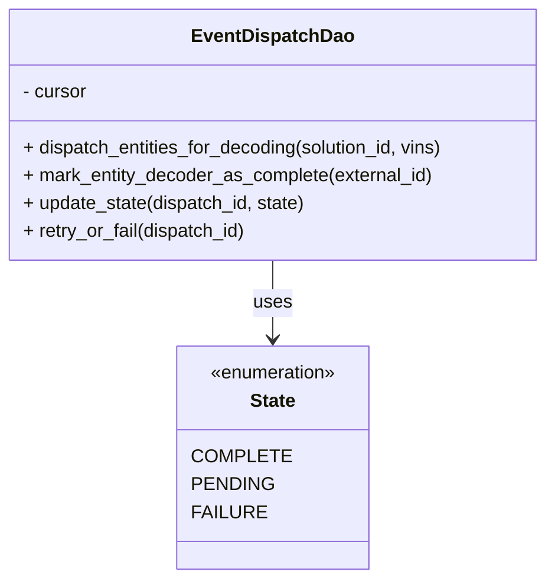
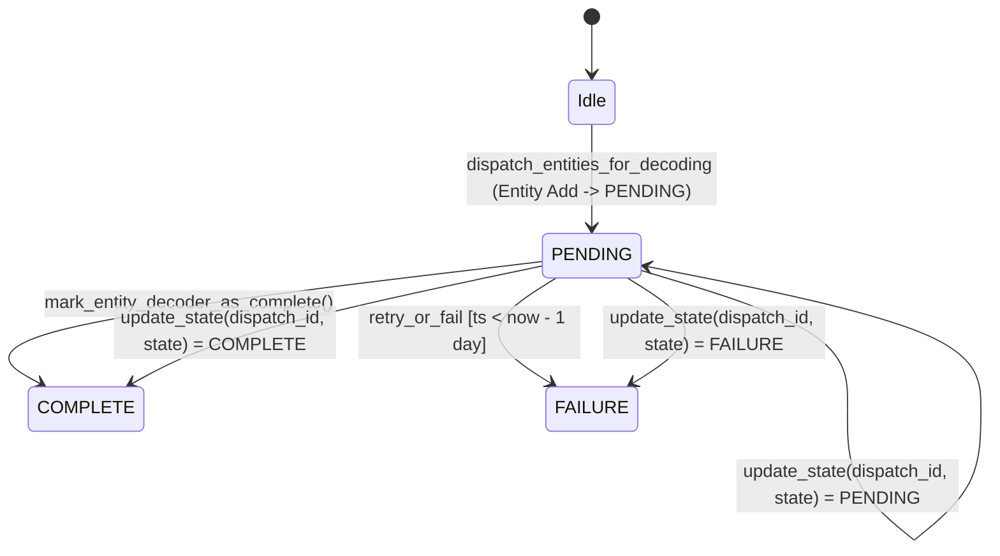

# Diagram: entity_core/entity_service/entity_service/db/event_dispatch_dao.py

> Auto-generated by Obscura crawlers

## Diagram 1

### SVG

<svg id="container" width="475.2109375" xmlns="http://www.w3.org/2000/svg" class="classDiagram" height="498" viewBox="0 0 475.2109375 498" role="graphics-document document" aria-roledescription="class"><g><defs><marker id="container_class-aggregationStart" class="marker aggregation class" refX="18" refY="7" markerWidth="190" markerHeight="240" orient="auto"><path d="M 18,7 L9,13 L1,7 L9,1 Z"></path></marker></defs><defs><marker id="container_class-aggregationEnd" class="marker aggregation class" refX="1" refY="7" markerWidth="20" markerHeight="28" orient="auto"><path d="M 18,7 L9,13 L1,7 L9,1 Z"></path></marker></defs><defs><marker id="container_class-extensionStart" class="marker extension class" refX="18" refY="7" markerWidth="190" markerHeight="240" orient="auto"><path d="M 1,7 L18,13 V 1 Z"></path></marker></defs><defs><marker id="container_class-extensionEnd" class="marker extension class" refX="1" refY="7" markerWidth="20" markerHeight="28" orient="auto"><path d="M 1,1 V 13 L18,7 Z"></path></marker></defs><defs><marker id="container_class-compositionStart" class="marker composition class" refX="18" refY="7" markerWidth="190" markerHeight="240" orient="auto"><path d="M 18,7 L9,13 L1,7 L9,1 Z"></path></marker></defs><defs><marker id="container_class-compositionEnd" class="marker composition class" refX="1" refY="7" markerWidth="20" markerHeight="28" orient="auto"><path d="M 18,7 L9,13 L1,7 L9,1 Z"></path></marker></defs><defs><marker id="container_class-dependencyStart" class="marker dependency class" refX="6" refY="7" markerWidth="190" markerHeight="240" orient="auto"><path d="M 5,7 L9,13 L1,7 L9,1 Z"></path></marker></defs><defs><marker id="container_class-dependencyEnd" class="marker dependency class" refX="13" refY="7" markerWidth="20" markerHeight="28" orient="auto"><path d="M 18,7 L9,13 L14,7 L9,1 Z"></path></marker></defs><defs><marker id="container_class-lollipopStart" class="marker lollipop class" refX="13" refY="7" markerWidth="190" markerHeight="240" orient="auto"><circle stroke="black" fill="transparent" cx="7" cy="7" r="6"></circle></marker></defs><defs><marker id="container_class-lollipopEnd" class="marker lollipop class" refX="1" refY="7" markerWidth="190" markerHeight="240" orient="auto"><circle stroke="black" fill="transparent" cx="7" cy="7" r="6"></circle></marker></defs><g class="root"><g class="clusters"></g><g class="edgePaths"><path d="M237.605,224L237.605,230.167C237.605,236.333,237.605,248.667,237.605,260C237.605,271.333,237.605,281.667,237.605,286.833L237.605,292" id="id_EventDispatchDao_State_1" class="edge-thickness-normal edge-pattern-solid relation" style=";;;" data-edge="true" data-et="edge" data-id="id_EventDispatchDao_State_1" data-points="W3sieCI6MjM3LjYwNTQ2ODc1LCJ5IjoyMjR9LHsieCI6MjM3LjYwNTQ2ODc1LCJ5IjoyNjF9LHsieCI6MjM3LjYwNTQ2ODc1LCJ5IjoyOTh9XQ==" marker-end="url(#container_class-dependencyEnd)"></path></g><g class="edgeLabels"><g class="edgeLabel" transform="translate(237.60546875, 261)"><g class="label" data-id="id_EventDispatchDao_State_1" transform="translate(-16.4921875, -12)"><foreignObject width="32.984375" height="24">

uses

</foreignObject></g></g></g><g class="nodes"><g class="node default" id="classId-EventDispatchDao-0" transform="translate(237.60546875, 116)"><g class="basic label-container"><path d="M-229.60546875 -108 L229.60546875 -108 L229.60546875 108 L-229.60546875 108" stroke="none" stroke-width="0" fill="#ECECFF" style=""></path><path d="M-229.60546875 -108 C-63.71519884605311 -108, 102.17507105789377 -108, 229.60546875 -108 M-229.60546875 -108 C-116.63377926370725 -108, -3.662089777414508 -108, 229.60546875 -108 M229.60546875 -108 C229.60546875 -52.622311767308126, 229.60546875 2.7553764653837476, 229.60546875 108 M229.60546875 -108 C229.60546875 -23.25313795363799, 229.60546875 61.49372409272402, 229.60546875 108 M229.60546875 108 C81.33265563603433 108, -66.94015747793134 108, -229.60546875 108 M229.60546875 108 C101.97266271537569 108, -25.66014331924862 108, -229.60546875 108 M-229.60546875 108 C-229.60546875 61.18360816987897, -229.60546875 14.367216339757945, -229.60546875 -108 M-229.60546875 108 C-229.60546875 62.11055898668136, -229.60546875 16.221117973362723, -229.60546875 -108" stroke="#9370DB" stroke-width="1.3" fill="none" stroke-dasharray="0 0" style=""></path></g><g class="annotation-group text" transform="translate(0, -84)"></g><g class="label-group text" transform="translate(-66.1953125, -84)"><g class="label" style="font-weight: bolder" transform="translate(0,-12)"><foreignObject width="132.390625" height="24">

EventDispatchDao

</foreignObject></g></g><g class="members-group text" transform="translate(-217.60546875, -36)"><g class="label" style="" transform="translate(0,-12)"><foreignObject width="56.421875" height="24">

- cursor

</foreignObject></g></g><g class="methods-group text" transform="translate(-217.60546875, 12)"><g class="label" style="" transform="translate(0,-12)"><foreignObject width="369.015625" height="24">

+ dispatch_entities_for_decoding(solution_id, vins)

</foreignObject></g><g class="label" style="" transform="translate(0,12)"><foreignObject width="355.9375" height="24">

+ mark_entity_decoder_as_complete(external_id)

</foreignObject></g><g class="label" style="" transform="translate(0,36)"><foreignObject width="246.78125" height="24">

+ update_state(dispatch_id, state)

</foreignObject></g><g class="label" style="" transform="translate(0,60)"><foreignObject width="194.078125" height="24">

+ retry_or_fail(dispatch_id)

</foreignObject></g></g><g class="divider" style=""><path d="M-229.60546875 -60 C-100.87069775977187 -60, 27.864073230456256 -60, 229.60546875 -60 M-229.60546875 -60 C-59.39553640081175 -60, 110.8143959483765 -60, 229.60546875 -60" stroke="#9370DB" stroke-width="1.3" fill="none" stroke-dasharray="0 0" style=""></path></g><g class="divider" style=""><path d="M-229.60546875 -12 C-88.63099041978234 -12, 52.34348791043533 -12, 229.60546875 -12 M-229.60546875 -12 C-74.14420574210615 -12, 81.3170572657877 -12, 229.60546875 -12" stroke="#9370DB" stroke-width="1.3" fill="none" stroke-dasharray="0 0" style=""></path></g></g><g class="node default" id="classId-State-1" transform="translate(237.60546875, 394)"><g class="basic label-container"><path d="M-77.13671875 -96 L77.13671875 -96 L77.13671875 96 L-77.13671875 96" stroke="none" stroke-width="0" fill="#ECECFF" style=""></path><path d="M-77.13671875 -96 C-28.567811684893684 -96, 20.001095380212632 -96, 77.13671875 -96 M-77.13671875 -96 C-42.60811856796045 -96, -8.079518385920906 -96, 77.13671875 -96 M77.13671875 -96 C77.13671875 -23.289748103147872, 77.13671875 49.420503793704256, 77.13671875 96 M77.13671875 -96 C77.13671875 -54.55410949984801, 77.13671875 -13.108218999696021, 77.13671875 96 M77.13671875 96 C38.18408334578258 96, -0.7685520584348353 96, -77.13671875 96 M77.13671875 96 C34.199527950273236 96, -8.737662849453528 96, -77.13671875 96 M-77.13671875 96 C-77.13671875 21.697839327343644, -77.13671875 -52.60432134531271, -77.13671875 -96 M-77.13671875 96 C-77.13671875 35.08743715862235, -77.13671875 -25.8251256827553, -77.13671875 -96" stroke="#9370DB" stroke-width="1.3" fill="none" stroke-dasharray="0 0" style=""></path></g><g class="annotation-group text" transform="translate(-55.5546875, -72)"><g class="label" style="" transform="translate(0,-12)"><foreignObject width="111.109375" height="24">

«enumeration»

</foreignObject></g></g><g class="label-group text" transform="translate(-19.3125, -48)"><g class="label" style="font-weight: bolder" transform="translate(0,-12)"><foreignObject width="38.625" height="24">

State

</foreignObject></g></g><g class="members-group text" transform="translate(-65.13671875, 0)"><g class="label" style="" transform="translate(0,-12)"><foreignObject width="74.71875" height="24">

COMPLETE

</foreignObject></g><g class="label" style="" transform="translate(0,12)"><foreignObject width="64.84375" height="24">

PENDING

</foreignObject></g><g class="label" style="" transform="translate(0,36)"><foreignObject width="57.359375" height="24">

FAILURE

</foreignObject></g></g><g class="methods-group text" transform="translate(-65.13671875, 96)"></g><g class="divider" style=""><path d="M-77.13671875 -24 C-45.29428280320488 -24, -13.451846856409759 -24, 77.13671875 -24 M-77.13671875 -24 C-21.404358903765214 -24, 34.32800094246957 -24, 77.13671875 -24" stroke="#9370DB" stroke-width="1.3" fill="none" stroke-dasharray="0 0" style=""></path></g><g class="divider" style=""><path d="M-77.13671875 72 C-29.90429249800013 72, 17.328133753999737 72, 77.13671875 72 M-77.13671875 72 C-37.580686342062464 72, 1.9753460658750726 72, 77.13671875 72" stroke="#9370DB" stroke-width="1.3" fill="none" stroke-dasharray="0 0" style=""></path></g></g></g></g></g></svg>

## Diagram 2

### SVG

<svg id="container" width="890.8919677734375" xmlns="http://www.w3.org/2000/svg" class="statediagram" height="494.1499938964844" viewBox="187.04605102539062 0 890.8919677734375 494.1499938964844" role="graphics-document document" aria-roledescription="stateDiagram"><g><defs><marker id="container_stateDiagram-barbEnd" refX="19" refY="7" markerWidth="20" markerHeight="14" markerUnits="userSpaceOnUse" orient="auto"><path d="M 19,7 L9,13 L14,7 L9,1 Z"></path></marker></defs><g class="root"><g class="clusters"></g><g class="edgePaths"><path d="M719.938,22L719.938,26.167C719.938,30.333,719.938,38.667,720.021,47.083C720.104,55.5,720.271,64,720.354,68.25L720.438,72.5" id="edge0" class="edge-thickness-normal edge-pattern-solid transition" style="fill:none;;;fill:none" data-edge="true" data-et="edge" data-id="edge0" data-points="W3sieCI6NzE5LjkzNzUsInkiOjIyfSx7IngiOjcxOS45Mzc1LCJ5Ijo0N30seyJ4Ijo3MjAuNDM3NSwieSI6NzIuNX1d" marker-end="url(#container_stateDiagram-barbEnd)"></path><path d="M720.438,112.5L720.354,120.583C720.271,128.667,720.104,144.833,720.104,161.167C720.104,177.5,720.271,194,720.354,202.25L720.438,210.5" id="edge1" class="edge-thickness-normal edge-pattern-solid transition" style="fill:none;;;fill:none" data-edge="true" data-et="edge" data-id="edge1" data-points="W3sieCI6NzIwLjQzNzUsInkiOjExMi41fSx7IngiOjcxOS45Mzc1LCJ5IjoxNjF9LHsieCI6NzIwLjQzNzUsInkiOjIxMC41fV0=" marker-end="url(#container_stateDiagram-barbEnd)"></path><path d="M680.016,235.301L589.841,245.917C499.667,256.534,319.318,277.767,244.079,296.633C168.839,315.5,198.71,332,213.645,340.25L228.581,348.5" id="edge2" class="edge-thickness-normal edge-pattern-solid transition" style="fill:none;;;fill:none" data-edge="true" data-et="edge" data-id="edge2" data-points="W3sieCI6NjgwLjAxNTYyNSwieSI6MjM1LjMwMDc5MDcwNTE3OTk0fSx7IngiOjEzOC45Njg3NSwieSI6Mjk5fSx7IngiOjIyOC41ODA4NDIzOTEzMDQzNCwieSI6MzQ4LjV9XQ==" marker-end="url(#container_stateDiagram-barbEnd)"></path><path d="M760.859,242.627L792.372,252.022C823.885,261.418,886.911,280.209,918.424,301.096C949.938,321.983,949.938,344.967,949.938,356.458L949.938,367.95" id="PENDING-cyclic-special-1" class="edge-thickness-normal edge-pattern-solid transition" style="fill:none;;;fill:none" data-edge="true" data-et="edge" data-id="PENDING-cyclic-special-1" data-points="W3sieCI6NzYwLjg1OTM3NSwieSI6MjQyLjYyNjU2MjV9LHsieCI6OTQ5LjkzNzUsInkiOjI5OX0seyJ4Ijo5NDkuOTM3NSwieSI6MzY3Ljk0OTk5OTk5OTI1NDk0fV0="></path><path d="M949.938,368.05L949.938,379.542C949.938,391.033,949.938,414.017,959.929,433.677C969.921,453.336,989.904,469.673,999.896,477.841L1009.887,486.009" id="PENDING-cyclic-special-mid" class="edge-thickness-normal edge-pattern-solid transition" style="fill:none;;;fill:none" data-edge="true" data-et="edge" data-id="PENDING-cyclic-special-mid" data-points="W3sieCI6OTQ5LjkzNzUsInkiOjM2OC4wNTAwMDAwMDA3NDUwNn0seyJ4Ijo5NDkuOTM3NSwieSI6NDM3fSx7IngiOjEwMDkuODg3NDk5OTk5MjU0OSwieSI6NDg2LjAwOTEyNTAwMDEzNTN9XQ=="></path><path d="M1009.988,486.009L1019.979,477.841C1029.971,469.673,1049.954,453.336,1059.946,433.668C1069.938,414,1069.938,391,1069.938,368C1069.938,345,1069.938,322,1018.424,300.411C966.911,278.823,863.885,258.646,812.372,248.557L760.859,238.469" id="PENDING-cyclic-special-2" class="edge-thickness-normal edge-pattern-solid transition" style="fill:none;;;fill:none" data-edge="true" data-et="edge" data-id="PENDING-cyclic-special-2" data-points="W3sieCI6MTAwOS45ODc1MDAwMDA3NDUxLCJ5Ijo0ODYuMDA5MTI1MDAwMTM1M30seyJ4IjoxMDY5LjkzNzUsInkiOjQzN30seyJ4IjoxMDY5LjkzNzUsInkiOjM2OH0seyJ4IjoxMDY5LjkzNzUsInkiOjI5OX0seyJ4Ijo3NjAuODU5Mzc1LCJ5IjoyMzguNDY4ODgzOTI4NTcxNDJ9XQ==" marker-end="url(#container_stateDiagram-barbEnd)"></path><path d="M688.553,250.5L675.451,258.583C662.348,266.667,636.143,282.833,636.145,299.168C636.147,315.503,662.357,332.005,675.461,340.257L688.566,348.508" id="edge4" class="edge-thickness-normal edge-pattern-solid transition" style="fill:none;;;fill:none" data-edge="true" data-et="edge" data-id="edge4" data-points="W3sieCI6Njg4LjU1MzQ0MjAyODk4NTUsInkiOjI1MC41fSx7IngiOjYwOS45Mzc1LCJ5IjoyOTl9LHsieCI6Njg4LjU2NjA4Mzk3ODc4ODcsInkiOjM0OC41MDc5Mjk5NTAzMzEyfV0=" marker-end="url(#container_stateDiagram-barbEnd)"></path><path d="M680.016,238.952L631.669,248.96C583.323,258.968,486.63,278.984,423.515,297.242C360.4,315.5,330.863,332,316.094,340.25L301.325,348.5" id="edge6" class="edge-thickness-normal edge-pattern-solid transition" style="fill:none;;;fill:none" data-edge="true" data-et="edge" data-id="edge6" data-points="W3sieCI6NjgwLjAxNTYyNSwieSI6MjM4Ljk1MTg0NjU5MDkwOTF9LHsieCI6Mzg5LjkzNzUsInkiOjI5OX0seyJ4IjozMDEuMzI1NDA3NjA4Njk1NiwieSI6MzQ4LjV9XQ==" marker-end="url(#container_stateDiagram-barbEnd)"></path><path d="M752.322,250.5L765.258,258.583C778.194,266.667,804.066,282.833,804.063,299.168C804.061,315.503,778.185,332.005,765.247,340.257L752.309,348.508" id="edge7" class="edge-thickness-normal edge-pattern-solid transition" style="fill:none;;;fill:none" data-edge="true" data-et="edge" data-id="edge7" data-points="W3sieCI6NzUyLjMyMTU1Nzk3MTAxNDUsInkiOjI1MC41fSx7IngiOjgyOS45Mzc1LCJ5IjoyOTl9LHsieCI6NzUyLjMwODkxNjAyMTE5NzEsInkiOjM0OC41MDc5Mjk5NTAzNDAwNH1d" marker-end="url(#container_stateDiagram-barbEnd)"></path></g><g class="edgeLabels"><g class="edgeLabel"><g class="label" data-id="edge0" transform="translate(0, 0)"><foreignObject width="0" height="0">

</foreignObject></g></g><g class="edgeLabel" transform="translate(719.9375, 161)"><g class="label" data-id="edge1" transform="translate(-115.5625, -24)"><foreignObject width="231.125" height="48">

dispatch_entities_for_decoding (Entity Add -&gt; PENDING)

</foreignObject></g></g><g class="edgeLabel" transform="translate(358.65595, 273.13551)"><g class="label" data-id="edge2" transform="translate(-130.96875, -12)"><foreignObject width="261.9375" height="24">

mark_entity_decoder_as_complete()

</foreignObject></g></g><g class="edgeLabel"><g class="label" data-id="PENDING-cyclic-special-1" transform="translate(0, 0)"><foreignObject width="0" height="0">

</foreignObject></g></g><g class="edgeLabel" transform="translate(949.9375, 437)"><g class="label" data-id="PENDING-cyclic-special-mid" transform="translate(-100, -24)"><foreignObject width="200" height="48">

update_state(dispatch_id, state) = PENDING

</foreignObject></g></g><g class="edgeLabel"><g class="label" data-id="PENDING-cyclic-special-2" transform="translate(0, 0)"><foreignObject width="0" height="0">

</foreignObject></g></g><g class="edgeLabel" transform="translate(609.9375, 299)"><g class="label" data-id="edge4" transform="translate(-100, -24)"><foreignObject width="200" height="48">

retry_or_fail [ts &lt; now - 1 day]

</foreignObject></g></g><g class="edgeLabel" transform="translate(485.27994, 279.26346)"><g class="label" data-id="edge6" transform="translate(-100, -24)"><foreignObject width="200" height="48">

update_state(dispatch_id, state) = COMPLETE

</foreignObject></g></g><g class="edgeLabel" transform="translate(829.9375, 299)"><g class="label" data-id="edge7" transform="translate(-100, -24)"><foreignObject width="200" height="48">

update_state(dispatch_id, state) = FAILURE

</foreignObject></g></g></g><g class="nodes"><g class="node default" id="state-root_start-0" transform="translate(719.9375, 15)"><circle class="state-start" r="7" width="14" height="14"></circle></g><g class="node  statediagram-state" id="state-Idle-1" transform="translate(719.9375, 92)"><g class="basic label-container outer-path"><path d="M-16.8125 -20 C-4.4960111358945625 -20, 7.820477728210875 -20, 16.8125 -20 C16.8125 -20, 16.8125 -20, 16.8125 -20 C16.962925855424384 -19.99377834059787, 17.11335171084877 -19.987556681195738, 17.225396727361662 -19.982922465033347 C17.343254197665622 -19.968231546680624, 17.46111166796958 -19.9535406283279, 17.63547295140367 -19.931806517013612 C17.77123479536331 -19.903340251823327, 17.90699663932295 -19.87487398663304, 18.039927435703998 -19.847001329696653 C18.171451490951576 -19.807844921925437, 18.302975546199157 -19.76868851415422, 18.435997346023417 -19.729086208503173 C18.52777581116087 -19.693274140277655, 18.61955427629832 -19.657462072052134, 18.820977123264846 -19.578866633275286 C18.955620910776094 -19.51304329646942, 19.090264698287342 -19.447219959663553, 19.19223696518537 -19.397368756032446 C19.300203632078652 -19.33303458668071, 19.408170298971935 -19.26870041732898, 19.547240790612136 -19.185832391312644 C19.646807882117486 -19.11474285437165, 19.746374973622835 -19.043653317430653, 19.88356356344834 -18.94570254698197 C19.982340657243302 -18.862042616054037, 20.08111775103826 -18.778382685126104, 20.198907858128706 -18.678619553365657 C20.28333333151168 -18.59419407998268, 20.367758804894656 -18.509768606599707, 20.491119553365657 -18.386407858128706 C20.588303727814075 -18.27166272018272, 20.685487902262494 -18.15691758223674, 20.75820254698197 -18.07106356344834 C20.835517508550755 -17.962777222243993, 20.912832470119543 -17.85449088103964, 20.998332391312644 -17.734740790612136 C21.078565932040828 -17.60009153574871, 21.158799472769008 -17.465442280885284, 21.209868756032446 -17.37973696518537 C21.27095867648087 -17.25477553559094, 21.332048596929294 -17.129814105996513, 21.391366633275286 -17.008477123264846 C21.43780799620396 -16.88945811041019, 21.484249359132633 -16.770439097555528, 21.541586208503173 -16.623497346023417 C21.579165977015617 -16.497269128693034, 21.616745745528064 -16.371040911362652, 21.659501329696653 -16.227427435703994 C21.679668554038347 -16.1312455324626, 21.699835778380038 -16.035063629221202, 21.744306517013612 -15.82297295140367 C21.75500495173577 -15.737145066291786, 21.76570338645793 -15.651317181179902, 21.795422465033347 -15.412896727361662 C21.801168005566275 -15.273982364861293, 21.806913546099207 -15.135068002360923, 21.8125 -15 C21.8125 -15, 21.8125 -15, 21.8125 -15 C21.8125 -4.385624059468382, 21.8125 6.228751881063236, 21.8125 15 C21.8125 15, 21.8125 15, 21.8125 15 C21.80648839766064 15.145347143892117, 21.800476795321284 15.290694287784232, 21.795422465033347 15.412896727361662 C21.775637066571278 15.571624517940055, 21.755851668109205 15.730352308518448, 21.744306517013612 15.822972951403669 C21.726300438517775 15.908847877486735, 21.70829436002194 15.9947228035698, 21.659501329696653 16.227427435703994 C21.62529428073521 16.34232688776172, 21.591087231773766 16.457226339819442, 21.541586208503173 16.623497346023417 C21.49608059309864 16.740118243500287, 21.45057497769411 16.85673914097716, 21.391366633275286 17.008477123264846 C21.32123180903138 17.151940199293428, 21.251096984787477 17.295403275322005, 21.209868756032446 17.379736965185366 C21.158587669622914 17.465797732427625, 21.107306583213383 17.55185849966988, 20.998332391312644 17.734740790612133 C20.93609479009179 17.821909974749225, 20.873857188870936 17.909079158886314, 20.75820254698197 18.07106356344834 C20.700495519879954 18.139198121598938, 20.64278849277794 18.20733267974953, 20.491119553365657 18.386407858128706 C20.41939255478342 18.45813485671094, 20.34766555620119 18.529861855293174, 20.198907858128706 18.678619553365657 C20.13352565873808 18.733995451509518, 20.06814345934745 18.78937134965338, 19.88356356344834 18.94570254698197 C19.791794794056624 19.011224188952916, 19.70002602466491 19.076745830923866, 19.547240790612136 19.185832391312644 C19.417360261751757 19.263224388117134, 19.287479732891377 19.340616384921624, 19.19223696518537 19.397368756032446 C19.081642434872734 19.451435127398057, 18.971047904560095 19.505501498763664, 18.820977123264846 19.578866633275286 C18.733078470603758 19.613164793974704, 18.64517981794267 19.64746295467412, 18.435997346023417 19.729086208503173 C18.328598003746116 19.76106037803934, 18.22119866146882 19.79303454757551, 18.039927435703998 19.847001329696653 C17.911788309737144 19.87386927900138, 17.78364918377029 19.900737228306106, 17.63547295140367 19.931806517013612 C17.494029881079534 19.949437377342885, 17.352586810755394 19.96706823767216, 17.225396727361662 19.982922465033347 C17.122497671585702 19.987178401461513, 17.019598615809738 19.991434337889682, 16.8125 20 C16.8125 20, 16.8125 20, 16.8125 20 C3.891309505885813 20, -9.029880988228374 20, -16.8125 20 C-16.8125 20, -16.8125 20, -16.8125 20 C-16.968822074144235 19.993534471187708, -17.12514414828847 19.987068942375416, -17.225396727361662 19.982922465033347 C-17.316203578750027 19.971603402812057, -17.40701043013839 19.960284340590768, -17.63547295140367 19.931806517013612 C-17.77258053182798 19.903058080559575, -17.90968811225229 19.874309644105537, -18.039927435703994 19.847001329696653 C-18.152509527347746 19.813484188822, -18.265091618991494 19.77996704794734, -18.435997346023417 19.729086208503173 C-18.513650106362896 19.698786007393768, -18.591302866702375 19.668485806284362, -18.820977123264846 19.578866633275286 C-18.913755691332682 19.533509955130853, -19.006534259400514 19.48815327698642, -19.19223696518537 19.397368756032446 C-19.331972337061305 19.314104547389423, -19.47170770893724 19.2308403387464, -19.547240790612133 19.185832391312644 C-19.679951377919846 19.091078853208483, -19.81266196522756 18.99632531510432, -19.88356356344834 18.94570254698197 C-19.96546836536635 18.876332718331717, -20.047373167284356 18.80696288968146, -20.198907858128706 18.67861955336566 C-20.271600814589263 18.605926596905103, -20.34429377104982 18.533233640444543, -20.491119553365657 18.386407858128706 C-20.560553268287805 18.30442762583201, -20.62998698320995 18.222447393535315, -20.758202546981966 18.07106356344834 C-20.833815465853213 17.965161081364535, -20.90942838472446 17.859258599280725, -20.998332391312644 17.734740790612133 C-21.07730426492074 17.602208886373685, -21.156276138528842 17.46967698213524, -21.209868756032446 17.37973696518537 C-21.266118168845722 17.264676952217627, -21.322367581658998 17.149616939249885, -21.391366633275286 17.00847712326485 C-21.431536062576964 16.905531698735352, -21.47170549187864 16.802586274205858, -21.541586208503173 16.623497346023417 C-21.569943954673686 16.528245355702456, -21.5983017008442 16.432993365381495, -21.659501329696653 16.227427435703994 C-21.686333269789056 16.09946004554553, -21.713165209881463 15.971492655387067, -21.744306517013612 15.82297295140367 C-21.76443509104444 15.661492044686938, -21.784563665075268 15.500011137970207, -21.795422465033347 15.412896727361664 C-21.799738791829125 15.308537567115163, -21.804055118624902 15.204178406868662, -21.8125 15 C-21.8125 15, -21.8125 15, -21.8125 15 C-21.8125 4.183015067365455, -21.8125 -6.633969865269091, -21.8125 -15 C-21.8125 -15, -21.8125 -15, -21.8125 -15 C-21.80732789004452 -15.125050089391902, -21.802155780089034 -15.250100178783805, -21.795422465033347 -15.41289672736166 C-21.78355273829131 -15.508121269042974, -21.77168301154927 -15.603345810724289, -21.744306517013612 -15.822972951403669 C-21.717174130698318 -15.952373235303453, -21.690041744383027 -16.081773519203235, -21.659501329696653 -16.227427435703994 C-21.61789688554615 -16.367174300201057, -21.576292441395644 -16.50692116469812, -21.541586208503173 -16.623497346023417 C-21.505400772387304 -16.716232671057707, -21.46921533627144 -16.808967996091994, -21.39136663327529 -17.008477123264846 C-21.33594849016223 -17.121836746882668, -21.280530347049176 -17.23519637050049, -21.209868756032446 -17.379736965185366 C-21.156770146091073 -17.468847930474947, -21.103671536149704 -17.55795889576453, -20.998332391312644 -17.734740790612133 C-20.9174919268841 -17.847964905797642, -20.83665146245556 -17.96118902098315, -20.75820254698197 -18.07106356344834 C-20.664251408258114 -18.18199146332748, -20.570300269534258 -18.29291936320662, -20.49111955336566 -18.386407858128706 C-20.43226387945786 -18.445263532036506, -20.37340820555006 -18.504119205944303, -20.198907858128706 -18.678619553365657 C-20.13033542390991 -18.73669744257966, -20.061762989691108 -18.794775331793662, -19.88356356344834 -18.945702546981966 C-19.792743941788302 -19.01054651049798, -19.70192432012826 -19.075390474014, -19.547240790612136 -19.185832391312644 C-19.418758501330252 -19.262391218172873, -19.29027621204837 -19.338950045033105, -19.192236965185366 -19.397368756032446 C-19.088111668247297 -19.448272511913444, -18.983986371309225 -19.499176267794443, -18.82097712326485 -19.578866633275286 C-18.69626147437029 -19.627530830484435, -18.571545825475727 -19.676195027693584, -18.43599734602342 -19.729086208503173 C-18.330315052546318 -19.76054919046337, -18.22463275906922 -19.79201217242357, -18.039927435703994 -19.847001329696653 C-17.922403935409637 -19.871643416367665, -17.80488043511528 -19.896285503038676, -17.635472951403674 -19.931806517013612 C-17.514159286437184 -19.946928249581738, -17.39284562147069 -19.962049982149868, -17.225396727361662 -19.982922465033347 C-17.07257292230391 -19.98924330436595, -16.919749117246155 -19.995564143698555, -16.8125 -20 C-16.8125 -20, -16.8125 -20, -16.8125 -20" stroke="none" stroke-width="0" fill="#ECECFF" style=""></path><path d="M-16.8125 -20 C-4.584158258238732 -20, 7.644183483522536 -20, 16.8125 -20 M-16.8125 -20 C-7.771167282319741 -20, 1.2701654353605178 -20, 16.8125 -20 M16.8125 -20 C16.8125 -20, 16.8125 -20, 16.8125 -20 M16.8125 -20 C16.8125 -20, 16.8125 -20, 16.8125 -20 M16.8125 -20 C16.93238118636056 -19.995041677455283, 17.052262372721117 -19.99008335491057, 17.225396727361662 -19.982922465033347 M16.8125 -20 C16.92767321962734 -19.99523640039974, 17.042846439254678 -19.990472800799484, 17.225396727361662 -19.982922465033347 M17.225396727361662 -19.982922465033347 C17.34989225195276 -19.967404114076633, 17.47438777654386 -19.95188576311992, 17.63547295140367 -19.931806517013612 M17.225396727361662 -19.982922465033347 C17.364305353058366 -19.965607522897425, 17.503213978755067 -19.9482925807615, 17.63547295140367 -19.931806517013612 M17.63547295140367 -19.931806517013612 C17.729901519868726 -19.91200692831427, 17.82433008833378 -19.892207339614927, 18.039927435703998 -19.847001329696653 M17.63547295140367 -19.931806517013612 C17.7886387839373 -19.89969101916954, 17.941804616470932 -19.867575521325467, 18.039927435703998 -19.847001329696653 M18.039927435703998 -19.847001329696653 C18.153843288726723 -19.813087110855335, 18.267759141749448 -19.77917289201402, 18.435997346023417 -19.729086208503173 M18.039927435703998 -19.847001329696653 C18.13018288587809 -19.820131117978054, 18.220438336052176 -19.79326090625945, 18.435997346023417 -19.729086208503173 M18.435997346023417 -19.729086208503173 C18.58703500597241 -19.670151130708884, 18.738072665921404 -19.611216052914596, 18.820977123264846 -19.578866633275286 M18.435997346023417 -19.729086208503173 C18.53383729735333 -19.690908941025874, 18.631677248683246 -19.652731673548576, 18.820977123264846 -19.578866633275286 M18.820977123264846 -19.578866633275286 C18.917089819830288 -19.53187999902884, 19.013202516395733 -19.484893364782394, 19.19223696518537 -19.397368756032446 M18.820977123264846 -19.578866633275286 C18.961470278706727 -19.510183714735152, 19.101963434148605 -19.441500796195022, 19.19223696518537 -19.397368756032446 M19.19223696518537 -19.397368756032446 C19.312070862574288 -19.325963252180806, 19.43190475996321 -19.254557748329166, 19.547240790612136 -19.185832391312644 M19.19223696518537 -19.397368756032446 C19.31391685035734 -19.324863282217173, 19.435596735529316 -19.2523578084019, 19.547240790612136 -19.185832391312644 M19.547240790612136 -19.185832391312644 C19.65605332643961 -19.1081417340041, 19.764865862267083 -19.030451076695556, 19.88356356344834 -18.94570254698197 M19.547240790612136 -19.185832391312644 C19.657850648497796 -19.10685847071983, 19.768460506383455 -19.027884550127016, 19.88356356344834 -18.94570254698197 M19.88356356344834 -18.94570254698197 C20.00147939888488 -18.84583292874429, 20.119395234321413 -18.745963310506607, 20.198907858128706 -18.678619553365657 M19.88356356344834 -18.94570254698197 C19.95324552824471 -18.88668493330437, 20.022927493041077 -18.827667319626773, 20.198907858128706 -18.678619553365657 M20.198907858128706 -18.678619553365657 C20.282817953938903 -18.59470945755546, 20.366728049749096 -18.510799361745267, 20.491119553365657 -18.386407858128706 M20.198907858128706 -18.678619553365657 C20.297737765890254 -18.57978964560411, 20.396567673651802 -18.48095973784256, 20.491119553365657 -18.386407858128706 M20.491119553365657 -18.386407858128706 C20.546064352403338 -18.321534656490932, 20.601009151441016 -18.256661454853155, 20.75820254698197 -18.07106356344834 M20.491119553365657 -18.386407858128706 C20.596072407520158 -18.262490257386265, 20.70102526167466 -18.138572656643824, 20.75820254698197 -18.07106356344834 M20.75820254698197 -18.07106356344834 C20.827228368686473 -17.974386884971892, 20.896254190390977 -17.877710206495443, 20.998332391312644 -17.734740790612136 M20.75820254698197 -18.07106356344834 C20.808053505467456 -18.00124295188249, 20.85790446395294 -17.931422340316633, 20.998332391312644 -17.734740790612136 M20.998332391312644 -17.734740790612136 C21.066702040144218 -17.6200017153215, 21.13507168897579 -17.505262640030864, 21.209868756032446 -17.37973696518537 M20.998332391312644 -17.734740790612136 C21.081991683709358 -17.594342382647298, 21.16565097610607 -17.45394397468246, 21.209868756032446 -17.37973696518537 M21.209868756032446 -17.37973696518537 C21.265668884604235 -17.265595977822805, 21.321469013176024 -17.15145499046024, 21.391366633275286 -17.008477123264846 M21.209868756032446 -17.37973696518537 C21.255086606644213 -17.28724237337453, 21.300304457255983 -17.194747781563684, 21.391366633275286 -17.008477123264846 M21.391366633275286 -17.008477123264846 C21.441076879593197 -16.88108068025764, 21.490787125911112 -16.753684237250432, 21.541586208503173 -16.623497346023417 M21.391366633275286 -17.008477123264846 C21.447022211032138 -16.865844101605905, 21.50267778878899 -16.723211079946964, 21.541586208503173 -16.623497346023417 M21.541586208503173 -16.623497346023417 C21.580504097172906 -16.492774462314973, 21.61942198584264 -16.362051578606533, 21.659501329696653 -16.227427435703994 M21.541586208503173 -16.623497346023417 C21.572358198320067 -16.520136054241934, 21.603130188136966 -16.416774762460452, 21.659501329696653 -16.227427435703994 M21.659501329696653 -16.227427435703994 C21.690413063958964 -16.080002614941986, 21.721324798221275 -15.932577794179977, 21.744306517013612 -15.82297295140367 M21.659501329696653 -16.227427435703994 C21.69256321751452 -16.069748062419983, 21.72562510533239 -15.91206868913597, 21.744306517013612 -15.82297295140367 M21.744306517013612 -15.82297295140367 C21.75661229875025 -15.724250171059298, 21.768918080486895 -15.625527390714925, 21.795422465033347 -15.412896727361662 M21.744306517013612 -15.82297295140367 C21.760793579436218 -15.690705966915836, 21.777280641858823 -15.558438982428003, 21.795422465033347 -15.412896727361662 M21.795422465033347 -15.412896727361662 C21.79977590386964 -15.307640280703213, 21.804129342705938 -15.202383834044765, 21.8125 -15 M21.795422465033347 -15.412896727361662 C21.800029339183368 -15.30151277975885, 21.80463621333339 -15.190128832156038, 21.8125 -15 M21.8125 -15 C21.8125 -15, 21.8125 -15, 21.8125 -15 M21.8125 -15 C21.8125 -15, 21.8125 -15, 21.8125 -15 M21.8125 -15 C21.8125 -3.2061155402605, 21.8125 8.587768919479, 21.8125 15 M21.8125 -15 C21.8125 -6.2630130691411505, 21.8125 2.473973861717699, 21.8125 15 M21.8125 15 C21.8125 15, 21.8125 15, 21.8125 15 M21.8125 15 C21.8125 15, 21.8125 15, 21.8125 15 M21.8125 15 C21.807149926204854 15.129352858329515, 21.80179985240971 15.258705716659028, 21.795422465033347 15.412896727361662 M21.8125 15 C21.808148301946257 15.105214358416807, 21.80379660389251 15.210428716833615, 21.795422465033347 15.412896727361662 M21.795422465033347 15.412896727361662 C21.777493967551564 15.556727583188463, 21.759565470069777 15.700558439015266, 21.744306517013612 15.822972951403669 M21.795422465033347 15.412896727361662 C21.7839758534035 15.50472684021471, 21.772529241773654 15.59655695306776, 21.744306517013612 15.822972951403669 M21.744306517013612 15.822972951403669 C21.716575661433904 15.955227466104267, 21.688844805854195 16.087481980804863, 21.659501329696653 16.227427435703994 M21.744306517013612 15.822972951403669 C21.71586738729155 15.95860538038113, 21.687428257569483 16.09423780935859, 21.659501329696653 16.227427435703994 M21.659501329696653 16.227427435703994 C21.629764087611935 16.327313071120635, 21.600026845527218 16.42719870653728, 21.541586208503173 16.623497346023417 M21.659501329696653 16.227427435703994 C21.618910605071513 16.36376927633782, 21.578319880446372 16.500111116971645, 21.541586208503173 16.623497346023417 M21.541586208503173 16.623497346023417 C21.49594345799147 16.74046969065976, 21.450300707479766 16.857442035296106, 21.391366633275286 17.008477123264846 M21.541586208503173 16.623497346023417 C21.488951265906408 16.75838914321615, 21.43631632330964 16.893280940408882, 21.391366633275286 17.008477123264846 M21.391366633275286 17.008477123264846 C21.32797865835018 17.13813929842555, 21.264590683425073 17.26780147358625, 21.209868756032446 17.379736965185366 M21.391366633275286 17.008477123264846 C21.344003982810197 17.105358973299268, 21.296641332345104 17.202240823333685, 21.209868756032446 17.379736965185366 M21.209868756032446 17.379736965185366 C21.15887070913955 17.465322730830216, 21.10787266224665 17.550908496475063, 20.998332391312644 17.734740790612133 M21.209868756032446 17.379736965185366 C21.165908497157027 17.453511798596143, 21.121948238281608 17.52728663200692, 20.998332391312644 17.734740790612133 M20.998332391312644 17.734740790612133 C20.943025538733572 17.812202857303944, 20.8877186861545 17.889664923995756, 20.75820254698197 18.07106356344834 M20.998332391312644 17.734740790612133 C20.924157632658485 17.83862900398502, 20.849982874004326 17.942517217357906, 20.75820254698197 18.07106356344834 M20.75820254698197 18.07106356344834 C20.699074759070953 18.1408756107163, 20.639946971159937 18.210687657984256, 20.491119553365657 18.386407858128706 M20.75820254698197 18.07106356344834 C20.652334561954447 18.196061657170834, 20.546466576926925 18.321059750893326, 20.491119553365657 18.386407858128706 M20.491119553365657 18.386407858128706 C20.38382185140988 18.493705560084482, 20.276524149454108 18.601003262040255, 20.198907858128706 18.678619553365657 M20.491119553365657 18.386407858128706 C20.417941022709968 18.459586388784395, 20.344762492054283 18.53276491944008, 20.198907858128706 18.678619553365657 M20.198907858128706 18.678619553365657 C20.121469189275416 18.74420676026269, 20.044030520422123 18.80979396715972, 19.88356356344834 18.94570254698197 M20.198907858128706 18.678619553365657 C20.088013300445322 18.772542452690207, 19.977118742761938 18.866465352014757, 19.88356356344834 18.94570254698197 M19.88356356344834 18.94570254698197 C19.763210549920576 19.031632946994534, 19.642857536392807 19.1175633470071, 19.547240790612136 19.185832391312644 M19.88356356344834 18.94570254698197 C19.770425424774153 19.026481625361317, 19.657287286099965 19.10726070374066, 19.547240790612136 19.185832391312644 M19.547240790612136 19.185832391312644 C19.44525853980003 19.246600622688188, 19.34327628898792 19.30736885406373, 19.19223696518537 19.397368756032446 M19.547240790612136 19.185832391312644 C19.41163355023539 19.266636767503513, 19.27602630985864 19.34744114369438, 19.19223696518537 19.397368756032446 M19.19223696518537 19.397368756032446 C19.062232757634998 19.460923940404047, 18.932228550084627 19.524479124775645, 18.820977123264846 19.578866633275286 M19.19223696518537 19.397368756032446 C19.066872566876572 19.45865567588128, 18.941508168567772 19.519942595730107, 18.820977123264846 19.578866633275286 M18.820977123264846 19.578866633275286 C18.68578902360851 19.631617193452126, 18.550600923952175 19.684367753628962, 18.435997346023417 19.729086208503173 M18.820977123264846 19.578866633275286 C18.682339771301674 19.63296309587874, 18.543702419338498 19.687059558482193, 18.435997346023417 19.729086208503173 M18.435997346023417 19.729086208503173 C18.34997580100679 19.754695932043408, 18.26395425599016 19.780305655583643, 18.039927435703998 19.847001329696653 M18.435997346023417 19.729086208503173 C18.312552011694226 19.765837476849857, 18.18910667736504 19.80258874519654, 18.039927435703998 19.847001329696653 M18.039927435703998 19.847001329696653 C17.951359051409536 19.865572166989867, 17.86279066711508 19.884143004283082, 17.63547295140367 19.931806517013612 M18.039927435703998 19.847001329696653 C17.913561086421733 19.873497566819555, 17.787194737139465 19.899993803942458, 17.63547295140367 19.931806517013612 M17.63547295140367 19.931806517013612 C17.490704206349562 19.949851922265662, 17.345935461295458 19.96789732751771, 17.225396727361662 19.982922465033347 M17.63547295140367 19.931806517013612 C17.54552071566052 19.94301905150582, 17.45556847991737 19.95423158599803, 17.225396727361662 19.982922465033347 M17.225396727361662 19.982922465033347 C17.06845249887101 19.98941372633975, 16.91150827038036 19.995904987646153, 16.8125 20 M17.225396727361662 19.982922465033347 C17.065785921966448 19.989524016776343, 16.90617511657123 19.996125568519343, 16.8125 20 M16.8125 20 C16.8125 20, 16.8125 20, 16.8125 20 M16.8125 20 C16.8125 20, 16.8125 20, 16.8125 20 M16.8125 20 C6.791668736700801 20, -3.2291625265983974 20, -16.8125 20 M16.8125 20 C5.5437657601029855 20, -5.724968479794029 20, -16.8125 20 M-16.8125 20 C-16.8125 20, -16.8125 20, -16.8125 20 M-16.8125 20 C-16.8125 20, -16.8125 20, -16.8125 20 M-16.8125 20 C-16.97203165411993 19.993401721977964, -17.13156330823986 19.986803443955928, -17.225396727361662 19.982922465033347 M-16.8125 20 C-16.93913095550684 19.99476250493835, -17.06576191101368 19.989525009876697, -17.225396727361662 19.982922465033347 M-17.225396727361662 19.982922465033347 C-17.35148704198738 19.96720532370613, -17.477577356613097 19.95148818237891, -17.63547295140367 19.931806517013612 M-17.225396727361662 19.982922465033347 C-17.349338558384684 19.967473131907916, -17.4732803894077 19.952023798782488, -17.63547295140367 19.931806517013612 M-17.63547295140367 19.931806517013612 C-17.7633029489832 19.905003385115563, -17.891132946562728 19.878200253217518, -18.039927435703994 19.847001329696653 M-17.63547295140367 19.931806517013612 C-17.75175121288646 19.907425529464426, -17.868029474369248 19.883044541915243, -18.039927435703994 19.847001329696653 M-18.039927435703994 19.847001329696653 C-18.147988767017207 19.81483007748552, -18.256050098330423 19.78265882527439, -18.435997346023417 19.729086208503173 M-18.039927435703994 19.847001329696653 C-18.147535131876595 19.814965130518306, -18.25514282804919 19.78292893133996, -18.435997346023417 19.729086208503173 M-18.435997346023417 19.729086208503173 C-18.558148930858355 19.681422512194754, -18.680300515693293 19.63375881588634, -18.820977123264846 19.578866633275286 M-18.435997346023417 19.729086208503173 C-18.517909149276306 19.697124123691943, -18.599820952529196 19.665162038880712, -18.820977123264846 19.578866633275286 M-18.820977123264846 19.578866633275286 C-18.96694700928858 19.5075063043002, -19.112916895312317 19.43614597532511, -19.19223696518537 19.397368756032446 M-18.820977123264846 19.578866633275286 C-18.93286532906808 19.524167822499667, -19.04475353487131 19.469469011724048, -19.19223696518537 19.397368756032446 M-19.19223696518537 19.397368756032446 C-19.265192845322535 19.353896487386898, -19.3381487254597 19.31042421874135, -19.547240790612133 19.185832391312644 M-19.19223696518537 19.397368756032446 C-19.31508265460099 19.324168613669926, -19.437928344016605 19.25096847130741, -19.547240790612133 19.185832391312644 M-19.547240790612133 19.185832391312644 C-19.652645811945664 19.110574652590266, -19.7580508332792 19.03531691386789, -19.88356356344834 18.94570254698197 M-19.547240790612133 19.185832391312644 C-19.630958200773012 19.12605930934091, -19.71467561093389 19.06628622736918, -19.88356356344834 18.94570254698197 M-19.88356356344834 18.94570254698197 C-19.98447830787188 18.860232118325627, -20.085393052295416 18.774761689669283, -20.198907858128706 18.67861955336566 M-19.88356356344834 18.94570254698197 C-19.96387643739142 18.877681012549616, -20.0441893113345 18.80965947811726, -20.198907858128706 18.67861955336566 M-20.198907858128706 18.67861955336566 C-20.294028805134595 18.583498606359772, -20.38914975214048 18.488377659353883, -20.491119553365657 18.386407858128706 M-20.198907858128706 18.67861955336566 C-20.29414338220001 18.583384029294358, -20.38937890627131 18.488148505223055, -20.491119553365657 18.386407858128706 M-20.491119553365657 18.386407858128706 C-20.56835423579765 18.295217040897686, -20.645588918229638 18.204026223666666, -20.758202546981966 18.07106356344834 M-20.491119553365657 18.386407858128706 C-20.565437738388457 18.29866054288179, -20.639755923411258 18.210913227634876, -20.758202546981966 18.07106356344834 M-20.758202546981966 18.07106356344834 C-20.835394491531293 17.962949518299926, -20.91258643608062 17.854835473151514, -20.998332391312644 17.734740790612133 M-20.758202546981966 18.07106356344834 C-20.82976673835458 17.970831677048274, -20.901330929727195 17.870599790648203, -20.998332391312644 17.734740790612133 M-20.998332391312644 17.734740790612133 C-21.050648583740063 17.64694289133322, -21.10296477616748 17.55914499205431, -21.209868756032446 17.37973696518537 M-20.998332391312644 17.734740790612133 C-21.051003809646275 17.64634674534308, -21.10367522797991 17.55795270007403, -21.209868756032446 17.37973696518537 M-21.209868756032446 17.37973696518537 C-21.27088786669537 17.254920379322286, -21.331906977358297 17.130103793459202, -21.391366633275286 17.00847712326485 M-21.209868756032446 17.37973696518537 C-21.275998232974082 17.244466958017245, -21.34212770991572 17.109196950849118, -21.391366633275286 17.00847712326485 M-21.391366633275286 17.00847712326485 C-21.43735673465646 16.89061459464182, -21.483346836037637 16.772752066018796, -21.541586208503173 16.623497346023417 M-21.391366633275286 17.00847712326485 C-21.439953823287038 16.883958826903434, -21.488541013298793 16.75944053054202, -21.541586208503173 16.623497346023417 M-21.541586208503173 16.623497346023417 C-21.586205205612064 16.47362477663121, -21.63082420272095 16.323752207239, -21.659501329696653 16.227427435703994 M-21.541586208503173 16.623497346023417 C-21.58373711890019 16.481914933760656, -21.625888029297208 16.340332521497896, -21.659501329696653 16.227427435703994 M-21.659501329696653 16.227427435703994 C-21.678096116152606 16.138744832615, -21.696690902608562 16.05006222952601, -21.744306517013612 15.82297295140367 M-21.659501329696653 16.227427435703994 C-21.676912763476547 16.14438850031368, -21.694324197256442 16.061349564923365, -21.744306517013612 15.82297295140367 M-21.744306517013612 15.82297295140367 C-21.75596301206782 15.72945905481022, -21.767619507122028 15.635945158216769, -21.795422465033347 15.412896727361664 M-21.744306517013612 15.82297295140367 C-21.756638315597826 15.724041451647299, -21.76897011418204 15.625109951890925, -21.795422465033347 15.412896727361664 M-21.795422465033347 15.412896727361664 C-21.80172146802768 15.260600876287146, -21.80802047102201 15.10830502521263, -21.8125 15 M-21.795422465033347 15.412896727361664 C-21.799744606894247 15.30839697180307, -21.804066748755147 15.203897216244478, -21.8125 15 M-21.8125 15 C-21.8125 15, -21.8125 15, -21.8125 15 M-21.8125 15 C-21.8125 15, -21.8125 15, -21.8125 15 M-21.8125 15 C-21.8125 7.155311273221606, -21.8125 -0.6893774535567871, -21.8125 -15 M-21.8125 15 C-21.8125 4.017619624643125, -21.8125 -6.964760750713751, -21.8125 -15 M-21.8125 -15 C-21.8125 -15, -21.8125 -15, -21.8125 -15 M-21.8125 -15 C-21.8125 -15, -21.8125 -15, -21.8125 -15 M-21.8125 -15 C-21.80812692835837 -15.105731124127304, -21.80375385671674 -15.211462248254607, -21.795422465033347 -15.41289672736166 M-21.8125 -15 C-21.806896945829784 -15.135469359871308, -21.80129389165957 -15.270938719742617, -21.795422465033347 -15.41289672736166 M-21.795422465033347 -15.41289672736166 C-21.78319636584145 -15.5109802567807, -21.770970266649556 -15.60906378619974, -21.744306517013612 -15.822972951403669 M-21.795422465033347 -15.41289672736166 C-21.779316612544758 -15.542105466108874, -21.763210760056168 -15.671314204856085, -21.744306517013612 -15.822972951403669 M-21.744306517013612 -15.822972951403669 C-21.71276099713539 -15.973420434370079, -21.68121547725717 -16.12386791733649, -21.659501329696653 -16.227427435703994 M-21.744306517013612 -15.822972951403669 C-21.71440155874994 -15.965596237257051, -21.684496600486266 -16.10821952311043, -21.659501329696653 -16.227427435703994 M-21.659501329696653 -16.227427435703994 C-21.62118308206777 -16.35613616066105, -21.582864834438883 -16.484844885618106, -21.541586208503173 -16.623497346023417 M-21.659501329696653 -16.227427435703994 C-21.616989418796795 -16.37022242728091, -21.574477507896937 -16.513017418857828, -21.541586208503173 -16.623497346023417 M-21.541586208503173 -16.623497346023417 C-21.497351028432995 -16.73686239677541, -21.453115848362813 -16.850227447527406, -21.39136663327529 -17.008477123264846 M-21.541586208503173 -16.623497346023417 C-21.505748813253792 -16.715340718760228, -21.46991141800441 -16.80718409149704, -21.39136663327529 -17.008477123264846 M-21.39136663327529 -17.008477123264846 C-21.324651865913555 -17.144944361123176, -21.257937098551825 -17.281411598981506, -21.209868756032446 -17.379736965185366 M-21.39136663327529 -17.008477123264846 C-21.34785048101356 -17.09749083546415, -21.304334328751832 -17.186504547663453, -21.209868756032446 -17.379736965185366 M-21.209868756032446 -17.379736965185366 C-21.135702928884417 -17.504203282777457, -21.061537101736384 -17.628669600369545, -20.998332391312644 -17.734740790612133 M-21.209868756032446 -17.379736965185366 C-21.157217464834055 -17.468097232763217, -21.10456617363566 -17.556457500341068, -20.998332391312644 -17.734740790612133 M-20.998332391312644 -17.734740790612133 C-20.927463543940966 -17.833998787143905, -20.85659469656929 -17.933256783675674, -20.75820254698197 -18.07106356344834 M-20.998332391312644 -17.734740790612133 C-20.921522523311214 -17.842319704259577, -20.844712655309785 -17.94989861790702, -20.75820254698197 -18.07106356344834 M-20.75820254698197 -18.07106356344834 C-20.656463911970405 -18.191186142819888, -20.55472527695884 -18.31130872219143, -20.49111955336566 -18.386407858128706 M-20.75820254698197 -18.07106356344834 C-20.695798230268554 -18.144744200963107, -20.633393913555143 -18.218424838477873, -20.49111955336566 -18.386407858128706 M-20.49111955336566 -18.386407858128706 C-20.42031005915666 -18.457217352337707, -20.349500564947657 -18.528026846546705, -20.198907858128706 -18.678619553365657 M-20.49111955336566 -18.386407858128706 C-20.38500028880641 -18.492527122687953, -20.278881024247163 -18.598646387247204, -20.198907858128706 -18.678619553365657 M-20.198907858128706 -18.678619553365657 C-20.1335336712474 -18.733988665260288, -20.068159484366095 -18.789357777154923, -19.88356356344834 -18.945702546981966 M-20.198907858128706 -18.678619553365657 C-20.1276473529887 -18.738974122515845, -20.056386847848696 -18.79932869166603, -19.88356356344834 -18.945702546981966 M-19.88356356344834 -18.945702546981966 C-19.811156517418002 -18.997400184180556, -19.738749471387663 -19.049097821379146, -19.547240790612136 -19.185832391312644 M-19.88356356344834 -18.945702546981966 C-19.804718455097248 -19.001996872325805, -19.725873346746152 -19.058291197669647, -19.547240790612136 -19.185832391312644 M-19.547240790612136 -19.185832391312644 C-19.443057870464173 -19.247911936983737, -19.33887495031621 -19.309991482654826, -19.192236965185366 -19.397368756032446 M-19.547240790612136 -19.185832391312644 C-19.446534312682186 -19.245840427055434, -19.34582783475223 -19.305848462798224, -19.192236965185366 -19.397368756032446 M-19.192236965185366 -19.397368756032446 C-19.07097536061386 -19.456649942241377, -18.949713756042357 -19.51593112845031, -18.82097712326485 -19.578866633275286 M-19.192236965185366 -19.397368756032446 C-19.0838742271261 -19.45034407064832, -18.97551148906683 -19.503319385264195, -18.82097712326485 -19.578866633275286 M-18.82097712326485 -19.578866633275286 C-18.72428959875266 -19.616594222412907, -18.627602074240468 -19.654321811550528, -18.43599734602342 -19.729086208503173 M-18.82097712326485 -19.578866633275286 C-18.673877264425762 -19.63626517630845, -18.52677740558667 -19.693663719341615, -18.43599734602342 -19.729086208503173 M-18.43599734602342 -19.729086208503173 C-18.323106733395417 -19.76269520005444, -18.210216120767413 -19.79630419160571, -18.039927435703994 -19.847001329696653 M-18.43599734602342 -19.729086208503173 C-18.34758443121425 -19.755407873676837, -18.259171516405086 -19.781729538850506, -18.039927435703994 -19.847001329696653 M-18.039927435703994 -19.847001329696653 C-17.955169343216035 -19.864773232813278, -17.87041125072808 -19.882545135929902, -17.635472951403674 -19.931806517013612 M-18.039927435703994 -19.847001329696653 C-17.955877121172726 -19.86462482738195, -17.871826806641458 -19.88224832506724, -17.635472951403674 -19.931806517013612 M-17.635472951403674 -19.931806517013612 C-17.528883850628684 -19.945092834569362, -17.422294749853695 -19.95837915212511, -17.225396727361662 -19.982922465033347 M-17.635472951403674 -19.931806517013612 C-17.48570867132885 -19.950474615056606, -17.335944391254028 -19.969142713099604, -17.225396727361662 -19.982922465033347 M-17.225396727361662 -19.982922465033347 C-17.06141416214372 -19.989704834100124, -16.897431596925777 -19.9964872031669, -16.8125 -20 M-17.225396727361662 -19.982922465033347 C-17.136089299702707 -19.986616247564328, -17.046781872043752 -19.99031003009531, -16.8125 -20 M-16.8125 -20 C-16.8125 -20, -16.8125 -20, -16.8125 -20 M-16.8125 -20 C-16.8125 -20, -16.8125 -20, -16.8125 -20" stroke="#9370DB" stroke-width="1.3" fill="none" stroke-dasharray="0 0" style=""></path></g><g class="label" style="" transform="translate(-13.8125, -12)"><rect></rect><foreignObject width="27.625" height="24">

Idle

</foreignObject></g></g><g class="node  statediagram-state" id="state-PENDING-7" transform="translate(719.9375, 230)"><g class="basic label-container outer-path"><path d="M-35.421875 -20 C-14.667720878799134 -20, 6.086433242401732 -20, 35.421875 -20 C35.421875 -20, 35.421875 -20, 35.421875 -20 C35.56505572810076 -19.994078001280574, 35.70823645620151 -19.988156002561144, 35.83477172736166 -19.982922465033347 C35.933784984396176 -19.97058047541504, 36.03279824143068 -19.958238485796734, 36.24484795140367 -19.931806517013612 C36.394112231143 -19.900509088763005, 36.54337651088233 -19.869211660512402, 36.649302435703994 -19.847001329696653 C36.80134174297271 -19.801737266773255, 36.95338105024142 -19.756473203849858, 37.04537234602342 -19.729086208503173 C37.132733196083635 -19.694997899029808, 37.22009404614384 -19.660909589556447, 37.430352123264846 -19.578866633275286 C37.521876839771004 -19.53412292580833, 37.61340155627717 -19.48937921834137, 37.801611965185366 -19.397368756032446 C37.92331857736543 -19.32484735637715, 38.0450251895455 -19.252325956721855, 38.156615790612136 -19.185832391312644 C38.25758714392058 -19.11374023071541, 38.35855849722902 -19.041648070118182, 38.49293856344834 -18.94570254698197 C38.59917152605732 -18.855727817288212, 38.70540448866629 -18.765753087594454, 38.808282858128706 -18.678619553365657 C38.91013183822348 -18.576770573270885, 39.01198081831825 -18.474921593176113, 39.10049455336566 -18.386407858128706 C39.18887189305504 -18.282060930334005, 39.27724923274442 -18.177714002539304, 39.36757754698197 -18.07106356344834 C39.45807521562891 -17.944313692188533, 39.54857288427585 -17.817563820928726, 39.607707391312644 -17.734740790612136 C39.65231089957781 -17.659886445438133, 39.69691440784299 -17.58503210026413, 39.81924375603245 -17.37973696518537 C39.888041066126995 -17.239009818078934, 39.95683837622154 -17.0982826709725, 40.00074163327529 -17.008477123264846 C40.046332147767835 -16.89163864807254, 40.09192266226038 -16.774800172880234, 40.150961208503176 -16.623497346023417 C40.18031273686958 -16.524907300148428, 40.209664265235986 -16.42631725427344, 40.26887632969665 -16.227427435703994 C40.299167616019034 -16.082961666852825, 40.329458902341415 -15.938495898001653, 40.35368151701361 -15.82297295140367 C40.37377008869425 -15.661812962391744, 40.393858660374896 -15.500652973379818, 40.40479746503335 -15.412896727361662 C40.41028509640859 -15.280218033379706, 40.41577272778384 -15.14753933939775, 40.421875 -15 C40.421875 -15, 40.421875 -15, 40.421875 -15 C40.421875 -5.925116150730375, 40.421875 3.14976769853925, 40.421875 15 C40.421875 15, 40.421875 15, 40.421875 15 C40.41577730951094 15.14742856344977, 40.40967961902188 15.294857126899538, 40.40479746503335 15.412896727361662 C40.38832285445715 15.545063817269533, 40.37184824388095 15.677230907177403, 40.35368151701361 15.822972951403669 C40.33586756123886 15.907931602214708, 40.31805360546411 15.992890253025747, 40.26887632969665 16.227427435703994 C40.22546069320475 16.373257988034865, 40.18204505671286 16.519088540365736, 40.150961208503176 16.623497346023417 C40.113861340891646 16.718576158136322, 40.07676147328012 16.813654970249228, 40.00074163327529 17.008477123264846 C39.961023805087365 17.08972123938608, 39.92130597689945 17.170965355507313, 39.81924375603245 17.379736965185366 C39.76203929773247 17.475738433088335, 39.704834839432486 17.5717399009913, 39.607707391312644 17.734740790612133 C39.555217513856455 17.80825743816215, 39.50272763640026 17.881774085712173, 39.36757754698197 18.07106356344834 C39.30156384644874 18.149005792386355, 39.23555014591551 18.226948021324368, 39.10049455336566 18.386407858128706 C39.01825983122188 18.46864258027248, 38.93602510907811 18.550877302416254, 38.808282858128706 18.678619553365657 C38.69035249557288 18.778501475445754, 38.57242213301706 18.878383397525848, 38.49293856344834 18.94570254698197 C38.40181082185199 19.010766503904076, 38.31068308025563 19.075830460826186, 38.156615790612136 19.185832391312644 C38.02226421000561 19.2658885566841, 37.88791262939908 19.345944722055552, 37.801611965185366 19.397368756032446 C37.669193172519016 19.46210435913909, 37.536774379852666 19.526839962245734, 37.430352123264846 19.578866633275286 C37.30370159135303 19.628285824180598, 37.17705105944122 19.67770501508591, 37.04537234602342 19.729086208503173 C36.95456278478307 19.756121386233655, 36.86375322354273 19.783156563964138, 36.649302435703994 19.847001329696653 C36.52068978799657 19.873968566069436, 36.39207714028914 19.900935802442216, 36.24484795140367 19.931806517013612 C36.14921090693697 19.943727662174226, 36.05357386247027 19.95564880733484, 35.83477172736166 19.982922465033347 C35.704373211765045 19.988315787532972, 35.57397469616843 19.993709110032597, 35.421875 20 C35.421875 20, 35.421875 20, 35.421875 20 C12.782430903062814 20, -9.857013193874373 20, -35.421875 20 C-35.421875 20, -35.421875 20, -35.421875 20 C-35.50448821422797 19.996583092184576, -35.587101428455945 19.993166184369148, -35.83477172736166 19.982922465033347 C-35.962261191636436 19.967030919884255, -36.08975065591121 19.95113937473516, -36.24484795140367 19.931806517013612 C-36.39916304144258 19.8994500452113, -36.55347813148148 19.867093573408987, -36.649302435703994 19.847001329696653 C-36.74764022949148 19.817724900030488, -36.84597802327897 19.788448470364322, -37.04537234602342 19.729086208503173 C-37.139964024148924 19.692176421163367, -37.23455570227443 19.655266633823565, -37.430352123264846 19.578866633275286 C-37.57847455731672 19.50645398769157, -37.72659699136859 19.434041342107854, -37.801611965185366 19.397368756032446 C-37.90774361577657 19.334128019060707, -38.013875266367776 19.270887282088967, -38.156615790612136 19.185832391312644 C-38.259483993219646 19.112385906347, -38.36235219582715 19.03893942138136, -38.49293856344834 18.94570254698197 C-38.562569162549444 18.886728437829085, -38.63219976165055 18.827754328676196, -38.808282858128706 18.67861955336566 C-38.897530873184735 18.58937153830963, -38.986778888240764 18.500123523253603, -39.10049455336566 18.386407858128706 C-39.19374649885975 18.276305494135993, -39.28699844435384 18.16620313014328, -39.36757754698197 18.07106356344834 C-39.44902115589784 17.956994691847967, -39.530464764813715 17.84292582024759, -39.607707391312644 17.734740790612133 C-39.656979850527534 17.652050934744373, -39.706252309742425 17.569361078876614, -39.81924375603244 17.37973696518537 C-39.8876266771008 17.239857464380343, -39.956009598169146 17.09997796357532, -40.00074163327528 17.00847712326485 C-40.054330088366356 16.871141682977676, -40.10791854345744 16.733806242690502, -40.150961208503176 16.623497346023417 C-40.18136723821834 16.52136529255509, -40.211773267933516 16.419233239086758, -40.26887632969665 16.227427435703994 C-40.2945786404639 16.10484749483506, -40.32028095123114 15.982267553966128, -40.35368151701361 15.82297295140367 C-40.36955028203039 15.695666240085755, -40.385419047047165 15.56835952876784, -40.40479746503335 15.412896727361664 C-40.40919173526826 15.306653068503424, -40.41358600550316 15.200409409645186, -40.421875 15 C-40.421875 15, -40.421875 15, -40.421875 15 C-40.421875 6.130960634306501, -40.421875 -2.7380787313869988, -40.421875 -15 C-40.421875 -15, -40.421875 -15, -40.421875 -15 C-40.41681579231579 -15.12232036414701, -40.411756584631576 -15.244640728294018, -40.40479746503335 -15.41289672736166 C-40.38552304282577 -15.56752522562263, -40.36624862061818 -15.722153723883599, -40.35368151701361 -15.822972951403669 C-40.33058913465918 -15.933105572908538, -40.30749675230474 -16.043238194413405, -40.26887632969665 -16.227427435703994 C-40.23734477657 -16.33334005566913, -40.205813223443336 -16.439252675634265, -40.150961208503176 -16.623497346023417 C-40.102282233439276 -16.74825086731392, -40.05360325837537 -16.87300438860442, -40.00074163327529 -17.008477123264846 C-39.9518141002046 -17.108559991832404, -39.902886567133905 -17.208642860399966, -39.81924375603245 -17.379736965185366 C-39.742942070516975 -17.50778771561016, -39.6666403850015 -17.63583846603495, -39.607707391312644 -17.734740790612133 C-39.518217527519425 -17.86007914335026, -39.42872766372621 -17.985417496088385, -39.36757754698197 -18.07106356344834 C-39.30785384635085 -18.141579203535393, -39.24813014571974 -18.212094843622445, -39.10049455336566 -18.386407858128706 C-39.00465728082221 -18.482245130672155, -38.90882000827876 -18.5780824032156, -38.808282858128706 -18.678619553365657 C-38.72296949341101 -18.7508762874454, -38.63765612869331 -18.823133021525145, -38.49293856344834 -18.945702546981966 C-38.36255179857666 -19.038796907757426, -38.23216503370499 -19.131891268532886, -38.156615790612136 -19.185832391312644 C-38.0624615249417 -19.24193615599417, -37.96830725927128 -19.298039920675695, -37.801611965185366 -19.397368756032446 C-37.712653557637694 -19.440857871497467, -37.623695150090015 -19.484346986962485, -37.430352123264846 -19.578866633275286 C-37.343934982185075 -19.612586706361803, -37.2575178411053 -19.64630677944832, -37.04537234602342 -19.729086208503173 C-36.9597419587134 -19.75457947934862, -36.874111571403375 -19.780072750194073, -36.649302435703994 -19.847001329696653 C-36.51460876315526 -19.875243622894775, -36.379915090606524 -19.903485916092894, -36.24484795140367 -19.931806517013612 C-36.11407401842742 -19.948107470759386, -35.98330008545116 -19.964408424505162, -35.83477172736166 -19.982922465033347 C-35.74869185581594 -19.986482754856034, -35.66261198427023 -19.990043044678725, -35.421875 -20 C-35.421875 -20, -35.421875 -20, -35.421875 -20" stroke="none" stroke-width="0" fill="#ECECFF" style=""></path><path d="M-35.421875 -20 C-13.361533266004923 -20, 8.698808467990155 -20, 35.421875 -20 M-35.421875 -20 C-8.28851006291071 -20, 18.84485487417858 -20, 35.421875 -20 M35.421875 -20 C35.421875 -20, 35.421875 -20, 35.421875 -20 M35.421875 -20 C35.421875 -20, 35.421875 -20, 35.421875 -20 M35.421875 -20 C35.578079646391494 -19.99353932803549, 35.734284292782995 -19.987078656070974, 35.83477172736166 -19.982922465033347 M35.421875 -20 C35.52215663648409 -19.995852320834526, 35.62243827296818 -19.991704641669052, 35.83477172736166 -19.982922465033347 M35.83477172736166 -19.982922465033347 C35.97428372411549 -19.965532312773586, 36.11379572086932 -19.948142160513825, 36.24484795140367 -19.931806517013612 M35.83477172736166 -19.982922465033347 C35.93482021632968 -19.970451433889103, 36.034868705297704 -19.957980402744855, 36.24484795140367 -19.931806517013612 M36.24484795140367 -19.931806517013612 C36.360746347137585 -19.907505178936095, 36.4766447428715 -19.883203840858577, 36.649302435703994 -19.847001329696653 M36.24484795140367 -19.931806517013612 C36.385272400452884 -19.902362606344404, 36.525696849502104 -19.872918695675196, 36.649302435703994 -19.847001329696653 M36.649302435703994 -19.847001329696653 C36.756287144880496 -19.81515060178293, 36.863271854057 -19.783299873869208, 37.04537234602342 -19.729086208503173 M36.649302435703994 -19.847001329696653 C36.79991701652876 -19.80216142621311, 36.95053159735353 -19.75732152272957, 37.04537234602342 -19.729086208503173 M37.04537234602342 -19.729086208503173 C37.186829205868634 -19.673889570510177, 37.328286065713854 -19.61869293251718, 37.430352123264846 -19.578866633275286 M37.04537234602342 -19.729086208503173 C37.15356905275134 -19.686867722529215, 37.26176575947925 -19.64464923655526, 37.430352123264846 -19.578866633275286 M37.430352123264846 -19.578866633275286 C37.55049842679704 -19.520130684520733, 37.670644730329236 -19.46139473576618, 37.801611965185366 -19.397368756032446 M37.430352123264846 -19.578866633275286 C37.52416403279516 -19.53300478527209, 37.61797594232547 -19.487142937268896, 37.801611965185366 -19.397368756032446 M37.801611965185366 -19.397368756032446 C37.88853163588147 -19.34557587425267, 37.975451306577575 -19.293782992472895, 38.156615790612136 -19.185832391312644 M37.801611965185366 -19.397368756032446 C37.91291170799247 -19.3310485045271, 38.02421145079957 -19.264728253021755, 38.156615790612136 -19.185832391312644 M38.156615790612136 -19.185832391312644 C38.23411803998843 -19.13049684884829, 38.31162028936473 -19.075161306383933, 38.49293856344834 -18.94570254698197 M38.156615790612136 -19.185832391312644 C38.275722135569346 -19.10079209555099, 38.394828480526556 -19.01575179978934, 38.49293856344834 -18.94570254698197 M38.49293856344834 -18.94570254698197 C38.55899000335288 -18.889759831036358, 38.62504144325742 -18.83381711509075, 38.808282858128706 -18.678619553365657 M38.49293856344834 -18.94570254698197 C38.56796060803133 -18.882162116435257, 38.642982652614315 -18.81862168588854, 38.808282858128706 -18.678619553365657 M38.808282858128706 -18.678619553365657 C38.894814833032484 -18.592087578461875, 38.98134680793627 -18.505555603558093, 39.10049455336566 -18.386407858128706 M38.808282858128706 -18.678619553365657 C38.87329818770683 -18.61360422378753, 38.93831351728496 -18.548588894209402, 39.10049455336566 -18.386407858128706 M39.10049455336566 -18.386407858128706 C39.193030031530604 -18.277151425513022, 39.28556550969555 -18.167894992897338, 39.36757754698197 -18.07106356344834 M39.10049455336566 -18.386407858128706 C39.18328094006453 -18.28866215605606, 39.2660673267634 -18.19091645398341, 39.36757754698197 -18.07106356344834 M39.36757754698197 -18.07106356344834 C39.420140908492684 -17.997443995076274, 39.472704270003405 -17.923824426704204, 39.607707391312644 -17.734740790612136 M39.36757754698197 -18.07106356344834 C39.42699367730498 -17.987846095177655, 39.48640980762799 -17.904628626906973, 39.607707391312644 -17.734740790612136 M39.607707391312644 -17.734740790612136 C39.672652344509736 -17.625749096169105, 39.737597297706834 -17.516757401726075, 39.81924375603245 -17.37973696518537 M39.607707391312644 -17.734740790612136 C39.651202854920356 -17.6617459843059, 39.69469831852806 -17.58875117799966, 39.81924375603245 -17.37973696518537 M39.81924375603245 -17.37973696518537 C39.87977664658069 -17.2559149584637, 39.940309537128925 -17.13209295174203, 40.00074163327529 -17.008477123264846 M39.81924375603245 -17.37973696518537 C39.86733581591586 -17.28136308433795, 39.91542787579927 -17.182989203490536, 40.00074163327529 -17.008477123264846 M40.00074163327529 -17.008477123264846 C40.0433559743199 -16.899265926936035, 40.085970315364506 -16.79005473060722, 40.150961208503176 -16.623497346023417 M40.00074163327529 -17.008477123264846 C40.0341366863919 -16.922892936980887, 40.067531739508524 -16.837308750696927, 40.150961208503176 -16.623497346023417 M40.150961208503176 -16.623497346023417 C40.19643795804061 -16.470743637011353, 40.24191470757805 -16.31798992799929, 40.26887632969665 -16.227427435703994 M40.150961208503176 -16.623497346023417 C40.175515477100326 -16.541021011666984, 40.200069745697476 -16.458544677310556, 40.26887632969665 -16.227427435703994 M40.26887632969665 -16.227427435703994 C40.29691234042541 -16.093717569363427, 40.32494835115416 -15.960007703022862, 40.35368151701361 -15.82297295140367 M40.26887632969665 -16.227427435703994 C40.28926615936866 -16.130183878960924, 40.30965598904067 -16.032940322217854, 40.35368151701361 -15.82297295140367 M40.35368151701361 -15.82297295140367 C40.36699074895177 -15.716200020654304, 40.38029998088993 -15.609427089904937, 40.40479746503335 -15.412896727361662 M40.35368151701361 -15.82297295140367 C40.3657642201473 -15.726039812740789, 40.37784692328098 -15.629106674077905, 40.40479746503335 -15.412896727361662 M40.40479746503335 -15.412896727361662 C40.41121659281775 -15.257696526637615, 40.417635720602156 -15.102496325913568, 40.421875 -15 M40.40479746503335 -15.412896727361662 C40.40953669438308 -15.298312726067524, 40.41427592373281 -15.183728724773383, 40.421875 -15 M40.421875 -15 C40.421875 -15, 40.421875 -15, 40.421875 -15 M40.421875 -15 C40.421875 -15, 40.421875 -15, 40.421875 -15 M40.421875 -15 C40.421875 -4.995451759252674, 40.421875 5.009096481494652, 40.421875 15 M40.421875 -15 C40.421875 -3.2075613398225187, 40.421875 8.584877320354963, 40.421875 15 M40.421875 15 C40.421875 15, 40.421875 15, 40.421875 15 M40.421875 15 C40.421875 15, 40.421875 15, 40.421875 15 M40.421875 15 C40.41807803658871 15.091802111340767, 40.41428107317741 15.183604222681533, 40.40479746503335 15.412896727361662 M40.421875 15 C40.41508758026793 15.164104679046119, 40.40830016053586 15.328209358092238, 40.40479746503335 15.412896727361662 M40.40479746503335 15.412896727361662 C40.393391780557636 15.5043985032968, 40.381986096081924 15.595900279231937, 40.35368151701361 15.822972951403669 M40.40479746503335 15.412896727361662 C40.39130435826552 15.521144788647904, 40.377811251497704 15.629392849934144, 40.35368151701361 15.822972951403669 M40.35368151701361 15.822972951403669 C40.32167388803656 15.975624333720717, 40.28966625905951 16.128275716037763, 40.26887632969665 16.227427435703994 M40.35368151701361 15.822972951403669 C40.333470801375846 15.919362274147117, 40.31326008573808 16.015751596890563, 40.26887632969665 16.227427435703994 M40.26887632969665 16.227427435703994 C40.24495935123467 16.307763150230432, 40.221042372772686 16.388098864756866, 40.150961208503176 16.623497346023417 M40.26887632969665 16.227427435703994 C40.222913201001944 16.38181486350678, 40.17695007230723 16.536202291309564, 40.150961208503176 16.623497346023417 M40.150961208503176 16.623497346023417 C40.11630368318655 16.712316971267946, 40.081646157869926 16.80113659651247, 40.00074163327529 17.008477123264846 M40.150961208503176 16.623497346023417 C40.105744508808606 16.7393778159928, 40.060527809114035 16.855258285962186, 40.00074163327529 17.008477123264846 M40.00074163327529 17.008477123264846 C39.96341540600875 17.0848291415087, 39.9260891787422 17.16118115975255, 39.81924375603245 17.379736965185366 M40.00074163327529 17.008477123264846 C39.953482826823375 17.10514655697516, 39.90622402037146 17.201815990685475, 39.81924375603245 17.379736965185366 M39.81924375603245 17.379736965185366 C39.76314462209285 17.473883459468112, 39.707045488153256 17.568029953750855, 39.607707391312644 17.734740790612133 M39.81924375603245 17.379736965185366 C39.74347378353583 17.50689538602903, 39.66770381103922 17.634053806872693, 39.607707391312644 17.734740790612133 M39.607707391312644 17.734740790612133 C39.532027602275626 17.84073693019043, 39.45634781323861 17.946733069768733, 39.36757754698197 18.07106356344834 M39.607707391312644 17.734740790612133 C39.52177133209365 17.855101730351674, 39.43583527287465 17.975462670091215, 39.36757754698197 18.07106356344834 M39.36757754698197 18.07106356344834 C39.297473570696475 18.153835171841337, 39.22736959441098 18.236606780234336, 39.10049455336566 18.386407858128706 M39.36757754698197 18.07106356344834 C39.277840467972425 18.17701593242468, 39.18810338896288 18.28296830140102, 39.10049455336566 18.386407858128706 M39.10049455336566 18.386407858128706 C39.03535716662656 18.4515452448678, 38.97021977988747 18.51668263160689, 38.808282858128706 18.678619553365657 M39.10049455336566 18.386407858128706 C38.99573405610601 18.49116835538835, 38.89097355884637 18.595928852647997, 38.808282858128706 18.678619553365657 M38.808282858128706 18.678619553365657 C38.68880036606482 18.779816062081654, 38.56931787400092 18.88101257079765, 38.49293856344834 18.94570254698197 M38.808282858128706 18.678619553365657 C38.7257841440521 18.74849239995516, 38.64328542997549 18.818365246544662, 38.49293856344834 18.94570254698197 M38.49293856344834 18.94570254698197 C38.416316783068176 19.000409446666072, 38.339695002688 19.05511634635017, 38.156615790612136 19.185832391312644 M38.49293856344834 18.94570254698197 C38.39546493707954 19.015297378544822, 38.297991310710735 19.08489221010767, 38.156615790612136 19.185832391312644 M38.156615790612136 19.185832391312644 C38.06234140733535 19.24200773055187, 37.96806702405858 19.298183069791094, 37.801611965185366 19.397368756032446 M38.156615790612136 19.185832391312644 C38.06616509241045 19.239729308792196, 37.975714394208765 19.29362622627175, 37.801611965185366 19.397368756032446 M37.801611965185366 19.397368756032446 C37.7271780958134 19.433757257455323, 37.652744226441435 19.470145758878203, 37.430352123264846 19.578866633275286 M37.801611965185366 19.397368756032446 C37.67667717027224 19.458445655578604, 37.55174237535912 19.51952255512476, 37.430352123264846 19.578866633275286 M37.430352123264846 19.578866633275286 C37.32906301196422 19.61838976714953, 37.2277739006636 19.657912901023774, 37.04537234602342 19.729086208503173 M37.430352123264846 19.578866633275286 C37.305544377686466 19.627566766721976, 37.180736632108086 19.676266900168663, 37.04537234602342 19.729086208503173 M37.04537234602342 19.729086208503173 C36.94916869141427 19.757727277407763, 36.852965036805124 19.786368346312354, 36.649302435703994 19.847001329696653 M37.04537234602342 19.729086208503173 C36.9274436763096 19.7641950946346, 36.80951500659579 19.799303980766034, 36.649302435703994 19.847001329696653 M36.649302435703994 19.847001329696653 C36.53125797044285 19.871752651234154, 36.4132135051817 19.896503972771654, 36.24484795140367 19.931806517013612 M36.649302435703994 19.847001329696653 C36.52599085338899 19.87285704954277, 36.402679271073985 19.898712769388887, 36.24484795140367 19.931806517013612 M36.24484795140367 19.931806517013612 C36.12610505096616 19.946607804117384, 36.00736215052865 19.961409091221157, 35.83477172736166 19.982922465033347 M36.24484795140367 19.931806517013612 C36.086523467737294 19.951541643321526, 35.92819898407092 19.97127676962944, 35.83477172736166 19.982922465033347 M35.83477172736166 19.982922465033347 C35.70926743388022 19.988113361008935, 35.58376314039878 19.99330425698452, 35.421875 20 M35.83477172736166 19.982922465033347 C35.729770192490946 19.987265360640112, 35.62476865762024 19.991608256246877, 35.421875 20 M35.421875 20 C35.421875 20, 35.421875 20, 35.421875 20 M35.421875 20 C35.421875 20, 35.421875 20, 35.421875 20 M35.421875 20 C18.67020338995317 20, 1.9185317799063384 20, -35.421875 20 M35.421875 20 C7.358252256021554 20, -20.70537048795689 20, -35.421875 20 M-35.421875 20 C-35.421875 20, -35.421875 20, -35.421875 20 M-35.421875 20 C-35.421875 20, -35.421875 20, -35.421875 20 M-35.421875 20 C-35.53381884882316 19.99536996816421, -35.64576269764632 19.990739936328414, -35.83477172736166 19.982922465033347 M-35.421875 20 C-35.56160609325301 19.99422067923327, -35.701337186506024 19.988441358466535, -35.83477172736166 19.982922465033347 M-35.83477172736166 19.982922465033347 C-35.94828275298681 19.96877333044483, -36.06179377861197 19.954624195856308, -36.24484795140367 19.931806517013612 M-35.83477172736166 19.982922465033347 C-35.99828013754091 19.96254116295948, -36.16178854772016 19.942159860885607, -36.24484795140367 19.931806517013612 M-36.24484795140367 19.931806517013612 C-36.3533258650427 19.909061090413076, -36.461803778681734 19.88631566381254, -36.649302435703994 19.847001329696653 M-36.24484795140367 19.931806517013612 C-36.338328131413896 19.912205784461705, -36.43180831142411 19.8926050519098, -36.649302435703994 19.847001329696653 M-36.649302435703994 19.847001329696653 C-36.74175422287776 19.81947724012278, -36.83420601005152 19.791953150548906, -37.04537234602342 19.729086208503173 M-36.649302435703994 19.847001329696653 C-36.80640992806959 19.800228402695577, -36.96351742043519 19.7534554756945, -37.04537234602342 19.729086208503173 M-37.04537234602342 19.729086208503173 C-37.16778590493613 19.6813202895924, -37.290199463848836 19.63355437068163, -37.430352123264846 19.578866633275286 M-37.04537234602342 19.729086208503173 C-37.143593737340375 19.690760102681068, -37.241815128657336 19.652433996858964, -37.430352123264846 19.578866633275286 M-37.430352123264846 19.578866633275286 C-37.55540236423392 19.517733295591402, -37.68045260520299 19.45659995790752, -37.801611965185366 19.397368756032446 M-37.430352123264846 19.578866633275286 C-37.5659715266694 19.512566346921837, -37.70159093007396 19.446266060568384, -37.801611965185366 19.397368756032446 M-37.801611965185366 19.397368756032446 C-37.9165019224438 19.328909201062732, -38.031391879702234 19.26044964609302, -38.156615790612136 19.185832391312644 M-37.801611965185366 19.397368756032446 C-37.9346557487292 19.31809186856342, -38.06769953227304 19.238814981094396, -38.156615790612136 19.185832391312644 M-38.156615790612136 19.185832391312644 C-38.246311972247796 19.121790548556678, -38.336008153883455 19.05774870580071, -38.49293856344834 18.94570254698197 M-38.156615790612136 19.185832391312644 C-38.25159948149866 19.118015339513892, -38.346583172385174 19.05019828771514, -38.49293856344834 18.94570254698197 M-38.49293856344834 18.94570254698197 C-38.56527035181063 18.88444064722569, -38.63760214017293 18.823178747469413, -38.808282858128706 18.67861955336566 M-38.49293856344834 18.94570254698197 C-38.56607968409647 18.883755177745577, -38.6392208047446 18.821807808509185, -38.808282858128706 18.67861955336566 M-38.808282858128706 18.67861955336566 C-38.91160125171129 18.575301159783074, -39.01491964529388 18.471982766200487, -39.10049455336566 18.386407858128706 M-38.808282858128706 18.67861955336566 C-38.88186403527967 18.605038376214697, -38.955445212430625 18.531457199063738, -39.10049455336566 18.386407858128706 M-39.10049455336566 18.386407858128706 C-39.173251046047795 18.300504429544162, -39.24600753872993 18.214601000959618, -39.36757754698197 18.07106356344834 M-39.10049455336566 18.386407858128706 C-39.197063795745294 18.272388769104378, -39.29363303812492 18.158369680080046, -39.36757754698197 18.07106356344834 M-39.36757754698197 18.07106356344834 C-39.455998712164124 17.947222016245572, -39.54441987734628 17.823380469042807, -39.607707391312644 17.734740790612133 M-39.36757754698197 18.07106356344834 C-39.44575108165012 17.96157471579892, -39.523924616318276 17.8520858681495, -39.607707391312644 17.734740790612133 M-39.607707391312644 17.734740790612133 C-39.67775760796886 17.617181358606818, -39.74780782462506 17.499621926601503, -39.81924375603244 17.37973696518537 M-39.607707391312644 17.734740790612133 C-39.65810805291037 17.65015756684853, -39.7085087145081 17.56557434308493, -39.81924375603244 17.37973696518537 M-39.81924375603244 17.37973696518537 C-39.86759516339125 17.280832580597735, -39.91594657075005 17.181928196010105, -40.00074163327528 17.00847712326485 M-39.81924375603244 17.37973696518537 C-39.88491560923915 17.245403042328917, -39.95058746244586 17.11106911947246, -40.00074163327528 17.00847712326485 M-40.00074163327528 17.00847712326485 C-40.05748524840811 16.863055700786656, -40.114228863540944 16.717634278308463, -40.150961208503176 16.623497346023417 M-40.00074163327528 17.00847712326485 C-40.04949137456299 16.883542243685756, -40.0982411158507 16.75860736410666, -40.150961208503176 16.623497346023417 M-40.150961208503176 16.623497346023417 C-40.175014251548774 16.54270459861702, -40.19906729459437 16.46191185121063, -40.26887632969665 16.227427435703994 M-40.150961208503176 16.623497346023417 C-40.18689737217202 16.50278990004464, -40.22283353584086 16.38208245406586, -40.26887632969665 16.227427435703994 M-40.26887632969665 16.227427435703994 C-40.2880248071362 16.13610415922793, -40.30717328457576 16.044780882751866, -40.35368151701361 15.82297295140367 M-40.26887632969665 16.227427435703994 C-40.28771003549314 16.137605374030905, -40.30654374128962 16.047783312357815, -40.35368151701361 15.82297295140367 M-40.35368151701361 15.82297295140367 C-40.36575552146696 15.72610959765381, -40.377829525920305 15.629246243903948, -40.40479746503335 15.412896727361664 M-40.35368151701361 15.82297295140367 C-40.36606050348157 15.723662888206041, -40.37843948994953 15.62435282500841, -40.40479746503335 15.412896727361664 M-40.40479746503335 15.412896727361664 C-40.40928847008874 15.304314236179051, -40.41377947514414 15.195731744996438, -40.421875 15 M-40.40479746503335 15.412896727361664 C-40.409560274716355 15.297742606172653, -40.414323084399356 15.182588484983642, -40.421875 15 M-40.421875 15 C-40.421875 15, -40.421875 15, -40.421875 15 M-40.421875 15 C-40.421875 15, -40.421875 15, -40.421875 15 M-40.421875 15 C-40.421875 7.923978895129892, -40.421875 0.8479577902597839, -40.421875 -15 M-40.421875 15 C-40.421875 5.914533342342237, -40.421875 -3.1709333153155264, -40.421875 -15 M-40.421875 -15 C-40.421875 -15, -40.421875 -15, -40.421875 -15 M-40.421875 -15 C-40.421875 -15, -40.421875 -15, -40.421875 -15 M-40.421875 -15 C-40.416078760131896 -15.140140159409272, -40.410282520263785 -15.280280318818544, -40.40479746503335 -15.41289672736166 M-40.421875 -15 C-40.41673792252589 -15.124203082084529, -40.41160084505177 -15.248406164169058, -40.40479746503335 -15.41289672736166 M-40.40479746503335 -15.41289672736166 C-40.390924417337075 -15.524192853827815, -40.3770513696408 -15.635488980293971, -40.35368151701361 -15.822972951403669 M-40.40479746503335 -15.41289672736166 C-40.388145177271355 -15.546489227386571, -40.371492889509355 -15.680081727411483, -40.35368151701361 -15.822972951403669 M-40.35368151701361 -15.822972951403669 C-40.33022779491425 -15.934828881173223, -40.30677407281489 -16.04668481094278, -40.26887632969665 -16.227427435703994 M-40.35368151701361 -15.822972951403669 C-40.33587983495318 -15.907873066186971, -40.31807815289275 -15.992773180970275, -40.26887632969665 -16.227427435703994 M-40.26887632969665 -16.227427435703994 C-40.22659641262067 -16.369443173762903, -40.184316495544685 -16.511458911821816, -40.150961208503176 -16.623497346023417 M-40.26887632969665 -16.227427435703994 C-40.22985916040775 -16.35848379713383, -40.19084199111884 -16.489540158563667, -40.150961208503176 -16.623497346023417 M-40.150961208503176 -16.623497346023417 C-40.11567380619653 -16.71393120764786, -40.08038640388988 -16.804365069272304, -40.00074163327529 -17.008477123264846 M-40.150961208503176 -16.623497346023417 C-40.113925379807675 -16.718412040459977, -40.07688955111218 -16.813326734896535, -40.00074163327529 -17.008477123264846 M-40.00074163327529 -17.008477123264846 C-39.951749299237086 -17.108692544330104, -39.902756965198876 -17.208907965395362, -39.81924375603245 -17.379736965185366 M-40.00074163327529 -17.008477123264846 C-39.949228142513014 -17.113849652837676, -39.89771465175073 -17.219222182410505, -39.81924375603245 -17.379736965185366 M-39.81924375603245 -17.379736965185366 C-39.739796471413065 -17.513066712044765, -39.66034918679369 -17.646396458904167, -39.607707391312644 -17.734740790612133 M-39.81924375603245 -17.379736965185366 C-39.768526091347304 -17.464852188772518, -39.71780842666215 -17.54996741235967, -39.607707391312644 -17.734740790612133 M-39.607707391312644 -17.734740790612133 C-39.537846605161995 -17.832586909557463, -39.467985819011346 -17.930433028502797, -39.36757754698197 -18.07106356344834 M-39.607707391312644 -17.734740790612133 C-39.528305394636305 -17.84595020635699, -39.44890339795997 -17.95715962210184, -39.36757754698197 -18.07106356344834 M-39.36757754698197 -18.07106356344834 C-39.31414778905273 -18.13414795942955, -39.260718031123496 -18.19723235541076, -39.10049455336566 -18.386407858128706 M-39.36757754698197 -18.07106356344834 C-39.29633705963258 -18.15517704791884, -39.225096572283185 -18.239290532389337, -39.10049455336566 -18.386407858128706 M-39.10049455336566 -18.386407858128706 C-39.01115020411356 -18.475752207380804, -38.92180585486146 -18.5650965566329, -38.808282858128706 -18.678619553365657 M-39.10049455336566 -18.386407858128706 C-39.013328953827106 -18.473573457667253, -38.92616335428856 -18.560739057205804, -38.808282858128706 -18.678619553365657 M-38.808282858128706 -18.678619553365657 C-38.69439051123138 -18.77508145063942, -38.58049816433406 -18.87154334791318, -38.49293856344834 -18.945702546981966 M-38.808282858128706 -18.678619553365657 C-38.70421541745474 -18.766760179538593, -38.600147976780775 -18.85490080571153, -38.49293856344834 -18.945702546981966 M-38.49293856344834 -18.945702546981966 C-38.36747984606921 -19.03527834947706, -38.24202112869008 -19.12485415197215, -38.156615790612136 -19.185832391312644 M-38.49293856344834 -18.945702546981966 C-38.367324500646276 -19.035389263977173, -38.24171043784421 -19.12507598097238, -38.156615790612136 -19.185832391312644 M-38.156615790612136 -19.185832391312644 C-38.04187337920387 -19.25420402803884, -37.927130967795605 -19.32257566476503, -37.801611965185366 -19.397368756032446 M-38.156615790612136 -19.185832391312644 C-38.01972140444374 -19.267403739919377, -37.88282701827535 -19.348975088526107, -37.801611965185366 -19.397368756032446 M-37.801611965185366 -19.397368756032446 C-37.664562862057835 -19.464367979991085, -37.527513758930304 -19.531367203949724, -37.430352123264846 -19.578866633275286 M-37.801611965185366 -19.397368756032446 C-37.702093475447285 -19.446020381105708, -37.602574985709204 -19.49467200617897, -37.430352123264846 -19.578866633275286 M-37.430352123264846 -19.578866633275286 C-37.31564887115353 -19.62362398113622, -37.200945619042216 -19.668381328997153, -37.04537234602342 -19.729086208503173 M-37.430352123264846 -19.578866633275286 C-37.27948534880481 -19.63773503134487, -37.12861857434478 -19.696603429414452, -37.04537234602342 -19.729086208503173 M-37.04537234602342 -19.729086208503173 C-36.930876207467655 -19.763173185832756, -36.81638006891189 -19.79726016316234, -36.649302435703994 -19.847001329696653 M-37.04537234602342 -19.729086208503173 C-36.89825661542717 -19.77288445914214, -36.751140884830924 -19.81668270978111, -36.649302435703994 -19.847001329696653 M-36.649302435703994 -19.847001329696653 C-36.561640832073756 -19.86538203507869, -36.47397922844352 -19.883762740460725, -36.24484795140367 -19.931806517013612 M-36.649302435703994 -19.847001329696653 C-36.543904382650524 -19.86910097744195, -36.438506329597054 -19.891200625187246, -36.24484795140367 -19.931806517013612 M-36.24484795140367 -19.931806517013612 C-36.13163207037205 -19.945918861866915, -36.01841618934043 -19.960031206720217, -35.83477172736166 -19.982922465033347 M-36.24484795140367 -19.931806517013612 C-36.131871769080334 -19.945888983454086, -36.018895586757 -19.95997144989456, -35.83477172736166 -19.982922465033347 M-35.83477172736166 -19.982922465033347 C-35.7304670784457 -19.987236537223815, -35.62616242952974 -19.991550609414286, -35.421875 -20 M-35.83477172736166 -19.982922465033347 C-35.74234927596198 -19.986745085899265, -35.64992682456229 -19.990567706765184, -35.421875 -20 M-35.421875 -20 C-35.421875 -20, -35.421875 -20, -35.421875 -20 M-35.421875 -20 C-35.421875 -20, -35.421875 -20, -35.421875 -20" stroke="#9370DB" stroke-width="1.3" fill="none" stroke-dasharray="0 0" style=""></path></g><g class="label" style="" transform="translate(-32.421875, -12)"><rect></rect><foreignObject width="64.84375" height="24">

PENDING

</foreignObject></g></g><g class="node  statediagram-state" id="state-COMPLETE-6" transform="translate(264.453125, 368)"><g class="basic label-container outer-path"><path d="M-40.359375 -20 C-20.917595943301865 -20, -1.475816886603731 -20, 40.359375 -20 C40.359375 -20, 40.359375 -20, 40.359375 -20 C40.49572837694065 -19.994360382613337, 40.63208175388129 -19.988720765226674, 40.77227172736166 -19.982922465033347 C40.874171100096284 -19.9702207214682, 40.976070472830905 -19.957518977903046, 41.18234795140367 -19.931806517013612 C41.28101961242395 -19.911117245363737, 41.37969127344422 -19.89042797371386, 41.586802435703994 -19.847001329696653 C41.683544911918375 -19.818199846649943, 41.78028738813276 -19.789398363603237, 41.98287234602342 -19.729086208503173 C42.12573572431397 -19.67334074530974, 42.268599102604526 -19.61759528211631, 42.367852123264846 -19.578866633275286 C42.44324334769055 -19.542010109485318, 42.51863457211625 -19.50515358569535, 42.739111965185366 -19.397368756032446 C42.86069117102279 -19.32492327407897, 42.98227037686022 -19.252477792125493, 43.094115790612136 -19.185832391312644 C43.19575737806388 -19.113261692734948, 43.29739896551563 -19.040690994157256, 43.43043856344834 -18.94570254698197 C43.502731481498806 -18.884473568700475, 43.57502439954927 -18.82324459041898, 43.745782858128706 -18.678619553365657 C43.81201866232434 -18.61238374917002, 43.87825446651998 -18.54614794497439, 44.03799455336566 -18.386407858128706 C44.13556766750202 -18.271203499960915, 44.23314078163839 -18.155999141793124, 44.30507754698197 -18.07106356344834 C44.38810002917772 -17.95478334223032, 44.47112251137347 -17.838503121012298, 44.545207391312644 -17.734740790612136 C44.591022707745985 -17.657852768930766, 44.63683802417933 -17.580964747249396, 44.75674375603245 -17.37973696518537 C44.796061642257875 -17.299310943424413, 44.8353795284833 -17.218884921663452, 44.93824163327529 -17.008477123264846 C44.99118412156188 -16.872797154018098, 45.044126609848476 -16.737117184771353, 45.088461208503176 -16.623497346023417 C45.13298613947019 -16.473940739232088, 45.17751107043721 -16.32438413244076, 45.20637632969665 -16.227427435703994 C45.24017116126926 -16.06625249336669, 45.273965992841866 -15.905077551029384, 45.29118151701361 -15.82297295140367 C45.30815209522114 -15.686826975426342, 45.32512267342867 -15.550680999449014, 45.34229746503335 -15.412896727361662 C45.34725620739537 -15.293005390754493, 45.35221494975739 -15.173114054147325, 45.359375 -15 C45.359375 -15, 45.359375 -15, 45.359375 -15 C45.359375 -7.941340975979396, 45.359375 -0.8826819519587925, 45.359375 15 C45.359375 15, 45.359375 15, 45.359375 15 C45.35282299766003 15.158412811282359, 45.346270995320054 15.316825622564716, 45.34229746503335 15.412896727361662 C45.32324555977144 15.565740089820483, 45.30419365450955 15.718583452279303, 45.29118151701361 15.822972951403669 C45.25977148801082 15.972774248754757, 45.22836145900803 16.122575546105846, 45.20637632969665 16.227427435703994 C45.18182738173444 16.309885898362698, 45.157278433772234 16.392344361021397, 45.088461208503176 16.623497346023417 C45.03686981953637 16.755714744467564, 44.985278430569565 16.887932142911712, 44.93824163327529 17.008477123264846 C44.8787785842686 17.13011073413511, 44.81931553526192 17.251744345005367, 44.75674375603245 17.379736965185366 C44.705866229291075 17.465120471918897, 44.6549887025497 17.55050397865243, 44.545207391312644 17.734740790612133 C44.49441179490777 17.80588444990352, 44.4436161985029 17.877028109194907, 44.30507754698197 18.07106356344834 C44.24492105407829 18.14209020040602, 44.1847645611746 18.2131168373637, 44.03799455336566 18.386407858128706 C43.92674076520892 18.49766164628544, 43.81548697705219 18.608915434442178, 43.745782858128706 18.678619553365657 C43.62491809213511 18.78098678838104, 43.50405332614151 18.883354023396425, 43.43043856344834 18.94570254698197 C43.33465590137573 19.01409005324303, 43.238873239303125 19.082477559504092, 43.094115790612136 19.185832391312644 C43.00786816831534 19.237224819167352, 42.921620546018545 19.28861724702206, 42.739111965185366 19.397368756032446 C42.63804543272411 19.446777173078367, 42.53697890026286 19.49618559012429, 42.367852123264846 19.578866633275286 C42.26472128431807 19.619108411507092, 42.161590445371296 19.659350189738902, 41.98287234602342 19.729086208503173 C41.89852350102289 19.754197947672516, 41.814174656022374 19.77930968684186, 41.586802435703994 19.847001329696653 C41.49332736167391 19.866600991637107, 41.39985228764383 19.886200653577564, 41.18234795140367 19.931806517013612 C41.04571975978183 19.948837203338545, 40.90909156815999 19.96586788966348, 40.77227172736166 19.982922465033347 C40.661863070757455 19.987489000849283, 40.55145441415324 19.99205553666522, 40.359375 20 C40.359375 20, 40.359375 20, 40.359375 20 C10.930454095715952 20, -18.498466808568097 20, -40.359375 20 C-40.359375 20, -40.359375 20, -40.359375 20 C-40.466077308088366 19.995586759892614, -40.57277961617673 19.991173519785224, -40.77227172736166 19.982922465033347 C-40.90782990273593 19.96602515609458, -41.04338807811019 19.94912784715581, -41.18234795140367 19.931806517013612 C-41.28408351638246 19.910474812261352, -41.38581908136125 19.88914310750909, -41.586802435703994 19.847001329696653 C-41.72508553927855 19.805832666053778, -41.86336864285311 19.7646640024109, -41.98287234602342 19.729086208503173 C-42.10208644912759 19.682568721122916, -42.22130055223176 19.63605123374266, -42.367852123264846 19.578866633275286 C-42.505144850766385 19.511748308617527, -42.64243757826793 19.444629983959768, -42.739111965185366 19.397368756032446 C-42.823493104363145 19.347088510710794, -42.907874243540924 19.296808265389142, -43.094115790612136 19.185832391312644 C-43.223202943684456 19.093665935526904, -43.35229009675677 19.001499479741167, -43.43043856344834 18.94570254698197 C-43.52040930568518 18.869501215358536, -43.610380047922014 18.793299883735106, -43.745782858128706 18.67861955336566 C-43.827992387552406 18.596410023941957, -43.910201916976106 18.514200494518256, -44.03799455336566 18.386407858128706 C-44.112725169976656 18.29817358582577, -44.18745578658766 18.20993931352283, -44.30507754698197 18.07106356344834 C-44.360966683305385 17.9927859576301, -44.4168558196288 17.914508351811858, -44.545207391312644 17.734740790612133 C-44.59257714730672 17.655244082754344, -44.639946903300796 17.57574737489655, -44.75674375603244 17.37973696518537 C-44.826035211166975 17.23799902824372, -44.89532666630151 17.096261091302072, -44.93824163327528 17.00847712326485 C-44.97742175440478 16.908067078290063, -45.01660187553428 16.807657033315277, -45.088461208503176 16.623497346023417 C-45.12332648599289 16.50638694331301, -45.15819176348261 16.389276540602605, -45.20637632969665 16.227427435703994 C-45.23644463355349 16.084025118994866, -45.26651293741033 15.940622802285736, -45.29118151701361 15.82297295140367 C-45.31023330249573 15.670130549874703, -45.32928508797785 15.517288148345735, -45.34229746503335 15.412896727361664 C-45.34841638686971 15.264954837261717, -45.35453530870607 15.117012947161768, -45.359375 15 C-45.359375 15, -45.359375 15, -45.359375 15 C-45.359375 6.323622151511156, -45.359375 -2.352755696977688, -45.359375 -15 C-45.359375 -15, -45.359375 -15, -45.359375 -15 C-45.353678500784405 -15.137728652766933, -45.34798200156881 -15.275457305533864, -45.34229746503335 -15.41289672736166 C-45.324802323700595 -15.553250995936464, -45.307307182367836 -15.693605264511268, -45.29118151701361 -15.822972951403669 C-45.26580162273025 -15.944015217551929, -45.2404217284469 -16.065057483700187, -45.20637632969665 -16.227427435703994 C-45.18252354027118 -16.307547543057435, -45.15867075084571 -16.38766765041088, -45.088461208503176 -16.623497346023417 C-45.031031780777354 -16.770676355546303, -44.97360235305154 -16.917855365069187, -44.93824163327529 -17.008477123264846 C-44.894401084644514 -17.098154398843082, -44.85056053601374 -17.187831674421314, -44.75674375603245 -17.379736965185366 C-44.70614440284768 -17.464653636456084, -44.655545049662905 -17.549570307726803, -44.545207391312644 -17.734740790612133 C-44.461868669187815 -17.851463933409203, -44.378529947062994 -17.968187076206274, -44.30507754698197 -18.07106356344834 C-44.241285820476286 -18.146382312609422, -44.1774940939706 -18.221701061770503, -44.03799455336566 -18.386407858128706 C-43.94993120073515 -18.474471210759212, -43.861867848104644 -18.562534563389715, -43.745782858128706 -18.678619553365657 C-43.68191779422112 -18.73271050330095, -43.61805273031353 -18.78680145323624, -43.43043856344834 -18.945702546981966 C-43.323269320409025 -19.022219915791243, -43.21610007736971 -19.098737284600524, -43.094115790612136 -19.185832391312644 C-43.01063319463768 -19.235577221100264, -42.927150598663225 -19.285322050887885, -42.739111965185366 -19.397368756032446 C-42.625601996597965 -19.452860398322496, -42.51209202801057 -19.508352040612547, -42.367852123264846 -19.578866633275286 C-42.2220179263614 -19.63577131348865, -42.07618372945796 -19.692675993702014, -41.98287234602342 -19.729086208503173 C-41.88735119686193 -19.75752408673238, -41.79183004770043 -19.785961964961594, -41.586802435703994 -19.847001329696653 C-41.504255674042795 -19.864309565497763, -41.42170891238159 -19.881617801298873, -41.18234795140367 -19.931806517013612 C-41.02611008427591 -19.951281546841233, -40.86987221714815 -19.970756576668858, -40.77227172736166 -19.982922465033347 C-40.62425499269695 -19.989044482463804, -40.47623825803223 -19.99516649989426, -40.359375 -20 C-40.359375 -20, -40.359375 -20, -40.359375 -20" stroke="none" stroke-width="0" fill="#ECECFF" style=""></path><path d="M-40.359375 -20 C-19.225742150531126 -20, 1.9078906989377487 -20, 40.359375 -20 M-40.359375 -20 C-16.593540215039273 -20, 7.172294569921455 -20, 40.359375 -20 M40.359375 -20 C40.359375 -20, 40.359375 -20, 40.359375 -20 M40.359375 -20 C40.359375 -20, 40.359375 -20, 40.359375 -20 M40.359375 -20 C40.46200716674788 -19.995755102183686, 40.56463933349576 -19.991510204367373, 40.77227172736166 -19.982922465033347 M40.359375 -20 C40.512829699976386 -19.993653066660546, 40.66628439995278 -19.987306133321088, 40.77227172736166 -19.982922465033347 M40.77227172736166 -19.982922465033347 C40.88730171759573 -19.96858399170378, 41.0023317078298 -19.954245518374215, 41.18234795140367 -19.931806517013612 M40.77227172736166 -19.982922465033347 C40.8650432865287 -19.971358502242843, 40.95781484569575 -19.95979453945234, 41.18234795140367 -19.931806517013612 M41.18234795140367 -19.931806517013612 C41.309987624368695 -19.905043291990655, 41.43762729733372 -19.878280066967694, 41.586802435703994 -19.847001329696653 M41.18234795140367 -19.931806517013612 C41.31682084228851 -19.903610516862273, 41.451293733173344 -19.875414516710933, 41.586802435703994 -19.847001329696653 M41.586802435703994 -19.847001329696653 C41.744611074515106 -19.800019662354686, 41.90241971332621 -19.75303799501272, 41.98287234602342 -19.729086208503173 M41.586802435703994 -19.847001329696653 C41.6883098160191 -19.816781273236835, 41.78981719633421 -19.786561216777013, 41.98287234602342 -19.729086208503173 M41.98287234602342 -19.729086208503173 C42.06168109293742 -19.698334940032677, 42.140489839851426 -19.667583671562177, 42.367852123264846 -19.578866633275286 M41.98287234602342 -19.729086208503173 C42.12374922465106 -19.67411587988354, 42.264626103278694 -19.61914555126391, 42.367852123264846 -19.578866633275286 M42.367852123264846 -19.578866633275286 C42.44242394909391 -19.542410689050122, 42.51699577492297 -19.505954744824958, 42.739111965185366 -19.397368756032446 M42.367852123264846 -19.578866633275286 C42.48125007921527 -19.5234297506267, 42.594648035165704 -19.46799286797812, 42.739111965185366 -19.397368756032446 M42.739111965185366 -19.397368756032446 C42.81381192614711 -19.352857240790144, 42.88851188710886 -19.30834572554784, 43.094115790612136 -19.185832391312644 M42.739111965185366 -19.397368756032446 C42.85026280063979 -19.331137234050022, 42.96141363609421 -19.264905712067602, 43.094115790612136 -19.185832391312644 M43.094115790612136 -19.185832391312644 C43.21128357464733 -19.102176201445765, 43.32845135868252 -19.018520011578882, 43.43043856344834 -18.94570254698197 M43.094115790612136 -19.185832391312644 C43.212193906014114 -19.101526237342675, 43.330272021416086 -19.01722008337271, 43.43043856344834 -18.94570254698197 M43.43043856344834 -18.94570254698197 C43.50687762139642 -18.88096196733496, 43.5833166793445 -18.81622138768795, 43.745782858128706 -18.678619553365657 M43.43043856344834 -18.94570254698197 C43.52436367040847 -18.866152039280315, 43.61828877736859 -18.786601531578665, 43.745782858128706 -18.678619553365657 M43.745782858128706 -18.678619553365657 C43.83435155752148 -18.590050853972887, 43.922920256914246 -18.501482154580113, 44.03799455336566 -18.386407858128706 M43.745782858128706 -18.678619553365657 C43.853482420625504 -18.570919990868862, 43.961181983122295 -18.46322042837207, 44.03799455336566 -18.386407858128706 M44.03799455336566 -18.386407858128706 C44.12453543360533 -18.284229233908995, 44.211076313845 -18.18205060968928, 44.30507754698197 -18.07106356344834 M44.03799455336566 -18.386407858128706 C44.12400497175216 -18.28485554903553, 44.210015390138665 -18.183303239942354, 44.30507754698197 -18.07106356344834 M44.30507754698197 -18.07106356344834 C44.39465797581172 -17.94559836648437, 44.48423840464146 -17.820133169520393, 44.545207391312644 -17.734740790612136 M44.30507754698197 -18.07106356344834 C44.37382422245699 -17.974777853592173, 44.442570897932015 -17.878492143736004, 44.545207391312644 -17.734740790612136 M44.545207391312644 -17.734740790612136 C44.61726223311175 -17.613817163541746, 44.68931707491086 -17.492893536471357, 44.75674375603245 -17.37973696518537 M44.545207391312644 -17.734740790612136 C44.59399659717766 -17.652861938507648, 44.64278580304267 -17.57098308640316, 44.75674375603245 -17.37973696518537 M44.75674375603245 -17.37973696518537 C44.82793506687965 -17.23411281126823, 44.899126377726844 -17.08848865735109, 44.93824163327529 -17.008477123264846 M44.75674375603245 -17.37973696518537 C44.802520847103835 -17.286098428730178, 44.848297938175214 -17.192459892274986, 44.93824163327529 -17.008477123264846 M44.93824163327529 -17.008477123264846 C44.99188641743851 -16.870997323937825, 45.045531201601726 -16.733517524610804, 45.088461208503176 -16.623497346023417 M44.93824163327529 -17.008477123264846 C44.97497312372989 -16.91434238089518, 45.01170461418449 -16.820207638525517, 45.088461208503176 -16.623497346023417 M45.088461208503176 -16.623497346023417 C45.11409659797759 -16.537389590653564, 45.139731987452 -16.451281835283712, 45.20637632969665 -16.227427435703994 M45.088461208503176 -16.623497346023417 C45.1136630964809 -16.53884569651328, 45.138864984458614 -16.454194047003146, 45.20637632969665 -16.227427435703994 M45.20637632969665 -16.227427435703994 C45.22498114015186 -16.138697025970423, 45.24358595060707 -16.049966616236848, 45.29118151701361 -15.82297295140367 M45.20637632969665 -16.227427435703994 C45.24016417027594 -16.066285834942704, 45.27395201085522 -15.905144234181412, 45.29118151701361 -15.82297295140367 M45.29118151701361 -15.82297295140367 C45.303463459238614 -15.724441422856312, 45.31574540146362 -15.625909894308954, 45.34229746503335 -15.412896727361662 M45.29118151701361 -15.82297295140367 C45.30498309730188 -15.712250170164424, 45.31878467759015 -15.601527388925177, 45.34229746503335 -15.412896727361662 M45.34229746503335 -15.412896727361662 C45.34824438487879 -15.269113461986342, 45.35419130472424 -15.12533019661102, 45.359375 -15 M45.34229746503335 -15.412896727361662 C45.34665949477028 -15.30743257187601, 45.35102152450722 -15.20196841639036, 45.359375 -15 M45.359375 -15 C45.359375 -15, 45.359375 -15, 45.359375 -15 M45.359375 -15 C45.359375 -15, 45.359375 -15, 45.359375 -15 M45.359375 -15 C45.359375 -5.4501992967076, 45.359375 4.099601406584799, 45.359375 15 M45.359375 -15 C45.359375 -8.243233486265115, 45.359375 -1.4864669725302324, 45.359375 15 M45.359375 15 C45.359375 15, 45.359375 15, 45.359375 15 M45.359375 15 C45.359375 15, 45.359375 15, 45.359375 15 M45.359375 15 C45.35375730221615 15.135823409806372, 45.3481396044323 15.271646819612743, 45.34229746503335 15.412896727361662 M45.359375 15 C45.35509043337511 15.1035912701121, 45.35080586675022 15.2071825402242, 45.34229746503335 15.412896727361662 M45.34229746503335 15.412896727361662 C45.32211392880969 15.574818566690878, 45.30193039258604 15.736740406020093, 45.29118151701361 15.822972951403669 M45.34229746503335 15.412896727361662 C45.3261537352719 15.542409335441896, 45.31001000551045 15.671921943522129, 45.29118151701361 15.822972951403669 M45.29118151701361 15.822972951403669 C45.26755662135485 15.93564524531183, 45.24393172569609 16.04831753921999, 45.20637632969665 16.227427435703994 M45.29118151701361 15.822972951403669 C45.27099126611497 15.919264673330822, 45.250801015216325 16.015556395257978, 45.20637632969665 16.227427435703994 M45.20637632969665 16.227427435703994 C45.170832261844495 16.346817855050578, 45.13528819399233 16.46620827439716, 45.088461208503176 16.623497346023417 M45.20637632969665 16.227427435703994 C45.18263795933422 16.30716321619944, 45.15889958897179 16.38689899669489, 45.088461208503176 16.623497346023417 M45.088461208503176 16.623497346023417 C45.036101905369776 16.757682739812708, 44.98374260223637 16.891868133601996, 44.93824163327529 17.008477123264846 M45.088461208503176 16.623497346023417 C45.03363239023031 16.764011564713478, 44.97880357195744 16.904525783403543, 44.93824163327529 17.008477123264846 M44.93824163327529 17.008477123264846 C44.88633086774969 17.11466229135483, 44.834420102224094 17.220847459444812, 44.75674375603245 17.379736965185366 M44.93824163327529 17.008477123264846 C44.895720267441284 17.09545596730199, 44.85319890160728 17.18243481133914, 44.75674375603245 17.379736965185366 M44.75674375603245 17.379736965185366 C44.68844915427528 17.494350095234687, 44.620154552518116 17.608963225284004, 44.545207391312644 17.734740790612133 M44.75674375603245 17.379736965185366 C44.708510906102354 17.460682131559473, 44.66027805617226 17.54162729793358, 44.545207391312644 17.734740790612133 M44.545207391312644 17.734740790612133 C44.4597125200956 17.854483808108096, 44.374217648878556 17.97422682560406, 44.30507754698197 18.07106356344834 M44.545207391312644 17.734740790612133 C44.48817664002042 17.814617327678967, 44.4311458887282 17.8944938647458, 44.30507754698197 18.07106356344834 M44.30507754698197 18.07106356344834 C44.23114112145607 18.158360136108996, 44.157204695930176 18.24565670876965, 44.03799455336566 18.386407858128706 M44.30507754698197 18.07106356344834 C44.2388054812223 18.14931084363278, 44.17253341546263 18.227558123817214, 44.03799455336566 18.386407858128706 M44.03799455336566 18.386407858128706 C43.95311337436956 18.471289037124805, 43.86823219537346 18.556170216120904, 43.745782858128706 18.678619553365657 M44.03799455336566 18.386407858128706 C43.96487885670334 18.45952355479102, 43.89176316004103 18.53263925145333, 43.745782858128706 18.678619553365657 M43.745782858128706 18.678619553365657 C43.66499294005773 18.747045123564362, 43.58420302198676 18.815470693763068, 43.43043856344834 18.94570254698197 M43.745782858128706 18.678619553365657 C43.68087705370949 18.733591965550666, 43.61597124929027 18.788564377735675, 43.43043856344834 18.94570254698197 M43.43043856344834 18.94570254698197 C43.328170862544994 19.018720281971735, 43.22590316164165 19.091738016961497, 43.094115790612136 19.185832391312644 M43.43043856344834 18.94570254698197 C43.36288559913259 18.993934436450594, 43.295332634816845 19.042166325919215, 43.094115790612136 19.185832391312644 M43.094115790612136 19.185832391312644 C43.00185289123471 19.24080914630774, 42.90958999185729 19.295785901302832, 42.739111965185366 19.397368756032446 M43.094115790612136 19.185832391312644 C42.99831906971457 19.24291484687883, 42.902522348816994 19.299997302445014, 42.739111965185366 19.397368756032446 M42.739111965185366 19.397368756032446 C42.622646121126564 19.454305437787788, 42.50618027706776 19.511242119543134, 42.367852123264846 19.578866633275286 M42.739111965185366 19.397368756032446 C42.609463167281895 19.460750191214984, 42.47981436937843 19.524131626397526, 42.367852123264846 19.578866633275286 M42.367852123264846 19.578866633275286 C42.23036768907009 19.632513225969504, 42.092883254875346 19.68615981866372, 41.98287234602342 19.729086208503173 M42.367852123264846 19.578866633275286 C42.27044173864799 19.616876283301014, 42.17303135403113 19.654885933326742, 41.98287234602342 19.729086208503173 M41.98287234602342 19.729086208503173 C41.824999884623644 19.776086876653032, 41.66712742322386 19.823087544802892, 41.586802435703994 19.847001329696653 M41.98287234602342 19.729086208503173 C41.865023867070455 19.76417122081072, 41.74717538811749 19.799256233118268, 41.586802435703994 19.847001329696653 M41.586802435703994 19.847001329696653 C41.49760591019223 19.865703874352903, 41.40840938468045 19.884406419009153, 41.18234795140367 19.931806517013612 M41.586802435703994 19.847001329696653 C41.447154030855074 19.876282521008488, 41.30750562600616 19.905563712320323, 41.18234795140367 19.931806517013612 M41.18234795140367 19.931806517013612 C41.0309075978621 19.950683537396362, 40.879467244320516 19.969560557779108, 40.77227172736166 19.982922465033347 M41.18234795140367 19.931806517013612 C41.07564349404928 19.94510721375199, 40.96893903669489 19.958407910490365, 40.77227172736166 19.982922465033347 M40.77227172736166 19.982922465033347 C40.645207669569984 19.988177873338003, 40.51814361177831 19.993433281642663, 40.359375 20 M40.77227172736166 19.982922465033347 C40.62966174268312 19.988820857630216, 40.487051758004576 19.994719250227085, 40.359375 20 M40.359375 20 C40.359375 20, 40.359375 20, 40.359375 20 M40.359375 20 C40.359375 20, 40.359375 20, 40.359375 20 M40.359375 20 C23.221484846733112 20, 6.083594693466225 20, -40.359375 20 M40.359375 20 C14.343263468316817 20, -11.672848063366366 20, -40.359375 20 M-40.359375 20 C-40.359375 20, -40.359375 20, -40.359375 20 M-40.359375 20 C-40.359375 20, -40.359375 20, -40.359375 20 M-40.359375 20 C-40.47192768755848 19.995344786407845, -40.584480375116954 19.99068957281569, -40.77227172736166 19.982922465033347 M-40.359375 20 C-40.51186263385289 19.99369306481128, -40.66435026770579 19.987386129622557, -40.77227172736166 19.982922465033347 M-40.77227172736166 19.982922465033347 C-40.87778134727462 19.969770704626725, -40.98329096718758 19.956618944220104, -41.18234795140367 19.931806517013612 M-40.77227172736166 19.982922465033347 C-40.9308328192272 19.963157845544163, -41.08939391109273 19.943393226054983, -41.18234795140367 19.931806517013612 M-41.18234795140367 19.931806517013612 C-41.28205411403354 19.910900333186504, -41.38176027666341 19.889994149359396, -41.586802435703994 19.847001329696653 M-41.18234795140367 19.931806517013612 C-41.324433667494965 19.902014275275874, -41.46651938358627 19.87222203353814, -41.586802435703994 19.847001329696653 M-41.586802435703994 19.847001329696653 C-41.702953967076716 19.81242152057261, -41.81910549844943 19.777841711448566, -41.98287234602342 19.729086208503173 M-41.586802435703994 19.847001329696653 C-41.69263900312388 19.815492418393713, -41.79847557054376 19.783983507090777, -41.98287234602342 19.729086208503173 M-41.98287234602342 19.729086208503173 C-42.124883243260165 19.673673384449152, -42.26689414049691 19.618260560395132, -42.367852123264846 19.578866633275286 M-41.98287234602342 19.729086208503173 C-42.08135100744599 19.69065971557435, -42.17982966886855 19.65223322264552, -42.367852123264846 19.578866633275286 M-42.367852123264846 19.578866633275286 C-42.49266722942675 19.517848245994188, -42.61748233558866 19.45682985871309, -42.739111965185366 19.397368756032446 M-42.367852123264846 19.578866633275286 C-42.50510012606048 19.51177017319394, -42.64234812885611 19.444673713112593, -42.739111965185366 19.397368756032446 M-42.739111965185366 19.397368756032446 C-42.8431458042276 19.33537804341862, -42.94717964326984 19.273387330804795, -43.094115790612136 19.185832391312644 M-42.739111965185366 19.397368756032446 C-42.864662159596215 19.322557078486135, -42.99021235400706 19.24774540093982, -43.094115790612136 19.185832391312644 M-43.094115790612136 19.185832391312644 C-43.19706389165294 19.1123288599621, -43.30001199269375 19.038825328611562, -43.43043856344834 18.94570254698197 M-43.094115790612136 19.185832391312644 C-43.16752551688921 19.13341885417802, -43.24093524316627 19.0810053170434, -43.43043856344834 18.94570254698197 M-43.43043856344834 18.94570254698197 C-43.54595861617314 18.84786205319493, -43.661478668897935 18.75002155940789, -43.745782858128706 18.67861955336566 M-43.43043856344834 18.94570254698197 C-43.52263405542965 18.867616948441952, -43.61482954741095 18.78953134990194, -43.745782858128706 18.67861955336566 M-43.745782858128706 18.67861955336566 C-43.82929486330034 18.59510754819403, -43.91280686847197 18.511595543022395, -44.03799455336566 18.386407858128706 M-43.745782858128706 18.67861955336566 C-43.84708931518959 18.577313096304774, -43.94839577225047 18.476006639243888, -44.03799455336566 18.386407858128706 M-44.03799455336566 18.386407858128706 C-44.12310020099035 18.28592380985538, -44.20820584861505 18.185439761582057, -44.30507754698197 18.07106356344834 M-44.03799455336566 18.386407858128706 C-44.094733803052534 18.319415952612975, -44.15147305273942 18.252424047097243, -44.30507754698197 18.07106356344834 M-44.30507754698197 18.07106356344834 C-44.37763473685174 17.969440896119238, -44.450191926721516 17.867818228790135, -44.545207391312644 17.734740790612133 M-44.30507754698197 18.07106356344834 C-44.36070700803515 17.993149655475175, -44.416336469088336 17.915235747502013, -44.545207391312644 17.734740790612133 M-44.545207391312644 17.734740790612133 C-44.59239562964702 17.65554870869258, -44.6395838679814 17.57635662677303, -44.75674375603244 17.37973696518537 M-44.545207391312644 17.734740790612133 C-44.59910610324201 17.644287080935104, -44.65300481517137 17.553833371258076, -44.75674375603244 17.37973696518537 M-44.75674375603244 17.37973696518537 C-44.816282935110976 17.257947627764086, -44.87582211418952 17.136158290342802, -44.93824163327528 17.00847712326485 M-44.75674375603244 17.37973696518537 C-44.80173724021372 17.2877013222437, -44.84673072439499 17.195665679302028, -44.93824163327528 17.00847712326485 M-44.93824163327528 17.00847712326485 C-44.97943754211269 16.90290105714015, -45.0206334509501 16.79732499101545, -45.088461208503176 16.623497346023417 M-44.93824163327528 17.00847712326485 C-44.97425543987002 16.9161816469967, -45.01026924646475 16.82388617072855, -45.088461208503176 16.623497346023417 M-45.088461208503176 16.623497346023417 C-45.13290568086111 16.474210994936048, -45.17735015321904 16.324924643848675, -45.20637632969665 16.227427435703994 M-45.088461208503176 16.623497346023417 C-45.11625365580387 16.53014416113477, -45.14404610310456 16.436790976246126, -45.20637632969665 16.227427435703994 M-45.20637632969665 16.227427435703994 C-45.23376492581132 16.096805231240662, -45.26115352192598 15.966183026777331, -45.29118151701361 15.82297295140367 M-45.20637632969665 16.227427435703994 C-45.23151998427331 16.107511848380067, -45.25666363884997 15.98759626105614, -45.29118151701361 15.82297295140367 M-45.29118151701361 15.82297295140367 C-45.30404531238788 15.719773522687376, -45.31690910776214 15.61657409397108, -45.34229746503335 15.412896727361664 M-45.29118151701361 15.82297295140367 C-45.305685457333645 15.70661550699371, -45.32018939765367 15.590258062583752, -45.34229746503335 15.412896727361664 M-45.34229746503335 15.412896727361664 C-45.34674116166454 15.305458048419393, -45.35118485829573 15.198019369477123, -45.359375 15 M-45.34229746503335 15.412896727361664 C-45.346951222555624 15.300379244327104, -45.3516049800779 15.187861761292544, -45.359375 15 M-45.359375 15 C-45.359375 15, -45.359375 15, -45.359375 15 M-45.359375 15 C-45.359375 15, -45.359375 15, -45.359375 15 M-45.359375 15 C-45.359375 3.5307808491068045, -45.359375 -7.938438301786391, -45.359375 -15 M-45.359375 15 C-45.359375 6.3196125963918846, -45.359375 -2.360774807216231, -45.359375 -15 M-45.359375 -15 C-45.359375 -15, -45.359375 -15, -45.359375 -15 M-45.359375 -15 C-45.359375 -15, -45.359375 -15, -45.359375 -15 M-45.359375 -15 C-45.35280461626561 -15.158857232424808, -45.346234232531216 -15.317714464849615, -45.34229746503335 -15.41289672736166 M-45.359375 -15 C-45.35406857748769 -15.128297467615287, -45.34876215497537 -15.256594935230572, -45.34229746503335 -15.41289672736166 M-45.34229746503335 -15.41289672736166 C-45.32313521328117 -15.56662534136761, -45.303972961529 -15.720353955373561, -45.29118151701361 -15.822972951403669 M-45.34229746503335 -15.41289672736166 C-45.32348754263197 -15.563798789275907, -45.30467762023059 -15.714700851190154, -45.29118151701361 -15.822972951403669 M-45.29118151701361 -15.822972951403669 C-45.27003307159203 -15.9238345125576, -45.248884626170444 -16.02469607371153, -45.20637632969665 -16.227427435703994 M-45.29118151701361 -15.822972951403669 C-45.273529599481876 -15.907158806397755, -45.25587768195013 -15.991344661391839, -45.20637632969665 -16.227427435703994 M-45.20637632969665 -16.227427435703994 C-45.1776996530648 -16.323750694560683, -45.149022976432946 -16.420073953417372, -45.088461208503176 -16.623497346023417 M-45.20637632969665 -16.227427435703994 C-45.17206823822014 -16.342666283587096, -45.13776014674363 -16.4579051314702, -45.088461208503176 -16.623497346023417 M-45.088461208503176 -16.623497346023417 C-45.04720910084443 -16.729217437383763, -45.00595699318568 -16.834937528744106, -44.93824163327529 -17.008477123264846 M-45.088461208503176 -16.623497346023417 C-45.05561656439702 -16.707670954904813, -45.022771920290865 -16.791844563786213, -44.93824163327529 -17.008477123264846 M-44.93824163327529 -17.008477123264846 C-44.881324724997405 -17.124902520029018, -44.82440781671952 -17.24132791679319, -44.75674375603245 -17.379736965185366 M-44.93824163327529 -17.008477123264846 C-44.88736238806403 -17.112552282826602, -44.836483142852764 -17.21662744238836, -44.75674375603245 -17.379736965185366 M-44.75674375603245 -17.379736965185366 C-44.700105728216 -17.474787840083874, -44.643467700399555 -17.569838714982378, -44.545207391312644 -17.734740790612133 M-44.75674375603245 -17.379736965185366 C-44.676951874379185 -17.51364502048559, -44.59715999272592 -17.64755307578582, -44.545207391312644 -17.734740790612133 M-44.545207391312644 -17.734740790612133 C-44.47711342556968 -17.830112323608883, -44.409019459826716 -17.925483856605634, -44.30507754698197 -18.07106356344834 M-44.545207391312644 -17.734740790612133 C-44.45817639041843 -17.856635291585302, -44.371145389524216 -17.97852979255847, -44.30507754698197 -18.07106356344834 M-44.30507754698197 -18.07106356344834 C-44.21398289688698 -18.178618813576424, -44.12288824679199 -18.286174063704504, -44.03799455336566 -18.386407858128706 M-44.30507754698197 -18.07106356344834 C-44.24680162507253 -18.139869814428813, -44.188525703163094 -18.208676065409286, -44.03799455336566 -18.386407858128706 M-44.03799455336566 -18.386407858128706 C-43.92494974597165 -18.499452665522707, -43.811904938577655 -18.61249747291671, -43.745782858128706 -18.678619553365657 M-44.03799455336566 -18.386407858128706 C-43.95581075808961 -18.468591653404754, -43.87362696281356 -18.5507754486808, -43.745782858128706 -18.678619553365657 M-43.745782858128706 -18.678619553365657 C-43.67480772889309 -18.73873242145406, -43.60383259965748 -18.798845289542466, -43.43043856344834 -18.945702546981966 M-43.745782858128706 -18.678619553365657 C-43.63955674793121 -18.768588479362943, -43.533330637733705 -18.858557405360227, -43.43043856344834 -18.945702546981966 M-43.43043856344834 -18.945702546981966 C-43.34585585009697 -19.006093443556857, -43.2612731367456 -19.066484340131744, -43.094115790612136 -19.185832391312644 M-43.43043856344834 -18.945702546981966 C-43.33042703348011 -19.017109406886274, -43.230415503511885 -19.08851626679058, -43.094115790612136 -19.185832391312644 M-43.094115790612136 -19.185832391312644 C-42.98170888339139 -19.252812369610872, -42.86930197617064 -19.3197923479091, -42.739111965185366 -19.397368756032446 M-43.094115790612136 -19.185832391312644 C-42.99675012034483 -19.243849737779524, -42.89938445007752 -19.301867084246407, -42.739111965185366 -19.397368756032446 M-42.739111965185366 -19.397368756032446 C-42.623250911984336 -19.45400977355356, -42.507389858783306 -19.510650791074674, -42.367852123264846 -19.578866633275286 M-42.739111965185366 -19.397368756032446 C-42.630916433703625 -19.450262328333487, -42.52272090222189 -19.503155900634532, -42.367852123264846 -19.578866633275286 M-42.367852123264846 -19.578866633275286 C-42.236586514597626 -19.630086632718672, -42.1053209059304 -19.681306632162055, -41.98287234602342 -19.729086208503173 M-42.367852123264846 -19.578866633275286 C-42.277125915686334 -19.614268109327192, -42.18639970810783 -19.6496695853791, -41.98287234602342 -19.729086208503173 M-41.98287234602342 -19.729086208503173 C-41.857007631162496 -19.766557757641653, -41.73114291630157 -19.804029306780137, -41.586802435703994 -19.847001329696653 M-41.98287234602342 -19.729086208503173 C-41.890407540155884 -19.75661417391011, -41.79794273428835 -19.784142139317048, -41.586802435703994 -19.847001329696653 M-41.586802435703994 -19.847001329696653 C-41.464738469977796 -19.872595451853485, -41.34267450425159 -19.898189574010317, -41.18234795140367 -19.931806517013612 M-41.586802435703994 -19.847001329696653 C-41.4801647994583 -19.8693608907051, -41.373527163212614 -19.89172045171355, -41.18234795140367 -19.931806517013612 M-41.18234795140367 -19.931806517013612 C-41.03469030486632 -19.95021202346001, -40.88703265832896 -19.968617529906407, -40.77227172736166 -19.982922465033347 M-41.18234795140367 -19.931806517013612 C-41.05974423359471 -19.947089054500857, -40.93714051578574 -19.9623715919881, -40.77227172736166 -19.982922465033347 M-40.77227172736166 -19.982922465033347 C-40.60846653643525 -19.98969749784516, -40.44466134550884 -19.99647253065697, -40.359375 -20 M-40.77227172736166 -19.982922465033347 C-40.651502265879316 -19.987917526908863, -40.53073280439696 -19.992912588784375, -40.359375 -20 M-40.359375 -20 C-40.359375 -20, -40.359375 -20, -40.359375 -20 M-40.359375 -20 C-40.359375 -20, -40.359375 -20, -40.359375 -20" stroke="#9370DB" stroke-width="1.3" fill="none" stroke-dasharray="0 0" style=""></path></g><g class="label" style="" transform="translate(-37.359375, -12)"><rect></rect><foreignObject width="74.71875" height="24">

COMPLETE

</foreignObject></g></g><g class="node  statediagram-state" id="state-FAILURE-7" transform="translate(719.9375, 368)"><g class="basic label-container outer-path"><path d="M-31.6796875 -20 C-16.87066583148387 -20, -2.0616441629677382 -20, 31.6796875 -20 C31.6796875 -20, 31.6796875 -20, 31.6796875 -20 C31.80932031532364 -19.994638347097926, 31.93895313064728 -19.989276694195855, 32.09258422736166 -19.982922465033347 C32.24308226560276 -19.96416290413031, 32.39358030384386 -19.94540334322727, 32.50266045140367 -19.931806517013612 C32.60242028400533 -19.910889079776815, 32.702180116606996 -19.889971642540022, 32.907114935703994 -19.847001329696653 C33.01666078451613 -19.814388117477357, 33.126206633328266 -19.781774905258057, 33.30318484602342 -19.729086208503173 C33.38717927317198 -19.69631148132613, 33.47117370032055 -19.663536754149085, 33.688164623264846 -19.578866633275286 C33.78587478894682 -19.53109904396483, 33.883584954628795 -19.483331454654373, 34.059424465185366 -19.397368756032446 C34.15277955407852 -19.341741197346813, 34.246134642971676 -19.28611363866118, 34.414428290612136 -19.185832391312644 C34.517757226052666 -19.112056949427025, 34.62108616149319 -19.038281507541406, 34.75075106344834 -18.94570254698197 C34.87012380931329 -18.84459898855506, 34.989496555178235 -18.743495430128146, 35.066095358128706 -18.678619553365657 C35.15401481833379 -18.59070009316057, 35.24193427853888 -18.50278063295549, 35.35830705336566 -18.386407858128706 C35.42911115150177 -18.302809617428704, 35.499915249637894 -18.219211376728705, 35.62539004698197 -18.07106356344834 C35.70498324278241 -17.959586356668346, 35.784576438582846 -17.848109149888348, 35.865519891312644 -17.734740790612136 C35.943653867865486 -17.60361505906803, 36.021787844418334 -17.472489327523924, 36.07705625603245 -17.37973696518537 C36.127484965014126 -17.276583392211382, 36.1779136739958 -17.173429819237395, 36.25855413327529 -17.008477123264846 C36.31289921389387 -16.869202617935088, 36.36724429451246 -16.72992811260533, 36.408773708503176 -16.623497346023417 C36.44723183597411 -16.494318772959225, 36.48568996344504 -16.365140199895034, 36.52668882969665 -16.227427435703994 C36.548989586132436 -16.121070251325285, 36.57129034256821 -16.014713066946573, 36.61149401701361 -15.82297295140367 C36.629047905986944 -15.68214738157063, 36.64660179496027 -15.54132181173759, 36.66260996503335 -15.412896727361662 C36.66744446282705 -15.29600934745849, 36.67227896062075 -15.179121967555316, 36.6796875 -15 C36.6796875 -15, 36.6796875 -15, 36.6796875 -15 C36.6796875 -5.751830892766833, 36.6796875 3.496338214466334, 36.6796875 15 C36.6796875 15, 36.6796875 15, 36.6796875 15 C36.67391666501088 15.139525926066293, 36.66814583002176 15.279051852132586, 36.66260996503335 15.412896727361662 C36.6465456344406 15.541772357892743, 36.630481303847844 15.670647988423823, 36.61149401701361 15.822972951403669 C36.58163156875239 15.965393497758885, 36.551769120491166 16.107814044114104, 36.52668882969665 16.227427435703994 C36.48052197151008 16.382499178807095, 36.434355113323505 16.5375709219102, 36.408773708503176 16.623497346023417 C36.36433529809516 16.737383231493986, 36.31989688768714 16.851269116964556, 36.25855413327529 17.008477123264846 C36.190140470635384 17.14841950695957, 36.12172680799548 17.288361890654297, 36.07705625603245 17.379736965185366 C36.012525353583015 17.488033792816566, 35.947994451133575 17.596330620447766, 35.865519891312644 17.734740790612133 C35.781543219948055 17.852357436912875, 35.69756654858347 17.969974083213618, 35.62539004698197 18.07106356344834 C35.54390193618739 18.167276394057346, 35.462413825392815 18.263489224666348, 35.35830705336566 18.386407858128706 C35.24905130708961 18.49566360440475, 35.13979556081357 18.604919350680795, 35.066095358128706 18.678619553365657 C34.994267083598814 18.739454998659454, 34.92243880906892 18.80029044395325, 34.75075106344834 18.94570254698197 C34.68321990463725 18.993918867619513, 34.61568874582615 19.042135188257056, 34.414428290612136 19.185832391312644 C34.31154066464258 19.24714010918325, 34.20865303867303 19.308447827053858, 34.059424465185366 19.397368756032446 C33.913053279178115 19.468925268615138, 33.76668209317086 19.540481781197826, 33.688164623264846 19.578866633275286 C33.57256899570068 19.623972187118447, 33.4569733681365 19.669077740961605, 33.30318484602342 19.729086208503173 C33.20640434211177 19.757899012885876, 33.109623838200115 19.786711817268582, 32.907114935703994 19.847001329696653 C32.757083494267825 19.878459614839514, 32.607052052831655 19.90991789998237, 32.50266045140367 19.931806517013612 C32.34576903863412 19.95136301122053, 32.188877625864556 19.970919505427442, 32.09258422736166 19.982922465033347 C31.974416775280297 19.987809907003967, 31.85624932319893 19.99269734897459, 31.6796875 20 C31.6796875 20, 31.6796875 20, 31.6796875 20 C10.571239670996874 20, -10.537208158006251 20, -31.6796875 20 C-31.6796875 20, -31.6796875 20, -31.6796875 20 C-31.763415347979468 19.996536990591597, -31.847143195958935 19.993073981183194, -32.09258422736166 19.982922465033347 C-32.222190833446064 19.966767018432897, -32.351797439530465 19.95061157183245, -32.50266045140367 19.931806517013612 C-32.651160865211814 19.900669254605873, -32.79966127901996 19.869531992198137, -32.907114935703994 19.847001329696653 C-33.01400794599591 19.815177901723693, -33.12090095628781 19.783354473750734, -33.30318484602342 19.729086208503173 C-33.38864640889015 19.695739003192433, -33.474107971756894 19.662391797881696, -33.688164623264846 19.578866633275286 C-33.79263873120769 19.527792354084795, -33.89711283915054 19.476718074894308, -34.059424465185366 19.397368756032446 C-34.155958609731485 19.339846891348103, -34.25249275427761 19.282325026663763, -34.414428290612136 19.185832391312644 C-34.514815959689514 19.114156973246292, -34.615203628766885 19.042481555179943, -34.75075106344834 18.94570254698197 C-34.85351245340746 18.858668089338543, -34.956273843366574 18.77163363169512, -35.066095358128706 18.67861955336566 C-35.15462733250932 18.59008757898504, -35.243159306889936 18.501555604604427, -35.35830705336566 18.386407858128706 C-35.45049441408166 18.277562447008314, -35.542681774797664 18.168717035887923, -35.62539004698197 18.07106356344834 C-35.70096439114914 17.965215108599136, -35.776538735316315 17.859366653749934, -35.865519891312644 17.734740790612133 C-35.922900471329754 17.638443752330968, -35.980281051346864 17.542146714049803, -36.07705625603244 17.37973696518537 C-36.11507229270224 17.301973919254046, -36.15308832937203 17.224210873322725, -36.25855413327528 17.00847712326485 C-36.29555772899854 16.91364503485653, -36.3325613247218 16.818812946448208, -36.408773708503176 16.623497346023417 C-36.44041208606425 16.517225909108173, -36.47205046362532 16.41095447219293, -36.52668882969665 16.227427435703994 C-36.55302508468365 16.10182407621425, -36.57936133967064 15.976220716724509, -36.61149401701361 15.82297295140367 C-36.62867240931538 15.6851597928274, -36.645850801617144 15.547346634251129, -36.66260996503335 15.412896727361664 C-36.66665168111595 15.315177042015428, -36.67069339719855 15.21745735666919, -36.6796875 15 C-36.6796875 15, -36.6796875 15, -36.6796875 15 C-36.6796875 3.2509911047067845, -36.6796875 -8.498017790586431, -36.6796875 -15 C-36.6796875 -15, -36.6796875 -15, -36.6796875 -15 C-36.67490371432008 -15.1156612740361, -36.670119928640155 -15.231322548072198, -36.66260996503335 -15.41289672736166 C-36.65166873893214 -15.500672399334759, -36.64072751283093 -15.588448071307859, -36.61149401701361 -15.822972951403669 C-36.58952775919432 -15.927734838729098, -36.567561501375025 -16.032496726054525, -36.52668882969665 -16.227427435703994 C-36.49388779785086 -16.337604159520694, -36.461086766005074 -16.447780883337394, -36.408773708503176 -16.623497346023417 C-36.35231499474741 -16.768188628847632, -36.29585628099165 -16.912879911671848, -36.25855413327529 -17.008477123264846 C-36.19151341641674 -17.14561110147574, -36.12447269955819 -17.282745079686634, -36.07705625603245 -17.379736965185366 C-36.025101476972885 -17.466928334573694, -35.973146697913315 -17.554119703962023, -35.865519891312644 -17.734740790612133 C-35.80860647632207 -17.81445298796337, -35.75169306133149 -17.89416518531461, -35.62539004698197 -18.07106356344834 C-35.56694332019327 -18.140071483368683, -35.508496593404566 -18.20907940328902, -35.35830705336566 -18.386407858128706 C-35.290570696715065 -18.4541442147793, -35.222834340064466 -18.521880571429893, -35.066095358128706 -18.678619553365657 C-34.99015408343294 -18.742938532103935, -34.914212808737176 -18.807257510842213, -34.75075106344834 -18.945702546981966 C-34.664999680059495 -19.006927857925547, -34.579248296670656 -19.068153168869124, -34.414428290612136 -19.185832391312644 C-34.332353780358524 -19.234738184128638, -34.25027927010491 -19.28364397694463, -34.059424465185366 -19.397368756032446 C-33.95708168110153 -19.447401094478348, -33.85473889701769 -19.497433432924247, -33.688164623264846 -19.578866633275286 C-33.551280472950786 -19.63227899447241, -33.41439632263673 -19.685691355669537, -33.30318484602342 -19.729086208503173 C-33.21220881027442 -19.756170947842232, -33.12123277452542 -19.78325568718129, -32.907114935703994 -19.847001329696653 C-32.77686873650765 -19.87431108579758, -32.646622537311316 -19.901620841898506, -32.50266045140367 -19.931806517013612 C-32.351378137888794 -19.950663837727575, -32.200095824373925 -19.96952115844154, -32.09258422736166 -19.982922465033347 C-31.961552889993186 -19.98834196123506, -31.83052155262471 -19.99376145743678, -31.6796875 -20 C-31.6796875 -20, -31.6796875 -20, -31.6796875 -20" stroke="none" stroke-width="0" fill="#ECECFF" style=""></path><path d="M-31.6796875 -20 C-15.37640797164834 -20, 0.9268715567033183 -20, 31.6796875 -20 M-31.6796875 -20 C-9.604259388829178 -20, 12.471168722341645 -20, 31.6796875 -20 M31.6796875 -20 C31.6796875 -20, 31.6796875 -20, 31.6796875 -20 M31.6796875 -20 C31.6796875 -20, 31.6796875 -20, 31.6796875 -20 M31.6796875 -20 C31.762525596750425 -19.996573790974644, 31.84536369350085 -19.993147581949287, 32.09258422736166 -19.982922465033347 M31.6796875 -20 C31.811850708190843 -19.994533689274782, 31.944013916381685 -19.989067378549567, 32.09258422736166 -19.982922465033347 M32.09258422736166 -19.982922465033347 C32.18511417342373 -19.97138861928497, 32.277644119485785 -19.959854773536595, 32.50266045140367 -19.931806517013612 M32.09258422736166 -19.982922465033347 C32.190516526438834 -19.970715216683907, 32.28844882551601 -19.958507968334466, 32.50266045140367 -19.931806517013612 M32.50266045140367 -19.931806517013612 C32.62875894803833 -19.90536644268488, 32.754857444672986 -19.87892636835615, 32.907114935703994 -19.847001329696653 M32.50266045140367 -19.931806517013612 C32.58713851810779 -19.914093329129415, 32.67161658481192 -19.896380141245217, 32.907114935703994 -19.847001329696653 M32.907114935703994 -19.847001329696653 C33.01086796815914 -19.816112713628158, 33.11462100061429 -19.785224097559663, 33.30318484602342 -19.729086208503173 M32.907114935703994 -19.847001329696653 C33.04644684539573 -19.80552042294418, 33.18577875508746 -19.764039516191712, 33.30318484602342 -19.729086208503173 M33.30318484602342 -19.729086208503173 C33.382222082177826 -19.698245783254407, 33.461259318332225 -19.66740535800564, 33.688164623264846 -19.578866633275286 M33.30318484602342 -19.729086208503173 C33.43139459204279 -19.679058610365132, 33.55960433806217 -19.629031012227095, 33.688164623264846 -19.578866633275286 M33.688164623264846 -19.578866633275286 C33.8049773283041 -19.52176038151925, 33.921790033343356 -19.46465412976322, 34.059424465185366 -19.397368756032446 M33.688164623264846 -19.578866633275286 C33.791458628586234 -19.52836927110231, 33.894752633907615 -19.477871908929334, 34.059424465185366 -19.397368756032446 M34.059424465185366 -19.397368756032446 C34.18073520859333 -19.325083242964723, 34.3020459520013 -19.252797729897004, 34.414428290612136 -19.185832391312644 M34.059424465185366 -19.397368756032446 C34.16138863058064 -19.33661130122622, 34.263352795975905 -19.275853846419995, 34.414428290612136 -19.185832391312644 M34.414428290612136 -19.185832391312644 C34.50386352421373 -19.121976861871925, 34.59329875781531 -19.058121332431202, 34.75075106344834 -18.94570254698197 M34.414428290612136 -19.185832391312644 C34.53476940620024 -19.09991048626572, 34.655110521788345 -19.013988581218793, 34.75075106344834 -18.94570254698197 M34.75075106344834 -18.94570254698197 C34.826373336869146 -18.881653748541613, 34.901995610289944 -18.817604950101256, 35.066095358128706 -18.678619553365657 M34.75075106344834 -18.94570254698197 C34.82890226807108 -18.87951185307226, 34.90705347269382 -18.813321159162545, 35.066095358128706 -18.678619553365657 M35.066095358128706 -18.678619553365657 C35.178780971057805 -18.565933940436555, 35.29146658398691 -18.453248327507453, 35.35830705336566 -18.386407858128706 M35.066095358128706 -18.678619553365657 C35.17570114660179 -18.569013764892578, 35.285306935074864 -18.459407976419495, 35.35830705336566 -18.386407858128706 M35.35830705336566 -18.386407858128706 C35.42406475511868 -18.308767886379336, 35.4898224568717 -18.231127914629962, 35.62539004698197 -18.07106356344834 M35.35830705336566 -18.386407858128706 C35.45331379744113 -18.274233607366046, 35.5483205415166 -18.162059356603386, 35.62539004698197 -18.07106356344834 M35.62539004698197 -18.07106356344834 C35.685997952883156 -17.98617690962445, 35.74660585878434 -17.90129025580056, 35.865519891312644 -17.734740790612136 M35.62539004698197 -18.07106356344834 C35.684415260946295 -17.988393607603975, 35.74344047491062 -17.905723651759608, 35.865519891312644 -17.734740790612136 M35.865519891312644 -17.734740790612136 C35.91374960640673 -17.653800885171652, 35.96197932150083 -17.572860979731164, 36.07705625603245 -17.37973696518537 M35.865519891312644 -17.734740790612136 C35.935250691980606 -17.617717407800452, 36.00498149264857 -17.500694024988768, 36.07705625603245 -17.37973696518537 M36.07705625603245 -17.37973696518537 C36.13779375470014 -17.255496425865758, 36.19853125336783 -17.131255886546146, 36.25855413327529 -17.008477123264846 M36.07705625603245 -17.37973696518537 C36.14178395527709 -17.247334340127164, 36.20651165452173 -17.114931715068955, 36.25855413327529 -17.008477123264846 M36.25855413327529 -17.008477123264846 C36.306159907790544 -16.88647397926391, 36.35376568230579 -16.764470835262973, 36.408773708503176 -16.623497346023417 M36.25855413327529 -17.008477123264846 C36.29937540300374 -16.90386117489108, 36.34019667273218 -16.799245226517314, 36.408773708503176 -16.623497346023417 M36.408773708503176 -16.623497346023417 C36.43995079191492 -16.518775368842487, 36.47112787532666 -16.414053391661554, 36.52668882969665 -16.227427435703994 M36.408773708503176 -16.623497346023417 C36.44119149433806 -16.51460792286531, 36.47360928017294 -16.405718499707202, 36.52668882969665 -16.227427435703994 M36.52668882969665 -16.227427435703994 C36.55104064283239 -16.111288313379067, 36.57539245596813 -15.995149191054136, 36.61149401701361 -15.82297295140367 M36.52668882969665 -16.227427435703994 C36.55879383577674 -16.074311640687256, 36.59089884185682 -15.921195845670521, 36.61149401701361 -15.82297295140367 M36.61149401701361 -15.82297295140367 C36.622775520673386 -15.732467412495762, 36.63405702433315 -15.641961873587851, 36.66260996503335 -15.412896727361662 M36.61149401701361 -15.82297295140367 C36.62329129071985 -15.72832966211993, 36.63508856442609 -15.63368637283619, 36.66260996503335 -15.412896727361662 M36.66260996503335 -15.412896727361662 C36.66705181351135 -15.305502732643706, 36.67149366198936 -15.19810873792575, 36.6796875 -15 M36.66260996503335 -15.412896727361662 C36.6668444978564 -15.31051516304575, 36.67107903067946 -15.208133598729837, 36.6796875 -15 M36.6796875 -15 C36.6796875 -15, 36.6796875 -15, 36.6796875 -15 M36.6796875 -15 C36.6796875 -15, 36.6796875 -15, 36.6796875 -15 M36.6796875 -15 C36.6796875 -6.687090416761437, 36.6796875 1.6258191664771253, 36.6796875 15 M36.6796875 -15 C36.6796875 -7.824387492986356, 36.6796875 -0.6487749859727128, 36.6796875 15 M36.6796875 15 C36.6796875 15, 36.6796875 15, 36.6796875 15 M36.6796875 15 C36.6796875 15, 36.6796875 15, 36.6796875 15 M36.6796875 15 C36.67354384079984 15.148539984413793, 36.667400181599675 15.297079968827587, 36.66260996503335 15.412896727361662 M36.6796875 15 C36.674878221020755 15.1162776451857, 36.67006894204151 15.232555290371403, 36.66260996503335 15.412896727361662 M36.66260996503335 15.412896727361662 C36.64403233291849 15.561935247127757, 36.62545470080364 15.71097376689385, 36.61149401701361 15.822972951403669 M36.66260996503335 15.412896727361662 C36.64994000220288 15.514541140065552, 36.637270039372424 15.61618555276944, 36.61149401701361 15.822972951403669 M36.61149401701361 15.822972951403669 C36.5916409385251 15.917656624370895, 36.57178786003659 16.012340297338124, 36.52668882969665 16.227427435703994 M36.61149401701361 15.822972951403669 C36.58072277380904 15.96972773958742, 36.549951530604474 16.116482527771172, 36.52668882969665 16.227427435703994 M36.52668882969665 16.227427435703994 C36.50217477049403 16.309768709085024, 36.4776607112914 16.39210998246605, 36.408773708503176 16.623497346023417 M36.52668882969665 16.227427435703994 C36.48017330429554 16.383670331336106, 36.43365777889443 16.539913226968213, 36.408773708503176 16.623497346023417 M36.408773708503176 16.623497346023417 C36.35445943822368 16.762692891221253, 36.30014516794417 16.90188843641909, 36.25855413327529 17.008477123264846 M36.408773708503176 16.623497346023417 C36.37177051405208 16.71832840605933, 36.33476731960098 16.813159466095247, 36.25855413327529 17.008477123264846 M36.25855413327529 17.008477123264846 C36.21287949284988 17.101906093574105, 36.16720485242447 17.195335063883363, 36.07705625603245 17.379736965185366 M36.25855413327529 17.008477123264846 C36.19242169999995 17.143753177710224, 36.126289266724605 17.279029232155604, 36.07705625603245 17.379736965185366 M36.07705625603245 17.379736965185366 C35.99418141482538 17.518818894191366, 35.911306573618305 17.657900823197362, 35.865519891312644 17.734740790612133 M36.07705625603245 17.379736965185366 C36.02982403547255 17.459002858803114, 35.98259181491265 17.538268752420862, 35.865519891312644 17.734740790612133 M35.865519891312644 17.734740790612133 C35.77334912986315 17.86383397414175, 35.68117836841366 17.992927157671364, 35.62539004698197 18.07106356344834 M35.865519891312644 17.734740790612133 C35.810216515638245 17.812197987595955, 35.754913139963854 17.889655184579773, 35.62539004698197 18.07106356344834 M35.62539004698197 18.07106356344834 C35.565131124415885 18.14221113887989, 35.5048722018498 18.213358714311443, 35.35830705336566 18.386407858128706 M35.62539004698197 18.07106356344834 C35.56851657287246 18.138213947440402, 35.51164309876296 18.20536433143246, 35.35830705336566 18.386407858128706 M35.35830705336566 18.386407858128706 C35.29201997427005 18.452694937224315, 35.22573289517444 18.518982016319924, 35.066095358128706 18.678619553365657 M35.35830705336566 18.386407858128706 C35.29581228695357 18.44890262454079, 35.23331752054149 18.511397390952872, 35.066095358128706 18.678619553365657 M35.066095358128706 18.678619553365657 C34.97502872225161 18.755749059555946, 34.88396208637452 18.832878565746235, 34.75075106344834 18.94570254698197 M35.066095358128706 18.678619553365657 C34.98725413164413 18.74539466598098, 34.90841290515956 18.812169778596306, 34.75075106344834 18.94570254698197 M34.75075106344834 18.94570254698197 C34.64507072957964 19.021156855076246, 34.539390395710946 19.09661116317052, 34.414428290612136 19.185832391312644 M34.75075106344834 18.94570254698197 C34.63271416614766 19.029979271793266, 34.514677268846974 19.114255996604562, 34.414428290612136 19.185832391312644 M34.414428290612136 19.185832391312644 C34.32536011440526 19.238905504494948, 34.23629193819838 19.291978617677252, 34.059424465185366 19.397368756032446 M34.414428290612136 19.185832391312644 C34.280369151372916 19.265714299452757, 34.1463100121337 19.34559620759287, 34.059424465185366 19.397368756032446 M34.059424465185366 19.397368756032446 C33.970826439016186 19.44068169177693, 33.882228412847006 19.48399462752142, 33.688164623264846 19.578866633275286 M34.059424465185366 19.397368756032446 C33.942446780366325 19.45455566148823, 33.825469095547284 19.511742566944015, 33.688164623264846 19.578866633275286 M33.688164623264846 19.578866633275286 C33.5473901164906 19.63379701627377, 33.40661560971635 19.688727399272256, 33.30318484602342 19.729086208503173 M33.688164623264846 19.578866633275286 C33.595123102632115 19.61517154728442, 33.502081581999384 19.651476461293555, 33.30318484602342 19.729086208503173 M33.30318484602342 19.729086208503173 C33.19603545926522 19.760985963057138, 33.088886072507016 19.792885717611103, 32.907114935703994 19.847001329696653 M33.30318484602342 19.729086208503173 C33.204399563244074 19.758495861414357, 33.105614280464735 19.78790551432554, 32.907114935703994 19.847001329696653 M32.907114935703994 19.847001329696653 C32.82171114034543 19.864908622467784, 32.73630734498686 19.882815915238915, 32.50266045140367 19.931806517013612 M32.907114935703994 19.847001329696653 C32.78898484245924 19.87177060553426, 32.6708547492145 19.89653988137186, 32.50266045140367 19.931806517013612 M32.50266045140367 19.931806517013612 C32.38926981825414 19.945940644695696, 32.27587918510462 19.960074772377776, 32.09258422736166 19.982922465033347 M32.50266045140367 19.931806517013612 C32.360875774310614 19.949479958582224, 32.21909109721756 19.96715340015084, 32.09258422736166 19.982922465033347 M32.09258422736166 19.982922465033347 C31.97199085219091 19.987910243925143, 31.851397477020157 19.992898022816934, 31.6796875 20 M32.09258422736166 19.982922465033347 C31.984997194761828 19.987372297617206, 31.877410162161993 19.99182213020106, 31.6796875 20 M31.6796875 20 C31.6796875 20, 31.6796875 20, 31.6796875 20 M31.6796875 20 C31.6796875 20, 31.6796875 20, 31.6796875 20 M31.6796875 20 C14.297605677196628 20, -3.084476145606743 20, -31.6796875 20 M31.6796875 20 C16.65272351632452 20, 1.6257595326490382 20, -31.6796875 20 M-31.6796875 20 C-31.6796875 20, -31.6796875 20, -31.6796875 20 M-31.6796875 20 C-31.6796875 20, -31.6796875 20, -31.6796875 20 M-31.6796875 20 C-31.781500411425064 19.995788986834484, -31.883313322850125 19.99157797366897, -32.09258422736166 19.982922465033347 M-31.6796875 20 C-31.77776285202428 19.995943573434783, -31.875838204048566 19.991887146869562, -32.09258422736166 19.982922465033347 M-32.09258422736166 19.982922465033347 C-32.20897366491601 19.968414536772027, -32.325363102470355 19.95390660851071, -32.50266045140367 19.931806517013612 M-32.09258422736166 19.982922465033347 C-32.223049731507864 19.966659956901147, -32.35351523565406 19.950397448768943, -32.50266045140367 19.931806517013612 M-32.50266045140367 19.931806517013612 C-32.60370997999458 19.91061865896509, -32.70475950858549 19.88943080091657, -32.907114935703994 19.847001329696653 M-32.50266045140367 19.931806517013612 C-32.66246055549981 19.898299958705607, -32.82226065959595 19.864793400397602, -32.907114935703994 19.847001329696653 M-32.907114935703994 19.847001329696653 C-32.99779111428577 19.820005861704125, -33.088467292867534 19.793010393711597, -33.30318484602342 19.729086208503173 M-32.907114935703994 19.847001329696653 C-33.04469750068588 19.806041225429038, -33.18228006566776 19.765081121161423, -33.30318484602342 19.729086208503173 M-33.30318484602342 19.729086208503173 C-33.38614381540905 19.696715518199, -33.46910278479468 19.664344827894823, -33.688164623264846 19.578866633275286 M-33.30318484602342 19.729086208503173 C-33.398197891942814 19.692012002939983, -33.49321093786221 19.654937797376796, -33.688164623264846 19.578866633275286 M-33.688164623264846 19.578866633275286 C-33.78838842247222 19.529870203412976, -33.888612221679594 19.480873773550666, -34.059424465185366 19.397368756032446 M-33.688164623264846 19.578866633275286 C-33.82919653311312 19.50992033375484, -33.97022844296139 19.440974034234397, -34.059424465185366 19.397368756032446 M-34.059424465185366 19.397368756032446 C-34.188932796963705 19.32019854054989, -34.31844112874204 19.243028325067336, -34.414428290612136 19.185832391312644 M-34.059424465185366 19.397368756032446 C-34.192133692313575 19.318291220916514, -34.32484291944178 19.239213685800582, -34.414428290612136 19.185832391312644 M-34.414428290612136 19.185832391312644 C-34.50543448122058 19.12085522012782, -34.59644067182903 19.05587804894299, -34.75075106344834 18.94570254698197 M-34.414428290612136 19.185832391312644 C-34.492312438995825 19.130224178197945, -34.57019658737951 19.074615965083247, -34.75075106344834 18.94570254698197 M-34.75075106344834 18.94570254698197 C-34.85124217861663 18.860590914002554, -34.95173329378492 18.775479281023138, -35.066095358128706 18.67861955336566 M-34.75075106344834 18.94570254698197 C-34.84338502678612 18.867245582146516, -34.936018990123905 18.788788617311063, -35.066095358128706 18.67861955336566 M-35.066095358128706 18.67861955336566 C-35.15243759489562 18.59227731659874, -35.23877983166255 18.50593507983182, -35.35830705336566 18.386407858128706 M-35.066095358128706 18.67861955336566 C-35.14688669996666 18.597828211527705, -35.22767804180461 18.517036869689754, -35.35830705336566 18.386407858128706 M-35.35830705336566 18.386407858128706 C-35.43438268982427 18.296585523892542, -35.51045832628288 18.206763189656375, -35.62539004698197 18.07106356344834 M-35.35830705336566 18.386407858128706 C-35.421284194800286 18.312050887743617, -35.484261336234916 18.237693917358527, -35.62539004698197 18.07106356344834 M-35.62539004698197 18.07106356344834 C-35.6887074555531 17.982382015018562, -35.75202486412424 17.89370046658878, -35.865519891312644 17.734740790612133 M-35.62539004698197 18.07106356344834 C-35.68618099445634 17.985920543950247, -35.74697194193072 17.900777524452153, -35.865519891312644 17.734740790612133 M-35.865519891312644 17.734740790612133 C-35.94816323660401 17.596047361880093, -36.030806581895376 17.45735393314805, -36.07705625603244 17.37973696518537 M-35.865519891312644 17.734740790612133 C-35.94920501043058 17.594299039816644, -36.03289012954851 17.453857289021155, -36.07705625603244 17.37973696518537 M-36.07705625603244 17.37973696518537 C-36.13921127242969 17.25259684700463, -36.20136628882693 17.125456728823885, -36.25855413327528 17.00847712326485 M-36.07705625603244 17.37973696518537 C-36.12857124415314 17.274361372716932, -36.180086232273844 17.16898578024849, -36.25855413327528 17.00847712326485 M-36.25855413327528 17.00847712326485 C-36.308578541018946 16.880275553525532, -36.35860294876261 16.752073983786214, -36.408773708503176 16.623497346023417 M-36.25855413327528 17.00847712326485 C-36.29982532586057 16.902708121429594, -36.34109651844585 16.796939119594338, -36.408773708503176 16.623497346023417 M-36.408773708503176 16.623497346023417 C-36.455026447466935 16.46813713447476, -36.5012791864307 16.312776922926098, -36.52668882969665 16.227427435703994 M-36.408773708503176 16.623497346023417 C-36.433572394224704 16.540200029018166, -36.45837107994623 16.456902712012916, -36.52668882969665 16.227427435703994 M-36.52668882969665 16.227427435703994 C-36.54784353917452 16.126535999895744, -36.5689982486524 16.025644564087496, -36.61149401701361 15.82297295140367 M-36.52668882969665 16.227427435703994 C-36.54877102590829 16.122112612831003, -36.57085322211993 16.01679778995801, -36.61149401701361 15.82297295140367 M-36.61149401701361 15.82297295140367 C-36.625631736051275 15.709553506707215, -36.63976945508894 15.596134062010758, -36.66260996503335 15.412896727361664 M-36.61149401701361 15.82297295140367 C-36.63028695383089 15.672207155849714, -36.649079890648174 15.521441360295759, -36.66260996503335 15.412896727361664 M-36.66260996503335 15.412896727361664 C-36.66759270513829 15.292425178824898, -36.672575445243226 15.17195363028813, -36.6796875 15 M-36.66260996503335 15.412896727361664 C-36.66867567921634 15.266241279713006, -36.67474139339934 15.119585832064349, -36.6796875 15 M-36.6796875 15 C-36.6796875 15, -36.6796875 15, -36.6796875 15 M-36.6796875 15 C-36.6796875 15, -36.6796875 15, -36.6796875 15 M-36.6796875 15 C-36.6796875 3.515620423227583, -36.6796875 -7.968759153544834, -36.6796875 -15 M-36.6796875 15 C-36.6796875 6.1240771772990374, -36.6796875 -2.751845645401925, -36.6796875 -15 M-36.6796875 -15 C-36.6796875 -15, -36.6796875 -15, -36.6796875 -15 M-36.6796875 -15 C-36.6796875 -15, -36.6796875 -15, -36.6796875 -15 M-36.6796875 -15 C-36.67541424799847 -15.103317707741164, -36.671140995996936 -15.206635415482328, -36.66260996503335 -15.41289672736166 M-36.6796875 -15 C-36.67422027987556 -15.132185195436737, -36.66875305975113 -15.264370390873475, -36.66260996503335 -15.41289672736166 M-36.66260996503335 -15.41289672736166 C-36.64675241365108 -15.540113477618993, -36.63089486226881 -15.667330227876326, -36.61149401701361 -15.822972951403669 M-36.66260996503335 -15.41289672736166 C-36.64647144119057 -15.542367571108937, -36.6303329173478 -15.671838414856213, -36.61149401701361 -15.822972951403669 M-36.61149401701361 -15.822972951403669 C-36.5944952828567 -15.90404363203902, -36.57749654869978 -15.985114312674371, -36.52668882969665 -16.227427435703994 M-36.61149401701361 -15.822972951403669 C-36.594227421153676 -15.905321123079217, -36.57696082529373 -15.987669294754767, -36.52668882969665 -16.227427435703994 M-36.52668882969665 -16.227427435703994 C-36.49815210611541 -16.323280600550323, -36.469615382534165 -16.41913376539665, -36.408773708503176 -16.623497346023417 M-36.52668882969665 -16.227427435703994 C-36.49041560728705 -16.349267042035702, -36.45414238487744 -16.47110664836741, -36.408773708503176 -16.623497346023417 M-36.408773708503176 -16.623497346023417 C-36.364282236339086 -16.737519217120386, -36.31979076417499 -16.85154108821736, -36.25855413327529 -17.008477123264846 M-36.408773708503176 -16.623497346023417 C-36.36999731163537 -16.72287273438905, -36.33122091476757 -16.822248122754683, -36.25855413327529 -17.008477123264846 M-36.25855413327529 -17.008477123264846 C-36.21942997789157 -17.08850686225512, -36.180305822507854 -17.168536601245393, -36.07705625603245 -17.379736965185366 M-36.25855413327529 -17.008477123264846 C-36.2165842870266 -17.094327815958454, -36.17461444077791 -17.18017850865206, -36.07705625603245 -17.379736965185366 M-36.07705625603245 -17.379736965185366 C-36.033664366503 -17.45255795176068, -35.99027247697354 -17.525378938335997, -35.865519891312644 -17.734740790612133 M-36.07705625603245 -17.379736965185366 C-36.010516453574226 -17.491405162032276, -35.943976651116 -17.603073358879186, -35.865519891312644 -17.734740790612133 M-35.865519891312644 -17.734740790612133 C-35.81211593807745 -17.80953768094677, -35.75871198484226 -17.884334571281414, -35.62539004698197 -18.07106356344834 M-35.865519891312644 -17.734740790612133 C-35.78059328207422 -17.85368790768647, -35.6956666728358 -17.972635024760805, -35.62539004698197 -18.07106356344834 M-35.62539004698197 -18.07106356344834 C-35.53355821800858 -18.179489199033444, -35.441726389035196 -18.287914834618547, -35.35830705336566 -18.386407858128706 M-35.62539004698197 -18.07106356344834 C-35.518589904626175 -18.19716225324861, -35.41178976227038 -18.32326094304888, -35.35830705336566 -18.386407858128706 M-35.35830705336566 -18.386407858128706 C-35.26877139171181 -18.475943519782554, -35.17923573005796 -18.565479181436405, -35.066095358128706 -18.678619553365657 M-35.35830705336566 -18.386407858128706 C-35.24773573752391 -18.49697917397045, -35.13716442168217 -18.607550489812194, -35.066095358128706 -18.678619553365657 M-35.066095358128706 -18.678619553365657 C-34.98719902986359 -18.74544133480851, -34.90830270159847 -18.812263116251366, -34.75075106344834 -18.945702546981966 M-35.066095358128706 -18.678619553365657 C-34.95706071211816 -18.770967187858012, -34.848026066107614 -18.863314822350365, -34.75075106344834 -18.945702546981966 M-34.75075106344834 -18.945702546981966 C-34.66382957560717 -19.007763296446758, -34.576908087766 -19.06982404591155, -34.414428290612136 -19.185832391312644 M-34.75075106344834 -18.945702546981966 C-34.66329513488752 -19.008144879786272, -34.5758392063267 -19.070587212590578, -34.414428290612136 -19.185832391312644 M-34.414428290612136 -19.185832391312644 C-34.31421871639325 -19.245544336711824, -34.21400914217436 -19.305256282111, -34.059424465185366 -19.397368756032446 M-34.414428290612136 -19.185832391312644 C-34.32360458317708 -19.239951574051283, -34.23278087574202 -19.29407075678992, -34.059424465185366 -19.397368756032446 M-34.059424465185366 -19.397368756032446 C-33.95670166213937 -19.447586874428545, -33.85397885909339 -19.497804992824644, -33.688164623264846 -19.578866633275286 M-34.059424465185366 -19.397368756032446 C-33.97338111271113 -19.439432787908736, -33.887337760236896 -19.481496819785026, -33.688164623264846 -19.578866633275286 M-33.688164623264846 -19.578866633275286 C-33.54716559030251 -19.633884626664226, -33.40616655734017 -19.68890262005317, -33.30318484602342 -19.729086208503173 M-33.688164623264846 -19.578866633275286 C-33.593207187751275 -19.615919139590787, -33.498249752237705 -19.652971645906288, -33.30318484602342 -19.729086208503173 M-33.30318484602342 -19.729086208503173 C-33.212776366662595 -19.75600197898458, -33.12236788730176 -19.782917749465994, -32.907114935703994 -19.847001329696653 M-33.30318484602342 -19.729086208503173 C-33.21955684845307 -19.75398334209437, -33.13592885088271 -19.77888047568557, -32.907114935703994 -19.847001329696653 M-32.907114935703994 -19.847001329696653 C-32.78535055987369 -19.87253263445814, -32.66358618404339 -19.898063939219625, -32.50266045140367 -19.931806517013612 M-32.907114935703994 -19.847001329696653 C-32.75209159007443 -19.87950630707961, -32.59706824444486 -19.912011284462565, -32.50266045140367 -19.931806517013612 M-32.50266045140367 -19.931806517013612 C-32.35705212898474 -19.949956575475046, -32.21144380656581 -19.968106633936483, -32.09258422736166 -19.982922465033347 M-32.50266045140367 -19.931806517013612 C-32.41393538021349 -19.942866085603818, -32.3252103090233 -19.953925654194023, -32.09258422736166 -19.982922465033347 M-32.09258422736166 -19.982922465033347 C-31.953259162521263 -19.988684992340712, -31.813934097680868 -19.994447519648077, -31.6796875 -20 M-32.09258422736166 -19.982922465033347 C-31.979613720254 -19.987594959769886, -31.866643213146343 -19.992267454506425, -31.6796875 -20 M-31.6796875 -20 C-31.6796875 -20, -31.6796875 -20, -31.6796875 -20 M-31.6796875 -20 C-31.6796875 -20, -31.6796875 -20, -31.6796875 -20" stroke="#9370DB" stroke-width="1.3" fill="none" stroke-dasharray="0 0" style=""></path></g><g class="label" style="" transform="translate(-28.6796875, -12)"><rect></rect><foreignObject width="57.359375" height="24">

FAILURE

</foreignObject></g></g><g class="label edgeLabel" id="PENDING---PENDING---1" transform="translate(949.9375, 368)"><rect width="0.1" height="0.1"></rect><g class="label" style="" transform="translate(0, 0)"><rect></rect><foreignObject width="0" height="0">

</foreignObject></g></g><g class="label edgeLabel" id="PENDING---PENDING---2" transform="translate(1009.9375, 486.05000000074506)"><rect width="0.1" height="0.1"></rect><g class="label" style="" transform="translate(0, 0)"><rect></rect><foreignObject width="0" height="0">

</foreignObject></g></g></g></g></g></svg>
