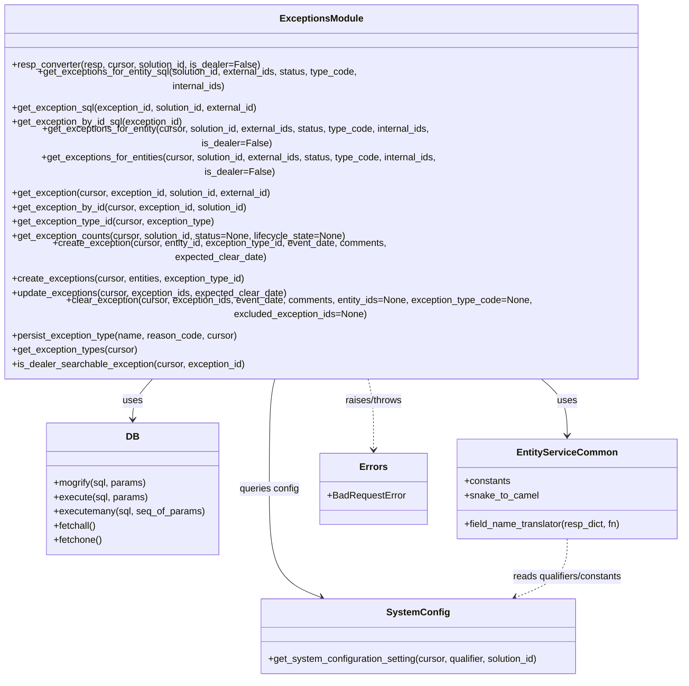

# Diagram: entity_core/entity_service/entity_service/db/exceptions.py


> Auto-generated by Obscura crawlers

## Diagram 1



### SVG

<svg id="container" width="1167.7421875" xmlns="http://www.w3.org/2000/svg" class="classDiagram" height="1022" viewBox="0 0 1167.7421875 1022" role="graphics-document document" aria-roledescription="class"><style>#container{font-family:"trebuchet ms",verdana,arial,sans-serif;font-size:16px;fill:#333;}@keyframes edge-animation-frame{from{stroke-dashoffset:0;}}@keyframes dash{to{stroke-dashoffset:0;}}#container .edge-animation-slow{stroke-dasharray:9,5!important;stroke-dashoffset:900;animation:dash 50s linear infinite;stroke-linecap:round;}#container .edge-animation-fast{stroke-dasharray:9,5!important;stroke-dashoffset:900;animation:dash 20s linear infinite;stroke-linecap:round;}#container .error-icon{fill:#552222;}#container .error-text{fill:#552222;stroke:#552222;}#container .edge-thickness-normal{stroke-width:1px;}#container .edge-thickness-thick{stroke-width:3.5px;}#container .edge-pattern-solid{stroke-dasharray:0;}#container .edge-thickness-invisible{stroke-width:0;fill:none;}#container .edge-pattern-dashed{stroke-dasharray:3;}#container .edge-pattern-dotted{stroke-dasharray:2;}#container .marker{fill:#333333;stroke:#333333;}#container .marker.cross{stroke:#333333;}#container svg{font-family:"trebuchet ms",verdana,arial,sans-serif;font-size:16px;}#container p{margin:0;}#container g.classGroup text{fill:#9370DB;stroke:none;font-family:"trebuchet ms",verdana,arial,sans-serif;font-size:10px;}#container g.classGroup text .title{font-weight:bolder;}#container .nodeLabel,#container .edgeLabel{color:#131300;}#container .edgeLabel .label rect{fill:#ECECFF;}#container .label text{fill:#131300;}#container .labelBkg{background:#ECECFF;}#container .edgeLabel .label span{background:#ECECFF;}#container .classTitle{font-weight:bolder;}#container .node rect,#container .node circle,#container .node ellipse,#container .node polygon,#container .node path{fill:#ECECFF;stroke:#9370DB;stroke-width:1px;}#container .divider{stroke:#9370DB;stroke-width:1;}#container g.clickable{cursor:pointer;}#container g.classGroup rect{fill:#ECECFF;stroke:#9370DB;}#container g.classGroup line{stroke:#9370DB;stroke-width:1;}#container .classLabel .box{stroke:none;stroke-width:0;fill:#ECECFF;opacity:0.5;}#container .classLabel .label{fill:#9370DB;font-size:10px;}#container .relation{stroke:#333333;stroke-width:1;fill:none;}#container .dashed-line{stroke-dasharray:3;}#container .dotted-line{stroke-dasharray:1 2;}#container #compositionStart,#container .composition{fill:#333333!important;stroke:#333333!important;stroke-width:1;}#container #compositionEnd,#container .composition{fill:#333333!important;stroke:#333333!important;stroke-width:1;}#container #dependencyStart,#container .dependency{fill:#333333!important;stroke:#333333!important;stroke-width:1;}#container #dependencyStart,#container .dependency{fill:#333333!important;stroke:#333333!important;stroke-width:1;}#container #extensionStart,#container .extension{fill:transparent!important;stroke:#333333!important;stroke-width:1;}#container #extensionEnd,#container .extension{fill:transparent!important;stroke:#333333!important;stroke-width:1;}#container #aggregationStart,#container .aggregation{fill:transparent!important;stroke:#333333!important;stroke-width:1;}#container #aggregationEnd,#container .aggregation{fill:transparent!important;stroke:#333333!important;stroke-width:1;}#container #lollipopStart,#container .lollipop{fill:#ECECFF!important;stroke:#333333!important;stroke-width:1;}#container #lollipopEnd,#container .lollipop{fill:#ECECFF!important;stroke:#333333!important;stroke-width:1;}#container .edgeTerminals{font-size:11px;line-height:initial;}#container .classTitleText{text-anchor:middle;font-size:18px;fill:#333;}#container .label-icon{display:inline-block;height:1em;overflow:visible;vertical-align:-0.125em;}#container .node .label-icon path{fill:currentColor;stroke:revert;stroke-width:revert;}#container :root{--mermaid-font-family:"trebuchet ms",verdana,arial,sans-serif;}</style><g><defs><marker id="container_class-aggregationStart" class="marker aggregation class" refX="18" refY="7" markerWidth="190" markerHeight="240" orient="auto"><path d="M 18,7 L9,13 L1,7 L9,1 Z"></path></marker></defs><defs><marker id="container_class-aggregationEnd" class="marker aggregation class" refX="1" refY="7" markerWidth="20" markerHeight="28" orient="auto"><path d="M 18,7 L9,13 L1,7 L9,1 Z"></path></marker></defs><defs><marker id="container_class-extensionStart" class="marker extension class" refX="18" refY="7" markerWidth="190" markerHeight="240" orient="auto"><path d="M 1,7 L18,13 V 1 Z"></path></marker></defs><defs><marker id="container_class-extensionEnd" class="marker extension class" refX="1" refY="7" markerWidth="20" markerHeight="28" orient="auto"><path d="M 1,1 V 13 L18,7 Z"></path></marker></defs><defs><marker id="container_class-compositionStart" class="marker composition class" refX="18" refY="7" markerWidth="190" markerHeight="240" orient="auto"><path d="M 18,7 L9,13 L1,7 L9,1 Z"></path></marker></defs><defs><marker id="container_class-compositionEnd" class="marker composition class" refX="1" refY="7" markerWidth="20" markerHeight="28" orient="auto"><path d="M 18,7 L9,13 L1,7 L9,1 Z"></path></marker></defs><defs><marker id="container_class-dependencyStart" class="marker dependency class" refX="6" refY="7" markerWidth="190" markerHeight="240" orient="auto"><path d="M 5,7 L9,13 L1,7 L9,1 Z"></path></marker></defs><defs><marker id="container_class-dependencyEnd" class="marker dependency class" refX="13" refY="7" markerWidth="20" markerHeight="28" orient="auto"><path d="M 18,7 L9,13 L14,7 L9,1 Z"></path></marker></defs><defs><marker id="container_class-lollipopStart" class="marker lollipop class" refX="13" refY="7" markerWidth="190" markerHeight="240" orient="auto"><circle stroke="black" fill="transparent" cx="7" cy="7" r="6"></circle></marker></defs><defs><marker id="container_class-lollipopEnd" class="marker lollipop class" refX="1" refY="7" markerWidth="190" markerHeight="240" orient="auto"><circle stroke="black" fill="transparent" cx="7" cy="7" r="6"></circle></marker></defs><g class="root"><g class="clusters"></g><g class="edgePaths"><path d="M285.669,518L278.969,524.167C272.268,530.333,258.866,542.667,252.166,554C245.465,565.333,245.465,575.667,245.465,580.833L245.465,586" id="id_ExceptionsModule_DB_1" class="edge-thickness-normal edge-pattern-solid relation" style=";;;" data-edge="true" data-et="edge" data-id="id_ExceptionsModule_DB_1" data-points="W3sieCI6Mjg1LjY2OTI3OTc1MTcxMjM0LCJ5Ijo1MTh9LHsieCI6MjQ1LjQ2NDg0Mzc1LCJ5Ijo1NTV9LHsieCI6MjQ1LjQ2NDg0Mzc1LCJ5Ijo1OTJ9XQ==" marker-end="url(#container_class-dependencyEnd)"></path><path d="M921.948,518L930.634,524.167C939.321,530.333,956.694,542.667,965.38,558.5C974.066,574.333,974.066,593.667,974.066,603.333L974.066,613" id="id_ExceptionsModule_EntityServiceCommon_2" class="edge-thickness-normal edge-pattern-solid relation" style=";;;" data-edge="true" data-et="edge" data-id="id_ExceptionsModule_EntityServiceCommon_2" data-points="W3sieCI6OTIxLjk0ODA0MTUyMzk3MjYsInkiOjUxOH0seyJ4Ijo5NzQuMDY2NDA2MjUsInkiOjU1NX0seyJ4Ijo5NzQuMDY2NDA2MjUsInkiOjYxOX1d" marker-end="url(#container_class-dependencyEnd)"></path><path d="M486.549,518L484.706,524.167C482.864,530.333,479.178,542.667,477.335,573.5C475.492,604.333,475.492,653.667,475.492,703C475.492,752.333,475.492,801.667,489.937,832.128C504.381,862.589,533.271,874.177,547.715,879.972L562.16,885.766" id="id_ExceptionsModule_SystemConfig_3" class="edge-thickness-normal edge-pattern-solid relation" style=";;;" data-edge="true" data-et="edge" data-id="id_ExceptionsModule_SystemConfig_3" data-points="W3sieCI6NDg2LjU0OTMyMzA5NTAzNDI1LCJ5Ijo1MTh9LHsieCI6NDc1LjQ5MjE4NzUsInkiOjU1NX0seyJ4Ijo0NzUuNDkyMTg3NSwieSI6NzAzfSx7IngiOjQ3NS40OTIxODc1LCJ5Ijo4NTF9LHsieCI6NTY3LjcyODQxNzk2ODc1LCJ5Ijo4ODh9XQ==" marker-end="url(#container_class-dependencyEnd)"></path><path d="M638.958,518L640.801,524.167C642.644,530.333,646.33,542.667,648.173,562.5C650.016,582.333,650.016,609.667,650.016,623.333L650.016,637" id="id_ExceptionsModule_Errors_4" class="edge-thickness-normal edge-pattern-dashed relation" style=";;;" data-edge="true" data-et="edge" data-id="id_ExceptionsModule_Errors_4" data-points="W3sieCI6NjM4Ljk1ODQ4OTQwNDk2NTgsInkiOjUxOH0seyJ4Ijo2NTAuMDE1NjI1LCJ5Ijo1NTV9LHsieCI6NjUwLjAxNTYyNSwieSI6NjQzfV0=" marker-end="url(#container_class-dependencyEnd)"></path><path d="M974.066,787L974.066,797.667C974.066,808.333,974.066,829.667,959.622,846.128C945.177,862.589,916.288,874.177,901.843,879.972L887.399,885.766" id="id_EntityServiceCommon_SystemConfig_5" class="edge-thickness-normal edge-pattern-dashed relation" style=";;;" data-edge="true" data-et="edge" data-id="id_EntityServiceCommon_SystemConfig_5" data-points="W3sieCI6OTc0LjA2NjQwNjI1LCJ5Ijo3ODd9LHsieCI6OTc0LjA2NjQwNjI1LCJ5Ijo4NTF9LHsieCI6ODgxLjgzMDE3NTc4MTI1LCJ5Ijo4ODh9XQ==" marker-end="url(#container_class-dependencyEnd)"></path></g><g class="edgeLabels"><g class="edgeLabel" transform="translate(245.46484375, 555)"><g class="label" data-id="id_ExceptionsModule_DB_1" transform="translate(-16.4921875, -12)"><foreignObject width="32.984375" height="24"><div xmlns="http://www.w3.org/1999/xhtml" class="labelBkg" style="display: table-cell; white-space: nowrap; line-height: 1.5; max-width: 200px; text-align: center;"><span class="edgeLabel"><p>uses</p></span></div></foreignObject></g></g><g class="edgeLabel" transform="translate(974.06640625, 555)"><g class="label" data-id="id_ExceptionsModule_EntityServiceCommon_2" transform="translate(-16.4921875, -12)"><foreignObject width="32.984375" height="24"><div xmlns="http://www.w3.org/1999/xhtml" class="labelBkg" style="display: table-cell; white-space: nowrap; line-height: 1.5; max-width: 200px; text-align: center;"><span class="edgeLabel"><p>uses</p></span></div></foreignObject></g></g><g class="edgeLabel" transform="translate(475.4921875, 703)"><g class="label" data-id="id_ExceptionsModule_SystemConfig_3" transform="translate(-51.1484375, -12)"><foreignObject width="102.296875" height="24"><div xmlns="http://www.w3.org/1999/xhtml" class="labelBkg" style="display: table-cell; white-space: nowrap; line-height: 1.5; max-width: 200px; text-align: center;"><span class="edgeLabel"><p>queries config</p></span></div></foreignObject></g></g><g class="edgeLabel" transform="translate(650.015625, 555)"><g class="label" data-id="id_ExceptionsModule_Errors_4" transform="translate(-49.7421875, -12)"><foreignObject width="99.484375" height="24"><div xmlns="http://www.w3.org/1999/xhtml" class="labelBkg" style="display: table-cell; white-space: nowrap; line-height: 1.5; max-width: 200px; text-align: center;"><span class="edgeLabel"><p>raises/throws</p></span></div></foreignObject></g></g><g class="edgeLabel" transform="translate(974.06640625, 851)"><g class="label" data-id="id_EntityServiceCommon_SystemConfig_5" transform="translate(-95.1171875, -12)"><foreignObject width="190.234375" height="24"><div xmlns="http://www.w3.org/1999/xhtml" class="labelBkg" style="display: table-cell; white-space: nowrap; line-height: 1.5; max-width: 200px; text-align: center;"><span class="edgeLabel"><p>reads qualifiers/constants</p></span></div></foreignObject></g></g></g><g class="nodes"><g class="node default" id="classId-ExceptionsModule-0" transform="translate(562.75390625, 263)"><g class="basic label-container"><path d="M-554.75390625 -255 L554.75390625 -255 L554.75390625 255 L-554.75390625 255" stroke="none" stroke-width="0" fill="#ECECFF" style=""></path><path d="M-554.75390625 -255 C-310.52804104637244 -255, -66.30217584274482 -255, 554.75390625 -255 M-554.75390625 -255 C-215.97450576555394 -255, 122.80489471889211 -255, 554.75390625 -255 M554.75390625 -255 C554.75390625 -75.63401347713003, 554.75390625 103.73197304573995, 554.75390625 255 M554.75390625 -255 C554.75390625 -53.88870145867085, 554.75390625 147.2225970826583, 554.75390625 255 M554.75390625 255 C115.43621145176843 255, -323.88148334646314 255, -554.75390625 255 M554.75390625 255 C238.5886230045645 255, -77.57666024087098 255, -554.75390625 255 M-554.75390625 255 C-554.75390625 53.8209963579811, -554.75390625 -147.3580072840378, -554.75390625 -255 M-554.75390625 255 C-554.75390625 75.25196054826765, -554.75390625 -104.4960789034647, -554.75390625 -255" stroke="#9370DB" stroke-width="1.3" fill="none" stroke-dasharray="0 0" style=""></path></g><g class="annotation-group text" transform="translate(0, -231)"></g><g class="label-group text" transform="translate(-66.6484375, -231)"><g class="label" style="font-weight: bolder" transform="translate(0,-12)"><foreignObject width="133.296875" height="24"><div xmlns="http://www.w3.org/1999/xhtml" style="display: table-cell; white-space: nowrap; line-height: 1.5; max-width: 182px; text-align: center;"><span class="nodeLabel markdown-node-label" style=""><p>ExceptionsModule</p></span></div></foreignObject></g></g><g class="members-group text" transform="translate(-542.75390625, -183)"></g><g class="methods-group text" transform="translate(-542.75390625, -153)"><g class="label" style="" transform="translate(0,-12)"><foreignObject width="418.8125" height="24"><div xmlns="http://www.w3.org/1999/xhtml" style="display: table-cell; white-space: nowrap; line-height: 1.5; max-width: 476px; text-align: center;"><span class="nodeLabel markdown-node-label" style=""><p>+resp_converter(resp, cursor, solution_id, is_dealer=False)</p></span></div></foreignObject></g><g class="label" style="" transform="translate(0,12)"><foreignObject width="643.046875" height="24"><div xmlns="http://www.w3.org/1999/xhtml" style="display: table-cell; white-space: nowrap; line-height: 1.5; max-width: 700px; text-align: center;"><span class="nodeLabel markdown-node-label" style=""><p>+get_exceptions_for_entity_sql(solution_id, external_ids, status, type_code, internal_ids)</p></span></div></foreignObject></g><g class="label" style="" transform="translate(0,36)"><foreignObject width="423.03125" height="24"><div xmlns="http://www.w3.org/1999/xhtml" style="display: table-cell; white-space: nowrap; line-height: 1.5; max-width: 480px; text-align: center;"><span class="nodeLabel markdown-node-label" style=""><p>+get_exception_sql(exception_id, solution_id, external_id)</p></span></div></foreignObject></g><g class="label" style="" transform="translate(0,60)"><foreignObject width="290.421875" height="24"><div xmlns="http://www.w3.org/1999/xhtml" style="display: table-cell; white-space: nowrap; line-height: 1.5; max-width: 348px; text-align: center;"><span class="nodeLabel markdown-node-label" style=""><p>+get_exception_by_id_sql(exception_id)</p></span></div></foreignObject></g><g class="label" style="" transform="translate(0,84)"><foreignObject width="784.25" height="24"><div xmlns="http://www.w3.org/1999/xhtml" style="display: table-cell; white-space: nowrap; line-height: 1.5; max-width: 842px; text-align: center;"><span class="nodeLabel markdown-node-label" style=""><p>+get_exceptions_for_entity(cursor, solution_id, external_ids, status, type_code, internal_ids, is_dealer=False)</p></span></div></foreignObject></g><g class="label" style="" transform="translate(0,108)"><foreignObject width="797.15625" height="24"><div xmlns="http://www.w3.org/1999/xhtml" style="display: table-cell; white-space: nowrap; line-height: 1.5; max-width: 855px; text-align: center;"><span class="nodeLabel markdown-node-label" style=""><p>+get_exceptions_for_entities(cursor, solution_id, external_ids, status, type_code, internal_ids, is_dealer=False)</p></span></div></foreignObject></g><g class="label" style="" transform="translate(0,132)"><foreignObject width="445.515625" height="24"><div xmlns="http://www.w3.org/1999/xhtml" style="display: table-cell; white-space: nowrap; line-height: 1.5; max-width: 503px; text-align: center;"><span class="nodeLabel markdown-node-label" style=""><p>+get_exception(cursor, exception_id, solution_id, external_id)</p></span></div></foreignObject></g><g class="label" style="" transform="translate(0,156)"><foreignObject width="403.203125" height="24"><div xmlns="http://www.w3.org/1999/xhtml" style="display: table-cell; white-space: nowrap; line-height: 1.5; max-width: 461px; text-align: center;"><span class="nodeLabel markdown-node-label" style=""><p>+get_exception_by_id(cursor, exception_id, solution_id)</p></span></div></foreignObject></g><g class="label" style="" transform="translate(0,180)"><foreignObject width="344.609375" height="24"><div xmlns="http://www.w3.org/1999/xhtml" style="display: table-cell; white-space: nowrap; line-height: 1.5; max-width: 402px; text-align: center;"><span class="nodeLabel markdown-node-label" style=""><p>+get_exception_type_id(cursor, exception_type)</p></span></div></foreignObject></g><g class="label" style="" transform="translate(0,204)"><foreignObject width="567.8125" height="24"><div xmlns="http://www.w3.org/1999/xhtml" style="display: table-cell; white-space: nowrap; line-height: 1.5; max-width: 625px; text-align: center;"><span class="nodeLabel markdown-node-label" style=""><p>+get_exception_counts(cursor, solution_id, status=None, lifecycle_state=None)</p></span></div></foreignObject></g><g class="label" style="" transform="translate(0,228)"><foreignObject width="728.125" height="24"><div xmlns="http://www.w3.org/1999/xhtml" style="display: table-cell; white-space: nowrap; line-height: 1.5; max-width: 785px; text-align: center;"><span class="nodeLabel markdown-node-label" style=""><p>+create_exception(cursor, entity_id, exception_type_id, event_date, comments, expected_clear_date)</p></span></div></foreignObject></g><g class="label" style="" transform="translate(0,252)"><foreignObject width="397.21875" height="24"><div xmlns="http://www.w3.org/1999/xhtml" style="display: table-cell; white-space: nowrap; line-height: 1.5; max-width: 455px; text-align: center;"><span class="nodeLabel markdown-node-label" style=""><p>+create_exceptions(cursor, entities, exception_type_id)</p></span></div></foreignObject></g><g class="label" style="" transform="translate(0,276)"><foreignObject width="465.8125" height="24"><div xmlns="http://www.w3.org/1999/xhtml" style="display: table-cell; white-space: nowrap; line-height: 1.5; max-width: 523px; text-align: center;"><span class="nodeLabel markdown-node-label" style=""><p>+update_exceptions(cursor, exception_ids, expected_clear_date)</p></span></div></foreignObject></g><g class="label" style="" transform="translate(0,300)"><foreignObject width="1018.859375" height="24"><div xmlns="http://www.w3.org/1999/xhtml" style="display: table-cell; white-space: nowrap; line-height: 1.5; max-width: 1076px; text-align: center;"><span class="nodeLabel markdown-node-label" style=""><p>+clear_exception(cursor, exception_ids, event_date, comments, entity_ids=None, exception_type_code=None, excluded_exception_ids=None)</p></span></div></foreignObject></g><g class="label" style="" transform="translate(0,324)"><foreignObject width="380.328125" height="24"><div xmlns="http://www.w3.org/1999/xhtml" style="display: table-cell; white-space: nowrap; line-height: 1.5; max-width: 438px; text-align: center;"><span class="nodeLabel markdown-node-label" style=""><p>+persist_exception_type(name, reason_code, cursor)</p></span></div></foreignObject></g><g class="label" style="" transform="translate(0,348)"><foreignObject width="212.671875" height="24"><div xmlns="http://www.w3.org/1999/xhtml" style="display: table-cell; white-space: nowrap; line-height: 1.5; max-width: 270px; text-align: center;"><span class="nodeLabel markdown-node-label" style=""><p>+get_exception_types(cursor)</p></span></div></foreignObject></g><g class="label" style="" transform="translate(0,372)"><foreignObject width="394.34375" height="24"><div xmlns="http://www.w3.org/1999/xhtml" style="display: table-cell; white-space: nowrap; line-height: 1.5; max-width: 452px; text-align: center;"><span class="nodeLabel markdown-node-label" style=""><p>+is_dealer_searchable_exception(cursor, exception_id)</p></span></div></foreignObject></g></g><g class="divider" style=""><path d="M-554.75390625 -207 C-301.1050063771572 -207, -47.45610650431445 -207, 554.75390625 -207 M-554.75390625 -207 C-136.97725250233896 -207, 280.7994012453221 -207, 554.75390625 -207" stroke="#9370DB" stroke-width="1.3" fill="none" stroke-dasharray="0 0" style=""></path></g><g class="divider" style=""><path d="M-554.75390625 -183 C-146.16443434609562 -183, 262.42503755780876 -183, 554.75390625 -183 M-554.75390625 -183 C-194.9923135216622 -183, 164.7692792066756 -183, 554.75390625 -183" stroke="#9370DB" stroke-width="1.3" fill="none" stroke-dasharray="0 0" style=""></path></g></g><g class="node default" id="classId-DB-1" transform="translate(245.46484375, 703)"><g class="basic label-container"><path d="M-143.87890625 -111 L143.87890625 -111 L143.87890625 111 L-143.87890625 111" stroke="none" stroke-width="0" fill="#ECECFF" style=""></path><path d="M-143.87890625 -111 C-31.699177467442652 -111, 80.4805513151147 -111, 143.87890625 -111 M-143.87890625 -111 C-56.16288648284727 -111, 31.55313328430546 -111, 143.87890625 -111 M143.87890625 -111 C143.87890625 -56.28656786374569, 143.87890625 -1.5731357274913762, 143.87890625 111 M143.87890625 -111 C143.87890625 -32.24544553618634, 143.87890625 46.509108927627324, 143.87890625 111 M143.87890625 111 C35.648514764393994 111, -72.58187672121201 111, -143.87890625 111 M143.87890625 111 C74.02927585592717 111, 4.179645461854335 111, -143.87890625 111 M-143.87890625 111 C-143.87890625 60.13385781053087, -143.87890625 9.26771562106174, -143.87890625 -111 M-143.87890625 111 C-143.87890625 40.85990302093289, -143.87890625 -29.28019395813422, -143.87890625 -111" stroke="#9370DB" stroke-width="1.3" fill="none" stroke-dasharray="0 0" style=""></path></g><g class="annotation-group text" transform="translate(0, -87)"></g><g class="label-group text" transform="translate(-10.1484375, -87)"><g class="label" style="font-weight: bolder" transform="translate(0,-12)"><foreignObject width="20.296875" height="24"><div xmlns="http://www.w3.org/1999/xhtml" style="display: table-cell; white-space: nowrap; line-height: 1.5; max-width: 70px; text-align: center;"><span class="nodeLabel markdown-node-label" style=""><p>DB</p></span></div></foreignObject></g></g><g class="members-group text" transform="translate(-131.87890625, -39)"></g><g class="methods-group text" transform="translate(-131.87890625, -9)"><g class="label" style="" transform="translate(0,-12)"><foreignObject width="157.078125" height="24"><div xmlns="http://www.w3.org/1999/xhtml" style="display: table-cell; white-space: nowrap; line-height: 1.5; max-width: 214px; text-align: center;"><span class="nodeLabel markdown-node-label" style=""><p>+mogrify(sql, params)</p></span></div></foreignObject></g><g class="label" style="" transform="translate(0,12)"><foreignObject width="157.75" height="24"><div xmlns="http://www.w3.org/1999/xhtml" style="display: table-cell; white-space: nowrap; line-height: 1.5; max-width: 215px; text-align: center;"><span class="nodeLabel markdown-node-label" style=""><p>+execute(sql, params)</p></span></div></foreignObject></g><g class="label" style="" transform="translate(0,36)"><foreignObject width="253.609375" height="24"><div xmlns="http://www.w3.org/1999/xhtml" style="display: table-cell; white-space: nowrap; line-height: 1.5; max-width: 311px; text-align: center;"><span class="nodeLabel markdown-node-label" style=""><p>+executemany(sql, seq_of_params)</p></span></div></foreignObject></g><g class="label" style="" transform="translate(0,60)"><foreignObject width="72.515625" height="24"><div xmlns="http://www.w3.org/1999/xhtml" style="display: table-cell; white-space: nowrap; line-height: 1.5; max-width: 130px; text-align: center;"><span class="nodeLabel markdown-node-label" style=""><p>+fetchall()</p></span></div></foreignObject></g><g class="label" style="" transform="translate(0,84)"><foreignObject width="82.046875" height="24"><div xmlns="http://www.w3.org/1999/xhtml" style="display: table-cell; white-space: nowrap; line-height: 1.5; max-width: 139px; text-align: center;"><span class="nodeLabel markdown-node-label" style=""><p>+fetchone()</p></span></div></foreignObject></g></g><g class="divider" style=""><path d="M-143.87890625 -63 C-39.237011353811255 -63, 65.40488354237749 -63, 143.87890625 -63 M-143.87890625 -63 C-66.13338452749338 -63, 11.612137195013247 -63, 143.87890625 -63" stroke="#9370DB" stroke-width="1.3" fill="none" stroke-dasharray="0 0" style=""></path></g><g class="divider" style=""><path d="M-143.87890625 -39 C-75.56487553984661 -39, -7.2508448296932215 -39, 143.87890625 -39 M-143.87890625 -39 C-77.04493596589563 -39, -10.210965681791265 -39, 143.87890625 -39" stroke="#9370DB" stroke-width="1.3" fill="none" stroke-dasharray="0 0" style=""></path></g></g><g class="node default" id="classId-EntityServiceCommon-2" transform="translate(974.06640625, 703)"><g class="basic label-container"><path d="M-185.67578125 -84 L185.67578125 -84 L185.67578125 84 L-185.67578125 84" stroke="none" stroke-width="0" fill="#ECECFF" style=""></path><path d="M-185.67578125 -84 C-84.07341896125638 -84, 17.52894332748724 -84, 185.67578125 -84 M-185.67578125 -84 C-75.82398196387105 -84, 34.0278173222579 -84, 185.67578125 -84 M185.67578125 -84 C185.67578125 -21.665247735799973, 185.67578125 40.669504528400054, 185.67578125 84 M185.67578125 -84 C185.67578125 -40.85103550141616, 185.67578125 2.2979289971676735, 185.67578125 84 M185.67578125 84 C105.77557373656947 84, 25.87536622313894 84, -185.67578125 84 M185.67578125 84 C104.50682463652099 84, 23.337868023041977 84, -185.67578125 84 M-185.67578125 84 C-185.67578125 43.585907775177304, -185.67578125 3.1718155503546086, -185.67578125 -84 M-185.67578125 84 C-185.67578125 47.50866311373428, -185.67578125 11.017326227468558, -185.67578125 -84" stroke="#9370DB" stroke-width="1.3" fill="none" stroke-dasharray="0 0" style=""></path></g><g class="annotation-group text" transform="translate(0, -60)"></g><g class="label-group text" transform="translate(-79.8515625, -60)"><g class="label" style="font-weight: bolder" transform="translate(0,-12)"><foreignObject width="159.703125" height="24"><div xmlns="http://www.w3.org/1999/xhtml" style="display: table-cell; white-space: nowrap; line-height: 1.5; max-width: 208px; text-align: center;"><span class="nodeLabel markdown-node-label" style=""><p>EntityServiceCommon</p></span></div></foreignObject></g></g><g class="members-group text" transform="translate(-173.67578125, -12)"><g class="label" style="" transform="translate(0,-12)"><foreignObject width="78.5" height="24"><div xmlns="http://www.w3.org/1999/xhtml" style="display: table-cell; white-space: nowrap; line-height: 1.5; max-width: 136px; text-align: center;"><span class="nodeLabel markdown-node-label" style=""><p>+constants</p></span></div></foreignObject></g><g class="label" style="" transform="translate(0,12)"><foreignObject width="123.859375" height="24"><div xmlns="http://www.w3.org/1999/xhtml" style="display: table-cell; white-space: nowrap; line-height: 1.5; max-width: 182px; text-align: center;"><span class="nodeLabel markdown-node-label" style=""><p>+snake_to_camel</p></span></div></foreignObject></g></g><g class="methods-group text" transform="translate(-173.67578125, 60)"><g class="label" style="" transform="translate(0,-12)"><foreignObject width="267.5" height="24"><div xmlns="http://www.w3.org/1999/xhtml" style="display: table-cell; white-space: nowrap; line-height: 1.5; max-width: 325px; text-align: center;"><span class="nodeLabel markdown-node-label" style=""><p>+field_name_translator(resp_dict, fn)</p></span></div></foreignObject></g></g><g class="divider" style=""><path d="M-185.67578125 -36 C-68.78632271568767 -36, 48.10313581862465 -36, 185.67578125 -36 M-185.67578125 -36 C-83.9173370920207 -36, 17.841107065958596 -36, 185.67578125 -36" stroke="#9370DB" stroke-width="1.3" fill="none" stroke-dasharray="0 0" style=""></path></g><g class="divider" style=""><path d="M-185.67578125 36 C-83.81188633469411 36, 18.052008580611783 36, 185.67578125 36 M-185.67578125 36 C-105.19717185784728 36, -24.71856246569456 36, 185.67578125 36" stroke="#9370DB" stroke-width="1.3" fill="none" stroke-dasharray="0 0" style=""></path></g></g><g class="node default" id="classId-SystemConfig-3" transform="translate(724.779296875, 951)"><g class="basic label-container"><path d="M-268.859375 -63 L268.859375 -63 L268.859375 63 L-268.859375 63" stroke="none" stroke-width="0" fill="#ECECFF" style=""></path><path d="M-268.859375 -63 C-121.36525023043902 -63, 26.128874539121966 -63, 268.859375 -63 M-268.859375 -63 C-140.6311819707269 -63, -12.402988941453827 -63, 268.859375 -63 M268.859375 -63 C268.859375 -14.23869951301981, 268.859375 34.52260097396038, 268.859375 63 M268.859375 -63 C268.859375 -23.06713441734727, 268.859375 16.865731165305462, 268.859375 63 M268.859375 63 C135.43936191598564 63, 2.0193488319712856 63, -268.859375 63 M268.859375 63 C137.07996454120016 63, 5.300554082400311 63, -268.859375 63 M-268.859375 63 C-268.859375 15.668507950185202, -268.859375 -31.662984099629597, -268.859375 -63 M-268.859375 63 C-268.859375 34.45059107103416, -268.859375 5.901182142068322, -268.859375 -63" stroke="#9370DB" stroke-width="1.3" fill="none" stroke-dasharray="0 0" style=""></path></g><g class="annotation-group text" transform="translate(0, -39)"></g><g class="label-group text" transform="translate(-49.484375, -39)"><g class="label" style="font-weight: bolder" transform="translate(0,-12)"><foreignObject width="98.96875" height="24"><div xmlns="http://www.w3.org/1999/xhtml" style="display: table-cell; white-space: nowrap; line-height: 1.5; max-width: 147px; text-align: center;"><span class="nodeLabel markdown-node-label" style=""><p>SystemConfig</p></span></div></foreignObject></g></g><g class="members-group text" transform="translate(-256.859375, 9)"></g><g class="methods-group text" transform="translate(-256.859375, 39)"><g class="label" style="" transform="translate(0,-12)"><foreignObject width="464.234375" height="24"><div xmlns="http://www.w3.org/1999/xhtml" style="display: table-cell; white-space: nowrap; line-height: 1.5; max-width: 522px; text-align: center;"><span class="nodeLabel markdown-node-label" style=""><p>+get_system_configuration_setting(cursor, qualifier, solution_id)</p></span></div></foreignObject></g></g><g class="divider" style=""><path d="M-268.859375 -15 C-54.15633208114221 -15, 160.54671083771558 -15, 268.859375 -15 M-268.859375 -15 C-106.8914719551214 -15, 55.07643108975719 -15, 268.859375 -15" stroke="#9370DB" stroke-width="1.3" fill="none" stroke-dasharray="0 0" style=""></path></g><g class="divider" style=""><path d="M-268.859375 9 C-95.49702080451863 9, 77.86533339096275 9, 268.859375 9 M-268.859375 9 C-67.36526714986468 9, 134.12884070027064 9, 268.859375 9" stroke="#9370DB" stroke-width="1.3" fill="none" stroke-dasharray="0 0" style=""></path></g></g><g class="node default" id="classId-Errors-4" transform="translate(650.015625, 703)"><g class="basic label-container"><path d="M-88.375 -60 L88.375 -60 L88.375 60 L-88.375 60" stroke="none" stroke-width="0" fill="#ECECFF" style=""></path><path d="M-88.375 -60 C-24.615615655361893 -60, 39.143768689276214 -60, 88.375 -60 M-88.375 -60 C-29.005838481568652 -60, 30.363323036862695 -60, 88.375 -60 M88.375 -60 C88.375 -26.90554383697328, 88.375 6.18891232605344, 88.375 60 M88.375 -60 C88.375 -32.930150687070594, 88.375 -5.860301374141187, 88.375 60 M88.375 60 C42.265175643890316 60, -3.8446487122193673 60, -88.375 60 M88.375 60 C37.99542953650225 60, -12.3841409269955 60, -88.375 60 M-88.375 60 C-88.375 18.564736335492384, -88.375 -22.870527329015232, -88.375 -60 M-88.375 60 C-88.375 30.06278320768073, -88.375 0.12556641536146174, -88.375 -60" stroke="#9370DB" stroke-width="1.3" fill="none" stroke-dasharray="0 0" style=""></path></g><g class="annotation-group text" transform="translate(0, -36)"></g><g class="label-group text" transform="translate(-21.953125, -36)"><g class="label" style="font-weight: bolder" transform="translate(0,-12)"><foreignObject width="43.90625" height="24"><div xmlns="http://www.w3.org/1999/xhtml" style="display: table-cell; white-space: nowrap; line-height: 1.5; max-width: 93px; text-align: center;"><span class="nodeLabel markdown-node-label" style=""><p>Errors</p></span></div></foreignObject></g></g><g class="members-group text" transform="translate(-76.375, 12)"><g class="label" style="" transform="translate(0,-12)"><foreignObject width="130.796875" height="24"><div xmlns="http://www.w3.org/1999/xhtml" style="display: table-cell; white-space: nowrap; line-height: 1.5; max-width: 189px; text-align: center;"><span class="nodeLabel markdown-node-label" style=""><p>+BadRequestError</p></span></div></foreignObject></g></g><g class="methods-group text" transform="translate(-76.375, 60)"></g><g class="divider" style=""><path d="M-88.375 -12 C-34.1981195952444 -12, 19.9787608095112 -12, 88.375 -12 M-88.375 -12 C-19.91422864708308 -12, 48.54654270583384 -12, 88.375 -12" stroke="#9370DB" stroke-width="1.3" fill="none" stroke-dasharray="0 0" style=""></path></g><g class="divider" style=""><path d="M-88.375 36 C-19.298472950411494 36, 49.77805409917701 36, 88.375 36 M-88.375 36 C-26.843688435824454 36, 34.68762312835109 36, 88.375 36" stroke="#9370DB" stroke-width="1.3" fill="none" stroke-dasharray="0 0" style=""></path></g></g></g></g></g></svg>

## Diagram 2

```mermaid
flowchart TD
    Start(["Start: get_exceptions_for_entity(...)"]) --> InputCheck{Has solution_id & external_ids?}
    InputCheck -->|yes| BuildExt[Build query: WHERE e.external_id IN %(external_ids)s AND e.solution_id=%(solution_id)s]
    InputCheck -->|no| BuildInt[Build query: WHERE e.id IN %(internal_ids)s]
    BuildExt --> Filters
    BuildInt --> Filters
    Filters{Add filters?} -->|type_code| AddType[Append "AND exct.reason_code = %(type_code)s"]
    Filters -->|status| AddStatus[Append "AND ex.status = %(status)s"]
    AddType --> PrepareQuery
    AddStatus --> PrepareQuery
    Filters -->|none| PrepareQuery
    PrepareQuery[Prepare/mogrify SQL & params] --> Execute[Execute cursor.execute(query, data)]
    Execute --> Fetch[Fetch results (fetchall/fetchone)]
    Fetch --> Map[Map each result -> resp_converter(...)]
    Map --> RespConvLogic[resp_converter: determine severity by type_name]
    RespConvLogic -->|EXCESSIVE_DWELL| ConfigLookup[Maybe call SystemConfig.get_system_configuration_setting(cursor, qualifier, solution_id)]
    ConfigLookup --> RenameType[Replace type_name from config]
    RespConvLogic --> Translate[Call field_name_translator(resp_dict, snake_to_camel)]
    Translate --> Return[Return translated result(s)]
    Return --> End(["End: list of exceptions / single exception"])
```

> SVG rendering failed for this diagram.
