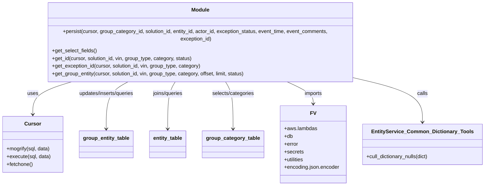

# Diagram: entity_core/entity_service/entity_service/db/group_entity.py

> Auto-generated by Obscura crawlers

## Mermaid

### SVG

<svg id="container" width="1483.1484375" xmlns="http://www.w3.org/2000/svg" class="classDiagram" height="552" viewBox="0 0 1483.1484375 552" role="graphics-document document" aria-roledescription="class"><g><defs><marker id="container_class-aggregationStart" class="marker aggregation class" refX="18" refY="7" markerWidth="190" markerHeight="240" orient="auto"><path d="M 18,7 L9,13 L1,7 L9,1 Z"></path></marker></defs><defs><marker id="container_class-aggregationEnd" class="marker aggregation class" refX="1" refY="7" markerWidth="20" markerHeight="28" orient="auto"><path d="M 18,7 L9,13 L1,7 L9,1 Z"></path></marker></defs><defs><marker id="container_class-extensionStart" class="marker extension class" refX="18" refY="7" markerWidth="190" markerHeight="240" orient="auto"><path d="M 1,7 L18,13 V 1 Z"></path></marker></defs><defs><marker id="container_class-extensionEnd" class="marker extension class" refX="1" refY="7" markerWidth="20" markerHeight="28" orient="auto"><path d="M 1,1 V 13 L18,7 Z"></path></marker></defs><defs><marker id="container_class-compositionStart" class="marker composition class" refX="18" refY="7" markerWidth="190" markerHeight="240" orient="auto"><path d="M 18,7 L9,13 L1,7 L9,1 Z"></path></marker></defs><defs><marker id="container_class-compositionEnd" class="marker composition class" refX="1" refY="7" markerWidth="20" markerHeight="28" orient="auto"><path d="M 18,7 L9,13 L1,7 L9,1 Z"></path></marker></defs><defs><marker id="container_class-dependencyStart" class="marker dependency class" refX="6" refY="7" markerWidth="190" markerHeight="240" orient="auto"><path d="M 5,7 L9,13 L1,7 L9,1 Z"></path></marker></defs><defs><marker id="container_class-dependencyEnd" class="marker dependency class" refX="13" refY="7" markerWidth="20" markerHeight="28" orient="auto"><path d="M 18,7 L9,13 L14,7 L9,1 Z"></path></marker></defs><defs><marker id="container_class-lollipopStart" class="marker lollipop class" refX="13" refY="7" markerWidth="190" markerHeight="240" orient="auto"><circle stroke="black" fill="transparent" cx="7" cy="7" r="6"></circle></marker></defs><defs><marker id="container_class-lollipopEnd" class="marker lollipop class" refX="1" refY="7" markerWidth="190" markerHeight="240" orient="auto"><circle stroke="black" fill="transparent" cx="7" cy="7" r="6"></circle></marker></defs><g class="root"><g class="clusters"></g><g class="edgePaths"><path d="M228.002,230L206.731,236.167C185.46,242.333,142.917,254.667,121.646,271.5C100.375,288.333,100.375,309.667,100.375,320.333L100.375,331" id="id_Module_Cursor_1" class="edge-thickness-normal edge-pattern-solid relation" style=";;;" data-edge="true" data-et="edge" data-id="id_Module_Cursor_1" data-points="W3sieCI6MjI4LjAwMTk1MzEyNSwieSI6MjMwfSx7IngiOjEwMC4zNzUsInkiOjI2N30seyJ4IjoxMDAuMzc1LCJ5IjozMzd9XQ==" marker-end="url(#container_class-dependencyEnd)"></path><path d="M395.891,230L383.947,236.167C372.003,242.333,348.115,254.667,336.171,279C324.227,303.333,324.227,339.667,324.227,357.833L324.227,376" id="id_Module_group_entity_table_2" class="edge-thickness-normal edge-pattern-solid relation" style=";;;" data-edge="true" data-et="edge" data-id="id_Module_group_entity_table_2" data-points="W3sieCI6Mzk1Ljg5MDYyNSwieSI6MjMwfSx7IngiOjMyNC4yMjY1NjI1LCJ5IjoyNjd9LHsieCI6MzI0LjIyNjU2MjUsInkiOjM4Mn1d" marker-end="url(#container_class-dependencyEnd)"></path><path d="M536.674,230L532.551,236.167C528.428,242.333,520.183,254.667,516.06,279C511.938,303.333,511.938,339.667,511.938,357.833L511.938,376" id="id_Module_entity_table_3" class="edge-thickness-normal edge-pattern-solid relation" style=";;;" data-edge="true" data-et="edge" data-id="id_Module_entity_table_3" data-points="W3sieCI6NTM2LjY3MzgyODEyNSwieSI6MjMwfSx7IngiOjUxMS45Mzc1LCJ5IjoyNjd9LHsieCI6NTExLjkzNzUsInkiOjM4Mn1d" marker-end="url(#container_class-dependencyEnd)"></path><path d="M685.092,230L689.215,236.167C693.337,242.333,701.583,254.667,705.705,279C709.828,303.333,709.828,339.667,709.828,357.833L709.828,376" id="id_Module_group_category_table_4" class="edge-thickness-normal edge-pattern-solid relation" style=";;;" data-edge="true" data-et="edge" data-id="id_Module_group_category_table_4" data-points="W3sieCI6Njg1LjA5MTc5Njg3NSwieSI6MjMwfSx7IngiOjcwOS44MjgxMjUsInkiOjI2N30seyJ4Ijo3MDkuODI4MTI1LCJ5IjozODJ9XQ==" marker-end="url(#container_class-dependencyEnd)"></path><path d="M867.989,230L882.273,236.167C896.557,242.333,925.124,254.667,939.408,266C953.691,277.333,953.691,287.667,953.691,292.833L953.691,298" id="id_Module_FV_5" class="edge-thickness-normal edge-pattern-solid relation" style=";;;" data-edge="true" data-et="edge" data-id="id_Module_FV_5" data-points="W3sieCI6ODY3Ljk4OTI1NzgxMjUsInkiOjIzMH0seyJ4Ijo5NTMuNjkxNDA2MjUsInkiOjI2N30seyJ4Ijo5NTMuNjkxNDA2MjUsInkiOjMwNH1d" marker-end="url(#container_class-dependencyEnd)"></path><path d="M1104.648,226.523L1135.628,233.27C1166.607,240.016,1228.565,253.508,1259.544,274.921C1290.523,296.333,1290.523,325.667,1290.523,340.333L1290.523,355" id="id_Module_EntityService_Common_Dictionary_Tools_6" class="edge-thickness-normal edge-pattern-solid relation" style=";;;" data-edge="true" data-et="edge" data-id="id_Module_EntityService_Common_Dictionary_Tools_6" data-points="W3sieCI6MTEwNC42NDg0Mzc1LCJ5IjoyMjYuNTIzNDYxMzg4MTQxN30seyJ4IjoxMjkwLjUyMzQzNzUsInkiOjI2N30seyJ4IjoxMjkwLjUyMzQzNzUsInkiOjM2MX1d" marker-end="url(#container_class-dependencyEnd)"></path></g><g class="edgeLabels"><g class="edgeLabel" transform="translate(100.375, 267)"><g class="label" data-id="id_Module_Cursor_1" transform="translate(-16.4921875, -12)"><foreignObject width="32.984375" height="24">

uses

</foreignObject></g></g><g class="edgeLabel" transform="translate(324.2265625, 267)"><g class="label" data-id="id_Module_group_entity_table_2" transform="translate(-89.3203125, -12)"><foreignObject width="178.640625" height="24">

updates/inserts/queries

</foreignObject></g></g><g class="edgeLabel" transform="translate(511.9375, 267)"><g class="label" data-id="id_Module_entity_table_3" transform="translate(-48.59375, -12)"><foreignObject width="97.1875" height="24">

joins/queries

</foreignObject></g></g><g class="edgeLabel" transform="translate(709.828125, 267)"><g class="label" data-id="id_Module_group_category_table_4" transform="translate(-66.34375, -12)"><foreignObject width="132.6875" height="24">

selects/categories

</foreignObject></g></g><g class="edgeLabel" transform="translate(953.69140625, 267)"><g class="label" data-id="id_Module_FV_5" transform="translate(-28.25, -12)"><foreignObject width="56.5" height="24">

imports

</foreignObject></g></g><g class="edgeLabel" transform="translate(1290.5234375, 267)"><g class="label" data-id="id_Module_EntityService_Common_Dictionary_Tools_6" transform="translate(-16.4453125, -12)"><foreignObject width="32.890625" height="24">

calls

</foreignObject></g></g></g><g class="nodes"><g class="node default" id="classId-Module-0" transform="translate(610.8828125, 119)"><g class="basic label-container"><path d="M-493.765625 -111 L493.765625 -111 L493.765625 111 L-493.765625 111" stroke="none" stroke-width="0" fill="#ECECFF" style=""></path><path d="M-493.765625 -111 C-132.9903398902643 -111, 227.7849452194714 -111, 493.765625 -111 M-493.765625 -111 C-215.42498121438422 -111, 62.915662571231564 -111, 493.765625 -111 M493.765625 -111 C493.765625 -49.119115048510714, 493.765625 12.761769902978571, 493.765625 111 M493.765625 -111 C493.765625 -24.5924064222897, 493.765625 61.8151871554206, 493.765625 111 M493.765625 111 C285.2448752326875 111, 76.72412546537493 111, -493.765625 111 M493.765625 111 C262.59231935269685 111, 31.419013705393695 111, -493.765625 111 M-493.765625 111 C-493.765625 36.1005098981712, -493.765625 -38.79898020365761, -493.765625 -111 M-493.765625 111 C-493.765625 22.950416113917157, -493.765625 -65.09916777216569, -493.765625 -111" stroke="#9370DB" stroke-width="1.3" fill="none" stroke-dasharray="0 0" style=""></path></g><g class="annotation-group text" transform="translate(0, -87)"></g><g class="label-group text" transform="translate(-27.09375, -87)"><g class="label" style="font-weight: bolder" transform="translate(0,-12)"><foreignObject width="54.1875" height="24">

Module

</foreignObject></g></g><g class="members-group text" transform="translate(-481.765625, -39)"></g><g class="methods-group text" transform="translate(-481.765625, -9)"><g class="label" style="" transform="translate(0,-12)"><foreignObject width="936.4375" height="24">

+persist(cursor, group_category_id, solution_id, entity_id, actor_id, exception_status, event_time, event_comments, exception_id)

</foreignObject></g><g class="label" style="" transform="translate(0,12)"><foreignObject width="139.75" height="24">

+get_select_fields()

</foreignObject></g><g class="label" style="" transform="translate(0,36)"><foreignObject width="439.296875" height="24">

+get_id(cursor, solution_id, vin, group_type, category, status)

</foreignObject></g><g class="label" style="" transform="translate(0,60)"><foreignObject width="466.21875" height="24">

+get_exception_id(cursor, solution_id, vin, group_type, category)

</foreignObject></g><g class="label" style="" transform="translate(0,84)"><foreignObject width="608.609375" height="24">

+get_group_entity(cursor, solution_id, vin, group_type, category, offset, limit, status)

</foreignObject></g></g><g class="divider" style=""><path d="M-493.765625 -63 C-281.1743482487895 -63, -68.583071497579 -63, 493.765625 -63 M-493.765625 -63 C-167.5898269477109 -63, 158.58597110457822 -63, 493.765625 -63" stroke="#9370DB" stroke-width="1.3" fill="none" stroke-dasharray="0 0" style=""></path></g><g class="divider" style=""><path d="M-493.765625 -39 C-106.55077784777797 -39, 280.66406930444407 -39, 493.765625 -39 M-493.765625 -39 C-264.66661896522623 -39, -35.567612930452526 -39, 493.765625 -39" stroke="#9370DB" stroke-width="1.3" fill="none" stroke-dasharray="0 0" style=""></path></g></g><g class="node default" id="classId-Cursor-1" transform="translate(100.375, 424)"><g class="basic label-container"><path d="M-92.375 -87 L92.375 -87 L92.375 87 L-92.375 87" stroke="none" stroke-width="0" fill="#ECECFF" style=""></path><path d="M-92.375 -87 C-47.17248045604862 -87, -1.9699609120972355 -87, 92.375 -87 M-92.375 -87 C-36.008013977452734 -87, 20.358972045094532 -87, 92.375 -87 M92.375 -87 C92.375 -32.21023545825954, 92.375 22.57952908348092, 92.375 87 M92.375 -87 C92.375 -50.946210215915826, 92.375 -14.892420431831653, 92.375 87 M92.375 87 C39.48406379492437 87, -13.406872410151266 87, -92.375 87 M92.375 87 C24.465780183530853 87, -43.44343963293829 87, -92.375 87 M-92.375 87 C-92.375 25.916828362965447, -92.375 -35.166343274069106, -92.375 -87 M-92.375 87 C-92.375 35.38442096159823, -92.375 -16.23115807680354, -92.375 -87" stroke="#9370DB" stroke-width="1.3" fill="none" stroke-dasharray="0 0" style=""></path></g><g class="annotation-group text" transform="translate(0, -63)"></g><g class="label-group text" transform="translate(-23.90625, -63)"><g class="label" style="font-weight: bolder" transform="translate(0,-12)"><foreignObject width="47.8125" height="24">

Cursor

</foreignObject></g></g><g class="members-group text" transform="translate(-80.375, -15)"></g><g class="methods-group text" transform="translate(-80.375, 15)"><g class="label" style="" transform="translate(0,-12)"><foreignObject width="136.171875" height="24">

+mogrify(sql, data)

</foreignObject></g><g class="label" style="" transform="translate(0,12)"><foreignObject width="136.84375" height="24">

+execute(sql, data)

</foreignObject></g><g class="label" style="" transform="translate(0,36)"><foreignObject width="82.046875" height="24">

+fetchone()

</foreignObject></g></g><g class="divider" style=""><path d="M-92.375 -39 C-25.071440244629898 -39, 42.232119510740205 -39, 92.375 -39 M-92.375 -39 C-52.022212385210615 -39, -11.66942477042123 -39, 92.375 -39" stroke="#9370DB" stroke-width="1.3" fill="none" stroke-dasharray="0 0" style=""></path></g><g class="divider" style=""><path d="M-92.375 -15 C-52.22016256524058 -15, -12.065325130481156 -15, 92.375 -15 M-92.375 -15 C-50.24581547743091 -15, -8.116630954861819 -15, 92.375 -15" stroke="#9370DB" stroke-width="1.3" fill="none" stroke-dasharray="0 0" style=""></path></g></g><g class="node default" id="classId-group_entity_table-2" transform="translate(324.2265625, 424)"><g class="basic label-container"><path d="M-81.4765625 -42 L81.4765625 -42 L81.4765625 42 L-81.4765625 42" stroke="none" stroke-width="0" fill="#ECECFF" style=""></path><path d="M-81.4765625 -42 C-48.532388802558245 -42, -15.58821510511649 -42, 81.4765625 -42 M-81.4765625 -42 C-37.081881812929524 -42, 7.312798874140952 -42, 81.4765625 -42 M81.4765625 -42 C81.4765625 -12.689694821849265, 81.4765625 16.62061035630147, 81.4765625 42 M81.4765625 -42 C81.4765625 -11.210538653784731, 81.4765625 19.578922692430538, 81.4765625 42 M81.4765625 42 C41.5066895167929 42, 1.5368165335858066 42, -81.4765625 42 M81.4765625 42 C18.42729289640915 42, -44.6219767071817 42, -81.4765625 42 M-81.4765625 42 C-81.4765625 24.911743944737577, -81.4765625 7.823487889475153, -81.4765625 -42 M-81.4765625 42 C-81.4765625 25.111551481576857, -81.4765625 8.223102963153714, -81.4765625 -42" stroke="#9370DB" stroke-width="1.3" fill="none" stroke-dasharray="0 0" style=""></path></g><g class="annotation-group text" transform="translate(0, -18)"></g><g class="label-group text" transform="translate(-69.4765625, -18)"><g class="label" style="font-weight: bolder" transform="translate(0,-12)"><foreignObject width="138.953125" height="24">

group_entity_table

</foreignObject></g></g><g class="members-group text" transform="translate(-69.4765625, 30)"></g><g class="methods-group text" transform="translate(-69.4765625, 60)"></g><g class="divider" style=""><path d="M-81.4765625 6 C-31.95644815653688 6, 17.56366618692624 6, 81.4765625 6 M-81.4765625 6 C-44.61423347534749 6, -7.75190445069498 6, 81.4765625 6" stroke="#9370DB" stroke-width="1.3" fill="none" stroke-dasharray="0 0" style=""></path></g><g class="divider" style=""><path d="M-81.4765625 24 C-20.401283765163498 24, 40.673994969673004 24, 81.4765625 24 M-81.4765625 24 C-32.48603295262602 24, 16.504496594747962 24, 81.4765625 24" stroke="#9370DB" stroke-width="1.3" fill="none" stroke-dasharray="0 0" style=""></path></g></g><g class="node default" id="classId-entity_table-3" transform="translate(511.9375, 424)"><g class="basic label-container"><path d="M-56.234375 -42 L56.234375 -42 L56.234375 42 L-56.234375 42" stroke="none" stroke-width="0" fill="#ECECFF" style=""></path><path d="M-56.234375 -42 C-25.355641219241587 -42, 5.523092561516826 -42, 56.234375 -42 M-56.234375 -42 C-17.788691602198767 -42, 20.656991795602465 -42, 56.234375 -42 M56.234375 -42 C56.234375 -22.86907534008799, 56.234375 -3.738150680175977, 56.234375 42 M56.234375 -42 C56.234375 -18.93066530016016, 56.234375 4.138669399679678, 56.234375 42 M56.234375 42 C19.32220877994299 42, -17.58995744011402 42, -56.234375 42 M56.234375 42 C18.90683455009072 42, -18.420705899818557 42, -56.234375 42 M-56.234375 42 C-56.234375 18.02927884106658, -56.234375 -5.941442317866837, -56.234375 -42 M-56.234375 42 C-56.234375 14.045680258535281, -56.234375 -13.908639482929438, -56.234375 -42" stroke="#9370DB" stroke-width="1.3" fill="none" stroke-dasharray="0 0" style=""></path></g><g class="annotation-group text" transform="translate(0, -18)"></g><g class="label-group text" transform="translate(-44.234375, -18)"><g class="label" style="font-weight: bolder" transform="translate(0,-12)"><foreignObject width="88.46875" height="24">

entity_table

</foreignObject></g></g><g class="members-group text" transform="translate(-44.234375, 30)"></g><g class="methods-group text" transform="translate(-44.234375, 60)"></g><g class="divider" style=""><path d="M-56.234375 6 C-14.824411156498947 6, 26.585552687002107 6, 56.234375 6 M-56.234375 6 C-14.677854476709754 6, 26.87866604658049 6, 56.234375 6" stroke="#9370DB" stroke-width="1.3" fill="none" stroke-dasharray="0 0" style=""></path></g><g class="divider" style=""><path d="M-56.234375 24 C-22.211958278419914 24, 11.810458443160172 24, 56.234375 24 M-56.234375 24 C-16.357578855559304 24, 23.519217288881393 24, 56.234375 24" stroke="#9370DB" stroke-width="1.3" fill="none" stroke-dasharray="0 0" style=""></path></g></g><g class="node default" id="classId-group_category_table-4" transform="translate(709.828125, 424)"><g class="basic label-container"><path d="M-91.65625 -42 L91.65625 -42 L91.65625 42 L-91.65625 42" stroke="none" stroke-width="0" fill="#ECECFF" style=""></path><path d="M-91.65625 -42 C-48.67613327934369 -42, -5.696016558687376 -42, 91.65625 -42 M-91.65625 -42 C-49.72805510967097 -42, -7.799860219341937 -42, 91.65625 -42 M91.65625 -42 C91.65625 -22.32045065921603, 91.65625 -2.640901318432057, 91.65625 42 M91.65625 -42 C91.65625 -21.588879413903786, 91.65625 -1.1777588278075726, 91.65625 42 M91.65625 42 C40.6407725271974 42, -10.374704945605203 42, -91.65625 42 M91.65625 42 C43.6922367816495 42, -4.271776436701003 42, -91.65625 42 M-91.65625 42 C-91.65625 22.839336197249963, -91.65625 3.6786723944999267, -91.65625 -42 M-91.65625 42 C-91.65625 10.247699893323254, -91.65625 -21.50460021335349, -91.65625 -42" stroke="#9370DB" stroke-width="1.3" fill="none" stroke-dasharray="0 0" style=""></path></g><g class="annotation-group text" transform="translate(0, -18)"></g><g class="label-group text" transform="translate(-79.65625, -18)"><g class="label" style="font-weight: bolder" transform="translate(0,-12)"><foreignObject width="159.3125" height="24">

group_category_table

</foreignObject></g></g><g class="members-group text" transform="translate(-79.65625, 30)"></g><g class="methods-group text" transform="translate(-79.65625, 60)"></g><g class="divider" style=""><path d="M-91.65625 6 C-52.11062577531901 6, -12.565001550638016 6, 91.65625 6 M-91.65625 6 C-44.34837082165624 6, 2.9595083566875218 6, 91.65625 6" stroke="#9370DB" stroke-width="1.3" fill="none" stroke-dasharray="0 0" style=""></path></g><g class="divider" style=""><path d="M-91.65625 24 C-35.308355536588735 24, 21.03953892682253 24, 91.65625 24 M-91.65625 24 C-44.85989387186084 24, 1.9364622562783183 24, 91.65625 24" stroke="#9370DB" stroke-width="1.3" fill="none" stroke-dasharray="0 0" style=""></path></g></g><g class="node default" id="classId-FV-5" transform="translate(953.69140625, 424)"><g class="basic label-container"><path d="M-102.20703125 -120 L102.20703125 -120 L102.20703125 120 L-102.20703125 120" stroke="none" stroke-width="0" fill="#ECECFF" style=""></path><path d="M-102.20703125 -120 C-37.345885772771524 -120, 27.515259704456952 -120, 102.20703125 -120 M-102.20703125 -120 C-57.11476807494951 -120, -12.022504899899019 -120, 102.20703125 -120 M102.20703125 -120 C102.20703125 -58.373249543034945, 102.20703125 3.253500913930111, 102.20703125 120 M102.20703125 -120 C102.20703125 -66.70283979986013, 102.20703125 -13.405679599720273, 102.20703125 120 M102.20703125 120 C59.93101068324289 120, 17.654990116485777 120, -102.20703125 120 M102.20703125 120 C29.007374024824628 120, -44.192283200350744 120, -102.20703125 120 M-102.20703125 120 C-102.20703125 54.304504885602555, -102.20703125 -11.390990228794891, -102.20703125 -120 M-102.20703125 120 C-102.20703125 39.16984831911685, -102.20703125 -41.660303361766296, -102.20703125 -120" stroke="#9370DB" stroke-width="1.3" fill="none" stroke-dasharray="0 0" style=""></path></g><g class="annotation-group text" transform="translate(0, -96)"></g><g class="label-group text" transform="translate(-8.4609375, -96)"><g class="label" style="font-weight: bolder" transform="translate(0,-12)"><foreignObject width="16.921875" height="24">

FV

</foreignObject></g></g><g class="members-group text" transform="translate(-90.20703125, -48)"><g class="label" style="" transform="translate(0,-12)"><foreignObject width="101.265625" height="24">

+aws.lambdas

</foreignObject></g><g class="label" style="" transform="translate(0,12)"><foreignObject width="27.0625" height="24">

+db

</foreignObject></g><g class="label" style="" transform="translate(0,36)"><foreignObject width="44.109375" height="24">

+error

</foreignObject></g><g class="label" style="" transform="translate(0,60)"><foreignObject width="59.5" height="24">

+secrets

</foreignObject></g><g class="label" style="" transform="translate(0,84)"><foreignObject width="63.265625" height="24">

+utilities

</foreignObject></g><g class="label" style="" transform="translate(0,108)"><foreignObject width="171.953125" height="24">

+encoding.json.encoder

</foreignObject></g></g><g class="methods-group text" transform="translate(-90.20703125, 120)"></g><g class="divider" style=""><path d="M-102.20703125 -72 C-33.54207032632769 -72, 35.12289059734462 -72, 102.20703125 -72 M-102.20703125 -72 C-25.434020125619142 -72, 51.338990998761716 -72, 102.20703125 -72" stroke="#9370DB" stroke-width="1.3" fill="none" stroke-dasharray="0 0" style=""></path></g><g class="divider" style=""><path d="M-102.20703125 96 C-53.82023372650831 96, -5.433436203016626 96, 102.20703125 96 M-102.20703125 96 C-48.51840143153869 96, 5.170228386922616 96, 102.20703125 96" stroke="#9370DB" stroke-width="1.3" fill="none" stroke-dasharray="0 0" style=""></path></g></g><g class="node default" id="classId-EntityService_Common_Dictionary_Tools-6" transform="translate(1290.5234375, 424)"><g class="basic label-container"><path d="M-184.625 -63 L184.625 -63 L184.625 63 L-184.625 63" stroke="none" stroke-width="0" fill="#ECECFF" style=""></path><path d="M-184.625 -63 C-57.76003726078001 -63, 69.10492547843998 -63, 184.625 -63 M-184.625 -63 C-43.71161218602501 -63, 97.20177562794998 -63, 184.625 -63 M184.625 -63 C184.625 -30.558257176954825, 184.625 1.8834856460903495, 184.625 63 M184.625 -63 C184.625 -36.60087670247301, 184.625 -10.201753404946018, 184.625 63 M184.625 63 C55.69806388588492 63, -73.22887222823016 63, -184.625 63 M184.625 63 C81.47618620678907 63, -21.672627586421868 63, -184.625 63 M-184.625 63 C-184.625 26.058142897947732, -184.625 -10.883714204104535, -184.625 -63 M-184.625 63 C-184.625 32.28965852796715, -184.625 1.5793170559342897, -184.625 -63" stroke="#9370DB" stroke-width="1.3" fill="none" stroke-dasharray="0 0" style=""></path></g><g class="annotation-group text" transform="translate(0, -39)"></g><g class="label-group text" transform="translate(-148.34375, -39)"><g class="label" style="font-weight: bolder" transform="translate(0,-12)"><foreignObject width="296.6875" height="24">

EntityService_Common_Dictionary_Tools

</foreignObject></g></g><g class="members-group text" transform="translate(-172.625, 9)"></g><g class="methods-group text" transform="translate(-172.625, 39)"><g class="label" style="" transform="translate(0,-12)"><foreignObject width="196.90625" height="24">

+cull_dictionary_nulls(dict)

</foreignObject></g></g><g class="divider" style=""><path d="M-184.625 -15 C-95.00419607623722 -15, -5.383392152474443 -15, 184.625 -15 M-184.625 -15 C-66.23936368317905 -15, 52.1462726336419 -15, 184.625 -15" stroke="#9370DB" stroke-width="1.3" fill="none" stroke-dasharray="0 0" style=""></path></g><g class="divider" style=""><path d="M-184.625 9 C-89.84288511645299 9, 4.9392297670940195 9, 184.625 9 M-184.625 9 C-47.479771945624464 9, 89.66545610875107 9, 184.625 9" stroke="#9370DB" stroke-width="1.3" fill="none" stroke-dasharray="0 0" style=""></path></g></g></g></g></g></svg>
