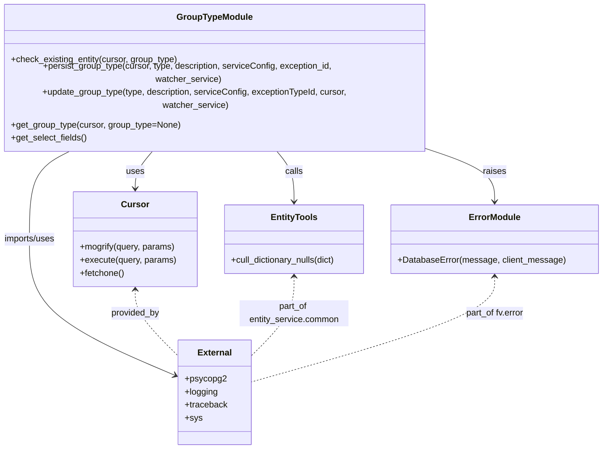

# Diagram: entity_core/entity_service/entity_service/db/group_type.py


> Auto-generated by Obscura crawlers

## Diagram 1

```mermaid
flowchart LR
    PG[persist_group_type(type, description, serviceConfig, exception_id, watcher_service)] -->|log SQL| M[mogrify & execute on cursor]
    M -->|INSERT success| G[get_group_type(cursor, type)]
    PG -->|exception| EXC[exception caught]
    EXC --> TB[traceback.print_exc()]
    EXC --> ATT[try update_group_type(...)]
    ATT --> U(update_group_type(type, description, serviceConfig, exceptionTypeId, cursor, watcher_service))
    U -->|log SQL & execute| M
    U -->|returns| G
    ATT -->|psycopg2.Error raised| DBERR{psycopg2.Error?}
    DBERR -->|yes| R[raise fv.error.DatabaseError(message, client_message).with_traceback(trace_back)]
    DBERR -->|no| G
    subgraph get_group_type_flow
        G --> SF[get_select_fields()]
        SF --> SQL[build SELECT json_build_object(...) SQL]
        G -->|execute SQL| CE[cursor.execute(sql, data)]
        CE --> RF[cursor.fetchone() -> row]
        RF --> RC{row == None?}
        RC -->|yes| RET_EMPTY[return {}]
        RC -->|no & group_type provided| CULL1[cull_dictionary_nulls(row[0]) -> return culled dict]
        RC -->|no & no group_type| LOOP[while row != None: append culled dict, row = cursor.fetchone() -> return status list]
    end
    CHECK[check_existing_entity(cursor, group_type)] -->|log SQL| CM[mogrify & execute SELECT EXISTS query]
    CM -->|fetch boolean| BOOL_RET[return existing_entity]
```

> SVG rendering failed for this diagram.

## Diagram 2



### SVG

<svg id="container" width="1107.2890625" xmlns="http://www.w3.org/2000/svg" class="classDiagram" height="776" viewBox="0 0 1107.2890625 776" role="graphics-document document" aria-roledescription="class"><style>#container{font-family:"trebuchet ms",verdana,arial,sans-serif;font-size:16px;fill:#333;}@keyframes edge-animation-frame{from{stroke-dashoffset:0;}}@keyframes dash{to{stroke-dashoffset:0;}}#container .edge-animation-slow{stroke-dasharray:9,5!important;stroke-dashoffset:900;animation:dash 50s linear infinite;stroke-linecap:round;}#container .edge-animation-fast{stroke-dasharray:9,5!important;stroke-dashoffset:900;animation:dash 20s linear infinite;stroke-linecap:round;}#container .error-icon{fill:#552222;}#container .error-text{fill:#552222;stroke:#552222;}#container .edge-thickness-normal{stroke-width:1px;}#container .edge-thickness-thick{stroke-width:3.5px;}#container .edge-pattern-solid{stroke-dasharray:0;}#container .edge-thickness-invisible{stroke-width:0;fill:none;}#container .edge-pattern-dashed{stroke-dasharray:3;}#container .edge-pattern-dotted{stroke-dasharray:2;}#container .marker{fill:#333333;stroke:#333333;}#container .marker.cross{stroke:#333333;}#container svg{font-family:"trebuchet ms",verdana,arial,sans-serif;font-size:16px;}#container p{margin:0;}#container g.classGroup text{fill:#9370DB;stroke:none;font-family:"trebuchet ms",verdana,arial,sans-serif;font-size:10px;}#container g.classGroup text .title{font-weight:bolder;}#container .nodeLabel,#container .edgeLabel{color:#131300;}#container .edgeLabel .label rect{fill:#ECECFF;}#container .label text{fill:#131300;}#container .labelBkg{background:#ECECFF;}#container .edgeLabel .label span{background:#ECECFF;}#container .classTitle{font-weight:bolder;}#container .node rect,#container .node circle,#container .node ellipse,#container .node polygon,#container .node path{fill:#ECECFF;stroke:#9370DB;stroke-width:1px;}#container .divider{stroke:#9370DB;stroke-width:1;}#container g.clickable{cursor:pointer;}#container g.classGroup rect{fill:#ECECFF;stroke:#9370DB;}#container g.classGroup line{stroke:#9370DB;stroke-width:1;}#container .classLabel .box{stroke:none;stroke-width:0;fill:#ECECFF;opacity:0.5;}#container .classLabel .label{fill:#9370DB;font-size:10px;}#container .relation{stroke:#333333;stroke-width:1;fill:none;}#container .dashed-line{stroke-dasharray:3;}#container .dotted-line{stroke-dasharray:1 2;}#container #compositionStart,#container .composition{fill:#333333!important;stroke:#333333!important;stroke-width:1;}#container #compositionEnd,#container .composition{fill:#333333!important;stroke:#333333!important;stroke-width:1;}#container #dependencyStart,#container .dependency{fill:#333333!important;stroke:#333333!important;stroke-width:1;}#container #dependencyStart,#container .dependency{fill:#333333!important;stroke:#333333!important;stroke-width:1;}#container #extensionStart,#container .extension{fill:transparent!important;stroke:#333333!important;stroke-width:1;}#container #extensionEnd,#container .extension{fill:transparent!important;stroke:#333333!important;stroke-width:1;}#container #aggregationStart,#container .aggregation{fill:transparent!important;stroke:#333333!important;stroke-width:1;}#container #aggregationEnd,#container .aggregation{fill:transparent!important;stroke:#333333!important;stroke-width:1;}#container #lollipopStart,#container .lollipop{fill:#ECECFF!important;stroke:#333333!important;stroke-width:1;}#container #lollipopEnd,#container .lollipop{fill:#ECECFF!important;stroke:#333333!important;stroke-width:1;}#container .edgeTerminals{font-size:11px;line-height:initial;}#container .classTitleText{text-anchor:middle;font-size:18px;fill:#333;}#container .label-icon{display:inline-block;height:1em;overflow:visible;vertical-align:-0.125em;}#container .node .label-icon path{fill:currentColor;stroke:revert;stroke-width:revert;}#container :root{--mermaid-font-family:"trebuchet ms",verdana,arial,sans-serif;}</style><g><defs><marker id="container_class-aggregationStart" class="marker aggregation class" refX="18" refY="7" markerWidth="190" markerHeight="240" orient="auto"><path d="M 18,7 L9,13 L1,7 L9,1 Z"></path></marker></defs><defs><marker id="container_class-aggregationEnd" class="marker aggregation class" refX="1" refY="7" markerWidth="20" markerHeight="28" orient="auto"><path d="M 18,7 L9,13 L1,7 L9,1 Z"></path></marker></defs><defs><marker id="container_class-extensionStart" class="marker extension class" refX="18" refY="7" markerWidth="190" markerHeight="240" orient="auto"><path d="M 1,7 L18,13 V 1 Z"></path></marker></defs><defs><marker id="container_class-extensionEnd" class="marker extension class" refX="1" refY="7" markerWidth="20" markerHeight="28" orient="auto"><path d="M 1,1 V 13 L18,7 Z"></path></marker></defs><defs><marker id="container_class-compositionStart" class="marker composition class" refX="18" refY="7" markerWidth="190" markerHeight="240" orient="auto"><path d="M 18,7 L9,13 L1,7 L9,1 Z"></path></marker></defs><defs><marker id="container_class-compositionEnd" class="marker composition class" refX="1" refY="7" markerWidth="20" markerHeight="28" orient="auto"><path d="M 18,7 L9,13 L1,7 L9,1 Z"></path></marker></defs><defs><marker id="container_class-dependencyStart" class="marker dependency class" refX="6" refY="7" markerWidth="190" markerHeight="240" orient="auto"><path d="M 5,7 L9,13 L1,7 L9,1 Z"></path></marker></defs><defs><marker id="container_class-dependencyEnd" class="marker dependency class" refX="13" refY="7" markerWidth="20" markerHeight="28" orient="auto"><path d="M 18,7 L9,13 L14,7 L9,1 Z"></path></marker></defs><defs><marker id="container_class-lollipopStart" class="marker lollipop class" refX="13" refY="7" markerWidth="190" markerHeight="240" orient="auto"><circle stroke="black" fill="transparent" cx="7" cy="7" r="6"></circle></marker></defs><defs><marker id="container_class-lollipopEnd" class="marker lollipop class" refX="1" refY="7" markerWidth="190" markerHeight="240" orient="auto"><circle stroke="black" fill="transparent" cx="7" cy="7" r="6"></circle></marker></defs><g class="root"><g class="clusters"></g><g class="edgePaths"><path d="M289.408,230L283.299,236.167C277.189,242.333,264.969,254.667,258.86,266C252.75,277.333,252.75,287.667,252.75,292.833L252.75,298" id="id_GroupTypeModule_Cursor_1" class="edge-thickness-normal edge-pattern-solid relation" style=";;;" data-edge="true" data-et="edge" data-id="id_GroupTypeModule_Cursor_1" data-points="W3sieCI6Mjg5LjQwODIwMzEyNSwieSI6MjMwfSx7IngiOjI1Mi43NSwieSI6MjY3fSx7IngiOjI1Mi43NSwieSI6MzA0fV0=" marker-end="url(#container_class-dependencyEnd)"></path><path d="M509.357,230L515.467,236.167C521.577,242.333,533.796,254.667,539.906,270C546.016,285.333,546.016,303.667,546.016,312.833L546.016,322" id="id_GroupTypeModule_EntityTools_2" class="edge-thickness-normal edge-pattern-solid relation" style=";;;" data-edge="true" data-et="edge" data-id="id_GroupTypeModule_EntityTools_2" data-points="W3sieCI6NTA5LjM1NzQyMTg3NSwieSI6MjMwfSx7IngiOjU0Ni4wMTU2MjUsInkiOjI2N30seyJ4Ijo1NDYuMDE1NjI1LCJ5IjozMjh9XQ==" marker-end="url(#container_class-dependencyEnd)"></path><path d="M784.646,230L806.049,236.167C827.452,242.333,870.259,254.667,891.663,270C913.066,285.333,913.066,303.667,913.066,312.833L913.066,322" id="id_GroupTypeModule_ErrorModule_3" class="edge-thickness-normal edge-pattern-solid relation" style=";;;" data-edge="true" data-et="edge" data-id="id_GroupTypeModule_ErrorModule_3" data-points="W3sieCI6Nzg0LjY0NTUwNzgxMjUsInkiOjIzMH0seyJ4Ijo5MTMuMDY2NDA2MjUsInkiOjI2N30seyJ4Ijo5MTMuMDY2NDA2MjUsInkiOjMyOH1d" marker-end="url(#container_class-dependencyEnd)"></path><path d="M142.338,230L128.058,236.167C113.777,242.333,85.217,254.667,70.937,281.5C56.656,308.333,56.656,349.667,56.656,393C56.656,436.333,56.656,481.667,101.847,523.453C147.038,565.239,237.42,603.477,282.611,622.597L327.802,641.716" id="id_GroupTypeModule_External_4" class="edge-thickness-normal edge-pattern-solid relation" style=";;;" data-edge="true" data-et="edge" data-id="id_GroupTypeModule_External_4" data-points="W3sieCI6MTQyLjMzNzg5MDYyNSwieSI6MjMwfSx7IngiOjU2LjY1NjI1LCJ5IjoyNjd9LHsieCI6NTYuNjU2MjUsInkiOjM5MX0seyJ4Ijo1Ni42NTYyNSwieSI6NTI3fSx7IngiOjMzMy4zMjgxMjUsInkiOjY0NC4wNTM3MjgxNDUxNTk0fV0=" marker-end="url(#container_class-dependencyEnd)"></path><path d="M252.75,484L252.75,491.167C252.75,498.333,252.75,512.667,266.18,533.113C279.609,553.56,306.469,580.121,319.898,593.401L333.328,606.681" id="id_Cursor_External_5" class="edge-thickness-normal edge-pattern-dashed relation" style=";;;" data-edge="true" data-et="edge" data-id="id_Cursor_External_5" data-points="W3sieCI6MjUyLjc1LCJ5Ijo0Nzh9LHsieCI6MjUyLjc1LCJ5Ijo1Mjd9LHsieCI6MzMzLjMyODEyNSwieSI6NjA2LjY4MDg1NjczMTg0NTF9XQ==" marker-start="url(#container_class-dependencyStart)"></path><path d="M546.016,460L546.016,471.167C546.016,482.333,546.016,504.667,532.586,529.113C519.156,553.56,492.297,580.121,478.867,593.401L465.438,606.681" id="id_EntityTools_External_6" class="edge-thickness-normal edge-pattern-dashed relation" style=";;;" data-edge="true" data-et="edge" data-id="id_EntityTools_External_6" data-points="W3sieCI6NTQ2LjAxNTYyNSwieSI6NDU0fSx7IngiOjU0Ni4wMTU2MjUsInkiOjUyN30seyJ4Ijo0NjUuNDM3NSwieSI6NjA2LjY4MDg1NjczMTg0NTF9XQ==" marker-start="url(#container_class-dependencyStart)"></path><path d="M913.066,460L913.066,471.167C913.066,482.333,913.066,504.667,838.462,536.892C763.857,569.118,614.647,611.236,540.042,632.295L465.438,653.354" id="id_ErrorModule_External_7" class="edge-thickness-normal edge-pattern-dashed relation" style=";;;" data-edge="true" data-et="edge" data-id="id_ErrorModule_External_7" data-points="W3sieCI6OTEzLjA2NjQwNjI1LCJ5Ijo0NTR9LHsieCI6OTEzLjA2NjQwNjI1LCJ5Ijo1Mjd9LHsieCI6NDY1LjQzNzUsInkiOjY1My4zNTQ0MTc3Njk5MzY4fV0=" marker-start="url(#container_class-dependencyStart)"></path></g><g class="edgeLabels"><g class="edgeLabel" transform="translate(252.75, 267)"><g class="label" data-id="id_GroupTypeModule_Cursor_1" transform="translate(-16.4921875, -12)"><foreignObject width="32.984375" height="24"><div xmlns="http://www.w3.org/1999/xhtml" class="labelBkg" style="display: table-cell; white-space: nowrap; line-height: 1.5; max-width: 200px; text-align: center;"><span class="edgeLabel"><p>uses</p></span></div></foreignObject></g></g><g class="edgeLabel" transform="translate(546.015625, 267)"><g class="label" data-id="id_GroupTypeModule_EntityTools_2" transform="translate(-16.4453125, -12)"><foreignObject width="32.890625" height="24"><div xmlns="http://www.w3.org/1999/xhtml" class="labelBkg" style="display: table-cell; white-space: nowrap; line-height: 1.5; max-width: 200px; text-align: center;"><span class="edgeLabel"><p>calls</p></span></div></foreignObject></g></g><g class="edgeLabel" transform="translate(913.06640625, 267)"><g class="label" data-id="id_GroupTypeModule_ErrorModule_3" transform="translate(-21.25, -12)"><foreignObject width="42.5" height="24"><div xmlns="http://www.w3.org/1999/xhtml" class="labelBkg" style="display: table-cell; white-space: nowrap; line-height: 1.5; max-width: 200px; text-align: center;"><span class="edgeLabel"><p>raises</p></span></div></foreignObject></g></g><g class="edgeLabel" transform="translate(56.65625, 391)"><g class="label" data-id="id_GroupTypeModule_External_4" transform="translate(-48.65625, -12)"><foreignObject width="97.3125" height="24"><div xmlns="http://www.w3.org/1999/xhtml" class="labelBkg" style="display: table-cell; white-space: nowrap; line-height: 1.5; max-width: 200px; text-align: center;"><span class="edgeLabel"><p>imports/uses</p></span></div></foreignObject></g></g><g class="edgeLabel" transform="translate(252.75, 527)"><g class="label" data-id="id_Cursor_External_5" transform="translate(-45.1796875, -12)"><foreignObject width="90.359375" height="24"><div xmlns="http://www.w3.org/1999/xhtml" class="labelBkg" style="display: table-cell; white-space: nowrap; line-height: 1.5; max-width: 200px; text-align: center;"><span class="edgeLabel"><p>provided_by</p></span></div></foreignObject></g></g><g class="edgeLabel" transform="translate(546.015625, 527)"><g class="label" data-id="id_EntityTools_External_6" transform="translate(-100, -24)"><foreignObject width="200" height="48"><div xmlns="http://www.w3.org/1999/xhtml" class="labelBkg" style="display: table; white-space: break-spaces; line-height: 1.5; max-width: 200px; text-align: center; width: 200px;"><span class="edgeLabel"><p>part_of entity_service.common</p></span></div></foreignObject></g></g><g class="edgeLabel" transform="translate(913.06640625, 527)"><g class="label" data-id="id_ErrorModule_External_7" transform="translate(-54.671875, -12)"><foreignObject width="109.34375" height="24"><div xmlns="http://www.w3.org/1999/xhtml" class="labelBkg" style="display: table-cell; white-space: nowrap; line-height: 1.5; max-width: 200px; text-align: center;"><span class="edgeLabel"><p>part_of fv.error</p></span></div></foreignObject></g></g></g><g class="nodes"><g class="node default" id="classId-GroupTypeModule-0" transform="translate(399.3828125, 119)"><g class="basic label-container"><path d="M-389.4453125 -111 L389.4453125 -111 L389.4453125 111 L-389.4453125 111" stroke="none" stroke-width="0" fill="#ECECFF" style=""></path><path d="M-389.4453125 -111 C-98.43557048078463 -111, 192.57417153843073 -111, 389.4453125 -111 M-389.4453125 -111 C-219.73616564289748 -111, -50.02701878579495 -111, 389.4453125 -111 M389.4453125 -111 C389.4453125 -63.140756181280274, 389.4453125 -15.281512362560548, 389.4453125 111 M389.4453125 -111 C389.4453125 -50.63822235813502, 389.4453125 9.723555283729965, 389.4453125 111 M389.4453125 111 C164.06989507961762 111, -61.30552234076475 111, -389.4453125 111 M389.4453125 111 C172.8528850766762 111, -43.739542346647625 111, -389.4453125 111 M-389.4453125 111 C-389.4453125 37.96617243179742, -389.4453125 -35.067655136405165, -389.4453125 -111 M-389.4453125 111 C-389.4453125 53.943331007464586, -389.4453125 -3.113337985070828, -389.4453125 -111" stroke="#9370DB" stroke-width="1.3" fill="none" stroke-dasharray="0 0" style=""></path></g><g class="annotation-group text" transform="translate(0, -87)"></g><g class="label-group text" transform="translate(-66.578125, -87)"><g class="label" style="font-weight: bolder" transform="translate(0,-12)"><foreignObject width="133.15625" height="24"><div xmlns="http://www.w3.org/1999/xhtml" style="display: table-cell; white-space: nowrap; line-height: 1.5; max-width: 182px; text-align: center;"><span class="nodeLabel markdown-node-label" style=""><p>GroupTypeModule</p></span></div></foreignObject></g></g><g class="members-group text" transform="translate(-377.4453125, -39)"></g><g class="methods-group text" transform="translate(-377.4453125, -9)"><g class="label" style="" transform="translate(0,-12)"><foreignObject width="308.4375" height="24"><div xmlns="http://www.w3.org/1999/xhtml" style="display: table-cell; white-space: nowrap; line-height: 1.5; max-width: 366px; text-align: center;"><span class="nodeLabel markdown-node-label" style=""><p>+check_existing_entity(cursor, group_type)</p></span></div></foreignObject></g><g class="label" style="" transform="translate(0,12)"><foreignObject width="661.0625" height="24"><div xmlns="http://www.w3.org/1999/xhtml" style="display: table-cell; white-space: nowrap; line-height: 1.5; max-width: 718px; text-align: center;"><span class="nodeLabel markdown-node-label" style=""><p>+persist_group_type(cursor, type, description, serviceConfig, exception_id, watcher_service)</p></span></div></foreignObject></g><g class="label" style="" transform="translate(0,36)"><foreignObject width="688.3125" height="24"><div xmlns="http://www.w3.org/1999/xhtml" style="display: table-cell; white-space: nowrap; line-height: 1.5; max-width: 746px; text-align: center;"><span class="nodeLabel markdown-node-label" style=""><p>+update_group_type(type, description, serviceConfig, exceptionTypeId, cursor, watcher_service)</p></span></div></foreignObject></g><g class="label" style="" transform="translate(0,60)"><foreignObject width="311.578125" height="24"><div xmlns="http://www.w3.org/1999/xhtml" style="display: table-cell; white-space: nowrap; line-height: 1.5; max-width: 369px; text-align: center;"><span class="nodeLabel markdown-node-label" style=""><p>+get_group_type(cursor, group_type=None)</p></span></div></foreignObject></g><g class="label" style="" transform="translate(0,84)"><foreignObject width="139.75" height="24"><div xmlns="http://www.w3.org/1999/xhtml" style="display: table-cell; white-space: nowrap; line-height: 1.5; max-width: 197px; text-align: center;"><span class="nodeLabel markdown-node-label" style=""><p>+get_select_fields()</p></span></div></foreignObject></g></g><g class="divider" style=""><path d="M-389.4453125 -63 C-183.97588290675176 -63, 21.493546686496472 -63, 389.4453125 -63 M-389.4453125 -63 C-220.55622590395507 -63, -51.66713930791013 -63, 389.4453125 -63" stroke="#9370DB" stroke-width="1.3" fill="none" stroke-dasharray="0 0" style=""></path></g><g class="divider" style=""><path d="M-389.4453125 -39 C-149.78089492247614 -39, 89.88352265504773 -39, 389.4453125 -39 M-389.4453125 -39 C-85.33618916243415 -39, 218.7729341751317 -39, 389.4453125 -39" stroke="#9370DB" stroke-width="1.3" fill="none" stroke-dasharray="0 0" style=""></path></g></g><g class="node default" id="classId-Cursor-1" transform="translate(252.75, 391)"><g class="basic label-container"><path d="M-112.4375 -87 L112.4375 -87 L112.4375 87 L-112.4375 87" stroke="none" stroke-width="0" fill="#ECECFF" style=""></path><path d="M-112.4375 -87 C-34.25944200065584 -87, 43.918615998688324 -87, 112.4375 -87 M-112.4375 -87 C-53.913448061860976 -87, 4.610603876278049 -87, 112.4375 -87 M112.4375 -87 C112.4375 -27.425304673380786, 112.4375 32.14939065323843, 112.4375 87 M112.4375 -87 C112.4375 -37.419717847291636, 112.4375 12.160564305416727, 112.4375 87 M112.4375 87 C50.244983370940716 87, -11.947533258118568 87, -112.4375 87 M112.4375 87 C51.84943608645969 87, -8.73862782708062 87, -112.4375 87 M-112.4375 87 C-112.4375 29.873617651602068, -112.4375 -27.252764696795865, -112.4375 -87 M-112.4375 87 C-112.4375 49.740662813360785, -112.4375 12.48132562672157, -112.4375 -87" stroke="#9370DB" stroke-width="1.3" fill="none" stroke-dasharray="0 0" style=""></path></g><g class="annotation-group text" transform="translate(0, -63)"></g><g class="label-group text" transform="translate(-23.90625, -63)"><g class="label" style="font-weight: bolder" transform="translate(0,-12)"><foreignObject width="47.8125" height="24"><div xmlns="http://www.w3.org/1999/xhtml" style="display: table-cell; white-space: nowrap; line-height: 1.5; max-width: 98px; text-align: center;"><span class="nodeLabel markdown-node-label" style=""><p>Cursor</p></span></div></foreignObject></g></g><g class="members-group text" transform="translate(-100.4375, -15)"></g><g class="methods-group text" transform="translate(-100.4375, 15)"><g class="label" style="" transform="translate(0,-12)"><foreignObject width="176.296875" height="24"><div xmlns="http://www.w3.org/1999/xhtml" style="display: table-cell; white-space: nowrap; line-height: 1.5; max-width: 234px; text-align: center;"><span class="nodeLabel markdown-node-label" style=""><p>+mogrify(query, params)</p></span></div></foreignObject></g><g class="label" style="" transform="translate(0,12)"><foreignObject width="176.96875" height="24"><div xmlns="http://www.w3.org/1999/xhtml" style="display: table-cell; white-space: nowrap; line-height: 1.5; max-width: 234px; text-align: center;"><span class="nodeLabel markdown-node-label" style=""><p>+execute(query, params)</p></span></div></foreignObject></g><g class="label" style="" transform="translate(0,36)"><foreignObject width="82.046875" height="24"><div xmlns="http://www.w3.org/1999/xhtml" style="display: table-cell; white-space: nowrap; line-height: 1.5; max-width: 139px; text-align: center;"><span class="nodeLabel markdown-node-label" style=""><p>+fetchone()</p></span></div></foreignObject></g></g><g class="divider" style=""><path d="M-112.4375 -39 C-38.916392566207435 -39, 34.60471486758513 -39, 112.4375 -39 M-112.4375 -39 C-45.345925879479466 -39, 21.745648241041067 -39, 112.4375 -39" stroke="#9370DB" stroke-width="1.3" fill="none" stroke-dasharray="0 0" style=""></path></g><g class="divider" style=""><path d="M-112.4375 -15 C-62.55721277271226 -15, -12.676925545424524 -15, 112.4375 -15 M-112.4375 -15 C-57.75460599744282 -15, -3.0717119948856464 -15, 112.4375 -15" stroke="#9370DB" stroke-width="1.3" fill="none" stroke-dasharray="0 0" style=""></path></g></g><g class="node default" id="classId-EntityTools-2" transform="translate(546.015625, 391)"><g class="basic label-container"><path d="M-130.828125 -63 L130.828125 -63 L130.828125 63 L-130.828125 63" stroke="none" stroke-width="0" fill="#ECECFF" style=""></path><path d="M-130.828125 -63 C-32.76583738610378 -63, 65.29645022779243 -63, 130.828125 -63 M-130.828125 -63 C-39.158514865939466 -63, 52.51109526812107 -63, 130.828125 -63 M130.828125 -63 C130.828125 -21.01400275235222, 130.828125 20.97199449529556, 130.828125 63 M130.828125 -63 C130.828125 -32.6433656311893, 130.828125 -2.286731262378602, 130.828125 63 M130.828125 63 C38.20556742956465 63, -54.416990140870695 63, -130.828125 63 M130.828125 63 C46.86494251776972 63, -37.09823996446056 63, -130.828125 63 M-130.828125 63 C-130.828125 19.180667082296686, -130.828125 -24.638665835406627, -130.828125 -63 M-130.828125 63 C-130.828125 28.272754394776634, -130.828125 -6.454491210446733, -130.828125 -63" stroke="#9370DB" stroke-width="1.3" fill="none" stroke-dasharray="0 0" style=""></path></g><g class="annotation-group text" transform="translate(0, -39)"></g><g class="label-group text" transform="translate(-40.75, -39)"><g class="label" style="font-weight: bolder" transform="translate(0,-12)"><foreignObject width="81.5" height="24"><div xmlns="http://www.w3.org/1999/xhtml" style="display: table-cell; white-space: nowrap; line-height: 1.5; max-width: 130px; text-align: center;"><span class="nodeLabel markdown-node-label" style=""><p>EntityTools</p></span></div></foreignObject></g></g><g class="members-group text" transform="translate(-118.828125, 9)"></g><g class="methods-group text" transform="translate(-118.828125, 39)"><g class="label" style="" transform="translate(0,-12)"><foreignObject width="196.90625" height="24"><div xmlns="http://www.w3.org/1999/xhtml" style="display: table-cell; white-space: nowrap; line-height: 1.5; max-width: 254px; text-align: center;"><span class="nodeLabel markdown-node-label" style=""><p>+cull_dictionary_nulls(dict)</p></span></div></foreignObject></g></g><g class="divider" style=""><path d="M-130.828125 -15 C-37.00787045862583 -15, 56.81238408274834 -15, 130.828125 -15 M-130.828125 -15 C-52.53568101506983 -15, 25.756762969860347 -15, 130.828125 -15" stroke="#9370DB" stroke-width="1.3" fill="none" stroke-dasharray="0 0" style=""></path></g><g class="divider" style=""><path d="M-130.828125 9 C-29.584749376996683 9, 71.65862624600663 9, 130.828125 9 M-130.828125 9 C-46.32906398033566 9, 38.16999703932868 9, 130.828125 9" stroke="#9370DB" stroke-width="1.3" fill="none" stroke-dasharray="0 0" style=""></path></g></g><g class="node default" id="classId-ErrorModule-3" transform="translate(913.06640625, 391)"><g class="basic label-container"><path d="M-186.22265625 -63 L186.22265625 -63 L186.22265625 63 L-186.22265625 63" stroke="none" stroke-width="0" fill="#ECECFF" style=""></path><path d="M-186.22265625 -63 C-61.872389794263384 -63, 62.47787666147323 -63, 186.22265625 -63 M-186.22265625 -63 C-61.55316485076489 -63, 63.11632654847023 -63, 186.22265625 -63 M186.22265625 -63 C186.22265625 -30.813374081334352, 186.22265625 1.3732518373312956, 186.22265625 63 M186.22265625 -63 C186.22265625 -34.31176542011702, 186.22265625 -5.623530840234039, 186.22265625 63 M186.22265625 63 C46.873236426338394 63, -92.47618339732321 63, -186.22265625 63 M186.22265625 63 C42.22505868964788 63, -101.77253887070424 63, -186.22265625 63 M-186.22265625 63 C-186.22265625 15.258941026222573, -186.22265625 -32.482117947554855, -186.22265625 -63 M-186.22265625 63 C-186.22265625 15.799473115511773, -186.22265625 -31.401053768976453, -186.22265625 -63" stroke="#9370DB" stroke-width="1.3" fill="none" stroke-dasharray="0 0" style=""></path></g><g class="annotation-group text" transform="translate(0, -39)"></g><g class="label-group text" transform="translate(-45.2734375, -39)"><g class="label" style="font-weight: bolder" transform="translate(0,-12)"><foreignObject width="90.546875" height="24"><div xmlns="http://www.w3.org/1999/xhtml" style="display: table-cell; white-space: nowrap; line-height: 1.5; max-width: 140px; text-align: center;"><span class="nodeLabel markdown-node-label" style=""><p>ErrorModule</p></span></div></foreignObject></g></g><g class="members-group text" transform="translate(-174.22265625, 9)"></g><g class="methods-group text" transform="translate(-174.22265625, 39)"><g class="label" style="" transform="translate(0,-12)"><foreignObject width="303.171875" height="24"><div xmlns="http://www.w3.org/1999/xhtml" style="display: table-cell; white-space: nowrap; line-height: 1.5; max-width: 361px; text-align: center;"><span class="nodeLabel markdown-node-label" style=""><p>+DatabaseError(message, client_message)</p></span></div></foreignObject></g></g><g class="divider" style=""><path d="M-186.22265625 -15 C-42.413233468340906 -15, 101.39618931331819 -15, 186.22265625 -15 M-186.22265625 -15 C-84.05242832764404 -15, 18.117799594711926 -15, 186.22265625 -15" stroke="#9370DB" stroke-width="1.3" fill="none" stroke-dasharray="0 0" style=""></path></g><g class="divider" style=""><path d="M-186.22265625 9 C-89.36358832440565 9, 7.495479601188691 9, 186.22265625 9 M-186.22265625 9 C-46.11110274088301 9, 94.00045076823397 9, 186.22265625 9" stroke="#9370DB" stroke-width="1.3" fill="none" stroke-dasharray="0 0" style=""></path></g></g><g class="node default" id="classId-External-4" transform="translate(399.3828125, 672)"><g class="basic label-container"><path d="M-66.0546875 -96 L66.0546875 -96 L66.0546875 96 L-66.0546875 96" stroke="none" stroke-width="0" fill="#ECECFF" style=""></path><path d="M-66.0546875 -96 C-18.61794424728994 -96, 28.818799005420118 -96, 66.0546875 -96 M-66.0546875 -96 C-23.564840381882355 -96, 18.92500673623529 -96, 66.0546875 -96 M66.0546875 -96 C66.0546875 -40.246739281107125, 66.0546875 15.50652143778575, 66.0546875 96 M66.0546875 -96 C66.0546875 -35.71785705512143, 66.0546875 24.564285889757144, 66.0546875 96 M66.0546875 96 C36.52080649594825 96, 6.986925491896507 96, -66.0546875 96 M66.0546875 96 C17.526630283494306 96, -31.001426933011388 96, -66.0546875 96 M-66.0546875 96 C-66.0546875 20.60818049749895, -66.0546875 -54.7836390050021, -66.0546875 -96 M-66.0546875 96 C-66.0546875 51.871259411462, -66.0546875 7.742518822923998, -66.0546875 -96" stroke="#9370DB" stroke-width="1.3" fill="none" stroke-dasharray="0 0" style=""></path></g><g class="annotation-group text" transform="translate(0, -72)"></g><g class="label-group text" transform="translate(-30.171875, -72)"><g class="label" style="font-weight: bolder" transform="translate(0,-12)"><foreignObject width="60.34375" height="24"><div xmlns="http://www.w3.org/1999/xhtml" style="display: table-cell; white-space: nowrap; line-height: 1.5; max-width: 110px; text-align: center;"><span class="nodeLabel markdown-node-label" style=""><p>External</p></span></div></foreignObject></g></g><g class="members-group text" transform="translate(-54.0546875, -24)"><g class="label" style="" transform="translate(0,-12)"><foreignObject width="74.921875" height="24"><div xmlns="http://www.w3.org/1999/xhtml" style="display: table-cell; white-space: nowrap; line-height: 1.5; max-width: 132px; text-align: center;"><span class="nodeLabel markdown-node-label" style=""><p>+psycopg2</p></span></div></foreignObject></g><g class="label" style="" transform="translate(0,12)"><foreignObject width="60.796875" height="24"><div xmlns="http://www.w3.org/1999/xhtml" style="display: table-cell; white-space: nowrap; line-height: 1.5; max-width: 119px; text-align: center;"><span class="nodeLabel markdown-node-label" style=""><p>+logging</p></span></div></foreignObject></g><g class="label" style="" transform="translate(0,36)"><foreignObject width="77.9375" height="24"><div xmlns="http://www.w3.org/1999/xhtml" style="display: table-cell; white-space: nowrap; line-height: 1.5; max-width: 136px; text-align: center;"><span class="nodeLabel markdown-node-label" style=""><p>+traceback</p></span></div></foreignObject></g><g class="label" style="" transform="translate(0,60)"><foreignObject width="30.421875" height="24"><div xmlns="http://www.w3.org/1999/xhtml" style="display: table-cell; white-space: nowrap; line-height: 1.5; max-width: 88px; text-align: center;"><span class="nodeLabel markdown-node-label" style=""><p>+sys</p></span></div></foreignObject></g></g><g class="methods-group text" transform="translate(-54.0546875, 96)"></g><g class="divider" style=""><path d="M-66.0546875 -48 C-20.710251948966402 -48, 24.634183602067196 -48, 66.0546875 -48 M-66.0546875 -48 C-17.281569289214623 -48, 31.491548921570754 -48, 66.0546875 -48" stroke="#9370DB" stroke-width="1.3" fill="none" stroke-dasharray="0 0" style=""></path></g><g class="divider" style=""><path d="M-66.0546875 72 C-27.82415105340666 72, 10.406385393186682 72, 66.0546875 72 M-66.0546875 72 C-22.047381690401863 72, 21.959924119196273 72, 66.0546875 72" stroke="#9370DB" stroke-width="1.3" fill="none" stroke-dasharray="0 0" style=""></path></g></g></g></g></g></svg>
