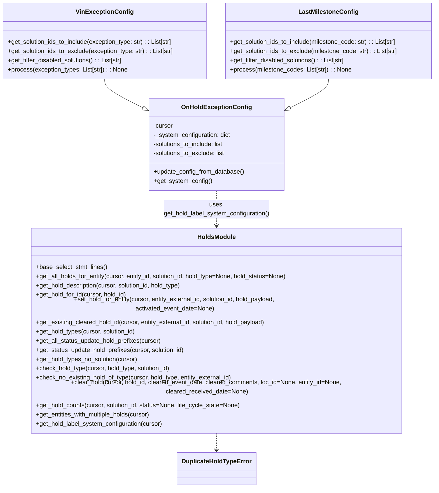

# Diagram: entity_core/entity_service/entity_service/db/hold.py


> Auto-generated by Obscura crawlers

## Diagram 1



### SVG

<svg id="container" width="1140.5859375" xmlns="http://www.w3.org/2000/svg" class="classDiagram" height="1222" viewBox="0 0 1140.5859375 1222" role="graphics-document document" aria-roledescription="class"><style>#container{font-family:"trebuchet ms",verdana,arial,sans-serif;font-size:16px;fill:#333;}@keyframes edge-animation-frame{from{stroke-dashoffset:0;}}@keyframes dash{to{stroke-dashoffset:0;}}#container .edge-animation-slow{stroke-dasharray:9,5!important;stroke-dashoffset:900;animation:dash 50s linear infinite;stroke-linecap:round;}#container .edge-animation-fast{stroke-dasharray:9,5!important;stroke-dashoffset:900;animation:dash 20s linear infinite;stroke-linecap:round;}#container .error-icon{fill:#552222;}#container .error-text{fill:#552222;stroke:#552222;}#container .edge-thickness-normal{stroke-width:1px;}#container .edge-thickness-thick{stroke-width:3.5px;}#container .edge-pattern-solid{stroke-dasharray:0;}#container .edge-thickness-invisible{stroke-width:0;fill:none;}#container .edge-pattern-dashed{stroke-dasharray:3;}#container .edge-pattern-dotted{stroke-dasharray:2;}#container .marker{fill:#333333;stroke:#333333;}#container .marker.cross{stroke:#333333;}#container svg{font-family:"trebuchet ms",verdana,arial,sans-serif;font-size:16px;}#container p{margin:0;}#container g.classGroup text{fill:#9370DB;stroke:none;font-family:"trebuchet ms",verdana,arial,sans-serif;font-size:10px;}#container g.classGroup text .title{font-weight:bolder;}#container .nodeLabel,#container .edgeLabel{color:#131300;}#container .edgeLabel .label rect{fill:#ECECFF;}#container .label text{fill:#131300;}#container .labelBkg{background:#ECECFF;}#container .edgeLabel .label span{background:#ECECFF;}#container .classTitle{font-weight:bolder;}#container .node rect,#container .node circle,#container .node ellipse,#container .node polygon,#container .node path{fill:#ECECFF;stroke:#9370DB;stroke-width:1px;}#container .divider{stroke:#9370DB;stroke-width:1;}#container g.clickable{cursor:pointer;}#container g.classGroup rect{fill:#ECECFF;stroke:#9370DB;}#container g.classGroup line{stroke:#9370DB;stroke-width:1;}#container .classLabel .box{stroke:none;stroke-width:0;fill:#ECECFF;opacity:0.5;}#container .classLabel .label{fill:#9370DB;font-size:10px;}#container .relation{stroke:#333333;stroke-width:1;fill:none;}#container .dashed-line{stroke-dasharray:3;}#container .dotted-line{stroke-dasharray:1 2;}#container #compositionStart,#container .composition{fill:#333333!important;stroke:#333333!important;stroke-width:1;}#container #compositionEnd,#container .composition{fill:#333333!important;stroke:#333333!important;stroke-width:1;}#container #dependencyStart,#container .dependency{fill:#333333!important;stroke:#333333!important;stroke-width:1;}#container #dependencyStart,#container .dependency{fill:#333333!important;stroke:#333333!important;stroke-width:1;}#container #extensionStart,#container .extension{fill:transparent!important;stroke:#333333!important;stroke-width:1;}#container #extensionEnd,#container .extension{fill:transparent!important;stroke:#333333!important;stroke-width:1;}#container #aggregationStart,#container .aggregation{fill:transparent!important;stroke:#333333!important;stroke-width:1;}#container #aggregationEnd,#container .aggregation{fill:transparent!important;stroke:#333333!important;stroke-width:1;}#container #lollipopStart,#container .lollipop{fill:#ECECFF!important;stroke:#333333!important;stroke-width:1;}#container #lollipopEnd,#container .lollipop{fill:#ECECFF!important;stroke:#333333!important;stroke-width:1;}#container .edgeTerminals{font-size:11px;line-height:initial;}#container .classTitleText{text-anchor:middle;font-size:18px;fill:#333;}#container .label-icon{display:inline-block;height:1em;overflow:visible;vertical-align:-0.125em;}#container .node .label-icon path{fill:currentColor;stroke:revert;stroke-width:revert;}#container :root{--mermaid-font-family:"trebuchet ms",verdana,arial,sans-serif;}</style><g><defs><marker id="container_class-aggregationStart" class="marker aggregation class" refX="18" refY="7" markerWidth="190" markerHeight="240" orient="auto"><path d="M 18,7 L9,13 L1,7 L9,1 Z"></path></marker></defs><defs><marker id="container_class-aggregationEnd" class="marker aggregation class" refX="1" refY="7" markerWidth="20" markerHeight="28" orient="auto"><path d="M 18,7 L9,13 L1,7 L9,1 Z"></path></marker></defs><defs><marker id="container_class-extensionStart" class="marker extension class" refX="18" refY="7" markerWidth="190" markerHeight="240" orient="auto"><path d="M 1,7 L18,13 V 1 Z"></path></marker></defs><defs><marker id="container_class-extensionEnd" class="marker extension class" refX="1" refY="7" markerWidth="20" markerHeight="28" orient="auto"><path d="M 1,1 V 13 L18,7 Z"></path></marker></defs><defs><marker id="container_class-compositionStart" class="marker composition class" refX="18" refY="7" markerWidth="190" markerHeight="240" orient="auto"><path d="M 18,7 L9,13 L1,7 L9,1 Z"></path></marker></defs><defs><marker id="container_class-compositionEnd" class="marker composition class" refX="1" refY="7" markerWidth="20" markerHeight="28" orient="auto"><path d="M 18,7 L9,13 L1,7 L9,1 Z"></path></marker></defs><defs><marker id="container_class-dependencyStart" class="marker dependency class" refX="6" refY="7" markerWidth="190" markerHeight="240" orient="auto"><path d="M 5,7 L9,13 L1,7 L9,1 Z"></path></marker></defs><defs><marker id="container_class-dependencyEnd" class="marker dependency class" refX="13" refY="7" markerWidth="20" markerHeight="28" orient="auto"><path d="M 18,7 L9,13 L14,7 L9,1 Z"></path></marker></defs><defs><marker id="container_class-lollipopStart" class="marker lollipop class" refX="13" refY="7" markerWidth="190" markerHeight="240" orient="auto"><circle stroke="black" fill="transparent" cx="7" cy="7" r="6"></circle></marker></defs><defs><marker id="container_class-lollipopEnd" class="marker lollipop class" refX="1" refY="7" markerWidth="190" markerHeight="240" orient="auto"><circle stroke="black" fill="transparent" cx="7" cy="7" r="6"></circle></marker></defs><g class="root"><g class="clusters"></g><g class="edgePaths"><path d="M274.633,206L274.633,210.167C274.633,214.333,274.633,222.667,292.017,235.417C309.401,248.168,344.169,265.336,361.553,273.92L378.937,282.505" id="id_VinExceptionConfig_OnHoldExceptionConfig_1" class="edge-thickness-normal edge-pattern-solid relation" style=";;;" data-edge="true" data-et="edge" data-id="id_VinExceptionConfig_OnHoldExceptionConfig_1" data-points="W3sieCI6Mjc0LjYzMjgxMjUsInkiOjIwNn0seyJ4IjoyNzQuNjMyODEyNSwieSI6MjMxfSx7IngiOjM5NC40MDQyOTY4NzUsInkiOjI5MC4xNDIwODQ2NDQxODk3N31d" marker-end="url(#container_class-extensionEnd)"></path><path d="M861.926,206L861.926,210.167C861.926,214.333,861.926,222.667,844.542,235.417C827.158,248.168,792.39,265.336,775.005,273.92L757.621,282.505" id="id_LastMilestoneConfig_OnHoldExceptionConfig_2" class="edge-thickness-normal edge-pattern-solid relation" style=";;;" data-edge="true" data-et="edge" data-id="id_LastMilestoneConfig_OnHoldExceptionConfig_2" data-points="W3sieCI6ODYxLjkyNTc4MTI1LCJ5IjoyMDZ9LHsieCI6ODYxLjkyNTc4MTI1LCJ5IjoyMzF9LHsieCI6NzQyLjE1NDI5Njg3NSwieSI6MjkwLjE0MjA4NDY0NDE4OTc3fV0=" marker-end="url(#container_class-extensionEnd)"></path><path d="M568.279,496L568.279,504.167C568.279,512.333,568.279,528.667,568.279,544C568.279,559.333,568.279,573.667,568.279,580.833L568.279,588" id="id_OnHoldExceptionConfig_HoldsModule_3" class="edge-thickness-normal edge-pattern-dashed relation" style=";;;" data-edge="true" data-et="edge" data-id="id_OnHoldExceptionConfig_HoldsModule_3" data-points="W3sieCI6NTY4LjI3OTI5Njg3NSwieSI6NDk2fSx7IngiOjU2OC4yNzkyOTY4NzUsInkiOjU0NX0seyJ4Ijo1NjguMjc5Mjk2ODc1LCJ5Ijo1OTR9XQ==" marker-end="url(#container_class-dependencyEnd)"></path><path d="M568.279,1080L568.279,1084.167C568.279,1088.333,568.279,1096.667,568.279,1104C568.279,1111.333,568.279,1117.667,568.279,1120.833L568.279,1124" id="id_HoldsModule_DuplicateHoldTypeError_4" class="edge-thickness-normal edge-pattern-dashed relation" style=";;;" data-edge="true" data-et="edge" data-id="id_HoldsModule_DuplicateHoldTypeError_4" data-points="W3sieCI6NTY4LjI3OTI5Njg3NSwieSI6MTA4MH0seyJ4Ijo1NjguMjc5Mjk2ODc1LCJ5IjoxMTA1fSx7IngiOjU2OC4yNzkyOTY4NzUsInkiOjExMzB9XQ==" marker-end="url(#container_class-dependencyEnd)"></path></g><g class="edgeLabels"><g class="edgeLabel"><g class="label" data-id="id_VinExceptionConfig_OnHoldExceptionConfig_1" transform="translate(0, 0)"><foreignObject width="0" height="0"><div xmlns="http://www.w3.org/1999/xhtml" class="labelBkg" style="display: table-cell; white-space: nowrap; line-height: 1.5; max-width: 200px; text-align: center;"><span class="edgeLabel"></span></div></foreignObject></g></g><g class="edgeLabel"><g class="label" data-id="id_LastMilestoneConfig_OnHoldExceptionConfig_2" transform="translate(0, 0)"><foreignObject width="0" height="0"><div xmlns="http://www.w3.org/1999/xhtml" class="labelBkg" style="display: table-cell; white-space: nowrap; line-height: 1.5; max-width: 200px; text-align: center;"><span class="edgeLabel"></span></div></foreignObject></g></g><g class="edgeLabel" transform="translate(568.279296875, 545)"><g class="label" data-id="id_OnHoldExceptionConfig_HoldsModule_3" transform="translate(-140.6484375, -24)"><foreignObject width="281.296875" height="48"><div xmlns="http://www.w3.org/1999/xhtml" class="labelBkg" style="display: table; white-space: break-spaces; line-height: 1.5; max-width: 200px; text-align: center; width: 200px;"><span class="edgeLabel"><p>uses get_hold_label_system_configuration()</p></span></div></foreignObject></g></g><g class="edgeLabel"><g class="label" data-id="id_HoldsModule_DuplicateHoldTypeError_4" transform="translate(0, 0)"><foreignObject width="0" height="0"><div xmlns="http://www.w3.org/1999/xhtml" class="labelBkg" style="display: table-cell; white-space: nowrap; line-height: 1.5; max-width: 200px; text-align: center;"><span class="edgeLabel"></span></div></foreignObject></g></g></g><g class="nodes"><g class="node default" id="classId-DuplicateHoldTypeError-0" transform="translate(568.279296875, 1172)"><g class="basic label-container"><path d="M-99.3515625 -42 L99.3515625 -42 L99.3515625 42 L-99.3515625 42" stroke="none" stroke-width="0" fill="#ECECFF" style=""></path><path d="M-99.3515625 -42 C-26.36819595391526 -42, 46.61517059216948 -42, 99.3515625 -42 M-99.3515625 -42 C-40.63195720058356 -42, 18.087648098832886 -42, 99.3515625 -42 M99.3515625 -42 C99.3515625 -18.13632624423436, 99.3515625 5.727347511531278, 99.3515625 42 M99.3515625 -42 C99.3515625 -18.426018848040105, 99.3515625 5.14796230391979, 99.3515625 42 M99.3515625 42 C58.98246701806286 42, 18.613371536125726 42, -99.3515625 42 M99.3515625 42 C29.85766044696652 42, -39.63624160606696 42, -99.3515625 42 M-99.3515625 42 C-99.3515625 11.270134663534279, -99.3515625 -19.459730672931443, -99.3515625 -42 M-99.3515625 42 C-99.3515625 13.33901505210807, -99.3515625 -15.321969895783859, -99.3515625 -42" stroke="#9370DB" stroke-width="1.3" fill="none" stroke-dasharray="0 0" style=""></path></g><g class="annotation-group text" transform="translate(0, -18)"></g><g class="label-group text" transform="translate(-87.3515625, -18)"><g class="label" style="font-weight: bolder" transform="translate(0,-12)"><foreignObject width="174.703125" height="24"><div xmlns="http://www.w3.org/1999/xhtml" style="display: table-cell; white-space: nowrap; line-height: 1.5; max-width: 224px; text-align: center;"><span class="nodeLabel markdown-node-label" style=""><p>DuplicateHoldTypeError</p></span></div></foreignObject></g></g><g class="members-group text" transform="translate(-87.3515625, 30)"></g><g class="methods-group text" transform="translate(-87.3515625, 60)"></g><g class="divider" style=""><path d="M-99.3515625 6 C-55.655513254394855 6, -11.959464008789709 6, 99.3515625 6 M-99.3515625 6 C-33.70419644779132 6, 31.943169604417363 6, 99.3515625 6" stroke="#9370DB" stroke-width="1.3" fill="none" stroke-dasharray="0 0" style=""></path></g><g class="divider" style=""><path d="M-99.3515625 24 C-39.08775790827222 24, 21.176046683455553 24, 99.3515625 24 M-99.3515625 24 C-52.94307647106983 24, -6.53459044213966 24, 99.3515625 24" stroke="#9370DB" stroke-width="1.3" fill="none" stroke-dasharray="0 0" style=""></path></g></g><g class="node default" id="classId-HoldsModule-1" transform="translate(568.279296875, 837)"><g class="basic label-container"><path d="M-501.7734375 -243 L501.7734375 -243 L501.7734375 243 L-501.7734375 243" stroke="none" stroke-width="0" fill="#ECECFF" style=""></path><path d="M-501.7734375 -243 C-174.01738097146216 -243, 153.73867555707568 -243, 501.7734375 -243 M-501.7734375 -243 C-200.31360774877606 -243, 101.14622200244787 -243, 501.7734375 -243 M501.7734375 -243 C501.7734375 -132.5840684783838, 501.7734375 -22.168136956767626, 501.7734375 243 M501.7734375 -243 C501.7734375 -134.0798995085937, 501.7734375 -25.159799017187424, 501.7734375 243 M501.7734375 243 C139.3501197934687 243, -223.0731979130626 243, -501.7734375 243 M501.7734375 243 C155.30411365271135 243, -191.1652101945773 243, -501.7734375 243 M-501.7734375 243 C-501.7734375 84.55493276198365, -501.7734375 -73.8901344760327, -501.7734375 -243 M-501.7734375 243 C-501.7734375 111.92536377867799, -501.7734375 -19.14927244264402, -501.7734375 -243" stroke="#9370DB" stroke-width="1.3" fill="none" stroke-dasharray="0 0" style=""></path></g><g class="annotation-group text" transform="translate(0, -219)"></g><g class="label-group text" transform="translate(-48.09375, -219)"><g class="label" style="font-weight: bolder" transform="translate(0,-12)"><foreignObject width="96.1875" height="24"><div xmlns="http://www.w3.org/1999/xhtml" style="display: table-cell; white-space: nowrap; line-height: 1.5; max-width: 146px; text-align: center;"><span class="nodeLabel markdown-node-label" style=""><p>HoldsModule</p></span></div></foreignObject></g></g><g class="members-group text" transform="translate(-489.7734375, -171)"></g><g class="methods-group text" transform="translate(-489.7734375, -141)"><g class="label" style="" transform="translate(0,-12)"><foreignObject width="187.375" height="24"><div xmlns="http://www.w3.org/1999/xhtml" style="display: table-cell; white-space: nowrap; line-height: 1.5; max-width: 245px; text-align: center;"><span class="nodeLabel markdown-node-label" style=""><p>+base_select_stmt_lines()</p></span></div></foreignObject></g><g class="label" style="" transform="translate(0,12)"><foreignObject width="666.34375" height="24"><div xmlns="http://www.w3.org/1999/xhtml" style="display: table-cell; white-space: nowrap; line-height: 1.5; max-width: 724px; text-align: center;"><span class="nodeLabel markdown-node-label" style=""><p>+get_all_holds_for_entity(cursor, entity_id, solution_id, hold_type=None, hold_status=None)</p></span></div></foreignObject></g><g class="label" style="" transform="translate(0,36)"><foreignObject width="388.265625" height="24"><div xmlns="http://www.w3.org/1999/xhtml" style="display: table-cell; white-space: nowrap; line-height: 1.5; max-width: 446px; text-align: center;"><span class="nodeLabel markdown-node-label" style=""><p>+get_hold_description(cursor, solution_id, hold_type)</p></span></div></foreignObject></g><g class="label" style="" transform="translate(0,60)"><foreignObject width="239.796875" height="24"><div xmlns="http://www.w3.org/1999/xhtml" style="display: table-cell; white-space: nowrap; line-height: 1.5; max-width: 297px; text-align: center;"><span class="nodeLabel markdown-node-label" style=""><p>+get_hold_for_id(cursor, hold_id)</p></span></div></foreignObject></g><g class="label" style="" transform="translate(0,84)"><foreignObject width="750.15625" height="24"><div xmlns="http://www.w3.org/1999/xhtml" style="display: table-cell; white-space: nowrap; line-height: 1.5; max-width: 808px; text-align: center;"><span class="nodeLabel markdown-node-label" style=""><p>+set_hold_for_entity(cursor, entity_external_id, solution_id, hold_payload, activated_event_date=None)</p></span></div></foreignObject></g><g class="label" style="" transform="translate(0,108)"><foreignObject width="611.53125" height="24"><div xmlns="http://www.w3.org/1999/xhtml" style="display: table-cell; white-space: nowrap; line-height: 1.5; max-width: 669px; text-align: center;"><span class="nodeLabel markdown-node-label" style=""><p>+get_existing_cleared_hold_id(cursor, entity_external_id, solution_id, hold_payload)</p></span></div></foreignObject></g><g class="label" style="" transform="translate(0,132)"><foreignObject width="264.15625" height="24"><div xmlns="http://www.w3.org/1999/xhtml" style="display: table-cell; white-space: nowrap; line-height: 1.5; max-width: 322px; text-align: center;"><span class="nodeLabel markdown-node-label" style=""><p>+get_hold_types(cursor, solution_id)</p></span></div></foreignObject></g><g class="label" style="" transform="translate(0,156)"><foreignObject width="330.453125" height="24"><div xmlns="http://www.w3.org/1999/xhtml" style="display: table-cell; white-space: nowrap; line-height: 1.5; max-width: 388px; text-align: center;"><span class="nodeLabel markdown-node-label" style=""><p>+get_all_status_update_hold_prefixes(cursor)</p></span></div></foreignObject></g><g class="label" style="" transform="translate(0,180)"><foreignObject width="393.5625" height="24"><div xmlns="http://www.w3.org/1999/xhtml" style="display: table-cell; white-space: nowrap; line-height: 1.5; max-width: 451px; text-align: center;"><span class="nodeLabel markdown-node-label" style=""><p>+get_status_update_hold_prefixes(cursor, solution_id)</p></span></div></foreignObject></g><g class="label" style="" transform="translate(0,204)"><foreignObject width="269.671875" height="24"><div xmlns="http://www.w3.org/1999/xhtml" style="display: table-cell; white-space: nowrap; line-height: 1.5; max-width: 327px; text-align: center;"><span class="nodeLabel markdown-node-label" style=""><p>+get_hold_types_no_solution(cursor)</p></span></div></foreignObject></g><g class="label" style="" transform="translate(0,228)"><foreignObject width="356.3125" height="24"><div xmlns="http://www.w3.org/1999/xhtml" style="display: table-cell; white-space: nowrap; line-height: 1.5; max-width: 414px; text-align: center;"><span class="nodeLabel markdown-node-label" style=""><p>+check_hold_type(cursor, hold_type, solution_id)</p></span></div></foreignObject></g><g class="label" style="" transform="translate(0,252)"><foreignObject width="518.65625" height="24"><div xmlns="http://www.w3.org/1999/xhtml" style="display: table-cell; white-space: nowrap; line-height: 1.5; max-width: 576px; text-align: center;"><span class="nodeLabel markdown-node-label" style=""><p>+check_no_existing_hold_of_type(cursor, hold_type, entity_external_id)</p></span></div></foreignObject></g><g class="label" style="" transform="translate(0,276)"><foreignObject width="931.453125" height="24"><div xmlns="http://www.w3.org/1999/xhtml" style="display: table-cell; white-space: nowrap; line-height: 1.5; max-width: 989px; text-align: center;"><span class="nodeLabel markdown-node-label" style=""><p>+clear_hold(cursor, hold_id, cleared_event_date, cleared_comments, loc_id=None, entity_id=None, cleared_received_date=None)</p></span></div></foreignObject></g><g class="label" style="" transform="translate(0,300)"><foreignObject width="537.953125" height="24"><div xmlns="http://www.w3.org/1999/xhtml" style="display: table-cell; white-space: nowrap; line-height: 1.5; max-width: 595px; text-align: center;"><span class="nodeLabel markdown-node-label" style=""><p>+get_hold_counts(cursor, solution_id, status=None, life_cycle_state=None)</p></span></div></foreignObject></g><g class="label" style="" transform="translate(0,324)"><foreignObject width="305.84375" height="24"><div xmlns="http://www.w3.org/1999/xhtml" style="display: table-cell; white-space: nowrap; line-height: 1.5; max-width: 363px; text-align: center;"><span class="nodeLabel markdown-node-label" style=""><p>+get_entities_with_multiple_holds(cursor)</p></span></div></foreignObject></g><g class="label" style="" transform="translate(0,348)"><foreignObject width="335.015625" height="24"><div xmlns="http://www.w3.org/1999/xhtml" style="display: table-cell; white-space: nowrap; line-height: 1.5; max-width: 392px; text-align: center;"><span class="nodeLabel markdown-node-label" style=""><p>+get_hold_label_system_configuration(cursor)</p></span></div></foreignObject></g></g><g class="divider" style=""><path d="M-501.7734375 -195 C-247.313578358229 -195, 7.146280783542011 -195, 501.7734375 -195 M-501.7734375 -195 C-138.7252695463962 -195, 224.32289840720762 -195, 501.7734375 -195" stroke="#9370DB" stroke-width="1.3" fill="none" stroke-dasharray="0 0" style=""></path></g><g class="divider" style=""><path d="M-501.7734375 -171 C-100.93217808161546 -171, 299.9090813367691 -171, 501.7734375 -171 M-501.7734375 -171 C-300.7460229965935 -171, -99.71860849318705 -171, 501.7734375 -171" stroke="#9370DB" stroke-width="1.3" fill="none" stroke-dasharray="0 0" style=""></path></g></g><g class="node default" id="classId-OnHoldExceptionConfig-2" transform="translate(568.279296875, 376)"><g class="basic label-container"><path d="M-173.875 -120 L173.875 -120 L173.875 120 L-173.875 120" stroke="none" stroke-width="0" fill="#ECECFF" style=""></path><path d="M-173.875 -120 C-47.63146561704754 -120, 78.61206876590492 -120, 173.875 -120 M-173.875 -120 C-78.97928652929917 -120, 15.916426941401653 -120, 173.875 -120 M173.875 -120 C173.875 -54.3093016720928, 173.875 11.381396655814399, 173.875 120 M173.875 -120 C173.875 -57.81582200208822, 173.875 4.368355995823563, 173.875 120 M173.875 120 C41.58201747001971 120, -90.71096505996059 120, -173.875 120 M173.875 120 C96.00483425246297 120, 18.13466850492594 120, -173.875 120 M-173.875 120 C-173.875 63.140755656120525, -173.875 6.281511312241051, -173.875 -120 M-173.875 120 C-173.875 69.06346571604308, -173.875 18.12693143208618, -173.875 -120" stroke="#9370DB" stroke-width="1.3" fill="none" stroke-dasharray="0 0" style=""></path></g><g class="annotation-group text" transform="translate(0, -96)"></g><g class="label-group text" transform="translate(-85.90625, -96)"><g class="label" style="font-weight: bolder" transform="translate(0,-12)"><foreignObject width="171.8125" height="24"><div xmlns="http://www.w3.org/1999/xhtml" style="display: table-cell; white-space: nowrap; line-height: 1.5; max-width: 221px; text-align: center;"><span class="nodeLabel markdown-node-label" style=""><p>OnHoldExceptionConfig</p></span></div></foreignObject></g></g><g class="members-group text" transform="translate(-161.875, -48)"><g class="label" style="" transform="translate(0,-12)"><foreignObject width="52.1875" height="24"><div xmlns="http://www.w3.org/1999/xhtml" style="display: table-cell; white-space: nowrap; line-height: 1.5; max-width: 110px; text-align: center;"><span class="nodeLabel markdown-node-label" style=""><p>-cursor</p></span></div></foreignObject></g><g class="label" style="" transform="translate(0,12)"><foreignObject width="203.53125" height="24"><div xmlns="http://www.w3.org/1999/xhtml" style="display: table-cell; white-space: nowrap; line-height: 1.5; max-width: 261px; text-align: center;"><span class="nodeLabel markdown-node-label" style=""><p>-_system_configuration: dict</p></span></div></foreignObject></g><g class="label" style="" transform="translate(0,36)"><foreignObject width="188.671875" height="24"><div xmlns="http://www.w3.org/1999/xhtml" style="display: table-cell; white-space: nowrap; line-height: 1.5; max-width: 246px; text-align: center;"><span class="nodeLabel markdown-node-label" style=""><p>-solutions_to_include: list</p></span></div></foreignObject></g><g class="label" style="" transform="translate(0,60)"><foreignObject width="190.640625" height="24"><div xmlns="http://www.w3.org/1999/xhtml" style="display: table-cell; white-space: nowrap; line-height: 1.5; max-width: 248px; text-align: center;"><span class="nodeLabel markdown-node-label" style=""><p>-solutions_to_exclude: list</p></span></div></foreignObject></g></g><g class="methods-group text" transform="translate(-161.875, 72)"><g class="label" style="" transform="translate(0,-12)"><foreignObject width="237.84375" height="24"><div xmlns="http://www.w3.org/1999/xhtml" style="display: table-cell; white-space: nowrap; line-height: 1.5; max-width: 295px; text-align: center;"><span class="nodeLabel markdown-node-label" style=""><p>+update_config_from_database()</p></span></div></foreignObject></g><g class="label" style="" transform="translate(0,12)"><foreignObject width="151.203125" height="24"><div xmlns="http://www.w3.org/1999/xhtml" style="display: table-cell; white-space: nowrap; line-height: 1.5; max-width: 209px; text-align: center;"><span class="nodeLabel markdown-node-label" style=""><p>+get_system_config()</p></span></div></foreignObject></g></g><g class="divider" style=""><path d="M-173.875 -72 C-66.64710579755895 -72, 40.5807884048821 -72, 173.875 -72 M-173.875 -72 C-39.425521007179725 -72, 95.02395798564055 -72, 173.875 -72" stroke="#9370DB" stroke-width="1.3" fill="none" stroke-dasharray="0 0" style=""></path></g><g class="divider" style=""><path d="M-173.875 48 C-46.842664474131 48, 80.189671051738 48, 173.875 48 M-173.875 48 C-35.89920841230955 48, 102.0765831753809 48, 173.875 48" stroke="#9370DB" stroke-width="1.3" fill="none" stroke-dasharray="0 0" style=""></path></g></g><g class="node default" id="classId-VinExceptionConfig-3" transform="translate(274.6328125, 107)"><g class="basic label-container"><path d="M-266.6328125 -99 L266.6328125 -99 L266.6328125 99 L-266.6328125 99" stroke="none" stroke-width="0" fill="#ECECFF" style=""></path><path d="M-266.6328125 -99 C-116.07805131943417 -99, 34.47670986113167 -99, 266.6328125 -99 M-266.6328125 -99 C-142.6695496617471 -99, -18.706286823494196 -99, 266.6328125 -99 M266.6328125 -99 C266.6328125 -24.146384523440986, 266.6328125 50.70723095311803, 266.6328125 99 M266.6328125 -99 C266.6328125 -57.859329598170405, 266.6328125 -16.71865919634081, 266.6328125 99 M266.6328125 99 C97.39331797082943 99, -71.84617655834114 99, -266.6328125 99 M266.6328125 99 C150.11060560451216 99, 33.58839870902429 99, -266.6328125 99 M-266.6328125 99 C-266.6328125 37.52798258750825, -266.6328125 -23.944034824983504, -266.6328125 -99 M-266.6328125 99 C-266.6328125 29.507460464514907, -266.6328125 -39.98507907097019, -266.6328125 -99" stroke="#9370DB" stroke-width="1.3" fill="none" stroke-dasharray="0 0" style=""></path></g><g class="annotation-group text" transform="translate(0, -75)"></g><g class="label-group text" transform="translate(-70.0625, -75)"><g class="label" style="font-weight: bolder" transform="translate(0,-12)"><foreignObject width="140.125" height="24"><div xmlns="http://www.w3.org/1999/xhtml" style="display: table-cell; white-space: nowrap; line-height: 1.5; max-width: 189px; text-align: center;"><span class="nodeLabel markdown-node-label" style=""><p>VinExceptionConfig</p></span></div></foreignObject></g></g><g class="members-group text" transform="translate(-254.6328125, -27)"></g><g class="methods-group text" transform="translate(-254.6328125, 3)"><g class="label" style="" transform="translate(0,-12)"><foreignObject width="437.21875" height="24"><div xmlns="http://www.w3.org/1999/xhtml" style="display: table-cell; white-space: nowrap; line-height: 1.5; max-width: 495px; text-align: center;"><span class="nodeLabel markdown-node-label" style=""><p>+get_solution_ids_to_include(exception_type: str) : : List[str]</p></span></div></foreignObject></g><g class="label" style="" transform="translate(0,12)"><foreignObject width="439.203125" height="24"><div xmlns="http://www.w3.org/1999/xhtml" style="display: table-cell; white-space: nowrap; line-height: 1.5; max-width: 497px; text-align: center;"><span class="nodeLabel markdown-node-label" style=""><p>+get_solution_ids_to_exclude(exception_type: str) : : List[str]</p></span></div></foreignObject></g><g class="label" style="" transform="translate(0,36)"><foreignObject width="303.921875" height="24"><div xmlns="http://www.w3.org/1999/xhtml" style="display: table-cell; white-space: nowrap; line-height: 1.5; max-width: 361px; text-align: center;"><span class="nodeLabel markdown-node-label" style=""><p>+get_filter_disabled_solutions() : : List[str]</p></span></div></foreignObject></g><g class="label" style="" transform="translate(0,60)"><foreignObject width="314.0625" height="24"><div xmlns="http://www.w3.org/1999/xhtml" style="display: table-cell; white-space: nowrap; line-height: 1.5; max-width: 371px; text-align: center;"><span class="nodeLabel markdown-node-label" style=""><p>+process(exception_types: List[str]) : : None</p></span></div></foreignObject></g></g><g class="divider" style=""><path d="M-266.6328125 -51 C-65.2559017936214 -51, 136.1210089127572 -51, 266.6328125 -51 M-266.6328125 -51 C-141.22643247034716 -51, -15.820052440694354 -51, 266.6328125 -51" stroke="#9370DB" stroke-width="1.3" fill="none" stroke-dasharray="0 0" style=""></path></g><g class="divider" style=""><path d="M-266.6328125 -27 C-85.39483239006307 -27, 95.84314771987385 -27, 266.6328125 -27 M-266.6328125 -27 C-70.76471965418887 -27, 125.10337319162227 -27, 266.6328125 -27" stroke="#9370DB" stroke-width="1.3" fill="none" stroke-dasharray="0 0" style=""></path></g></g><g class="node default" id="classId-LastMilestoneConfig-4" transform="translate(861.92578125, 107)"><g class="basic label-container"><path d="M-270.66015625 -99 L270.66015625 -99 L270.66015625 99 L-270.66015625 99" stroke="none" stroke-width="0" fill="#ECECFF" style=""></path><path d="M-270.66015625 -99 C-99.9197938395159 -99, 70.82056857096819 -99, 270.66015625 -99 M-270.66015625 -99 C-156.66619930740302 -99, -42.67224236480604 -99, 270.66015625 -99 M270.66015625 -99 C270.66015625 -22.9252861724638, 270.66015625 53.1494276550724, 270.66015625 99 M270.66015625 -99 C270.66015625 -21.87997492078496, 270.66015625 55.24005015843008, 270.66015625 99 M270.66015625 99 C106.44558149078864 99, -57.76899326842272 99, -270.66015625 99 M270.66015625 99 C88.31863027285388 99, -94.02289570429224 99, -270.66015625 99 M-270.66015625 99 C-270.66015625 44.45160711428018, -270.66015625 -10.096785771439642, -270.66015625 -99 M-270.66015625 99 C-270.66015625 23.951058624374568, -270.66015625 -51.097882751250864, -270.66015625 -99" stroke="#9370DB" stroke-width="1.3" fill="none" stroke-dasharray="0 0" style=""></path></g><g class="annotation-group text" transform="translate(0, -75)"></g><g class="label-group text" transform="translate(-74.0234375, -75)"><g class="label" style="font-weight: bolder" transform="translate(0,-12)"><foreignObject width="148.046875" height="24"><div xmlns="http://www.w3.org/1999/xhtml" style="display: table-cell; white-space: nowrap; line-height: 1.5; max-width: 196px; text-align: center;"><span class="nodeLabel markdown-node-label" style=""><p>LastMilestoneConfig</p></span></div></foreignObject></g></g><g class="members-group text" transform="translate(-258.66015625, -27)"></g><g class="methods-group text" transform="translate(-258.66015625, 3)"><g class="label" style="" transform="translate(0,-12)"><foreignObject width="441.328125" height="24"><div xmlns="http://www.w3.org/1999/xhtml" style="display: table-cell; white-space: nowrap; line-height: 1.5; max-width: 499px; text-align: center;"><span class="nodeLabel markdown-node-label" style=""><p>+get_solution_ids_to_include(milestone_code: str) : : List[str]</p></span></div></foreignObject></g><g class="label" style="" transform="translate(0,12)"><foreignObject width="443.296875" height="24"><div xmlns="http://www.w3.org/1999/xhtml" style="display: table-cell; white-space: nowrap; line-height: 1.5; max-width: 501px; text-align: center;"><span class="nodeLabel markdown-node-label" style=""><p>+get_solution_ids_to_exclude(milestone_code: str) : : List[str]</p></span></div></foreignObject></g><g class="label" style="" transform="translate(0,36)"><foreignObject width="303.921875" height="24"><div xmlns="http://www.w3.org/1999/xhtml" style="display: table-cell; white-space: nowrap; line-height: 1.5; max-width: 361px; text-align: center;"><span class="nodeLabel markdown-node-label" style=""><p>+get_filter_disabled_solutions() : : List[str]</p></span></div></foreignObject></g><g class="label" style="" transform="translate(0,60)"><foreignObject width="318.15625" height="24"><div xmlns="http://www.w3.org/1999/xhtml" style="display: table-cell; white-space: nowrap; line-height: 1.5; max-width: 376px; text-align: center;"><span class="nodeLabel markdown-node-label" style=""><p>+process(milestone_codes: List[str]) : : None</p></span></div></foreignObject></g></g><g class="divider" style=""><path d="M-270.66015625 -51 C-157.89047360271726 -51, -45.12079095543453 -51, 270.66015625 -51 M-270.66015625 -51 C-133.82415409597866 -51, 3.0118480580426876 -51, 270.66015625 -51" stroke="#9370DB" stroke-width="1.3" fill="none" stroke-dasharray="0 0" style=""></path></g><g class="divider" style=""><path d="M-270.66015625 -27 C-111.82647961372061 -27, 47.007197022558785 -27, 270.66015625 -27 M-270.66015625 -27 C-144.9615409168784 -27, -19.26292558375681 -27, 270.66015625 -27" stroke="#9370DB" stroke-width="1.3" fill="none" stroke-dasharray="0 0" style=""></path></g></g></g></g></g></svg>

## Diagram 2

```mermaid
flowchart TD
    Start[Start: process(exception_types)]
    IsOnHold{Exceptions.ON_HOLD in exception_types?}
    IsDelayed{Exceptions.DELAYED in exception_types?}
    BothTrue{Both on-hold AND delayed?}
    ExcludeFilterDisabled[solutions_to_exclude = get_filter_disabled_solutions()]
    ExcludeDelayedConfigured[solutions_to_exclude = get_solution_ids_to_exclude(DELAYED)]
    IncludeDelayedConfigured[solutions_to_include = get_solution_ids_to_include(DELAYED)]
    End[End]

    Start --> IsOnHold
    Start --> IsDelayed
    IsOnHold & IsDelayed --> BothTrue
    BothTrue --> ExcludeFilterDisabled
    IsOnHold -->|yes| ExcludeDelayedConfigured
    IsOnHold -->|no| CheckDelayedOnly{Is delayed only?}
    CheckDelayedOnly -->|yes| IncludeDelayedConfigured
    CheckDelayedOnly -->|no| End
    ExcludeFilterDisabled --> End
    ExcludeDelayedConfigured --> End
    IncludeDelayedConfigured --> End
```

> SVG rendering failed for this diagram.
