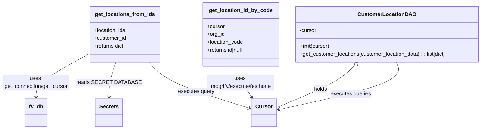

# Diagram: entity_core/entity_service/entity_service/db/location.py


> Auto-generated by Obscura crawlers

## Diagram 1



### SVG

<svg id="container" width="1419.337890625" xmlns="http://www.w3.org/2000/svg" class="classDiagram" height="390" viewBox="0 0 1419.337890625 390" role="graphics-document document" aria-roledescription="class"><style>#container{font-family:"trebuchet ms",verdana,arial,sans-serif;font-size:16px;fill:#333;}@keyframes edge-animation-frame{from{stroke-dashoffset:0;}}@keyframes dash{to{stroke-dashoffset:0;}}#container .edge-animation-slow{stroke-dasharray:9,5!important;stroke-dashoffset:900;animation:dash 50s linear infinite;stroke-linecap:round;}#container .edge-animation-fast{stroke-dasharray:9,5!important;stroke-dashoffset:900;animation:dash 20s linear infinite;stroke-linecap:round;}#container .error-icon{fill:#552222;}#container .error-text{fill:#552222;stroke:#552222;}#container .edge-thickness-normal{stroke-width:1px;}#container .edge-thickness-thick{stroke-width:3.5px;}#container .edge-pattern-solid{stroke-dasharray:0;}#container .edge-thickness-invisible{stroke-width:0;fill:none;}#container .edge-pattern-dashed{stroke-dasharray:3;}#container .edge-pattern-dotted{stroke-dasharray:2;}#container .marker{fill:#333333;stroke:#333333;}#container .marker.cross{stroke:#333333;}#container svg{font-family:"trebuchet ms",verdana,arial,sans-serif;font-size:16px;}#container p{margin:0;}#container g.classGroup text{fill:#9370DB;stroke:none;font-family:"trebuchet ms",verdana,arial,sans-serif;font-size:10px;}#container g.classGroup text .title{font-weight:bolder;}#container .nodeLabel,#container .edgeLabel{color:#131300;}#container .edgeLabel .label rect{fill:#ECECFF;}#container .label text{fill:#131300;}#container .labelBkg{background:#ECECFF;}#container .edgeLabel .label span{background:#ECECFF;}#container .classTitle{font-weight:bolder;}#container .node rect,#container .node circle,#container .node ellipse,#container .node polygon,#container .node path{fill:#ECECFF;stroke:#9370DB;stroke-width:1px;}#container .divider{stroke:#9370DB;stroke-width:1;}#container g.clickable{cursor:pointer;}#container g.classGroup rect{fill:#ECECFF;stroke:#9370DB;}#container g.classGroup line{stroke:#9370DB;stroke-width:1;}#container .classLabel .box{stroke:none;stroke-width:0;fill:#ECECFF;opacity:0.5;}#container .classLabel .label{fill:#9370DB;font-size:10px;}#container .relation{stroke:#333333;stroke-width:1;fill:none;}#container .dashed-line{stroke-dasharray:3;}#container .dotted-line{stroke-dasharray:1 2;}#container #compositionStart,#container .composition{fill:#333333!important;stroke:#333333!important;stroke-width:1;}#container #compositionEnd,#container .composition{fill:#333333!important;stroke:#333333!important;stroke-width:1;}#container #dependencyStart,#container .dependency{fill:#333333!important;stroke:#333333!important;stroke-width:1;}#container #dependencyStart,#container .dependency{fill:#333333!important;stroke:#333333!important;stroke-width:1;}#container #extensionStart,#container .extension{fill:transparent!important;stroke:#333333!important;stroke-width:1;}#container #extensionEnd,#container .extension{fill:transparent!important;stroke:#333333!important;stroke-width:1;}#container #aggregationStart,#container .aggregation{fill:transparent!important;stroke:#333333!important;stroke-width:1;}#container #aggregationEnd,#container .aggregation{fill:transparent!important;stroke:#333333!important;stroke-width:1;}#container #lollipopStart,#container .lollipop{fill:#ECECFF!important;stroke:#333333!important;stroke-width:1;}#container #lollipopEnd,#container .lollipop{fill:#ECECFF!important;stroke:#333333!important;stroke-width:1;}#container .edgeTerminals{font-size:11px;line-height:initial;}#container .classTitleText{text-anchor:middle;font-size:18px;fill:#333;}#container .label-icon{display:inline-block;height:1em;overflow:visible;vertical-align:-0.125em;}#container .node .label-icon path{fill:currentColor;stroke:revert;stroke-width:revert;}#container :root{--mermaid-font-family:"trebuchet ms",verdana,arial,sans-serif;}</style><g><defs><marker id="container_class-aggregationStart" class="marker aggregation class" refX="18" refY="7" markerWidth="190" markerHeight="240" orient="auto"><path d="M 18,7 L9,13 L1,7 L9,1 Z"></path></marker></defs><defs><marker id="container_class-aggregationEnd" class="marker aggregation class" refX="1" refY="7" markerWidth="20" markerHeight="28" orient="auto"><path d="M 18,7 L9,13 L1,7 L9,1 Z"></path></marker></defs><defs><marker id="container_class-extensionStart" class="marker extension class" refX="18" refY="7" markerWidth="190" markerHeight="240" orient="auto"><path d="M 1,7 L18,13 V 1 Z"></path></marker></defs><defs><marker id="container_class-extensionEnd" class="marker extension class" refX="1" refY="7" markerWidth="20" markerHeight="28" orient="auto"><path d="M 1,1 V 13 L18,7 Z"></path></marker></defs><defs><marker id="container_class-compositionStart" class="marker composition class" refX="18" refY="7" markerWidth="190" markerHeight="240" orient="auto"><path d="M 18,7 L9,13 L1,7 L9,1 Z"></path></marker></defs><defs><marker id="container_class-compositionEnd" class="marker composition class" refX="1" refY="7" markerWidth="20" markerHeight="28" orient="auto"><path d="M 18,7 L9,13 L1,7 L9,1 Z"></path></marker></defs><defs><marker id="container_class-dependencyStart" class="marker dependency class" refX="6" refY="7" markerWidth="190" markerHeight="240" orient="auto"><path d="M 5,7 L9,13 L1,7 L9,1 Z"></path></marker></defs><defs><marker id="container_class-dependencyEnd" class="marker dependency class" refX="13" refY="7" markerWidth="20" markerHeight="28" orient="auto"><path d="M 18,7 L9,13 L14,7 L9,1 Z"></path></marker></defs><defs><marker id="container_class-lollipopStart" class="marker lollipop class" refX="13" refY="7" markerWidth="190" markerHeight="240" orient="auto"><circle stroke="black" fill="transparent" cx="7" cy="7" r="6"></circle></marker></defs><defs><marker id="container_class-lollipopEnd" class="marker lollipop class" refX="1" refY="7" markerWidth="190" markerHeight="240" orient="auto"><circle stroke="black" fill="transparent" cx="7" cy="7" r="6"></circle></marker></defs><g class="root"><g class="clusters"></g><g class="edgePaths"><path d="M257.279,163.309L232.399,177.591C207.52,191.873,157.76,220.436,132.88,241.885C108,263.333,108,277.667,108,284.833L108,292" id="id_get_locations_from_ids_fv_db_1" class="edge-thickness-normal edge-pattern-solid relation" style=";;;" data-edge="true" data-et="edge" data-id="id_get_locations_from_ids_fv_db_1" data-points="W3sieCI6MjU3LjI3OTI5Njg3NSwieSI6MTYzLjMwOTA1OTY5OTUzMDY4fSx7IngiOjEwOCwieSI6MjQ5fSx7IngiOjEwOCwieSI6Mjk4fV0=" marker-end="url(#container_class-dependencyEnd)"></path><path d="M333.69,188L330.433,198.167C327.176,208.333,320.662,228.667,317.405,246C314.148,263.333,314.148,277.667,314.148,284.833L314.148,292" id="id_get_locations_from_ids_Secrets_2" class="edge-thickness-normal edge-pattern-solid relation" style=";;;" data-edge="true" data-et="edge" data-id="id_get_locations_from_ids_Secrets_2" data-points="W3sieCI6MzMzLjY4OTk2NDk3ODQ0ODMsInkiOjE4OH0seyJ4IjozMTQuMTQ4NDM3NSwieSI6MjQ5fSx7IngiOjMxNC4xNDg0Mzc1LCJ5IjoyOTh9XQ==" marker-end="url(#container_class-dependencyEnd)"></path><path d="M426.855,188L434.874,198.167C442.893,208.333,458.931,228.667,508.547,251.832C558.163,274.997,641.358,300.994,682.955,313.992L724.552,326.99" id="id_get_locations_from_ids_Cursor_3" class="edge-thickness-normal edge-pattern-solid relation" style=";;;" data-edge="true" data-et="edge" data-id="id_get_locations_from_ids_Cursor_3" data-points="W3sieCI6NDI2Ljg1NDgzNTY2ODEwMzQsInkiOjE4OH0seyJ4Ijo0NzQuOTY4NzUsInkiOjI0OX0seyJ4Ijo3MzAuMjc5Mjk2ODc1LCJ5IjozMjguNzc5OTQ0MDY1NTExNzZ9XQ==" marker-end="url(#container_class-dependencyEnd)"></path><path d="M696.092,200L696.092,208.167C696.092,216.333,696.092,232.667,701.772,248.208C707.452,263.749,718.813,278.498,724.493,285.872L730.173,293.247" id="id_get_location_id_by_code_Cursor_4" class="edge-thickness-normal edge-pattern-solid relation" style=";;;" data-edge="true" data-et="edge" data-id="id_get_location_id_by_code_Cursor_4" data-points="W3sieCI6Njk2LjA5MTc5Njg3NSwieSI6MjAwfSx7IngiOjY5Ni4wOTE3OTY4NzUsInkiOjI0OX0seyJ4Ijo3MzMuODM0NTg1MzM2NTM4NSwieSI6Mjk4fV0=" marker-end="url(#container_class-dependencyEnd)"></path><path d="M1036.678,199.998L1028.242,208.165C1019.806,216.332,1002.933,232.666,963.835,253.523C924.738,274.38,863.415,299.76,832.753,312.45L802.092,325.139" id="id_CustomerLocationDAO_Cursor_5" class="edge-thickness-normal edge-pattern-solid relation" style=";;;" data-edge="true" data-et="edge" data-id="id_CustomerLocationDAO_Cursor_5" data-points="W3sieCI6MTA0OS4wNzE5NjkyODg3OTMsInkiOjE4OH0seyJ4Ijo5ODYuMDYwNTQ2ODc1LCJ5IjoyNDl9LHsieCI6ODAyLjA5MTc5Njg3NSwieSI6MzI1LjEzOTQyNTgxMDExOTR9XQ==" marker-start="url(#container_class-aggregationStart)"></path><path d="M1165.176,188L1168.727,198.167C1172.277,208.333,1179.378,228.667,1119.841,252.493C1060.304,276.319,934.13,303.637,871.043,317.297L807.956,330.956" id="id_CustomerLocationDAO_Cursor_6" class="edge-thickness-normal edge-pattern-solid relation" style=";;;" data-edge="true" data-et="edge" data-id="id_CustomerLocationDAO_Cursor_6" data-points="W3sieCI6MTE2NS4xNzYxNzE4NzUsInkiOjE4OH0seyJ4IjoxMTg2LjQ3ODUxNTYyNSwieSI6MjQ5fSx7IngiOjgwMi4wOTE3OTY4NzUsInkiOjMzMi4yMjU3MzUzOTY2MjYyNX1d" marker-end="url(#container_class-dependencyEnd)"></path></g><g class="edgeLabels"><g class="edgeLabel" transform="translate(108, 249)"><g class="label" data-id="id_get_locations_from_ids_fv_db_1" transform="translate(-100, -24)"><foreignObject width="200" height="48"><div xmlns="http://www.w3.org/1999/xhtml" class="labelBkg" style="display: table; white-space: break-spaces; line-height: 1.5; max-width: 200px; text-align: center; width: 200px;"><span class="edgeLabel"><p>uses get_connection/get_cursor</p></span></div></foreignObject></g></g><g class="edgeLabel" transform="translate(314.1484375, 249)"><g class="label" data-id="id_get_locations_from_ids_Secrets_2" transform="translate(-86.1484375, -12)"><foreignObject width="172.296875" height="24"><div xmlns="http://www.w3.org/1999/xhtml" class="labelBkg" style="display: table-cell; white-space: nowrap; line-height: 1.5; max-width: 200px; text-align: center;"><span class="edgeLabel"><p>reads SECRET DATABASE</p></span></div></foreignObject></g></g><g class="edgeLabel" transform="translate(565.54641, 277.30388)"><g class="label" data-id="id_get_locations_from_ids_Cursor_3" transform="translate(-54.671875, -12)"><foreignObject width="109.34375" height="24"><div xmlns="http://www.w3.org/1999/xhtml" class="labelBkg" style="display: table-cell; white-space: nowrap; line-height: 1.5; max-width: 200px; text-align: center;"><span class="edgeLabel"><p>executes query</p></span></div></foreignObject></g></g><g class="edgeLabel" transform="translate(696.091796875, 249)"><g class="label" data-id="id_get_location_id_by_code_Cursor_4" transform="translate(-100, -24)"><foreignObject width="200" height="48"><div xmlns="http://www.w3.org/1999/xhtml" class="labelBkg" style="display: table; white-space: break-spaces; line-height: 1.5; max-width: 200px; text-align: center; width: 200px;"><span class="edgeLabel"><p>uses mogrify/execute/fetchone</p></span></div></foreignObject></g></g><g class="edgeLabel" transform="translate(934.59358, 270.30071)"><g class="label" data-id="id_CustomerLocationDAO_Cursor_5" transform="translate(-20.1875, -12)"><foreignObject width="40.375" height="24"><div xmlns="http://www.w3.org/1999/xhtml" class="labelBkg" style="display: table-cell; white-space: nowrap; line-height: 1.5; max-width: 200px; text-align: center;"><span class="edgeLabel"><p>holds</p></span></div></foreignObject></g></g><g class="edgeLabel" transform="translate(1025.85984, 283.77645)"><g class="label" data-id="id_CustomerLocationDAO_Cursor_6" transform="translate(-61.0859375, -12)"><foreignObject width="122.171875" height="24"><div xmlns="http://www.w3.org/1999/xhtml" class="labelBkg" style="display: table-cell; white-space: nowrap; line-height: 1.5; max-width: 200px; text-align: center;"><span class="edgeLabel"><p>executes queries</p></span></div></foreignObject></g></g></g><g class="nodes"><g class="node default" id="classId-get_locations_from_ids-0" transform="translate(360.599609375, 104)"><g class="basic label-container"><path d="M-103.3203125 -84 L103.3203125 -84 L103.3203125 84 L-103.3203125 84" stroke="none" stroke-width="0" fill="#ECECFF" style=""></path><path d="M-103.3203125 -84 C-31.767854032765413 -84, 39.78460443446917 -84, 103.3203125 -84 M-103.3203125 -84 C-46.69741344452602 -84, 9.925485610947959 -84, 103.3203125 -84 M103.3203125 -84 C103.3203125 -24.366700628235606, 103.3203125 35.26659874352879, 103.3203125 84 M103.3203125 -84 C103.3203125 -43.56375993275821, 103.3203125 -3.127519865516419, 103.3203125 84 M103.3203125 84 C53.02779036234135 84, 2.7352682246826987 84, -103.3203125 84 M103.3203125 84 C49.06277392155095 84, -5.194764656898101 84, -103.3203125 84 M-103.3203125 84 C-103.3203125 41.15908512114528, -103.3203125 -1.681829757709437, -103.3203125 -84 M-103.3203125 84 C-103.3203125 30.39701524311979, -103.3203125 -23.205969513760422, -103.3203125 -84" stroke="#9370DB" stroke-width="1.3" fill="none" stroke-dasharray="0 0" style=""></path></g><g class="annotation-group text" transform="translate(0, -60)"></g><g class="label-group text" transform="translate(-85.625, -60)"><g class="label" style="font-weight: bolder" transform="translate(0,-12)"><foreignObject width="171.25" height="24"><div xmlns="http://www.w3.org/1999/xhtml" style="display: table-cell; white-space: nowrap; line-height: 1.5; max-width: 219px; text-align: center;"><span class="nodeLabel markdown-node-label" style=""><p>get_locations_from_ids</p></span></div></foreignObject></g></g><g class="members-group text" transform="translate(-91.3203125, -12)"><g class="label" style="" transform="translate(0,-12)"><foreignObject width="97.015625" height="24"><div xmlns="http://www.w3.org/1999/xhtml" style="display: table-cell; white-space: nowrap; line-height: 1.5; max-width: 154px; text-align: center;"><span class="nodeLabel markdown-node-label" style=""><p>+location_ids</p></span></div></foreignObject></g><g class="label" style="" transform="translate(0,12)"><foreignObject width="96.875" height="24"><div xmlns="http://www.w3.org/1999/xhtml" style="display: table-cell; white-space: nowrap; line-height: 1.5; max-width: 154px; text-align: center;"><span class="nodeLabel markdown-node-label" style=""><p>+customer_id</p></span></div></foreignObject></g><g class="label" style="" transform="translate(0,36)"><foreignObject width="92.265625" height="24"><div xmlns="http://www.w3.org/1999/xhtml" style="display: table-cell; white-space: nowrap; line-height: 1.5; max-width: 150px; text-align: center;"><span class="nodeLabel markdown-node-label" style=""><p>+returns dict</p></span></div></foreignObject></g></g><g class="methods-group text" transform="translate(-91.3203125, 84)"></g><g class="divider" style=""><path d="M-103.3203125 -36 C-21.188410471147904 -36, 60.94349155770419 -36, 103.3203125 -36 M-103.3203125 -36 C-41.99375301621427 -36, 19.33280646757146 -36, 103.3203125 -36" stroke="#9370DB" stroke-width="1.3" fill="none" stroke-dasharray="0 0" style=""></path></g><g class="divider" style=""><path d="M-103.3203125 60 C-37.24524017970994 60, 28.829832140580123 60, 103.3203125 60 M-103.3203125 60 C-30.75888726011729 60, 41.80253797976542 60, 103.3203125 60" stroke="#9370DB" stroke-width="1.3" fill="none" stroke-dasharray="0 0" style=""></path></g></g><g class="node default" id="classId-get_location_id_by_code-1" transform="translate(696.091796875, 104)"><g class="basic label-container"><path d="M-114.25390625 -96 L114.25390625 -96 L114.25390625 96 L-114.25390625 96" stroke="none" stroke-width="0" fill="#ECECFF" style=""></path><path d="M-114.25390625 -96 C-30.274950824385044 -96, 53.70400460122991 -96, 114.25390625 -96 M-114.25390625 -96 C-52.241054871587615 -96, 9.77179650682477 -96, 114.25390625 -96 M114.25390625 -96 C114.25390625 -19.63609235745801, 114.25390625 56.72781528508398, 114.25390625 96 M114.25390625 -96 C114.25390625 -55.56707416928107, 114.25390625 -15.134148338562142, 114.25390625 96 M114.25390625 96 C49.79199136000942 96, -14.669923529981162 96, -114.25390625 96 M114.25390625 96 C43.84294576022532 96, -26.56801472954936 96, -114.25390625 96 M-114.25390625 96 C-114.25390625 53.88595351503135, -114.25390625 11.771907030062707, -114.25390625 -96 M-114.25390625 96 C-114.25390625 42.968807239225455, -114.25390625 -10.06238552154909, -114.25390625 -96" stroke="#9370DB" stroke-width="1.3" fill="none" stroke-dasharray="0 0" style=""></path></g><g class="annotation-group text" transform="translate(0, -72)"></g><g class="label-group text" transform="translate(-91.1484375, -72)"><g class="label" style="font-weight: bolder" transform="translate(0,-12)"><foreignObject width="182.296875" height="24"><div xmlns="http://www.w3.org/1999/xhtml" style="display: table-cell; white-space: nowrap; line-height: 1.5; max-width: 230px; text-align: center;"><span class="nodeLabel markdown-node-label" style=""><p>get_location_id_by_code</p></span></div></foreignObject></g></g><g class="members-group text" transform="translate(-102.25390625, -24)"><g class="label" style="" transform="translate(0,-12)"><foreignObject width="53.71875" height="24"><div xmlns="http://www.w3.org/1999/xhtml" style="display: table-cell; white-space: nowrap; line-height: 1.5; max-width: 112px; text-align: center;"><span class="nodeLabel markdown-node-label" style=""><p>+cursor</p></span></div></foreignObject></g><g class="label" style="" transform="translate(0,12)"><foreignObject width="54.0625" height="24"><div xmlns="http://www.w3.org/1999/xhtml" style="display: table-cell; white-space: nowrap; line-height: 1.5; max-width: 111px; text-align: center;"><span class="nodeLabel markdown-node-label" style=""><p>+org_id</p></span></div></foreignObject></g><g class="label" style="" transform="translate(0,36)"><foreignObject width="110.109375" height="24"><div xmlns="http://www.w3.org/1999/xhtml" style="display: table-cell; white-space: nowrap; line-height: 1.5; max-width: 167px; text-align: center;"><span class="nodeLabel markdown-node-label" style=""><p>+location_code</p></span></div></foreignObject></g><g class="label" style="" transform="translate(0,60)"><foreignObject width="113.359375" height="24"><div xmlns="http://www.w3.org/1999/xhtml" style="display: table-cell; white-space: nowrap; line-height: 1.5; max-width: 171px; text-align: center;"><span class="nodeLabel markdown-node-label" style=""><p>+returns id|null</p></span></div></foreignObject></g></g><g class="methods-group text" transform="translate(-102.25390625, 96)"></g><g class="divider" style=""><path d="M-114.25390625 -48 C-61.69207996065476 -48, -9.130253671309518 -48, 114.25390625 -48 M-114.25390625 -48 C-28.605277747925825 -48, 57.04335075414835 -48, 114.25390625 -48" stroke="#9370DB" stroke-width="1.3" fill="none" stroke-dasharray="0 0" style=""></path></g><g class="divider" style=""><path d="M-114.25390625 72 C-50.71331730887328 72, 12.827271632253442 72, 114.25390625 72 M-114.25390625 72 C-33.85397685916901 72, 46.54595253166198 72, 114.25390625 72" stroke="#9370DB" stroke-width="1.3" fill="none" stroke-dasharray="0 0" style=""></path></g></g><g class="node default" id="classId-CustomerLocationDAO-2" transform="translate(1135.841796875, 104)"><g class="basic label-container"><path d="M-275.49609375 -84 L275.49609375 -84 L275.49609375 84 L-275.49609375 84" stroke="none" stroke-width="0" fill="#ECECFF" style=""></path><path d="M-275.49609375 -84 C-75.52404202358863 -84, 124.44800970282273 -84, 275.49609375 -84 M-275.49609375 -84 C-125.4873056536787 -84, 24.521482442642593 -84, 275.49609375 -84 M275.49609375 -84 C275.49609375 -33.72591194191117, 275.49609375 16.548176116177657, 275.49609375 84 M275.49609375 -84 C275.49609375 -28.851630935961182, 275.49609375 26.296738128077635, 275.49609375 84 M275.49609375 84 C163.6102408808564 84, 51.72438801171276 84, -275.49609375 84 M275.49609375 84 C67.95757071364335 84, -139.5809523227133 84, -275.49609375 84 M-275.49609375 84 C-275.49609375 22.114601095633063, -275.49609375 -39.770797808733874, -275.49609375 -84 M-275.49609375 84 C-275.49609375 41.85600851289341, -275.49609375 -0.287982974213179, -275.49609375 -84" stroke="#9370DB" stroke-width="1.3" fill="none" stroke-dasharray="0 0" style=""></path></g><g class="annotation-group text" transform="translate(0, -60)"></g><g class="label-group text" transform="translate(-81.5546875, -60)"><g class="label" style="font-weight: bolder" transform="translate(0,-12)"><foreignObject width="163.109375" height="24"><div xmlns="http://www.w3.org/1999/xhtml" style="display: table-cell; white-space: nowrap; line-height: 1.5; max-width: 211px; text-align: center;"><span class="nodeLabel markdown-node-label" style=""><p>CustomerLocationDAO</p></span></div></foreignObject></g></g><g class="members-group text" transform="translate(-263.49609375, -12)"><g class="label" style="" transform="translate(0,-12)"><foreignObject width="52.1875" height="24"><div xmlns="http://www.w3.org/1999/xhtml" style="display: table-cell; white-space: nowrap; line-height: 1.5; max-width: 110px; text-align: center;"><span class="nodeLabel markdown-node-label" style=""><p>-cursor</p></span></div></foreignObject></g></g><g class="methods-group text" transform="translate(-263.49609375, 36)"><g class="label" style="" transform="translate(0,-12)"><foreignObject width="88.53125" height="24"><div xmlns="http://www.w3.org/1999/xhtml" style="display: table-cell; white-space: nowrap; line-height: 1.5; max-width: 177px; text-align: center;"><span class="nodeLabel markdown-node-label" style=""><p>+<strong>init</strong>(cursor)</p></span></div></foreignObject></g><g class="label" style="" transform="translate(0,12)"><foreignObject width="445.4375" height="24"><div xmlns="http://www.w3.org/1999/xhtml" style="display: table-cell; white-space: nowrap; line-height: 1.5; max-width: 503px; text-align: center;"><span class="nodeLabel markdown-node-label" style=""><p>+get_customer_locations(customer_location_data) : : list[dict]</p></span></div></foreignObject></g></g><g class="divider" style=""><path d="M-275.49609375 -36 C-69.69830555907018 -36, 136.09948263185964 -36, 275.49609375 -36 M-275.49609375 -36 C-57.23914573861953 -36, 161.01780227276095 -36, 275.49609375 -36" stroke="#9370DB" stroke-width="1.3" fill="none" stroke-dasharray="0 0" style=""></path></g><g class="divider" style=""><path d="M-275.49609375 12 C-55.403332381453225 12, 164.68942898709355 12, 275.49609375 12 M-275.49609375 12 C-60.60472784407585 12, 154.2866380618483 12, 275.49609375 12" stroke="#9370DB" stroke-width="1.3" fill="none" stroke-dasharray="0 0" style=""></path></g></g><g class="node default" id="classId-fv_db-3" transform="translate(108, 340)"><g class="basic label-container"><path d="M-32.2890625 -42 L32.2890625 -42 L32.2890625 42 L-32.2890625 42" stroke="none" stroke-width="0" fill="#ECECFF" style=""></path><path d="M-32.2890625 -42 C-16.90171136612325 -42, -1.5143602322464993 -42, 32.2890625 -42 M-32.2890625 -42 C-12.770499595384518 -42, 6.7480633092309645 -42, 32.2890625 -42 M32.2890625 -42 C32.2890625 -22.43735502415332, 32.2890625 -2.874710048306639, 32.2890625 42 M32.2890625 -42 C32.2890625 -16.20521195119176, 32.2890625 9.58957609761648, 32.2890625 42 M32.2890625 42 C11.611738719775715 42, -9.06558506044857 42, -32.2890625 42 M32.2890625 42 C13.312197639829094 42, -5.664667220341812 42, -32.2890625 42 M-32.2890625 42 C-32.2890625 13.105776812151568, -32.2890625 -15.788446375696864, -32.2890625 -42 M-32.2890625 42 C-32.2890625 20.81414662439945, -32.2890625 -0.37170675120110275, -32.2890625 -42" stroke="#9370DB" stroke-width="1.3" fill="none" stroke-dasharray="0 0" style=""></path></g><g class="annotation-group text" transform="translate(0, -18)"></g><g class="label-group text" transform="translate(-20.2890625, -18)"><g class="label" style="font-weight: bolder" transform="translate(0,-12)"><foreignObject width="40.578125" height="24"><div xmlns="http://www.w3.org/1999/xhtml" style="display: table-cell; white-space: nowrap; line-height: 1.5; max-width: 90px; text-align: center;"><span class="nodeLabel markdown-node-label" style=""><p>fv_db</p></span></div></foreignObject></g></g><g class="members-group text" transform="translate(-20.2890625, 30)"></g><g class="methods-group text" transform="translate(-20.2890625, 60)"></g><g class="divider" style=""><path d="M-32.2890625 6 C-14.481387223927626 6, 3.326288052144747 6, 32.2890625 6 M-32.2890625 6 C-8.262405269156819 6, 15.764251961686362 6, 32.2890625 6" stroke="#9370DB" stroke-width="1.3" fill="none" stroke-dasharray="0 0" style=""></path></g><g class="divider" style=""><path d="M-32.2890625 24 C-10.036092018346892 24, 12.216878463306216 24, 32.2890625 24 M-32.2890625 24 C-12.11394174288931 24, 8.06117901422138 24, 32.2890625 24" stroke="#9370DB" stroke-width="1.3" fill="none" stroke-dasharray="0 0" style=""></path></g></g><g class="node default" id="classId-Secrets-4" transform="translate(314.1484375, 340)"><g class="basic label-container"><path d="M-39.1640625 -42 L39.1640625 -42 L39.1640625 42 L-39.1640625 42" stroke="none" stroke-width="0" fill="#ECECFF" style=""></path><path d="M-39.1640625 -42 C-9.628053775660376 -42, 19.907954948679247 -42, 39.1640625 -42 M-39.1640625 -42 C-22.886031589971065 -42, -6.60800067994213 -42, 39.1640625 -42 M39.1640625 -42 C39.1640625 -22.323893875975536, 39.1640625 -2.6477877519510713, 39.1640625 42 M39.1640625 -42 C39.1640625 -18.3288958313404, 39.1640625 5.3422083373191995, 39.1640625 42 M39.1640625 42 C16.180533842440664 42, -6.802994815118673 42, -39.1640625 42 M39.1640625 42 C16.081552343694646 42, -7.000957812610707 42, -39.1640625 42 M-39.1640625 42 C-39.1640625 16.211848604124746, -39.1640625 -9.576302791750507, -39.1640625 -42 M-39.1640625 42 C-39.1640625 14.605471256300266, -39.1640625 -12.789057487399468, -39.1640625 -42" stroke="#9370DB" stroke-width="1.3" fill="none" stroke-dasharray="0 0" style=""></path></g><g class="annotation-group text" transform="translate(0, -18)"></g><g class="label-group text" transform="translate(-27.1640625, -18)"><g class="label" style="font-weight: bolder" transform="translate(0,-12)"><foreignObject width="54.328125" height="24"><div xmlns="http://www.w3.org/1999/xhtml" style="display: table-cell; white-space: nowrap; line-height: 1.5; max-width: 103px; text-align: center;"><span class="nodeLabel markdown-node-label" style=""><p>Secrets</p></span></div></foreignObject></g></g><g class="members-group text" transform="translate(-27.1640625, 30)"></g><g class="methods-group text" transform="translate(-27.1640625, 60)"></g><g class="divider" style=""><path d="M-39.1640625 6 C-22.277399837445127 6, -5.390737174890255 6, 39.1640625 6 M-39.1640625 6 C-11.409995173551685 6, 16.34407215289663 6, 39.1640625 6" stroke="#9370DB" stroke-width="1.3" fill="none" stroke-dasharray="0 0" style=""></path></g><g class="divider" style=""><path d="M-39.1640625 24 C-17.130932217271567 24, 4.902198065456865 24, 39.1640625 24 M-39.1640625 24 C-15.421015857568204 24, 8.322030784863593 24, 39.1640625 24" stroke="#9370DB" stroke-width="1.3" fill="none" stroke-dasharray="0 0" style=""></path></g></g><g class="node default" id="classId-Cursor-5" transform="translate(766.185546875, 340)"><g class="basic label-container"><path d="M-35.90625 -42 L35.90625 -42 L35.90625 42 L-35.90625 42" stroke="none" stroke-width="0" fill="#ECECFF" style=""></path><path d="M-35.90625 -42 C-20.350140661161348 -42, -4.794031322322695 -42, 35.90625 -42 M-35.90625 -42 C-18.20961174971532 -42, -0.5129734994306432 -42, 35.90625 -42 M35.90625 -42 C35.90625 -8.499112548268585, 35.90625 25.00177490346283, 35.90625 42 M35.90625 -42 C35.90625 -19.03051279748039, 35.90625 3.938974405039218, 35.90625 42 M35.90625 42 C9.401140944019101 42, -17.103968111961798 42, -35.90625 42 M35.90625 42 C11.291749763164141 42, -13.322750473671718 42, -35.90625 42 M-35.90625 42 C-35.90625 9.818677423188632, -35.90625 -22.362645153622736, -35.90625 -42 M-35.90625 42 C-35.90625 12.020351725851448, -35.90625 -17.959296548297104, -35.90625 -42" stroke="#9370DB" stroke-width="1.3" fill="none" stroke-dasharray="0 0" style=""></path></g><g class="annotation-group text" transform="translate(0, -18)"></g><g class="label-group text" transform="translate(-23.90625, -18)"><g class="label" style="font-weight: bolder" transform="translate(0,-12)"><foreignObject width="47.8125" height="24"><div xmlns="http://www.w3.org/1999/xhtml" style="display: table-cell; white-space: nowrap; line-height: 1.5; max-width: 98px; text-align: center;"><span class="nodeLabel markdown-node-label" style=""><p>Cursor</p></span></div></foreignObject></g></g><g class="members-group text" transform="translate(-23.90625, 30)"></g><g class="methods-group text" transform="translate(-23.90625, 60)"></g><g class="divider" style=""><path d="M-35.90625 6 C-16.06693350488076 6, 3.7723829902384765 6, 35.90625 6 M-35.90625 6 C-15.382885397921758 6, 5.140479204156485 6, 35.90625 6" stroke="#9370DB" stroke-width="1.3" fill="none" stroke-dasharray="0 0" style=""></path></g><g class="divider" style=""><path d="M-35.90625 24 C-14.146726412521083 24, 7.612797174957834 24, 35.90625 24 M-35.90625 24 C-16.859078909746728 24, 2.188092180506544 24, 35.90625 24" stroke="#9370DB" stroke-width="1.3" fill="none" stroke-dasharray="0 0" style=""></path></g></g></g></g></g></svg>

## Diagram 2

```mermaid
flowchart TD
subgraph GetLocationsFromIds
  GL1([Start])
  GL2[SECRETS.get_secret(SecretNames.DATABASE)]
  GL3[with fv.db.get_connection(core_config) as conn]
  GL4[with fv.db.get_cursor(conn) as core_cursor]
  GL5[core_cursor.execute(SELECT ... WHERE tl.id in %s AND sl.organization_id = %s)]
  GL6[results = core_cursor.fetchall()]
  GL7[result_dict = {res.tender_id: {name, code} for res in results}]
  GL8([Return result_dict])
  GL1 --> GL2 --> GL3 --> GL4 --> GL5 --> GL6 --> GL7 --> GL8
end

subgraph GetLocationIdByCode
  L1([Start])
  L2[sql string prepared]
  L3[query = cursor.mogrify(sql, {org_id, code})]
  L4[cursor.execute(query)]
  L5[row = cursor.fetchone()]
  L6{row exists?}
  L7([Return row.id])
  L8([Return None])
  L1 --> L2 --> L3 --> L4 --> L5 --> L6
  L6 -- yes --> L7
  L6 -- no --> L8
end

subgraph CustomerLocationDAO_get_customer_locations
  C1([Start])
  C2[queries = [] ; data = {}]
  C3[for each (solution_id, location_codes) in input]
  C4[append SELECT ... WHERE customer_solution.external_id=%(solution_id{i})s AND l.code in %(location_codes{i})s]
  C5[full_query = " UNION ".join(queries)]
  C6[self.cursor.execute(full_query, data)]
  C7[rows = self.cursor.fetchall()]
  C8[return [row._asdict() for row in rows]]
  C1 --> C2 --> C3 --> C4 --> C5 --> C6 --> C7 --> C8
end
```

> SVG rendering failed for this diagram.
