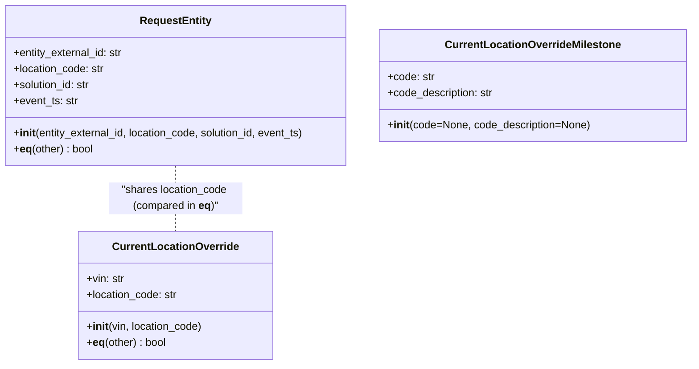

# Diagram: entity_core/entity_service/entity_service/db/models/current_location_override.py

> Auto-generated by Obscura crawlers

## Mermaid

### SVG

<svg id="container" width="1039.3359375" xmlns="http://www.w3.org/2000/svg" class="classDiagram" height="546" viewBox="0 0 1039.3359375 546" role="graphics-document document" aria-roledescription="class"><g><defs><marker id="container_class-aggregationStart" class="marker aggregation class" refX="18" refY="7" markerWidth="190" markerHeight="240" orient="auto"><path d="M 18,7 L9,13 L1,7 L9,1 Z"></path></marker></defs><defs><marker id="container_class-aggregationEnd" class="marker aggregation class" refX="1" refY="7" markerWidth="20" markerHeight="28" orient="auto"><path d="M 18,7 L9,13 L1,7 L9,1 Z"></path></marker></defs><defs><marker id="container_class-extensionStart" class="marker extension class" refX="18" refY="7" markerWidth="190" markerHeight="240" orient="auto"><path d="M 1,7 L18,13 V 1 Z"></path></marker></defs><defs><marker id="container_class-extensionEnd" class="marker extension class" refX="1" refY="7" markerWidth="20" markerHeight="28" orient="auto"><path d="M 1,1 V 13 L18,7 Z"></path></marker></defs><defs><marker id="container_class-compositionStart" class="marker composition class" refX="18" refY="7" markerWidth="190" markerHeight="240" orient="auto"><path d="M 18,7 L9,13 L1,7 L9,1 Z"></path></marker></defs><defs><marker id="container_class-compositionEnd" class="marker composition class" refX="1" refY="7" markerWidth="20" markerHeight="28" orient="auto"><path d="M 18,7 L9,13 L1,7 L9,1 Z"></path></marker></defs><defs><marker id="container_class-dependencyStart" class="marker dependency class" refX="6" refY="7" markerWidth="190" markerHeight="240" orient="auto"><path d="M 5,7 L9,13 L1,7 L9,1 Z"></path></marker></defs><defs><marker id="container_class-dependencyEnd" class="marker dependency class" refX="13" refY="7" markerWidth="20" markerHeight="28" orient="auto"><path d="M 18,7 L9,13 L14,7 L9,1 Z"></path></marker></defs><defs><marker id="container_class-lollipopStart" class="marker lollipop class" refX="13" refY="7" markerWidth="190" markerHeight="240" orient="auto"><circle stroke="black" fill="transparent" cx="7" cy="7" r="6"></circle></marker></defs><defs><marker id="container_class-lollipopEnd" class="marker lollipop class" refX="1" refY="7" markerWidth="190" markerHeight="240" orient="auto"><circle stroke="black" fill="transparent" cx="7" cy="7" r="6"></circle></marker></defs><g class="root"><g class="clusters"></g><g class="edgePaths"><path d="M267.652,248L267.652,256.167C267.652,264.333,267.652,280.667,267.652,297C267.652,313.333,267.652,329.667,267.652,337.833L267.652,346" id="id_RequestEntity_CurrentLocationOverride_1" class="edge-thickness-normal edge-pattern-dashed relation" style=";;;" data-edge="true" data-et="edge" data-id="id_RequestEntity_CurrentLocationOverride_1" data-points="W3sieCI6MjY3LjY1MjM0Mzc1LCJ5IjoyNDh9LHsieCI6MjY3LjY1MjM0Mzc1LCJ5IjoyOTd9LHsieCI6MjY3LjY1MjM0Mzc1LCJ5IjozNDZ9XQ=="></path></g><g class="edgeLabels"><g class="edgeLabel" transform="translate(267.65234375, 297)"><g class="label" data-id="id_RequestEntity_CurrentLocationOverride_1" transform="translate(-100, -24)"><foreignObject width="200" height="48">

"shares location_code (compared in <strong>eq</strong>)"

</foreignObject></g></g></g><g class="nodes"><g class="node default" id="classId-RequestEntity-0" transform="translate(267.65234375, 128)"><g class="basic label-container"><path d="M-259.65234375 -120 L259.65234375 -120 L259.65234375 120 L-259.65234375 120" stroke="none" stroke-width="0" fill="#ECECFF" style=""></path><path d="M-259.65234375 -120 C-129.5393418304593 -120, 0.5736600890813861 -120, 259.65234375 -120 M-259.65234375 -120 C-108.33817494808372 -120, 42.97599385383256 -120, 259.65234375 -120 M259.65234375 -120 C259.65234375 -44.320534200902955, 259.65234375 31.35893159819409, 259.65234375 120 M259.65234375 -120 C259.65234375 -68.57028653015772, 259.65234375 -17.14057306031542, 259.65234375 120 M259.65234375 120 C61.62136948883381 120, -136.4096047723324 120, -259.65234375 120 M259.65234375 120 C140.22790651849056 120, 20.80346928698114 120, -259.65234375 120 M-259.65234375 120 C-259.65234375 68.2097183028983, -259.65234375 16.419436605796577, -259.65234375 -120 M-259.65234375 120 C-259.65234375 63.84195075184399, -259.65234375 7.683901503687977, -259.65234375 -120" stroke="#9370DB" stroke-width="1.3" fill="none" stroke-dasharray="0 0" style=""></path></g><g class="annotation-group text" transform="translate(0, -96)"></g><g class="label-group text" transform="translate(-51.2578125, -96)"><g class="label" style="font-weight: bolder" transform="translate(0,-12)"><foreignObject width="102.515625" height="24">

RequestEntity

</foreignObject></g></g><g class="members-group text" transform="translate(-247.65234375, -48)"><g class="label" style="" transform="translate(0,-12)"><foreignObject width="166.75" height="24">

+entity_external_id: str

</foreignObject></g><g class="label" style="" transform="translate(0,12)"><foreignObject width="137.609375" height="24">

+location_code: str

</foreignObject></g><g class="label" style="" transform="translate(0,36)"><foreignObject width="117.71875" height="24">

+solution_id: str

</foreignObject></g><g class="label" style="" transform="translate(0,60)"><foreignObject width="97.078125" height="24">

+event_ts: str

</foreignObject></g></g><g class="methods-group text" transform="translate(-247.65234375, 72)"><g class="label" style="" transform="translate(0,-12)"><foreignObject width="444.046875" height="24">

+<strong>init</strong>(entity_external_id, location_code, solution_id, event_ts)

</foreignObject></g><g class="label" style="" transform="translate(0,12)"><foreignObject width="121.390625" height="24">

+<strong>eq</strong>(other) : bool

</foreignObject></g></g><g class="divider" style=""><path d="M-259.65234375 -72 C-92.6883241756316 -72, 74.27569539873679 -72, 259.65234375 -72 M-259.65234375 -72 C-116.86487514156804 -72, 25.92259346686393 -72, 259.65234375 -72" stroke="#9370DB" stroke-width="1.3" fill="none" stroke-dasharray="0 0" style=""></path></g><g class="divider" style=""><path d="M-259.65234375 48 C-86.64800903373893 48, 86.35632568252214 48, 259.65234375 48 M-259.65234375 48 C-103.26181723259677 48, 53.12870928480646 48, 259.65234375 48" stroke="#9370DB" stroke-width="1.3" fill="none" stroke-dasharray="0 0" style=""></path></g></g><g class="node default" id="classId-CurrentLocationOverrideMilestone-1" transform="translate(804.3203125, 128)"><g class="basic label-container"><path d="M-227.015625 -84 L227.015625 -84 L227.015625 84 L-227.015625 84" stroke="none" stroke-width="0" fill="#ECECFF" style=""></path><path d="M-227.015625 -84 C-113.0313868458469 -84, 0.952851308306208 -84, 227.015625 -84 M-227.015625 -84 C-96.04588025496446 -84, 34.92386449007108 -84, 227.015625 -84 M227.015625 -84 C227.015625 -18.081696958283132, 227.015625 47.836606083433736, 227.015625 84 M227.015625 -84 C227.015625 -24.920731924243995, 227.015625 34.15853615151201, 227.015625 84 M227.015625 84 C68.09579950358324 84, -90.82402599283353 84, -227.015625 84 M227.015625 84 C61.47702919070767 84, -104.06156661858466 84, -227.015625 84 M-227.015625 84 C-227.015625 26.894786813781316, -227.015625 -30.210426372437368, -227.015625 -84 M-227.015625 84 C-227.015625 18.16943811162669, -227.015625 -47.66112377674662, -227.015625 -84" stroke="#9370DB" stroke-width="1.3" fill="none" stroke-dasharray="0 0" style=""></path></g><g class="annotation-group text" transform="translate(0, -60)"></g><g class="label-group text" transform="translate(-126.375, -60)"><g class="label" style="font-weight: bolder" transform="translate(0,-12)"><foreignObject width="252.75" height="24">

CurrentLocationOverrideMilestone

</foreignObject></g></g><g class="members-group text" transform="translate(-215.015625, -12)"><g class="label" style="" transform="translate(0,-12)"><foreignObject width="70.453125" height="24">

+code: str

</foreignObject></g><g class="label" style="" transform="translate(0,12)"><foreignObject width="160.75" height="24">

+code_description: str

</foreignObject></g></g><g class="methods-group text" transform="translate(-215.015625, 60)"><g class="label" style="" transform="translate(0,-12)"><foreignObject width="303.65625" height="24">

+<strong>init</strong>(code=None, code_description=None)

</foreignObject></g></g><g class="divider" style=""><path d="M-227.015625 -36 C-58.17845116191339 -36, 110.65872267617323 -36, 227.015625 -36 M-227.015625 -36 C-82.04830641299284 -36, 62.91901217401431 -36, 227.015625 -36" stroke="#9370DB" stroke-width="1.3" fill="none" stroke-dasharray="0 0" style=""></path></g><g class="divider" style=""><path d="M-227.015625 36 C-113.34468451268535 36, 0.326255974629305 36, 227.015625 36 M-227.015625 36 C-113.95498345265224 36, -0.8943419053044863 36, 227.015625 36" stroke="#9370DB" stroke-width="1.3" fill="none" stroke-dasharray="0 0" style=""></path></g></g><g class="node default" id="classId-CurrentLocationOverride-2" transform="translate(267.65234375, 442)"><g class="basic label-container"><path d="M-144.65625 -96 L144.65625 -96 L144.65625 96 L-144.65625 96" stroke="none" stroke-width="0" fill="#ECECFF" style=""></path><path d="M-144.65625 -96 C-55.012181813919426 -96, 34.63188637216115 -96, 144.65625 -96 M-144.65625 -96 C-86.16057111878214 -96, -27.66489223756429 -96, 144.65625 -96 M144.65625 -96 C144.65625 -25.44138008363521, 144.65625 45.11723983272958, 144.65625 96 M144.65625 -96 C144.65625 -51.210305875503536, 144.65625 -6.420611751007073, 144.65625 96 M144.65625 96 C86.16833239888346 96, 27.68041479776693 96, -144.65625 96 M144.65625 96 C68.35726392899068 96, -7.941722142018648 96, -144.65625 96 M-144.65625 96 C-144.65625 21.33784338974472, -144.65625 -53.32431322051056, -144.65625 -96 M-144.65625 96 C-144.65625 30.327344566343214, -144.65625 -35.34531086731357, -144.65625 -96" stroke="#9370DB" stroke-width="1.3" fill="none" stroke-dasharray="0 0" style=""></path></g><g class="annotation-group text" transform="translate(0, -72)"></g><g class="label-group text" transform="translate(-90.5625, -72)"><g class="label" style="font-weight: bolder" transform="translate(0,-12)"><foreignObject width="181.125" height="24">

CurrentLocationOverride

</foreignObject></g></g><g class="members-group text" transform="translate(-132.65625, -24)"><g class="label" style="" transform="translate(0,-12)"><foreignObject width="57.09375" height="24">

+vin: str

</foreignObject></g><g class="label" style="" transform="translate(0,12)"><foreignObject width="137.609375" height="24">

+location_code: str

</foreignObject></g></g><g class="methods-group text" transform="translate(-132.65625, 48)"><g class="label" style="" transform="translate(0,-12)"><foreignObject width="174.75" height="24">

+<strong>init</strong>(vin, location_code)

</foreignObject></g><g class="label" style="" transform="translate(0,12)"><foreignObject width="121.390625" height="24">

+<strong>eq</strong>(other) : bool

</foreignObject></g></g><g class="divider" style=""><path d="M-144.65625 -48 C-74.41025935692824 -48, -4.1642687138564725 -48, 144.65625 -48 M-144.65625 -48 C-75.98455491605456 -48, -7.312859832109126 -48, 144.65625 -48" stroke="#9370DB" stroke-width="1.3" fill="none" stroke-dasharray="0 0" style=""></path></g><g class="divider" style=""><path d="M-144.65625 24 C-65.31308834746693 24, 14.03007330506614 24, 144.65625 24 M-144.65625 24 C-65.65629859790882 24, 13.34365280418237 24, 144.65625 24" stroke="#9370DB" stroke-width="1.3" fill="none" stroke-dasharray="0 0" style=""></path></g></g></g></g></g></svg>
