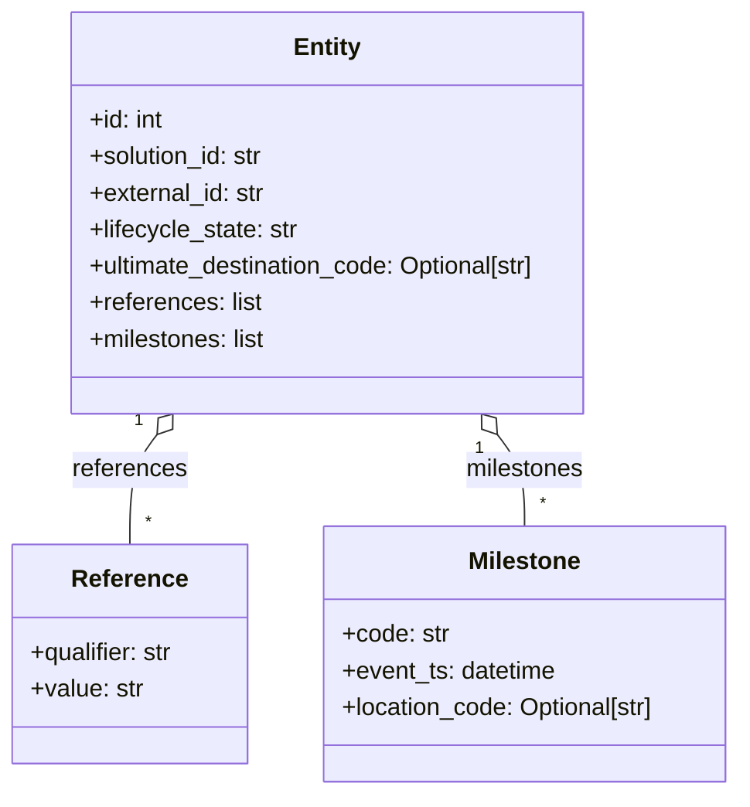

# Diagram: entity_core/entity_service/entity_service/db/models/entity.py

> Auto-generated by Obscura crawlers

## Mermaid

### SVG

<svg id="container" width="493.4296875" xmlns="http://www.w3.org/2000/svg" class="classDiagram" height="522" viewBox="0 0 493.4296875 522" role="graphics-document document" aria-roledescription="class"><g><defs><marker id="container_class-aggregationStart" class="marker aggregation class" refX="18" refY="7" markerWidth="190" markerHeight="240" orient="auto"><path d="M 18,7 L9,13 L1,7 L9,1 Z"></path></marker></defs><defs><marker id="container_class-aggregationEnd" class="marker aggregation class" refX="1" refY="7" markerWidth="20" markerHeight="28" orient="auto"><path d="M 18,7 L9,13 L1,7 L9,1 Z"></path></marker></defs><defs><marker id="container_class-extensionStart" class="marker extension class" refX="18" refY="7" markerWidth="190" markerHeight="240" orient="auto"><path d="M 1,7 L18,13 V 1 Z"></path></marker></defs><defs><marker id="container_class-extensionEnd" class="marker extension class" refX="1" refY="7" markerWidth="20" markerHeight="28" orient="auto"><path d="M 1,1 V 13 L18,7 Z"></path></marker></defs><defs><marker id="container_class-compositionStart" class="marker composition class" refX="18" refY="7" markerWidth="190" markerHeight="240" orient="auto"><path d="M 18,7 L9,13 L1,7 L9,1 Z"></path></marker></defs><defs><marker id="container_class-compositionEnd" class="marker composition class" refX="1" refY="7" markerWidth="20" markerHeight="28" orient="auto"><path d="M 18,7 L9,13 L1,7 L9,1 Z"></path></marker></defs><defs><marker id="container_class-dependencyStart" class="marker dependency class" refX="6" refY="7" markerWidth="190" markerHeight="240" orient="auto"><path d="M 5,7 L9,13 L1,7 L9,1 Z"></path></marker></defs><defs><marker id="container_class-dependencyEnd" class="marker dependency class" refX="13" refY="7" markerWidth="20" markerHeight="28" orient="auto"><path d="M 18,7 L9,13 L14,7 L9,1 Z"></path></marker></defs><defs><marker id="container_class-lollipopStart" class="marker lollipop class" refX="13" refY="7" markerWidth="190" markerHeight="240" orient="auto"><circle stroke="black" fill="transparent" cx="7" cy="7" r="6"></circle></marker></defs><defs><marker id="container_class-lollipopEnd" class="marker lollipop class" refX="1" refY="7" markerWidth="190" markerHeight="240" orient="auto"><circle stroke="black" fill="transparent" cx="7" cy="7" r="6"></circle></marker></defs><g class="root"><g class="clusters"></g><g class="edgePaths"><path d="M104.698,285.6L101.656,289.5C98.613,293.4,92.527,301.2,89.484,313.267C86.441,325.333,86.441,341.667,86.441,349.833L86.441,358" id="id_Entity_Reference_1" class="edge-thickness-normal edge-pattern-solid relation" style=";;;" data-edge="true" data-et="edge" data-id="id_Entity_Reference_1" data-points="W3sieCI6MTE1LjMwOTU5OTIwNDg4MTY1LCJ5IjoyNzJ9LHsieCI6ODYuNDQxNDA2MjUsInkiOjMwOX0seyJ4Ijo4Ni40NDE0MDYyNSwieSI6MzU4fV0=" marker-start="url(#container_class-aggregationStart)"></path><path d="M331.899,285.6L334.942,289.5C337.985,293.4,344.071,301.2,347.113,311.267C350.156,321.333,350.156,333.667,350.156,339.833L350.156,346" id="id_Entity_Milestone_2" class="edge-thickness-normal edge-pattern-solid relation" style=";;;" data-edge="true" data-et="edge" data-id="id_Entity_Milestone_2" data-points="W3sieCI6MzIxLjI4ODA1NzA0NTExODM2LCJ5IjoyNzJ9LHsieCI6MzUwLjE1NjI1LCJ5IjozMDl9LHsieCI6MzUwLjE1NjI1LCJ5IjozNDZ9XQ==" marker-start="url(#container_class-aggregationStart)"></path></g><g class="edgeLabels"><g class="edgeLabel" transform="translate(86.44140625, 309)"><g class="label" data-id="id_Entity_Reference_1" transform="translate(-37.828125, -12)"><foreignObject width="75.65625" height="24">

references

</foreignObject></g></g><g class="edgeLabel" transform="translate(350.15625, 309)"><g class="label" data-id="id_Entity_Milestone_2" transform="translate(-39.7421875, -12)"><foreignObject width="79.484375" height="24">

milestones

</foreignObject></g></g><g class="edgeTerminals" transform="translate(92.71837909723791, 276.5702062181816)"><g class="inner" transform="translate(0, 0)"><foreignObject style="width: 9px; height: 12px;">
1
</foreignObject></g></g><g class="edgeTerminals" transform="translate(320.2267487968004, 295.0244147808223)"><g class="inner" transform="translate(0, 0)"><foreignObject style="width: 9px; height: 12px;">
1
</foreignObject></g></g><g class="edgeTerminals" transform="translate(96.44140812499992, 335.50000160714285)"><g class="inner" transform="translate(0, 0)"></g><foreignObject style="width: 9px; height: 12px;">
*
</foreignObject></g><g class="edgeTerminals" transform="translate(360.15625, 323.5)"><g class="inner" transform="translate(0, 0)"></g><foreignObject style="width: 9px; height: 12px;">
*
</foreignObject></g></g><g class="nodes"><g class="node default" id="classId-Reference-0" transform="translate(86.44140625, 430)"><g class="basic label-container"><path d="M-78.44140625 -72 L78.44140625 -72 L78.44140625 72 L-78.44140625 72" stroke="none" stroke-width="0" fill="#ECECFF" style=""></path><path d="M-78.44140625 -72 C-35.49706899495449 -72, 7.447268260091022 -72, 78.44140625 -72 M-78.44140625 -72 C-30.012634338563124 -72, 18.41613757287375 -72, 78.44140625 -72 M78.44140625 -72 C78.44140625 -37.76586631329962, 78.44140625 -3.5317326265992364, 78.44140625 72 M78.44140625 -72 C78.44140625 -16.884677244007015, 78.44140625 38.23064551198597, 78.44140625 72 M78.44140625 72 C16.043078458377565 72, -46.35524933324487 72, -78.44140625 72 M78.44140625 72 C46.67282306834281 72, 14.904239886685623 72, -78.44140625 72 M-78.44140625 72 C-78.44140625 18.211847484833193, -78.44140625 -35.576305030333614, -78.44140625 -72 M-78.44140625 72 C-78.44140625 41.45984668034684, -78.44140625 10.919693360693685, -78.44140625 -72" stroke="#9370DB" stroke-width="1.3" fill="none" stroke-dasharray="0 0" style=""></path></g><g class="annotation-group text" transform="translate(0, -48)"></g><g class="label-group text" transform="translate(-36.5078125, -48)"><g class="label" style="font-weight: bolder" transform="translate(0,-12)"><foreignObject width="73.015625" height="24">

Reference

</foreignObject></g></g><g class="members-group text" transform="translate(-66.44140625, 0)"><g class="label" style="" transform="translate(0,-12)"><foreignObject width="96.375" height="24">

+qualifier: str

</foreignObject></g><g class="label" style="" transform="translate(0,12)"><foreignObject width="74.21875" height="24">

+value: str

</foreignObject></g></g><g class="methods-group text" transform="translate(-66.44140625, 72)"></g><g class="divider" style=""><path d="M-78.44140625 -24 C-34.2314023431655 -24, 9.978601563669002 -24, 78.44140625 -24 M-78.44140625 -24 C-25.885373012621265 -24, 26.67066022475747 -24, 78.44140625 -24" stroke="#9370DB" stroke-width="1.3" fill="none" stroke-dasharray="0 0" style=""></path></g><g class="divider" style=""><path d="M-78.44140625 48 C-38.85761074052822 48, 0.7261847689435541 48, 78.44140625 48 M-78.44140625 48 C-46.8780980478451 48, -15.314789845690193 48, 78.44140625 48" stroke="#9370DB" stroke-width="1.3" fill="none" stroke-dasharray="0 0" style=""></path></g></g><g class="node default" id="classId-Milestone-1" transform="translate(350.15625, 430)"><g class="basic label-container"><path d="M-135.2734375 -84 L135.2734375 -84 L135.2734375 84 L-135.2734375 84" stroke="none" stroke-width="0" fill="#ECECFF" style=""></path><path d="M-135.2734375 -84 C-29.644174259339835 -84, 75.98508898132033 -84, 135.2734375 -84 M-135.2734375 -84 C-70.6137538500426 -84, -5.954070200085198 -84, 135.2734375 -84 M135.2734375 -84 C135.2734375 -28.7414729999689, 135.2734375 26.517054000062203, 135.2734375 84 M135.2734375 -84 C135.2734375 -45.78621988041649, 135.2734375 -7.572439760832978, 135.2734375 84 M135.2734375 84 C50.43400465739312 84, -34.405428185213765 84, -135.2734375 84 M135.2734375 84 C40.360057416757996 84, -54.55332266648401 84, -135.2734375 84 M-135.2734375 84 C-135.2734375 48.44525109862414, -135.2734375 12.890502197248281, -135.2734375 -84 M-135.2734375 84 C-135.2734375 34.11911463797453, -135.2734375 -15.761770724050933, -135.2734375 -84" stroke="#9370DB" stroke-width="1.3" fill="none" stroke-dasharray="0 0" style=""></path></g><g class="annotation-group text" transform="translate(0, -60)"></g><g class="label-group text" transform="translate(-35.8125, -60)"><g class="label" style="font-weight: bolder" transform="translate(0,-12)"><foreignObject width="71.625" height="24">

Milestone

</foreignObject></g></g><g class="members-group text" transform="translate(-123.2734375, -12)"><g class="label" style="" transform="translate(0,-12)"><foreignObject width="70.453125" height="24">

+code: str

</foreignObject></g><g class="label" style="" transform="translate(0,12)"><foreignObject width="142.90625" height="24">

+event_ts: datetime

</foreignObject></g><g class="label" style="" transform="translate(0,36)"><foreignObject width="210.734375" height="24">

+location_code: Optional[str]

</foreignObject></g></g><g class="methods-group text" transform="translate(-123.2734375, 84)"></g><g class="divider" style=""><path d="M-135.2734375 -36 C-44.51621853395311 -36, 46.241000432093784 -36, 135.2734375 -36 M-135.2734375 -36 C-71.73016833814833 -36, -8.186899176296677 -36, 135.2734375 -36" stroke="#9370DB" stroke-width="1.3" fill="none" stroke-dasharray="0 0" style=""></path></g><g class="divider" style=""><path d="M-135.2734375 60 C-31.381876820228555 60, 72.50968385954289 60, 135.2734375 60 M-135.2734375 60 C-28.474897469112463 60, 78.32364256177507 60, 135.2734375 60" stroke="#9370DB" stroke-width="1.3" fill="none" stroke-dasharray="0 0" style=""></path></g></g><g class="node default" id="classId-Entity-2" transform="translate(218.298828125, 140)"><g class="basic label-container"><path d="M-174.3203125 -132 L174.3203125 -132 L174.3203125 132 L-174.3203125 132" stroke="none" stroke-width="0" fill="#ECECFF" style=""></path><path d="M-174.3203125 -132 C-77.2697543046249 -132, 19.780803890750207 -132, 174.3203125 -132 M-174.3203125 -132 C-95.4232113432166 -132, -16.526110186433186 -132, 174.3203125 -132 M174.3203125 -132 C174.3203125 -50.224469213491034, 174.3203125 31.551061573017932, 174.3203125 132 M174.3203125 -132 C174.3203125 -46.53024705977742, 174.3203125 38.939505880445154, 174.3203125 132 M174.3203125 132 C90.85954949641871 132, 7.3987864928374165 132, -174.3203125 132 M174.3203125 132 C80.31037129241905 132, -13.699569915161902 132, -174.3203125 132 M-174.3203125 132 C-174.3203125 58.58642999526916, -174.3203125 -14.827140009461687, -174.3203125 -132 M-174.3203125 132 C-174.3203125 31.8186308456132, -174.3203125 -68.3627383087736, -174.3203125 -132" stroke="#9370DB" stroke-width="1.3" fill="none" stroke-dasharray="0 0" style=""></path></g><g class="annotation-group text" transform="translate(0, -108)"></g><g class="label-group text" transform="translate(-21.28125, -108)"><g class="label" style="font-weight: bolder" transform="translate(0,-12)"><foreignObject width="42.5625" height="24">

Entity

</foreignObject></g></g><g class="members-group text" transform="translate(-162.3203125, -60)"><g class="label" style="" transform="translate(0,-12)"><foreignObject width="49.8125" height="24">

+id: int

</foreignObject></g><g class="label" style="" transform="translate(0,12)"><foreignObject width="117.71875" height="24">

+solution_id: str

</foreignObject></g><g class="label" style="" transform="translate(0,36)"><foreignObject width="117.265625" height="24">

+external_id: str

</foreignObject></g><g class="label" style="" transform="translate(0,60)"><foreignObject width="139.140625" height="24">

+lifecycle_state: str

</foreignObject></g><g class="label" style="" transform="translate(0,84)"><foreignObject width="303.359375" height="24">

+ultimate_destination_code: Optional[str]

</foreignObject></g><g class="label" style="" transform="translate(0,108)"><foreignObject width="114.171875" height="24">

+references: list

</foreignObject></g><g class="label" style="" transform="translate(0,132)"><foreignObject width="117.984375" height="24">

+milestones: list

</foreignObject></g></g><g class="methods-group text" transform="translate(-162.3203125, 132)"></g><g class="divider" style=""><path d="M-174.3203125 -84 C-43.207826150638226 -84, 87.90466019872355 -84, 174.3203125 -84 M-174.3203125 -84 C-104.56552479971249 -84, -34.81073709942498 -84, 174.3203125 -84" stroke="#9370DB" stroke-width="1.3" fill="none" stroke-dasharray="0 0" style=""></path></g><g class="divider" style=""><path d="M-174.3203125 108 C-93.42618538314959 108, -12.532058266299174 108, 174.3203125 108 M-174.3203125 108 C-86.45379299073984 108, 1.4127265185203157 108, 174.3203125 108" stroke="#9370DB" stroke-width="1.3" fill="none" stroke-dasharray="0 0" style=""></path></g></g></g></g></g></svg>
