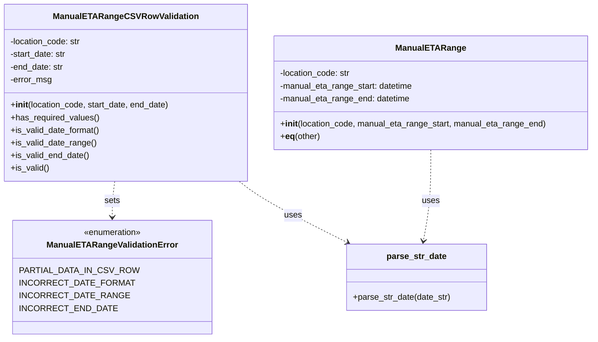

# Diagram: entity_core/entity_service/entity_service/db/models/manual_eta_range.py


> Auto-generated by Obscura crawlers

## Diagram 1



### SVG

<svg id="container" width="1113.59375" xmlns="http://www.w3.org/2000/svg" class="classDiagram" height="642" viewBox="0 0 1113.59375 642" role="graphics-document document" aria-roledescription="class"><style>#container{font-family:"trebuchet ms",verdana,arial,sans-serif;font-size:16px;fill:#333;}@keyframes edge-animation-frame{from{stroke-dashoffset:0;}}@keyframes dash{to{stroke-dashoffset:0;}}#container .edge-animation-slow{stroke-dasharray:9,5!important;stroke-dashoffset:900;animation:dash 50s linear infinite;stroke-linecap:round;}#container .edge-animation-fast{stroke-dasharray:9,5!important;stroke-dashoffset:900;animation:dash 20s linear infinite;stroke-linecap:round;}#container .error-icon{fill:#552222;}#container .error-text{fill:#552222;stroke:#552222;}#container .edge-thickness-normal{stroke-width:1px;}#container .edge-thickness-thick{stroke-width:3.5px;}#container .edge-pattern-solid{stroke-dasharray:0;}#container .edge-thickness-invisible{stroke-width:0;fill:none;}#container .edge-pattern-dashed{stroke-dasharray:3;}#container .edge-pattern-dotted{stroke-dasharray:2;}#container .marker{fill:#333333;stroke:#333333;}#container .marker.cross{stroke:#333333;}#container svg{font-family:"trebuchet ms",verdana,arial,sans-serif;font-size:16px;}#container p{margin:0;}#container g.classGroup text{fill:#9370DB;stroke:none;font-family:"trebuchet ms",verdana,arial,sans-serif;font-size:10px;}#container g.classGroup text .title{font-weight:bolder;}#container .nodeLabel,#container .edgeLabel{color:#131300;}#container .edgeLabel .label rect{fill:#ECECFF;}#container .label text{fill:#131300;}#container .labelBkg{background:#ECECFF;}#container .edgeLabel .label span{background:#ECECFF;}#container .classTitle{font-weight:bolder;}#container .node rect,#container .node circle,#container .node ellipse,#container .node polygon,#container .node path{fill:#ECECFF;stroke:#9370DB;stroke-width:1px;}#container .divider{stroke:#9370DB;stroke-width:1;}#container g.clickable{cursor:pointer;}#container g.classGroup rect{fill:#ECECFF;stroke:#9370DB;}#container g.classGroup line{stroke:#9370DB;stroke-width:1;}#container .classLabel .box{stroke:none;stroke-width:0;fill:#ECECFF;opacity:0.5;}#container .classLabel .label{fill:#9370DB;font-size:10px;}#container .relation{stroke:#333333;stroke-width:1;fill:none;}#container .dashed-line{stroke-dasharray:3;}#container .dotted-line{stroke-dasharray:1 2;}#container #compositionStart,#container .composition{fill:#333333!important;stroke:#333333!important;stroke-width:1;}#container #compositionEnd,#container .composition{fill:#333333!important;stroke:#333333!important;stroke-width:1;}#container #dependencyStart,#container .dependency{fill:#333333!important;stroke:#333333!important;stroke-width:1;}#container #dependencyStart,#container .dependency{fill:#333333!important;stroke:#333333!important;stroke-width:1;}#container #extensionStart,#container .extension{fill:transparent!important;stroke:#333333!important;stroke-width:1;}#container #extensionEnd,#container .extension{fill:transparent!important;stroke:#333333!important;stroke-width:1;}#container #aggregationStart,#container .aggregation{fill:transparent!important;stroke:#333333!important;stroke-width:1;}#container #aggregationEnd,#container .aggregation{fill:transparent!important;stroke:#333333!important;stroke-width:1;}#container #lollipopStart,#container .lollipop{fill:#ECECFF!important;stroke:#333333!important;stroke-width:1;}#container #lollipopEnd,#container .lollipop{fill:#ECECFF!important;stroke:#333333!important;stroke-width:1;}#container .edgeTerminals{font-size:11px;line-height:initial;}#container .classTitleText{text-anchor:middle;font-size:18px;fill:#333;}#container .label-icon{display:inline-block;height:1em;overflow:visible;vertical-align:-0.125em;}#container .node .label-icon path{fill:currentColor;stroke:revert;stroke-width:revert;}#container :root{--mermaid-font-family:"trebuchet ms",verdana,arial,sans-serif;}</style><g><defs><marker id="container_class-aggregationStart" class="marker aggregation class" refX="18" refY="7" markerWidth="190" markerHeight="240" orient="auto"><path d="M 18,7 L9,13 L1,7 L9,1 Z"></path></marker></defs><defs><marker id="container_class-aggregationEnd" class="marker aggregation class" refX="1" refY="7" markerWidth="20" markerHeight="28" orient="auto"><path d="M 18,7 L9,13 L1,7 L9,1 Z"></path></marker></defs><defs><marker id="container_class-extensionStart" class="marker extension class" refX="18" refY="7" markerWidth="190" markerHeight="240" orient="auto"><path d="M 1,7 L18,13 V 1 Z"></path></marker></defs><defs><marker id="container_class-extensionEnd" class="marker extension class" refX="1" refY="7" markerWidth="20" markerHeight="28" orient="auto"><path d="M 1,1 V 13 L18,7 Z"></path></marker></defs><defs><marker id="container_class-compositionStart" class="marker composition class" refX="18" refY="7" markerWidth="190" markerHeight="240" orient="auto"><path d="M 18,7 L9,13 L1,7 L9,1 Z"></path></marker></defs><defs><marker id="container_class-compositionEnd" class="marker composition class" refX="1" refY="7" markerWidth="20" markerHeight="28" orient="auto"><path d="M 18,7 L9,13 L1,7 L9,1 Z"></path></marker></defs><defs><marker id="container_class-dependencyStart" class="marker dependency class" refX="6" refY="7" markerWidth="190" markerHeight="240" orient="auto"><path d="M 5,7 L9,13 L1,7 L9,1 Z"></path></marker></defs><defs><marker id="container_class-dependencyEnd" class="marker dependency class" refX="13" refY="7" markerWidth="20" markerHeight="28" orient="auto"><path d="M 18,7 L9,13 L14,7 L9,1 Z"></path></marker></defs><defs><marker id="container_class-lollipopStart" class="marker lollipop class" refX="13" refY="7" markerWidth="190" markerHeight="240" orient="auto"><circle stroke="black" fill="transparent" cx="7" cy="7" r="6"></circle></marker></defs><defs><marker id="container_class-lollipopEnd" class="marker lollipop class" refX="1" refY="7" markerWidth="190" markerHeight="240" orient="auto"><circle stroke="black" fill="transparent" cx="7" cy="7" r="6"></circle></marker></defs><g class="root"><g class="clusters"></g><g class="edgePaths"><path d="M214.579,344L213.809,350.167C213.038,356.333,211.498,368.667,210.727,380C209.957,391.333,209.957,401.667,209.957,406.833L209.957,412" id="id_ManualETARangeCSVRowValidation_ManualETARangeValidationError_1" class="edge-thickness-normal edge-pattern-dashed relation" style=";;;" data-edge="true" data-et="edge" data-id="id_ManualETARangeCSVRowValidation_ManualETARangeValidationError_1" data-points="W3sieCI6MjE0LjU3OTIxMTEyODA0ODc3LCJ5IjozNDR9LHsieCI6MjA5Ljk1NzAzMTI1LCJ5IjozODF9LHsieCI6MjA5Ljk1NzAzMTI1LCJ5Ijo0MTh9XQ==" marker-end="url(#container_class-dependencyEnd)"></path><path d="M448.973,344L456.806,350.167C464.639,356.333,480.306,368.667,514.288,388.049C548.27,407.431,600.567,433.862,626.715,447.078L652.864,460.294" id="id_ManualETARangeCSVRowValidation_parse_str_date_2" class="edge-thickness-normal edge-pattern-dashed relation" style=";;;" data-edge="true" data-et="edge" data-id="id_ManualETARangeCSVRowValidation_parse_str_date_2" data-points="W3sieCI6NDQ4Ljk3MjUwMzgxMDk3NTYsInkiOjM0NH0seyJ4Ijo0OTUuOTcyNjU2MjUsInkiOjM4MX0seyJ4Ijo2NTguMjE4NjY5MTgxMDM0NCwieSI6NDYzfV0=" marker-end="url(#container_class-dependencyEnd)"></path><path d="M809.363,284L809.363,300.167C809.363,316.333,809.363,348.667,807.046,377.516C804.729,406.366,800.094,431.732,797.777,444.415L795.46,457.098" id="id_ManualETARange_parse_str_date_3" class="edge-thickness-normal edge-pattern-dashed relation" style=";;;" data-edge="true" data-et="edge" data-id="id_ManualETARange_parse_str_date_3" data-points="W3sieCI6ODA5LjM2MzI4MTI1LCJ5IjoyODR9LHsieCI6ODA5LjM2MzI4MTI1LCJ5IjozODF9LHsieCI6Nzk0LjM4MTQ5MjQ1Njg5NjYsInkiOjQ2M31d" marker-end="url(#container_class-dependencyEnd)"></path></g><g class="edgeLabels"><g class="edgeLabel" transform="translate(209.95703125, 381)"><g class="label" data-id="id_ManualETARangeCSVRowValidation_ManualETARangeValidationError_1" transform="translate(-14.7265625, -12)"><foreignObject width="29.453125" height="24"><div xmlns="http://www.w3.org/1999/xhtml" class="labelBkg" style="display: table-cell; white-space: nowrap; line-height: 1.5; max-width: 200px; text-align: center;"><span class="edgeLabel"><p>sets</p></span></div></foreignObject></g></g><g class="edgeLabel" transform="translate(550.40287, 408.50932)"><g class="label" data-id="id_ManualETARangeCSVRowValidation_parse_str_date_2" transform="translate(-16.4921875, -12)"><foreignObject width="32.984375" height="24"><div xmlns="http://www.w3.org/1999/xhtml" class="labelBkg" style="display: table-cell; white-space: nowrap; line-height: 1.5; max-width: 200px; text-align: center;"><span class="edgeLabel"><p>uses</p></span></div></foreignObject></g></g><g class="edgeLabel" transform="translate(809.36328125, 381)"><g class="label" data-id="id_ManualETARange_parse_str_date_3" transform="translate(-16.4921875, -12)"><foreignObject width="32.984375" height="24"><div xmlns="http://www.w3.org/1999/xhtml" class="labelBkg" style="display: table-cell; white-space: nowrap; line-height: 1.5; max-width: 200px; text-align: center;"><span class="edgeLabel"><p>uses</p></span></div></foreignObject></g></g></g><g class="nodes"><g class="node default" id="classId-ManualETARangeCSVRowValidation-0" transform="translate(235.56640625, 176)"><g class="basic label-container"><path d="M-227.56640625 -168 L227.56640625 -168 L227.56640625 168 L-227.56640625 168" stroke="none" stroke-width="0" fill="#ECECFF" style=""></path><path d="M-227.56640625 -168 C-95.46474262903232 -168, 36.63692099193537 -168, 227.56640625 -168 M-227.56640625 -168 C-122.85460307448746 -168, -18.142799898974914 -168, 227.56640625 -168 M227.56640625 -168 C227.56640625 -90.54613176521357, 227.56640625 -13.092263530427147, 227.56640625 168 M227.56640625 -168 C227.56640625 -43.1031498777492, 227.56640625 81.7937002445016, 227.56640625 168 M227.56640625 168 C126.02214074280501 168, 24.477875235610014 168, -227.56640625 168 M227.56640625 168 C79.20170493891641 168, -69.16299637216719 168, -227.56640625 168 M-227.56640625 168 C-227.56640625 49.297863172742154, -227.56640625 -69.40427365451569, -227.56640625 -168 M-227.56640625 168 C-227.56640625 81.51557946694633, -227.56640625 -4.968841066107331, -227.56640625 -168" stroke="#9370DB" stroke-width="1.3" fill="none" stroke-dasharray="0 0" style=""></path></g><g class="annotation-group text" transform="translate(0, -144)"></g><g class="label-group text" transform="translate(-127.8671875, -144)"><g class="label" style="font-weight: bolder" transform="translate(0,-12)"><foreignObject width="255.734375" height="24"><div xmlns="http://www.w3.org/1999/xhtml" style="display: table-cell; white-space: nowrap; line-height: 1.5; max-width: 302px; text-align: center;"><span class="nodeLabel markdown-node-label" style=""><p>ManualETARangeCSVRowValidation</p></span></div></foreignObject></g></g><g class="members-group text" transform="translate(-215.56640625, -96)"><g class="label" style="" transform="translate(0,-12)"><foreignObject width="136.078125" height="24"><div xmlns="http://www.w3.org/1999/xhtml" style="display: table-cell; white-space: nowrap; line-height: 1.5; max-width: 194px; text-align: center;"><span class="nodeLabel markdown-node-label" style=""><p>-location_code: str</p></span></div></foreignObject></g><g class="label" style="" transform="translate(0,12)"><foreignObject width="108.28125" height="24"><div xmlns="http://www.w3.org/1999/xhtml" style="display: table-cell; white-space: nowrap; line-height: 1.5; max-width: 166px; text-align: center;"><span class="nodeLabel markdown-node-label" style=""><p>-start_date: str</p></span></div></foreignObject></g><g class="label" style="" transform="translate(0,36)"><foreignObject width="102.15625" height="24"><div xmlns="http://www.w3.org/1999/xhtml" style="display: table-cell; white-space: nowrap; line-height: 1.5; max-width: 160px; text-align: center;"><span class="nodeLabel markdown-node-label" style=""><p>-end_date: str</p></span></div></foreignObject></g><g class="label" style="" transform="translate(0,60)"><foreignObject width="79.109375" height="24"><div xmlns="http://www.w3.org/1999/xhtml" style="display: table-cell; white-space: nowrap; line-height: 1.5; max-width: 137px; text-align: center;"><span class="nodeLabel markdown-node-label" style=""><p>-error_msg</p></span></div></foreignObject></g></g><g class="methods-group text" transform="translate(-215.56640625, 24)"><g class="label" style="" transform="translate(0,-12)"><foreignObject width="303.265625" height="24"><div xmlns="http://www.w3.org/1999/xhtml" style="display: table-cell; white-space: nowrap; line-height: 1.5; max-width: 392px; text-align: center;"><span class="nodeLabel markdown-node-label" style=""><p>+<strong>init</strong>(location_code, start_date, end_date)</p></span></div></foreignObject></g><g class="label" style="" transform="translate(0,12)"><foreignObject width="167.734375" height="24"><div xmlns="http://www.w3.org/1999/xhtml" style="display: table-cell; white-space: nowrap; line-height: 1.5; max-width: 225px; text-align: center;"><span class="nodeLabel markdown-node-label" style=""><p>+has_required_values()</p></span></div></foreignObject></g><g class="label" style="" transform="translate(0,36)"><foreignObject width="169.90625" height="24"><div xmlns="http://www.w3.org/1999/xhtml" style="display: table-cell; white-space: nowrap; line-height: 1.5; max-width: 227px; text-align: center;"><span class="nodeLabel markdown-node-label" style=""><p>+is_valid_date_format()</p></span></div></foreignObject></g><g class="label" style="" transform="translate(0,60)"><foreignObject width="161.796875" height="24"><div xmlns="http://www.w3.org/1999/xhtml" style="display: table-cell; white-space: nowrap; line-height: 1.5; max-width: 219px; text-align: center;"><span class="nodeLabel markdown-node-label" style=""><p>+is_valid_date_range()</p></span></div></foreignObject></g><g class="label" style="" transform="translate(0,84)"><foreignObject width="148.984375" height="24"><div xmlns="http://www.w3.org/1999/xhtml" style="display: table-cell; white-space: nowrap; line-height: 1.5; max-width: 206px; text-align: center;"><span class="nodeLabel markdown-node-label" style=""><p>+is_valid_end_date()</p></span></div></foreignObject></g><g class="label" style="" transform="translate(0,108)"><foreignObject width="72.796875" height="24"><div xmlns="http://www.w3.org/1999/xhtml" style="display: table-cell; white-space: nowrap; line-height: 1.5; max-width: 130px; text-align: center;"><span class="nodeLabel markdown-node-label" style=""><p>+is_valid()</p></span></div></foreignObject></g></g><g class="divider" style=""><path d="M-227.56640625 -120 C-76.45082403725226 -120, 74.66475817549548 -120, 227.56640625 -120 M-227.56640625 -120 C-77.31447944400213 -120, 72.93744736199574 -120, 227.56640625 -120" stroke="#9370DB" stroke-width="1.3" fill="none" stroke-dasharray="0 0" style=""></path></g><g class="divider" style=""><path d="M-227.56640625 0 C-90.50672094235321 0, 46.552964365293576 0, 227.56640625 0 M-227.56640625 0 C-112.68482627274517 0, 2.1967537045096606 0, 227.56640625 0" stroke="#9370DB" stroke-width="1.3" fill="none" stroke-dasharray="0 0" style=""></path></g></g><g class="node default" id="classId-ManualETARange-1" transform="translate(809.36328125, 176)"><g class="basic label-container"><path d="M-296.23046875 -108 L296.23046875 -108 L296.23046875 108 L-296.23046875 108" stroke="none" stroke-width="0" fill="#ECECFF" style=""></path><path d="M-296.23046875 -108 C-82.00958012603647 -108, 132.21130849792706 -108, 296.23046875 -108 M-296.23046875 -108 C-170.73602331229114 -108, -45.241577874582305 -108, 296.23046875 -108 M296.23046875 -108 C296.23046875 -45.7043242997071, 296.23046875 16.591351400585793, 296.23046875 108 M296.23046875 -108 C296.23046875 -24.93330819847992, 296.23046875 58.13338360304016, 296.23046875 108 M296.23046875 108 C120.06645758968213 108, -56.09755357063574 108, -296.23046875 108 M296.23046875 108 C125.89453467352541 108, -44.44139940294917 108, -296.23046875 108 M-296.23046875 108 C-296.23046875 55.85562673726476, -296.23046875 3.7112534745295136, -296.23046875 -108 M-296.23046875 108 C-296.23046875 63.57560692230821, -296.23046875 19.15121384461642, -296.23046875 -108" stroke="#9370DB" stroke-width="1.3" fill="none" stroke-dasharray="0 0" style=""></path></g><g class="annotation-group text" transform="translate(0, -84)"></g><g class="label-group text" transform="translate(-61.8984375, -84)"><g class="label" style="font-weight: bolder" transform="translate(0,-12)"><foreignObject width="123.796875" height="24"><div xmlns="http://www.w3.org/1999/xhtml" style="display: table-cell; white-space: nowrap; line-height: 1.5; max-width: 173px; text-align: center;"><span class="nodeLabel markdown-node-label" style=""><p>ManualETARange</p></span></div></foreignObject></g></g><g class="members-group text" transform="translate(-284.23046875, -36)"><g class="label" style="" transform="translate(0,-12)"><foreignObject width="136.078125" height="24"><div xmlns="http://www.w3.org/1999/xhtml" style="display: table-cell; white-space: nowrap; line-height: 1.5; max-width: 194px; text-align: center;"><span class="nodeLabel markdown-node-label" style=""><p>-location_code: str</p></span></div></foreignObject></g><g class="label" style="" transform="translate(0,12)"><foreignObject width="255.859375" height="24"><div xmlns="http://www.w3.org/1999/xhtml" style="display: table-cell; white-space: nowrap; line-height: 1.5; max-width: 313px; text-align: center;"><span class="nodeLabel markdown-node-label" style=""><p>-manual_eta_range_start: datetime</p></span></div></foreignObject></g><g class="label" style="" transform="translate(0,36)"><foreignObject width="249.359375" height="24"><div xmlns="http://www.w3.org/1999/xhtml" style="display: table-cell; white-space: nowrap; line-height: 1.5; max-width: 307px; text-align: center;"><span class="nodeLabel markdown-node-label" style=""><p>-manual_eta_range_end: datetime</p></span></div></foreignObject></g></g><g class="methods-group text" transform="translate(-284.23046875, 60)"><g class="label" style="" transform="translate(0,-12)"><foreignObject width="506.5625" height="24"><div xmlns="http://www.w3.org/1999/xhtml" style="display: table-cell; white-space: nowrap; line-height: 1.5; max-width: 595px; text-align: center;"><span class="nodeLabel markdown-node-label" style=""><p>+<strong>init</strong>(location_code, manual_eta_range_start, manual_eta_range_end)</p></span></div></foreignObject></g><g class="label" style="" transform="translate(0,12)"><foreignObject width="76.1875" height="24"><div xmlns="http://www.w3.org/1999/xhtml" style="display: table-cell; white-space: nowrap; line-height: 1.5; max-width: 165px; text-align: center;"><span class="nodeLabel markdown-node-label" style=""><p>+<strong>eq</strong>(other)</p></span></div></foreignObject></g></g><g class="divider" style=""><path d="M-296.23046875 -60 C-117.33350854324041 -60, 61.563451663519174 -60, 296.23046875 -60 M-296.23046875 -60 C-95.77790741760265 -60, 104.6746539147947 -60, 296.23046875 -60" stroke="#9370DB" stroke-width="1.3" fill="none" stroke-dasharray="0 0" style=""></path></g><g class="divider" style=""><path d="M-296.23046875 36 C-108.17036463159704 36, 79.88973948680592 36, 296.23046875 36 M-296.23046875 36 C-75.23350832397946 36, 145.76345210204107 36, 296.23046875 36" stroke="#9370DB" stroke-width="1.3" fill="none" stroke-dasharray="0 0" style=""></path></g></g><g class="node default" id="classId-ManualETARangeValidationError-2" transform="translate(209.95703125, 526)"><g class="basic label-container"><path d="M-170.3203125 -108 L170.3203125 -108 L170.3203125 108 L-170.3203125 108" stroke="none" stroke-width="0" fill="#ECECFF" style=""></path><path d="M-170.3203125 -108 C-91.28456707129419 -108, -12.248821642588382 -108, 170.3203125 -108 M-170.3203125 -108 C-101.38054036296067 -108, -32.440768225921346 -108, 170.3203125 -108 M170.3203125 -108 C170.3203125 -42.967868369934976, 170.3203125 22.064263260130048, 170.3203125 108 M170.3203125 -108 C170.3203125 -33.552038478785775, 170.3203125 40.89592304242845, 170.3203125 108 M170.3203125 108 C40.544536512761255 108, -89.23123947447749 108, -170.3203125 108 M170.3203125 108 C61.29768941323968 108, -47.72493367352064 108, -170.3203125 108 M-170.3203125 108 C-170.3203125 57.744951717555935, -170.3203125 7.48990343511187, -170.3203125 -108 M-170.3203125 108 C-170.3203125 32.83147895356596, -170.3203125 -42.337042092868074, -170.3203125 -108" stroke="#9370DB" stroke-width="1.3" fill="none" stroke-dasharray="0 0" style=""></path></g><g class="annotation-group text" transform="translate(-55.5546875, -84)"><g class="label" style="" transform="translate(0,-12)"><foreignObject width="111.109375" height="24"><div xmlns="http://www.w3.org/1999/xhtml" style="display: table-cell; white-space: nowrap; line-height: 1.5; max-width: 161px; text-align: center;"><span class="nodeLabel markdown-node-label" style=""><p>«enumeration»</p></span></div></foreignObject></g></g><g class="label-group text" transform="translate(-117.078125, -60)"><g class="label" style="font-weight: bolder" transform="translate(0,-12)"><foreignObject width="234.15625" height="24"><div xmlns="http://www.w3.org/1999/xhtml" style="display: table-cell; white-space: nowrap; line-height: 1.5; max-width: 283px; text-align: center;"><span class="nodeLabel markdown-node-label" style=""><p>ManualETARangeValidationError</p></span></div></foreignObject></g></g><g class="members-group text" transform="translate(-158.3203125, -12)"><g class="label" style="" transform="translate(0,-12)"><foreignObject width="199.5625" height="24"><div xmlns="http://www.w3.org/1999/xhtml" style="display: table-cell; white-space: nowrap; line-height: 1.5; max-width: 250px; text-align: center;"><span class="nodeLabel markdown-node-label" style=""><p>PARTIAL_DATA_IN_CSV_ROW</p></span></div></foreignObject></g><g class="label" style="" transform="translate(0,12)"><foreignObject width="188.78125" height="24"><div xmlns="http://www.w3.org/1999/xhtml" style="display: table-cell; white-space: nowrap; line-height: 1.5; max-width: 239px; text-align: center;"><span class="nodeLabel markdown-node-label" style=""><p>INCORRECT_DATE_FORMAT</p></span></div></foreignObject></g><g class="label" style="" transform="translate(0,36)"><foreignObject width="179.78125" height="24"><div xmlns="http://www.w3.org/1999/xhtml" style="display: table-cell; white-space: nowrap; line-height: 1.5; max-width: 230px; text-align: center;"><span class="nodeLabel markdown-node-label" style=""><p>INCORRECT_DATE_RANGE</p></span></div></foreignObject></g><g class="label" style="" transform="translate(0,60)"><foreignObject width="160.5" height="24"><div xmlns="http://www.w3.org/1999/xhtml" style="display: table-cell; white-space: nowrap; line-height: 1.5; max-width: 211px; text-align: center;"><span class="nodeLabel markdown-node-label" style=""><p>INCORRECT_END_DATE</p></span></div></foreignObject></g></g><g class="methods-group text" transform="translate(-158.3203125, 108)"></g><g class="divider" style=""><path d="M-170.3203125 -36 C-36.79766756972151 -36, 96.72497736055698 -36, 170.3203125 -36 M-170.3203125 -36 C-53.25592021381762 -36, 63.808472072364765 -36, 170.3203125 -36" stroke="#9370DB" stroke-width="1.3" fill="none" stroke-dasharray="0 0" style=""></path></g><g class="divider" style=""><path d="M-170.3203125 84 C-87.761186649527 84, -5.20206079905401 84, 170.3203125 84 M-170.3203125 84 C-91.55531851630792 84, -12.790324532615841 84, 170.3203125 84" stroke="#9370DB" stroke-width="1.3" fill="none" stroke-dasharray="0 0" style=""></path></g></g><g class="node default" id="classId-parse_str_date-3" transform="translate(782.87109375, 526)"><g class="basic label-container"><path d="M-131.84765625 -63 L131.84765625 -63 L131.84765625 63 L-131.84765625 63" stroke="none" stroke-width="0" fill="#ECECFF" style=""></path><path d="M-131.84765625 -63 C-46.62622662874226 -63, 38.59520299251548 -63, 131.84765625 -63 M-131.84765625 -63 C-34.42862752547617 -63, 62.99040119904765 -63, 131.84765625 -63 M131.84765625 -63 C131.84765625 -26.45072413889583, 131.84765625 10.098551722208342, 131.84765625 63 M131.84765625 -63 C131.84765625 -26.55069292032357, 131.84765625 9.89861415935286, 131.84765625 63 M131.84765625 63 C65.08267809272371 63, -1.682300064552578 63, -131.84765625 63 M131.84765625 63 C68.22311621024573 63, 4.598576170491455 63, -131.84765625 63 M-131.84765625 63 C-131.84765625 29.417067181500165, -131.84765625 -4.165865636999669, -131.84765625 -63 M-131.84765625 63 C-131.84765625 35.526179030982064, -131.84765625 8.05235806196412, -131.84765625 -63" stroke="#9370DB" stroke-width="1.3" fill="none" stroke-dasharray="0 0" style=""></path></g><g class="annotation-group text" transform="translate(0, -39)"></g><g class="label-group text" transform="translate(-54.5390625, -39)"><g class="label" style="font-weight: bolder" transform="translate(0,-12)"><foreignObject width="109.078125" height="24"><div xmlns="http://www.w3.org/1999/xhtml" style="display: table-cell; white-space: nowrap; line-height: 1.5; max-width: 157px; text-align: center;"><span class="nodeLabel markdown-node-label" style=""><p>parse_str_date</p></span></div></foreignObject></g></g><g class="members-group text" transform="translate(-119.84765625, 9)"></g><g class="methods-group text" transform="translate(-119.84765625, 39)"><g class="label" style="" transform="translate(0,-12)"><foreignObject width="185.15625" height="24"><div xmlns="http://www.w3.org/1999/xhtml" style="display: table-cell; white-space: nowrap; line-height: 1.5; max-width: 243px; text-align: center;"><span class="nodeLabel markdown-node-label" style=""><p>+parse_str_date(date_str)</p></span></div></foreignObject></g></g><g class="divider" style=""><path d="M-131.84765625 -15 C-50.586097916677176 -15, 30.67546041664565 -15, 131.84765625 -15 M-131.84765625 -15 C-34.07578794803736 -15, 63.69608035392528 -15, 131.84765625 -15" stroke="#9370DB" stroke-width="1.3" fill="none" stroke-dasharray="0 0" style=""></path></g><g class="divider" style=""><path d="M-131.84765625 9 C-56.29164816050633 9, 19.264359928987346 9, 131.84765625 9 M-131.84765625 9 C-49.74151468341124 9, 32.36462688317752 9, 131.84765625 9" stroke="#9370DB" stroke-width="1.3" fill="none" stroke-dasharray="0 0" style=""></path></g></g></g></g></g></svg>

## Diagram 2

```mermaid
flowchart TD
Start([Start is_valid()]) --> A{has_required_values?}
A -- No --> B[error = PARTIAL_DATA_IN_CSV_ROW<br/>return False]
A -- Yes --> C{is_valid_date_format?}
C -- No --> D[error = INCORRECT_DATE_FORMAT<br/>return False]
C -- Yes --> E{is_valid_date_range?}
E -- No --> F[error = INCORRECT_DATE_RANGE<br/>return False]
E -- Yes --> G{is_valid_end_date?}
G -- No --> H[error = INCORRECT_END_DATE<br/>return False]
G -- Yes --> I[return True]
B --> End([End])
D --> End
F --> End
H --> End
I --> End
```

> SVG rendering failed for this diagram.
