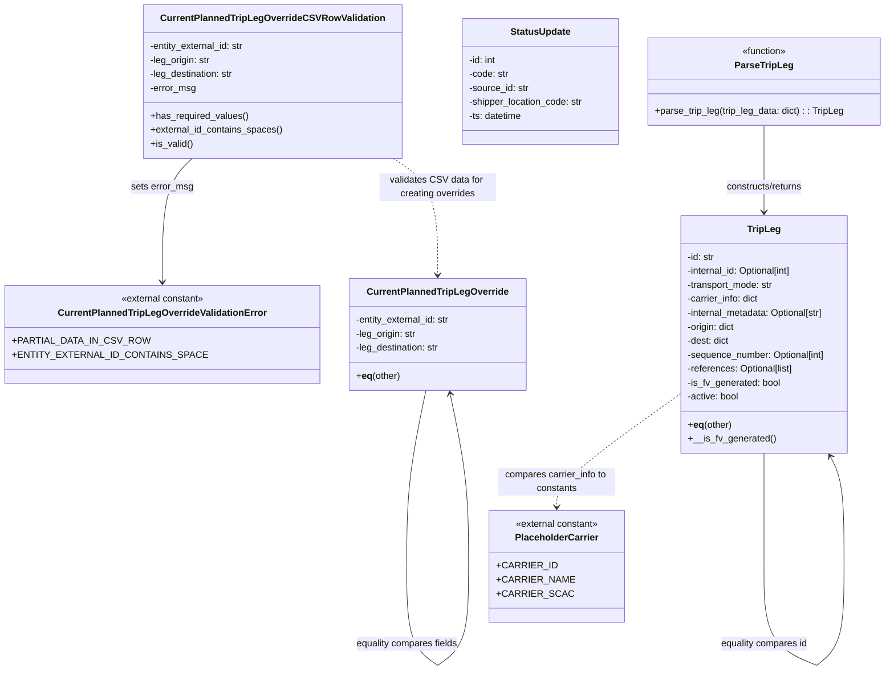

# Diagram: entity_core/entity_service/entity_service/db/models/override_current_planned_trip_leg.py

> Auto-generated by Obscura crawlers

## Mermaid

### SVG

<svg id="container" width="1452.0894775390625" xmlns="http://www.w3.org/2000/svg" class="classDiagram" height="1150.1500244140625" viewBox="0 0 1452.0894775390625 1150.1500244140625" role="graphics-document document" aria-roledescription="class"><g><defs><marker id="container_class-aggregationStart" class="marker aggregation class" refX="18" refY="7" markerWidth="190" markerHeight="240" orient="auto"><path d="M 18,7 L9,13 L1,7 L9,1 Z"></path></marker></defs><defs><marker id="container_class-aggregationEnd" class="marker aggregation class" refX="1" refY="7" markerWidth="20" markerHeight="28" orient="auto"><path d="M 18,7 L9,13 L1,7 L9,1 Z"></path></marker></defs><defs><marker id="container_class-extensionStart" class="marker extension class" refX="18" refY="7" markerWidth="190" markerHeight="240" orient="auto"><path d="M 1,7 L18,13 V 1 Z"></path></marker></defs><defs><marker id="container_class-extensionEnd" class="marker extension class" refX="1" refY="7" markerWidth="20" markerHeight="28" orient="auto"><path d="M 1,1 V 13 L18,7 Z"></path></marker></defs><defs><marker id="container_class-compositionStart" class="marker composition class" refX="18" refY="7" markerWidth="190" markerHeight="240" orient="auto"><path d="M 18,7 L9,13 L1,7 L9,1 Z"></path></marker></defs><defs><marker id="container_class-compositionEnd" class="marker composition class" refX="1" refY="7" markerWidth="20" markerHeight="28" orient="auto"><path d="M 18,7 L9,13 L1,7 L9,1 Z"></path></marker></defs><defs><marker id="container_class-dependencyStart" class="marker dependency class" refX="6" refY="7" markerWidth="190" markerHeight="240" orient="auto"><path d="M 5,7 L9,13 L1,7 L9,1 Z"></path></marker></defs><defs><marker id="container_class-dependencyEnd" class="marker dependency class" refX="13" refY="7" markerWidth="20" markerHeight="28" orient="auto"><path d="M 18,7 L9,13 L14,7 L9,1 Z"></path></marker></defs><defs><marker id="container_class-lollipopStart" class="marker lollipop class" refX="13" refY="7" markerWidth="190" markerHeight="240" orient="auto"><circle stroke="black" fill="transparent" cx="7" cy="7" r="6"></circle></marker></defs><defs><marker id="container_class-lollipopEnd" class="marker lollipop class" refX="1" refY="7" markerWidth="190" markerHeight="240" orient="auto"><circle stroke="black" fill="transparent" cx="7" cy="7" r="6"></circle></marker></defs><g class="root"><g class="clusters"></g><g class="edgePaths"><path d="M297.685,272L289.807,280.167C281.93,288.333,266.174,304.667,258.296,340C250.418,375.333,250.418,429.667,250.418,456.833L250.418,484" id="id_CurrentPlannedTripLegOverrideCSVRowValidation_CurrentPlannedTripLegOverrideValidationError_1" class="edge-thickness-normal edge-pattern-solid relation" style=";;;" data-edge="true" data-et="edge" data-id="id_CurrentPlannedTripLegOverrideCSVRowValidation_CurrentPlannedTripLegOverrideValidationError_1" data-points="W3sieCI6Mjk3LjY4NTI2NjMxNTYwNzc1LCJ5IjoyNzJ9LHsieCI6MjUwLjQxNzk2ODc1LCJ5IjozMjF9LHsieCI6MjUwLjQxNzk2ODc1LCJ5Ijo0OTB9XQ==" marker-end="url(#container_class-dependencyEnd)"></path><path d="M1098.871,678.825L1064.378,703.521C1029.885,728.217,960.9,777.608,926.407,809.471C891.914,841.333,891.914,855.667,891.914,862.833L891.914,870" id="id_TripLeg_PlaceholderCarrier_2" class="edge-thickness-normal edge-pattern-dashed relation" style=";;;" data-edge="true" data-et="edge" data-id="id_TripLeg_PlaceholderCarrier_2" data-points="W3sieCI6MTA5OC44NzA3MDMxMjUzNzI1LCJ5Ijo2NzguODI1MjY4OTgwNTMyMn0seyJ4Ijo4OTEuOTE0MDYyNSwieSI6ODI3fSx7IngiOjg5MS45MTQwNjI1LCJ5Ijo4NzZ9XQ==" marker-end="url(#container_class-dependencyEnd)"></path><path d="M1245.281,215L1245.281,232.667C1245.281,250.333,1245.281,285.667,1245.281,310.5C1245.281,335.333,1245.281,349.667,1245.281,356.833L1245.281,364" id="id_ParseTripLeg_TripLeg_3" class="edge-thickness-normal edge-pattern-solid relation" style=";;;" data-edge="true" data-et="edge" data-id="id_ParseTripLeg_TripLeg_3" data-points="W3sieCI6MTI0NS4yODA4NTkzNzUzNzI1LCJ5IjoyMTV9LHsieCI6MTI0NS4yODA4NTkzNzUzNzI1LCJ5IjozMjF9LHsieCI6MTI0NS4yODA4NTkzNzUzNzI1LCJ5IjozNzB9XQ==" marker-end="url(#container_class-dependencyEnd)"></path><path d="M622.287,272L634.492,280.167C646.696,288.333,671.106,304.667,683.311,338C695.516,371.333,695.516,421.667,695.516,446.833L695.516,472" id="id_CurrentPlannedTripLegOverrideCSVRowValidation_CurrentPlannedTripLegOverride_4" class="edge-thickness-normal edge-pattern-dashed relation" style=";;;" data-edge="true" data-et="edge" data-id="id_CurrentPlannedTripLegOverrideCSVRowValidation_CurrentPlannedTripLegOverride_4" data-points="W3sieCI6NjIyLjI4Njg3MTk3ODU5MTIsInkiOjI3Mn0seyJ4Ijo2OTUuNTE1NjI1LCJ5IjozMjF9LHsieCI6Njk1LjUxNTYyNSwieSI6NDc4fV0=" marker-end="url(#container_class-dependencyEnd)"></path><path d="M674.904,670L669.286,696.167C663.668,722.333,652.432,774.667,646.813,824.992C641.195,875.317,641.195,923.633,641.195,947.792L641.195,971.95" id="CurrentPlannedTripLegOverride-cyclic-special-1" class="edge-thickness-normal edge-pattern-solid relation" style=";;;" data-edge="true" data-et="edge" data-id="CurrentPlannedTripLegOverride-cyclic-special-1" data-points="W3sieCI6Njc0LjkwMzk2NDkyMDk0ODYsInkiOjY3MH0seyJ4Ijo2NDEuMTk1MzEyNSwieSI6ODI3fSx7IngiOjY0MS4xOTUzMTI1LCJ5Ijo5NzEuOTQ5OTk5OTk5MjU0OX1d"></path><path d="M641.195,972.05L641.195,994.208C641.195,1016.367,641.195,1060.683,650.24,1089.011C659.285,1117.339,677.376,1129.677,686.421,1135.847L695.466,1142.016" id="CurrentPlannedTripLegOverride-cyclic-special-mid" class="edge-thickness-normal edge-pattern-solid relation" style=";;;" data-edge="true" data-et="edge" data-id="CurrentPlannedTripLegOverride-cyclic-special-mid" data-points="W3sieCI6NjQxLjE5NTMxMjUsInkiOjk3Mi4wNTAwMDAwMDA3NDUxfSx7IngiOjY0MS4xOTUzMTI1LCJ5IjoxMTA1fSx7IngiOjY5NS40NjU2MjQ5OTkyNTQ5LCJ5IjoxMTQyLjAxNTg5NjczNTQ1ODV9XQ=="></path><path d="M695.566,1142.016L704.611,1135.847C713.656,1129.677,731.746,1117.339,740.791,1089.003C749.836,1060.667,749.836,1016.333,749.836,970C749.836,923.667,749.836,875.333,744.428,825.978C739.02,776.622,728.203,726.244,722.795,701.055L717.387,675.866" id="CurrentPlannedTripLegOverride-cyclic-special-2" class="edge-thickness-normal edge-pattern-solid relation" style=";;;" data-edge="true" data-et="edge" data-id="CurrentPlannedTripLegOverride-cyclic-special-2" data-points="W3sieCI6Njk1LjU2NTYyNTAwMDc0NTEsInkiOjExNDIuMDE1ODk2NzM1NDU4NX0seyJ4Ijo3NDkuODM1OTM3NSwieSI6MTEwNX0seyJ4Ijo3NDkuODM1OTM3NSwieSI6OTcyfSx7IngiOjc0OS44MzU5Mzc1LCJ5Ijo4Mjd9LHsieCI6NzE2LjEyNzI4NTA3OTA1MTQsInkiOjY3MH1d" marker-end="url(#container_class-dependencyEnd)"></path><path d="M1245.281,778L1245.281,786.167C1245.281,794.333,1245.281,810.667,1245.281,842.992C1245.281,875.317,1245.281,923.633,1245.281,947.792L1245.281,971.95" id="TripLeg-cyclic-special-1" class="edge-thickness-normal edge-pattern-solid relation" style=";;;" data-edge="true" data-et="edge" data-id="TripLeg-cyclic-special-1" data-points="W3sieCI6MTI0NS4yODA4NTkzNzUzNzI1LCJ5Ijo3Nzh9LHsieCI6MTI0NS4yODA4NTkzNzUzNzI1LCJ5Ijo4Mjd9LHsieCI6MTI0NS4yODA4NTkzNzUzNzI1LCJ5Ijo5NzEuOTQ5OTk5OTk5MjU0OX1d"></path><path d="M1245.281,972.05L1245.281,994.208C1245.281,1016.367,1245.281,1060.683,1261.462,1089.013C1277.642,1117.344,1310.004,1129.687,1326.185,1135.859L1342.366,1142.031" id="TripLeg-cyclic-special-mid" class="edge-thickness-normal edge-pattern-solid relation" style=";;;" data-edge="true" data-et="edge" data-id="TripLeg-cyclic-special-mid" data-points="W3sieCI6MTI0NS4yODA4NTkzNzUzNzI1LCJ5Ijo5NzIuMDUwMDAwMDAwNzQ1MX0seyJ4IjoxMjQ1LjI4MDg1OTM3NTM3MjUsInkiOjExMDV9LHsieCI6MTM0Mi4zNjU2MjQ5OTk2Mjc1LCJ5IjoxMTQyLjAzMDkyODU1ODk2Mjh9XQ=="></path><path d="M1342.466,1142.011L1350.449,1135.843C1358.432,1129.674,1374.398,1117.337,1382.382,1089.002C1390.365,1060.667,1390.365,1016.333,1390.365,970C1390.365,923.667,1390.365,875.333,1386.179,843.867C1381.993,812.402,1373.622,797.803,1369.436,790.504L1365.25,783.205" id="TripLeg-cyclic-special-2" class="edge-thickness-normal edge-pattern-solid relation" style=";;;" data-edge="true" data-et="edge" data-id="TripLeg-cyclic-special-2" data-points="W3sieCI6MTM0Mi40NjU2MjUwMDExMTc2LCJ5IjoxMTQyLjAxMTM2NTM3Njk1MDZ9LHsieCI6MTM5MC4zNjQ4NDM3NTAzNzI1LCJ5IjoxMTA1fSx7IngiOjEzOTAuMzY0ODQzNzUwMzcyNSwieSI6OTcyfSx7IngiOjEzOTAuMzY0ODQzNzUwMzcyNSwieSI6ODI3fSx7IngiOjEzNjIuMjY1NTc0MDQ5Mjg1NSwieSI6Nzc4fV0=" marker-end="url(#container_class-dependencyEnd)"></path></g><g class="edgeLabels"><g class="edgeLabel" transform="translate(250.41796875, 321)"><g class="label" data-id="id_CurrentPlannedTripLegOverrideCSVRowValidation_CurrentPlannedTripLegOverrideValidationError_1" transform="translate(-53.171875, -12)"><foreignObject width="106.34375" height="24">

sets error_msg

</foreignObject></g></g><g class="edgeLabel" transform="translate(891.9140625, 827)"><g class="label" data-id="id_TripLeg_PlaceholderCarrier_2" transform="translate(-100, -24)"><foreignObject width="200" height="48">

compares carrier_info to constants

</foreignObject></g></g><g class="edgeLabel" transform="translate(1245.2808593753725, 321)"><g class="label" data-id="id_ParseTripLeg_TripLeg_3" transform="translate(-68.03125, -12)"><foreignObject width="136.0625" height="24">

constructs/returns

</foreignObject></g></g><g class="edgeLabel" transform="translate(695.515625, 321)"><g class="label" data-id="id_CurrentPlannedTripLegOverrideCSVRowValidation_CurrentPlannedTripLegOverride_4" transform="translate(-100, -24)"><foreignObject width="200" height="48">

validates CSV data for creating overrides

</foreignObject></g></g><g class="edgeLabel"><g class="label" data-id="CurrentPlannedTripLegOverride-cyclic-special-1" transform="translate(0, 0)"><foreignObject width="0" height="0">

</foreignObject></g></g><g class="edgeLabel" transform="translate(641.1953125, 1105)"><g class="label" data-id="CurrentPlannedTripLegOverride-cyclic-special-mid" transform="translate(-88.640625, -12)"><foreignObject width="177.28125" height="24">

equality compares fields

</foreignObject></g></g><g class="edgeLabel"><g class="label" data-id="CurrentPlannedTripLegOverride-cyclic-special-2" transform="translate(0, 0)"><foreignObject width="0" height="0">

</foreignObject></g></g><g class="edgeLabel"><g class="label" data-id="TripLeg-cyclic-special-1" transform="translate(0, 0)"><foreignObject width="0" height="0">

</foreignObject></g></g><g class="edgeLabel" transform="translate(1245.2808593753725, 1105)"><g class="label" data-id="TripLeg-cyclic-special-mid" transform="translate(-75.8984375, -12)"><foreignObject width="151.796875" height="24">

equality compares id

</foreignObject></g></g><g class="edgeLabel"><g class="label" data-id="TripLeg-cyclic-special-2" transform="translate(0, 0)"><foreignObject width="0" height="0">

</foreignObject></g></g></g><g class="nodes"><g class="node default" id="classId-CurrentPlannedTripLegOverrideCSVRowValidation-0" transform="translate(425.017578125, 140)"><g class="basic label-container"><path d="M-216.5390625 -132 L216.5390625 -132 L216.5390625 132 L-216.5390625 132" stroke="none" stroke-width="0" fill="#ECECFF" style=""></path><path d="M-216.5390625 -132 C-120.01183547344891 -132, -23.484608446897823 -132, 216.5390625 -132 M-216.5390625 -132 C-73.5551566122362 -132, 69.4287492755276 -132, 216.5390625 -132 M216.5390625 -132 C216.5390625 -60.95188589739739, 216.5390625 10.096228205205222, 216.5390625 132 M216.5390625 -132 C216.5390625 -42.60677036795626, 216.5390625 46.78645926408748, 216.5390625 132 M216.5390625 132 C65.65293634316205 132, -85.23318981367589 132, -216.5390625 132 M216.5390625 132 C90.70718994417425 132, -35.12468261165151 132, -216.5390625 132 M-216.5390625 132 C-216.5390625 76.02491114941103, -216.5390625 20.049822298822065, -216.5390625 -132 M-216.5390625 132 C-216.5390625 43.570134780863114, -216.5390625 -44.85973043827377, -216.5390625 -132" stroke="#9370DB" stroke-width="1.3" fill="none" stroke-dasharray="0 0" style=""></path></g><g class="annotation-group text" transform="translate(0, -108)"></g><g class="label-group text" transform="translate(-182.125, -108)"><g class="label" style="font-weight: bolder" transform="translate(0,-12)"><foreignObject width="364.25" height="24">

CurrentPlannedTripLegOverrideCSVRowValidation

</foreignObject></g></g><g class="members-group text" transform="translate(-204.5390625, -60)"><g class="label" style="" transform="translate(0,-12)"><foreignObject width="165.203125" height="24">

-entity_external_id: str

</foreignObject></g><g class="label" style="" transform="translate(0,12)"><foreignObject width="105.90625" height="24">

-leg_origin: str

</foreignObject></g><g class="label" style="" transform="translate(0,36)"><foreignObject width="146.8125" height="24">

-leg_destination: str

</foreignObject></g><g class="label" style="" transform="translate(0,60)"><foreignObject width="79.109375" height="24">

-error_msg

</foreignObject></g></g><g class="methods-group text" transform="translate(-204.5390625, 60)"><g class="label" style="" transform="translate(0,-12)"><foreignObject width="167.734375" height="24">

+has_required_values()

</foreignObject></g><g class="label" style="" transform="translate(0,12)"><foreignObject width="226.953125" height="24">

+external_id_contains_spaces()

</foreignObject></g><g class="label" style="" transform="translate(0,36)"><foreignObject width="72.796875" height="24">

+is_valid()

</foreignObject></g></g><g class="divider" style=""><path d="M-216.5390625 -84 C-63.402599261387934 -84, 89.73386397722413 -84, 216.5390625 -84 M-216.5390625 -84 C-126.06882009640152 -84, -35.59857769280305 -84, 216.5390625 -84" stroke="#9370DB" stroke-width="1.3" fill="none" stroke-dasharray="0 0" style=""></path></g><g class="divider" style=""><path d="M-216.5390625 36 C-102.4801156585615 36, 11.578831182876996 36, 216.5390625 36 M-216.5390625 36 C-93.94983513805663 36, 28.639392223886745 36, 216.5390625 36" stroke="#9370DB" stroke-width="1.3" fill="none" stroke-dasharray="0 0" style=""></path></g></g><g class="node default" id="classId-CurrentPlannedTripLegOverride-1" transform="translate(695.515625, 574)"><g class="basic label-container"><path d="M-152.6796875 -96 L152.6796875 -96 L152.6796875 96 L-152.6796875 96" stroke="none" stroke-width="0" fill="#ECECFF" style=""></path><path d="M-152.6796875 -96 C-86.63993423021964 -96, -20.600180960439275 -96, 152.6796875 -96 M-152.6796875 -96 C-75.8026992052032 -96, 1.0742890895936057 -96, 152.6796875 -96 M152.6796875 -96 C152.6796875 -40.386475042602406, 152.6796875 15.227049914795188, 152.6796875 96 M152.6796875 -96 C152.6796875 -29.55238925442319, 152.6796875 36.89522149115362, 152.6796875 96 M152.6796875 96 C35.81126327128355 96, -81.0571609574329 96, -152.6796875 96 M152.6796875 96 C45.72122242694125 96, -61.237242646117494 96, -152.6796875 96 M-152.6796875 96 C-152.6796875 35.529884417505286, -152.6796875 -24.940231164989427, -152.6796875 -96 M-152.6796875 96 C-152.6796875 50.348983578822875, -152.6796875 4.697967157645749, -152.6796875 -96" stroke="#9370DB" stroke-width="1.3" fill="none" stroke-dasharray="0 0" style=""></path></g><g class="annotation-group text" transform="translate(0, -72)"></g><g class="label-group text" transform="translate(-116.15625, -72)"><g class="label" style="font-weight: bolder" transform="translate(0,-12)"><foreignObject width="232.3125" height="24">

CurrentPlannedTripLegOverride

</foreignObject></g></g><g class="members-group text" transform="translate(-140.6796875, -24)"><g class="label" style="" transform="translate(0,-12)"><foreignObject width="165.203125" height="24">

-entity_external_id: str

</foreignObject></g><g class="label" style="" transform="translate(0,12)"><foreignObject width="105.90625" height="24">

-leg_origin: str

</foreignObject></g><g class="label" style="" transform="translate(0,36)"><foreignObject width="146.8125" height="24">

-leg_destination: str

</foreignObject></g></g><g class="methods-group text" transform="translate(-140.6796875, 72)"><g class="label" style="" transform="translate(0,-12)"><foreignObject width="76.1875" height="24">

+<strong>eq</strong>(other)

</foreignObject></g></g><g class="divider" style=""><path d="M-152.6796875 -48 C-38.95904062874301 -48, 74.76160624251398 -48, 152.6796875 -48 M-152.6796875 -48 C-45.09329548654637 -48, 62.493096526907266 -48, 152.6796875 -48" stroke="#9370DB" stroke-width="1.3" fill="none" stroke-dasharray="0 0" style=""></path></g><g class="divider" style=""><path d="M-152.6796875 48 C-34.93284127251546 48, 82.81400495496908 48, 152.6796875 48 M-152.6796875 48 C-88.02672016891765 48, -23.373752837835298 48, 152.6796875 48" stroke="#9370DB" stroke-width="1.3" fill="none" stroke-dasharray="0 0" style=""></path></g></g><g class="node default" id="classId-StatusUpdate-2" transform="translate(860.3550781253725, 140)"><g class="basic label-container"><path d="M-136.1171875 -108 L136.1171875 -108 L136.1171875 108 L-136.1171875 108" stroke="none" stroke-width="0" fill="#ECECFF" style=""></path><path d="M-136.1171875 -108 C-37.261739442906986 -108, 61.59370861418603 -108, 136.1171875 -108 M-136.1171875 -108 C-31.43021387628471 -108, 73.25675974743058 -108, 136.1171875 -108 M136.1171875 -108 C136.1171875 -56.95033203940723, 136.1171875 -5.900664078814458, 136.1171875 108 M136.1171875 -108 C136.1171875 -44.73077111273282, 136.1171875 18.538457774534365, 136.1171875 108 M136.1171875 108 C63.575450416612625 108, -8.96628666677475 108, -136.1171875 108 M136.1171875 108 C75.75640576917189 108, 15.395624038343797 108, -136.1171875 108 M-136.1171875 108 C-136.1171875 45.599928249631446, -136.1171875 -16.800143500737107, -136.1171875 -108 M-136.1171875 108 C-136.1171875 45.85932934077274, -136.1171875 -16.281341318454523, -136.1171875 -108" stroke="#9370DB" stroke-width="1.3" fill="none" stroke-dasharray="0 0" style=""></path></g><g class="annotation-group text" transform="translate(0, -84)"></g><g class="label-group text" transform="translate(-50.015625, -84)"><g class="label" style="font-weight: bolder" transform="translate(0,-12)"><foreignObject width="100.03125" height="24">

StatusUpdate

</foreignObject></g></g><g class="members-group text" transform="translate(-124.1171875, -36)"><g class="label" style="" transform="translate(0,-12)"><foreignObject width="48.28125" height="24">

-id: int

</foreignObject></g><g class="label" style="" transform="translate(0,12)"><foreignObject width="68.921875" height="24">

-code: str

</foreignObject></g><g class="label" style="" transform="translate(0,36)"><foreignObject width="103.90625" height="24">

-source_id: str

</foreignObject></g><g class="label" style="" transform="translate(0,60)"><foreignObject width="198.21875" height="24">

-shipper_location_code: str

</foreignObject></g><g class="label" style="" transform="translate(0,84)"><foreignObject width="92.953125" height="24">

-ts: datetime

</foreignObject></g></g><g class="methods-group text" transform="translate(-124.1171875, 108)"></g><g class="divider" style=""><path d="M-136.1171875 -60 C-78.60581833960853 -60, -21.09444917921705 -60, 136.1171875 -60 M-136.1171875 -60 C-52.532825518628826 -60, 31.051536462742348 -60, 136.1171875 -60" stroke="#9370DB" stroke-width="1.3" fill="none" stroke-dasharray="0 0" style=""></path></g><g class="divider" style=""><path d="M-136.1171875 84 C-51.09262334081748 84, 33.931940818365035 84, 136.1171875 84 M-136.1171875 84 C-53.35081349173939 84, 29.415560516521225 84, 136.1171875 84" stroke="#9370DB" stroke-width="1.3" fill="none" stroke-dasharray="0 0" style=""></path></g></g><g class="node default" id="classId-TripLeg-3" transform="translate(1245.2808593753725, 574)"><g class="basic label-container"><path d="M-146.41015625 -204 L146.41015625 -204 L146.41015625 204 L-146.41015625 204" stroke="none" stroke-width="0" fill="#ECECFF" style=""></path><path d="M-146.41015625 -204 C-30.92941969619264 -204, 84.55131685761472 -204, 146.41015625 -204 M-146.41015625 -204 C-37.33286453048079 -204, 71.74442718903842 -204, 146.41015625 -204 M146.41015625 -204 C146.41015625 -59.86099035666186, 146.41015625 84.27801928667628, 146.41015625 204 M146.41015625 -204 C146.41015625 -113.32344876417824, 146.41015625 -22.646897528356476, 146.41015625 204 M146.41015625 204 C79.16827762724525 204, 11.926399004490492 204, -146.41015625 204 M146.41015625 204 C68.18468509087485 204, -10.040786068250299 204, -146.41015625 204 M-146.41015625 204 C-146.41015625 61.6712565025926, -146.41015625 -80.6574869948148, -146.41015625 -204 M-146.41015625 204 C-146.41015625 45.2351370228827, -146.41015625 -113.5297259542346, -146.41015625 -204" stroke="#9370DB" stroke-width="1.3" fill="none" stroke-dasharray="0 0" style=""></path></g><g class="annotation-group text" transform="translate(0, -180)"></g><g class="label-group text" transform="translate(-27.0546875, -180)"><g class="label" style="font-weight: bolder" transform="translate(0,-12)"><foreignObject width="54.109375" height="24">

TripLeg

</foreignObject></g></g><g class="members-group text" transform="translate(-134.41015625, -132)"><g class="label" style="" transform="translate(0,-12)"><foreignObject width="48.046875" height="24">

-id: str

</foreignObject></g><g class="label" style="" transform="translate(0,12)"><foreignObject width="186.8125" height="24">

-internal_id: Optional[int]

</foreignObject></g><g class="label" style="" transform="translate(0,36)"><foreignObject width="151.28125" height="24">

-transport_mode: str

</foreignObject></g><g class="label" style="" transform="translate(0,60)"><foreignObject width="125.46875" height="24">

-carrier_info: dict

</foreignObject></g><g class="label" style="" transform="translate(0,84)"><foreignObject width="241.765625" height="24">

-internal_metadata: Optional[str]

</foreignObject></g><g class="label" style="" transform="translate(0,108)"><foreignObject width="84.28125" height="24">

-origin: dict

</foreignObject></g><g class="label" style="" transform="translate(0,132)"><foreignObject width="73.640625" height="24">

-dest: dict

</foreignObject></g><g class="label" style="" transform="translate(0,156)"><foreignObject width="241.65625" height="24">

-sequence_number: Optional[int]

</foreignObject></g><g class="label" style="" transform="translate(0,180)"><foreignObject width="185.90625" height="24">

-references: Optional[list]

</foreignObject></g><g class="label" style="" transform="translate(0,204)"><foreignObject width="161.3125" height="24">

-is_fv_generated: bool

</foreignObject></g><g class="label" style="" transform="translate(0,228)"><foreignObject width="90.34375" height="24">

-active: bool

</foreignObject></g></g><g class="methods-group text" transform="translate(-134.41015625, 156)"><g class="label" style="" transform="translate(0,-12)"><foreignObject width="76.1875" height="24">

+<strong>eq</strong>(other)

</foreignObject></g><g class="label" style="" transform="translate(0,12)"><foreignObject width="147.46875" height="24">

+__is_fv_generated()

</foreignObject></g></g><g class="divider" style=""><path d="M-146.41015625 -156 C-40.46282107216233 -156, 65.48451410567534 -156, 146.41015625 -156 M-146.41015625 -156 C-81.89229442232353 -156, -17.37443259464706 -156, 146.41015625 -156" stroke="#9370DB" stroke-width="1.3" fill="none" stroke-dasharray="0 0" style=""></path></g><g class="divider" style=""><path d="M-146.41015625 132 C-81.52480196327375 132, -16.63944767654749 132, 146.41015625 132 M-146.41015625 132 C-77.53089355760632 132, -8.651630865212638 132, 146.41015625 132" stroke="#9370DB" stroke-width="1.3" fill="none" stroke-dasharray="0 0" style=""></path></g></g><g class="node default" id="classId-PlaceholderCarrier-4" transform="translate(891.9140625, 972)"><g class="basic label-container"><path d="M-107.078125 -96 L107.078125 -96 L107.078125 96 L-107.078125 96" stroke="none" stroke-width="0" fill="#ECECFF" style=""></path><path d="M-107.078125 -96 C-58.74561955678206 -96, -10.41311411356412 -96, 107.078125 -96 M-107.078125 -96 C-58.074701138220696 -96, -9.071277276441393 -96, 107.078125 -96 M107.078125 -96 C107.078125 -43.69673404546161, 107.078125 8.606531909076779, 107.078125 96 M107.078125 -96 C107.078125 -31.15856200408382, 107.078125 33.68287599183236, 107.078125 96 M107.078125 96 C36.98182980984369 96, -33.11446538031262 96, -107.078125 96 M107.078125 96 C35.6562492089281 96, -35.765626582143796 96, -107.078125 96 M-107.078125 96 C-107.078125 51.92674717875243, -107.078125 7.853494357504857, -107.078125 -96 M-107.078125 96 C-107.078125 53.96960892398297, -107.078125 11.939217847965935, -107.078125 -96" stroke="#9370DB" stroke-width="1.3" fill="none" stroke-dasharray="0 0" style=""></path></g><g class="annotation-group text" transform="translate(-72.296875, -72)"><g class="label" style="" transform="translate(0,-12)"><foreignObject width="144.59375" height="24">

«external constant»

</foreignObject></g></g><g class="label-group text" transform="translate(-68.78125, -48)"><g class="label" style="font-weight: bolder" transform="translate(0,-12)"><foreignObject width="137.5625" height="24">

PlaceholderCarrier

</foreignObject></g></g><g class="members-group text" transform="translate(-95.078125, 0)"><g class="label" style="" transform="translate(0,-12)"><foreignObject width="91.78125" height="24">

+CARRIER_ID

</foreignObject></g><g class="label" style="" transform="translate(0,12)"><foreignObject width="117.859375" height="24">

+CARRIER_NAME

</foreignObject></g><g class="label" style="" transform="translate(0,36)"><foreignObject width="112.09375" height="24">

+CARRIER_SCAC

</foreignObject></g></g><g class="methods-group text" transform="translate(-95.078125, 96)"></g><g class="divider" style=""><path d="M-107.078125 -24 C-48.00238916249267 -24, 11.073346675014662 -24, 107.078125 -24 M-107.078125 -24 C-25.18593016796693 -24, 56.70626466406614 -24, 107.078125 -24" stroke="#9370DB" stroke-width="1.3" fill="none" stroke-dasharray="0 0" style=""></path></g><g class="divider" style=""><path d="M-107.078125 72 C-48.1316427702511 72, 10.814839459497804 72, 107.078125 72 M-107.078125 72 C-54.86470824483555 72, -2.6512914896710953 72, 107.078125 72" stroke="#9370DB" stroke-width="1.3" fill="none" stroke-dasharray="0 0" style=""></path></g></g><g class="node default" id="classId-CurrentPlannedTripLegOverrideValidationError-5" transform="translate(250.41796875, 574)"><g class="basic label-container"><path d="M-242.41796875 -84 L242.41796875 -84 L242.41796875 84 L-242.41796875 84" stroke="none" stroke-width="0" fill="#ECECFF" style=""></path><path d="M-242.41796875 -84 C-110.05264629452793 -84, 22.312676160944136 -84, 242.41796875 -84 M-242.41796875 -84 C-88.28625463180623 -84, 65.84545948638754 -84, 242.41796875 -84 M242.41796875 -84 C242.41796875 -33.85924184338557, 242.41796875 16.281516313228863, 242.41796875 84 M242.41796875 -84 C242.41796875 -33.61015966169949, 242.41796875 16.779680676601018, 242.41796875 84 M242.41796875 84 C77.81807412597678 84, -86.78182049804644 84, -242.41796875 84 M242.41796875 84 C122.7904282557729 84, 3.1628877615457895 84, -242.41796875 84 M-242.41796875 84 C-242.41796875 19.582117652798814, -242.41796875 -44.83576469440237, -242.41796875 -84 M-242.41796875 84 C-242.41796875 45.76446054038486, -242.41796875 7.52892108076972, -242.41796875 -84" stroke="#9370DB" stroke-width="1.3" fill="none" stroke-dasharray="0 0" style=""></path></g><g class="annotation-group text" transform="translate(-72.296875, -60)"><g class="label" style="" transform="translate(0,-12)"><foreignObject width="144.59375" height="24">

«external constant»

</foreignObject></g></g><g class="label-group text" transform="translate(-171.3359375, -36)"><g class="label" style="font-weight: bolder" transform="translate(0,-12)"><foreignObject width="342.671875" height="24">

CurrentPlannedTripLegOverrideValidationError

</foreignObject></g></g><g class="members-group text" transform="translate(-230.41796875, 12)"><g class="label" style="" transform="translate(0,-12)"><foreignObject width="207.546875" height="24">

+PARTIAL_DATA_IN_CSV_ROW

</foreignObject></g><g class="label" style="" transform="translate(0,12)"><foreignObject width="289.5" height="24">

+ENTITY_EXTERNAL_ID_CONTAINS_SPACE

</foreignObject></g></g><g class="methods-group text" transform="translate(-230.41796875, 84)"></g><g class="divider" style=""><path d="M-242.41796875 -12 C-65.8319174426006 -12, 110.7541338647988 -12, 242.41796875 -12 M-242.41796875 -12 C-110.24932880022354 -12, 21.919311149552925 -12, 242.41796875 -12" stroke="#9370DB" stroke-width="1.3" fill="none" stroke-dasharray="0 0" style=""></path></g><g class="divider" style=""><path d="M-242.41796875 60 C-117.2804982050144 60, 7.8569723399712075 60, 242.41796875 60 M-242.41796875 60 C-82.38193190310153 60, 77.65410494379694 60, 242.41796875 60" stroke="#9370DB" stroke-width="1.3" fill="none" stroke-dasharray="0 0" style=""></path></g></g><g class="node default" id="classId-ParseTripLeg-6" transform="translate(1245.2808593753725, 140)"><g class="basic label-container"><path d="M-198.80859375 -75 L198.80859375 -75 L198.80859375 75 L-198.80859375 75" stroke="none" stroke-width="0" fill="#ECECFF" style=""></path><path d="M-198.80859375 -75 C-65.64491583170576 -75, 67.51876208658848 -75, 198.80859375 -75 M-198.80859375 -75 C-106.77875654948446 -75, -14.748919348968911 -75, 198.80859375 -75 M198.80859375 -75 C198.80859375 -37.41254798548232, 198.80859375 0.1749040290353605, 198.80859375 75 M198.80859375 -75 C198.80859375 -25.68915828309794, 198.80859375 23.621683433804122, 198.80859375 75 M198.80859375 75 C89.72613952950172 75, -19.356314690996555 75, -198.80859375 75 M198.80859375 75 C79.015925161459 75, -40.77674342708201 75, -198.80859375 75 M-198.80859375 75 C-198.80859375 42.47561141622396, -198.80859375 9.951222832447925, -198.80859375 -75 M-198.80859375 75 C-198.80859375 32.53618930403639, -198.80859375 -9.927621391927218, -198.80859375 -75" stroke="#9370DB" stroke-width="1.3" fill="none" stroke-dasharray="0 0" style=""></path></g><g class="annotation-group text" transform="translate(-39.484375, -51)"><g class="label" style="" transform="translate(0,-12)"><foreignObject width="78.96875" height="24">

«function»

</foreignObject></g></g><g class="label-group text" transform="translate(-47.2109375, -27)"><g class="label" style="font-weight: bolder" transform="translate(0,-12)"><foreignObject width="94.421875" height="24">

ParseTripLeg

</foreignObject></g></g><g class="members-group text" transform="translate(-186.80859375, 21)"></g><g class="methods-group text" transform="translate(-186.80859375, 51)"><g class="label" style="" transform="translate(0,-12)"><foreignObject width="326.40625" height="24">

+parse_trip_leg(trip_leg_data: dict) : : TripLeg

</foreignObject></g></g><g class="divider" style=""><path d="M-198.80859375 -3 C-114.37162216010391 -3, -29.934650570207822 -3, 198.80859375 -3 M-198.80859375 -3 C-41.17891329428008 -3, 116.45076716143984 -3, 198.80859375 -3" stroke="#9370DB" stroke-width="1.3" fill="none" stroke-dasharray="0 0" style=""></path></g><g class="divider" style=""><path d="M-198.80859375 21 C-94.23019419884591 21, 10.348205352308185 21, 198.80859375 21 M-198.80859375 21 C-70.5206079075439 21, 57.76737793491219 21, 198.80859375 21" stroke="#9370DB" stroke-width="1.3" fill="none" stroke-dasharray="0 0" style=""></path></g></g><g class="label edgeLabel" id="CurrentPlannedTripLegOverride---CurrentPlannedTripLegOverride---1" transform="translate(641.1953125, 972)"><rect width="0.1" height="0.1"></rect><g class="label" style="" transform="translate(0, 0)"><rect></rect><foreignObject width="0" height="0">

</foreignObject></g></g><g class="label edgeLabel" id="CurrentPlannedTripLegOverride---CurrentPlannedTripLegOverride---2" transform="translate(695.515625, 1142.050000000745)"><rect width="0.1" height="0.1"></rect><g class="label" style="" transform="translate(0, 0)"><rect></rect><foreignObject width="0" height="0">

</foreignObject></g></g><g class="label edgeLabel" id="TripLeg---TripLeg---1" transform="translate(1245.2808593753725, 972)"><rect width="0.1" height="0.1"></rect><g class="label" style="" transform="translate(0, 0)"><rect></rect><foreignObject width="0" height="0">

</foreignObject></g></g><g class="label edgeLabel" id="TripLeg---TripLeg---2" transform="translate(1342.4156250003725, 1142.050000000745)"><rect width="0.1" height="0.1"></rect><g class="label" style="" transform="translate(0, 0)"><rect></rect><foreignObject width="0" height="0">

</foreignObject></g></g></g></g></g></svg>
