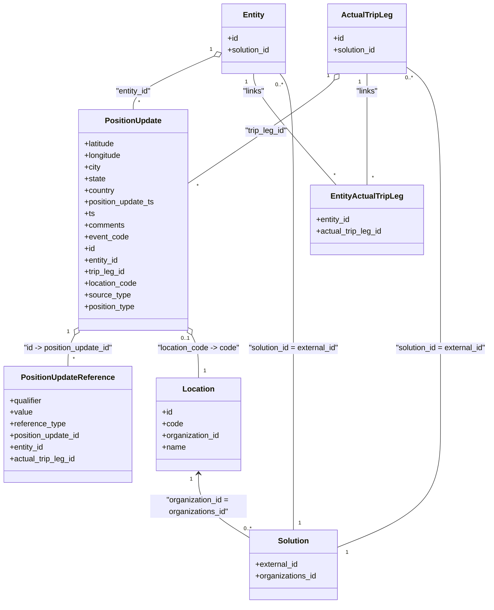

# Diagram: entity_core/entity_service/entity_service/db/position.py


> Auto-generated by Obscura crawlers

## Diagram 1

```mermaid
flowchart LR
    GPFE[get_position_update_for_entity]
    GAEP[get_entity_associated_position]
    GTLAP[get_trip_leg_associated_position]
    GAPFEALL[get_all_position_updates_for_entity]
    GAPAGE[get_all_position_updates_for_entity_page]
    GPS[get_position_simple]
    GPSB[get_position_simple_batch]
    ADDPU[add_postion_update]
    ADDR[add_position_update_references]
    RESP[resp_converter]
    DB_PU[position_update]
    DB_PUR[position_update_reference]
    DB_ENTITY[entity]
    DB_ATL[actual_trip_leg]
    DB_EATL[entity_actual_trip_leg]
    DB_LOC[location]
    DB_SOL[solution]

    GPFE -->|calls| GAEP
    GPFE -->|if not found| GTLAP
    GAEP -->|queries| DB_PU
    GTLAP -->|queries| DB_PU
    GAPFEALL -->|UNION of entity/trip leg queries| DB_PU
    GAPAGE -->|entity_type == "entity"| GAEP
    GAPAGE -->|entity_type == "tripleg"| GTLAP
    GAPAGE -->|else| GAPFEALL

    GPS -->|builds helper union joining| DB_ENTITY
    GPS -->|builds helper union joining| DB_ATL
    GPS -->|joins location/solution| DB_LOC
    GPS -->|joins solution| DB_SOL
    GPS -->|returns obj| RESP

    GPSB -->|selects many| DB_PU
    GPSB -->|joins entity/atl/location/solution| DB_LOC
    GPSB -->|returns batch| RESP

    ADDPU -->|INSERT into| DB_PU
    ADDPU -->|then calls| ADDR
    ADDR -->|INSERT into| DB_PUR

    DB_PU -->|row fed to| RESP
    GAPFEALL -->|rows fed to| RESP
    GAEP -->|rows fed to| RESP
    GTLAP -->|rows fed to| RESP
    GPSB -->|rows fed to| RESP
```

> SVG rendering failed for this diagram.

## Diagram 2



### SVG

<svg id="container" width="1025.71875" xmlns="http://www.w3.org/2000/svg" class="classDiagram" height="1246" viewBox="0 0 1025.71875 1246" role="graphics-document document" aria-roledescription="class"><style>#container{font-family:"trebuchet ms",verdana,arial,sans-serif;font-size:16px;fill:#333;}@keyframes edge-animation-frame{from{stroke-dashoffset:0;}}@keyframes dash{to{stroke-dashoffset:0;}}#container .edge-animation-slow{stroke-dasharray:9,5!important;stroke-dashoffset:900;animation:dash 50s linear infinite;stroke-linecap:round;}#container .edge-animation-fast{stroke-dasharray:9,5!important;stroke-dashoffset:900;animation:dash 20s linear infinite;stroke-linecap:round;}#container .error-icon{fill:#552222;}#container .error-text{fill:#552222;stroke:#552222;}#container .edge-thickness-normal{stroke-width:1px;}#container .edge-thickness-thick{stroke-width:3.5px;}#container .edge-pattern-solid{stroke-dasharray:0;}#container .edge-thickness-invisible{stroke-width:0;fill:none;}#container .edge-pattern-dashed{stroke-dasharray:3;}#container .edge-pattern-dotted{stroke-dasharray:2;}#container .marker{fill:#333333;stroke:#333333;}#container .marker.cross{stroke:#333333;}#container svg{font-family:"trebuchet ms",verdana,arial,sans-serif;font-size:16px;}#container p{margin:0;}#container g.classGroup text{fill:#9370DB;stroke:none;font-family:"trebuchet ms",verdana,arial,sans-serif;font-size:10px;}#container g.classGroup text .title{font-weight:bolder;}#container .nodeLabel,#container .edgeLabel{color:#131300;}#container .edgeLabel .label rect{fill:#ECECFF;}#container .label text{fill:#131300;}#container .labelBkg{background:#ECECFF;}#container .edgeLabel .label span{background:#ECECFF;}#container .classTitle{font-weight:bolder;}#container .node rect,#container .node circle,#container .node ellipse,#container .node polygon,#container .node path{fill:#ECECFF;stroke:#9370DB;stroke-width:1px;}#container .divider{stroke:#9370DB;stroke-width:1;}#container g.clickable{cursor:pointer;}#container g.classGroup rect{fill:#ECECFF;stroke:#9370DB;}#container g.classGroup line{stroke:#9370DB;stroke-width:1;}#container .classLabel .box{stroke:none;stroke-width:0;fill:#ECECFF;opacity:0.5;}#container .classLabel .label{fill:#9370DB;font-size:10px;}#container .relation{stroke:#333333;stroke-width:1;fill:none;}#container .dashed-line{stroke-dasharray:3;}#container .dotted-line{stroke-dasharray:1 2;}#container #compositionStart,#container .composition{fill:#333333!important;stroke:#333333!important;stroke-width:1;}#container #compositionEnd,#container .composition{fill:#333333!important;stroke:#333333!important;stroke-width:1;}#container #dependencyStart,#container .dependency{fill:#333333!important;stroke:#333333!important;stroke-width:1;}#container #dependencyStart,#container .dependency{fill:#333333!important;stroke:#333333!important;stroke-width:1;}#container #extensionStart,#container .extension{fill:transparent!important;stroke:#333333!important;stroke-width:1;}#container #extensionEnd,#container .extension{fill:transparent!important;stroke:#333333!important;stroke-width:1;}#container #aggregationStart,#container .aggregation{fill:transparent!important;stroke:#333333!important;stroke-width:1;}#container #aggregationEnd,#container .aggregation{fill:transparent!important;stroke:#333333!important;stroke-width:1;}#container #lollipopStart,#container .lollipop{fill:#ECECFF!important;stroke:#333333!important;stroke-width:1;}#container #lollipopEnd,#container .lollipop{fill:#ECECFF!important;stroke:#333333!important;stroke-width:1;}#container .edgeTerminals{font-size:11px;line-height:initial;}#container .classTitleText{text-anchor:middle;font-size:18px;fill:#333;}#container .label-icon{display:inline-block;height:1em;overflow:visible;vertical-align:-0.125em;}#container .node .label-icon path{fill:currentColor;stroke:revert;stroke-width:revert;}#container :root{--mermaid-font-family:"trebuchet ms",verdana,arial,sans-serif;}</style><g><defs><marker id="container_class-aggregationStart" class="marker aggregation class" refX="18" refY="7" markerWidth="190" markerHeight="240" orient="auto"><path d="M 18,7 L9,13 L1,7 L9,1 Z"></path></marker></defs><defs><marker id="container_class-aggregationEnd" class="marker aggregation class" refX="1" refY="7" markerWidth="20" markerHeight="28" orient="auto"><path d="M 18,7 L9,13 L1,7 L9,1 Z"></path></marker></defs><defs><marker id="container_class-extensionStart" class="marker extension class" refX="18" refY="7" markerWidth="190" markerHeight="240" orient="auto"><path d="M 1,7 L18,13 V 1 Z"></path></marker></defs><defs><marker id="container_class-extensionEnd" class="marker extension class" refX="1" refY="7" markerWidth="20" markerHeight="28" orient="auto"><path d="M 1,1 V 13 L18,7 Z"></path></marker></defs><defs><marker id="container_class-compositionStart" class="marker composition class" refX="18" refY="7" markerWidth="190" markerHeight="240" orient="auto"><path d="M 18,7 L9,13 L1,7 L9,1 Z"></path></marker></defs><defs><marker id="container_class-compositionEnd" class="marker composition class" refX="1" refY="7" markerWidth="20" markerHeight="28" orient="auto"><path d="M 18,7 L9,13 L1,7 L9,1 Z"></path></marker></defs><defs><marker id="container_class-dependencyStart" class="marker dependency class" refX="6" refY="7" markerWidth="190" markerHeight="240" orient="auto"><path d="M 5,7 L9,13 L1,7 L9,1 Z"></path></marker></defs><defs><marker id="container_class-dependencyEnd" class="marker dependency class" refX="13" refY="7" markerWidth="20" markerHeight="28" orient="auto"><path d="M 18,7 L9,13 L14,7 L9,1 Z"></path></marker></defs><defs><marker id="container_class-lollipopStart" class="marker lollipop class" refX="13" refY="7" markerWidth="190" markerHeight="240" orient="auto"><circle stroke="black" fill="transparent" cx="7" cy="7" r="6"></circle></marker></defs><defs><marker id="container_class-lollipopEnd" class="marker lollipop class" refX="1" refY="7" markerWidth="190" markerHeight="240" orient="auto"><circle stroke="black" fill="transparent" cx="7" cy="7" r="6"></circle></marker></defs><g class="root"><g class="clusters"></g><g class="edgePaths"><path d="M448.125,115.739L419.559,127.949C390.993,140.159,333.862,164.58,305.296,182.957C276.73,201.333,276.73,213.667,276.73,219.833L276.73,226" id="id_Entity_PositionUpdate_1" class="edge-thickness-normal edge-pattern-solid relation" style=";;;" data-edge="true" data-et="edge" data-id="id_Entity_PositionUpdate_1" data-points="W3sieCI6NDYzLjk4NjMyODEyNSwieSI6MTA4Ljk1OTEzODUwMDE4NzY1fSx7IngiOjI3Ni43MzA0Njg3NSwieSI6MTg5fSx7IngiOjI3Ni43MzA0Njg3NSwieSI6MjI2fV0=" marker-start="url(#container_class-aggregationStart)"></path><path d="M699.848,165.375L696.641,169.312C693.434,173.25,687.02,181.125,635.552,216.728C584.085,252.332,487.564,315.663,439.303,347.329L391.043,378.995" id="id_ActualTripLeg_PositionUpdate_2" class="edge-thickness-normal edge-pattern-solid relation" style=";;;" data-edge="true" data-et="edge" data-id="id_ActualTripLeg_PositionUpdate_2" data-points="W3sieCI6NzEwLjc0MjIyMzMzNzE1NiwieSI6MTUyfSx7IngiOjY4MC42MDU0Njg3NSwieSI6MTg5fSx7IngiOjM5MS4wNDI5Njg3NSwieSI6Mzc4Ljk5NDU4MzcyMDIxMDQ3fV0=" marker-start="url(#container_class-aggregationStart)"></path><path d="M154.56,692.765L152.323,697.138C150.086,701.51,145.611,710.255,143.374,720.794C141.137,731.333,141.137,743.667,141.137,749.833L141.137,756" id="id_PositionUpdate_PositionUpdateReference_3" class="edge-thickness-normal edge-pattern-solid relation" style=";;;" data-edge="true" data-et="edge" data-id="id_PositionUpdate_PositionUpdateReference_3" data-points="W3sieCI6MTYyLjQxNzk2ODc1LCJ5Ijo2NzcuNDA4NjE5NDk3NTh9LHsieCI6MTQxLjEzNjcxODc1LCJ5Ijo3MTl9LHsieCI6MTQxLjEzNjcxODc1LCJ5Ijo3NTZ9XQ==" marker-start="url(#container_class-aggregationStart)"></path><path d="M769.387,152L769.387,158.167C769.387,164.333,769.387,176.667,769.387,215C769.387,253.333,769.387,317.667,769.387,349.833L769.387,382" id="id_ActualTripLeg_EntityActualTripLeg_4" class="edge-thickness-normal edge-pattern-solid relation" style=";;;" data-edge="true" data-et="edge" data-id="id_ActualTripLeg_EntityActualTripLeg_4" data-points="W3sieCI6NzY5LjM4NjcxODc1LCJ5IjoxNTJ9LHsieCI6NzY5LjM4NjcxODc1LCJ5IjoxODl9LHsieCI6NzY5LjM4NjcxODc1LCJ5IjozODJ9XQ=="></path><path d="M531.736,152L531.736,158.167C531.736,164.333,531.736,176.667,560.583,215C589.43,253.333,647.124,317.667,675.971,349.833L704.818,382" id="id_Entity_EntityActualTripLeg_5" class="edge-thickness-normal edge-pattern-solid relation" style=";;;" data-edge="true" data-et="edge" data-id="id_Entity_EntityActualTripLeg_5" data-points="W3sieCI6NTMxLjczNjMyODEyNSwieSI6MTUyfSx7IngiOjUzMS43MzYzMjgxMjUsInkiOjE4OX0seyJ4Ijo3MDQuODE3NTU2MDE0MTUwOSwieSI6MzgyfV0="></path><path d="M398.9,692.765L401.138,697.138C403.375,701.51,407.85,710.255,410.087,724.794C412.324,739.333,412.324,759.667,412.324,769.833L412.324,780" id="id_PositionUpdate_Location_6" class="edge-thickness-normal edge-pattern-solid relation" style=";;;" data-edge="true" data-et="edge" data-id="id_PositionUpdate_Location_6" data-points="W3sieCI6MzkxLjA0Mjk2ODc1LCJ5Ijo2NzcuNDA4NjE5NDk3NTh9LHsieCI6NDEyLjMyNDIxODc1LCJ5Ijo3MTl9LHsieCI6NDEyLjMyNDIxODc1LCJ5Ijo3ODB9XQ==" marker-start="url(#container_class-aggregationStart)"></path><path d="M412.324,978L412.324,989.167C412.324,1000.333,412.324,1022.667,430.906,1044.917C449.487,1067.167,486.65,1089.335,505.231,1100.419L523.813,1111.502" id="id_Location_Solution_7" class="edge-thickness-normal edge-pattern-solid relation" style=";;;" data-edge="true" data-et="edge" data-id="id_Location_Solution_7" data-points="W3sieCI6NDEyLjMyNDIxODc1LCJ5Ijo5NzJ9LHsieCI6NDEyLjMyNDIxODc1LCJ5IjoxMDQ1fSx7IngiOjUyMy44MTI1LCJ5IjoxMTExLjUwMjIzMzc3NjIzNzN9XQ==" marker-start="url(#container_class-dependencyStart)"></path><path d="M586.852,152L591.573,158.167C596.293,164.333,605.735,176.667,610.455,227C615.176,277.333,615.176,365.667,615.176,454C615.176,542.333,615.176,630.667,615.176,701C615.176,771.333,615.176,823.667,615.176,878C615.176,932.333,615.176,988.667,615.176,1025C615.176,1061.333,615.176,1077.667,615.176,1085.833L615.176,1094" id="id_Entity_Solution_8" class="edge-thickness-normal edge-pattern-solid relation" style=";;;" data-edge="true" data-et="edge" data-id="id_Entity_Solution_8" data-points="W3sieCI6NTg2Ljg1MjI5NzE2MTY5NzMsInkiOjE1Mn0seyJ4Ijo2MTUuMTc1NzgxMjUsInkiOjE4OX0seyJ4Ijo2MTUuMTc1NzgxMjUsInkiOjQ1NH0seyJ4Ijo2MTUuMTc1NzgxMjUsInkiOjcxOX0seyJ4Ijo2MTUuMTc1NzgxMjUsInkiOjg3Nn0seyJ4Ijo2MTUuMTc1NzgxMjUsInkiOjEwNDV9LHsieCI6NjE1LjE3NTc4MTI1LCJ5IjoxMDk0fV0="></path><path d="M851.469,138.945L863.086,147.287C874.703,155.63,897.938,172.315,909.555,224.824C921.172,277.333,921.172,365.667,921.172,454C921.172,542.333,921.172,630.667,921.172,701C921.172,771.333,921.172,823.667,921.172,878C921.172,932.333,921.172,988.667,885.4,1030.979C849.628,1073.291,778.083,1101.581,742.311,1115.727L706.539,1129.872" id="id_ActualTripLeg_Solution_9" class="edge-thickness-normal edge-pattern-solid relation" style=";;;" data-edge="true" data-et="edge" data-id="id_ActualTripLeg_Solution_9" data-points="W3sieCI6ODUxLjQ2ODc1LCJ5IjoxMzguOTQ0NzcxODU1Nzc4ODd9LHsieCI6OTIxLjE3MTg3NSwieSI6MTg5fSx7IngiOjkyMS4xNzE4NzUsInkiOjQ1NH0seyJ4Ijo5MjEuMTcxODc1LCJ5Ijo3MTl9LHsieCI6OTIxLjE3MTg3NSwieSI6ODc2fSx7IngiOjkyMS4xNzE4NzUsInkiOjEwNDV9LHsieCI6NzA2LjUzOTA2MjUsInkiOjExMjkuODcyMjI4MjUwNDYyN31d"></path></g><g class="edgeLabels"><g class="edgeLabel" transform="translate(276.73046875, 189)"><g class="label" data-id="id_Entity_PositionUpdate_1" transform="translate(-38.2421875, -12)"><foreignObject width="76.484375" height="24"><div xmlns="http://www.w3.org/1999/xhtml" class="labelBkg" style="display: table-cell; white-space: nowrap; line-height: 1.5; max-width: 200px; text-align: center;"><span class="edgeLabel"><p>"entity_id"</p></span></div></foreignObject></g></g><g class="edgeLabel" transform="translate(555.77341, 270.90776)"><g class="label" data-id="id_ActualTripLeg_PositionUpdate_2" transform="translate(-45.4296875, -12)"><foreignObject width="90.859375" height="24"><div xmlns="http://www.w3.org/1999/xhtml" class="labelBkg" style="display: table-cell; white-space: nowrap; line-height: 1.5; max-width: 200px; text-align: center;"><span class="edgeLabel"><p>"trip_leg_id"</p></span></div></foreignObject></g></g><g class="edgeLabel" transform="translate(141.13671875, 719)"><g class="label" data-id="id_PositionUpdate_PositionUpdateReference_3" transform="translate(-95.5234375, -12)"><foreignObject width="191.046875" height="24"><div xmlns="http://www.w3.org/1999/xhtml" class="labelBkg" style="display: table-cell; white-space: nowrap; line-height: 1.5; max-width: 200px; text-align: center;"><span class="edgeLabel"><p>"id -&gt; position_update_id"</p></span></div></foreignObject></g></g><g class="edgeLabel" transform="translate(769.38671875, 189)"><g class="label" data-id="id_ActualTripLeg_EntityActualTripLeg_4" transform="translate(-23.3515625, -12)"><foreignObject width="46.703125" height="24"><div xmlns="http://www.w3.org/1999/xhtml" class="labelBkg" style="display: table-cell; white-space: nowrap; line-height: 1.5; max-width: 200px; text-align: center;"><span class="edgeLabel"><p>"links"</p></span></div></foreignObject></g></g><g class="edgeLabel" transform="translate(531.736328125, 189)"><g class="label" data-id="id_Entity_EntityActualTripLeg_5" transform="translate(-23.3515625, -12)"><foreignObject width="46.703125" height="24"><div xmlns="http://www.w3.org/1999/xhtml" class="labelBkg" style="display: table-cell; white-space: nowrap; line-height: 1.5; max-width: 200px; text-align: center;"><span class="edgeLabel"><p>"links"</p></span></div></foreignObject></g></g><g class="edgeLabel" transform="translate(412.32421875, 719)"><g class="label" data-id="id_PositionUpdate_Location_6" transform="translate(-86.3046875, -12)"><foreignObject width="172.609375" height="24"><div xmlns="http://www.w3.org/1999/xhtml" class="labelBkg" style="display: table-cell; white-space: nowrap; line-height: 1.5; max-width: 200px; text-align: center;"><span class="edgeLabel"><p>"location_code -&gt; code"</p></span></div></foreignObject></g></g><g class="edgeLabel" transform="translate(412.32421875, 1045)"><g class="label" data-id="id_Location_Solution_7" transform="translate(-100, -24)"><foreignObject width="200" height="48"><div xmlns="http://www.w3.org/1999/xhtml" class="labelBkg" style="display: table; white-space: break-spaces; line-height: 1.5; max-width: 200px; text-align: center; width: 200px;"><span class="edgeLabel"><p>"organization_id = organizations_id"</p></span></div></foreignObject></g></g><g class="edgeLabel" transform="translate(615.17578125, 719)"><g class="label" data-id="id_Entity_Solution_8" transform="translate(-96.546875, -12)"><foreignObject width="193.09375" height="24"><div xmlns="http://www.w3.org/1999/xhtml" class="labelBkg" style="display: table-cell; white-space: nowrap; line-height: 1.5; max-width: 200px; text-align: center;"><span class="edgeLabel"><p>"solution_id = external_id"</p></span></div></foreignObject></g></g><g class="edgeLabel" transform="translate(921.171875, 719)"><g class="label" data-id="id_ActualTripLeg_Solution_9" transform="translate(-96.546875, -12)"><foreignObject width="193.09375" height="24"><div xmlns="http://www.w3.org/1999/xhtml" class="labelBkg" style="display: table-cell; white-space: nowrap; line-height: 1.5; max-width: 200px; text-align: center;"><span class="edgeLabel"><p>"solution_id = external_id"</p></span></div></foreignObject></g></g><g class="edgeTerminals" transform="translate(441.9990959286241, 102.04454638180935)"><g class="inner" transform="translate(0, 0)"><foreignObject style="width: 9px; height: 12px;"><div xmlns="http://www.w3.org/1999/xhtml" style="display: inline-block; padding-right: 1px; white-space: nowrap;"><span class="edgeLabel">1</span></div></foreignObject></g></g><g class="edgeTerminals" transform="translate(688.0601782007801, 156.09571838920795)"><g class="inner" transform="translate(0, 0)"><foreignObject style="width: 9px; height: 12px;"><div xmlns="http://www.w3.org/1999/xhtml" style="display: inline-block; padding-right: 1px; white-space: nowrap;"><span class="edgeLabel">1</span></div></foreignObject></g></g><g class="edgeTerminals" transform="translate(141.09309479003605, 686.1550384808638)"><g class="inner" transform="translate(0, 0)"><foreignObject style="width: 9px; height: 12px;"><div xmlns="http://www.w3.org/1999/xhtml" style="display: inline-block; padding-right: 1px; white-space: nowrap;"><span class="edgeLabel">1</span></div></foreignObject></g></g><g class="edgeTerminals" transform="translate(754.386719375, 169.50000053571426)"><g class="inner" transform="translate(0, 0)"><foreignObject style="width: 9px; height: 12px;"><div xmlns="http://www.w3.org/1999/xhtml" style="display: inline-block; padding-right: 1px; white-space: nowrap;"><span class="edgeLabel">1</span></div></foreignObject></g></g><g class="edgeTerminals" transform="translate(516.7363290625, 169.5000008035714)"><g class="inner" transform="translate(0, 0)"><foreignObject style="width: 9px; height: 12px;"><div xmlns="http://www.w3.org/1999/xhtml" style="display: inline-block; padding-right: 1px; white-space: nowrap;"><span class="edgeLabel">1</span></div></foreignObject></g></g><g class="edgeTerminals" transform="translate(385.6608984866173, 699.820298469357)"><g class="inner" transform="translate(0, 0)"><foreignObject style="width: 36px; height: 12px;"><div xmlns="http://www.w3.org/1999/xhtml" style="display: inline-block; padding-right: 1px; white-space: nowrap;"><span class="edgeLabel">0..1</span></div></foreignObject></g></g><g class="edgeTerminals" transform="translate(397.324219375, 989.5000005357143)"><g class="inner" transform="translate(0, 0)"><foreignObject style="width: 9px; height: 12px;"><div xmlns="http://www.w3.org/1999/xhtml" style="display: inline-block; padding-right: 1px; white-space: nowrap;"><span class="edgeLabel">1</span></div></foreignObject></g></g><g class="edgeTerminals" transform="translate(585.5788293168187, 175.01365582053108)"><g class="inner" transform="translate(0, 0)"><foreignObject style="width: 36px; height: 12px;"><div xmlns="http://www.w3.org/1999/xhtml" style="display: inline-block; padding-right: 1px; white-space: nowrap;"><span class="edgeLabel">0..*</span></div></foreignObject></g></g><g class="edgeTerminals" transform="translate(856.933778328878, 161.33636609813402)"><g class="inner" transform="translate(0, 0)"><foreignObject style="width: 36px; height: 12px;"><div xmlns="http://www.w3.org/1999/xhtml" style="display: inline-block; padding-right: 1px; white-space: nowrap;"><span class="edgeLabel">0..*</span></div></foreignObject></g></g><g class="edgeTerminals" transform="translate(286.730469375, 203.5000005357143)"><g class="inner" transform="translate(0, 0)"></g><foreignObject style="width: 9px; height: 12px;"><div xmlns="http://www.w3.org/1999/xhtml" style="display: inline-block; padding-right: 1px; white-space: nowrap;"><span class="edgeLabel">*</span></div></foreignObject></g><g class="edgeTerminals" transform="translate(408.9034353952511, 376.9355111808613)"><g class="inner" transform="translate(0, 0)"></g><foreignObject style="width: 9px; height: 12px;"><div xmlns="http://www.w3.org/1999/xhtml" style="display: inline-block; padding-right: 1px; white-space: nowrap;"><span class="edgeLabel">*</span></div></foreignObject></g><g class="edgeTerminals" transform="translate(151.13671937499998, 733.5000005357143)"><g class="inner" transform="translate(0, 0)"></g><foreignObject style="width: 9px; height: 12px;"><div xmlns="http://www.w3.org/1999/xhtml" style="display: inline-block; padding-right: 1px; white-space: nowrap;"><span class="edgeLabel">*</span></div></foreignObject></g><g class="edgeTerminals" transform="translate(779.386719375, 359.50000053571426)"><g class="inner" transform="translate(0, 0)"></g><foreignObject style="width: 9px; height: 12px;"><div xmlns="http://www.w3.org/1999/xhtml" style="display: inline-block; padding-right: 1px; white-space: nowrap;"><span class="edgeLabel">*</span></div></foreignObject></g><g class="edgeTerminals" transform="translate(699.3009641138939, 353.9569292133428)"><g class="inner" transform="translate(0, 0)"></g><foreignObject style="width: 9px; height: 12px;"><div xmlns="http://www.w3.org/1999/xhtml" style="display: inline-block; padding-right: 1px; white-space: nowrap;"><span class="edgeLabel">*</span></div></foreignObject></g><g class="edgeTerminals" transform="translate(422.324219375, 757.5000005357143)"><g class="inner" transform="translate(0, 0)"></g><foreignObject style="width: 9px; height: 12px;"><div xmlns="http://www.w3.org/1999/xhtml" style="display: inline-block; padding-right: 1px; white-space: nowrap;"><span class="edgeLabel">1</span></div></foreignObject></g><g class="edgeTerminals" transform="translate(511.467398921262, 1084.6550478173267)"><g class="inner" transform="translate(0, 0)"></g><foreignObject style="width: 36px; height: 12px;"><div xmlns="http://www.w3.org/1999/xhtml" style="display: inline-block; padding-right: 1px; white-space: nowrap;"><span class="edgeLabel">0..*</span></div></foreignObject></g><g class="edgeTerminals" transform="translate(625.175780625, 1071.4999994642858)"><g class="inner" transform="translate(0, 0)"></g><foreignObject style="width: 9px; height: 12px;"><div xmlns="http://www.w3.org/1999/xhtml" style="display: inline-block; padding-right: 1px; white-space: nowrap;"><span class="edgeLabel">1</span></div></foreignObject></g><g class="edgeTerminals" transform="translate(723.3287851127473, 1132.3860842168374)"><g class="inner" transform="translate(0, 0)"></g><foreignObject style="width: 9px; height: 12px;"><div xmlns="http://www.w3.org/1999/xhtml" style="display: inline-block; padding-right: 1px; white-space: nowrap;"><span class="edgeLabel">1</span></div></foreignObject></g></g><g class="nodes"><g class="node default" id="classId-PositionUpdate-0" transform="translate(276.73046875, 454)"><g class="basic label-container"><path d="M-114.3125 -228 L114.3125 -228 L114.3125 228 L-114.3125 228" stroke="none" stroke-width="0" fill="#ECECFF" style=""></path><path d="M-114.3125 -228 C-64.79787281548624 -228, -15.283245630972473 -228, 114.3125 -228 M-114.3125 -228 C-23.626807536360246 -228, 67.05888492727951 -228, 114.3125 -228 M114.3125 -228 C114.3125 -131.19526564190113, 114.3125 -34.39053128380229, 114.3125 228 M114.3125 -228 C114.3125 -93.66213333691778, 114.3125 40.67573332616445, 114.3125 228 M114.3125 228 C33.51022574618588 228, -47.29204850762824 228, -114.3125 228 M114.3125 228 C23.605746975223866 228, -67.10100604955227 228, -114.3125 228 M-114.3125 228 C-114.3125 59.90526172290498, -114.3125 -108.18947655419004, -114.3125 -228 M-114.3125 228 C-114.3125 103.24409462514642, -114.3125 -21.511810749707166, -114.3125 -228" stroke="#9370DB" stroke-width="1.3" fill="none" stroke-dasharray="0 0" style=""></path></g><g class="annotation-group text" transform="translate(0, -204)"></g><g class="label-group text" transform="translate(-56.515625, -204)"><g class="label" style="font-weight: bolder" transform="translate(0,-12)"><foreignObject width="113.03125" height="24"><div xmlns="http://www.w3.org/1999/xhtml" style="display: table-cell; white-space: nowrap; line-height: 1.5; max-width: 162px; text-align: center;"><span class="nodeLabel markdown-node-label" style=""><p>PositionUpdate</p></span></div></foreignObject></g></g><g class="members-group text" transform="translate(-102.3125, -156)"><g class="label" style="" transform="translate(0,-12)"><foreignObject width="64.96875" height="24"><div xmlns="http://www.w3.org/1999/xhtml" style="display: table-cell; white-space: nowrap; line-height: 1.5; max-width: 122px; text-align: center;"><span class="nodeLabel markdown-node-label" style=""><p>+latitude</p></span></div></foreignObject></g><g class="label" style="" transform="translate(0,12)"><foreignObject width="77.53125" height="24"><div xmlns="http://www.w3.org/1999/xhtml" style="display: table-cell; white-space: nowrap; line-height: 1.5; max-width: 135px; text-align: center;"><span class="nodeLabel markdown-node-label" style=""><p>+longitude</p></span></div></foreignObject></g><g class="label" style="" transform="translate(0,36)"><foreignObject width="33.71875" height="24"><div xmlns="http://www.w3.org/1999/xhtml" style="display: table-cell; white-space: nowrap; line-height: 1.5; max-width: 91px; text-align: center;"><span class="nodeLabel markdown-node-label" style=""><p>+city</p></span></div></foreignObject></g><g class="label" style="" transform="translate(0,60)"><foreignObject width="44.09375" height="24"><div xmlns="http://www.w3.org/1999/xhtml" style="display: table-cell; white-space: nowrap; line-height: 1.5; max-width: 101px; text-align: center;"><span class="nodeLabel markdown-node-label" style=""><p>+state</p></span></div></foreignObject></g><g class="label" style="" transform="translate(0,84)"><foreignObject width="63.171875" height="24"><div xmlns="http://www.w3.org/1999/xhtml" style="display: table-cell; white-space: nowrap; line-height: 1.5; max-width: 121px; text-align: center;"><span class="nodeLabel markdown-node-label" style=""><p>+country</p></span></div></foreignObject></g><g class="label" style="" transform="translate(0,108)"><foreignObject width="148.109375" height="24"><div xmlns="http://www.w3.org/1999/xhtml" style="display: table-cell; white-space: nowrap; line-height: 1.5; max-width: 205px; text-align: center;"><span class="nodeLabel markdown-node-label" style=""><p>+position_update_ts</p></span></div></foreignObject></g><g class="label" style="" transform="translate(0,132)"><foreignObject width="21.15625" height="24"><div xmlns="http://www.w3.org/1999/xhtml" style="display: table-cell; white-space: nowrap; line-height: 1.5; max-width: 79px; text-align: center;"><span class="nodeLabel markdown-node-label" style=""><p>+ts</p></span></div></foreignObject></g><g class="label" style="" transform="translate(0,156)"><foreignObject width="83.4375" height="24"><div xmlns="http://www.w3.org/1999/xhtml" style="display: table-cell; white-space: nowrap; line-height: 1.5; max-width: 141px; text-align: center;"><span class="nodeLabel markdown-node-label" style=""><p>+comments</p></span></div></foreignObject></g><g class="label" style="" transform="translate(0,180)"><foreignObject width="91.28125" height="24"><div xmlns="http://www.w3.org/1999/xhtml" style="display: table-cell; white-space: nowrap; line-height: 1.5; max-width: 149px; text-align: center;"><span class="nodeLabel markdown-node-label" style=""><p>+event_code</p></span></div></foreignObject></g><g class="label" style="" transform="translate(0,204)"><foreignObject width="22.078125" height="24"><div xmlns="http://www.w3.org/1999/xhtml" style="display: table-cell; white-space: nowrap; line-height: 1.5; max-width: 79px; text-align: center;"><span class="nodeLabel markdown-node-label" style=""><p>+id</p></span></div></foreignObject></g><g class="label" style="" transform="translate(0,228)"><foreignObject width="71.859375" height="24"><div xmlns="http://www.w3.org/1999/xhtml" style="display: table-cell; white-space: nowrap; line-height: 1.5; max-width: 129px; text-align: center;"><span class="nodeLabel markdown-node-label" style=""><p>+entity_id</p></span></div></foreignObject></g><g class="label" style="" transform="translate(0,252)"><foreignObject width="85.828125" height="24"><div xmlns="http://www.w3.org/1999/xhtml" style="display: table-cell; white-space: nowrap; line-height: 1.5; max-width: 143px; text-align: center;"><span class="nodeLabel markdown-node-label" style=""><p>+trip_leg_id</p></span></div></foreignObject></g><g class="label" style="" transform="translate(0,276)"><foreignObject width="110.109375" height="24"><div xmlns="http://www.w3.org/1999/xhtml" style="display: table-cell; white-space: nowrap; line-height: 1.5; max-width: 167px; text-align: center;"><span class="nodeLabel markdown-node-label" style=""><p>+location_code</p></span></div></foreignObject></g><g class="label" style="" transform="translate(0,300)"><foreignObject width="95.34375" height="24"><div xmlns="http://www.w3.org/1999/xhtml" style="display: table-cell; white-space: nowrap; line-height: 1.5; max-width: 153px; text-align: center;"><span class="nodeLabel markdown-node-label" style=""><p>+source_type</p></span></div></foreignObject></g><g class="label" style="" transform="translate(0,324)"><foreignObject width="107.625" height="24"><div xmlns="http://www.w3.org/1999/xhtml" style="display: table-cell; white-space: nowrap; line-height: 1.5; max-width: 165px; text-align: center;"><span class="nodeLabel markdown-node-label" style=""><p>+position_type</p></span></div></foreignObject></g></g><g class="methods-group text" transform="translate(-102.3125, 228)"></g><g class="divider" style=""><path d="M-114.3125 -180 C-59.78512656798348 -180, -5.257753135966965 -180, 114.3125 -180 M-114.3125 -180 C-35.08433265371755 -180, 44.143834692564894 -180, 114.3125 -180" stroke="#9370DB" stroke-width="1.3" fill="none" stroke-dasharray="0 0" style=""></path></g><g class="divider" style=""><path d="M-114.3125 204 C-28.153239408030956 204, 58.00602118393809 204, 114.3125 204 M-114.3125 204 C-40.08423308463448 204, 34.14403383073105 204, 114.3125 204" stroke="#9370DB" stroke-width="1.3" fill="none" stroke-dasharray="0 0" style=""></path></g></g><g class="node default" id="classId-PositionUpdateReference-1" transform="translate(141.13671875, 876)"><g class="basic label-container"><path d="M-133.13671875 -120 L133.13671875 -120 L133.13671875 120 L-133.13671875 120" stroke="none" stroke-width="0" fill="#ECECFF" style=""></path><path d="M-133.13671875 -120 C-33.83145713105567 -120, 65.47380448788866 -120, 133.13671875 -120 M-133.13671875 -120 C-31.33034193881062 -120, 70.47603487237876 -120, 133.13671875 -120 M133.13671875 -120 C133.13671875 -68.66863951192563, 133.13671875 -17.337279023851266, 133.13671875 120 M133.13671875 -120 C133.13671875 -62.85821005384239, 133.13671875 -5.716420107684783, 133.13671875 120 M133.13671875 120 C78.89860387202879 120, 24.660488994057587 120, -133.13671875 120 M133.13671875 120 C30.397164029586577 120, -72.34239069082685 120, -133.13671875 120 M-133.13671875 120 C-133.13671875 28.273728535396614, -133.13671875 -63.45254292920677, -133.13671875 -120 M-133.13671875 120 C-133.13671875 45.11440284400618, -133.13671875 -29.771194311987642, -133.13671875 -120" stroke="#9370DB" stroke-width="1.3" fill="none" stroke-dasharray="0 0" style=""></path></g><g class="annotation-group text" transform="translate(0, -96)"></g><g class="label-group text" transform="translate(-93.0234375, -96)"><g class="label" style="font-weight: bolder" transform="translate(0,-12)"><foreignObject width="186.046875" height="24"><div xmlns="http://www.w3.org/1999/xhtml" style="display: table-cell; white-space: nowrap; line-height: 1.5; max-width: 234px; text-align: center;"><span class="nodeLabel markdown-node-label" style=""><p>PositionUpdateReference</p></span></div></foreignObject></g></g><g class="members-group text" transform="translate(-121.13671875, -48)"><g class="label" style="" transform="translate(0,-12)"><foreignObject width="68.71875" height="24"><div xmlns="http://www.w3.org/1999/xhtml" style="display: table-cell; white-space: nowrap; line-height: 1.5; max-width: 127px; text-align: center;"><span class="nodeLabel markdown-node-label" style=""><p>+qualifier</p></span></div></foreignObject></g><g class="label" style="" transform="translate(0,12)"><foreignObject width="46.71875" height="24"><div xmlns="http://www.w3.org/1999/xhtml" style="display: table-cell; white-space: nowrap; line-height: 1.5; max-width: 104px; text-align: center;"><span class="nodeLabel markdown-node-label" style=""><p>+value</p></span></div></foreignObject></g><g class="label" style="" transform="translate(0,36)"><foreignObject width="115.640625" height="24"><div xmlns="http://www.w3.org/1999/xhtml" style="display: table-cell; white-space: nowrap; line-height: 1.5; max-width: 173px; text-align: center;"><span class="nodeLabel markdown-node-label" style=""><p>+reference_type</p></span></div></foreignObject></g><g class="label" style="" transform="translate(0,60)"><foreignObject width="149.25" height="24"><div xmlns="http://www.w3.org/1999/xhtml" style="display: table-cell; white-space: nowrap; line-height: 1.5; max-width: 207px; text-align: center;"><span class="nodeLabel markdown-node-label" style=""><p>+position_update_id</p></span></div></foreignObject></g><g class="label" style="" transform="translate(0,84)"><foreignObject width="71.859375" height="24"><div xmlns="http://www.w3.org/1999/xhtml" style="display: table-cell; white-space: nowrap; line-height: 1.5; max-width: 129px; text-align: center;"><span class="nodeLabel markdown-node-label" style=""><p>+entity_id</p></span></div></foreignObject></g><g class="label" style="" transform="translate(0,108)"><foreignObject width="138.34375" height="24"><div xmlns="http://www.w3.org/1999/xhtml" style="display: table-cell; white-space: nowrap; line-height: 1.5; max-width: 196px; text-align: center;"><span class="nodeLabel markdown-node-label" style=""><p>+actual_trip_leg_id</p></span></div></foreignObject></g></g><g class="methods-group text" transform="translate(-121.13671875, 120)"></g><g class="divider" style=""><path d="M-133.13671875 -72 C-41.72398956496794 -72, 49.688739620064126 -72, 133.13671875 -72 M-133.13671875 -72 C-52.58445293509709 -72, 27.96781287980582 -72, 133.13671875 -72" stroke="#9370DB" stroke-width="1.3" fill="none" stroke-dasharray="0 0" style=""></path></g><g class="divider" style=""><path d="M-133.13671875 96 C-69.53391285887423 96, -5.931106967748448 96, 133.13671875 96 M-133.13671875 96 C-31.513684015160393 96, 70.10935071967921 96, 133.13671875 96" stroke="#9370DB" stroke-width="1.3" fill="none" stroke-dasharray="0 0" style=""></path></g></g><g class="node default" id="classId-Entity-2" transform="translate(531.736328125, 80)"><g class="basic label-container"><path d="M-67.75 -72 L67.75 -72 L67.75 72 L-67.75 72" stroke="none" stroke-width="0" fill="#ECECFF" style=""></path><path d="M-67.75 -72 C-30.421244441492213 -72, 6.907511117015574 -72, 67.75 -72 M-67.75 -72 C-20.091875910365374 -72, 27.56624817926925 -72, 67.75 -72 M67.75 -72 C67.75 -39.07311657655059, 67.75 -6.1462331531011785, 67.75 72 M67.75 -72 C67.75 -42.84185916855709, 67.75 -13.683718337114193, 67.75 72 M67.75 72 C16.814749763993326 72, -34.12050047201335 72, -67.75 72 M67.75 72 C23.388639538122575 72, -20.97272092375485 72, -67.75 72 M-67.75 72 C-67.75 14.795299118561282, -67.75 -42.40940176287744, -67.75 -72 M-67.75 72 C-67.75 39.95635960630114, -67.75 7.912719212602283, -67.75 -72" stroke="#9370DB" stroke-width="1.3" fill="none" stroke-dasharray="0 0" style=""></path></g><g class="annotation-group text" transform="translate(0, -48)"></g><g class="label-group text" transform="translate(-21.28125, -48)"><g class="label" style="font-weight: bolder" transform="translate(0,-12)"><foreignObject width="42.5625" height="24"><div xmlns="http://www.w3.org/1999/xhtml" style="display: table-cell; white-space: nowrap; line-height: 1.5; max-width: 92px; text-align: center;"><span class="nodeLabel markdown-node-label" style=""><p>Entity</p></span></div></foreignObject></g></g><g class="members-group text" transform="translate(-55.75, 0)"><g class="label" style="" transform="translate(0,-12)"><foreignObject width="22.078125" height="24"><div xmlns="http://www.w3.org/1999/xhtml" style="display: table-cell; white-space: nowrap; line-height: 1.5; max-width: 79px; text-align: center;"><span class="nodeLabel markdown-node-label" style=""><p>+id</p></span></div></foreignObject></g><g class="label" style="" transform="translate(0,12)"><foreignObject width="90.21875" height="24"><div xmlns="http://www.w3.org/1999/xhtml" style="display: table-cell; white-space: nowrap; line-height: 1.5; max-width: 148px; text-align: center;"><span class="nodeLabel markdown-node-label" style=""><p>+solution_id</p></span></div></foreignObject></g></g><g class="methods-group text" transform="translate(-55.75, 72)"></g><g class="divider" style=""><path d="M-67.75 -24 C-38.170744351080494 -24, -8.591488702160987 -24, 67.75 -24 M-67.75 -24 C-38.0173092102758 -24, -8.284618420551595 -24, 67.75 -24" stroke="#9370DB" stroke-width="1.3" fill="none" stroke-dasharray="0 0" style=""></path></g><g class="divider" style=""><path d="M-67.75 48 C-25.018714380245846 48, 17.712571239508307 48, 67.75 48 M-67.75 48 C-21.141361639187025 48, 25.46727672162595 48, 67.75 48" stroke="#9370DB" stroke-width="1.3" fill="none" stroke-dasharray="0 0" style=""></path></g></g><g class="node default" id="classId-ActualTripLeg-3" transform="translate(769.38671875, 80)"><g class="basic label-container"><path d="M-82.08203125 -72 L82.08203125 -72 L82.08203125 72 L-82.08203125 72" stroke="none" stroke-width="0" fill="#ECECFF" style=""></path><path d="M-82.08203125 -72 C-26.31327503579481 -72, 29.45548117841038 -72, 82.08203125 -72 M-82.08203125 -72 C-43.80274312918601 -72, -5.523455008372025 -72, 82.08203125 -72 M82.08203125 -72 C82.08203125 -29.54760834065423, 82.08203125 12.904783318691543, 82.08203125 72 M82.08203125 -72 C82.08203125 -37.244536770756135, 82.08203125 -2.489073541512269, 82.08203125 72 M82.08203125 72 C32.423394572459024 72, -17.23524210508195 72, -82.08203125 72 M82.08203125 72 C46.086731535239444 72, 10.091431820478888 72, -82.08203125 72 M-82.08203125 72 C-82.08203125 43.095018823243635, -82.08203125 14.190037646487262, -82.08203125 -72 M-82.08203125 72 C-82.08203125 26.56535446772181, -82.08203125 -18.86929106455638, -82.08203125 -72" stroke="#9370DB" stroke-width="1.3" fill="none" stroke-dasharray="0 0" style=""></path></g><g class="annotation-group text" transform="translate(0, -48)"></g><g class="label-group text" transform="translate(-49.9453125, -48)"><g class="label" style="font-weight: bolder" transform="translate(0,-12)"><foreignObject width="99.890625" height="24"><div xmlns="http://www.w3.org/1999/xhtml" style="display: table-cell; white-space: nowrap; line-height: 1.5; max-width: 148px; text-align: center;"><span class="nodeLabel markdown-node-label" style=""><p>ActualTripLeg</p></span></div></foreignObject></g></g><g class="members-group text" transform="translate(-70.08203125, 0)"><g class="label" style="" transform="translate(0,-12)"><foreignObject width="22.078125" height="24"><div xmlns="http://www.w3.org/1999/xhtml" style="display: table-cell; white-space: nowrap; line-height: 1.5; max-width: 79px; text-align: center;"><span class="nodeLabel markdown-node-label" style=""><p>+id</p></span></div></foreignObject></g><g class="label" style="" transform="translate(0,12)"><foreignObject width="90.21875" height="24"><div xmlns="http://www.w3.org/1999/xhtml" style="display: table-cell; white-space: nowrap; line-height: 1.5; max-width: 148px; text-align: center;"><span class="nodeLabel markdown-node-label" style=""><p>+solution_id</p></span></div></foreignObject></g></g><g class="methods-group text" transform="translate(-70.08203125, 72)"></g><g class="divider" style=""><path d="M-82.08203125 -24 C-46.46086680082173 -24, -10.839702351643453 -24, 82.08203125 -24 M-82.08203125 -24 C-33.6598068340094 -24, 14.762417581981197 -24, 82.08203125 -24" stroke="#9370DB" stroke-width="1.3" fill="none" stroke-dasharray="0 0" style=""></path></g><g class="divider" style=""><path d="M-82.08203125 48 C-45.281010992269906 48, -8.479990734539811 48, 82.08203125 48 M-82.08203125 48 C-37.31610801005719 48, 7.4498152298856155 48, 82.08203125 48" stroke="#9370DB" stroke-width="1.3" fill="none" stroke-dasharray="0 0" style=""></path></g></g><g class="node default" id="classId-EntityActualTripLeg-4" transform="translate(769.38671875, 454)"><g class="basic label-container"><path d="M-116.78515625 -72 L116.78515625 -72 L116.78515625 72 L-116.78515625 72" stroke="none" stroke-width="0" fill="#ECECFF" style=""></path><path d="M-116.78515625 -72 C-40.655847741029206 -72, 35.47346076794159 -72, 116.78515625 -72 M-116.78515625 -72 C-59.33151598215846 -72, -1.8778757143169145 -72, 116.78515625 -72 M116.78515625 -72 C116.78515625 -18.39481642130997, 116.78515625 35.21036715738006, 116.78515625 72 M116.78515625 -72 C116.78515625 -22.236966556537283, 116.78515625 27.526066886925435, 116.78515625 72 M116.78515625 72 C44.74584807719343 72, -27.293460095613142 72, -116.78515625 72 M116.78515625 72 C66.9366976343407 72, 17.088239018681392 72, -116.78515625 72 M-116.78515625 72 C-116.78515625 19.135284144520597, -116.78515625 -33.729431710958806, -116.78515625 -72 M-116.78515625 72 C-116.78515625 18.99652470666166, -116.78515625 -34.00695058667668, -116.78515625 -72" stroke="#9370DB" stroke-width="1.3" fill="none" stroke-dasharray="0 0" style=""></path></g><g class="annotation-group text" transform="translate(0, -48)"></g><g class="label-group text" transform="translate(-71.2265625, -48)"><g class="label" style="font-weight: bolder" transform="translate(0,-12)"><foreignObject width="142.453125" height="24"><div xmlns="http://www.w3.org/1999/xhtml" style="display: table-cell; white-space: nowrap; line-height: 1.5; max-width: 190px; text-align: center;"><span class="nodeLabel markdown-node-label" style=""><p>EntityActualTripLeg</p></span></div></foreignObject></g></g><g class="members-group text" transform="translate(-104.78515625, 0)"><g class="label" style="" transform="translate(0,-12)"><foreignObject width="71.859375" height="24"><div xmlns="http://www.w3.org/1999/xhtml" style="display: table-cell; white-space: nowrap; line-height: 1.5; max-width: 129px; text-align: center;"><span class="nodeLabel markdown-node-label" style=""><p>+entity_id</p></span></div></foreignObject></g><g class="label" style="" transform="translate(0,12)"><foreignObject width="138.34375" height="24"><div xmlns="http://www.w3.org/1999/xhtml" style="display: table-cell; white-space: nowrap; line-height: 1.5; max-width: 196px; text-align: center;"><span class="nodeLabel markdown-node-label" style=""><p>+actual_trip_leg_id</p></span></div></foreignObject></g></g><g class="methods-group text" transform="translate(-104.78515625, 72)"></g><g class="divider" style=""><path d="M-116.78515625 -24 C-38.93154209169427 -24, 38.92207206661146 -24, 116.78515625 -24 M-116.78515625 -24 C-58.53170394878301 -24, -0.27825164756602305 -24, 116.78515625 -24" stroke="#9370DB" stroke-width="1.3" fill="none" stroke-dasharray="0 0" style=""></path></g><g class="divider" style=""><path d="M-116.78515625 48 C-60.26274506134477 48, -3.740333872689547 48, 116.78515625 48 M-116.78515625 48 C-60.00538787276127 48, -3.225619495522537 48, 116.78515625 48" stroke="#9370DB" stroke-width="1.3" fill="none" stroke-dasharray="0 0" style=""></path></g></g><g class="node default" id="classId-Location-5" transform="translate(412.32421875, 876)"><g class="basic label-container"><path d="M-88.05078125 -96 L88.05078125 -96 L88.05078125 96 L-88.05078125 96" stroke="none" stroke-width="0" fill="#ECECFF" style=""></path><path d="M-88.05078125 -96 C-44.39327453987878 -96, -0.7357678297575632 -96, 88.05078125 -96 M-88.05078125 -96 C-50.92049922930034 -96, -13.79021720860068 -96, 88.05078125 -96 M88.05078125 -96 C88.05078125 -33.207889080544874, 88.05078125 29.584221838910253, 88.05078125 96 M88.05078125 -96 C88.05078125 -41.279053667664385, 88.05078125 13.44189266467123, 88.05078125 96 M88.05078125 96 C47.720787099106346 96, 7.390792948212692 96, -88.05078125 96 M88.05078125 96 C32.730023241671994 96, -22.590734766656013 96, -88.05078125 96 M-88.05078125 96 C-88.05078125 45.19357321931582, -88.05078125 -5.612853561368354, -88.05078125 -96 M-88.05078125 96 C-88.05078125 38.88379162990188, -88.05078125 -18.232416740196243, -88.05078125 -96" stroke="#9370DB" stroke-width="1.3" fill="none" stroke-dasharray="0 0" style=""></path></g><g class="annotation-group text" transform="translate(0, -72)"></g><g class="label-group text" transform="translate(-31.3515625, -72)"><g class="label" style="font-weight: bolder" transform="translate(0,-12)"><foreignObject width="62.703125" height="24"><div xmlns="http://www.w3.org/1999/xhtml" style="display: table-cell; white-space: nowrap; line-height: 1.5; max-width: 112px; text-align: center;"><span class="nodeLabel markdown-node-label" style=""><p>Location</p></span></div></foreignObject></g></g><g class="members-group text" transform="translate(-76.05078125, -24)"><g class="label" style="" transform="translate(0,-12)"><foreignObject width="22.078125" height="24"><div xmlns="http://www.w3.org/1999/xhtml" style="display: table-cell; white-space: nowrap; line-height: 1.5; max-width: 79px; text-align: center;"><span class="nodeLabel markdown-node-label" style=""><p>+id</p></span></div></foreignObject></g><g class="label" style="" transform="translate(0,12)"><foreignObject width="42.953125" height="24"><div xmlns="http://www.w3.org/1999/xhtml" style="display: table-cell; white-space: nowrap; line-height: 1.5; max-width: 100px; text-align: center;"><span class="nodeLabel markdown-node-label" style=""><p>+code</p></span></div></foreignObject></g><g class="label" style="" transform="translate(0,36)"><foreignObject width="120.75" height="24"><div xmlns="http://www.w3.org/1999/xhtml" style="display: table-cell; white-space: nowrap; line-height: 1.5; max-width: 178px; text-align: center;"><span class="nodeLabel markdown-node-label" style=""><p>+organization_id</p></span></div></foreignObject></g><g class="label" style="" transform="translate(0,60)"><foreignObject width="48.5" height="24"><div xmlns="http://www.w3.org/1999/xhtml" style="display: table-cell; white-space: nowrap; line-height: 1.5; max-width: 106px; text-align: center;"><span class="nodeLabel markdown-node-label" style=""><p>+name</p></span></div></foreignObject></g></g><g class="methods-group text" transform="translate(-76.05078125, 96)"></g><g class="divider" style=""><path d="M-88.05078125 -48 C-19.927309031362256 -48, 48.19616318727549 -48, 88.05078125 -48 M-88.05078125 -48 C-33.634459365223584 -48, 20.78186251955283 -48, 88.05078125 -48" stroke="#9370DB" stroke-width="1.3" fill="none" stroke-dasharray="0 0" style=""></path></g><g class="divider" style=""><path d="M-88.05078125 72 C-25.292990558168043 72, 37.464800133663914 72, 88.05078125 72 M-88.05078125 72 C-35.28577803285706 72, 17.47922518428588 72, 88.05078125 72" stroke="#9370DB" stroke-width="1.3" fill="none" stroke-dasharray="0 0" style=""></path></g></g><g class="node default" id="classId-Solution-6" transform="translate(615.17578125, 1166)"><g class="basic label-container"><path d="M-91.36328125 -72 L91.36328125 -72 L91.36328125 72 L-91.36328125 72" stroke="none" stroke-width="0" fill="#ECECFF" style=""></path><path d="M-91.36328125 -72 C-30.16694990750623 -72, 31.029381434987542 -72, 91.36328125 -72 M-91.36328125 -72 C-32.60605463421679 -72, 26.15117198156642 -72, 91.36328125 -72 M91.36328125 -72 C91.36328125 -40.05911877423783, 91.36328125 -8.118237548475669, 91.36328125 72 M91.36328125 -72 C91.36328125 -24.35537989757345, 91.36328125 23.2892402048531, 91.36328125 72 M91.36328125 72 C43.237503812397236 72, -4.888273625205528 72, -91.36328125 72 M91.36328125 72 C27.516749201060918 72, -36.329782847878164 72, -91.36328125 72 M-91.36328125 72 C-91.36328125 17.570758451346833, -91.36328125 -36.85848309730633, -91.36328125 -72 M-91.36328125 72 C-91.36328125 34.85827662329602, -91.36328125 -2.283446753407958, -91.36328125 -72" stroke="#9370DB" stroke-width="1.3" fill="none" stroke-dasharray="0 0" style=""></path></g><g class="annotation-group text" transform="translate(0, -48)"></g><g class="label-group text" transform="translate(-30.8359375, -48)"><g class="label" style="font-weight: bolder" transform="translate(0,-12)"><foreignObject width="61.671875" height="24"><div xmlns="http://www.w3.org/1999/xhtml" style="display: table-cell; white-space: nowrap; line-height: 1.5; max-width: 111px; text-align: center;"><span class="nodeLabel markdown-node-label" style=""><p>Solution</p></span></div></foreignObject></g></g><g class="members-group text" transform="translate(-79.36328125, 0)"><g class="label" style="" transform="translate(0,-12)"><foreignObject width="89.765625" height="24"><div xmlns="http://www.w3.org/1999/xhtml" style="display: table-cell; white-space: nowrap; line-height: 1.5; max-width: 147px; text-align: center;"><span class="nodeLabel markdown-node-label" style=""><p>+external_id</p></span></div></foreignObject></g><g class="label" style="" transform="translate(0,12)"><foreignObject width="127.890625" height="24"><div xmlns="http://www.w3.org/1999/xhtml" style="display: table-cell; white-space: nowrap; line-height: 1.5; max-width: 185px; text-align: center;"><span class="nodeLabel markdown-node-label" style=""><p>+organizations_id</p></span></div></foreignObject></g></g><g class="methods-group text" transform="translate(-79.36328125, 72)"></g><g class="divider" style=""><path d="M-91.36328125 -24 C-46.456878366374575 -24, -1.5504754827491496 -24, 91.36328125 -24 M-91.36328125 -24 C-43.341788107097166 -24, 4.679705035805668 -24, 91.36328125 -24" stroke="#9370DB" stroke-width="1.3" fill="none" stroke-dasharray="0 0" style=""></path></g><g class="divider" style=""><path d="M-91.36328125 48 C-51.50475437224032 48, -11.646227494480641 48, 91.36328125 48 M-91.36328125 48 C-42.63631063850651 48, 6.090659972986984 48, 91.36328125 48" stroke="#9370DB" stroke-width="1.3" fill="none" stroke-dasharray="0 0" style=""></path></g></g></g></g></g></svg>
