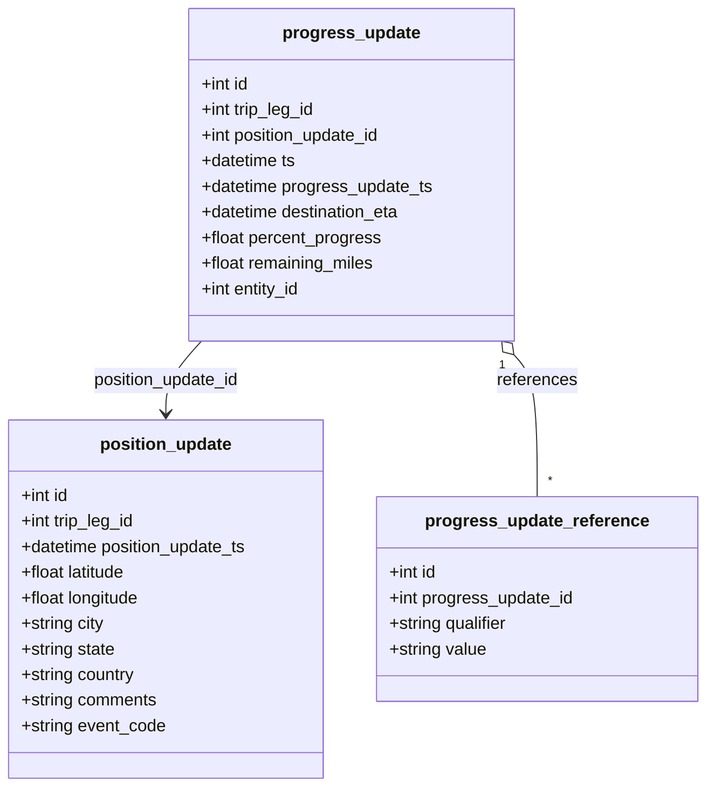

# Diagram: entity_core/entity_service/entity_service/db/progress.py

> Auto-generated by Obscura crawlers

## Diagram 1

```mermaid
flowchart TD
  baseSelect["base_select_stmt_lines()"]
  respConv["resp_converter(resp)"]
  posRespConv["position_resp_converter(resp)"]
  refRespConv["progress_update_ref_resp_converter(resp)"]
  getBasicTuples["get_basic_progress_tuples(trip_leg_id, cursor, entity_id=None)"]
  getBasicTuple["get_basic_progress_tuple(trip_leg_id, progress_id, cursor, entity_id=None)"]
  addPosToProgress["add_position_to_progress_response(progress, position_update_id, cursor)"]
  addRefToProgress["add_progress_update_reference_to_progress_response(progress, progress_update_id, cursor)"]
  getProgressUpdates["get_progress_updates(trip_leg_id, cursor)"]
  getProgressUpdatesByEntity["get_progress_updates_by_entity_id(entity_id, cursor)"]
  getProgressUpdate["get_progress_update(trip_leg_id, progress_id, cursor)"]
  getProgressUpdateByEntity["get_progress_update_by_entity_id(entity_id, progress_id, cursor)"]
  addProgressUpdate["add_progress_update(trip_leg_id, progress_payload, position_payload=None, cursor=None, entity_id=None)"]
  addPositionToProgressUpdate["add_postion_to_progress_update(trip_leg_id, position_payload, cursor)"]
  addProgressRefs["add_progress_references(cursor, progress_update_id, references)"]
  addProgressRefsSQL["add_progress_references_sql(progress_update_id, references)"]
  db_progress["progress_update table (INSERT/SELECT)"]
  db_position["position_update table (INSERT/SELECT)"]
  db_progress_ref["progress_update_reference table (INSERT/SELECT)"]

  getBasicTuples --> baseSelect
  getBasicTuples --> respConv
  getBasicTuple --> baseSelect
  getBasicTuple --> respConv
  addPosToProgress --> posRespConv
  addRefToProgress --> refRespConv
  getProgressUpdates --> getBasicTuples
  getProgressUpdates --> addPosToProgress
  getProgressUpdatesByEntity --> getBasicTuples
  getProgressUpdatesByEntity --> addPosToProgress
  getProgressUpdatesByEntity --> addRefToProgress
  getProgressUpdate --> getBasicTuple
  getProgressUpdate --> addPosToProgress
  getProgressUpdateByEntity --> getBasicTuple
  getProgressUpdateByEntity --> addPosToProgress
  getProgressUpdateByEntity --> addRefToProgress
  addProgressUpdate --> addPositionToProgressUpdate
  addProgressUpdate --> addProgressRefs
  addProgressUpdate --> db_progress
  addPositionToProgressUpdate --> db_position
  addProgressRefs --> addProgressRefsSQL
  addProgressRefsSQL --> db_progress_ref
```

### SVG

<svg id="container" width="2914.375" xmlns="http://www.w3.org/2000/svg" class="flowchart" height="526" viewBox="0 0 2914.375 526" role="graphics-document document" aria-roledescription="flowchart-v2"><g><marker id="container_flowchart-v2-pointEnd" class="marker flowchart-v2" viewBox="0 0 10 10" refX="5" refY="5" markerUnits="userSpaceOnUse" markerWidth="8" markerHeight="8" orient="auto"><path d="M 0 0 L 10 5 L 0 10 z" class="arrowMarkerPath" style="stroke-width: 1; stroke-dasharray: 1, 0;"></path></marker><marker id="container_flowchart-v2-pointStart" class="marker flowchart-v2" viewBox="0 0 10 10" refX="4.5" refY="5" markerUnits="userSpaceOnUse" markerWidth="8" markerHeight="8" orient="auto"><path d="M 0 5 L 10 10 L 10 0 z" class="arrowMarkerPath" style="stroke-width: 1; stroke-dasharray: 1, 0;"></path></marker><marker id="container_flowchart-v2-circleEnd" class="marker flowchart-v2" viewBox="0 0 10 10" refX="11" refY="5" markerUnits="userSpaceOnUse" markerWidth="11" markerHeight="11" orient="auto"><circle cx="5" cy="5" r="5" class="arrowMarkerPath" style="stroke-width: 1; stroke-dasharray: 1, 0;"></circle></marker><marker id="container_flowchart-v2-circleStart" class="marker flowchart-v2" viewBox="0 0 10 10" refX="-1" refY="5" markerUnits="userSpaceOnUse" markerWidth="11" markerHeight="11" orient="auto"><circle cx="5" cy="5" r="5" class="arrowMarkerPath" style="stroke-width: 1; stroke-dasharray: 1, 0;"></circle></marker><marker id="container_flowchart-v2-crossEnd" class="marker cross flowchart-v2" viewBox="0 0 11 11" refX="12" refY="5.2" markerUnits="userSpaceOnUse" markerWidth="11" markerHeight="11" orient="auto"><path d="M 1,1 l 9,9 M 10,1 l -9,9" class="arrowMarkerPath" style="stroke-width: 2; stroke-dasharray: 1, 0;"></path></marker><marker id="container_flowchart-v2-crossStart" class="marker cross flowchart-v2" viewBox="0 0 11 11" refX="-1" refY="5.2" markerUnits="userSpaceOnUse" markerWidth="11" markerHeight="11" orient="auto"><path d="M 1,1 l 9,9 M 10,1 l -9,9" class="arrowMarkerPath" style="stroke-width: 2; stroke-dasharray: 1, 0;"></path></marker><g class="root"><g class="clusters"></g><g class="edgePaths"><path d="M167.336,262L166.034,266.167C164.732,270.333,162.128,278.667,161.686,288.341C161.245,298.016,162.966,309.032,163.827,314.54L164.687,320.048" id="L_getBasicTuples_baseSelect_0" class="edge-thickness-normal edge-pattern-solid edge-thickness-normal edge-pattern-solid flowchart-link" style=";" data-edge="true" data-et="edge" data-id="L_getBasicTuples_baseSelect_0" data-points="W3sieCI6MTY3LjMzNTkzNzUsInkiOjI2Mn0seyJ4IjoxNTkuNTIzNDM3NSwieSI6Mjg3fSx7IngiOjE2NS4zMDQ2ODc1LCJ5IjozMjR9XQ==" marker-end="url(#container_flowchart-v2-pointEnd)"></path><path d="M335.645,262L352.324,266.167C369.004,270.333,402.363,278.667,437.166,288.792C471.968,298.917,508.213,310.834,526.336,316.792L544.458,322.751" id="L_getBasicTuples_respConv_0" class="edge-thickness-normal edge-pattern-solid edge-thickness-normal edge-pattern-solid flowchart-link" style=";" data-edge="true" data-et="edge" data-id="L_getBasicTuples_respConv_0" data-points="W3sieCI6MzM1LjY0NDgzNjQyNTc4MTI1LCJ5IjoyNjJ9LHsieCI6NDM1LjcyMjY1NjI1LCJ5IjoyODd9LHsieCI6NTQ4LjI1ODMwMDc4MTI1LCJ5IjozMjR9XQ==" marker-end="url(#container_flowchart-v2-pointEnd)"></path><path d="M444.124,262L430.8,266.167C417.476,270.333,390.828,278.667,359.381,288.792C327.934,298.917,291.689,310.834,273.567,316.792L255.444,322.751" id="L_getBasicTuple_baseSelect_0" class="edge-thickness-normal edge-pattern-solid edge-thickness-normal edge-pattern-solid flowchart-link" style=";" data-edge="true" data-et="edge" data-id="L_getBasicTuple_baseSelect_0" data-points="W3sieCI6NDQ0LjEyMzUzNTE1NjI1LCJ5IjoyNjJ9LHsieCI6MzY0LjE3OTY4NzUsInkiOjI4N30seyJ4IjoyNTEuNjQ0MDQyOTY4NzUsInkiOjMyNH1d" marker-end="url(#container_flowchart-v2-pointEnd)"></path><path d="M689.821,262L702.746,266.167C715.672,270.333,741.524,278.667,741.853,288.718C742.183,298.769,716.99,310.538,704.394,316.422L691.798,322.307" id="L_getBasicTuple_respConv_0" class="edge-thickness-normal edge-pattern-solid edge-thickness-normal edge-pattern-solid flowchart-link" style=";" data-edge="true" data-et="edge" data-id="L_getBasicTuple_respConv_0" data-points="W3sieCI6Njg5LjgyMDY3ODcxMDkzNzUsInkiOjI2Mn0seyJ4Ijo3NjcuMzc1LCJ5IjoyODd9LHsieCI6Njg4LjE3NDEzMzMwMDc4MTIsInkiOjMyNH1d" marker-end="url(#container_flowchart-v2-pointEnd)"></path><path d="M1017.148,262L1017.148,266.167C1017.148,270.333,1017.148,278.667,1017.148,288.333C1017.148,298,1017.148,309,1017.148,314.5L1017.148,320" id="L_addPosToProgress_posRespConv_0" class="edge-thickness-normal edge-pattern-solid edge-thickness-normal edge-pattern-solid flowchart-link" style=";" data-edge="true" data-et="edge" data-id="L_addPosToProgress_posRespConv_0" data-points="W3sieCI6MTAxNy4xNDg0Mzc1LCJ5IjoyNjJ9LHsieCI6MTAxNy4xNDg0Mzc1LCJ5IjoyODd9LHsieCI6MTAxNy4xNDg0Mzc1LCJ5IjozMjR9XQ==" marker-end="url(#container_flowchart-v2-pointEnd)"></path><path d="M1534.281,262L1534.281,266.167C1534.281,270.333,1534.281,278.667,1534.281,288.333C1534.281,298,1534.281,309,1534.281,314.5L1534.281,320" id="L_addRefToProgress_refRespConv_0" class="edge-thickness-normal edge-pattern-solid edge-thickness-normal edge-pattern-solid flowchart-link" style=";" data-edge="true" data-et="edge" data-id="L_addRefToProgress_refRespConv_0" data-points="W3sieCI6MTUzNC4yODEyNSwieSI6MjYyfSx7IngiOjE1MzQuMjgxMjUsInkiOjI4N30seyJ4IjoxNTM0LjI4MTI1LCJ5IjozMjR9XQ==" marker-end="url(#container_flowchart-v2-pointEnd)"></path><path d="M135.277,110L119.471,118.167C103.665,126.333,72.053,142.667,64.696,154.721C57.34,166.776,74.238,174.552,82.687,178.44L91.137,182.328" id="L_getProgressUpdates_getBasicTuples_0" class="edge-thickness-normal edge-pattern-solid edge-thickness-normal edge-pattern-solid flowchart-link" style=";" data-edge="true" data-et="edge" data-id="L_getProgressUpdates_getBasicTuples_0" data-points="W3sieCI6MTM1LjI3NjY3NzkxMTkzMTgsInkiOjExMH0seyJ4Ijo0MC40NDE0MDYyNSwieSI6MTU5fSx7IngiOjk0Ljc3MDMyNDcwNzAzMTI1LCJ5IjoxODR9XQ==" marker-end="url(#container_flowchart-v2-pointEnd)"></path><path d="M366.07,94.703L436.288,105.419C506.505,116.135,646.94,137.568,731.475,152.272C816.009,166.976,844.643,174.951,858.96,178.939L873.277,182.927" id="L_getProgressUpdates_addPosToProgress_0" class="edge-thickness-normal edge-pattern-solid edge-thickness-normal edge-pattern-solid flowchart-link" style=";" data-edge="true" data-et="edge" data-id="L_getProgressUpdates_addPosToProgress_0" data-points="W3sieCI6MzY2LjA3MDMxMjUsInkiOjk0LjcwMjkwMDgwODg2NjM2fSx7IngiOjc4Ny4zNzUsInkiOjE1OX0seyJ4Ijo4NzcuMTMwMjQ5MDIzNDM3NSwieSI6MTg0fV0=" marker-end="url(#container_flowchart-v2-pointEnd)"></path><path d="M823.66,97.374L747.08,107.645C670.5,117.916,517.34,138.458,429.368,152.677C341.396,166.897,318.612,174.793,307.22,178.742L295.828,182.69" id="L_getProgressUpdatesByEntity_getBasicTuples_0" class="edge-thickness-normal edge-pattern-solid edge-thickness-normal edge-pattern-solid flowchart-link" style=";" data-edge="true" data-et="edge" data-id="L_getProgressUpdatesByEntity_getBasicTuples_0" data-points="W3sieCI6ODIzLjY2MDE1NjI1LCJ5Ijo5Ny4zNzM3NTE5ODY5OTc0NX0seyJ4IjozNjQuMTc5Njg3NSwieSI6MTU5fSx7IngiOjI5Mi4wNDgzMzk4NDM3NSwieSI6MTg0fV0=" marker-end="url(#container_flowchart-v2-pointEnd)"></path><path d="M934.265,110L916.249,118.167C898.232,126.333,862.2,142.667,855.986,154.788C849.771,166.91,873.374,174.819,885.176,178.774L896.977,182.729" id="L_getProgressUpdatesByEntity_addPosToProgress_0" class="edge-thickness-normal edge-pattern-solid edge-thickness-normal edge-pattern-solid flowchart-link" style=";" data-edge="true" data-et="edge" data-id="L_getProgressUpdatesByEntity_addPosToProgress_0" data-points="W3sieCI6OTM0LjI2NDY0ODQzNzUsInkiOjExMH0seyJ4Ijo4MjYuMTY3OTY4NzUsInkiOjE1OX0seyJ4Ijo5MDAuNzY5NzE0MzU1NDY4OCwieSI6MTg0fV0=" marker-end="url(#container_flowchart-v2-pointEnd)"></path><path d="M1150.688,110L1177.991,118.167C1205.295,126.333,1259.901,142.667,1300.873,154.814C1341.844,166.961,1369.18,174.921,1382.848,178.901L1396.516,182.882" id="L_getProgressUpdatesByEntity_addRefToProgress_0" class="edge-thickness-normal edge-pattern-solid edge-thickness-normal edge-pattern-solid flowchart-link" style=";" data-edge="true" data-et="edge" data-id="L_getProgressUpdatesByEntity_addRefToProgress_0" data-points="W3sieCI6MTE1MC42ODc5ODgyODEyNSwieSI6MTEwfSx7IngiOjEzMTQuNTA3ODEyNSwieSI6MTU5fSx7IngiOjE0MDAuMzU2ODExNTIzNDM3NSwieSI6MTg0fV0=" marker-end="url(#container_flowchart-v2-pointEnd)"></path><path d="M497.823,110L479.807,118.167C461.791,126.333,425.759,142.667,418.776,154.776C411.793,166.885,433.858,174.769,444.891,178.712L455.924,182.654" id="L_getProgressUpdate_getBasicTuple_0" class="edge-thickness-normal edge-pattern-solid edge-thickness-normal edge-pattern-solid flowchart-link" style=";" data-edge="true" data-et="edge" data-id="L_getProgressUpdate_getBasicTuple_0" data-points="W3sieCI6NDk3LjgyMzI0MjE4NzUsInkiOjExMH0seyJ4IjozODkuNzI2NTYyNSwieSI6MTU5fSx7IngiOjQ1OS42OTExNjIxMDkzNzUsInkiOjE4NH1d" marker-end="url(#container_flowchart-v2-pointEnd)"></path><path d="M735.438,97.076L795.431,107.397C855.424,117.717,975.411,138.359,1030.827,152.424C1086.242,166.489,1077.085,173.978,1072.507,177.723L1067.928,181.468" id="L_getProgressUpdate_addPosToProgress_0" class="edge-thickness-normal edge-pattern-solid edge-thickness-normal edge-pattern-solid flowchart-link" style=";" data-edge="true" data-et="edge" data-id="L_getProgressUpdate_addPosToProgress_0" data-points="W3sieCI6NzM1LjQzNzUsInkiOjk3LjA3NTk2NTYwNjI0MzQxfSx7IngiOjEwOTUuMzk4NDM3NSwieSI6MTU5fSx7IngiOjEwNjQuODMyMDMxMjUsInkiOjE4NH1d" marker-end="url(#container_flowchart-v2-pointEnd)"></path><path d="M1266.941,95.515L1183.68,106.096C1100.419,116.676,933.897,137.838,838.345,152.381C742.793,166.924,718.21,174.849,705.919,178.811L693.628,182.773" id="L_getProgressUpdateByEntity_getBasicTuple_0" class="edge-thickness-normal edge-pattern-solid edge-thickness-normal edge-pattern-solid flowchart-link" style=";" data-edge="true" data-et="edge" data-id="L_getProgressUpdateByEntity_getBasicTuple_0" data-points="W3sieCI6MTI2Ni45NDE0MDYyNSwieSI6OTUuNTE0Njg2Mzg3NjYxOTd9LHsieCI6NzY3LjM3NSwieSI6MTU5fSx7IngiOjY4OS44MjA2Nzg3MTA5Mzc1LCJ5IjoxODR9XQ==" marker-end="url(#container_flowchart-v2-pointEnd)"></path><path d="M1373.812,110L1355.795,118.167C1337.779,126.333,1301.747,142.667,1268.194,154.834C1234.641,167.001,1203.566,175.002,1188.029,179.002L1172.492,183.003" id="L_getProgressUpdateByEntity_addPosToProgress_0" class="edge-thickness-normal edge-pattern-solid edge-thickness-normal edge-pattern-solid flowchart-link" style=";" data-edge="true" data-et="edge" data-id="L_getProgressUpdateByEntity_addPosToProgress_0" data-points="W3sieCI6MTM3My44MTE1MjM0Mzc1LCJ5IjoxMTB9LHsieCI6MTI2NS43MTQ4NDM3NSwieSI6MTU5fSx7IngiOjExNjguNjE4NTkxMzA4NTkzOCwieSI6MTg0fV0=" marker-end="url(#container_flowchart-v2-pointEnd)"></path><path d="M1592.028,110L1619.707,118.167C1647.386,126.333,1702.744,142.667,1716.492,154.817C1730.24,166.967,1702.379,174.934,1688.448,178.917L1674.518,182.9" id="L_getProgressUpdateByEntity_addRefToProgress_0" class="edge-thickness-normal edge-pattern-solid edge-thickness-normal edge-pattern-solid flowchart-link" style=";" data-edge="true" data-et="edge" data-id="L_getProgressUpdateByEntity_addRefToProgress_0" data-points="W3sieCI6MTU5Mi4wMjgzNjQ3MDE3MDQ1LCJ5IjoxMTB9LHsieCI6MTc1OC4xMDE1NjI1LCJ5IjoxNTl9LHsieCI6MTY3MC42NzE3NTI5Mjk2ODc1LCJ5IjoxODR9XQ==" marker-end="url(#container_flowchart-v2-pointEnd)"></path><path d="M2403.47,134L2402.733,138.167C2401.996,142.333,2400.521,150.667,2399.784,158.333C2399.047,166,2399.047,173,2399.047,176.5L2399.047,180" id="L_addProgressUpdate_addPositionToProgressUpdate_0" class="edge-thickness-normal edge-pattern-solid edge-thickness-normal edge-pattern-solid flowchart-link" style=";" data-edge="true" data-et="edge" data-id="L_addProgressUpdate_addPositionToProgressUpdate_0" data-points="W3sieCI6MjQwMy40NzAyNTkyMzI5NTQ1LCJ5IjoxMzR9LHsieCI6MjM5OS4wNDY4NzUsInkiOjE1OX0seyJ4IjoyMzk5LjA0Njg3NSwieSI6MTg0fV0=" marker-end="url(#container_flowchart-v2-pointEnd)"></path><path d="M2260.398,103.884L2217.319,113.07C2174.24,122.256,2088.081,140.628,2045.001,153.314C2001.922,166,2001.922,173,2001.922,176.5L2001.922,180" id="L_addProgressUpdate_addProgressRefs_0" class="edge-thickness-normal edge-pattern-solid edge-thickness-normal edge-pattern-solid flowchart-link" style=";" data-edge="true" data-et="edge" data-id="L_addProgressUpdate_addProgressRefs_0" data-points="W3sieCI6MjI2MC4zOTg0Mzc1LCJ5IjoxMDMuODg0NDI5NzIwNzc2MTV9LHsieCI6MjAwMS45MjE4NzUsInkiOjE1OX0seyJ4IjoyMDAxLjkyMTg3NSwieSI6MTg0fV0=" marker-end="url(#container_flowchart-v2-pointEnd)"></path><path d="M2568.836,108.515L2603.426,116.929C2638.016,125.343,2707.195,142.172,2741.785,154.086C2776.375,166,2776.375,173,2776.375,176.5L2776.375,180" id="L_addProgressUpdate_db_progress_0" class="edge-thickness-normal edge-pattern-solid edge-thickness-normal edge-pattern-solid flowchart-link" style=";" data-edge="true" data-et="edge" data-id="L_addProgressUpdate_db_progress_0" data-points="W3sieCI6MjU2OC44MzU5Mzc1LCJ5IjoxMDguNTE0NzM5MjI5MDI0OTR9LHsieCI6Mjc3Ni4zNzUsInkiOjE1OX0seyJ4IjoyNzc2LjM3NSwieSI6MTg0fV0=" marker-end="url(#container_flowchart-v2-pointEnd)"></path><path d="M2399.047,262L2399.047,266.167C2399.047,270.333,2399.047,278.667,2399.047,286.333C2399.047,294,2399.047,301,2399.047,304.5L2399.047,308" id="L_addPositionToProgressUpdate_db_position_0" class="edge-thickness-normal edge-pattern-solid edge-thickness-normal edge-pattern-solid flowchart-link" style=";" data-edge="true" data-et="edge" data-id="L_addPositionToProgressUpdate_db_position_0" data-points="W3sieCI6MjM5OS4wNDY4NzUsInkiOjI2Mn0seyJ4IjoyMzk5LjA0Njg3NSwieSI6Mjg3fSx7IngiOjIzOTkuMDQ2ODc1LCJ5IjozMTJ9XQ==" marker-end="url(#container_flowchart-v2-pointEnd)"></path><path d="M2001.922,262L2001.922,266.167C2001.922,270.333,2001.922,278.667,2001.922,286.333C2001.922,294,2001.922,301,2001.922,304.5L2001.922,308" id="L_addProgressRefs_addProgressRefsSQL_0" class="edge-thickness-normal edge-pattern-solid edge-thickness-normal edge-pattern-solid flowchart-link" style=";" data-edge="true" data-et="edge" data-id="L_addProgressRefs_addProgressRefsSQL_0" data-points="W3sieCI6MjAwMS45MjE4NzUsInkiOjI2Mn0seyJ4IjoyMDAxLjkyMTg3NSwieSI6Mjg3fSx7IngiOjIwMDEuOTIxODc1LCJ5IjozMTJ9XQ==" marker-end="url(#container_flowchart-v2-pointEnd)"></path><path d="M2001.922,390L2001.922,394.167C2001.922,398.333,2001.922,406.667,2001.922,414.333C2001.922,422,2001.922,429,2001.922,432.5L2001.922,436" id="L_addProgressRefsSQL_db_progress_ref_0" class="edge-thickness-normal edge-pattern-solid edge-thickness-normal edge-pattern-solid flowchart-link" style=";" data-edge="true" data-et="edge" data-id="L_addProgressRefsSQL_db_progress_ref_0" data-points="W3sieCI6MjAwMS45MjE4NzUsInkiOjM5MH0seyJ4IjoyMDAxLjkyMTg3NSwieSI6NDE1fSx7IngiOjIwMDEuOTIxODc1LCJ5Ijo0NDB9XQ==" marker-end="url(#container_flowchart-v2-pointEnd)"></path></g><g class="edgeLabels"><g class="edgeLabel"><g class="label" data-id="L_getBasicTuples_baseSelect_0" transform="translate(0, 0)"><foreignObject width="0" height="0">

</foreignObject></g></g><g class="edgeLabel"><g class="label" data-id="L_getBasicTuples_respConv_0" transform="translate(0, 0)"><foreignObject width="0" height="0">

</foreignObject></g></g><g class="edgeLabel"><g class="label" data-id="L_getBasicTuple_baseSelect_0" transform="translate(0, 0)"><foreignObject width="0" height="0">

</foreignObject></g></g><g class="edgeLabel"><g class="label" data-id="L_getBasicTuple_respConv_0" transform="translate(0, 0)"><foreignObject width="0" height="0">

</foreignObject></g></g><g class="edgeLabel"><g class="label" data-id="L_addPosToProgress_posRespConv_0" transform="translate(0, 0)"><foreignObject width="0" height="0">

</foreignObject></g></g><g class="edgeLabel"><g class="label" data-id="L_addRefToProgress_refRespConv_0" transform="translate(0, 0)"><foreignObject width="0" height="0">

</foreignObject></g></g><g class="edgeLabel"><g class="label" data-id="L_getProgressUpdates_getBasicTuples_0" transform="translate(0, 0)"><foreignObject width="0" height="0">

</foreignObject></g></g><g class="edgeLabel"><g class="label" data-id="L_getProgressUpdates_addPosToProgress_0" transform="translate(0, 0)"><foreignObject width="0" height="0">

</foreignObject></g></g><g class="edgeLabel"><g class="label" data-id="L_getProgressUpdatesByEntity_getBasicTuples_0" transform="translate(0, 0)"><foreignObject width="0" height="0">

</foreignObject></g></g><g class="edgeLabel"><g class="label" data-id="L_getProgressUpdatesByEntity_addPosToProgress_0" transform="translate(0, 0)"><foreignObject width="0" height="0">

</foreignObject></g></g><g class="edgeLabel"><g class="label" data-id="L_getProgressUpdatesByEntity_addRefToProgress_0" transform="translate(0, 0)"><foreignObject width="0" height="0">

</foreignObject></g></g><g class="edgeLabel"><g class="label" data-id="L_getProgressUpdate_getBasicTuple_0" transform="translate(0, 0)"><foreignObject width="0" height="0">

</foreignObject></g></g><g class="edgeLabel"><g class="label" data-id="L_getProgressUpdate_addPosToProgress_0" transform="translate(0, 0)"><foreignObject width="0" height="0">

</foreignObject></g></g><g class="edgeLabel"><g class="label" data-id="L_getProgressUpdateByEntity_getBasicTuple_0" transform="translate(0, 0)"><foreignObject width="0" height="0">

</foreignObject></g></g><g class="edgeLabel"><g class="label" data-id="L_getProgressUpdateByEntity_addPosToProgress_0" transform="translate(0, 0)"><foreignObject width="0" height="0">

</foreignObject></g></g><g class="edgeLabel"><g class="label" data-id="L_getProgressUpdateByEntity_addRefToProgress_0" transform="translate(0, 0)"><foreignObject width="0" height="0">

</foreignObject></g></g><g class="edgeLabel"><g class="label" data-id="L_addProgressUpdate_addPositionToProgressUpdate_0" transform="translate(0, 0)"><foreignObject width="0" height="0">

</foreignObject></g></g><g class="edgeLabel"><g class="label" data-id="L_addProgressUpdate_addProgressRefs_0" transform="translate(0, 0)"><foreignObject width="0" height="0">

</foreignObject></g></g><g class="edgeLabel"><g class="label" data-id="L_addProgressUpdate_db_progress_0" transform="translate(0, 0)"><foreignObject width="0" height="0">

</foreignObject></g></g><g class="edgeLabel"><g class="label" data-id="L_addPositionToProgressUpdate_db_position_0" transform="translate(0, 0)"><foreignObject width="0" height="0">

</foreignObject></g></g><g class="edgeLabel"><g class="label" data-id="L_addProgressRefs_addProgressRefsSQL_0" transform="translate(0, 0)"><foreignObject width="0" height="0">

</foreignObject></g></g><g class="edgeLabel"><g class="label" data-id="L_addProgressRefsSQL_db_progress_ref_0" transform="translate(0, 0)"><foreignObject width="0" height="0">

</foreignObject></g></g></g><g class="nodes"><g class="node default" id="flowchart-baseSelect-0" transform="translate(169.5234375, 351)"><rect class="basic label-container" style="" x="-119.6953125" y="-27" width="239.390625" height="54"></rect><g class="label" style="" transform="translate(-89.6953125, -12)"><rect></rect><foreignObject width="179.390625" height="24">

base_select_stmt_lines()

</foreignObject></g></g><g class="node default" id="flowchart-respConv-1" transform="translate(630.37890625, 351)"><rect class="basic label-container" style="" x="-104.953125" y="-27" width="209.90625" height="54"></rect><g class="label" style="" transform="translate(-74.953125, -12)"><rect></rect><foreignObject width="149.90625" height="24">

resp_converter(resp)

</foreignObject></g></g><g class="node default" id="flowchart-posRespConv-2" transform="translate(1017.1484375, 351)"><rect class="basic label-container" style="" x="-139.0390625" y="-27" width="278.078125" height="54"></rect><g class="label" style="" transform="translate(-109.0390625, -12)"><rect></rect><foreignObject width="218.078125" height="24">

position_resp_converter(resp)

</foreignObject></g></g><g class="node default" id="flowchart-refRespConv-3" transform="translate(1534.28125, 351)"><rect class="basic label-container" style="" x="-183.3046875" y="-27" width="366.609375" height="54"></rect><g class="label" style="" transform="translate(-153.3046875, -12)"><rect></rect><foreignObject width="306.609375" height="24">

progress_update_ref_resp_converter(resp)

</foreignObject></g></g><g class="node default" id="flowchart-getBasicTuples-4" transform="translate(179.5234375, 223)"><rect class="basic label-container" style="" x="-171.5234375" y="-39" width="343.046875" height="78"></rect><g class="label" style="" transform="translate(-141.5234375, -24)"><rect></rect><foreignObject width="283.046875" height="48">

get_basic_progress_tuples(trip_leg_id, cursor, entity_id=None)

</foreignObject></g></g><g class="node default" id="flowchart-getBasicTuple-5" transform="translate(568.8359375, 223)"><rect class="basic label-container" style="" x="-167.7890625" y="-39" width="335.578125" height="78"></rect><g class="label" style="" transform="translate(-137.7890625, -24)"><rect></rect><foreignObject width="275.578125" height="48">

get_basic_progress_tuple(trip_leg_id, progress_id, cursor, entity_id=None)

</foreignObject></g></g><g class="node default" id="flowchart-addPosToProgress-6" transform="translate(1017.1484375, 223)"><rect class="basic label-container" style="" x="-199.2890625" y="-39" width="398.578125" height="78"></rect><g class="label" style="" transform="translate(-169.2890625, -24)"><rect></rect><foreignObject width="338.578125" height="48">

add_position_to_progress_response(progress, position_update_id, cursor)

</foreignObject></g></g><g class="node default" id="flowchart-addRefToProgress-7" transform="translate(1534.28125, 223)"><rect class="basic label-container" style="" x="-267.84375" y="-39" width="535.6875" height="78"></rect><g class="label" style="" transform="translate(-237.84375, -24)"><rect></rect><foreignObject width="475.6875" height="48">

add_progress_update_reference_to_progress_response(progress, progress_update_id, cursor)

</foreignObject></g></g><g class="node default" id="flowchart-getProgressUpdates-8" transform="translate(210.7578125, 71)"><rect class="basic label-container" style="" x="-155.3125" y="-39" width="310.625" height="78"></rect><g class="label" style="" transform="translate(-125.3125, -24)"><rect></rect><foreignObject width="250.625" height="48">

get_progress_updates(trip_leg_id, cursor)

</foreignObject></g></g><g class="node default" id="flowchart-getProgressUpdatesByEntity-9" transform="translate(1020.30078125, 71)"><rect class="basic label-container" style="" x="-196.640625" y="-39" width="393.28125" height="78"></rect><g class="label" style="" transform="translate(-166.640625, -24)"><rect></rect><foreignObject width="333.28125" height="48">

get_progress_updates_by_entity_id(entity_id, cursor)

</foreignObject></g></g><g class="node default" id="flowchart-getProgressUpdate-10" transform="translate(583.859375, 71)"><rect class="basic label-container" style="" x="-151.578125" y="-39" width="303.15625" height="78"></rect><g class="label" style="" transform="translate(-121.578125, -24)"><rect></rect><foreignObject width="243.15625" height="48">

get_progress_update(trip_leg_id, progress_id, cursor)

</foreignObject></g></g><g class="node default" id="flowchart-getProgressUpdateByEntity-11" transform="translate(1459.84765625, 71)"><rect class="basic label-container" style="" x="-192.90625" y="-39" width="385.8125" height="78"></rect><g class="label" style="" transform="translate(-162.90625, -24)"><rect></rect><foreignObject width="325.8125" height="48">

get_progress_update_by_entity_id(entity_id, progress_id, cursor)

</foreignObject></g></g><g class="node default" id="flowchart-addProgressUpdate-12" transform="translate(2414.6171875, 71)"><rect class="basic label-container" style="" x="-154.21875" y="-63" width="308.4375" height="126"></rect><g class="label" style="" transform="translate(-124.21875, -48)"><rect></rect><foreignObject width="248.4375" height="96">

add_progress_update(trip_leg_id, progress_payload, position_payload=None, cursor=None, entity_id=None)

</foreignObject></g></g><g class="node default" id="flowchart-addPositionToProgressUpdate-13" transform="translate(2399.046875, 223)"><rect class="basic label-container" style="" x="-197.328125" y="-39" width="394.65625" height="78"></rect><g class="label" style="" transform="translate(-167.328125, -24)"><rect></rect><foreignObject width="334.65625" height="48">

add_postion_to_progress_update(trip_leg_id, position_payload, cursor)

</foreignObject></g></g><g class="node default" id="flowchart-addProgressRefs-14" transform="translate(2001.921875, 223)"><rect class="basic label-container" style="" x="-149.796875" y="-39" width="299.59375" height="78"></rect><g class="label" style="" transform="translate(-119.796875, -24)"><rect></rect><foreignObject width="239.59375" height="48">

add_progress_references(cursor, progress_update_id, references)

</foreignObject></g></g><g class="node default" id="flowchart-addProgressRefsSQL-15" transform="translate(2001.921875, 351)"><rect class="basic label-container" style="" x="-214.0234375" y="-39" width="428.046875" height="78"></rect><g class="label" style="" transform="translate(-184.0234375, -24)"><rect></rect><foreignObject width="368.046875" height="48">

add_progress_references_sql(progress_update_id, references)

</foreignObject></g></g><g class="node default" id="flowchart-db_progress-16" transform="translate(2776.375, 223)"><rect class="basic label-container" style="" x="-130" y="-39" width="260" height="78"></rect><g class="label" style="" transform="translate(-100, -24)"><rect></rect><foreignObject width="200" height="48">

progress_update table (INSERT/SELECT)

</foreignObject></g></g><g class="node default" id="flowchart-db_position-17" transform="translate(2399.046875, 351)"><rect class="basic label-container" style="" x="-130" y="-39" width="260" height="78"></rect><g class="label" style="" transform="translate(-100, -24)"><rect></rect><foreignObject width="200" height="48">

position_update table (INSERT/SELECT)

</foreignObject></g></g><g class="node default" id="flowchart-db_progress_ref-18" transform="translate(2001.921875, 479)"><rect class="basic label-container" style="" x="-130.7578125" y="-39" width="261.515625" height="78"></rect><g class="label" style="" transform="translate(-100.7578125, -24)"><rect></rect><foreignObject width="201.515625" height="48">

progress_update_reference table (INSERT/SELECT)

</foreignObject></g></g></g></g></g></svg>

## Diagram 2

### SVG

<svg id="container" width="667.03125" xmlns="http://www.w3.org/2000/svg" class="classDiagram" height="738" viewBox="0 0 667.03125 738" role="graphics-document document" aria-roledescription="class"><g><defs><marker id="container_class-aggregationStart" class="marker aggregation class" refX="18" refY="7" markerWidth="190" markerHeight="240" orient="auto"><path d="M 18,7 L9,13 L1,7 L9,1 Z"></path></marker></defs><defs><marker id="container_class-aggregationEnd" class="marker aggregation class" refX="1" refY="7" markerWidth="20" markerHeight="28" orient="auto"><path d="M 18,7 L9,13 L1,7 L9,1 Z"></path></marker></defs><defs><marker id="container_class-extensionStart" class="marker extension class" refX="18" refY="7" markerWidth="190" markerHeight="240" orient="auto"><path d="M 1,7 L18,13 V 1 Z"></path></marker></defs><defs><marker id="container_class-extensionEnd" class="marker extension class" refX="1" refY="7" markerWidth="20" markerHeight="28" orient="auto"><path d="M 1,1 V 13 L18,7 Z"></path></marker></defs><defs><marker id="container_class-compositionStart" class="marker composition class" refX="18" refY="7" markerWidth="190" markerHeight="240" orient="auto"><path d="M 18,7 L9,13 L1,7 L9,1 Z"></path></marker></defs><defs><marker id="container_class-compositionEnd" class="marker composition class" refX="1" refY="7" markerWidth="20" markerHeight="28" orient="auto"><path d="M 18,7 L9,13 L1,7 L9,1 Z"></path></marker></defs><defs><marker id="container_class-dependencyStart" class="marker dependency class" refX="6" refY="7" markerWidth="190" markerHeight="240" orient="auto"><path d="M 5,7 L9,13 L1,7 L9,1 Z"></path></marker></defs><defs><marker id="container_class-dependencyEnd" class="marker dependency class" refX="13" refY="7" markerWidth="20" markerHeight="28" orient="auto"><path d="M 18,7 L9,13 L14,7 L9,1 Z"></path></marker></defs><defs><marker id="container_class-lollipopStart" class="marker lollipop class" refX="13" refY="7" markerWidth="190" markerHeight="240" orient="auto"><circle stroke="black" fill="transparent" cx="7" cy="7" r="6"></circle></marker></defs><defs><marker id="container_class-lollipopEnd" class="marker lollipop class" refX="1" refY="7" markerWidth="190" markerHeight="240" orient="auto"><circle stroke="black" fill="transparent" cx="7" cy="7" r="6"></circle></marker></defs><g class="root"><g class="clusters"></g><g class="edgePaths"><path d="M192.446,320L186.847,326.167C181.247,332.333,170.047,344.667,164.447,356C158.848,367.333,158.848,377.667,158.848,382.833L158.848,388" id="id_progress_update_position_update_1" class="edge-thickness-normal edge-pattern-solid relation" style=";;;" data-edge="true" data-et="edge" data-id="id_progress_update_position_update_1" data-points="W3sieCI6MTkyLjQ0NjMwNDI0MjIyNzk3LCJ5IjozMjB9LHsieCI6MTU4Ljg0NzY1NjI1LCJ5IjozNTd9LHsieCI6MTU4Ljg0NzY1NjI1LCJ5IjozOTR9XQ==" marker-end="url(#container_class-dependencyEnd)"></path><path d="M487.361,332.77L491.028,336.809C494.695,340.847,502.029,348.923,505.696,371.128C509.363,393.333,509.363,429.667,509.363,447.833L509.363,466" id="id_progress_update_progress_update_reference_2" class="edge-thickness-normal edge-pattern-solid relation" style=";;;" data-edge="true" data-et="edge" data-id="id_progress_update_progress_update_reference_2" data-points="W3sieCI6NDc1Ljc2NDYzMzI1Nzc3MjA2LCJ5IjozMjB9LHsieCI6NTA5LjM2MzI4MTI1LCJ5IjozNTd9LHsieCI6NTA5LjM2MzI4MTI1LCJ5Ijo0NjZ9XQ==" marker-start="url(#container_class-aggregationStart)"></path></g><g class="edgeLabels"><g class="edgeLabel" transform="translate(158.84765625, 357)"><g class="label" data-id="id_progress_update_position_update_1" transform="translate(-70.6328125, -12)"><foreignObject width="141.265625" height="24">

position_update_id

</foreignObject></g></g><g class="edgeLabel" transform="translate(509.36328125, 357)"><g class="label" data-id="id_progress_update_progress_update_reference_2" transform="translate(-37.828125, -12)"><foreignObject width="75.65625" height="24">

references

</foreignObject></g></g><g class="edgeTerminals" transform="translate(476.4244448232291, 343.0394146605184)"><g class="inner" transform="translate(0, 0)"><foreignObject style="width: 9px; height: 12px;">
1
</foreignObject></g></g><g class="edgeTerminals" transform="translate(519.363280625, 443.4999994642857)"><g class="inner" transform="translate(0, 0)"></g><foreignObject style="width: 9px; height: 12px;">
*
</foreignObject></g></g><g class="nodes"><g class="node default" id="classId-progress_update-0" transform="translate(334.10546875, 164)"><g class="basic label-container"><path d="M-152.55859375 -156 L152.55859375 -156 L152.55859375 156 L-152.55859375 156" stroke="none" stroke-width="0" fill="#ECECFF" style=""></path><path d="M-152.55859375 -156 C-54.16915734094613 -156, 44.22027906810774 -156, 152.55859375 -156 M-152.55859375 -156 C-30.612919635608435 -156, 91.33275447878313 -156, 152.55859375 -156 M152.55859375 -156 C152.55859375 -50.30087039412831, 152.55859375 55.39825921174338, 152.55859375 156 M152.55859375 -156 C152.55859375 -42.47574487346536, 152.55859375 71.04851025306928, 152.55859375 156 M152.55859375 156 C54.40625906298631 156, -43.746075624027384 156, -152.55859375 156 M152.55859375 156 C57.26017339487754 156, -38.03824696024492 156, -152.55859375 156 M-152.55859375 156 C-152.55859375 73.9138282155641, -152.55859375 -8.17234356887181, -152.55859375 -156 M-152.55859375 156 C-152.55859375 77.37513909928208, -152.55859375 -1.2497218014358396, -152.55859375 -156" stroke="#9370DB" stroke-width="1.3" fill="none" stroke-dasharray="0 0" style=""></path></g><g class="annotation-group text" transform="translate(0, -132)"></g><g class="label-group text" transform="translate(-61.6171875, -132)"><g class="label" style="font-weight: bolder" transform="translate(0,-12)"><foreignObject width="123.234375" height="24">

progress_update

</foreignObject></g></g><g class="members-group text" transform="translate(-140.55859375, -84)"><g class="label" style="" transform="translate(0,-12)"><foreignObject width="45.96875" height="24">

+int id

</foreignObject></g><g class="label" style="" transform="translate(0,12)"><foreignObject width="109.8125" height="24">

+int trip_leg_id

</foreignObject></g><g class="label" style="" transform="translate(0,36)"><foreignObject width="173.15625" height="24">

+int position_update_id

</foreignObject></g><g class="label" style="" transform="translate(0,60)"><foreignObject width="90.734375" height="24">

+datetime ts

</foreignObject></g><g class="label" style="" transform="translate(0,84)"><foreignObject width="219.5" height="24">

+datetime progress_update_ts

</foreignObject></g><g class="label" style="" transform="translate(0,108)"><foreignObject width="191.703125" height="24">

+datetime destination_eta

</foreignObject></g><g class="label" style="" transform="translate(0,132)"><foreignObject width="170.546875" height="24">

+float percent_progress

</foreignObject></g><g class="label" style="" transform="translate(0,156)"><foreignObject width="165.390625" height="24">

+float remaining_miles

</foreignObject></g><g class="label" style="" transform="translate(0,180)"><foreignObject width="95.765625" height="24">

+int entity_id

</foreignObject></g></g><g class="methods-group text" transform="translate(-140.55859375, 156)"></g><g class="divider" style=""><path d="M-152.55859375 -108 C-49.26873846301572 -108, 54.021116823968555 -108, 152.55859375 -108 M-152.55859375 -108 C-76.86952942910698 -108, -1.1804651082139515 -108, 152.55859375 -108" stroke="#9370DB" stroke-width="1.3" fill="none" stroke-dasharray="0 0" style=""></path></g><g class="divider" style=""><path d="M-152.55859375 132 C-43.621371609589175 132, 65.31585053082165 132, 152.55859375 132 M-152.55859375 132 C-62.321875991955025 132, 27.91484176608995 132, 152.55859375 132" stroke="#9370DB" stroke-width="1.3" fill="none" stroke-dasharray="0 0" style=""></path></g></g><g class="node default" id="classId-position_update-1" transform="translate(158.84765625, 562)"><g class="basic label-container"><path d="M-150.84765625 -168 L150.84765625 -168 L150.84765625 168 L-150.84765625 168" stroke="none" stroke-width="0" fill="#ECECFF" style=""></path><path d="M-150.84765625 -168 C-73.93708141876057 -168, 2.9734934124788595 -168, 150.84765625 -168 M-150.84765625 -168 C-53.809491757369884 -168, 43.22867273526023 -168, 150.84765625 -168 M150.84765625 -168 C150.84765625 -75.74672150511917, 150.84765625 16.506556989761663, 150.84765625 168 M150.84765625 -168 C150.84765625 -90.01356800462668, 150.84765625 -12.027136009253354, 150.84765625 168 M150.84765625 168 C81.01100805651342 168, 11.174359863026837 168, -150.84765625 168 M150.84765625 168 C87.57719325982121 168, 24.30673026964243 168, -150.84765625 168 M-150.84765625 168 C-150.84765625 88.36603480076482, -150.84765625 8.732069601529645, -150.84765625 -168 M-150.84765625 168 C-150.84765625 82.63998737544601, -150.84765625 -2.7200252491079766, -150.84765625 -168" stroke="#9370DB" stroke-width="1.3" fill="none" stroke-dasharray="0 0" style=""></path></g><g class="annotation-group text" transform="translate(0, -144)"></g><g class="label-group text" transform="translate(-60.1015625, -144)"><g class="label" style="font-weight: bolder" transform="translate(0,-12)"><foreignObject width="120.203125" height="24">

position_update

</foreignObject></g></g><g class="members-group text" transform="translate(-138.84765625, -96)"><g class="label" style="" transform="translate(0,-12)"><foreignObject width="45.96875" height="24">

+int id

</foreignObject></g><g class="label" style="" transform="translate(0,12)"><foreignObject width="109.8125" height="24">

+int trip_leg_id

</foreignObject></g><g class="label" style="" transform="translate(0,36)"><foreignObject width="217.59375" height="24">

+datetime position_update_ts

</foreignObject></g><g class="label" style="" transform="translate(0,60)"><foreignObject width="102.03125" height="24">

+float latitude

</foreignObject></g><g class="label" style="" transform="translate(0,84)"><foreignObject width="114.578125" height="24">

+float longitude

</foreignObject></g><g class="label" style="" transform="translate(0,108)"><foreignObject width="79.59375" height="24">

+string city

</foreignObject></g><g class="label" style="" transform="translate(0,132)"><foreignObject width="89.953125" height="24">

+string state

</foreignObject></g><g class="label" style="" transform="translate(0,156)"><foreignObject width="109.046875" height="24">

+string country

</foreignObject></g><g class="label" style="" transform="translate(0,180)"><foreignObject width="129.296875" height="24">

+string comments

</foreignObject></g><g class="label" style="" transform="translate(0,204)"><foreignObject width="137.15625" height="24">

+string event_code

</foreignObject></g></g><g class="methods-group text" transform="translate(-138.84765625, 168)"></g><g class="divider" style=""><path d="M-150.84765625 -120 C-43.209492516866845 -120, 64.42867121626631 -120, 150.84765625 -120 M-150.84765625 -120 C-30.171872128643145 -120, 90.50391199271371 -120, 150.84765625 -120" stroke="#9370DB" stroke-width="1.3" fill="none" stroke-dasharray="0 0" style=""></path></g><g class="divider" style=""><path d="M-150.84765625 144 C-55.7909930495161 144, 39.26567015096779 144, 150.84765625 144 M-150.84765625 144 C-69.1202804130851 144, 12.607095423829804 144, 150.84765625 144" stroke="#9370DB" stroke-width="1.3" fill="none" stroke-dasharray="0 0" style=""></path></g></g><g class="node default" id="classId-progress_update_reference-2" transform="translate(509.36328125, 562)"><g class="basic label-container"><path d="M-149.66796875 -96 L149.66796875 -96 L149.66796875 96 L-149.66796875 96" stroke="none" stroke-width="0" fill="#ECECFF" style=""></path><path d="M-149.66796875 -96 C-86.03491894600327 -96, -22.401869142006532 -96, 149.66796875 -96 M-149.66796875 -96 C-70.25168455644959 -96, 9.164599637100821 -96, 149.66796875 -96 M149.66796875 -96 C149.66796875 -28.191841014510857, 149.66796875 39.61631797097829, 149.66796875 96 M149.66796875 -96 C149.66796875 -43.85728762076545, 149.66796875 8.285424758469105, 149.66796875 96 M149.66796875 96 C47.84278635158502 96, -53.98239604682996 96, -149.66796875 96 M149.66796875 96 C60.36676315455247 96, -28.934442440895054 96, -149.66796875 96 M-149.66796875 96 C-149.66796875 29.61052078563374, -149.66796875 -36.77895842873252, -149.66796875 -96 M-149.66796875 96 C-149.66796875 31.05655400295734, -149.66796875 -33.88689199408532, -149.66796875 -96" stroke="#9370DB" stroke-width="1.3" fill="none" stroke-dasharray="0 0" style=""></path></g><g class="annotation-group text" transform="translate(0, -72)"></g><g class="label-group text" transform="translate(-100.2734375, -72)"><g class="label" style="font-weight: bolder" transform="translate(0,-12)"><foreignObject width="200.546875" height="24">

progress_update_reference

</foreignObject></g></g><g class="members-group text" transform="translate(-137.66796875, -24)"><g class="label" style="" transform="translate(0,-12)"><foreignObject width="45.96875" height="24">

+int id

</foreignObject></g><g class="label" style="" transform="translate(0,12)"><foreignObject width="175.0625" height="24">

+int progress_update_id

</foreignObject></g><g class="label" style="" transform="translate(0,36)"><foreignObject width="114.578125" height="24">

+string qualifier

</foreignObject></g><g class="label" style="" transform="translate(0,60)"><foreignObject width="92.75" height="24">

+string value

</foreignObject></g></g><g class="methods-group text" transform="translate(-137.66796875, 96)"></g><g class="divider" style=""><path d="M-149.66796875 -48 C-68.3196849624059 -48, 13.028598825188197 -48, 149.66796875 -48 M-149.66796875 -48 C-56.32749719227964 -48, 37.012974365440726 -48, 149.66796875 -48" stroke="#9370DB" stroke-width="1.3" fill="none" stroke-dasharray="0 0" style=""></path></g><g class="divider" style=""><path d="M-149.66796875 72 C-40.82933490301379 72, 68.00929894397242 72, 149.66796875 72 M-149.66796875 72 C-62.61567553796205 72, 24.436617674075904 72, 149.66796875 72" stroke="#9370DB" stroke-width="1.3" fill="none" stroke-dasharray="0 0" style=""></path></g></g></g></g></g></svg>
