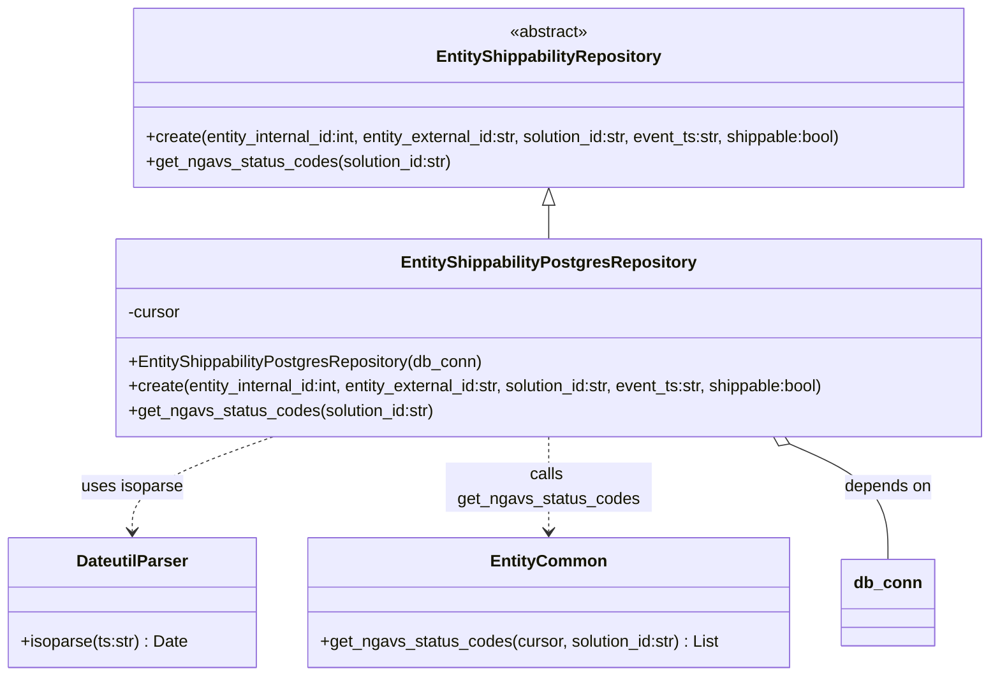

# Diagram: entity_core/entity_service/entity_service/db/repositories/shippability_repository.py


> Auto-generated by Obscura crawlers

## Diagram 1



### SVG

<svg id="container" width="967.18359375" xmlns="http://www.w3.org/2000/svg" class="classDiagram" height="656" viewBox="0 0 967.18359375 656" role="graphics-document document" aria-roledescription="class"><style>#container{font-family:"trebuchet ms",verdana,arial,sans-serif;font-size:16px;fill:#333;}@keyframes edge-animation-frame{from{stroke-dashoffset:0;}}@keyframes dash{to{stroke-dashoffset:0;}}#container .edge-animation-slow{stroke-dasharray:9,5!important;stroke-dashoffset:900;animation:dash 50s linear infinite;stroke-linecap:round;}#container .edge-animation-fast{stroke-dasharray:9,5!important;stroke-dashoffset:900;animation:dash 20s linear infinite;stroke-linecap:round;}#container .error-icon{fill:#552222;}#container .error-text{fill:#552222;stroke:#552222;}#container .edge-thickness-normal{stroke-width:1px;}#container .edge-thickness-thick{stroke-width:3.5px;}#container .edge-pattern-solid{stroke-dasharray:0;}#container .edge-thickness-invisible{stroke-width:0;fill:none;}#container .edge-pattern-dashed{stroke-dasharray:3;}#container .edge-pattern-dotted{stroke-dasharray:2;}#container .marker{fill:#333333;stroke:#333333;}#container .marker.cross{stroke:#333333;}#container svg{font-family:"trebuchet ms",verdana,arial,sans-serif;font-size:16px;}#container p{margin:0;}#container g.classGroup text{fill:#9370DB;stroke:none;font-family:"trebuchet ms",verdana,arial,sans-serif;font-size:10px;}#container g.classGroup text .title{font-weight:bolder;}#container .nodeLabel,#container .edgeLabel{color:#131300;}#container .edgeLabel .label rect{fill:#ECECFF;}#container .label text{fill:#131300;}#container .labelBkg{background:#ECECFF;}#container .edgeLabel .label span{background:#ECECFF;}#container .classTitle{font-weight:bolder;}#container .node rect,#container .node circle,#container .node ellipse,#container .node polygon,#container .node path{fill:#ECECFF;stroke:#9370DB;stroke-width:1px;}#container .divider{stroke:#9370DB;stroke-width:1;}#container g.clickable{cursor:pointer;}#container g.classGroup rect{fill:#ECECFF;stroke:#9370DB;}#container g.classGroup line{stroke:#9370DB;stroke-width:1;}#container .classLabel .box{stroke:none;stroke-width:0;fill:#ECECFF;opacity:0.5;}#container .classLabel .label{fill:#9370DB;font-size:10px;}#container .relation{stroke:#333333;stroke-width:1;fill:none;}#container .dashed-line{stroke-dasharray:3;}#container .dotted-line{stroke-dasharray:1 2;}#container #compositionStart,#container .composition{fill:#333333!important;stroke:#333333!important;stroke-width:1;}#container #compositionEnd,#container .composition{fill:#333333!important;stroke:#333333!important;stroke-width:1;}#container #dependencyStart,#container .dependency{fill:#333333!important;stroke:#333333!important;stroke-width:1;}#container #dependencyStart,#container .dependency{fill:#333333!important;stroke:#333333!important;stroke-width:1;}#container #extensionStart,#container .extension{fill:transparent!important;stroke:#333333!important;stroke-width:1;}#container #extensionEnd,#container .extension{fill:transparent!important;stroke:#333333!important;stroke-width:1;}#container #aggregationStart,#container .aggregation{fill:transparent!important;stroke:#333333!important;stroke-width:1;}#container #aggregationEnd,#container .aggregation{fill:transparent!important;stroke:#333333!important;stroke-width:1;}#container #lollipopStart,#container .lollipop{fill:#ECECFF!important;stroke:#333333!important;stroke-width:1;}#container #lollipopEnd,#container .lollipop{fill:#ECECFF!important;stroke:#333333!important;stroke-width:1;}#container .edgeTerminals{font-size:11px;line-height:initial;}#container .classTitleText{text-anchor:middle;font-size:18px;fill:#333;}#container .label-icon{display:inline-block;height:1em;overflow:visible;vertical-align:-0.125em;}#container .node .label-icon path{fill:currentColor;stroke:revert;stroke-width:revert;}#container :root{--mermaid-font-family:"trebuchet ms",verdana,arial,sans-serif;}</style><g><defs><marker id="container_class-aggregationStart" class="marker aggregation class" refX="18" refY="7" markerWidth="190" markerHeight="240" orient="auto"><path d="M 18,7 L9,13 L1,7 L9,1 Z"></path></marker></defs><defs><marker id="container_class-aggregationEnd" class="marker aggregation class" refX="1" refY="7" markerWidth="20" markerHeight="28" orient="auto"><path d="M 18,7 L9,13 L1,7 L9,1 Z"></path></marker></defs><defs><marker id="container_class-extensionStart" class="marker extension class" refX="18" refY="7" markerWidth="190" markerHeight="240" orient="auto"><path d="M 1,7 L18,13 V 1 Z"></path></marker></defs><defs><marker id="container_class-extensionEnd" class="marker extension class" refX="1" refY="7" markerWidth="20" markerHeight="28" orient="auto"><path d="M 1,1 V 13 L18,7 Z"></path></marker></defs><defs><marker id="container_class-compositionStart" class="marker composition class" refX="18" refY="7" markerWidth="190" markerHeight="240" orient="auto"><path d="M 18,7 L9,13 L1,7 L9,1 Z"></path></marker></defs><defs><marker id="container_class-compositionEnd" class="marker composition class" refX="1" refY="7" markerWidth="20" markerHeight="28" orient="auto"><path d="M 18,7 L9,13 L1,7 L9,1 Z"></path></marker></defs><defs><marker id="container_class-dependencyStart" class="marker dependency class" refX="6" refY="7" markerWidth="190" markerHeight="240" orient="auto"><path d="M 5,7 L9,13 L1,7 L9,1 Z"></path></marker></defs><defs><marker id="container_class-dependencyEnd" class="marker dependency class" refX="13" refY="7" markerWidth="20" markerHeight="28" orient="auto"><path d="M 18,7 L9,13 L14,7 L9,1 Z"></path></marker></defs><defs><marker id="container_class-lollipopStart" class="marker lollipop class" refX="13" refY="7" markerWidth="190" markerHeight="240" orient="auto"><circle stroke="black" fill="transparent" cx="7" cy="7" r="6"></circle></marker></defs><defs><marker id="container_class-lollipopEnd" class="marker lollipop class" refX="1" refY="7" markerWidth="190" markerHeight="240" orient="auto"><circle stroke="black" fill="transparent" cx="7" cy="7" r="6"></circle></marker></defs><g class="root"><g class="clusters"></g><g class="edgePaths"><path d="M529.625,199.25L529.625,200.542C529.625,201.833,529.625,204.417,529.625,209.875C529.625,215.333,529.625,223.667,529.625,227.833L529.625,232" id="id_EntityShippabilityRepository_EntityShippabilityPostgresRepository_1" class="edge-thickness-normal edge-pattern-solid relation" style=";;;" data-edge="true" data-et="edge" data-id="id_EntityShippabilityRepository_EntityShippabilityPostgresRepository_1" data-points="W3sieCI6NTI5LjYyNSwieSI6MTgyfSx7IngiOjUyOS42MjUsInkiOjIwN30seyJ4Ijo1MjkuNjI1LCJ5IjoyMzJ9XQ==" marker-start="url(#container_class-extensionStart)"></path><path d="M263.222,424L240.56,432.167C217.897,440.333,172.572,456.667,149.909,472C127.246,487.333,127.246,501.667,127.246,508.833L127.246,516" id="id_EntityShippabilityPostgresRepository_DateutilParser_2" class="edge-thickness-normal edge-pattern-dashed relation" style=";;;" data-edge="true" data-et="edge" data-id="id_EntityShippabilityPostgresRepository_DateutilParser_2" data-points="W3sieCI6MjYzLjIyMjQxMzc5MzEwMzQ0LCJ5Ijo0MjR9LHsieCI6MTI3LjI0NjA5Mzc1LCJ5Ijo0NzN9LHsieCI6MTI3LjI0NjA5Mzc1LCJ5Ijo1MjJ9XQ==" marker-end="url(#container_class-dependencyEnd)"></path><path d="M529.625,424L529.625,432.167C529.625,440.333,529.625,456.667,529.625,472C529.625,487.333,529.625,501.667,529.625,508.833L529.625,516" id="id_EntityShippabilityPostgresRepository_EntityCommon_3" class="edge-thickness-normal edge-pattern-dashed relation" style=";;;" data-edge="true" data-et="edge" data-id="id_EntityShippabilityPostgresRepository_EntityCommon_3" data-points="W3sieCI6NTI5LjYyNSwieSI6NDI0fSx7IngiOjUyOS42MjUsInkiOjQ3M30seyJ4Ijo1MjkuNjI1LCJ5Ijo1MjJ9XQ==" marker-end="url(#container_class-dependencyEnd)"></path><path d="M761.304,431.008L777.045,438.007C792.786,445.005,824.268,459.003,840.009,477.668C855.75,496.333,855.75,519.667,855.75,531.333L855.75,543" id="id_EntityShippabilityPostgresRepository_db_conn_4" class="edge-thickness-normal edge-pattern-solid relation" style=";;;" data-edge="true" data-et="edge" data-id="id_EntityShippabilityPostgresRepository_db_conn_4" data-points="W3sieCI6NzQ1LjU0MjI0MTM3OTMxMDMsInkiOjQyNH0seyJ4Ijo4NTUuNzUsInkiOjQ3M30seyJ4Ijo4NTUuNzUsInkiOjU0M31d" marker-start="url(#container_class-aggregationStart)"></path></g><g class="edgeLabels"><g class="edgeLabel"><g class="label" data-id="id_EntityShippabilityRepository_EntityShippabilityPostgresRepository_1" transform="translate(0, 0)"><foreignObject width="0" height="0"><div xmlns="http://www.w3.org/1999/xhtml" class="labelBkg" style="display: table-cell; white-space: nowrap; line-height: 1.5; max-width: 200px; text-align: center;"><span class="edgeLabel"></span></div></foreignObject></g></g><g class="edgeLabel" transform="translate(127.24609375, 473)"><g class="label" data-id="id_EntityShippabilityPostgresRepository_DateutilParser_2" transform="translate(-49.3671875, -12)"><foreignObject width="98.734375" height="24"><div xmlns="http://www.w3.org/1999/xhtml" class="labelBkg" style="display: table-cell; white-space: nowrap; line-height: 1.5; max-width: 200px; text-align: center;"><span class="edgeLabel"><p>uses isoparse</p></span></div></foreignObject></g></g><g class="edgeLabel" transform="translate(529.625, 473)"><g class="label" data-id="id_EntityShippabilityPostgresRepository_EntityCommon_3" transform="translate(-100, -24)"><foreignObject width="200" height="48"><div xmlns="http://www.w3.org/1999/xhtml" class="labelBkg" style="display: table; white-space: break-spaces; line-height: 1.5; max-width: 200px; text-align: center; width: 200px;"><span class="edgeLabel"><p>calls get_ngavs_status_codes</p></span></div></foreignObject></g></g><g class="edgeLabel" transform="translate(855.75, 473)"><g class="label" data-id="id_EntityShippabilityPostgresRepository_db_conn_4" transform="translate(-42.9453125, -12)"><foreignObject width="85.890625" height="24"><div xmlns="http://www.w3.org/1999/xhtml" class="labelBkg" style="display: table-cell; white-space: nowrap; line-height: 1.5; max-width: 200px; text-align: center;"><span class="edgeLabel"><p>depends on</p></span></div></foreignObject></g></g></g><g class="nodes"><g class="node default" id="classId-EntityShippabilityRepository-0" transform="translate(529.625, 95)"><g class="basic label-container"><path d="M-413.69921875 -87 L413.69921875 -87 L413.69921875 87 L-413.69921875 87" stroke="none" stroke-width="0" fill="#ECECFF" style=""></path><path d="M-413.69921875 -87 C-169.1977330464971 -87, 75.30375265700582 -87, 413.69921875 -87 M-413.69921875 -87 C-156.3254256423731 -87, 101.04836746525382 -87, 413.69921875 -87 M413.69921875 -87 C413.69921875 -36.0775563761702, 413.69921875 14.8448872476596, 413.69921875 87 M413.69921875 -87 C413.69921875 -34.50976307944369, 413.69921875 17.980473841112627, 413.69921875 87 M413.69921875 87 C107.67454378729536 87, -198.35013117540927 87, -413.69921875 87 M413.69921875 87 C198.65858569667222 87, -16.382047356655562 87, -413.69921875 87 M-413.69921875 87 C-413.69921875 50.63327831137534, -413.69921875 14.266556622750684, -413.69921875 -87 M-413.69921875 87 C-413.69921875 38.11593428779689, -413.69921875 -10.76813142440622, -413.69921875 -87" stroke="#9370DB" stroke-width="1.3" fill="none" stroke-dasharray="0 0" style=""></path></g><g class="annotation-group text" transform="translate(-38.609375, -63)"><g class="label" style="" transform="translate(0,-12)"><foreignObject width="77.21875" height="24"><div xmlns="http://www.w3.org/1999/xhtml" style="display: table-cell; white-space: nowrap; line-height: 1.5; max-width: 127px; text-align: center;"><span class="nodeLabel markdown-node-label" style=""><p>«abstract»</p></span></div></foreignObject></g></g><g class="label-group text" transform="translate(-105.2109375, -39)"><g class="label" style="font-weight: bolder" transform="translate(0,-12)"><foreignObject width="210.421875" height="24"><div xmlns="http://www.w3.org/1999/xhtml" style="display: table-cell; white-space: nowrap; line-height: 1.5; max-width: 257px; text-align: center;"><span class="nodeLabel markdown-node-label" style=""><p>EntityShippabilityRepository</p></span></div></foreignObject></g></g><g class="members-group text" transform="translate(-401.69921875, 9)"></g><g class="methods-group text" transform="translate(-401.69921875, 39)"><g class="label" style="" transform="translate(0,-12)"><foreignObject width="698.1875" height="24"><div xmlns="http://www.w3.org/1999/xhtml" style="display: table-cell; white-space: nowrap; line-height: 1.5; max-width: 756px; text-align: center;"><span class="nodeLabel markdown-node-label" style=""><p>+create(entity_internal_id:int, entity_external_id:str, solution_id:str, event_ts:str, shippable:bool)</p></span></div></foreignObject></g><g class="label" style="" transform="translate(0,12)"><foreignObject width="298.484375" height="24"><div xmlns="http://www.w3.org/1999/xhtml" style="display: table-cell; white-space: nowrap; line-height: 1.5; max-width: 356px; text-align: center;"><span class="nodeLabel markdown-node-label" style=""><p>+get_ngavs_status_codes(solution_id:str)</p></span></div></foreignObject></g></g><g class="divider" style=""><path d="M-413.69921875 -15 C-197.62384213184953 -15, 18.451534486300943 -15, 413.69921875 -15 M-413.69921875 -15 C-121.72465255086041 -15, 170.24991364827918 -15, 413.69921875 -15" stroke="#9370DB" stroke-width="1.3" fill="none" stroke-dasharray="0 0" style=""></path></g><g class="divider" style=""><path d="M-413.69921875 9 C-107.20447330558176 9, 199.29027213883649 9, 413.69921875 9 M-413.69921875 9 C-102.88044388894576 9, 207.93833097210847 9, 413.69921875 9" stroke="#9370DB" stroke-width="1.3" fill="none" stroke-dasharray="0 0" style=""></path></g></g><g class="node default" id="classId-EntityShippabilityPostgresRepository-1" transform="translate(529.625, 328)"><g class="basic label-container"><path d="M-429.55859375 -96 L429.55859375 -96 L429.55859375 96 L-429.55859375 96" stroke="none" stroke-width="0" fill="#ECECFF" style=""></path><path d="M-429.55859375 -96 C-147.8086079858915 -96, 133.94137777821697 -96, 429.55859375 -96 M-429.55859375 -96 C-170.9875407537383 -96, 87.5835122425234 -96, 429.55859375 -96 M429.55859375 -96 C429.55859375 -55.13688810247487, 429.55859375 -14.27377620494974, 429.55859375 96 M429.55859375 -96 C429.55859375 -20.74053341018822, 429.55859375 54.51893317962356, 429.55859375 96 M429.55859375 96 C88.39007639881407 96, -252.77844095237185 96, -429.55859375 96 M429.55859375 96 C222.91393676200127 96, 16.26927977400254 96, -429.55859375 96 M-429.55859375 96 C-429.55859375 54.924423904060134, -429.55859375 13.848847808120269, -429.55859375 -96 M-429.55859375 96 C-429.55859375 27.213418660637387, -429.55859375 -41.573162678725225, -429.55859375 -96" stroke="#9370DB" stroke-width="1.3" fill="none" stroke-dasharray="0 0" style=""></path></g><g class="annotation-group text" transform="translate(0, -72)"></g><g class="label-group text" transform="translate(-136.9296875, -72)"><g class="label" style="font-weight: bolder" transform="translate(0,-12)"><foreignObject width="273.859375" height="24"><div xmlns="http://www.w3.org/1999/xhtml" style="display: table-cell; white-space: nowrap; line-height: 1.5; max-width: 318px; text-align: center;"><span class="nodeLabel markdown-node-label" style=""><p>EntityShippabilityPostgresRepository</p></span></div></foreignObject></g></g><g class="members-group text" transform="translate(-417.55859375, -24)"><g class="label" style="" transform="translate(0,-12)"><foreignObject width="52.1875" height="24"><div xmlns="http://www.w3.org/1999/xhtml" style="display: table-cell; white-space: nowrap; line-height: 1.5; max-width: 110px; text-align: center;"><span class="nodeLabel markdown-node-label" style=""><p>-cursor</p></span></div></foreignObject></g></g><g class="methods-group text" transform="translate(-417.55859375, 24)"><g class="label" style="" transform="translate(0,-12)"><foreignObject width="348.40625" height="24"><div xmlns="http://www.w3.org/1999/xhtml" style="display: table-cell; white-space: nowrap; line-height: 1.5; max-width: 406px; text-align: center;"><span class="nodeLabel markdown-node-label" style=""><p>+EntityShippabilityPostgresRepository(db_conn)</p></span></div></foreignObject></g><g class="label" style="" transform="translate(0,12)"><foreignObject width="698.1875" height="24"><div xmlns="http://www.w3.org/1999/xhtml" style="display: table-cell; white-space: nowrap; line-height: 1.5; max-width: 756px; text-align: center;"><span class="nodeLabel markdown-node-label" style=""><p>+create(entity_internal_id:int, entity_external_id:str, solution_id:str, event_ts:str, shippable:bool)</p></span></div></foreignObject></g><g class="label" style="" transform="translate(0,36)"><foreignObject width="298.484375" height="24"><div xmlns="http://www.w3.org/1999/xhtml" style="display: table-cell; white-space: nowrap; line-height: 1.5; max-width: 356px; text-align: center;"><span class="nodeLabel markdown-node-label" style=""><p>+get_ngavs_status_codes(solution_id:str)</p></span></div></foreignObject></g></g><g class="divider" style=""><path d="M-429.55859375 -48 C-204.931268347249 -48, 19.696057055502024 -48, 429.55859375 -48 M-429.55859375 -48 C-218.31937922052063 -48, -7.0801646910412614 -48, 429.55859375 -48" stroke="#9370DB" stroke-width="1.3" fill="none" stroke-dasharray="0 0" style=""></path></g><g class="divider" style=""><path d="M-429.55859375 0 C-161.38986497946786 0, 106.77886379106428 0, 429.55859375 0 M-429.55859375 0 C-153.88728653066067 0, 121.78402068867865 0, 429.55859375 0" stroke="#9370DB" stroke-width="1.3" fill="none" stroke-dasharray="0 0" style=""></path></g></g><g class="node default" id="classId-DateutilParser-2" transform="translate(127.24609375, 585)"><g class="basic label-container"><path d="M-119.24609375 -63 L119.24609375 -63 L119.24609375 63 L-119.24609375 63" stroke="none" stroke-width="0" fill="#ECECFF" style=""></path><path d="M-119.24609375 -63 C-63.92529968642223 -63, -8.604505622844457 -63, 119.24609375 -63 M-119.24609375 -63 C-57.82525023898313 -63, 3.5955932720337387 -63, 119.24609375 -63 M119.24609375 -63 C119.24609375 -29.516952912191016, 119.24609375 3.966094175617968, 119.24609375 63 M119.24609375 -63 C119.24609375 -31.62223800327789, 119.24609375 -0.24447600655577872, 119.24609375 63 M119.24609375 63 C32.260257578821125 63, -54.72557859235775 63, -119.24609375 63 M119.24609375 63 C31.972962785781874 63, -55.30016817843625 63, -119.24609375 63 M-119.24609375 63 C-119.24609375 20.469069041013505, -119.24609375 -22.06186191797299, -119.24609375 -63 M-119.24609375 63 C-119.24609375 37.45408732490484, -119.24609375 11.90817464980968, -119.24609375 -63" stroke="#9370DB" stroke-width="1.3" fill="none" stroke-dasharray="0 0" style=""></path></g><g class="annotation-group text" transform="translate(0, -39)"></g><g class="label-group text" transform="translate(-52.5390625, -39)"><g class="label" style="font-weight: bolder" transform="translate(0,-12)"><foreignObject width="105.078125" height="24"><div xmlns="http://www.w3.org/1999/xhtml" style="display: table-cell; white-space: nowrap; line-height: 1.5; max-width: 154px; text-align: center;"><span class="nodeLabel markdown-node-label" style=""><p>DateutilParser</p></span></div></foreignObject></g></g><g class="members-group text" transform="translate(-107.24609375, 9)"></g><g class="methods-group text" transform="translate(-107.24609375, 39)"><g class="label" style="" transform="translate(0,-12)"><foreignObject width="161.953125" height="24"><div xmlns="http://www.w3.org/1999/xhtml" style="display: table-cell; white-space: nowrap; line-height: 1.5; max-width: 219px; text-align: center;"><span class="nodeLabel markdown-node-label" style=""><p>+isoparse(ts:str) : Date</p></span></div></foreignObject></g></g><g class="divider" style=""><path d="M-119.24609375 -15 C-56.41368288836339 -15, 6.418727973273221 -15, 119.24609375 -15 M-119.24609375 -15 C-67.9275633591592 -15, -16.609032968318374 -15, 119.24609375 -15" stroke="#9370DB" stroke-width="1.3" fill="none" stroke-dasharray="0 0" style=""></path></g><g class="divider" style=""><path d="M-119.24609375 9 C-41.598554305709754 9, 36.04898513858049 9, 119.24609375 9 M-119.24609375 9 C-69.12369556459288 9, -19.001297379185758 9, 119.24609375 9" stroke="#9370DB" stroke-width="1.3" fill="none" stroke-dasharray="0 0" style=""></path></g></g><g class="node default" id="classId-EntityCommon-3" transform="translate(529.625, 585)"><g class="basic label-container"><path d="M-233.1328125 -63 L233.1328125 -63 L233.1328125 63 L-233.1328125 63" stroke="none" stroke-width="0" fill="#ECECFF" style=""></path><path d="M-233.1328125 -63 C-98.50755518416489 -63, 36.11770213167023 -63, 233.1328125 -63 M-233.1328125 -63 C-83.7474220714171 -63, 65.63796835716579 -63, 233.1328125 -63 M233.1328125 -63 C233.1328125 -37.07774883705375, 233.1328125 -11.155497674107494, 233.1328125 63 M233.1328125 -63 C233.1328125 -16.600965604000116, 233.1328125 29.798068791999768, 233.1328125 63 M233.1328125 63 C58.32062220777985 63, -116.4915680844403 63, -233.1328125 63 M233.1328125 63 C49.17644857614664 63, -134.77991534770672 63, -233.1328125 63 M-233.1328125 63 C-233.1328125 29.492054465319796, -233.1328125 -4.015891069360407, -233.1328125 -63 M-233.1328125 63 C-233.1328125 16.06725297345143, -233.1328125 -30.865494053097137, -233.1328125 -63" stroke="#9370DB" stroke-width="1.3" fill="none" stroke-dasharray="0 0" style=""></path></g><g class="annotation-group text" transform="translate(0, -39)"></g><g class="label-group text" transform="translate(-53.203125, -39)"><g class="label" style="font-weight: bolder" transform="translate(0,-12)"><foreignObject width="106.40625" height="24"><div xmlns="http://www.w3.org/1999/xhtml" style="display: table-cell; white-space: nowrap; line-height: 1.5; max-width: 156px; text-align: center;"><span class="nodeLabel markdown-node-label" style=""><p>EntityCommon</p></span></div></foreignObject></g></g><g class="members-group text" transform="translate(-221.1328125, 9)"></g><g class="methods-group text" transform="translate(-221.1328125, 39)"><g class="label" style="" transform="translate(0,-12)"><foreignObject width="389.0625" height="24"><div xmlns="http://www.w3.org/1999/xhtml" style="display: table-cell; white-space: nowrap; line-height: 1.5; max-width: 447px; text-align: center;"><span class="nodeLabel markdown-node-label" style=""><p>+get_ngavs_status_codes(cursor, solution_id:str) : List</p></span></div></foreignObject></g></g><g class="divider" style=""><path d="M-233.1328125 -15 C-121.23495567544722 -15, -9.33709885089445 -15, 233.1328125 -15 M-233.1328125 -15 C-105.63189644846156 -15, 21.86901960307688 -15, 233.1328125 -15" stroke="#9370DB" stroke-width="1.3" fill="none" stroke-dasharray="0 0" style=""></path></g><g class="divider" style=""><path d="M-233.1328125 9 C-100.97523187994716 9, 31.18234874010568 9, 233.1328125 9 M-233.1328125 9 C-102.72937253503324 9, 27.67406742993353 9, 233.1328125 9" stroke="#9370DB" stroke-width="1.3" fill="none" stroke-dasharray="0 0" style=""></path></g></g><g class="node default" id="classId-db_conn-4" transform="translate(855.75, 585)"><g class="basic label-container"><path d="M-42.9921875 -42 L42.9921875 -42 L42.9921875 42 L-42.9921875 42" stroke="none" stroke-width="0" fill="#ECECFF" style=""></path><path d="M-42.9921875 -42 C-14.494169476917005 -42, 14.00384854616599 -42, 42.9921875 -42 M-42.9921875 -42 C-12.501027695071521 -42, 17.990132109856958 -42, 42.9921875 -42 M42.9921875 -42 C42.9921875 -24.535916643151438, 42.9921875 -7.071833286302876, 42.9921875 42 M42.9921875 -42 C42.9921875 -13.470905737854725, 42.9921875 15.05818852429055, 42.9921875 42 M42.9921875 42 C13.89426080122994 42, -15.20366589754012 42, -42.9921875 42 M42.9921875 42 C10.312632427028063 42, -22.366922645943873 42, -42.9921875 42 M-42.9921875 42 C-42.9921875 11.311153730736716, -42.9921875 -19.377692538526567, -42.9921875 -42 M-42.9921875 42 C-42.9921875 13.416897184592031, -42.9921875 -15.166205630815938, -42.9921875 -42" stroke="#9370DB" stroke-width="1.3" fill="none" stroke-dasharray="0 0" style=""></path></g><g class="annotation-group text" transform="translate(0, -18)"></g><g class="label-group text" transform="translate(-30.9921875, -18)"><g class="label" style="font-weight: bolder" transform="translate(0,-12)"><foreignObject width="61.984375" height="24"><div xmlns="http://www.w3.org/1999/xhtml" style="display: table-cell; white-space: nowrap; line-height: 1.5; max-width: 112px; text-align: center;"><span class="nodeLabel markdown-node-label" style=""><p>db_conn</p></span></div></foreignObject></g></g><g class="members-group text" transform="translate(-30.9921875, 30)"></g><g class="methods-group text" transform="translate(-30.9921875, 60)"></g><g class="divider" style=""><path d="M-42.9921875 6 C-17.304920837714427 6, 8.382345824571146 6, 42.9921875 6 M-42.9921875 6 C-16.02229882287411 6, 10.947589854251781 6, 42.9921875 6" stroke="#9370DB" stroke-width="1.3" fill="none" stroke-dasharray="0 0" style=""></path></g><g class="divider" style=""><path d="M-42.9921875 24 C-12.409873038687984 24, 18.172441422624033 24, 42.9921875 24 M-42.9921875 24 C-9.38866542709534 24, 24.21485664580932 24, 42.9921875 24" stroke="#9370DB" stroke-width="1.3" fill="none" stroke-dasharray="0 0" style=""></path></g></g></g></g></g></svg>

## Diagram 2

```mermaid
flowchart TD
Init[EntityShippabilityPostgresRepository.__init__(db_conn)] --> Establish[db_conn.establish_connection()]
Establish --> GetCursor[db_conn.get_cursor() -> cursor]
CreateCall[create(entity_internal_id, entity_external_id, solution_id, event_ts, shippable)] --> ParseTs[event_ts.replace(" ", "")]
ParseTs --> Isoparse[DateutilParser.isoparse(parsed_ts) -> date_event]
Isoparse --> BuildParams[Build params dict: entity_external_id, entity_internal_id, solution_id, shippable, event_ts=date_event]
BuildParams --> SQL[Prepare INSERT ... ON CONFLICT ... WHERE COALESCE(...)]
SQL --> Execute[cursor.execute(query, params)]
Execute --> End[Done]
```

> SVG rendering failed for this diagram.
