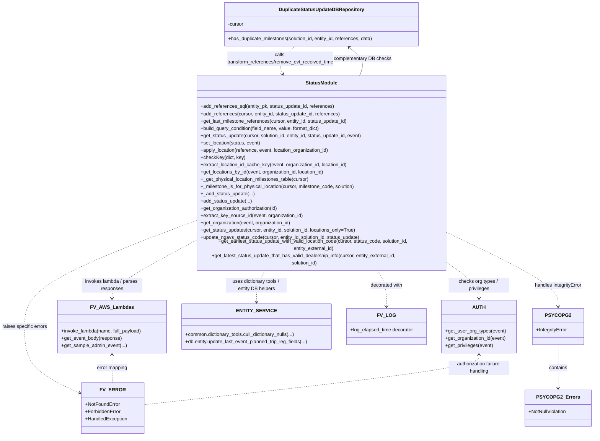

# Diagram: entity_core/entity_service/entity_service/db/status_update.py

> Auto-generated by Obscura crawlers

## Mermaid

### SVG

<svg id="container" width="1948.71484375" xmlns="http://www.w3.org/2000/svg" class="classDiagram" height="1402" viewBox="0 0 1948.71484375 1402" role="graphics-document document" aria-roledescription="class"><g><defs><marker id="container_class-aggregationStart" class="marker aggregation class" refX="18" refY="7" markerWidth="190" markerHeight="240" orient="auto"><path d="M 18,7 L9,13 L1,7 L9,1 Z"></path></marker></defs><defs><marker id="container_class-aggregationEnd" class="marker aggregation class" refX="1" refY="7" markerWidth="20" markerHeight="28" orient="auto"><path d="M 18,7 L9,13 L1,7 L9,1 Z"></path></marker></defs><defs><marker id="container_class-extensionStart" class="marker extension class" refX="18" refY="7" markerWidth="190" markerHeight="240" orient="auto"><path d="M 1,7 L18,13 V 1 Z"></path></marker></defs><defs><marker id="container_class-extensionEnd" class="marker extension class" refX="1" refY="7" markerWidth="20" markerHeight="28" orient="auto"><path d="M 1,1 V 13 L18,7 Z"></path></marker></defs><defs><marker id="container_class-compositionStart" class="marker composition class" refX="18" refY="7" markerWidth="190" markerHeight="240" orient="auto"><path d="M 18,7 L9,13 L1,7 L9,1 Z"></path></marker></defs><defs><marker id="container_class-compositionEnd" class="marker composition class" refX="1" refY="7" markerWidth="20" markerHeight="28" orient="auto"><path d="M 18,7 L9,13 L1,7 L9,1 Z"></path></marker></defs><defs><marker id="container_class-dependencyStart" class="marker dependency class" refX="6" refY="7" markerWidth="190" markerHeight="240" orient="auto"><path d="M 5,7 L9,13 L1,7 L9,1 Z"></path></marker></defs><defs><marker id="container_class-dependencyEnd" class="marker dependency class" refX="13" refY="7" markerWidth="20" markerHeight="28" orient="auto"><path d="M 18,7 L9,13 L14,7 L9,1 Z"></path></marker></defs><defs><marker id="container_class-lollipopStart" class="marker lollipop class" refX="13" refY="7" markerWidth="190" markerHeight="240" orient="auto"><circle stroke="black" fill="transparent" cx="7" cy="7" r="6"></circle></marker></defs><defs><marker id="container_class-lollipopEnd" class="marker lollipop class" refX="1" refY="7" markerWidth="190" markerHeight="240" orient="auto"><circle stroke="black" fill="transparent" cx="7" cy="7" r="6"></circle></marker></defs><g class="root"><g class="clusters"></g><g class="edgePaths"><path d="M970.687,152L960.763,160.167C950.839,168.333,930.991,184.667,924.093,200.077C917.195,215.488,923.246,229.976,926.272,237.22L929.298,244.464" id="id_DuplicateStatusUpdateDBRepository_StatusModule_1" class="edge-thickness-normal edge-pattern-dashed relation" style=";;;" data-edge="true" data-et="edge" data-id="id_DuplicateStatusUpdateDBRepository_StatusModule_1" data-points="W3sieCI6OTcwLjY4NzMyMjQ0MzE4MTgsInkiOjE1Mn0seyJ4Ijo5MTEuMTQyNTc4MTI1LCJ5IjoyMDF9LHsieCI6OTMxLjYxMTA4Mzk4NDM3NSwieSI6MjUwfV0=" marker-end="url(#container_class-dependencyEnd)"></path><path d="M632.811,770.629L589.037,793.024C545.264,815.419,457.718,860.21,413.945,889.771C370.172,919.333,370.172,933.667,370.172,940.833L370.172,948" id="id_StatusModule_FV_AWS_Lambdas_2" class="edge-thickness-normal edge-pattern-dashed relation" style=";;;" data-edge="true" data-et="edge" data-id="id_StatusModule_FV_AWS_Lambdas_2" data-points="W3sieCI6NjMyLjgxMDU0Njg3NSwieSI6NzcwLjYyODYzMzMxNDUwMjZ9LHsieCI6MzcwLjE3MTg3NSwieSI6OTA1fSx7IngiOjM3MC4xNzE4NzUsInkiOjk1NH1d" marker-end="url(#container_class-dependencyEnd)"></path><path d="M1483.553,842.55L1498.843,852.958C1514.134,863.367,1544.715,884.183,1560.006,901.758C1575.297,919.333,1575.297,933.667,1575.297,940.833L1575.297,948" id="id_StatusModule_AUTH_3" class="edge-thickness-normal edge-pattern-dashed relation" style=";;;" data-edge="true" data-et="edge" data-id="id_StatusModule_AUTH_3" data-points="W3sieCI6MTQ4My41NTI3MzQzNzUsInkiOjg0Mi41NDk4MjM4MDQ2ODU3fSx7IngiOjE1NzUuMjk2ODc1LCJ5Ijo5MDV9LHsieCI6MTU3NS4yOTY4NzUsInkiOjk1NH1d" marker-end="url(#container_class-dependencyEnd)"></path><path d="M874.353,856L869.398,864.167C864.444,872.333,854.534,888.667,849.58,906C844.625,923.333,844.625,941.667,844.625,950.833L844.625,960" id="id_StatusModule_ENTITY_SERVICE_4" class="edge-thickness-normal edge-pattern-dashed relation" style=";;;" data-edge="true" data-et="edge" data-id="id_StatusModule_ENTITY_SERVICE_4" data-points="W3sieCI6ODc0LjM1MzA1NTA4NzAwMjksInkiOjg1Nn0seyJ4Ijo4NDQuNjI1LCJ5Ijo5MDV9LHsieCI6ODQ0LjYyNSwieSI6OTY2fV0=" marker-end="url(#container_class-dependencyEnd)"></path><path d="M1242.01,856L1246.965,864.167C1251.92,872.333,1261.829,888.667,1266.784,908.5C1271.738,928.333,1271.738,951.667,1271.738,963.333L1271.738,975" id="id_StatusModule_FV_LOG_5" class="edge-thickness-normal edge-pattern-dashed relation" style=";;;" data-edge="true" data-et="edge" data-id="id_StatusModule_FV_LOG_5" data-points="W3sieCI6MTI0Mi4wMTAyMjYxNjI5OTcyLCJ5Ijo4NTZ9LHsieCI6MTI3MS43MzgyODEyNSwieSI6OTA1fSx7IngiOjEyNzEuNzM4MjgxMjUsInkiOjk4MX1d" marker-end="url(#container_class-dependencyEnd)"></path><path d="M1483.553,746.363L1541.716,772.803C1599.879,799.242,1716.205,852.121,1774.368,890.227C1832.531,928.333,1832.531,951.667,1832.531,963.333L1832.531,975" id="id_StatusModule_PSYCOPG2_6" class="edge-thickness-normal edge-pattern-dashed relation" style=";;;" data-edge="true" data-et="edge" data-id="id_StatusModule_PSYCOPG2_6" data-points="W3sieCI6MTQ4My41NTI3MzQzNzUsInkiOjc0Ni4zNjMwNzkzOTg3ODk4fSx7IngiOjE4MzIuNTMxMjUsInkiOjkwNX0seyJ4IjoxODMyLjUzMTI1LCJ5Ijo5ODF9XQ==" marker-end="url(#container_class-dependencyEnd)"></path><path d="M1832.531,1101L1832.531,1113.667C1832.531,1126.333,1832.531,1151.667,1832.531,1175.5C1832.531,1199.333,1832.531,1221.667,1832.531,1232.833L1832.531,1244" id="id_PSYCOPG2_PSYCOPG2_Errors_7" class="edge-thickness-normal edge-pattern-dashed relation" style=";;;" data-edge="true" data-et="edge" data-id="id_PSYCOPG2_PSYCOPG2_Errors_7" data-points="W3sieCI6MTgzMi41MzEyNSwieSI6MTEwMX0seyJ4IjoxODMyLjUzMTI1LCJ5IjoxMTc3fSx7IngiOjE4MzIuNTMxMjUsInkiOjEyNTB9XQ==" marker-end="url(#container_class-dependencyEnd)"></path><path d="M632.811,706.465L541.095,739.554C449.379,772.643,265.947,838.822,174.231,894.578C82.516,950.333,82.516,995.667,82.516,1041C82.516,1086.333,82.516,1131.667,113.041,1168.381C143.567,1205.095,204.619,1233.191,235.145,1247.238L265.671,1261.286" id="id_StatusModule_FV_ERROR_8" class="edge-thickness-normal edge-pattern-dashed relation" style=";;;" data-edge="true" data-et="edge" data-id="id_StatusModule_FV_ERROR_8" data-points="W3sieCI6NjMyLjgxMDU0Njg3NSwieSI6NzA2LjQ2NTA0MDkwNzU1MzJ9LHsieCI6ODIuNTE1NjI1LCJ5Ijo5MDV9LHsieCI6ODIuNTE1NjI1LCJ5IjoxMDQxfSx7IngiOjgyLjUxNTYyNSwieSI6MTE3N30seyJ4IjoyNzEuMTIxMDkzNzUsInkiOjEyNjMuNzk0MTUzMDI2ODgzMX1d" marker-end="url(#container_class-dependencyEnd)"></path><path d="M1184.752,250L1188.164,241.833C1191.575,233.667,1198.398,217.333,1192.657,201.635C1186.917,185.938,1168.613,170.875,1159.461,163.344L1150.309,155.813" id="id_StatusModule_DuplicateStatusUpdateDBRepository_9" class="edge-thickness-normal edge-pattern-solid relation" style=";;;" data-edge="true" data-et="edge" data-id="id_StatusModule_DuplicateStatusUpdateDBRepository_9" data-points="W3sieCI6MTE4NC43NTIxOTcyNjU2MjUsInkiOjI1MH0seyJ4IjoxMjA1LjIyMDcwMzEyNSwieSI6MjAxfSx7IngiOjExNDUuNjc1OTU4ODA2ODE4MiwieSI6MTUyfV0=" marker-end="url(#container_class-dependencyEnd)"></path><path d="M370.172,1134L370.172,1141.167C370.172,1148.333,370.172,1162.667,370.255,1178C370.338,1193.333,370.505,1209.667,370.588,1217.833L370.671,1226" id="id_FV_AWS_Lambdas_FV_ERROR_10" class="edge-thickness-normal edge-pattern-dashed relation" style=";;;" data-edge="true" data-et="edge" data-id="id_FV_AWS_Lambdas_FV_ERROR_10" data-points="W3sieCI6MzcwLjE3MTg3NSwieSI6MTEyOH0seyJ4IjozNzAuMTcxODc1LCJ5IjoxMTc3fSx7IngiOjM3MC42NzEyNTgyMjM2ODQyLCJ5IjoxMjI2fV0=" marker-start="url(#container_class-dependencyStart)"></path><path d="M1575.297,1134L1575.297,1141.167C1575.297,1148.333,1575.297,1162.667,1391.403,1190.151C1207.509,1217.635,839.721,1258.271,655.827,1278.589L471.934,1298.906" id="id_AUTH_FV_ERROR_11" class="edge-thickness-normal edge-pattern-dashed relation" style=";;;" data-edge="true" data-et="edge" data-id="id_AUTH_FV_ERROR_11" data-points="W3sieCI6MTU3NS4yOTY4NzUsInkiOjExMjh9LHsieCI6MTU3NS4yOTY4NzUsInkiOjExNzd9LHsieCI6NDcxLjkzMzU5Mzc1LCJ5IjoxMjk4LjkwNjQ4ODQwNzE4NDV9XQ==" marker-start="url(#container_class-dependencyStart)"></path></g><g class="edgeLabels"><g class="edgeLabel" transform="translate(920.41271, 193.37151)"><g class="label" data-id="id_DuplicateStatusUpdateDBRepository_StatusModule_1" transform="translate(-178.609375, -24)"><foreignObject width="357.21875" height="48">

calls transform_references/remove_evt_received_time

</foreignObject></g></g><g class="edgeLabel" transform="translate(370.171875, 905)"><g class="label" data-id="id_StatusModule_FV_AWS_Lambdas_2" transform="translate(-100, -24)"><foreignObject width="200" height="48">

invokes lambda / parses responses

</foreignObject></g></g><g class="edgeLabel" transform="translate(1575.296875, 905)"><g class="label" data-id="id_StatusModule_AUTH_3" transform="translate(-100, -24)"><foreignObject width="200" height="48">

checks org types / privileges

</foreignObject></g></g><g class="edgeLabel" transform="translate(844.625, 905)"><g class="label" data-id="id_StatusModule_ENTITY_SERVICE_4" transform="translate(-100, -24)"><foreignObject width="200" height="48">

uses dictionary tools / entity DB helpers

</foreignObject></g></g><g class="edgeLabel" transform="translate(1271.73828125, 905)"><g class="label" data-id="id_StatusModule_FV_LOG_5" transform="translate(-54.2421875, -12)"><foreignObject width="108.484375" height="24">

decorated with

</foreignObject></g></g><g class="edgeLabel" transform="translate(1832.53125, 905)"><g class="label" data-id="id_StatusModule_PSYCOPG2_6" transform="translate(-79.3984375, -12)"><foreignObject width="158.796875" height="24">

handles IntegrityError

</foreignObject></g></g><g class="edgeLabel" transform="translate(1832.53125, 1177)"><g class="label" data-id="id_PSYCOPG2_PSYCOPG2_Errors_7" transform="translate(-30.890625, -12)"><foreignObject width="61.78125" height="24">

contains

</foreignObject></g></g><g class="edgeLabel" transform="translate(82.515625, 1041)"><g class="label" data-id="id_StatusModule_FV_ERROR_8" transform="translate(-74.515625, -12)"><foreignObject width="149.03125" height="24">

raises specific errors

</foreignObject></g></g><g class="edgeLabel" transform="translate(1195.95057, 193.37151)"><g class="label" data-id="id_StatusModule_DuplicateStatusUpdateDBRepository_9" transform="translate(-95.46875, -12)"><foreignObject width="190.9375" height="24">

complementary DB checks

</foreignObject></g></g><g class="edgeLabel" transform="translate(370.171875, 1177)"><g class="label" data-id="id_FV_AWS_Lambdas_FV_ERROR_10" transform="translate(-51.9921875, -12)"><foreignObject width="103.984375" height="24">

error mapping

</foreignObject></g></g><g class="edgeLabel" transform="translate(1575.296875, 1177)"><g class="label" data-id="id_AUTH_FV_ERROR_11" transform="translate(-100, -24)"><foreignObject width="200" height="48">

authorization failure handling

</foreignObject></g></g></g><g class="nodes"><g class="node default" id="classId-DuplicateStatusUpdateDBRepository-0" transform="translate(1058.181640625, 80)"><g class="basic label-container"><path d="M-322.0859375 -72 L322.0859375 -72 L322.0859375 72 L-322.0859375 72" stroke="none" stroke-width="0" fill="#ECECFF" style=""></path><path d="M-322.0859375 -72 C-70.17891212278766 -72, 181.72811325442467 -72, 322.0859375 -72 M-322.0859375 -72 C-110.13221912518028 -72, 101.82149924963943 -72, 322.0859375 -72 M322.0859375 -72 C322.0859375 -30.3889550274827, 322.0859375 11.222089945034597, 322.0859375 72 M322.0859375 -72 C322.0859375 -37.39267722843019, 322.0859375 -2.785354456860375, 322.0859375 72 M322.0859375 72 C155.24634757656472 72, -11.593242346870568 72, -322.0859375 72 M322.0859375 72 C180.7826126102429 72, 39.479287720485786 72, -322.0859375 72 M-322.0859375 72 C-322.0859375 29.86523297834502, -322.0859375 -12.26953404330996, -322.0859375 -72 M-322.0859375 72 C-322.0859375 17.86399864594229, -322.0859375 -36.27200270811542, -322.0859375 -72" stroke="#9370DB" stroke-width="1.3" fill="none" stroke-dasharray="0 0" style=""></path></g><g class="annotation-group text" transform="translate(0, -48)"></g><g class="label-group text" transform="translate(-134.609375, -48)"><g class="label" style="font-weight: bolder" transform="translate(0,-12)"><foreignObject width="269.21875" height="24">

DuplicateStatusUpdateDBRepository

</foreignObject></g></g><g class="members-group text" transform="translate(-310.0859375, 0)"><g class="label" style="" transform="translate(0,-12)"><foreignObject width="52.1875" height="24">

-cursor

</foreignObject></g></g><g class="methods-group text" transform="translate(-310.0859375, 48)"><g class="label" style="" transform="translate(0,-12)"><foreignObject width="485.5625" height="24">

+has_duplicate_milestones(solution_id, entity_id, references, data)

</foreignObject></g></g><g class="divider" style=""><path d="M-322.0859375 -24 C-188.83814779077102 -24, -55.590358081542036 -24, 322.0859375 -24 M-322.0859375 -24 C-114.52843930727582 -24, 93.02905888544836 -24, 322.0859375 -24" stroke="#9370DB" stroke-width="1.3" fill="none" stroke-dasharray="0 0" style=""></path></g><g class="divider" style=""><path d="M-322.0859375 24 C-171.1558276992423 24, -20.225717898484618 24, 322.0859375 24 M-322.0859375 24 C-81.87109590084486 24, 158.34374569831027 24, 322.0859375 24" stroke="#9370DB" stroke-width="1.3" fill="none" stroke-dasharray="0 0" style=""></path></g></g><g class="node default" id="classId-StatusModule-1" transform="translate(1058.181640625, 553)"><g class="basic label-container"><path d="M-425.37109375 -303 L425.37109375 -303 L425.37109375 303 L-425.37109375 303" stroke="none" stroke-width="0" fill="#ECECFF" style=""></path><path d="M-425.37109375 -303 C-215.83492803119157 -303, -6.298762312383133 -303, 425.37109375 -303 M-425.37109375 -303 C-201.94449280763638 -303, 21.48210813472724 -303, 425.37109375 -303 M425.37109375 -303 C425.37109375 -120.48696018349969, 425.37109375 62.02607963300062, 425.37109375 303 M425.37109375 -303 C425.37109375 -180.45764408723804, 425.37109375 -57.915288174476075, 425.37109375 303 M425.37109375 303 C102.4203807016371 303, -220.5303323467258 303, -425.37109375 303 M425.37109375 303 C93.17102950245891 303, -239.02903474508219 303, -425.37109375 303 M-425.37109375 303 C-425.37109375 77.92192525673906, -425.37109375 -147.15614948652188, -425.37109375 -303 M-425.37109375 303 C-425.37109375 80.92644414315072, -425.37109375 -141.14711171369856, -425.37109375 -303" stroke="#9370DB" stroke-width="1.3" fill="none" stroke-dasharray="0 0" style=""></path></g><g class="annotation-group text" transform="translate(0, -279)"></g><g class="label-group text" transform="translate(-50.5703125, -279)"><g class="label" style="font-weight: bolder" transform="translate(0,-12)"><foreignObject width="101.140625" height="24">

StatusModule

</foreignObject></g></g><g class="members-group text" transform="translate(-413.37109375, -231)"></g><g class="methods-group text" transform="translate(-413.37109375, -201)"><g class="label" style="" transform="translate(0,-12)"><foreignObject width="444.515625" height="24">

+add_references_sql(entity_pk, status_update_id, references)

</foreignObject></g><g class="label" style="" transform="translate(0,12)"><foreignObject width="463.640625" height="24">

+add_references(cursor, entity_id, status_update_id, references)

</foreignObject></g><g class="label" style="" transform="translate(0,36)"><foreignObject width="489.4375" height="24">

+get_last_milestone_references(cursor, entity_id, status_update_id)

</foreignObject></g><g class="label" style="" transform="translate(0,60)"><foreignObject width="402.234375" height="24">

+build_query_condition(field_name, value, format_dict)

</foreignObject></g><g class="label" style="" transform="translate(0,84)"><foreignObject width="541.375" height="24">

+get_status_update(cursor, solution_id, entity_id, status_update_id, event)

</foreignObject></g><g class="label" style="" transform="translate(0,108)"><foreignObject width="200.453125" height="24">

+set_location(status, event)

</foreignObject></g><g class="label" style="" transform="translate(0,132)"><foreignObject width="429.546875" height="24">

+apply_location(reference, event, location_organization_id)

</foreignObject></g><g class="label" style="" transform="translate(0,156)"><foreignObject width="145.890625" height="24">

+checkKey(dict, key)

</foreignObject></g><g class="label" style="" transform="translate(0,180)"><foreignObject width="491.3125" height="24">

+extract_location_id_cache_key(event, organization_id, location_id)

</foreignObject></g><g class="label" style="" transform="translate(0,204)"><foreignObject width="413.796875" height="24">

+get_locations_by_id(event, organization_id, location_id)

</foreignObject></g><g class="label" style="" transform="translate(0,228)"><foreignObject width="361.375" height="24">

+_get_physical_location_milestones_table(cursor)

</foreignObject></g><g class="label" style="" transform="translate(0,252)"><foreignObject width="514.28125" height="24">

+_milestone_is_for_physical_location(cursor, milestone_code, solution)

</foreignObject></g><g class="label" style="" transform="translate(0,276)"><foreignObject width="176.1875" height="24">

+_add_status_update(...)

</foreignObject></g><g class="label" style="" transform="translate(0,300)"><foreignObject width="169.21875" height="24">

+add_status_update(...)

</foreignObject></g><g class="label" style="" transform="translate(0,324)"><foreignObject width="259.015625" height="24">

+get_organization_authorization(id)

</foreignObject></g><g class="label" style="" transform="translate(0,348)"><foreignObject width="340.140625" height="24">

+extract_key_source_id(event, organization_id)

</foreignObject></g><g class="label" style="" transform="translate(0,372)"><foreignObject width="300.5" height="24">

+get_organization(event, organization_id)

</foreignObject></g><g class="label" style="" transform="translate(0,396)"><foreignObject width="520.34375" height="24">

+get_status_updates(cursor, entity_id, solution_id, locations_only=True)

</foreignObject></g><g class="label" style="" transform="translate(0,420)"><foreignObject width="532.046875" height="24">

+update_ngavs_status_code(cursor, entity_id, solution_id, status_update)

</foreignObject></g><g class="label" style="" transform="translate(0,444)"><foreignObject width="776.171875" height="24">

+get_earliest_status_update_with_valid_location_code(cursor, status_code, solution_id, entity_external_id)

</foreignObject></g><g class="label" style="" transform="translate(0,468)"><foreignObject width="710.421875" height="24">

+get_latest_status_update_that_has_valid_dealership_info(cursor, entity_external_id, solution_id)

</foreignObject></g></g><g class="divider" style=""><path d="M-425.37109375 -255 C-179.7869154044696 -255, 65.79726294106081 -255, 425.37109375 -255 M-425.37109375 -255 C-168.40304820562352 -255, 88.56499733875296 -255, 425.37109375 -255" stroke="#9370DB" stroke-width="1.3" fill="none" stroke-dasharray="0 0" style=""></path></g><g class="divider" style=""><path d="M-425.37109375 -231 C-202.87556741606443 -231, 19.619958917871145 -231, 425.37109375 -231 M-425.37109375 -231 C-121.58921525062772 -231, 182.19266324874457 -231, 425.37109375 -231" stroke="#9370DB" stroke-width="1.3" fill="none" stroke-dasharray="0 0" style=""></path></g></g><g class="node default" id="classId-FV_AWS_Lambdas-2" transform="translate(370.171875, 1041)"><g class="basic label-container"><path d="M-178.140625 -87 L178.140625 -87 L178.140625 87 L-178.140625 87" stroke="none" stroke-width="0" fill="#ECECFF" style=""></path><path d="M-178.140625 -87 C-77.21592723958341 -87, 23.708770520833184 -87, 178.140625 -87 M-178.140625 -87 C-92.31858441198374 -87, -6.496543823967471 -87, 178.140625 -87 M178.140625 -87 C178.140625 -47.28537375306963, 178.140625 -7.570747506139256, 178.140625 87 M178.140625 -87 C178.140625 -18.04273258854454, 178.140625 50.91453482291092, 178.140625 87 M178.140625 87 C49.22779448742443 87, -79.68503602515113 87, -178.140625 87 M178.140625 87 C53.33734370811101 87, -71.46593758377799 87, -178.140625 87 M-178.140625 87 C-178.140625 21.457929393346845, -178.140625 -44.08414121330631, -178.140625 -87 M-178.140625 87 C-178.140625 32.59879521802225, -178.140625 -21.802409563955493, -178.140625 -87" stroke="#9370DB" stroke-width="1.3" fill="none" stroke-dasharray="0 0" style=""></path></g><g class="annotation-group text" transform="translate(0, -63)"></g><g class="label-group text" transform="translate(-65.046875, -63)"><g class="label" style="font-weight: bolder" transform="translate(0,-12)"><foreignObject width="130.09375" height="24">

FV_AWS_Lambdas

</foreignObject></g></g><g class="members-group text" transform="translate(-166.140625, -15)"></g><g class="methods-group text" transform="translate(-166.140625, 15)"><g class="label" style="" transform="translate(0,-12)"><foreignObject width="267.234375" height="24">

+invoke_lambda(name, full_payload)

</foreignObject></g><g class="label" style="" transform="translate(0,12)"><foreignObject width="200.171875" height="24">

+get_event_body(response)

</foreignObject></g><g class="label" style="" transform="translate(0,36)"><foreignObject width="215.203125" height="24">

+get_sample_admin_event(...)

</foreignObject></g></g><g class="divider" style=""><path d="M-178.140625 -39 C-82.79377486736921 -39, 12.553075265261583 -39, 178.140625 -39 M-178.140625 -39 C-85.35837059527628 -39, 7.423883809447432 -39, 178.140625 -39" stroke="#9370DB" stroke-width="1.3" fill="none" stroke-dasharray="0 0" style=""></path></g><g class="divider" style=""><path d="M-178.140625 -15 C-81.45341688858326 -15, 15.233791222833474 -15, 178.140625 -15 M-178.140625 -15 C-69.83655175914892 -15, 38.467521481702164 -15, 178.140625 -15" stroke="#9370DB" stroke-width="1.3" fill="none" stroke-dasharray="0 0" style=""></path></g></g><g class="node default" id="classId-AUTH-3" transform="translate(1575.296875, 1041)"><g class="basic label-container"><path d="M-122.7578125 -87 L122.7578125 -87 L122.7578125 87 L-122.7578125 87" stroke="none" stroke-width="0" fill="#ECECFF" style=""></path><path d="M-122.7578125 -87 C-55.96250573237268 -87, 10.832801035254647 -87, 122.7578125 -87 M-122.7578125 -87 C-72.84529287101996 -87, -22.93277324203993 -87, 122.7578125 -87 M122.7578125 -87 C122.7578125 -51.22658195103188, 122.7578125 -15.453163902063764, 122.7578125 87 M122.7578125 -87 C122.7578125 -32.10818485114769, 122.7578125 22.78363029770462, 122.7578125 87 M122.7578125 87 C47.56248730757301 87, -27.632837884853984 87, -122.7578125 87 M122.7578125 87 C57.339552460144816 87, -8.078707579710368 87, -122.7578125 87 M-122.7578125 87 C-122.7578125 43.06068196361699, -122.7578125 -0.8786360727660139, -122.7578125 -87 M-122.7578125 87 C-122.7578125 32.64871906360976, -122.7578125 -21.70256187278048, -122.7578125 -87" stroke="#9370DB" stroke-width="1.3" fill="none" stroke-dasharray="0 0" style=""></path></g><g class="annotation-group text" transform="translate(0, -63)"></g><g class="label-group text" transform="translate(-19.5, -63)"><g class="label" style="font-weight: bolder" transform="translate(0,-12)"><foreignObject width="39" height="24">

AUTH

</foreignObject></g></g><g class="members-group text" transform="translate(-110.7578125, -15)"></g><g class="methods-group text" transform="translate(-110.7578125, 15)"><g class="label" style="" transform="translate(0,-12)"><foreignObject width="198.578125" height="24">

+get_user_org_types(event)

</foreignObject></g><g class="label" style="" transform="translate(0,12)"><foreignObject width="202.015625" height="24">

+get_organization_id(event)

</foreignObject></g><g class="label" style="" transform="translate(0,36)"><foreignObject width="159.734375" height="24">

+get_privileges(event)

</foreignObject></g></g><g class="divider" style=""><path d="M-122.7578125 -39 C-67.08315159275284 -39, -11.408490685505669 -39, 122.7578125 -39 M-122.7578125 -39 C-52.21665898313293 -39, 18.32449453373414 -39, 122.7578125 -39" stroke="#9370DB" stroke-width="1.3" fill="none" stroke-dasharray="0 0" style=""></path></g><g class="divider" style=""><path d="M-122.7578125 -15 C-25.60827005039721 -15, 71.54127239920558 -15, 122.7578125 -15 M-122.7578125 -15 C-32.63865932648946 -15, 57.48049384702108 -15, 122.7578125 -15" stroke="#9370DB" stroke-width="1.3" fill="none" stroke-dasharray="0 0" style=""></path></g></g><g class="node default" id="classId-ENTITY_SERVICE-4" transform="translate(844.625, 1041)"><g class="basic label-container"><path d="M-246.3125 -75 L246.3125 -75 L246.3125 75 L-246.3125 75" stroke="none" stroke-width="0" fill="#ECECFF" style=""></path><path d="M-246.3125 -75 C-85.7387366767382 -75, 74.8350266465236 -75, 246.3125 -75 M-246.3125 -75 C-64.8661202787147 -75, 116.5802594425706 -75, 246.3125 -75 M246.3125 -75 C246.3125 -33.02873187709318, 246.3125 8.942536245813642, 246.3125 75 M246.3125 -75 C246.3125 -21.142832288279756, 246.3125 32.71433542344049, 246.3125 75 M246.3125 75 C60.71854519693099 75, -124.87540960613802 75, -246.3125 75 M246.3125 75 C74.86983636434042 75, -96.57282727131917 75, -246.3125 75 M-246.3125 75 C-246.3125 24.927013852439345, -246.3125 -25.14597229512131, -246.3125 -75 M-246.3125 75 C-246.3125 36.86309548693571, -246.3125 -1.2738090261285748, -246.3125 -75" stroke="#9370DB" stroke-width="1.3" fill="none" stroke-dasharray="0 0" style=""></path></g><g class="annotation-group text" transform="translate(0, -51)"></g><g class="label-group text" transform="translate(-57.96875, -51)"><g class="label" style="font-weight: bolder" transform="translate(0,-12)"><foreignObject width="115.9375" height="24">

ENTITY_SERVICE

</foreignObject></g></g><g class="members-group text" transform="translate(-234.3125, -3)"></g><g class="methods-group text" transform="translate(-234.3125, 27)"><g class="label" style="" transform="translate(0,-12)"><foreignObject width="368.484375" height="24">

+common.dictionary_tools.cull_dictionary_nulls(...)

</foreignObject></g><g class="label" style="" transform="translate(0,12)"><foreignObject width="410.65625" height="24">

+db.entity.update_last_event_planned_trip_leg_fields(...)

</foreignObject></g></g><g class="divider" style=""><path d="M-246.3125 -27 C-135.27225273478422 -27, -24.232005469568435 -27, 246.3125 -27 M-246.3125 -27 C-82.24140677422781 -27, 81.82968645154438 -27, 246.3125 -27" stroke="#9370DB" stroke-width="1.3" fill="none" stroke-dasharray="0 0" style=""></path></g><g class="divider" style=""><path d="M-246.3125 -3 C-120.3178835800088 -3, 5.676732839982407 -3, 246.3125 -3 M-246.3125 -3 C-105.20385353718572 -3, 35.904792925628556 -3, 246.3125 -3" stroke="#9370DB" stroke-width="1.3" fill="none" stroke-dasharray="0 0" style=""></path></g></g><g class="node default" id="classId-FV_LOG-5" transform="translate(1271.73828125, 1041)"><g class="basic label-container"><path d="M-130.80078125 -60 L130.80078125 -60 L130.80078125 60 L-130.80078125 60" stroke="none" stroke-width="0" fill="#ECECFF" style=""></path><path d="M-130.80078125 -60 C-72.85021545259826 -60, -14.899649655196512 -60, 130.80078125 -60 M-130.80078125 -60 C-60.214763353462104 -60, 10.371254543075793 -60, 130.80078125 -60 M130.80078125 -60 C130.80078125 -34.067838294250336, 130.80078125 -8.135676588500672, 130.80078125 60 M130.80078125 -60 C130.80078125 -13.742241627573591, 130.80078125 32.51551674485282, 130.80078125 60 M130.80078125 60 C38.32397984299757 60, -54.15282156400485 60, -130.80078125 60 M130.80078125 60 C49.02213239276955 60, -32.7565164644609 60, -130.80078125 60 M-130.80078125 60 C-130.80078125 13.982907401329946, -130.80078125 -32.03418519734011, -130.80078125 -60 M-130.80078125 60 C-130.80078125 31.069651175631687, -130.80078125 2.1393023512633746, -130.80078125 -60" stroke="#9370DB" stroke-width="1.3" fill="none" stroke-dasharray="0 0" style=""></path></g><g class="annotation-group text" transform="translate(0, -36)"></g><g class="label-group text" transform="translate(-26.6796875, -36)"><g class="label" style="font-weight: bolder" transform="translate(0,-12)"><foreignObject width="53.359375" height="24">

FV_LOG

</foreignObject></g></g><g class="members-group text" transform="translate(-118.80078125, 12)"><g class="label" style="" transform="translate(0,-12)"><foreignObject width="210.921875" height="24">

+log_elapsed_time decorator

</foreignObject></g></g><g class="methods-group text" transform="translate(-118.80078125, 60)"></g><g class="divider" style=""><path d="M-130.80078125 -12 C-61.56518446938756 -12, 7.670412311224879 -12, 130.80078125 -12 M-130.80078125 -12 C-27.490962611374698 -12, 75.8188560272506 -12, 130.80078125 -12" stroke="#9370DB" stroke-width="1.3" fill="none" stroke-dasharray="0 0" style=""></path></g><g class="divider" style=""><path d="M-130.80078125 36 C-35.906929540557684 36, 58.98692216888463 36, 130.80078125 36 M-130.80078125 36 C-42.31447777485782 36, 46.17182570028436 36, 130.80078125 36" stroke="#9370DB" stroke-width="1.3" fill="none" stroke-dasharray="0 0" style=""></path></g></g><g class="node default" id="classId-PSYCOPG2-6" transform="translate(1832.53125, 1041)"><g class="basic label-container"><path d="M-83.12109375 -60 L83.12109375 -60 L83.12109375 60 L-83.12109375 60" stroke="none" stroke-width="0" fill="#ECECFF" style=""></path><path d="M-83.12109375 -60 C-34.69955117950145 -60, 13.721991390997104 -60, 83.12109375 -60 M-83.12109375 -60 C-36.25088088954259 -60, 10.619331970914814 -60, 83.12109375 -60 M83.12109375 -60 C83.12109375 -12.500152165313722, 83.12109375 34.99969566937256, 83.12109375 60 M83.12109375 -60 C83.12109375 -24.938721276603125, 83.12109375 10.12255744679375, 83.12109375 60 M83.12109375 60 C24.70242404388226 60, -33.71624566223548 60, -83.12109375 60 M83.12109375 60 C20.292185821200377 60, -42.536722107599246 60, -83.12109375 60 M-83.12109375 60 C-83.12109375 32.2173177901459, -83.12109375 4.434635580291797, -83.12109375 -60 M-83.12109375 60 C-83.12109375 16.984342614101266, -83.12109375 -26.03131477179747, -83.12109375 -60" stroke="#9370DB" stroke-width="1.3" fill="none" stroke-dasharray="0 0" style=""></path></g><g class="annotation-group text" transform="translate(0, -36)"></g><g class="label-group text" transform="translate(-37.5234375, -36)"><g class="label" style="font-weight: bolder" transform="translate(0,-12)"><foreignObject width="75.046875" height="24">

PSYCOPG2

</foreignObject></g></g><g class="members-group text" transform="translate(-71.12109375, 12)"><g class="label" style="" transform="translate(0,-12)"><foreignObject width="104.71875" height="24">

+IntegrityError

</foreignObject></g></g><g class="methods-group text" transform="translate(-71.12109375, 60)"></g><g class="divider" style=""><path d="M-83.12109375 -12 C-42.87362595911299 -12, -2.6261581682259845 -12, 83.12109375 -12 M-83.12109375 -12 C-31.14172417932953 -12, 20.837645391340942 -12, 83.12109375 -12" stroke="#9370DB" stroke-width="1.3" fill="none" stroke-dasharray="0 0" style=""></path></g><g class="divider" style=""><path d="M-83.12109375 36 C-30.65205278693213 36, 21.816988176135737 36, 83.12109375 36 M-83.12109375 36 C-39.96322287043544 36, 3.194648009129125 36, 83.12109375 36" stroke="#9370DB" stroke-width="1.3" fill="none" stroke-dasharray="0 0" style=""></path></g></g><g class="node default" id="classId-PSYCOPG2_Errors-7" transform="translate(1832.53125, 1310)"><g class="basic label-container"><path d="M-108.18359375 -60 L108.18359375 -60 L108.18359375 60 L-108.18359375 60" stroke="none" stroke-width="0" fill="#ECECFF" style=""></path><path d="M-108.18359375 -60 C-42.259060930495494 -60, 23.665471889009012 -60, 108.18359375 -60 M-108.18359375 -60 C-39.31735736951798 -60, 29.548879010964043 -60, 108.18359375 -60 M108.18359375 -60 C108.18359375 -29.241463336568717, 108.18359375 1.5170733268625654, 108.18359375 60 M108.18359375 -60 C108.18359375 -32.25038489682623, 108.18359375 -4.500769793652466, 108.18359375 60 M108.18359375 60 C29.338497462180968 60, -49.506598825638065 60, -108.18359375 60 M108.18359375 60 C55.847691109056335 60, 3.5117884681126696 60, -108.18359375 60 M-108.18359375 60 C-108.18359375 27.469989001520247, -108.18359375 -5.060021996959506, -108.18359375 -60 M-108.18359375 60 C-108.18359375 19.04876964520993, -108.18359375 -21.90246070958014, -108.18359375 -60" stroke="#9370DB" stroke-width="1.3" fill="none" stroke-dasharray="0 0" style=""></path></g><g class="annotation-group text" transform="translate(0, -36)"></g><g class="label-group text" transform="translate(-63.6328125, -36)"><g class="label" style="font-weight: bolder" transform="translate(0,-12)"><foreignObject width="127.265625" height="24">

PSYCOPG2_Errors

</foreignObject></g></g><g class="members-group text" transform="translate(-96.18359375, 12)"><g class="label" style="" transform="translate(0,-12)"><foreignObject width="128.734375" height="24">

+NotNullViolation

</foreignObject></g></g><g class="methods-group text" transform="translate(-96.18359375, 60)"></g><g class="divider" style=""><path d="M-108.18359375 -12 C-55.91959257988635 -12, -3.655591409772697 -12, 108.18359375 -12 M-108.18359375 -12 C-34.735315756213964 -12, 38.71296223757207 -12, 108.18359375 -12" stroke="#9370DB" stroke-width="1.3" fill="none" stroke-dasharray="0 0" style=""></path></g><g class="divider" style=""><path d="M-108.18359375 36 C-58.516595275677155 36, -8.84959680135431 36, 108.18359375 36 M-108.18359375 36 C-37.152386317271024 36, 33.87882111545795 36, 108.18359375 36" stroke="#9370DB" stroke-width="1.3" fill="none" stroke-dasharray="0 0" style=""></path></g></g><g class="node default" id="classId-FV_ERROR-8" transform="translate(371.52734375, 1310)"><g class="basic label-container"><path d="M-100.40625 -84 L100.40625 -84 L100.40625 84 L-100.40625 84" stroke="none" stroke-width="0" fill="#ECECFF" style=""></path><path d="M-100.40625 -84 C-39.65023688957749 -84, 21.105776220845016 -84, 100.40625 -84 M-100.40625 -84 C-26.604755703050316 -84, 47.19673859389937 -84, 100.40625 -84 M100.40625 -84 C100.40625 -16.955165838401513, 100.40625 50.089668323196975, 100.40625 84 M100.40625 -84 C100.40625 -43.03731067097915, 100.40625 -2.0746213419583057, 100.40625 84 M100.40625 84 C53.72353465014433 84, 7.0408193002886605 84, -100.40625 84 M100.40625 84 C46.62053160403967 84, -7.165186791920661 84, -100.40625 84 M-100.40625 84 C-100.40625 19.841764890776716, -100.40625 -44.31647021844657, -100.40625 -84 M-100.40625 84 C-100.40625 18.93695655402371, -100.40625 -46.12608689195258, -100.40625 -84" stroke="#9370DB" stroke-width="1.3" fill="none" stroke-dasharray="0 0" style=""></path></g><g class="annotation-group text" transform="translate(0, -60)"></g><g class="label-group text" transform="translate(-36.65625, -60)"><g class="label" style="font-weight: bolder" transform="translate(0,-12)"><foreignObject width="73.3125" height="24">

FV_ERROR

</foreignObject></g></g><g class="members-group text" transform="translate(-88.40625, -12)"><g class="label" style="" transform="translate(0,-12)"><foreignObject width="114.734375" height="24">

+NotFoundError

</foreignObject></g><g class="label" style="" transform="translate(0,12)"><foreignObject width="117.84375" height="24">

+ForbiddenError

</foreignObject></g><g class="label" style="" transform="translate(0,36)"><foreignObject width="140.15625" height="24">

+HandledException

</foreignObject></g></g><g class="methods-group text" transform="translate(-88.40625, 84)"></g><g class="divider" style=""><path d="M-100.40625 -36 C-40.54421338557394 -36, 19.31782322885212 -36, 100.40625 -36 M-100.40625 -36 C-34.33378233667776 -36, 31.738685326644486 -36, 100.40625 -36" stroke="#9370DB" stroke-width="1.3" fill="none" stroke-dasharray="0 0" style=""></path></g><g class="divider" style=""><path d="M-100.40625 60 C-23.20595636982648 60, 53.99433726034704 60, 100.40625 60 M-100.40625 60 C-41.861654292511304 60, 16.682941414977392 60, 100.40625 60" stroke="#9370DB" stroke-width="1.3" fill="none" stroke-dasharray="0 0" style=""></path></g></g></g></g></g></svg>
