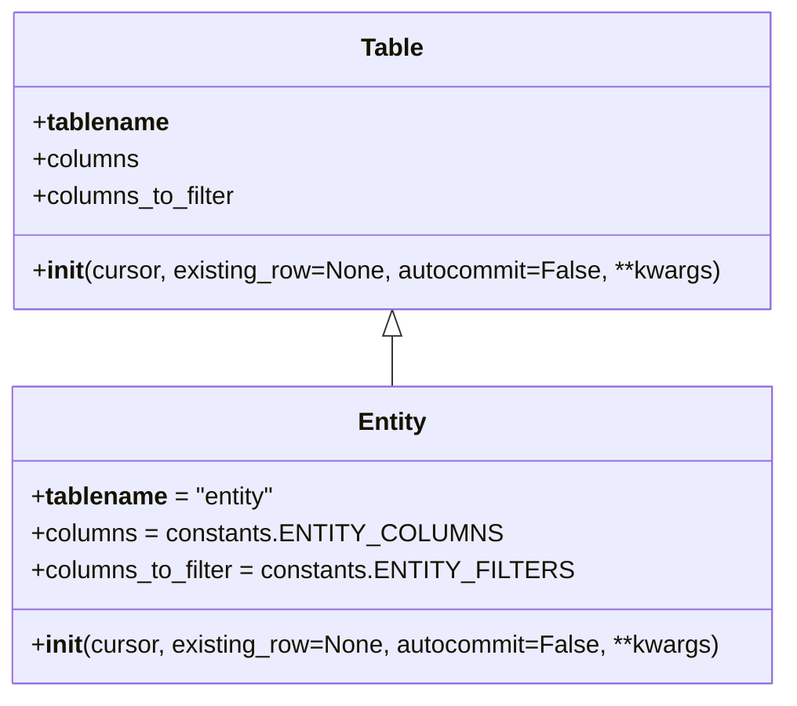

# Diagram: entity_core/entity_service/entity_service/db/tables/entity.py

> Auto-generated by Obscura crawlers

## Mermaid

### SVG

<svg id="container" width="505.515625" xmlns="http://www.w3.org/2000/svg" class="classDiagram" height="450" viewBox="0 0 505.515625 450" role="graphics-document document" aria-roledescription="class"><g><defs><marker id="container_class-aggregationStart" class="marker aggregation class" refX="18" refY="7" markerWidth="190" markerHeight="240" orient="auto"><path d="M 18,7 L9,13 L1,7 L9,1 Z"></path></marker></defs><defs><marker id="container_class-aggregationEnd" class="marker aggregation class" refX="1" refY="7" markerWidth="20" markerHeight="28" orient="auto"><path d="M 18,7 L9,13 L1,7 L9,1 Z"></path></marker></defs><defs><marker id="container_class-extensionStart" class="marker extension class" refX="18" refY="7" markerWidth="190" markerHeight="240" orient="auto"><path d="M 1,7 L18,13 V 1 Z"></path></marker></defs><defs><marker id="container_class-extensionEnd" class="marker extension class" refX="1" refY="7" markerWidth="20" markerHeight="28" orient="auto"><path d="M 1,1 V 13 L18,7 Z"></path></marker></defs><defs><marker id="container_class-compositionStart" class="marker composition class" refX="18" refY="7" markerWidth="190" markerHeight="240" orient="auto"><path d="M 18,7 L9,13 L1,7 L9,1 Z"></path></marker></defs><defs><marker id="container_class-compositionEnd" class="marker composition class" refX="1" refY="7" markerWidth="20" markerHeight="28" orient="auto"><path d="M 18,7 L9,13 L1,7 L9,1 Z"></path></marker></defs><defs><marker id="container_class-dependencyStart" class="marker dependency class" refX="6" refY="7" markerWidth="190" markerHeight="240" orient="auto"><path d="M 5,7 L9,13 L1,7 L9,1 Z"></path></marker></defs><defs><marker id="container_class-dependencyEnd" class="marker dependency class" refX="13" refY="7" markerWidth="20" markerHeight="28" orient="auto"><path d="M 18,7 L9,13 L14,7 L9,1 Z"></path></marker></defs><defs><marker id="container_class-lollipopStart" class="marker lollipop class" refX="13" refY="7" markerWidth="190" markerHeight="240" orient="auto"><circle stroke="black" fill="transparent" cx="7" cy="7" r="6"></circle></marker></defs><defs><marker id="container_class-lollipopEnd" class="marker lollipop class" refX="1" refY="7" markerWidth="190" markerHeight="240" orient="auto"><circle stroke="black" fill="transparent" cx="7" cy="7" r="6"></circle></marker></defs><g class="root"><g class="clusters"></g><g class="edgePaths"><path d="M252.758,217.25L252.758,218.542C252.758,219.833,252.758,222.417,252.758,227.875C252.758,233.333,252.758,241.667,252.758,245.833L252.758,250" id="id_Table_Entity_1" class="edge-thickness-normal edge-pattern-solid relation" style=";;;" data-edge="true" data-et="edge" data-id="id_Table_Entity_1" data-points="W3sieCI6MjUyLjc1NzgxMjUsInkiOjIwMH0seyJ4IjoyNTIuNzU3ODEyNSwieSI6MjI1fSx7IngiOjI1Mi43NTc4MTI1LCJ5IjoyNTB9XQ==" marker-start="url(#container_class-extensionStart)"></path></g><g class="edgeLabels"><g class="edgeLabel"><g class="label" data-id="id_Table_Entity_1" transform="translate(0, 0)"><foreignObject width="0" height="0">

</foreignObject></g></g></g><g class="nodes"><g class="node default" id="classId-Table-0" transform="translate(252.7578125, 104)"><g class="basic label-container"><path d="M-244.03515625 -96 L244.03515625 -96 L244.03515625 96 L-244.03515625 96" stroke="none" stroke-width="0" fill="#ECECFF" style=""></path><path d="M-244.03515625 -96 C-123.09695544741068 -96, -2.1587546448213573 -96, 244.03515625 -96 M-244.03515625 -96 C-60.316457561935806 -96, 123.40224112612839 -96, 244.03515625 -96 M244.03515625 -96 C244.03515625 -45.04239513681348, 244.03515625 5.915209726373035, 244.03515625 96 M244.03515625 -96 C244.03515625 -54.788043636454546, 244.03515625 -13.576087272909092, 244.03515625 96 M244.03515625 96 C84.56000184684007 96, -74.91515255631987 96, -244.03515625 96 M244.03515625 96 C135.05917754133336 96, 26.08319883266671 96, -244.03515625 96 M-244.03515625 96 C-244.03515625 52.72641186721892, -244.03515625 9.452823734437843, -244.03515625 -96 M-244.03515625 96 C-244.03515625 43.166977359227076, -244.03515625 -9.666045281545848, -244.03515625 -96" stroke="#9370DB" stroke-width="1.3" fill="none" stroke-dasharray="0 0" style=""></path></g><g class="annotation-group text" transform="translate(0, -72)"></g><g class="label-group text" transform="translate(-19.8359375, -72)"><g class="label" style="font-weight: bolder" transform="translate(0,-12)"><foreignObject width="39.671875" height="24">

Table

</foreignObject></g></g><g class="members-group text" transform="translate(-232.03515625, -24)"><g class="label" style="" transform="translate(0,-12)"><foreignObject width="86.15625" height="24">

+<strong>tablename</strong>

</foreignObject></g><g class="label" style="" transform="translate(0,12)"><foreignObject width="69.21875" height="24">

+columns

</foreignObject></g><g class="label" style="" transform="translate(0,36)"><foreignObject width="133.78125" height="24">

+columns_to_filter

</foreignObject></g></g><g class="methods-group text" transform="translate(-232.03515625, 72)"><g class="label" style="" transform="translate(0,-12)"><foreignObject width="444.234375" height="24">

+<strong>init</strong>(cursor, existing_row=None, autocommit=False, **kwargs)

</foreignObject></g></g><g class="divider" style=""><path d="M-244.03515625 -48 C-58.07872052208762 -48, 127.87771520582476 -48, 244.03515625 -48 M-244.03515625 -48 C-133.80176729456608 -48, -23.568378339132153 -48, 244.03515625 -48" stroke="#9370DB" stroke-width="1.3" fill="none" stroke-dasharray="0 0" style=""></path></g><g class="divider" style=""><path d="M-244.03515625 48 C-83.46951234990243 48, 77.09613155019514 48, 244.03515625 48 M-244.03515625 48 C-96.91094256555928 48, 50.21327111888144 48, 244.03515625 48" stroke="#9370DB" stroke-width="1.3" fill="none" stroke-dasharray="0 0" style=""></path></g></g><g class="node default" id="classId-Entity-1" transform="translate(252.7578125, 346)"><g class="basic label-container"><path d="M-244.7578125 -96 L244.7578125 -96 L244.7578125 96 L-244.7578125 96" stroke="none" stroke-width="0" fill="#ECECFF" style=""></path><path d="M-244.7578125 -96 C-75.65455003729676 -96, 93.44871242540648 -96, 244.7578125 -96 M-244.7578125 -96 C-86.94043912724953 -96, 70.87693424550093 -96, 244.7578125 -96 M244.7578125 -96 C244.7578125 -56.63781947869596, 244.7578125 -17.27563895739192, 244.7578125 96 M244.7578125 -96 C244.7578125 -41.62075199782629, 244.7578125 12.758496004347421, 244.7578125 96 M244.7578125 96 C122.96944973155361 96, 1.1810869631072194 96, -244.7578125 96 M244.7578125 96 C52.12553738721817 96, -140.50673772556365 96, -244.7578125 96 M-244.7578125 96 C-244.7578125 47.34078133084078, -244.7578125 -1.3184373383184465, -244.7578125 -96 M-244.7578125 96 C-244.7578125 29.94721452250036, -244.7578125 -36.10557095499928, -244.7578125 -96" stroke="#9370DB" stroke-width="1.3" fill="none" stroke-dasharray="0 0" style=""></path></g><g class="annotation-group text" transform="translate(0, -72)"></g><g class="label-group text" transform="translate(-21.28125, -72)"><g class="label" style="font-weight: bolder" transform="translate(0,-12)"><foreignObject width="42.5625" height="24">

Entity

</foreignObject></g></g><g class="members-group text" transform="translate(-232.7578125, -24)"><g class="label" style="" transform="translate(0,-12)"><foreignObject width="157.203125" height="24">

+<strong>tablename</strong> = "entity"

</foreignObject></g><g class="label" style="" transform="translate(0,12)"><foreignObject width="285.96875" height="24">

+columns = constants.ENTITY_COLUMNS

</foreignObject></g><g class="label" style="" transform="translate(0,36)"><foreignObject width="335.546875" height="24">

+columns_to_filter = constants.ENTITY_FILTERS

</foreignObject></g></g><g class="methods-group text" transform="translate(-232.7578125, 72)"><g class="label" style="" transform="translate(0,-12)"><foreignObject width="444.234375" height="24">

+<strong>init</strong>(cursor, existing_row=None, autocommit=False, **kwargs)

</foreignObject></g></g><g class="divider" style=""><path d="M-244.7578125 -48 C-141.32969193867538 -48, -37.90157137735076 -48, 244.7578125 -48 M-244.7578125 -48 C-125.57269419097273 -48, -6.387575881945452 -48, 244.7578125 -48" stroke="#9370DB" stroke-width="1.3" fill="none" stroke-dasharray="0 0" style=""></path></g><g class="divider" style=""><path d="M-244.7578125 48 C-64.36851104829907 48, 116.02079040340186 48, 244.7578125 48 M-244.7578125 48 C-67.02562538016207 48, 110.70656173967586 48, 244.7578125 48" stroke="#9370DB" stroke-width="1.3" fill="none" stroke-dasharray="0 0" style=""></path></g></g></g></g></g></svg>
