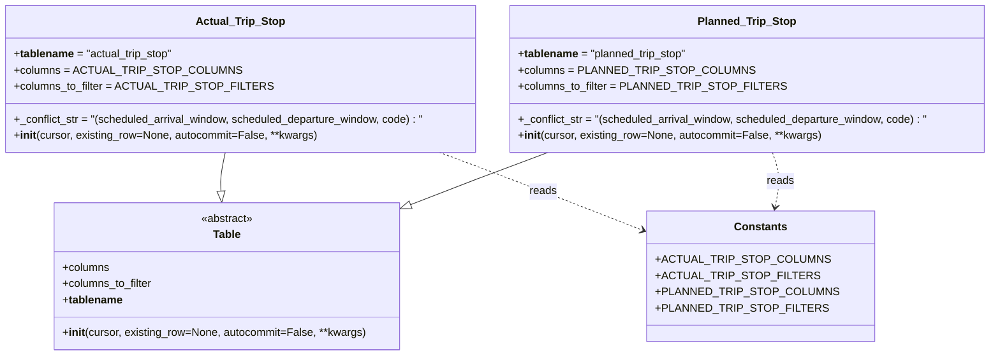

# Diagram: entity_core/entity_service/entity_service/db/tables/trip_leg.py

> Auto-generated by Obscura crawlers

## Mermaid

### SVG

<svg id="container" width="1464.3828125" xmlns="http://www.w3.org/2000/svg" class="classDiagram" height="522" viewBox="0 0 1464.3828125 522" role="graphics-document document" aria-roledescription="class"><g><defs><marker id="container_class-aggregationStart" class="marker aggregation class" refX="18" refY="7" markerWidth="190" markerHeight="240" orient="auto"><path d="M 18,7 L9,13 L1,7 L9,1 Z"></path></marker></defs><defs><marker id="container_class-aggregationEnd" class="marker aggregation class" refX="1" refY="7" markerWidth="20" markerHeight="28" orient="auto"><path d="M 18,7 L9,13 L1,7 L9,1 Z"></path></marker></defs><defs><marker id="container_class-extensionStart" class="marker extension class" refX="18" refY="7" markerWidth="190" markerHeight="240" orient="auto"><path d="M 1,7 L18,13 V 1 Z"></path></marker></defs><defs><marker id="container_class-extensionEnd" class="marker extension class" refX="1" refY="7" markerWidth="20" markerHeight="28" orient="auto"><path d="M 1,1 V 13 L18,7 Z"></path></marker></defs><defs><marker id="container_class-compositionStart" class="marker composition class" refX="18" refY="7" markerWidth="190" markerHeight="240" orient="auto"><path d="M 18,7 L9,13 L1,7 L9,1 Z"></path></marker></defs><defs><marker id="container_class-compositionEnd" class="marker composition class" refX="1" refY="7" markerWidth="20" markerHeight="28" orient="auto"><path d="M 18,7 L9,13 L1,7 L9,1 Z"></path></marker></defs><defs><marker id="container_class-dependencyStart" class="marker dependency class" refX="6" refY="7" markerWidth="190" markerHeight="240" orient="auto"><path d="M 5,7 L9,13 L1,7 L9,1 Z"></path></marker></defs><defs><marker id="container_class-dependencyEnd" class="marker dependency class" refX="13" refY="7" markerWidth="20" markerHeight="28" orient="auto"><path d="M 18,7 L9,13 L14,7 L9,1 Z"></path></marker></defs><defs><marker id="container_class-lollipopStart" class="marker lollipop class" refX="13" refY="7" markerWidth="190" markerHeight="240" orient="auto"><circle stroke="black" fill="transparent" cx="7" cy="7" r="6"></circle></marker></defs><defs><marker id="container_class-lollipopEnd" class="marker lollipop class" refX="1" refY="7" markerWidth="190" markerHeight="240" orient="auto"><circle stroke="black" fill="transparent" cx="7" cy="7" r="6"></circle></marker></defs><g class="root"><g class="clusters"></g><g class="edgePaths"><path d="M333.5,224L332.224,230.167C330.948,236.333,328.396,248.667,327.347,258.132C326.299,267.597,326.754,274.194,326.981,277.492L327.209,280.791" id="id_Actual_Trip_Stop_Table_1" class="edge-thickness-normal edge-pattern-solid relation" style=";;;" data-edge="true" data-et="edge" data-id="id_Actual_Trip_Stop_Table_1" data-points="W3sieCI6MzMzLjQ5OTkxOTE4MTAzNDUsInkiOjIyNH0seyJ4IjozMjUuODQzNzUsInkiOjI2MX0seyJ4IjozMjguMzk1NDc0MTM3OTMxMDUsInkiOjI5OH1d" marker-end="url(#container_class-extensionEnd)"></path><path d="M811.13,224L794.349,230.167C777.567,236.333,744.003,248.667,709.707,261.613C675.41,274.559,640.381,288.118,622.867,294.898L605.352,301.677" id="id_Planned_Trip_Stop_Table_2" class="edge-thickness-normal edge-pattern-solid relation" style=";;;" data-edge="true" data-et="edge" data-id="id_Planned_Trip_Stop_Table_2" data-points="W3sieCI6ODExLjEzMDM4NzkzMTAzNDQsInkiOjIyNH0seyJ4Ijo3MTAuNDM5NDUzMTI1LCJ5IjoyNjF9LHsieCI6NTg5LjI2NTYyNSwieSI6MzA3LjkwNDQ0OTA2NzQ4NDJ9XQ==" marker-end="url(#container_class-extensionEnd)"></path><path d="M649.756,224L666.538,230.167C683.32,236.333,716.884,248.667,770.713,269.174C824.542,289.681,898.638,318.362,935.685,332.703L972.733,347.043" id="id_Actual_Trip_Stop_Constants_3" class="edge-thickness-normal edge-pattern-dashed relation" style=";;;" data-edge="true" data-et="edge" data-id="id_Actual_Trip_Stop_Constants_3" data-points="W3sieCI6NjQ5Ljc1NjMzMDgxODk2NTYsInkiOjIyNH0seyJ4Ijo3NTAuNDQ3MjY1NjI1LCJ5IjoyNjF9LHsieCI6OTc4LjMyODEyNSwieSI6MzQ5LjIwOTAzMjY1NDk5Nzh9XQ==" marker-end="url(#container_class-dependencyEnd)"></path><path d="M1142.289,224L1144.416,230.167C1146.543,236.333,1150.797,248.667,1151.436,262.021C1152.076,275.375,1149.101,289.75,1147.614,296.937L1146.126,304.125" id="id_Planned_Trip_Stop_Constants_4" class="edge-thickness-normal edge-pattern-dashed relation" style=";;;" data-edge="true" data-et="edge" data-id="id_Planned_Trip_Stop_Constants_4" data-points="W3sieCI6MTE0Mi4yODkxNzAyNTg2MjA3LCJ5IjoyMjR9LHsieCI6MTE1NS4wNTA3ODEyNSwieSI6MjYxfSx7IngiOjExNDQuOTEwMjEwMTI5MzEwNCwieSI6MzEwfV0=" marker-end="url(#container_class-dependencyEnd)"></path></g><g class="edgeLabels"><g class="edgeLabel"><g class="label" data-id="id_Actual_Trip_Stop_Table_1" transform="translate(0, 0)"><foreignObject width="0" height="0">

</foreignObject></g></g><g class="edgeLabel"><g class="label" data-id="id_Planned_Trip_Stop_Table_2" transform="translate(0, 0)"><foreignObject width="0" height="0">

</foreignObject></g></g><g class="edgeLabel" transform="translate(814.36743, 285.74247)"><g class="label" data-id="id_Actual_Trip_Stop_Constants_3" transform="translate(-20.0078125, -12)"><foreignObject width="40.015625" height="24">

reads

</foreignObject></g></g><g class="edgeLabel" transform="translate(1153.94637, 266.33658)"><g class="label" data-id="id_Planned_Trip_Stop_Constants_4" transform="translate(-20.0078125, -12)"><foreignObject width="40.015625" height="24">

reads

</foreignObject></g></g></g><g class="nodes"><g class="node default" id="classId-Table-0" transform="translate(335.84375, 406)"><g class="basic label-container"><path d="M-253.421875 -108 L253.421875 -108 L253.421875 108 L-253.421875 108" stroke="none" stroke-width="0" fill="#ECECFF" style=""></path><path d="M-253.421875 -108 C-118.98340658621845 -108, 15.4550618275631 -108, 253.421875 -108 M-253.421875 -108 C-107.20522873043609 -108, 39.01141753912782 -108, 253.421875 -108 M253.421875 -108 C253.421875 -22.711889942903255, 253.421875 62.57622011419349, 253.421875 108 M253.421875 -108 C253.421875 -32.92229245021002, 253.421875 42.155415099579955, 253.421875 108 M253.421875 108 C77.33220478862347 108, -98.75746542275306 108, -253.421875 108 M253.421875 108 C134.47142673761792 108, 15.520978475235836 108, -253.421875 108 M-253.421875 108 C-253.421875 43.092565315380895, -253.421875 -21.81486936923821, -253.421875 -108 M-253.421875 108 C-253.421875 62.352038066056544, -253.421875 16.704076132113087, -253.421875 -108" stroke="#9370DB" stroke-width="1.3" fill="none" stroke-dasharray="0 0" style=""></path></g><g class="annotation-group text" transform="translate(-38.609375, -84)"><g class="label" style="" transform="translate(0,-12)"><foreignObject width="77.21875" height="24">

«abstract»

</foreignObject></g></g><g class="label-group text" transform="translate(-19.8359375, -60)"><g class="label" style="font-weight: bolder" transform="translate(0,-12)"><foreignObject width="39.671875" height="24">

Table

</foreignObject></g></g><g class="members-group text" transform="translate(-241.421875, -12)"><g class="label" style="" transform="translate(0,-12)"><foreignObject width="69.21875" height="24">

+columns

</foreignObject></g><g class="label" style="" transform="translate(0,12)"><foreignObject width="133.78125" height="24">

+columns_to_filter

</foreignObject></g><g class="label" style="" transform="translate(0,36)"><foreignObject width="86.15625" height="24">

+<strong>tablename</strong>

</foreignObject></g></g><g class="methods-group text" transform="translate(-241.421875, 84)"><g class="label" style="" transform="translate(0,-12)"><foreignObject width="444.234375" height="24">

+<strong>init</strong>(cursor, existing_row=None, autocommit=False, **kwargs)

</foreignObject></g></g><g class="divider" style=""><path d="M-253.421875 -36 C-72.70083553698939 -36, 108.02020392602122 -36, 253.421875 -36 M-253.421875 -36 C-50.84115399418758 -36, 151.73956701162484 -36, 253.421875 -36" stroke="#9370DB" stroke-width="1.3" fill="none" stroke-dasharray="0 0" style=""></path></g><g class="divider" style=""><path d="M-253.421875 60 C-90.04778516414302 60, 73.32630467171396 60, 253.421875 60 M-253.421875 60 C-80.341028104392 60, 92.73981879121601 60, 253.421875 60" stroke="#9370DB" stroke-width="1.3" fill="none" stroke-dasharray="0 0" style=""></path></g></g><g class="node default" id="classId-Constants-1" transform="translate(1125.04296875, 406)"><g class="basic label-container"><path d="M-146.71484375 -96 L146.71484375 -96 L146.71484375 96 L-146.71484375 96" stroke="none" stroke-width="0" fill="#ECECFF" style=""></path><path d="M-146.71484375 -96 C-52.721725353465345 -96, 41.27139304306931 -96, 146.71484375 -96 M-146.71484375 -96 C-66.4202414939618 -96, 13.874360762076407 -96, 146.71484375 -96 M146.71484375 -96 C146.71484375 -43.56643136034407, 146.71484375 8.867137279311862, 146.71484375 96 M146.71484375 -96 C146.71484375 -48.72574248963087, 146.71484375 -1.4514849792617355, 146.71484375 96 M146.71484375 96 C76.69808068206825 96, 6.681317614136503 96, -146.71484375 96 M146.71484375 96 C31.514047516242613 96, -83.68674871751477 96, -146.71484375 96 M-146.71484375 96 C-146.71484375 57.426820199991695, -146.71484375 18.85364039998339, -146.71484375 -96 M-146.71484375 96 C-146.71484375 56.05736818338623, -146.71484375 16.114736366772462, -146.71484375 -96" stroke="#9370DB" stroke-width="1.3" fill="none" stroke-dasharray="0 0" style=""></path></g><g class="annotation-group text" transform="translate(0, -72)"></g><g class="label-group text" transform="translate(-36.5390625, -72)"><g class="label" style="font-weight: bolder" transform="translate(0,-12)"><foreignObject width="73.078125" height="24">

Constants

</foreignObject></g></g><g class="members-group text" transform="translate(-134.71484375, -24)"><g class="label" style="" transform="translate(0,-12)"><foreignObject width="219.859375" height="24">

+ACTUAL_TRIP_STOP_COLUMNS

</foreignObject></g><g class="label" style="" transform="translate(0,12)"><foreignObject width="204.875" height="24">

+ACTUAL_TRIP_STOP_FILTERS

</foreignObject></g><g class="label" style="" transform="translate(0,36)"><foreignObject width="232.890625" height="24">

+PLANNED_TRIP_STOP_COLUMNS

</foreignObject></g><g class="label" style="" transform="translate(0,60)"><foreignObject width="217.890625" height="24">

+PLANNED_TRIP_STOP_FILTERS

</foreignObject></g></g><g class="methods-group text" transform="translate(-134.71484375, 96)"></g><g class="divider" style=""><path d="M-146.71484375 -48 C-31.552333527977794 -48, 83.61017669404441 -48, 146.71484375 -48 M-146.71484375 -48 C-85.334526366916 -48, -23.95420898383199 -48, 146.71484375 -48" stroke="#9370DB" stroke-width="1.3" fill="none" stroke-dasharray="0 0" style=""></path></g><g class="divider" style=""><path d="M-146.71484375 72 C-50.059958190500396 72, 46.59492736899921 72, 146.71484375 72 M-146.71484375 72 C-78.689812806601 72, -10.664781863201995 72, 146.71484375 72" stroke="#9370DB" stroke-width="1.3" fill="none" stroke-dasharray="0 0" style=""></path></g></g><g class="node default" id="classId-Actual_Trip_Stop-2" transform="translate(355.84765625, 116)"><g class="basic label-container"><path d="M-347.84765625 -108 L347.84765625 -108 L347.84765625 108 L-347.84765625 108" stroke="none" stroke-width="0" fill="#ECECFF" style=""></path><path d="M-347.84765625 -108 C-202.05664917036577 -108, -56.265642090731546 -108, 347.84765625 -108 M-347.84765625 -108 C-128.78624977372485 -108, 90.2751567025503 -108, 347.84765625 -108 M347.84765625 -108 C347.84765625 -55.1596770834761, 347.84765625 -2.319354166952195, 347.84765625 108 M347.84765625 -108 C347.84765625 -58.50523358588511, 347.84765625 -9.010467171770216, 347.84765625 108 M347.84765625 108 C96.65580253384573 108, -154.53605118230854 108, -347.84765625 108 M347.84765625 108 C110.22795411031788 108, -127.39174802936424 108, -347.84765625 108 M-347.84765625 108 C-347.84765625 42.901350151751785, -347.84765625 -22.19729969649643, -347.84765625 -108 M-347.84765625 108 C-347.84765625 28.90807596537394, -347.84765625 -50.18384806925212, -347.84765625 -108" stroke="#9370DB" stroke-width="1.3" fill="none" stroke-dasharray="0 0" style=""></path></g><g class="annotation-group text" transform="translate(0, -84)"></g><g class="label-group text" transform="translate(-61.7890625, -84)"><g class="label" style="font-weight: bolder" transform="translate(0,-12)"><foreignObject width="123.578125" height="24">

Actual_Trip_Stop

</foreignObject></g></g><g class="members-group text" transform="translate(-335.84765625, -36)"><g class="label" style="" transform="translate(0,-12)"><foreignObject width="233.515625" height="24">

+<strong>tablename</strong> = "actual_trip_stop"

</foreignObject></g><g class="label" style="" transform="translate(0,12)"><foreignObject width="297.734375" height="24">

+columns = ACTUAL_TRIP_STOP_COLUMNS

</foreignObject></g><g class="label" style="" transform="translate(0,36)"><foreignObject width="347.296875" height="24">

+columns_to_filter = ACTUAL_TRIP_STOP_FILTERS

</foreignObject></g></g><g class="methods-group text" transform="translate(-335.84765625, 60)"><g class="label" style="" transform="translate(0,-12)"><foreignObject width="609.90625" height="24">

+_conflict_str = "(scheduled_arrival_window, scheduled_departure_window, code) : "

</foreignObject></g><g class="label" style="" transform="translate(0,12)"><foreignObject width="444.234375" height="24">

+<strong>init</strong>(cursor, existing_row=None, autocommit=False, **kwargs)

</foreignObject></g></g><g class="divider" style=""><path d="M-347.84765625 -60 C-190.32359996563838 -60, -32.79954368127676 -60, 347.84765625 -60 M-347.84765625 -60 C-120.32291815737432 -60, 107.20181993525136 -60, 347.84765625 -60" stroke="#9370DB" stroke-width="1.3" fill="none" stroke-dasharray="0 0" style=""></path></g><g class="divider" style=""><path d="M-347.84765625 36 C-98.17269323193167 36, 151.50226978613665 36, 347.84765625 36 M-347.84765625 36 C-187.78797253591046 36, -27.72828882182091 36, 347.84765625 36" stroke="#9370DB" stroke-width="1.3" fill="none" stroke-dasharray="0 0" style=""></path></g></g><g class="node default" id="classId-Planned_Trip_Stop-3" transform="translate(1105.0390625, 116)"><g class="basic label-container"><path d="M-351.34375 -108 L351.34375 -108 L351.34375 108 L-351.34375 108" stroke="none" stroke-width="0" fill="#ECECFF" style=""></path><path d="M-351.34375 -108 C-167.56842843232866 -108, 16.206893135342682 -108, 351.34375 -108 M-351.34375 -108 C-152.27116857586273 -108, 46.80141284827454 -108, 351.34375 -108 M351.34375 -108 C351.34375 -57.10832319187937, 351.34375 -6.216646383758743, 351.34375 108 M351.34375 -108 C351.34375 -41.02769625300111, 351.34375 25.94460749399778, 351.34375 108 M351.34375 108 C104.11792592596157 108, -143.10789814807686 108, -351.34375 108 M351.34375 108 C187.14904561508052 108, 22.95434123016105 108, -351.34375 108 M-351.34375 108 C-351.34375 57.46043595729176, -351.34375 6.920871914583515, -351.34375 -108 M-351.34375 108 C-351.34375 26.26117057026795, -351.34375 -55.4776588594641, -351.34375 -108" stroke="#9370DB" stroke-width="1.3" fill="none" stroke-dasharray="0 0" style=""></path></g><g class="annotation-group text" transform="translate(0, -84)"></g><g class="label-group text" transform="translate(-68.78125, -84)"><g class="label" style="font-weight: bolder" transform="translate(0,-12)"><foreignObject width="137.5625" height="24">

Planned_Trip_Stop

</foreignObject></g></g><g class="members-group text" transform="translate(-339.34375, -36)"><g class="label" style="" transform="translate(0,-12)"><foreignObject width="248.9375" height="24">

+<strong>tablename</strong> = "planned_trip_stop"

</foreignObject></g><g class="label" style="" transform="translate(0,12)"><foreignObject width="310.59375" height="24">

+columns = PLANNED_TRIP_STOP_COLUMNS

</foreignObject></g><g class="label" style="" transform="translate(0,36)"><foreignObject width="360.171875" height="24">

+columns_to_filter = PLANNED_TRIP_STOP_FILTERS

</foreignObject></g></g><g class="methods-group text" transform="translate(-339.34375, 60)"><g class="label" style="" transform="translate(0,-12)"><foreignObject width="609.90625" height="24">

+_conflict_str = "(scheduled_arrival_window, scheduled_departure_window, code) : "

</foreignObject></g><g class="label" style="" transform="translate(0,12)"><foreignObject width="444.234375" height="24">

+<strong>init</strong>(cursor, existing_row=None, autocommit=False, **kwargs)

</foreignObject></g></g><g class="divider" style=""><path d="M-351.34375 -60 C-109.14307192938108 -60, 133.05760614123784 -60, 351.34375 -60 M-351.34375 -60 C-139.2933605273649 -60, 72.75702894527018 -60, 351.34375 -60" stroke="#9370DB" stroke-width="1.3" fill="none" stroke-dasharray="0 0" style=""></path></g><g class="divider" style=""><path d="M-351.34375 36 C-171.30120697745878 36, 8.741336045082448 36, 351.34375 36 M-351.34375 36 C-195.60675249095436 36, -39.86975498190873 36, 351.34375 36" stroke="#9370DB" stroke-width="1.3" fill="none" stroke-dasharray="0 0" style=""></path></g></g></g></g></g></svg>
