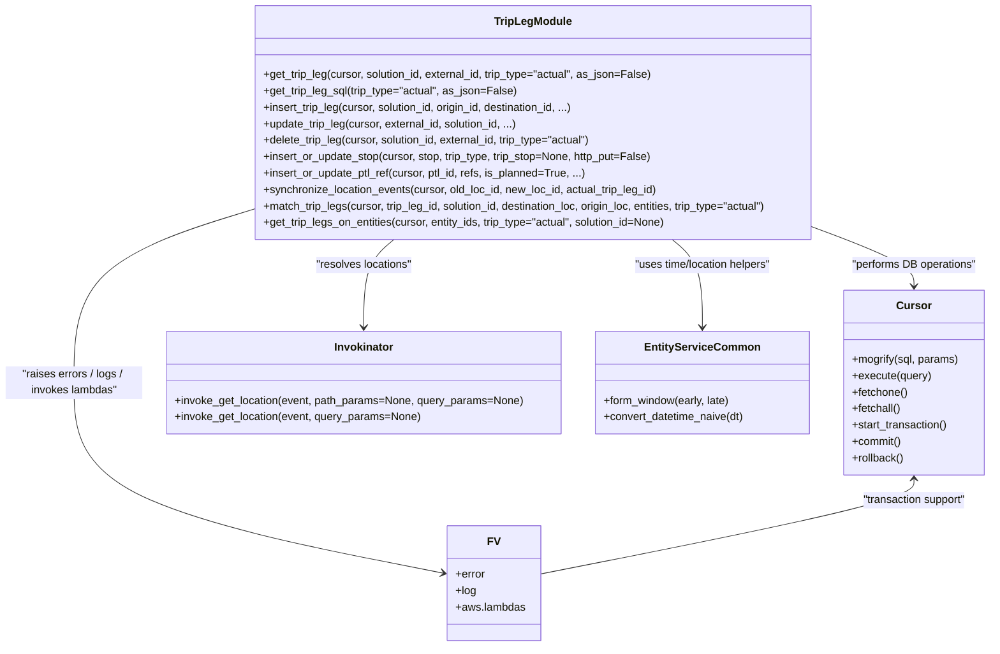
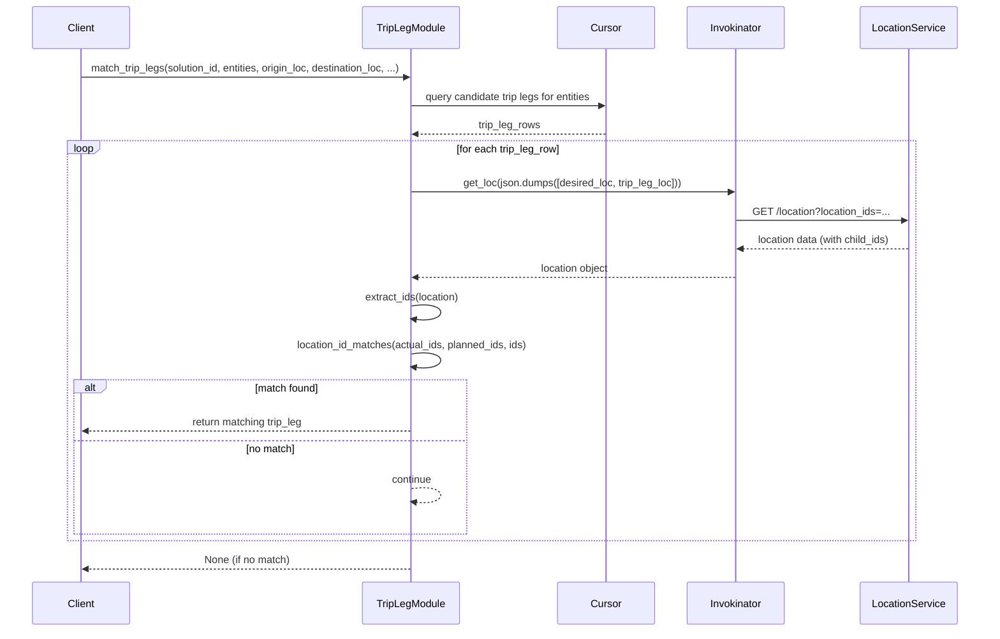

# Diagram: entity_core/entity_service/entity_service/db/trip_leg.py


> Auto-generated by Obscura crawlers

## Diagram 1



### SVG

<svg id="container" width="1445.7734375" xmlns="http://www.w3.org/2000/svg" class="classDiagram" height="968" viewBox="0 0 1445.7734375 968" role="graphics-document document" aria-roledescription="class"><style>#container{font-family:"trebuchet ms",verdana,arial,sans-serif;font-size:16px;fill:#333;}@keyframes edge-animation-frame{from{stroke-dashoffset:0;}}@keyframes dash{to{stroke-dashoffset:0;}}#container .edge-animation-slow{stroke-dasharray:9,5!important;stroke-dashoffset:900;animation:dash 50s linear infinite;stroke-linecap:round;}#container .edge-animation-fast{stroke-dasharray:9,5!important;stroke-dashoffset:900;animation:dash 20s linear infinite;stroke-linecap:round;}#container .error-icon{fill:#552222;}#container .error-text{fill:#552222;stroke:#552222;}#container .edge-thickness-normal{stroke-width:1px;}#container .edge-thickness-thick{stroke-width:3.5px;}#container .edge-pattern-solid{stroke-dasharray:0;}#container .edge-thickness-invisible{stroke-width:0;fill:none;}#container .edge-pattern-dashed{stroke-dasharray:3;}#container .edge-pattern-dotted{stroke-dasharray:2;}#container .marker{fill:#333333;stroke:#333333;}#container .marker.cross{stroke:#333333;}#container svg{font-family:"trebuchet ms",verdana,arial,sans-serif;font-size:16px;}#container p{margin:0;}#container g.classGroup text{fill:#9370DB;stroke:none;font-family:"trebuchet ms",verdana,arial,sans-serif;font-size:10px;}#container g.classGroup text .title{font-weight:bolder;}#container .nodeLabel,#container .edgeLabel{color:#131300;}#container .edgeLabel .label rect{fill:#ECECFF;}#container .label text{fill:#131300;}#container .labelBkg{background:#ECECFF;}#container .edgeLabel .label span{background:#ECECFF;}#container .classTitle{font-weight:bolder;}#container .node rect,#container .node circle,#container .node ellipse,#container .node polygon,#container .node path{fill:#ECECFF;stroke:#9370DB;stroke-width:1px;}#container .divider{stroke:#9370DB;stroke-width:1;}#container g.clickable{cursor:pointer;}#container g.classGroup rect{fill:#ECECFF;stroke:#9370DB;}#container g.classGroup line{stroke:#9370DB;stroke-width:1;}#container .classLabel .box{stroke:none;stroke-width:0;fill:#ECECFF;opacity:0.5;}#container .classLabel .label{fill:#9370DB;font-size:10px;}#container .relation{stroke:#333333;stroke-width:1;fill:none;}#container .dashed-line{stroke-dasharray:3;}#container .dotted-line{stroke-dasharray:1 2;}#container #compositionStart,#container .composition{fill:#333333!important;stroke:#333333!important;stroke-width:1;}#container #compositionEnd,#container .composition{fill:#333333!important;stroke:#333333!important;stroke-width:1;}#container #dependencyStart,#container .dependency{fill:#333333!important;stroke:#333333!important;stroke-width:1;}#container #dependencyStart,#container .dependency{fill:#333333!important;stroke:#333333!important;stroke-width:1;}#container #extensionStart,#container .extension{fill:transparent!important;stroke:#333333!important;stroke-width:1;}#container #extensionEnd,#container .extension{fill:transparent!important;stroke:#333333!important;stroke-width:1;}#container #aggregationStart,#container .aggregation{fill:transparent!important;stroke:#333333!important;stroke-width:1;}#container #aggregationEnd,#container .aggregation{fill:transparent!important;stroke:#333333!important;stroke-width:1;}#container #lollipopStart,#container .lollipop{fill:#ECECFF!important;stroke:#333333!important;stroke-width:1;}#container #lollipopEnd,#container .lollipop{fill:#ECECFF!important;stroke:#333333!important;stroke-width:1;}#container .edgeTerminals{font-size:11px;line-height:initial;}#container .classTitleText{text-anchor:middle;font-size:18px;fill:#333;}#container .label-icon{display:inline-block;height:1em;overflow:visible;vertical-align:-0.125em;}#container .node .label-icon path{fill:currentColor;stroke:revert;stroke-width:revert;}#container :root{--mermaid-font-family:"trebuchet ms",verdana,arial,sans-serif;}</style><g><defs><marker id="container_class-aggregationStart" class="marker aggregation class" refX="18" refY="7" markerWidth="190" markerHeight="240" orient="auto"><path d="M 18,7 L9,13 L1,7 L9,1 Z"></path></marker></defs><defs><marker id="container_class-aggregationEnd" class="marker aggregation class" refX="1" refY="7" markerWidth="20" markerHeight="28" orient="auto"><path d="M 18,7 L9,13 L1,7 L9,1 Z"></path></marker></defs><defs><marker id="container_class-extensionStart" class="marker extension class" refX="18" refY="7" markerWidth="190" markerHeight="240" orient="auto"><path d="M 1,7 L18,13 V 1 Z"></path></marker></defs><defs><marker id="container_class-extensionEnd" class="marker extension class" refX="1" refY="7" markerWidth="20" markerHeight="28" orient="auto"><path d="M 1,1 V 13 L18,7 Z"></path></marker></defs><defs><marker id="container_class-compositionStart" class="marker composition class" refX="18" refY="7" markerWidth="190" markerHeight="240" orient="auto"><path d="M 18,7 L9,13 L1,7 L9,1 Z"></path></marker></defs><defs><marker id="container_class-compositionEnd" class="marker composition class" refX="1" refY="7" markerWidth="20" markerHeight="28" orient="auto"><path d="M 18,7 L9,13 L1,7 L9,1 Z"></path></marker></defs><defs><marker id="container_class-dependencyStart" class="marker dependency class" refX="6" refY="7" markerWidth="190" markerHeight="240" orient="auto"><path d="M 5,7 L9,13 L1,7 L9,1 Z"></path></marker></defs><defs><marker id="container_class-dependencyEnd" class="marker dependency class" refX="13" refY="7" markerWidth="20" markerHeight="28" orient="auto"><path d="M 18,7 L9,13 L14,7 L9,1 Z"></path></marker></defs><defs><marker id="container_class-lollipopStart" class="marker lollipop class" refX="13" refY="7" markerWidth="190" markerHeight="240" orient="auto"><circle stroke="black" fill="transparent" cx="7" cy="7" r="6"></circle></marker></defs><defs><marker id="container_class-lollipopEnd" class="marker lollipop class" refX="1" refY="7" markerWidth="190" markerHeight="240" orient="auto"><circle stroke="black" fill="transparent" cx="7" cy="7" r="6"></circle></marker></defs><g class="root"><g class="clusters"></g><g class="edgePaths"><path d="M1197.096,344.333L1220.127,353.444C1243.158,362.555,1289.219,380.778,1312.25,397.055C1335.281,413.333,1335.281,427.667,1335.281,434.833L1335.281,442" id="id_TripLegModule_Cursor_1" class="edge-thickness-normal edge-pattern-solid relation" style=";;;" data-edge="true" data-et="edge" data-id="id_TripLegModule_Cursor_1" data-points="W3sieCI6MTE5Ny4wOTU3MDMxMjUsInkiOjM0NC4zMzI4Mjc1ODU3MjI1fSx7IngiOjEzMzUuMjgxMjUsInkiOjM5OX0seyJ4IjoxMzM1LjI4MTI1LCJ5Ijo0NDh9XQ==" marker-end="url(#container_class-dependencyEnd)"></path><path d="M971.508,350L980.693,358.167C989.879,366.333,1008.25,382.667,1017.436,408C1026.621,433.333,1026.621,467.667,1026.621,484.833L1026.621,502" id="id_TripLegModule_EntityServiceCommon_2" class="edge-thickness-normal edge-pattern-solid relation" style=";;;" data-edge="true" data-et="edge" data-id="id_TripLegModule_EntityServiceCommon_2" data-points="W3sieCI6OTcxLjUwNzgzOTEzMzUyMjgsInkiOjM1MH0seyJ4IjoxMDI2LjYyMTA5Mzc1LCJ5IjozOTl9LHsieCI6MTAyNi42MjEwOTM3NSwieSI6NTA4fV0=" marker-end="url(#container_class-dependencyEnd)"></path><path d="M586.84,350L577.654,358.167C568.469,366.333,550.098,382.667,540.912,408C531.727,433.333,531.727,467.667,531.727,484.833L531.727,502" id="id_TripLegModule_Invokinator_3" class="edge-thickness-normal edge-pattern-solid relation" style=";;;" data-edge="true" data-et="edge" data-id="id_TripLegModule_Invokinator_3" data-points="W3sieCI6NTg2LjgzOTgxNzExNjQ3NzIsInkiOjM1MH0seyJ4Ijo1MzEuNzI2NTYyNSwieSI6Mzk5fSx7IngiOjUzMS43MjY1NjI1LCJ5Ijo1MDh9XQ==" marker-end="url(#container_class-dependencyEnd)"></path><path d="M361.252,315.988L319.043,329.823C276.835,343.659,192.417,371.329,150.209,415.831C108,460.333,108,521.667,108,581C108,640.333,108,697.667,198.148,744.109C288.297,790.552,468.594,826.103,558.742,843.879L648.891,861.655" id="id_TripLegModule_FV_4" class="edge-thickness-normal edge-pattern-solid relation" style=";;;" data-edge="true" data-et="edge" data-id="id_TripLegModule_FV_4" data-points="W3sieCI6MzYxLjI1MTk1MzEyNSwieSI6MzE1Ljk4ODA3NzY3NDA4NDI1fSx7IngiOjEwOCwieSI6Mzk5fSx7IngiOjEwOCwieSI6NTgzfSx7IngiOjEwOCwieSI6NzU1fSx7IngiOjY1NC43NzczNDM3NSwieSI6ODYyLjgxNTY0MzA2MjY2Mzl9XQ==" marker-end="url(#container_class-dependencyEnd)"></path><path d="M1335.281,724L1335.281,729.167C1335.281,734.333,1335.281,744.667,1244.152,767.803C1153.022,790.939,970.763,826.877,879.633,844.846L788.504,862.816" id="id_Cursor_FV_5" class="edge-thickness-normal edge-pattern-solid relation" style=";;;" data-edge="true" data-et="edge" data-id="id_Cursor_FV_5" data-points="W3sieCI6MTMzNS4yODEyNSwieSI6NzE4fSx7IngiOjEzMzUuMjgxMjUsInkiOjc1NX0seyJ4Ijo3ODguNTAzOTA2MjUsInkiOjg2Mi44MTU2NDMwNjI2NjM5fV0=" marker-start="url(#container_class-dependencyStart)"></path></g><g class="edgeLabels"><g class="edgeLabel" transform="translate(1335.28125, 399)"><g class="label" data-id="id_TripLegModule_Cursor_1" transform="translate(-92.859375, -12)"><foreignObject width="185.71875" height="24"><div xmlns="http://www.w3.org/1999/xhtml" class="labelBkg" style="display: table-cell; white-space: nowrap; line-height: 1.5; max-width: 200px; text-align: center;"><span class="edgeLabel"><p>"performs DB operations"</p></span></div></foreignObject></g></g><g class="edgeLabel" transform="translate(1026.62109375, 399)"><g class="label" data-id="id_TripLegModule_EntityServiceCommon_2" transform="translate(-100, -24)"><foreignObject width="200" height="48"><div xmlns="http://www.w3.org/1999/xhtml" class="labelBkg" style="display: table; white-space: break-spaces; line-height: 1.5; max-width: 200px; text-align: center; width: 200px;"><span class="edgeLabel"><p>"uses time/location helpers"</p></span></div></foreignObject></g></g><g class="edgeLabel" transform="translate(531.7265625, 399)"><g class="label" data-id="id_TripLegModule_Invokinator_3" transform="translate(-71.578125, -12)"><foreignObject width="143.15625" height="24"><div xmlns="http://www.w3.org/1999/xhtml" class="labelBkg" style="display: table-cell; white-space: nowrap; line-height: 1.5; max-width: 200px; text-align: center;"><span class="edgeLabel"><p>"resolves locations"</p></span></div></foreignObject></g></g><g class="edgeLabel" transform="translate(108, 583)"><g class="label" data-id="id_TripLegModule_FV_4" transform="translate(-100, -24)"><foreignObject width="200" height="48"><div xmlns="http://www.w3.org/1999/xhtml" class="labelBkg" style="display: table; white-space: break-spaces; line-height: 1.5; max-width: 200px; text-align: center; width: 200px;"><span class="edgeLabel"><p>"raises errors / logs / invokes lambdas"</p></span></div></foreignObject></g></g><g class="edgeLabel" transform="translate(1335.28125, 755)"><g class="label" data-id="id_Cursor_FV_5" transform="translate(-78.0859375, -12)"><foreignObject width="156.171875" height="24"><div xmlns="http://www.w3.org/1999/xhtml" class="labelBkg" style="display: table-cell; white-space: nowrap; line-height: 1.5; max-width: 200px; text-align: center;"><span class="edgeLabel"><p>"transaction support"</p></span></div></foreignObject></g></g></g><g class="nodes"><g class="node default" id="classId-TripLegModule-0" transform="translate(779.173828125, 179)"><g class="basic label-container"><path d="M-417.921875 -171 L417.921875 -171 L417.921875 171 L-417.921875 171" stroke="none" stroke-width="0" fill="#ECECFF" style=""></path><path d="M-417.921875 -171 C-236.9764132445796 -171, -56.03095148915918 -171, 417.921875 -171 M-417.921875 -171 C-110.7321173694258 -171, 196.4576402611484 -171, 417.921875 -171 M417.921875 -171 C417.921875 -59.96844737121148, 417.921875 51.063105257577035, 417.921875 171 M417.921875 -171 C417.921875 -63.168369432938746, 417.921875 44.66326113412251, 417.921875 171 M417.921875 171 C120.07134683611179 171, -177.77918132777643 171, -417.921875 171 M417.921875 171 C87.07891430589609 171, -243.76404638820782 171, -417.921875 171 M-417.921875 171 C-417.921875 35.97452861349953, -417.921875 -99.05094277300094, -417.921875 -171 M-417.921875 171 C-417.921875 45.93491754669469, -417.921875 -79.13016490661062, -417.921875 -171" stroke="#9370DB" stroke-width="1.3" fill="none" stroke-dasharray="0 0" style=""></path></g><g class="annotation-group text" transform="translate(0, -147)"></g><g class="label-group text" transform="translate(-54.140625, -147)"><g class="label" style="font-weight: bolder" transform="translate(0,-12)"><foreignObject width="108.28125" height="24"><div xmlns="http://www.w3.org/1999/xhtml" style="display: table-cell; white-space: nowrap; line-height: 1.5; max-width: 157px; text-align: center;"><span class="nodeLabel markdown-node-label" style=""><p>TripLegModule</p></span></div></foreignObject></g></g><g class="members-group text" transform="translate(-405.921875, -99)"></g><g class="methods-group text" transform="translate(-405.921875, -69)"><g class="label" style="" transform="translate(0,-12)"><foreignObject width="573.53125" height="24"><div xmlns="http://www.w3.org/1999/xhtml" style="display: table-cell; white-space: nowrap; line-height: 1.5; max-width: 631px; text-align: center;"><span class="nodeLabel markdown-node-label" style=""><p>+get_trip_leg(cursor, solution_id, external_id, trip_type="actual", as_json=False)</p></span></div></foreignObject></g><g class="label" style="" transform="translate(0,12)"><foreignObject width="370.953125" height="24"><div xmlns="http://www.w3.org/1999/xhtml" style="display: table-cell; white-space: nowrap; line-height: 1.5; max-width: 428px; text-align: center;"><span class="nodeLabel markdown-node-label" style=""><p>+get_trip_leg_sql(trip_type="actual", as_json=False)</p></span></div></foreignObject></g><g class="label" style="" transform="translate(0,36)"><foreignObject width="464.53125" height="24"><div xmlns="http://www.w3.org/1999/xhtml" style="display: table-cell; white-space: nowrap; line-height: 1.5; max-width: 522px; text-align: center;"><span class="nodeLabel markdown-node-label" style=""><p>+insert_trip_leg(cursor, solution_id, origin_id, destination_id, ...)</p></span></div></foreignObject></g><g class="label" style="" transform="translate(0,60)"><foreignObject width="377.046875" height="24"><div xmlns="http://www.w3.org/1999/xhtml" style="display: table-cell; white-space: nowrap; line-height: 1.5; max-width: 434px; text-align: center;"><span class="nodeLabel markdown-node-label" style=""><p>+update_trip_leg(cursor, external_id, solution_id, ...)</p></span></div></foreignObject></g><g class="label" style="" transform="translate(0,84)"><foreignObject width="490.453125" height="24"><div xmlns="http://www.w3.org/1999/xhtml" style="display: table-cell; white-space: nowrap; line-height: 1.5; max-width: 548px; text-align: center;"><span class="nodeLabel markdown-node-label" style=""><p>+delete_trip_leg(cursor, solution_id, external_id, trip_type="actual")</p></span></div></foreignObject></g><g class="label" style="" transform="translate(0,108)"><foreignObject width="574.953125" height="24"><div xmlns="http://www.w3.org/1999/xhtml" style="display: table-cell; white-space: nowrap; line-height: 1.5; max-width: 632px; text-align: center;"><span class="nodeLabel markdown-node-label" style=""><p>+insert_or_update_stop(cursor, stop, trip_type, trip_stop=None, http_put=False)</p></span></div></foreignObject></g><g class="label" style="" transform="translate(0,132)"><foreignObject width="475.21875" height="24"><div xmlns="http://www.w3.org/1999/xhtml" style="display: table-cell; white-space: nowrap; line-height: 1.5; max-width: 533px; text-align: center;"><span class="nodeLabel markdown-node-label" style=""><p>+insert_or_update_ptl_ref(cursor, ptl_id, refs, is_planned=True, ...)</p></span></div></foreignObject></g><g class="label" style="" transform="translate(0,156)"><foreignObject width="583.53125" height="24"><div xmlns="http://www.w3.org/1999/xhtml" style="display: table-cell; white-space: nowrap; line-height: 1.5; max-width: 641px; text-align: center;"><span class="nodeLabel markdown-node-label" style=""><p>+synchronize_location_events(cursor, old_loc_id, new_loc_id, actual_trip_leg_id)</p></span></div></foreignObject></g><g class="label" style="" transform="translate(0,180)"><foreignObject width="757.703125" height="24"><div xmlns="http://www.w3.org/1999/xhtml" style="display: table-cell; white-space: nowrap; line-height: 1.5; max-width: 815px; text-align: center;"><span class="nodeLabel markdown-node-label" style=""><p>+match_trip_legs(cursor, trip_leg_id, solution_id, destination_loc, origin_loc, entities, trip_type="actual")</p></span></div></foreignObject></g><g class="label" style="" transform="translate(0,204)"><foreignObject width="598.421875" height="24"><div xmlns="http://www.w3.org/1999/xhtml" style="display: table-cell; white-space: nowrap; line-height: 1.5; max-width: 656px; text-align: center;"><span class="nodeLabel markdown-node-label" style=""><p>+get_trip_legs_on_entities(cursor, entity_ids, trip_type="actual", solution_id=None)</p></span></div></foreignObject></g></g><g class="divider" style=""><path d="M-417.921875 -123 C-108.91411508711019 -123, 200.09364482577962 -123, 417.921875 -123 M-417.921875 -123 C-240.94842850222946 -123, -63.97498200445892 -123, 417.921875 -123" stroke="#9370DB" stroke-width="1.3" fill="none" stroke-dasharray="0 0" style=""></path></g><g class="divider" style=""><path d="M-417.921875 -99 C-200.9885096114275 -99, 15.944855777144994 -99, 417.921875 -99 M-417.921875 -99 C-158.58149247448046 -99, 100.75889005103909 -99, 417.921875 -99" stroke="#9370DB" stroke-width="1.3" fill="none" stroke-dasharray="0 0" style=""></path></g></g><g class="node default" id="classId-Cursor-1" transform="translate(1335.28125, 583)"><g class="basic label-container"><path d="M-102.4921875 -135 L102.4921875 -135 L102.4921875 135 L-102.4921875 135" stroke="none" stroke-width="0" fill="#ECECFF" style=""></path><path d="M-102.4921875 -135 C-53.80112078799645 -135, -5.110054075992906 -135, 102.4921875 -135 M-102.4921875 -135 C-36.97661107616608 -135, 28.53896534766784 -135, 102.4921875 -135 M102.4921875 -135 C102.4921875 -74.57199042698382, 102.4921875 -14.143980853967633, 102.4921875 135 M102.4921875 -135 C102.4921875 -63.20223621183632, 102.4921875 8.595527576327356, 102.4921875 135 M102.4921875 135 C49.37486688674199 135, -3.7424537265160183 135, -102.4921875 135 M102.4921875 135 C53.97312850985971 135, 5.454069519719425 135, -102.4921875 135 M-102.4921875 135 C-102.4921875 33.810313449527015, -102.4921875 -67.37937310094597, -102.4921875 -135 M-102.4921875 135 C-102.4921875 50.28001801484888, -102.4921875 -34.439963970302244, -102.4921875 -135" stroke="#9370DB" stroke-width="1.3" fill="none" stroke-dasharray="0 0" style=""></path></g><g class="annotation-group text" transform="translate(0, -111)"></g><g class="label-group text" transform="translate(-23.90625, -111)"><g class="label" style="font-weight: bolder" transform="translate(0,-12)"><foreignObject width="47.8125" height="24"><div xmlns="http://www.w3.org/1999/xhtml" style="display: table-cell; white-space: nowrap; line-height: 1.5; max-width: 98px; text-align: center;"><span class="nodeLabel markdown-node-label" style=""><p>Cursor</p></span></div></foreignObject></g></g><g class="members-group text" transform="translate(-90.4921875, -63)"></g><g class="methods-group text" transform="translate(-90.4921875, -33)"><g class="label" style="" transform="translate(0,-12)"><foreignObject width="157.078125" height="24"><div xmlns="http://www.w3.org/1999/xhtml" style="display: table-cell; white-space: nowrap; line-height: 1.5; max-width: 214px; text-align: center;"><span class="nodeLabel markdown-node-label" style=""><p>+mogrify(sql, params)</p></span></div></foreignObject></g><g class="label" style="" transform="translate(0,12)"><foreignObject width="115.96875" height="24"><div xmlns="http://www.w3.org/1999/xhtml" style="display: table-cell; white-space: nowrap; line-height: 1.5; max-width: 173px; text-align: center;"><span class="nodeLabel markdown-node-label" style=""><p>+execute(query)</p></span></div></foreignObject></g><g class="label" style="" transform="translate(0,36)"><foreignObject width="82.046875" height="24"><div xmlns="http://www.w3.org/1999/xhtml" style="display: table-cell; white-space: nowrap; line-height: 1.5; max-width: 139px; text-align: center;"><span class="nodeLabel markdown-node-label" style=""><p>+fetchone()</p></span></div></foreignObject></g><g class="label" style="" transform="translate(0,60)"><foreignObject width="72.515625" height="24"><div xmlns="http://www.w3.org/1999/xhtml" style="display: table-cell; white-space: nowrap; line-height: 1.5; max-width: 130px; text-align: center;"><span class="nodeLabel markdown-node-label" style=""><p>+fetchall()</p></span></div></foreignObject></g><g class="label" style="" transform="translate(0,84)"><foreignObject width="142.296875" height="24"><div xmlns="http://www.w3.org/1999/xhtml" style="display: table-cell; white-space: nowrap; line-height: 1.5; max-width: 200px; text-align: center;"><span class="nodeLabel markdown-node-label" style=""><p>+start_transaction()</p></span></div></foreignObject></g><g class="label" style="" transform="translate(0,108)"><foreignObject width="72.75" height="24"><div xmlns="http://www.w3.org/1999/xhtml" style="display: table-cell; white-space: nowrap; line-height: 1.5; max-width: 130px; text-align: center;"><span class="nodeLabel markdown-node-label" style=""><p>+commit()</p></span></div></foreignObject></g><g class="label" style="" transform="translate(0,132)"><foreignObject width="76.65625" height="24"><div xmlns="http://www.w3.org/1999/xhtml" style="display: table-cell; white-space: nowrap; line-height: 1.5; max-width: 134px; text-align: center;"><span class="nodeLabel markdown-node-label" style=""><p>+rollback()</p></span></div></foreignObject></g></g><g class="divider" style=""><path d="M-102.4921875 -87 C-34.13727477860115 -87, 34.217637942797694 -87, 102.4921875 -87 M-102.4921875 -87 C-56.00154393020161 -87, -9.510900360403227 -87, 102.4921875 -87" stroke="#9370DB" stroke-width="1.3" fill="none" stroke-dasharray="0 0" style=""></path></g><g class="divider" style=""><path d="M-102.4921875 -63 C-36.98905285171733 -63, 28.514081796565335 -63, 102.4921875 -63 M-102.4921875 -63 C-50.76599997550501 -63, 0.9601875489899783 -63, 102.4921875 -63" stroke="#9370DB" stroke-width="1.3" fill="none" stroke-dasharray="0 0" style=""></path></g></g><g class="node default" id="classId-Invokinator-2" transform="translate(531.7265625, 583)"><g class="basic label-container"><path d="M-288.7265625 -75 L288.7265625 -75 L288.7265625 75 L-288.7265625 75" stroke="none" stroke-width="0" fill="#ECECFF" style=""></path><path d="M-288.7265625 -75 C-168.0221489096167 -75, -47.31773531923341 -75, 288.7265625 -75 M-288.7265625 -75 C-78.37054278881257 -75, 131.98547692237486 -75, 288.7265625 -75 M288.7265625 -75 C288.7265625 -36.29159015305858, 288.7265625 2.416819693882843, 288.7265625 75 M288.7265625 -75 C288.7265625 -35.44078111306166, 288.7265625 4.118437773876678, 288.7265625 75 M288.7265625 75 C172.7178493201257 75, 56.70913614025142 75, -288.7265625 75 M288.7265625 75 C79.88515168522073 75, -128.95625912955853 75, -288.7265625 75 M-288.7265625 75 C-288.7265625 16.97312252927422, -288.7265625 -41.05375494145156, -288.7265625 -75 M-288.7265625 75 C-288.7265625 15.085014106843332, -288.7265625 -44.82997178631334, -288.7265625 -75" stroke="#9370DB" stroke-width="1.3" fill="none" stroke-dasharray="0 0" style=""></path></g><g class="annotation-group text" transform="translate(0, -51)"></g><g class="label-group text" transform="translate(-42.125, -51)"><g class="label" style="font-weight: bolder" transform="translate(0,-12)"><foreignObject width="84.25" height="24"><div xmlns="http://www.w3.org/1999/xhtml" style="display: table-cell; white-space: nowrap; line-height: 1.5; max-width: 134px; text-align: center;"><span class="nodeLabel markdown-node-label" style=""><p>Invokinator</p></span></div></foreignObject></g></g><g class="members-group text" transform="translate(-276.7265625, -3)"></g><g class="methods-group text" transform="translate(-276.7265625, 27)"><g class="label" style="" transform="translate(0,-12)"><foreignObject width="511.328125" height="24"><div xmlns="http://www.w3.org/1999/xhtml" style="display: table-cell; white-space: nowrap; line-height: 1.5; max-width: 569px; text-align: center;"><span class="nodeLabel markdown-node-label" style=""><p>+invoke_get_location(event, path_params=None, query_params=None)</p></span></div></foreignObject></g><g class="label" style="" transform="translate(0,12)"><foreignObject width="361.953125" height="24"><div xmlns="http://www.w3.org/1999/xhtml" style="display: table-cell; white-space: nowrap; line-height: 1.5; max-width: 419px; text-align: center;"><span class="nodeLabel markdown-node-label" style=""><p>+invoke_get_location(event, query_params=None)</p></span></div></foreignObject></g></g><g class="divider" style=""><path d="M-288.7265625 -27 C-108.36648378288993 -27, 71.99359493422014 -27, 288.7265625 -27 M-288.7265625 -27 C-85.71640028916218 -27, 117.29376192167564 -27, 288.7265625 -27" stroke="#9370DB" stroke-width="1.3" fill="none" stroke-dasharray="0 0" style=""></path></g><g class="divider" style=""><path d="M-288.7265625 -3 C-60.23770158737099 -3, 168.25115932525802 -3, 288.7265625 -3 M-288.7265625 -3 C-115.25202314274861 -3, 58.222516214502775 -3, 288.7265625 -3" stroke="#9370DB" stroke-width="1.3" fill="none" stroke-dasharray="0 0" style=""></path></g></g><g class="node default" id="classId-EntityServiceCommon-3" transform="translate(1026.62109375, 583)"><g class="basic label-container"><path d="M-156.16796875 -75 L156.16796875 -75 L156.16796875 75 L-156.16796875 75" stroke="none" stroke-width="0" fill="#ECECFF" style=""></path><path d="M-156.16796875 -75 C-89.24344873475955 -75, -22.318928719519107 -75, 156.16796875 -75 M-156.16796875 -75 C-46.6139625804381 -75, 62.9400435891238 -75, 156.16796875 -75 M156.16796875 -75 C156.16796875 -20.940849048792778, 156.16796875 33.118301902414444, 156.16796875 75 M156.16796875 -75 C156.16796875 -31.40232260373073, 156.16796875 12.195354792538538, 156.16796875 75 M156.16796875 75 C91.15847583682117 75, 26.148982923642336 75, -156.16796875 75 M156.16796875 75 C62.14911238970359 75, -31.869743970592822 75, -156.16796875 75 M-156.16796875 75 C-156.16796875 27.314970769951067, -156.16796875 -20.370058460097866, -156.16796875 -75 M-156.16796875 75 C-156.16796875 34.76814410576431, -156.16796875 -5.463711788471386, -156.16796875 -75" stroke="#9370DB" stroke-width="1.3" fill="none" stroke-dasharray="0 0" style=""></path></g><g class="annotation-group text" transform="translate(0, -51)"></g><g class="label-group text" transform="translate(-79.8515625, -51)"><g class="label" style="font-weight: bolder" transform="translate(0,-12)"><foreignObject width="159.703125" height="24"><div xmlns="http://www.w3.org/1999/xhtml" style="display: table-cell; white-space: nowrap; line-height: 1.5; max-width: 208px; text-align: center;"><span class="nodeLabel markdown-node-label" style=""><p>EntityServiceCommon</p></span></div></foreignObject></g></g><g class="members-group text" transform="translate(-144.16796875, -3)"></g><g class="methods-group text" transform="translate(-144.16796875, 27)"><g class="label" style="" transform="translate(0,-12)"><foreignObject width="187.140625" height="24"><div xmlns="http://www.w3.org/1999/xhtml" style="display: table-cell; white-space: nowrap; line-height: 1.5; max-width: 245px; text-align: center;"><span class="nodeLabel markdown-node-label" style=""><p>+form_window(early, late)</p></span></div></foreignObject></g><g class="label" style="" transform="translate(0,12)"><foreignObject width="208.484375" height="24"><div xmlns="http://www.w3.org/1999/xhtml" style="display: table-cell; white-space: nowrap; line-height: 1.5; max-width: 266px; text-align: center;"><span class="nodeLabel markdown-node-label" style=""><p>+convert_datetime_naive(dt)</p></span></div></foreignObject></g></g><g class="divider" style=""><path d="M-156.16796875 -27 C-87.25181430173538 -27, -18.33565985347076 -27, 156.16796875 -27 M-156.16796875 -27 C-35.58139362487411 -27, 85.00518150025178 -27, 156.16796875 -27" stroke="#9370DB" stroke-width="1.3" fill="none" stroke-dasharray="0 0" style=""></path></g><g class="divider" style=""><path d="M-156.16796875 -3 C-35.56516468445342 -3, 85.03763938109316 -3, 156.16796875 -3 M-156.16796875 -3 C-69.16976414133563 -3, 17.828440467328733 -3, 156.16796875 -3" stroke="#9370DB" stroke-width="1.3" fill="none" stroke-dasharray="0 0" style=""></path></g></g><g class="node default" id="classId-FV-4" transform="translate(721.640625, 876)"><g class="basic label-container"><path d="M-66.86328125 -84 L66.86328125 -84 L66.86328125 84 L-66.86328125 84" stroke="none" stroke-width="0" fill="#ECECFF" style=""></path><path d="M-66.86328125 -84 C-16.834587238024483 -84, 33.194106773951034 -84, 66.86328125 -84 M-66.86328125 -84 C-39.56305780054504 -84, -12.262834351090078 -84, 66.86328125 -84 M66.86328125 -84 C66.86328125 -39.61382280528083, 66.86328125 4.772354389438334, 66.86328125 84 M66.86328125 -84 C66.86328125 -49.16799484306112, 66.86328125 -14.335989686122247, 66.86328125 84 M66.86328125 84 C37.689819833385535 84, 8.51635841677107 84, -66.86328125 84 M66.86328125 84 C18.508715513368706 84, -29.845850223262588 84, -66.86328125 84 M-66.86328125 84 C-66.86328125 39.32640684101553, -66.86328125 -5.347186317968934, -66.86328125 -84 M-66.86328125 84 C-66.86328125 38.9408719409153, -66.86328125 -6.118256118169398, -66.86328125 -84" stroke="#9370DB" stroke-width="1.3" fill="none" stroke-dasharray="0 0" style=""></path></g><g class="annotation-group text" transform="translate(0, -60)"></g><g class="label-group text" transform="translate(-8.4609375, -60)"><g class="label" style="font-weight: bolder" transform="translate(0,-12)"><foreignObject width="16.921875" height="24"><div xmlns="http://www.w3.org/1999/xhtml" style="display: table-cell; white-space: nowrap; line-height: 1.5; max-width: 67px; text-align: center;"><span class="nodeLabel markdown-node-label" style=""><p>FV</p></span></div></foreignObject></g></g><g class="members-group text" transform="translate(-54.86328125, -12)"><g class="label" style="" transform="translate(0,-12)"><foreignObject width="44.109375" height="24"><div xmlns="http://www.w3.org/1999/xhtml" style="display: table-cell; white-space: nowrap; line-height: 1.5; max-width: 102px; text-align: center;"><span class="nodeLabel markdown-node-label" style=""><p>+error</p></span></div></foreignObject></g><g class="label" style="" transform="translate(0,12)"><foreignObject width="30.265625" height="24"><div xmlns="http://www.w3.org/1999/xhtml" style="display: table-cell; white-space: nowrap; line-height: 1.5; max-width: 88px; text-align: center;"><span class="nodeLabel markdown-node-label" style=""><p>+log</p></span></div></foreignObject></g><g class="label" style="" transform="translate(0,36)"><foreignObject width="101.265625" height="24"><div xmlns="http://www.w3.org/1999/xhtml" style="display: table-cell; white-space: nowrap; line-height: 1.5; max-width: 159px; text-align: center;"><span class="nodeLabel markdown-node-label" style=""><p>+aws.lambdas</p></span></div></foreignObject></g></g><g class="methods-group text" transform="translate(-54.86328125, 84)"></g><g class="divider" style=""><path d="M-66.86328125 -36 C-24.52184155892293 -36, 17.81959813215414 -36, 66.86328125 -36 M-66.86328125 -36 C-37.04093713087917 -36, -7.218593011758344 -36, 66.86328125 -36" stroke="#9370DB" stroke-width="1.3" fill="none" stroke-dasharray="0 0" style=""></path></g><g class="divider" style=""><path d="M-66.86328125 60 C-28.217910029820978 60, 10.427461190358045 60, 66.86328125 60 M-66.86328125 60 C-15.561494922593319 60, 35.74029140481336 60, 66.86328125 60" stroke="#9370DB" stroke-width="1.3" fill="none" stroke-dasharray="0 0" style=""></path></g></g></g></g></g></svg>

## Diagram 2

```mermaid
flowchart TD
    Start[insert_or_update_stop(cursor, origin, dest, o_stop, d_stop, trip_type, http_put)] --> Parse{"parse scheduledArrival / scheduledDeparture"}
    Parse --> HasArrival{scheduledArrival present?}
    HasArrival -->|yes| FormArrival[call entity_service.common.form_window(early, late)]
    HasArrival -->|no| NoArrival[scheduled_arrival_window = None]
    Parse --> HasDeparture{scheduledDeparture present?}
    HasDeparture -->|yes| FormDeparture[call entity_service.common.form_window(early, late)]
    HasDeparture -->|no| NoDeparture[scheduled_departure_window = None]
    FormArrival --> BuildStop
    NoArrival --> BuildStop
    FormDeparture --> BuildStop
    NoDeparture --> BuildStop
    BuildStop[create or update trip_stop object] --> IsNew{trip_stop exists?}
    IsNew -->|no| CreateNew[if actual -> Actual_Trip_Stop(cursor) else Planned_Trip_Stop(cursor)]
    CreateNew --> SetFields[assign scheduled windows, location_id, code, arrived/departed]
    SetFields --> InsertUpsert[trip_stop.insert(upsert=True)]
    IsNew -->|yes| PatchPutLogic[apply PATCH/PUT rules\n(handle arrived/departed/scheduled fields, http_put behavior, is_loc_ult_and_unresolved checks)]
    PatchPutLogic --> UpdateDB[trip_stop.update()]
    InsertUpsert --> Return[return trip_stop]
    UpdateDB --> Return
```

> SVG rendering failed for this diagram.

## Diagram 3



### SVG

<svg id="container" width="1632" xmlns="http://www.w3.org/2000/svg" height="1022" viewBox="-50 -10 1632 1022" role="graphics-document document" aria-roledescription="sequence"><g><rect x="1382" y="936" fill="#eaeaea" stroke="#666" width="150" height="65" name="LocationService" rx="3" ry="3" class="actor actor-bottom"></rect><text x="1457" y="968.5" dominant-baseline="central" alignment-baseline="central" class="actor actor-box" style="text-anchor: middle; font-size: 16px; font-weight: 400;"><tspan x="1457" dy="0">LocationService</tspan></text></g><g><rect x="1098" y="936" fill="#eaeaea" stroke="#666" width="150" height="65" name="Invokinator" rx="3" ry="3" class="actor actor-bottom"></rect><text x="1173" y="968.5" dominant-baseline="central" alignment-baseline="central" class="actor actor-box" style="text-anchor: middle; font-size: 16px; font-weight: 400;"><tspan x="1173" dy="0">Invokinator</tspan></text></g><g><rect x="898" y="936" fill="#eaeaea" stroke="#666" width="150" height="65" name="Cursor" rx="3" ry="3" class="actor actor-bottom"></rect><text x="973" y="968.5" dominant-baseline="central" alignment-baseline="central" class="actor actor-box" style="text-anchor: middle; font-size: 16px; font-weight: 400;"><tspan x="973" dy="0">Cursor</tspan></text></g><g><rect x="562" y="936" fill="#eaeaea" stroke="#666" width="150" height="65" name="TripLegModule" rx="3" ry="3" class="actor actor-bottom"></rect><text x="637" y="968.5" dominant-baseline="central" alignment-baseline="central" class="actor actor-box" style="text-anchor: middle; font-size: 16px; font-weight: 400;"><tspan x="637" dy="0">TripLegModule</tspan></text></g><g><rect x="0" y="936" fill="#eaeaea" stroke="#666" width="150" height="65" name="Client" rx="3" ry="3" class="actor actor-bottom"></rect><text x="75" y="968.5" dominant-baseline="central" alignment-baseline="central" class="actor actor-box" style="text-anchor: middle; font-size: 16px; font-weight: 400;"><tspan x="75" dy="0">Client</tspan></text></g><g><line id="actor4" x1="1457" y1="65" x2="1457" y2="936" class="actor-line 200" stroke-width="0.5px" stroke="#999" name="LocationService"></line><g id="root-4"><rect x="1382" y="0" fill="#eaeaea" stroke="#666" width="150" height="65" name="LocationService" rx="3" ry="3" class="actor actor-top"></rect><text x="1457" y="32.5" dominant-baseline="central" alignment-baseline="central" class="actor actor-box" style="text-anchor: middle; font-size: 16px; font-weight: 400;"><tspan x="1457" dy="0">LocationService</tspan></text></g></g><g><line id="actor3" x1="1173" y1="65" x2="1173" y2="936" class="actor-line 200" stroke-width="0.5px" stroke="#999" name="Invokinator"></line><g id="root-3"><rect x="1098" y="0" fill="#eaeaea" stroke="#666" width="150" height="65" name="Invokinator" rx="3" ry="3" class="actor actor-top"></rect><text x="1173" y="32.5" dominant-baseline="central" alignment-baseline="central" class="actor actor-box" style="text-anchor: middle; font-size: 16px; font-weight: 400;"><tspan x="1173" dy="0">Invokinator</tspan></text></g></g><g><line id="actor2" x1="973" y1="65" x2="973" y2="936" class="actor-line 200" stroke-width="0.5px" stroke="#999" name="Cursor"></line><g id="root-2"><rect x="898" y="0" fill="#eaeaea" stroke="#666" width="150" height="65" name="Cursor" rx="3" ry="3" class="actor actor-top"></rect><text x="973" y="32.5" dominant-baseline="central" alignment-baseline="central" class="actor actor-box" style="text-anchor: middle; font-size: 16px; font-weight: 400;"><tspan x="973" dy="0">Cursor</tspan></text></g></g><g><line id="actor1" x1="637" y1="65" x2="637" y2="936" class="actor-line 200" stroke-width="0.5px" stroke="#999" name="TripLegModule"></line><g id="root-1"><rect x="562" y="0" fill="#eaeaea" stroke="#666" width="150" height="65" name="TripLegModule" rx="3" ry="3" class="actor actor-top"></rect><text x="637" y="32.5" dominant-baseline="central" alignment-baseline="central" class="actor actor-box" style="text-anchor: middle; font-size: 16px; font-weight: 400;"><tspan x="637" dy="0">TripLegModule</tspan></text></g></g><g><line id="actor0" x1="75" y1="65" x2="75" y2="936" class="actor-line 200" stroke-width="0.5px" stroke="#999" name="Client"></line><g id="root-0"><rect x="0" y="0" fill="#eaeaea" stroke="#666" width="150" height="65" name="Client" rx="3" ry="3" class="actor actor-top"></rect><text x="75" y="32.5" dominant-baseline="central" alignment-baseline="central" class="actor actor-box" style="text-anchor: middle; font-size: 16px; font-weight: 400;"><tspan x="75" dy="0">Client</tspan></text></g></g><style>#container{font-family:"trebuchet ms",verdana,arial,sans-serif;font-size:16px;fill:#333;}@keyframes edge-animation-frame{from{stroke-dashoffset:0;}}@keyframes dash{to{stroke-dashoffset:0;}}#container .edge-animation-slow{stroke-dasharray:9,5!important;stroke-dashoffset:900;animation:dash 50s linear infinite;stroke-linecap:round;}#container .edge-animation-fast{stroke-dasharray:9,5!important;stroke-dashoffset:900;animation:dash 20s linear infinite;stroke-linecap:round;}#container .error-icon{fill:#552222;}#container .error-text{fill:#552222;stroke:#552222;}#container .edge-thickness-normal{stroke-width:1px;}#container .edge-thickness-thick{stroke-width:3.5px;}#container .edge-pattern-solid{stroke-dasharray:0;}#container .edge-thickness-invisible{stroke-width:0;fill:none;}#container .edge-pattern-dashed{stroke-dasharray:3;}#container .edge-pattern-dotted{stroke-dasharray:2;}#container .marker{fill:#333333;stroke:#333333;}#container .marker.cross{stroke:#333333;}#container svg{font-family:"trebuchet ms",verdana,arial,sans-serif;font-size:16px;}#container p{margin:0;}#container .actor{stroke:hsl(259.6261682243, 59.7765363128%, 87.9019607843%);fill:#ECECFF;}#container text.actor&gt;tspan{fill:black;stroke:none;}#container .actor-line{stroke:hsl(259.6261682243, 59.7765363128%, 87.9019607843%);}#container .innerArc{stroke-width:1.5;stroke-dasharray:none;}#container .messageLine0{stroke-width:1.5;stroke-dasharray:none;stroke:#333;}#container .messageLine1{stroke-width:1.5;stroke-dasharray:2,2;stroke:#333;}#container #arrowhead path{fill:#333;stroke:#333;}#container .sequenceNumber{fill:white;}#container #sequencenumber{fill:#333;}#container #crosshead path{fill:#333;stroke:#333;}#container .messageText{fill:#333;stroke:none;}#container .labelBox{stroke:hsl(259.6261682243, 59.7765363128%, 87.9019607843%);fill:#ECECFF;}#container .labelText,#container .labelText&gt;tspan{fill:black;stroke:none;}#container .loopText,#container .loopText&gt;tspan{fill:black;stroke:none;}#container .loopLine{stroke-width:2px;stroke-dasharray:2,2;stroke:hsl(259.6261682243, 59.7765363128%, 87.9019607843%);fill:hsl(259.6261682243, 59.7765363128%, 87.9019607843%);}#container .note{stroke:#aaaa33;fill:#fff5ad;}#container .noteText,#container .noteText&gt;tspan{fill:black;stroke:none;}#container .activation0{fill:#f4f4f4;stroke:#666;}#container .activation1{fill:#f4f4f4;stroke:#666;}#container .activation2{fill:#f4f4f4;stroke:#666;}#container .actorPopupMenu{position:absolute;}#container .actorPopupMenuPanel{position:absolute;fill:#ECECFF;box-shadow:0px 8px 16px 0px rgba(0,0,0,0.2);filter:drop-shadow(3px 5px 2px rgb(0 0 0 / 0.4));}#container .actor-man line{stroke:hsl(259.6261682243, 59.7765363128%, 87.9019607843%);fill:#ECECFF;}#container .actor-man circle,#container line{stroke:hsl(259.6261682243, 59.7765363128%, 87.9019607843%);fill:#ECECFF;stroke-width:2px;}#container :root{--mermaid-font-family:"trebuchet ms",verdana,arial,sans-serif;}</style><g></g><defs><symbol id="computer" width="24" height="24"><path transform="scale(.5)" d="M2 2v13h20v-13h-20zm18 11h-16v-9h16v9zm-10.228 6l.466-1h3.524l.467 1h-4.457zm14.228 3h-24l2-6h2.104l-1.33 4h18.45l-1.297-4h2.073l2 6zm-5-10h-14v-7h14v7z"></path></symbol></defs><defs><symbol id="database" fill-rule="evenodd" clip-rule="evenodd"><path transform="scale(.5)" d="M12.258.001l.256.004.255.005.253.008.251.01.249.012.247.015.246.016.242.019.241.02.239.023.236.024.233.027.231.028.229.031.225.032.223.034.22.036.217.038.214.04.211.041.208.043.205.045.201.046.198.048.194.05.191.051.187.053.183.054.18.056.175.057.172.059.168.06.163.061.16.063.155.064.15.066.074.033.073.033.071.034.07.034.069.035.068.035.067.035.066.035.064.036.064.036.062.036.06.036.06.037.058.037.058.037.055.038.055.038.053.038.052.038.051.039.05.039.048.039.047.039.045.04.044.04.043.04.041.04.04.041.039.041.037.041.036.041.034.041.033.042.032.042.03.042.029.042.027.042.026.043.024.043.023.043.021.043.02.043.018.044.017.043.015.044.013.044.012.044.011.045.009.044.007.045.006.045.004.045.002.045.001.045v17l-.001.045-.002.045-.004.045-.006.045-.007.045-.009.044-.011.045-.012.044-.013.044-.015.044-.017.043-.018.044-.02.043-.021.043-.023.043-.024.043-.026.043-.027.042-.029.042-.03.042-.032.042-.033.042-.034.041-.036.041-.037.041-.039.041-.04.041-.041.04-.043.04-.044.04-.045.04-.047.039-.048.039-.05.039-.051.039-.052.038-.053.038-.055.038-.055.038-.058.037-.058.037-.06.037-.06.036-.062.036-.064.036-.064.036-.066.035-.067.035-.068.035-.069.035-.07.034-.071.034-.073.033-.074.033-.15.066-.155.064-.16.063-.163.061-.168.06-.172.059-.175.057-.18.056-.183.054-.187.053-.191.051-.194.05-.198.048-.201.046-.205.045-.208.043-.211.041-.214.04-.217.038-.22.036-.223.034-.225.032-.229.031-.231.028-.233.027-.236.024-.239.023-.241.02-.242.019-.246.016-.247.015-.249.012-.251.01-.253.008-.255.005-.256.004-.258.001-.258-.001-.256-.004-.255-.005-.253-.008-.251-.01-.249-.012-.247-.015-.245-.016-.243-.019-.241-.02-.238-.023-.236-.024-.234-.027-.231-.028-.228-.031-.226-.032-.223-.034-.22-.036-.217-.038-.214-.04-.211-.041-.208-.043-.204-.045-.201-.046-.198-.048-.195-.05-.19-.051-.187-.053-.184-.054-.179-.056-.176-.057-.172-.059-.167-.06-.164-.061-.159-.063-.155-.064-.151-.066-.074-.033-.072-.033-.072-.034-.07-.034-.069-.035-.068-.035-.067-.035-.066-.035-.064-.036-.063-.036-.062-.036-.061-.036-.06-.037-.058-.037-.057-.037-.056-.038-.055-.038-.053-.038-.052-.038-.051-.039-.049-.039-.049-.039-.046-.039-.046-.04-.044-.04-.043-.04-.041-.04-.04-.041-.039-.041-.037-.041-.036-.041-.034-.041-.033-.042-.032-.042-.03-.042-.029-.042-.027-.042-.026-.043-.024-.043-.023-.043-.021-.043-.02-.043-.018-.044-.017-.043-.015-.044-.013-.044-.012-.044-.011-.045-.009-.044-.007-.045-.006-.045-.004-.045-.002-.045-.001-.045v-17l.001-.045.002-.045.004-.045.006-.045.007-.045.009-.044.011-.045.012-.044.013-.044.015-.044.017-.043.018-.044.02-.043.021-.043.023-.043.024-.043.026-.043.027-.042.029-.042.03-.042.032-.042.033-.042.034-.041.036-.041.037-.041.039-.041.04-.041.041-.04.043-.04.044-.04.046-.04.046-.039.049-.039.049-.039.051-.039.052-.038.053-.038.055-.038.056-.038.057-.037.058-.037.06-.037.061-.036.062-.036.063-.036.064-.036.066-.035.067-.035.068-.035.069-.035.07-.034.072-.034.072-.033.074-.033.151-.066.155-.064.159-.063.164-.061.167-.06.172-.059.176-.057.179-.056.184-.054.187-.053.19-.051.195-.05.198-.048.201-.046.204-.045.208-.043.211-.041.214-.04.217-.038.22-.036.223-.034.226-.032.228-.031.231-.028.234-.027.236-.024.238-.023.241-.02.243-.019.245-.016.247-.015.249-.012.251-.01.253-.008.255-.005.256-.004.258-.001.258.001zm-9.258 20.499v.01l.001.021.003.021.004.022.005.021.006.022.007.022.009.023.01.022.011.023.012.023.013.023.015.023.016.024.017.023.018.024.019.024.021.024.022.025.023.024.024.025.052.049.056.05.061.051.066.051.07.051.075.051.079.052.084.052.088.052.092.052.097.052.102.051.105.052.11.052.114.051.119.051.123.051.127.05.131.05.135.05.139.048.144.049.147.047.152.047.155.047.16.045.163.045.167.043.171.043.176.041.178.041.183.039.187.039.19.037.194.035.197.035.202.033.204.031.209.03.212.029.216.027.219.025.222.024.226.021.23.02.233.018.236.016.24.015.243.012.246.01.249.008.253.005.256.004.259.001.26-.001.257-.004.254-.005.25-.008.247-.011.244-.012.241-.014.237-.016.233-.018.231-.021.226-.021.224-.024.22-.026.216-.027.212-.028.21-.031.205-.031.202-.034.198-.034.194-.036.191-.037.187-.039.183-.04.179-.04.175-.042.172-.043.168-.044.163-.045.16-.046.155-.046.152-.047.148-.048.143-.049.139-.049.136-.05.131-.05.126-.05.123-.051.118-.052.114-.051.11-.052.106-.052.101-.052.096-.052.092-.052.088-.053.083-.051.079-.052.074-.052.07-.051.065-.051.06-.051.056-.05.051-.05.023-.024.023-.025.021-.024.02-.024.019-.024.018-.024.017-.024.015-.023.014-.024.013-.023.012-.023.01-.023.01-.022.008-.022.006-.022.006-.022.004-.022.004-.021.001-.021.001-.021v-4.127l-.077.055-.08.053-.083.054-.085.053-.087.052-.09.052-.093.051-.095.05-.097.05-.1.049-.102.049-.105.048-.106.047-.109.047-.111.046-.114.045-.115.045-.118.044-.12.043-.122.042-.124.042-.126.041-.128.04-.13.04-.132.038-.134.038-.135.037-.138.037-.139.035-.142.035-.143.034-.144.033-.147.032-.148.031-.15.03-.151.03-.153.029-.154.027-.156.027-.158.026-.159.025-.161.024-.162.023-.163.022-.165.021-.166.02-.167.019-.169.018-.169.017-.171.016-.173.015-.173.014-.175.013-.175.012-.177.011-.178.01-.179.008-.179.008-.181.006-.182.005-.182.004-.184.003-.184.002h-.37l-.184-.002-.184-.003-.182-.004-.182-.005-.181-.006-.179-.008-.179-.008-.178-.01-.176-.011-.176-.012-.175-.013-.173-.014-.172-.015-.171-.016-.17-.017-.169-.018-.167-.019-.166-.02-.165-.021-.163-.022-.162-.023-.161-.024-.159-.025-.157-.026-.156-.027-.155-.027-.153-.029-.151-.03-.15-.03-.148-.031-.146-.032-.145-.033-.143-.034-.141-.035-.14-.035-.137-.037-.136-.037-.134-.038-.132-.038-.13-.04-.128-.04-.126-.041-.124-.042-.122-.042-.12-.044-.117-.043-.116-.045-.113-.045-.112-.046-.109-.047-.106-.047-.105-.048-.102-.049-.1-.049-.097-.05-.095-.05-.093-.052-.09-.051-.087-.052-.085-.053-.083-.054-.08-.054-.077-.054v4.127zm0-5.654v.011l.001.021.003.021.004.021.005.022.006.022.007.022.009.022.01.022.011.023.012.023.013.023.015.024.016.023.017.024.018.024.019.024.021.024.022.024.023.025.024.024.052.05.056.05.061.05.066.051.07.051.075.052.079.051.084.052.088.052.092.052.097.052.102.052.105.052.11.051.114.051.119.052.123.05.127.051.131.05.135.049.139.049.144.048.147.048.152.047.155.046.16.045.163.045.167.044.171.042.176.042.178.04.183.04.187.038.19.037.194.036.197.034.202.033.204.032.209.03.212.028.216.027.219.025.222.024.226.022.23.02.233.018.236.016.24.014.243.012.246.01.249.008.253.006.256.003.259.001.26-.001.257-.003.254-.006.25-.008.247-.01.244-.012.241-.015.237-.016.233-.018.231-.02.226-.022.224-.024.22-.025.216-.027.212-.029.21-.03.205-.032.202-.033.198-.035.194-.036.191-.037.187-.039.183-.039.179-.041.175-.042.172-.043.168-.044.163-.045.16-.045.155-.047.152-.047.148-.048.143-.048.139-.05.136-.049.131-.05.126-.051.123-.051.118-.051.114-.052.11-.052.106-.052.101-.052.096-.052.092-.052.088-.052.083-.052.079-.052.074-.051.07-.052.065-.051.06-.05.056-.051.051-.049.023-.025.023-.024.021-.025.02-.024.019-.024.018-.024.017-.024.015-.023.014-.023.013-.024.012-.022.01-.023.01-.023.008-.022.006-.022.006-.022.004-.021.004-.022.001-.021.001-.021v-4.139l-.077.054-.08.054-.083.054-.085.052-.087.053-.09.051-.093.051-.095.051-.097.05-.1.049-.102.049-.105.048-.106.047-.109.047-.111.046-.114.045-.115.044-.118.044-.12.044-.122.042-.124.042-.126.041-.128.04-.13.039-.132.039-.134.038-.135.037-.138.036-.139.036-.142.035-.143.033-.144.033-.147.033-.148.031-.15.03-.151.03-.153.028-.154.028-.156.027-.158.026-.159.025-.161.024-.162.023-.163.022-.165.021-.166.02-.167.019-.169.018-.169.017-.171.016-.173.015-.173.014-.175.013-.175.012-.177.011-.178.009-.179.009-.179.007-.181.007-.182.005-.182.004-.184.003-.184.002h-.37l-.184-.002-.184-.003-.182-.004-.182-.005-.181-.007-.179-.007-.179-.009-.178-.009-.176-.011-.176-.012-.175-.013-.173-.014-.172-.015-.171-.016-.17-.017-.169-.018-.167-.019-.166-.02-.165-.021-.163-.022-.162-.023-.161-.024-.159-.025-.157-.026-.156-.027-.155-.028-.153-.028-.151-.03-.15-.03-.148-.031-.146-.033-.145-.033-.143-.033-.141-.035-.14-.036-.137-.036-.136-.037-.134-.038-.132-.039-.13-.039-.128-.04-.126-.041-.124-.042-.122-.043-.12-.043-.117-.044-.116-.044-.113-.046-.112-.046-.109-.046-.106-.047-.105-.048-.102-.049-.1-.049-.097-.05-.095-.051-.093-.051-.09-.051-.087-.053-.085-.052-.083-.054-.08-.054-.077-.054v4.139zm0-5.666v.011l.001.02.003.022.004.021.005.022.006.021.007.022.009.023.01.022.011.023.012.023.013.023.015.023.016.024.017.024.018.023.019.024.021.025.022.024.023.024.024.025.052.05.056.05.061.05.066.051.07.051.075.052.079.051.084.052.088.052.092.052.097.052.102.052.105.051.11.052.114.051.119.051.123.051.127.05.131.05.135.05.139.049.144.048.147.048.152.047.155.046.16.045.163.045.167.043.171.043.176.042.178.04.183.04.187.038.19.037.194.036.197.034.202.033.204.032.209.03.212.028.216.027.219.025.222.024.226.021.23.02.233.018.236.017.24.014.243.012.246.01.249.008.253.006.256.003.259.001.26-.001.257-.003.254-.006.25-.008.247-.01.244-.013.241-.014.237-.016.233-.018.231-.02.226-.022.224-.024.22-.025.216-.027.212-.029.21-.03.205-.032.202-.033.198-.035.194-.036.191-.037.187-.039.183-.039.179-.041.175-.042.172-.043.168-.044.163-.045.16-.045.155-.047.152-.047.148-.048.143-.049.139-.049.136-.049.131-.051.126-.05.123-.051.118-.052.114-.051.11-.052.106-.052.101-.052.096-.052.092-.052.088-.052.083-.052.079-.052.074-.052.07-.051.065-.051.06-.051.056-.05.051-.049.023-.025.023-.025.021-.024.02-.024.019-.024.018-.024.017-.024.015-.023.014-.024.013-.023.012-.023.01-.022.01-.023.008-.022.006-.022.006-.022.004-.022.004-.021.001-.021.001-.021v-4.153l-.077.054-.08.054-.083.053-.085.053-.087.053-.09.051-.093.051-.095.051-.097.05-.1.049-.102.048-.105.048-.106.048-.109.046-.111.046-.114.046-.115.044-.118.044-.12.043-.122.043-.124.042-.126.041-.128.04-.13.039-.132.039-.134.038-.135.037-.138.036-.139.036-.142.034-.143.034-.144.033-.147.032-.148.032-.15.03-.151.03-.153.028-.154.028-.156.027-.158.026-.159.024-.161.024-.162.023-.163.023-.165.021-.166.02-.167.019-.169.018-.169.017-.171.016-.173.015-.173.014-.175.013-.175.012-.177.01-.178.01-.179.009-.179.007-.181.006-.182.006-.182.004-.184.003-.184.001-.185.001-.185-.001-.184-.001-.184-.003-.182-.004-.182-.006-.181-.006-.179-.007-.179-.009-.178-.01-.176-.01-.176-.012-.175-.013-.173-.014-.172-.015-.171-.016-.17-.017-.169-.018-.167-.019-.166-.02-.165-.021-.163-.023-.162-.023-.161-.024-.159-.024-.157-.026-.156-.027-.155-.028-.153-.028-.151-.03-.15-.03-.148-.032-.146-.032-.145-.033-.143-.034-.141-.034-.14-.036-.137-.036-.136-.037-.134-.038-.132-.039-.13-.039-.128-.041-.126-.041-.124-.041-.122-.043-.12-.043-.117-.044-.116-.044-.113-.046-.112-.046-.109-.046-.106-.048-.105-.048-.102-.048-.1-.05-.097-.049-.095-.051-.093-.051-.09-.052-.087-.052-.085-.053-.083-.053-.08-.054-.077-.054v4.153zm8.74-8.179l-.257.004-.254.005-.25.008-.247.011-.244.012-.241.014-.237.016-.233.018-.231.021-.226.022-.224.023-.22.026-.216.027-.212.028-.21.031-.205.032-.202.033-.198.034-.194.036-.191.038-.187.038-.183.04-.179.041-.175.042-.172.043-.168.043-.163.045-.16.046-.155.046-.152.048-.148.048-.143.048-.139.049-.136.05-.131.05-.126.051-.123.051-.118.051-.114.052-.11.052-.106.052-.101.052-.096.052-.092.052-.088.052-.083.052-.079.052-.074.051-.07.052-.065.051-.06.05-.056.05-.051.05-.023.025-.023.024-.021.024-.02.025-.019.024-.018.024-.017.023-.015.024-.014.023-.013.023-.012.023-.01.023-.01.022-.008.022-.006.023-.006.021-.004.022-.004.021-.001.021-.001.021.001.021.001.021.004.021.004.022.006.021.006.023.008.022.01.022.01.023.012.023.013.023.014.023.015.024.017.023.018.024.019.024.02.025.021.024.023.024.023.025.051.05.056.05.06.05.065.051.07.052.074.051.079.052.083.052.088.052.092.052.096.052.101.052.106.052.11.052.114.052.118.051.123.051.126.051.131.05.136.05.139.049.143.048.148.048.152.048.155.046.16.046.163.045.168.043.172.043.175.042.179.041.183.04.187.038.191.038.194.036.198.034.202.033.205.032.21.031.212.028.216.027.22.026.224.023.226.022.231.021.233.018.237.016.241.014.244.012.247.011.25.008.254.005.257.004.26.001.26-.001.257-.004.254-.005.25-.008.247-.011.244-.012.241-.014.237-.016.233-.018.231-.021.226-.022.224-.023.22-.026.216-.027.212-.028.21-.031.205-.032.202-.033.198-.034.194-.036.191-.038.187-.038.183-.04.179-.041.175-.042.172-.043.168-.043.163-.045.16-.046.155-.046.152-.048.148-.048.143-.048.139-.049.136-.05.131-.05.126-.051.123-.051.118-.051.114-.052.11-.052.106-.052.101-.052.096-.052.092-.052.088-.052.083-.052.079-.052.074-.051.07-.052.065-.051.06-.05.056-.05.051-.05.023-.025.023-.024.021-.024.02-.025.019-.024.018-.024.017-.023.015-.024.014-.023.013-.023.012-.023.01-.023.01-.022.008-.022.006-.023.006-.021.004-.022.004-.021.001-.021.001-.021-.001-.021-.001-.021-.004-.021-.004-.022-.006-.021-.006-.023-.008-.022-.01-.022-.01-.023-.012-.023-.013-.023-.014-.023-.015-.024-.017-.023-.018-.024-.019-.024-.02-.025-.021-.024-.023-.024-.023-.025-.051-.05-.056-.05-.06-.05-.065-.051-.07-.052-.074-.051-.079-.052-.083-.052-.088-.052-.092-.052-.096-.052-.101-.052-.106-.052-.11-.052-.114-.052-.118-.051-.123-.051-.126-.051-.131-.05-.136-.05-.139-.049-.143-.048-.148-.048-.152-.048-.155-.046-.16-.046-.163-.045-.168-.043-.172-.043-.175-.042-.179-.041-.183-.04-.187-.038-.191-.038-.194-.036-.198-.034-.202-.033-.205-.032-.21-.031-.212-.028-.216-.027-.22-.026-.224-.023-.226-.022-.231-.021-.233-.018-.237-.016-.241-.014-.244-.012-.247-.011-.25-.008-.254-.005-.257-.004-.26-.001-.26.001z"></path></symbol></defs><defs><symbol id="clock" width="24" height="24"><path transform="scale(.5)" d="M12 2c5.514 0 10 4.486 10 10s-4.486 10-10 10-10-4.486-10-10 4.486-10 10-10zm0-2c-6.627 0-12 5.373-12 12s5.373 12 12 12 12-5.373 12-12-5.373-12-12-12zm5.848 12.459c.202.038.202.333.001.372-1.907.361-6.045 1.111-6.547 1.111-.719 0-1.301-.582-1.301-1.301 0-.512.77-5.447 1.125-7.445.034-.192.312-.181.343.014l.985 6.238 5.394 1.011z"></path></symbol></defs><defs><marker id="arrowhead" refX="7.9" refY="5" markerUnits="userSpaceOnUse" markerWidth="12" markerHeight="12" orient="auto-start-reverse"><path d="M -1 0 L 10 5 L 0 10 z"></path></marker></defs><defs><marker id="crosshead" markerWidth="15" markerHeight="8" orient="auto" refX="4" refY="4.5"><path fill="none" stroke="#000000" stroke-width="1pt" d="M 1,2 L 6,7 M 6,2 L 1,7" style="stroke-dasharray: 0, 0;"></path></marker></defs><defs><marker id="filled-head" refX="15.5" refY="7" markerWidth="20" markerHeight="28" orient="auto"><path d="M 18,7 L9,13 L14,7 L9,1 Z"></path></marker></defs><defs><marker id="sequencenumber" refX="15" refY="15" markerWidth="60" markerHeight="40" orient="auto"><circle cx="15" cy="15" r="6"></circle></marker></defs><g><line x1="64" y1="612" x2="723" y2="612" class="loopLine"></line><line x1="723" y1="612" x2="723" y2="858" class="loopLine"></line><line x1="64" y1="858" x2="723" y2="858" class="loopLine"></line><line x1="64" y1="612" x2="64" y2="858" class="loopLine"></line><line x1="64" y1="710" x2="723" y2="710" class="loopLine" style="stroke-dasharray: 3, 3;"></line><polygon points="64,612 114,612 114,625 105.6,632 64,632" class="labelBox"></polygon><text x="89" y="625" text-anchor="middle" dominant-baseline="middle" alignment-baseline="middle" class="labelText" style="font-size: 16px; font-weight: 400;">alt</text><text x="418.5" y="630" text-anchor="middle" class="loopText" style="font-size: 16px; font-weight: 400;"><tspan x="418.5">[match found]</tspan></text><text x="393.5" y="728" text-anchor="middle" class="loopText" style="font-size: 16px; font-weight: 400;">[no match]</text></g><g><line x1="54" y1="219" x2="1468" y2="219" class="loopLine"></line><line x1="1468" y1="219" x2="1468" y2="868" class="loopLine"></line><line x1="54" y1="868" x2="1468" y2="868" class="loopLine"></line><line x1="54" y1="219" x2="54" y2="868" class="loopLine"></line><polygon points="54,219 104,219 104,232 95.6,239 54,239" class="labelBox"></polygon><text x="79" y="232" text-anchor="middle" dominant-baseline="middle" alignment-baseline="middle" class="labelText" style="font-size: 16px; font-weight: 400;">loop</text><text x="786" y="237" text-anchor="middle" class="loopText" style="font-size: 16px; font-weight: 400;"><tspan x="786">[for each trip_leg_row]</tspan></text></g><text x="355" y="80" text-anchor="middle" dominant-baseline="middle" alignment-baseline="middle" class="messageText" dy="1em" style="font-size: 16px; font-weight: 400;">match_trip_legs(solution_id, entities, origin_loc, destination_loc, ...)</text><line x1="76" y1="113" x2="633" y2="113" class="messageLine0" stroke-width="2" stroke="none" marker-end="url(#arrowhead)" style="fill: none;"></line><text x="804" y="128" text-anchor="middle" dominant-baseline="middle" alignment-baseline="middle" class="messageText" dy="1em" style="font-size: 16px; font-weight: 400;">query candidate trip legs for entities</text><line x1="638" y1="161" x2="969" y2="161" class="messageLine0" stroke-width="2" stroke="none" marker-end="url(#arrowhead)" style="fill: none;"></line><text x="807" y="176" text-anchor="middle" dominant-baseline="middle" alignment-baseline="middle" class="messageText" dy="1em" style="font-size: 16px; font-weight: 400;">trip_leg_rows</text><line x1="972" y1="209" x2="641" y2="209" class="messageLine1" stroke-width="2" stroke="none" marker-end="url(#arrowhead)" style="stroke-dasharray: 3, 3; fill: none;"></line><text x="904" y="269" text-anchor="middle" dominant-baseline="middle" alignment-baseline="middle" class="messageText" dy="1em" style="font-size: 16px; font-weight: 400;">get_loc(json.dumps([desired_loc, trip_leg_loc]))</text><line x1="638" y1="302" x2="1169" y2="302" class="messageLine0" stroke-width="2" stroke="none" marker-end="url(#arrowhead)" style="fill: none;"></line><text x="1314" y="317" text-anchor="middle" dominant-baseline="middle" alignment-baseline="middle" class="messageText" dy="1em" style="font-size: 16px; font-weight: 400;">GET /location?location_ids=...</text><line x1="1174" y1="350" x2="1453" y2="350" class="messageLine0" stroke-width="2" stroke="none" marker-end="url(#arrowhead)" style="fill: none;"></line><text x="1317" y="365" text-anchor="middle" dominant-baseline="middle" alignment-baseline="middle" class="messageText" dy="1em" style="font-size: 16px; font-weight: 400;">location data (with child_ids)</text><line x1="1456" y1="398" x2="1177" y2="398" class="messageLine1" stroke-width="2" stroke="none" marker-end="url(#arrowhead)" style="stroke-dasharray: 3, 3; fill: none;"></line><text x="907" y="413" text-anchor="middle" dominant-baseline="middle" alignment-baseline="middle" class="messageText" dy="1em" style="font-size: 16px; font-weight: 400;">location object</text><line x1="1172" y1="446" x2="641" y2="446" class="messageLine1" stroke-width="2" stroke="none" marker-end="url(#arrowhead)" style="stroke-dasharray: 3, 3; fill: none;"></line><text x="638" y="461" text-anchor="middle" dominant-baseline="middle" alignment-baseline="middle" class="messageText" dy="1em" style="font-size: 16px; font-weight: 400;">extract_ids(location)</text><path d="M 638,494 C 698,484 698,524 638,514" class="messageLine0" stroke-width="2" stroke="none" marker-end="url(#arrowhead)" style="fill: none;"></path><text x="638" y="539" text-anchor="middle" dominant-baseline="middle" alignment-baseline="middle" class="messageText" dy="1em" style="font-size: 16px; font-weight: 400;">location_id_matches(actual_ids, planned_ids, ids)</text><path d="M 638,572 C 698,562 698,602 638,592" class="messageLine0" stroke-width="2" stroke="none" marker-end="url(#arrowhead)" style="fill: none;"></path><text x="358" y="662" text-anchor="middle" dominant-baseline="middle" alignment-baseline="middle" class="messageText" dy="1em" style="font-size: 16px; font-weight: 400;">return matching trip_leg</text><line x1="636" y1="695" x2="79" y2="695" class="messageLine1" stroke-width="2" stroke="none" marker-end="url(#arrowhead)" style="stroke-dasharray: 3, 3; fill: none;"></line><text x="638" y="755" text-anchor="middle" dominant-baseline="middle" alignment-baseline="middle" class="messageText" dy="1em" style="font-size: 16px; font-weight: 400;">continue</text><path d="M 638,788 C 698,778 698,818 638,808" class="messageLine1" stroke-width="2" stroke="none" marker-end="url(#arrowhead)" style="stroke-dasharray: 3, 3; fill: none;"></path><text x="358" y="883" text-anchor="middle" dominant-baseline="middle" alignment-baseline="middle" class="messageText" dy="1em" style="font-size: 16px; font-weight: 400;">None (if no match)</text><line x1="636" y1="916" x2="79" y2="916" class="messageLine1" stroke-width="2" stroke="none" marker-end="url(#arrowhead)" style="stroke-dasharray: 3, 3; fill: none;"></line></svg>
