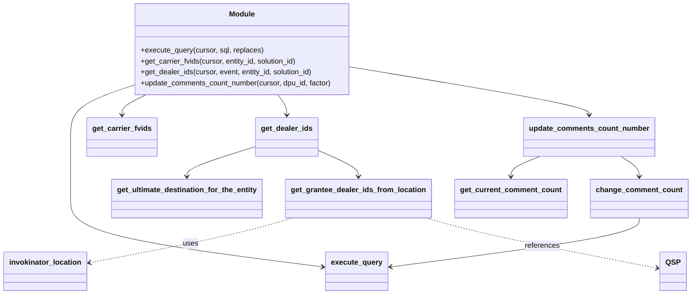

# Diagram: entity_core/entity_service/entity_service/dda/comments/db.py


> Auto-generated by Obscura crawlers

## Diagram 1



### SVG

<svg id="container" width="1452.86328125" xmlns="http://www.w3.org/2000/svg" class="classDiagram" height="640" viewBox="0 0 1452.86328125 640" role="graphics-document document" aria-roledescription="class"><style>#container{font-family:"trebuchet ms",verdana,arial,sans-serif;font-size:16px;fill:#333;}@keyframes edge-animation-frame{from{stroke-dashoffset:0;}}@keyframes dash{to{stroke-dashoffset:0;}}#container .edge-animation-slow{stroke-dasharray:9,5!important;stroke-dashoffset:900;animation:dash 50s linear infinite;stroke-linecap:round;}#container .edge-animation-fast{stroke-dasharray:9,5!important;stroke-dashoffset:900;animation:dash 20s linear infinite;stroke-linecap:round;}#container .error-icon{fill:#552222;}#container .error-text{fill:#552222;stroke:#552222;}#container .edge-thickness-normal{stroke-width:1px;}#container .edge-thickness-thick{stroke-width:3.5px;}#container .edge-pattern-solid{stroke-dasharray:0;}#container .edge-thickness-invisible{stroke-width:0;fill:none;}#container .edge-pattern-dashed{stroke-dasharray:3;}#container .edge-pattern-dotted{stroke-dasharray:2;}#container .marker{fill:#333333;stroke:#333333;}#container .marker.cross{stroke:#333333;}#container svg{font-family:"trebuchet ms",verdana,arial,sans-serif;font-size:16px;}#container p{margin:0;}#container g.classGroup text{fill:#9370DB;stroke:none;font-family:"trebuchet ms",verdana,arial,sans-serif;font-size:10px;}#container g.classGroup text .title{font-weight:bolder;}#container .nodeLabel,#container .edgeLabel{color:#131300;}#container .edgeLabel .label rect{fill:#ECECFF;}#container .label text{fill:#131300;}#container .labelBkg{background:#ECECFF;}#container .edgeLabel .label span{background:#ECECFF;}#container .classTitle{font-weight:bolder;}#container .node rect,#container .node circle,#container .node ellipse,#container .node polygon,#container .node path{fill:#ECECFF;stroke:#9370DB;stroke-width:1px;}#container .divider{stroke:#9370DB;stroke-width:1;}#container g.clickable{cursor:pointer;}#container g.classGroup rect{fill:#ECECFF;stroke:#9370DB;}#container g.classGroup line{stroke:#9370DB;stroke-width:1;}#container .classLabel .box{stroke:none;stroke-width:0;fill:#ECECFF;opacity:0.5;}#container .classLabel .label{fill:#9370DB;font-size:10px;}#container .relation{stroke:#333333;stroke-width:1;fill:none;}#container .dashed-line{stroke-dasharray:3;}#container .dotted-line{stroke-dasharray:1 2;}#container #compositionStart,#container .composition{fill:#333333!important;stroke:#333333!important;stroke-width:1;}#container #compositionEnd,#container .composition{fill:#333333!important;stroke:#333333!important;stroke-width:1;}#container #dependencyStart,#container .dependency{fill:#333333!important;stroke:#333333!important;stroke-width:1;}#container #dependencyStart,#container .dependency{fill:#333333!important;stroke:#333333!important;stroke-width:1;}#container #extensionStart,#container .extension{fill:transparent!important;stroke:#333333!important;stroke-width:1;}#container #extensionEnd,#container .extension{fill:transparent!important;stroke:#333333!important;stroke-width:1;}#container #aggregationStart,#container .aggregation{fill:transparent!important;stroke:#333333!important;stroke-width:1;}#container #aggregationEnd,#container .aggregation{fill:transparent!important;stroke:#333333!important;stroke-width:1;}#container #lollipopStart,#container .lollipop{fill:#ECECFF!important;stroke:#333333!important;stroke-width:1;}#container #lollipopEnd,#container .lollipop{fill:#ECECFF!important;stroke:#333333!important;stroke-width:1;}#container .edgeTerminals{font-size:11px;line-height:initial;}#container .classTitleText{text-anchor:middle;font-size:18px;fill:#333;}#container .label-icon{display:inline-block;height:1em;overflow:visible;vertical-align:-0.125em;}#container .node .label-icon path{fill:currentColor;stroke:revert;stroke-width:revert;}#container :root{--mermaid-font-family:"trebuchet ms",verdana,arial,sans-serif;}</style><g><defs><marker id="container_class-aggregationStart" class="marker aggregation class" refX="18" refY="7" markerWidth="190" markerHeight="240" orient="auto"><path d="M 18,7 L9,13 L1,7 L9,1 Z"></path></marker></defs><defs><marker id="container_class-aggregationEnd" class="marker aggregation class" refX="1" refY="7" markerWidth="20" markerHeight="28" orient="auto"><path d="M 18,7 L9,13 L1,7 L9,1 Z"></path></marker></defs><defs><marker id="container_class-extensionStart" class="marker extension class" refX="18" refY="7" markerWidth="190" markerHeight="240" orient="auto"><path d="M 1,7 L18,13 V 1 Z"></path></marker></defs><defs><marker id="container_class-extensionEnd" class="marker extension class" refX="1" refY="7" markerWidth="20" markerHeight="28" orient="auto"><path d="M 1,1 V 13 L18,7 Z"></path></marker></defs><defs><marker id="container_class-compositionStart" class="marker composition class" refX="18" refY="7" markerWidth="190" markerHeight="240" orient="auto"><path d="M 18,7 L9,13 L1,7 L9,1 Z"></path></marker></defs><defs><marker id="container_class-compositionEnd" class="marker composition class" refX="1" refY="7" markerWidth="20" markerHeight="28" orient="auto"><path d="M 18,7 L9,13 L1,7 L9,1 Z"></path></marker></defs><defs><marker id="container_class-dependencyStart" class="marker dependency class" refX="6" refY="7" markerWidth="190" markerHeight="240" orient="auto"><path d="M 5,7 L9,13 L1,7 L9,1 Z"></path></marker></defs><defs><marker id="container_class-dependencyEnd" class="marker dependency class" refX="13" refY="7" markerWidth="20" markerHeight="28" orient="auto"><path d="M 18,7 L9,13 L14,7 L9,1 Z"></path></marker></defs><defs><marker id="container_class-lollipopStart" class="marker lollipop class" refX="13" refY="7" markerWidth="190" markerHeight="240" orient="auto"><circle stroke="black" fill="transparent" cx="7" cy="7" r="6"></circle></marker></defs><defs><marker id="container_class-lollipopEnd" class="marker lollipop class" refX="1" refY="7" markerWidth="190" markerHeight="240" orient="auto"><circle stroke="black" fill="transparent" cx="7" cy="7" r="6"></circle></marker></defs><g class="root"><g class="clusters"></g><g class="edgePaths"><path d="M275.555,187.507L254.321,194.756C233.087,202.005,190.62,216.502,169.386,234.918C148.152,253.333,148.152,275.667,148.152,298C148.152,320.333,148.152,342.667,148.152,365C148.152,387.333,148.152,409.667,148.152,434C148.152,458.333,148.152,484.667,236.703,509.441C325.254,534.216,502.356,557.432,590.906,569.039L679.457,580.647" id="id_Module_execute_query_1" class="edge-thickness-normal edge-pattern-solid relation" style=";;;" data-edge="true" data-et="edge" data-id="id_Module_execute_query_1" data-points="W3sieCI6Mjc1LjU1NDY4NzUsInkiOjE4Ny41MDcyNTM3MDIxMzA0fSx7IngiOjE0OC4xNTIzNDM3NSwieSI6MjMxfSx7IngiOjE0OC4xNTIzNDM3NSwieSI6Mjk4fSx7IngiOjE0OC4xNTIzNDM3NSwieSI6MzY1fSx7IngiOjE0OC4xNTIzNDM3NSwieSI6NDMyfSx7IngiOjE0OC4xNTIzNDM3NSwieSI6NTExfSx7IngiOjY4NS40MDYyNSwieSI6NTgxLjQyNzEwMjg0NjE0MjR9XQ==" marker-end="url(#container_class-dependencyEnd)"></path><path d="M307.934,206L299.372,210.167C290.809,214.333,273.684,222.667,265.121,230C256.559,237.333,256.559,243.667,256.559,246.833L256.559,250" id="id_Module_get_carrier_fvids_2" class="edge-thickness-normal edge-pattern-solid relation" style=";;;" data-edge="true" data-et="edge" data-id="id_Module_get_carrier_fvids_2" data-points="W3sieCI6MzA3LjkzNDQ0NDMwNDQzNTUsInkiOjIwNn0seyJ4IjoyNTYuNTU4NTkzNzUsInkiOjIzMX0seyJ4IjoyNTYuNTU4NTkzNzUsInkiOjI1Nn1d" marker-end="url(#container_class-dependencyEnd)"></path><path d="M586.824,206L589.999,210.167C593.174,214.333,599.525,222.667,602.7,230C605.875,237.333,605.875,243.667,605.875,246.833L605.875,250" id="id_Module_get_dealer_ids_3" class="edge-thickness-normal edge-pattern-solid relation" style=";;;" data-edge="true" data-et="edge" data-id="id_Module_get_dealer_ids_3" data-points="W3sieCI6NTg2LjgyNDE1NTc0NTk2NzgsInkiOjIwNn0seyJ4Ijo2MDUuODc1LCJ5IjoyMzF9LHsieCI6NjA1Ljg3NSwieSI6MjU2fV0=" marker-end="url(#container_class-dependencyEnd)"></path><path d="M747.211,147.094L829.465,161.078C911.719,175.063,1076.227,203.031,1158.48,220.182C1240.734,237.333,1240.734,243.667,1240.734,246.833L1240.734,250" id="id_Module_update_comments_count_number_4" class="edge-thickness-normal edge-pattern-solid relation" style=";;;" data-edge="true" data-et="edge" data-id="id_Module_update_comments_count_number_4" data-points="W3sieCI6NzQ3LjIxMDkzNzUsInkiOjE0Ny4wOTQwOTA0MjcwNzAyOH0seyJ4IjoxMjQwLjczNDM3NSwieSI6MjMxfSx7IngiOjEyNDAuNzM0Mzc1LCJ5IjoyNTZ9XQ==" marker-end="url(#container_class-dependencyEnd)"></path><path d="M540.297,318.77L515.969,326.475C491.642,334.18,442.987,349.59,418.66,360.462C394.332,371.333,394.332,377.667,394.332,380.833L394.332,384" id="id_get_dealer_ids_get_ultimate_destination_for_the_entity_5" class="edge-thickness-normal edge-pattern-solid relation" style=";;;" data-edge="true" data-et="edge" data-id="id_get_dealer_ids_get_ultimate_destination_for_the_entity_5" data-points="W3sieCI6NTQwLjI5Njg3NSwieSI6MzE4Ljc2OTkzODE0MDUyMjZ9LHsieCI6Mzk0LjMzMjAzMTI1LCJ5IjozNjV9LHsieCI6Mzk0LjMzMjAzMTI1LCJ5IjozOTB9XQ==" marker-end="url(#container_class-dependencyEnd)"></path><path d="M671.453,327.061L685.722,333.384C699.991,339.707,728.529,352.354,742.798,361.843C757.066,371.333,757.066,377.667,757.066,380.833L757.066,384" id="id_get_dealer_ids_get_grantee_dealer_ids_from_location_6" class="edge-thickness-normal edge-pattern-solid relation" style=";;;" data-edge="true" data-et="edge" data-id="id_get_dealer_ids_get_grantee_dealer_ids_from_location_6" data-points="W3sieCI6NjcxLjQ1MzEyNSwieSI6MzI3LjA2MDc0MTUwNjI2NTM0fSx7IngiOjc1Ny4wNjY0MDYyNSwieSI6MzY1fSx7IngiOjc1Ny4wNjY0MDYyNSwieSI6MzkwfV0=" marker-end="url(#container_class-dependencyEnd)"></path><path d="M618.517,474L598.174,480.167C577.831,486.333,537.146,498.667,465.458,514.943C393.77,531.22,291.078,551.441,239.733,561.551L188.387,571.661" id="id_get_grantee_dealer_ids_from_location_invokinator_location_7" class="edge-thickness-normal edge-pattern-dashed relation" style=";;;" data-edge="true" data-et="edge" data-id="id_get_grantee_dealer_ids_from_location_invokinator_location_7" data-points="W3sieCI6NjE4LjUxNjY2MzM3MDI1MzEsInkiOjQ3NH0seyJ4Ijo0OTYuNDYwOTM3NSwieSI6NTExfSx7IngiOjE4Mi41LCJ5Ijo1NzIuODIwMTM0MzU4ODc0NX1d" marker-end="url(#container_class-dependencyEnd)"></path><path d="M897.799,474L918.462,480.167C939.125,486.333,980.451,498.667,1061.265,516.904C1142.079,535.141,1262.382,559.281,1322.533,571.352L1382.684,583.422" id="id_get_grantee_dealer_ids_from_location_QSP_8" class="edge-thickness-normal edge-pattern-dashed relation" style=";;;" data-edge="true" data-et="edge" data-id="id_get_grantee_dealer_ids_from_location_QSP_8" data-points="W3sieCI6ODk3Ljc5ODgwMzQwMTg5ODgsInkiOjQ3NH0seyJ4IjoxMDIxLjc3NzM0Mzc1LCJ5Ijo1MTF9LHsieCI6MTM4OC41NjY0MDYyNSwieSI6NTg0LjYwMjM3NzM2MTQ4Nn1d" marker-end="url(#container_class-dependencyEnd)"></path><path d="M1137.97,340L1127.775,344.167C1117.58,348.333,1097.191,356.667,1086.996,364C1076.801,371.333,1076.801,377.667,1076.801,380.833L1076.801,384" id="id_update_comments_count_number_get_current_comment_count_9" class="edge-thickness-normal edge-pattern-solid relation" style=";;;" data-edge="true" data-et="edge" data-id="id_update_comments_count_number_get_current_comment_count_9" data-points="W3sieCI6MTEzNy45NzAwMzI2NDkyNTM3LCJ5IjozNDB9LHsieCI6MTA3Ni44MDA3ODEyNSwieSI6MzY1fSx7IngiOjEwNzYuODAwNzgxMjUsInkiOjM5MH1d" marker-end="url(#container_class-dependencyEnd)"></path><path d="M1305.666,340L1312.108,344.167C1318.55,348.333,1331.433,356.667,1337.875,364C1344.316,371.333,1344.316,377.667,1344.316,380.833L1344.316,384" id="id_update_comments_count_number_change_comment_count_10" class="edge-thickness-normal edge-pattern-solid relation" style=";;;" data-edge="true" data-et="edge" data-id="id_update_comments_count_number_change_comment_count_10" data-points="W3sieCI6MTMwNS42NjYzOTQ1ODk1NTIzLCJ5IjozNDB9LHsieCI6MTM0NC4zMTY0MDYyNSwieSI6MzY1fSx7IngiOjEzNDQuMzE2NDA2MjUsInkiOjM5MH1d" marker-end="url(#container_class-dependencyEnd)"></path><path d="M1344.316,474L1344.316,480.167C1344.316,486.333,1344.316,498.667,1257.289,516.417C1170.261,534.168,996.206,557.336,909.178,568.92L822.151,580.503" id="id_change_comment_count_execute_query_11" class="edge-thickness-normal edge-pattern-solid relation" style=";;;" data-edge="true" data-et="edge" data-id="id_change_comment_count_execute_query_11" data-points="W3sieCI6MTM0NC4zMTY0MDYyNSwieSI6NDc0fSx7IngiOjEzNDQuMzE2NDA2MjUsInkiOjUxMX0seyJ4Ijo4MTYuMjAzMTI1LCJ5Ijo1ODEuMjk1MDcyMzY0NTY3M31d" marker-end="url(#container_class-dependencyEnd)"></path></g><g class="edgeLabels"><g class="edgeLabel"><g class="label" data-id="id_Module_execute_query_1" transform="translate(0, 0)"><foreignObject width="0" height="0"><div xmlns="http://www.w3.org/1999/xhtml" class="labelBkg" style="display: table-cell; white-space: nowrap; line-height: 1.5; max-width: 200px; text-align: center;"><span class="edgeLabel"></span></div></foreignObject></g></g><g class="edgeLabel"><g class="label" data-id="id_Module_get_carrier_fvids_2" transform="translate(0, 0)"><foreignObject width="0" height="0"><div xmlns="http://www.w3.org/1999/xhtml" class="labelBkg" style="display: table-cell; white-space: nowrap; line-height: 1.5; max-width: 200px; text-align: center;"><span class="edgeLabel"></span></div></foreignObject></g></g><g class="edgeLabel"><g class="label" data-id="id_Module_get_dealer_ids_3" transform="translate(0, 0)"><foreignObject width="0" height="0"><div xmlns="http://www.w3.org/1999/xhtml" class="labelBkg" style="display: table-cell; white-space: nowrap; line-height: 1.5; max-width: 200px; text-align: center;"><span class="edgeLabel"></span></div></foreignObject></g></g><g class="edgeLabel"><g class="label" data-id="id_Module_update_comments_count_number_4" transform="translate(0, 0)"><foreignObject width="0" height="0"><div xmlns="http://www.w3.org/1999/xhtml" class="labelBkg" style="display: table-cell; white-space: nowrap; line-height: 1.5; max-width: 200px; text-align: center;"><span class="edgeLabel"></span></div></foreignObject></g></g><g class="edgeLabel"><g class="label" data-id="id_get_dealer_ids_get_ultimate_destination_for_the_entity_5" transform="translate(0, 0)"><foreignObject width="0" height="0"><div xmlns="http://www.w3.org/1999/xhtml" class="labelBkg" style="display: table-cell; white-space: nowrap; line-height: 1.5; max-width: 200px; text-align: center;"><span class="edgeLabel"></span></div></foreignObject></g></g><g class="edgeLabel"><g class="label" data-id="id_get_dealer_ids_get_grantee_dealer_ids_from_location_6" transform="translate(0, 0)"><foreignObject width="0" height="0"><div xmlns="http://www.w3.org/1999/xhtml" class="labelBkg" style="display: table-cell; white-space: nowrap; line-height: 1.5; max-width: 200px; text-align: center;"><span class="edgeLabel"></span></div></foreignObject></g></g><g class="edgeLabel" transform="translate(402.04936, 529.59001)"><g class="label" data-id="id_get_grantee_dealer_ids_from_location_invokinator_location_7" transform="translate(-16.4921875, -12)"><foreignObject width="32.984375" height="24"><div xmlns="http://www.w3.org/1999/xhtml" class="labelBkg" style="display: table-cell; white-space: nowrap; line-height: 1.5; max-width: 200px; text-align: center;"><span class="edgeLabel"><p>uses</p></span></div></foreignObject></g></g><g class="edgeLabel" transform="translate(1141.74532, 535.07359)"><g class="label" data-id="id_get_grantee_dealer_ids_from_location_QSP_8" transform="translate(-37.828125, -12)"><foreignObject width="75.65625" height="24"><div xmlns="http://www.w3.org/1999/xhtml" class="labelBkg" style="display: table-cell; white-space: nowrap; line-height: 1.5; max-width: 200px; text-align: center;"><span class="edgeLabel"><p>references</p></span></div></foreignObject></g></g><g class="edgeLabel"><g class="label" data-id="id_update_comments_count_number_get_current_comment_count_9" transform="translate(0, 0)"><foreignObject width="0" height="0"><div xmlns="http://www.w3.org/1999/xhtml" class="labelBkg" style="display: table-cell; white-space: nowrap; line-height: 1.5; max-width: 200px; text-align: center;"><span class="edgeLabel"></span></div></foreignObject></g></g><g class="edgeLabel"><g class="label" data-id="id_update_comments_count_number_change_comment_count_10" transform="translate(0, 0)"><foreignObject width="0" height="0"><div xmlns="http://www.w3.org/1999/xhtml" class="labelBkg" style="display: table-cell; white-space: nowrap; line-height: 1.5; max-width: 200px; text-align: center;"><span class="edgeLabel"></span></div></foreignObject></g></g><g class="edgeLabel"><g class="label" data-id="id_change_comment_count_execute_query_11" transform="translate(0, 0)"><foreignObject width="0" height="0"><div xmlns="http://www.w3.org/1999/xhtml" class="labelBkg" style="display: table-cell; white-space: nowrap; line-height: 1.5; max-width: 200px; text-align: center;"><span class="edgeLabel"></span></div></foreignObject></g></g></g><g class="nodes"><g class="node default" id="classId-Module-0" transform="translate(511.3828125, 107)"><g class="basic label-container"><path d="M-235.828125 -99 L235.828125 -99 L235.828125 99 L-235.828125 99" stroke="none" stroke-width="0" fill="#ECECFF" style=""></path><path d="M-235.828125 -99 C-116.79995044684749 -99, 2.2282241063050208 -99, 235.828125 -99 M-235.828125 -99 C-97.08380780408336 -99, 41.66050939183327 -99, 235.828125 -99 M235.828125 -99 C235.828125 -47.022123134505854, 235.828125 4.955753730988292, 235.828125 99 M235.828125 -99 C235.828125 -37.111765577279336, 235.828125 24.77646884544133, 235.828125 99 M235.828125 99 C55.746093351198 99, -124.335938297604 99, -235.828125 99 M235.828125 99 C107.30634603508977 99, -21.21543292982045 99, -235.828125 99 M-235.828125 99 C-235.828125 58.02931732673338, -235.828125 17.058634653466754, -235.828125 -99 M-235.828125 99 C-235.828125 37.353081725286124, -235.828125 -24.293836549427752, -235.828125 -99" stroke="#9370DB" stroke-width="1.3" fill="none" stroke-dasharray="0 0" style=""></path></g><g class="annotation-group text" transform="translate(0, -75)"></g><g class="label-group text" transform="translate(-27.09375, -75)"><g class="label" style="font-weight: bolder" transform="translate(0,-12)"><foreignObject width="54.1875" height="24"><div xmlns="http://www.w3.org/1999/xhtml" style="display: table-cell; white-space: nowrap; line-height: 1.5; max-width: 104px; text-align: center;"><span class="nodeLabel markdown-node-label" style=""><p>Module</p></span></div></foreignObject></g></g><g class="members-group text" transform="translate(-223.828125, -27)"></g><g class="methods-group text" transform="translate(-223.828125, 3)"><g class="label" style="" transform="translate(0,-12)"><foreignObject width="266.8125" height="24"><div xmlns="http://www.w3.org/1999/xhtml" style="display: table-cell; white-space: nowrap; line-height: 1.5; max-width: 324px; text-align: center;"><span class="nodeLabel markdown-node-label" style=""><p>+execute_query(cursor, sql, replaces)</p></span></div></foreignObject></g><g class="label" style="" transform="translate(0,12)"><foreignObject width="345.078125" height="24"><div xmlns="http://www.w3.org/1999/xhtml" style="display: table-cell; white-space: nowrap; line-height: 1.5; max-width: 402px; text-align: center;"><span class="nodeLabel markdown-node-label" style=""><p>+get_carrier_fvids(cursor, entity_id, solution_id)</p></span></div></foreignObject></g><g class="label" style="" transform="translate(0,36)"><foreignObject width="378.875" height="24"><div xmlns="http://www.w3.org/1999/xhtml" style="display: table-cell; white-space: nowrap; line-height: 1.5; max-width: 436px; text-align: center;"><span class="nodeLabel markdown-node-label" style=""><p>+get_dealer_ids(cursor, event, entity_id, solution_id)</p></span></div></foreignObject></g><g class="label" style="" transform="translate(0,60)"><foreignObject width="420.5625" height="24"><div xmlns="http://www.w3.org/1999/xhtml" style="display: table-cell; white-space: nowrap; line-height: 1.5; max-width: 478px; text-align: center;"><span class="nodeLabel markdown-node-label" style=""><p>+update_comments_count_number(cursor, dpu_id, factor)</p></span></div></foreignObject></g></g><g class="divider" style=""><path d="M-235.828125 -51 C-94.09436305118524 -51, 47.63939889762952 -51, 235.828125 -51 M-235.828125 -51 C-105.61841698971614 -51, 24.591291020567724 -51, 235.828125 -51" stroke="#9370DB" stroke-width="1.3" fill="none" stroke-dasharray="0 0" style=""></path></g><g class="divider" style=""><path d="M-235.828125 -27 C-116.9150790908685 -27, 1.997966818262995 -27, 235.828125 -27 M-235.828125 -27 C-103.67196704112675 -27, 28.484190917746503 -27, 235.828125 -27" stroke="#9370DB" stroke-width="1.3" fill="none" stroke-dasharray="0 0" style=""></path></g></g><g class="node default" id="classId-execute_query-1" transform="translate(750.8046875, 590)"><g class="basic label-container"><path d="M-65.3984375 -42 L65.3984375 -42 L65.3984375 42 L-65.3984375 42" stroke="none" stroke-width="0" fill="#ECECFF" style=""></path><path d="M-65.3984375 -42 C-16.415344295851888 -42, 32.567748908296224 -42, 65.3984375 -42 M-65.3984375 -42 C-25.223244104393487 -42, 14.951949291213026 -42, 65.3984375 -42 M65.3984375 -42 C65.3984375 -9.24480072783279, 65.3984375 23.51039854433442, 65.3984375 42 M65.3984375 -42 C65.3984375 -15.520062252440614, 65.3984375 10.959875495118773, 65.3984375 42 M65.3984375 42 C27.535179100655633 42, -10.328079298688735 42, -65.3984375 42 M65.3984375 42 C34.530293471649 42, 3.6621494432980057 42, -65.3984375 42 M-65.3984375 42 C-65.3984375 11.233251396532033, -65.3984375 -19.533497206935934, -65.3984375 -42 M-65.3984375 42 C-65.3984375 12.867862662696936, -65.3984375 -16.264274674606128, -65.3984375 -42" stroke="#9370DB" stroke-width="1.3" fill="none" stroke-dasharray="0 0" style=""></path></g><g class="annotation-group text" transform="translate(0, -18)"></g><g class="label-group text" transform="translate(-53.3984375, -18)"><g class="label" style="font-weight: bolder" transform="translate(0,-12)"><foreignObject width="106.796875" height="24"><div xmlns="http://www.w3.org/1999/xhtml" style="display: table-cell; white-space: nowrap; line-height: 1.5; max-width: 155px; text-align: center;"><span class="nodeLabel markdown-node-label" style=""><p>execute_query</p></span></div></foreignObject></g></g><g class="members-group text" transform="translate(-53.3984375, 30)"></g><g class="methods-group text" transform="translate(-53.3984375, 60)"></g><g class="divider" style=""><path d="M-65.3984375 6 C-35.63581299917861 6, -5.873188498357216 6, 65.3984375 6 M-65.3984375 6 C-23.4580947863709 6, 18.4822479272582 6, 65.3984375 6" stroke="#9370DB" stroke-width="1.3" fill="none" stroke-dasharray="0 0" style=""></path></g><g class="divider" style=""><path d="M-65.3984375 24 C-24.814050545942216 24, 15.770336408115568 24, 65.3984375 24 M-65.3984375 24 C-14.068007304491744 24, 37.26242289101651 24, 65.3984375 24" stroke="#9370DB" stroke-width="1.3" fill="none" stroke-dasharray="0 0" style=""></path></g></g><g class="node default" id="classId-get_carrier_fvids-2" transform="translate(256.55859375, 298)"><g class="basic label-container"><path d="M-73.40625 -42 L73.40625 -42 L73.40625 42 L-73.40625 42" stroke="none" stroke-width="0" fill="#ECECFF" style=""></path><path d="M-73.40625 -42 C-31.177803612936955 -42, 11.05064277412609 -42, 73.40625 -42 M-73.40625 -42 C-23.15024778814373 -42, 27.10575442371254 -42, 73.40625 -42 M73.40625 -42 C73.40625 -21.400479044080193, 73.40625 -0.8009580881603853, 73.40625 42 M73.40625 -42 C73.40625 -17.39395563066833, 73.40625 7.21208873866334, 73.40625 42 M73.40625 42 C34.67075024314582 42, -4.064749513708364 42, -73.40625 42 M73.40625 42 C36.88529679645531 42, 0.3643435929106147 42, -73.40625 42 M-73.40625 42 C-73.40625 19.633480439416676, -73.40625 -2.733039121166648, -73.40625 -42 M-73.40625 42 C-73.40625 12.004148660529243, -73.40625 -17.991702678941515, -73.40625 -42" stroke="#9370DB" stroke-width="1.3" fill="none" stroke-dasharray="0 0" style=""></path></g><g class="annotation-group text" transform="translate(0, -18)"></g><g class="label-group text" transform="translate(-61.40625, -18)"><g class="label" style="font-weight: bolder" transform="translate(0,-12)"><foreignObject width="122.8125" height="24"><div xmlns="http://www.w3.org/1999/xhtml" style="display: table-cell; white-space: nowrap; line-height: 1.5; max-width: 170px; text-align: center;"><span class="nodeLabel markdown-node-label" style=""><p>get_carrier_fvids</p></span></div></foreignObject></g></g><g class="members-group text" transform="translate(-61.40625, 30)"></g><g class="methods-group text" transform="translate(-61.40625, 60)"></g><g class="divider" style=""><path d="M-73.40625 6 C-40.17032040594294 6, -6.934390811885876 6, 73.40625 6 M-73.40625 6 C-36.9909328363949 6, -0.5756156727897945 6, 73.40625 6" stroke="#9370DB" stroke-width="1.3" fill="none" stroke-dasharray="0 0" style=""></path></g><g class="divider" style=""><path d="M-73.40625 24 C-40.98406755271714 24, -8.561885105434285 24, 73.40625 24 M-73.40625 24 C-24.90229946123356 24, 23.60165107753288 24, 73.40625 24" stroke="#9370DB" stroke-width="1.3" fill="none" stroke-dasharray="0 0" style=""></path></g></g><g class="node default" id="classId-get_dealer_ids-3" transform="translate(605.875, 298)"><g class="basic label-container"><path d="M-65.578125 -42 L65.578125 -42 L65.578125 42 L-65.578125 42" stroke="none" stroke-width="0" fill="#ECECFF" style=""></path><path d="M-65.578125 -42 C-16.73657715839291 -42, 32.10497068321418 -42, 65.578125 -42 M-65.578125 -42 C-32.611394879475434 -42, 0.35533524104913283 -42, 65.578125 -42 M65.578125 -42 C65.578125 -11.90376804354187, 65.578125 18.19246391291626, 65.578125 42 M65.578125 -42 C65.578125 -17.632173024926544, 65.578125 6.7356539501469115, 65.578125 42 M65.578125 42 C20.46491604526907 42, -24.64829290946186 42, -65.578125 42 M65.578125 42 C16.98218695157648 42, -31.61375109684704 42, -65.578125 42 M-65.578125 42 C-65.578125 19.40702004142686, -65.578125 -3.1859599171462776, -65.578125 -42 M-65.578125 42 C-65.578125 11.683869204989875, -65.578125 -18.63226159002025, -65.578125 -42" stroke="#9370DB" stroke-width="1.3" fill="none" stroke-dasharray="0 0" style=""></path></g><g class="annotation-group text" transform="translate(0, -18)"></g><g class="label-group text" transform="translate(-53.578125, -18)"><g class="label" style="font-weight: bolder" transform="translate(0,-12)"><foreignObject width="107.15625" height="24"><div xmlns="http://www.w3.org/1999/xhtml" style="display: table-cell; white-space: nowrap; line-height: 1.5; max-width: 155px; text-align: center;"><span class="nodeLabel markdown-node-label" style=""><p>get_dealer_ids</p></span></div></foreignObject></g></g><g class="members-group text" transform="translate(-53.578125, 30)"></g><g class="methods-group text" transform="translate(-53.578125, 60)"></g><g class="divider" style=""><path d="M-65.578125 6 C-30.28721688323469 6, 5.003691233530617 6, 65.578125 6 M-65.578125 6 C-33.13135757433646 6, -0.6845901486729247 6, 65.578125 6" stroke="#9370DB" stroke-width="1.3" fill="none" stroke-dasharray="0 0" style=""></path></g><g class="divider" style=""><path d="M-65.578125 24 C-34.96067548071623 24, -4.343225961432466 24, 65.578125 24 M-65.578125 24 C-18.178630215779677 24, 29.220864568440646 24, 65.578125 24" stroke="#9370DB" stroke-width="1.3" fill="none" stroke-dasharray="0 0" style=""></path></g></g><g class="node default" id="classId-get_ultimate_destination_for_the_entity-4" transform="translate(394.33203125, 432)"><g class="basic label-container"><path d="M-159.96875 -42 L159.96875 -42 L159.96875 42 L-159.96875 42" stroke="none" stroke-width="0" fill="#ECECFF" style=""></path><path d="M-159.96875 -42 C-70.70791612376628 -42, 18.552917752467437 -42, 159.96875 -42 M-159.96875 -42 C-46.9625950864483 -42, 66.0435598271034 -42, 159.96875 -42 M159.96875 -42 C159.96875 -12.32839647474567, 159.96875 17.34320705050866, 159.96875 42 M159.96875 -42 C159.96875 -10.506800952567708, 159.96875 20.986398094864583, 159.96875 42 M159.96875 42 C87.82970285089604 42, 15.690655701792082 42, -159.96875 42 M159.96875 42 C51.46747333274706 42, -57.033803334505876 42, -159.96875 42 M-159.96875 42 C-159.96875 14.663159355853097, -159.96875 -12.673681288293807, -159.96875 -42 M-159.96875 42 C-159.96875 17.648405899868155, -159.96875 -6.703188200263689, -159.96875 -42" stroke="#9370DB" stroke-width="1.3" fill="none" stroke-dasharray="0 0" style=""></path></g><g class="annotation-group text" transform="translate(0, -18)"></g><g class="label-group text" transform="translate(-147.96875, -18)"><g class="label" style="font-weight: bolder" transform="translate(0,-12)"><foreignObject width="295.9375" height="24"><div xmlns="http://www.w3.org/1999/xhtml" style="display: table-cell; white-space: nowrap; line-height: 1.5; max-width: 341px; text-align: center;"><span class="nodeLabel markdown-node-label" style=""><p>get_ultimate_destination_for_the_entity</p></span></div></foreignObject></g></g><g class="members-group text" transform="translate(-147.96875, 30)"></g><g class="methods-group text" transform="translate(-147.96875, 60)"></g><g class="divider" style=""><path d="M-159.96875 6 C-34.43405976282543 6, 91.10063047434915 6, 159.96875 6 M-159.96875 6 C-81.36536743957839 6, -2.7619848791567847 6, 159.96875 6" stroke="#9370DB" stroke-width="1.3" fill="none" stroke-dasharray="0 0" style=""></path></g><g class="divider" style=""><path d="M-159.96875 24 C-69.99539703211116 24, 19.977955935777686 24, 159.96875 24 M-159.96875 24 C-81.30902913938134 24, -2.6493082787626747 24, 159.96875 24" stroke="#9370DB" stroke-width="1.3" fill="none" stroke-dasharray="0 0" style=""></path></g></g><g class="node default" id="classId-get_grantee_dealer_ids_from_location-5" transform="translate(757.06640625, 432)"><g class="basic label-container"><path d="M-152.765625 -42 L152.765625 -42 L152.765625 42 L-152.765625 42" stroke="none" stroke-width="0" fill="#ECECFF" style=""></path><path d="M-152.765625 -42 C-83.95854739743318 -42, -15.151469794866358 -42, 152.765625 -42 M-152.765625 -42 C-37.829146288236785 -42, 77.10733242352643 -42, 152.765625 -42 M152.765625 -42 C152.765625 -13.42414666365228, 152.765625 15.15170667269544, 152.765625 42 M152.765625 -42 C152.765625 -15.134019300939702, 152.765625 11.731961398120596, 152.765625 42 M152.765625 42 C65.1727829693324 42, -22.420059061335195 42, -152.765625 42 M152.765625 42 C62.473691294881874 42, -27.81824241023625 42, -152.765625 42 M-152.765625 42 C-152.765625 19.09195938962296, -152.765625 -3.8160812207540786, -152.765625 -42 M-152.765625 42 C-152.765625 16.914914642213617, -152.765625 -8.170170715572766, -152.765625 -42" stroke="#9370DB" stroke-width="1.3" fill="none" stroke-dasharray="0 0" style=""></path></g><g class="annotation-group text" transform="translate(0, -18)"></g><g class="label-group text" transform="translate(-140.765625, -18)"><g class="label" style="font-weight: bolder" transform="translate(0,-12)"><foreignObject width="281.53125" height="24"><div xmlns="http://www.w3.org/1999/xhtml" style="display: table-cell; white-space: nowrap; line-height: 1.5; max-width: 328px; text-align: center;"><span class="nodeLabel markdown-node-label" style=""><p>get_grantee_dealer_ids_from_location</p></span></div></foreignObject></g></g><g class="members-group text" transform="translate(-140.765625, 30)"></g><g class="methods-group text" transform="translate(-140.765625, 60)"></g><g class="divider" style=""><path d="M-152.765625 6 C-43.17147547783752 6, 66.42267404432496 6, 152.765625 6 M-152.765625 6 C-83.61458622270068 6, -14.46354744540136 6, 152.765625 6" stroke="#9370DB" stroke-width="1.3" fill="none" stroke-dasharray="0 0" style=""></path></g><g class="divider" style=""><path d="M-152.765625 24 C-45.09431958950559 24, 62.576985820988824 24, 152.765625 24 M-152.765625 24 C-62.75473131090776 24, 27.256162378184484 24, 152.765625 24" stroke="#9370DB" stroke-width="1.3" fill="none" stroke-dasharray="0 0" style=""></path></g></g><g class="node default" id="classId-update_comments_count_number-6" transform="translate(1240.734375, 298)"><g class="basic label-container"><path d="M-136.5625 -42 L136.5625 -42 L136.5625 42 L-136.5625 42" stroke="none" stroke-width="0" fill="#ECECFF" style=""></path><path d="M-136.5625 -42 C-53.313117840109754 -42, 29.93626431978049 -42, 136.5625 -42 M-136.5625 -42 C-72.02407981823472 -42, -7.48565963646945 -42, 136.5625 -42 M136.5625 -42 C136.5625 -12.043028790359024, 136.5625 17.913942419281952, 136.5625 42 M136.5625 -42 C136.5625 -10.812031869895446, 136.5625 20.37593626020911, 136.5625 42 M136.5625 42 C39.99358969506409 42, -56.575320609871824 42, -136.5625 42 M136.5625 42 C33.071958191954266 42, -70.41858361609147 42, -136.5625 42 M-136.5625 42 C-136.5625 23.2014229358014, -136.5625 4.4028458716028, -136.5625 -42 M-136.5625 42 C-136.5625 16.215923144427588, -136.5625 -9.568153711144824, -136.5625 -42" stroke="#9370DB" stroke-width="1.3" fill="none" stroke-dasharray="0 0" style=""></path></g><g class="annotation-group text" transform="translate(0, -18)"></g><g class="label-group text" transform="translate(-124.5625, -18)"><g class="label" style="font-weight: bolder" transform="translate(0,-12)"><foreignObject width="249.125" height="24"><div xmlns="http://www.w3.org/1999/xhtml" style="display: table-cell; white-space: nowrap; line-height: 1.5; max-width: 299px; text-align: center;"><span class="nodeLabel markdown-node-label" style=""><p>update_comments_count_number</p></span></div></foreignObject></g></g><g class="members-group text" transform="translate(-124.5625, 30)"></g><g class="methods-group text" transform="translate(-124.5625, 60)"></g><g class="divider" style=""><path d="M-136.5625 6 C-77.07049510942468 6, -17.578490218849353 6, 136.5625 6 M-136.5625 6 C-73.32856026165419 6, -10.094620523308379 6, 136.5625 6" stroke="#9370DB" stroke-width="1.3" fill="none" stroke-dasharray="0 0" style=""></path></g><g class="divider" style=""><path d="M-136.5625 24 C-58.067440988317884 24, 20.427618023364232 24, 136.5625 24 M-136.5625 24 C-51.21679166274653 24, 34.12891667450694 24, 136.5625 24" stroke="#9370DB" stroke-width="1.3" fill="none" stroke-dasharray="0 0" style=""></path></g></g><g class="node default" id="classId-get_current_comment_count-7" transform="translate(1076.80078125, 432)"><g class="basic label-container"><path d="M-116.96875 -42 L116.96875 -42 L116.96875 42 L-116.96875 42" stroke="none" stroke-width="0" fill="#ECECFF" style=""></path><path d="M-116.96875 -42 C-56.69580945541891 -42, 3.5771310891621795 -42, 116.96875 -42 M-116.96875 -42 C-41.09937859479264 -42, 34.76999281041472 -42, 116.96875 -42 M116.96875 -42 C116.96875 -20.997861951512473, 116.96875 0.0042760969750546, 116.96875 42 M116.96875 -42 C116.96875 -16.958272350699378, 116.96875 8.083455298601244, 116.96875 42 M116.96875 42 C68.10539446930355 42, 19.24203893860708 42, -116.96875 42 M116.96875 42 C51.4817741778039 42, -14.005201644392201 42, -116.96875 42 M-116.96875 42 C-116.96875 20.758029405107152, -116.96875 -0.4839411897856962, -116.96875 -42 M-116.96875 42 C-116.96875 18.394693595068354, -116.96875 -5.210612809863292, -116.96875 -42" stroke="#9370DB" stroke-width="1.3" fill="none" stroke-dasharray="0 0" style=""></path></g><g class="annotation-group text" transform="translate(0, -18)"></g><g class="label-group text" transform="translate(-104.96875, -18)"><g class="label" style="font-weight: bolder" transform="translate(0,-12)"><foreignObject width="209.9375" height="24"><div xmlns="http://www.w3.org/1999/xhtml" style="display: table-cell; white-space: nowrap; line-height: 1.5; max-width: 258px; text-align: center;"><span class="nodeLabel markdown-node-label" style=""><p>get_current_comment_count</p></span></div></foreignObject></g></g><g class="members-group text" transform="translate(-104.96875, 30)"></g><g class="methods-group text" transform="translate(-104.96875, 60)"></g><g class="divider" style=""><path d="M-116.96875 6 C-56.35344646929642 6, 4.261857061407156 6, 116.96875 6 M-116.96875 6 C-59.005991946766535 6, -1.0432338935330705 6, 116.96875 6" stroke="#9370DB" stroke-width="1.3" fill="none" stroke-dasharray="0 0" style=""></path></g><g class="divider" style=""><path d="M-116.96875 24 C-52.642629124203154 24, 11.683491751593692 24, 116.96875 24 M-116.96875 24 C-29.11568646332715 24, 58.7373770733457 24, 116.96875 24" stroke="#9370DB" stroke-width="1.3" fill="none" stroke-dasharray="0 0" style=""></path></g></g><g class="node default" id="classId-change_comment_count-8" transform="translate(1344.31640625, 432)"><g class="basic label-container"><path d="M-100.546875 -42 L100.546875 -42 L100.546875 42 L-100.546875 42" stroke="none" stroke-width="0" fill="#ECECFF" style=""></path><path d="M-100.546875 -42 C-46.5899721597607 -42, 7.366930680478603 -42, 100.546875 -42 M-100.546875 -42 C-52.611089322261314 -42, -4.675303644522629 -42, 100.546875 -42 M100.546875 -42 C100.546875 -19.170794490317448, 100.546875 3.6584110193651043, 100.546875 42 M100.546875 -42 C100.546875 -24.250872625259092, 100.546875 -6.501745250518184, 100.546875 42 M100.546875 42 C24.413859860301002 42, -51.719155279397995 42, -100.546875 42 M100.546875 42 C21.58197323854938 42, -57.38292852290124 42, -100.546875 42 M-100.546875 42 C-100.546875 15.56198353276196, -100.546875 -10.876032934476079, -100.546875 -42 M-100.546875 42 C-100.546875 17.645933257974303, -100.546875 -6.708133484051395, -100.546875 -42" stroke="#9370DB" stroke-width="1.3" fill="none" stroke-dasharray="0 0" style=""></path></g><g class="annotation-group text" transform="translate(0, -18)"></g><g class="label-group text" transform="translate(-88.546875, -18)"><g class="label" style="font-weight: bolder" transform="translate(0,-12)"><foreignObject width="177.09375" height="24"><div xmlns="http://www.w3.org/1999/xhtml" style="display: table-cell; white-space: nowrap; line-height: 1.5; max-width: 227px; text-align: center;"><span class="nodeLabel markdown-node-label" style=""><p>change_comment_count</p></span></div></foreignObject></g></g><g class="members-group text" transform="translate(-88.546875, 30)"></g><g class="methods-group text" transform="translate(-88.546875, 60)"></g><g class="divider" style=""><path d="M-100.546875 6 C-50.95044479987691 6, -1.3540145997538247 6, 100.546875 6 M-100.546875 6 C-53.39176394297392 6, -6.236652885947834 6, 100.546875 6" stroke="#9370DB" stroke-width="1.3" fill="none" stroke-dasharray="0 0" style=""></path></g><g class="divider" style=""><path d="M-100.546875 24 C-34.581088692708136 24, 31.38469761458373 24, 100.546875 24 M-100.546875 24 C-30.589552486624086 24, 39.36777002675183 24, 100.546875 24" stroke="#9370DB" stroke-width="1.3" fill="none" stroke-dasharray="0 0" style=""></path></g></g><g class="node default" id="classId-invokinator_location-9" transform="translate(95.25, 590)"><g class="basic label-container"><path d="M-87.25 -42 L87.25 -42 L87.25 42 L-87.25 42" stroke="none" stroke-width="0" fill="#ECECFF" style=""></path><path d="M-87.25 -42 C-43.912191185284655 -42, -0.5743823705693103 -42, 87.25 -42 M-87.25 -42 C-27.830477156532424 -42, 31.58904568693515 -42, 87.25 -42 M87.25 -42 C87.25 -18.001848501982536, 87.25 5.9963029960349274, 87.25 42 M87.25 -42 C87.25 -15.446136886625247, 87.25 11.107726226749506, 87.25 42 M87.25 42 C27.034933033020437 42, -33.18013393395913 42, -87.25 42 M87.25 42 C31.44415041421224 42, -24.361699171575523 42, -87.25 42 M-87.25 42 C-87.25 10.057817422536967, -87.25 -21.884365154926066, -87.25 -42 M-87.25 42 C-87.25 16.34025303234594, -87.25 -9.319493935308117, -87.25 -42" stroke="#9370DB" stroke-width="1.3" fill="none" stroke-dasharray="0 0" style=""></path></g><g class="annotation-group text" transform="translate(0, -18)"></g><g class="label-group text" transform="translate(-75.25, -18)"><g class="label" style="font-weight: bolder" transform="translate(0,-12)"><foreignObject width="150.5" height="24"><div xmlns="http://www.w3.org/1999/xhtml" style="display: table-cell; white-space: nowrap; line-height: 1.5; max-width: 199px; text-align: center;"><span class="nodeLabel markdown-node-label" style=""><p>invokinator_location</p></span></div></foreignObject></g></g><g class="members-group text" transform="translate(-75.25, 30)"></g><g class="methods-group text" transform="translate(-75.25, 60)"></g><g class="divider" style=""><path d="M-87.25 6 C-37.33015243906064 6, 12.58969512187872 6, 87.25 6 M-87.25 6 C-30.61315144106922 6, 26.02369711786156 6, 87.25 6" stroke="#9370DB" stroke-width="1.3" fill="none" stroke-dasharray="0 0" style=""></path></g><g class="divider" style=""><path d="M-87.25 24 C-28.8656853375144 24, 29.5186293249712 24, 87.25 24 M-87.25 24 C-23.65166598525108 24, 39.94666802949784 24, 87.25 24" stroke="#9370DB" stroke-width="1.3" fill="none" stroke-dasharray="0 0" style=""></path></g></g><g class="node default" id="classId-QSP-10" transform="translate(1415.46484375, 590)"><g class="basic label-container"><path d="M-26.8984375 -42 L26.8984375 -42 L26.8984375 42 L-26.8984375 42" stroke="none" stroke-width="0" fill="#ECECFF" style=""></path><path d="M-26.8984375 -42 C-11.7593138510514 -42, 3.379809797897199 -42, 26.8984375 -42 M-26.8984375 -42 C-7.364123161337144 -42, 12.170191177325712 -42, 26.8984375 -42 M26.8984375 -42 C26.8984375 -24.609671452015377, 26.8984375 -7.2193429040307535, 26.8984375 42 M26.8984375 -42 C26.8984375 -24.534613184038495, 26.8984375 -7.06922636807699, 26.8984375 42 M26.8984375 42 C5.667216741403902 42, -15.564004017192197 42, -26.8984375 42 M26.8984375 42 C9.654822004667476 42, -7.588793490665047 42, -26.8984375 42 M-26.8984375 42 C-26.8984375 18.192173425394547, -26.8984375 -5.615653149210907, -26.8984375 -42 M-26.8984375 42 C-26.8984375 21.906131477082486, -26.8984375 1.8122629541649715, -26.8984375 -42" stroke="#9370DB" stroke-width="1.3" fill="none" stroke-dasharray="0 0" style=""></path></g><g class="annotation-group text" transform="translate(0, -18)"></g><g class="label-group text" transform="translate(-14.8984375, -18)"><g class="label" style="font-weight: bolder" transform="translate(0,-12)"><foreignObject width="29.796875" height="24"><div xmlns="http://www.w3.org/1999/xhtml" style="display: table-cell; white-space: nowrap; line-height: 1.5; max-width: 79px; text-align: center;"><span class="nodeLabel markdown-node-label" style=""><p>QSP</p></span></div></foreignObject></g></g><g class="members-group text" transform="translate(-14.8984375, 30)"></g><g class="methods-group text" transform="translate(-14.8984375, 60)"></g><g class="divider" style=""><path d="M-26.8984375 6 C-15.57347967228036 6, -4.24852184456072 6, 26.8984375 6 M-26.8984375 6 C-14.385422434835986 6, -1.872407369671972 6, 26.8984375 6" stroke="#9370DB" stroke-width="1.3" fill="none" stroke-dasharray="0 0" style=""></path></g><g class="divider" style=""><path d="M-26.8984375 24 C-15.173696185386703 24, -3.448954870773406 24, 26.8984375 24 M-26.8984375 24 C-13.631579094592796 24, -0.3647206891855923 24, 26.8984375 24" stroke="#9370DB" stroke-width="1.3" fill="none" stroke-dasharray="0 0" style=""></path></g></g></g></g></g></svg>

## Diagram 2

```mermaid
flowchart TD
GD_START([get_dealer_ids(event, entity_id, solution_id)])
GD_START --> UDF[get_ultimate_destination_for_the_entity(entity_id, solution_id)<br/>SELECT ultimate_destination->'location_id' AS loc_id]
UDF --> CHECK_ULT{ultimate_destination exists?}
CHECK_ULT -- No --> RET_EMPTY([Return []])
CHECK_ULT -- Yes --> CALL_INV[Call invokinator_location.get_location_grants(event,<br/>location_ids=[loc_id], dereference=true, pov=QSP.LocationGrant.POV_GRANTER)]
CALL_INV --> PARSE_RESP{response contains "location_ids"?}
PARSE_RESP -- No --> RET_EMPTY
PARSE_RESP -- Yes --> FOR_LOC[For each location in response.location_ids.values()]
FOR_LOC --> FOR_ORG[For each org_obj in location]
FOR_ORG --> CHECK_PROFILE{org_obj.org_profile == "DL"?}
CHECK_PROFILE -- Yes --> ADD_ID[Append org_obj.grantee_id to result]
CHECK_PROFILE -- No --> SKIP_ORG([skip])
ADD_ID --> FOR_ORG
SKIP_ORG --> FOR_ORG
FOR_ORG --> FOR_LOC
FOR_LOC --> RET_RESULT([Return collected grantee_ids])
```

> SVG rendering failed for this diagram.

## Diagram 3

```mermaid
flowchart TD
UC_START([update_comments_count_number(cursor, dpu_id, factor)])
UC_START --> GET_CUR[get_current_comment_count(dpu_id)<br/>SELECT dda_details->'comments_count' AS comments_count]
GET_CUR --> COMPUTE[Compute comments_count = (current or 0) + factor]
COMPUTE --> BUILD_REPL[Prepare replaces: {dpu_id, comments_count}]
BUILD_REPL --> RUN_UPDATE[Execute UPDATE dda.dda_lifecycle_workflow SET dda_details = CASE ... WHERE dda.id = dpu_id via execute_query]
RUN_UPDATE --> UC_END([Done])
```

> SVG rendering failed for this diagram.
