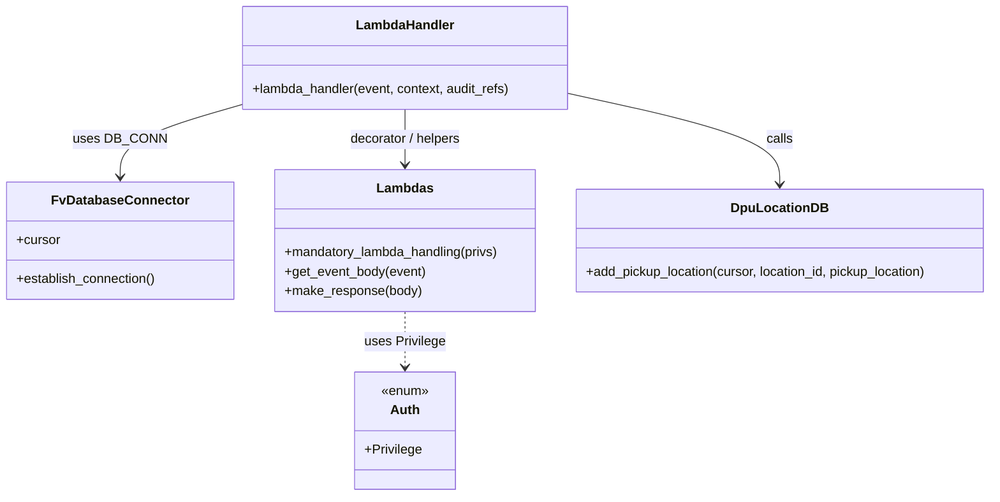

# Diagram: entity_core/entity_service/entity_service/dda/dpu_pickup_location/dpu_location_add.py


> Auto-generated by Obscura crawlers

## Diagram 1

```mermaid
flowchart TD
    Event[Lambda Event] --> GetBody[Get event body]
    GetBody --> CheckLoc{location_id present?}
    CheckLoc -- No --> ErrLoc[BadRequestError: no location_id provided]
    CheckLoc -- Yes --> CheckPickup{pickup_location present?}
    CheckPickup -- No --> ErrPickup[BadRequestError: no pickup_location object provided]
    CheckPickup -- Yes --> Establish[DB_CONN.establish_connection()]
    Establish --> Cursor[DB_CONN.cursor]
    Cursor --> Add[db.add_pickup_location(cursor, location_id, pickup_location)]
    Add --> Resp[make_response({"status":"success"})]
```

> SVG rendering failed for this diagram.

## Diagram 2



### SVG

<svg id="container" width="1224.5859375" xmlns="http://www.w3.org/2000/svg" class="classDiagram" height="608" viewBox="0 0 1224.5859375 608" role="graphics-document document" aria-roledescription="class"><style>#container{font-family:"trebuchet ms",verdana,arial,sans-serif;font-size:16px;fill:#333;}@keyframes edge-animation-frame{from{stroke-dashoffset:0;}}@keyframes dash{to{stroke-dashoffset:0;}}#container .edge-animation-slow{stroke-dasharray:9,5!important;stroke-dashoffset:900;animation:dash 50s linear infinite;stroke-linecap:round;}#container .edge-animation-fast{stroke-dasharray:9,5!important;stroke-dashoffset:900;animation:dash 20s linear infinite;stroke-linecap:round;}#container .error-icon{fill:#552222;}#container .error-text{fill:#552222;stroke:#552222;}#container .edge-thickness-normal{stroke-width:1px;}#container .edge-thickness-thick{stroke-width:3.5px;}#container .edge-pattern-solid{stroke-dasharray:0;}#container .edge-thickness-invisible{stroke-width:0;fill:none;}#container .edge-pattern-dashed{stroke-dasharray:3;}#container .edge-pattern-dotted{stroke-dasharray:2;}#container .marker{fill:#333333;stroke:#333333;}#container .marker.cross{stroke:#333333;}#container svg{font-family:"trebuchet ms",verdana,arial,sans-serif;font-size:16px;}#container p{margin:0;}#container g.classGroup text{fill:#9370DB;stroke:none;font-family:"trebuchet ms",verdana,arial,sans-serif;font-size:10px;}#container g.classGroup text .title{font-weight:bolder;}#container .nodeLabel,#container .edgeLabel{color:#131300;}#container .edgeLabel .label rect{fill:#ECECFF;}#container .label text{fill:#131300;}#container .labelBkg{background:#ECECFF;}#container .edgeLabel .label span{background:#ECECFF;}#container .classTitle{font-weight:bolder;}#container .node rect,#container .node circle,#container .node ellipse,#container .node polygon,#container .node path{fill:#ECECFF;stroke:#9370DB;stroke-width:1px;}#container .divider{stroke:#9370DB;stroke-width:1;}#container g.clickable{cursor:pointer;}#container g.classGroup rect{fill:#ECECFF;stroke:#9370DB;}#container g.classGroup line{stroke:#9370DB;stroke-width:1;}#container .classLabel .box{stroke:none;stroke-width:0;fill:#ECECFF;opacity:0.5;}#container .classLabel .label{fill:#9370DB;font-size:10px;}#container .relation{stroke:#333333;stroke-width:1;fill:none;}#container .dashed-line{stroke-dasharray:3;}#container .dotted-line{stroke-dasharray:1 2;}#container #compositionStart,#container .composition{fill:#333333!important;stroke:#333333!important;stroke-width:1;}#container #compositionEnd,#container .composition{fill:#333333!important;stroke:#333333!important;stroke-width:1;}#container #dependencyStart,#container .dependency{fill:#333333!important;stroke:#333333!important;stroke-width:1;}#container #dependencyStart,#container .dependency{fill:#333333!important;stroke:#333333!important;stroke-width:1;}#container #extensionStart,#container .extension{fill:transparent!important;stroke:#333333!important;stroke-width:1;}#container #extensionEnd,#container .extension{fill:transparent!important;stroke:#333333!important;stroke-width:1;}#container #aggregationStart,#container .aggregation{fill:transparent!important;stroke:#333333!important;stroke-width:1;}#container #aggregationEnd,#container .aggregation{fill:transparent!important;stroke:#333333!important;stroke-width:1;}#container #lollipopStart,#container .lollipop{fill:#ECECFF!important;stroke:#333333!important;stroke-width:1;}#container #lollipopEnd,#container .lollipop{fill:#ECECFF!important;stroke:#333333!important;stroke-width:1;}#container .edgeTerminals{font-size:11px;line-height:initial;}#container .classTitleText{text-anchor:middle;font-size:18px;fill:#333;}#container .label-icon{display:inline-block;height:1em;overflow:visible;vertical-align:-0.125em;}#container .node .label-icon path{fill:currentColor;stroke:revert;stroke-width:revert;}#container :root{--mermaid-font-family:"trebuchet ms",verdana,arial,sans-serif;}</style><g><defs><marker id="container_class-aggregationStart" class="marker aggregation class" refX="18" refY="7" markerWidth="190" markerHeight="240" orient="auto"><path d="M 18,7 L9,13 L1,7 L9,1 Z"></path></marker></defs><defs><marker id="container_class-aggregationEnd" class="marker aggregation class" refX="1" refY="7" markerWidth="20" markerHeight="28" orient="auto"><path d="M 18,7 L9,13 L1,7 L9,1 Z"></path></marker></defs><defs><marker id="container_class-extensionStart" class="marker extension class" refX="18" refY="7" markerWidth="190" markerHeight="240" orient="auto"><path d="M 1,7 L18,13 V 1 Z"></path></marker></defs><defs><marker id="container_class-extensionEnd" class="marker extension class" refX="1" refY="7" markerWidth="20" markerHeight="28" orient="auto"><path d="M 1,1 V 13 L18,7 Z"></path></marker></defs><defs><marker id="container_class-compositionStart" class="marker composition class" refX="18" refY="7" markerWidth="190" markerHeight="240" orient="auto"><path d="M 18,7 L9,13 L1,7 L9,1 Z"></path></marker></defs><defs><marker id="container_class-compositionEnd" class="marker composition class" refX="1" refY="7" markerWidth="20" markerHeight="28" orient="auto"><path d="M 18,7 L9,13 L1,7 L9,1 Z"></path></marker></defs><defs><marker id="container_class-dependencyStart" class="marker dependency class" refX="6" refY="7" markerWidth="190" markerHeight="240" orient="auto"><path d="M 5,7 L9,13 L1,7 L9,1 Z"></path></marker></defs><defs><marker id="container_class-dependencyEnd" class="marker dependency class" refX="13" refY="7" markerWidth="20" markerHeight="28" orient="auto"><path d="M 18,7 L9,13 L14,7 L9,1 Z"></path></marker></defs><defs><marker id="container_class-lollipopStart" class="marker lollipop class" refX="13" refY="7" markerWidth="190" markerHeight="240" orient="auto"><circle stroke="black" fill="transparent" cx="7" cy="7" r="6"></circle></marker></defs><defs><marker id="container_class-lollipopEnd" class="marker lollipop class" refX="1" refY="7" markerWidth="190" markerHeight="240" orient="auto"><circle stroke="black" fill="transparent" cx="7" cy="7" r="6"></circle></marker></defs><g class="root"><g class="clusters"></g><g class="edgePaths"><path d="M496.777,134L496.777,140.167C496.777,146.333,496.777,158.667,496.777,170C496.777,181.333,496.777,191.667,496.777,196.833L496.777,202" id="id_LambdaHandler_Lambdas_1" class="edge-thickness-normal edge-pattern-solid relation" style=";;;" data-edge="true" data-et="edge" data-id="id_LambdaHandler_Lambdas_1" data-points="W3sieCI6NDk2Ljc3NzM0Mzc1LCJ5IjoxMzR9LHsieCI6NDk2Ljc3NzM0Mzc1LCJ5IjoxNzF9LHsieCI6NDk2Ljc3NzM0Mzc1LCJ5IjoyMDh9XQ==" marker-end="url(#container_class-dependencyEnd)"></path><path d="M294.824,128.62L270.068,135.683C245.311,142.747,195.798,156.873,171.042,171.603C146.285,186.333,146.285,201.667,146.285,209.333L146.285,217" id="id_LambdaHandler_FvDatabaseConnector_2" class="edge-thickness-normal edge-pattern-solid relation" style=";;;" data-edge="true" data-et="edge" data-id="id_LambdaHandler_FvDatabaseConnector_2" data-points="W3sieCI6Mjk0LjgyNDIxODc1LCJ5IjoxMjguNjE5ODY0OTIyMDk2MTZ9LHsieCI6MTQ2LjI4NTE1NjI1LCJ5IjoxNzF9LHsieCI6MTQ2LjI4NTE1NjI1LCJ5IjoyMjN9XQ==" marker-end="url(#container_class-dependencyEnd)"></path><path d="M698.73,114.337L742.74,123.781C786.749,133.225,874.767,152.112,918.776,170.723C962.785,189.333,962.785,207.667,962.785,216.833L962.785,226" id="id_LambdaHandler_DpuLocationDB_3" class="edge-thickness-normal edge-pattern-solid relation" style=";;;" data-edge="true" data-et="edge" data-id="id_LambdaHandler_DpuLocationDB_3" data-points="W3sieCI6Njk4LjczMDQ2ODc1LCJ5IjoxMTQuMzM2ODUzOTI4ODE2OTF9LHsieCI6OTYyLjc4NTE1NjI1LCJ5IjoxNzF9LHsieCI6OTYyLjc4NTE1NjI1LCJ5IjoyMzJ9XQ==" marker-end="url(#container_class-dependencyEnd)"></path><path d="M496.777,382L496.777,388.167C496.777,394.333,496.777,406.667,496.777,418C496.777,429.333,496.777,439.667,496.777,444.833L496.777,450" id="id_Lambdas_Auth_4" class="edge-thickness-normal edge-pattern-dashed relation" style=";;;" data-edge="true" data-et="edge" data-id="id_Lambdas_Auth_4" data-points="W3sieCI6NDk2Ljc3NzM0Mzc1LCJ5IjozODJ9LHsieCI6NDk2Ljc3NzM0Mzc1LCJ5Ijo0MTl9LHsieCI6NDk2Ljc3NzM0Mzc1LCJ5Ijo0NTZ9XQ==" marker-end="url(#container_class-dependencyEnd)"></path></g><g class="edgeLabels"><g class="edgeLabel" transform="translate(496.77734375, 171)"><g class="label" data-id="id_LambdaHandler_Lambdas_1" transform="translate(-70.78125, -12)"><foreignObject width="141.5625" height="24"><div xmlns="http://www.w3.org/1999/xhtml" class="labelBkg" style="display: table-cell; white-space: nowrap; line-height: 1.5; max-width: 200px; text-align: center;"><span class="edgeLabel"><p>decorator / helpers</p></span></div></foreignObject></g></g><g class="edgeLabel" transform="translate(146.28515625, 171)"><g class="label" data-id="id_LambdaHandler_FvDatabaseConnector_2" transform="translate(-53.09375, -12)"><foreignObject width="106.1875" height="24"><div xmlns="http://www.w3.org/1999/xhtml" class="labelBkg" style="display: table-cell; white-space: nowrap; line-height: 1.5; max-width: 200px; text-align: center;"><span class="edgeLabel"><p>uses DB_CONN</p></span></div></foreignObject></g></g><g class="edgeLabel" transform="translate(962.78515625, 171)"><g class="label" data-id="id_LambdaHandler_DpuLocationDB_3" transform="translate(-16.4453125, -12)"><foreignObject width="32.890625" height="24"><div xmlns="http://www.w3.org/1999/xhtml" class="labelBkg" style="display: table-cell; white-space: nowrap; line-height: 1.5; max-width: 200px; text-align: center;"><span class="edgeLabel"><p>calls</p></span></div></foreignObject></g></g><g class="edgeLabel" transform="translate(496.77734375, 419)"><g class="label" data-id="id_Lambdas_Auth_4" transform="translate(-49.6953125, -12)"><foreignObject width="99.390625" height="24"><div xmlns="http://www.w3.org/1999/xhtml" class="labelBkg" style="display: table-cell; white-space: nowrap; line-height: 1.5; max-width: 200px; text-align: center;"><span class="edgeLabel"><p>uses Privilege</p></span></div></foreignObject></g></g></g><g class="nodes"><g class="node default" id="classId-FvDatabaseConnector-0" transform="translate(146.28515625, 295)"><g class="basic label-container"><path d="M-138.28515625 -72 L138.28515625 -72 L138.28515625 72 L-138.28515625 72" stroke="none" stroke-width="0" fill="#ECECFF" style=""></path><path d="M-138.28515625 -72 C-55.67561274748384 -72, 26.93393075503232 -72, 138.28515625 -72 M-138.28515625 -72 C-49.34444644047021 -72, 39.596263369059585 -72, 138.28515625 -72 M138.28515625 -72 C138.28515625 -20.075579599073315, 138.28515625 31.84884080185337, 138.28515625 72 M138.28515625 -72 C138.28515625 -18.09124323247338, 138.28515625 35.81751353505324, 138.28515625 72 M138.28515625 72 C80.38124200306771 72, 22.47732775613541 72, -138.28515625 72 M138.28515625 72 C43.3641433684421 72, -51.5568695131158 72, -138.28515625 72 M-138.28515625 72 C-138.28515625 26.695997437398468, -138.28515625 -18.608005125203064, -138.28515625 -72 M-138.28515625 72 C-138.28515625 38.14494231160329, -138.28515625 4.289884623206575, -138.28515625 -72" stroke="#9370DB" stroke-width="1.3" fill="none" stroke-dasharray="0 0" style=""></path></g><g class="annotation-group text" transform="translate(0, -48)"></g><g class="label-group text" transform="translate(-79.3046875, -48)"><g class="label" style="font-weight: bolder" transform="translate(0,-12)"><foreignObject width="158.609375" height="24"><div xmlns="http://www.w3.org/1999/xhtml" style="display: table-cell; white-space: nowrap; line-height: 1.5; max-width: 207px; text-align: center;"><span class="nodeLabel markdown-node-label" style=""><p>FvDatabaseConnector</p></span></div></foreignObject></g></g><g class="members-group text" transform="translate(-126.28515625, 0)"><g class="label" style="" transform="translate(0,-12)"><foreignObject width="53.71875" height="24"><div xmlns="http://www.w3.org/1999/xhtml" style="display: table-cell; white-space: nowrap; line-height: 1.5; max-width: 112px; text-align: center;"><span class="nodeLabel markdown-node-label" style=""><p>+cursor</p></span></div></foreignObject></g></g><g class="methods-group text" transform="translate(-126.28515625, 48)"><g class="label" style="" transform="translate(0,-12)"><foreignObject width="173.265625" height="24"><div xmlns="http://www.w3.org/1999/xhtml" style="display: table-cell; white-space: nowrap; line-height: 1.5; max-width: 231px; text-align: center;"><span class="nodeLabel markdown-node-label" style=""><p>+establish_connection()</p></span></div></foreignObject></g></g><g class="divider" style=""><path d="M-138.28515625 -24 C-80.53860597939084 -24, -22.79205570878169 -24, 138.28515625 -24 M-138.28515625 -24 C-73.60861134201842 -24, -8.932066434036841 -24, 138.28515625 -24" stroke="#9370DB" stroke-width="1.3" fill="none" stroke-dasharray="0 0" style=""></path></g><g class="divider" style=""><path d="M-138.28515625 24 C-44.923493778683536 24, 48.43816869263293 24, 138.28515625 24 M-138.28515625 24 C-67.94501972997149 24, 2.395116790057017 24, 138.28515625 24" stroke="#9370DB" stroke-width="1.3" fill="none" stroke-dasharray="0 0" style=""></path></g></g><g class="node default" id="classId-Lambdas-1" transform="translate(496.77734375, 295)"><g class="basic label-container"><path d="M-162.20703125 -87 L162.20703125 -87 L162.20703125 87 L-162.20703125 87" stroke="none" stroke-width="0" fill="#ECECFF" style=""></path><path d="M-162.20703125 -87 C-64.50496153987706 -87, 33.19710817024588 -87, 162.20703125 -87 M-162.20703125 -87 C-36.6980157960551 -87, 88.8109996578898 -87, 162.20703125 -87 M162.20703125 -87 C162.20703125 -42.71030409241192, 162.20703125 1.579391815176166, 162.20703125 87 M162.20703125 -87 C162.20703125 -27.54308720092869, 162.20703125 31.913825598142623, 162.20703125 87 M162.20703125 87 C75.71211297454033 87, -10.782805300919335 87, -162.20703125 87 M162.20703125 87 C47.6841014822805 87, -66.838828285439 87, -162.20703125 87 M-162.20703125 87 C-162.20703125 31.62807338328895, -162.20703125 -23.7438532334221, -162.20703125 -87 M-162.20703125 87 C-162.20703125 24.8235779705224, -162.20703125 -37.3528440589552, -162.20703125 -87" stroke="#9370DB" stroke-width="1.3" fill="none" stroke-dasharray="0 0" style=""></path></g><g class="annotation-group text" transform="translate(0, -63)"></g><g class="label-group text" transform="translate(-32.9140625, -63)"><g class="label" style="font-weight: bolder" transform="translate(0,-12)"><foreignObject width="65.828125" height="24"><div xmlns="http://www.w3.org/1999/xhtml" style="display: table-cell; white-space: nowrap; line-height: 1.5; max-width: 115px; text-align: center;"><span class="nodeLabel markdown-node-label" style=""><p>Lambdas</p></span></div></foreignObject></g></g><g class="members-group text" transform="translate(-150.20703125, -15)"></g><g class="methods-group text" transform="translate(-150.20703125, 15)"><g class="label" style="" transform="translate(0,-12)"><foreignObject width="267.5" height="24"><div xmlns="http://www.w3.org/1999/xhtml" style="display: table-cell; white-space: nowrap; line-height: 1.5; max-width: 325px; text-align: center;"><span class="nodeLabel markdown-node-label" style=""><p>+mandatory_lambda_handling(privs)</p></span></div></foreignObject></g><g class="label" style="" transform="translate(0,12)"><foreignObject width="174.203125" height="24"><div xmlns="http://www.w3.org/1999/xhtml" style="display: table-cell; white-space: nowrap; line-height: 1.5; max-width: 232px; text-align: center;"><span class="nodeLabel markdown-node-label" style=""><p>+get_event_body(event)</p></span></div></foreignObject></g><g class="label" style="" transform="translate(0,36)"><foreignObject width="168.140625" height="24"><div xmlns="http://www.w3.org/1999/xhtml" style="display: table-cell; white-space: nowrap; line-height: 1.5; max-width: 226px; text-align: center;"><span class="nodeLabel markdown-node-label" style=""><p>+make_response(body)</p></span></div></foreignObject></g></g><g class="divider" style=""><path d="M-162.20703125 -39 C-46.79322698139113 -39, 68.62057728721774 -39, 162.20703125 -39 M-162.20703125 -39 C-83.65564186576033 -39, -5.1042524815206605 -39, 162.20703125 -39" stroke="#9370DB" stroke-width="1.3" fill="none" stroke-dasharray="0 0" style=""></path></g><g class="divider" style=""><path d="M-162.20703125 -15 C-79.37634150298268 -15, 3.454348244034634 -15, 162.20703125 -15 M-162.20703125 -15 C-71.45941110049058 -15, 19.288209049018832 -15, 162.20703125 -15" stroke="#9370DB" stroke-width="1.3" fill="none" stroke-dasharray="0 0" style=""></path></g></g><g class="node default" id="classId-Auth-2" transform="translate(496.77734375, 528)"><g class="basic label-container"><path d="M-61.84375 -72 L61.84375 -72 L61.84375 72 L-61.84375 72" stroke="none" stroke-width="0" fill="#ECECFF" style=""></path><path d="M-61.84375 -72 C-17.44664146466031 -72, 26.95046707067938 -72, 61.84375 -72 M-61.84375 -72 C-32.66441588172826 -72, -3.4850817634565274 -72, 61.84375 -72 M61.84375 -72 C61.84375 -41.644601831249425, 61.84375 -11.28920366249885, 61.84375 72 M61.84375 -72 C61.84375 -29.958991009615538, 61.84375 12.082017980768924, 61.84375 72 M61.84375 72 C27.878960582611107 72, -6.085828834777786 72, -61.84375 72 M61.84375 72 C30.347358203921843 72, -1.1490335921563144 72, -61.84375 72 M-61.84375 72 C-61.84375 34.990284837589726, -61.84375 -2.019430324820547, -61.84375 -72 M-61.84375 72 C-61.84375 15.054262564772046, -61.84375 -41.89147487045591, -61.84375 -72" stroke="#9370DB" stroke-width="1.3" fill="none" stroke-dasharray="0 0" style=""></path></g><g class="annotation-group text" transform="translate(-29.53125, -48)"><g class="label" style="" transform="translate(0,-12)"><foreignObject width="59.0625" height="24"><div xmlns="http://www.w3.org/1999/xhtml" style="display: table-cell; white-space: nowrap; line-height: 1.5; max-width: 109px; text-align: center;"><span class="nodeLabel markdown-node-label" style=""><p>«enum»</p></span></div></foreignObject></g></g><g class="label-group text" transform="translate(-17.0078125, -24)"><g class="label" style="font-weight: bolder" transform="translate(0,-12)"><foreignObject width="34.015625" height="24"><div xmlns="http://www.w3.org/1999/xhtml" style="display: table-cell; white-space: nowrap; line-height: 1.5; max-width: 84px; text-align: center;"><span class="nodeLabel markdown-node-label" style=""><p>Auth</p></span></div></foreignObject></g></g><g class="members-group text" transform="translate(-49.84375, 24)"><g class="label" style="" transform="translate(0,-12)"><foreignObject width="70.15625" height="24"><div xmlns="http://www.w3.org/1999/xhtml" style="display: table-cell; white-space: nowrap; line-height: 1.5; max-width: 128px; text-align: center;"><span class="nodeLabel markdown-node-label" style=""><p>+Privilege</p></span></div></foreignObject></g></g><g class="methods-group text" transform="translate(-49.84375, 72)"></g><g class="divider" style=""><path d="M-61.84375 0 C-13.071336444176666 0, 35.70107711164667 0, 61.84375 0 M-61.84375 0 C-35.270532207628925 0, -8.69731441525785 0, 61.84375 0" stroke="#9370DB" stroke-width="1.3" fill="none" stroke-dasharray="0 0" style=""></path></g><g class="divider" style=""><path d="M-61.84375 48 C-31.857054884962988 48, -1.870359769925976 48, 61.84375 48 M-61.84375 48 C-24.310105070541198 48, 13.223539858917604 48, 61.84375 48" stroke="#9370DB" stroke-width="1.3" fill="none" stroke-dasharray="0 0" style=""></path></g></g><g class="node default" id="classId-DpuLocationDB-3" transform="translate(962.78515625, 295)"><g class="basic label-container"><path d="M-253.80078125 -63 L253.80078125 -63 L253.80078125 63 L-253.80078125 63" stroke="none" stroke-width="0" fill="#ECECFF" style=""></path><path d="M-253.80078125 -63 C-122.42629218239048 -63, 8.948196885219033 -63, 253.80078125 -63 M-253.80078125 -63 C-149.2070831124066 -63, -44.61338497481319 -63, 253.80078125 -63 M253.80078125 -63 C253.80078125 -17.881605432370648, 253.80078125 27.236789135258704, 253.80078125 63 M253.80078125 -63 C253.80078125 -20.53059113346712, 253.80078125 21.93881773306576, 253.80078125 63 M253.80078125 63 C81.48377954015794 63, -90.83322216968412 63, -253.80078125 63 M253.80078125 63 C118.69368446844675 63, -16.413412313106505 63, -253.80078125 63 M-253.80078125 63 C-253.80078125 28.991218140960733, -253.80078125 -5.017563718078534, -253.80078125 -63 M-253.80078125 63 C-253.80078125 36.59591853115853, -253.80078125 10.191837062317063, -253.80078125 -63" stroke="#9370DB" stroke-width="1.3" fill="none" stroke-dasharray="0 0" style=""></path></g><g class="annotation-group text" transform="translate(0, -39)"></g><g class="label-group text" transform="translate(-56.0546875, -39)"><g class="label" style="font-weight: bolder" transform="translate(0,-12)"><foreignObject width="112.109375" height="24"><div xmlns="http://www.w3.org/1999/xhtml" style="display: table-cell; white-space: nowrap; line-height: 1.5; max-width: 162px; text-align: center;"><span class="nodeLabel markdown-node-label" style=""><p>DpuLocationDB</p></span></div></foreignObject></g></g><g class="members-group text" transform="translate(-241.80078125, 9)"></g><g class="methods-group text" transform="translate(-241.80078125, 39)"><g class="label" style="" transform="translate(0,-12)"><foreignObject width="427.546875" height="24"><div xmlns="http://www.w3.org/1999/xhtml" style="display: table-cell; white-space: nowrap; line-height: 1.5; max-width: 485px; text-align: center;"><span class="nodeLabel markdown-node-label" style=""><p>+add_pickup_location(cursor, location_id, pickup_location)</p></span></div></foreignObject></g></g><g class="divider" style=""><path d="M-253.80078125 -15 C-113.40130578402287 -15, 26.998169681954266 -15, 253.80078125 -15 M-253.80078125 -15 C-131.1798465902279 -15, -8.558911930455821 -15, 253.80078125 -15" stroke="#9370DB" stroke-width="1.3" fill="none" stroke-dasharray="0 0" style=""></path></g><g class="divider" style=""><path d="M-253.80078125 9 C-118.71597897201036 9, 16.368823305979276 9, 253.80078125 9 M-253.80078125 9 C-84.36880194371557 9, 85.06317736256887 9, 253.80078125 9" stroke="#9370DB" stroke-width="1.3" fill="none" stroke-dasharray="0 0" style=""></path></g></g><g class="node default" id="classId-LambdaHandler-4" transform="translate(496.77734375, 71)"><g class="basic label-container"><path d="M-201.953125 -63 L201.953125 -63 L201.953125 63 L-201.953125 63" stroke="none" stroke-width="0" fill="#ECECFF" style=""></path><path d="M-201.953125 -63 C-74.76739136382577 -63, 52.41834227234847 -63, 201.953125 -63 M-201.953125 -63 C-112.78281908669904 -63, -23.61251317339807 -63, 201.953125 -63 M201.953125 -63 C201.953125 -25.440066709373312, 201.953125 12.119866581253376, 201.953125 63 M201.953125 -63 C201.953125 -25.92467813932536, 201.953125 11.150643721349283, 201.953125 63 M201.953125 63 C50.36943080091376 63, -101.21426339817248 63, -201.953125 63 M201.953125 63 C77.33843943873622 63, -47.27624612252757 63, -201.953125 63 M-201.953125 63 C-201.953125 35.4514021110309, -201.953125 7.90280422206181, -201.953125 -63 M-201.953125 63 C-201.953125 33.95512360144078, -201.953125 4.910247202881564, -201.953125 -63" stroke="#9370DB" stroke-width="1.3" fill="none" stroke-dasharray="0 0" style=""></path></g><g class="annotation-group text" transform="translate(0, -39)"></g><g class="label-group text" transform="translate(-58.21875, -39)"><g class="label" style="font-weight: bolder" transform="translate(0,-12)"><foreignObject width="116.4375" height="24"><div xmlns="http://www.w3.org/1999/xhtml" style="display: table-cell; white-space: nowrap; line-height: 1.5; max-width: 167px; text-align: center;"><span class="nodeLabel markdown-node-label" style=""><p>LambdaHandler</p></span></div></foreignObject></g></g><g class="members-group text" transform="translate(-189.953125, 9)"></g><g class="methods-group text" transform="translate(-189.953125, 39)"><g class="label" style="" transform="translate(0,-12)"><foreignObject width="321.6875" height="24"><div xmlns="http://www.w3.org/1999/xhtml" style="display: table-cell; white-space: nowrap; line-height: 1.5; max-width: 379px; text-align: center;"><span class="nodeLabel markdown-node-label" style=""><p>+lambda_handler(event, context, audit_refs)</p></span></div></foreignObject></g></g><g class="divider" style=""><path d="M-201.953125 -15 C-64.86987911865549 -15, 72.21336676268902 -15, 201.953125 -15 M-201.953125 -15 C-52.11182396058817 -15, 97.72947707882366 -15, 201.953125 -15" stroke="#9370DB" stroke-width="1.3" fill="none" stroke-dasharray="0 0" style=""></path></g><g class="divider" style=""><path d="M-201.953125 9 C-112.53332483549505 9, -23.113524670990103 9, 201.953125 9 M-201.953125 9 C-108.67381905027887 9, -15.394513100557731 9, 201.953125 9" stroke="#9370DB" stroke-width="1.3" fill="none" stroke-dasharray="0 0" style=""></path></g></g></g></g></g></svg>
