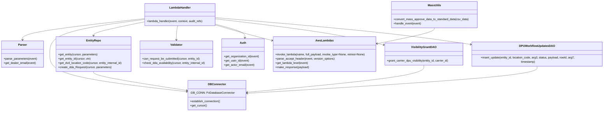

# Diagram: entity_core/entity_service/entity_service/dda/request_workflow/submit_request.py


> Auto-generated by Obscura crawlers

## Diagram 1

```mermaid
flowchart TD
    Start([Start]) --> Parse[Parse event & headers]
    Parse --> VersionCheck{Version == DDA_MASS_SUBMIT\nand Accept contains "text/csv"?}
    VersionCheck -- Yes --> MassSubmit[Mass Submit Path]
    VersionCheck -- No --> SingleSubmit[Single Submit Path]
    MassSubmit --> CSVLines[Split csvData into lines & drop header]
    CSVLines --> CSVEmpty{No data after header?}
    CSVEmpty -- Yes --> MassSuccess[Return SUCCESS]
    CSVEmpty -- No --> CSVParse[Parse CSV rows]
    CSVParse --> Convert[convert_mass_approve_data_to_standard_data]
    Convert --> IterateVINs[For each VIN (deduplicated)]
    IterateVINs --> FindEntity[get_entity_id(vin)]
    FindEntity --> MissingVIN{entity_id == ""}
    MissingVIN -- Yes --> AddFailed[Add VIN to failed_vins]
    MissingVIN -- No --> CheckAvailability[check_dda_availability(entity_id)]
    CheckAvailability -- NotAvailable --> AddFailed
    CheckAvailability -- Available --> CanSubmitCheck[can_request_be_submitted(entity_id)]
    CanSubmitCheck -- False --> AddFailed
    CanSubmitCheck -- True --> InvokeAsync[Invoke submit_request (Event) for entity_id]
    InvokeAsync --> IterateVINs
    IterateVINs --> AllDone{All VINs processed}
    AllDone -- FailedExists --> MassFailed[Return FAILED with vins_and_reasons]
    AllDone -- NoFailures --> MassSuccess
    SingleSubmit --> CanSubmit{can_request_be_submitted(internal_id)}
    CanSubmit -- False --> ErrorBadRequest[Raise BadRequestError]
    CanSubmit -- True --> GetEntity[get_entity(cursor, parameters)]
    GetEntity --> SetParams[Set solution_id & external_id]
    SetParams --> Solution[invoke_get_solution(solution_id)]
    Solution --> ResolveCustomer{customer_id found?}
    ResolveCustomer -- No --> ErrorBadRequest
    ResolveCustomer -- Yes --> GetCarrier[get_carrier(cursor, parameters, customer_id)]
    GetCarrier --> OrgData[get_org_data(event, carrier_fv_id)]
    OrgData --> GrantVisibility[VisibilityGrantDAO.grant_carrier_dpu_visibility(entity.id, carrier_id)]
    GrantVisibility --> Timestamp[Set timestamp, pre_status, location_code]
    Timestamp --> Insert[create_dda_Request(cursor, parameters)]
    Insert --> LogUpdate[log_workflow_update(rowId, parameters)]
    LogUpdate --> InsertCheck{rowId is None?}
    InsertCheck -- Yes --> ErrorNotFound[Raise NotFoundError]
    InsertCheck -- No --> SingleSuccess[Return SUCCESS with dda_id]
```

> SVG rendering failed for this diagram.

## Diagram 2



### SVG

<svg id="container" width="3441.671875" xmlns="http://www.w3.org/2000/svg" class="classDiagram" height="632" viewBox="0 0 3441.671875 632" role="graphics-document document" aria-roledescription="class"><style>#container{font-family:"trebuchet ms",verdana,arial,sans-serif;font-size:16px;fill:#333;}@keyframes edge-animation-frame{from{stroke-dashoffset:0;}}@keyframes dash{to{stroke-dashoffset:0;}}#container .edge-animation-slow{stroke-dasharray:9,5!important;stroke-dashoffset:900;animation:dash 50s linear infinite;stroke-linecap:round;}#container .edge-animation-fast{stroke-dasharray:9,5!important;stroke-dashoffset:900;animation:dash 20s linear infinite;stroke-linecap:round;}#container .error-icon{fill:#552222;}#container .error-text{fill:#552222;stroke:#552222;}#container .edge-thickness-normal{stroke-width:1px;}#container .edge-thickness-thick{stroke-width:3.5px;}#container .edge-pattern-solid{stroke-dasharray:0;}#container .edge-thickness-invisible{stroke-width:0;fill:none;}#container .edge-pattern-dashed{stroke-dasharray:3;}#container .edge-pattern-dotted{stroke-dasharray:2;}#container .marker{fill:#333333;stroke:#333333;}#container .marker.cross{stroke:#333333;}#container svg{font-family:"trebuchet ms",verdana,arial,sans-serif;font-size:16px;}#container p{margin:0;}#container g.classGroup text{fill:#9370DB;stroke:none;font-family:"trebuchet ms",verdana,arial,sans-serif;font-size:10px;}#container g.classGroup text .title{font-weight:bolder;}#container .nodeLabel,#container .edgeLabel{color:#131300;}#container .edgeLabel .label rect{fill:#ECECFF;}#container .label text{fill:#131300;}#container .labelBkg{background:#ECECFF;}#container .edgeLabel .label span{background:#ECECFF;}#container .classTitle{font-weight:bolder;}#container .node rect,#container .node circle,#container .node ellipse,#container .node polygon,#container .node path{fill:#ECECFF;stroke:#9370DB;stroke-width:1px;}#container .divider{stroke:#9370DB;stroke-width:1;}#container g.clickable{cursor:pointer;}#container g.classGroup rect{fill:#ECECFF;stroke:#9370DB;}#container g.classGroup line{stroke:#9370DB;stroke-width:1;}#container .classLabel .box{stroke:none;stroke-width:0;fill:#ECECFF;opacity:0.5;}#container .classLabel .label{fill:#9370DB;font-size:10px;}#container .relation{stroke:#333333;stroke-width:1;fill:none;}#container .dashed-line{stroke-dasharray:3;}#container .dotted-line{stroke-dasharray:1 2;}#container #compositionStart,#container .composition{fill:#333333!important;stroke:#333333!important;stroke-width:1;}#container #compositionEnd,#container .composition{fill:#333333!important;stroke:#333333!important;stroke-width:1;}#container #dependencyStart,#container .dependency{fill:#333333!important;stroke:#333333!important;stroke-width:1;}#container #dependencyStart,#container .dependency{fill:#333333!important;stroke:#333333!important;stroke-width:1;}#container #extensionStart,#container .extension{fill:transparent!important;stroke:#333333!important;stroke-width:1;}#container #extensionEnd,#container .extension{fill:transparent!important;stroke:#333333!important;stroke-width:1;}#container #aggregationStart,#container .aggregation{fill:transparent!important;stroke:#333333!important;stroke-width:1;}#container #aggregationEnd,#container .aggregation{fill:transparent!important;stroke:#333333!important;stroke-width:1;}#container #lollipopStart,#container .lollipop{fill:#ECECFF!important;stroke:#333333!important;stroke-width:1;}#container #lollipopEnd,#container .lollipop{fill:#ECECFF!important;stroke:#333333!important;stroke-width:1;}#container .edgeTerminals{font-size:11px;line-height:initial;}#container .classTitleText{text-anchor:middle;font-size:18px;fill:#333;}#container .label-icon{display:inline-block;height:1em;overflow:visible;vertical-align:-0.125em;}#container .node .label-icon path{fill:currentColor;stroke:revert;stroke-width:revert;}#container :root{--mermaid-font-family:"trebuchet ms",verdana,arial,sans-serif;}</style><g><defs><marker id="container_class-aggregationStart" class="marker aggregation class" refX="18" refY="7" markerWidth="190" markerHeight="240" orient="auto"><path d="M 18,7 L9,13 L1,7 L9,1 Z"></path></marker></defs><defs><marker id="container_class-aggregationEnd" class="marker aggregation class" refX="1" refY="7" markerWidth="20" markerHeight="28" orient="auto"><path d="M 18,7 L9,13 L1,7 L9,1 Z"></path></marker></defs><defs><marker id="container_class-extensionStart" class="marker extension class" refX="18" refY="7" markerWidth="190" markerHeight="240" orient="auto"><path d="M 1,7 L18,13 V 1 Z"></path></marker></defs><defs><marker id="container_class-extensionEnd" class="marker extension class" refX="1" refY="7" markerWidth="20" markerHeight="28" orient="auto"><path d="M 1,1 V 13 L18,7 Z"></path></marker></defs><defs><marker id="container_class-compositionStart" class="marker composition class" refX="18" refY="7" markerWidth="190" markerHeight="240" orient="auto"><path d="M 18,7 L9,13 L1,7 L9,1 Z"></path></marker></defs><defs><marker id="container_class-compositionEnd" class="marker composition class" refX="1" refY="7" markerWidth="20" markerHeight="28" orient="auto"><path d="M 18,7 L9,13 L1,7 L9,1 Z"></path></marker></defs><defs><marker id="container_class-dependencyStart" class="marker dependency class" refX="6" refY="7" markerWidth="190" markerHeight="240" orient="auto"><path d="M 5,7 L9,13 L1,7 L9,1 Z"></path></marker></defs><defs><marker id="container_class-dependencyEnd" class="marker dependency class" refX="13" refY="7" markerWidth="20" markerHeight="28" orient="auto"><path d="M 18,7 L9,13 L14,7 L9,1 Z"></path></marker></defs><defs><marker id="container_class-lollipopStart" class="marker lollipop class" refX="13" refY="7" markerWidth="190" markerHeight="240" orient="auto"><circle stroke="black" fill="transparent" cx="7" cy="7" r="6"></circle></marker></defs><defs><marker id="container_class-lollipopEnd" class="marker lollipop class" refX="1" refY="7" markerWidth="190" markerHeight="240" orient="auto"><circle stroke="black" fill="transparent" cx="7" cy="7" r="6"></circle></marker></defs><g class="root"><g class="clusters"></g><g class="edgePaths"><path d="M825.516,105.412L708.99,118.343C592.464,131.274,359.411,157.137,242.885,177.235C126.359,197.333,126.359,211.667,126.359,218.833L126.359,226" id="id_LambdaHandler_Parser_1" class="edge-thickness-normal edge-pattern-solid relation" style=";;;" data-edge="true" data-et="edge" data-id="id_LambdaHandler_Parser_1" data-points="W3sieCI6ODI1LjUxNTYyNSwieSI6MTA1LjQxMTYxMDY4ODIxNDE4fSx7IngiOjEyNi4zNTkzNzUsInkiOjE4M30seyJ4IjoxMjYuMzU5Mzc1LCJ5IjoyMzJ9XQ==" marker-end="url(#container_class-dependencyEnd)"></path><path d="M825.516,110.008L734.549,122.173C643.583,134.339,461.651,158.669,370.685,191.501C279.719,224.333,279.719,265.667,279.719,307C279.719,348.333,279.719,389.667,412.324,425.43C544.929,461.193,810.139,491.386,942.744,506.483L1075.349,521.579" id="id_LambdaHandler_DBConnector_2" class="edge-thickness-normal edge-pattern-solid relation" style=";;;" data-edge="true" data-et="edge" data-id="id_LambdaHandler_DBConnector_2" data-points="W3sieCI6ODI1LjUxNTYyNSwieSI6MTEwLjAwODEwNzY1NjMwMjI0fSx7IngiOjI3OS43MTg3NSwieSI6MTgzfSx7IngiOjI3OS43MTg3NSwieSI6MzA3fSx7IngiOjI3OS43MTg3NSwieSI6NDMxfSx7IngiOjEwODEuMzEwNTQ2ODc1LCJ5Ijo1MjIuMjU3ODQ2MTc1MTg3Mn1d" marker-end="url(#container_class-dependencyEnd)"></path><path d="M825.516,123.644L776.361,133.537C727.207,143.43,628.898,163.215,579.744,176.274C530.59,189.333,530.59,195.667,530.59,198.833L530.59,202" id="id_LambdaHandler_EntityRepo_3" class="edge-thickness-normal edge-pattern-solid relation" style=";;;" data-edge="true" data-et="edge" data-id="id_LambdaHandler_EntityRepo_3" data-points="W3sieCI6ODI1LjUxNTYyNSwieSI6MTIzLjY0NDMzNDU1NzExODI3fSx7IngiOjUzMC41ODk4NDM3NSwieSI6MTgzfSx7IngiOjUzMC41ODk4NDM3NSwieSI6MjA4fV0=" marker-end="url(#container_class-dependencyEnd)"></path><path d="M1014.869,146L1013.635,152.167C1012.402,158.333,1009.935,170.667,1008.702,184C1007.469,197.333,1007.469,211.667,1007.469,218.833L1007.469,226" id="id_LambdaHandler_Validator_4" class="edge-thickness-normal edge-pattern-solid relation" style=";;;" data-edge="true" data-et="edge" data-id="id_LambdaHandler_Validator_4" data-points="W3sieCI6MTAxNC44Njg3NSwieSI6MTQ2fSx7IngiOjEwMDcuNDY4NzUsInkiOjE4M30seyJ4IjoxMDA3LjQ2ODc1LCJ5IjoyMzJ9XQ==" marker-end="url(#container_class-dependencyEnd)"></path><path d="M1229.422,141.227L1253.569,148.189C1277.716,155.152,1326.01,169.076,1380.389,183.879C1434.767,198.683,1495.23,214.366,1525.461,222.208L1555.692,230.05" id="id_LambdaHandler_AwsLambdas_5" class="edge-thickness-normal edge-pattern-solid relation" style=";;;" data-edge="true" data-et="edge" data-id="id_LambdaHandler_AwsLambdas_5" data-points="W3sieCI6MTIyOS40MjE4NzUsInkiOjE0MS4yMjcyNzc4NDY2MDQzNX0seyJ4IjoxMzc0LjMwNDY4NzUsInkiOjE4M30seyJ4IjoxNTYxLjUsInkiOjIzMS41NTU5Njg2NTUyNjUxM31d" marker-end="url(#container_class-dependencyEnd)"></path><path d="M1229.422,136.592L1258.569,144.326C1287.716,152.061,1346.01,167.531,1374.56,180.439C1403.11,193.347,1401.916,203.693,1401.318,208.866L1400.721,214.04" id="id_LambdaHandler_Auth_6" class="edge-thickness-normal edge-pattern-solid relation" style=";;;" data-edge="true" data-et="edge" data-id="id_LambdaHandler_Auth_6" data-points="W3sieCI6MTIyOS40MjE4NzUsInkiOjEzNi41OTE3OTAxOTM4NDI2Nn0seyJ4IjoxNDA0LjMwNDY4NzUsInkiOjE4M30seyJ4IjoxNDAwLjAzMjg1NjYwMjgyMjcsInkiOjIyMH1d" marker-end="url(#container_class-dependencyEnd)"></path><path d="M1229.422,106.743L1337.524,119.453C1445.627,132.162,1661.832,157.581,1821.489,182.142C1981.146,206.702,2084.255,230.405,2135.809,242.256L2187.363,254.107" id="id_LambdaHandler_VisibilityGrantDAO_7" class="edge-thickness-normal edge-pattern-solid relation" style=";;;" data-edge="true" data-et="edge" data-id="id_LambdaHandler_VisibilityGrantDAO_7" data-points="W3sieCI6MTIyOS40MjE4NzUsInkiOjEwNi43NDMzMTUwMTY4NDMwNn0seyJ4IjoxODc4LjAzNzEwOTM3NSwieSI6MTgzfSx7IngiOjIxOTMuMjEwOTM3NSwieSI6MjU1LjQ1MTYwMjM5MTE4NTQ3fV0=" marker-end="url(#container_class-dependencyEnd)"></path><path d="M1229.422,100.069L1392.96,113.891C1556.499,127.712,1883.576,155.356,2126.298,180.702C2369.021,206.048,2527.389,229.096,2606.574,240.62L2685.758,252.144" id="id_LambdaHandler_DPUWorkflowUpdatesDAO_8" class="edge-thickness-normal edge-pattern-solid relation" style=";;;" data-edge="true" data-et="edge" data-id="id_LambdaHandler_DPUWorkflowUpdatesDAO_8" data-points="W3sieCI6MTIyOS40MjE4NzUsInkiOjEwMC4wNjg2MjExMzkzMzg3Mn0seyJ4IjoyMjEwLjY1MjM0Mzc1LCJ5IjoxODN9LHsieCI6MjY5MS42OTUzMTI1LCJ5IjoyNTMuMDA4MzgwNzA3ODY3MjJ9XQ==" marker-end="url(#container_class-dependencyEnd)"></path><path d="M2477.52,158L2477.52,162.167C2477.52,166.333,2477.52,174.667,2422.782,189.69C2368.045,204.714,2258.571,226.428,2203.833,237.285L2149.096,248.142" id="id_MassUtils_AwsLambdas_9" class="edge-thickness-normal edge-pattern-solid relation" style=";;;" data-edge="true" data-et="edge" data-id="id_MassUtils_AwsLambdas_9" data-points="W3sieCI6MjQ3Ny41MTk1MzEyNSwieSI6MTU4fSx7IngiOjI0NzcuNTE5NTMxMjUsInkiOjE4M30seyJ4IjoyMTQzLjIxMDkzNzUsInkiOjI0OS4zMDk0MTg3Nzc1NzA5fV0=" marker-end="url(#container_class-dependencyEnd)"></path><path d="M530.59,406L530.59,410.167C530.59,414.333,530.59,422.667,621.388,440.841C712.187,459.015,893.784,487.029,984.582,501.036L1075.381,515.044" id="id_EntityRepo_DBConnector_10" class="edge-thickness-normal edge-pattern-solid relation" style=";;;" data-edge="true" data-et="edge" data-id="id_EntityRepo_DBConnector_10" data-points="W3sieCI6NTMwLjU4OTg0Mzc1LCJ5Ijo0MDZ9LHsieCI6NTMwLjU4OTg0Mzc1LCJ5Ijo0MzF9LHsieCI6MTA4MS4zMTA1NDY4NzUsInkiOjUxNS45NTgzNTkyNDgyMzI5fV0=" marker-end="url(#container_class-dependencyEnd)"></path><path d="M2417.453,370L2417.453,380.167C2417.453,390.333,2417.453,410.667,2247.706,436.509C2077.96,462.352,1738.466,493.704,1568.719,509.38L1398.973,525.056" id="id_VisibilityGrantDAO_DBConnector_11" class="edge-thickness-normal edge-pattern-solid relation" style=";;;" data-edge="true" data-et="edge" data-id="id_VisibilityGrantDAO_DBConnector_11" data-points="W3sieCI6MjQxNy40NTMxMjUsInkiOjM3MH0seyJ4IjoyNDE3LjQ1MzEyNSwieSI6NDMxfSx7IngiOjEzOTIuOTk4MDQ2ODc1LCJ5Ijo1MjUuNjA3OTA4NDg0NTEwNX1d" marker-end="url(#container_class-dependencyEnd)"></path><path d="M3062.684,370L3062.684,380.167C3062.684,390.333,3062.684,410.667,2785.401,437.39C2508.118,464.112,1953.553,497.225,1676.27,513.781L1398.987,530.337" id="id_DPUWorkflowUpdatesDAO_DBConnector_12" class="edge-thickness-normal edge-pattern-solid relation" style=";;;" data-edge="true" data-et="edge" data-id="id_DPUWorkflowUpdatesDAO_DBConnector_12" data-points="W3sieCI6MzA2Mi42ODM1OTM3NSwieSI6MzcwfSx7IngiOjMwNjIuNjgzNTkzNzUsInkiOjQzMX0seyJ4IjoxMzkyLjk5ODA0Njg3NSwieSI6NTMwLjY5NDc3MDY3MzMxNzJ9XQ==" marker-end="url(#container_class-dependencyEnd)"></path></g><g class="edgeLabels"><g class="edgeLabel"><g class="label" data-id="id_LambdaHandler_Parser_1" transform="translate(0, 0)"><foreignObject width="0" height="0"><div xmlns="http://www.w3.org/1999/xhtml" class="labelBkg" style="display: table-cell; white-space: nowrap; line-height: 1.5; max-width: 200px; text-align: center;"><span class="edgeLabel"></span></div></foreignObject></g></g><g class="edgeLabel"><g class="label" data-id="id_LambdaHandler_DBConnector_2" transform="translate(0, 0)"><foreignObject width="0" height="0"><div xmlns="http://www.w3.org/1999/xhtml" class="labelBkg" style="display: table-cell; white-space: nowrap; line-height: 1.5; max-width: 200px; text-align: center;"><span class="edgeLabel"></span></div></foreignObject></g></g><g class="edgeLabel"><g class="label" data-id="id_LambdaHandler_EntityRepo_3" transform="translate(0, 0)"><foreignObject width="0" height="0"><div xmlns="http://www.w3.org/1999/xhtml" class="labelBkg" style="display: table-cell; white-space: nowrap; line-height: 1.5; max-width: 200px; text-align: center;"><span class="edgeLabel"></span></div></foreignObject></g></g><g class="edgeLabel"><g class="label" data-id="id_LambdaHandler_Validator_4" transform="translate(0, 0)"><foreignObject width="0" height="0"><div xmlns="http://www.w3.org/1999/xhtml" class="labelBkg" style="display: table-cell; white-space: nowrap; line-height: 1.5; max-width: 200px; text-align: center;"><span class="edgeLabel"></span></div></foreignObject></g></g><g class="edgeLabel"><g class="label" data-id="id_LambdaHandler_AwsLambdas_5" transform="translate(0, 0)"><foreignObject width="0" height="0"><div xmlns="http://www.w3.org/1999/xhtml" class="labelBkg" style="display: table-cell; white-space: nowrap; line-height: 1.5; max-width: 200px; text-align: center;"><span class="edgeLabel"></span></div></foreignObject></g></g><g class="edgeLabel"><g class="label" data-id="id_LambdaHandler_Auth_6" transform="translate(0, 0)"><foreignObject width="0" height="0"><div xmlns="http://www.w3.org/1999/xhtml" class="labelBkg" style="display: table-cell; white-space: nowrap; line-height: 1.5; max-width: 200px; text-align: center;"><span class="edgeLabel"></span></div></foreignObject></g></g><g class="edgeLabel"><g class="label" data-id="id_LambdaHandler_VisibilityGrantDAO_7" transform="translate(0, 0)"><foreignObject width="0" height="0"><div xmlns="http://www.w3.org/1999/xhtml" class="labelBkg" style="display: table-cell; white-space: nowrap; line-height: 1.5; max-width: 200px; text-align: center;"><span class="edgeLabel"></span></div></foreignObject></g></g><g class="edgeLabel"><g class="label" data-id="id_LambdaHandler_DPUWorkflowUpdatesDAO_8" transform="translate(0, 0)"><foreignObject width="0" height="0"><div xmlns="http://www.w3.org/1999/xhtml" class="labelBkg" style="display: table-cell; white-space: nowrap; line-height: 1.5; max-width: 200px; text-align: center;"><span class="edgeLabel"></span></div></foreignObject></g></g><g class="edgeLabel"><g class="label" data-id="id_MassUtils_AwsLambdas_9" transform="translate(0, 0)"><foreignObject width="0" height="0"><div xmlns="http://www.w3.org/1999/xhtml" class="labelBkg" style="display: table-cell; white-space: nowrap; line-height: 1.5; max-width: 200px; text-align: center;"><span class="edgeLabel"></span></div></foreignObject></g></g><g class="edgeLabel"><g class="label" data-id="id_EntityRepo_DBConnector_10" transform="translate(0, 0)"><foreignObject width="0" height="0"><div xmlns="http://www.w3.org/1999/xhtml" class="labelBkg" style="display: table-cell; white-space: nowrap; line-height: 1.5; max-width: 200px; text-align: center;"><span class="edgeLabel"></span></div></foreignObject></g></g><g class="edgeLabel"><g class="label" data-id="id_VisibilityGrantDAO_DBConnector_11" transform="translate(0, 0)"><foreignObject width="0" height="0"><div xmlns="http://www.w3.org/1999/xhtml" class="labelBkg" style="display: table-cell; white-space: nowrap; line-height: 1.5; max-width: 200px; text-align: center;"><span class="edgeLabel"></span></div></foreignObject></g></g><g class="edgeLabel"><g class="label" data-id="id_DPUWorkflowUpdatesDAO_DBConnector_12" transform="translate(0, 0)"><foreignObject width="0" height="0"><div xmlns="http://www.w3.org/1999/xhtml" class="labelBkg" style="display: table-cell; white-space: nowrap; line-height: 1.5; max-width: 200px; text-align: center;"><span class="edgeLabel"></span></div></foreignObject></g></g></g><g class="nodes"><g class="node default" id="classId-LambdaHandler-0" transform="translate(1027.46875, 83)"><g class="basic label-container"><path d="M-201.953125 -63 L201.953125 -63 L201.953125 63 L-201.953125 63" stroke="none" stroke-width="0" fill="#ECECFF" style=""></path><path d="M-201.953125 -63 C-103.02934618218926 -63, -4.1055673643785155 -63, 201.953125 -63 M-201.953125 -63 C-79.88111373579615 -63, 42.1908975284077 -63, 201.953125 -63 M201.953125 -63 C201.953125 -21.54833487603448, 201.953125 19.903330247931038, 201.953125 63 M201.953125 -63 C201.953125 -16.12391662129683, 201.953125 30.752166757406343, 201.953125 63 M201.953125 63 C41.134813268429724 63, -119.68349846314055 63, -201.953125 63 M201.953125 63 C57.176213782308565 63, -87.60069743538287 63, -201.953125 63 M-201.953125 63 C-201.953125 13.806222651128138, -201.953125 -35.387554697743724, -201.953125 -63 M-201.953125 63 C-201.953125 22.66067987214351, -201.953125 -17.678640255712978, -201.953125 -63" stroke="#9370DB" stroke-width="1.3" fill="none" stroke-dasharray="0 0" style=""></path></g><g class="annotation-group text" transform="translate(0, -39)"></g><g class="label-group text" transform="translate(-58.21875, -39)"><g class="label" style="font-weight: bolder" transform="translate(0,-12)"><foreignObject width="116.4375" height="24"><div xmlns="http://www.w3.org/1999/xhtml" style="display: table-cell; white-space: nowrap; line-height: 1.5; max-width: 167px; text-align: center;"><span class="nodeLabel markdown-node-label" style=""><p>LambdaHandler</p></span></div></foreignObject></g></g><g class="members-group text" transform="translate(-189.953125, 9)"></g><g class="methods-group text" transform="translate(-189.953125, 39)"><g class="label" style="" transform="translate(0,-12)"><foreignObject width="321.6875" height="24"><div xmlns="http://www.w3.org/1999/xhtml" style="display: table-cell; white-space: nowrap; line-height: 1.5; max-width: 379px; text-align: center;"><span class="nodeLabel markdown-node-label" style=""><p>+lambda_handler(event, context, audit_refs)</p></span></div></foreignObject></g></g><g class="divider" style=""><path d="M-201.953125 -15 C-77.57897484968215 -15, 46.79517530063569 -15, 201.953125 -15 M-201.953125 -15 C-74.12793881688181 -15, 53.69724736623638 -15, 201.953125 -15" stroke="#9370DB" stroke-width="1.3" fill="none" stroke-dasharray="0 0" style=""></path></g><g class="divider" style=""><path d="M-201.953125 9 C-63.46849702849525 9, 75.0161309430095 9, 201.953125 9 M-201.953125 9 C-85.71296654378128 9, 30.527191912437445 9, 201.953125 9" stroke="#9370DB" stroke-width="1.3" fill="none" stroke-dasharray="0 0" style=""></path></g></g><g class="node default" id="classId-Parser-1" transform="translate(126.359375, 307)"><g class="basic label-container"><path d="M-118.359375 -75 L118.359375 -75 L118.359375 75 L-118.359375 75" stroke="none" stroke-width="0" fill="#ECECFF" style=""></path><path d="M-118.359375 -75 C-70.14451768799383 -75, -21.929660375987652 -75, 118.359375 -75 M-118.359375 -75 C-62.76897596178931 -75, -7.178576923578618 -75, 118.359375 -75 M118.359375 -75 C118.359375 -29.767324234958473, 118.359375 15.465351530083055, 118.359375 75 M118.359375 -75 C118.359375 -23.833876822537306, 118.359375 27.33224635492539, 118.359375 75 M118.359375 75 C47.7313991876228 75, -22.896576624754402 75, -118.359375 75 M118.359375 75 C54.71061610785582 75, -8.93814278428836 75, -118.359375 75 M-118.359375 75 C-118.359375 34.96187661927905, -118.359375 -5.076246761441894, -118.359375 -75 M-118.359375 75 C-118.359375 21.674982406361565, -118.359375 -31.65003518727687, -118.359375 -75" stroke="#9370DB" stroke-width="1.3" fill="none" stroke-dasharray="0 0" style=""></path></g><g class="annotation-group text" transform="translate(0, -51)"></g><g class="label-group text" transform="translate(-23.375, -51)"><g class="label" style="font-weight: bolder" transform="translate(0,-12)"><foreignObject width="46.75" height="24"><div xmlns="http://www.w3.org/1999/xhtml" style="display: table-cell; white-space: nowrap; line-height: 1.5; max-width: 96px; text-align: center;"><span class="nodeLabel markdown-node-label" style=""><p>Parser</p></span></div></foreignObject></g></g><g class="members-group text" transform="translate(-106.359375, -3)"></g><g class="methods-group text" transform="translate(-106.359375, 27)"><g class="label" style="" transform="translate(0,-12)"><foreignObject width="189.34375" height="24"><div xmlns="http://www.w3.org/1999/xhtml" style="display: table-cell; white-space: nowrap; line-height: 1.5; max-width: 247px; text-align: center;"><span class="nodeLabel markdown-node-label" style=""><p>+parse_parameters(event)</p></span></div></foreignObject></g><g class="label" style="" transform="translate(0,12)"><foreignObject width="182.484375" height="24"><div xmlns="http://www.w3.org/1999/xhtml" style="display: table-cell; white-space: nowrap; line-height: 1.5; max-width: 240px; text-align: center;"><span class="nodeLabel markdown-node-label" style=""><p>+get_dealer_email(event)</p></span></div></foreignObject></g></g><g class="divider" style=""><path d="M-118.359375 -27 C-38.3256775339288 -27, 41.708019932142406 -27, 118.359375 -27 M-118.359375 -27 C-53.1716046606665 -27, 12.016165678666994 -27, 118.359375 -27" stroke="#9370DB" stroke-width="1.3" fill="none" stroke-dasharray="0 0" style=""></path></g><g class="divider" style=""><path d="M-118.359375 -3 C-27.721765630744983 -3, 62.915843738510034 -3, 118.359375 -3 M-118.359375 -3 C-68.43889760580868 -3, -18.518420211617368 -3, 118.359375 -3" stroke="#9370DB" stroke-width="1.3" fill="none" stroke-dasharray="0 0" style=""></path></g></g><g class="node default" id="classId-DBConnector-2" transform="translate(1237.154296875, 540)"><g class="basic label-container"><path d="M-155.84375 -84 L155.84375 -84 L155.84375 84 L-155.84375 84" stroke="none" stroke-width="0" fill="#ECECFF" style=""></path><path d="M-155.84375 -84 C-42.66423245949129 -84, 70.51528508101742 -84, 155.84375 -84 M-155.84375 -84 C-57.14533009588936 -84, 41.55308980822127 -84, 155.84375 -84 M155.84375 -84 C155.84375 -24.879434738498404, 155.84375 34.24113052300319, 155.84375 84 M155.84375 -84 C155.84375 -26.02314288132918, 155.84375 31.953714237341643, 155.84375 84 M155.84375 84 C41.31186950629116 84, -73.22001098741768 84, -155.84375 84 M155.84375 84 C77.66866752784792 84, -0.5064149443041686 84, -155.84375 84 M-155.84375 84 C-155.84375 46.87193053050848, -155.84375 9.743861061016958, -155.84375 -84 M-155.84375 84 C-155.84375 29.546462462204495, -155.84375 -24.90707507559101, -155.84375 -84" stroke="#9370DB" stroke-width="1.3" fill="none" stroke-dasharray="0 0" style=""></path></g><g class="annotation-group text" transform="translate(0, -60)"></g><g class="label-group text" transform="translate(-47.5625, -60)"><g class="label" style="font-weight: bolder" transform="translate(0,-12)"><foreignObject width="95.125" height="24"><div xmlns="http://www.w3.org/1999/xhtml" style="display: table-cell; white-space: nowrap; line-height: 1.5; max-width: 145px; text-align: center;"><span class="nodeLabel markdown-node-label" style=""><p>DBConnector</p></span></div></foreignObject></g></g><g class="members-group text" transform="translate(-143.84375, -12)"><g class="label" style="" transform="translate(0,-12)"><foreignObject width="240.125" height="24"><div xmlns="http://www.w3.org/1999/xhtml" style="display: table-cell; white-space: nowrap; line-height: 1.5; max-width: 298px; text-align: center;"><span class="nodeLabel markdown-node-label" style=""><p>-DB_CONN: FvDatabaseConnector</p></span></div></foreignObject></g></g><g class="methods-group text" transform="translate(-143.84375, 36)"><g class="label" style="" transform="translate(0,-12)"><foreignObject width="173.265625" height="24"><div xmlns="http://www.w3.org/1999/xhtml" style="display: table-cell; white-space: nowrap; line-height: 1.5; max-width: 231px; text-align: center;"><span class="nodeLabel markdown-node-label" style=""><p>+establish_connection()</p></span></div></foreignObject></g><g class="label" style="" transform="translate(0,12)"><foreignObject width="94.640625" height="24"><div xmlns="http://www.w3.org/1999/xhtml" style="display: table-cell; white-space: nowrap; line-height: 1.5; max-width: 152px; text-align: center;"><span class="nodeLabel markdown-node-label" style=""><p>+get_cursor()</p></span></div></foreignObject></g></g><g class="divider" style=""><path d="M-155.84375 -36 C-76.0611268032103 -36, 3.7214963935794003 -36, 155.84375 -36 M-155.84375 -36 C-70.59262634063745 -36, 14.658497318725097 -36, 155.84375 -36" stroke="#9370DB" stroke-width="1.3" fill="none" stroke-dasharray="0 0" style=""></path></g><g class="divider" style=""><path d="M-155.84375 12 C-72.48223321897888 12, 10.879283562042247 12, 155.84375 12 M-155.84375 12 C-89.46411306774537 12, -23.084476135490746 12, 155.84375 12" stroke="#9370DB" stroke-width="1.3" fill="none" stroke-dasharray="0 0" style=""></path></g></g><g class="node default" id="classId-EntityRepo-3" transform="translate(530.58984375, 307)"><g class="basic label-container"><path d="M-215.87109375 -99 L215.87109375 -99 L215.87109375 99 L-215.87109375 99" stroke="none" stroke-width="0" fill="#ECECFF" style=""></path><path d="M-215.87109375 -99 C-60.69155273832919 -99, 94.48798827334161 -99, 215.87109375 -99 M-215.87109375 -99 C-54.78199728722677 -99, 106.30709917554645 -99, 215.87109375 -99 M215.87109375 -99 C215.87109375 -46.99901442765258, 215.87109375 5.001971144694835, 215.87109375 99 M215.87109375 -99 C215.87109375 -22.546179676041007, 215.87109375 53.90764064791799, 215.87109375 99 M215.87109375 99 C126.69487310705553 99, 37.51865246411106 99, -215.87109375 99 M215.87109375 99 C111.53248605772703 99, 7.193878365454054 99, -215.87109375 99 M-215.87109375 99 C-215.87109375 19.858582485457674, -215.87109375 -59.28283502908465, -215.87109375 -99 M-215.87109375 99 C-215.87109375 36.0219250549472, -215.87109375 -26.956149890105607, -215.87109375 -99" stroke="#9370DB" stroke-width="1.3" fill="none" stroke-dasharray="0 0" style=""></path></g><g class="annotation-group text" transform="translate(0, -75)"></g><g class="label-group text" transform="translate(-39.9609375, -75)"><g class="label" style="font-weight: bolder" transform="translate(0,-12)"><foreignObject width="79.921875" height="24"><div xmlns="http://www.w3.org/1999/xhtml" style="display: table-cell; white-space: nowrap; line-height: 1.5; max-width: 129px; text-align: center;"><span class="nodeLabel markdown-node-label" style=""><p>EntityRepo</p></span></div></foreignObject></g></g><g class="members-group text" transform="translate(-203.87109375, -27)"></g><g class="methods-group text" transform="translate(-203.87109375, 3)"><g class="label" style="" transform="translate(0,-12)"><foreignObject width="225.859375" height="24"><div xmlns="http://www.w3.org/1999/xhtml" style="display: table-cell; white-space: nowrap; line-height: 1.5; max-width: 283px; text-align: center;"><span class="nodeLabel markdown-node-label" style=""><p>+get_entity(cursor, parameters)</p></span></div></foreignObject></g><g class="label" style="" transform="translate(0,12)"><foreignObject width="187.078125" height="24"><div xmlns="http://www.w3.org/1999/xhtml" style="display: table-cell; white-space: nowrap; line-height: 1.5; max-width: 244px; text-align: center;"><span class="nodeLabel markdown-node-label" style=""><p>+get_entity_id(cursor, vin)</p></span></div></foreignObject></g><g class="label" style="" transform="translate(0,36)"><foreignObject width="367.78125" height="24"><div xmlns="http://www.w3.org/1999/xhtml" style="display: table-cell; white-space: nowrap; line-height: 1.5; max-width: 425px; text-align: center;"><span class="nodeLabel markdown-node-label" style=""><p>+get_dvd_location_code(cursor, entity_internal_id)</p></span></div></foreignObject></g><g class="label" style="" transform="translate(0,60)"><foreignObject width="301.0625" height="24"><div xmlns="http://www.w3.org/1999/xhtml" style="display: table-cell; white-space: nowrap; line-height: 1.5; max-width: 358px; text-align: center;"><span class="nodeLabel markdown-node-label" style=""><p>+create_dda_Request(cursor, parameters)</p></span></div></foreignObject></g></g><g class="divider" style=""><path d="M-215.87109375 -51 C-121.15386954842505 -51, -26.4366453468501 -51, 215.87109375 -51 M-215.87109375 -51 C-89.49990989707818 -51, 36.871273955843634 -51, 215.87109375 -51" stroke="#9370DB" stroke-width="1.3" fill="none" stroke-dasharray="0 0" style=""></path></g><g class="divider" style=""><path d="M-215.87109375 -27 C-83.5536433965284 -27, 48.7638069569432 -27, 215.87109375 -27 M-215.87109375 -27 C-53.81830504729129 -27, 108.23448365541742 -27, 215.87109375 -27" stroke="#9370DB" stroke-width="1.3" fill="none" stroke-dasharray="0 0" style=""></path></g></g><g class="node default" id="classId-Validator-4" transform="translate(1007.46875, 307)"><g class="basic label-container"><path d="M-211.0078125 -75 L211.0078125 -75 L211.0078125 75 L-211.0078125 75" stroke="none" stroke-width="0" fill="#ECECFF" style=""></path><path d="M-211.0078125 -75 C-102.91954169082327 -75, 5.168729118353468 -75, 211.0078125 -75 M-211.0078125 -75 C-75.91632652566673 -75, 59.175159448666534 -75, 211.0078125 -75 M211.0078125 -75 C211.0078125 -24.231190604397717, 211.0078125 26.537618791204565, 211.0078125 75 M211.0078125 -75 C211.0078125 -23.647283017719964, 211.0078125 27.705433964560072, 211.0078125 75 M211.0078125 75 C106.77190875873464 75, 2.5360050174692788 75, -211.0078125 75 M211.0078125 75 C76.59932036826234 75, -57.80917176347532 75, -211.0078125 75 M-211.0078125 75 C-211.0078125 17.813201139978297, -211.0078125 -39.373597720043406, -211.0078125 -75 M-211.0078125 75 C-211.0078125 20.925205216618814, -211.0078125 -33.14958956676237, -211.0078125 -75" stroke="#9370DB" stroke-width="1.3" fill="none" stroke-dasharray="0 0" style=""></path></g><g class="annotation-group text" transform="translate(0, -51)"></g><g class="label-group text" transform="translate(-33.1875, -51)"><g class="label" style="font-weight: bolder" transform="translate(0,-12)"><foreignObject width="66.375" height="24"><div xmlns="http://www.w3.org/1999/xhtml" style="display: table-cell; white-space: nowrap; line-height: 1.5; max-width: 116px; text-align: center;"><span class="nodeLabel markdown-node-label" style=""><p>Validator</p></span></div></foreignObject></g></g><g class="members-group text" transform="translate(-199.0078125, -3)"></g><g class="methods-group text" transform="translate(-199.0078125, 27)"><g class="label" style="" transform="translate(0,-12)"><foreignObject width="332.5625" height="24"><div xmlns="http://www.w3.org/1999/xhtml" style="display: table-cell; white-space: nowrap; line-height: 1.5; max-width: 390px; text-align: center;"><span class="nodeLabel markdown-node-label" style=""><p>+can_request_be_submitted(cursor, entity_id)</p></span></div></foreignObject></g><g class="label" style="" transform="translate(0,12)"><foreignObject width="364.828125" height="24"><div xmlns="http://www.w3.org/1999/xhtml" style="display: table-cell; white-space: nowrap; line-height: 1.5; max-width: 422px; text-align: center;"><span class="nodeLabel markdown-node-label" style=""><p>+check_dda_availability(cursor, entity_internal_id)</p></span></div></foreignObject></g></g><g class="divider" style=""><path d="M-211.0078125 -27 C-90.709993277801 -27, 29.58782594439799 -27, 211.0078125 -27 M-211.0078125 -27 C-82.1712970658865 -27, 46.66521836822699 -27, 211.0078125 -27" stroke="#9370DB" stroke-width="1.3" fill="none" stroke-dasharray="0 0" style=""></path></g><g class="divider" style=""><path d="M-211.0078125 -3 C-118.98029914590629 -3, -26.952785791812573 -3, 211.0078125 -3 M-211.0078125 -3 C-105.87399976621712 -3, -0.7401870324342497 -3, 211.0078125 -3" stroke="#9370DB" stroke-width="1.3" fill="none" stroke-dasharray="0 0" style=""></path></g></g><g class="node default" id="classId-MassUtils-5" transform="translate(2477.51953125, 83)"><g class="basic label-container"><path d="M-241.78125 -75 L241.78125 -75 L241.78125 75 L-241.78125 75" stroke="none" stroke-width="0" fill="#ECECFF" style=""></path><path d="M-241.78125 -75 C-111.96471121863533 -75, 17.85182756272934 -75, 241.78125 -75 M-241.78125 -75 C-74.69205264141559 -75, 92.39714471716883 -75, 241.78125 -75 M241.78125 -75 C241.78125 -31.45800759427813, 241.78125 12.083984811443742, 241.78125 75 M241.78125 -75 C241.78125 -41.99590508451338, 241.78125 -8.991810169026763, 241.78125 75 M241.78125 75 C74.68503022300237 75, -92.41118955399526 75, -241.78125 75 M241.78125 75 C78.37588391448864 75, -85.02948217102272 75, -241.78125 75 M-241.78125 75 C-241.78125 39.48257427971538, -241.78125 3.9651485594307587, -241.78125 -75 M-241.78125 75 C-241.78125 44.49634680129024, -241.78125 13.992693602580474, -241.78125 -75" stroke="#9370DB" stroke-width="1.3" fill="none" stroke-dasharray="0 0" style=""></path></g><g class="annotation-group text" transform="translate(0, -51)"></g><g class="label-group text" transform="translate(-35.0625, -51)"><g class="label" style="font-weight: bolder" transform="translate(0,-12)"><foreignObject width="70.125" height="24"><div xmlns="http://www.w3.org/1999/xhtml" style="display: table-cell; white-space: nowrap; line-height: 1.5; max-width: 119px; text-align: center;"><span class="nodeLabel markdown-node-label" style=""><p>MassUtils</p></span></div></foreignObject></g></g><g class="members-group text" transform="translate(-229.78125, -3)"></g><g class="methods-group text" transform="translate(-229.78125, 27)"><g class="label" style="" transform="translate(0,-12)"><foreignObject width="424.5" height="24"><div xmlns="http://www.w3.org/1999/xhtml" style="display: table-cell; white-space: nowrap; line-height: 1.5; max-width: 482px; text-align: center;"><span class="nodeLabel markdown-node-label" style=""><p>+convert_mass_approve_data_to_standard_data(csv_data)</p></span></div></foreignObject></g><g class="label" style="" transform="translate(0,12)"><foreignObject width="157.0625" height="24"><div xmlns="http://www.w3.org/1999/xhtml" style="display: table-cell; white-space: nowrap; line-height: 1.5; max-width: 214px; text-align: center;"><span class="nodeLabel markdown-node-label" style=""><p>+handle_event(event)</p></span></div></foreignObject></g></g><g class="divider" style=""><path d="M-241.78125 -27 C-134.86927928635524 -27, -27.957308572710474 -27, 241.78125 -27 M-241.78125 -27 C-63.03997722552933 -27, 115.70129554894135 -27, 241.78125 -27" stroke="#9370DB" stroke-width="1.3" fill="none" stroke-dasharray="0 0" style=""></path></g><g class="divider" style=""><path d="M-241.78125 -3 C-81.73428550192881 -3, 78.31267899614238 -3, 241.78125 -3 M-241.78125 -3 C-101.6409050542207 -3, 38.49943989155861 -3, 241.78125 -3" stroke="#9370DB" stroke-width="1.3" fill="none" stroke-dasharray="0 0" style=""></path></g></g><g class="node default" id="classId-AwsLambdas-6" transform="translate(1852.35546875, 307)"><g class="basic label-container"><path d="M-290.85546875 -99 L290.85546875 -99 L290.85546875 99 L-290.85546875 99" stroke="none" stroke-width="0" fill="#ECECFF" style=""></path><path d="M-290.85546875 -99 C-138.3418390227637 -99, 14.171790704472585 -99, 290.85546875 -99 M-290.85546875 -99 C-113.67183933481087 -99, 63.51179008037826 -99, 290.85546875 -99 M290.85546875 -99 C290.85546875 -54.5255188987571, 290.85546875 -10.051037797514198, 290.85546875 99 M290.85546875 -99 C290.85546875 -38.046000516968824, 290.85546875 22.90799896606235, 290.85546875 99 M290.85546875 99 C156.68931927650547 99, 22.523169803010944 99, -290.85546875 99 M290.85546875 99 C76.6276214658283 99, -137.6002258183434 99, -290.85546875 99 M-290.85546875 99 C-290.85546875 27.734800104288553, -290.85546875 -43.530399791422894, -290.85546875 -99 M-290.85546875 99 C-290.85546875 52.261113577927055, -290.85546875 5.522227155854111, -290.85546875 -99" stroke="#9370DB" stroke-width="1.3" fill="none" stroke-dasharray="0 0" style=""></path></g><g class="annotation-group text" transform="translate(0, -75)"></g><g class="label-group text" transform="translate(-47.4921875, -75)"><g class="label" style="font-weight: bolder" transform="translate(0,-12)"><foreignObject width="94.984375" height="24"><div xmlns="http://www.w3.org/1999/xhtml" style="display: table-cell; white-space: nowrap; line-height: 1.5; max-width: 143px; text-align: center;"><span class="nodeLabel markdown-node-label" style=""><p>AwsLambdas</p></span></div></foreignObject></g></g><g class="members-group text" transform="translate(-278.85546875, -27)"></g><g class="methods-group text" transform="translate(-278.85546875, 3)"><g class="label" style="" transform="translate(0,-12)"><foreignObject width="510.21875" height="24"><div xmlns="http://www.w3.org/1999/xhtml" style="display: table-cell; white-space: nowrap; line-height: 1.5; max-width: 568px; text-align: center;"><span class="nodeLabel markdown-node-label" style=""><p>+invoke_lambda(name, full_payload, invoke_type=None, retries=None)</p></span></div></foreignObject></g><g class="label" style="" transform="translate(0,12)"><foreignObject width="337.96875" height="24"><div xmlns="http://www.w3.org/1999/xhtml" style="display: table-cell; white-space: nowrap; line-height: 1.5; max-width: 395px; text-align: center;"><span class="nodeLabel markdown-node-label" style=""><p>+parse_accept_header(event, version_options)</p></span></div></foreignObject></g><g class="label" style="" transform="translate(0,36)"><foreignObject width="186.859375" height="24"><div xmlns="http://www.w3.org/1999/xhtml" style="display: table-cell; white-space: nowrap; line-height: 1.5; max-width: 244px; text-align: center;"><span class="nodeLabel markdown-node-label" style=""><p>+get_lambda_level(event)</p></span></div></foreignObject></g><g class="label" style="" transform="translate(0,60)"><foreignObject width="189.59375" height="24"><div xmlns="http://www.w3.org/1999/xhtml" style="display: table-cell; white-space: nowrap; line-height: 1.5; max-width: 247px; text-align: center;"><span class="nodeLabel markdown-node-label" style=""><p>+make_response(payload)</p></span></div></foreignObject></g></g><g class="divider" style=""><path d="M-290.85546875 -51 C-131.85946920658722 -51, 27.136530336825558 -51, 290.85546875 -51 M-290.85546875 -51 C-118.41994667996593 -51, 54.015575390068136 -51, 290.85546875 -51" stroke="#9370DB" stroke-width="1.3" fill="none" stroke-dasharray="0 0" style=""></path></g><g class="divider" style=""><path d="M-290.85546875 -27 C-130.15525971626275 -27, 30.544949317474504 -27, 290.85546875 -27 M-290.85546875 -27 C-117.04881036212689 -27, 56.75784802574623 -27, 290.85546875 -27" stroke="#9370DB" stroke-width="1.3" fill="none" stroke-dasharray="0 0" style=""></path></g></g><g class="node default" id="classId-Auth-7" transform="translate(1389.98828125, 307)"><g class="basic label-container"><path d="M-121.51171875 -87 L121.51171875 -87 L121.51171875 87 L-121.51171875 87" stroke="none" stroke-width="0" fill="#ECECFF" style=""></path><path d="M-121.51171875 -87 C-44.522936583115694 -87, 32.46584558376861 -87, 121.51171875 -87 M-121.51171875 -87 C-61.27678849296454 -87, -1.0418582359290838 -87, 121.51171875 -87 M121.51171875 -87 C121.51171875 -30.928325456215703, 121.51171875 25.143349087568595, 121.51171875 87 M121.51171875 -87 C121.51171875 -25.18424242850653, 121.51171875 36.63151514298694, 121.51171875 87 M121.51171875 87 C25.165069584670036 87, -71.18157958065993 87, -121.51171875 87 M121.51171875 87 C63.89176071318864 87, 6.271802676377277 87, -121.51171875 87 M-121.51171875 87 C-121.51171875 37.289908494670954, -121.51171875 -12.420183010658093, -121.51171875 -87 M-121.51171875 87 C-121.51171875 39.52558164328366, -121.51171875 -7.948836713432684, -121.51171875 -87" stroke="#9370DB" stroke-width="1.3" fill="none" stroke-dasharray="0 0" style=""></path></g><g class="annotation-group text" transform="translate(0, -63)"></g><g class="label-group text" transform="translate(-17.0078125, -63)"><g class="label" style="font-weight: bolder" transform="translate(0,-12)"><foreignObject width="34.015625" height="24"><div xmlns="http://www.w3.org/1999/xhtml" style="display: table-cell; white-space: nowrap; line-height: 1.5; max-width: 84px; text-align: center;"><span class="nodeLabel markdown-node-label" style=""><p>Auth</p></span></div></foreignObject></g></g><g class="members-group text" transform="translate(-109.51171875, -15)"></g><g class="methods-group text" transform="translate(-109.51171875, 15)"><g class="label" style="" transform="translate(0,-12)"><foreignObject width="202.015625" height="24"><div xmlns="http://www.w3.org/1999/xhtml" style="display: table-cell; white-space: nowrap; line-height: 1.5; max-width: 259px; text-align: center;"><span class="nodeLabel markdown-node-label" style=""><p>+get_organization_id(event)</p></span></div></foreignObject></g><g class="label" style="" transform="translate(0,12)"><foreignObject width="142.0625" height="24"><div xmlns="http://www.w3.org/1999/xhtml" style="display: table-cell; white-space: nowrap; line-height: 1.5; max-width: 199px; text-align: center;"><span class="nodeLabel markdown-node-label" style=""><p>+get_user_id(event)</p></span></div></foreignObject></g><g class="label" style="" transform="translate(0,36)"><foreignObject width="173.71875" height="24"><div xmlns="http://www.w3.org/1999/xhtml" style="display: table-cell; white-space: nowrap; line-height: 1.5; max-width: 231px; text-align: center;"><span class="nodeLabel markdown-node-label" style=""><p>+get_actor_email(event)</p></span></div></foreignObject></g></g><g class="divider" style=""><path d="M-121.51171875 -39 C-61.391824222365194 -39, -1.2719296947303889 -39, 121.51171875 -39 M-121.51171875 -39 C-26.11077619122483 -39, 69.29016636755034 -39, 121.51171875 -39" stroke="#9370DB" stroke-width="1.3" fill="none" stroke-dasharray="0 0" style=""></path></g><g class="divider" style=""><path d="M-121.51171875 -15 C-67.40725671093278 -15, -13.302794671865584 -15, 121.51171875 -15 M-121.51171875 -15 C-30.23120028225631 -15, 61.04931818548738 -15, 121.51171875 -15" stroke="#9370DB" stroke-width="1.3" fill="none" stroke-dasharray="0 0" style=""></path></g></g><g class="node default" id="classId-VisibilityGrantDAO-8" transform="translate(2417.453125, 307)"><g class="basic label-container"><path d="M-224.2421875 -63 L224.2421875 -63 L224.2421875 63 L-224.2421875 63" stroke="none" stroke-width="0" fill="#ECECFF" style=""></path><path d="M-224.2421875 -63 C-131.27841516184773 -63, -38.314642823695465 -63, 224.2421875 -63 M-224.2421875 -63 C-57.29283846017714 -63, 109.65651057964573 -63, 224.2421875 -63 M224.2421875 -63 C224.2421875 -30.699945284474587, 224.2421875 1.600109431050825, 224.2421875 63 M224.2421875 -63 C224.2421875 -32.94647826219894, 224.2421875 -2.8929565243978814, 224.2421875 63 M224.2421875 63 C91.90830965143013 63, -40.42556819713974 63, -224.2421875 63 M224.2421875 63 C50.97409087960099 63, -122.29400574079801 63, -224.2421875 63 M-224.2421875 63 C-224.2421875 18.774632133860123, -224.2421875 -25.450735732279753, -224.2421875 -63 M-224.2421875 63 C-224.2421875 36.000187594903366, -224.2421875 9.000375189806732, -224.2421875 -63" stroke="#9370DB" stroke-width="1.3" fill="none" stroke-dasharray="0 0" style=""></path></g><g class="annotation-group text" transform="translate(0, -39)"></g><g class="label-group text" transform="translate(-67.265625, -39)"><g class="label" style="font-weight: bolder" transform="translate(0,-12)"><foreignObject width="134.53125" height="24"><div xmlns="http://www.w3.org/1999/xhtml" style="display: table-cell; white-space: nowrap; line-height: 1.5; max-width: 182px; text-align: center;"><span class="nodeLabel markdown-node-label" style=""><p>VisibilityGrantDAO</p></span></div></foreignObject></g></g><g class="members-group text" transform="translate(-212.2421875, 9)"></g><g class="methods-group text" transform="translate(-212.2421875, 39)"><g class="label" style="" transform="translate(0,-12)"><foreignObject width="357.21875" height="24"><div xmlns="http://www.w3.org/1999/xhtml" style="display: table-cell; white-space: nowrap; line-height: 1.5; max-width: 415px; text-align: center;"><span class="nodeLabel markdown-node-label" style=""><p>+grant_carrier_dpu_visibility(entity_id, carrier_id)</p></span></div></foreignObject></g></g><g class="divider" style=""><path d="M-224.2421875 -15 C-75.02144872204741 -15, 74.19929005590518 -15, 224.2421875 -15 M-224.2421875 -15 C-75.154499383395 -15, 73.93318873320999 -15, 224.2421875 -15" stroke="#9370DB" stroke-width="1.3" fill="none" stroke-dasharray="0 0" style=""></path></g><g class="divider" style=""><path d="M-224.2421875 9 C-130.18662958311114 9, -36.13107166622228 9, 224.2421875 9 M-224.2421875 9 C-61.50699667333126 9, 101.22819415333748 9, 224.2421875 9" stroke="#9370DB" stroke-width="1.3" fill="none" stroke-dasharray="0 0" style=""></path></g></g><g class="node default" id="classId-DPUWorkflowUpdatesDAO-9" transform="translate(3062.68359375, 307)"><g class="basic label-container"><path d="M-370.98828125 -63 L370.98828125 -63 L370.98828125 63 L-370.98828125 63" stroke="none" stroke-width="0" fill="#ECECFF" style=""></path><path d="M-370.98828125 -63 C-210.05355952365835 -63, -49.1188377973167 -63, 370.98828125 -63 M-370.98828125 -63 C-176.57707375391985 -63, 17.834133742160304 -63, 370.98828125 -63 M370.98828125 -63 C370.98828125 -27.811389714897395, 370.98828125 7.3772205702052105, 370.98828125 63 M370.98828125 -63 C370.98828125 -19.328513828562592, 370.98828125 24.342972342874816, 370.98828125 63 M370.98828125 63 C115.03112254605367 63, -140.92603615789267 63, -370.98828125 63 M370.98828125 63 C109.96437885769785 63, -151.0595235346043 63, -370.98828125 63 M-370.98828125 63 C-370.98828125 34.8803170164129, -370.98828125 6.760634032825806, -370.98828125 -63 M-370.98828125 63 C-370.98828125 32.85540738363116, -370.98828125 2.7108147672623133, -370.98828125 -63" stroke="#9370DB" stroke-width="1.3" fill="none" stroke-dasharray="0 0" style=""></path></g><g class="annotation-group text" transform="translate(0, -39)"></g><g class="label-group text" transform="translate(-95.5703125, -39)"><g class="label" style="font-weight: bolder" transform="translate(0,-12)"><foreignObject width="191.140625" height="24"><div xmlns="http://www.w3.org/1999/xhtml" style="display: table-cell; white-space: nowrap; line-height: 1.5; max-width: 238px; text-align: center;"><span class="nodeLabel markdown-node-label" style=""><p>DPUWorkflowUpdatesDAO</p></span></div></foreignObject></g></g><g class="members-group text" transform="translate(-358.98828125, 9)"></g><g class="methods-group text" transform="translate(-358.98828125, 39)"><g class="label" style="" transform="translate(0,-12)"><foreignObject width="622.40625" height="24"><div xmlns="http://www.w3.org/1999/xhtml" style="display: table-cell; white-space: nowrap; line-height: 1.5; max-width: 680px; text-align: center;"><span class="nodeLabel markdown-node-label" style=""><p>+insert_update(entity_id, location_code, arg3, status, payload, rowId, arg7, timestamp)</p></span></div></foreignObject></g></g><g class="divider" style=""><path d="M-370.98828125 -15 C-219.10330600634046 -15, -67.21833076268092 -15, 370.98828125 -15 M-370.98828125 -15 C-191.973045020072 -15, -12.957808790143986 -15, 370.98828125 -15" stroke="#9370DB" stroke-width="1.3" fill="none" stroke-dasharray="0 0" style=""></path></g><g class="divider" style=""><path d="M-370.98828125 9 C-215.90862103608373 9, -60.82896082216746 9, 370.98828125 9 M-370.98828125 9 C-90.0933606685997 9, 190.8015599128006 9, 370.98828125 9" stroke="#9370DB" stroke-width="1.3" fill="none" stroke-dasharray="0 0" style=""></path></g></g></g></g></g></svg>
