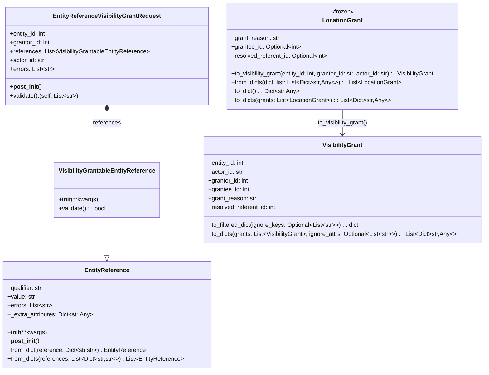

# Diagram: entity_core/entity_service/entity_service/domain/domain_objects.py

> Auto-generated by Obscura crawlers

## Mermaid

```mermaid
classDiagram
class EntityReference {
  +qualifier: str
  +value: str
  +errors: List~str~
  +_extra_attributes: Dict~str,Any~
  +__init__(**kwargs)
  +__post_init__()
  +from_dict(reference: Dict~str,str~) EntityReference
  +from_dicts(references: List~Dict~str,str~~) List~EntityReference~
}
class VisibilityGrantableEntityReference {
  +__init__(**kwargs)
  +validate(): bool
}
class VisibilityGrant {
  +entity_id: int
  +actor_id: str
  +grantor_id: int
  +grantee_id: int
  +grant_reason: str
  +resolved_referent_id: int
  +to_filtered_dict(ignore_keys: Optional~List~str~~): dict
  +to_dicts(grants: List~VisibilityGrant~, ignore_attrs: Optional~List~str~~): List~Dict~str,Any~~
}
class LocationGrant <<frozen>> {
  +grant_reason: str
  +grantee_id: Optional~int~
  +resolved_referent_id: Optional~int~
  +to_visibility_grant(entity_id: int, grantor_id: str, actor_id: str): VisibilityGrant
  +from_dicts(dict_list: List~Dict~str,Any~~): List~LocationGrant~
  +to_dict(): Dict~str,Any~
  +to_dicts(grants: List~LocationGrant~): List~Dict~str,Any~~
}
class EntityReferenceVisibilityGrantRequest {
  +entity_id: int
  +grantor_id: int
  +references: List~VisibilityGrantableEntityReference~
  +actor_id: str
  +errors: List~str~
  +__post_init__()
  +validate(): (self, List~str~)
}

VisibilityGrantableEntityReference --|> EntityReference
EntityReferenceVisibilityGrantRequest *-- VisibilityGrantableEntityReference : references
LocationGrant --> VisibilityGrant : to_visibility_grant()
```

> SVG rendering failed for this diagram.
