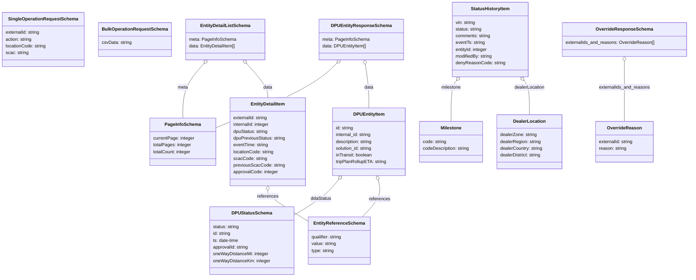
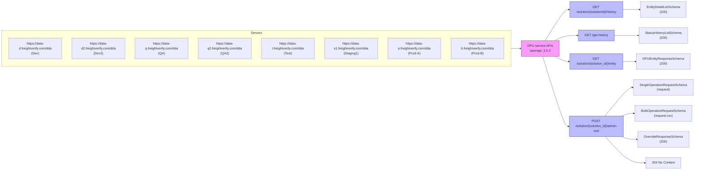

# Diagram: entity_core/entity_service/entity_service/dpu/docs/dpuService.yaml

> Auto-generated by Obscura crawlers

## Diagram 1

### SVG

<svg id="container" width="2418.875" xmlns="http://www.w3.org/2000/svg" class="classDiagram" height="980" viewBox="0 0 2418.875 980" role="graphics-document document" aria-roledescription="class"><g><defs><marker id="container_class-aggregationStart" class="marker aggregation class" refX="18" refY="7" markerWidth="190" markerHeight="240" orient="auto"><path d="M 18,7 L9,13 L1,7 L9,1 Z"></path></marker></defs><defs><marker id="container_class-aggregationEnd" class="marker aggregation class" refX="1" refY="7" markerWidth="20" markerHeight="28" orient="auto"><path d="M 18,7 L9,13 L1,7 L9,1 Z"></path></marker></defs><defs><marker id="container_class-extensionStart" class="marker extension class" refX="18" refY="7" markerWidth="190" markerHeight="240" orient="auto"><path d="M 1,7 L18,13 V 1 Z"></path></marker></defs><defs><marker id="container_class-extensionEnd" class="marker extension class" refX="1" refY="7" markerWidth="20" markerHeight="28" orient="auto"><path d="M 1,1 V 13 L18,7 Z"></path></marker></defs><defs><marker id="container_class-compositionStart" class="marker composition class" refX="18" refY="7" markerWidth="190" markerHeight="240" orient="auto"><path d="M 18,7 L9,13 L1,7 L9,1 Z"></path></marker></defs><defs><marker id="container_class-compositionEnd" class="marker composition class" refX="1" refY="7" markerWidth="20" markerHeight="28" orient="auto"><path d="M 18,7 L9,13 L1,7 L9,1 Z"></path></marker></defs><defs><marker id="container_class-dependencyStart" class="marker dependency class" refX="6" refY="7" markerWidth="190" markerHeight="240" orient="auto"><path d="M 5,7 L9,13 L1,7 L9,1 Z"></path></marker></defs><defs><marker id="container_class-dependencyEnd" class="marker dependency class" refX="13" refY="7" markerWidth="20" markerHeight="28" orient="auto"><path d="M 18,7 L9,13 L14,7 L9,1 Z"></path></marker></defs><defs><marker id="container_class-lollipopStart" class="marker lollipop class" refX="13" refY="7" markerWidth="190" markerHeight="240" orient="auto"><circle stroke="black" fill="transparent" cx="7" cy="7" r="6"></circle></marker></defs><defs><marker id="container_class-lollipopEnd" class="marker lollipop class" refX="1" refY="7" markerWidth="190" markerHeight="240" orient="auto"><circle stroke="black" fill="transparent" cx="7" cy="7" r="6"></circle></marker></defs><g class="root"><g class="clusters"></g><g class="edgePaths"><path d="M705.201,224.913L692.787,238.927C680.373,252.942,655.546,280.971,643.132,313.152C630.719,345.333,630.719,381.667,630.719,399.833L630.719,418" id="id_EntityDetailListSchema_PageInfoSchema_1" class="edge-thickness-normal edge-pattern-solid relation" style=";;;" data-edge="true" data-et="edge" data-id="id_EntityDetailListSchema_PageInfoSchema_1" data-points="W3sieCI6NzE2LjYzODU0NDc0ODUyMDgsInkiOjIxMn0seyJ4Ijo2MzAuNzE4NzUsInkiOjMwOX0seyJ4Ijo2MzAuNzE4NzUsInkiOjQxOH1d" marker-start="url(#container_class-aggregationStart)"></path><path d="M855.627,224.913L868.041,238.927C880.455,252.942,905.282,280.971,917.696,301.152C930.109,321.333,930.109,333.667,930.109,339.833L930.109,346" id="id_EntityDetailListSchema_EntityDetailItem_2" class="edge-thickness-normal edge-pattern-solid relation" style=";;;" data-edge="true" data-et="edge" data-id="id_EntityDetailListSchema_EntityDetailItem_2" data-points="W3sieCI6ODQ0LjE4OTU4MDI1MTQ3OTIsInkiOjIxMn0seyJ4Ijo5MzAuMTA5Mzc1LCJ5IjozMDl9LHsieCI6OTMwLjEwOTM3NSwieSI6MzQ2fV0=" marker-start="url(#container_class-aggregationStart)"></path><path d="M930.109,675.25L930.109,678.542C930.109,681.833,930.109,688.417,953.603,706.377C977.096,724.338,1024.083,753.676,1047.577,768.346L1071.07,783.015" id="id_EntityDetailItem_EntityReferenceSchema_3" class="edge-thickness-normal edge-pattern-solid relation" style=";;;" data-edge="true" data-et="edge" data-id="id_EntityDetailItem_EntityReferenceSchema_3" data-points="W3sieCI6OTMwLjEwOTM3NSwieSI6NjU4fSx7IngiOjkzMC4xMDkzNzUsInkiOjY5NX0seyJ4IjoxMDcxLjA3MDMxMjUsInkiOjc4My4wMTQ2MzQxNDYzNDE1fV0=" marker-start="url(#container_class-aggregationStart)"></path><path d="M1599.002,285.289L1595.731,289.241C1592.461,293.193,1585.92,301.096,1582.649,325.215C1579.379,349.333,1579.379,389.667,1579.379,409.833L1579.379,430" id="id_StatusHistoryItem_Milestone_4" class="edge-thickness-normal edge-pattern-solid relation" style=";;;" data-edge="true" data-et="edge" data-id="id_StatusHistoryItem_Milestone_4" data-points="W3sieCI6MTYwOS45OTk4NjEzMTY1NjgsInkiOjI3Mn0seyJ4IjoxNTc5LjM3ODkwNjI1LCJ5IjozMDl9LHsieCI6MTU3OS4zNzg5MDYyNSwieSI6NDMwfV0=" marker-start="url(#container_class-aggregationStart)"></path><path d="M1839.483,285.289L1842.753,289.241C1846.024,293.193,1852.565,301.096,1855.835,321.215C1859.105,341.333,1859.105,373.667,1859.105,389.833L1859.105,406" id="id_StatusHistoryItem_DealerLocation_5" class="edge-thickness-normal edge-pattern-solid relation" style=";;;" data-edge="true" data-et="edge" data-id="id_StatusHistoryItem_DealerLocation_5" data-points="W3sieCI6MTgyOC40ODQ1MTM2ODM0MzIsInkiOjI3Mn0seyJ4IjoxODU5LjEwNTQ2ODc1LCJ5IjozMDl9LHsieCI6MTg1OS4xMDU0Njg3NSwieSI6NDA2fV0=" marker-start="url(#container_class-aggregationStart)"></path><path d="M1173.599,224.047L1159.088,238.206C1144.577,252.364,1115.554,280.682,1044.224,318.899C972.895,357.116,859.258,405.232,802.439,429.29L745.621,453.348" id="id_DPUEntityResponseSchema_PageInfoSchema_6" class="edge-thickness-normal edge-pattern-solid relation" style=";;;" data-edge="true" data-et="edge" data-id="id_DPUEntityResponseSchema_PageInfoSchema_6" data-points="W3sieCI6MTE4NS45NDU5MzY1NzU0NDM3LCJ5IjoyMTJ9LHsieCI6MTA4Ni41MzEyNSwieSI6MzA5fSx7IngiOjc0NS42MjEwOTM3NSwieSI6NDUzLjM0ODA4MjA2NDk5MzgzfV0=" marker-start="url(#container_class-aggregationStart)"></path><path d="M1274.153,229.028L1276.311,242.357C1278.469,255.685,1282.785,282.343,1284.943,307.838C1287.102,333.333,1287.102,357.667,1287.102,369.833L1287.102,382" id="id_DPUEntityResponseSchema_DPUEntityItem_7" class="edge-thickness-normal edge-pattern-solid relation" style=";;;" data-edge="true" data-et="edge" data-id="id_DPUEntityResponseSchema_DPUEntityItem_7" data-points="W3sieCI6MTI3MS4zOTYwMTA1Mzk5NDA4LCJ5IjoyMTJ9LHsieCI6MTI4Ny4xMDE1NjI1LCJ5IjozMDl9LHsieCI6MTI4Ny4xMDE1NjI1LCJ5IjozODJ9XQ==" marker-start="url(#container_class-aggregationStart)"></path><path d="M1181.069,635.508L1173.194,645.423C1165.319,655.339,1149.57,675.169,1122.903,696.483C1096.237,717.797,1058.654,740.595,1039.862,751.993L1021.07,763.392" id="id_DPUEntityItem_DPUStatusSchema_8" class="edge-thickness-normal edge-pattern-solid relation" style=";;;" data-edge="true" data-et="edge" data-id="id_DPUEntityItem_DPUStatusSchema_8" data-points="W3sieCI6MTE5MS43OTcxNTgzNTQ5MjIyLCJ5Ijo2MjJ9LHsieCI6MTEzMy44MjAzMTI1LCJ5Ijo2OTV9LHsieCI6MTAyMS4wNzAzMTI1LCJ5Ijo3NjMuMzkxOTEwNjU0OTk1NX1d" marker-start="url(#container_class-aggregationStart)"></path><path d="M1320.609,638.754L1322.906,648.129C1325.203,657.503,1329.797,676.251,1320.25,697.792C1310.703,719.333,1287.015,743.667,1275.171,755.833L1263.327,768" id="id_DPUEntityItem_EntityReferenceSchema_9" class="edge-thickness-normal edge-pattern-solid relation" style=";;;" data-edge="true" data-et="edge" data-id="id_DPUEntityItem_EntityReferenceSchema_9" data-points="W3sieCI6MTMxNi41MDQwODg0MDY3MzU3LCJ5Ijo2MjJ9LHsieCI6MTMzNC4zOTA2MjUsInkiOjY5NX0seyJ4IjoxMjYzLjMyNjc4MTQ0OTA0NDYsInkiOjc2OH1d" marker-start="url(#container_class-aggregationStart)"></path><path d="M2193.363,217.25L2193.363,232.542C2193.363,247.833,2193.363,278.417,2193.363,313.875C2193.363,349.333,2193.363,389.667,2193.363,409.833L2193.363,430" id="id_OverrideResponseSchema_OverrideReason_10" class="edge-thickness-normal edge-pattern-solid relation" style=";;;" data-edge="true" data-et="edge" data-id="id_OverrideResponseSchema_OverrideReason_10" data-points="W3sieCI6MjE5My4zNjMyODEyNSwieSI6MjAwfSx7IngiOjIxOTMuMzYzMjgxMjUsInkiOjMwOX0seyJ4IjoyMTkzLjM2MzI4MTI1LCJ5Ijo0MzB9XQ==" marker-start="url(#container_class-aggregationStart)"></path></g><g class="edgeLabels"><g class="edgeLabel" transform="translate(630.71875, 309)"><g class="label" data-id="id_EntityDetailListSchema_PageInfoSchema_1" transform="translate(-18.40625, -12)"><foreignObject width="36.8125" height="24">

meta

</foreignObject></g></g><g class="edgeLabel" transform="translate(930.109375, 309)"><g class="label" data-id="id_EntityDetailListSchema_EntityDetailItem_2" transform="translate(-16.3203125, -12)"><foreignObject width="32.640625" height="24">

data

</foreignObject></g></g><g class="edgeLabel" transform="translate(930.109375, 695)"><g class="label" data-id="id_EntityDetailItem_EntityReferenceSchema_3" transform="translate(-37.828125, -12)"><foreignObject width="75.65625" height="24">

references

</foreignObject></g></g><g class="edgeLabel" transform="translate(1579.37890625, 309)"><g class="label" data-id="id_StatusHistoryItem_Milestone_4" transform="translate(-36.0078125, -12)"><foreignObject width="72.015625" height="24">

milestone

</foreignObject></g></g><g class="edgeLabel" transform="translate(1859.10546875, 309)"><g class="label" data-id="id_StatusHistoryItem_DealerLocation_5" transform="translate(-54.1484375, -12)"><foreignObject width="108.296875" height="24">

dealerLocation

</foreignObject></g></g><g class="edgeLabel" transform="translate(980.02794, 354.0956)"><g class="label" data-id="id_DPUEntityResponseSchema_PageInfoSchema_6" transform="translate(-18.40625, -12)"><foreignObject width="36.8125" height="24">

meta

</foreignObject></g></g><g class="edgeLabel" transform="translate(1287.1015625, 309)"><g class="label" data-id="id_DPUEntityResponseSchema_DPUEntityItem_7" transform="translate(-16.3203125, -12)"><foreignObject width="32.640625" height="24">

data

</foreignObject></g></g><g class="edgeLabel" transform="translate(1117.2977, 705.02229)"><g class="label" data-id="id_DPUEntityItem_DPUStatusSchema_8" transform="translate(-36.75, -12)"><foreignObject width="73.5" height="24">

ddaStatus

</foreignObject></g></g><g class="edgeLabel" transform="translate(1325.07205, 704.57246)"><g class="label" data-id="id_DPUEntityItem_EntityReferenceSchema_9" transform="translate(-37.828125, -12)"><foreignObject width="75.65625" height="24">

references

</foreignObject></g></g><g class="edgeLabel" transform="translate(2193.36328125, 309)"><g class="label" data-id="id_OverrideResponseSchema_OverrideReason_10" transform="translate(-90.625, -12)"><foreignObject width="181.25" height="24">

externalIds_and_reasons

</foreignObject></g></g></g><g class="nodes"><g class="node default" id="classId-SingleOperationRequestSchema-0" transform="translate(151.48828125, 140)"><g class="basic label-container"><path d="M-143.48828125 -96 L143.48828125 -96 L143.48828125 96 L-143.48828125 96" stroke="none" stroke-width="0" fill="#ECECFF" style=""></path><path d="M-143.48828125 -96 C-54.39361948404181 -96, 34.701042281916386 -96, 143.48828125 -96 M-143.48828125 -96 C-43.2840161039867 -96, 56.9202490420266 -96, 143.48828125 -96 M143.48828125 -96 C143.48828125 -49.00852479182324, 143.48828125 -2.0170495836464823, 143.48828125 96 M143.48828125 -96 C143.48828125 -34.26472131798059, 143.48828125 27.470557364038825, 143.48828125 96 M143.48828125 96 C42.46014138460917 96, -58.567998480781654 96, -143.48828125 96 M143.48828125 96 C34.42573368666943 96, -74.63681387666114 96, -143.48828125 96 M-143.48828125 96 C-143.48828125 23.048977840166003, -143.48828125 -49.90204431966799, -143.48828125 -96 M-143.48828125 96 C-143.48828125 22.840771340914472, -143.48828125 -50.318457318171056, -143.48828125 -96" stroke="#9370DB" stroke-width="1.3" fill="none" stroke-dasharray="0 0" style=""></path></g><g class="annotation-group text" transform="translate(0, -72)"></g><g class="label-group text" transform="translate(-117.8359375, -72)"><g class="label" style="font-weight: bolder" transform="translate(0,-12)"><foreignObject width="235.671875" height="24">

SingleOperationRequestSchema

</foreignObject></g></g><g class="members-group text" transform="translate(-131.48828125, -24)"><g class="label" style="" transform="translate(0,-12)"><foreignObject width="123.390625" height="24">

externalId: string

</foreignObject></g><g class="label" style="" transform="translate(0,12)"><foreignObject width="95.078125" height="24">

action: string

</foreignObject></g><g class="label" style="" transform="translate(0,36)"><foreignObject width="145.140625" height="24">

locationCode: string

</foreignObject></g><g class="label" style="" transform="translate(0,60)"><foreignObject width="81.09375" height="24">

scac: string

</foreignObject></g></g><g class="methods-group text" transform="translate(-131.48828125, 96)"></g><g class="divider" style=""><path d="M-143.48828125 -48 C-32.12170858662775 -48, 79.2448640767445 -48, 143.48828125 -48 M-143.48828125 -48 C-79.5830663459148 -48, -15.677851441829617 -48, 143.48828125 -48" stroke="#9370DB" stroke-width="1.3" fill="none" stroke-dasharray="0 0" style=""></path></g><g class="divider" style=""><path d="M-143.48828125 72 C-31.505418857554716 72, 80.47744353489057 72, 143.48828125 72 M-143.48828125 72 C-84.75465924302773 72, -26.02103723605545 72, 143.48828125 72" stroke="#9370DB" stroke-width="1.3" fill="none" stroke-dasharray="0 0" style=""></path></g></g><g class="node default" id="classId-BulkOperationRequestSchema-1" transform="translate(468.5078125, 140)"><g class="basic label-container"><path d="M-123.53125 -60 L123.53125 -60 L123.53125 60 L-123.53125 60" stroke="none" stroke-width="0" fill="#ECECFF" style=""></path><path d="M-123.53125 -60 C-61.7322202494591 -60, 0.06680950108180639 -60, 123.53125 -60 M-123.53125 -60 C-41.53992103887819 -60, 40.45140792224362 -60, 123.53125 -60 M123.53125 -60 C123.53125 -27.108542346838775, 123.53125 5.782915306322451, 123.53125 60 M123.53125 -60 C123.53125 -33.5352153345922, 123.53125 -7.070430669184404, 123.53125 60 M123.53125 60 C64.7594481834671 60, 5.987646366934186 60, -123.53125 60 M123.53125 60 C44.24581181665242 60, -35.03962636669516 60, -123.53125 60 M-123.53125 60 C-123.53125 22.744821437763193, -123.53125 -14.510357124473614, -123.53125 -60 M-123.53125 60 C-123.53125 23.131480758004898, -123.53125 -13.737038483990204, -123.53125 -60" stroke="#9370DB" stroke-width="1.3" fill="none" stroke-dasharray="0 0" style=""></path></g><g class="annotation-group text" transform="translate(0, -36)"></g><g class="label-group text" transform="translate(-111.53125, -36)"><g class="label" style="font-weight: bolder" transform="translate(0,-12)"><foreignObject width="223.0625" height="24">

BulkOperationRequestSchema

</foreignObject></g></g><g class="members-group text" transform="translate(-111.53125, 12)"><g class="label" style="" transform="translate(0,-12)"><foreignObject width="105.65625" height="24">

csvData: string

</foreignObject></g></g><g class="methods-group text" transform="translate(-111.53125, 60)"></g><g class="divider" style=""><path d="M-123.53125 -12 C-35.843318709652934 -12, 51.84461258069413 -12, 123.53125 -12 M-123.53125 -12 C-53.94568738642734 -12, 15.639875227145325 -12, 123.53125 -12" stroke="#9370DB" stroke-width="1.3" fill="none" stroke-dasharray="0 0" style=""></path></g><g class="divider" style=""><path d="M-123.53125 36 C-34.567837914596865 36, 54.39557417080627 36, 123.53125 36 M-123.53125 36 C-58.109023557988564 36, 7.313202884022871 36, 123.53125 36" stroke="#9370DB" stroke-width="1.3" fill="none" stroke-dasharray="0 0" style=""></path></g></g><g class="node default" id="classId-PageInfoSchema-2" transform="translate(630.71875, 502)"><g class="basic label-container"><path d="M-114.90234375 -84 L114.90234375 -84 L114.90234375 84 L-114.90234375 84" stroke="none" stroke-width="0" fill="#ECECFF" style=""></path><path d="M-114.90234375 -84 C-51.2201727933911 -84, 12.4619981632178 -84, 114.90234375 -84 M-114.90234375 -84 C-54.10039854371705 -84, 6.701546662565903 -84, 114.90234375 -84 M114.90234375 -84 C114.90234375 -37.353501590127074, 114.90234375 9.292996819745852, 114.90234375 84 M114.90234375 -84 C114.90234375 -31.331587233246907, 114.90234375 21.336825533506186, 114.90234375 84 M114.90234375 84 C46.47526858154221 84, -21.95180658691558 84, -114.90234375 84 M114.90234375 84 C32.3174388064385 84, -50.267466137122994 84, -114.90234375 84 M-114.90234375 84 C-114.90234375 44.36852289088481, -114.90234375 4.737045781769623, -114.90234375 -84 M-114.90234375 84 C-114.90234375 36.103604931633676, -114.90234375 -11.792790136732648, -114.90234375 -84" stroke="#9370DB" stroke-width="1.3" fill="none" stroke-dasharray="0 0" style=""></path></g><g class="annotation-group text" transform="translate(0, -60)"></g><g class="label-group text" transform="translate(-60.3203125, -60)"><g class="label" style="font-weight: bolder" transform="translate(0,-12)"><foreignObject width="120.640625" height="24">

PageInfoSchema

</foreignObject></g></g><g class="members-group text" transform="translate(-102.90234375, -12)"><g class="label" style="" transform="translate(0,-12)"><foreignObject width="145.484375" height="24">

currentPage: integer

</foreignObject></g><g class="label" style="" transform="translate(0,12)"><foreignObject width="134.1875" height="24">

totalPages: integer

</foreignObject></g><g class="label" style="" transform="translate(0,36)"><foreignObject width="135.484375" height="24">

totalCount: integer

</foreignObject></g></g><g class="methods-group text" transform="translate(-102.90234375, 84)"></g><g class="divider" style=""><path d="M-114.90234375 -36 C-26.29016382693152 -36, 62.32201609613696 -36, 114.90234375 -36 M-114.90234375 -36 C-37.621185886620594 -36, 39.65997197675881 -36, 114.90234375 -36" stroke="#9370DB" stroke-width="1.3" fill="none" stroke-dasharray="0 0" style=""></path></g><g class="divider" style=""><path d="M-114.90234375 60 C-33.11965625763631 60, 48.663031234727384 60, 114.90234375 60 M-114.90234375 60 C-50.75561230169255 60, 13.391119146614898 60, 114.90234375 60" stroke="#9370DB" stroke-width="1.3" fill="none" stroke-dasharray="0 0" style=""></path></g></g><g class="node default" id="classId-EntityDetailListSchema-3" transform="translate(780.4140625, 140)"><g class="basic label-container"><path d="M-138.375 -72 L138.375 -72 L138.375 72 L-138.375 72" stroke="none" stroke-width="0" fill="#ECECFF" style=""></path><path d="M-138.375 -72 C-55.304280077692795 -72, 27.76643984461441 -72, 138.375 -72 M-138.375 -72 C-52.026386767354126 -72, 34.32222646529175 -72, 138.375 -72 M138.375 -72 C138.375 -27.83826094102301, 138.375 16.323478117953982, 138.375 72 M138.375 -72 C138.375 -36.69694865030169, 138.375 -1.3938973006033848, 138.375 72 M138.375 72 C35.8040650228922 72, -66.7668699542156 72, -138.375 72 M138.375 72 C48.58078494517342 72, -41.21343010965316 72, -138.375 72 M-138.375 72 C-138.375 28.85632263706856, -138.375 -14.287354725862883, -138.375 -72 M-138.375 72 C-138.375 26.968336152428954, -138.375 -18.063327695142092, -138.375 -72" stroke="#9370DB" stroke-width="1.3" fill="none" stroke-dasharray="0 0" style=""></path></g><g class="annotation-group text" transform="translate(0, -48)"></g><g class="label-group text" transform="translate(-84.8125, -48)"><g class="label" style="font-weight: bolder" transform="translate(0,-12)"><foreignObject width="169.625" height="24">

EntityDetailListSchema

</foreignObject></g></g><g class="members-group text" transform="translate(-126.375, 0)"><g class="label" style="" transform="translate(0,-12)"><foreignObject width="164.15625" height="24">

meta: PageInfoSchema

</foreignObject></g><g class="label" style="" transform="translate(0,12)"><foreignObject width="167.9375" height="24">

data: EntityDetailItem[]

</foreignObject></g></g><g class="methods-group text" transform="translate(-126.375, 72)"></g><g class="divider" style=""><path d="M-138.375 -24 C-71.09725506407187 -24, -3.8195101281437474 -24, 138.375 -24 M-138.375 -24 C-63.1442312746066 -24, 12.086537450786807 -24, 138.375 -24" stroke="#9370DB" stroke-width="1.3" fill="none" stroke-dasharray="0 0" style=""></path></g><g class="divider" style=""><path d="M-138.375 48 C-58.662444287387814 48, 21.050111425224372 48, 138.375 48 M-138.375 48 C-62.60275096891171 48, 13.169498062176586 48, 138.375 48" stroke="#9370DB" stroke-width="1.3" fill="none" stroke-dasharray="0 0" style=""></path></g></g><g class="node default" id="classId-EntityDetailItem-4" transform="translate(930.109375, 502)"><g class="basic label-container"><path d="M-134.48828125 -156 L134.48828125 -156 L134.48828125 156 L-134.48828125 156" stroke="none" stroke-width="0" fill="#ECECFF" style=""></path><path d="M-134.48828125 -156 C-32.52206722591022 -156, 69.44414679817956 -156, 134.48828125 -156 M-134.48828125 -156 C-36.71764382120426 -156, 61.052993607591475 -156, 134.48828125 -156 M134.48828125 -156 C134.48828125 -37.06960435572667, 134.48828125 81.86079128854666, 134.48828125 156 M134.48828125 -156 C134.48828125 -68.79459289573836, 134.48828125 18.410814208523277, 134.48828125 156 M134.48828125 156 C72.73923416257723 156, 10.990187075154466 156, -134.48828125 156 M134.48828125 156 C34.721833693588124 156, -65.04461386282375 156, -134.48828125 156 M-134.48828125 156 C-134.48828125 76.50094167807583, -134.48828125 -2.998116643848334, -134.48828125 -156 M-134.48828125 156 C-134.48828125 68.21857265989757, -134.48828125 -19.56285468020485, -134.48828125 -156" stroke="#9370DB" stroke-width="1.3" fill="none" stroke-dasharray="0 0" style=""></path></g><g class="annotation-group text" transform="translate(0, -132)"></g><g class="label-group text" transform="translate(-59.3828125, -132)"><g class="label" style="font-weight: bolder" transform="translate(0,-12)"><foreignObject width="118.765625" height="24">

EntityDetailItem

</foreignObject></g></g><g class="members-group text" transform="translate(-122.48828125, -84)"><g class="label" style="" transform="translate(0,-12)"><foreignObject width="123.390625" height="24">

externalId: string

</foreignObject></g><g class="label" style="" transform="translate(0,12)"><foreignObject width="130.40625" height="24">

internalId: integer

</foreignObject></g><g class="label" style="" transform="translate(0,36)"><foreignObject width="123.75" height="24">

dpuStatus: string

</foreignObject></g><g class="label" style="" transform="translate(0,60)"><foreignObject width="185.59375" height="24">

dpuPreviousStatus: string

</foreignObject></g><g class="label" style="" transform="translate(0,84)"><foreignObject width="125.265625" height="24">

eventTime: string

</foreignObject></g><g class="label" style="" transform="translate(0,108)"><foreignObject width="145.140625" height="24">

locationCode: string

</foreignObject></g><g class="label" style="" transform="translate(0,132)"><foreignObject width="117.296875" height="24">

scacCode: string

</foreignObject></g><g class="label" style="" transform="translate(0,156)"><foreignObject width="180.921875" height="24">

previousScacCode: string

</foreignObject></g><g class="label" style="" transform="translate(0,180)"><foreignObject width="159" height="24">

approvalCode: integer

</foreignObject></g></g><g class="methods-group text" transform="translate(-122.48828125, 156)"></g><g class="divider" style=""><path d="M-134.48828125 -108 C-53.16811296817066 -108, 28.15205531365868 -108, 134.48828125 -108 M-134.48828125 -108 C-70.54297341152625 -108, -6.597665573052495 -108, 134.48828125 -108" stroke="#9370DB" stroke-width="1.3" fill="none" stroke-dasharray="0 0" style=""></path></g><g class="divider" style=""><path d="M-134.48828125 132 C-64.97778607107165 132, 4.532709107856704 132, 134.48828125 132 M-134.48828125 132 C-28.837639105946977 132, 76.81300303810605 132, 134.48828125 132" stroke="#9370DB" stroke-width="1.3" fill="none" stroke-dasharray="0 0" style=""></path></g></g><g class="node default" id="classId-StatusHistoryItem-5" transform="translate(1719.2421875, 140)"><g class="basic label-container"><path d="M-132.26171875 -132 L132.26171875 -132 L132.26171875 132 L-132.26171875 132" stroke="none" stroke-width="0" fill="#ECECFF" style=""></path><path d="M-132.26171875 -132 C-39.74056867493279 -132, 52.78058140013442 -132, 132.26171875 -132 M-132.26171875 -132 C-74.34997030224213 -132, -16.43822185448424 -132, 132.26171875 -132 M132.26171875 -132 C132.26171875 -65.54413348928074, 132.26171875 0.911733021438522, 132.26171875 132 M132.26171875 -132 C132.26171875 -50.97737555983451, 132.26171875 30.045248880330973, 132.26171875 132 M132.26171875 132 C72.11410077682237 132, 11.966482803644752 132, -132.26171875 132 M132.26171875 132 C51.40637248803705 132, -29.4489737739259 132, -132.26171875 132 M-132.26171875 132 C-132.26171875 48.35937680017135, -132.26171875 -35.281246399657306, -132.26171875 -132 M-132.26171875 132 C-132.26171875 53.4627229625531, -132.26171875 -25.074554074893797, -132.26171875 -132" stroke="#9370DB" stroke-width="1.3" fill="none" stroke-dasharray="0 0" style=""></path></g><g class="annotation-group text" transform="translate(0, -108)"></g><g class="label-group text" transform="translate(-66.3671875, -108)"><g class="label" style="font-weight: bolder" transform="translate(0,-12)"><foreignObject width="132.734375" height="24">

StatusHistoryItem

</foreignObject></g></g><g class="members-group text" transform="translate(-120.26171875, -60)"><g class="label" style="" transform="translate(0,-12)"><foreignObject width="71.484375" height="24">

vin: string

</foreignObject></g><g class="label" style="" transform="translate(0,12)"><foreignObject width="94.125" height="24">

status: string

</foreignObject></g><g class="label" style="" transform="translate(0,36)"><foreignObject width="125.15625" height="24">

comments: string

</foreignObject></g><g class="label" style="" transform="translate(0,60)"><foreignObject width="105" height="24">

eventTs: string

</foreignObject></g><g class="label" style="" transform="translate(0,84)"><foreignObject width="115.4375" height="24">

entityId: integer

</foreignObject></g><g class="label" style="" transform="translate(0,108)"><foreignObject width="132.015625" height="24">

modifiedBy: string

</foreignObject></g><g class="label" style="" transform="translate(0,132)"><foreignObject width="174.15625" height="24">

denyReasonCode: string

</foreignObject></g></g><g class="methods-group text" transform="translate(-120.26171875, 132)"></g><g class="divider" style=""><path d="M-132.26171875 -84 C-58.66523451451259 -84, 14.931249720974819 -84, 132.26171875 -84 M-132.26171875 -84 C-75.13865558228892 -84, -18.01559241457784 -84, 132.26171875 -84" stroke="#9370DB" stroke-width="1.3" fill="none" stroke-dasharray="0 0" style=""></path></g><g class="divider" style=""><path d="M-132.26171875 108 C-76.23834678950764 108, -20.21497482901529 108, 132.26171875 108 M-132.26171875 108 C-53.40138027660852 108, 25.45895819678296 108, 132.26171875 108" stroke="#9370DB" stroke-width="1.3" fill="none" stroke-dasharray="0 0" style=""></path></g></g><g class="node default" id="classId-Milestone-6" transform="translate(1579.37890625, 502)"><g class="basic label-container"><path d="M-113.921875 -72 L113.921875 -72 L113.921875 72 L-113.921875 72" stroke="none" stroke-width="0" fill="#ECECFF" style=""></path><path d="M-113.921875 -72 C-58.60582553852194 -72, -3.289776077043882 -72, 113.921875 -72 M-113.921875 -72 C-39.016472868949336 -72, 35.88892926210133 -72, 113.921875 -72 M113.921875 -72 C113.921875 -21.940489087747267, 113.921875 28.119021824505467, 113.921875 72 M113.921875 -72 C113.921875 -28.654768669834496, 113.921875 14.690462660331008, 113.921875 72 M113.921875 72 C53.433873811997636 72, -7.054127376004729 72, -113.921875 72 M113.921875 72 C46.26449804097233 72, -21.392878918055345 72, -113.921875 72 M-113.921875 72 C-113.921875 28.072642074268636, -113.921875 -15.854715851462728, -113.921875 -72 M-113.921875 72 C-113.921875 31.432654060255068, -113.921875 -9.134691879489864, -113.921875 -72" stroke="#9370DB" stroke-width="1.3" fill="none" stroke-dasharray="0 0" style=""></path></g><g class="annotation-group text" transform="translate(0, -48)"></g><g class="label-group text" transform="translate(-35.8125, -48)"><g class="label" style="font-weight: bolder" transform="translate(0,-12)"><foreignObject width="71.625" height="24">

Milestone

</foreignObject></g></g><g class="members-group text" transform="translate(-101.921875, 0)"><g class="label" style="" transform="translate(0,-12)"><foreignObject width="84.6875" height="24">

code: string

</foreignObject></g><g class="label" style="" transform="translate(0,12)"><foreignObject width="168.03125" height="24">

codeDescription: string

</foreignObject></g></g><g class="methods-group text" transform="translate(-101.921875, 72)"></g><g class="divider" style=""><path d="M-113.921875 -24 C-62.79822578355387 -24, -11.674576567107735 -24, 113.921875 -24 M-113.921875 -24 C-55.63794323412647 -24, 2.645988531747065 -24, 113.921875 -24" stroke="#9370DB" stroke-width="1.3" fill="none" stroke-dasharray="0 0" style=""></path></g><g class="divider" style=""><path d="M-113.921875 48 C-62.79007356127555 48, -11.658272122551097 48, 113.921875 48 M-113.921875 48 C-37.615338241733895 48, 38.69119851653221 48, 113.921875 48" stroke="#9370DB" stroke-width="1.3" fill="none" stroke-dasharray="0 0" style=""></path></g></g><g class="node default" id="classId-DealerLocation-7" transform="translate(1859.10546875, 502)"><g class="basic label-container"><path d="M-115.8046875 -96 L115.8046875 -96 L115.8046875 96 L-115.8046875 96" stroke="none" stroke-width="0" fill="#ECECFF" style=""></path><path d="M-115.8046875 -96 C-42.7265130106054 -96, 30.351661478789197 -96, 115.8046875 -96 M-115.8046875 -96 C-36.08057272972634 -96, 43.64354204054732 -96, 115.8046875 -96 M115.8046875 -96 C115.8046875 -27.147201523120742, 115.8046875 41.705596953758516, 115.8046875 96 M115.8046875 -96 C115.8046875 -28.52486987590612, 115.8046875 38.95026024818776, 115.8046875 96 M115.8046875 96 C59.59155124214663 96, 3.378414984293258 96, -115.8046875 96 M115.8046875 96 C31.434599600204834 96, -52.93548829959033 96, -115.8046875 96 M-115.8046875 96 C-115.8046875 48.96634201883667, -115.8046875 1.93268403767334, -115.8046875 -96 M-115.8046875 96 C-115.8046875 38.8999602308859, -115.8046875 -18.200079538228195, -115.8046875 -96" stroke="#9370DB" stroke-width="1.3" fill="none" stroke-dasharray="0 0" style=""></path></g><g class="annotation-group text" transform="translate(0, -72)"></g><g class="label-group text" transform="translate(-55.15625, -72)"><g class="label" style="font-weight: bolder" transform="translate(0,-12)"><foreignObject width="110.3125" height="24">

DealerLocation

</foreignObject></g></g><g class="members-group text" transform="translate(-103.8046875, -24)"><g class="label" style="" transform="translate(0,-12)"><foreignObject width="131.34375" height="24">

dealerZone: string

</foreignObject></g><g class="label" style="" transform="translate(0,12)"><foreignObject width="145.609375" height="24">

dealerRegion: string

</foreignObject></g><g class="label" style="" transform="translate(0,36)"><foreignObject width="152.453125" height="24">

dealerCountry: string

</foreignObject></g><g class="label" style="" transform="translate(0,60)"><foreignObject width="148.140625" height="24">

dealerDistrict: string

</foreignObject></g></g><g class="methods-group text" transform="translate(-103.8046875, 96)"></g><g class="divider" style=""><path d="M-115.8046875 -48 C-46.310916180418545 -48, 23.18285513916291 -48, 115.8046875 -48 M-115.8046875 -48 C-43.68689767827854 -48, 28.430892143442918 -48, 115.8046875 -48" stroke="#9370DB" stroke-width="1.3" fill="none" stroke-dasharray="0 0" style=""></path></g><g class="divider" style=""><path d="M-115.8046875 72 C-50.171753905461784 72, 15.461179689076431 72, 115.8046875 72 M-115.8046875 72 C-27.84494581043063 72, 60.11479587913874 72, 115.8046875 72" stroke="#9370DB" stroke-width="1.3" fill="none" stroke-dasharray="0 0" style=""></path></g></g><g class="node default" id="classId-DPUEntityResponseSchema-8" transform="translate(1259.73828125, 140)"><g class="basic label-container"><path d="M-144.33984375 -72 L144.33984375 -72 L144.33984375 72 L-144.33984375 72" stroke="none" stroke-width="0" fill="#ECECFF" style=""></path><path d="M-144.33984375 -72 C-84.75097297150816 -72, -25.16210219301631 -72, 144.33984375 -72 M-144.33984375 -72 C-75.57824644950084 -72, -6.816649149001677 -72, 144.33984375 -72 M144.33984375 -72 C144.33984375 -33.47258320885111, 144.33984375 5.054833582297775, 144.33984375 72 M144.33984375 -72 C144.33984375 -22.461933469323853, 144.33984375 27.076133061352294, 144.33984375 72 M144.33984375 72 C66.8572677205143 72, -10.625308308971398 72, -144.33984375 72 M144.33984375 72 C51.40401417674765 72, -41.5318153965047 72, -144.33984375 72 M-144.33984375 72 C-144.33984375 40.96193853758657, -144.33984375 9.923877075173138, -144.33984375 -72 M-144.33984375 72 C-144.33984375 20.19631285987233, -144.33984375 -31.607374280255343, -144.33984375 -72" stroke="#9370DB" stroke-width="1.3" fill="none" stroke-dasharray="0 0" style=""></path></g><g class="annotation-group text" transform="translate(0, -48)"></g><g class="label-group text" transform="translate(-100.5234375, -48)"><g class="label" style="font-weight: bolder" transform="translate(0,-12)"><foreignObject width="201.046875" height="24">

DPUEntityResponseSchema

</foreignObject></g></g><g class="members-group text" transform="translate(-132.33984375, 0)"><g class="label" style="" transform="translate(0,-12)"><foreignObject width="164.15625" height="24">

meta: PageInfoSchema

</foreignObject></g><g class="label" style="" transform="translate(0,12)"><foreignObject width="155.546875" height="24">

data: DPUEntityItem[]

</foreignObject></g></g><g class="methods-group text" transform="translate(-132.33984375, 72)"></g><g class="divider" style=""><path d="M-144.33984375 -24 C-45.285098029849564 -24, 53.76964769030087 -24, 144.33984375 -24 M-144.33984375 -24 C-73.29175748240287 -24, -2.243671214805744 -24, 144.33984375 -24" stroke="#9370DB" stroke-width="1.3" fill="none" stroke-dasharray="0 0" style=""></path></g><g class="divider" style=""><path d="M-144.33984375 48 C-68.50899708864935 48, 7.321849572701296 48, 144.33984375 48 M-144.33984375 48 C-43.93975950038012 48, 56.46032474923976 48, 144.33984375 48" stroke="#9370DB" stroke-width="1.3" fill="none" stroke-dasharray="0 0" style=""></path></g></g><g class="node default" id="classId-DPUEntityItem-9" transform="translate(1287.1015625, 502)"><g class="basic label-container"><path d="M-128.35546875 -120 L128.35546875 -120 L128.35546875 120 L-128.35546875 120" stroke="none" stroke-width="0" fill="#ECECFF" style=""></path><path d="M-128.35546875 -120 C-45.81109657114091 -120, 36.733275607718184 -120, 128.35546875 -120 M-128.35546875 -120 C-45.833797983445706 -120, 36.68787278310859 -120, 128.35546875 -120 M128.35546875 -120 C128.35546875 -24.11314738343394, 128.35546875 71.77370523313212, 128.35546875 120 M128.35546875 -120 C128.35546875 -54.03875404603781, 128.35546875 11.922491907924382, 128.35546875 120 M128.35546875 120 C41.38203455492629 120, -45.591399640147415 120, -128.35546875 120 M128.35546875 120 C75.44516082350438 120, 22.534852897008747 120, -128.35546875 120 M-128.35546875 120 C-128.35546875 32.81558228284895, -128.35546875 -54.3688354343021, -128.35546875 -120 M-128.35546875 120 C-128.35546875 47.86528862976333, -128.35546875 -24.269422740473345, -128.35546875 -120" stroke="#9370DB" stroke-width="1.3" fill="none" stroke-dasharray="0 0" style=""></path></g><g class="annotation-group text" transform="translate(0, -96)"></g><g class="label-group text" transform="translate(-52.9609375, -96)"><g class="label" style="font-weight: bolder" transform="translate(0,-12)"><foreignObject width="105.921875" height="24">

DPUEntityItem

</foreignObject></g></g><g class="members-group text" transform="translate(-116.35546875, -48)"><g class="label" style="" transform="translate(0,-12)"><foreignObject width="63.796875" height="24">

id: string

</foreignObject></g><g class="label" style="" transform="translate(0,12)"><foreignObject width="129.046875" height="24">

internal_id: string

</foreignObject></g><g class="label" style="" transform="translate(0,36)"><foreignObject width="132.328125" height="24">

description: string

</foreignObject></g><g class="label" style="" transform="translate(0,60)"><foreignObject width="131.9375" height="24">

solution_id: string

</foreignObject></g><g class="label" style="" transform="translate(0,84)"><foreignObject width="130.734375" height="24">

inTransit: boolean

</foreignObject></g><g class="label" style="" transform="translate(0,108)"><foreignObject width="179.75" height="24">

tripPlanRollupETA: string

</foreignObject></g></g><g class="methods-group text" transform="translate(-116.35546875, 120)"></g><g class="divider" style=""><path d="M-128.35546875 -72 C-73.39399285111944 -72, -18.43251695223887 -72, 128.35546875 -72 M-128.35546875 -72 C-36.88850161320366 -72, 54.57846552359268 -72, 128.35546875 -72" stroke="#9370DB" stroke-width="1.3" fill="none" stroke-dasharray="0 0" style=""></path></g><g class="divider" style=""><path d="M-128.35546875 96 C-42.74093929601838 96, 42.873590157963235 96, 128.35546875 96 M-128.35546875 96 C-76.80017744179463 96, -25.244886133589247 96, 128.35546875 96" stroke="#9370DB" stroke-width="1.3" fill="none" stroke-dasharray="0 0" style=""></path></g></g><g class="node default" id="classId-DPUStatusSchema-10" transform="translate(874.9921875, 852)"><g class="basic label-container"><path d="M-146.078125 -120 L146.078125 -120 L146.078125 120 L-146.078125 120" stroke="none" stroke-width="0" fill="#ECECFF" style=""></path><path d="M-146.078125 -120 C-34.37999348508839 -120, 77.31813802982322 -120, 146.078125 -120 M-146.078125 -120 C-36.81975482068951 -120, 72.43861535862098 -120, 146.078125 -120 M146.078125 -120 C146.078125 -53.759646999099004, 146.078125 12.480706001801991, 146.078125 120 M146.078125 -120 C146.078125 -35.277103783408705, 146.078125 49.44579243318259, 146.078125 120 M146.078125 120 C43.21331665428026 120, -59.651491691439475 120, -146.078125 120 M146.078125 120 C57.02860707431931 120, -32.02091085136138 120, -146.078125 120 M-146.078125 120 C-146.078125 37.13167302029015, -146.078125 -45.7366539594197, -146.078125 -120 M-146.078125 120 C-146.078125 69.89216005726477, -146.078125 19.78432011452955, -146.078125 -120" stroke="#9370DB" stroke-width="1.3" fill="none" stroke-dasharray="0 0" style=""></path></g><g class="annotation-group text" transform="translate(0, -96)"></g><g class="label-group text" transform="translate(-67.234375, -96)"><g class="label" style="font-weight: bolder" transform="translate(0,-12)"><foreignObject width="134.46875" height="24">

DPUStatusSchema

</foreignObject></g></g><g class="members-group text" transform="translate(-134.078125, -48)"><g class="label" style="" transform="translate(0,-12)"><foreignObject width="94.125" height="24">

status: string

</foreignObject></g><g class="label" style="" transform="translate(0,12)"><foreignObject width="63.796875" height="24">

id: string

</foreignObject></g><g class="label" style="" transform="translate(0,36)"><foreignObject width="92.953125" height="24">

ts: date-time

</foreignObject></g><g class="label" style="" transform="translate(0,60)"><foreignObject width="127.546875" height="24">

approvalId: string

</foreignObject></g><g class="label" style="" transform="translate(0,84)"><foreignObject width="194.75" height="24">

oneWayDistanceMi: integer

</foreignObject></g><g class="label" style="" transform="translate(0,108)"><foreignObject width="200.921875" height="24">

oneWayDistanceKm: integer

</foreignObject></g></g><g class="methods-group text" transform="translate(-134.078125, 120)"></g><g class="divider" style=""><path d="M-146.078125 -72 C-74.44635064830479 -72, -2.814576296609573 -72, 146.078125 -72 M-146.078125 -72 C-68.17009913929016 -72, 9.737926721419683 -72, 146.078125 -72" stroke="#9370DB" stroke-width="1.3" fill="none" stroke-dasharray="0 0" style=""></path></g><g class="divider" style=""><path d="M-146.078125 96 C-49.64223600720169 96, 46.79365298559662 96, 146.078125 96 M-146.078125 96 C-69.80511436552064 96, 6.467896268958725 96, 146.078125 96" stroke="#9370DB" stroke-width="1.3" fill="none" stroke-dasharray="0 0" style=""></path></g></g><g class="node default" id="classId-EntityReferenceSchema-11" transform="translate(1181.5546875, 852)"><g class="basic label-container"><path d="M-110.484375 -84 L110.484375 -84 L110.484375 84 L-110.484375 84" stroke="none" stroke-width="0" fill="#ECECFF" style=""></path><path d="M-110.484375 -84 C-50.44395410970027 -84, 9.596466780599457 -84, 110.484375 -84 M-110.484375 -84 C-50.97631224005936 -84, 8.531750519881285 -84, 110.484375 -84 M110.484375 -84 C110.484375 -20.91684942568107, 110.484375 42.16630114863786, 110.484375 84 M110.484375 -84 C110.484375 -48.91138809568401, 110.484375 -13.822776191368021, 110.484375 84 M110.484375 84 C48.524512825526536 84, -13.435349348946929 84, -110.484375 84 M110.484375 84 C48.22036567548982 84, -14.043643649020353 84, -110.484375 84 M-110.484375 84 C-110.484375 40.49622669873769, -110.484375 -3.007546602524613, -110.484375 -84 M-110.484375 84 C-110.484375 27.28541246779873, -110.484375 -29.429175064402543, -110.484375 -84" stroke="#9370DB" stroke-width="1.3" fill="none" stroke-dasharray="0 0" style=""></path></g><g class="annotation-group text" transform="translate(0, -60)"></g><g class="label-group text" transform="translate(-86.375, -60)"><g class="label" style="font-weight: bolder" transform="translate(0,-12)"><foreignObject width="172.75" height="24">

EntityReferenceSchema

</foreignObject></g></g><g class="members-group text" transform="translate(-98.484375, -12)"><g class="label" style="" transform="translate(0,-12)"><foreignObject width="110.59375" height="24">

qualifier: string

</foreignObject></g><g class="label" style="" transform="translate(0,12)"><foreignObject width="88.59375" height="24">

value: string

</foreignObject></g><g class="label" style="" transform="translate(0,36)"><foreignObject width="81.515625" height="24">

type: string

</foreignObject></g></g><g class="methods-group text" transform="translate(-98.484375, 84)"></g><g class="divider" style=""><path d="M-110.484375 -36 C-57.2670049530719 -36, -4.049634906143794 -36, 110.484375 -36 M-110.484375 -36 C-22.495871534934423 -36, 65.49263193013115 -36, 110.484375 -36" stroke="#9370DB" stroke-width="1.3" fill="none" stroke-dasharray="0 0" style=""></path></g><g class="divider" style=""><path d="M-110.484375 60 C-66.00037899810965 60, -21.516382996219306 60, 110.484375 60 M-110.484375 60 C-24.26632654920664 60, 61.95172190158672 60, 110.484375 60" stroke="#9370DB" stroke-width="1.3" fill="none" stroke-dasharray="0 0" style=""></path></g></g><g class="node default" id="classId-OverrideResponseSchema-12" transform="translate(2193.36328125, 140)"><g class="basic label-container"><path d="M-217.51171875 -60 L217.51171875 -60 L217.51171875 60 L-217.51171875 60" stroke="none" stroke-width="0" fill="#ECECFF" style=""></path><path d="M-217.51171875 -60 C-111.82715354972184 -60, -6.142588349443685 -60, 217.51171875 -60 M-217.51171875 -60 C-115.58823126509668 -60, -13.664743780193362 -60, 217.51171875 -60 M217.51171875 -60 C217.51171875 -22.884447396967502, 217.51171875 14.231105206064996, 217.51171875 60 M217.51171875 -60 C217.51171875 -32.130500997329456, 217.51171875 -4.261001994658912, 217.51171875 60 M217.51171875 60 C62.358993544350625 60, -92.79373166129875 60, -217.51171875 60 M217.51171875 60 C129.68934605885693 60, 41.866973367713825 60, -217.51171875 60 M-217.51171875 60 C-217.51171875 32.141770341259715, -217.51171875 4.283540682519423, -217.51171875 -60 M-217.51171875 60 C-217.51171875 30.02167948719983, -217.51171875 0.04335897439965919, -217.51171875 -60" stroke="#9370DB" stroke-width="1.3" fill="none" stroke-dasharray="0 0" style=""></path></g><g class="annotation-group text" transform="translate(0, -36)"></g><g class="label-group text" transform="translate(-95.8984375, -36)"><g class="label" style="font-weight: bolder" transform="translate(0,-12)"><foreignObject width="191.796875" height="24">

OverrideResponseSchema

</foreignObject></g></g><g class="members-group text" transform="translate(-205.51171875, 12)"><g class="label" style="" transform="translate(0,-12)"><foreignObject width="315.125" height="24">

externalIds_and_reasons: OverrideReason[]

</foreignObject></g></g><g class="methods-group text" transform="translate(-205.51171875, 60)"></g><g class="divider" style=""><path d="M-217.51171875 -12 C-112.11104113681728 -12, -6.710363523634555 -12, 217.51171875 -12 M-217.51171875 -12 C-50.918038968089576 -12, 115.67564081382085 -12, 217.51171875 -12" stroke="#9370DB" stroke-width="1.3" fill="none" stroke-dasharray="0 0" style=""></path></g><g class="divider" style=""><path d="M-217.51171875 36 C-63.80739299117664 36, 89.89693276764672 36, 217.51171875 36 M-217.51171875 36 C-107.37180897075596 36, 2.7681008084880716 36, 217.51171875 36" stroke="#9370DB" stroke-width="1.3" fill="none" stroke-dasharray="0 0" style=""></path></g></g><g class="node default" id="classId-OverrideReason-13" transform="translate(2193.36328125, 502)"><g class="basic label-container"><path d="M-102.9375 -72 L102.9375 -72 L102.9375 72 L-102.9375 72" stroke="none" stroke-width="0" fill="#ECECFF" style=""></path><path d="M-102.9375 -72 C-52.294745659137185 -72, -1.6519913182743693 -72, 102.9375 -72 M-102.9375 -72 C-61.67369417249808 -72, -20.409888344996162 -72, 102.9375 -72 M102.9375 -72 C102.9375 -25.346588029893937, 102.9375 21.306823940212126, 102.9375 72 M102.9375 -72 C102.9375 -36.37845286193562, 102.9375 -0.7569057238712418, 102.9375 72 M102.9375 72 C21.907189296421933 72, -59.123121407156134 72, -102.9375 72 M102.9375 72 C52.41652490924547 72, 1.8955498184909345 72, -102.9375 72 M-102.9375 72 C-102.9375 16.90039814416714, -102.9375 -38.19920371166572, -102.9375 -72 M-102.9375 72 C-102.9375 18.362170285160303, -102.9375 -35.27565942967939, -102.9375 -72" stroke="#9370DB" stroke-width="1.3" fill="none" stroke-dasharray="0 0" style=""></path></g><g class="annotation-group text" transform="translate(0, -48)"></g><g class="label-group text" transform="translate(-58.484375, -48)"><g class="label" style="font-weight: bolder" transform="translate(0,-12)"><foreignObject width="116.96875" height="24">

OverrideReason

</foreignObject></g></g><g class="members-group text" transform="translate(-90.9375, 0)"><g class="label" style="" transform="translate(0,-12)"><foreignObject width="123.390625" height="24">

externalId: string

</foreignObject></g><g class="label" style="" transform="translate(0,12)"><foreignObject width="98.71875" height="24">

reason: string

</foreignObject></g></g><g class="methods-group text" transform="translate(-90.9375, 72)"></g><g class="divider" style=""><path d="M-102.9375 -24 C-37.10070262832143 -24, 28.736094743357143 -24, 102.9375 -24 M-102.9375 -24 C-58.39544141227269 -24, -13.853382824545378 -24, 102.9375 -24" stroke="#9370DB" stroke-width="1.3" fill="none" stroke-dasharray="0 0" style=""></path></g><g class="divider" style=""><path d="M-102.9375 48 C-53.556367173063094 48, -4.175234346126189 48, 102.9375 48 M-102.9375 48 C-53.4180541990239 48, -3.8986083980477986 48, 102.9375 48" stroke="#9370DB" stroke-width="1.3" fill="none" stroke-dasharray="0 0" style=""></path></g></g></g></g></g></svg>

## Diagram 2

### SVG

<svg id="container" width="3854.25" xmlns="http://www.w3.org/2000/svg" class="flowchart" height="754" viewBox="0 0 3854.25 754" role="graphics-document document" aria-roledescription="flowchart-v2"><g><marker id="container_flowchart-v2-pointEnd" class="marker flowchart-v2" viewBox="0 0 10 10" refX="5" refY="5" markerUnits="userSpaceOnUse" markerWidth="8" markerHeight="8" orient="auto"><path d="M 0 0 L 10 5 L 0 10 z" class="arrowMarkerPath" style="stroke-width: 1; stroke-dasharray: 1, 0;"></path></marker><marker id="container_flowchart-v2-pointStart" class="marker flowchart-v2" viewBox="0 0 10 10" refX="4.5" refY="5" markerUnits="userSpaceOnUse" markerWidth="8" markerHeight="8" orient="auto"><path d="M 0 5 L 10 10 L 10 0 z" class="arrowMarkerPath" style="stroke-width: 1; stroke-dasharray: 1, 0;"></path></marker><marker id="container_flowchart-v2-circleEnd" class="marker flowchart-v2" viewBox="0 0 10 10" refX="11" refY="5" markerUnits="userSpaceOnUse" markerWidth="11" markerHeight="11" orient="auto"><circle cx="5" cy="5" r="5" class="arrowMarkerPath" style="stroke-width: 1; stroke-dasharray: 1, 0;"></circle></marker><marker id="container_flowchart-v2-circleStart" class="marker flowchart-v2" viewBox="0 0 10 10" refX="-1" refY="5" markerUnits="userSpaceOnUse" markerWidth="11" markerHeight="11" orient="auto"><circle cx="5" cy="5" r="5" class="arrowMarkerPath" style="stroke-width: 1; stroke-dasharray: 1, 0;"></circle></marker><marker id="container_flowchart-v2-crossEnd" class="marker cross flowchart-v2" viewBox="0 0 11 11" refX="12" refY="5.2" markerUnits="userSpaceOnUse" markerWidth="11" markerHeight="11" orient="auto"><path d="M 1,1 l 9,9 M 10,1 l -9,9" class="arrowMarkerPath" style="stroke-width: 2; stroke-dasharray: 1, 0;"></path></marker><marker id="container_flowchart-v2-crossStart" class="marker cross flowchart-v2" viewBox="0 0 11 11" refX="-1" refY="5.2" markerUnits="userSpaceOnUse" markerWidth="11" markerHeight="11" orient="auto"><path d="M 1,1 l 9,9 M 10,1 l -9,9" class="arrowMarkerPath" style="stroke-width: 2; stroke-dasharray: 1, 0;"></path></marker><g class="root"><g class="clusters"></g><g class="edgePaths"><path d="M2987.241,182L3007.284,159.5C3027.328,137,3067.414,92,3091.729,69.5C3116.044,47,3124.589,47,3128.861,47L3133.133,47" id="L_API_History_0" class="edge-thickness-normal edge-pattern-solid edge-thickness-normal edge-pattern-solid flowchart-link" style=";" data-edge="true" data-et="edge" data-id="L_API_History_0" data-points="W3sieCI6Mjk4Ny4yNDEzNzkzMTAzNDQ3LCJ5IjoxODJ9LHsieCI6MzEwNy41LCJ5Ijo0N30seyJ4IjozMTM3LjEzMjgxMjUsInkiOjQ3fV0=" marker-end="url(#container_flowchart-v2-pointEnd)"></path><path d="M3416.148,47L3421.087,47C3426.026,47,3435.904,47,3452.294,47C3468.685,47,3491.589,47,3503.04,47L3514.492,47" id="L_History_EDLS_0" class="edge-thickness-normal edge-pattern-solid edge-thickness-normal edge-pattern-solid flowchart-link" style=";" data-edge="true" data-et="edge" data-id="L_History_EDLS_0" data-points="W3sieCI6MzQxNi4xNDg0Mzc1LCJ5Ijo0N30seyJ4IjozNDQ1Ljc4MTI1LCJ5Ijo0N30seyJ4IjozNTE4LjQ5MjE4NzUsInkiOjQ3fV0=" marker-end="url(#container_flowchart-v2-pointEnd)"></path><path d="M3056.724,182L3065.187,178.833C3073.649,175.667,3090.575,169.333,3111.755,166.167C3132.935,163,3158.37,163,3171.087,163L3183.805,163" id="L_API_GetHistory_0" class="edge-thickness-normal edge-pattern-solid edge-thickness-normal edge-pattern-solid flowchart-link" style=";" data-edge="true" data-et="edge" data-id="L_API_GetHistory_0" data-points="W3sieCI6MzA1Ni43MjQxMzc5MzEwMzQ0LCJ5IjoxODJ9LHsieCI6MzEwNy41LCJ5IjoxNjN9LHsieCI6MzE4Ny44MDQ2ODc1LCJ5IjoxNjN9XQ==" marker-end="url(#container_flowchart-v2-pointEnd)"></path><path d="M3365.477,163L3378.861,163C3392.245,163,3419.013,163,3442.749,163C3466.484,163,3487.188,163,3497.539,163L3507.891,163" id="L_GetHistory_SHLS_0" class="edge-thickness-normal edge-pattern-solid edge-thickness-normal edge-pattern-solid flowchart-link" style=";" data-edge="true" data-et="edge" data-id="L_GetHistory_SHLS_0" data-points="W3sieCI6MzM2NS40NzY1NjI1LCJ5IjoxNjN9LHsieCI6MzQ0NS43ODEyNSwieSI6MTYzfSx7IngiOjM1MTEuODkwNjI1LCJ5IjoxNjN9XQ==" marker-end="url(#container_flowchart-v2-pointEnd)"></path><path d="M3056.724,260L3065.187,263.167C3073.649,266.333,3090.575,272.667,3103.395,275.833C3116.216,279,3124.932,279,3129.29,279L3133.648,279" id="L_API_Entity_0" class="edge-thickness-normal edge-pattern-solid edge-thickness-normal edge-pattern-solid flowchart-link" style=";" data-edge="true" data-et="edge" data-id="L_API_Entity_0" data-points="W3sieCI6MzA1Ni43MjQxMzc5MzEwMzQ0LCJ5IjoyNjB9LHsieCI6MzEwNy41LCJ5IjoyNzl9LHsieCI6MzEzNy42NDg0Mzc1LCJ5IjoyNzl9XQ==" marker-end="url(#container_flowchart-v2-pointEnd)"></path><path d="M3415.633,279L3420.658,279C3425.682,279,3435.732,279,3449.549,279C3463.367,279,3480.953,279,3489.746,279L3498.539,279" id="L_Entity_DPRS_0" class="edge-thickness-normal edge-pattern-solid edge-thickness-normal edge-pattern-solid flowchart-link" style=";" data-edge="true" data-et="edge" data-id="L_Entity_DPRS_0" data-points="W3sieCI6MzQxNS42MzI4MTI1LCJ5IjoyNzl9LHsieCI6MzQ0NS43ODEyNSwieSI6Mjc5fSx7IngiOjM1MDIuNTM5MDYyNSwieSI6Mjc5fV0=" marker-end="url(#container_flowchart-v2-pointEnd)"></path><path d="M2970.491,260L2993.326,309.5C3016.161,359,3061.83,458,3088.165,507.5C3114.5,557,3121.5,557,3125,557L3128.5,557" id="L_API_Admin_0" class="edge-thickness-normal edge-pattern-solid edge-thickness-normal edge-pattern-solid flowchart-link" style=";" data-edge="true" data-et="edge" data-id="L_API_Admin_0" data-points="W3sieCI6Mjk3MC40OTEwNzE0Mjg1NzE2LCJ5IjoyNjB9LHsieCI6MzEwNy41LCJ5Ijo1NTd9LHsieCI6MzEzMi41LCJ5Ijo1NTd9XQ==" marker-end="url(#container_flowchart-v2-pointEnd)"></path><path d="M3326.216,506L3346.144,485.5C3366.071,465,3405.926,424,3429.354,403.5C3452.781,383,3459.781,383,3463.281,383L3466.781,383" id="L_Admin_SORS_0" class="edge-thickness-normal edge-pattern-solid edge-thickness-normal edge-pattern-solid flowchart-link" style=";" data-edge="true" data-et="edge" data-id="L_Admin_SORS_0" data-points="W3sieCI6MzMyNi4yMTYzMjU0MzEwMzQ0LCJ5Ijo1MDZ9LHsieCI6MzQ0NS43ODEyNSwieSI6MzgzfSx7IngiOjM0NzAuNzgxMjUsInkiOjM4M31d" marker-end="url(#container_flowchart-v2-pointEnd)"></path><path d="M3420.781,507.573L3424.948,506.144C3429.115,504.715,3437.448,501.858,3446.221,500.429C3454.995,499,3464.208,499,3468.815,499L3473.422,499" id="L_Admin_BORS_0" class="edge-thickness-normal edge-pattern-solid edge-thickness-normal edge-pattern-solid flowchart-link" style=";" data-edge="true" data-et="edge" data-id="L_Admin_BORS_0" data-points="W3sieCI6MzQyMC43ODEyNSwieSI6NTA3LjU3Mjc0ODI2Nzg5ODM2fSx7IngiOjM0NDUuNzgxMjUsInkiOjQ5OX0seyJ4IjozNDc3LjQyMTg3NSwieSI6NDk5fV0=" marker-end="url(#container_flowchart-v2-pointEnd)"></path><path d="M3420.781,606.427L3424.948,607.856C3429.115,609.285,3437.448,612.142,3451.163,613.571C3464.878,615,3483.974,615,3493.522,615L3503.07,615" id="L_Admin_ORS_0" class="edge-thickness-normal edge-pattern-solid edge-thickness-normal edge-pattern-solid flowchart-link" style=";" data-edge="true" data-et="edge" data-id="L_Admin_ORS_0" data-points="W3sieCI6MzQyMC43ODEyNSwieSI6NjA2LjQyNzI1MTczMjEwMTZ9LHsieCI6MzQ0NS43ODEyNSwieSI6NjE1fSx7IngiOjM1MDcuMDcwMzEyNSwieSI6NjE1fV0=" marker-end="url(#container_flowchart-v2-pointEnd)"></path><path d="M3329.889,608L3349.204,626.5C3368.519,645,3407.15,682,3447.014,700.5C3486.878,719,3527.974,719,3548.522,719L3569.07,719" id="L_Admin_NoContent_0" class="edge-thickness-normal edge-pattern-solid edge-thickness-normal edge-pattern-solid flowchart-link" style=";" data-edge="true" data-et="edge" data-id="L_Admin_NoContent_0" data-points="W3sieCI6MzMyOS44ODg1OTk1MzcwMzcsInkiOjYwOH0seyJ4IjozNDQ1Ljc4MTI1LCJ5Ijo3MTl9LHsieCI6MzU3My4wNzAzMTI1LCJ5Ijo3MTl9XQ==" marker-end="url(#container_flowchart-v2-pointEnd)"></path><path d="M2772.5,221L2776.667,221C2780.833,221,2789.167,221,2796.833,221C2804.5,221,2811.5,221,2815,221L2818.5,221" id="L_Servers_API_0" class="edge-thickness-normal edge-pattern-solid edge-thickness-normal edge-pattern-solid flowchart-link" style=";" data-edge="true" data-et="edge" data-id="L_Servers_API_0" data-points="W3sieCI6Mjc3Mi41LCJ5IjoyMjF9LHsieCI6Mjc5Ny41LCJ5IjoyMjF9LHsieCI6MjgyMi41LCJ5IjoyMjF9XQ==" marker-end="url(#container_flowchart-v2-pointEnd)"></path></g><g class="edgeLabels"><g class="edgeLabel"><g class="label" data-id="L_API_History_0" transform="translate(0, 0)"><foreignObject width="0" height="0">

</foreignObject></g></g><g class="edgeLabel"><g class="label" data-id="L_History_EDLS_0" transform="translate(0, 0)"><foreignObject width="0" height="0">

</foreignObject></g></g><g class="edgeLabel"><g class="label" data-id="L_API_GetHistory_0" transform="translate(0, 0)"><foreignObject width="0" height="0">

</foreignObject></g></g><g class="edgeLabel"><g class="label" data-id="L_GetHistory_SHLS_0" transform="translate(0, 0)"><foreignObject width="0" height="0">

</foreignObject></g></g><g class="edgeLabel"><g class="label" data-id="L_API_Entity_0" transform="translate(0, 0)"><foreignObject width="0" height="0">

</foreignObject></g></g><g class="edgeLabel"><g class="label" data-id="L_Entity_DPRS_0" transform="translate(0, 0)"><foreignObject width="0" height="0">

</foreignObject></g></g><g class="edgeLabel"><g class="label" data-id="L_API_Admin_0" transform="translate(0, 0)"><foreignObject width="0" height="0">

</foreignObject></g></g><g class="edgeLabel"><g class="label" data-id="L_Admin_SORS_0" transform="translate(0, 0)"><foreignObject width="0" height="0">

</foreignObject></g></g><g class="edgeLabel"><g class="label" data-id="L_Admin_BORS_0" transform="translate(0, 0)"><foreignObject width="0" height="0">

</foreignObject></g></g><g class="edgeLabel"><g class="label" data-id="L_Admin_ORS_0" transform="translate(0, 0)"><foreignObject width="0" height="0">

</foreignObject></g></g><g class="edgeLabel"><g class="label" data-id="L_Admin_NoContent_0" transform="translate(0, 0)"><foreignObject width="0" height="0">

</foreignObject></g></g><g class="edgeLabel"><g class="label" data-id="L_Servers_API_0" transform="translate(0, 0)"><foreignObject width="0" height="0">

</foreignObject></g></g></g><g class="nodes"><g class="root" transform="translate(0, 124.5)"><g class="clusters"><g class="cluster" id="Servers" data-look="classic"><rect style="" x="8" y="8" width="2764.5" height="177"></rect><g class="cluster-label" transform="translate(1363.46875, 8)"><foreignObject width="53.5625" height="24">

Servers

</foreignObject></g></g></g><g class="edgePaths"></g><g class="edgeLabels"></g><g class="nodes"><g class="node default" id="flowchart-S1-0" transform="translate(185.1796875, 96.5)"><rect class="basic label-container" style="" x="-142.1796875" y="-39" width="284.359375" height="78"></rect><g class="label" style="" transform="translate(-112.1796875, -24)"><rect></rect><foreignObject width="224.359375" height="48">

https://data-d.freightverify.com/dda\n(Dev)

</foreignObject></g></g><g class="node default" id="flowchart-S2-1" transform="translate(527.375, 96.5)"><rect class="basic label-container" style="" x="-150.015625" y="-39" width="300.03125" height="78"></rect><g class="label" style="" transform="translate(-120.015625, -24)"><rect></rect><foreignObject width="240.03125" height="48">

https://data-d2.freightverify.com/dda\n(Dev2)

</foreignObject></g></g><g class="node default" id="flowchart-S3-2" transform="translate(866.1875, 96.5)"><rect class="basic label-container" style="" x="-138.796875" y="-39" width="277.59375" height="78"></rect><g class="label" style="" transform="translate(-108.796875, -24)"><rect></rect><foreignObject width="217.59375" height="48">

https://data-q.freightverify.com/dda\n(QA)

</foreignObject></g></g><g class="node default" id="flowchart-S4-3" transform="translate(1201.78125, 96.5)"><rect class="basic label-container" style="" x="-146.796875" y="-39" width="293.59375" height="78"></rect><g class="label" style="" transform="translate(-116.796875, -24)"><rect></rect><foreignObject width="233.59375" height="48">

https://data-q2.freightverify.com/dda\n(QA2)

</foreignObject></g></g><g class="node default" id="flowchart-S5-4" transform="translate(1540.15625, 96.5)"><rect class="basic label-container" style="" x="-141.578125" y="-39" width="283.15625" height="78"></rect><g class="label" style="" transform="translate(-111.578125, -24)"><rect></rect><foreignObject width="223.15625" height="48">

https://data-t.freightverify.com/dda\n(Test)

</foreignObject></g></g><g class="node default" id="flowchart-S6-5" transform="translate(1892.8671875, 96.5)"><rect class="basic label-container" style="" x="-161.1328125" y="-39" width="322.265625" height="78"></rect><g class="label" style="" transform="translate(-131.1328125, -24)"><rect></rect><foreignObject width="262.265625" height="48">

https://data-s1.freightverify.com/dda\n(Staging1)

</foreignObject></g></g><g class="node default" id="flowchart-S7-6" transform="translate(2249.671875, 96.5)"><rect class="basic label-container" style="" x="-145.671875" y="-51" width="291.34375" height="102"></rect><g class="label" style="" transform="translate(-115.671875, -36)"><rect></rect><foreignObject width="231.34375" height="72">

https://data-a.freightverify.com/dda\n(Prod-A)

</foreignObject></g></g><g class="node default" id="flowchart-S8-7" transform="translate(2591.421875, 96.5)"><rect class="basic label-container" style="" x="-146.078125" y="-51" width="292.15625" height="102"></rect><g class="label" style="" transform="translate(-116.078125, -36)"><rect></rect><foreignObject width="232.15625" height="72">

https://data-b.freightverify.com/dda\n(Prod-B)

</foreignObject></g></g></g></g><g class="node default" id="flowchart-API-8" transform="translate(2952.5, 221)"><rect class="basic label-container" style="fill:#f9f !important;stroke:#333 !important;stroke-width:1px !important" x="-130" y="-39" width="260" height="78"></rect><g class="label" style="" transform="translate(-100, -24)"><rect></rect><foreignObject width="200" height="48">

DPU service APIs\nopenapi: 3.0.2

</foreignObject></g></g><g class="node default" id="flowchart-History-12" transform="translate(3276.640625, 47)"><rect class="basic label-container" style="fill:#bbf !important;stroke:#333 !important" x="-139.5078125" y="-39" width="279.015625" height="78"></rect><g class="label" style="" transform="translate(-109.5078125, -24)"><rect></rect><foreignObject width="219.015625" height="48">

GET /solution/{solutionId}/history

</foreignObject></g></g><g class="node default" id="flowchart-EDLS-14" transform="translate(3658.515625, 47)"><rect class="basic label-container" style="" x="-140.0234375" y="-27" width="280.046875" height="54"></rect><g class="label" style="" transform="translate(-110.0234375, -12)"><rect></rect><foreignObject width="220.046875" height="24">

EntityDetailListSchema\n(200)

</foreignObject></g></g><g class="node default" id="flowchart-GetHistory-16" transform="translate(3276.640625, 163)"><rect class="basic label-container" style="fill:#bbf !important;stroke:#333 !important" x="-88.8359375" y="-27" width="177.671875" height="54"></rect><g class="label" style="" transform="translate(-58.8359375, -12)"><rect></rect><foreignObject width="117.671875" height="24">

GET /get-history

</foreignObject></g></g><g class="node default" id="flowchart-SHLS-18" transform="translate(3658.515625, 163)"><rect class="basic label-container" style="" x="-146.625" y="-27" width="293.25" height="54"></rect><g class="label" style="" transform="translate(-116.625, -12)"><rect></rect><foreignObject width="233.25" height="24">

StatusHistoryListSchema\n(200)

</foreignObject></g></g><g class="node default" id="flowchart-Entity-20" transform="translate(3276.640625, 279)"><rect class="basic label-container" style="fill:#bbf !important;stroke:#333 !important" x="-138.9921875" y="-39" width="277.984375" height="78"></rect><g class="label" style="" transform="translate(-108.9921875, -24)"><rect></rect><foreignObject width="217.984375" height="48">

GET /solution/{solution_id}/entity

</foreignObject></g></g><g class="node default" id="flowchart-DPRS-22" transform="translate(3658.515625, 279)"><rect class="basic label-container" style="" x="-155.9765625" y="-27" width="311.953125" height="54"></rect><g class="label" style="" transform="translate(-125.9765625, -12)"><rect></rect><foreignObject width="251.953125" height="24">

DPUEntityResponseSchema\n(200)

</foreignObject></g></g><g class="node default" id="flowchart-Admin-24" transform="translate(3276.640625, 557)"><rect class="basic label-container" style="fill:#bbf !important;stroke:#333 !important" x="-144.140625" y="-51" width="288.28125" height="102"></rect><g class="label" style="" transform="translate(-114.140625, -36)"><rect></rect><foreignObject width="228.28125" height="72">

POST /solution/{solution_id}/admin-tool

</foreignObject></g></g><g class="node default" id="flowchart-SORS-26" transform="translate(3658.515625, 383)"><rect class="basic label-container" style="" x="-187.734375" y="-27" width="375.46875" height="54"></rect><g class="label" style="" transform="translate(-157.734375, -12)"><rect></rect><foreignObject width="315.46875" height="24">

SingleOperationRequestSchema\n(request)

</foreignObject></g></g><g class="node default" id="flowchart-BORS-28" transform="translate(3658.515625, 499)"><rect class="basic label-container" style="" x="-181.09375" y="-39" width="362.1875" height="78"></rect><g class="label" style="" transform="translate(-151.09375, -24)"><rect></rect><foreignObject width="302.1875" height="48">

BulkOperationRequestSchema\n(request csv)

</foreignObject></g></g><g class="node default" id="flowchart-ORS-30" transform="translate(3658.515625, 615)"><rect class="basic label-container" style="" x="-151.4453125" y="-27" width="302.890625" height="54"></rect><g class="label" style="" transform="translate(-121.4453125, -12)"><rect></rect><foreignObject width="242.890625" height="24">

OverrideResponseSchema\n(200)

</foreignObject></g></g><g class="node default" id="flowchart-NoContent-32" transform="translate(3658.515625, 719)"><rect class="basic label-container" style="" x="-85.4453125" y="-27" width="170.890625" height="54"></rect><g class="label" style="" transform="translate(-55.4453125, -12)"><rect></rect><foreignObject width="110.890625" height="24">

204 No Content

</foreignObject></g></g></g></g></g></svg>
