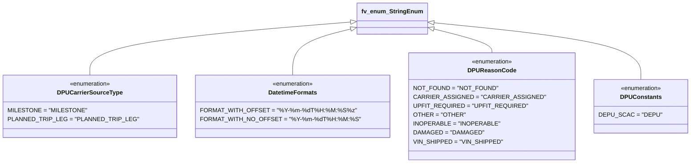

# Diagram: entity_core/entity_service/entity_service/dpu/dpu_service/constants.py

> Auto-generated by Obscura crawlers

## Mermaid

```mermaid
classDiagram
class fv_enum_StringEnum

class DPUCarrierSourceType <<enumeration>> {
  MILESTONE = "MILESTONE"
  PLANNED_TRIP_LEG = "PLANNED_TRIP_LEG"
}
class DatetimeFormats <<enumeration>> {
  FORMAT_WITH_OFFSET = "%Y-%m-%dT%H:%M:%S%z"
  FORMAT_WITH_NO_OFFSET = "%Y-%m-%dT%H:%M:%S"
}
class DPUReasonCode <<enumeration>> {
  NOT_FOUND = "NOT_FOUND"
  CARRIER_ASSIGNED = "CARRIER_ASSIGNED"
  UPFIT_REQUIRED = "UPFIT_REQUIRED"
  OTHER = "OTHER"
  INOPERABLE = "INOPERABLE"
  DAMAGED = "DAMAGED"
  VIN_SHIPPED = "VIN_SHIPPED"
}
class DPUConstants <<enumeration>> {
  DEPU_SCAC = "DEPU"
}

fv_enum_StringEnum <|-- DPUCarrierSourceType
fv_enum_StringEnum <|-- DatetimeFormats
fv_enum_StringEnum <|-- DPUReasonCode
fv_enum_StringEnum <|-- DPUConstants
```

> SVG rendering failed for this diagram.
