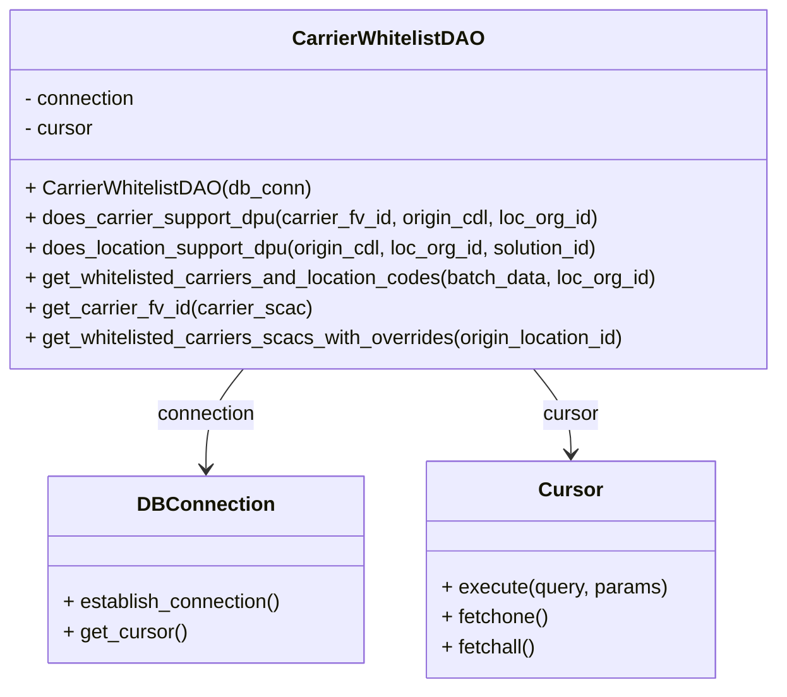

# Diagram: entity_core/entity_service/entity_service/dpu/dpu_service/db/daos/dpu_carrier_whitelist_dao.py


> Auto-generated by Obscura crawlers

## Diagram 1



### SVG

<svg id="container" width="627.609375" xmlns="http://www.w3.org/2000/svg" class="classDiagram" height="552" viewBox="0 0 627.609375 552" role="graphics-document document" aria-roledescription="class"><style>#container{font-family:"trebuchet ms",verdana,arial,sans-serif;font-size:16px;fill:#333;}@keyframes edge-animation-frame{from{stroke-dashoffset:0;}}@keyframes dash{to{stroke-dashoffset:0;}}#container .edge-animation-slow{stroke-dasharray:9,5!important;stroke-dashoffset:900;animation:dash 50s linear infinite;stroke-linecap:round;}#container .edge-animation-fast{stroke-dasharray:9,5!important;stroke-dashoffset:900;animation:dash 20s linear infinite;stroke-linecap:round;}#container .error-icon{fill:#552222;}#container .error-text{fill:#552222;stroke:#552222;}#container .edge-thickness-normal{stroke-width:1px;}#container .edge-thickness-thick{stroke-width:3.5px;}#container .edge-pattern-solid{stroke-dasharray:0;}#container .edge-thickness-invisible{stroke-width:0;fill:none;}#container .edge-pattern-dashed{stroke-dasharray:3;}#container .edge-pattern-dotted{stroke-dasharray:2;}#container .marker{fill:#333333;stroke:#333333;}#container .marker.cross{stroke:#333333;}#container svg{font-family:"trebuchet ms",verdana,arial,sans-serif;font-size:16px;}#container p{margin:0;}#container g.classGroup text{fill:#9370DB;stroke:none;font-family:"trebuchet ms",verdana,arial,sans-serif;font-size:10px;}#container g.classGroup text .title{font-weight:bolder;}#container .nodeLabel,#container .edgeLabel{color:#131300;}#container .edgeLabel .label rect{fill:#ECECFF;}#container .label text{fill:#131300;}#container .labelBkg{background:#ECECFF;}#container .edgeLabel .label span{background:#ECECFF;}#container .classTitle{font-weight:bolder;}#container .node rect,#container .node circle,#container .node ellipse,#container .node polygon,#container .node path{fill:#ECECFF;stroke:#9370DB;stroke-width:1px;}#container .divider{stroke:#9370DB;stroke-width:1;}#container g.clickable{cursor:pointer;}#container g.classGroup rect{fill:#ECECFF;stroke:#9370DB;}#container g.classGroup line{stroke:#9370DB;stroke-width:1;}#container .classLabel .box{stroke:none;stroke-width:0;fill:#ECECFF;opacity:0.5;}#container .classLabel .label{fill:#9370DB;font-size:10px;}#container .relation{stroke:#333333;stroke-width:1;fill:none;}#container .dashed-line{stroke-dasharray:3;}#container .dotted-line{stroke-dasharray:1 2;}#container #compositionStart,#container .composition{fill:#333333!important;stroke:#333333!important;stroke-width:1;}#container #compositionEnd,#container .composition{fill:#333333!important;stroke:#333333!important;stroke-width:1;}#container #dependencyStart,#container .dependency{fill:#333333!important;stroke:#333333!important;stroke-width:1;}#container #dependencyStart,#container .dependency{fill:#333333!important;stroke:#333333!important;stroke-width:1;}#container #extensionStart,#container .extension{fill:transparent!important;stroke:#333333!important;stroke-width:1;}#container #extensionEnd,#container .extension{fill:transparent!important;stroke:#333333!important;stroke-width:1;}#container #aggregationStart,#container .aggregation{fill:transparent!important;stroke:#333333!important;stroke-width:1;}#container #aggregationEnd,#container .aggregation{fill:transparent!important;stroke:#333333!important;stroke-width:1;}#container #lollipopStart,#container .lollipop{fill:#ECECFF!important;stroke:#333333!important;stroke-width:1;}#container #lollipopEnd,#container .lollipop{fill:#ECECFF!important;stroke:#333333!important;stroke-width:1;}#container .edgeTerminals{font-size:11px;line-height:initial;}#container .classTitleText{text-anchor:middle;font-size:18px;fill:#333;}#container .label-icon{display:inline-block;height:1em;overflow:visible;vertical-align:-0.125em;}#container .node .label-icon path{fill:currentColor;stroke:revert;stroke-width:revert;}#container :root{--mermaid-font-family:"trebuchet ms",verdana,arial,sans-serif;}</style><g><defs><marker id="container_class-aggregationStart" class="marker aggregation class" refX="18" refY="7" markerWidth="190" markerHeight="240" orient="auto"><path d="M 18,7 L9,13 L1,7 L9,1 Z"></path></marker></defs><defs><marker id="container_class-aggregationEnd" class="marker aggregation class" refX="1" refY="7" markerWidth="20" markerHeight="28" orient="auto"><path d="M 18,7 L9,13 L1,7 L9,1 Z"></path></marker></defs><defs><marker id="container_class-extensionStart" class="marker extension class" refX="18" refY="7" markerWidth="190" markerHeight="240" orient="auto"><path d="M 1,7 L18,13 V 1 Z"></path></marker></defs><defs><marker id="container_class-extensionEnd" class="marker extension class" refX="1" refY="7" markerWidth="20" markerHeight="28" orient="auto"><path d="M 1,1 V 13 L18,7 Z"></path></marker></defs><defs><marker id="container_class-compositionStart" class="marker composition class" refX="18" refY="7" markerWidth="190" markerHeight="240" orient="auto"><path d="M 18,7 L9,13 L1,7 L9,1 Z"></path></marker></defs><defs><marker id="container_class-compositionEnd" class="marker composition class" refX="1" refY="7" markerWidth="20" markerHeight="28" orient="auto"><path d="M 18,7 L9,13 L1,7 L9,1 Z"></path></marker></defs><defs><marker id="container_class-dependencyStart" class="marker dependency class" refX="6" refY="7" markerWidth="190" markerHeight="240" orient="auto"><path d="M 5,7 L9,13 L1,7 L9,1 Z"></path></marker></defs><defs><marker id="container_class-dependencyEnd" class="marker dependency class" refX="13" refY="7" markerWidth="20" markerHeight="28" orient="auto"><path d="M 18,7 L9,13 L14,7 L9,1 Z"></path></marker></defs><defs><marker id="container_class-lollipopStart" class="marker lollipop class" refX="13" refY="7" markerWidth="190" markerHeight="240" orient="auto"><circle stroke="black" fill="transparent" cx="7" cy="7" r="6"></circle></marker></defs><defs><marker id="container_class-lollipopEnd" class="marker lollipop class" refX="1" refY="7" markerWidth="190" markerHeight="240" orient="auto"><circle stroke="black" fill="transparent" cx="7" cy="7" r="6"></circle></marker></defs><g class="root"><g class="clusters"></g><g class="edgePaths"><path d="M198.048,296L193.091,302.167C188.133,308.333,178.219,320.667,173.262,334C168.305,347.333,168.305,361.667,168.305,368.833L168.305,376" id="id_CarrierWhitelistDAO_DBConnection_1" class="edge-thickness-normal edge-pattern-solid relation" style=";;;" data-edge="true" data-et="edge" data-id="id_CarrierWhitelistDAO_DBConnection_1" data-points="W3sieCI6MTk4LjA0Nzc4MTQyMjY1MTk1LCJ5IjoyOTZ9LHsieCI6MTY4LjMwNDY4NzUsInkiOjMzM30seyJ4IjoxNjguMzA0Njg3NSwieSI6MzgyfV0=" marker-end="url(#container_class-dependencyEnd)"></path><path d="M429.562,296L434.519,302.167C439.476,308.333,449.39,320.667,454.348,332C459.305,343.333,459.305,353.667,459.305,358.833L459.305,364" id="id_CarrierWhitelistDAO_Cursor_2" class="edge-thickness-normal edge-pattern-solid relation" style=";;;" data-edge="true" data-et="edge" data-id="id_CarrierWhitelistDAO_Cursor_2" data-points="W3sieCI6NDI5LjU2MTU5MzU3NzM0ODA1LCJ5IjoyOTZ9LHsieCI6NDU5LjMwNDY4NzUsInkiOjMzM30seyJ4Ijo0NTkuMzA0Njg3NSwieSI6MzcwfV0=" marker-end="url(#container_class-dependencyEnd)"></path></g><g class="edgeLabels"><g class="edgeLabel" transform="translate(168.3046875, 333)"><g class="label" data-id="id_CarrierWhitelistDAO_DBConnection_1" transform="translate(-40.40625, -12)"><foreignObject width="80.8125" height="24"><div xmlns="http://www.w3.org/1999/xhtml" class="labelBkg" style="display: table-cell; white-space: nowrap; line-height: 1.5; max-width: 200px; text-align: center;"><span class="edgeLabel"><p>connection</p></span></div></foreignObject></g></g><g class="edgeLabel" transform="translate(459.3046875, 333)"><g class="label" data-id="id_CarrierWhitelistDAO_Cursor_2" transform="translate(-22.8671875, -12)"><foreignObject width="45.734375" height="24"><div xmlns="http://www.w3.org/1999/xhtml" class="labelBkg" style="display: table-cell; white-space: nowrap; line-height: 1.5; max-width: 200px; text-align: center;"><span class="edgeLabel"><p>cursor</p></span></div></foreignObject></g></g></g><g class="nodes"><g class="node default" id="classId-CarrierWhitelistDAO-0" transform="translate(313.8046875, 152)"><g class="basic label-container"><path d="M-305.8046875 -144 L305.8046875 -144 L305.8046875 144 L-305.8046875 144" stroke="none" stroke-width="0" fill="#ECECFF" style=""></path><path d="M-305.8046875 -144 C-151.38941846788185 -144, 3.0258505642362934 -144, 305.8046875 -144 M-305.8046875 -144 C-82.70032420797688 -144, 140.40403908404625 -144, 305.8046875 -144 M305.8046875 -144 C305.8046875 -71.16370019574705, 305.8046875 1.672599608505891, 305.8046875 144 M305.8046875 -144 C305.8046875 -56.709950948091645, 305.8046875 30.58009810381671, 305.8046875 144 M305.8046875 144 C122.0867000451151 144, -61.63128740976981 144, -305.8046875 144 M305.8046875 144 C99.48039994392988 144, -106.84388761214024 144, -305.8046875 144 M-305.8046875 144 C-305.8046875 42.007981702299745, -305.8046875 -59.98403659540051, -305.8046875 -144 M-305.8046875 144 C-305.8046875 53.969419635403696, -305.8046875 -36.06116072919261, -305.8046875 -144" stroke="#9370DB" stroke-width="1.3" fill="none" stroke-dasharray="0 0" style=""></path></g><g class="annotation-group text" transform="translate(0, -120)"></g><g class="label-group text" transform="translate(-73.09375, -120)"><g class="label" style="font-weight: bolder" transform="translate(0,-12)"><foreignObject width="146.1875" height="24"><div xmlns="http://www.w3.org/1999/xhtml" style="display: table-cell; white-space: nowrap; line-height: 1.5; max-width: 193px; text-align: center;"><span class="nodeLabel markdown-node-label" style=""><p>CarrierWhitelistDAO</p></span></div></foreignObject></g></g><g class="members-group text" transform="translate(-293.8046875, -72)"><g class="label" style="" transform="translate(0,-12)"><foreignObject width="91.5" height="24"><div xmlns="http://www.w3.org/1999/xhtml" style="display: table-cell; white-space: nowrap; line-height: 1.5; max-width: 149px; text-align: center;"><span class="nodeLabel markdown-node-label" style=""><p>- connection</p></span></div></foreignObject></g><g class="label" style="" transform="translate(0,12)"><foreignObject width="56.421875" height="24"><div xmlns="http://www.w3.org/1999/xhtml" style="display: table-cell; white-space: nowrap; line-height: 1.5; max-width: 115px; text-align: center;"><span class="nodeLabel markdown-node-label" style=""><p>- cursor</p></span></div></foreignObject></g></g><g class="methods-group text" transform="translate(-293.8046875, 0)"><g class="label" style="" transform="translate(0,-12)"><foreignObject width="228.078125" height="24"><div xmlns="http://www.w3.org/1999/xhtml" style="display: table-cell; white-space: nowrap; line-height: 1.5; max-width: 285px; text-align: center;"><span class="nodeLabel markdown-node-label" style=""><p>+ CarrierWhitelistDAO(db_conn)</p></span></div></foreignObject></g><g class="label" style="" transform="translate(0,12)"><foreignObject width="467.390625" height="24"><div xmlns="http://www.w3.org/1999/xhtml" style="display: table-cell; white-space: nowrap; line-height: 1.5; max-width: 525px; text-align: center;"><span class="nodeLabel markdown-node-label" style=""><p>+ does_carrier_support_dpu(carrier_fv_id, origin_cdl, loc_org_id)</p></span></div></foreignObject></g><g class="label" style="" transform="translate(0,36)"><foreignObject width="472.421875" height="24"><div xmlns="http://www.w3.org/1999/xhtml" style="display: table-cell; white-space: nowrap; line-height: 1.5; max-width: 530px; text-align: center;"><span class="nodeLabel markdown-node-label" style=""><p>+ does_location_support_dpu(origin_cdl, loc_org_id, solution_id)</p></span></div></foreignObject></g><g class="label" style="" transform="translate(0,60)"><foreignObject width="514.515625" height="24"><div xmlns="http://www.w3.org/1999/xhtml" style="display: table-cell; white-space: nowrap; line-height: 1.5; max-width: 572px; text-align: center;"><span class="nodeLabel markdown-node-label" style=""><p>+ get_whitelisted_carriers_and_location_codes(batch_data, loc_org_id)</p></span></div></foreignObject></g><g class="label" style="" transform="translate(0,84)"><foreignObject width="229.28125" height="24"><div xmlns="http://www.w3.org/1999/xhtml" style="display: table-cell; white-space: nowrap; line-height: 1.5; max-width: 287px; text-align: center;"><span class="nodeLabel markdown-node-label" style=""><p>+ get_carrier_fv_id(carrier_scac)</p></span></div></foreignObject></g><g class="label" style="" transform="translate(0,108)"><foreignObject width="490.4375" height="24"><div xmlns="http://www.w3.org/1999/xhtml" style="display: table-cell; white-space: nowrap; line-height: 1.5; max-width: 548px; text-align: center;"><span class="nodeLabel markdown-node-label" style=""><p>+ get_whitelisted_carriers_scacs_with_overrides(origin_location_id)</p></span></div></foreignObject></g></g><g class="divider" style=""><path d="M-305.8046875 -96 C-137.506394531831 -96, 30.791898436337988 -96, 305.8046875 -96 M-305.8046875 -96 C-130.85665337517688 -96, 44.09138074964625 -96, 305.8046875 -96" stroke="#9370DB" stroke-width="1.3" fill="none" stroke-dasharray="0 0" style=""></path></g><g class="divider" style=""><path d="M-305.8046875 -24 C-123.90246124797247 -24, 57.999765004055064 -24, 305.8046875 -24 M-305.8046875 -24 C-165.66129523064615 -24, -25.517902961292293 -24, 305.8046875 -24" stroke="#9370DB" stroke-width="1.3" fill="none" stroke-dasharray="0 0" style=""></path></g></g><g class="node default" id="classId-DBConnection-1" transform="translate(168.3046875, 457)"><g class="basic label-container"><path d="M-126.4453125 -75 L126.4453125 -75 L126.4453125 75 L-126.4453125 75" stroke="none" stroke-width="0" fill="#ECECFF" style=""></path><path d="M-126.4453125 -75 C-55.93767869169514 -75, 14.56995511660972 -75, 126.4453125 -75 M-126.4453125 -75 C-58.01154469299186 -75, 10.422223114016276 -75, 126.4453125 -75 M126.4453125 -75 C126.4453125 -35.267479671442715, 126.4453125 4.465040657114571, 126.4453125 75 M126.4453125 -75 C126.4453125 -28.743444971857038, 126.4453125 17.513110056285925, 126.4453125 75 M126.4453125 75 C66.90734983126663 75, 7.369387162533243 75, -126.4453125 75 M126.4453125 75 C36.91805879417154 75, -52.609194911656914 75, -126.4453125 75 M-126.4453125 75 C-126.4453125 40.95536357132487, -126.4453125 6.910727142649733, -126.4453125 -75 M-126.4453125 75 C-126.4453125 34.14262330874437, -126.4453125 -6.714753382511262, -126.4453125 -75" stroke="#9370DB" stroke-width="1.3" fill="none" stroke-dasharray="0 0" style=""></path></g><g class="annotation-group text" transform="translate(0, -51)"></g><g class="label-group text" transform="translate(-51.375, -51)"><g class="label" style="font-weight: bolder" transform="translate(0,-12)"><foreignObject width="102.75" height="24"><div xmlns="http://www.w3.org/1999/xhtml" style="display: table-cell; white-space: nowrap; line-height: 1.5; max-width: 152px; text-align: center;"><span class="nodeLabel markdown-node-label" style=""><p>DBConnection</p></span></div></foreignObject></g></g><g class="members-group text" transform="translate(-114.4453125, -3)"></g><g class="methods-group text" transform="translate(-114.4453125, 27)"><g class="label" style="" transform="translate(0,-12)"><foreignObject width="177.515625" height="24"><div xmlns="http://www.w3.org/1999/xhtml" style="display: table-cell; white-space: nowrap; line-height: 1.5; max-width: 235px; text-align: center;"><span class="nodeLabel markdown-node-label" style=""><p>+ establish_connection()</p></span></div></foreignObject></g><g class="label" style="" transform="translate(0,12)"><foreignObject width="98.890625" height="24"><div xmlns="http://www.w3.org/1999/xhtml" style="display: table-cell; white-space: nowrap; line-height: 1.5; max-width: 156px; text-align: center;"><span class="nodeLabel markdown-node-label" style=""><p>+ get_cursor()</p></span></div></foreignObject></g></g><g class="divider" style=""><path d="M-126.4453125 -27 C-54.53658117653052 -27, 17.372150146938964 -27, 126.4453125 -27 M-126.4453125 -27 C-59.26389486309638 -27, 7.917522773807235 -27, 126.4453125 -27" stroke="#9370DB" stroke-width="1.3" fill="none" stroke-dasharray="0 0" style=""></path></g><g class="divider" style=""><path d="M-126.4453125 -3 C-34.647744117281405 -3, 57.14982426543719 -3, 126.4453125 -3 M-126.4453125 -3 C-57.916576643062285 -3, 10.61215921387543 -3, 126.4453125 -3" stroke="#9370DB" stroke-width="1.3" fill="none" stroke-dasharray="0 0" style=""></path></g></g><g class="node default" id="classId-Cursor-2" transform="translate(459.3046875, 457)"><g class="basic label-container"><path d="M-114.5546875 -87 L114.5546875 -87 L114.5546875 87 L-114.5546875 87" stroke="none" stroke-width="0" fill="#ECECFF" style=""></path><path d="M-114.5546875 -87 C-32.79751922853396 -87, 48.959649042932085 -87, 114.5546875 -87 M-114.5546875 -87 C-51.400883687722995 -87, 11.75292012455401 -87, 114.5546875 -87 M114.5546875 -87 C114.5546875 -46.475267563299305, 114.5546875 -5.950535126598609, 114.5546875 87 M114.5546875 -87 C114.5546875 -51.855233942591575, 114.5546875 -16.71046788518315, 114.5546875 87 M114.5546875 87 C34.080507625156045 87, -46.39367224968791 87, -114.5546875 87 M114.5546875 87 C57.82499815748496 87, 1.0953088149699255 87, -114.5546875 87 M-114.5546875 87 C-114.5546875 22.996281379192325, -114.5546875 -41.00743724161535, -114.5546875 -87 M-114.5546875 87 C-114.5546875 35.50480903771892, -114.5546875 -15.990381924562158, -114.5546875 -87" stroke="#9370DB" stroke-width="1.3" fill="none" stroke-dasharray="0 0" style=""></path></g><g class="annotation-group text" transform="translate(0, -63)"></g><g class="label-group text" transform="translate(-23.90625, -63)"><g class="label" style="font-weight: bolder" transform="translate(0,-12)"><foreignObject width="47.8125" height="24"><div xmlns="http://www.w3.org/1999/xhtml" style="display: table-cell; white-space: nowrap; line-height: 1.5; max-width: 98px; text-align: center;"><span class="nodeLabel markdown-node-label" style=""><p>Cursor</p></span></div></foreignObject></g></g><g class="members-group text" transform="translate(-102.5546875, -15)"></g><g class="methods-group text" transform="translate(-102.5546875, 15)"><g class="label" style="" transform="translate(0,-12)"><foreignObject width="181.203125" height="24"><div xmlns="http://www.w3.org/1999/xhtml" style="display: table-cell; white-space: nowrap; line-height: 1.5; max-width: 239px; text-align: center;"><span class="nodeLabel markdown-node-label" style=""><p>+ execute(query, params)</p></span></div></foreignObject></g><g class="label" style="" transform="translate(0,12)"><foreignObject width="86.515625" height="24"><div xmlns="http://www.w3.org/1999/xhtml" style="display: table-cell; white-space: nowrap; line-height: 1.5; max-width: 144px; text-align: center;"><span class="nodeLabel markdown-node-label" style=""><p>+ fetchone()</p></span></div></foreignObject></g><g class="label" style="" transform="translate(0,36)"><foreignObject width="77" height="24"><div xmlns="http://www.w3.org/1999/xhtml" style="display: table-cell; white-space: nowrap; line-height: 1.5; max-width: 134px; text-align: center;"><span class="nodeLabel markdown-node-label" style=""><p>+ fetchall()</p></span></div></foreignObject></g></g><g class="divider" style=""><path d="M-114.5546875 -39 C-65.050089977775 -39, -15.545492455550004 -39, 114.5546875 -39 M-114.5546875 -39 C-30.884075252322816 -39, 52.78653699535437 -39, 114.5546875 -39" stroke="#9370DB" stroke-width="1.3" fill="none" stroke-dasharray="0 0" style=""></path></g><g class="divider" style=""><path d="M-114.5546875 -15 C-38.48822219255274 -15, 37.57824311489452 -15, 114.5546875 -15 M-114.5546875 -15 C-68.08654570392187 -15, -21.618403907843728 -15, 114.5546875 -15" stroke="#9370DB" stroke-width="1.3" fill="none" stroke-dasharray="0 0" style=""></path></g></g></g></g></g></svg>

## Diagram 2

```mermaid
flowchart TD
Init[Initialize CarrierWhitelistDAO instance]
Init --> Establish[connection.establish_connection()]
Establish --> GetCursor[connection.get_cursor() → cursor]
GetCursor --> Methods{Invoke method}
Methods --> M1[does_carrier_support_dpu<br/>cursor.execute(query, params)]
M1 --> F1[cursor.fetchone()]
F1 --> R1[return bool(result)]
Methods --> M2[does_location_support_dpu<br/>cursor.execute(query, params)]
M2 --> F2[cursor.fetchone()]
F2 --> R2[return bool(result)]
Methods --> M3[get_whitelisted_carriers_and_location_codes<br/>cursor.execute(query, params)]
M3 --> F3[cursor.fetchall()]
F3 --> C3{result exists?}
C3 -->|yes| R3[return set((scac, origin_cdl) ...)]
C3 -->|no| R3b[return None]
Methods --> M4[get_carrier_fv_id<br/>cursor.execute(query, params)]
M4 --> F4[cursor.fetchone()]
F4 --> C4{result exists?}
C4 -->|yes| R4[return result.fv_id]
C4 -->|no| R4b[return None]
Methods --> M5[get_whitelisted_carriers_scacs_with_overrides<br/>cursor.execute(query, params)]
M5 --> F5[cursor.fetchall()]
F5 --> Map5[map rows → {"scac": scac, "override_scac": new_scac}]
Map5 --> R5[return list of mappings]
```

> SVG rendering failed for this diagram.
