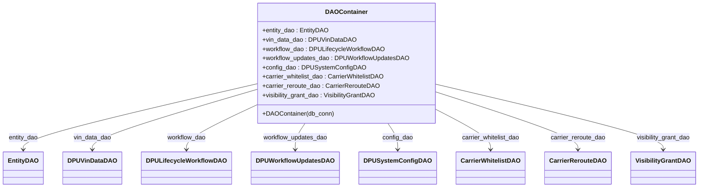

# Diagram: entity_core/entity_service/entity_service/dpu/dpu_service/db/daos/dpu_dao.py

> Auto-generated by Obscura crawlers

## Mermaid

### SVG

<svg id="container" width="1713.625" xmlns="http://www.w3.org/2000/svg" class="classDiagram" height="486" viewBox="0 0 1713.625 486" role="graphics-document document" aria-roledescription="class"><g><defs><marker id="container_class-aggregationStart" class="marker aggregation class" refX="18" refY="7" markerWidth="190" markerHeight="240" orient="auto"><path d="M 18,7 L9,13 L1,7 L9,1 Z"></path></marker></defs><defs><marker id="container_class-aggregationEnd" class="marker aggregation class" refX="1" refY="7" markerWidth="20" markerHeight="28" orient="auto"><path d="M 18,7 L9,13 L1,7 L9,1 Z"></path></marker></defs><defs><marker id="container_class-extensionStart" class="marker extension class" refX="18" refY="7" markerWidth="190" markerHeight="240" orient="auto"><path d="M 1,7 L18,13 V 1 Z"></path></marker></defs><defs><marker id="container_class-extensionEnd" class="marker extension class" refX="1" refY="7" markerWidth="20" markerHeight="28" orient="auto"><path d="M 1,1 V 13 L18,7 Z"></path></marker></defs><defs><marker id="container_class-compositionStart" class="marker composition class" refX="18" refY="7" markerWidth="190" markerHeight="240" orient="auto"><path d="M 18,7 L9,13 L1,7 L9,1 Z"></path></marker></defs><defs><marker id="container_class-compositionEnd" class="marker composition class" refX="1" refY="7" markerWidth="20" markerHeight="28" orient="auto"><path d="M 18,7 L9,13 L1,7 L9,1 Z"></path></marker></defs><defs><marker id="container_class-dependencyStart" class="marker dependency class" refX="6" refY="7" markerWidth="190" markerHeight="240" orient="auto"><path d="M 5,7 L9,13 L1,7 L9,1 Z"></path></marker></defs><defs><marker id="container_class-dependencyEnd" class="marker dependency class" refX="13" refY="7" markerWidth="20" markerHeight="28" orient="auto"><path d="M 18,7 L9,13 L14,7 L9,1 Z"></path></marker></defs><defs><marker id="container_class-lollipopStart" class="marker lollipop class" refX="13" refY="7" markerWidth="190" markerHeight="240" orient="auto"><circle stroke="black" fill="transparent" cx="7" cy="7" r="6"></circle></marker></defs><defs><marker id="container_class-lollipopEnd" class="marker lollipop class" refX="1" refY="7" markerWidth="190" markerHeight="240" orient="auto"><circle stroke="black" fill="transparent" cx="7" cy="7" r="6"></circle></marker></defs><g class="root"><g class="clusters"></g><g class="edgePaths"><path d="M622.652,218.883L528.307,241.903C433.961,264.922,245.27,310.961,150.924,339.147C56.578,367.333,56.578,377.667,56.578,382.833L56.578,388" id="id_DAOContainer_EntityDAO_1" class="edge-thickness-normal edge-pattern-solid relation" style=";;;" data-edge="true" data-et="edge" data-id="id_DAOContainer_EntityDAO_1" data-points="W3sieCI6NjIyLjY1MjM0Mzc1LCJ5IjoyMTguODgzNDgxNDgxNDgxNDh9LHsieCI6NTYuNTc4MTI1LCJ5IjozNTd9LHsieCI6NTYuNTc4MTI1LCJ5IjozOTR9XQ==" marker-end="url(#container_class-dependencyEnd)"></path><path d="M622.652,233.842L556.542,254.368C490.432,274.894,358.212,315.947,292.102,341.64C225.992,367.333,225.992,377.667,225.992,382.833L225.992,388" id="id_DAOContainer_DPUVinDataDAO_2" class="edge-thickness-normal edge-pattern-solid relation" style=";;;" data-edge="true" data-et="edge" data-id="id_DAOContainer_DPUVinDataDAO_2" data-points="W3sieCI6NjIyLjY1MjM0Mzc1LCJ5IjoyMzMuODQxNjcwMzMyNDMyNn0seyJ4IjoyMjUuOTkyMTg3NSwieSI6MzU3fSx7IngiOjIyNS45OTIxODc1LCJ5IjozOTR9XQ==" marker-end="url(#container_class-dependencyEnd)"></path><path d="M622.652,274.877L594.885,288.564C567.117,302.252,511.582,329.626,483.814,348.48C456.047,367.333,456.047,377.667,456.047,382.833L456.047,388" id="id_DAOContainer_DPULifecycleWorkflowDAO_3" class="edge-thickness-normal edge-pattern-solid relation" style=";;;" data-edge="true" data-et="edge" data-id="id_DAOContainer_DPULifecycleWorkflowDAO_3" data-points="W3sieCI6NjIyLjY1MjM0Mzc1LCJ5IjoyNzQuODc3Mzc5Mzg0NjUyMn0seyJ4Ijo0NTYuMDQ2ODc1LCJ5IjozNTd9LHsieCI6NDU2LjA0Njg3NSwieSI6Mzk0fV0=" marker-end="url(#container_class-dependencyEnd)"></path><path d="M746.753,320L742.767,326.167C738.781,332.333,730.808,344.667,726.822,356C722.836,367.333,722.836,377.667,722.836,382.833L722.836,388" id="id_DAOContainer_DPUWorkflowUpdatesDAO_4" class="edge-thickness-normal edge-pattern-solid relation" style=";;;" data-edge="true" data-et="edge" data-id="id_DAOContainer_DPUWorkflowUpdatesDAO_4" data-points="W3sieCI6NzQ2Ljc1MzIzODM0MTk2ODksInkiOjMyMH0seyJ4Ijo3MjIuODM1OTM3NSwieSI6MzU3fSx7IngiOjcyMi44MzU5Mzc1LCJ5IjozOTR9XQ==" marker-end="url(#container_class-dependencyEnd)"></path><path d="M948.434,320L952.42,326.167C956.407,332.333,964.379,344.667,968.365,356C972.352,367.333,972.352,377.667,972.352,382.833L972.352,388" id="id_DAOContainer_DPUSystemConfigDAO_5" class="edge-thickness-normal edge-pattern-solid relation" style=";;;" data-edge="true" data-et="edge" data-id="id_DAOContainer_DPUSystemConfigDAO_5" data-points="W3sieCI6OTQ4LjQzNDI2MTY1ODAzMTEsInkiOjMyMH0seyJ4Ijo5NzIuMzUxNTYyNSwieSI6MzU3fSx7IngiOjk3Mi4zNTE1NjI1LCJ5IjozOTR9XQ==" marker-end="url(#container_class-dependencyEnd)"></path><path d="M1072.535,287.406L1093.678,299.005C1114.82,310.604,1157.105,333.802,1178.248,350.568C1199.391,367.333,1199.391,377.667,1199.391,382.833L1199.391,388" id="id_DAOContainer_CarrierWhitelistDAO_6" class="edge-thickness-normal edge-pattern-solid relation" style=";;;" data-edge="true" data-et="edge" data-id="id_DAOContainer_CarrierWhitelistDAO_6" data-points="W3sieCI6MTA3Mi41MzUxNTYyNSwieSI6Mjg3LjQwNTU2Mjk1ODAyOH0seyJ4IjoxMTk5LjM5MDYyNSwieSI6MzU3fSx7IngiOjExOTkuMzkwNjI1LCJ5IjozOTR9XQ==" marker-end="url(#container_class-dependencyEnd)"></path><path d="M1072.535,240.406L1129.744,259.839C1186.953,279.271,1301.371,318.135,1358.58,342.734C1415.789,367.333,1415.789,377.667,1415.789,382.833L1415.789,388" id="id_DAOContainer_CarrierRerouteDAO_7" class="edge-thickness-normal edge-pattern-solid relation" style=";;;" data-edge="true" data-et="edge" data-id="id_DAOContainer_CarrierRerouteDAO_7" data-points="W3sieCI6MTA3Mi41MzUxNTYyNSwieSI6MjQwLjQwNjI4MjIyNTc5NzE2fSx7IngiOjE0MTUuNzg5MDYyNSwieSI6MzU3fSx7IngiOjE0MTUuNzg5MDYyNSwieSI6Mzk0fV0=" marker-end="url(#container_class-dependencyEnd)"></path><path d="M1072.535,219.747L1164.839,242.622C1257.143,265.498,1441.751,311.249,1534.055,339.291C1626.359,367.333,1626.359,377.667,1626.359,382.833L1626.359,388" id="id_DAOContainer_VisibilityGrantDAO_8" class="edge-thickness-normal edge-pattern-solid relation" style=";;;" data-edge="true" data-et="edge" data-id="id_DAOContainer_VisibilityGrantDAO_8" data-points="W3sieCI6MTA3Mi41MzUxNTYyNSwieSI6MjE5Ljc0Njc5OTgyMzQzODU1fSx7IngiOjE2MjYuMzU5Mzc1LCJ5IjozNTd9LHsieCI6MTYyNi4zNTkzNzUsInkiOjM5NH1d" marker-end="url(#container_class-dependencyEnd)"></path></g><g class="edgeLabels"><g class="edgeLabel" transform="translate(56.578125, 357)"><g class="label" data-id="id_DAOContainer_EntityDAO_1" transform="translate(-38.546875, -12)"><foreignObject width="77.09375" height="24">

entity_dao

</foreignObject></g></g><g class="edgeLabel" transform="translate(225.9921875, 357)"><g class="label" data-id="id_DAOContainer_DPUVinDataDAO_2" transform="translate(-49.015625, -12)"><foreignObject width="98.03125" height="24">

vin_data_dao

</foreignObject></g></g><g class="edgeLabel" transform="translate(456.046875, 357)"><g class="label" data-id="id_DAOContainer_DPULifecycleWorkflowDAO_3" transform="translate(-50.3515625, -12)"><foreignObject width="100.703125" height="24">

workflow_dao

</foreignObject></g></g><g class="edgeLabel" transform="translate(722.8359375, 357)"><g class="label" data-id="id_DAOContainer_DPUWorkflowUpdatesDAO_4" transform="translate(-83.59375, -12)"><foreignObject width="167.1875" height="24">

workflow_updates_dao

</foreignObject></g></g><g class="edgeLabel" transform="translate(972.3515625, 357)"><g class="label" data-id="id_DAOContainer_DPUSystemConfigDAO_5" transform="translate(-39.625, -12)"><foreignObject width="79.25" height="24">

config_dao

</foreignObject></g></g><g class="edgeLabel" transform="translate(1199.390625, 357)"><g class="label" data-id="id_DAOContainer_CarrierWhitelistDAO_6" transform="translate(-76.1796875, -12)"><foreignObject width="152.359375" height="24">

carrier_whitelist_dao

</foreignObject></g></g><g class="edgeLabel" transform="translate(1415.7890625, 357)"><g class="label" data-id="id_DAOContainer_CarrierRerouteDAO_7" transform="translate(-71.65625, -12)"><foreignObject width="143.3125" height="24">

carrier_reroute_dao

</foreignObject></g></g><g class="edgeLabel" transform="translate(1626.359375, 357)"><g class="label" data-id="id_DAOContainer_VisibilityGrantDAO_8" transform="translate(-71.2734375, -12)"><foreignObject width="142.546875" height="24">

visibility_grant_dao

</foreignObject></g></g></g><g class="nodes"><g class="node default" id="classId-DAOContainer-0" transform="translate(847.59375, 164)"><g class="basic label-container"><path d="M-224.94140625 -156 L224.94140625 -156 L224.94140625 156 L-224.94140625 156" stroke="none" stroke-width="0" fill="#ECECFF" style=""></path><path d="M-224.94140625 -156 C-51.686505251190994 -156, 121.56839574761801 -156, 224.94140625 -156 M-224.94140625 -156 C-48.79187880114992 -156, 127.35764864770016 -156, 224.94140625 -156 M224.94140625 -156 C224.94140625 -85.57083383629687, 224.94140625 -15.14166767259374, 224.94140625 156 M224.94140625 -156 C224.94140625 -52.753891620108604, 224.94140625 50.49221675978279, 224.94140625 156 M224.94140625 156 C74.47445709594462 156, -75.99249205811077 156, -224.94140625 156 M224.94140625 156 C83.9211985744819 156, -57.09900910103619 156, -224.94140625 156 M-224.94140625 156 C-224.94140625 47.317003199749806, -224.94140625 -61.36599360050039, -224.94140625 -156 M-224.94140625 156 C-224.94140625 41.73033066122102, -224.94140625 -72.53933867755796, -224.94140625 -156" stroke="#9370DB" stroke-width="1.3" fill="none" stroke-dasharray="0 0" style=""></path></g><g class="annotation-group text" transform="translate(0, -132)"></g><g class="label-group text" transform="translate(-50.8984375, -132)"><g class="label" style="font-weight: bolder" transform="translate(0,-12)"><foreignObject width="101.796875" height="24">

DAOContainer

</foreignObject></g></g><g class="members-group text" transform="translate(-212.94140625, -84)"><g class="label" style="" transform="translate(0,-12)"><foreignObject width="169.25" height="24">

+entity_dao : EntityDAO

</foreignObject></g><g class="label" style="" transform="translate(0,12)"><foreignObject width="234.578125" height="24">

+vin_data_dao : DPUVinDataDAO

</foreignObject></g><g class="label" style="" transform="translate(0,36)"><foreignObject width="311.21875" height="24">

+workflow_dao : DPULifecycleWorkflowDAO

</foreignObject></g><g class="label" style="" transform="translate(0,60)"><foreignObject width="374.984375" height="24">

+workflow_updates_dao : DPUWorkflowUpdatesDAO

</foreignObject></g><g class="label" style="" transform="translate(0,84)"><foreignObject width="256.5" height="24">

+config_dao : DPUSystemConfigDAO

</foreignObject></g><g class="label" style="" transform="translate(0,108)"><foreignObject width="315.953125" height="24">

+carrier_whitelist_dao : CarrierWhitelistDAO

</foreignObject></g><g class="label" style="" transform="translate(0,132)"><foreignObject width="299.875" height="24">

+carrier_reroute_dao : CarrierRerouteDAO

</foreignObject></g><g class="label" style="" transform="translate(0,156)"><foreignObject width="294.671875" height="24">

+visibility_grant_dao : VisibilityGrantDAO

</foreignObject></g></g><g class="methods-group text" transform="translate(-212.94140625, 132)"><g class="label" style="" transform="translate(0,-12)"><foreignObject width="181.265625" height="24">

+DAOContainer(db_conn)

</foreignObject></g></g><g class="divider" style=""><path d="M-224.94140625 -108 C-75.51330797852734 -108, 73.91479029294533 -108, 224.94140625 -108 M-224.94140625 -108 C-82.89767132731978 -108, 59.14606359536043 -108, 224.94140625 -108" stroke="#9370DB" stroke-width="1.3" fill="none" stroke-dasharray="0 0" style=""></path></g><g class="divider" style=""><path d="M-224.94140625 108 C-120.15772494463869 108, -15.374043639277374 108, 224.94140625 108 M-224.94140625 108 C-64.52567986184084 108, 95.89004652631832 108, 224.94140625 108" stroke="#9370DB" stroke-width="1.3" fill="none" stroke-dasharray="0 0" style=""></path></g></g><g class="node default" id="classId-EntityDAO-1" transform="translate(56.578125, 436)"><g class="basic label-container"><path d="M-48.578125 -42 L48.578125 -42 L48.578125 42 L-48.578125 42" stroke="none" stroke-width="0" fill="#ECECFF" style=""></path><path d="M-48.578125 -42 C-24.482008018511653 -42, -0.3858910370233062 -42, 48.578125 -42 M-48.578125 -42 C-10.444265810624437 -42, 27.689593378751127 -42, 48.578125 -42 M48.578125 -42 C48.578125 -14.632412586728382, 48.578125 12.735174826543236, 48.578125 42 M48.578125 -42 C48.578125 -17.8897106413824, 48.578125 6.220578717235199, 48.578125 42 M48.578125 42 C21.867606534293508 42, -4.842911931412985 42, -48.578125 42 M48.578125 42 C10.619763898905575 42, -27.33859720218885 42, -48.578125 42 M-48.578125 42 C-48.578125 22.339205170539806, -48.578125 2.678410341079612, -48.578125 -42 M-48.578125 42 C-48.578125 23.87796675024024, -48.578125 5.755933500480481, -48.578125 -42" stroke="#9370DB" stroke-width="1.3" fill="none" stroke-dasharray="0 0" style=""></path></g><g class="annotation-group text" transform="translate(0, -18)"></g><g class="label-group text" transform="translate(-36.578125, -18)"><g class="label" style="font-weight: bolder" transform="translate(0,-12)"><foreignObject width="73.15625" height="24">

EntityDAO

</foreignObject></g></g><g class="members-group text" transform="translate(-36.578125, 30)"></g><g class="methods-group text" transform="translate(-36.578125, 60)"></g><g class="divider" style=""><path d="M-48.578125 6 C-15.954588171986273 6, 16.668948656027453 6, 48.578125 6 M-48.578125 6 C-10.685203395861933 6, 27.207718208276134 6, 48.578125 6" stroke="#9370DB" stroke-width="1.3" fill="none" stroke-dasharray="0 0" style=""></path></g><g class="divider" style=""><path d="M-48.578125 24 C-25.20206409299752 24, -1.8260031859950416 24, 48.578125 24 M-48.578125 24 C-24.75170466368752 24, -0.9252843273750386 24, 48.578125 24" stroke="#9370DB" stroke-width="1.3" fill="none" stroke-dasharray="0 0" style=""></path></g></g><g class="node default" id="classId-DPUVinDataDAO-2" transform="translate(225.9921875, 436)"><g class="basic label-container"><path d="M-70.8359375 -42 L70.8359375 -42 L70.8359375 42 L-70.8359375 42" stroke="none" stroke-width="0" fill="#ECECFF" style=""></path><path d="M-70.8359375 -42 C-25.822962635277207 -42, 19.190012229445585 -42, 70.8359375 -42 M-70.8359375 -42 C-34.045815189321054 -42, 2.744307121357892 -42, 70.8359375 -42 M70.8359375 -42 C70.8359375 -13.304409848451922, 70.8359375 15.391180303096156, 70.8359375 42 M70.8359375 -42 C70.8359375 -17.78904443445423, 70.8359375 6.421911131091541, 70.8359375 42 M70.8359375 42 C28.055152063439763 42, -14.725633373120473 42, -70.8359375 42 M70.8359375 42 C25.337941307737474 42, -20.160054884525053 42, -70.8359375 42 M-70.8359375 42 C-70.8359375 10.524748679626583, -70.8359375 -20.950502640746834, -70.8359375 -42 M-70.8359375 42 C-70.8359375 17.803947037808555, -70.8359375 -6.392105924382889, -70.8359375 -42" stroke="#9370DB" stroke-width="1.3" fill="none" stroke-dasharray="0 0" style=""></path></g><g class="annotation-group text" transform="translate(0, -18)"></g><g class="label-group text" transform="translate(-58.8359375, -18)"><g class="label" style="font-weight: bolder" transform="translate(0,-12)"><foreignObject width="117.671875" height="24">

DPUVinDataDAO

</foreignObject></g></g><g class="members-group text" transform="translate(-58.8359375, 30)"></g><g class="methods-group text" transform="translate(-58.8359375, 60)"></g><g class="divider" style=""><path d="M-70.8359375 6 C-22.835316483929503 6, 25.165304532140993 6, 70.8359375 6 M-70.8359375 6 C-17.399972238069665 6, 36.03599302386067 6, 70.8359375 6" stroke="#9370DB" stroke-width="1.3" fill="none" stroke-dasharray="0 0" style=""></path></g><g class="divider" style=""><path d="M-70.8359375 24 C-40.91377726576076 24, -10.991617031521521 24, 70.8359375 24 M-70.8359375 24 C-37.7797645456809 24, -4.723591591361796 24, 70.8359375 24" stroke="#9370DB" stroke-width="1.3" fill="none" stroke-dasharray="0 0" style=""></path></g></g><g class="node default" id="classId-DPULifecycleWorkflowDAO-3" transform="translate(456.046875, 436)"><g class="basic label-container"><path d="M-109.21875 -42 L109.21875 -42 L109.21875 42 L-109.21875 42" stroke="none" stroke-width="0" fill="#ECECFF" style=""></path><path d="M-109.21875 -42 C-30.655697468264393 -42, 47.907355063471215 -42, 109.21875 -42 M-109.21875 -42 C-31.40202082800336 -42, 46.41470834399328 -42, 109.21875 -42 M109.21875 -42 C109.21875 -15.939536652526666, 109.21875 10.120926694946668, 109.21875 42 M109.21875 -42 C109.21875 -14.58005461632029, 109.21875 12.839890767359421, 109.21875 42 M109.21875 42 C26.545430576857044 42, -56.12788884628591 42, -109.21875 42 M109.21875 42 C52.17692501156771 42, -4.864899976864578 42, -109.21875 42 M-109.21875 42 C-109.21875 8.458833052934501, -109.21875 -25.082333894130997, -109.21875 -42 M-109.21875 42 C-109.21875 23.22505117375525, -109.21875 4.4501023475105015, -109.21875 -42" stroke="#9370DB" stroke-width="1.3" fill="none" stroke-dasharray="0 0" style=""></path></g><g class="annotation-group text" transform="translate(0, -18)"></g><g class="label-group text" transform="translate(-97.21875, -18)"><g class="label" style="font-weight: bolder" transform="translate(0,-12)"><foreignObject width="194.4375" height="24">

DPULifecycleWorkflowDAO

</foreignObject></g></g><g class="members-group text" transform="translate(-97.21875, 30)"></g><g class="methods-group text" transform="translate(-97.21875, 60)"></g><g class="divider" style=""><path d="M-109.21875 6 C-56.18802187530138 6, -3.1572937506027614 6, 109.21875 6 M-109.21875 6 C-27.824939720172196 6, 53.56887055965561 6, 109.21875 6" stroke="#9370DB" stroke-width="1.3" fill="none" stroke-dasharray="0 0" style=""></path></g><g class="divider" style=""><path d="M-109.21875 24 C-43.316541457945064 24, 22.585667084109872 24, 109.21875 24 M-109.21875 24 C-53.143680975536114 24, 2.931388048927772 24, 109.21875 24" stroke="#9370DB" stroke-width="1.3" fill="none" stroke-dasharray="0 0" style=""></path></g></g><g class="node default" id="classId-DPUWorkflowUpdatesDAO-4" transform="translate(722.8359375, 436)"><g class="basic label-container"><path d="M-107.5703125 -42 L107.5703125 -42 L107.5703125 42 L-107.5703125 42" stroke="none" stroke-width="0" fill="#ECECFF" style=""></path><path d="M-107.5703125 -42 C-44.42588276790703 -42, 18.718546964185947 -42, 107.5703125 -42 M-107.5703125 -42 C-59.185135489580695 -42, -10.79995847916139 -42, 107.5703125 -42 M107.5703125 -42 C107.5703125 -12.170564078875614, 107.5703125 17.65887184224877, 107.5703125 42 M107.5703125 -42 C107.5703125 -13.043933034958297, 107.5703125 15.912133930083407, 107.5703125 42 M107.5703125 42 C53.53663205277029 42, -0.4970483944594264 42, -107.5703125 42 M107.5703125 42 C55.15878530205855 42, 2.747258104117094 42, -107.5703125 42 M-107.5703125 42 C-107.5703125 19.356826493911505, -107.5703125 -3.2863470121769893, -107.5703125 -42 M-107.5703125 42 C-107.5703125 15.764509431471957, -107.5703125 -10.470981137056086, -107.5703125 -42" stroke="#9370DB" stroke-width="1.3" fill="none" stroke-dasharray="0 0" style=""></path></g><g class="annotation-group text" transform="translate(0, -18)"></g><g class="label-group text" transform="translate(-95.5703125, -18)"><g class="label" style="font-weight: bolder" transform="translate(0,-12)"><foreignObject width="191.140625" height="24">

DPUWorkflowUpdatesDAO

</foreignObject></g></g><g class="members-group text" transform="translate(-95.5703125, 30)"></g><g class="methods-group text" transform="translate(-95.5703125, 60)"></g><g class="divider" style=""><path d="M-107.5703125 6 C-29.760460235909846 6, 48.04939202818031 6, 107.5703125 6 M-107.5703125 6 C-25.10687702344424 6, 57.35655845311152 6, 107.5703125 6" stroke="#9370DB" stroke-width="1.3" fill="none" stroke-dasharray="0 0" style=""></path></g><g class="divider" style=""><path d="M-107.5703125 24 C-62.75864744294231 24, -17.946982385884624 24, 107.5703125 24 M-107.5703125 24 C-60.63458482897889 24, -13.698857157957775 24, 107.5703125 24" stroke="#9370DB" stroke-width="1.3" fill="none" stroke-dasharray="0 0" style=""></path></g></g><g class="node default" id="classId-DPUSystemConfigDAO-5" transform="translate(972.3515625, 436)"><g class="basic label-container"><path d="M-91.9453125 -42 L91.9453125 -42 L91.9453125 42 L-91.9453125 42" stroke="none" stroke-width="0" fill="#ECECFF" style=""></path><path d="M-91.9453125 -42 C-45.80796865137244 -42, 0.32937519725511777 -42, 91.9453125 -42 M-91.9453125 -42 C-33.442749188942734 -42, 25.05981412211453 -42, 91.9453125 -42 M91.9453125 -42 C91.9453125 -10.876243780596557, 91.9453125 20.247512438806886, 91.9453125 42 M91.9453125 -42 C91.9453125 -21.069762018458718, 91.9453125 -0.13952403691743598, 91.9453125 42 M91.9453125 42 C49.05569522443782 42, 6.166077948875639 42, -91.9453125 42 M91.9453125 42 C24.60329592478395 42, -42.7387206504321 42, -91.9453125 42 M-91.9453125 42 C-91.9453125 13.55234315446328, -91.9453125 -14.89531369107344, -91.9453125 -42 M-91.9453125 42 C-91.9453125 17.01328911050186, -91.9453125 -7.973421778996283, -91.9453125 -42" stroke="#9370DB" stroke-width="1.3" fill="none" stroke-dasharray="0 0" style=""></path></g><g class="annotation-group text" transform="translate(0, -18)"></g><g class="label-group text" transform="translate(-79.9453125, -18)"><g class="label" style="font-weight: bolder" transform="translate(0,-12)"><foreignObject width="159.890625" height="24">

DPUSystemConfigDAO

</foreignObject></g></g><g class="members-group text" transform="translate(-79.9453125, 30)"></g><g class="methods-group text" transform="translate(-79.9453125, 60)"></g><g class="divider" style=""><path d="M-91.9453125 6 C-36.17339700377312 6, 19.598518492453763 6, 91.9453125 6 M-91.9453125 6 C-47.8985780607116 6, -3.8518436214231997 6, 91.9453125 6" stroke="#9370DB" stroke-width="1.3" fill="none" stroke-dasharray="0 0" style=""></path></g><g class="divider" style=""><path d="M-91.9453125 24 C-22.077733583884438 24, 47.789845332231124 24, 91.9453125 24 M-91.9453125 24 C-53.14693189472788 24, -14.348551289455756 24, 91.9453125 24" stroke="#9370DB" stroke-width="1.3" fill="none" stroke-dasharray="0 0" style=""></path></g></g><g class="node default" id="classId-CarrierWhitelistDAO-6" transform="translate(1199.390625, 436)"><g class="basic label-container"><path d="M-85.09375 -42 L85.09375 -42 L85.09375 42 L-85.09375 42" stroke="none" stroke-width="0" fill="#ECECFF" style=""></path><path d="M-85.09375 -42 C-18.721521107904138 -42, 47.650707784191724 -42, 85.09375 -42 M-85.09375 -42 C-48.437838164740526 -42, -11.781926329481053 -42, 85.09375 -42 M85.09375 -42 C85.09375 -20.77985888330032, 85.09375 0.44028223339935835, 85.09375 42 M85.09375 -42 C85.09375 -16.63170023028402, 85.09375 8.736599539431957, 85.09375 42 M85.09375 42 C39.25459084471361 42, -6.584568310572777 42, -85.09375 42 M85.09375 42 C48.59009057602593 42, 12.086431152051858 42, -85.09375 42 M-85.09375 42 C-85.09375 22.73298159432732, -85.09375 3.4659631886546407, -85.09375 -42 M-85.09375 42 C-85.09375 24.02510323274012, -85.09375 6.050206465480237, -85.09375 -42" stroke="#9370DB" stroke-width="1.3" fill="none" stroke-dasharray="0 0" style=""></path></g><g class="annotation-group text" transform="translate(0, -18)"></g><g class="label-group text" transform="translate(-73.09375, -18)"><g class="label" style="font-weight: bolder" transform="translate(0,-12)"><foreignObject width="146.1875" height="24">

CarrierWhitelistDAO

</foreignObject></g></g><g class="members-group text" transform="translate(-73.09375, 30)"></g><g class="methods-group text" transform="translate(-73.09375, 60)"></g><g class="divider" style=""><path d="M-85.09375 6 C-37.616861773471385 6, 9.86002645305723 6, 85.09375 6 M-85.09375 6 C-50.459870021118554 6, -15.825990042237109 6, 85.09375 6" stroke="#9370DB" stroke-width="1.3" fill="none" stroke-dasharray="0 0" style=""></path></g><g class="divider" style=""><path d="M-85.09375 24 C-21.087050901960254 24, 42.91964819607949 24, 85.09375 24 M-85.09375 24 C-41.91671532486872 24, 1.260319350262563 24, 85.09375 24" stroke="#9370DB" stroke-width="1.3" fill="none" stroke-dasharray="0 0" style=""></path></g></g><g class="node default" id="classId-CarrierRerouteDAO-7" transform="translate(1415.7890625, 436)"><g class="basic label-container"><path d="M-81.3046875 -42 L81.3046875 -42 L81.3046875 42 L-81.3046875 42" stroke="none" stroke-width="0" fill="#ECECFF" style=""></path><path d="M-81.3046875 -42 C-25.088078702071527 -42, 31.128530095856945 -42, 81.3046875 -42 M-81.3046875 -42 C-41.47810993882531 -42, -1.651532377650625 -42, 81.3046875 -42 M81.3046875 -42 C81.3046875 -19.225766276453673, 81.3046875 3.548467447092655, 81.3046875 42 M81.3046875 -42 C81.3046875 -8.43484652106666, 81.3046875 25.13030695786668, 81.3046875 42 M81.3046875 42 C18.10040179391553 42, -45.10388391216894 42, -81.3046875 42 M81.3046875 42 C47.723144132591024 42, 14.141600765182048 42, -81.3046875 42 M-81.3046875 42 C-81.3046875 19.33048720918308, -81.3046875 -3.339025581633841, -81.3046875 -42 M-81.3046875 42 C-81.3046875 17.675612635858847, -81.3046875 -6.648774728282305, -81.3046875 -42" stroke="#9370DB" stroke-width="1.3" fill="none" stroke-dasharray="0 0" style=""></path></g><g class="annotation-group text" transform="translate(0, -18)"></g><g class="label-group text" transform="translate(-69.3046875, -18)"><g class="label" style="font-weight: bolder" transform="translate(0,-12)"><foreignObject width="138.609375" height="24">

CarrierRerouteDAO

</foreignObject></g></g><g class="members-group text" transform="translate(-69.3046875, 30)"></g><g class="methods-group text" transform="translate(-69.3046875, 60)"></g><g class="divider" style=""><path d="M-81.3046875 6 C-18.095277272954604 6, 45.11413295409079 6, 81.3046875 6 M-81.3046875 6 C-40.30951102066632 6, 0.6856654586673585 6, 81.3046875 6" stroke="#9370DB" stroke-width="1.3" fill="none" stroke-dasharray="0 0" style=""></path></g><g class="divider" style=""><path d="M-81.3046875 24 C-26.181473248607205 24, 28.94174100278559 24, 81.3046875 24 M-81.3046875 24 C-23.550430181861543 24, 34.203827136276914 24, 81.3046875 24" stroke="#9370DB" stroke-width="1.3" fill="none" stroke-dasharray="0 0" style=""></path></g></g><g class="node default" id="classId-VisibilityGrantDAO-8" transform="translate(1626.359375, 436)"><g class="basic label-container"><path d="M-79.265625 -42 L79.265625 -42 L79.265625 42 L-79.265625 42" stroke="none" stroke-width="0" fill="#ECECFF" style=""></path><path d="M-79.265625 -42 C-42.67258200111889 -42, -6.07953900223778 -42, 79.265625 -42 M-79.265625 -42 C-36.55977166199718 -42, 6.146081676005636 -42, 79.265625 -42 M79.265625 -42 C79.265625 -18.29870349704436, 79.265625 5.402593005911278, 79.265625 42 M79.265625 -42 C79.265625 -15.383237057016611, 79.265625 11.233525885966777, 79.265625 42 M79.265625 42 C30.45186088666093 42, -18.361903226678137 42, -79.265625 42 M79.265625 42 C17.48328094480864 42, -44.29906311038272 42, -79.265625 42 M-79.265625 42 C-79.265625 9.440532767329486, -79.265625 -23.118934465341027, -79.265625 -42 M-79.265625 42 C-79.265625 15.374336071181375, -79.265625 -11.25132785763725, -79.265625 -42" stroke="#9370DB" stroke-width="1.3" fill="none" stroke-dasharray="0 0" style=""></path></g><g class="annotation-group text" transform="translate(0, -18)"></g><g class="label-group text" transform="translate(-67.265625, -18)"><g class="label" style="font-weight: bolder" transform="translate(0,-12)"><foreignObject width="134.53125" height="24">

VisibilityGrantDAO

</foreignObject></g></g><g class="members-group text" transform="translate(-67.265625, 30)"></g><g class="methods-group text" transform="translate(-67.265625, 60)"></g><g class="divider" style=""><path d="M-79.265625 6 C-34.64157474242963 6, 9.982475515140735 6, 79.265625 6 M-79.265625 6 C-17.195708310778727 6, 44.874208378442546 6, 79.265625 6" stroke="#9370DB" stroke-width="1.3" fill="none" stroke-dasharray="0 0" style=""></path></g><g class="divider" style=""><path d="M-79.265625 24 C-24.68789370308813 24, 29.889837593823742 24, 79.265625 24 M-79.265625 24 C-26.029373492511027 24, 27.206878014977946 24, 79.265625 24" stroke="#9370DB" stroke-width="1.3" fill="none" stroke-dasharray="0 0" style=""></path></g></g></g></g></g></svg>
