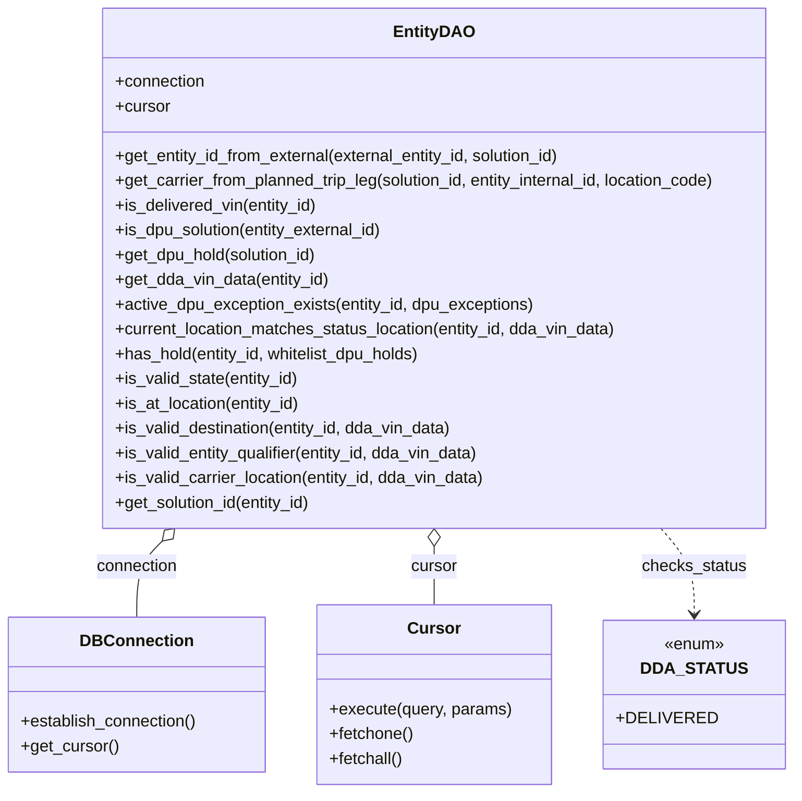

# Diagram: entity_core/entity_service/entity_service/dpu/dpu_service/db/daos/dpu_entity_dao.py


> Auto-generated by Obscura crawlers

## Diagram 1



### SVG

<svg id="container" width="756.84375" xmlns="http://www.w3.org/2000/svg" class="classDiagram" height="768" viewBox="0 0 756.84375 768" role="graphics-document document" aria-roledescription="class"><style>#container{font-family:"trebuchet ms",verdana,arial,sans-serif;font-size:16px;fill:#333;}@keyframes edge-animation-frame{from{stroke-dashoffset:0;}}@keyframes dash{to{stroke-dashoffset:0;}}#container .edge-animation-slow{stroke-dasharray:9,5!important;stroke-dashoffset:900;animation:dash 50s linear infinite;stroke-linecap:round;}#container .edge-animation-fast{stroke-dasharray:9,5!important;stroke-dashoffset:900;animation:dash 20s linear infinite;stroke-linecap:round;}#container .error-icon{fill:#552222;}#container .error-text{fill:#552222;stroke:#552222;}#container .edge-thickness-normal{stroke-width:1px;}#container .edge-thickness-thick{stroke-width:3.5px;}#container .edge-pattern-solid{stroke-dasharray:0;}#container .edge-thickness-invisible{stroke-width:0;fill:none;}#container .edge-pattern-dashed{stroke-dasharray:3;}#container .edge-pattern-dotted{stroke-dasharray:2;}#container .marker{fill:#333333;stroke:#333333;}#container .marker.cross{stroke:#333333;}#container svg{font-family:"trebuchet ms",verdana,arial,sans-serif;font-size:16px;}#container p{margin:0;}#container g.classGroup text{fill:#9370DB;stroke:none;font-family:"trebuchet ms",verdana,arial,sans-serif;font-size:10px;}#container g.classGroup text .title{font-weight:bolder;}#container .nodeLabel,#container .edgeLabel{color:#131300;}#container .edgeLabel .label rect{fill:#ECECFF;}#container .label text{fill:#131300;}#container .labelBkg{background:#ECECFF;}#container .edgeLabel .label span{background:#ECECFF;}#container .classTitle{font-weight:bolder;}#container .node rect,#container .node circle,#container .node ellipse,#container .node polygon,#container .node path{fill:#ECECFF;stroke:#9370DB;stroke-width:1px;}#container .divider{stroke:#9370DB;stroke-width:1;}#container g.clickable{cursor:pointer;}#container g.classGroup rect{fill:#ECECFF;stroke:#9370DB;}#container g.classGroup line{stroke:#9370DB;stroke-width:1;}#container .classLabel .box{stroke:none;stroke-width:0;fill:#ECECFF;opacity:0.5;}#container .classLabel .label{fill:#9370DB;font-size:10px;}#container .relation{stroke:#333333;stroke-width:1;fill:none;}#container .dashed-line{stroke-dasharray:3;}#container .dotted-line{stroke-dasharray:1 2;}#container #compositionStart,#container .composition{fill:#333333!important;stroke:#333333!important;stroke-width:1;}#container #compositionEnd,#container .composition{fill:#333333!important;stroke:#333333!important;stroke-width:1;}#container #dependencyStart,#container .dependency{fill:#333333!important;stroke:#333333!important;stroke-width:1;}#container #dependencyStart,#container .dependency{fill:#333333!important;stroke:#333333!important;stroke-width:1;}#container #extensionStart,#container .extension{fill:transparent!important;stroke:#333333!important;stroke-width:1;}#container #extensionEnd,#container .extension{fill:transparent!important;stroke:#333333!important;stroke-width:1;}#container #aggregationStart,#container .aggregation{fill:transparent!important;stroke:#333333!important;stroke-width:1;}#container #aggregationEnd,#container .aggregation{fill:transparent!important;stroke:#333333!important;stroke-width:1;}#container #lollipopStart,#container .lollipop{fill:#ECECFF!important;stroke:#333333!important;stroke-width:1;}#container #lollipopEnd,#container .lollipop{fill:#ECECFF!important;stroke:#333333!important;stroke-width:1;}#container .edgeTerminals{font-size:11px;line-height:initial;}#container .classTitleText{text-anchor:middle;font-size:18px;fill:#333;}#container .label-icon{display:inline-block;height:1em;overflow:visible;vertical-align:-0.125em;}#container .node .label-icon path{fill:currentColor;stroke:revert;stroke-width:revert;}#container :root{--mermaid-font-family:"trebuchet ms",verdana,arial,sans-serif;}</style><g><defs><marker id="container_class-aggregationStart" class="marker aggregation class" refX="18" refY="7" markerWidth="190" markerHeight="240" orient="auto"><path d="M 18,7 L9,13 L1,7 L9,1 Z"></path></marker></defs><defs><marker id="container_class-aggregationEnd" class="marker aggregation class" refX="1" refY="7" markerWidth="20" markerHeight="28" orient="auto"><path d="M 18,7 L9,13 L1,7 L9,1 Z"></path></marker></defs><defs><marker id="container_class-extensionStart" class="marker extension class" refX="18" refY="7" markerWidth="190" markerHeight="240" orient="auto"><path d="M 1,7 L18,13 V 1 Z"></path></marker></defs><defs><marker id="container_class-extensionEnd" class="marker extension class" refX="1" refY="7" markerWidth="20" markerHeight="28" orient="auto"><path d="M 1,1 V 13 L18,7 Z"></path></marker></defs><defs><marker id="container_class-compositionStart" class="marker composition class" refX="18" refY="7" markerWidth="190" markerHeight="240" orient="auto"><path d="M 18,7 L9,13 L1,7 L9,1 Z"></path></marker></defs><defs><marker id="container_class-compositionEnd" class="marker composition class" refX="1" refY="7" markerWidth="20" markerHeight="28" orient="auto"><path d="M 18,7 L9,13 L1,7 L9,1 Z"></path></marker></defs><defs><marker id="container_class-dependencyStart" class="marker dependency class" refX="6" refY="7" markerWidth="190" markerHeight="240" orient="auto"><path d="M 5,7 L9,13 L1,7 L9,1 Z"></path></marker></defs><defs><marker id="container_class-dependencyEnd" class="marker dependency class" refX="13" refY="7" markerWidth="20" markerHeight="28" orient="auto"><path d="M 18,7 L9,13 L14,7 L9,1 Z"></path></marker></defs><defs><marker id="container_class-lollipopStart" class="marker lollipop class" refX="13" refY="7" markerWidth="190" markerHeight="240" orient="auto"><circle stroke="black" fill="transparent" cx="7" cy="7" r="6"></circle></marker></defs><defs><marker id="container_class-lollipopEnd" class="marker lollipop class" refX="1" refY="7" markerWidth="190" markerHeight="240" orient="auto"><circle stroke="black" fill="transparent" cx="7" cy="7" r="6"></circle></marker></defs><g class="root"><g class="clusters"></g><g class="edgePaths"><path d="M156.883,524.245L152.789,528.371C148.696,532.497,140.508,540.748,136.414,553.041C132.32,565.333,132.32,581.667,132.32,589.833L132.32,598" id="id_EntityDAO_DBConnection_1" class="edge-thickness-normal edge-pattern-solid relation" style=";;;" data-edge="true" data-et="edge" data-id="id_EntityDAO_DBConnection_1" data-points="W3sieCI6MTY5LjAzMzI1MDQzMjUyNTk2LCJ5Ijo1MTJ9LHsieCI6MTMyLjMyMDMxMjUsInkiOjU0OX0seyJ4IjoxMzIuMzIwMzEyNSwieSI6NTk4fV0=" marker-start="url(#container_class-aggregationStart)"></path><path d="M419.078,529.25L419.078,532.542C419.078,535.833,419.078,542.417,419.078,551.875C419.078,561.333,419.078,573.667,419.078,579.833L419.078,586" id="id_EntityDAO_Cursor_2" class="edge-thickness-normal edge-pattern-solid relation" style=";;;" data-edge="true" data-et="edge" data-id="id_EntityDAO_Cursor_2" data-points="W3sieCI6NDE5LjA3ODEyNSwieSI6NTEyfSx7IngiOjQxOS4wNzgxMjUsInkiOjU0OX0seyJ4Ijo0MTkuMDc4MTI1LCJ5Ijo1ODZ9XQ==" marker-start="url(#container_class-aggregationStart)"></path><path d="M628.433,512L633.556,518.167C638.679,524.333,648.926,536.667,654.049,550.5C659.172,564.333,659.172,579.667,659.172,587.333L659.172,595" id="id_EntityDAO_DDA_STATUS_3" class="edge-thickness-normal edge-pattern-dashed relation" style=";;;" data-edge="true" data-et="edge" data-id="id_EntityDAO_DDA_STATUS_3" data-points="W3sieCI6NjI4LjQzMzIyODgwNjIyODQsInkiOjUxMn0seyJ4Ijo2NTkuMTcxODc1LCJ5Ijo1NDl9LHsieCI6NjU5LjE3MTg3NSwieSI6NjAxfV0=" marker-end="url(#container_class-dependencyEnd)"></path></g><g class="edgeLabels"><g class="edgeLabel" transform="translate(132.3203125, 549)"><g class="label" data-id="id_EntityDAO_DBConnection_1" transform="translate(-40.40625, -12)"><foreignObject width="80.8125" height="24"><div xmlns="http://www.w3.org/1999/xhtml" class="labelBkg" style="display: table-cell; white-space: nowrap; line-height: 1.5; max-width: 200px; text-align: center;"><span class="edgeLabel"><p>connection</p></span></div></foreignObject></g></g><g class="edgeLabel" transform="translate(419.078125, 549)"><g class="label" data-id="id_EntityDAO_Cursor_2" transform="translate(-22.8671875, -12)"><foreignObject width="45.734375" height="24"><div xmlns="http://www.w3.org/1999/xhtml" class="labelBkg" style="display: table-cell; white-space: nowrap; line-height: 1.5; max-width: 200px; text-align: center;"><span class="edgeLabel"><p>cursor</p></span></div></foreignObject></g></g><g class="edgeLabel" transform="translate(659.171875, 549)"><g class="label" data-id="id_EntityDAO_DDA_STATUS_3" transform="translate(-50.6953125, -12)"><foreignObject width="101.390625" height="24"><div xmlns="http://www.w3.org/1999/xhtml" class="labelBkg" style="display: table-cell; white-space: nowrap; line-height: 1.5; max-width: 200px; text-align: center;"><span class="edgeLabel"><p>checks_status</p></span></div></foreignObject></g></g></g><g class="nodes"><g class="node default" id="classId-EntityDAO-0" transform="translate(419.078125, 260)"><g class="basic label-container"><path d="M-329.765625 -252 L329.765625 -252 L329.765625 252 L-329.765625 252" stroke="none" stroke-width="0" fill="#ECECFF" style=""></path><path d="M-329.765625 -252 C-128.72740775244023 -252, 72.31080949511954 -252, 329.765625 -252 M-329.765625 -252 C-122.46795700078735 -252, 84.8297109984253 -252, 329.765625 -252 M329.765625 -252 C329.765625 -100.11586980281209, 329.765625 51.76826039437583, 329.765625 252 M329.765625 -252 C329.765625 -70.57677421408545, 329.765625 110.8464515718291, 329.765625 252 M329.765625 252 C181.0452526224032 252, 32.32488024480642 252, -329.765625 252 M329.765625 252 C78.1898958901034 252, -173.3858332197932 252, -329.765625 252 M-329.765625 252 C-329.765625 110.48556428291002, -329.765625 -31.028871434179962, -329.765625 -252 M-329.765625 252 C-329.765625 92.96849839450442, -329.765625 -66.06300321099116, -329.765625 -252" stroke="#9370DB" stroke-width="1.3" fill="none" stroke-dasharray="0 0" style=""></path></g><g class="annotation-group text" transform="translate(0, -228)"></g><g class="label-group text" transform="translate(-36.578125, -228)"><g class="label" style="font-weight: bolder" transform="translate(0,-12)"><foreignObject width="73.15625" height="24"><div xmlns="http://www.w3.org/1999/xhtml" style="display: table-cell; white-space: nowrap; line-height: 1.5; max-width: 122px; text-align: center;"><span class="nodeLabel markdown-node-label" style=""><p>EntityDAO</p></span></div></foreignObject></g></g><g class="members-group text" transform="translate(-317.765625, -180)"><g class="label" style="" transform="translate(0,-12)"><foreignObject width="88.796875" height="24"><div xmlns="http://www.w3.org/1999/xhtml" style="display: table-cell; white-space: nowrap; line-height: 1.5; max-width: 146px; text-align: center;"><span class="nodeLabel markdown-node-label" style=""><p>+connection</p></span></div></foreignObject></g><g class="label" style="" transform="translate(0,12)"><foreignObject width="53.71875" height="24"><div xmlns="http://www.w3.org/1999/xhtml" style="display: table-cell; white-space: nowrap; line-height: 1.5; max-width: 112px; text-align: center;"><span class="nodeLabel markdown-node-label" style=""><p>+cursor</p></span></div></foreignObject></g></g><g class="methods-group text" transform="translate(-317.765625, -108)"><g class="label" style="" transform="translate(0,-12)"><foreignObject width="443.828125" height="24"><div xmlns="http://www.w3.org/1999/xhtml" style="display: table-cell; white-space: nowrap; line-height: 1.5; max-width: 501px; text-align: center;"><span class="nodeLabel markdown-node-label" style=""><p>+get_entity_id_from_external(external_entity_id, solution_id)</p></span></div></foreignObject></g><g class="label" style="" transform="translate(0,12)"><foreignObject width="598.953125" height="24"><div xmlns="http://www.w3.org/1999/xhtml" style="display: table-cell; white-space: nowrap; line-height: 1.5; max-width: 656px; text-align: center;"><span class="nodeLabel markdown-node-label" style=""><p>+get_carrier_from_planned_trip_leg(solution_id, entity_internal_id, location_code)</p></span></div></foreignObject></g><g class="label" style="" transform="translate(0,36)"><foreignObject width="199.5" height="24"><div xmlns="http://www.w3.org/1999/xhtml" style="display: table-cell; white-space: nowrap; line-height: 1.5; max-width: 257px; text-align: center;"><span class="nodeLabel markdown-node-label" style=""><p>+is_delivered_vin(entity_id)</p></span></div></foreignObject></g><g class="label" style="" transform="translate(0,60)"><foreignObject width="265.796875" height="24"><div xmlns="http://www.w3.org/1999/xhtml" style="display: table-cell; white-space: nowrap; line-height: 1.5; max-width: 323px; text-align: center;"><span class="nodeLabel markdown-node-label" style=""><p>+is_dpu_solution(entity_external_id)</p></span></div></foreignObject></g><g class="label" style="" transform="translate(0,84)"><foreignObject width="200.75" height="24"><div xmlns="http://www.w3.org/1999/xhtml" style="display: table-cell; white-space: nowrap; line-height: 1.5; max-width: 258px; text-align: center;"><span class="nodeLabel markdown-node-label" style=""><p>+get_dpu_hold(solution_id)</p></span></div></foreignObject></g><g class="label" style="" transform="translate(0,108)"><foreignObject width="210.875" height="24"><div xmlns="http://www.w3.org/1999/xhtml" style="display: table-cell; white-space: nowrap; line-height: 1.5; max-width: 268px; text-align: center;"><span class="nodeLabel markdown-node-label" style=""><p>+get_dda_vin_data(entity_id)</p></span></div></foreignObject></g><g class="label" style="" transform="translate(0,132)"><foreignObject width="412.234375" height="24"><div xmlns="http://www.w3.org/1999/xhtml" style="display: table-cell; white-space: nowrap; line-height: 1.5; max-width: 470px; text-align: center;"><span class="nodeLabel markdown-node-label" style=""><p>+active_dpu_exception_exists(entity_id, dpu_exceptions)</p></span></div></foreignObject></g><g class="label" style="" transform="translate(0,156)"><foreignObject width="497.125" height="24"><div xmlns="http://www.w3.org/1999/xhtml" style="display: table-cell; white-space: nowrap; line-height: 1.5; max-width: 554px; text-align: center;"><span class="nodeLabel markdown-node-label" style=""><p>+current_location_matches_status_location(entity_id, dda_vin_data)</p></span></div></foreignObject></g><g class="label" style="" transform="translate(0,180)"><foreignObject width="303.734375" height="24"><div xmlns="http://www.w3.org/1999/xhtml" style="display: table-cell; white-space: nowrap; line-height: 1.5; max-width: 361px; text-align: center;"><span class="nodeLabel markdown-node-label" style=""><p>+has_hold(entity_id, whitelist_dpu_holds)</p></span></div></foreignObject></g><g class="label" style="" transform="translate(0,204)"><foreignObject width="181.078125" height="24"><div xmlns="http://www.w3.org/1999/xhtml" style="display: table-cell; white-space: nowrap; line-height: 1.5; max-width: 238px; text-align: center;"><span class="nodeLabel markdown-node-label" style=""><p>+is_valid_state(entity_id)</p></span></div></foreignObject></g><g class="label" style="" transform="translate(0,228)"><foreignObject width="183.6875" height="24"><div xmlns="http://www.w3.org/1999/xhtml" style="display: table-cell; white-space: nowrap; line-height: 1.5; max-width: 241px; text-align: center;"><span class="nodeLabel markdown-node-label" style=""><p>+is_at_location(entity_id)</p></span></div></foreignObject></g><g class="label" style="" transform="translate(0,252)"><foreignObject width="333.953125" height="24"><div xmlns="http://www.w3.org/1999/xhtml" style="display: table-cell; white-space: nowrap; line-height: 1.5; max-width: 391px; text-align: center;"><span class="nodeLabel markdown-node-label" style=""><p>+is_valid_destination(entity_id, dda_vin_data)</p></span></div></foreignObject></g><g class="label" style="" transform="translate(0,276)"><foreignObject width="361.015625" height="24"><div xmlns="http://www.w3.org/1999/xhtml" style="display: table-cell; white-space: nowrap; line-height: 1.5; max-width: 418px; text-align: center;"><span class="nodeLabel markdown-node-label" style=""><p>+is_valid_entity_qualifier(entity_id, dda_vin_data)</p></span></div></foreignObject></g><g class="label" style="" transform="translate(0,300)"><foreignObject width="364.8125" height="24"><div xmlns="http://www.w3.org/1999/xhtml" style="display: table-cell; white-space: nowrap; line-height: 1.5; max-width: 422px; text-align: center;"><span class="nodeLabel markdown-node-label" style=""><p>+is_valid_carrier_location(entity_id, dda_vin_data)</p></span></div></foreignObject></g><g class="label" style="" transform="translate(0,324)"><foreignObject width="195.34375" height="24"><div xmlns="http://www.w3.org/1999/xhtml" style="display: table-cell; white-space: nowrap; line-height: 1.5; max-width: 253px; text-align: center;"><span class="nodeLabel markdown-node-label" style=""><p>+get_solution_id(entity_id)</p></span></div></foreignObject></g></g><g class="divider" style=""><path d="M-329.765625 -204 C-103.00727117605476 -204, 123.75108264789048 -204, 329.765625 -204 M-329.765625 -204 C-84.06065757257323 -204, 161.64430985485353 -204, 329.765625 -204" stroke="#9370DB" stroke-width="1.3" fill="none" stroke-dasharray="0 0" style=""></path></g><g class="divider" style=""><path d="M-329.765625 -132 C-158.94156311066806 -132, 11.882498778663887 -132, 329.765625 -132 M-329.765625 -132 C-70.14405621178707 -132, 189.47751257642585 -132, 329.765625 -132" stroke="#9370DB" stroke-width="1.3" fill="none" stroke-dasharray="0 0" style=""></path></g></g><g class="node default" id="classId-DBConnection-1" transform="translate(132.3203125, 673)"><g class="basic label-container"><path d="M-124.3203125 -75 L124.3203125 -75 L124.3203125 75 L-124.3203125 75" stroke="none" stroke-width="0" fill="#ECECFF" style=""></path><path d="M-124.3203125 -75 C-36.27269273076253 -75, 51.77492703847494 -75, 124.3203125 -75 M-124.3203125 -75 C-27.155247134181266 -75, 70.00981823163747 -75, 124.3203125 -75 M124.3203125 -75 C124.3203125 -33.44157872154016, 124.3203125 8.116842556919678, 124.3203125 75 M124.3203125 -75 C124.3203125 -20.852710067890527, 124.3203125 33.294579864218946, 124.3203125 75 M124.3203125 75 C40.59701410055496 75, -43.126284298890084 75, -124.3203125 75 M124.3203125 75 C42.797342756632546 75, -38.72562698673491 75, -124.3203125 75 M-124.3203125 75 C-124.3203125 29.850036341790535, -124.3203125 -15.29992731641893, -124.3203125 -75 M-124.3203125 75 C-124.3203125 35.141491936611274, -124.3203125 -4.717016126777452, -124.3203125 -75" stroke="#9370DB" stroke-width="1.3" fill="none" stroke-dasharray="0 0" style=""></path></g><g class="annotation-group text" transform="translate(0, -51)"></g><g class="label-group text" transform="translate(-51.375, -51)"><g class="label" style="font-weight: bolder" transform="translate(0,-12)"><foreignObject width="102.75" height="24"><div xmlns="http://www.w3.org/1999/xhtml" style="display: table-cell; white-space: nowrap; line-height: 1.5; max-width: 152px; text-align: center;"><span class="nodeLabel markdown-node-label" style=""><p>DBConnection</p></span></div></foreignObject></g></g><g class="members-group text" transform="translate(-112.3203125, -3)"></g><g class="methods-group text" transform="translate(-112.3203125, 27)"><g class="label" style="" transform="translate(0,-12)"><foreignObject width="173.265625" height="24"><div xmlns="http://www.w3.org/1999/xhtml" style="display: table-cell; white-space: nowrap; line-height: 1.5; max-width: 231px; text-align: center;"><span class="nodeLabel markdown-node-label" style=""><p>+establish_connection()</p></span></div></foreignObject></g><g class="label" style="" transform="translate(0,12)"><foreignObject width="94.640625" height="24"><div xmlns="http://www.w3.org/1999/xhtml" style="display: table-cell; white-space: nowrap; line-height: 1.5; max-width: 152px; text-align: center;"><span class="nodeLabel markdown-node-label" style=""><p>+get_cursor()</p></span></div></foreignObject></g></g><g class="divider" style=""><path d="M-124.3203125 -27 C-39.80109106583757 -27, 44.718130368324864 -27, 124.3203125 -27 M-124.3203125 -27 C-31.619255913748717 -27, 61.08180067250257 -27, 124.3203125 -27" stroke="#9370DB" stroke-width="1.3" fill="none" stroke-dasharray="0 0" style=""></path></g><g class="divider" style=""><path d="M-124.3203125 -3 C-34.32061515514101 -3, 55.679082189717974 -3, 124.3203125 -3 M-124.3203125 -3 C-42.06246281525782 -3, 40.195386869484366 -3, 124.3203125 -3" stroke="#9370DB" stroke-width="1.3" fill="none" stroke-dasharray="0 0" style=""></path></g></g><g class="node default" id="classId-Cursor-2" transform="translate(419.078125, 673)"><g class="basic label-container"><path d="M-112.4375 -87 L112.4375 -87 L112.4375 87 L-112.4375 87" stroke="none" stroke-width="0" fill="#ECECFF" style=""></path><path d="M-112.4375 -87 C-45.213248876259385 -87, 22.01100224748123 -87, 112.4375 -87 M-112.4375 -87 C-48.265627793091085 -87, 15.90624441381783 -87, 112.4375 -87 M112.4375 -87 C112.4375 -19.239499881456254, 112.4375 48.52100023708749, 112.4375 87 M112.4375 -87 C112.4375 -51.19614848124351, 112.4375 -15.392296962487023, 112.4375 87 M112.4375 87 C66.02346856370478 87, 19.609437127409564 87, -112.4375 87 M112.4375 87 C25.181122849420106 87, -62.07525430115979 87, -112.4375 87 M-112.4375 87 C-112.4375 42.295224790477235, -112.4375 -2.40955041904553, -112.4375 -87 M-112.4375 87 C-112.4375 18.180813251922984, -112.4375 -50.63837349615403, -112.4375 -87" stroke="#9370DB" stroke-width="1.3" fill="none" stroke-dasharray="0 0" style=""></path></g><g class="annotation-group text" transform="translate(0, -63)"></g><g class="label-group text" transform="translate(-23.90625, -63)"><g class="label" style="font-weight: bolder" transform="translate(0,-12)"><foreignObject width="47.8125" height="24"><div xmlns="http://www.w3.org/1999/xhtml" style="display: table-cell; white-space: nowrap; line-height: 1.5; max-width: 98px; text-align: center;"><span class="nodeLabel markdown-node-label" style=""><p>Cursor</p></span></div></foreignObject></g></g><g class="members-group text" transform="translate(-100.4375, -15)"></g><g class="methods-group text" transform="translate(-100.4375, 15)"><g class="label" style="" transform="translate(0,-12)"><foreignObject width="176.96875" height="24"><div xmlns="http://www.w3.org/1999/xhtml" style="display: table-cell; white-space: nowrap; line-height: 1.5; max-width: 234px; text-align: center;"><span class="nodeLabel markdown-node-label" style=""><p>+execute(query, params)</p></span></div></foreignObject></g><g class="label" style="" transform="translate(0,12)"><foreignObject width="82.046875" height="24"><div xmlns="http://www.w3.org/1999/xhtml" style="display: table-cell; white-space: nowrap; line-height: 1.5; max-width: 139px; text-align: center;"><span class="nodeLabel markdown-node-label" style=""><p>+fetchone()</p></span></div></foreignObject></g><g class="label" style="" transform="translate(0,36)"><foreignObject width="72.515625" height="24"><div xmlns="http://www.w3.org/1999/xhtml" style="display: table-cell; white-space: nowrap; line-height: 1.5; max-width: 130px; text-align: center;"><span class="nodeLabel markdown-node-label" style=""><p>+fetchall()</p></span></div></foreignObject></g></g><g class="divider" style=""><path d="M-112.4375 -39 C-39.812695130774145 -39, 32.81210973845171 -39, 112.4375 -39 M-112.4375 -39 C-30.541858843946514 -39, 51.35378231210697 -39, 112.4375 -39" stroke="#9370DB" stroke-width="1.3" fill="none" stroke-dasharray="0 0" style=""></path></g><g class="divider" style=""><path d="M-112.4375 -15 C-23.412131764704128 -15, 65.61323647059174 -15, 112.4375 -15 M-112.4375 -15 C-47.948549128242945 -15, 16.54040174351411 -15, 112.4375 -15" stroke="#9370DB" stroke-width="1.3" fill="none" stroke-dasharray="0 0" style=""></path></g></g><g class="node default" id="classId-DDA_STATUS-3" transform="translate(659.171875, 673)"><g class="basic label-container"><path d="M-77.65625 -72 L77.65625 -72 L77.65625 72 L-77.65625 72" stroke="none" stroke-width="0" fill="#ECECFF" style=""></path><path d="M-77.65625 -72 C-37.65143490005744 -72, 2.353380199885123 -72, 77.65625 -72 M-77.65625 -72 C-24.567161444063515 -72, 28.52192711187297 -72, 77.65625 -72 M77.65625 -72 C77.65625 -29.40895096706725, 77.65625 13.182098065865503, 77.65625 72 M77.65625 -72 C77.65625 -42.47409783944224, 77.65625 -12.948195678884467, 77.65625 72 M77.65625 72 C42.18838527643626 72, 6.7205205528725145 72, -77.65625 72 M77.65625 72 C33.67563250159901 72, -10.304984996801977 72, -77.65625 72 M-77.65625 72 C-77.65625 30.230211722861945, -77.65625 -11.53957655427611, -77.65625 -72 M-77.65625 72 C-77.65625 34.93473027194042, -77.65625 -2.130539456119166, -77.65625 -72" stroke="#9370DB" stroke-width="1.3" fill="none" stroke-dasharray="0 0" style=""></path></g><g class="annotation-group text" transform="translate(-29.53125, -48)"><g class="label" style="" transform="translate(0,-12)"><foreignObject width="59.0625" height="24"><div xmlns="http://www.w3.org/1999/xhtml" style="display: table-cell; white-space: nowrap; line-height: 1.5; max-width: 109px; text-align: center;"><span class="nodeLabel markdown-node-label" style=""><p>«enum»</p></span></div></foreignObject></g></g><g class="label-group text" transform="translate(-45.765625, -24)"><g class="label" style="font-weight: bolder" transform="translate(0,-12)"><foreignObject width="91.53125" height="24"><div xmlns="http://www.w3.org/1999/xhtml" style="display: table-cell; white-space: nowrap; line-height: 1.5; max-width: 140px; text-align: center;"><span class="nodeLabel markdown-node-label" style=""><p>DDA_STATUS</p></span></div></foreignObject></g></g><g class="members-group text" transform="translate(-65.65625, 24)"><g class="label" style="" transform="translate(0,-12)"><foreignObject width="85.546875" height="24"><div xmlns="http://www.w3.org/1999/xhtml" style="display: table-cell; white-space: nowrap; line-height: 1.5; max-width: 143px; text-align: center;"><span class="nodeLabel markdown-node-label" style=""><p>+DELIVERED</p></span></div></foreignObject></g></g><g class="methods-group text" transform="translate(-65.65625, 72)"></g><g class="divider" style=""><path d="M-77.65625 0 C-22.078798480477587 0, 33.498653039044825 0, 77.65625 0 M-77.65625 0 C-26.829172297611244 0, 23.997905404777512 0, 77.65625 0" stroke="#9370DB" stroke-width="1.3" fill="none" stroke-dasharray="0 0" style=""></path></g><g class="divider" style=""><path d="M-77.65625 48 C-36.581849088018906 48, 4.492551823962188 48, 77.65625 48 M-77.65625 48 C-33.81202663160484 48, 10.032196736790326 48, 77.65625 48" stroke="#9370DB" stroke-width="1.3" fill="none" stroke-dasharray="0 0" style=""></path></g></g></g></g></g></svg>

## Diagram 2

```mermaid
flowchart TD
    Start[Method invoked with entity_id and optional dda_vin_data] --> CheckDDA{dda_vin_data present and last_eligible_status_update present?}
    CheckDDA -- No --> ReturnFalse[Return False]
    CheckDDA -- Yes --> Extract[Extract statusLocationId / source_id / locationCode from last_eligible_status_update]
    Extract --> BuildParams[Build SQL params (entity_id, status_location_id, source_id, last_eligible_status_update)]
    BuildParams --> ExecuteSQL[Cursor.execute(sql, params)]
    ExecuteSQL --> Fetch[Cursor.fetchone() or Cursor.fetchall()]
    Fetch --> NoRow{No row returned?}
    NoRow -- Yes --> ReturnFalse
    NoRow -- No --> EvalResult[Evaluate boolean column (e.g., is_valid_destination, current_location_matches_status_location, is_valid_entity_qualifier, is_valid_carrier_location)]
    EvalResult --> IsTrue{Result truthy?}
    IsTrue -- Yes --> ReturnTrue[Return True]
    IsTrue -- No --> ReturnFalse
```

> SVG rendering failed for this diagram.
