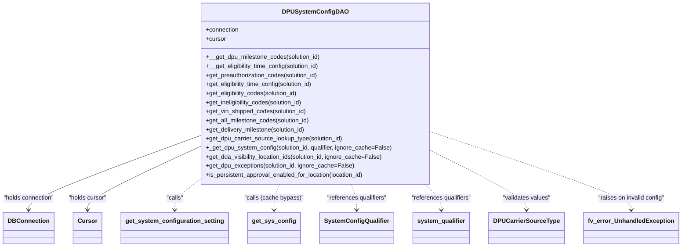
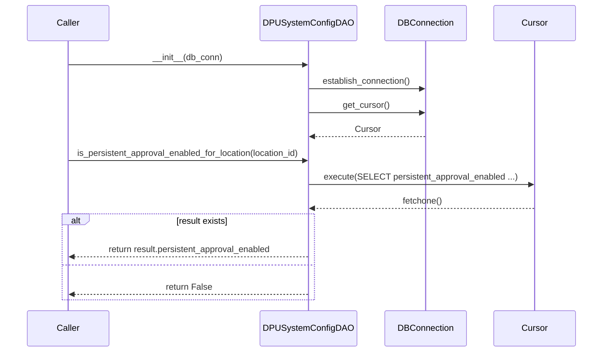

# Diagram: entity_core/entity_service/entity_service/dpu/dpu_service/db/daos/dpu_system_config_dao.py


> Auto-generated by Obscura crawlers

## Diagram 1



### SVG

<svg id="container" width="1733.65625" xmlns="http://www.w3.org/2000/svg" class="classDiagram" height="654" viewBox="0 0 1733.65625 654" role="graphics-document document" aria-roledescription="class"><style>#container{font-family:"trebuchet ms",verdana,arial,sans-serif;font-size:16px;fill:#333;}@keyframes edge-animation-frame{from{stroke-dashoffset:0;}}@keyframes dash{to{stroke-dashoffset:0;}}#container .edge-animation-slow{stroke-dasharray:9,5!important;stroke-dashoffset:900;animation:dash 50s linear infinite;stroke-linecap:round;}#container .edge-animation-fast{stroke-dasharray:9,5!important;stroke-dashoffset:900;animation:dash 20s linear infinite;stroke-linecap:round;}#container .error-icon{fill:#552222;}#container .error-text{fill:#552222;stroke:#552222;}#container .edge-thickness-normal{stroke-width:1px;}#container .edge-thickness-thick{stroke-width:3.5px;}#container .edge-pattern-solid{stroke-dasharray:0;}#container .edge-thickness-invisible{stroke-width:0;fill:none;}#container .edge-pattern-dashed{stroke-dasharray:3;}#container .edge-pattern-dotted{stroke-dasharray:2;}#container .marker{fill:#333333;stroke:#333333;}#container .marker.cross{stroke:#333333;}#container svg{font-family:"trebuchet ms",verdana,arial,sans-serif;font-size:16px;}#container p{margin:0;}#container g.classGroup text{fill:#9370DB;stroke:none;font-family:"trebuchet ms",verdana,arial,sans-serif;font-size:10px;}#container g.classGroup text .title{font-weight:bolder;}#container .nodeLabel,#container .edgeLabel{color:#131300;}#container .edgeLabel .label rect{fill:#ECECFF;}#container .label text{fill:#131300;}#container .labelBkg{background:#ECECFF;}#container .edgeLabel .label span{background:#ECECFF;}#container .classTitle{font-weight:bolder;}#container .node rect,#container .node circle,#container .node ellipse,#container .node polygon,#container .node path{fill:#ECECFF;stroke:#9370DB;stroke-width:1px;}#container .divider{stroke:#9370DB;stroke-width:1;}#container g.clickable{cursor:pointer;}#container g.classGroup rect{fill:#ECECFF;stroke:#9370DB;}#container g.classGroup line{stroke:#9370DB;stroke-width:1;}#container .classLabel .box{stroke:none;stroke-width:0;fill:#ECECFF;opacity:0.5;}#container .classLabel .label{fill:#9370DB;font-size:10px;}#container .relation{stroke:#333333;stroke-width:1;fill:none;}#container .dashed-line{stroke-dasharray:3;}#container .dotted-line{stroke-dasharray:1 2;}#container #compositionStart,#container .composition{fill:#333333!important;stroke:#333333!important;stroke-width:1;}#container #compositionEnd,#container .composition{fill:#333333!important;stroke:#333333!important;stroke-width:1;}#container #dependencyStart,#container .dependency{fill:#333333!important;stroke:#333333!important;stroke-width:1;}#container #dependencyStart,#container .dependency{fill:#333333!important;stroke:#333333!important;stroke-width:1;}#container #extensionStart,#container .extension{fill:transparent!important;stroke:#333333!important;stroke-width:1;}#container #extensionEnd,#container .extension{fill:transparent!important;stroke:#333333!important;stroke-width:1;}#container #aggregationStart,#container .aggregation{fill:transparent!important;stroke:#333333!important;stroke-width:1;}#container #aggregationEnd,#container .aggregation{fill:transparent!important;stroke:#333333!important;stroke-width:1;}#container #lollipopStart,#container .lollipop{fill:#ECECFF!important;stroke:#333333!important;stroke-width:1;}#container #lollipopEnd,#container .lollipop{fill:#ECECFF!important;stroke:#333333!important;stroke-width:1;}#container .edgeTerminals{font-size:11px;line-height:initial;}#container .classTitleText{text-anchor:middle;font-size:18px;fill:#333;}#container .label-icon{display:inline-block;height:1em;overflow:visible;vertical-align:-0.125em;}#container .node .label-icon path{fill:currentColor;stroke:revert;stroke-width:revert;}#container :root{--mermaid-font-family:"trebuchet ms",verdana,arial,sans-serif;}</style><g><defs><marker id="container_class-aggregationStart" class="marker aggregation class" refX="18" refY="7" markerWidth="190" markerHeight="240" orient="auto"><path d="M 18,7 L9,13 L1,7 L9,1 Z"></path></marker></defs><defs><marker id="container_class-aggregationEnd" class="marker aggregation class" refX="1" refY="7" markerWidth="20" markerHeight="28" orient="auto"><path d="M 18,7 L9,13 L1,7 L9,1 Z"></path></marker></defs><defs><marker id="container_class-extensionStart" class="marker extension class" refX="18" refY="7" markerWidth="190" markerHeight="240" orient="auto"><path d="M 1,7 L18,13 V 1 Z"></path></marker></defs><defs><marker id="container_class-extensionEnd" class="marker extension class" refX="1" refY="7" markerWidth="20" markerHeight="28" orient="auto"><path d="M 1,1 V 13 L18,7 Z"></path></marker></defs><defs><marker id="container_class-compositionStart" class="marker composition class" refX="18" refY="7" markerWidth="190" markerHeight="240" orient="auto"><path d="M 18,7 L9,13 L1,7 L9,1 Z"></path></marker></defs><defs><marker id="container_class-compositionEnd" class="marker composition class" refX="1" refY="7" markerWidth="20" markerHeight="28" orient="auto"><path d="M 18,7 L9,13 L1,7 L9,1 Z"></path></marker></defs><defs><marker id="container_class-dependencyStart" class="marker dependency class" refX="6" refY="7" markerWidth="190" markerHeight="240" orient="auto"><path d="M 5,7 L9,13 L1,7 L9,1 Z"></path></marker></defs><defs><marker id="container_class-dependencyEnd" class="marker dependency class" refX="13" refY="7" markerWidth="20" markerHeight="28" orient="auto"><path d="M 18,7 L9,13 L14,7 L9,1 Z"></path></marker></defs><defs><marker id="container_class-lollipopStart" class="marker lollipop class" refX="13" refY="7" markerWidth="190" markerHeight="240" orient="auto"><circle stroke="black" fill="transparent" cx="7" cy="7" r="6"></circle></marker></defs><defs><marker id="container_class-lollipopEnd" class="marker lollipop class" refX="1" refY="7" markerWidth="190" markerHeight="240" orient="auto"><circle stroke="black" fill="transparent" cx="7" cy="7" r="6"></circle></marker></defs><g class="root"><g class="clusters"></g><g class="edgePaths"><path d="M506.094,361.581L434.581,388.818C363.068,416.054,220.042,470.527,148.529,502.93C77.016,535.333,77.016,545.667,77.016,550.833L77.016,556" id="id_DPUSystemConfigDAO_DBConnection_1" class="edge-thickness-normal edge-pattern-solid relation" style=";;;" data-edge="true" data-et="edge" data-id="id_DPUSystemConfigDAO_DBConnection_1" data-points="W3sieCI6NTA2LjA5Mzc1LCJ5IjozNjEuNTgxMTcyODk0MjA5NjZ9LHsieCI6NzcuMDE1NjI1LCJ5Ijo1MjV9LHsieCI6NzcuMDE1NjI1LCJ5Ijo1NjJ9XQ==" marker-end="url(#container_class-dependencyEnd)"></path><path d="M506.094,390.915L459.461,413.263C412.828,435.61,319.563,480.305,272.93,507.819C226.297,535.333,226.297,545.667,226.297,550.833L226.297,556" id="id_DPUSystemConfigDAO_Cursor_2" class="edge-thickness-normal edge-pattern-solid relation" style=";;;" data-edge="true" data-et="edge" data-id="id_DPUSystemConfigDAO_Cursor_2" data-points="W3sieCI6NTA2LjA5Mzc1LCJ5IjozOTAuOTE1MDI1MDM4MzUxNn0seyJ4IjoyMjYuMjk2ODc1LCJ5Ijo1MjV9LHsieCI6MjI2LjI5Njg3NSwieSI6NTYyfV0=" marker-end="url(#container_class-dependencyEnd)"></path><path d="M506.094,480.077L496.473,487.564C486.852,495.051,467.609,510.026,457.988,522.68C448.367,535.333,448.367,545.667,448.367,550.833L448.367,556" id="id_DPUSystemConfigDAO_get_system_configuration_setting_3" class="edge-thickness-normal edge-pattern-dashed relation" style=";;;" data-edge="true" data-et="edge" data-id="id_DPUSystemConfigDAO_get_system_configuration_setting_3" data-points="W3sieCI6NTA2LjA5Mzc1LCJ5Ijo0ODAuMDc3MTM3NDk1NDczMTV9LHsieCI6NDQ4LjM2NzE4NzUsInkiOjUyNX0seyJ4Ijo0NDguMzY3MTg3NSwieSI6NTYyfV0=" marker-end="url(#container_class-dependencyEnd)"></path><path d="M714.002,488L711.681,494.167C709.36,500.333,704.719,512.667,702.399,524C700.078,535.333,700.078,545.667,700.078,550.833L700.078,556" id="id_DPUSystemConfigDAO_get_sys_config_4" class="edge-thickness-normal edge-pattern-dashed relation" style=";;;" data-edge="true" data-et="edge" data-id="id_DPUSystemConfigDAO_get_sys_config_4" data-points="W3sieCI6NzE0LjAwMTY0OTkzMjMxMDQsInkiOjQ4OH0seyJ4Ijo3MDAuMDc4MTI1LCJ5Ijo1MjV9LHsieCI6NzAwLjA3ODEyNSwieSI6NTYyfV0=" marker-end="url(#container_class-dependencyEnd)"></path><path d="M894.631,488L896.952,494.167C899.272,500.333,903.914,512.667,906.234,524C908.555,535.333,908.555,545.667,908.555,550.833L908.555,556" id="id_DPUSystemConfigDAO_SystemConfigQualifier_5" class="edge-thickness-normal edge-pattern-dashed relation" style=";;;" data-edge="true" data-et="edge" data-id="id_DPUSystemConfigDAO_SystemConfigQualifier_5" data-points="W3sieCI6ODk0LjYzMTE2MjU2NzY4OTYsInkiOjQ4OH0seyJ4Ijo5MDguNTU0Njg3NSwieSI6NTI1fSx7IngiOjkwOC41NTQ2ODc1LCJ5Ijo1NjJ9XQ==" marker-end="url(#container_class-dependencyEnd)"></path><path d="M1081.285,488L1088.402,494.167C1095.518,500.333,1109.751,512.667,1116.868,524C1123.984,535.333,1123.984,545.667,1123.984,550.833L1123.984,556" id="id_DPUSystemConfigDAO_system_qualifier_6" class="edge-thickness-normal edge-pattern-dashed relation" style=";;;" data-edge="true" data-et="edge" data-id="id_DPUSystemConfigDAO_system_qualifier_6" data-points="W3sieCI6MTA4MS4yODUwNDM0MzQxMTU2LCJ5Ijo0ODh9LHsieCI6MTEyMy45ODQzNzUsInkiOjUyNX0seyJ4IjoxMTIzLjk4NDM3NSwieSI6NTYyfV0=" marker-end="url(#container_class-dependencyEnd)"></path><path d="M1102.539,401.889L1142.302,422.407C1182.065,442.926,1261.591,483.963,1301.354,509.648C1341.117,535.333,1341.117,545.667,1341.117,550.833L1341.117,556" id="id_DPUSystemConfigDAO_DPUCarrierSourceType_7" class="edge-thickness-normal edge-pattern-dashed relation" style=";;;" data-edge="true" data-et="edge" data-id="id_DPUSystemConfigDAO_DPUCarrierSourceType_7" data-points="W3sieCI6MTEwMi41MzkwNjI1LCJ5Ijo0MDEuODg4ODg4ODg4ODg4OX0seyJ4IjoxMzQxLjExNzE4NzUsInkiOjUyNX0seyJ4IjoxMzQxLjExNzE4NzUsInkiOjU2Mn1d" marker-end="url(#container_class-dependencyEnd)"></path><path d="M1102.539,351.081L1186.4,380.067C1270.26,409.054,1437.982,467.027,1521.842,501.18C1605.703,535.333,1605.703,545.667,1605.703,550.833L1605.703,556" id="id_DPUSystemConfigDAO_fv_error_UnhandledException_8" class="edge-thickness-normal edge-pattern-dashed relation" style=";;;" data-edge="true" data-et="edge" data-id="id_DPUSystemConfigDAO_fv_error_UnhandledException_8" data-points="W3sieCI6MTEwMi41MzkwNjI1LCJ5IjozNTEuMDgwOTE0NDMwNTUyNX0seyJ4IjoxNjA1LjcwMzEyNSwieSI6NTI1fSx7IngiOjE2MDUuNzAzMTI1LCJ5Ijo1NjJ9XQ==" marker-end="url(#container_class-dependencyEnd)"></path></g><g class="edgeLabels"><g class="edgeLabel" transform="translate(77.015625, 525)"><g class="label" data-id="id_DPUSystemConfigDAO_DBConnection_1" transform="translate(-69.015625, -12)"><foreignObject width="138.03125" height="24"><div xmlns="http://www.w3.org/1999/xhtml" class="labelBkg" style="display: table-cell; white-space: nowrap; line-height: 1.5; max-width: 200px; text-align: center;"><span class="edgeLabel"><p>"holds connection"</p></span></div></foreignObject></g></g><g class="edgeLabel" transform="translate(226.296875, 525)"><g class="label" data-id="id_DPUSystemConfigDAO_Cursor_2" transform="translate(-51.5859375, -12)"><foreignObject width="103.171875" height="24"><div xmlns="http://www.w3.org/1999/xhtml" class="labelBkg" style="display: table-cell; white-space: nowrap; line-height: 1.5; max-width: 200px; text-align: center;"><span class="edgeLabel"><p>"holds cursor"</p></span></div></foreignObject></g></g><g class="edgeLabel" transform="translate(448.3671875, 525)"><g class="label" data-id="id_DPUSystemConfigDAO_get_system_configuration_setting_3" transform="translate(-22.625, -12)"><foreignObject width="45.25" height="24"><div xmlns="http://www.w3.org/1999/xhtml" class="labelBkg" style="display: table-cell; white-space: nowrap; line-height: 1.5; max-width: 200px; text-align: center;"><span class="edgeLabel"><p>"calls"</p></span></div></foreignObject></g></g><g class="edgeLabel" transform="translate(700.078125, 525)"><g class="label" data-id="id_DPUSystemConfigDAO_get_sys_config_4" transform="translate(-78.1328125, -12)"><foreignObject width="156.265625" height="24"><div xmlns="http://www.w3.org/1999/xhtml" class="labelBkg" style="display: table-cell; white-space: nowrap; line-height: 1.5; max-width: 200px; text-align: center;"><span class="edgeLabel"><p>"calls (cache bypass)"</p></span></div></foreignObject></g></g><g class="edgeLabel" transform="translate(908.5546875, 525)"><g class="label" data-id="id_DPUSystemConfigDAO_SystemConfigQualifier_5" transform="translate(-80.1875, -12)"><foreignObject width="160.375" height="24"><div xmlns="http://www.w3.org/1999/xhtml" class="labelBkg" style="display: table-cell; white-space: nowrap; line-height: 1.5; max-width: 200px; text-align: center;"><span class="edgeLabel"><p>"references qualifiers"</p></span></div></foreignObject></g></g><g class="edgeLabel" transform="translate(1123.984375, 525)"><g class="label" data-id="id_DPUSystemConfigDAO_system_qualifier_6" transform="translate(-80.1875, -12)"><foreignObject width="160.375" height="24"><div xmlns="http://www.w3.org/1999/xhtml" class="labelBkg" style="display: table-cell; white-space: nowrap; line-height: 1.5; max-width: 200px; text-align: center;"><span class="edgeLabel"><p>"references qualifiers"</p></span></div></foreignObject></g></g><g class="edgeLabel" transform="translate(1341.1171875, 525)"><g class="label" data-id="id_DPUSystemConfigDAO_DPUCarrierSourceType_7" transform="translate(-64.2421875, -12)"><foreignObject width="128.484375" height="24"><div xmlns="http://www.w3.org/1999/xhtml" class="labelBkg" style="display: table-cell; white-space: nowrap; line-height: 1.5; max-width: 200px; text-align: center;"><span class="edgeLabel"><p>"validates values"</p></span></div></foreignObject></g></g><g class="edgeLabel" transform="translate(1605.703125, 525)"><g class="label" data-id="id_DPUSystemConfigDAO_fv_error_UnhandledException_8" transform="translate(-89.4921875, -12)"><foreignObject width="178.984375" height="24"><div xmlns="http://www.w3.org/1999/xhtml" class="labelBkg" style="display: table-cell; white-space: nowrap; line-height: 1.5; max-width: 200px; text-align: center;"><span class="edgeLabel"><p>"raises on invalid config"</p></span></div></foreignObject></g></g></g><g class="nodes"><g class="node default" id="classId-DPUSystemConfigDAO-0" transform="translate(804.31640625, 248)"><g class="basic label-container"><path d="M-298.22265625 -240 L298.22265625 -240 L298.22265625 240 L-298.22265625 240" stroke="none" stroke-width="0" fill="#ECECFF" style=""></path><path d="M-298.22265625 -240 C-96.74193017304071 -240, 104.73879590391857 -240, 298.22265625 -240 M-298.22265625 -240 C-164.03996279262483 -240, -29.85726933524967 -240, 298.22265625 -240 M298.22265625 -240 C298.22265625 -77.23610799755937, 298.22265625 85.52778400488125, 298.22265625 240 M298.22265625 -240 C298.22265625 -121.99398515652182, 298.22265625 -3.9879703130436326, 298.22265625 240 M298.22265625 240 C139.14140565286885 240, -19.93984494426229 240, -298.22265625 240 M298.22265625 240 C163.75821882993372 240, 29.29378140986745 240, -298.22265625 240 M-298.22265625 240 C-298.22265625 95.2184731897288, -298.22265625 -49.563053620542405, -298.22265625 -240 M-298.22265625 240 C-298.22265625 105.20808724615307, -298.22265625 -29.58382550769386, -298.22265625 -240" stroke="#9370DB" stroke-width="1.3" fill="none" stroke-dasharray="0 0" style=""></path></g><g class="annotation-group text" transform="translate(0, -216)"></g><g class="label-group text" transform="translate(-79.9453125, -216)"><g class="label" style="font-weight: bolder" transform="translate(0,-12)"><foreignObject width="159.890625" height="24"><div xmlns="http://www.w3.org/1999/xhtml" style="display: table-cell; white-space: nowrap; line-height: 1.5; max-width: 207px; text-align: center;"><span class="nodeLabel markdown-node-label" style=""><p>DPUSystemConfigDAO</p></span></div></foreignObject></g></g><g class="members-group text" transform="translate(-286.22265625, -168)"><g class="label" style="" transform="translate(0,-12)"><foreignObject width="88.796875" height="24"><div xmlns="http://www.w3.org/1999/xhtml" style="display: table-cell; white-space: nowrap; line-height: 1.5; max-width: 146px; text-align: center;"><span class="nodeLabel markdown-node-label" style=""><p>+connection</p></span></div></foreignObject></g><g class="label" style="" transform="translate(0,12)"><foreignObject width="53.71875" height="24"><div xmlns="http://www.w3.org/1999/xhtml" style="display: table-cell; white-space: nowrap; line-height: 1.5; max-width: 112px; text-align: center;"><span class="nodeLabel markdown-node-label" style=""><p>+cursor</p></span></div></foreignObject></g></g><g class="methods-group text" transform="translate(-286.22265625, -96)"><g class="label" style="" transform="translate(0,-12)"><foreignObject width="305.296875" height="24"><div xmlns="http://www.w3.org/1999/xhtml" style="display: table-cell; white-space: nowrap; line-height: 1.5; max-width: 363px; text-align: center;"><span class="nodeLabel markdown-node-label" style=""><p>+__get_dpu_milestone_codes(solution_id)</p></span></div></foreignObject></g><g class="label" style="" transform="translate(0,12)"><foreignObject width="305.515625" height="24"><div xmlns="http://www.w3.org/1999/xhtml" style="display: table-cell; white-space: nowrap; line-height: 1.5; max-width: 363px; text-align: center;"><span class="nodeLabel markdown-node-label" style=""><p>+__get_eligibility_time_config(solution_id)</p></span></div></foreignObject></g><g class="label" style="" transform="translate(0,36)"><foreignObject width="303.328125" height="24"><div xmlns="http://www.w3.org/1999/xhtml" style="display: table-cell; white-space: nowrap; line-height: 1.5; max-width: 361px; text-align: center;"><span class="nodeLabel markdown-node-label" style=""><p>+get_preauthorization_codes(solution_id)</p></span></div></foreignObject></g><g class="label" style="" transform="translate(0,60)"><foreignObject width="290.171875" height="24"><div xmlns="http://www.w3.org/1999/xhtml" style="display: table-cell; white-space: nowrap; line-height: 1.5; max-width: 348px; text-align: center;"><span class="nodeLabel markdown-node-label" style=""><p>+get_eligibility_time_config(solution_id)</p></span></div></foreignObject></g><g class="label" style="" transform="translate(0,84)"><foreignObject width="248.625" height="24"><div xmlns="http://www.w3.org/1999/xhtml" style="display: table-cell; white-space: nowrap; line-height: 1.5; max-width: 306px; text-align: center;"><span class="nodeLabel markdown-node-label" style=""><p>+get_eligibility_codes(solution_id)</p></span></div></foreignObject></g><g class="label" style="" transform="translate(0,108)"><foreignObject width="262.84375" height="24"><div xmlns="http://www.w3.org/1999/xhtml" style="display: table-cell; white-space: nowrap; line-height: 1.5; max-width: 320px; text-align: center;"><span class="nodeLabel markdown-node-label" style=""><p>+get_ineligibility_codes(solution_id)</p></span></div></foreignObject></g><g class="label" style="" transform="translate(0,132)"><foreignObject width="270.15625" height="24"><div xmlns="http://www.w3.org/1999/xhtml" style="display: table-cell; white-space: nowrap; line-height: 1.5; max-width: 328px; text-align: center;"><span class="nodeLabel markdown-node-label" style=""><p>+get_vin_shipped_codes(solution_id)</p></span></div></foreignObject></g><g class="label" style="" transform="translate(0,156)"><foreignObject width="279.5" height="24"><div xmlns="http://www.w3.org/1999/xhtml" style="display: table-cell; white-space: nowrap; line-height: 1.5; max-width: 337px; text-align: center;"><span class="nodeLabel markdown-node-label" style=""><p>+get_all_milestone_codes(solution_id)</p></span></div></foreignObject></g><g class="label" style="" transform="translate(0,180)"><foreignObject width="269.046875" height="24"><div xmlns="http://www.w3.org/1999/xhtml" style="display: table-cell; white-space: nowrap; line-height: 1.5; max-width: 326px; text-align: center;"><span class="nodeLabel markdown-node-label" style=""><p>+get_delivery_milestone(solution_id)</p></span></div></foreignObject></g><g class="label" style="" transform="translate(0,204)"><foreignObject width="367.890625" height="24"><div xmlns="http://www.w3.org/1999/xhtml" style="display: table-cell; white-space: nowrap; line-height: 1.5; max-width: 425px; text-align: center;"><span class="nodeLabel markdown-node-label" style=""><p>+get_dpu_carrier_source_lookup_type(solution_id)</p></span></div></foreignObject></g><g class="label" style="" transform="translate(0,228)"><foreignObject width="492.5" height="24"><div xmlns="http://www.w3.org/1999/xhtml" style="display: table-cell; white-space: nowrap; line-height: 1.5; max-width: 550px; text-align: center;"><span class="nodeLabel markdown-node-label" style=""><p>+_get_dpu_system_config(solution_id, qualifier, ignore_cache=False)</p></span></div></foreignObject></g><g class="label" style="" transform="translate(0,252)"><foreignObject width="472.671875" height="24"><div xmlns="http://www.w3.org/1999/xhtml" style="display: table-cell; white-space: nowrap; line-height: 1.5; max-width: 530px; text-align: center;"><span class="nodeLabel markdown-node-label" style=""><p>+get_dda_visibility_location_ids(solution_id, ignore_cache=False)</p></span></div></foreignObject></g><g class="label" style="" transform="translate(0,276)"><foreignObject width="393.734375" height="24"><div xmlns="http://www.w3.org/1999/xhtml" style="display: table-cell; white-space: nowrap; line-height: 1.5; max-width: 451px; text-align: center;"><span class="nodeLabel markdown-node-label" style=""><p>+get_dpu_exceptions(solution_id, ignore_cache=False)</p></span></div></foreignObject></g><g class="label" style="" transform="translate(0,300)"><foreignObject width="426.40625" height="24"><div xmlns="http://www.w3.org/1999/xhtml" style="display: table-cell; white-space: nowrap; line-height: 1.5; max-width: 484px; text-align: center;"><span class="nodeLabel markdown-node-label" style=""><p>+is_persistent_approval_enabled_for_location(location_id)</p></span></div></foreignObject></g></g><g class="divider" style=""><path d="M-298.22265625 -192 C-163.44309755539155 -192, -28.663538860783092 -192, 298.22265625 -192 M-298.22265625 -192 C-72.19517307466205 -192, 153.8323101006759 -192, 298.22265625 -192" stroke="#9370DB" stroke-width="1.3" fill="none" stroke-dasharray="0 0" style=""></path></g><g class="divider" style=""><path d="M-298.22265625 -120 C-77.00675151327621 -120, 144.20915322344757 -120, 298.22265625 -120 M-298.22265625 -120 C-91.84356224393505 -120, 114.53553176212989 -120, 298.22265625 -120" stroke="#9370DB" stroke-width="1.3" fill="none" stroke-dasharray="0 0" style=""></path></g></g><g class="node default" id="classId-SystemConfigQualifier-1" transform="translate(908.5546875, 604)"><g class="basic label-container"><path d="M-92.9296875 -42 L92.9296875 -42 L92.9296875 42 L-92.9296875 42" stroke="none" stroke-width="0" fill="#ECECFF" style=""></path><path d="M-92.9296875 -42 C-35.04307951286578 -42, 22.84352847426844 -42, 92.9296875 -42 M-92.9296875 -42 C-51.74584425688488 -42, -10.562001013769759 -42, 92.9296875 -42 M92.9296875 -42 C92.9296875 -11.72267897921703, 92.9296875 18.55464204156594, 92.9296875 42 M92.9296875 -42 C92.9296875 -21.60013858280882, 92.9296875 -1.200277165617642, 92.9296875 42 M92.9296875 42 C38.34799461114444 42, -16.233698277711113 42, -92.9296875 42 M92.9296875 42 C22.28870924022783 42, -48.35226901954434 42, -92.9296875 42 M-92.9296875 42 C-92.9296875 16.77378151018972, -92.9296875 -8.452436979620558, -92.9296875 -42 M-92.9296875 42 C-92.9296875 18.88947969884356, -92.9296875 -4.221040602312883, -92.9296875 -42" stroke="#9370DB" stroke-width="1.3" fill="none" stroke-dasharray="0 0" style=""></path></g><g class="annotation-group text" transform="translate(0, -18)"></g><g class="label-group text" transform="translate(-80.9296875, -18)"><g class="label" style="font-weight: bolder" transform="translate(0,-12)"><foreignObject width="161.859375" height="24"><div xmlns="http://www.w3.org/1999/xhtml" style="display: table-cell; white-space: nowrap; line-height: 1.5; max-width: 210px; text-align: center;"><span class="nodeLabel markdown-node-label" style=""><p>SystemConfigQualifier</p></span></div></foreignObject></g></g><g class="members-group text" transform="translate(-80.9296875, 30)"></g><g class="methods-group text" transform="translate(-80.9296875, 60)"></g><g class="divider" style=""><path d="M-92.9296875 6 C-38.20462779032807 6, 16.520431919343864 6, 92.9296875 6 M-92.9296875 6 C-32.21737766887673 6, 28.494932162246542 6, 92.9296875 6" stroke="#9370DB" stroke-width="1.3" fill="none" stroke-dasharray="0 0" style=""></path></g><g class="divider" style=""><path d="M-92.9296875 24 C-33.7078704671688 24, 25.513946565662394 24, 92.9296875 24 M-92.9296875 24 C-49.180474586879384 24, -5.431261673758769 24, 92.9296875 24" stroke="#9370DB" stroke-width="1.3" fill="none" stroke-dasharray="0 0" style=""></path></g></g><g class="node default" id="classId-system_qualifier-2" transform="translate(1123.984375, 604)"><g class="basic label-container"><path d="M-72.5 -42 L72.5 -42 L72.5 42 L-72.5 42" stroke="none" stroke-width="0" fill="#ECECFF" style=""></path><path d="M-72.5 -42 C-39.66066752817723 -42, -6.821335056354457 -42, 72.5 -42 M-72.5 -42 C-42.980466479263825 -42, -13.46093295852765 -42, 72.5 -42 M72.5 -42 C72.5 -23.18556856403643, 72.5 -4.37113712807286, 72.5 42 M72.5 -42 C72.5 -23.171726562771266, 72.5 -4.343453125542531, 72.5 42 M72.5 42 C41.379523436338715 42, 10.259046872677438 42, -72.5 42 M72.5 42 C28.026765429575043 42, -16.446469140849914 42, -72.5 42 M-72.5 42 C-72.5 17.420719044092234, -72.5 -7.158561911815532, -72.5 -42 M-72.5 42 C-72.5 10.622354883194063, -72.5 -20.755290233611873, -72.5 -42" stroke="#9370DB" stroke-width="1.3" fill="none" stroke-dasharray="0 0" style=""></path></g><g class="annotation-group text" transform="translate(0, -18)"></g><g class="label-group text" transform="translate(-60.5, -18)"><g class="label" style="font-weight: bolder" transform="translate(0,-12)"><foreignObject width="121" height="24"><div xmlns="http://www.w3.org/1999/xhtml" style="display: table-cell; white-space: nowrap; line-height: 1.5; max-width: 170px; text-align: center;"><span class="nodeLabel markdown-node-label" style=""><p>system_qualifier</p></span></div></foreignObject></g></g><g class="members-group text" transform="translate(-60.5, 30)"></g><g class="methods-group text" transform="translate(-60.5, 60)"></g><g class="divider" style=""><path d="M-72.5 6 C-14.937795554349798 6, 42.624408891300405 6, 72.5 6 M-72.5 6 C-34.60948522732769 6, 3.281029545344623 6, 72.5 6" stroke="#9370DB" stroke-width="1.3" fill="none" stroke-dasharray="0 0" style=""></path></g><g class="divider" style=""><path d="M-72.5 24 C-30.362058860935846 24, 11.775882278128307 24, 72.5 24 M-72.5 24 C-15.117170785373219 24, 42.26565842925356 24, 72.5 24" stroke="#9370DB" stroke-width="1.3" fill="none" stroke-dasharray="0 0" style=""></path></g></g><g class="node default" id="classId-get_system_configuration_setting-3" transform="translate(448.3671875, 604)"><g class="basic label-container"><path d="M-136.1640625 -42 L136.1640625 -42 L136.1640625 42 L-136.1640625 42" stroke="none" stroke-width="0" fill="#ECECFF" style=""></path><path d="M-136.1640625 -42 C-52.02287293523622 -42, 32.118316629527556 -42, 136.1640625 -42 M-136.1640625 -42 C-48.88974106868963 -42, 38.38458036262074 -42, 136.1640625 -42 M136.1640625 -42 C136.1640625 -10.428260038923437, 136.1640625 21.143479922153126, 136.1640625 42 M136.1640625 -42 C136.1640625 -17.511641387833883, 136.1640625 6.9767172243322335, 136.1640625 42 M136.1640625 42 C52.64433547336991 42, -30.875391553260187 42, -136.1640625 42 M136.1640625 42 C56.15748145439903 42, -23.849099591201934 42, -136.1640625 42 M-136.1640625 42 C-136.1640625 16.669383149482254, -136.1640625 -8.661233701035492, -136.1640625 -42 M-136.1640625 42 C-136.1640625 14.40868872689903, -136.1640625 -13.18262254620194, -136.1640625 -42" stroke="#9370DB" stroke-width="1.3" fill="none" stroke-dasharray="0 0" style=""></path></g><g class="annotation-group text" transform="translate(0, -18)"></g><g class="label-group text" transform="translate(-124.1640625, -18)"><g class="label" style="font-weight: bolder" transform="translate(0,-12)"><foreignObject width="248.328125" height="24"><div xmlns="http://www.w3.org/1999/xhtml" style="display: table-cell; white-space: nowrap; line-height: 1.5; max-width: 294px; text-align: center;"><span class="nodeLabel markdown-node-label" style=""><p>get_system_configuration_setting</p></span></div></foreignObject></g></g><g class="members-group text" transform="translate(-124.1640625, 30)"></g><g class="methods-group text" transform="translate(-124.1640625, 60)"></g><g class="divider" style=""><path d="M-136.1640625 6 C-48.6741177724509 6, 38.8158269550982 6, 136.1640625 6 M-136.1640625 6 C-42.93476040428685 6, 50.2945416914263 6, 136.1640625 6" stroke="#9370DB" stroke-width="1.3" fill="none" stroke-dasharray="0 0" style=""></path></g><g class="divider" style=""><path d="M-136.1640625 24 C-79.63117774901657 24, -23.098292998033145 24, 136.1640625 24 M-136.1640625 24 C-62.813200551422995 24, 10.537661397154011 24, 136.1640625 24" stroke="#9370DB" stroke-width="1.3" fill="none" stroke-dasharray="0 0" style=""></path></g></g><g class="node default" id="classId-get_sys_config-4" transform="translate(700.078125, 604)"><g class="basic label-container"><path d="M-65.546875 -42 L65.546875 -42 L65.546875 42 L-65.546875 42" stroke="none" stroke-width="0" fill="#ECECFF" style=""></path><path d="M-65.546875 -42 C-32.86939217920869 -42, -0.19190935841737655 -42, 65.546875 -42 M-65.546875 -42 C-13.22443242716841 -42, 39.09801014566318 -42, 65.546875 -42 M65.546875 -42 C65.546875 -14.912015206186467, 65.546875 12.175969587627065, 65.546875 42 M65.546875 -42 C65.546875 -9.086247651983932, 65.546875 23.827504696032136, 65.546875 42 M65.546875 42 C26.079230329408503 42, -13.388414341182994 42, -65.546875 42 M65.546875 42 C18.45631976608049 42, -28.63423546783902 42, -65.546875 42 M-65.546875 42 C-65.546875 22.892203485981128, -65.546875 3.7844069719622553, -65.546875 -42 M-65.546875 42 C-65.546875 10.173094335688127, -65.546875 -21.653811328623746, -65.546875 -42" stroke="#9370DB" stroke-width="1.3" fill="none" stroke-dasharray="0 0" style=""></path></g><g class="annotation-group text" transform="translate(0, -18)"></g><g class="label-group text" transform="translate(-53.546875, -18)"><g class="label" style="font-weight: bolder" transform="translate(0,-12)"><foreignObject width="107.09375" height="24"><div xmlns="http://www.w3.org/1999/xhtml" style="display: table-cell; white-space: nowrap; line-height: 1.5; max-width: 155px; text-align: center;"><span class="nodeLabel markdown-node-label" style=""><p>get_sys_config</p></span></div></foreignObject></g></g><g class="members-group text" transform="translate(-53.546875, 30)"></g><g class="methods-group text" transform="translate(-53.546875, 60)"></g><g class="divider" style=""><path d="M-65.546875 6 C-38.591262865864515 6, -11.63565073172903 6, 65.546875 6 M-65.546875 6 C-28.577898339267342 6, 8.391078321465315 6, 65.546875 6" stroke="#9370DB" stroke-width="1.3" fill="none" stroke-dasharray="0 0" style=""></path></g><g class="divider" style=""><path d="M-65.546875 24 C-35.07582304740989 24, -4.604771094819782 24, 65.546875 24 M-65.546875 24 C-30.997483295160407 24, 3.5519084096791858 24, 65.546875 24" stroke="#9370DB" stroke-width="1.3" fill="none" stroke-dasharray="0 0" style=""></path></g></g><g class="node default" id="classId-DPUCarrierSourceType-5" transform="translate(1341.1171875, 604)"><g class="basic label-container"><path d="M-94.6328125 -42 L94.6328125 -42 L94.6328125 42 L-94.6328125 42" stroke="none" stroke-width="0" fill="#ECECFF" style=""></path><path d="M-94.6328125 -42 C-45.248738076817226 -42, 4.135336346365548 -42, 94.6328125 -42 M-94.6328125 -42 C-44.824038903468505 -42, 4.98473469306299 -42, 94.6328125 -42 M94.6328125 -42 C94.6328125 -14.049969753142996, 94.6328125 13.900060493714008, 94.6328125 42 M94.6328125 -42 C94.6328125 -16.888885637460902, 94.6328125 8.222228725078196, 94.6328125 42 M94.6328125 42 C43.46746304361869 42, -7.697886412762614 42, -94.6328125 42 M94.6328125 42 C44.620459114222676 42, -5.391894271554648 42, -94.6328125 42 M-94.6328125 42 C-94.6328125 18.881294141070388, -94.6328125 -4.237411717859224, -94.6328125 -42 M-94.6328125 42 C-94.6328125 9.546112644077027, -94.6328125 -22.907774711845946, -94.6328125 -42" stroke="#9370DB" stroke-width="1.3" fill="none" stroke-dasharray="0 0" style=""></path></g><g class="annotation-group text" transform="translate(0, -18)"></g><g class="label-group text" transform="translate(-82.6328125, -18)"><g class="label" style="font-weight: bolder" transform="translate(0,-12)"><foreignObject width="165.265625" height="24"><div xmlns="http://www.w3.org/1999/xhtml" style="display: table-cell; white-space: nowrap; line-height: 1.5; max-width: 212px; text-align: center;"><span class="nodeLabel markdown-node-label" style=""><p>DPUCarrierSourceType</p></span></div></foreignObject></g></g><g class="members-group text" transform="translate(-82.6328125, 30)"></g><g class="methods-group text" transform="translate(-82.6328125, 60)"></g><g class="divider" style=""><path d="M-94.6328125 6 C-51.179631085589975 6, -7.7264496711799495 6, 94.6328125 6 M-94.6328125 6 C-27.669010484352867 6, 39.294791531294265 6, 94.6328125 6" stroke="#9370DB" stroke-width="1.3" fill="none" stroke-dasharray="0 0" style=""></path></g><g class="divider" style=""><path d="M-94.6328125 24 C-54.157606330506184 24, -13.682400161012367 24, 94.6328125 24 M-94.6328125 24 C-53.55501822813884 24, -12.477223956277683 24, 94.6328125 24" stroke="#9370DB" stroke-width="1.3" fill="none" stroke-dasharray="0 0" style=""></path></g></g><g class="node default" id="classId-fv_error_UnhandledException-6" transform="translate(1605.703125, 604)"><g class="basic label-container"><path d="M-119.953125 -42 L119.953125 -42 L119.953125 42 L-119.953125 42" stroke="none" stroke-width="0" fill="#ECECFF" style=""></path><path d="M-119.953125 -42 C-51.78963306866952 -42, 16.373858862660967 -42, 119.953125 -42 M-119.953125 -42 C-37.57339784444585 -42, 44.8063293111083 -42, 119.953125 -42 M119.953125 -42 C119.953125 -17.58123739267172, 119.953125 6.837525214656559, 119.953125 42 M119.953125 -42 C119.953125 -18.78148996312958, 119.953125 4.43702007374084, 119.953125 42 M119.953125 42 C69.54364312351439 42, 19.134161247028786 42, -119.953125 42 M119.953125 42 C29.463600495059666 42, -61.02592400988067 42, -119.953125 42 M-119.953125 42 C-119.953125 10.089403899652773, -119.953125 -21.821192200694455, -119.953125 -42 M-119.953125 42 C-119.953125 22.153442538854087, -119.953125 2.3068850777081735, -119.953125 -42" stroke="#9370DB" stroke-width="1.3" fill="none" stroke-dasharray="0 0" style=""></path></g><g class="annotation-group text" transform="translate(0, -18)"></g><g class="label-group text" transform="translate(-107.953125, -18)"><g class="label" style="font-weight: bolder" transform="translate(0,-12)"><foreignObject width="215.90625" height="24"><div xmlns="http://www.w3.org/1999/xhtml" style="display: table-cell; white-space: nowrap; line-height: 1.5; max-width: 264px; text-align: center;"><span class="nodeLabel markdown-node-label" style=""><p>fv_error_UnhandledException</p></span></div></foreignObject></g></g><g class="members-group text" transform="translate(-107.953125, 30)"></g><g class="methods-group text" transform="translate(-107.953125, 60)"></g><g class="divider" style=""><path d="M-119.953125 6 C-30.669283029854782 6, 58.614558940290436 6, 119.953125 6 M-119.953125 6 C-28.845650796825083 6, 62.26182340634983 6, 119.953125 6" stroke="#9370DB" stroke-width="1.3" fill="none" stroke-dasharray="0 0" style=""></path></g><g class="divider" style=""><path d="M-119.953125 24 C-48.15041372299217 24, 23.65229755401566 24, 119.953125 24 M-119.953125 24 C-56.306980014486825 24, 7.339164971026349 24, 119.953125 24" stroke="#9370DB" stroke-width="1.3" fill="none" stroke-dasharray="0 0" style=""></path></g></g><g class="node default" id="classId-DBConnection-7" transform="translate(77.015625, 604)"><g class="basic label-container"><path d="M-63.375 -42 L63.375 -42 L63.375 42 L-63.375 42" stroke="none" stroke-width="0" fill="#ECECFF" style=""></path><path d="M-63.375 -42 C-15.554872501321334 -42, 32.26525499735733 -42, 63.375 -42 M-63.375 -42 C-16.811002707800853 -42, 29.752994584398294 -42, 63.375 -42 M63.375 -42 C63.375 -12.45545239552153, 63.375 17.08909520895694, 63.375 42 M63.375 -42 C63.375 -24.11002476700474, 63.375 -6.220049534009483, 63.375 42 M63.375 42 C16.699296827103517 42, -29.976406345792967 42, -63.375 42 M63.375 42 C18.877220229830634 42, -25.620559540338732 42, -63.375 42 M-63.375 42 C-63.375 21.438716018833695, -63.375 0.8774320376673899, -63.375 -42 M-63.375 42 C-63.375 20.45850303117527, -63.375 -1.0829939376494622, -63.375 -42" stroke="#9370DB" stroke-width="1.3" fill="none" stroke-dasharray="0 0" style=""></path></g><g class="annotation-group text" transform="translate(0, -18)"></g><g class="label-group text" transform="translate(-51.375, -18)"><g class="label" style="font-weight: bolder" transform="translate(0,-12)"><foreignObject width="102.75" height="24"><div xmlns="http://www.w3.org/1999/xhtml" style="display: table-cell; white-space: nowrap; line-height: 1.5; max-width: 152px; text-align: center;"><span class="nodeLabel markdown-node-label" style=""><p>DBConnection</p></span></div></foreignObject></g></g><g class="members-group text" transform="translate(-51.375, 30)"></g><g class="methods-group text" transform="translate(-51.375, 60)"></g><g class="divider" style=""><path d="M-63.375 6 C-28.70970863744919 6, 5.955582725101621 6, 63.375 6 M-63.375 6 C-30.863261203868333 6, 1.6484775922633332 6, 63.375 6" stroke="#9370DB" stroke-width="1.3" fill="none" stroke-dasharray="0 0" style=""></path></g><g class="divider" style=""><path d="M-63.375 24 C-28.37077440115955 24, 6.633451197680898 24, 63.375 24 M-63.375 24 C-25.424299792091993 24, 12.526400415816013 24, 63.375 24" stroke="#9370DB" stroke-width="1.3" fill="none" stroke-dasharray="0 0" style=""></path></g></g><g class="node default" id="classId-Cursor-8" transform="translate(226.296875, 604)"><g class="basic label-container"><path d="M-35.90625 -42 L35.90625 -42 L35.90625 42 L-35.90625 42" stroke="none" stroke-width="0" fill="#ECECFF" style=""></path><path d="M-35.90625 -42 C-14.255970720918548 -42, 7.394308558162905 -42, 35.90625 -42 M-35.90625 -42 C-19.901894942430832 -42, -3.897539884861665 -42, 35.90625 -42 M35.90625 -42 C35.90625 -12.271229698195476, 35.90625 17.457540603609047, 35.90625 42 M35.90625 -42 C35.90625 -24.250807318342993, 35.90625 -6.501614636685986, 35.90625 42 M35.90625 42 C14.660395947595553 42, -6.585458104808893 42, -35.90625 42 M35.90625 42 C14.40800895658408 42, -7.09023208683184 42, -35.90625 42 M-35.90625 42 C-35.90625 10.375524374210585, -35.90625 -21.24895125157883, -35.90625 -42 M-35.90625 42 C-35.90625 25.077341446135524, -35.90625 8.154682892271047, -35.90625 -42" stroke="#9370DB" stroke-width="1.3" fill="none" stroke-dasharray="0 0" style=""></path></g><g class="annotation-group text" transform="translate(0, -18)"></g><g class="label-group text" transform="translate(-23.90625, -18)"><g class="label" style="font-weight: bolder" transform="translate(0,-12)"><foreignObject width="47.8125" height="24"><div xmlns="http://www.w3.org/1999/xhtml" style="display: table-cell; white-space: nowrap; line-height: 1.5; max-width: 98px; text-align: center;"><span class="nodeLabel markdown-node-label" style=""><p>Cursor</p></span></div></foreignObject></g></g><g class="members-group text" transform="translate(-23.90625, 30)"></g><g class="methods-group text" transform="translate(-23.90625, 60)"></g><g class="divider" style=""><path d="M-35.90625 6 C-16.1925846231751 6, 3.521080753649798 6, 35.90625 6 M-35.90625 6 C-10.184689311520394 6, 15.536871376959212 6, 35.90625 6" stroke="#9370DB" stroke-width="1.3" fill="none" stroke-dasharray="0 0" style=""></path></g><g class="divider" style=""><path d="M-35.90625 24 C-10.656820880489093 24, 14.592608239021814 24, 35.90625 24 M-35.90625 24 C-15.758303977596018 24, 4.389642044807964 24, 35.90625 24" stroke="#9370DB" stroke-width="1.3" fill="none" stroke-dasharray="0 0" style=""></path></g></g></g></g></g></svg>

## Diagram 2

```mermaid
flowchart TD
    A[Call get_dpu_carrier_source_lookup_type(solution_id)]
    B[get_system_configuration_setting(cursor, qualifier, solution_id)]
    C{config missing OR qualifier not in config OR<br/>DPUCarrierSourceType.is_valid_value(...) is false?}
    D[Raise fv.error.UnhandledException with message]
    E[Return config.get(qualifier)]
    A --> B
    B --> C
    C -->|true| D
    C -->|false| E
```

> SVG rendering failed for this diagram.

## Diagram 3



### SVG

<svg id="container" width="1173" xmlns="http://www.w3.org/2000/svg" height="683" viewBox="-50 -10 1173 683" role="graphics-document document" aria-roledescription="sequence"><g><rect x="923" y="597" fill="#eaeaea" stroke="#666" width="150" height="65" name="Cursor" rx="3" ry="3" class="actor actor-bottom"></rect><text x="998" y="629.5" dominant-baseline="central" alignment-baseline="central" class="actor actor-box" style="text-anchor: middle; font-size: 16px; font-weight: 400;"><tspan x="998" dy="0">Cursor</tspan></text></g><g><rect x="723" y="597" fill="#eaeaea" stroke="#666" width="150" height="65" name="DB" rx="3" ry="3" class="actor actor-bottom"></rect><text x="798" y="629.5" dominant-baseline="central" alignment-baseline="central" class="actor actor-box" style="text-anchor: middle; font-size: 16px; font-weight: 400;"><tspan x="798" dy="0">DBConnection</tspan></text></g><g><rect x="474.5" y="597" fill="#eaeaea" stroke="#666" width="177" height="65" name="DPUSystemConfigDAO" rx="3" ry="3" class="actor actor-bottom"></rect><text x="563" y="629.5" dominant-baseline="central" alignment-baseline="central" class="actor actor-box" style="text-anchor: middle; font-size: 16px; font-weight: 400;"><tspan x="563" dy="0">DPUSystemConfigDAO</tspan></text></g><g><rect x="0" y="597" fill="#eaeaea" stroke="#666" width="150" height="65" name="Caller" rx="3" ry="3" class="actor actor-bottom"></rect><text x="75" y="629.5" dominant-baseline="central" alignment-baseline="central" class="actor actor-box" style="text-anchor: middle; font-size: 16px; font-weight: 400;"><tspan x="75" dy="0">Caller</tspan></text></g><g><line id="actor3" x1="998" y1="65" x2="998" y2="597" class="actor-line 200" stroke-width="0.5px" stroke="#999" name="Cursor"></line><g id="root-3"><rect x="923" y="0" fill="#eaeaea" stroke="#666" width="150" height="65" name="Cursor" rx="3" ry="3" class="actor actor-top"></rect><text x="998" y="32.5" dominant-baseline="central" alignment-baseline="central" class="actor actor-box" style="text-anchor: middle; font-size: 16px; font-weight: 400;"><tspan x="998" dy="0">Cursor</tspan></text></g></g><g><line id="actor2" x1="798" y1="65" x2="798" y2="597" class="actor-line 200" stroke-width="0.5px" stroke="#999" name="DB"></line><g id="root-2"><rect x="723" y="0" fill="#eaeaea" stroke="#666" width="150" height="65" name="DB" rx="3" ry="3" class="actor actor-top"></rect><text x="798" y="32.5" dominant-baseline="central" alignment-baseline="central" class="actor actor-box" style="text-anchor: middle; font-size: 16px; font-weight: 400;"><tspan x="798" dy="0">DBConnection</tspan></text></g></g><g><line id="actor1" x1="563" y1="65" x2="563" y2="597" class="actor-line 200" stroke-width="0.5px" stroke="#999" name="DPUSystemConfigDAO"></line><g id="root-1"><rect x="474.5" y="0" fill="#eaeaea" stroke="#666" width="177" height="65" name="DPUSystemConfigDAO" rx="3" ry="3" class="actor actor-top"></rect><text x="563" y="32.5" dominant-baseline="central" alignment-baseline="central" class="actor actor-box" style="text-anchor: middle; font-size: 16px; font-weight: 400;"><tspan x="563" dy="0">DPUSystemConfigDAO</tspan></text></g></g><g><line id="actor0" x1="75" y1="65" x2="75" y2="597" class="actor-line 200" stroke-width="0.5px" stroke="#999" name="Caller"></line><g id="root-0"><rect x="0" y="0" fill="#eaeaea" stroke="#666" width="150" height="65" name="Caller" rx="3" ry="3" class="actor actor-top"></rect><text x="75" y="32.5" dominant-baseline="central" alignment-baseline="central" class="actor actor-box" style="text-anchor: middle; font-size: 16px; font-weight: 400;"><tspan x="75" dy="0">Caller</tspan></text></g></g><style>#container{font-family:"trebuchet ms",verdana,arial,sans-serif;font-size:16px;fill:#333;}@keyframes edge-animation-frame{from{stroke-dashoffset:0;}}@keyframes dash{to{stroke-dashoffset:0;}}#container .edge-animation-slow{stroke-dasharray:9,5!important;stroke-dashoffset:900;animation:dash 50s linear infinite;stroke-linecap:round;}#container .edge-animation-fast{stroke-dasharray:9,5!important;stroke-dashoffset:900;animation:dash 20s linear infinite;stroke-linecap:round;}#container .error-icon{fill:#552222;}#container .error-text{fill:#552222;stroke:#552222;}#container .edge-thickness-normal{stroke-width:1px;}#container .edge-thickness-thick{stroke-width:3.5px;}#container .edge-pattern-solid{stroke-dasharray:0;}#container .edge-thickness-invisible{stroke-width:0;fill:none;}#container .edge-pattern-dashed{stroke-dasharray:3;}#container .edge-pattern-dotted{stroke-dasharray:2;}#container .marker{fill:#333333;stroke:#333333;}#container .marker.cross{stroke:#333333;}#container svg{font-family:"trebuchet ms",verdana,arial,sans-serif;font-size:16px;}#container p{margin:0;}#container .actor{stroke:hsl(259.6261682243, 59.7765363128%, 87.9019607843%);fill:#ECECFF;}#container text.actor&gt;tspan{fill:black;stroke:none;}#container .actor-line{stroke:hsl(259.6261682243, 59.7765363128%, 87.9019607843%);}#container .innerArc{stroke-width:1.5;stroke-dasharray:none;}#container .messageLine0{stroke-width:1.5;stroke-dasharray:none;stroke:#333;}#container .messageLine1{stroke-width:1.5;stroke-dasharray:2,2;stroke:#333;}#container #arrowhead path{fill:#333;stroke:#333;}#container .sequenceNumber{fill:white;}#container #sequencenumber{fill:#333;}#container #crosshead path{fill:#333;stroke:#333;}#container .messageText{fill:#333;stroke:none;}#container .labelBox{stroke:hsl(259.6261682243, 59.7765363128%, 87.9019607843%);fill:#ECECFF;}#container .labelText,#container .labelText&gt;tspan{fill:black;stroke:none;}#container .loopText,#container .loopText&gt;tspan{fill:black;stroke:none;}#container .loopLine{stroke-width:2px;stroke-dasharray:2,2;stroke:hsl(259.6261682243, 59.7765363128%, 87.9019607843%);fill:hsl(259.6261682243, 59.7765363128%, 87.9019607843%);}#container .note{stroke:#aaaa33;fill:#fff5ad;}#container .noteText,#container .noteText&gt;tspan{fill:black;stroke:none;}#container .activation0{fill:#f4f4f4;stroke:#666;}#container .activation1{fill:#f4f4f4;stroke:#666;}#container .activation2{fill:#f4f4f4;stroke:#666;}#container .actorPopupMenu{position:absolute;}#container .actorPopupMenuPanel{position:absolute;fill:#ECECFF;box-shadow:0px 8px 16px 0px rgba(0,0,0,0.2);filter:drop-shadow(3px 5px 2px rgb(0 0 0 / 0.4));}#container .actor-man line{stroke:hsl(259.6261682243, 59.7765363128%, 87.9019607843%);fill:#ECECFF;}#container .actor-man circle,#container line{stroke:hsl(259.6261682243, 59.7765363128%, 87.9019607843%);fill:#ECECFF;stroke-width:2px;}#container :root{--mermaid-font-family:"trebuchet ms",verdana,arial,sans-serif;}</style><g></g><defs><symbol id="computer" width="24" height="24"><path transform="scale(.5)" d="M2 2v13h20v-13h-20zm18 11h-16v-9h16v9zm-10.228 6l.466-1h3.524l.467 1h-4.457zm14.228 3h-24l2-6h2.104l-1.33 4h18.45l-1.297-4h2.073l2 6zm-5-10h-14v-7h14v7z"></path></symbol></defs><defs><symbol id="database" fill-rule="evenodd" clip-rule="evenodd"><path transform="scale(.5)" d="M12.258.001l.256.004.255.005.253.008.251.01.249.012.247.015.246.016.242.019.241.02.239.023.236.024.233.027.231.028.229.031.225.032.223.034.22.036.217.038.214.04.211.041.208.043.205.045.201.046.198.048.194.05.191.051.187.053.183.054.18.056.175.057.172.059.168.06.163.061.16.063.155.064.15.066.074.033.073.033.071.034.07.034.069.035.068.035.067.035.066.035.064.036.064.036.062.036.06.036.06.037.058.037.058.037.055.038.055.038.053.038.052.038.051.039.05.039.048.039.047.039.045.04.044.04.043.04.041.04.04.041.039.041.037.041.036.041.034.041.033.042.032.042.03.042.029.042.027.042.026.043.024.043.023.043.021.043.02.043.018.044.017.043.015.044.013.044.012.044.011.045.009.044.007.045.006.045.004.045.002.045.001.045v17l-.001.045-.002.045-.004.045-.006.045-.007.045-.009.044-.011.045-.012.044-.013.044-.015.044-.017.043-.018.044-.02.043-.021.043-.023.043-.024.043-.026.043-.027.042-.029.042-.03.042-.032.042-.033.042-.034.041-.036.041-.037.041-.039.041-.04.041-.041.04-.043.04-.044.04-.045.04-.047.039-.048.039-.05.039-.051.039-.052.038-.053.038-.055.038-.055.038-.058.037-.058.037-.06.037-.06.036-.062.036-.064.036-.064.036-.066.035-.067.035-.068.035-.069.035-.07.034-.071.034-.073.033-.074.033-.15.066-.155.064-.16.063-.163.061-.168.06-.172.059-.175.057-.18.056-.183.054-.187.053-.191.051-.194.05-.198.048-.201.046-.205.045-.208.043-.211.041-.214.04-.217.038-.22.036-.223.034-.225.032-.229.031-.231.028-.233.027-.236.024-.239.023-.241.02-.242.019-.246.016-.247.015-.249.012-.251.01-.253.008-.255.005-.256.004-.258.001-.258-.001-.256-.004-.255-.005-.253-.008-.251-.01-.249-.012-.247-.015-.245-.016-.243-.019-.241-.02-.238-.023-.236-.024-.234-.027-.231-.028-.228-.031-.226-.032-.223-.034-.22-.036-.217-.038-.214-.04-.211-.041-.208-.043-.204-.045-.201-.046-.198-.048-.195-.05-.19-.051-.187-.053-.184-.054-.179-.056-.176-.057-.172-.059-.167-.06-.164-.061-.159-.063-.155-.064-.151-.066-.074-.033-.072-.033-.072-.034-.07-.034-.069-.035-.068-.035-.067-.035-.066-.035-.064-.036-.063-.036-.062-.036-.061-.036-.06-.037-.058-.037-.057-.037-.056-.038-.055-.038-.053-.038-.052-.038-.051-.039-.049-.039-.049-.039-.046-.039-.046-.04-.044-.04-.043-.04-.041-.04-.04-.041-.039-.041-.037-.041-.036-.041-.034-.041-.033-.042-.032-.042-.03-.042-.029-.042-.027-.042-.026-.043-.024-.043-.023-.043-.021-.043-.02-.043-.018-.044-.017-.043-.015-.044-.013-.044-.012-.044-.011-.045-.009-.044-.007-.045-.006-.045-.004-.045-.002-.045-.001-.045v-17l.001-.045.002-.045.004-.045.006-.045.007-.045.009-.044.011-.045.012-.044.013-.044.015-.044.017-.043.018-.044.02-.043.021-.043.023-.043.024-.043.026-.043.027-.042.029-.042.03-.042.032-.042.033-.042.034-.041.036-.041.037-.041.039-.041.04-.041.041-.04.043-.04.044-.04.046-.04.046-.039.049-.039.049-.039.051-.039.052-.038.053-.038.055-.038.056-.038.057-.037.058-.037.06-.037.061-.036.062-.036.063-.036.064-.036.066-.035.067-.035.068-.035.069-.035.07-.034.072-.034.072-.033.074-.033.151-.066.155-.064.159-.063.164-.061.167-.06.172-.059.176-.057.179-.056.184-.054.187-.053.19-.051.195-.05.198-.048.201-.046.204-.045.208-.043.211-.041.214-.04.217-.038.22-.036.223-.034.226-.032.228-.031.231-.028.234-.027.236-.024.238-.023.241-.02.243-.019.245-.016.247-.015.249-.012.251-.01.253-.008.255-.005.256-.004.258-.001.258.001zm-9.258 20.499v.01l.001.021.003.021.004.022.005.021.006.022.007.022.009.023.01.022.011.023.012.023.013.023.015.023.016.024.017.023.018.024.019.024.021.024.022.025.023.024.024.025.052.049.056.05.061.051.066.051.07.051.075.051.079.052.084.052.088.052.092.052.097.052.102.051.105.052.11.052.114.051.119.051.123.051.127.05.131.05.135.05.139.048.144.049.147.047.152.047.155.047.16.045.163.045.167.043.171.043.176.041.178.041.183.039.187.039.19.037.194.035.197.035.202.033.204.031.209.03.212.029.216.027.219.025.222.024.226.021.23.02.233.018.236.016.24.015.243.012.246.01.249.008.253.005.256.004.259.001.26-.001.257-.004.254-.005.25-.008.247-.011.244-.012.241-.014.237-.016.233-.018.231-.021.226-.021.224-.024.22-.026.216-.027.212-.028.21-.031.205-.031.202-.034.198-.034.194-.036.191-.037.187-.039.183-.04.179-.04.175-.042.172-.043.168-.044.163-.045.16-.046.155-.046.152-.047.148-.048.143-.049.139-.049.136-.05.131-.05.126-.05.123-.051.118-.052.114-.051.11-.052.106-.052.101-.052.096-.052.092-.052.088-.053.083-.051.079-.052.074-.052.07-.051.065-.051.06-.051.056-.05.051-.05.023-.024.023-.025.021-.024.02-.024.019-.024.018-.024.017-.024.015-.023.014-.024.013-.023.012-.023.01-.023.01-.022.008-.022.006-.022.006-.022.004-.022.004-.021.001-.021.001-.021v-4.127l-.077.055-.08.053-.083.054-.085.053-.087.052-.09.052-.093.051-.095.05-.097.05-.1.049-.102.049-.105.048-.106.047-.109.047-.111.046-.114.045-.115.045-.118.044-.12.043-.122.042-.124.042-.126.041-.128.04-.13.04-.132.038-.134.038-.135.037-.138.037-.139.035-.142.035-.143.034-.144.033-.147.032-.148.031-.15.03-.151.03-.153.029-.154.027-.156.027-.158.026-.159.025-.161.024-.162.023-.163.022-.165.021-.166.02-.167.019-.169.018-.169.017-.171.016-.173.015-.173.014-.175.013-.175.012-.177.011-.178.01-.179.008-.179.008-.181.006-.182.005-.182.004-.184.003-.184.002h-.37l-.184-.002-.184-.003-.182-.004-.182-.005-.181-.006-.179-.008-.179-.008-.178-.01-.176-.011-.176-.012-.175-.013-.173-.014-.172-.015-.171-.016-.17-.017-.169-.018-.167-.019-.166-.02-.165-.021-.163-.022-.162-.023-.161-.024-.159-.025-.157-.026-.156-.027-.155-.027-.153-.029-.151-.03-.15-.03-.148-.031-.146-.032-.145-.033-.143-.034-.141-.035-.14-.035-.137-.037-.136-.037-.134-.038-.132-.038-.13-.04-.128-.04-.126-.041-.124-.042-.122-.042-.12-.044-.117-.043-.116-.045-.113-.045-.112-.046-.109-.047-.106-.047-.105-.048-.102-.049-.1-.049-.097-.05-.095-.05-.093-.052-.09-.051-.087-.052-.085-.053-.083-.054-.08-.054-.077-.054v4.127zm0-5.654v.011l.001.021.003.021.004.021.005.022.006.022.007.022.009.022.01.022.011.023.012.023.013.023.015.024.016.023.017.024.018.024.019.024.021.024.022.024.023.025.024.024.052.05.056.05.061.05.066.051.07.051.075.052.079.051.084.052.088.052.092.052.097.052.102.052.105.052.11.051.114.051.119.052.123.05.127.051.131.05.135.049.139.049.144.048.147.048.152.047.155.046.16.045.163.045.167.044.171.042.176.042.178.04.183.04.187.038.19.037.194.036.197.034.202.033.204.032.209.03.212.028.216.027.219.025.222.024.226.022.23.02.233.018.236.016.24.014.243.012.246.01.249.008.253.006.256.003.259.001.26-.001.257-.003.254-.006.25-.008.247-.01.244-.012.241-.015.237-.016.233-.018.231-.02.226-.022.224-.024.22-.025.216-.027.212-.029.21-.03.205-.032.202-.033.198-.035.194-.036.191-.037.187-.039.183-.039.179-.041.175-.042.172-.043.168-.044.163-.045.16-.045.155-.047.152-.047.148-.048.143-.048.139-.05.136-.049.131-.05.126-.051.123-.051.118-.051.114-.052.11-.052.106-.052.101-.052.096-.052.092-.052.088-.052.083-.052.079-.052.074-.051.07-.052.065-.051.06-.05.056-.051.051-.049.023-.025.023-.024.021-.025.02-.024.019-.024.018-.024.017-.024.015-.023.014-.023.013-.024.012-.022.01-.023.01-.023.008-.022.006-.022.006-.022.004-.021.004-.022.001-.021.001-.021v-4.139l-.077.054-.08.054-.083.054-.085.052-.087.053-.09.051-.093.051-.095.051-.097.05-.1.049-.102.049-.105.048-.106.047-.109.047-.111.046-.114.045-.115.044-.118.044-.12.044-.122.042-.124.042-.126.041-.128.04-.13.039-.132.039-.134.038-.135.037-.138.036-.139.036-.142.035-.143.033-.144.033-.147.033-.148.031-.15.03-.151.03-.153.028-.154.028-.156.027-.158.026-.159.025-.161.024-.162.023-.163.022-.165.021-.166.02-.167.019-.169.018-.169.017-.171.016-.173.015-.173.014-.175.013-.175.012-.177.011-.178.009-.179.009-.179.007-.181.007-.182.005-.182.004-.184.003-.184.002h-.37l-.184-.002-.184-.003-.182-.004-.182-.005-.181-.007-.179-.007-.179-.009-.178-.009-.176-.011-.176-.012-.175-.013-.173-.014-.172-.015-.171-.016-.17-.017-.169-.018-.167-.019-.166-.02-.165-.021-.163-.022-.162-.023-.161-.024-.159-.025-.157-.026-.156-.027-.155-.028-.153-.028-.151-.03-.15-.03-.148-.031-.146-.033-.145-.033-.143-.033-.141-.035-.14-.036-.137-.036-.136-.037-.134-.038-.132-.039-.13-.039-.128-.04-.126-.041-.124-.042-.122-.043-.12-.043-.117-.044-.116-.044-.113-.046-.112-.046-.109-.046-.106-.047-.105-.048-.102-.049-.1-.049-.097-.05-.095-.051-.093-.051-.09-.051-.087-.053-.085-.052-.083-.054-.08-.054-.077-.054v4.139zm0-5.666v.011l.001.02.003.022.004.021.005.022.006.021.007.022.009.023.01.022.011.023.012.023.013.023.015.023.016.024.017.024.018.023.019.024.021.025.022.024.023.024.024.025.052.05.056.05.061.05.066.051.07.051.075.052.079.051.084.052.088.052.092.052.097.052.102.052.105.051.11.052.114.051.119.051.123.051.127.05.131.05.135.05.139.049.144.048.147.048.152.047.155.046.16.045.163.045.167.043.171.043.176.042.178.04.183.04.187.038.19.037.194.036.197.034.202.033.204.032.209.03.212.028.216.027.219.025.222.024.226.021.23.02.233.018.236.017.24.014.243.012.246.01.249.008.253.006.256.003.259.001.26-.001.257-.003.254-.006.25-.008.247-.01.244-.013.241-.014.237-.016.233-.018.231-.02.226-.022.224-.024.22-.025.216-.027.212-.029.21-.03.205-.032.202-.033.198-.035.194-.036.191-.037.187-.039.183-.039.179-.041.175-.042.172-.043.168-.044.163-.045.16-.045.155-.047.152-.047.148-.048.143-.049.139-.049.136-.049.131-.051.126-.05.123-.051.118-.052.114-.051.11-.052.106-.052.101-.052.096-.052.092-.052.088-.052.083-.052.079-.052.074-.052.07-.051.065-.051.06-.051.056-.05.051-.049.023-.025.023-.025.021-.024.02-.024.019-.024.018-.024.017-.024.015-.023.014-.024.013-.023.012-.023.01-.022.01-.023.008-.022.006-.022.006-.022.004-.022.004-.021.001-.021.001-.021v-4.153l-.077.054-.08.054-.083.053-.085.053-.087.053-.09.051-.093.051-.095.051-.097.05-.1.049-.102.048-.105.048-.106.048-.109.046-.111.046-.114.046-.115.044-.118.044-.12.043-.122.043-.124.042-.126.041-.128.04-.13.039-.132.039-.134.038-.135.037-.138.036-.139.036-.142.034-.143.034-.144.033-.147.032-.148.032-.15.03-.151.03-.153.028-.154.028-.156.027-.158.026-.159.024-.161.024-.162.023-.163.023-.165.021-.166.02-.167.019-.169.018-.169.017-.171.016-.173.015-.173.014-.175.013-.175.012-.177.01-.178.01-.179.009-.179.007-.181.006-.182.006-.182.004-.184.003-.184.001-.185.001-.185-.001-.184-.001-.184-.003-.182-.004-.182-.006-.181-.006-.179-.007-.179-.009-.178-.01-.176-.01-.176-.012-.175-.013-.173-.014-.172-.015-.171-.016-.17-.017-.169-.018-.167-.019-.166-.02-.165-.021-.163-.023-.162-.023-.161-.024-.159-.024-.157-.026-.156-.027-.155-.028-.153-.028-.151-.03-.15-.03-.148-.032-.146-.032-.145-.033-.143-.034-.141-.034-.14-.036-.137-.036-.136-.037-.134-.038-.132-.039-.13-.039-.128-.041-.126-.041-.124-.041-.122-.043-.12-.043-.117-.044-.116-.044-.113-.046-.112-.046-.109-.046-.106-.048-.105-.048-.102-.048-.1-.05-.097-.049-.095-.051-.093-.051-.09-.052-.087-.052-.085-.053-.083-.053-.08-.054-.077-.054v4.153zm8.74-8.179l-.257.004-.254.005-.25.008-.247.011-.244.012-.241.014-.237.016-.233.018-.231.021-.226.022-.224.023-.22.026-.216.027-.212.028-.21.031-.205.032-.202.033-.198.034-.194.036-.191.038-.187.038-.183.04-.179.041-.175.042-.172.043-.168.043-.163.045-.16.046-.155.046-.152.048-.148.048-.143.048-.139.049-.136.05-.131.05-.126.051-.123.051-.118.051-.114.052-.11.052-.106.052-.101.052-.096.052-.092.052-.088.052-.083.052-.079.052-.074.051-.07.052-.065.051-.06.05-.056.05-.051.05-.023.025-.023.024-.021.024-.02.025-.019.024-.018.024-.017.023-.015.024-.014.023-.013.023-.012.023-.01.023-.01.022-.008.022-.006.023-.006.021-.004.022-.004.021-.001.021-.001.021.001.021.001.021.004.021.004.022.006.021.006.023.008.022.01.022.01.023.012.023.013.023.014.023.015.024.017.023.018.024.019.024.02.025.021.024.023.024.023.025.051.05.056.05.06.05.065.051.07.052.074.051.079.052.083.052.088.052.092.052.096.052.101.052.106.052.11.052.114.052.118.051.123.051.126.051.131.05.136.05.139.049.143.048.148.048.152.048.155.046.16.046.163.045.168.043.172.043.175.042.179.041.183.04.187.038.191.038.194.036.198.034.202.033.205.032.21.031.212.028.216.027.22.026.224.023.226.022.231.021.233.018.237.016.241.014.244.012.247.011.25.008.254.005.257.004.26.001.26-.001.257-.004.254-.005.25-.008.247-.011.244-.012.241-.014.237-.016.233-.018.231-.021.226-.022.224-.023.22-.026.216-.027.212-.028.21-.031.205-.032.202-.033.198-.034.194-.036.191-.038.187-.038.183-.04.179-.041.175-.042.172-.043.168-.043.163-.045.16-.046.155-.046.152-.048.148-.048.143-.048.139-.049.136-.05.131-.05.126-.051.123-.051.118-.051.114-.052.11-.052.106-.052.101-.052.096-.052.092-.052.088-.052.083-.052.079-.052.074-.051.07-.052.065-.051.06-.05.056-.05.051-.05.023-.025.023-.024.021-.024.02-.025.019-.024.018-.024.017-.023.015-.024.014-.023.013-.023.012-.023.01-.023.01-.022.008-.022.006-.023.006-.021.004-.022.004-.021.001-.021.001-.021-.001-.021-.001-.021-.004-.021-.004-.022-.006-.021-.006-.023-.008-.022-.01-.022-.01-.023-.012-.023-.013-.023-.014-.023-.015-.024-.017-.023-.018-.024-.019-.024-.02-.025-.021-.024-.023-.024-.023-.025-.051-.05-.056-.05-.06-.05-.065-.051-.07-.052-.074-.051-.079-.052-.083-.052-.088-.052-.092-.052-.096-.052-.101-.052-.106-.052-.11-.052-.114-.052-.118-.051-.123-.051-.126-.051-.131-.05-.136-.05-.139-.049-.143-.048-.148-.048-.152-.048-.155-.046-.16-.046-.163-.045-.168-.043-.172-.043-.175-.042-.179-.041-.183-.04-.187-.038-.191-.038-.194-.036-.198-.034-.202-.033-.205-.032-.21-.031-.212-.028-.216-.027-.22-.026-.224-.023-.226-.022-.231-.021-.233-.018-.237-.016-.241-.014-.244-.012-.247-.011-.25-.008-.254-.005-.257-.004-.26-.001-.26.001z"></path></symbol></defs><defs><symbol id="clock" width="24" height="24"><path transform="scale(.5)" d="M12 2c5.514 0 10 4.486 10 10s-4.486 10-10 10-10-4.486-10-10 4.486-10 10-10zm0-2c-6.627 0-12 5.373-12 12s5.373 12 12 12 12-5.373 12-12-5.373-12-12-12zm5.848 12.459c.202.038.202.333.001.372-1.907.361-6.045 1.111-6.547 1.111-.719 0-1.301-.582-1.301-1.301 0-.512.77-5.447 1.125-7.445.034-.192.312-.181.343.014l.985 6.238 5.394 1.011z"></path></symbol></defs><defs><marker id="arrowhead" refX="7.9" refY="5" markerUnits="userSpaceOnUse" markerWidth="12" markerHeight="12" orient="auto-start-reverse"><path d="M -1 0 L 10 5 L 0 10 z"></path></marker></defs><defs><marker id="crosshead" markerWidth="15" markerHeight="8" orient="auto" refX="4" refY="4.5"><path fill="none" stroke="#000000" stroke-width="1pt" d="M 1,2 L 6,7 M 6,2 L 1,7" style="stroke-dasharray: 0, 0;"></path></marker></defs><defs><marker id="filled-head" refX="15.5" refY="7" markerWidth="20" markerHeight="28" orient="auto"><path d="M 18,7 L9,13 L14,7 L9,1 Z"></path></marker></defs><defs><marker id="sequencenumber" refX="15" refY="15" markerWidth="60" markerHeight="40" orient="auto"><circle cx="15" cy="15" r="6"></circle></marker></defs><g><line x1="64" y1="411" x2="574" y2="411" class="loopLine"></line><line x1="574" y1="411" x2="574" y2="577" class="loopLine"></line><line x1="64" y1="577" x2="574" y2="577" class="loopLine"></line><line x1="64" y1="411" x2="64" y2="577" class="loopLine"></line><line x1="64" y1="509" x2="574" y2="509" class="loopLine" style="stroke-dasharray: 3, 3;"></line><polygon points="64,411 114,411 114,424 105.6,431 64,431" class="labelBox"></polygon><text x="89" y="424" text-anchor="middle" dominant-baseline="middle" alignment-baseline="middle" class="labelText" style="font-size: 16px; font-weight: 400;">alt</text><text x="344" y="429" text-anchor="middle" class="loopText" style="font-size: 16px; font-weight: 400;"><tspan x="344">[result exists]</tspan></text></g><text x="318" y="80" text-anchor="middle" dominant-baseline="middle" alignment-baseline="middle" class="messageText" dy="1em" style="font-size: 16px; font-weight: 400;">__init__(db_conn)</text><line x1="76" y1="113" x2="559" y2="113" class="messageLine0" stroke-width="2" stroke="none" marker-end="url(#arrowhead)" style="fill: none;"></line><text x="679" y="128" text-anchor="middle" dominant-baseline="middle" alignment-baseline="middle" class="messageText" dy="1em" style="font-size: 16px; font-weight: 400;">establish_connection()</text><line x1="564" y1="161" x2="794" y2="161" class="messageLine0" stroke-width="2" stroke="none" marker-end="url(#arrowhead)" style="fill: none;"></line><text x="679" y="176" text-anchor="middle" dominant-baseline="middle" alignment-baseline="middle" class="messageText" dy="1em" style="font-size: 16px; font-weight: 400;">get_cursor()</text><line x1="564" y1="209" x2="794" y2="209" class="messageLine0" stroke-width="2" stroke="none" marker-end="url(#arrowhead)" style="fill: none;"></line><text x="682" y="224" text-anchor="middle" dominant-baseline="middle" alignment-baseline="middle" class="messageText" dy="1em" style="font-size: 16px; font-weight: 400;">Cursor</text><line x1="797" y1="257" x2="567" y2="257" class="messageLine1" stroke-width="2" stroke="none" marker-end="url(#arrowhead)" style="stroke-dasharray: 3, 3; fill: none;"></line><text x="318" y="272" text-anchor="middle" dominant-baseline="middle" alignment-baseline="middle" class="messageText" dy="1em" style="font-size: 16px; font-weight: 400;">is_persistent_approval_enabled_for_location(location_id)</text><line x1="76" y1="305" x2="559" y2="305" class="messageLine0" stroke-width="2" stroke="none" marker-end="url(#arrowhead)" style="fill: none;"></line><text x="779" y="320" text-anchor="middle" dominant-baseline="middle" alignment-baseline="middle" class="messageText" dy="1em" style="font-size: 16px; font-weight: 400;">execute(SELECT persistent_approval_enabled ...)</text><line x1="564" y1="353" x2="994" y2="353" class="messageLine0" stroke-width="2" stroke="none" marker-end="url(#arrowhead)" style="fill: none;"></line><text x="782" y="368" text-anchor="middle" dominant-baseline="middle" alignment-baseline="middle" class="messageText" dy="1em" style="font-size: 16px; font-weight: 400;">fetchone()</text><line x1="997" y1="401" x2="567" y2="401" class="messageLine1" stroke-width="2" stroke="none" marker-end="url(#arrowhead)" style="stroke-dasharray: 3, 3; fill: none;"></line><text x="321" y="461" text-anchor="middle" dominant-baseline="middle" alignment-baseline="middle" class="messageText" dy="1em" style="font-size: 16px; font-weight: 400;">return result.persistent_approval_enabled</text><line x1="562" y1="494" x2="79" y2="494" class="messageLine1" stroke-width="2" stroke="none" marker-end="url(#arrowhead)" style="stroke-dasharray: 3, 3; fill: none;"></line><text x="321" y="534" text-anchor="middle" dominant-baseline="middle" alignment-baseline="middle" class="messageText" dy="1em" style="font-size: 16px; font-weight: 400;">return False</text><line x1="562" y1="567" x2="79" y2="567" class="messageLine1" stroke-width="2" stroke="none" marker-end="url(#arrowhead)" style="stroke-dasharray: 3, 3; fill: none;"></line></svg>
