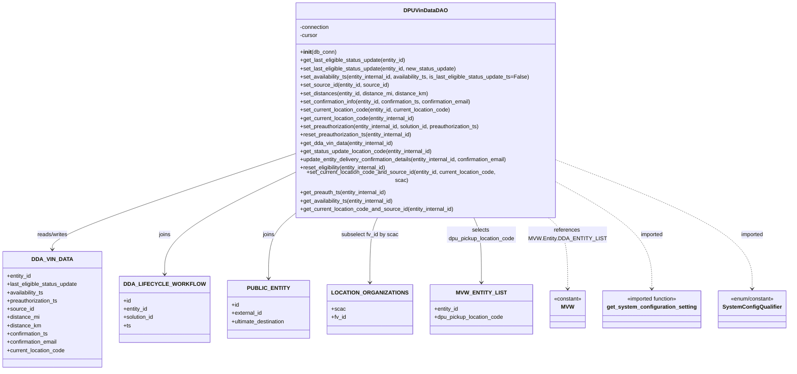

# Diagram: entity_core/entity_service/entity_service/dpu/dpu_service/db/daos/dpu_vin_data_dao.py

> Auto-generated by Obscura crawlers

## Mermaid

### SVG

<svg id="container" width="2192.6484375" xmlns="http://www.w3.org/2000/svg" class="classDiagram" height="1050" viewBox="0 0 2192.6484375 1050" role="graphics-document document" aria-roledescription="class"><g><defs><marker id="container_class-aggregationStart" class="marker aggregation class" refX="18" refY="7" markerWidth="190" markerHeight="240" orient="auto"><path d="M 18,7 L9,13 L1,7 L9,1 Z"></path></marker></defs><defs><marker id="container_class-aggregationEnd" class="marker aggregation class" refX="1" refY="7" markerWidth="20" markerHeight="28" orient="auto"><path d="M 18,7 L9,13 L1,7 L9,1 Z"></path></marker></defs><defs><marker id="container_class-extensionStart" class="marker extension class" refX="18" refY="7" markerWidth="190" markerHeight="240" orient="auto"><path d="M 1,7 L18,13 V 1 Z"></path></marker></defs><defs><marker id="container_class-extensionEnd" class="marker extension class" refX="1" refY="7" markerWidth="20" markerHeight="28" orient="auto"><path d="M 1,1 V 13 L18,7 Z"></path></marker></defs><defs><marker id="container_class-compositionStart" class="marker composition class" refX="18" refY="7" markerWidth="190" markerHeight="240" orient="auto"><path d="M 18,7 L9,13 L1,7 L9,1 Z"></path></marker></defs><defs><marker id="container_class-compositionEnd" class="marker composition class" refX="1" refY="7" markerWidth="20" markerHeight="28" orient="auto"><path d="M 18,7 L9,13 L1,7 L9,1 Z"></path></marker></defs><defs><marker id="container_class-dependencyStart" class="marker dependency class" refX="6" refY="7" markerWidth="190" markerHeight="240" orient="auto"><path d="M 5,7 L9,13 L1,7 L9,1 Z"></path></marker></defs><defs><marker id="container_class-dependencyEnd" class="marker dependency class" refX="13" refY="7" markerWidth="20" markerHeight="28" orient="auto"><path d="M 18,7 L9,13 L14,7 L9,1 Z"></path></marker></defs><defs><marker id="container_class-lollipopStart" class="marker lollipop class" refX="13" refY="7" markerWidth="190" markerHeight="240" orient="auto"><circle stroke="black" fill="transparent" cx="7" cy="7" r="6"></circle></marker></defs><defs><marker id="container_class-lollipopEnd" class="marker lollipop class" refX="1" refY="7" markerWidth="190" markerHeight="240" orient="auto"><circle stroke="black" fill="transparent" cx="7" cy="7" r="6"></circle></marker></defs><g class="root"><g class="clusters"></g><g class="edgePaths"><path d="M791.469,438.009L684.614,474.508C577.759,511.006,364.049,584.003,257.195,627.668C150.34,671.333,150.34,685.667,150.34,692.833L150.34,700" id="id_DPUVinDataDAO_DDA_VIN_DATA_1" class="edge-thickness-normal edge-pattern-solid relation" style=";;;" data-edge="true" data-et="edge" data-id="id_DPUVinDataDAO_DDA_VIN_DATA_1" data-points="W3sieCI6NzkxLjQ2ODc1LCJ5Ijo0MzguMDA5MDY0NTY0NDcyNzR9LHsieCI6MTUwLjMzOTg0Mzc1LCJ5Ijo2NTd9LHsieCI6MTUwLjMzOTg0Mzc1LCJ5Ijo3MDZ9XQ==" marker-end="url(#container_class-dependencyEnd)"></path><path d="M791.469,493.531L735.576,520.776C679.682,548.021,567.896,602.51,512.003,648.922C456.109,695.333,456.109,733.667,456.109,752.833L456.109,772" id="id_DPUVinDataDAO_DDA_LIFECYCLE_WORKFLOW_2" class="edge-thickness-normal edge-pattern-solid relation" style=";;;" data-edge="true" data-et="edge" data-id="id_DPUVinDataDAO_DDA_LIFECYCLE_WORKFLOW_2" data-points="W3sieCI6NzkxLjQ2ODc1LCJ5Ijo0OTMuNTMxMjY0NDkxOTgyN30seyJ4Ijo0NTYuMTA5Mzc1LCJ5Ijo2NTd9LHsieCI6NDU2LjEwOTM3NSwieSI6Nzc4fV0=" marker-end="url(#container_class-dependencyEnd)"></path><path d="M799.914,608L789.782,616.167C779.651,624.333,759.388,640.667,749.256,670C739.125,699.333,739.125,741.667,739.125,762.833L739.125,784" id="id_DPUVinDataDAO_PUBLIC_ENTITY_3" class="edge-thickness-normal edge-pattern-solid relation" style=";;;" data-edge="true" data-et="edge" data-id="id_DPUVinDataDAO_PUBLIC_ENTITY_3" data-points="W3sieCI6Nzk5LjkxMzc2MDI5NzI3NzksInkiOjYwOH0seyJ4Ijo3MzkuMTI1LCJ5Ijo2NTd9LHsieCI6NzM5LjEyNSwieSI6NzkwfV0=" marker-end="url(#container_class-dependencyEnd)"></path><path d="M1040.407,608L1036.822,616.167C1033.237,624.333,1026.068,640.667,1022.483,672C1018.898,703.333,1018.898,749.667,1018.898,772.833L1018.898,796" id="id_DPUVinDataDAO_LOCATION_ORGANIZATIONS_4" class="edge-thickness-normal edge-pattern-solid relation" style=";;;" data-edge="true" data-et="edge" data-id="id_DPUVinDataDAO_LOCATION_ORGANIZATIONS_4" data-points="W3sieCI6MTA0MC40MDY2ODY1MTUwNDMsInkiOjYwOH0seyJ4IjoxMDE4Ljg5ODQzNzUsInkiOjY1N30seyJ4IjoxMDE4Ljg5ODQzNzUsInkiOjgwMn1d" marker-end="url(#container_class-dependencyEnd)"></path><path d="M1303.773,608L1307.358,616.167C1310.942,624.333,1318.112,640.667,1321.697,672C1325.281,703.333,1325.281,749.667,1325.281,772.833L1325.281,796" id="id_DPUVinDataDAO_MVW_ENTITY_LIST_5" class="edge-thickness-normal edge-pattern-solid relation" style=";;;" data-edge="true" data-et="edge" data-id="id_DPUVinDataDAO_MVW_ENTITY_LIST_5" data-points="W3sieCI6MTMwMy43NzMwMDA5ODQ5NTcsInkiOjYwOH0seyJ4IjoxMzI1LjI4MTI1LCJ5Ijo2NTd9LHsieCI6MTMyNS4yODEyNSwieSI6ODAyfV0=" marker-end="url(#container_class-dependencyEnd)"></path><path d="M1517.544,608L1526.949,616.167C1536.353,624.333,1555.161,640.667,1564.565,675C1573.969,709.333,1573.969,761.667,1573.969,787.833L1573.969,814" id="id_DPUVinDataDAO_MVW_6" class="edge-thickness-normal edge-pattern-dashed relation" style=";;;" data-edge="true" data-et="edge" data-id="id_DPUVinDataDAO_MVW_6" data-points="W3sieCI6MTUxNy41NDQ0OTA5NTYzMDM3LCJ5Ijo2MDh9LHsieCI6MTU3My45Njg3NSwieSI6NjU3fSx7IngiOjE1NzMuOTY4NzUsInkiOjgyMH1d" marker-end="url(#container_class-dependencyEnd)"></path><path d="M1552.711,515.384L1596.03,538.987C1639.349,562.589,1725.987,609.795,1769.306,659.564C1812.625,709.333,1812.625,761.667,1812.625,787.833L1812.625,814" id="id_DPUVinDataDAO_get_system_configuration_setting_7" class="edge-thickness-normal edge-pattern-dashed relation" style=";;;" data-edge="true" data-et="edge" data-id="id_DPUVinDataDAO_get_system_configuration_setting_7" data-points="W3sieCI6MTU1Mi43MTA5Mzc1LCJ5Ijo1MTUuMzg0MDI5NDY3NTQ3M30seyJ4IjoxODEyLjYyNSwieSI6NjU3fSx7IngiOjE4MTIuNjI1LCJ5Ijo4MjB9XQ==" marker-end="url(#container_class-dependencyEnd)"></path><path d="M1552.711,452.446L1642.546,486.538C1732.38,520.631,1912.049,588.815,2001.884,649.074C2091.719,709.333,2091.719,761.667,2091.719,787.833L2091.719,814" id="id_DPUVinDataDAO_SystemConfigQualifier_8" class="edge-thickness-normal edge-pattern-dashed relation" style=";;;" data-edge="true" data-et="edge" data-id="id_DPUVinDataDAO_SystemConfigQualifier_8" data-points="W3sieCI6MTU1Mi43MTA5Mzc1LCJ5Ijo0NTIuNDQ2MDQ4NjM1NDQ2Nn0seyJ4IjoyMDkxLjcxODc1LCJ5Ijo2NTd9LHsieCI6MjA5MS43MTg3NSwieSI6ODIwfV0=" marker-end="url(#container_class-dependencyEnd)"></path></g><g class="edgeLabels"><g class="edgeLabel" transform="translate(150.33984375, 657)"><g class="label" data-id="id_DPUVinDataDAO_DDA_VIN_DATA_1" transform="translate(-45.9453125, -12)"><foreignObject width="91.890625" height="24">

reads/writes

</foreignObject></g></g><g class="edgeLabel" transform="translate(456.109375, 657)"><g class="label" data-id="id_DPUVinDataDAO_DDA_LIFECYCLE_WORKFLOW_2" transform="translate(-17.59375, -12)"><foreignObject width="35.1875" height="24">

joins

</foreignObject></g></g><g class="edgeLabel" transform="translate(739.125, 657)"><g class="label" data-id="id_DPUVinDataDAO_PUBLIC_ENTITY_3" transform="translate(-17.59375, -12)"><foreignObject width="35.1875" height="24">

joins

</foreignObject></g></g><g class="edgeLabel" transform="translate(1018.8984375, 657)"><g class="label" data-id="id_DPUVinDataDAO_LOCATION_ORGANIZATIONS_4" transform="translate(-82.8671875, -12)"><foreignObject width="165.734375" height="24">

subselect fv_id by scac

</foreignObject></g></g><g class="edgeLabel" transform="translate(1325.28125, 657)"><g class="label" data-id="id_DPUVinDataDAO_MVW_ENTITY_LIST_5" transform="translate(-100, -24)"><foreignObject width="200" height="48">

selects dpu_pickup_location_code

</foreignObject></g></g><g class="edgeLabel" transform="translate(1573.96875, 657)"><g class="label" data-id="id_DPUVinDataDAO_MVW_6" transform="translate(-103.2734375, -24)"><foreignObject width="206.546875" height="48">

references MVW.Entity.DDA_ENTITY_LIST

</foreignObject></g></g><g class="edgeLabel" transform="translate(1812.625, 657)"><g class="label" data-id="id_DPUVinDataDAO_get_system_configuration_setting_7" transform="translate(-33.5390625, -12)"><foreignObject width="67.078125" height="24">

imported

</foreignObject></g></g><g class="edgeLabel" transform="translate(2091.71875, 657)"><g class="label" data-id="id_DPUVinDataDAO_SystemConfigQualifier_8" transform="translate(-33.5390625, -12)"><foreignObject width="67.078125" height="24">

imported

</foreignObject></g></g></g><g class="nodes"><g class="node default" id="classId-DPUVinDataDAO-0" transform="translate(1172.08984375, 308)"><g class="basic label-container"><path d="M-380.62109375 -300 L380.62109375 -300 L380.62109375 300 L-380.62109375 300" stroke="none" stroke-width="0" fill="#ECECFF" style=""></path><path d="M-380.62109375 -300 C-180.93617289002475 -300, 18.7487479699505 -300, 380.62109375 -300 M-380.62109375 -300 C-224.94018810308407 -300, -69.25928245616814 -300, 380.62109375 -300 M380.62109375 -300 C380.62109375 -120.43228379915485, 380.62109375 59.13543240169031, 380.62109375 300 M380.62109375 -300 C380.62109375 -63.232220906051054, 380.62109375 173.5355581878979, 380.62109375 300 M380.62109375 300 C105.79630296399631 300, -169.02848782200738 300, -380.62109375 300 M380.62109375 300 C125.65456270242015 300, -129.3119683451597 300, -380.62109375 300 M-380.62109375 300 C-380.62109375 124.99502021093036, -380.62109375 -50.009959578139274, -380.62109375 -300 M-380.62109375 300 C-380.62109375 123.16496088352403, -380.62109375 -53.67007823295194, -380.62109375 -300" stroke="#9370DB" stroke-width="1.3" fill="none" stroke-dasharray="0 0" style=""></path></g><g class="annotation-group text" transform="translate(0, -276)"></g><g class="label-group text" transform="translate(-58.8359375, -276)"><g class="label" style="font-weight: bolder" transform="translate(0,-12)"><foreignObject width="117.671875" height="24">

DPUVinDataDAO

</foreignObject></g></g><g class="members-group text" transform="translate(-368.62109375, -228)"><g class="label" style="" transform="translate(0,-12)"><foreignObject width="87.25" height="24">

-connection

</foreignObject></g><g class="label" style="" transform="translate(0,12)"><foreignObject width="52.1875" height="24">

-cursor

</foreignObject></g></g><g class="methods-group text" transform="translate(-368.62109375, -156)"><g class="label" style="" transform="translate(0,-12)"><foreignObject width="104.96875" height="24">

+<strong>init</strong>(db_conn)

</foreignObject></g><g class="label" style="" transform="translate(0,12)"><foreignObject width="312.359375" height="24">

+get_last_eligible_status_update(entity_id)

</foreignObject></g><g class="label" style="" transform="translate(0,36)"><foreignObject width="460.84375" height="24">

+set_last_eligible_status_update(entity_id, new_status_update)

</foreignObject></g><g class="label" style="" transform="translate(0,60)"><foreignObject width="678.40625" height="24">

+set_availability_ts(entity_internal_id, availability_ts, is_last_eligible_status_update_ts=False)

</foreignObject></g><g class="label" style="" transform="translate(0,84)"><foreignObject width="260.5" height="24">

+set_source_id(entity_id, source_id)

</foreignObject></g><g class="label" style="" transform="translate(0,108)"><foreignObject width="376" height="24">

+set_distances(entity_id, distance_mi, distance_km)

</foreignObject></g><g class="label" style="" transform="translate(0,132)"><foreignObject width="513.234375" height="24">

+set_confirmation_info(entity_id, confirmation_ts, confirmation_email)

</foreignObject></g><g class="label" style="" transform="translate(0,156)"><foreignObject width="445.90625" height="24">

+set_current_location_code(entity_id, current_location_code)

</foreignObject></g><g class="label" style="" transform="translate(0,180)"><foreignObject width="340.859375" height="24">

+get_current_location_code(entity_internal_id)

</foreignObject></g><g class="label" style="" transform="translate(0,204)"><foreignObject width="540.25" height="24">

+set_preauthorization(entity_internal_id, solution_id, preauthorization_ts)

</foreignObject></g><g class="label" style="" transform="translate(0,228)"><foreignObject width="334.859375" height="24">

+reset_preauthorization_ts(entity_internal_id)

</foreignObject></g><g class="label" style="" transform="translate(0,252)"><foreignObject width="276.125" height="24">

+get_dda_vin_data(entity_internal_id)

</foreignObject></g><g class="label" style="" transform="translate(0,276)"><foreignObject width="391.734375" height="24">

+get_status_update_location_code(entity_internal_id)

</foreignObject></g><g class="label" style="" transform="translate(0,300)"><foreignObject width="621" height="24">

+update_entity_delivery_confirmation_details(entity_internal_id, confirmation_email)

</foreignObject></g><g class="label" style="" transform="translate(0,324)"><foreignObject width="259.40625" height="24">

+reset_eligibility(entity_internal_id)

</foreignObject></g><g class="label" style="" transform="translate(0,348)"><foreignObject width="598.75" height="24">

+set_current_location_code_and_source_id(entity_id, current_location_code, scac)

</foreignObject></g><g class="label" style="" transform="translate(0,372)"><foreignObject width="256.53125" height="24">

+get_preauth_ts(entity_internal_id)

</foreignObject></g><g class="label" style="" transform="translate(0,396)"><foreignObject width="278.203125" height="24">

+get_availability_ts(entity_internal_id)

</foreignObject></g><g class="label" style="" transform="translate(0,420)"><foreignObject width="454.453125" height="24">

+get_current_location_code_and_source_id(entity_internal_id)

</foreignObject></g></g><g class="divider" style=""><path d="M-380.62109375 -252 C-220.5590539495531 -252, -60.49701414910618 -252, 380.62109375 -252 M-380.62109375 -252 C-176.92761591270644 -252, 26.765861924587114 -252, 380.62109375 -252" stroke="#9370DB" stroke-width="1.3" fill="none" stroke-dasharray="0 0" style=""></path></g><g class="divider" style=""><path d="M-380.62109375 -180 C-120.73092002396254 -180, 139.15925370207492 -180, 380.62109375 -180 M-380.62109375 -180 C-145.2528033266267 -180, 90.11548709674662 -180, 380.62109375 -180" stroke="#9370DB" stroke-width="1.3" fill="none" stroke-dasharray="0 0" style=""></path></g></g><g class="node default" id="classId-DDA_VIN_DATA-1" transform="translate(150.33984375, 874)"><g class="basic label-container"><path d="M-142.33984375 -168 L142.33984375 -168 L142.33984375 168 L-142.33984375 168" stroke="none" stroke-width="0" fill="#ECECFF" style=""></path><path d="M-142.33984375 -168 C-80.35356286251368 -168, -18.367281975027353 -168, 142.33984375 -168 M-142.33984375 -168 C-57.55548666974343 -168, 27.22887041051314 -168, 142.33984375 -168 M142.33984375 -168 C142.33984375 -55.8737069658699, 142.33984375 56.2525860682602, 142.33984375 168 M142.33984375 -168 C142.33984375 -77.30405968899854, 142.33984375 13.39188062200293, 142.33984375 168 M142.33984375 168 C54.60283610919852 168, -33.13417153160296 168, -142.33984375 168 M142.33984375 168 C31.404265713646765 168, -79.53131232270647 168, -142.33984375 168 M-142.33984375 168 C-142.33984375 67.05616703587766, -142.33984375 -33.88766592824467, -142.33984375 -168 M-142.33984375 168 C-142.33984375 64.16460745294172, -142.33984375 -39.67078509411655, -142.33984375 -168" stroke="#9370DB" stroke-width="1.3" fill="none" stroke-dasharray="0 0" style=""></path></g><g class="annotation-group text" transform="translate(0, -144)"></g><g class="label-group text" transform="translate(-53.2734375, -144)"><g class="label" style="font-weight: bolder" transform="translate(0,-12)"><foreignObject width="106.546875" height="24">

DDA_VIN_DATA

</foreignObject></g></g><g class="members-group text" transform="translate(-130.33984375, -96)"><g class="label" style="" transform="translate(0,-12)"><foreignObject width="71.859375" height="24">

+entity_id

</foreignObject></g><g class="label" style="" transform="translate(0,12)"><foreignObject width="207.40625" height="24">

+last_eligible_status_update

</foreignObject></g><g class="label" style="" transform="translate(0,36)"><foreignObject width="107.90625" height="24">

+availability_ts

</foreignObject></g><g class="label" style="" transform="translate(0,60)"><foreignObject width="150.671875" height="24">

+preauthorization_ts

</foreignObject></g><g class="label" style="" transform="translate(0,84)"><foreignObject width="77.9375" height="24">

+source_id

</foreignObject></g><g class="label" style="" transform="translate(0,108)"><foreignObject width="95.5625" height="24">

+distance_mi

</foreignObject></g><g class="label" style="" transform="translate(0,132)"><foreignObject width="99.234375" height="24">

+distance_km

</foreignObject></g><g class="label" style="" transform="translate(0,156)"><foreignObject width="122.09375" height="24">

+confirmation_ts

</foreignObject></g><g class="label" style="" transform="translate(0,180)"><foreignObject width="149.171875" height="24">

+confirmation_email

</foreignObject></g><g class="label" style="" transform="translate(0,204)"><foreignObject width="170.8125" height="24">

+current_location_code

</foreignObject></g></g><g class="methods-group text" transform="translate(-130.33984375, 168)"></g><g class="divider" style=""><path d="M-142.33984375 -120 C-31.557160790632707 -120, 79.22552216873459 -120, 142.33984375 -120 M-142.33984375 -120 C-81.21565431977095 -120, -20.091464889541882 -120, 142.33984375 -120" stroke="#9370DB" stroke-width="1.3" fill="none" stroke-dasharray="0 0" style=""></path></g><g class="divider" style=""><path d="M-142.33984375 144 C-39.37143646056059 144, 63.596970828878824 144, 142.33984375 144 M-142.33984375 144 C-36.51313969434459 144, 69.31356436131082 144, 142.33984375 144" stroke="#9370DB" stroke-width="1.3" fill="none" stroke-dasharray="0 0" style=""></path></g></g><g class="node default" id="classId-DDA_LIFECYCLE_WORKFLOW-2" transform="translate(456.109375, 874)"><g class="basic label-container"><path d="M-113.4296875 -96 L113.4296875 -96 L113.4296875 96 L-113.4296875 96" stroke="none" stroke-width="0" fill="#ECECFF" style=""></path><path d="M-113.4296875 -96 C-54.98315680452669 -96, 3.463373890946613 -96, 113.4296875 -96 M-113.4296875 -96 C-26.810025253288202 -96, 59.809636993423595 -96, 113.4296875 -96 M113.4296875 -96 C113.4296875 -24.26824478161481, 113.4296875 47.46351043677038, 113.4296875 96 M113.4296875 -96 C113.4296875 -48.97870930781583, 113.4296875 -1.957418615631667, 113.4296875 96 M113.4296875 96 C65.31031478762648 96, 17.190942075252963 96, -113.4296875 96 M113.4296875 96 C61.671646901536455 96, 9.91360630307291 96, -113.4296875 96 M-113.4296875 96 C-113.4296875 28.97612226333763, -113.4296875 -38.04775547332474, -113.4296875 -96 M-113.4296875 96 C-113.4296875 32.21473448899238, -113.4296875 -31.570531022015246, -113.4296875 -96" stroke="#9370DB" stroke-width="1.3" fill="none" stroke-dasharray="0 0" style=""></path></g><g class="annotation-group text" transform="translate(0, -72)"></g><g class="label-group text" transform="translate(-101.4296875, -72)"><g class="label" style="font-weight: bolder" transform="translate(0,-12)"><foreignObject width="202.859375" height="24">

DDA_LIFECYCLE_WORKFLOW

</foreignObject></g></g><g class="members-group text" transform="translate(-101.4296875, -24)"><g class="label" style="" transform="translate(0,-12)"><foreignObject width="22.078125" height="24">

+id

</foreignObject></g><g class="label" style="" transform="translate(0,12)"><foreignObject width="71.859375" height="24">

+entity_id

</foreignObject></g><g class="label" style="" transform="translate(0,36)"><foreignObject width="90.21875" height="24">

+solution_id

</foreignObject></g><g class="label" style="" transform="translate(0,60)"><foreignObject width="21.15625" height="24">

+ts

</foreignObject></g></g><g class="methods-group text" transform="translate(-101.4296875, 96)"></g><g class="divider" style=""><path d="M-113.4296875 -48 C-52.55621018432125 -48, 8.317267131357497 -48, 113.4296875 -48 M-113.4296875 -48 C-53.77359332260784 -48, 5.882500854784325 -48, 113.4296875 -48" stroke="#9370DB" stroke-width="1.3" fill="none" stroke-dasharray="0 0" style=""></path></g><g class="divider" style=""><path d="M-113.4296875 72 C-38.44312694675139 72, 36.54343360649722 72, 113.4296875 72 M-113.4296875 72 C-65.49766785773836 72, -17.565648215476728 72, 113.4296875 72" stroke="#9370DB" stroke-width="1.3" fill="none" stroke-dasharray="0 0" style=""></path></g></g><g class="node default" id="classId-PUBLIC_ENTITY-3" transform="translate(739.125, 874)"><g class="basic label-container"><path d="M-119.5859375 -84 L119.5859375 -84 L119.5859375 84 L-119.5859375 84" stroke="none" stroke-width="0" fill="#ECECFF" style=""></path><path d="M-119.5859375 -84 C-31.207232562064576 -84, 57.17147237587085 -84, 119.5859375 -84 M-119.5859375 -84 C-55.19868530159762 -84, 9.188566896804758 -84, 119.5859375 -84 M119.5859375 -84 C119.5859375 -42.7926129527844, 119.5859375 -1.5852259055688052, 119.5859375 84 M119.5859375 -84 C119.5859375 -48.15392507682351, 119.5859375 -12.307850153647024, 119.5859375 84 M119.5859375 84 C70.82599821127931 84, 22.066058922558625 84, -119.5859375 84 M119.5859375 84 C40.19900468644529 84, -39.187928127109416 84, -119.5859375 84 M-119.5859375 84 C-119.5859375 42.60222659744282, -119.5859375 1.2044531948856445, -119.5859375 -84 M-119.5859375 84 C-119.5859375 19.564779518946665, -119.5859375 -44.87044096210667, -119.5859375 -84" stroke="#9370DB" stroke-width="1.3" fill="none" stroke-dasharray="0 0" style=""></path></g><g class="annotation-group text" transform="translate(0, -60)"></g><g class="label-group text" transform="translate(-55.40625, -60)"><g class="label" style="font-weight: bolder" transform="translate(0,-12)"><foreignObject width="110.8125" height="24">

PUBLIC_ENTITY

</foreignObject></g></g><g class="members-group text" transform="translate(-107.5859375, -12)"><g class="label" style="" transform="translate(0,-12)"><foreignObject width="22.078125" height="24">

+id

</foreignObject></g><g class="label" style="" transform="translate(0,12)"><foreignObject width="89.765625" height="24">

+external_id

</foreignObject></g><g class="label" style="" transform="translate(0,36)"><foreignObject width="159.765625" height="24">

+ultimate_destination

</foreignObject></g></g><g class="methods-group text" transform="translate(-107.5859375, 84)"></g><g class="divider" style=""><path d="M-119.5859375 -36 C-39.51312453969507 -36, 40.55968842060986 -36, 119.5859375 -36 M-119.5859375 -36 C-42.73565951472732 -36, 34.114618470545366 -36, 119.5859375 -36" stroke="#9370DB" stroke-width="1.3" fill="none" stroke-dasharray="0 0" style=""></path></g><g class="divider" style=""><path d="M-119.5859375 60 C-37.42272321159835 60, 44.740491076803295 60, 119.5859375 60 M-119.5859375 60 C-26.09485287748859 60, 67.39623174502282 60, 119.5859375 60" stroke="#9370DB" stroke-width="1.3" fill="none" stroke-dasharray="0 0" style=""></path></g></g><g class="node default" id="classId-LOCATION_ORGANIZATIONS-4" transform="translate(1018.8984375, 874)"><g class="basic label-container"><path d="M-110.1875 -72 L110.1875 -72 L110.1875 72 L-110.1875 72" stroke="none" stroke-width="0" fill="#ECECFF" style=""></path><path d="M-110.1875 -72 C-61.83196619080734 -72, -13.476432381614686 -72, 110.1875 -72 M-110.1875 -72 C-43.879021457959425 -72, 22.42945708408115 -72, 110.1875 -72 M110.1875 -72 C110.1875 -37.56559765079111, 110.1875 -3.131195301582224, 110.1875 72 M110.1875 -72 C110.1875 -15.340048086172601, 110.1875 41.3199038276548, 110.1875 72 M110.1875 72 C52.94296137262784 72, -4.301577254744316 72, -110.1875 72 M110.1875 72 C32.544569364276086 72, -45.09836127144783 72, -110.1875 72 M-110.1875 72 C-110.1875 20.082345969301066, -110.1875 -31.835308061397868, -110.1875 -72 M-110.1875 72 C-110.1875 23.788983162187357, -110.1875 -24.422033675625286, -110.1875 -72" stroke="#9370DB" stroke-width="1.3" fill="none" stroke-dasharray="0 0" style=""></path></g><g class="annotation-group text" transform="translate(0, -48)"></g><g class="label-group text" transform="translate(-98.1875, -48)"><g class="label" style="font-weight: bolder" transform="translate(0,-12)"><foreignObject width="196.375" height="24">

LOCATION_ORGANIZATIONS

</foreignObject></g></g><g class="members-group text" transform="translate(-98.1875, 0)"><g class="label" style="" transform="translate(0,-12)"><foreignObject width="39.296875" height="24">

+scac

</foreignObject></g><g class="label" style="" transform="translate(0,12)"><foreignObject width="42.90625" height="24">

+fv_id

</foreignObject></g></g><g class="methods-group text" transform="translate(-98.1875, 72)"></g><g class="divider" style=""><path d="M-110.1875 -24 C-23.87216510631849 -24, 62.44316978736302 -24, 110.1875 -24 M-110.1875 -24 C-58.453020160043344 -24, -6.718540320086689 -24, 110.1875 -24" stroke="#9370DB" stroke-width="1.3" fill="none" stroke-dasharray="0 0" style=""></path></g><g class="divider" style=""><path d="M-110.1875 48 C-38.77957439991266 48, 32.62835120017468 48, 110.1875 48 M-110.1875 48 C-35.03343707639205 48, 40.120625847215905 48, 110.1875 48" stroke="#9370DB" stroke-width="1.3" fill="none" stroke-dasharray="0 0" style=""></path></g></g><g class="node default" id="classId-MVW_ENTITY_LIST-5" transform="translate(1325.28125, 874)"><g class="basic label-container"><path d="M-146.1953125 -72 L146.1953125 -72 L146.1953125 72 L-146.1953125 72" stroke="none" stroke-width="0" fill="#ECECFF" style=""></path><path d="M-146.1953125 -72 C-65.95271520658106 -72, 14.289882086837878 -72, 146.1953125 -72 M-146.1953125 -72 C-69.42560445360206 -72, 7.344103592795875 -72, 146.1953125 -72 M146.1953125 -72 C146.1953125 -23.98306326597917, 146.1953125 24.033873468041662, 146.1953125 72 M146.1953125 -72 C146.1953125 -22.53476342140216, 146.1953125 26.930473157195678, 146.1953125 72 M146.1953125 72 C29.720595158141165 72, -86.75412218371767 72, -146.1953125 72 M146.1953125 72 C37.644015107148604 72, -70.90728228570279 72, -146.1953125 72 M-146.1953125 72 C-146.1953125 23.80269383389036, -146.1953125 -24.394612332219282, -146.1953125 -72 M-146.1953125 72 C-146.1953125 39.150511931468486, -146.1953125 6.301023862936972, -146.1953125 -72" stroke="#9370DB" stroke-width="1.3" fill="none" stroke-dasharray="0 0" style=""></path></g><g class="annotation-group text" transform="translate(0, -48)"></g><g class="label-group text" transform="translate(-65.1875, -48)"><g class="label" style="font-weight: bolder" transform="translate(0,-12)"><foreignObject width="130.375" height="24">

MVW_ENTITY_LIST

</foreignObject></g></g><g class="members-group text" transform="translate(-134.1953125, 0)"><g class="label" style="" transform="translate(0,-12)"><foreignObject width="71.859375" height="24">

+entity_id

</foreignObject></g><g class="label" style="" transform="translate(0,12)"><foreignObject width="203.203125" height="24">

+dpu_pickup_location_code

</foreignObject></g></g><g class="methods-group text" transform="translate(-134.1953125, 72)"></g><g class="divider" style=""><path d="M-146.1953125 -24 C-57.38965128838542 -24, 31.416009923229154 -24, 146.1953125 -24 M-146.1953125 -24 C-37.096874088894324 -24, 72.00156432221135 -24, 146.1953125 -24" stroke="#9370DB" stroke-width="1.3" fill="none" stroke-dasharray="0 0" style=""></path></g><g class="divider" style=""><path d="M-146.1953125 48 C-35.319032229357234 48, 75.55724804128553 48, 146.1953125 48 M-146.1953125 48 C-34.36952914881566 48, 77.45625420236868 48, 146.1953125 48" stroke="#9370DB" stroke-width="1.3" fill="none" stroke-dasharray="0 0" style=""></path></g></g><g class="node default" id="classId-MVW-6" transform="translate(1573.96875, 874)"><g class="basic label-container"><path d="M-52.4921875 -54 L52.4921875 -54 L52.4921875 54 L-52.4921875 54" stroke="none" stroke-width="0" fill="#ECECFF" style=""></path><path d="M-52.4921875 -54 C-10.687505219508935 -54, 31.11717706098213 -54, 52.4921875 -54 M-52.4921875 -54 C-24.13852038865067 -54, 4.2151467226986625 -54, 52.4921875 -54 M52.4921875 -54 C52.4921875 -18.839741255402195, 52.4921875 16.32051748919561, 52.4921875 54 M52.4921875 -54 C52.4921875 -26.62122185729001, 52.4921875 0.7575562854199802, 52.4921875 54 M52.4921875 54 C28.20573926425492 54, 3.9192910285098392 54, -52.4921875 54 M52.4921875 54 C29.41235631231477 54, 6.332525124629541 54, -52.4921875 54 M-52.4921875 54 C-52.4921875 10.99063513853519, -52.4921875 -32.01872972292962, -52.4921875 -54 M-52.4921875 54 C-52.4921875 21.271489034096767, -52.4921875 -11.457021931806466, -52.4921875 -54" stroke="#9370DB" stroke-width="1.3" fill="none" stroke-dasharray="0 0" style=""></path></g><g class="annotation-group text" transform="translate(-40.4921875, -30)"><g class="label" style="" transform="translate(0,-12)"><foreignObject width="80.984375" height="24">

«constant»

</foreignObject></g></g><g class="label-group text" transform="translate(-17.5625, -6)"><g class="label" style="font-weight: bolder" transform="translate(0,-12)"><foreignObject width="35.125" height="24">

MVW

</foreignObject></g></g><g class="members-group text" transform="translate(-40.4921875, 42)"></g><g class="methods-group text" transform="translate(-40.4921875, 72)"></g><g class="divider" style=""><path d="M-52.4921875 18 C-14.298976987402334 18, 23.894233525195332 18, 52.4921875 18 M-52.4921875 18 C-13.706047682644929 18, 25.080092134710142 18, 52.4921875 18" stroke="#9370DB" stroke-width="1.3" fill="none" stroke-dasharray="0 0" style=""></path></g><g class="divider" style=""><path d="M-52.4921875 36 C-21.87238107728536 36, 8.747425345429278 36, 52.4921875 36 M-52.4921875 36 C-28.17891648413628 36, -3.865645468272561 36, 52.4921875 36" stroke="#9370DB" stroke-width="1.3" fill="none" stroke-dasharray="0 0" style=""></path></g></g><g class="node default" id="classId-get_system_configuration_setting-7" transform="translate(1812.625, 874)"><g class="basic label-container"><path d="M-136.1640625 -54 L136.1640625 -54 L136.1640625 54 L-136.1640625 54" stroke="none" stroke-width="0" fill="#ECECFF" style=""></path><path d="M-136.1640625 -54 C-40.372881018187826 -54, 55.41830046362435 -54, 136.1640625 -54 M-136.1640625 -54 C-71.17113743980418 -54, -6.178212379608368 -54, 136.1640625 -54 M136.1640625 -54 C136.1640625 -30.100668729581155, 136.1640625 -6.2013374591623105, 136.1640625 54 M136.1640625 -54 C136.1640625 -19.917375641328597, 136.1640625 14.165248717342806, 136.1640625 54 M136.1640625 54 C77.93497380955424 54, 19.705885119108487 54, -136.1640625 54 M136.1640625 54 C39.05404937536247 54, -58.055963749275065 54, -136.1640625 54 M-136.1640625 54 C-136.1640625 12.10441604584912, -136.1640625 -29.79116790830176, -136.1640625 -54 M-136.1640625 54 C-136.1640625 23.42318504114534, -136.1640625 -7.153629917709317, -136.1640625 -54" stroke="#9370DB" stroke-width="1.3" fill="none" stroke-dasharray="0 0" style=""></path></g><g class="annotation-group text" transform="translate(-75.140625, -30)"><g class="label" style="" transform="translate(0,-12)"><foreignObject width="150.28125" height="24">

«imported function»

</foreignObject></g></g><g class="label-group text" transform="translate(-124.1640625, -6)"><g class="label" style="font-weight: bolder" transform="translate(0,-12)"><foreignObject width="248.328125" height="24">

get_system_configuration_setting

</foreignObject></g></g><g class="members-group text" transform="translate(-124.1640625, 42)"></g><g class="methods-group text" transform="translate(-124.1640625, 72)"></g><g class="divider" style=""><path d="M-136.1640625 18 C-45.189732574128925 18, 45.78459735174215 18, 136.1640625 18 M-136.1640625 18 C-39.52380420154623 18, 57.116454096907546 18, 136.1640625 18" stroke="#9370DB" stroke-width="1.3" fill="none" stroke-dasharray="0 0" style=""></path></g><g class="divider" style=""><path d="M-136.1640625 36 C-76.37357013100413 36, -16.583077762008273 36, 136.1640625 36 M-136.1640625 36 C-39.95795300547438 36, 56.24815648905124 36, 136.1640625 36" stroke="#9370DB" stroke-width="1.3" fill="none" stroke-dasharray="0 0" style=""></path></g></g><g class="node default" id="classId-SystemConfigQualifier-8" transform="translate(2091.71875, 874)"><g class="basic label-container"><path d="M-92.9296875 -54 L92.9296875 -54 L92.9296875 54 L-92.9296875 54" stroke="none" stroke-width="0" fill="#ECECFF" style=""></path><path d="M-92.9296875 -54 C-37.23594310610432 -54, 18.457801287791355 -54, 92.9296875 -54 M-92.9296875 -54 C-53.116746935319824 -54, -13.303806370639649 -54, 92.9296875 -54 M92.9296875 -54 C92.9296875 -20.782741866405217, 92.9296875 12.434516267189565, 92.9296875 54 M92.9296875 -54 C92.9296875 -29.217961851422224, 92.9296875 -4.435923702844448, 92.9296875 54 M92.9296875 54 C50.687129947483 54, 8.444572394966002 54, -92.9296875 54 M92.9296875 54 C43.253482874601744 54, -6.422721750796512 54, -92.9296875 54 M-92.9296875 54 C-92.9296875 22.788966619922512, -92.9296875 -8.422066760154976, -92.9296875 -54 M-92.9296875 54 C-92.9296875 17.591090490444827, -92.9296875 -18.817819019110345, -92.9296875 -54" stroke="#9370DB" stroke-width="1.3" fill="none" stroke-dasharray="0 0" style=""></path></g><g class="annotation-group text" transform="translate(-64.8125, -30)"><g class="label" style="" transform="translate(0,-12)"><foreignObject width="129.625" height="24">

«enum/constant»

</foreignObject></g></g><g class="label-group text" transform="translate(-80.9296875, -6)"><g class="label" style="font-weight: bolder" transform="translate(0,-12)"><foreignObject width="161.859375" height="24">

SystemConfigQualifier

</foreignObject></g></g><g class="members-group text" transform="translate(-80.9296875, 42)"></g><g class="methods-group text" transform="translate(-80.9296875, 72)"></g><g class="divider" style=""><path d="M-92.9296875 18 C-39.15836735668381 18, 14.612952786632377 18, 92.9296875 18 M-92.9296875 18 C-33.72433625240875 18, 25.481014995182505 18, 92.9296875 18" stroke="#9370DB" stroke-width="1.3" fill="none" stroke-dasharray="0 0" style=""></path></g><g class="divider" style=""><path d="M-92.9296875 36 C-27.117406358005013 36, 38.694874783989974 36, 92.9296875 36 M-92.9296875 36 C-26.126228648785812 36, 40.677230202428376 36, 92.9296875 36" stroke="#9370DB" stroke-width="1.3" fill="none" stroke-dasharray="0 0" style=""></path></g></g></g></g></g></svg>
