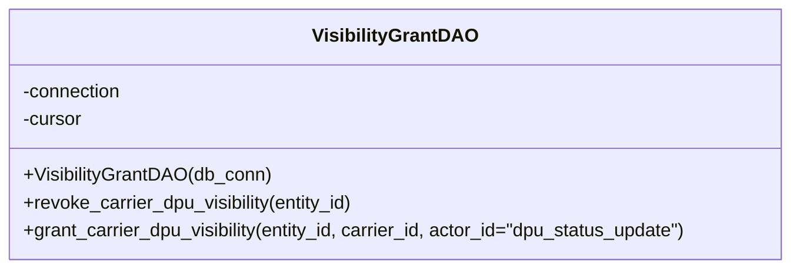
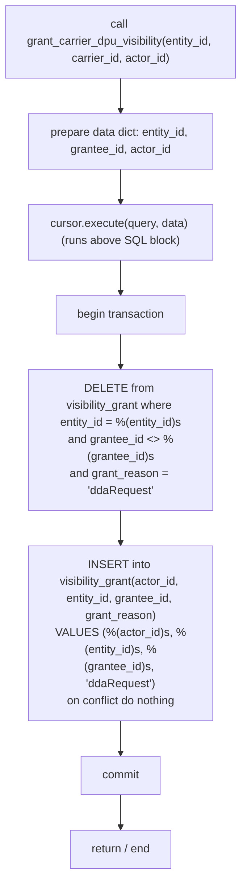

# Diagram: entity_core/entity_service/entity_service/dpu/dpu_service/db/daos/dpu_visibility_grant_dao.py

> Auto-generated by Obscura crawlers

## Diagram 1

### SVG

<svg id="container" width="691.671875" xmlns="http://www.w3.org/2000/svg" class="classDiagram" height="232" viewBox="0 0 691.671875 232" role="graphics-document document" aria-roledescription="class"><g><defs><marker id="container_class-aggregationStart" class="marker aggregation class" refX="18" refY="7" markerWidth="190" markerHeight="240" orient="auto"><path d="M 18,7 L9,13 L1,7 L9,1 Z"></path></marker></defs><defs><marker id="container_class-aggregationEnd" class="marker aggregation class" refX="1" refY="7" markerWidth="20" markerHeight="28" orient="auto"><path d="M 18,7 L9,13 L1,7 L9,1 Z"></path></marker></defs><defs><marker id="container_class-extensionStart" class="marker extension class" refX="18" refY="7" markerWidth="190" markerHeight="240" orient="auto"><path d="M 1,7 L18,13 V 1 Z"></path></marker></defs><defs><marker id="container_class-extensionEnd" class="marker extension class" refX="1" refY="7" markerWidth="20" markerHeight="28" orient="auto"><path d="M 1,1 V 13 L18,7 Z"></path></marker></defs><defs><marker id="container_class-compositionStart" class="marker composition class" refX="18" refY="7" markerWidth="190" markerHeight="240" orient="auto"><path d="M 18,7 L9,13 L1,7 L9,1 Z"></path></marker></defs><defs><marker id="container_class-compositionEnd" class="marker composition class" refX="1" refY="7" markerWidth="20" markerHeight="28" orient="auto"><path d="M 18,7 L9,13 L1,7 L9,1 Z"></path></marker></defs><defs><marker id="container_class-dependencyStart" class="marker dependency class" refX="6" refY="7" markerWidth="190" markerHeight="240" orient="auto"><path d="M 5,7 L9,13 L1,7 L9,1 Z"></path></marker></defs><defs><marker id="container_class-dependencyEnd" class="marker dependency class" refX="13" refY="7" markerWidth="20" markerHeight="28" orient="auto"><path d="M 18,7 L9,13 L14,7 L9,1 Z"></path></marker></defs><defs><marker id="container_class-lollipopStart" class="marker lollipop class" refX="13" refY="7" markerWidth="190" markerHeight="240" orient="auto"><circle stroke="black" fill="transparent" cx="7" cy="7" r="6"></circle></marker></defs><defs><marker id="container_class-lollipopEnd" class="marker lollipop class" refX="1" refY="7" markerWidth="190" markerHeight="240" orient="auto"><circle stroke="black" fill="transparent" cx="7" cy="7" r="6"></circle></marker></defs><g class="root"><g class="clusters"></g><g class="edgePaths"></g><g class="edgeLabels"></g><g class="nodes"><g class="node default" id="classId-VisibilityGrantDAO-0" transform="translate(345.8359375, 116)"><g class="basic label-container"><path d="M-337.8359375 -108 L337.8359375 -108 L337.8359375 108 L-337.8359375 108" stroke="none" stroke-width="0" fill="#ECECFF" style=""></path><path d="M-337.8359375 -108 C-146.31281241752802 -108, 45.210312664943956 -108, 337.8359375 -108 M-337.8359375 -108 C-76.0833853972444 -108, 185.6691667055112 -108, 337.8359375 -108 M337.8359375 -108 C337.8359375 -58.87318750437303, 337.8359375 -9.746375008746057, 337.8359375 108 M337.8359375 -108 C337.8359375 -47.48849814236822, 337.8359375 13.023003715263556, 337.8359375 108 M337.8359375 108 C105.90483583589727 108, -126.02626582820545 108, -337.8359375 108 M337.8359375 108 C180.76877023292522 108, 23.70160296585044 108, -337.8359375 108 M-337.8359375 108 C-337.8359375 61.04270985192576, -337.8359375 14.085419703851514, -337.8359375 -108 M-337.8359375 108 C-337.8359375 41.95439282753232, -337.8359375 -24.091214344935366, -337.8359375 -108" stroke="#9370DB" stroke-width="1.3" fill="none" stroke-dasharray="0 0" style=""></path></g><g class="annotation-group text" transform="translate(0, -84)"></g><g class="label-group text" transform="translate(-67.265625, -84)"><g class="label" style="font-weight: bolder" transform="translate(0,-12)"><foreignObject width="134.53125" height="24">

VisibilityGrantDAO

</foreignObject></g></g><g class="members-group text" transform="translate(-325.8359375, -36)"><g class="label" style="" transform="translate(0,-12)"><foreignObject width="87.25" height="24">

-connection

</foreignObject></g><g class="label" style="" transform="translate(0,12)"><foreignObject width="52.1875" height="24">

-cursor

</foreignObject></g></g><g class="methods-group text" transform="translate(-325.8359375, 36)"><g class="label" style="" transform="translate(0,-12)"><foreignObject width="212.109375" height="24">

+VisibilityGrantDAO(db_conn)

</foreignObject></g><g class="label" style="" transform="translate(0,12)"><foreignObject width="290.234375" height="24">

+revoke_carrier_dpu_visibility(entity_id)

</foreignObject></g><g class="label" style="" transform="translate(0,36)"><foreignObject width="584.40625" height="24">

+grant_carrier_dpu_visibility(entity_id, carrier_id, actor_id="dpu_status_update")

</foreignObject></g></g><g class="divider" style=""><path d="M-337.8359375 -60 C-70.44079827489713 -60, 196.95434095020573 -60, 337.8359375 -60 M-337.8359375 -60 C-107.16001854214548 -60, 123.51590041570904 -60, 337.8359375 -60" stroke="#9370DB" stroke-width="1.3" fill="none" stroke-dasharray="0 0" style=""></path></g><g class="divider" style=""><path d="M-337.8359375 12 C-147.92679245271873 12, 41.98235259456254 12, 337.8359375 12 M-337.8359375 12 C-145.34220581873038 12, 47.151525862539245 12, 337.8359375 12" stroke="#9370DB" stroke-width="1.3" fill="none" stroke-dasharray="0 0" style=""></path></g></g></g></g></g></svg>

## Diagram 2

### SVG

<svg id="container" width="350.96875" xmlns="http://www.w3.org/2000/svg" class="flowchart" height="1278" viewBox="0 0 350.96875 1278" role="graphics-document document" aria-roledescription="flowchart-v2"><g><marker id="container_flowchart-v2-pointEnd" class="marker flowchart-v2" viewBox="0 0 10 10" refX="5" refY="5" markerUnits="userSpaceOnUse" markerWidth="8" markerHeight="8" orient="auto"><path d="M 0 0 L 10 5 L 0 10 z" class="arrowMarkerPath" style="stroke-width: 1; stroke-dasharray: 1, 0;"></path></marker><marker id="container_flowchart-v2-pointStart" class="marker flowchart-v2" viewBox="0 0 10 10" refX="4.5" refY="5" markerUnits="userSpaceOnUse" markerWidth="8" markerHeight="8" orient="auto"><path d="M 0 5 L 10 10 L 10 0 z" class="arrowMarkerPath" style="stroke-width: 1; stroke-dasharray: 1, 0;"></path></marker><marker id="container_flowchart-v2-circleEnd" class="marker flowchart-v2" viewBox="0 0 10 10" refX="11" refY="5" markerUnits="userSpaceOnUse" markerWidth="11" markerHeight="11" orient="auto"><circle cx="5" cy="5" r="5" class="arrowMarkerPath" style="stroke-width: 1; stroke-dasharray: 1, 0;"></circle></marker><marker id="container_flowchart-v2-circleStart" class="marker flowchart-v2" viewBox="0 0 10 10" refX="-1" refY="5" markerUnits="userSpaceOnUse" markerWidth="11" markerHeight="11" orient="auto"><circle cx="5" cy="5" r="5" class="arrowMarkerPath" style="stroke-width: 1; stroke-dasharray: 1, 0;"></circle></marker><marker id="container_flowchart-v2-crossEnd" class="marker cross flowchart-v2" viewBox="0 0 11 11" refX="12" refY="5.2" markerUnits="userSpaceOnUse" markerWidth="11" markerHeight="11" orient="auto"><path d="M 1,1 l 9,9 M 10,1 l -9,9" class="arrowMarkerPath" style="stroke-width: 2; stroke-dasharray: 1, 0;"></path></marker><marker id="container_flowchart-v2-crossStart" class="marker cross flowchart-v2" viewBox="0 0 11 11" refX="-1" refY="5.2" markerUnits="userSpaceOnUse" markerWidth="11" markerHeight="11" orient="auto"><path d="M 1,1 l 9,9 M 10,1 l -9,9" class="arrowMarkerPath" style="stroke-width: 2; stroke-dasharray: 1, 0;"></path></marker><g class="root"><g class="clusters"></g><g class="edgePaths"><path d="M175.484,110L175.484,114.167C175.484,118.333,175.484,126.667,175.484,134.333C175.484,142,175.484,149,175.484,152.5L175.484,156" id="L_Start_PrepData_0" class="edge-thickness-normal edge-pattern-solid edge-thickness-normal edge-pattern-solid flowchart-link" style=";" data-edge="true" data-et="edge" data-id="L_Start_PrepData_0" data-points="W3sieCI6MTc1LjQ4NDM3NSwieSI6MTEwfSx7IngiOjE3NS40ODQzNzUsInkiOjEzNX0seyJ4IjoxNzUuNDg0Mzc1LCJ5IjoxNjB9XQ==" marker-end="url(#container_flowchart-v2-pointEnd)"></path><path d="M175.484,262L175.484,266.167C175.484,270.333,175.484,278.667,175.484,286.333C175.484,294,175.484,301,175.484,304.5L175.484,308" id="L_PrepData_Execute_0" class="edge-thickness-normal edge-pattern-solid edge-thickness-normal edge-pattern-solid flowchart-link" style=";" data-edge="true" data-et="edge" data-id="L_PrepData_Execute_0" data-points="W3sieCI6MTc1LjQ4NDM3NSwieSI6MjYyfSx7IngiOjE3NS40ODQzNzUsInkiOjI4N30seyJ4IjoxNzUuNDg0Mzc1LCJ5IjozMTJ9XQ==" marker-end="url(#container_flowchart-v2-pointEnd)"></path><path d="M175.484,414L175.484,418.167C175.484,422.333,175.484,430.667,175.484,438.333C175.484,446,175.484,453,175.484,456.5L175.484,460" id="L_Execute_BeginTx_0" class="edge-thickness-normal edge-pattern-solid edge-thickness-normal edge-pattern-solid flowchart-link" style=";" data-edge="true" data-et="edge" data-id="L_Execute_BeginTx_0" data-points="W3sieCI6MTc1LjQ4NDM3NSwieSI6NDE0fSx7IngiOjE3NS40ODQzNzUsInkiOjQzOX0seyJ4IjoxNzUuNDg0Mzc1LCJ5Ijo0NjR9XQ==" marker-end="url(#container_flowchart-v2-pointEnd)"></path><path d="M175.484,518L175.484,522.167C175.484,526.333,175.484,534.667,175.484,542.333C175.484,550,175.484,557,175.484,560.5L175.484,564" id="L_BeginTx_DeleteOther_0" class="edge-thickness-normal edge-pattern-solid edge-thickness-normal edge-pattern-solid flowchart-link" style=";" data-edge="true" data-et="edge" data-id="L_BeginTx_DeleteOther_0" data-points="W3sieCI6MTc1LjQ4NDM3NSwieSI6NTE4fSx7IngiOjE3NS40ODQzNzUsInkiOjU0M30seyJ4IjoxNzUuNDg0Mzc1LCJ5Ijo1Njh9XQ==" marker-end="url(#container_flowchart-v2-pointEnd)"></path><path d="M175.484,790L175.484,794.167C175.484,798.333,175.484,806.667,175.484,814.333C175.484,822,175.484,829,175.484,832.5L175.484,836" id="L_DeleteOther_InsertGrant_0" class="edge-thickness-normal edge-pattern-solid edge-thickness-normal edge-pattern-solid flowchart-link" style=";" data-edge="true" data-et="edge" data-id="L_DeleteOther_InsertGrant_0" data-points="W3sieCI6MTc1LjQ4NDM3NSwieSI6NzkwfSx7IngiOjE3NS40ODQzNzUsInkiOjgxNX0seyJ4IjoxNzUuNDg0Mzc1LCJ5Ijo4NDB9XQ==" marker-end="url(#container_flowchart-v2-pointEnd)"></path><path d="M175.484,1062L175.484,1066.167C175.484,1070.333,175.484,1078.667,175.484,1086.333C175.484,1094,175.484,1101,175.484,1104.5L175.484,1108" id="L_InsertGrant_Commit_0" class="edge-thickness-normal edge-pattern-solid edge-thickness-normal edge-pattern-solid flowchart-link" style=";" data-edge="true" data-et="edge" data-id="L_InsertGrant_Commit_0" data-points="W3sieCI6MTc1LjQ4NDM3NSwieSI6MTA2Mn0seyJ4IjoxNzUuNDg0Mzc1LCJ5IjoxMDg3fSx7IngiOjE3NS40ODQzNzUsInkiOjExMTJ9XQ==" marker-end="url(#container_flowchart-v2-pointEnd)"></path><path d="M175.484,1166L175.484,1170.167C175.484,1174.333,175.484,1182.667,175.484,1190.333C175.484,1198,175.484,1205,175.484,1208.5L175.484,1212" id="L_Commit_End_0" class="edge-thickness-normal edge-pattern-solid edge-thickness-normal edge-pattern-solid flowchart-link" style=";" data-edge="true" data-et="edge" data-id="L_Commit_End_0" data-points="W3sieCI6MTc1LjQ4NDM3NSwieSI6MTE2Nn0seyJ4IjoxNzUuNDg0Mzc1LCJ5IjoxMTkxfSx7IngiOjE3NS40ODQzNzUsInkiOjEyMTZ9XQ==" marker-end="url(#container_flowchart-v2-pointEnd)"></path></g><g class="edgeLabels"><g class="edgeLabel"><g class="label" data-id="L_Start_PrepData_0" transform="translate(0, 0)"><foreignObject width="0" height="0">

</foreignObject></g></g><g class="edgeLabel"><g class="label" data-id="L_PrepData_Execute_0" transform="translate(0, 0)"><foreignObject width="0" height="0">

</foreignObject></g></g><g class="edgeLabel"><g class="label" data-id="L_Execute_BeginTx_0" transform="translate(0, 0)"><foreignObject width="0" height="0">

</foreignObject></g></g><g class="edgeLabel"><g class="label" data-id="L_BeginTx_DeleteOther_0" transform="translate(0, 0)"><foreignObject width="0" height="0">

</foreignObject></g></g><g class="edgeLabel"><g class="label" data-id="L_DeleteOther_InsertGrant_0" transform="translate(0, 0)"><foreignObject width="0" height="0">

</foreignObject></g></g><g class="edgeLabel"><g class="label" data-id="L_InsertGrant_Commit_0" transform="translate(0, 0)"><foreignObject width="0" height="0">

</foreignObject></g></g><g class="edgeLabel"><g class="label" data-id="L_Commit_End_0" transform="translate(0, 0)"><foreignObject width="0" height="0">

</foreignObject></g></g></g><g class="nodes"><g class="node default" id="flowchart-Start-0" transform="translate(175.484375, 59)"><rect class="basic label-container" style="" x="-167.484375" y="-51" width="334.96875" height="102"></rect><g class="label" style="" transform="translate(-137.484375, -36)"><rect></rect><foreignObject width="274.96875" height="72">

call grant_carrier_dpu_visibility(entity_id, carrier_id, actor_id)

</foreignObject></g></g><g class="node default" id="flowchart-PrepData-1" transform="translate(175.484375, 211)"><rect class="basic label-container" style="" x="-130" y="-51" width="260" height="102"></rect><g class="label" style="" transform="translate(-100, -36)"><rect></rect><foreignObject width="200" height="72">

prepare data dict: entity_id, grantee_id, actor_id

</foreignObject></g></g><g class="node default" id="flowchart-BeginTx-2" transform="translate(175.484375, 491)"><rect class="basic label-container" style="" x="-93.4140625" y="-27" width="186.828125" height="54"></rect><g class="label" style="" transform="translate(-63.4140625, -12)"><rect></rect><foreignObject width="126.828125" height="24">

begin transaction

</foreignObject></g></g><g class="node default" id="flowchart-DeleteOther-3" transform="translate(175.484375, 679)"><rect class="basic label-container" style="" x="-130" y="-111" width="260" height="222"></rect><g class="label" style="" transform="translate(-100, -96)"><rect></rect><foreignObject width="200" height="192">

DELETE from visibility_grant where entity_id = %(entity_id)s\nand grantee_id &lt;&gt; %(grantee_id)s\nand grant_reason = 'ddaRequest'

</foreignObject></g></g><g class="node default" id="flowchart-InsertGrant-4" transform="translate(175.484375, 951)"><rect class="basic label-container" style="" x="-130" y="-111" width="260" height="222"></rect><g class="label" style="" transform="translate(-100, -96)"><rect></rect><foreignObject width="200" height="192">

INSERT into visibility_grant(actor_id, entity_id, grantee_id, grant_reason)\nVALUES (%(actor_id)s, %(entity_id)s, %(grantee_id)s, 'ddaRequest')\non conflict do nothing

</foreignObject></g></g><g class="node default" id="flowchart-Commit-5" transform="translate(175.484375, 1139)"><rect class="basic label-container" style="" x="-57.1953125" y="-27" width="114.390625" height="54"></rect><g class="label" style="" transform="translate(-27.1953125, -12)"><rect></rect><foreignObject width="54.390625" height="24">

commit

</foreignObject></g></g><g class="node default" id="flowchart-Execute-6" transform="translate(175.484375, 363)"><rect class="basic label-container" style="" x="-130" y="-51" width="260" height="102"></rect><g class="label" style="" transform="translate(-100, -36)"><rect></rect><foreignObject width="200" height="72">

cursor.execute(query, data) (runs above SQL block)

</foreignObject></g></g><g class="node default" id="flowchart-End-7" transform="translate(175.484375, 1243)"><rect class="basic label-container" style="" x="-74.765625" y="-27" width="149.53125" height="54"></rect><g class="label" style="" transform="translate(-44.765625, -12)"><rect></rect><foreignObject width="89.53125" height="24">

return / end

</foreignObject></g></g></g></g></g></svg>
