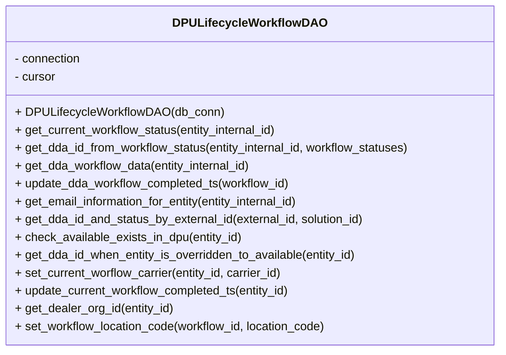

# Diagram: entity_core/entity_service/entity_service/dpu/dpu_service/db/daos/dpu_workflow_dao.py


> Auto-generated by Obscura crawlers

## Diagram 1



### SVG

<svg id="container" width="679.703125" xmlns="http://www.w3.org/2000/svg" class="classDiagram" height="472" viewBox="0 0 679.703125 472" role="graphics-document document" aria-roledescription="class"><style>#container{font-family:"trebuchet ms",verdana,arial,sans-serif;font-size:16px;fill:#333;}@keyframes edge-animation-frame{from{stroke-dashoffset:0;}}@keyframes dash{to{stroke-dashoffset:0;}}#container .edge-animation-slow{stroke-dasharray:9,5!important;stroke-dashoffset:900;animation:dash 50s linear infinite;stroke-linecap:round;}#container .edge-animation-fast{stroke-dasharray:9,5!important;stroke-dashoffset:900;animation:dash 20s linear infinite;stroke-linecap:round;}#container .error-icon{fill:#552222;}#container .error-text{fill:#552222;stroke:#552222;}#container .edge-thickness-normal{stroke-width:1px;}#container .edge-thickness-thick{stroke-width:3.5px;}#container .edge-pattern-solid{stroke-dasharray:0;}#container .edge-thickness-invisible{stroke-width:0;fill:none;}#container .edge-pattern-dashed{stroke-dasharray:3;}#container .edge-pattern-dotted{stroke-dasharray:2;}#container .marker{fill:#333333;stroke:#333333;}#container .marker.cross{stroke:#333333;}#container svg{font-family:"trebuchet ms",verdana,arial,sans-serif;font-size:16px;}#container p{margin:0;}#container g.classGroup text{fill:#9370DB;stroke:none;font-family:"trebuchet ms",verdana,arial,sans-serif;font-size:10px;}#container g.classGroup text .title{font-weight:bolder;}#container .nodeLabel,#container .edgeLabel{color:#131300;}#container .edgeLabel .label rect{fill:#ECECFF;}#container .label text{fill:#131300;}#container .labelBkg{background:#ECECFF;}#container .edgeLabel .label span{background:#ECECFF;}#container .classTitle{font-weight:bolder;}#container .node rect,#container .node circle,#container .node ellipse,#container .node polygon,#container .node path{fill:#ECECFF;stroke:#9370DB;stroke-width:1px;}#container .divider{stroke:#9370DB;stroke-width:1;}#container g.clickable{cursor:pointer;}#container g.classGroup rect{fill:#ECECFF;stroke:#9370DB;}#container g.classGroup line{stroke:#9370DB;stroke-width:1;}#container .classLabel .box{stroke:none;stroke-width:0;fill:#ECECFF;opacity:0.5;}#container .classLabel .label{fill:#9370DB;font-size:10px;}#container .relation{stroke:#333333;stroke-width:1;fill:none;}#container .dashed-line{stroke-dasharray:3;}#container .dotted-line{stroke-dasharray:1 2;}#container #compositionStart,#container .composition{fill:#333333!important;stroke:#333333!important;stroke-width:1;}#container #compositionEnd,#container .composition{fill:#333333!important;stroke:#333333!important;stroke-width:1;}#container #dependencyStart,#container .dependency{fill:#333333!important;stroke:#333333!important;stroke-width:1;}#container #dependencyStart,#container .dependency{fill:#333333!important;stroke:#333333!important;stroke-width:1;}#container #extensionStart,#container .extension{fill:transparent!important;stroke:#333333!important;stroke-width:1;}#container #extensionEnd,#container .extension{fill:transparent!important;stroke:#333333!important;stroke-width:1;}#container #aggregationStart,#container .aggregation{fill:transparent!important;stroke:#333333!important;stroke-width:1;}#container #aggregationEnd,#container .aggregation{fill:transparent!important;stroke:#333333!important;stroke-width:1;}#container #lollipopStart,#container .lollipop{fill:#ECECFF!important;stroke:#333333!important;stroke-width:1;}#container #lollipopEnd,#container .lollipop{fill:#ECECFF!important;stroke:#333333!important;stroke-width:1;}#container .edgeTerminals{font-size:11px;line-height:initial;}#container .classTitleText{text-anchor:middle;font-size:18px;fill:#333;}#container .label-icon{display:inline-block;height:1em;overflow:visible;vertical-align:-0.125em;}#container .node .label-icon path{fill:currentColor;stroke:revert;stroke-width:revert;}#container :root{--mermaid-font-family:"trebuchet ms",verdana,arial,sans-serif;}</style><g><defs><marker id="container_class-aggregationStart" class="marker aggregation class" refX="18" refY="7" markerWidth="190" markerHeight="240" orient="auto"><path d="M 18,7 L9,13 L1,7 L9,1 Z"></path></marker></defs><defs><marker id="container_class-aggregationEnd" class="marker aggregation class" refX="1" refY="7" markerWidth="20" markerHeight="28" orient="auto"><path d="M 18,7 L9,13 L1,7 L9,1 Z"></path></marker></defs><defs><marker id="container_class-extensionStart" class="marker extension class" refX="18" refY="7" markerWidth="190" markerHeight="240" orient="auto"><path d="M 1,7 L18,13 V 1 Z"></path></marker></defs><defs><marker id="container_class-extensionEnd" class="marker extension class" refX="1" refY="7" markerWidth="20" markerHeight="28" orient="auto"><path d="M 1,1 V 13 L18,7 Z"></path></marker></defs><defs><marker id="container_class-compositionStart" class="marker composition class" refX="18" refY="7" markerWidth="190" markerHeight="240" orient="auto"><path d="M 18,7 L9,13 L1,7 L9,1 Z"></path></marker></defs><defs><marker id="container_class-compositionEnd" class="marker composition class" refX="1" refY="7" markerWidth="20" markerHeight="28" orient="auto"><path d="M 18,7 L9,13 L1,7 L9,1 Z"></path></marker></defs><defs><marker id="container_class-dependencyStart" class="marker dependency class" refX="6" refY="7" markerWidth="190" markerHeight="240" orient="auto"><path d="M 5,7 L9,13 L1,7 L9,1 Z"></path></marker></defs><defs><marker id="container_class-dependencyEnd" class="marker dependency class" refX="13" refY="7" markerWidth="20" markerHeight="28" orient="auto"><path d="M 18,7 L9,13 L14,7 L9,1 Z"></path></marker></defs><defs><marker id="container_class-lollipopStart" class="marker lollipop class" refX="13" refY="7" markerWidth="190" markerHeight="240" orient="auto"><circle stroke="black" fill="transparent" cx="7" cy="7" r="6"></circle></marker></defs><defs><marker id="container_class-lollipopEnd" class="marker lollipop class" refX="1" refY="7" markerWidth="190" markerHeight="240" orient="auto"><circle stroke="black" fill="transparent" cx="7" cy="7" r="6"></circle></marker></defs><g class="root"><g class="clusters"></g><g class="edgePaths"></g><g class="edgeLabels"></g><g class="nodes"><g class="node default" id="classId-DPULifecycleWorkflowDAO-0" transform="translate(339.8515625, 236)"><g class="basic label-container"><path d="M-331.8515625 -228 L331.8515625 -228 L331.8515625 228 L-331.8515625 228" stroke="none" stroke-width="0" fill="#ECECFF" style=""></path><path d="M-331.8515625 -228 C-158.04175499954377 -228, 15.76805250091246 -228, 331.8515625 -228 M-331.8515625 -228 C-178.53756328978216 -228, -25.223564079564312 -228, 331.8515625 -228 M331.8515625 -228 C331.8515625 -46.87761952329623, 331.8515625 134.24476095340754, 331.8515625 228 M331.8515625 -228 C331.8515625 -109.30719768313962, 331.8515625 9.38560463372076, 331.8515625 228 M331.8515625 228 C77.33918836681272 228, -177.17318576637456 228, -331.8515625 228 M331.8515625 228 C141.00413250174876 228, -49.84329749650249 228, -331.8515625 228 M-331.8515625 228 C-331.8515625 104.26821600591565, -331.8515625 -19.463567988168705, -331.8515625 -228 M-331.8515625 228 C-331.8515625 82.13107914343567, -331.8515625 -63.73784171312866, -331.8515625 -228" stroke="#9370DB" stroke-width="1.3" fill="none" stroke-dasharray="0 0" style=""></path></g><g class="annotation-group text" transform="translate(0, -204)"></g><g class="label-group text" transform="translate(-97.21875, -204)"><g class="label" style="font-weight: bolder" transform="translate(0,-12)"><foreignObject width="194.4375" height="24"><div xmlns="http://www.w3.org/1999/xhtml" style="display: table-cell; white-space: nowrap; line-height: 1.5; max-width: 240px; text-align: center;"><span class="nodeLabel markdown-node-label" style=""><p>DPULifecycleWorkflowDAO</p></span></div></foreignObject></g></g><g class="members-group text" transform="translate(-319.8515625, -156)"><g class="label" style="" transform="translate(0,-12)"><foreignObject width="91.5" height="24"><div xmlns="http://www.w3.org/1999/xhtml" style="display: table-cell; white-space: nowrap; line-height: 1.5; max-width: 149px; text-align: center;"><span class="nodeLabel markdown-node-label" style=""><p>- connection</p></span></div></foreignObject></g><g class="label" style="" transform="translate(0,12)"><foreignObject width="56.421875" height="24"><div xmlns="http://www.w3.org/1999/xhtml" style="display: table-cell; white-space: nowrap; line-height: 1.5; max-width: 115px; text-align: center;"><span class="nodeLabel markdown-node-label" style=""><p>- cursor</p></span></div></foreignObject></g></g><g class="methods-group text" transform="translate(-319.8515625, -84)"><g class="label" style="" transform="translate(0,-12)"><foreignObject width="275" height="24"><div xmlns="http://www.w3.org/1999/xhtml" style="display: table-cell; white-space: nowrap; line-height: 1.5; max-width: 332px; text-align: center;"><span class="nodeLabel markdown-node-label" style=""><p>+ DPULifecycleWorkflowDAO(db_conn)</p></span></div></foreignObject></g><g class="label" style="" transform="translate(0,12)"><foreignObject width="360.609375" height="24"><div xmlns="http://www.w3.org/1999/xhtml" style="display: table-cell; white-space: nowrap; line-height: 1.5; max-width: 418px; text-align: center;"><span class="nodeLabel markdown-node-label" style=""><p>+ get_current_workflow_status(entity_internal_id)</p></span></div></foreignObject></g><g class="label" style="" transform="translate(0,36)"><foreignObject width="542.484375" height="24"><div xmlns="http://www.w3.org/1999/xhtml" style="display: table-cell; white-space: nowrap; line-height: 1.5; max-width: 600px; text-align: center;"><span class="nodeLabel markdown-node-label" style=""><p>+ get_dda_id_from_workflow_status(entity_internal_id, workflow_statuses)</p></span></div></foreignObject></g><g class="label" style="" transform="translate(0,60)"><foreignObject width="323.828125" height="24"><div xmlns="http://www.w3.org/1999/xhtml" style="display: table-cell; white-space: nowrap; line-height: 1.5; max-width: 381px; text-align: center;"><span class="nodeLabel markdown-node-label" style=""><p>+ get_dda_workflow_data(entity_internal_id)</p></span></div></foreignObject></g><g class="label" style="" transform="translate(0,84)"><foreignObject width="376.296875" height="24"><div xmlns="http://www.w3.org/1999/xhtml" style="display: table-cell; white-space: nowrap; line-height: 1.5; max-width: 434px; text-align: center;"><span class="nodeLabel markdown-node-label" style=""><p>+ update_dda_workflow_completed_ts(workflow_id)</p></span></div></foreignObject></g><g class="label" style="" transform="translate(0,108)"><foreignObject width="394.359375" height="24"><div xmlns="http://www.w3.org/1999/xhtml" style="display: table-cell; white-space: nowrap; line-height: 1.5; max-width: 452px; text-align: center;"><span class="nodeLabel markdown-node-label" style=""><p>+ get_email_information_for_entity(entity_internal_id)</p></span></div></foreignObject></g><g class="label" style="" transform="translate(0,132)"><foreignObject width="478.453125" height="24"><div xmlns="http://www.w3.org/1999/xhtml" style="display: table-cell; white-space: nowrap; line-height: 1.5; max-width: 536px; text-align: center;"><span class="nodeLabel markdown-node-label" style=""><p>+ get_dda_id_and_status_by_external_id(external_id, solution_id)</p></span></div></foreignObject></g><g class="label" style="" transform="translate(0,156)"><foreignObject width="309.015625" height="24"><div xmlns="http://www.w3.org/1999/xhtml" style="display: table-cell; white-space: nowrap; line-height: 1.5; max-width: 366px; text-align: center;"><span class="nodeLabel markdown-node-label" style=""><p>+ check_available_exists_in_dpu(entity_id)</p></span></div></foreignObject></g><g class="label" style="" transform="translate(0,180)"><foreignObject width="467.578125" height="24"><div xmlns="http://www.w3.org/1999/xhtml" style="display: table-cell; white-space: nowrap; line-height: 1.5; max-width: 525px; text-align: center;"><span class="nodeLabel markdown-node-label" style=""><p>+ get_dda_id_when_entity_is_overridden_to_available(entity_id)</p></span></div></foreignObject></g><g class="label" style="" transform="translate(0,204)"><foreignObject width="366.96875" height="24"><div xmlns="http://www.w3.org/1999/xhtml" style="display: table-cell; white-space: nowrap; line-height: 1.5; max-width: 424px; text-align: center;"><span class="nodeLabel markdown-node-label" style=""><p>+ set_current_worflow_carrier(entity_id, carrier_id)</p></span></div></foreignObject></g><g class="label" style="" transform="translate(0,228)"><foreignObject width="377.40625" height="24"><div xmlns="http://www.w3.org/1999/xhtml" style="display: table-cell; white-space: nowrap; line-height: 1.5; max-width: 435px; text-align: center;"><span class="nodeLabel markdown-node-label" style=""><p>+ update_current_workflow_completed_ts(entity_id)</p></span></div></foreignObject></g><g class="label" style="" transform="translate(0,252)"><foreignObject width="216" height="24"><div xmlns="http://www.w3.org/1999/xhtml" style="display: table-cell; white-space: nowrap; line-height: 1.5; max-width: 273px; text-align: center;"><span class="nodeLabel markdown-node-label" style=""><p>+ get_dealer_org_id(entity_id)</p></span></div></foreignObject></g><g class="label" style="" transform="translate(0,276)"><foreignObject width="425.578125" height="24"><div xmlns="http://www.w3.org/1999/xhtml" style="display: table-cell; white-space: nowrap; line-height: 1.5; max-width: 483px; text-align: center;"><span class="nodeLabel markdown-node-label" style=""><p>+ set_workflow_location_code(workflow_id, location_code)</p></span></div></foreignObject></g></g><g class="divider" style=""><path d="M-331.8515625 -180 C-167.2753145380545 -180, -2.699066576108976 -180, 331.8515625 -180 M-331.8515625 -180 C-71.28287600517302 -180, 189.28581048965395 -180, 331.8515625 -180" stroke="#9370DB" stroke-width="1.3" fill="none" stroke-dasharray="0 0" style=""></path></g><g class="divider" style=""><path d="M-331.8515625 -108 C-146.47840835118797 -108, 38.89474579762407 -108, 331.8515625 -108 M-331.8515625 -108 C-113.1734240981348 -108, 105.5047143037304 -108, 331.8515625 -108" stroke="#9370DB" stroke-width="1.3" fill="none" stroke-dasharray="0 0" style=""></path></g></g></g></g></g></svg>

## Diagram 2

```mermaid
flowchart TD
    A[Instantiate DPULifecycleWorkflowDAO(db_conn)] --> B[connection.establish_connection()]
    B --> C[connection.get_cursor() -> cursor]
    C --> D{Method called}
    D -->|get_current_workflow_status| M1[Build SELECT query with entity_internal_id]
    D -->|get_dda_id_from_workflow_status| M2[Build SELECT query with entity_internal_id and workflow_statuses]
    D -->|get_dda_workflow_data| M3[Build SELECT latest workflow entry query]
    D -->|update_dda_workflow_completed_ts| M4[Build UPDATE query for workflow_id]
    D -->|get_email_information_for_entity| M5[Build SELECT with submitter subquery]
    D -->|get_dda_id_and_status_by_external_id| M6[Build JOIN SELECT with external_id and solution_id]
    D -->|check_available_exists_in_dpu| M7[Build SELECT Available check]
    D -->|get_dda_id_when_entity_is_overridden_to_available| M8[Build SELECT override id query]
    D -->|set_current_worflow_carrier| M9[Build UPDATE carrier_organizations_id query]
    D -->|update_current_workflow_completed_ts| M10[Build UPDATE current workflow completed_ts query]
    D -->|get_dealer_org_id| M11[Build SELECT dealer_organizations_id latest query]
    D -->|set_workflow_location_code| M12[Build UPDATE location_code query]
    M1 --> E[Execute cursor.execute(query, params)]
    M2 --> E
    M3 --> E
    M4 --> E
    M5 --> E
    M6 --> E
    M7 --> E
    M8 --> E
    M9 --> E
    M10 --> E
    M11 --> E
    M12 --> E
    E --> F[result = cursor.fetchone() or execute-only]
    F --> G{result exists?}
    G -->|yes| H[Return extracted fields (ids, status, emails, booleans)]
    G -->|no| I[Return None or False]
    H --> Z[End]
    I --> Z
```

> SVG rendering failed for this diagram.
