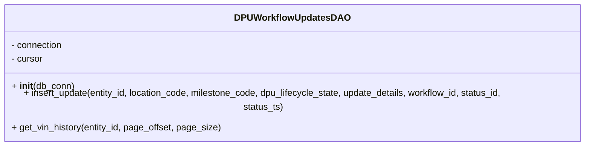
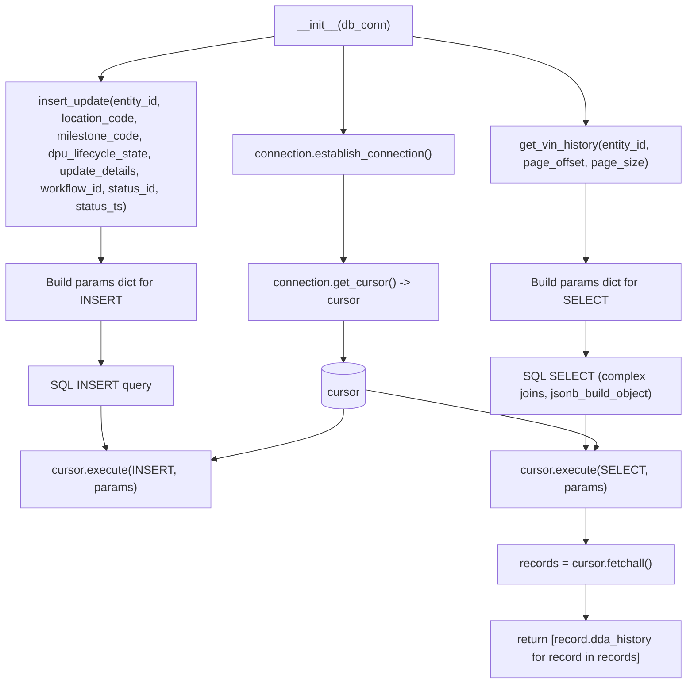

# Diagram: entity_core/entity_service/entity_service/dpu/dpu_service/db/daos/dpu_workflow_updates_dao.py

> Auto-generated by Obscura crawlers

## Diagram 1

### SVG

<svg id="container" width="1064.0703125" xmlns="http://www.w3.org/2000/svg" class="classDiagram" height="232" viewBox="0 0 1064.0703125 232" role="graphics-document document" aria-roledescription="class"><g><defs><marker id="container_class-aggregationStart" class="marker aggregation class" refX="18" refY="7" markerWidth="190" markerHeight="240" orient="auto"><path d="M 18,7 L9,13 L1,7 L9,1 Z"></path></marker></defs><defs><marker id="container_class-aggregationEnd" class="marker aggregation class" refX="1" refY="7" markerWidth="20" markerHeight="28" orient="auto"><path d="M 18,7 L9,13 L1,7 L9,1 Z"></path></marker></defs><defs><marker id="container_class-extensionStart" class="marker extension class" refX="18" refY="7" markerWidth="190" markerHeight="240" orient="auto"><path d="M 1,7 L18,13 V 1 Z"></path></marker></defs><defs><marker id="container_class-extensionEnd" class="marker extension class" refX="1" refY="7" markerWidth="20" markerHeight="28" orient="auto"><path d="M 1,1 V 13 L18,7 Z"></path></marker></defs><defs><marker id="container_class-compositionStart" class="marker composition class" refX="18" refY="7" markerWidth="190" markerHeight="240" orient="auto"><path d="M 18,7 L9,13 L1,7 L9,1 Z"></path></marker></defs><defs><marker id="container_class-compositionEnd" class="marker composition class" refX="1" refY="7" markerWidth="20" markerHeight="28" orient="auto"><path d="M 18,7 L9,13 L1,7 L9,1 Z"></path></marker></defs><defs><marker id="container_class-dependencyStart" class="marker dependency class" refX="6" refY="7" markerWidth="190" markerHeight="240" orient="auto"><path d="M 5,7 L9,13 L1,7 L9,1 Z"></path></marker></defs><defs><marker id="container_class-dependencyEnd" class="marker dependency class" refX="13" refY="7" markerWidth="20" markerHeight="28" orient="auto"><path d="M 18,7 L9,13 L14,7 L9,1 Z"></path></marker></defs><defs><marker id="container_class-lollipopStart" class="marker lollipop class" refX="13" refY="7" markerWidth="190" markerHeight="240" orient="auto"><circle stroke="black" fill="transparent" cx="7" cy="7" r="6"></circle></marker></defs><defs><marker id="container_class-lollipopEnd" class="marker lollipop class" refX="1" refY="7" markerWidth="190" markerHeight="240" orient="auto"><circle stroke="black" fill="transparent" cx="7" cy="7" r="6"></circle></marker></defs><g class="root"><g class="clusters"></g><g class="edgePaths"></g><g class="edgeLabels"></g><g class="nodes"><g class="node default" id="classId-DPUWorkflowUpdatesDAO-0" transform="translate(532.03515625, 116)"><g class="basic label-container"><path d="M-524.03515625 -108 L524.03515625 -108 L524.03515625 108 L-524.03515625 108" stroke="none" stroke-width="0" fill="#ECECFF" style=""></path><path d="M-524.03515625 -108 C-135.17556540186695 -108, 253.6840254462661 -108, 524.03515625 -108 M-524.03515625 -108 C-299.20306775530366 -108, -74.37097926060727 -108, 524.03515625 -108 M524.03515625 -108 C524.03515625 -52.67198958980728, 524.03515625 2.656020820385436, 524.03515625 108 M524.03515625 -108 C524.03515625 -39.21741234878313, 524.03515625 29.565175302433744, 524.03515625 108 M524.03515625 108 C281.16346098326284 108, 38.291765716525674 108, -524.03515625 108 M524.03515625 108 C268.1968722752041 108, 12.358588300408258 108, -524.03515625 108 M-524.03515625 108 C-524.03515625 41.03144104039771, -524.03515625 -25.93711791920458, -524.03515625 -108 M-524.03515625 108 C-524.03515625 62.78556424510044, -524.03515625 17.571128490200877, -524.03515625 -108" stroke="#9370DB" stroke-width="1.3" fill="none" stroke-dasharray="0 0" style=""></path></g><g class="annotation-group text" transform="translate(0, -84)"></g><g class="label-group text" transform="translate(-95.5703125, -84)"><g class="label" style="font-weight: bolder" transform="translate(0,-12)"><foreignObject width="191.140625" height="24">

DPUWorkflowUpdatesDAO

</foreignObject></g></g><g class="members-group text" transform="translate(-512.03515625, -36)"><g class="label" style="" transform="translate(0,-12)"><foreignObject width="91.5" height="24">

- connection

</foreignObject></g><g class="label" style="" transform="translate(0,12)"><foreignObject width="56.421875" height="24">

- cursor

</foreignObject></g></g><g class="methods-group text" transform="translate(-512.03515625, 36)"><g class="label" style="" transform="translate(0,-12)"><foreignObject width="109.21875" height="24">

+ <strong>init</strong>(db_conn)

</foreignObject></g><g class="label" style="" transform="translate(0,12)"><foreignObject width="928.5" height="24">

+ insert_update(entity_id, location_code, milestone_code, dpu_lifecycle_state, update_details, workflow_id, status_id, status_ts)

</foreignObject></g><g class="label" style="" transform="translate(0,36)"><foreignObject width="368.03125" height="24">

+ get_vin_history(entity_id, page_offset, page_size)

</foreignObject></g></g><g class="divider" style=""><path d="M-524.03515625 -60 C-231.08421053716654 -60, 61.86673517566692 -60, 524.03515625 -60 M-524.03515625 -60 C-279.91947686296123 -60, -35.803797475922465 -60, 524.03515625 -60" stroke="#9370DB" stroke-width="1.3" fill="none" stroke-dasharray="0 0" style=""></path></g><g class="divider" style=""><path d="M-524.03515625 12 C-201.98376073925994 12, 120.06763477148013 12, 524.03515625 12 M-524.03515625 12 C-113.99332975871971 12, 296.0484967325606 12, 524.03515625 12" stroke="#9370DB" stroke-width="1.3" fill="none" stroke-dasharray="0 0" style=""></path></g></g></g></g></g></svg>

## Diagram 2

### SVG

<svg id="container" width="945.765625" xmlns="http://www.w3.org/2000/svg" class="flowchart" height="934" viewBox="0 0 945.765625 934" role="graphics-document document" aria-roledescription="flowchart-v2"><g><marker id="container_flowchart-v2-pointEnd" class="marker flowchart-v2" viewBox="0 0 10 10" refX="5" refY="5" markerUnits="userSpaceOnUse" markerWidth="8" markerHeight="8" orient="auto"><path d="M 0 0 L 10 5 L 0 10 z" class="arrowMarkerPath" style="stroke-width: 1; stroke-dasharray: 1, 0;"></path></marker><marker id="container_flowchart-v2-pointStart" class="marker flowchart-v2" viewBox="0 0 10 10" refX="4.5" refY="5" markerUnits="userSpaceOnUse" markerWidth="8" markerHeight="8" orient="auto"><path d="M 0 5 L 10 10 L 10 0 z" class="arrowMarkerPath" style="stroke-width: 1; stroke-dasharray: 1, 0;"></path></marker><marker id="container_flowchart-v2-circleEnd" class="marker flowchart-v2" viewBox="0 0 10 10" refX="11" refY="5" markerUnits="userSpaceOnUse" markerWidth="11" markerHeight="11" orient="auto"><circle cx="5" cy="5" r="5" class="arrowMarkerPath" style="stroke-width: 1; stroke-dasharray: 1, 0;"></circle></marker><marker id="container_flowchart-v2-circleStart" class="marker flowchart-v2" viewBox="0 0 10 10" refX="-1" refY="5" markerUnits="userSpaceOnUse" markerWidth="11" markerHeight="11" orient="auto"><circle cx="5" cy="5" r="5" class="arrowMarkerPath" style="stroke-width: 1; stroke-dasharray: 1, 0;"></circle></marker><marker id="container_flowchart-v2-crossEnd" class="marker cross flowchart-v2" viewBox="0 0 11 11" refX="12" refY="5.2" markerUnits="userSpaceOnUse" markerWidth="11" markerHeight="11" orient="auto"><path d="M 1,1 l 9,9 M 10,1 l -9,9" class="arrowMarkerPath" style="stroke-width: 2; stroke-dasharray: 1, 0;"></path></marker><marker id="container_flowchart-v2-crossStart" class="marker cross flowchart-v2" viewBox="0 0 11 11" refX="-1" refY="5.2" markerUnits="userSpaceOnUse" markerWidth="11" markerHeight="11" orient="auto"><path d="M 1,1 l 9,9 M 10,1 l -9,9" class="arrowMarkerPath" style="stroke-width: 2; stroke-dasharray: 1, 0;"></path></marker><g class="root"><g class="clusters"></g><g class="edgePaths"><path d="M472.883,62L472.883,66.167C472.883,70.333,472.883,78.667,472.883,98.333C472.883,118,472.883,149,472.883,164.5L472.883,180" id="L_Init_Establish_0" class="edge-thickness-normal edge-pattern-solid edge-thickness-normal edge-pattern-solid flowchart-link" style=";" data-edge="true" data-et="edge" data-id="L_Init_Establish_0" data-points="W3sieCI6NDcyLjg4MjgxMjUsInkiOjYyfSx7IngiOjQ3Mi44ODI4MTI1LCJ5Ijo4N30seyJ4Ijo0NzIuODgyODEyNSwieSI6MTg0fV0=" marker-end="url(#container_flowchart-v2-pointEnd)"></path><path d="M472.883,238L472.883,254.167C472.883,270.333,472.883,302.667,472.883,322.333C472.883,342,472.883,349,472.883,352.5L472.883,356" id="L_Establish_GetCursor_0" class="edge-thickness-normal edge-pattern-solid edge-thickness-normal edge-pattern-solid flowchart-link" style=";" data-edge="true" data-et="edge" data-id="L_Establish_GetCursor_0" data-points="W3sieCI6NDcyLjg4MjgxMjUsInkiOjIzOH0seyJ4Ijo0NzIuODgyODEyNSwieSI6MzM1fSx7IngiOjQ3Mi44ODI4MTI1LCJ5IjozNjB9XQ==" marker-end="url(#container_flowchart-v2-pointEnd)"></path><path d="M472.883,438L472.883,442.167C472.883,446.333,472.883,454.667,472.883,463.54C472.883,472.413,472.883,481.825,472.883,486.531L472.883,491.238" id="L_GetCursor_Cursor_0" class="edge-thickness-normal edge-pattern-solid edge-thickness-normal edge-pattern-solid flowchart-link" style=";" data-edge="true" data-et="edge" data-id="L_GetCursor_Cursor_0" data-points="W3sieCI6NDcyLjg4MjgxMjUsInkiOjQzOH0seyJ4Ijo0NzIuODgyODEyNSwieSI6NDYzfSx7IngiOjQ3Mi44ODI4MTI1LCJ5Ijo0OTUuMjM3NjU1NjM5NjQ4NDR9XQ==" marker-end="url(#container_flowchart-v2-pointEnd)"></path><path d="M394.391,47.188L351.659,53.823C308.927,60.459,223.464,73.729,180.732,83.865C138,94,138,101,138,104.5L138,108" id="L_Init_Insert_0" class="edge-thickness-normal edge-pattern-solid edge-thickness-normal edge-pattern-solid flowchart-link" style=";" data-edge="true" data-et="edge" data-id="L_Init_Insert_0" data-points="W3sieCI6Mzk0LjM5MDYyNSwieSI6NDcuMTg4MTI1NTEwMzIzMTA0fSx7IngiOjEzOCwieSI6ODd9LHsieCI6MTM4LCJ5IjoxMTJ9XQ==" marker-end="url(#container_flowchart-v2-pointEnd)"></path><path d="M551.375,47.188L594.107,53.823C636.839,60.459,722.302,73.729,765.034,93.865C807.766,114,807.766,141,807.766,154.5L807.766,168" id="L_Init_GetHistory_0" class="edge-thickness-normal edge-pattern-solid edge-thickness-normal edge-pattern-solid flowchart-link" style=";" data-edge="true" data-et="edge" data-id="L_Init_GetHistory_0" data-points="W3sieCI6NTUxLjM3NSwieSI6NDcuMTg4MTI1NTEwMzIzMTA0fSx7IngiOjgwNy43NjU2MjUsInkiOjg3fSx7IngiOjgwNy43NjU2MjUsInkiOjE3Mn1d" marker-end="url(#container_flowchart-v2-pointEnd)"></path><path d="M138,310L138,314.167C138,318.333,138,326.667,138,334.333C138,342,138,349,138,352.5L138,356" id="L_Insert_BuildInsert_0" class="edge-thickness-normal edge-pattern-solid edge-thickness-normal edge-pattern-solid flowchart-link" style=";" data-edge="true" data-et="edge" data-id="L_Insert_BuildInsert_0" data-points="W3sieCI6MTM4LCJ5IjozMTB9LHsieCI6MTM4LCJ5IjozMzV9LHsieCI6MTM4LCJ5IjozNjB9XQ==" marker-end="url(#container_flowchart-v2-pointEnd)"></path><path d="M138,438L138,442.167C138,446.333,138,454.667,138,464.333C138,474,138,485,138,490.5L138,496" id="L_BuildInsert_QueryInsert_0" class="edge-thickness-normal edge-pattern-solid edge-thickness-normal edge-pattern-solid flowchart-link" style=";" data-edge="true" data-et="edge" data-id="L_BuildInsert_QueryInsert_0" data-points="W3sieCI6MTM4LCJ5Ijo0Mzh9LHsieCI6MTM4LCJ5Ijo0NjN9LHsieCI6MTM4LCJ5Ijo1MDB9XQ==" marker-end="url(#container_flowchart-v2-pointEnd)"></path><path d="M138,554L138,560.167C138,566.333,138,578.667,139.103,588.364C140.206,598.061,142.413,605.121,143.516,608.652L144.619,612.182" id="L_QueryInsert_ExecInsert_0" class="edge-thickness-normal edge-pattern-solid edge-thickness-normal edge-pattern-solid flowchart-link" style=";" data-edge="true" data-et="edge" data-id="L_QueryInsert_ExecInsert_0" data-points="W3sieCI6MTM4LCJ5Ijo1NTR9LHsieCI6MTM4LCJ5Ijo1OTF9LHsieCI6MTQ1LjgxMjUsInkiOjYxNn1d" marker-end="url(#container_flowchart-v2-pointEnd)"></path><path d="M807.766,250L807.766,264.167C807.766,278.333,807.766,306.667,807.766,324.333C807.766,342,807.766,349,807.766,352.5L807.766,356" id="L_GetHistory_BuildSelect_0" class="edge-thickness-normal edge-pattern-solid edge-thickness-normal edge-pattern-solid flowchart-link" style=";" data-edge="true" data-et="edge" data-id="L_GetHistory_BuildSelect_0" data-points="W3sieCI6ODA3Ljc2NTYyNSwieSI6MjUwfSx7IngiOjgwNy43NjU2MjUsInkiOjMzNX0seyJ4Ijo4MDcuNzY1NjI1LCJ5IjozNjB9XQ==" marker-end="url(#container_flowchart-v2-pointEnd)"></path><path d="M807.766,438L807.766,442.167C807.766,446.333,807.766,454.667,807.766,462.333C807.766,470,807.766,477,807.766,480.5L807.766,484" id="L_BuildSelect_QuerySelect_0" class="edge-thickness-normal edge-pattern-solid edge-thickness-normal edge-pattern-solid flowchart-link" style=";" data-edge="true" data-et="edge" data-id="L_BuildSelect_QuerySelect_0" data-points="W3sieCI6ODA3Ljc2NTYyNSwieSI6NDM4fSx7IngiOjgwNy43NjU2MjUsInkiOjQ2M30seyJ4Ijo4MDcuNzY1NjI1LCJ5Ijo0ODh9XQ==" marker-end="url(#container_flowchart-v2-pointEnd)"></path><path d="M807.766,566L807.766,570.167C807.766,574.333,807.766,582.667,807.766,590.333C807.766,598,807.766,605,807.766,608.5L807.766,612" id="L_QuerySelect_ExecSelect_0" class="edge-thickness-normal edge-pattern-solid edge-thickness-normal edge-pattern-solid flowchart-link" style=";" data-edge="true" data-et="edge" data-id="L_QuerySelect_ExecSelect_0" data-points="W3sieCI6ODA3Ljc2NTYyNSwieSI6NTY2fSx7IngiOjgwNy43NjU2MjUsInkiOjU5MX0seyJ4Ijo4MDcuNzY1NjI1LCJ5Ijo2MTZ9XQ==" marker-end="url(#container_flowchart-v2-pointEnd)"></path><path d="M807.766,694L807.766,698.167C807.766,702.333,807.766,710.667,807.766,718.333C807.766,726,807.766,733,807.766,736.5L807.766,740" id="L_ExecSelect_Fetch_0" class="edge-thickness-normal edge-pattern-solid edge-thickness-normal edge-pattern-solid flowchart-link" style=";" data-edge="true" data-et="edge" data-id="L_ExecSelect_Fetch_0" data-points="W3sieCI6ODA3Ljc2NTYyNSwieSI6Njk0fSx7IngiOjgwNy43NjU2MjUsInkiOjcxOX0seyJ4Ijo4MDcuNzY1NjI1LCJ5Ijo3NDR9XQ==" marker-end="url(#container_flowchart-v2-pointEnd)"></path><path d="M807.766,798L807.766,802.167C807.766,806.333,807.766,814.667,807.766,822.333C807.766,830,807.766,837,807.766,840.5L807.766,844" id="L_Fetch_MapReturn_0" class="edge-thickness-normal edge-pattern-solid edge-thickness-normal edge-pattern-solid flowchart-link" style=";" data-edge="true" data-et="edge" data-id="L_Fetch_MapReturn_0" data-points="W3sieCI6ODA3Ljc2NTYyNSwieSI6Nzk4fSx7IngiOjgwNy43NjU2MjUsInkiOjgyM30seyJ4Ijo4MDcuNzY1NjI1LCJ5Ijo4NDh9XQ==" marker-end="url(#container_flowchart-v2-pointEnd)"></path><path d="M472.883,558.762L472.883,564.135C472.883,569.508,472.883,580.254,442.722,591.757C412.562,603.26,352.241,615.521,322.08,621.651L291.92,627.781" id="L_Cursor_ExecInsert_0" class="edge-thickness-normal edge-pattern-solid edge-thickness-normal edge-pattern-solid flowchart-link" style=";" data-edge="true" data-et="edge" data-id="L_Cursor_ExecInsert_0" data-points="W3sieCI6NDcyLjg4MjgxMjUsInkiOjU1OC43NjIzNDQzNjAzNTE2fSx7IngiOjQ3Mi44ODI4MTI1LCJ5Ijo1OTF9LHsieCI6Mjg4LCJ5Ijo2MjguNTc3NDcxNzc3Njk1MX1d" marker-end="url(#container_flowchart-v2-pointEnd)"></path><path d="M503.25,532.476L557.336,542.23C611.422,551.984,719.594,571.492,772.576,584.776C825.559,598.061,823.353,605.121,822.249,608.652L821.146,612.182" id="L_Cursor_ExecSelect_0" class="edge-thickness-normal edge-pattern-solid edge-thickness-normal edge-pattern-solid flowchart-link" style=";" data-edge="true" data-et="edge" data-id="L_Cursor_ExecSelect_0" data-points="W3sieCI6NTAzLjI1LCJ5Ijo1MzIuNDc2NDU1Njk2MjAyNX0seyJ4Ijo4MjcuNzY1NjI1LCJ5Ijo1OTF9LHsieCI6ODE5Ljk1MzEyNSwieSI6NjE2fV0=" marker-end="url(#container_flowchart-v2-pointEnd)"></path></g><g class="edgeLabels"><g class="edgeLabel"><g class="label" data-id="L_Init_Establish_0" transform="translate(0, 0)"><foreignObject width="0" height="0">

</foreignObject></g></g><g class="edgeLabel"><g class="label" data-id="L_Establish_GetCursor_0" transform="translate(0, 0)"><foreignObject width="0" height="0">

</foreignObject></g></g><g class="edgeLabel"><g class="label" data-id="L_GetCursor_Cursor_0" transform="translate(0, 0)"><foreignObject width="0" height="0">

</foreignObject></g></g><g class="edgeLabel"><g class="label" data-id="L_Init_Insert_0" transform="translate(0, 0)"><foreignObject width="0" height="0">

</foreignObject></g></g><g class="edgeLabel"><g class="label" data-id="L_Init_GetHistory_0" transform="translate(0, 0)"><foreignObject width="0" height="0">

</foreignObject></g></g><g class="edgeLabel"><g class="label" data-id="L_Insert_BuildInsert_0" transform="translate(0, 0)"><foreignObject width="0" height="0">

</foreignObject></g></g><g class="edgeLabel"><g class="label" data-id="L_BuildInsert_QueryInsert_0" transform="translate(0, 0)"><foreignObject width="0" height="0">

</foreignObject></g></g><g class="edgeLabel"><g class="label" data-id="L_QueryInsert_ExecInsert_0" transform="translate(0, 0)"><foreignObject width="0" height="0">

</foreignObject></g></g><g class="edgeLabel"><g class="label" data-id="L_GetHistory_BuildSelect_0" transform="translate(0, 0)"><foreignObject width="0" height="0">

</foreignObject></g></g><g class="edgeLabel"><g class="label" data-id="L_BuildSelect_QuerySelect_0" transform="translate(0, 0)"><foreignObject width="0" height="0">

</foreignObject></g></g><g class="edgeLabel"><g class="label" data-id="L_QuerySelect_ExecSelect_0" transform="translate(0, 0)"><foreignObject width="0" height="0">

</foreignObject></g></g><g class="edgeLabel"><g class="label" data-id="L_ExecSelect_Fetch_0" transform="translate(0, 0)"><foreignObject width="0" height="0">

</foreignObject></g></g><g class="edgeLabel"><g class="label" data-id="L_Fetch_MapReturn_0" transform="translate(0, 0)"><foreignObject width="0" height="0">

</foreignObject></g></g><g class="edgeLabel"><g class="label" data-id="L_Cursor_ExecInsert_0" transform="translate(0, 0)"><foreignObject width="0" height="0">

</foreignObject></g></g><g class="edgeLabel"><g class="label" data-id="L_Cursor_ExecSelect_0" transform="translate(0, 0)"><foreignObject width="0" height="0">

</foreignObject></g></g></g><g class="nodes"><g class="node default" id="flowchart-Init-0" transform="translate(472.8828125, 35)"><rect class="basic label-container" style="" x="-78.4921875" y="-27" width="156.984375" height="54"></rect><g class="label" style="" transform="translate(-48.4921875, -12)"><rect></rect><foreignObject width="96.984375" height="24">

<strong>init</strong>(db_conn)

</foreignObject></g></g><g class="node default" id="flowchart-Establish-1" transform="translate(472.8828125, 211)"><rect class="basic label-container" style="" x="-154.8828125" y="-27" width="309.765625" height="54"></rect><g class="label" style="" transform="translate(-124.8828125, -12)"><rect></rect><foreignObject width="249.765625" height="24">

connection.establish_connection()

</foreignObject></g></g><g class="node default" id="flowchart-GetCursor-2" transform="translate(472.8828125, 399)"><rect class="basic label-container" style="" x="-130" y="-39" width="260" height="78"></rect><g class="label" style="" transform="translate(-100, -24)"><rect></rect><foreignObject width="200" height="48">

connection.get_cursor() -&gt; cursor

</foreignObject></g></g><g class="node default" id="flowchart-Cursor-3" transform="translate(472.8828125, 527)"><path d="M0,8.174896946243795 a30.3671875,8.174896946243795 0,0,0 60.734375,0 a30.3671875,8.174896946243795 0,0,0 -60.734375,0 l0,47.17489694624379 a30.3671875,8.174896946243795 0,0,0 60.734375,0 l0,-47.17489694624379" class="basic label-container" style="" transform="translate(-30.3671875, -31.76234541936569)"></path><g class="label" style="" transform="translate(-22.8671875, -2)"><rect></rect><foreignObject width="45.734375" height="24">

cursor

</foreignObject></g></g><g class="node default" id="flowchart-Insert-4" transform="translate(138, 211)"><rect class="basic label-container" style="" x="-130" y="-99" width="260" height="198"></rect><g class="label" style="" transform="translate(-100, -84)"><rect></rect><foreignObject width="200" height="168">

insert_update(entity_id, location_code, milestone_code, dpu_lifecycle_state, update_details, workflow_id, status_id, status_ts)

</foreignObject></g></g><g class="node default" id="flowchart-BuildInsert-5" transform="translate(138, 399)"><rect class="basic label-container" style="" x="-130" y="-39" width="260" height="78"></rect><g class="label" style="" transform="translate(-100, -24)"><rect></rect><foreignObject width="200" height="48">

Build params dict for INSERT

</foreignObject></g></g><g class="node default" id="flowchart-QueryInsert-6" transform="translate(138, 527)"><rect class="basic label-container" style="" x="-94.21875" y="-27" width="188.4375" height="54"></rect><g class="label" style="" transform="translate(-64.21875, -12)"><rect></rect><foreignObject width="128.4375" height="24">

SQL INSERT query

</foreignObject></g></g><g class="node default" id="flowchart-ExecInsert-7" transform="translate(158, 655)"><rect class="basic label-container" style="" x="-130" y="-39" width="260" height="78"></rect><g class="label" style="" transform="translate(-100, -24)"><rect></rect><foreignObject width="200" height="48">

cursor.execute(INSERT, params)

</foreignObject></g></g><g class="node default" id="flowchart-GetHistory-8" transform="translate(807.765625, 211)"><rect class="basic label-container" style="" x="-130" y="-39" width="260" height="78"></rect><g class="label" style="" transform="translate(-100, -24)"><rect></rect><foreignObject width="200" height="48">

get_vin_history(entity_id, page_offset, page_size)

</foreignObject></g></g><g class="node default" id="flowchart-BuildSelect-9" transform="translate(807.765625, 399)"><rect class="basic label-container" style="" x="-130" y="-39" width="260" height="78"></rect><g class="label" style="" transform="translate(-100, -24)"><rect></rect><foreignObject width="200" height="48">

Build params dict for SELECT

</foreignObject></g></g><g class="node default" id="flowchart-QuerySelect-10" transform="translate(807.765625, 527)"><rect class="basic label-container" style="" x="-130" y="-39" width="260" height="78"></rect><g class="label" style="" transform="translate(-100, -24)"><rect></rect><foreignObject width="200" height="48">

SQL SELECT (complex joins, jsonb_build_object)

</foreignObject></g></g><g class="node default" id="flowchart-ExecSelect-11" transform="translate(807.765625, 655)"><rect class="basic label-container" style="" x="-130" y="-39" width="260" height="78"></rect><g class="label" style="" transform="translate(-100, -24)"><rect></rect><foreignObject width="200" height="48">

cursor.execute(SELECT, params)

</foreignObject></g></g><g class="node default" id="flowchart-Fetch-12" transform="translate(807.765625, 771)"><rect class="basic label-container" style="" x="-121.5703125" y="-27" width="243.140625" height="54"></rect><g class="label" style="" transform="translate(-91.5703125, -12)"><rect></rect><foreignObject width="183.140625" height="24">

records = cursor.fetchall()

</foreignObject></g></g><g class="node default" id="flowchart-MapReturn-13" transform="translate(807.765625, 887)"><rect class="basic label-container" style="" x="-130" y="-39" width="260" height="78"></rect><g class="label" style="" transform="translate(-100, -24)"><rect></rect><foreignObject width="200" height="48">

return [record.dda_history for record in records]

</foreignObject></g></g></g></g></g></svg>
