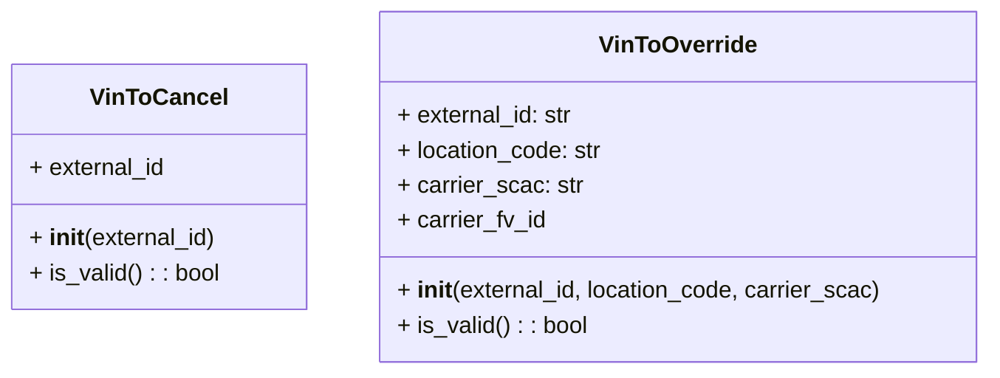

# Diagram: entity_core/entity_service/entity_service/dpu/dpu_service/db/models/admin_tool.py

> Auto-generated by Obscura crawlers

## Mermaid

### SVG

<svg id="container" width="673.375" xmlns="http://www.w3.org/2000/svg" class="classDiagram" height="256" viewBox="0 0 673.375 256" role="graphics-document document" aria-roledescription="class"><g><defs><marker id="container_class-aggregationStart" class="marker aggregation class" refX="18" refY="7" markerWidth="190" markerHeight="240" orient="auto"><path d="M 18,7 L9,13 L1,7 L9,1 Z"></path></marker></defs><defs><marker id="container_class-aggregationEnd" class="marker aggregation class" refX="1" refY="7" markerWidth="20" markerHeight="28" orient="auto"><path d="M 18,7 L9,13 L1,7 L9,1 Z"></path></marker></defs><defs><marker id="container_class-extensionStart" class="marker extension class" refX="18" refY="7" markerWidth="190" markerHeight="240" orient="auto"><path d="M 1,7 L18,13 V 1 Z"></path></marker></defs><defs><marker id="container_class-extensionEnd" class="marker extension class" refX="1" refY="7" markerWidth="20" markerHeight="28" orient="auto"><path d="M 1,1 V 13 L18,7 Z"></path></marker></defs><defs><marker id="container_class-compositionStart" class="marker composition class" refX="18" refY="7" markerWidth="190" markerHeight="240" orient="auto"><path d="M 18,7 L9,13 L1,7 L9,1 Z"></path></marker></defs><defs><marker id="container_class-compositionEnd" class="marker composition class" refX="1" refY="7" markerWidth="20" markerHeight="28" orient="auto"><path d="M 18,7 L9,13 L1,7 L9,1 Z"></path></marker></defs><defs><marker id="container_class-dependencyStart" class="marker dependency class" refX="6" refY="7" markerWidth="190" markerHeight="240" orient="auto"><path d="M 5,7 L9,13 L1,7 L9,1 Z"></path></marker></defs><defs><marker id="container_class-dependencyEnd" class="marker dependency class" refX="13" refY="7" markerWidth="20" markerHeight="28" orient="auto"><path d="M 18,7 L9,13 L14,7 L9,1 Z"></path></marker></defs><defs><marker id="container_class-lollipopStart" class="marker lollipop class" refX="13" refY="7" markerWidth="190" markerHeight="240" orient="auto"><circle stroke="black" fill="transparent" cx="7" cy="7" r="6"></circle></marker></defs><defs><marker id="container_class-lollipopEnd" class="marker lollipop class" refX="1" refY="7" markerWidth="190" markerHeight="240" orient="auto"><circle stroke="black" fill="transparent" cx="7" cy="7" r="6"></circle></marker></defs><g class="root"><g class="clusters"></g><g class="edgePaths"></g><g class="edgeLabels"></g><g class="nodes"><g class="node default" id="classId-VinToCancel-0" transform="translate(107.140625, 128)"><g class="basic label-container"><path d="M-99.140625 -84 L99.140625 -84 L99.140625 84 L-99.140625 84" stroke="none" stroke-width="0" fill="#ECECFF" style=""></path><path d="M-99.140625 -84 C-57.17474075570363 -84, -15.208856511407262 -84, 99.140625 -84 M-99.140625 -84 C-37.21069654604612 -84, 24.719231907907755 -84, 99.140625 -84 M99.140625 -84 C99.140625 -26.969661771452493, 99.140625 30.060676457095013, 99.140625 84 M99.140625 -84 C99.140625 -39.354165354567556, 99.140625 5.291669290864888, 99.140625 84 M99.140625 84 C57.513897470345434 84, 15.887169940690868 84, -99.140625 84 M99.140625 84 C54.33782306208122 84, 9.53502112416244 84, -99.140625 84 M-99.140625 84 C-99.140625 20.1750520525368, -99.140625 -43.6498958949264, -99.140625 -84 M-99.140625 84 C-99.140625 36.4801939892722, -99.140625 -11.039612021455596, -99.140625 -84" stroke="#9370DB" stroke-width="1.3" fill="none" stroke-dasharray="0 0" style=""></path></g><g class="annotation-group text" transform="translate(0, -60)"></g><g class="label-group text" transform="translate(-43.96875, -60)"><g class="label" style="font-weight: bolder" transform="translate(0,-12)"><foreignObject width="87.9375" height="24">

VinToCancel

</foreignObject></g></g><g class="members-group text" transform="translate(-87.140625, -12)"><g class="label" style="" transform="translate(0,-12)"><foreignObject width="94.015625" height="24">

+ external_id

</foreignObject></g></g><g class="methods-group text" transform="translate(-87.140625, 36)"><g class="label" style="" transform="translate(0,-12)"><foreignObject width="128.828125" height="24">

+ <strong>init</strong>(external_id)

</foreignObject></g><g class="label" style="" transform="translate(0,12)"><foreignObject width="130.3125" height="24">

+ is_valid() : : bool

</foreignObject></g></g><g class="divider" style=""><path d="M-99.140625 -36 C-34.77689699267167 -36, 29.586831014656667 -36, 99.140625 -36 M-99.140625 -36 C-48.531835376893156 -36, 2.0769542462136883 -36, 99.140625 -36" stroke="#9370DB" stroke-width="1.3" fill="none" stroke-dasharray="0 0" style=""></path></g><g class="divider" style=""><path d="M-99.140625 12 C-52.25907943713101 12, -5.377533874262014 12, 99.140625 12 M-99.140625 12 C-42.70635849966553 12, 13.727908000668947 12, 99.140625 12" stroke="#9370DB" stroke-width="1.3" fill="none" stroke-dasharray="0 0" style=""></path></g></g><g class="node default" id="classId-VinToOverride-1" transform="translate(460.828125, 128)"><g class="basic label-container"><path d="M-204.546875 -120 L204.546875 -120 L204.546875 120 L-204.546875 120" stroke="none" stroke-width="0" fill="#ECECFF" style=""></path><path d="M-204.546875 -120 C-42.943788534847926 -120, 118.65929793030415 -120, 204.546875 -120 M-204.546875 -120 C-64.05519564389292 -120, 76.43648371221417 -120, 204.546875 -120 M204.546875 -120 C204.546875 -35.53077467984703, 204.546875 48.938450640305945, 204.546875 120 M204.546875 -120 C204.546875 -34.74040679102565, 204.546875 50.5191864179487, 204.546875 120 M204.546875 120 C57.23106184585825 120, -90.0847513082835 120, -204.546875 120 M204.546875 120 C119.07538220863854 120, 33.60388941727709 120, -204.546875 120 M-204.546875 120 C-204.546875 30.071557723457147, -204.546875 -59.856884553085706, -204.546875 -120 M-204.546875 120 C-204.546875 66.1605188171823, -204.546875 12.321037634364572, -204.546875 -120" stroke="#9370DB" stroke-width="1.3" fill="none" stroke-dasharray="0 0" style=""></path></g><g class="annotation-group text" transform="translate(0, -96)"></g><g class="label-group text" transform="translate(-51.859375, -96)"><g class="label" style="font-weight: bolder" transform="translate(0,-12)"><foreignObject width="103.71875" height="24">

VinToOverride

</foreignObject></g></g><g class="members-group text" transform="translate(-192.546875, -48)"><g class="label" style="" transform="translate(0,-12)"><foreignObject width="121.515625" height="24">

+ external_id: str

</foreignObject></g><g class="label" style="" transform="translate(0,12)"><foreignObject width="141.84375" height="24">

+ location_code: str

</foreignObject></g><g class="label" style="" transform="translate(0,36)"><foreignObject width="126.109375" height="24">

+ carrier_scac: str

</foreignObject></g><g class="label" style="" transform="translate(0,60)"><foreignObject width="102.0625" height="24">

+ carrier_fv_id

</foreignObject></g></g><g class="methods-group text" transform="translate(-192.546875, 72)"><g class="label" style="" transform="translate(0,-12)"><foreignObject width="333.234375" height="24">

+ <strong>init</strong>(external_id, location_code, carrier_scac)

</foreignObject></g><g class="label" style="" transform="translate(0,12)"><foreignObject width="130.3125" height="24">

+ is_valid() : : bool

</foreignObject></g></g><g class="divider" style=""><path d="M-204.546875 -72 C-104.62370521048493 -72, -4.700535420969857 -72, 204.546875 -72 M-204.546875 -72 C-116.92091331615494 -72, -29.294951632309875 -72, 204.546875 -72" stroke="#9370DB" stroke-width="1.3" fill="none" stroke-dasharray="0 0" style=""></path></g><g class="divider" style=""><path d="M-204.546875 48 C-106.06757045297098 48, -7.588265905941967 48, 204.546875 48 M-204.546875 48 C-105.60888139495987 48, -6.670887789919732 48, 204.546875 48" stroke="#9370DB" stroke-width="1.3" fill="none" stroke-dasharray="0 0" style=""></path></g></g></g></g></g></svg>
