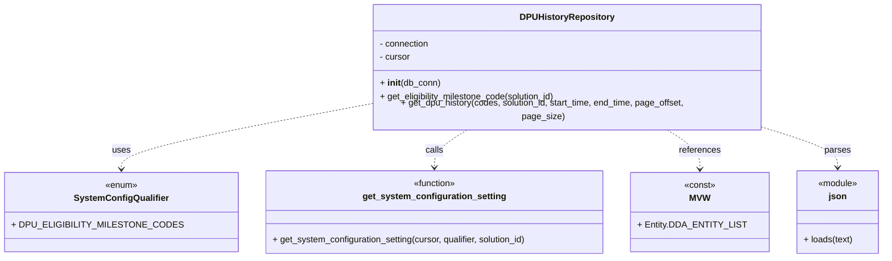
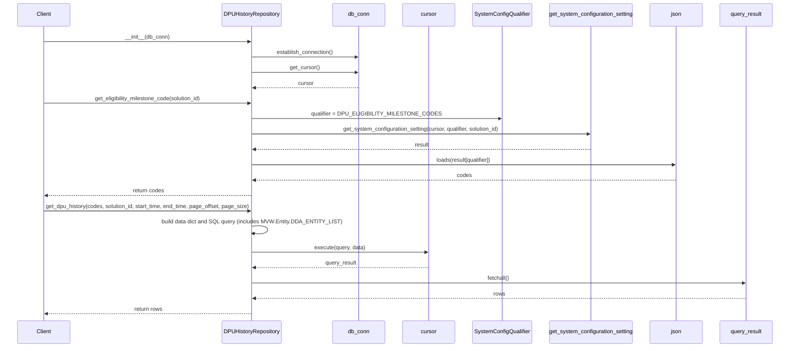

# Diagram: entity_core/entity_service/entity_service/dpu/dpu_service/db/repositories/dpu_state_change_history_repository.py

> Auto-generated by Obscura crawlers

## Diagram 1

### SVG

<svg id="container" width="1544.046875" xmlns="http://www.w3.org/2000/svg" class="classDiagram" height="456" viewBox="0 0 1544.046875 456" role="graphics-document document" aria-roledescription="class"><g><defs><marker id="container_class-aggregationStart" class="marker aggregation class" refX="18" refY="7" markerWidth="190" markerHeight="240" orient="auto"><path d="M 18,7 L9,13 L1,7 L9,1 Z"></path></marker></defs><defs><marker id="container_class-aggregationEnd" class="marker aggregation class" refX="1" refY="7" markerWidth="20" markerHeight="28" orient="auto"><path d="M 18,7 L9,13 L1,7 L9,1 Z"></path></marker></defs><defs><marker id="container_class-extensionStart" class="marker extension class" refX="18" refY="7" markerWidth="190" markerHeight="240" orient="auto"><path d="M 1,7 L18,13 V 1 Z"></path></marker></defs><defs><marker id="container_class-extensionEnd" class="marker extension class" refX="1" refY="7" markerWidth="20" markerHeight="28" orient="auto"><path d="M 1,1 V 13 L18,7 Z"></path></marker></defs><defs><marker id="container_class-compositionStart" class="marker composition class" refX="18" refY="7" markerWidth="190" markerHeight="240" orient="auto"><path d="M 18,7 L9,13 L1,7 L9,1 Z"></path></marker></defs><defs><marker id="container_class-compositionEnd" class="marker composition class" refX="1" refY="7" markerWidth="20" markerHeight="28" orient="auto"><path d="M 18,7 L9,13 L1,7 L9,1 Z"></path></marker></defs><defs><marker id="container_class-dependencyStart" class="marker dependency class" refX="6" refY="7" markerWidth="190" markerHeight="240" orient="auto"><path d="M 5,7 L9,13 L1,7 L9,1 Z"></path></marker></defs><defs><marker id="container_class-dependencyEnd" class="marker dependency class" refX="13" refY="7" markerWidth="20" markerHeight="28" orient="auto"><path d="M 18,7 L9,13 L14,7 L9,1 Z"></path></marker></defs><defs><marker id="container_class-lollipopStart" class="marker lollipop class" refX="13" refY="7" markerWidth="190" markerHeight="240" orient="auto"><circle stroke="black" fill="transparent" cx="7" cy="7" r="6"></circle></marker></defs><defs><marker id="container_class-lollipopEnd" class="marker lollipop class" refX="1" refY="7" markerWidth="190" markerHeight="240" orient="auto"><circle stroke="black" fill="transparent" cx="7" cy="7" r="6"></circle></marker></defs><g class="root"><g class="clusters"></g><g class="edgePaths"><path d="M627.445,181.404L555.662,194.67C483.879,207.936,340.313,234.468,268.529,253.401C196.746,272.333,196.746,283.667,196.746,289.333L196.746,295" id="id_DPUHistoryRepository_SystemConfigQualifier_1" class="edge-thickness-normal edge-pattern-dashed relation" style=";;;" data-edge="true" data-et="edge" data-id="id_DPUHistoryRepository_SystemConfigQualifier_1" data-points="W3sieCI6NjI3LjQ0NTMxMjUsInkiOjE4MS40MDQwODk0MzU4NzI5Mn0seyJ4IjoxOTYuNzQ2MDkzNzUsInkiOjI2MX0seyJ4IjoxOTYuNzQ2MDkzNzUsInkiOjMwMX1d" marker-end="url(#container_class-dependencyEnd)"></path><path d="M804.423,224L794.321,230.167C784.218,236.333,764.013,248.667,753.911,260C743.809,271.333,743.809,281.667,743.809,286.833L743.809,292" id="id_DPUHistoryRepository_get_system_configuration_setting_2" class="edge-thickness-normal edge-pattern-dashed relation" style=";;;" data-edge="true" data-et="edge" data-id="id_DPUHistoryRepository_get_system_configuration_setting_2" data-points="W3sieCI6ODA0LjQyMzAwNjQ2NTUxNzIsInkiOjIyNH0seyJ4Ijo3NDMuODA4NTkzNzUsInkiOjI2MX0seyJ4Ijo3NDMuODA4NTkzNzUsInkiOjI5OH1d" marker-end="url(#container_class-dependencyEnd)"></path><path d="M1158.28,224L1168.383,230.167C1178.485,236.333,1198.69,248.667,1208.792,260.5C1218.895,272.333,1218.895,283.667,1218.895,289.333L1218.895,295" id="id_DPUHistoryRepository_MVW_3" class="edge-thickness-normal edge-pattern-dashed relation" style=";;;" data-edge="true" data-et="edge" data-id="id_DPUHistoryRepository_MVW_3" data-points="W3sieCI6MTE1OC4yODAxMTg1MzQ0ODI5LCJ5IjoyMjR9LHsieCI6MTIxOC44OTQ1MzEyNSwieSI6MjYxfSx7IngiOjEyMTguODk0NTMxMjUsInkiOjMwMX1d" marker-end="url(#container_class-dependencyEnd)"></path><path d="M1335.258,223.02L1356.191,229.35C1377.124,235.68,1418.99,248.34,1439.923,259.837C1460.855,271.333,1460.855,281.667,1460.855,286.833L1460.855,292" id="id_DPUHistoryRepository_json_4" class="edge-thickness-normal edge-pattern-dashed relation" style=";;;" data-edge="true" data-et="edge" data-id="id_DPUHistoryRepository_json_4" data-points="W3sieCI6MTMzNS4yNTc4MTI1LCJ5IjoyMjMuMDE5Nzg3NzAzNzYyODZ9LHsieCI6MTQ2MC44NTU0Njg3NSwieSI6MjYxfSx7IngiOjE0NjAuODU1NDY4NzUsInkiOjI5OH1d" marker-end="url(#container_class-dependencyEnd)"></path></g><g class="edgeLabels"><g class="edgeLabel" transform="translate(196.74609375, 261)"><g class="label" data-id="id_DPUHistoryRepository_SystemConfigQualifier_1" transform="translate(-16.4921875, -12)"><foreignObject width="32.984375" height="24">

uses

</foreignObject></g></g><g class="edgeLabel" transform="translate(743.80859375, 261)"><g class="label" data-id="id_DPUHistoryRepository_get_system_configuration_setting_2" transform="translate(-16.4453125, -12)"><foreignObject width="32.890625" height="24">

calls

</foreignObject></g></g><g class="edgeLabel" transform="translate(1218.89453125, 261)"><g class="label" data-id="id_DPUHistoryRepository_MVW_3" transform="translate(-37.828125, -12)"><foreignObject width="75.65625" height="24">

references

</foreignObject></g></g><g class="edgeLabel" transform="translate(1460.85546875, 261)"><g class="label" data-id="id_DPUHistoryRepository_json_4" transform="translate(-23.828125, -12)"><foreignObject width="47.65625" height="24">

parses

</foreignObject></g></g></g><g class="nodes"><g class="node default" id="classId-DPUHistoryRepository-0" transform="translate(981.3515625, 116)"><g class="basic label-container"><path d="M-353.90625 -108 L353.90625 -108 L353.90625 108 L-353.90625 108" stroke="none" stroke-width="0" fill="#ECECFF" style=""></path><path d="M-353.90625 -108 C-95.31733628857137 -108, 163.27157742285726 -108, 353.90625 -108 M-353.90625 -108 C-201.19613626227752 -108, -48.48602252455504 -108, 353.90625 -108 M353.90625 -108 C353.90625 -42.94789519145546, 353.90625 22.104209617089083, 353.90625 108 M353.90625 -108 C353.90625 -31.634357637278768, 353.90625 44.731284725442464, 353.90625 108 M353.90625 108 C172.54136099135957 108, -8.823528017280864 108, -353.90625 108 M353.90625 108 C88.51614256044184 108, -176.87396487911633 108, -353.90625 108 M-353.90625 108 C-353.90625 42.014968569934666, -353.90625 -23.970062860130668, -353.90625 -108 M-353.90625 108 C-353.90625 56.32040305849308, -353.90625 4.640806116986155, -353.90625 -108" stroke="#9370DB" stroke-width="1.3" fill="none" stroke-dasharray="0 0" style=""></path></g><g class="annotation-group text" transform="translate(0, -84)"></g><g class="label-group text" transform="translate(-81.40625, -84)"><g class="label" style="font-weight: bolder" transform="translate(0,-12)"><foreignObject width="162.8125" height="24">

DPUHistoryRepository

</foreignObject></g></g><g class="members-group text" transform="translate(-341.90625, -36)"><g class="label" style="" transform="translate(0,-12)"><foreignObject width="91.5" height="24">

- connection

</foreignObject></g><g class="label" style="" transform="translate(0,12)"><foreignObject width="56.421875" height="24">

- cursor

</foreignObject></g></g><g class="methods-group text" transform="translate(-341.90625, 36)"><g class="label" style="" transform="translate(0,-12)"><foreignObject width="109.21875" height="24">

+ <strong>init</strong>(db_conn)

</foreignObject></g><g class="label" style="" transform="translate(0,12)"><foreignObject width="325.40625" height="24">

+ get_eligibility_milestone_code(solution_id)

</foreignObject></g><g class="label" style="" transform="translate(0,36)"><foreignObject width="602.40625" height="24">

+ get_dpu_history(codes, solution_id, start_time, end_time, page_offset, page_size)

</foreignObject></g></g><g class="divider" style=""><path d="M-353.90625 -60 C-149.4882860518508 -60, 54.929677896298415 -60, 353.90625 -60 M-353.90625 -60 C-157.5592721832731 -60, 38.78770563345381 -60, 353.90625 -60" stroke="#9370DB" stroke-width="1.3" fill="none" stroke-dasharray="0 0" style=""></path></g><g class="divider" style=""><path d="M-353.90625 12 C-159.60825377219876 12, 34.68974245560247 12, 353.90625 12 M-353.90625 12 C-127.93640522395782 12, 98.03343955208436 12, 353.90625 12" stroke="#9370DB" stroke-width="1.3" fill="none" stroke-dasharray="0 0" style=""></path></g></g><g class="node default" id="classId-SystemConfigQualifier-1" transform="translate(196.74609375, 373)"><g class="basic label-container"><path d="M-188.74609375 -72 L188.74609375 -72 L188.74609375 72 L-188.74609375 72" stroke="none" stroke-width="0" fill="#ECECFF" style=""></path><path d="M-188.74609375 -72 C-44.883221516843605 -72, 98.97965071631279 -72, 188.74609375 -72 M-188.74609375 -72 C-76.07419039736011 -72, 36.597712955279775 -72, 188.74609375 -72 M188.74609375 -72 C188.74609375 -38.148467813082235, 188.74609375 -4.296935626164469, 188.74609375 72 M188.74609375 -72 C188.74609375 -35.60635283321027, 188.74609375 0.7872943335794531, 188.74609375 72 M188.74609375 72 C57.94651039948951 72, -72.85307295102098 72, -188.74609375 72 M188.74609375 72 C65.20403671895387 72, -58.338020312092254 72, -188.74609375 72 M-188.74609375 72 C-188.74609375 39.99910443820731, -188.74609375 7.998208876414623, -188.74609375 -72 M-188.74609375 72 C-188.74609375 18.403887097831742, -188.74609375 -35.192225804336516, -188.74609375 -72" stroke="#9370DB" stroke-width="1.3" fill="none" stroke-dasharray="0 0" style=""></path></g><g class="annotation-group text" transform="translate(-29.53125, -48)"><g class="label" style="" transform="translate(0,-12)"><foreignObject width="59.0625" height="24">

«enum»

</foreignObject></g></g><g class="label-group text" transform="translate(-80.9296875, -24)"><g class="label" style="font-weight: bolder" transform="translate(0,-12)"><foreignObject width="161.859375" height="24">

SystemConfigQualifier

</foreignObject></g></g><g class="members-group text" transform="translate(-176.74609375, 24)"><g class="label" style="" transform="translate(0,-12)"><foreignObject width="272.5625" height="24">

+ DPU_ELIGIBILITY_MILESTONE_CODES

</foreignObject></g></g><g class="methods-group text" transform="translate(-176.74609375, 72)"></g><g class="divider" style=""><path d="M-188.74609375 0 C-84.60395443342648 0, 19.53818488314704 0, 188.74609375 0 M-188.74609375 0 C-50.10465244210738 0, 88.53678886578524 0, 188.74609375 0" stroke="#9370DB" stroke-width="1.3" fill="none" stroke-dasharray="0 0" style=""></path></g><g class="divider" style=""><path d="M-188.74609375 48 C-55.632216657987414 48, 77.48166043402517 48, 188.74609375 48 M-188.74609375 48 C-99.81632836727005 48, -10.886562984540092 48, 188.74609375 48" stroke="#9370DB" stroke-width="1.3" fill="none" stroke-dasharray="0 0" style=""></path></g></g><g class="node default" id="classId-get_system_configuration_setting-2" transform="translate(743.80859375, 373)"><g class="basic label-container"><path d="M-308.31640625 -75 L308.31640625 -75 L308.31640625 75 L-308.31640625 75" stroke="none" stroke-width="0" fill="#ECECFF" style=""></path><path d="M-308.31640625 -75 C-110.34842113859628 -75, 87.61956397280744 -75, 308.31640625 -75 M-308.31640625 -75 C-116.1280133525066 -75, 76.0603795449868 -75, 308.31640625 -75 M308.31640625 -75 C308.31640625 -15.587531705122196, 308.31640625 43.82493658975561, 308.31640625 75 M308.31640625 -75 C308.31640625 -40.81825512980381, 308.31640625 -6.636510259607618, 308.31640625 75 M308.31640625 75 C77.29220088412748 75, -153.73200448174504 75, -308.31640625 75 M308.31640625 75 C123.65463904813114 75, -61.00712815373771 75, -308.31640625 75 M-308.31640625 75 C-308.31640625 17.287751743100394, -308.31640625 -40.42449651379921, -308.31640625 -75 M-308.31640625 75 C-308.31640625 35.98769493322644, -308.31640625 -3.024610133547114, -308.31640625 -75" stroke="#9370DB" stroke-width="1.3" fill="none" stroke-dasharray="0 0" style=""></path></g><g class="annotation-group text" transform="translate(-39.484375, -51)"><g class="label" style="" transform="translate(0,-12)"><foreignObject width="78.96875" height="24">

«function»

</foreignObject></g></g><g class="label-group text" transform="translate(-124.1640625, -27)"><g class="label" style="font-weight: bolder" transform="translate(0,-12)"><foreignObject width="248.328125" height="24">

get_system_configuration_setting

</foreignObject></g></g><g class="members-group text" transform="translate(-296.31640625, 21)"></g><g class="methods-group text" transform="translate(-296.31640625, 51)"><g class="label" style="" transform="translate(0,-12)"><foreignObject width="468.46875" height="24">

+ get_system_configuration_setting(cursor, qualifier, solution_id)

</foreignObject></g></g><g class="divider" style=""><path d="M-308.31640625 -3 C-121.7649367507745 -3, 64.78653274845101 -3, 308.31640625 -3 M-308.31640625 -3 C-91.10674255841855 -3, 126.10292113316291 -3, 308.31640625 -3" stroke="#9370DB" stroke-width="1.3" fill="none" stroke-dasharray="0 0" style=""></path></g><g class="divider" style=""><path d="M-308.31640625 21 C-119.2861622560527 21, 69.74408173789459 21, 308.31640625 21 M-308.31640625 21 C-169.39453547323464 21, -30.47266469646928 21, 308.31640625 21" stroke="#9370DB" stroke-width="1.3" fill="none" stroke-dasharray="0 0" style=""></path></g></g><g class="node default" id="classId-MVW-3" transform="translate(1218.89453125, 373)"><g class="basic label-container"><path d="M-116.76953125 -72 L116.76953125 -72 L116.76953125 72 L-116.76953125 72" stroke="none" stroke-width="0" fill="#ECECFF" style=""></path><path d="M-116.76953125 -72 C-50.903169747777625 -72, 14.96319175444475 -72, 116.76953125 -72 M-116.76953125 -72 C-32.15680299777584 -72, 52.45592525444832 -72, 116.76953125 -72 M116.76953125 -72 C116.76953125 -28.837894983422586, 116.76953125 14.324210033154827, 116.76953125 72 M116.76953125 -72 C116.76953125 -36.745759020989794, 116.76953125 -1.4915180419795888, 116.76953125 72 M116.76953125 72 C32.402795989318946 72, -51.96393927136211 72, -116.76953125 72 M116.76953125 72 C52.73835706352986 72, -11.292817122940278 72, -116.76953125 72 M-116.76953125 72 C-116.76953125 34.22265662725555, -116.76953125 -3.554686745488894, -116.76953125 -72 M-116.76953125 72 C-116.76953125 34.09197192888708, -116.76953125 -3.8160561422258468, -116.76953125 -72" stroke="#9370DB" stroke-width="1.3" fill="none" stroke-dasharray="0 0" style=""></path></g><g class="annotation-group text" transform="translate(-28.6171875, -48)"><g class="label" style="" transform="translate(0,-12)"><foreignObject width="57.234375" height="24">

«const»

</foreignObject></g></g><g class="label-group text" transform="translate(-17.5625, -24)"><g class="label" style="font-weight: bolder" transform="translate(0,-12)"><foreignObject width="35.125" height="24">

MVW

</foreignObject></g></g><g class="members-group text" transform="translate(-104.76953125, 24)"><g class="label" style="" transform="translate(0,-12)"><foreignObject width="180.921875" height="24">

+ Entity.DDA_ENTITY_LIST

</foreignObject></g></g><g class="methods-group text" transform="translate(-104.76953125, 72)"></g><g class="divider" style=""><path d="M-116.76953125 0 C-63.005361125484185 0, -9.24119100096837 0, 116.76953125 0 M-116.76953125 0 C-28.815461248796197 0, 59.138608752407606 0, 116.76953125 0" stroke="#9370DB" stroke-width="1.3" fill="none" stroke-dasharray="0 0" style=""></path></g><g class="divider" style=""><path d="M-116.76953125 48 C-39.648881984807446 48, 37.47176728038511 48, 116.76953125 48 M-116.76953125 48 C-52.92566949110931 48, 10.918192267781379 48, 116.76953125 48" stroke="#9370DB" stroke-width="1.3" fill="none" stroke-dasharray="0 0" style=""></path></g></g><g class="node default" id="classId-json-4" transform="translate(1460.85546875, 373)"><g class="basic label-container"><path d="M-75.19140625 -75 L75.19140625 -75 L75.19140625 75 L-75.19140625 75" stroke="none" stroke-width="0" fill="#ECECFF" style=""></path><path d="M-75.19140625 -75 C-29.041813376129703 -75, 17.107779497740594 -75, 75.19140625 -75 M-75.19140625 -75 C-30.628055632759484 -75, 13.935294984481033 -75, 75.19140625 -75 M75.19140625 -75 C75.19140625 -19.758836367270447, 75.19140625 35.482327265459105, 75.19140625 75 M75.19140625 -75 C75.19140625 -31.64801395796993, 75.19140625 11.70397208406014, 75.19140625 75 M75.19140625 75 C41.97931322821242 75, 8.767220206424838 75, -75.19140625 75 M75.19140625 75 C23.97386519738302 75, -27.24367585523396 75, -75.19140625 75 M-75.19140625 75 C-75.19140625 39.49068688691025, -75.19140625 3.9813737738204935, -75.19140625 -75 M-75.19140625 75 C-75.19140625 33.566623660960396, -75.19140625 -7.866752678079209, -75.19140625 -75" stroke="#9370DB" stroke-width="1.3" fill="none" stroke-dasharray="0 0" style=""></path></g><g class="annotation-group text" transform="translate(-36.6015625, -51)"><g class="label" style="" transform="translate(0,-12)"><foreignObject width="73.203125" height="24">

«module»

</foreignObject></g></g><g class="label-group text" transform="translate(-15.40625, -27)"><g class="label" style="font-weight: bolder" transform="translate(0,-12)"><foreignObject width="30.8125" height="24">

json

</foreignObject></g></g><g class="members-group text" transform="translate(-63.19140625, 21)"></g><g class="methods-group text" transform="translate(-63.19140625, 51)"><g class="label" style="" transform="translate(0,-12)"><foreignObject width="89.78125" height="24">

+ loads(text)

</foreignObject></g></g><g class="divider" style=""><path d="M-75.19140625 -3 C-23.590773048797438 -3, 28.009860152405125 -3, 75.19140625 -3 M-75.19140625 -3 C-17.142423384682232 -3, 40.906559480635536 -3, 75.19140625 -3" stroke="#9370DB" stroke-width="1.3" fill="none" stroke-dasharray="0 0" style=""></path></g><g class="divider" style=""><path d="M-75.19140625 21 C-21.03441059311306 21, 33.12258506377388 21, 75.19140625 21 M-75.19140625 21 C-36.059172761323474 21, 3.0730607273530524 21, 75.19140625 21" stroke="#9370DB" stroke-width="1.3" fill="none" stroke-dasharray="0 0" style=""></path></g></g></g></g></g></svg>

## Diagram 2

### SVG

<svg id="container" width="2365.5" xmlns="http://www.w3.org/2000/svg" height="1065" viewBox="-50 -10 2365.5 1065" role="graphics-document document" aria-roledescription="sequence"><g><rect x="2115.5" y="979" fill="#eaeaea" stroke="#666" width="150" height="65" name="DBResult" rx="3" ry="3" class="actor actor-bottom"></rect><text x="2190.5" y="1011.5" dominant-baseline="central" alignment-baseline="central" class="actor actor-box" style="text-anchor: middle; font-size: 16px; font-weight: 400;"><tspan x="2190.5" dy="0">query_result</tspan></text></g><g><rect x="1915.5" y="979" fill="#eaeaea" stroke="#666" width="150" height="65" name="JSON" rx="3" ry="3" class="actor actor-bottom"></rect><text x="1990.5" y="1011.5" dominant-baseline="central" alignment-baseline="central" class="actor actor-box" style="text-anchor: middle; font-size: 16px; font-weight: 400;"><tspan x="1990.5" dy="0">json</tspan></text></g><g><rect x="1601.5" y="979" fill="#eaeaea" stroke="#666" width="264" height="65" name="Service" rx="3" ry="3" class="actor actor-bottom"></rect><text x="1733.5" y="1011.5" dominant-baseline="central" alignment-baseline="central" class="actor actor-box" style="text-anchor: middle; font-size: 16px; font-weight: 400;"><tspan x="1733.5" dy="0">get_system_configuration_setting</tspan></text></g><g><rect x="1371.5" y="979" fill="#eaeaea" stroke="#666" width="180" height="65" name="Config" rx="3" ry="3" class="actor actor-bottom"></rect><text x="1461.5" y="1011.5" dominant-baseline="central" alignment-baseline="central" class="actor actor-box" style="text-anchor: middle; font-size: 16px; font-weight: 400;"><tspan x="1461.5" dy="0">SystemConfigQualifier</tspan></text></g><g><rect x="1171.5" y="979" fill="#eaeaea" stroke="#666" width="150" height="65" name="Cursor" rx="3" ry="3" class="actor actor-bottom"></rect><text x="1246.5" y="1011.5" dominant-baseline="central" alignment-baseline="central" class="actor actor-box" style="text-anchor: middle; font-size: 16px; font-weight: 400;"><tspan x="1246.5" dy="0">cursor</tspan></text></g><g><rect x="971.5" y="979" fill="#eaeaea" stroke="#666" width="150" height="65" name="DB" rx="3" ry="3" class="actor actor-bottom"></rect><text x="1046.5" y="1011.5" dominant-baseline="central" alignment-baseline="central" class="actor actor-box" style="text-anchor: middle; font-size: 16px; font-weight: 400;"><tspan x="1046.5" dy="0">db_conn</tspan></text></g><g><rect x="645" y="979" fill="#eaeaea" stroke="#666" width="180" height="65" name="Repo" rx="3" ry="3" class="actor actor-bottom"></rect><text x="735" y="1011.5" dominant-baseline="central" alignment-baseline="central" class="actor actor-box" style="text-anchor: middle; font-size: 16px; font-weight: 400;"><tspan x="735" dy="0">DPUHistoryRepository</tspan></text></g><g><rect x="0" y="979" fill="#eaeaea" stroke="#666" width="150" height="65" name="Client" rx="3" ry="3" class="actor actor-bottom"></rect><text x="75" y="1011.5" dominant-baseline="central" alignment-baseline="central" class="actor actor-box" style="text-anchor: middle; font-size: 16px; font-weight: 400;"><tspan x="75" dy="0">Client</tspan></text></g><g><line id="actor7" x1="2190.5" y1="65" x2="2190.5" y2="979" class="actor-line 200" stroke-width="0.5px" stroke="#999" name="DBResult"></line><g id="root-7"><rect x="2115.5" y="0" fill="#eaeaea" stroke="#666" width="150" height="65" name="DBResult" rx="3" ry="3" class="actor actor-top"></rect><text x="2190.5" y="32.5" dominant-baseline="central" alignment-baseline="central" class="actor actor-box" style="text-anchor: middle; font-size: 16px; font-weight: 400;"><tspan x="2190.5" dy="0">query_result</tspan></text></g></g><g><line id="actor6" x1="1990.5" y1="65" x2="1990.5" y2="979" class="actor-line 200" stroke-width="0.5px" stroke="#999" name="JSON"></line><g id="root-6"><rect x="1915.5" y="0" fill="#eaeaea" stroke="#666" width="150" height="65" name="JSON" rx="3" ry="3" class="actor actor-top"></rect><text x="1990.5" y="32.5" dominant-baseline="central" alignment-baseline="central" class="actor actor-box" style="text-anchor: middle; font-size: 16px; font-weight: 400;"><tspan x="1990.5" dy="0">json</tspan></text></g></g><g><line id="actor5" x1="1733.5" y1="65" x2="1733.5" y2="979" class="actor-line 200" stroke-width="0.5px" stroke="#999" name="Service"></line><g id="root-5"><rect x="1601.5" y="0" fill="#eaeaea" stroke="#666" width="264" height="65" name="Service" rx="3" ry="3" class="actor actor-top"></rect><text x="1733.5" y="32.5" dominant-baseline="central" alignment-baseline="central" class="actor actor-box" style="text-anchor: middle; font-size: 16px; font-weight: 400;"><tspan x="1733.5" dy="0">get_system_configuration_setting</tspan></text></g></g><g><line id="actor4" x1="1461.5" y1="65" x2="1461.5" y2="979" class="actor-line 200" stroke-width="0.5px" stroke="#999" name="Config"></line><g id="root-4"><rect x="1371.5" y="0" fill="#eaeaea" stroke="#666" width="180" height="65" name="Config" rx="3" ry="3" class="actor actor-top"></rect><text x="1461.5" y="32.5" dominant-baseline="central" alignment-baseline="central" class="actor actor-box" style="text-anchor: middle; font-size: 16px; font-weight: 400;"><tspan x="1461.5" dy="0">SystemConfigQualifier</tspan></text></g></g><g><line id="actor3" x1="1246.5" y1="65" x2="1246.5" y2="979" class="actor-line 200" stroke-width="0.5px" stroke="#999" name="Cursor"></line><g id="root-3"><rect x="1171.5" y="0" fill="#eaeaea" stroke="#666" width="150" height="65" name="Cursor" rx="3" ry="3" class="actor actor-top"></rect><text x="1246.5" y="32.5" dominant-baseline="central" alignment-baseline="central" class="actor actor-box" style="text-anchor: middle; font-size: 16px; font-weight: 400;"><tspan x="1246.5" dy="0">cursor</tspan></text></g></g><g><line id="actor2" x1="1046.5" y1="65" x2="1046.5" y2="979" class="actor-line 200" stroke-width="0.5px" stroke="#999" name="DB"></line><g id="root-2"><rect x="971.5" y="0" fill="#eaeaea" stroke="#666" width="150" height="65" name="DB" rx="3" ry="3" class="actor actor-top"></rect><text x="1046.5" y="32.5" dominant-baseline="central" alignment-baseline="central" class="actor actor-box" style="text-anchor: middle; font-size: 16px; font-weight: 400;"><tspan x="1046.5" dy="0">db_conn</tspan></text></g></g><g><line id="actor1" x1="735" y1="65" x2="735" y2="979" class="actor-line 200" stroke-width="0.5px" stroke="#999" name="Repo"></line><g id="root-1"><rect x="645" y="0" fill="#eaeaea" stroke="#666" width="180" height="65" name="Repo" rx="3" ry="3" class="actor actor-top"></rect><text x="735" y="32.5" dominant-baseline="central" alignment-baseline="central" class="actor actor-box" style="text-anchor: middle; font-size: 16px; font-weight: 400;"><tspan x="735" dy="0">DPUHistoryRepository</tspan></text></g></g><g><line id="actor0" x1="75" y1="65" x2="75" y2="979" class="actor-line 200" stroke-width="0.5px" stroke="#999" name="Client"></line><g id="root-0"><rect x="0" y="0" fill="#eaeaea" stroke="#666" width="150" height="65" name="Client" rx="3" ry="3" class="actor actor-top"></rect><text x="75" y="32.5" dominant-baseline="central" alignment-baseline="central" class="actor actor-box" style="text-anchor: middle; font-size: 16px; font-weight: 400;"><tspan x="75" dy="0">Client</tspan></text></g></g><g></g><defs><symbol id="computer" width="24" height="24"><path transform="scale(.5)" d="M2 2v13h20v-13h-20zm18 11h-16v-9h16v9zm-10.228 6l.466-1h3.524l.467 1h-4.457zm14.228 3h-24l2-6h2.104l-1.33 4h18.45l-1.297-4h2.073l2 6zm-5-10h-14v-7h14v7z"></path></symbol></defs><defs><symbol id="database" fill-rule="evenodd" clip-rule="evenodd"><path transform="scale(.5)" d="M12.258.001l.256.004.255.005.253.008.251.01.249.012.247.015.246.016.242.019.241.02.239.023.236.024.233.027.231.028.229.031.225.032.223.034.22.036.217.038.214.04.211.041.208.043.205.045.201.046.198.048.194.05.191.051.187.053.183.054.18.056.175.057.172.059.168.06.163.061.16.063.155.064.15.066.074.033.073.033.071.034.07.034.069.035.068.035.067.035.066.035.064.036.064.036.062.036.06.036.06.037.058.037.058.037.055.038.055.038.053.038.052.038.051.039.05.039.048.039.047.039.045.04.044.04.043.04.041.04.04.041.039.041.037.041.036.041.034.041.033.042.032.042.03.042.029.042.027.042.026.043.024.043.023.043.021.043.02.043.018.044.017.043.015.044.013.044.012.044.011.045.009.044.007.045.006.045.004.045.002.045.001.045v17l-.001.045-.002.045-.004.045-.006.045-.007.045-.009.044-.011.045-.012.044-.013.044-.015.044-.017.043-.018.044-.02.043-.021.043-.023.043-.024.043-.026.043-.027.042-.029.042-.03.042-.032.042-.033.042-.034.041-.036.041-.037.041-.039.041-.04.041-.041.04-.043.04-.044.04-.045.04-.047.039-.048.039-.05.039-.051.039-.052.038-.053.038-.055.038-.055.038-.058.037-.058.037-.06.037-.06.036-.062.036-.064.036-.064.036-.066.035-.067.035-.068.035-.069.035-.07.034-.071.034-.073.033-.074.033-.15.066-.155.064-.16.063-.163.061-.168.06-.172.059-.175.057-.18.056-.183.054-.187.053-.191.051-.194.05-.198.048-.201.046-.205.045-.208.043-.211.041-.214.04-.217.038-.22.036-.223.034-.225.032-.229.031-.231.028-.233.027-.236.024-.239.023-.241.02-.242.019-.246.016-.247.015-.249.012-.251.01-.253.008-.255.005-.256.004-.258.001-.258-.001-.256-.004-.255-.005-.253-.008-.251-.01-.249-.012-.247-.015-.245-.016-.243-.019-.241-.02-.238-.023-.236-.024-.234-.027-.231-.028-.228-.031-.226-.032-.223-.034-.22-.036-.217-.038-.214-.04-.211-.041-.208-.043-.204-.045-.201-.046-.198-.048-.195-.05-.19-.051-.187-.053-.184-.054-.179-.056-.176-.057-.172-.059-.167-.06-.164-.061-.159-.063-.155-.064-.151-.066-.074-.033-.072-.033-.072-.034-.07-.034-.069-.035-.068-.035-.067-.035-.066-.035-.064-.036-.063-.036-.062-.036-.061-.036-.06-.037-.058-.037-.057-.037-.056-.038-.055-.038-.053-.038-.052-.038-.051-.039-.049-.039-.049-.039-.046-.039-.046-.04-.044-.04-.043-.04-.041-.04-.04-.041-.039-.041-.037-.041-.036-.041-.034-.041-.033-.042-.032-.042-.03-.042-.029-.042-.027-.042-.026-.043-.024-.043-.023-.043-.021-.043-.02-.043-.018-.044-.017-.043-.015-.044-.013-.044-.012-.044-.011-.045-.009-.044-.007-.045-.006-.045-.004-.045-.002-.045-.001-.045v-17l.001-.045.002-.045.004-.045.006-.045.007-.045.009-.044.011-.045.012-.044.013-.044.015-.044.017-.043.018-.044.02-.043.021-.043.023-.043.024-.043.026-.043.027-.042.029-.042.03-.042.032-.042.033-.042.034-.041.036-.041.037-.041.039-.041.04-.041.041-.04.043-.04.044-.04.046-.04.046-.039.049-.039.049-.039.051-.039.052-.038.053-.038.055-.038.056-.038.057-.037.058-.037.06-.037.061-.036.062-.036.063-.036.064-.036.066-.035.067-.035.068-.035.069-.035.07-.034.072-.034.072-.033.074-.033.151-.066.155-.064.159-.063.164-.061.167-.06.172-.059.176-.057.179-.056.184-.054.187-.053.19-.051.195-.05.198-.048.201-.046.204-.045.208-.043.211-.041.214-.04.217-.038.22-.036.223-.034.226-.032.228-.031.231-.028.234-.027.236-.024.238-.023.241-.02.243-.019.245-.016.247-.015.249-.012.251-.01.253-.008.255-.005.256-.004.258-.001.258.001zm-9.258 20.499v.01l.001.021.003.021.004.022.005.021.006.022.007.022.009.023.01.022.011.023.012.023.013.023.015.023.016.024.017.023.018.024.019.024.021.024.022.025.023.024.024.025.052.049.056.05.061.051.066.051.07.051.075.051.079.052.084.052.088.052.092.052.097.052.102.051.105.052.11.052.114.051.119.051.123.051.127.05.131.05.135.05.139.048.144.049.147.047.152.047.155.047.16.045.163.045.167.043.171.043.176.041.178.041.183.039.187.039.19.037.194.035.197.035.202.033.204.031.209.03.212.029.216.027.219.025.222.024.226.021.23.02.233.018.236.016.24.015.243.012.246.01.249.008.253.005.256.004.259.001.26-.001.257-.004.254-.005.25-.008.247-.011.244-.012.241-.014.237-.016.233-.018.231-.021.226-.021.224-.024.22-.026.216-.027.212-.028.21-.031.205-.031.202-.034.198-.034.194-.036.191-.037.187-.039.183-.04.179-.04.175-.042.172-.043.168-.044.163-.045.16-.046.155-.046.152-.047.148-.048.143-.049.139-.049.136-.05.131-.05.126-.05.123-.051.118-.052.114-.051.11-.052.106-.052.101-.052.096-.052.092-.052.088-.053.083-.051.079-.052.074-.052.07-.051.065-.051.06-.051.056-.05.051-.05.023-.024.023-.025.021-.024.02-.024.019-.024.018-.024.017-.024.015-.023.014-.024.013-.023.012-.023.01-.023.01-.022.008-.022.006-.022.006-.022.004-.022.004-.021.001-.021.001-.021v-4.127l-.077.055-.08.053-.083.054-.085.053-.087.052-.09.052-.093.051-.095.05-.097.05-.1.049-.102.049-.105.048-.106.047-.109.047-.111.046-.114.045-.115.045-.118.044-.12.043-.122.042-.124.042-.126.041-.128.04-.13.04-.132.038-.134.038-.135.037-.138.037-.139.035-.142.035-.143.034-.144.033-.147.032-.148.031-.15.03-.151.03-.153.029-.154.027-.156.027-.158.026-.159.025-.161.024-.162.023-.163.022-.165.021-.166.02-.167.019-.169.018-.169.017-.171.016-.173.015-.173.014-.175.013-.175.012-.177.011-.178.01-.179.008-.179.008-.181.006-.182.005-.182.004-.184.003-.184.002h-.37l-.184-.002-.184-.003-.182-.004-.182-.005-.181-.006-.179-.008-.179-.008-.178-.01-.176-.011-.176-.012-.175-.013-.173-.014-.172-.015-.171-.016-.17-.017-.169-.018-.167-.019-.166-.02-.165-.021-.163-.022-.162-.023-.161-.024-.159-.025-.157-.026-.156-.027-.155-.027-.153-.029-.151-.03-.15-.03-.148-.031-.146-.032-.145-.033-.143-.034-.141-.035-.14-.035-.137-.037-.136-.037-.134-.038-.132-.038-.13-.04-.128-.04-.126-.041-.124-.042-.122-.042-.12-.044-.117-.043-.116-.045-.113-.045-.112-.046-.109-.047-.106-.047-.105-.048-.102-.049-.1-.049-.097-.05-.095-.05-.093-.052-.09-.051-.087-.052-.085-.053-.083-.054-.08-.054-.077-.054v4.127zm0-5.654v.011l.001.021.003.021.004.021.005.022.006.022.007.022.009.022.01.022.011.023.012.023.013.023.015.024.016.023.017.024.018.024.019.024.021.024.022.024.023.025.024.024.052.05.056.05.061.05.066.051.07.051.075.052.079.051.084.052.088.052.092.052.097.052.102.052.105.052.11.051.114.051.119.052.123.05.127.051.131.05.135.049.139.049.144.048.147.048.152.047.155.046.16.045.163.045.167.044.171.042.176.042.178.04.183.04.187.038.19.037.194.036.197.034.202.033.204.032.209.03.212.028.216.027.219.025.222.024.226.022.23.02.233.018.236.016.24.014.243.012.246.01.249.008.253.006.256.003.259.001.26-.001.257-.003.254-.006.25-.008.247-.01.244-.012.241-.015.237-.016.233-.018.231-.02.226-.022.224-.024.22-.025.216-.027.212-.029.21-.03.205-.032.202-.033.198-.035.194-.036.191-.037.187-.039.183-.039.179-.041.175-.042.172-.043.168-.044.163-.045.16-.045.155-.047.152-.047.148-.048.143-.048.139-.05.136-.049.131-.05.126-.051.123-.051.118-.051.114-.052.11-.052.106-.052.101-.052.096-.052.092-.052.088-.052.083-.052.079-.052.074-.051.07-.052.065-.051.06-.05.056-.051.051-.049.023-.025.023-.024.021-.025.02-.024.019-.024.018-.024.017-.024.015-.023.014-.023.013-.024.012-.022.01-.023.01-.023.008-.022.006-.022.006-.022.004-.021.004-.022.001-.021.001-.021v-4.139l-.077.054-.08.054-.083.054-.085.052-.087.053-.09.051-.093.051-.095.051-.097.05-.1.049-.102.049-.105.048-.106.047-.109.047-.111.046-.114.045-.115.044-.118.044-.12.044-.122.042-.124.042-.126.041-.128.04-.13.039-.132.039-.134.038-.135.037-.138.036-.139.036-.142.035-.143.033-.144.033-.147.033-.148.031-.15.03-.151.03-.153.028-.154.028-.156.027-.158.026-.159.025-.161.024-.162.023-.163.022-.165.021-.166.02-.167.019-.169.018-.169.017-.171.016-.173.015-.173.014-.175.013-.175.012-.177.011-.178.009-.179.009-.179.007-.181.007-.182.005-.182.004-.184.003-.184.002h-.37l-.184-.002-.184-.003-.182-.004-.182-.005-.181-.007-.179-.007-.179-.009-.178-.009-.176-.011-.176-.012-.175-.013-.173-.014-.172-.015-.171-.016-.17-.017-.169-.018-.167-.019-.166-.02-.165-.021-.163-.022-.162-.023-.161-.024-.159-.025-.157-.026-.156-.027-.155-.028-.153-.028-.151-.03-.15-.03-.148-.031-.146-.033-.145-.033-.143-.033-.141-.035-.14-.036-.137-.036-.136-.037-.134-.038-.132-.039-.13-.039-.128-.04-.126-.041-.124-.042-.122-.043-.12-.043-.117-.044-.116-.044-.113-.046-.112-.046-.109-.046-.106-.047-.105-.048-.102-.049-.1-.049-.097-.05-.095-.051-.093-.051-.09-.051-.087-.053-.085-.052-.083-.054-.08-.054-.077-.054v4.139zm0-5.666v.011l.001.02.003.022.004.021.005.022.006.021.007.022.009.023.01.022.011.023.012.023.013.023.015.023.016.024.017.024.018.023.019.024.021.025.022.024.023.024.024.025.052.05.056.05.061.05.066.051.07.051.075.052.079.051.084.052.088.052.092.052.097.052.102.052.105.051.11.052.114.051.119.051.123.051.127.05.131.05.135.05.139.049.144.048.147.048.152.047.155.046.16.045.163.045.167.043.171.043.176.042.178.04.183.04.187.038.19.037.194.036.197.034.202.033.204.032.209.03.212.028.216.027.219.025.222.024.226.021.23.02.233.018.236.017.24.014.243.012.246.01.249.008.253.006.256.003.259.001.26-.001.257-.003.254-.006.25-.008.247-.01.244-.013.241-.014.237-.016.233-.018.231-.02.226-.022.224-.024.22-.025.216-.027.212-.029.21-.03.205-.032.202-.033.198-.035.194-.036.191-.037.187-.039.183-.039.179-.041.175-.042.172-.043.168-.044.163-.045.16-.045.155-.047.152-.047.148-.048.143-.049.139-.049.136-.049.131-.051.126-.05.123-.051.118-.052.114-.051.11-.052.106-.052.101-.052.096-.052.092-.052.088-.052.083-.052.079-.052.074-.052.07-.051.065-.051.06-.051.056-.05.051-.049.023-.025.023-.025.021-.024.02-.024.019-.024.018-.024.017-.024.015-.023.014-.024.013-.023.012-.023.01-.022.01-.023.008-.022.006-.022.006-.022.004-.022.004-.021.001-.021.001-.021v-4.153l-.077.054-.08.054-.083.053-.085.053-.087.053-.09.051-.093.051-.095.051-.097.05-.1.049-.102.048-.105.048-.106.048-.109.046-.111.046-.114.046-.115.044-.118.044-.12.043-.122.043-.124.042-.126.041-.128.04-.13.039-.132.039-.134.038-.135.037-.138.036-.139.036-.142.034-.143.034-.144.033-.147.032-.148.032-.15.03-.151.03-.153.028-.154.028-.156.027-.158.026-.159.024-.161.024-.162.023-.163.023-.165.021-.166.02-.167.019-.169.018-.169.017-.171.016-.173.015-.173.014-.175.013-.175.012-.177.01-.178.01-.179.009-.179.007-.181.006-.182.006-.182.004-.184.003-.184.001-.185.001-.185-.001-.184-.001-.184-.003-.182-.004-.182-.006-.181-.006-.179-.007-.179-.009-.178-.01-.176-.01-.176-.012-.175-.013-.173-.014-.172-.015-.171-.016-.17-.017-.169-.018-.167-.019-.166-.02-.165-.021-.163-.023-.162-.023-.161-.024-.159-.024-.157-.026-.156-.027-.155-.028-.153-.028-.151-.03-.15-.03-.148-.032-.146-.032-.145-.033-.143-.034-.141-.034-.14-.036-.137-.036-.136-.037-.134-.038-.132-.039-.13-.039-.128-.041-.126-.041-.124-.041-.122-.043-.12-.043-.117-.044-.116-.044-.113-.046-.112-.046-.109-.046-.106-.048-.105-.048-.102-.048-.1-.05-.097-.049-.095-.051-.093-.051-.09-.052-.087-.052-.085-.053-.083-.053-.08-.054-.077-.054v4.153zm8.74-8.179l-.257.004-.254.005-.25.008-.247.011-.244.012-.241.014-.237.016-.233.018-.231.021-.226.022-.224.023-.22.026-.216.027-.212.028-.21.031-.205.032-.202.033-.198.034-.194.036-.191.038-.187.038-.183.04-.179.041-.175.042-.172.043-.168.043-.163.045-.16.046-.155.046-.152.048-.148.048-.143.048-.139.049-.136.05-.131.05-.126.051-.123.051-.118.051-.114.052-.11.052-.106.052-.101.052-.096.052-.092.052-.088.052-.083.052-.079.052-.074.051-.07.052-.065.051-.06.05-.056.05-.051.05-.023.025-.023.024-.021.024-.02.025-.019.024-.018.024-.017.023-.015.024-.014.023-.013.023-.012.023-.01.023-.01.022-.008.022-.006.023-.006.021-.004.022-.004.021-.001.021-.001.021.001.021.001.021.004.021.004.022.006.021.006.023.008.022.01.022.01.023.012.023.013.023.014.023.015.024.017.023.018.024.019.024.02.025.021.024.023.024.023.025.051.05.056.05.06.05.065.051.07.052.074.051.079.052.083.052.088.052.092.052.096.052.101.052.106.052.11.052.114.052.118.051.123.051.126.051.131.05.136.05.139.049.143.048.148.048.152.048.155.046.16.046.163.045.168.043.172.043.175.042.179.041.183.04.187.038.191.038.194.036.198.034.202.033.205.032.21.031.212.028.216.027.22.026.224.023.226.022.231.021.233.018.237.016.241.014.244.012.247.011.25.008.254.005.257.004.26.001.26-.001.257-.004.254-.005.25-.008.247-.011.244-.012.241-.014.237-.016.233-.018.231-.021.226-.022.224-.023.22-.026.216-.027.212-.028.21-.031.205-.032.202-.033.198-.034.194-.036.191-.038.187-.038.183-.04.179-.041.175-.042.172-.043.168-.043.163-.045.16-.046.155-.046.152-.048.148-.048.143-.048.139-.049.136-.05.131-.05.126-.051.123-.051.118-.051.114-.052.11-.052.106-.052.101-.052.096-.052.092-.052.088-.052.083-.052.079-.052.074-.051.07-.052.065-.051.06-.05.056-.05.051-.05.023-.025.023-.024.021-.024.02-.025.019-.024.018-.024.017-.023.015-.024.014-.023.013-.023.012-.023.01-.023.01-.022.008-.022.006-.023.006-.021.004-.022.004-.021.001-.021.001-.021-.001-.021-.001-.021-.004-.021-.004-.022-.006-.021-.006-.023-.008-.022-.01-.022-.01-.023-.012-.023-.013-.023-.014-.023-.015-.024-.017-.023-.018-.024-.019-.024-.02-.025-.021-.024-.023-.024-.023-.025-.051-.05-.056-.05-.06-.05-.065-.051-.07-.052-.074-.051-.079-.052-.083-.052-.088-.052-.092-.052-.096-.052-.101-.052-.106-.052-.11-.052-.114-.052-.118-.051-.123-.051-.126-.051-.131-.05-.136-.05-.139-.049-.143-.048-.148-.048-.152-.048-.155-.046-.16-.046-.163-.045-.168-.043-.172-.043-.175-.042-.179-.041-.183-.04-.187-.038-.191-.038-.194-.036-.198-.034-.202-.033-.205-.032-.21-.031-.212-.028-.216-.027-.22-.026-.224-.023-.226-.022-.231-.021-.233-.018-.237-.016-.241-.014-.244-.012-.247-.011-.25-.008-.254-.005-.257-.004-.26-.001-.26.001z"></path></symbol></defs><defs><symbol id="clock" width="24" height="24"><path transform="scale(.5)" d="M12 2c5.514 0 10 4.486 10 10s-4.486 10-10 10-10-4.486-10-10 4.486-10 10-10zm0-2c-6.627 0-12 5.373-12 12s5.373 12 12 12 12-5.373 12-12-5.373-12-12-12zm5.848 12.459c.202.038.202.333.001.372-1.907.361-6.045 1.111-6.547 1.111-.719 0-1.301-.582-1.301-1.301 0-.512.77-5.447 1.125-7.445.034-.192.312-.181.343.014l.985 6.238 5.394 1.011z"></path></symbol></defs><defs><marker id="arrowhead" refX="7.9" refY="5" markerUnits="userSpaceOnUse" markerWidth="12" markerHeight="12" orient="auto-start-reverse"><path d="M -1 0 L 10 5 L 0 10 z"></path></marker></defs><defs><marker id="crosshead" markerWidth="15" markerHeight="8" orient="auto" refX="4" refY="4.5"><path fill="none" stroke="#000000" stroke-width="1pt" d="M 1,2 L 6,7 M 6,2 L 1,7" style="stroke-dasharray: 0, 0;"></path></marker></defs><defs><marker id="filled-head" refX="15.5" refY="7" markerWidth="20" markerHeight="28" orient="auto"><path d="M 18,7 L9,13 L14,7 L9,1 Z"></path></marker></defs><defs><marker id="sequencenumber" refX="15" refY="15" markerWidth="60" markerHeight="40" orient="auto"><circle cx="15" cy="15" r="6"></circle></marker></defs><text x="404" y="80" text-anchor="middle" dominant-baseline="middle" alignment-baseline="middle" class="messageText" dy="1em" style="font-size: 16px; font-weight: 400;">__init__(db_conn)</text><line x1="76" y1="113" x2="731" y2="113" class="messageLine0" stroke-width="2" stroke="none" marker-end="url(#arrowhead)" style="fill: none;"></line><text x="889" y="128" text-anchor="middle" dominant-baseline="middle" alignment-baseline="middle" class="messageText" dy="1em" style="font-size: 16px; font-weight: 400;">establish_connection()</text><line x1="736" y1="161" x2="1042.5" y2="161" class="messageLine0" stroke-width="2" stroke="none" marker-end="url(#arrowhead)" style="fill: none;"></line><text x="889" y="176" text-anchor="middle" dominant-baseline="middle" alignment-baseline="middle" class="messageText" dy="1em" style="font-size: 16px; font-weight: 400;">get_cursor()</text><line x1="736" y1="209" x2="1042.5" y2="209" class="messageLine0" stroke-width="2" stroke="none" marker-end="url(#arrowhead)" style="fill: none;"></line><text x="892" y="224" text-anchor="middle" dominant-baseline="middle" alignment-baseline="middle" class="messageText" dy="1em" style="font-size: 16px; font-weight: 400;">cursor</text><line x1="1045.5" y1="257" x2="739" y2="257" class="messageLine1" stroke-width="2" stroke="none" marker-end="url(#arrowhead)" style="stroke-dasharray: 3, 3; fill: none;"></line><text x="404" y="272" text-anchor="middle" dominant-baseline="middle" alignment-baseline="middle" class="messageText" dy="1em" style="font-size: 16px; font-weight: 400;">get_eligibility_milestone_code(solution_id)</text><line x1="76" y1="305" x2="731" y2="305" class="messageLine0" stroke-width="2" stroke="none" marker-end="url(#arrowhead)" style="fill: none;"></line><text x="1097" y="320" text-anchor="middle" dominant-baseline="middle" alignment-baseline="middle" class="messageText" dy="1em" style="font-size: 16px; font-weight: 400;">qualifier = DPU_ELIGIBILITY_MILESTONE_CODES</text><line x1="736" y1="353" x2="1457.5" y2="353" class="messageLine0" stroke-width="2" stroke="none" marker-end="url(#arrowhead)" style="fill: none;"></line><text x="1233" y="368" text-anchor="middle" dominant-baseline="middle" alignment-baseline="middle" class="messageText" dy="1em" style="font-size: 16px; font-weight: 400;">get_system_configuration_setting(cursor, qualifier, solution_id)</text><line x1="736" y1="401" x2="1729.5" y2="401" class="messageLine0" stroke-width="2" stroke="none" marker-end="url(#arrowhead)" style="fill: none;"></line><text x="1236" y="416" text-anchor="middle" dominant-baseline="middle" alignment-baseline="middle" class="messageText" dy="1em" style="font-size: 16px; font-weight: 400;">result</text><line x1="1732.5" y1="449" x2="739" y2="449" class="messageLine1" stroke-width="2" stroke="none" marker-end="url(#arrowhead)" style="stroke-dasharray: 3, 3; fill: none;"></line><text x="1361" y="464" text-anchor="middle" dominant-baseline="middle" alignment-baseline="middle" class="messageText" dy="1em" style="font-size: 16px; font-weight: 400;">loads(result[qualifier])</text><line x1="736" y1="497" x2="1986.5" y2="497" class="messageLine0" stroke-width="2" stroke="none" marker-end="url(#arrowhead)" style="fill: none;"></line><text x="1364" y="512" text-anchor="middle" dominant-baseline="middle" alignment-baseline="middle" class="messageText" dy="1em" style="font-size: 16px; font-weight: 400;">codes</text><line x1="1989.5" y1="545" x2="739" y2="545" class="messageLine1" stroke-width="2" stroke="none" marker-end="url(#arrowhead)" style="stroke-dasharray: 3, 3; fill: none;"></line><text x="407" y="560" text-anchor="middle" dominant-baseline="middle" alignment-baseline="middle" class="messageText" dy="1em" style="font-size: 16px; font-weight: 400;">return codes</text><line x1="734" y1="593" x2="79" y2="593" class="messageLine1" stroke-width="2" stroke="none" marker-end="url(#arrowhead)" style="stroke-dasharray: 3, 3; fill: none;"></line><text x="404" y="608" text-anchor="middle" dominant-baseline="middle" alignment-baseline="middle" class="messageText" dy="1em" style="font-size: 16px; font-weight: 400;">get_dpu_history(codes, solution_id, start_time, end_time, page_offset, page_size)</text><line x1="76" y1="641" x2="731" y2="641" class="messageLine0" stroke-width="2" stroke="none" marker-end="url(#arrowhead)" style="fill: none;"></line><text x="736" y="656" text-anchor="middle" dominant-baseline="middle" alignment-baseline="middle" class="messageText" dy="1em" style="font-size: 16px; font-weight: 400;">build data dict and SQL query (includes MVW.Entity.DDA_ENTITY_LIST)</text><path d="M 736,689 C 796,679 796,719 736,709" class="messageLine0" stroke-width="2" stroke="none" marker-end="url(#arrowhead)" style="fill: none;"></path><text x="989" y="734" text-anchor="middle" dominant-baseline="middle" alignment-baseline="middle" class="messageText" dy="1em" style="font-size: 16px; font-weight: 400;">execute(query, data)</text><line x1="736" y1="767" x2="1242.5" y2="767" class="messageLine0" stroke-width="2" stroke="none" marker-end="url(#arrowhead)" style="fill: none;"></line><text x="992" y="782" text-anchor="middle" dominant-baseline="middle" alignment-baseline="middle" class="messageText" dy="1em" style="font-size: 16px; font-weight: 400;">query_result</text><line x1="1245.5" y1="815" x2="739" y2="815" class="messageLine1" stroke-width="2" stroke="none" marker-end="url(#arrowhead)" style="stroke-dasharray: 3, 3; fill: none;"></line><text x="1461" y="830" text-anchor="middle" dominant-baseline="middle" alignment-baseline="middle" class="messageText" dy="1em" style="font-size: 16px; font-weight: 400;">fetchall()</text><line x1="736" y1="863" x2="2186.5" y2="863" class="messageLine0" stroke-width="2" stroke="none" marker-end="url(#arrowhead)" style="fill: none;"></line><text x="1464" y="878" text-anchor="middle" dominant-baseline="middle" alignment-baseline="middle" class="messageText" dy="1em" style="font-size: 16px; font-weight: 400;">rows</text><line x1="2189.5" y1="911" x2="739" y2="911" class="messageLine1" stroke-width="2" stroke="none" marker-end="url(#arrowhead)" style="stroke-dasharray: 3, 3; fill: none;"></line><text x="407" y="926" text-anchor="middle" dominant-baseline="middle" alignment-baseline="middle" class="messageText" dy="1em" style="font-size: 16px; font-weight: 400;">return rows</text><line x1="734" y1="959" x2="79" y2="959" class="messageLine1" stroke-width="2" stroke="none" marker-end="url(#arrowhead)" style="stroke-dasharray: 3, 3; fill: none;"></line></svg>
