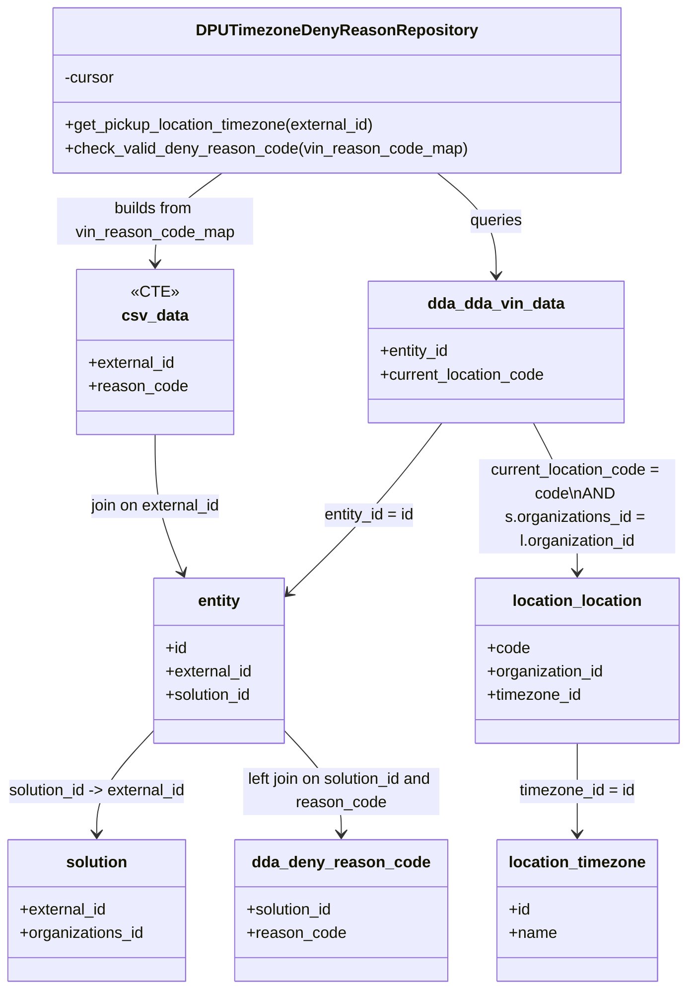

# Diagram: entity_core/entity_service/entity_service/dpu/dpu_service/db/repositories/dpu_timezone_deny_reason_repository.py

> Auto-generated by Obscura crawlers

## Mermaid

### SVG

<svg id="container" width="694.29296875" xmlns="http://www.w3.org/2000/svg" class="classDiagram" height="1006" viewBox="0 0 694.29296875 1006" role="graphics-document document" aria-roledescription="class"><g><defs><marker id="container_class-aggregationStart" class="marker aggregation class" refX="18" refY="7" markerWidth="190" markerHeight="240" orient="auto"><path d="M 18,7 L9,13 L1,7 L9,1 Z"></path></marker></defs><defs><marker id="container_class-aggregationEnd" class="marker aggregation class" refX="1" refY="7" markerWidth="20" markerHeight="28" orient="auto"><path d="M 18,7 L9,13 L1,7 L9,1 Z"></path></marker></defs><defs><marker id="container_class-extensionStart" class="marker extension class" refX="18" refY="7" markerWidth="190" markerHeight="240" orient="auto"><path d="M 1,7 L18,13 V 1 Z"></path></marker></defs><defs><marker id="container_class-extensionEnd" class="marker extension class" refX="1" refY="7" markerWidth="20" markerHeight="28" orient="auto"><path d="M 1,1 V 13 L18,7 Z"></path></marker></defs><defs><marker id="container_class-compositionStart" class="marker composition class" refX="18" refY="7" markerWidth="190" markerHeight="240" orient="auto"><path d="M 18,7 L9,13 L1,7 L9,1 Z"></path></marker></defs><defs><marker id="container_class-compositionEnd" class="marker composition class" refX="1" refY="7" markerWidth="20" markerHeight="28" orient="auto"><path d="M 18,7 L9,13 L1,7 L9,1 Z"></path></marker></defs><defs><marker id="container_class-dependencyStart" class="marker dependency class" refX="6" refY="7" markerWidth="190" markerHeight="240" orient="auto"><path d="M 5,7 L9,13 L1,7 L9,1 Z"></path></marker></defs><defs><marker id="container_class-dependencyEnd" class="marker dependency class" refX="13" refY="7" markerWidth="20" markerHeight="28" orient="auto"><path d="M 18,7 L9,13 L14,7 L9,1 Z"></path></marker></defs><defs><marker id="container_class-lollipopStart" class="marker lollipop class" refX="13" refY="7" markerWidth="190" markerHeight="240" orient="auto"><circle stroke="black" fill="transparent" cx="7" cy="7" r="6"></circle></marker></defs><defs><marker id="container_class-lollipopEnd" class="marker lollipop class" refX="1" refY="7" markerWidth="190" markerHeight="240" orient="auto"><circle stroke="black" fill="transparent" cx="7" cy="7" r="6"></circle></marker></defs><g class="root"><g class="clusters"></g><g class="edgePaths"><path d="M440.758,176L450.38,184.167C460.003,192.333,479.247,208.667,488.87,226C498.492,243.333,498.492,261.667,498.492,270.833L498.492,280" id="id_DPUTimezoneDenyReasonRepository_dda_dda_vin_data_1" class="edge-thickness-normal edge-pattern-solid relation" style=";;;" data-edge="true" data-et="edge" data-id="id_DPUTimezoneDenyReasonRepository_dda_dda_vin_data_1" data-points="W3sieCI6NDQwLjc1ODAxODA5MjEwNTI2LCJ5IjoxNzZ9LHsieCI6NDk4LjQ5MjE4NzUsInkiOjIyNX0seyJ4Ijo0OTguNDkyMTg3NSwieSI6Mjg2fV0=" marker-end="url(#container_class-dependencyEnd)"></path><path d="M444.704,430L434.12,444.167C423.537,458.333,402.37,486.667,377.691,514.955C353.012,543.244,324.821,571.488,310.725,585.61L296.629,599.732" id="id_dda_dda_vin_data_entity_2" class="edge-thickness-normal edge-pattern-solid relation" style=";;;" data-edge="true" data-et="edge" data-id="id_dda_dda_vin_data_entity_2" data-points="W3sieCI6NDQ0LjcwMzU3Mjg1MDMxODUsInkiOjQzMH0seyJ4IjozODEuMjAzMTI1LCJ5Ijo1MTV9LHsieCI6MjkyLjM5MDYyNSwieSI6NjAzLjk3ODUzNzc3NzAwMjN9XQ==" marker-end="url(#container_class-dependencyEnd)"></path><path d="M156.602,745.398L147.413,755.332C138.224,765.265,119.846,785.133,110.658,802.233C101.469,819.333,101.469,833.667,101.469,840.833L101.469,848" id="id_entity_solution_3" class="edge-thickness-normal edge-pattern-solid relation" style=";;;" data-edge="true" data-et="edge" data-id="id_entity_solution_3" data-points="W3sieCI6MTU2LjYwMTU2MjUsInkiOjc0NS4zOTgwOTQ5MzU3MDQxfSx7IngiOjEwMS40Njg3NSwieSI6ODA1fSx7IngiOjEwMS40Njg3NSwieSI6ODU0fV0=" marker-end="url(#container_class-dependencyEnd)"></path><path d="M536.835,430L544.38,444.167C551.924,458.333,567.013,486.667,574.557,512C582.102,537.333,582.102,559.667,582.102,570.833L582.102,582" id="id_dda_dda_vin_data_location_location_4" class="edge-thickness-normal edge-pattern-solid relation" style=";;;" data-edge="true" data-et="edge" data-id="id_dda_dda_vin_data_location_location_4" data-points="W3sieCI6NTM2LjgzNTM0MDM2NjI0MiwieSI6NDMwfSx7IngiOjU4Mi4xMDE1NjI1LCJ5Ijo1MTV9LHsieCI6NTgyLjEwMTU2MjUsInkiOjU4OH1d" marker-end="url(#container_class-dependencyEnd)"></path><path d="M582.102,756L582.102,764.167C582.102,772.333,582.102,788.667,582.102,804C582.102,819.333,582.102,833.667,582.102,840.833L582.102,848" id="id_location_location_location_timezone_5" class="edge-thickness-normal edge-pattern-solid relation" style=";;;" data-edge="true" data-et="edge" data-id="id_location_location_location_timezone_5" data-points="W3sieCI6NTgyLjEwMTU2MjUsInkiOjc1Nn0seyJ4Ijo1ODIuMTAxNTYyNSwieSI6ODA1fSx7IngiOjU4Mi4xMDE1NjI1LCJ5Ijo4NTR9XQ==" marker-end="url(#container_class-dependencyEnd)"></path><path d="M224.896,176L213.532,184.167C202.168,192.333,179.439,208.667,168.075,224C156.711,239.333,156.711,253.667,156.711,260.833L156.711,268" id="id_DPUTimezoneDenyReasonRepository_csv_data_6" class="edge-thickness-normal edge-pattern-solid relation" style=";;;" data-edge="true" data-et="edge" data-id="id_DPUTimezoneDenyReasonRepository_csv_data_6" data-points="W3sieCI6MjI0Ljg5NjE3NTk4Njg0MjEsInkiOjE3Nn0seyJ4IjoxNTYuNzEwOTM3NSwieSI6MjI1fSx7IngiOjE1Ni43MTA5Mzc1LCJ5IjoyNzR9XQ==" marker-end="url(#container_class-dependencyEnd)"></path><path d="M156.711,442L156.711,454.167C156.711,466.333,156.711,490.667,161.568,514.082C166.424,537.497,176.137,559.994,180.994,571.243L185.851,582.491" id="id_csv_data_entity_7" class="edge-thickness-normal edge-pattern-solid relation" style=";;;" data-edge="true" data-et="edge" data-id="id_csv_data_entity_7" data-points="W3sieCI6MTU2LjcxMDkzNzUsInkiOjQ0Mn0seyJ4IjoxNTYuNzEwOTM3NSwieSI6NTE1fSx7IngiOjE4OC4yMjg4NzYzOTMzMTIxLCJ5Ijo1ODh9XQ==" marker-end="url(#container_class-dependencyEnd)"></path><path d="M292.391,745.398L301.579,755.332C310.768,765.265,329.146,785.133,338.335,802.233C347.523,819.333,347.523,833.667,347.523,840.833L347.523,848" id="id_entity_dda_deny_reason_code_8" class="edge-thickness-normal edge-pattern-solid relation" style=";;;" data-edge="true" data-et="edge" data-id="id_entity_dda_deny_reason_code_8" data-points="W3sieCI6MjkyLjM5MDYyNSwieSI6NzQ1LjM5ODA5NDkzNTcwNDF9LHsieCI6MzQ3LjUyMzQzNzUsInkiOjgwNX0seyJ4IjozNDcuNTIzNDM3NSwieSI6ODU0fV0=" marker-end="url(#container_class-dependencyEnd)"></path></g><g class="edgeLabels"><g class="edgeLabel" transform="translate(498.4921875, 225)"><g class="label" data-id="id_DPUTimezoneDenyReasonRepository_dda_dda_vin_data_1" transform="translate(-27.2421875, -12)"><foreignObject width="54.484375" height="24">

queries

</foreignObject></g></g><g class="edgeLabel" transform="translate(381.203125, 515)"><g class="label" data-id="id_dda_dda_vin_data_entity_2" transform="translate(-47.21875, -12)"><foreignObject width="94.4375" height="24">

entity_id = id

</foreignObject></g></g><g class="edgeLabel" transform="translate(101.46875, 805)"><g class="label" data-id="id_entity_solution_3" transform="translate(-93.46875, -12)"><foreignObject width="186.9375" height="24">

solution_id -&gt; external_id

</foreignObject></g></g><g class="edgeLabel" transform="translate(582.1015625, 515)"><g class="label" data-id="id_dda_dda_vin_data_location_location_4" transform="translate(-100, -48)"><foreignObject width="200" height="96">

current_location_code = code\nAND s.organizations_id = l.organization_id

</foreignObject></g></g><g class="edgeLabel" transform="translate(582.1015625, 805)"><g class="label" data-id="id_location_location_location_timezone_5" transform="translate(-59.7890625, -12)"><foreignObject width="119.578125" height="24">

timezone_id = id

</foreignObject></g></g><g class="edgeLabel" transform="translate(156.7109375, 225)"><g class="label" data-id="id_DPUTimezoneDenyReasonRepository_csv_data_6" transform="translate(-100, -24)"><foreignObject width="200" height="48">

builds from vin_reason_code_map

</foreignObject></g></g><g class="edgeLabel" transform="translate(156.7109375, 515)"><g class="label" data-id="id_csv_data_entity_7" transform="translate(-68.3515625, -12)"><foreignObject width="136.703125" height="24">

join on external_id

</foreignObject></g></g><g class="edgeLabel" transform="translate(347.5234375, 805)"><g class="label" data-id="id_entity_dda_deny_reason_code_8" transform="translate(-100, -24)"><foreignObject width="200" height="48">

left join on solution_id and reason_code

</foreignObject></g></g></g><g class="nodes"><g class="node default" id="classId-DPUTimezoneDenyReasonRepository-0" transform="translate(341.78515625, 92)"><g class="basic label-container"><path d="M-283.39453125 -84 L283.39453125 -84 L283.39453125 84 L-283.39453125 84" stroke="none" stroke-width="0" fill="#ECECFF" style=""></path><path d="M-283.39453125 -84 C-164.1124698528414 -84, -44.8304084556828 -84, 283.39453125 -84 M-283.39453125 -84 C-69.39640714429328 -84, 144.60171696141344 -84, 283.39453125 -84 M283.39453125 -84 C283.39453125 -31.988247786029845, 283.39453125 20.02350442794031, 283.39453125 84 M283.39453125 -84 C283.39453125 -48.220113596467165, 283.39453125 -12.44022719293433, 283.39453125 84 M283.39453125 84 C115.6671035535465 84, -52.06032414290701 84, -283.39453125 84 M283.39453125 84 C80.41568299656359 84, -122.56316525687282 84, -283.39453125 84 M-283.39453125 84 C-283.39453125 18.40812114418793, -283.39453125 -47.18375771162414, -283.39453125 -84 M-283.39453125 84 C-283.39453125 27.746895543115528, -283.39453125 -28.506208913768944, -283.39453125 -84" stroke="#9370DB" stroke-width="1.3" fill="none" stroke-dasharray="0 0" style=""></path></g><g class="annotation-group text" transform="translate(0, -60)"></g><g class="label-group text" transform="translate(-134.9140625, -60)"><g class="label" style="font-weight: bolder" transform="translate(0,-12)"><foreignObject width="269.828125" height="24">

DPUTimezoneDenyReasonRepository

</foreignObject></g></g><g class="members-group text" transform="translate(-271.39453125, -12)"><g class="label" style="" transform="translate(0,-12)"><foreignObject width="52.1875" height="24">

-cursor

</foreignObject></g></g><g class="methods-group text" transform="translate(-271.39453125, 36)"><g class="label" style="" transform="translate(0,-12)"><foreignObject width="321.5" height="24">

+get_pickup_location_timezone(external_id)

</foreignObject></g><g class="label" style="" transform="translate(0,12)"><foreignObject width="407.875" height="24">

+check_valid_deny_reason_code(vin_reason_code_map)

</foreignObject></g></g><g class="divider" style=""><path d="M-283.39453125 -36 C-110.74479117657401 -36, 61.90494889685198 -36, 283.39453125 -36 M-283.39453125 -36 C-103.45587912398545 -36, 76.48277300202909 -36, 283.39453125 -36" stroke="#9370DB" stroke-width="1.3" fill="none" stroke-dasharray="0 0" style=""></path></g><g class="divider" style=""><path d="M-283.39453125 12 C-148.00011077894115 12, -12.605690307882298 12, 283.39453125 12 M-283.39453125 12 C-131.10887336490177 12, 21.176784520196463 12, 283.39453125 12" stroke="#9370DB" stroke-width="1.3" fill="none" stroke-dasharray="0 0" style=""></path></g></g><g class="node default" id="classId-csv_data-1" transform="translate(156.7109375, 358)"><g class="basic label-container"><path d="M-77.953125 -84 L77.953125 -84 L77.953125 84 L-77.953125 84" stroke="none" stroke-width="0" fill="#ECECFF" style=""></path><path d="M-77.953125 -84 C-34.96702000321747 -84, 8.019084993565059 -84, 77.953125 -84 M-77.953125 -84 C-19.398595235138657 -84, 39.155934529722686 -84, 77.953125 -84 M77.953125 -84 C77.953125 -34.18920368693628, 77.953125 15.621592626127438, 77.953125 84 M77.953125 -84 C77.953125 -37.001516380934234, 77.953125 9.996967238131532, 77.953125 84 M77.953125 84 C17.63683275382774 84, -42.67945949234452 84, -77.953125 84 M77.953125 84 C26.79934889655565 84, -24.3544272068887 84, -77.953125 84 M-77.953125 84 C-77.953125 49.93388823612023, -77.953125 15.867776472240465, -77.953125 -84 M-77.953125 84 C-77.953125 43.114933613503034, -77.953125 2.2298672270060678, -77.953125 -84" stroke="#9370DB" stroke-width="1.3" fill="none" stroke-dasharray="0 0" style=""></path></g><g class="annotation-group text" transform="translate(-21.9453125, -60)"><g class="label" style="" transform="translate(0,-12)"><foreignObject width="43.890625" height="24">

«CTE»

</foreignObject></g></g><g class="label-group text" transform="translate(-31.96875, -36)"><g class="label" style="font-weight: bolder" transform="translate(0,-12)"><foreignObject width="63.9375" height="24">

csv_data

</foreignObject></g></g><g class="members-group text" transform="translate(-65.953125, 12)"><g class="label" style="" transform="translate(0,-12)"><foreignObject width="89.765625" height="24">

+external_id

</foreignObject></g><g class="label" style="" transform="translate(0,12)"><foreignObject width="99.9375" height="24">

+reason_code

</foreignObject></g></g><g class="methods-group text" transform="translate(-65.953125, 84)"></g><g class="divider" style=""><path d="M-77.953125 -12 C-29.789466996296092 -12, 18.374191007407816 -12, 77.953125 -12 M-77.953125 -12 C-46.75351050476104 -12, -15.553896009522077 -12, 77.953125 -12" stroke="#9370DB" stroke-width="1.3" fill="none" stroke-dasharray="0 0" style=""></path></g><g class="divider" style=""><path d="M-77.953125 60 C-46.413186827297125 60, -14.87324865459425 60, 77.953125 60 M-77.953125 60 C-25.057133373394322 60, 27.838858253211356 60, 77.953125 60" stroke="#9370DB" stroke-width="1.3" fill="none" stroke-dasharray="0 0" style=""></path></g></g><g class="node default" id="classId-dda_dda_vin_data-2" transform="translate(498.4921875, 358)"><g class="basic label-container"><path d="M-131.12109375 -72 L131.12109375 -72 L131.12109375 72 L-131.12109375 72" stroke="none" stroke-width="0" fill="#ECECFF" style=""></path><path d="M-131.12109375 -72 C-32.53097196002432 -72, 66.05914982995137 -72, 131.12109375 -72 M-131.12109375 -72 C-38.6766016227742 -72, 53.7678905044516 -72, 131.12109375 -72 M131.12109375 -72 C131.12109375 -27.09244314821423, 131.12109375 17.81511370357154, 131.12109375 72 M131.12109375 -72 C131.12109375 -19.519709311819305, 131.12109375 32.96058137636139, 131.12109375 72 M131.12109375 72 C72.4143999059132 72, 13.707706061826386 72, -131.12109375 72 M131.12109375 72 C40.74963550144088 72, -49.621822747118244 72, -131.12109375 72 M-131.12109375 72 C-131.12109375 25.320913284639843, -131.12109375 -21.358173430720313, -131.12109375 -72 M-131.12109375 72 C-131.12109375 36.539096269585926, -131.12109375 1.0781925391718516, -131.12109375 -72" stroke="#9370DB" stroke-width="1.3" fill="none" stroke-dasharray="0 0" style=""></path></g><g class="annotation-group text" transform="translate(0, -48)"></g><g class="label-group text" transform="translate(-67.4296875, -48)"><g class="label" style="font-weight: bolder" transform="translate(0,-12)"><foreignObject width="134.859375" height="24">

dda_dda_vin_data

</foreignObject></g></g><g class="members-group text" transform="translate(-119.12109375, 0)"><g class="label" style="" transform="translate(0,-12)"><foreignObject width="71.859375" height="24">

+entity_id

</foreignObject></g><g class="label" style="" transform="translate(0,12)"><foreignObject width="170.8125" height="24">

+current_location_code

</foreignObject></g></g><g class="methods-group text" transform="translate(-119.12109375, 72)"></g><g class="divider" style=""><path d="M-131.12109375 -24 C-74.63786578051341 -24, -18.154637811026817 -24, 131.12109375 -24 M-131.12109375 -24 C-37.191631059546864 -24, 56.73783163090627 -24, 131.12109375 -24" stroke="#9370DB" stroke-width="1.3" fill="none" stroke-dasharray="0 0" style=""></path></g><g class="divider" style=""><path d="M-131.12109375 48 C-71.14062791776341 48, -11.16016208552682 48, 131.12109375 48 M-131.12109375 48 C-77.8943250660724 48, -24.667556382144795 48, 131.12109375 48" stroke="#9370DB" stroke-width="1.3" fill="none" stroke-dasharray="0 0" style=""></path></g></g><g class="node default" id="classId-entity-3" transform="translate(224.49609375, 672)"><g class="basic label-container"><path d="M-67.89453125 -84 L67.89453125 -84 L67.89453125 84 L-67.89453125 84" stroke="none" stroke-width="0" fill="#ECECFF" style=""></path><path d="M-67.89453125 -84 C-38.79863844664423 -84, -9.702745643288466 -84, 67.89453125 -84 M-67.89453125 -84 C-35.72959807953534 -84, -3.564664909070686 -84, 67.89453125 -84 M67.89453125 -84 C67.89453125 -50.334960396418225, 67.89453125 -16.66992079283645, 67.89453125 84 M67.89453125 -84 C67.89453125 -18.444656892299307, 67.89453125 47.11068621540139, 67.89453125 84 M67.89453125 84 C21.263121541343274 84, -25.36828816731345 84, -67.89453125 84 M67.89453125 84 C33.28057046257687 84, -1.3333903248462633 84, -67.89453125 84 M-67.89453125 84 C-67.89453125 36.35063318691236, -67.89453125 -11.298733626175277, -67.89453125 -84 M-67.89453125 84 C-67.89453125 45.97653614859846, -67.89453125 7.953072297196925, -67.89453125 -84" stroke="#9370DB" stroke-width="1.3" fill="none" stroke-dasharray="0 0" style=""></path></g><g class="annotation-group text" transform="translate(0, -60)"></g><g class="label-group text" transform="translate(-21.5703125, -60)"><g class="label" style="font-weight: bolder" transform="translate(0,-12)"><foreignObject width="43.140625" height="24">

entity

</foreignObject></g></g><g class="members-group text" transform="translate(-55.89453125, -12)"><g class="label" style="" transform="translate(0,-12)"><foreignObject width="22.078125" height="24">

+id

</foreignObject></g><g class="label" style="" transform="translate(0,12)"><foreignObject width="89.765625" height="24">

+external_id

</foreignObject></g><g class="label" style="" transform="translate(0,36)"><foreignObject width="90.21875" height="24">

+solution_id

</foreignObject></g></g><g class="methods-group text" transform="translate(-55.89453125, 84)"></g><g class="divider" style=""><path d="M-67.89453125 -36 C-20.232831106380722 -36, 27.428869037238556 -36, 67.89453125 -36 M-67.89453125 -36 C-20.188587053797498 -36, 27.517357142405004 -36, 67.89453125 -36" stroke="#9370DB" stroke-width="1.3" fill="none" stroke-dasharray="0 0" style=""></path></g><g class="divider" style=""><path d="M-67.89453125 60 C-16.312550283173373 60, 35.269430683653255 60, 67.89453125 60 M-67.89453125 60 C-39.850559941970495 60, -11.80658863394099 60, 67.89453125 60" stroke="#9370DB" stroke-width="1.3" fill="none" stroke-dasharray="0 0" style=""></path></g></g><g class="node default" id="classId-solution-4" transform="translate(101.46875, 926)"><g class="basic label-container"><path d="M-91.0078125 -72 L91.0078125 -72 L91.0078125 72 L-91.0078125 72" stroke="none" stroke-width="0" fill="#ECECFF" style=""></path><path d="M-91.0078125 -72 C-32.051561325821105 -72, 26.90468984835779 -72, 91.0078125 -72 M-91.0078125 -72 C-33.23978582208777 -72, 24.528240855824464 -72, 91.0078125 -72 M91.0078125 -72 C91.0078125 -41.13108275368104, 91.0078125 -10.262165507362091, 91.0078125 72 M91.0078125 -72 C91.0078125 -38.06593774762388, 91.0078125 -4.131875495247755, 91.0078125 72 M91.0078125 72 C49.53078351719543 72, 8.053754534390862 72, -91.0078125 72 M91.0078125 72 C21.326617694211862 72, -48.354577111576276 72, -91.0078125 72 M-91.0078125 72 C-91.0078125 15.435300519697336, -91.0078125 -41.12939896060533, -91.0078125 -72 M-91.0078125 72 C-91.0078125 20.23642059062449, -91.0078125 -31.52715881875102, -91.0078125 -72" stroke="#9370DB" stroke-width="1.3" fill="none" stroke-dasharray="0 0" style=""></path></g><g class="annotation-group text" transform="translate(0, -48)"></g><g class="label-group text" transform="translate(-30.125, -48)"><g class="label" style="font-weight: bolder" transform="translate(0,-12)"><foreignObject width="60.25" height="24">

solution

</foreignObject></g></g><g class="members-group text" transform="translate(-79.0078125, 0)"><g class="label" style="" transform="translate(0,-12)"><foreignObject width="89.765625" height="24">

+external_id

</foreignObject></g><g class="label" style="" transform="translate(0,12)"><foreignObject width="127.890625" height="24">

+organizations_id

</foreignObject></g></g><g class="methods-group text" transform="translate(-79.0078125, 72)"></g><g class="divider" style=""><path d="M-91.0078125 -24 C-20.305417963366168 -24, 50.396976573267665 -24, 91.0078125 -24 M-91.0078125 -24 C-48.33565851669316 -24, -5.663504533386316 -24, 91.0078125 -24" stroke="#9370DB" stroke-width="1.3" fill="none" stroke-dasharray="0 0" style=""></path></g><g class="divider" style=""><path d="M-91.0078125 48 C-29.85405947751603 48, 31.299693544967937 48, 91.0078125 48 M-91.0078125 48 C-24.81142762946648 48, 41.38495724106704 48, 91.0078125 48" stroke="#9370DB" stroke-width="1.3" fill="none" stroke-dasharray="0 0" style=""></path></g></g><g class="node default" id="classId-location_location-5" transform="translate(582.1015625, 672)"><g class="basic label-container"><path d="M-104.19140625 -84 L104.19140625 -84 L104.19140625 84 L-104.19140625 84" stroke="none" stroke-width="0" fill="#ECECFF" style=""></path><path d="M-104.19140625 -84 C-53.53467374660614 -84, -2.877941243212277 -84, 104.19140625 -84 M-104.19140625 -84 C-53.357122168064535 -84, -2.5228380861290702 -84, 104.19140625 -84 M104.19140625 -84 C104.19140625 -37.76574144995606, 104.19140625 8.46851710008788, 104.19140625 84 M104.19140625 -84 C104.19140625 -42.199522054322, 104.19140625 -0.39904410864400575, 104.19140625 84 M104.19140625 84 C56.646756268392686 84, 9.102106286785371 84, -104.19140625 84 M104.19140625 84 C34.27093127582796 84, -35.649543698344075 84, -104.19140625 84 M-104.19140625 84 C-104.19140625 22.149540521203, -104.19140625 -39.700918957594, -104.19140625 -84 M-104.19140625 84 C-104.19140625 24.642765995946256, -104.19140625 -34.71446800810749, -104.19140625 -84" stroke="#9370DB" stroke-width="1.3" fill="none" stroke-dasharray="0 0" style=""></path></g><g class="annotation-group text" transform="translate(0, -60)"></g><g class="label-group text" transform="translate(-63.6328125, -60)"><g class="label" style="font-weight: bolder" transform="translate(0,-12)"><foreignObject width="127.265625" height="24">

location_location

</foreignObject></g></g><g class="members-group text" transform="translate(-92.19140625, -12)"><g class="label" style="" transform="translate(0,-12)"><foreignObject width="42.953125" height="24">

+code

</foreignObject></g><g class="label" style="" transform="translate(0,12)"><foreignObject width="120.75" height="24">

+organization_id

</foreignObject></g><g class="label" style="" transform="translate(0,36)"><foreignObject width="96.921875" height="24">

+timezone_id

</foreignObject></g></g><g class="methods-group text" transform="translate(-92.19140625, 84)"></g><g class="divider" style=""><path d="M-104.19140625 -36 C-48.54480309541463 -36, 7.101800059170742 -36, 104.19140625 -36 M-104.19140625 -36 C-47.108219548843834 -36, 9.974967152312331 -36, 104.19140625 -36" stroke="#9370DB" stroke-width="1.3" fill="none" stroke-dasharray="0 0" style=""></path></g><g class="divider" style=""><path d="M-104.19140625 60 C-57.17519211281466 60, -10.158977975629327 60, 104.19140625 60 M-104.19140625 60 C-51.8637980869673 60, 0.4638100760653998 60, 104.19140625 60" stroke="#9370DB" stroke-width="1.3" fill="none" stroke-dasharray="0 0" style=""></path></g></g><g class="node default" id="classId-location_timezone-6" transform="translate(582.1015625, 926)"><g class="basic label-container"><path d="M-79.53125 -72 L79.53125 -72 L79.53125 72 L-79.53125 72" stroke="none" stroke-width="0" fill="#ECECFF" style=""></path><path d="M-79.53125 -72 C-45.66161559575219 -72, -11.791981191504377 -72, 79.53125 -72 M-79.53125 -72 C-25.166637837614893 -72, 29.197974324770215 -72, 79.53125 -72 M79.53125 -72 C79.53125 -41.191515581765735, 79.53125 -10.38303116353147, 79.53125 72 M79.53125 -72 C79.53125 -35.253071803902635, 79.53125 1.4938563921947292, 79.53125 72 M79.53125 72 C43.84661169445761 72, 8.161973388915214 72, -79.53125 72 M79.53125 72 C19.477768709438543 72, -40.575712581122914 72, -79.53125 72 M-79.53125 72 C-79.53125 22.3356663354122, -79.53125 -27.3286673291756, -79.53125 -72 M-79.53125 72 C-79.53125 30.767761631840173, -79.53125 -10.464476736319654, -79.53125 -72" stroke="#9370DB" stroke-width="1.3" fill="none" stroke-dasharray="0 0" style=""></path></g><g class="annotation-group text" transform="translate(0, -48)"></g><g class="label-group text" transform="translate(-67.53125, -48)"><g class="label" style="font-weight: bolder" transform="translate(0,-12)"><foreignObject width="135.0625" height="24">

location_timezone

</foreignObject></g></g><g class="members-group text" transform="translate(-67.53125, 0)"><g class="label" style="" transform="translate(0,-12)"><foreignObject width="22.078125" height="24">

+id

</foreignObject></g><g class="label" style="" transform="translate(0,12)"><foreignObject width="48.5" height="24">

+name

</foreignObject></g></g><g class="methods-group text" transform="translate(-67.53125, 72)"></g><g class="divider" style=""><path d="M-79.53125 -24 C-34.37715307463104 -24, 10.776943850737922 -24, 79.53125 -24 M-79.53125 -24 C-27.376412018729134 -24, 24.778425962541732 -24, 79.53125 -24" stroke="#9370DB" stroke-width="1.3" fill="none" stroke-dasharray="0 0" style=""></path></g><g class="divider" style=""><path d="M-79.53125 48 C-16.543028280310452 48, 46.445193439379096 48, 79.53125 48 M-79.53125 48 C-30.40048287796653 48, 18.730284244066937 48, 79.53125 48" stroke="#9370DB" stroke-width="1.3" fill="none" stroke-dasharray="0 0" style=""></path></g></g><g class="node default" id="classId-dda_deny_reason_code-7" transform="translate(347.5234375, 926)"><g class="basic label-container"><path d="M-105.046875 -72 L105.046875 -72 L105.046875 72 L-105.046875 72" stroke="none" stroke-width="0" fill="#ECECFF" style=""></path><path d="M-105.046875 -72 C-49.61003325434261 -72, 5.826808491314779 -72, 105.046875 -72 M-105.046875 -72 C-21.411820765996836 -72, 62.22323346800633 -72, 105.046875 -72 M105.046875 -72 C105.046875 -35.347035981273415, 105.046875 1.305928037453171, 105.046875 72 M105.046875 -72 C105.046875 -26.48647685134185, 105.046875 19.027046297316303, 105.046875 72 M105.046875 72 C45.13333832241142 72, -14.780198355177163 72, -105.046875 72 M105.046875 72 C61.463669898478685 72, 17.88046479695737 72, -105.046875 72 M-105.046875 72 C-105.046875 23.307324362011947, -105.046875 -25.385351275976106, -105.046875 -72 M-105.046875 72 C-105.046875 19.221247990698444, -105.046875 -33.55750401860311, -105.046875 -72" stroke="#9370DB" stroke-width="1.3" fill="none" stroke-dasharray="0 0" style=""></path></g><g class="annotation-group text" transform="translate(0, -48)"></g><g class="label-group text" transform="translate(-86.15625, -48)"><g class="label" style="font-weight: bolder" transform="translate(0,-12)"><foreignObject width="172.3125" height="24">

dda_deny_reason_code

</foreignObject></g></g><g class="members-group text" transform="translate(-93.046875, 0)"><g class="label" style="" transform="translate(0,-12)"><foreignObject width="90.21875" height="24">

+solution_id

</foreignObject></g><g class="label" style="" transform="translate(0,12)"><foreignObject width="99.9375" height="24">

+reason_code

</foreignObject></g></g><g class="methods-group text" transform="translate(-93.046875, 72)"></g><g class="divider" style=""><path d="M-105.046875 -24 C-39.62115955036191 -24, 25.80455589927618 -24, 105.046875 -24 M-105.046875 -24 C-28.226374722150936 -24, 48.59412555569813 -24, 105.046875 -24" stroke="#9370DB" stroke-width="1.3" fill="none" stroke-dasharray="0 0" style=""></path></g><g class="divider" style=""><path d="M-105.046875 48 C-30.344403587701777 48, 44.358067824596446 48, 105.046875 48 M-105.046875 48 C-62.66312134746396 48, -20.279367694927913 48, 105.046875 48" stroke="#9370DB" stroke-width="1.3" fill="none" stroke-dasharray="0 0" style=""></path></g></g></g></g></g></svg>
